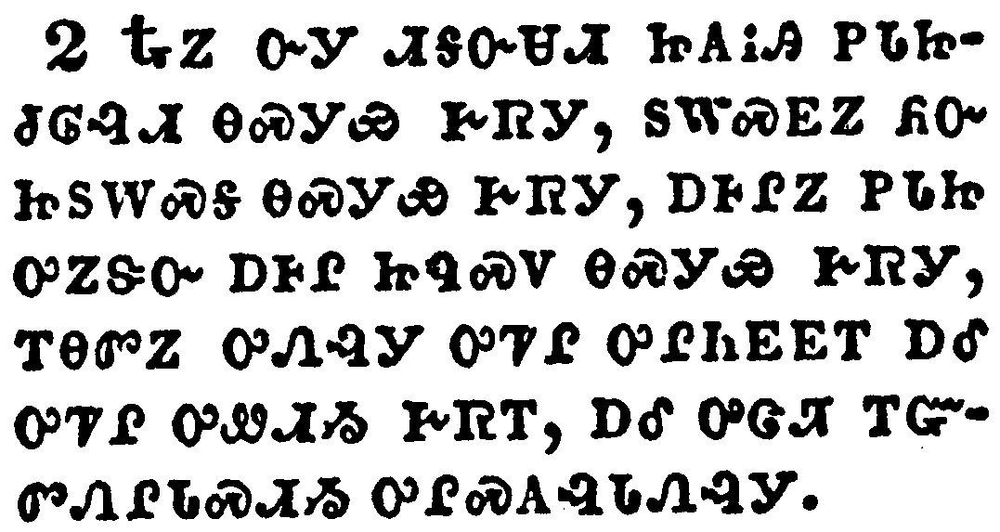

+++
draft=false
date = 2014-12-18T21:11:07Z
title = "Revelation - Chapter 13 - Cherokee New Testament"
weight = 1418955067

[taxonomies]

authors = ["Timothy Legg"]
categories = []
tags = []

[extra]
+++

<table>
<tbody>
<tr class="odd">
<td></td>
</tr>
<tr class="even">
<td>And I stood upon the sand of the sea, and saw a beast rise up out of the sea, having seven heads and ten horns, and upon his horns ten crowns, and upon his heads the name of blasphemy.</td>
</tr>
<tr class="odd">
<td>ᎠᎺᏉᎯᏃ ᎤᎶᏗ ᏃᏳᎯ ᎨᏒ ᎥᏆᎴᏔᏅᎩ, ᎠᎴ ᏅᎩ ᏗᎦᏅᏌᏗ ᏥᎪᎥᎩ ᎠᎺᏉᎯ ᏓᏳᏚᎩᏒᎩ, ᎦᎵᏉᎩ, ᏓᏍᎫᏓᏛᎩ ᎠᎴ ᎠᏍᎪᎯ ᏚᎷᎬᎩ, ᏚᎷᎬᏃ ᎠᏍᎪᎯ ᏚᎵᏍᏚᎸᎩ, ᏓᏍᎫᏓᏛᏃ ᎤᏁᎳᏅᎯ ᏚᏙᎥ ᎠᏐᏢᎢᏍᏙᏗ ᎨᏒ ᎪᏪᎸᎩ.</td>
</tr>
<tr class="even">
<td>A-me-quo-hi-no u-lo-di no-yu-hi ge-sv v-qua-le-ta-nv-gi, a-le nv-gi di-ga-nv-sa-di tsi-go-v-gi a-me-quo-hi da-yu-du-gi-sv-gi, ga-li-quo-gi, da-s-gu-da-dv-gi a-le a-s-go-hi du-lu-gv-gi, du-lu-gv-no a-s-go-hi du-li-s-du-lv-gi, da-s-gu-da-dv-no u-ne-la-nv-hi du-do-v a-so-tlv-i-s-do-di ge-sv go-we-lv-gi.</td>
</tr>
</tbody>
</table>

<table>
<tbody>
<tr class="odd">
<td></td>
</tr>
<tr class="even">
<td>And the beast which I saw was like unto a leopard, and his feet were as the feet of a bear, and his mouth as the mouth of a lion: and the dragon gave him his power, and his seat, and great authority.</td>
</tr>
<tr class="odd">
<td>ᎿᎭᏃ ᏅᎩ ᏗᎦᏅᏌᏗ ᏥᎪᎥᎯ ᏢᏓᏥᏧᎶᎸᏗ ᎾᏍᎩᏯ ᎨᏒᎩ, ᏚᎳᏍᎬᏃ ᏲᏅᏥᏚᎳᏍᎦ ᎾᏍᎩᏯ ᎨᏒᎩ, ᎠᎰᎵᏃ ᏢᏓᏥ ᎤᏃᏕᏅ ᎠᎰᎵ ᏥᏄᏍᏙ ᎾᏍᎩᏯ ᎨᏒᎩ, ᎢᎾᏛᏃ ᎤᏁᎸᎩ ᎤᏤᎵ ᎤᎵᏂᎬᎬᎢ ᎠᎴ ᎤᏤᎵ ᎤᏪᏗᏱ ᎨᏒᎢ, ᎠᎴ ᎤᏣᏗ ᎢᏳᏛᏁᎵᏓᏍᏗᏱ ᎤᎵᏍᎪᎸᏓᏁᎸᎩ.</td>
</tr>
<tr class="even">
<td>Hna-no nv-gi di-ga-nv-sa-di tsi-go-v-hi tlv-da-tsi-tsu-lo-lv-di na-s-gi-ya ge-sv-gi, du-la-s-gv-no yo-nv-tsi-du-la-s-ga na-s-gi-ya ge-sv-gi, a-ho-li-no tlv-da-tsi u-no-de-nv a-ho-li tsi-nu-s-do na-s-gi-ya ge-sv-gi, i-na-dv-no u-ne-lv-gi u-tse-li u-li-ni-gv-gv-i a-le u-tse-li u-we-di-yi ge-sv-i, a-le u-tsa-di i-yu-dv-ne-li-da-s-di-yi u-li-s-go-lv-da-ne-lv-gi.</td>
</tr>
</tbody>
</table>

<table>
<tbody>
<tr class="odd">
<td></td>
</tr>
<tr class="even">
<td>And I saw one of his heads as it were wounded to death; and his deadly wound was healed: and all the world wondered after the beast.</td>
</tr>
<tr class="odd">
<td>ᏌᏉᏃ ᎠᏍᎫᏓᏛ ᎠᎩᎪᎲᎩ ᎬᏩᏲᎱᎯᏍᏗ ᎢᏴᏛ ᏣᏥᏐᏅᏃ ᏓᏤᎸᎩ; ᎠᎴ ᎾᏍᎩ ᎬᏩᏲᎱᎯᏍᏗ ᎢᏴᏛ ᎠᏥᏐᏅᏅ ᎤᏗᏩᏒᎯ ᎨᏒᎩ; ᎠᎴ ᏂᎬᎾᏛ ᎡᎶᎯ [ᎠᏁᎯ] ᎠᏂᏍᏆᏂᎪᏍᎬᎩ [ᎠᎴ] ᎠᏂᏍᏓᏩᏗᏒᎩ ᎾᏍᎩ Ꮎ ᏅᎩ-ᏗᎦᏅᏌᏗ.</td>
</tr>
<tr class="even">
<td>Sa-quo-no a-s-gu-da-dv a-gi-go-hv-gi gv-wa-yo-hu-hi-s-di i-yv-dv tsa-tsi-so-nv-no da-tse-lv-gi; a-le na-s-gi gv-wa-yo-hu-hi-s-di i-yv-dv a-tsi-so-nv-nv u-di-wa-sv-hi ge-sv-gi; a-le ni-gv-na-dv e-lo-hi [a-ne-hi] a-ni-s-qua-ni-go-s-gv-gi [a-le] a-ni-s-da-wa-di-sv-gi na-s-gi na nv-gi--di-ga-nv-sa-di.</td>
</tr>
</tbody>
</table>

<table>
<tbody>
<tr class="odd">
<td></td>
</tr>
<tr class="even">
<td>And they worshipped the dragon which gave power unto the beast: and they worshipped the beast, saying, Who is like unto the beast? who is able to make war with him?</td>
</tr>
<tr class="odd">
<td>ᎠᎴ ᎤᎾᏓᏙᎵᏍᏓᏁᎸᎩ ᎢᎾᏛ ᎾᏍᎩ ᏅᎩ-ᏓᎦᏅᏌᏗ ᎤᎵᏂᎬᎬ ᎤᏁᎸᎯ ᎨᏒᎢ; ᎠᎴ ᎾᏍᎩ ᏅᎩ-ᏗᎦᏅᏌᏗ ᎤᎾᏓᏙᎵᏍᏓᏁᎸᎩ, ᎯᎠ ᎾᏂᏪᏍᎬᎩ, ᎦᎪ ᏅᎩ-ᏗᎦᏅᏌᏗ ᏄᏍᏛ ᎾᏍᎩᏯ ᏄᏍᏗ? ᎦᎪ ᏰᎵ ᎾᏍᎩ ᏓᎿᎭᏩ ᏱᎾᏅᎦ?</td>
</tr>
<tr class="even">
<td>A-le u-na-da-do-li-s-da-ne-lv-gi i-na-dv na-s-gi nv-gi--da-ga-nv-sa-di u-li-ni-gv-gv u-ne-lv-hi ge-sv-i; a-le na-s-gi nv-gi--di-ga-nv-sa-di u-na-da-do-li-s-da-ne-lv-gi, hi-a na-ni-we-s-gv-gi, Ga-go nv-gi--di-ga-nv-sa-di nu-s-dv na-s-gi-ya nu-s-di? ga-go ye-li na-s-gi da-hna-wa yi-na-nv-ga?</td>
</tr>
</tbody>
</table>

<table>
<tbody>
<tr class="odd">
<td></td>
</tr>
<tr class="even">
<td>And there was given unto him a mouth speaking great things and blasphemies; and power was given unto him to continue forty and two months.</td>
</tr>
<tr class="odd">
<td>ᎠᎴ ᎠᎰᎵ ᎠᏥᏁᎸᎩ ᎾᏍᎩ ᎬᏗᏍᎬ ᎤᏣᏘ ᎠᏢᏈᏍᏗ ᎨᏒ ᎦᏬᏂᏍᎬᎩ ᎠᎴ ᎠᏐᏢᎢᏍᏗᏍᎬᎩ; ᎠᎴ ᎠᎦᎵᏍᎪᎸᏓᏁᎸᎩ ᏅᎦᏍᎪᎯ ᏔᎵᎦᎵ ᎢᏯᏅᏙ ᎤᏕᏗᏱ.</td>
</tr>
<tr class="even">
<td>A-le a-ho-li a-tsi-ne-lv-gi na-s-gi gv-di-s-gv u-tsa-ti a-tlv-qui-s-di ge-sv ga-wo-ni-s-gv-gi a-le a-so-tlv-i-s-di-s-gv-gi; a-le a-ga-li-s-go-lv-da-ne-lv-gi nv-ga-s-go-hi ta-li-ga-li i-ya-nv-do u-de-di-yi.</td>
</tr>
</tbody>
</table>

<table>
<tbody>
<tr class="odd">
<td></td>
</tr>
<tr class="even">
<td>And he opened his mouth in blasphemy against God, to blaspheme his name, and his tabernacle, and them that dwell in heaven.</td>
</tr>
<tr class="odd">
<td>ᎠᎴ ᎠᎰᎵ ᎤᏍᏚᎢᏒᎩ ᎤᏁᎳᏅᎯ ᎠᏐᏢᎢᏍᏗᏍᎬᎢ, ᏚᏙᎥ ᎦᎬᏩᏐᏢᏙᏗᏱ, ᎠᎴ ᎾᏍᎩ ᎤᏤᎵ ᎦᎵᏦᏛᎢ, ᎠᎴ ᎾᏍᎩ Ꮎ ᎦᎸᎳᏗ ᎠᏁᎯ.</td>
</tr>
<tr class="even">
<td>A-le a-ho-li u-s-du-i-sv-gi U-ne-la-nv-hi a-so-tlv-i-s-di-s-gv-i, du-do-v ga-gv-wa-so-tlv-do-di-yi, a-le na-s-gi u-tse-li ga-li-tso-dv-i, a-le na-s-gi na ga-lv-la-di a-ne-hi.</td>
</tr>
</tbody>
</table>

<table>
<tbody>
<tr class="odd">
<td></td>
</tr>
<tr class="even">
<td>And it was given unto him to make war with the saints, and to overcome them: and power was given him over all kindreds, and tongues, and nations.</td>
</tr>
<tr class="odd">
<td>ᎠᎴ ᎾᏍᎩ ᎠᏥᏁᎸᎩ ᎤᎾᏓᏅᏘ ᏓᎿᎭᏩ ᎢᏳᏅᏁᏗᏱ, ᎠᎴ ᎾᏍᎩ ᏧᏎᎪᎩᏍᏗᏱ; ᎠᎴ ᎠᏥᏁᎸᎩ ᎾᏍᎩ ᎢᏳᏩᏂᏐᏗᏱ ᏗᎬᏩᏁᎶᏙᏗᏱ ᎾᏂᎥ ᏓᏂᎳᏍᏓᎳᏩᏗᏒᎢ, ᎠᎴ ᏧᏓᎴᏅᏛ ᏗᏂᏬᏂᏍᎩ ᎨᏒᎢ, ᎠᎴ ᎤᎾᏓᏤᎵᏛ ᏴᏫ ᏓᏁᏩᏗᏒᎢ.</td>
</tr>
<tr class="even">
<td>A-le na-s-gi a-tsi-ne-lv-gi u-na-da-nv-ti da-hna-wa i-yu-nv-ne-di-yi, a-le na-s-gi tsu-se-go-gi-s-di-yi; a-le a-tsi-ne-lv-gi na-s-gi i-yu-wa-ni-so-di-yi di-gv-wa-ne-lo-do-di-yi na-ni-v da-ni-la-s-da-la-wa-di-sv-i, a-le tsu-da-le-nv-dv di-ni-wo-ni-s-gi ge-sv-i, a-le u-na-da-tse-li-dv yv-wi da-ne-wa-di-sv-i.</td>
</tr>
</tbody>
</table>

<table>
<tbody>
<tr class="odd">
<td></td>
</tr>
<tr class="even">
<td>And all that dwell upon the earth shall worship him, whose names are not written in the book of life of the Lamb slain from the foundation of the world.</td>
</tr>
<tr class="odd">
<td>ᎠᎴ ᎾᏂᎥ ᎡᎶᎯ ᏓᏁᏩᏗᏒ ᏓᎬᏩᏓᏙᎵᏍᏓᏁᎵ, ᎾᏍᎩ ᏚᎾᏙᎥ ᏂᏗᎪᏪᎸᎾ ᎬᏂᏛ ᎪᏪᎵᎯ ᎾᏍᎩ ᎤᏃᏕᎾ ᎠᎩᎾ ᎤᏤᎵᎦ, ᎾᏍᎩ [ᎤᏃᏕᎾ ᎠᎩᎾ] ᎡᎶᎯ ᏧᏙᏢᏅ ᏅᏓᎬᏩᏓᎴᏅᏛ ᎠᏥᎸᎯ ᏥᎨᏎᎢ.</td>
</tr>
<tr class="even">
<td>A-le na-ni-v e-lo-hi da-ne-wa-di-sv da-gv-wa-da-do-li-s-da-ne-li, na-s-gi du-na-do-v ni-di-go-we-lv-na gv-ni-dv go-we-li-hi na-s-gi U-no-de-na a-gi-na u-tse-li-ga, na-s-gi [U-no-de-na a-gi-na] e-lo-hi tsu-do-tlv-nv nv-da-gv-wa-da-le-nv-dv a-tsi-lv-hi tsi-ge-se-i.</td>
</tr>
</tbody>
</table>

<table>
<tbody>
<tr class="odd">
<td></td>
</tr>
<tr class="even">
<td>If any man have an ear, let him hear.</td>
</tr>
<tr class="odd">
<td>ᎩᎶ ᎦᎵᎷᎨᏍᏗ ᎾᏍᎩ ᏩᏛᎬᎦ.</td>
</tr>
<tr class="even">
<td>Gi-lo ga-li-lu-ge-s-di na-s-gi wa-dv-gv-ga.</td>
</tr>
</tbody>
</table>

<table>
<tbody>
<tr class="odd">
<td></td>
</tr>
<tr class="even">
<td>He that leadeth into captivity shall go into captivity: he that killeth with the sword must be killed with the sword. Here is the patience and the faith of the saints.</td>
</tr>
<tr class="odd">
<td>ᎩᎶ ᎠᏂᏴᎩ ᏓᏘᎾᏫᏗᏍᎨᏍᏗ ᎾᏍᎩ ᎠᏴᎩ ᎠᎦᏘᏁᏫᏛᏗ ᎨᏎᏍᏗ; ᎩᎶ ᎭᏰᎳᏍᏗ-ᎦᏅᎯᏛ ᎠᏓᎯᏍᏗᏍᎨᏍᏗ ᎾᏍᎩ ᎠᏎ ᎭᏰᎳᏍᏗ-ᎦᏅᎯᏛ ᎬᏗ ᎠᏥᎢᏍᏗ ᎨᏎᏍᏗ. ᎠᏂ ᎾᏍᎩ ᏗᏅᏂᏗᏳ ᎨᏒ ᎠᎴ ᎤᏃᎯᏳᏒ ᎤᎾᏓᏅᏘ [ᎬᏂᎨᏒ ᏂᎦᎵᏍᏗᎭ.]</td>
</tr>
<tr class="even">
<td>Gi-lo a-ni-yv-gi da-ti-na-wi-di-s-ge-s-di na-s-gi a-yv-gi a-ga-ti-ne-wi-dv-di ge-se-s-di; gi-lo ha-ye-la-s-di--ga-nv-hi-dv a-da-hi-s-di-s-ge-s-di na-s-gi a-se ha-ye-la-s-di--ga-nv-hi-dv gv-di a-tsi-i-s-di ge-se-s-di. A-ni na-s-gi di-nv-ni-di-yu ge-sv a-le u-no-hi-yu-sv u-na-da-nv-ti [gv-ni-ge-sv ni-ga-li-s-di-ha.]</td>
</tr>
</tbody>
</table>

<table>
<tbody>
<tr class="odd">
<td></td>
</tr>
<tr class="even">
<td>And I beheld another beast coming up out of the earth; and he had two horns like a lamb, and he spake as a dragon.</td>
</tr>
<tr class="odd">
<td>ᎠᎴ ᏅᏩᏓᎴ ᏅᎩ-ᏗᎦᏅᏌᏗ ᎥᏥᎪᎥᎩ ᎦᏙᎯ ᏓᏳᏄᎪᏥᏗᏒᎩ; ᎠᎴ ᏔᎵ ᏚᎷᎬᎩ ᎤᏃᏕᎾ ᎠᎩᎾ ᏥᏚᎷᎪ ᎾᏍᎩᏯᎢ, ᎠᎴ ᎢᎾᏛ ᎦᏬᏂᏍᎬ ᎾᏍᎩᏯ ᎦᏬᏂᏍᎬᎩ.</td>
</tr>
<tr class="even">
<td>A-le nv-wa-da-le nv-gi--di-ga-nv-sa-di v-tsi-go-v-gi ga-do-hi da-yu-nu-go-tsi-di-sv-gi; a-le ta-li du-lu-gv-gi u-no-de-na a-gi-na tsi-du-lu-go na-s-gi-ya-i, a-le i-na-dv ga-wo-ni-s-gv na-s-gi-ya ga-wo-ni-s-gv-gi.</td>
</tr>
</tbody>
</table>

<table>
<tbody>
<tr class="odd">
<td></td>
</tr>
<tr class="even">
<td>And he exerciseth all the power of the first beast before him, and causeth the earth and them which dwell therein to worship the first beast, whose deadly wound was healed.</td>
</tr>
<tr class="odd">
<td>ᎠᎴ ᎢᎬᏱ ᎤᎾᏄᎪᏨᎯ ᏅᎩ-ᏗᎦᏅᏌᏗ ᎾᏍᎩᏯ ᏄᎵᏂᎬᎬ ᏄᎵᏂᎬᎬᎩ, ᎠᎴ ᎡᎶᎯ ᎠᎴ ᎾᏍᎩ ᎾᎿᎭᎠᏁᎯ ᎤᎾᏓᏙᎵᏍᏓᏁᏗᏱ ᏂᏕᎬᏁᎲᎩ ᎢᎬᏱ ᎤᎾᏄᎪᏨᎯ ᏅᎩ-ᏗᎦᏅᏌᏗ, ᎾᏍᎩ ᎬᏩᏲᎱᎯᏍᏗ ᎨᏒ ᎢᏴᏛ ᎠᏥᏐᏅᏅ ᎤᏗᏩᏒᎯ.</td>
</tr>
<tr class="even">
<td>A-le i-gv-yi u-na-nu-go-tsv-hi nv-gi--di-ga-nv-sa-di na-s-gi-ya nu-li-ni-gv-gv nu-li-ni-gv-gv-gi, a-le e-lo-hi a-le na-s-gi na-hna a-ne-hi u-na-da-do-li-s-da-ne-di-yi ni-de-gv-ne-hv-gi i-gv-yi u-na-nu-go-tsv-hi nv-gi--di-ga-nv-sa-di, na-s-gi gv-wa-yo-hu-hi-s-di ge-sv i-yv-dv a-tsi-so-nv-nv u-di-wa-sv-hi.</td>
</tr>
</tbody>
</table>

<table>
<tbody>
<tr class="odd">
<td></td>
</tr>
<tr class="even">
<td>And he doeth great wonders, so that he maketh fire come down from heaven on the earth in the sight of men,</td>
</tr>
<tr class="odd">
<td>ᎠᎴ ᎤᏣᏘ ᎤᏍᏆᏂᎪᏗ ᏕᎤᎸᏫᏍᏓᏁᎭ, ᎾᏍᎩ ᎠᏥᎸ ᎦᎸᎳᏗ ᏅᏓᏳᎶᎯᏍᏗᏱ ᎠᏂᏃ ᎡᎶᎯ ᎤᏬᏥᎯᏍᏗᏱ ᏂᎬᏁᎭ ᏴᏫ ᎠᏥᎦᏔᎲᎢ,</td>
</tr>
<tr class="even">
<td>A-le u-tsa-ti u-s-qua-ni-go-di de-u-lv-wi-s-da-ne-ha, na-s-gi a-tsi-lv ga-lv-la-di nv-da-yu-lo-hi-s-di-yi a-ni-no e-lo-hi u-wo-tsi-hi-s-di-yi ni-gv-ne-ha yv-wi a-tsi-ga-ta-hv-i,</td>
</tr>
</tbody>
</table>

<table>
<tbody>
<tr class="odd">
<td></td>
</tr>
<tr class="even">
<td>And deceiveth them that dwell on the earth by the means of those miracles which he had power to do in the sight of the beast; saying to them that dwell on the earth, that they should make an image to the beast, which had the wound by a sword, and did live.</td>
</tr>
<tr class="odd">
<td>ᎠᎴ ᎡᎶᎯ ᎠᏁᎯ ᏕᎦᎶᏄᎮᎭ ᎬᏗᏍᎬ ᎤᏍᏆᏂᎪᏗ ᏗᎬᏩᎸᏫᏍᏓᏁᏗ ᎨᏒ ᎠᎦᏔᎲ ᏅᎩ-ᏗᎦᏅᏌᏗ; ᎯᎠ ᏂᏕᎦᏪᏎᎭ ᎾᏍᎩ Ꮎ ᎡᎶᎯ ᎠᏁᎯ, ᎾᏍᎩ ᏅᎩ-ᏗᎦᏅᏌᏗ ᏗᏟᎶᏍᏔᏅᎯ ᎢᏦᏢᎾ, ᎾᏍᎩ ᎭᏰᎳᏍᏗ-ᎦᏅᎯᏛ ᎬᏗ ᎠᏥᏐᏅᏅᎯ ᎠᎴ ᏧᏛᏂᏛᎩ.</td>
</tr>
<tr class="even">
<td>A-le e-lo-hi a-ne-hi de-ga-lo-nu-he-ha gv-di-s-gv u-s-qua-ni-go-di di-gv-wa-lv-wi-s-da-ne-di ge-sv a-ga-ta-hv nv-gi--di-ga-nv-sa-di; hi-a ni-de-ga-we-se-ha na-s-gi na e-lo-hi a-ne-hi, na-s-gi nv-gi--di-ga-nv-sa-di di-tli-lo-s-ta-nv-hi i-tso-tlv-na, na-s-gi ha-ye-la-s-di--ga-nv-hi-dv gv-di a-tsi-so-nv-nv-hi a-le tsu-dv-ni-dv-gi.</td>
</tr>
</tbody>
</table>

<table>
<tbody>
<tr class="odd">
<td></td>
</tr>
<tr class="even">
<td>And he had power to give life unto the image of the beast, that the image of the beast should both speak, and cause that as many as would not worship the image of the beast should be killed.</td>
</tr>
<tr class="odd">
<td>ᎠᎴ ᎤᎲᎩ ᎬᏃᏛ ᎢᏳᏩᏁᏗᏱ ᎾᏍᎩ Ꮎ ᏅᎩ-ᏗᎦᏅᏌᏗ ᏣᎦᏟᎶᏍᏔᏅᎯ, ᎾᏍᎩ ᎬᏩᏬᏂᎯᏍᏗ ᎢᏳᎵᏍᏙᏗᏱ ᎾᏍᎩ Ꮎ ᏅᎩ-ᏗᎦᏅᏌᏗ ᏣᎦᏟᎶᏍᏔᏅᎯ, ᎠᎴ ᎾᏍᎩ ᎢᏳᏩᏂᏐᏗᏱ ᏗᎨᏥᎢᏍᏗᏱ ᎾᏂᎥ ᎾᎾᏓᏙᎵᏍᏓᏁᎲᎾ ᎾᏍᎩ Ꮎ ᏅᎩᏗᎦᏅᏌᏗ ᏣᎦᏟᎶᏍᏔᏅᎯ.</td>
</tr>
<tr class="even">
<td>A-le u-hv-gi gv-no-dv i-yu-wa-ne-di-yi na-s-gi na nv-gi--di-ga-nv-sa-di tsa-ga-tli-lo-s-ta-nv-hi, na-s-gi gv-wa-wo-ni-hi-s-di i-yu-li-s-do-di-yi na-s-gi na nv-gi--di-ga-nv-sa-di tsa-ga-tli-lo-s-ta-nv-hi, a-le na-s-gi i-yu-wa-ni-so-di-yi di-ge-tsi-i-s-di-yi na-ni-v na-na-da-do-li-s-da-ne-hv-na na-s-gi na nv-gi-di-ga-nv-sa-di tsa-ga-tli-lo-s-ta-nv-hi.</td>
</tr>
</tbody>
</table>

<table>
<tbody>
<tr class="odd">
<td></td>
</tr>
<tr class="even">
<td>And he causeth all, both small and great, rich and poor, free and bond, to receive a mark in their right hand, or in their foreheads:</td>
</tr>
<tr class="odd">
<td>ᎠᎴ ᎾᏍᎩ ᏄᏩᏂᏌᏅᎩ ᏂᎦᏗᏳ ᏧᎾᏍᏗᏱ ᎠᎴ ᏧᎾᏛᎾ, ᏧᏁᎿᎭᎢ ᎠᎴ ᎤᏲ ᎢᏳᎾᏛᎿᎭᏕᎩ, ᏂᏗᎨᏥᎾᏝᎥᎾ ᎠᎴ ᏗᎨᏥᎾᏝᎢ, ᏗᎨᎪᏪᎶᏗᏱ ᏗᏂᎦᏘᏏᏗᏢ ᏧᏃᏰᏂ, ᎠᎴ ᏗᏂᎬᏓᎨᏂ;</td>
</tr>
<tr class="even">
<td>A-le na-s-gi nu-wa-ni-sa-nv-gi ni-ga-di-yu tsu-na-s-di-yi a-le tsu-na-dv-na, tsu-ne-hna-i a-le u-yo i-yu-na-dv-hna-de-gi, ni-di-ge-tsi-na-tla-v-na a-le di-ge-tsi-na-tla-i, di-ge-go-we-lo-di-yi di-ni-ga-ti-si-di-tlv tsu-no-ye-ni, a-le di-ni-gv-da-ge-ni;</td>
</tr>
</tbody>
</table>

<table>
<tbody>
<tr class="odd">
<td></td>
</tr>
<tr class="even">
<td>And that no man might buy or sell, save he that had the mark, or the name of the beast, or the number of his name.</td>
</tr>
<tr class="odd">
<td>ᎠᎴ ᎾᏍᎩ ᎩᎶ ᎬᏩᏩᎯᏍᏗ ᏂᎨᏒᎾ ᎠᎴ ᎬᏩᎾᏗᏅᏗ ᏂᎨᏒᎾ ᎢᏳᎵᏍᏙᏗᏱ, ᎾᏍᎩ Ꮎ ᎤᏩᏒ ᎠᎪᏪᎵ, ᎠᎴ ᏚᏙᎥᏉ ᏅᎩ-ᏗᎦᏅᏌᏗ ᎠᎪᏪᎶᏔᏅᎯ, ᎠᎴ ᏚᏙᎥ ᎢᎦᎢ ᎠᏎᏍᏗᏱ ᎨᏒ ᎠᎪᏪᎶᏔᏅᎯ.</td>
</tr>
<tr class="even">
<td>A-le na-s-gi gi-lo gv-wa-wa-hi-s-di ni-ge-sv-na a-le gv-wa-na-di-nv-di ni-ge-sv-na i-yu-li-s-do-di-yi, na-s-gi na u-wa-sv a-go-we-li, a-le du-do-v-quo nv-gi--di-ga-nv-sa-di a-go-we-lo-ta-nv-hi, a-le du-do-v i-ga-i a-se-s-di-yi ge-sv a-go-we-lo-ta-nv-hi.</td>
</tr>
</tbody>
</table>

<table>
<tbody>
<tr class="odd">
<td></td>
</tr>
<tr class="even">
<td>Here is wisdom. Let him that hath understanding count the number of the beast: for it is the number of a man; and his number is Six hundred threescore and six.</td>
</tr>
<tr class="odd">
<td>ᎠᏂ ᎠᎦᏙᎥᎯᏍᏗ ᎨᏒ ᎪᎱᏍᏗ ᎢᏛᏓ. ᎩᎶ ᎤᏬᎵᏣᏘ ᎨᏎᏍᏗ ᏩᏎᎦ ᎢᎦᎢ ᎨᏒ ᎠᎦᏎᏍᏗᏱ ᏅᎩ-ᏗᎦᏅᏎᏗ; ᏴᏫᏰᏃ ᎤᏎᏍᏗ ᎨᏒ ᎤᎬᏩᎳ; ᎠᎴ ᎾᏍᎩ ᎠᎦᏎᏍᏗ ᎨᏒ ᎯᎠ ᏂᎦᎥ, ᏑᏓᎵᏧᏈ ᏑᏓᎳᏍᎪᎯ ᏑᏓᎵᎦᎵ.</td>
</tr>
<tr class="even">
<td>A-ni a-ga-do-v-hi-s-di ge-sv go-hu-s-di i-dv-da. Gi-lo u-wo-li-tsa-ti ge-se-s-di wa-se-ga i-ga-i ge-sv a-ga-se-s-di-yi nv-gi--di-ga-nv-se-di; yv-wi-ye-no u-se-s-di ge-sv u-gv-wa-la; a-le na-s-gi a-ga-se-s-di ge-sv hi-a ni-ga-v, Su-da-li-tsu-qui su-da-la-s-go-hi su-da-li-ga-li.</td>
</tr>
</tbody>
</table>

