+++
draft=false
date = 2014-12-18T21:11:07Z
title = "Revelation - Chapter 14 - Cherokee New Testament"
weight = 1418955067

[taxonomies]

authors = ["Timothy Legg"]
categories = []
tags = []

[extra]
+++

<table>
<tbody>
<tr class="odd">
<td><a href="271401.png">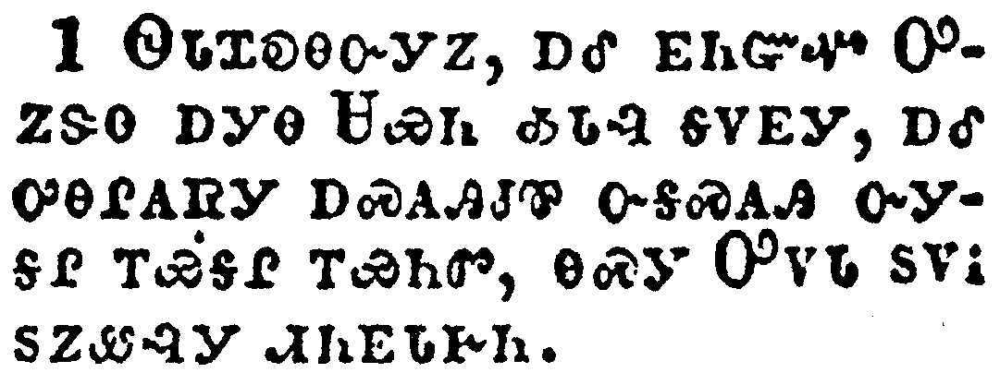</a></td>
</tr>
<tr class="even">
<td>And I looked, and, lo, a Lamb stood on the mount Sion, and with him an hundred forty and four thousand, having his Father's name written in their foreheads.</td>
</tr>
<tr class="odd">
<td>ᏫᏓᏆᎧᎾᏅᎩᏃ, ᎠᎴ ᎬᏂᏳᏉ ᎤᏃᏕᎾ ᎠᎩᎾ ᏌᏯᏂ ᎣᏓᎸ ᎦᏙᎬᎩ, ᎠᎴ ᎤᎾᎵᎪᏒᎩ ᎠᏍᎪᎯᏧᏈ ᏅᎦᏍᎪᎯ ᏅᎩᎦᎵ ᎢᏯᎦᎵ ᎢᏯᏂᏛ, ᎾᏍᎩ ᎤᏙᏓ ᏚᏙᎥ ᏚᏃᏪᎸᎩ ᏗᏂᎬᏓᎨᏂ.</td>
</tr>
<tr class="even">
<td>Wi-da-qua-ka-na-nv-gi-no, a-le gv-ni-yu-quo U-no-de-na a-gi-na Sa-ya-ni o-da-lv ga-do-gv-gi, a-le u-na-li-go-sv-gi a-s-go-hi-tsu-qui nv-ga-s-go-hi nv-gi-ga-li i-ya-ga-li i-ya-ni-dv, na-s-gi U-do-da du-do-v du-no-we-lv-gi di-ni-gv-da-ge-ni.</td>
</tr>
</tbody>
</table>

<table>
<tbody>
<tr class="odd">
<td><a href="271402.png">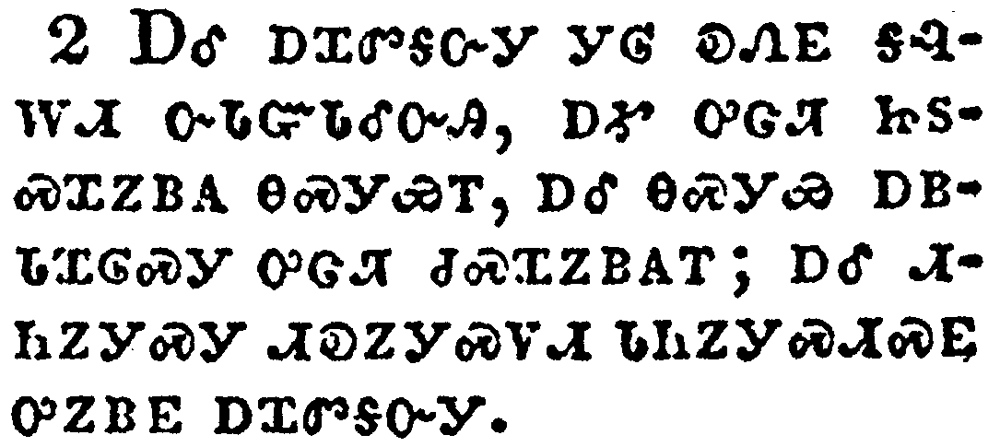</a></td>
</tr>
<tr class="even">
<td>And I heard a voice from heaven, as the voice of many waters, and as the voice of a great thunder: and I heard the voice of harpers harping with their harps:</td>
</tr>
<tr class="odd">
<td>ᎠᎴ ᎠᏆᏛᎦᏅᎩ ᎩᎶ ᎧᏁᎬ ᎦᎸᎳᏗ ᏅᏓᏳᏓᎴᏅᎯ, ᎠᎹ ᎤᏣᏘ ᏥᏚᏍᏆᏃᏴᎪ ᎾᏍᎩᏯᎢ, ᎠᎴ ᎾᏍᎩᏯ ᎠᏴᏓᏆᎶᏍᎩ ᎤᏣᏘ ᏧᏍᏆᏃᏴᎪᎢ; ᎠᎴ ᏗᏂᏃᎩᏍᎩ ᏗᎧᏃᎩᏍᏙᏗ ᏗᏂᏃᎩᏍᏗᏍᎬ ᎤᏃᏴᎬ ᎠᏆᏛᎦᏅᎩ.</td>
</tr>
<tr class="even">
<td>A-le a-qua-dv-ga-nv-gi gi-lo ka-ne-gv ga-lv-la-di nv-da-yu-da-le-nv-hi, a-ma u-tsa-ti tsi-du-s-qua-no-yv-go na-s-gi-ya-i, a-le na-s-gi-ya a-yv-da-qua-lo-s-gi u-tsa-ti tsu-s-qua-no-yv-go-i; a-le di-ni-no-gi-s-gi di-ka-no-gi-s-do-di di-ni-no-gi-s-di-s-gv u-no-yv-gv a-qua-dv-ga-nv-gi.</td>
</tr>
</tbody>
</table>

<table>
<tbody>
<tr class="odd">
<td><a href="271403.png">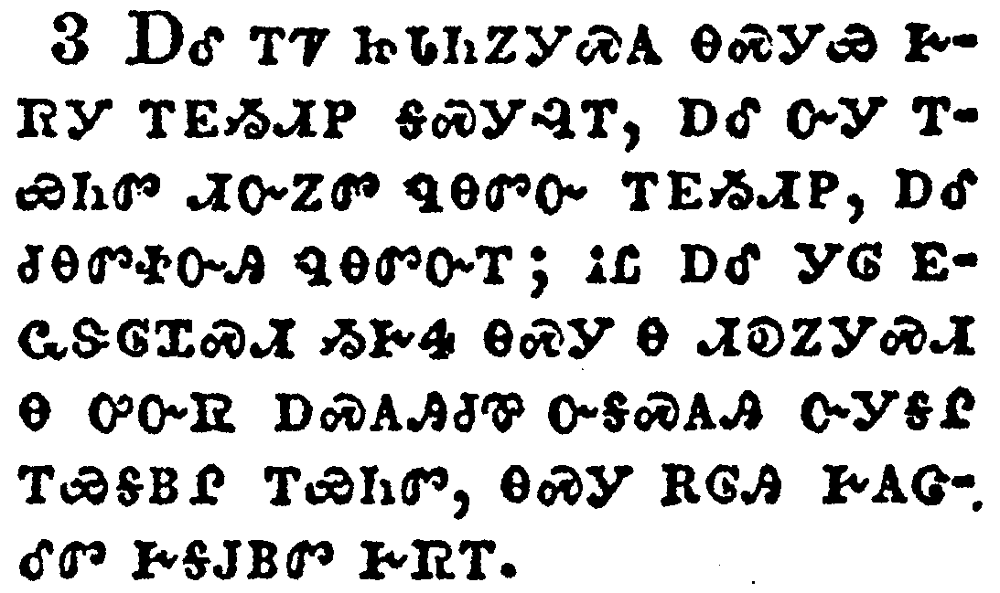</a></td>
</tr>
<tr class="even">
<td>And they sung as it were a new song before the throne, and before the four beasts, and the elders: and no man could learn that song but the hundred and forty and four thousand, which were redeemed from the earth.</td>
</tr>
<tr class="odd">
<td>ᎠᎴ ᎢᏤ ᏥᏓᏂᏃᎩᏍᎪ ᎾᏍᎩᏯ ᎨᏒᎩ ᎢᎬᏱᏗᏢ ᎦᏍᎩᎸᎢ, ᎠᎴ ᏅᎩ ᎢᏯᏂᏛ ᏗᏅᏃᏛ ᏄᎾᏛᏅ ᎢᎬᏱᏗᏢ, ᎠᎴ ᏧᎾᏛᏐᏅᎯ ᏄᎾᏛᏅᎢ; ᎥᏝ ᎠᎴ ᎩᎶ ᎬᏩᏕᎶᏆᏍᏗ ᏱᎨᏎ ᎾᏍᎩ Ꮎ ᏗᎧᏃᎩᏍᏗ Ꮎ ᎤᏅᏒ ᎠᏍᎪᎯᏧᏈ ᏅᎦᏍᎪᎯ ᏅᎩᎦᎵ ᎢᏯᎦᏴᎵ ᎢᏯᏂᏛ, ᎾᏍᎩ ᎡᎶᎯ ᎨᎪᏣᎴᏛ ᎨᎦᎫᏴᏛ ᎨᏒᎢ.</td>
</tr>
<tr class="even">
<td>A-le i-tse tsi-da-ni-no-gi-s-go na-s-gi-ya ge-sv-gi i-gv-yi-di-tlv ga-s-gi-lv-i, a-le nv-gi i-ya-ni-dv di-nv-no-dv nu-na-dv-nv i-gv-yi-di-tlv, a-le tsu-na-dv-so-nv-hi nu-na-dv-nv-i; v-tla a-le gi-lo gv-wa-de-lo-qua-s-di yi-ge-se na-s-gi na di-ka-no-gi-s-di na u-nv-sv a-s-go-hi-tsu-qui nv-ga-s-go-hi nv-gi-ga-li i-ya-ga-yv-li i-ya-ni-dv, na-s-gi e-lo-hi ge-go-tsa-le-dv ge-ga-gu-yv-dv ge-sv-i.</td>
</tr>
</tbody>
</table>

<table>
<tbody>
<tr class="odd">
<td><a href="271404.png">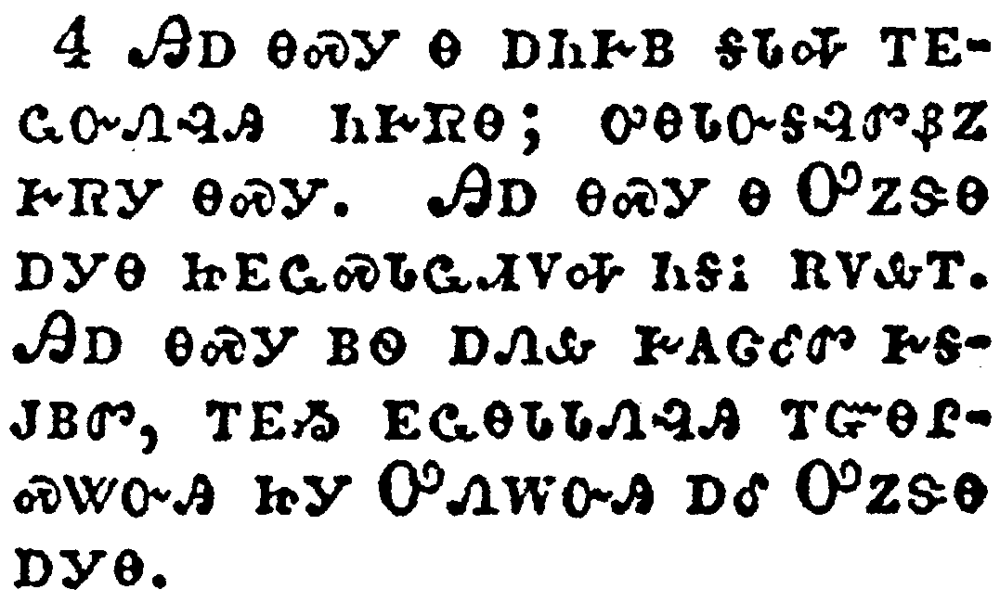</a></td>
</tr>
<tr class="even">
<td>These are they which were not defiled with women; for they are virgins. These are they which follow the Lamb whithersoever he goeth. These were redeemed from among men, being the firstfruits unto God and to the Lamb.</td>
</tr>
<tr class="odd">
<td>ᎯᎠ ᎾᏍᎩ Ꮎ ᎠᏂᎨᏴ ᎦᏓᎭ ᎢᎬᏩᏅᏁᎸᎯ ᏂᎨᏒᎾ; ᎤᎾᏓᏅᎦᎸᏛᏰᏃ ᎨᏒᎩ ᎾᏍᎩ. ᎯᎠ ᎾᏍᎩ Ꮎ ᎤᏃᏕᎾ ᎠᎩᎾ ᏥᎬᏩᏍᏓᏩᏗᏙᎭ ᏂᎦᎥ ᎡᏙᎲᎢ. ᎯᎠ ᎾᏍᎩ ᏴᏫ ᎠᏁᎲ ᎨᎪᏣᎴᏛ ᎨᎦᎫᏴᏛ, ᎢᎬᏱ ᎬᏩᎾᏓᏓᏁᎸᎯ ᎢᏳᎾᎵᏍᏔᏅᎯ ᏥᎩ ᎤᏁᎳᏅᎯ ᎠᎴ ᎤᏃᏕᎾ ᎠᎩᎾ.</td>
</tr>
<tr class="even">
<td>Hi-a na-s-gi na a-ni-ge-yv ga-da-ha i-gv-wa-nv-ne-lv-hi ni-ge-sv-na; u-na-da-nv-ga-lv-dv-ye-no ge-sv-gi na-s-gi. Hi-a na-s-gi na U-no-de-na a-gi-na tsi-gv-wa-s-da-wa-di-do-ha ni-ga-v e-do-hv-i. Hi-a na-s-gi yv-wi a-ne-hv ge-go-tsa-le-dv ge-ga-gu-yv-dv, i-gv-yi gv-wa-na-da-da-ne-lv-hi i-yu-na-li-s-ta-nv-hi tsi-gi U-ne-la-nv-hi a-le U-no-de-na a-gi-na.</td>
</tr>
</tbody>
</table>

<table>
<tbody>
<tr class="odd">
<td><a href="271405.png">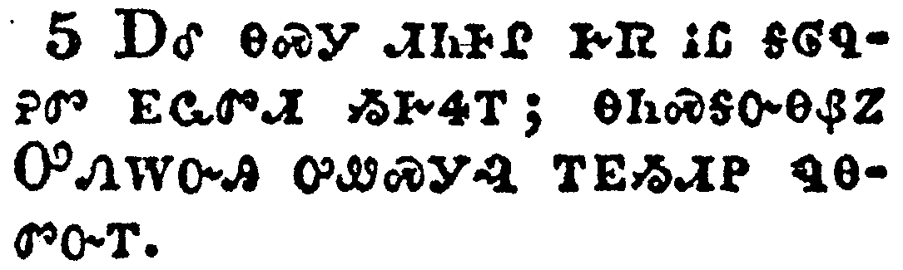</a></td>
</tr>
<tr class="even">
<td>And in their mouth was found no guile: for they are without fault before the throne of God.</td>
</tr>
<tr class="odd">
<td>ᎠᎴ ᎾᏍᎩ ᏗᏂᎰᎵ ᎨᏒ ᎥᏝ ᎦᎶᏄᎮᏛ ᎬᏩᏛᏗ ᏱᎨᏎᎢ; ᎾᏂᏍᎦᏅᎾᏰᏃ ᎤᏁᎳᏅᎯ ᎤᏪᏍᎩᎸ ᎢᎬᏱᏗᏢ ᏄᎾᏛᏅᎢ.</td>
</tr>
<tr class="even">
<td>A-le na-s-gi di-ni-ho-li ge-sv v-tla ga-lo-nu-he-dv gv-wa-dv-di yi-ge-se-i; na-ni-s-ga-nv-na-ye-no U-ne-la-nv-hi u-we-s-gi-lv i-gv-yi-di-tlv nu-na-dv-nv-i.</td>
</tr>
</tbody>
</table>

<table>
<tbody>
<tr class="odd">
<td><a href="271406.png">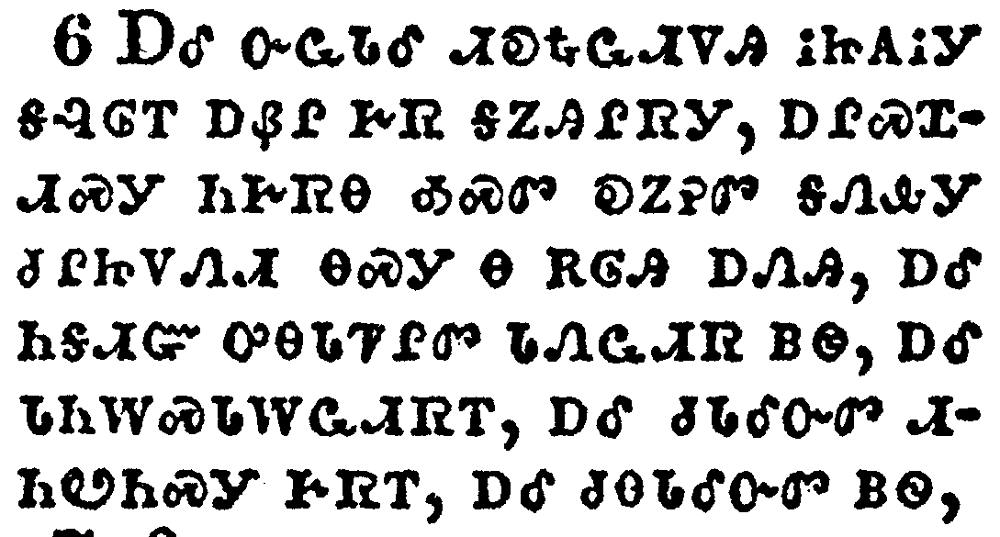</a></td>
</tr>
<tr class="even">
<td>And I saw another angel fly in the midst of heaven, having the everlasting gospel to preach unto them that dwell on the earth, and to every nation, and kindred, and tongue, and people,</td>
</tr>
<tr class="odd">
<td>ᎠᎴ ᏅᏩᏓᎴ ᏗᎧᎿᎭᏩᏗᏙᎯ ᎥᏥᎪᎥᎩ ᎦᎸᎶᎢ ᎠᏰᎵ ᎨᏒ ᎦᏃᎯᎵᏒᎩ, ᎠᎵᏍᏆᏗᏍᎩ ᏂᎨᏒᎾ ᎣᏍᏛ ᎧᏃᎮᏛ ᎦᏁᎲᎩ ᏧᎵᏥᏙᏁᏗ ᎾᏍᎩ Ꮎ Ꮎ ᎡᎶᎯ ᎠᏁᎯ, ᎠᎴ ᏂᎦᏗᏳ ᎤᎾᏓᏤᎵᏛ ᏓᏁᏩᏗᏒ ᏴᏫ, ᎠᎴ ᏗᏂᎳᏍᏓᎳᏩᏗᏒᎢ, ᎠᎴ ᏧᏓᎴᏅᏛ ᏗᏂᏬᏂᏍᎩ ᎨᏒᎢ, ᎠᎴ ᏧᎾᏓᎴᏅᏛ ᏴᏫ,</td>
</tr>
<tr class="even">
<td>A-le nv-wa-da-le di-ka-hna-wa-di-do-hi v-tsi-go-v-gi ga-lv-lo-i a-ye-li ge-sv ga-no-hi-li-sv-gi, a-li-s-qua-di-s-gi ni-ge-sv-na o-s-dv ka-no-he-dv ga-ne-hv-gi tsu-li-tsi-do-ne-di na-s-gi na na e-lo-hi a-ne-hi, a-le ni-ga-di-yu u-na-da-tse-li-dv da-ne-wa-di-sv yv-wi, a-le di-ni-la-s-da-la-wa-di-sv-i, a-le tsu-da-le-nv-dv di-ni-wo-ni-s-gi ge-sv-i, a-le tsu-na-da-le-nv-dv yv-wi,</td>
</tr>
</tbody>
</table>

<table>
<tbody>
<tr class="odd">
<td><a href="271407.png">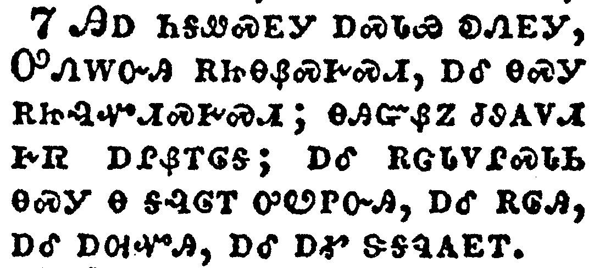</a></td>
</tr>
<tr class="even">
<td>Saying with a loud voice, Fear God, and give glory to him; for the hour of his judgment is come: and worship him that made heaven, and earth, and the sea, and the fountains of waters.</td>
</tr>
<tr class="odd">
<td>ᎯᎠ ᏂᎦᏪᏍᎬᎩ ᎠᏍᏓᏯ ᎧᏁᎬᎩ, ᎤᏁᎳᏅᎯ ᎡᏥᎾᏰᏍᎨᏍᏗ, ᎠᎴ ᎾᏍᎩ ᎡᏥᎸᏉᏗᏍᎨᏍᏗ; ᎾᎯᏳᏰᏃ ᏧᏭᎪᏙᏗ ᎨᏒ ᎠᎵᏰᎢᎶᎦ; ᎠᎴ ᎡᏣᏓᏙᎵᏍᏓᏏ ᎾᏍᎩ Ꮎ ᎦᎸᎶᎢ ᎤᏬᏢᏅᎯ, ᎠᎴ ᎡᎶᎯ, ᎠᎴ ᎠᎺᏉᎯ, ᎠᎴ ᎠᎹ ᏕᎦᏄᎪᎬᎢ.</td>
</tr>
<tr class="even">
<td>Hi-a ni-ga-we-s-gv-gi a-s-da-ya ka-ne-gv-gi, U-ne-la-nv-hi e-tsi-na-ye-s-ge-s-di, a-le na-s-gi e-tsi-lv-quo-di-s-ge-s-di; na-hi-yu-ye-no tsu-wu-go-do-di ge-sv a-li-ye-i-lo-ga; a-le e-tsa-da-do-li-s-da-si na-s-gi na ga-lv-lo-i u-wo-tlv-nv-hi, a-le e-lo-hi, a-le a-me-quo-hi, a-le a-ma de-ga-nu-go-gv-i.</td>
</tr>
</tbody>
</table>

<table>
<tbody>
<tr class="odd">
<td><a href="271408.png">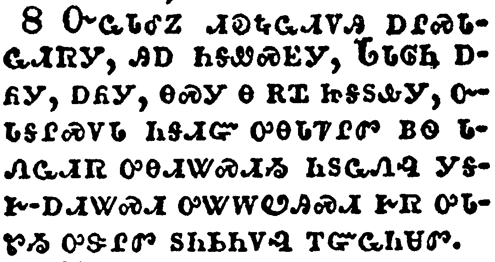</a></td>
</tr>
<tr class="even">
<td>And there followed another angel, saying, Babylon is fallen, is fallen, that great city, because she made all nations drink of the wine of the wrath of her fornication.</td>
</tr>
<tr class="odd">
<td>ᏅᏩᏓᎴᏃ ᏗᎧᎿᎭᏩᏗᏙᎯ ᎠᎵᏍᏓᏩᏗᏒᎩ, ᎯᎠ ᏂᎦᏪᏍᎬᎩ, ᏓᏓᎶᏂ ᎠᏲᎩ, ᎠᏲᎩ, ᎾᏍᎩ Ꮎ ᎡᏆ ᏥᎦᏚᎲᎩ, ᏅᏓᎦᎵᏍᏙᏓ ᏂᎦᏗᏳ ᎤᎾᏓᏤᎵᏛ ᏴᏫ ᏓᏁᏩᏗᏒ ᎤᎾᏗᏔᏍᏗᏱ ᏂᏚᏩᏁᎸ ᎩᎦᎨ-ᎠᏗᏔᏍᏗ ᎤᏔᎳᏬᎯᏍᏗ ᎨᏒ ᎤᏓᏑᏱ ᎤᏕᎵᏛ ᏚᏂᏏᏂᏙᎸ ᎢᏳᏩᏂᏌᏛ.</td>
</tr>
<tr class="even">
<td>Nv-wa-da-le-no di-ka-hna-wa-di-do-hi a-li-s-da-wa-di-sv-gi, hi-a ni-ga-we-s-gv-gi, Da-da-lo-ni a-yo-gi, a-yo-gi, na-s-gi na e-qua tsi-ga-du-hv-gi, nv-da-ga-li-s-do-da ni-ga-di-yu u-na-da-tse-li-dv yv-wi da-ne-wa-di-sv u-na-di-ta-s-di-yi ni-du-wa-ne-lv gi-ga-ge--a-di-ta-s-di u-ta-la-wo-hi-s-di ge-sv u-da-su-yi u-de-li-dv du-ni-si-ni-do-lv i-yu-wa-ni-sa-dv.</td>
</tr>
</tbody>
</table>

<table>
<tbody>
<tr class="odd">
<td><a href="271409.png">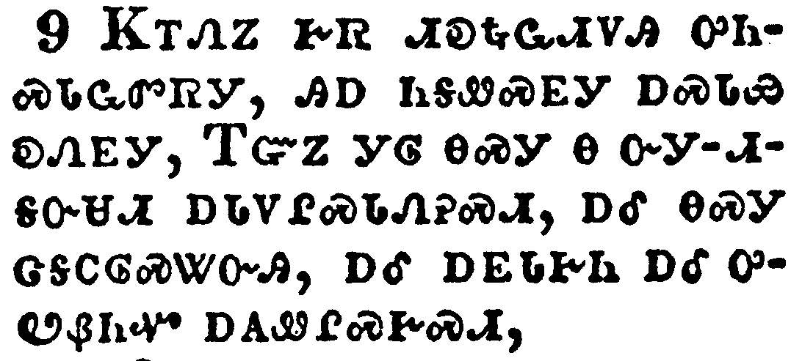</a></td>
</tr>
<tr class="even">
<td>And the third angel followed them, saying with a loud voice, If any man worship the beast and his image, and receive his mark in his forehead, or in his hand,</td>
</tr>
<tr class="odd">
<td>ᏦᎢᏁᏃ ᎨᏒ ᏗᎧᎿᎭᏩᏗᏙᎯ ᎤᏂᏍᏓᏩᏛᏒᎩ, ᎯᎠ ᏂᎦᏪᏍᎬᎩ ᎠᏍᏓᏯ ᎧᏁᎬᎩ, ᎢᏳᏃ ᎩᎶ ᎾᏍᎩ Ꮎ ᏅᎩ-ᏗᎦᏅᏌᏗ ᎠᏓᏙᎵᏍᏓᏁᎮᏍᏗ, ᎠᎴ ᎾᏍᎩ ᏣᎦᏟᎶᏍᏔᏅᎯ, ᎠᎴ ᎠᎬᏓᎨᏂ ᎠᎴ ᎤᏬᏰᏂᏉ ᎠᎪᏪᎵᏍᎨᏍᏗ,</td>
</tr>
<tr class="even">
<td>Tso-i-ne-no ge-sv di-ka-hna-wa-di-do-hi u-ni-s-da-wa-dv-sv-gi, hi-a ni-ga-we-s-gv-gi a-s-da-ya ka-ne-gv-gi, I-yu-no gi-lo na-s-gi na nv-gi--di-ga-nv-sa-di a-da-do-li-s-da-ne-he-s-di, a-le na-s-gi tsa-ga-tli-lo-s-ta-nv-hi, a-le a-gv-da-ge-ni a-le u-wo-ye-ni-quo a-go-we-li-s-ge-s-di,</td>
</tr>
</tbody>
</table>

<table>
<tbody>
<tr class="odd">
<td><a href="271410.png">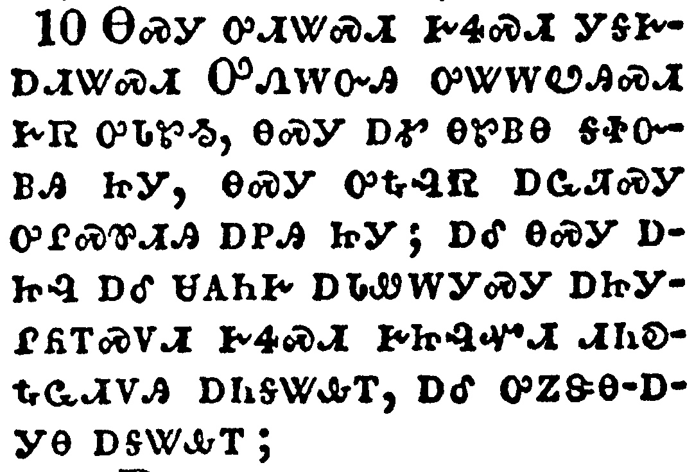</a></td>
</tr>
<tr class="even">
<td>The same shall drink of the wine of the wrath of God, which is poured out without mixture into the cup of his indignation; and he shall be tormented with fire and brimstone in the presence of the holy angels, and in the presence of the Lamb:</td>
</tr>
<tr class="odd">
<td>ᎾᏍᎩ ᎤᏗᏔᏍᏗ ᎨᏎᏍᏗ ᎨᎦᎨᎠᏗᏔᏍᏗ ᎤᏁᎳᏅᎯ ᎤᏔᎳᏬᎯᏍᏗ ᎨᏒ ᎤᏓᏑᏱ, ᎾᏍᎩ ᎠᎹ ᎾᏑᏴᎾ ᎦᏐᏅᏴᎯ ᏥᎩ, ᎾᏍᎩ ᎤᎿᎭᎸᏒ ᎠᏩᏘᏍᎩ ᎤᎵᏍᏈᏗᎯ ᎠᏢᎯ ᏥᎩ; ᎠᎴ ᎾᏍᎩ ᎠᏥᎸ ᎠᎴ ᏌᎪᏂᎨ ᎠᏓᏪᎳᎩᏍᎩ ᎠᏥᎩᎵᏲᎢᏍᏙᏗ ᎨᏎᏍᏗ ᎨᏥᎸᏉᏗ ᏗᏂᎧᎿᎭᏩᏗᏙᎯ ᎠᏂᎦᏔᎲᎢ, ᎠᎴ ᎤᏃᏕᎾ-ᎠᎩᎾ ᎠᎦᏔᎲᎢ;</td>
</tr>
<tr class="even">
<td>Na-s-gi u-di-ta-s-di ge-se-s-di ge-ga-ge-a-di-ta-s-di U-ne-la-nv-hi u-ta-la-wo-hi-s-di ge-sv u-da-su-yi, na-s-gi a-ma na-su-yv-na ga-so-nv-yv-hi tsi-gi, na-s-gi u-hna-lv-sv a-wa-ti-s-gi u-li-s-qui-di-hi a-tlv-hi tsi-gi; a-le na-s-gi a-tsi-lv a-le sa-go-ni-ge a-da-we-la-gi-s-gi a-tsi-gi-li-yo-i-s-do-di ge-se-s-di ge-tsi-lv-quo-di di-ni-ka-hna-wa-di-do-hi a-ni-ga-ta-hv-i, a-le u-no-de-na--a-gi-na a-ga-ta-hv-i;</td>
</tr>
</tbody>
</table>

<table>
<tbody>
<tr class="odd">
<td><a href="271411.png">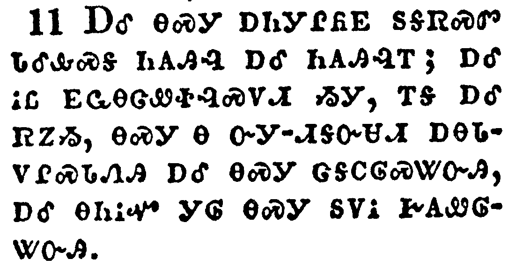</a></td>
</tr>
<tr class="even">
<td>And the smoke of their torment ascendeth up for ever and ever: and they have no rest day nor night, who worship the beast and his image, and whosoever receiveth the mark of his name.</td>
</tr>
<tr class="odd">
<td>ᎠᎴ ᎾᏍᎩ ᎠᏂᎩᎵᏲᎬ ᏚᎦᏒᏍᏛ ᏓᎴᎲᏍᎦ ᏂᎪᎯᎸ ᎠᎴ ᏂᎪᎯᎸᎢ; ᎠᎴ ᎥᏝ ᎬᏩᎾᏣᏪᏐᎸᏍᏙᏗ ᏱᎩ, ᎢᎦ ᎠᎴ ᏒᏃᏱ, ᎾᏍᎩ Ꮎ ᏅᎩ-ᏗᎦᏅᏌᏗ ᎠᎾᏓᏙᎵᏍᏓᏁᎯ ᎠᎴ ᎾᏍᎩ ᏣᎦᏟᎶᏍᏔᏅᎯ, ᎠᎴ ᎾᏂᎥᏉ ᎩᎶ ᎾᏍᎩ ᏚᏙᎥ ᎨᎪᏪᎶᏔᏅᎯ.</td>
</tr>
<tr class="even">
<td>A-le na-s-gi a-ni-gi-li-yo-gv du-ga-sv-s-dv da-le-hv-s-ga ni-go-hi-lv a-le ni-go-hi-lv-i; a-le v-tla gv-wa-na-tsa-we-so-lv-s-do-di yi-gi, i-ga a-le sv-no-yi, na-s-gi na nv-gi--di-ga-nv-sa-di a-na-da-do-li-s-da-ne-hi a-le na-s-gi tsa-ga-tli-lo-s-ta-nv-hi, a-le na-ni-v-quo gi-lo na-s-gi du-do-v ge-go-we-lo-ta-nv-hi.</td>
</tr>
</tbody>
</table>

<table>
<tbody>
<tr class="odd">
<td><a href="271412.png">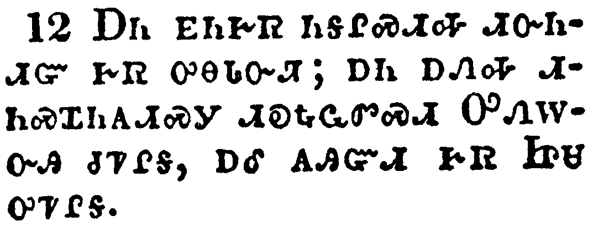</a></td>
</tr>
<tr class="even">
<td>Here is the patience of the saints: here are they that keep the commandments of God, and the faith of Jesus.</td>
</tr>
<tr class="odd">
<td>ᎠᏂ ᎬᏂᎨᏒ ᏂᎦᎵᏍᏗᎭ ᏗᏅᏂᏗᏳ ᎨᏒ ᎤᎾᏓᏅᏘ; ᎠᏁ ᎠᏁᎭ ᏗᏂᏍᏆᏂᎪᏗᏍᎩ ᏗᎧᎿᎭᏩᏛᏍᏗ ᎤᏁᎳᏅᎯ ᏧᏤᎵᎦ, ᎠᎴ ᎪᎯᏳᏗ ᎨᏒ ᏥᏌ ᎤᏤᎵᎦ.</td>
</tr>
<tr class="even">
<td>A-ni gv-ni-ge-sv ni-ga-li-s-di-ha di-nv-ni-di-yu ge-sv u-na-da-nv-ti; a-ne a-ne-ha di-ni-s-qua-ni-go-di-s-gi di-ka-hna-wa-dv-s-di U-ne-la-nv-hi tsu-tse-li-ga, a-le go-hi-yu-di ge-sv Tsi-sa u-tse-li-ga.</td>
</tr>
</tbody>
</table>

<table>
<tbody>
<tr class="odd">
<td><a href="271413.png">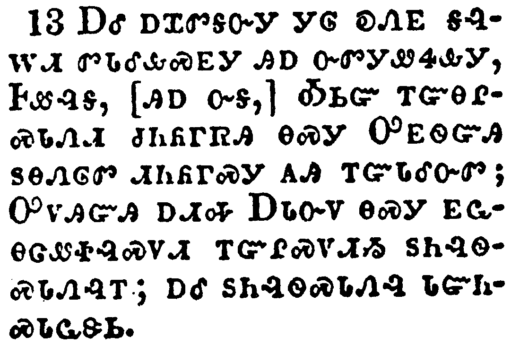</a></td>
</tr>
<tr class="even">
<td>And I heard a voice from heaven saying unto me, Write, Blessed are the dead which die in the Lord from henceforth: Yea, saith the Spirit, that they may rest from their labours; and their works do follow them.</td>
</tr>
<tr class="odd">
<td>ᎠᎴ ᎠᏆᏛᎦᏅᎩ ᎩᎶ ᎧᏁᎬ ᎦᎸᎳᏗ ᏛᏓᎴᎲᏍᎬᎩ ᎯᎠ ᏅᏛᎩᏪᏎᎲᎩ, ᎰᏪᎸᎩ, [ᎯᎠ ᏅᎦ,] ᎣᏏᏳ ᎢᏳᎾᎵᏍᏓᏁᏗ ᏧᏂᏲᎱᏒᎯ ᎾᏍᎩ ᎤᎬᏫᏳᎯ ᏚᎾᏁᎶᏛ ᏗᏂᏲᎱᏍᎩ ᎪᎯ ᎢᏳᏓᎴᏅᏛ; ᎤᏙᎯᏳᎯ ᎠᏗᎭ ᎠᏓᏅᏙ ᎾᏍᎩ ᎬᏩᎾᏣᏪᏐᎸᏍᏙᏗ ᎢᏳᎵᏍᏙᏗᏱ ᏚᏂᎸᏫᏍᏓᏁᎸᎢ; ᎠᎴ ᏚᏂᎸᏫᏍᏓᏁᎸ ᏓᏳᏂᏍᏓᏩᏕᏏ.</td>
</tr>
<tr class="even">
<td>A-le a-qua-dv-ga-nv-gi gi-lo ka-ne-gv ga-lv-la-di dv-da-le-hv-s-gv-gi hi-a nv-dv-gi-we-se-hv-gi, Ho-we-lv-gi, [hi-a nv-ga,] O-si-yu i-yu-na-li-s-da-ne-di tsu-ni-yo-hu-sv-hi na-s-gi U-gv-wi-yu-hi du-na-ne-lo-dv di-ni-yo-hu-s-gi go-hi i-yu-da-le-nv-dv; U-do-hi-yu-hi a-di-ha A-da-nv-do na-s-gi gv-wa-na-tsa-we-so-lv-s-do-di i-yu-li-s-do-di-yi du-ni-lv-wi-s-da-ne-lv-i; a-le du-ni-lv-wi-s-da-ne-lv da-yu-ni-s-da-wa-de-si.</td>
</tr>
</tbody>
</table>

<table>
<tbody>
<tr class="odd">
<td><a href="271414.png">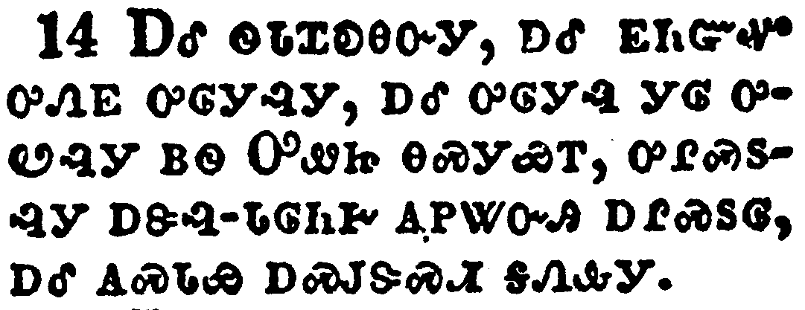</a></td>
</tr>
<tr class="even">
<td>And I looked, and behold a white cloud, and upon the cloud one sat like unto the Son of man, having on his head a golden crown, and in his hand a sharp sickle.</td>
</tr>
<tr class="odd">
<td>ᎠᎴ ᏫᏓᏆᎧᎾᏅᎩ, ᎠᎴ ᎬᏂᏳᏉ ᎤᏁᎬ ᎤᎶᎩᎸᎩ, ᎠᎴ ᎤᎶᎩᎸ ᎩᎶ ᎤᏬᎸᎩ ᏴᏫ ᎤᏪᏥ ᎾᏍᎩᏯᎢ, ᎤᎵᏍᏚᎸᎩ ᎠᏕᎸ-ᏓᎶᏂᎨ ᎪᏢᏔᏅᎯ ᎠᎵᏍᏚᎶ, ᎠᎴ ᎪᏍᏓᏯ ᎠᏍᎫᏕᏍᏗ ᎦᏁᎲᎩ.</td>
</tr>
<tr class="even">
<td>A-le wi-da-qua-ka-na-nv-gi, a-le gv-ni-yu-quo u-ne-gv u-lo-gi-lv-gi, a-le u-lo-gi-lv gi-lo u-wo-lv-gi yv-wi U-we-tsi na-s-gi-ya-i, u-li-s-du-lv-gi a-de-lv--da-lo-ni-ge go-tlv-ta-nv-hi a-li-s-du-lo, a-le go-s-da-ya a-s-gu-de-s-di ga-ne-hv-gi.</td>
</tr>
</tbody>
</table>

<table>
<tbody>
<tr class="odd">
<td><a href="271415.png">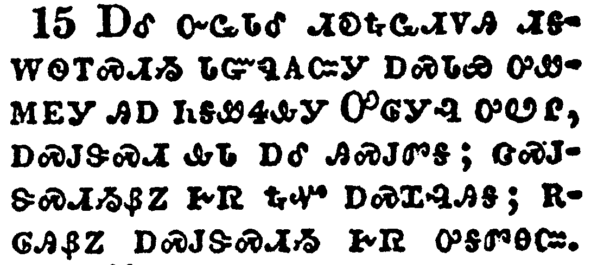</a></td>
</tr>
<tr class="even">
<td>And another angel came out of the temple, crying with a loud voice to him that sat on the cloud, Thrust in thy sickle, and reap: for the time is come for thee to reap; for the harvest of the earth is ripe.</td>
</tr>
<tr class="odd">
<td>ᎠᎴ ᏅᏩᏓᎴ ᏗᎧᎿᎭᏩᏗᏙᎯ ᏗᎦᎳᏫᎢᏍᏗᏱ ᎢᏳᏄᎪᏨᎩ ᎠᏍᏓᏯ ᎤᏪᎷᎬᎩ ᎯᎠ ᏂᎦᏪᏎᎲᎩ ᎤᎶᎩᎸ ᎤᏬᎵ, ᎠᏍᎫᏕᏍᏗ ᎲᏓ ᎠᎴ ᎯᏍᎫᏛᎦ; ᏣᏍᎫᏕᏍᏗᏱᏰᏃ ᎨᏒ ᎿᎭᏉ ᎠᏍᏆᎸᎯᎦ; ᎡᎶᎯᏰᏃ ᎠᏍᎫᏕᏍᏗᏱ ᎨᏒ ᎤᎦᏛᎾᏨ.</td>
</tr>
<tr class="even">
<td>A-le nv-wa-da-le di-ka-hna-wa-di-do-hi di-ga-la-wi-i-s-di-yi i-yu-nu-go-tsv-gi a-s-da-ya u-we-lu-gv-gi hi-a ni-ga-we-se-hv-gi U-lo-gi-lv u-wo-li, a-s-gu-de-s-di hv-da a-le hi-s-gu-dv-ga; tsa-s-gu-de-s-di-yi-ye-no ge-sv hna-quo a-s-qua-lv-hi-ga; e-lo-hi-ye-no a-s-gu-de-s-di-yi ge-sv u-ga-dv-na-tsv.</td>
</tr>
</tbody>
</table>

<table>
<tbody>
<tr class="odd">
<td><a href="271416.png">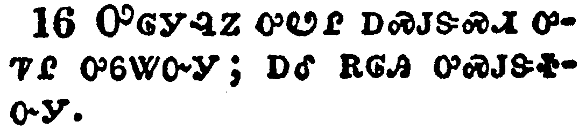</a></td>
</tr>
<tr class="even">
<td>And he that sat on the cloud thrust in his sickle on the earth; and the earth was reaped.</td>
</tr>
<tr class="odd">
<td>ᎤᎶᎩᎸᏃ ᎤᏬᎵ ᎠᏍᎫᏕᏍᏗ ᎤᏤᎵ ᎤᏮᏔᏅᎩ; ᎠᎴ ᎡᎶᎯ ᎤᏍᎫᏕᏐᏅᎩ.</td>
</tr>
<tr class="even">
<td>U-lo-gi-lv-no u-wo-li a-s-gu-de-s-di u-tse-li u-wv-ta-nv-gi; a-le e-lo-hi u-s-gu-de-so-nv-gi.</td>
</tr>
</tbody>
</table>

<table>
<tbody>
<tr class="odd">
<td><a href="271417.png">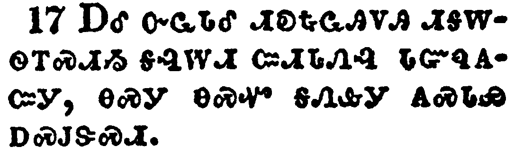</a></td>
</tr>
<tr class="even">
<td>And another angel came out of the temple which is in heaven, he also having a sharp sickle.</td>
</tr>
<tr class="odd">
<td>ᎠᎴ ᏅᏩᏓᎴ ᏗᎧᎿᎭᏩᎯᏙᎯ ᏗᎦᎳᏫᎢᏍᏗᏱ ᎦᎸᎳᏗ ᏨᏗᏓᏁᎸ ᏓᏳᏄᎪᏨᎩ, ᎾᏍᎩ ᎾᏍᏉ ᎦᏁᎲᎩ ᎪᏍᏓᏯ ᎠᏍᎫᏕᏍᏗ.</td>
</tr>
<tr class="even">
<td>A-le nv-wa-da-le di-ka-hna-wa-hi-do-hi di-ga-la-wi-i-s-di-yi ga-lv-la-di tsv-di-da-ne-lv da-yu-nu-go-tsv-gi, na-s-gi na-s-quo ga-ne-hv-gi go-s-da-ya a-s-gu-de-s-di.</td>
</tr>
</tbody>
</table>

<table>
<tbody>
<tr class="odd">
<td><a href="271418.png">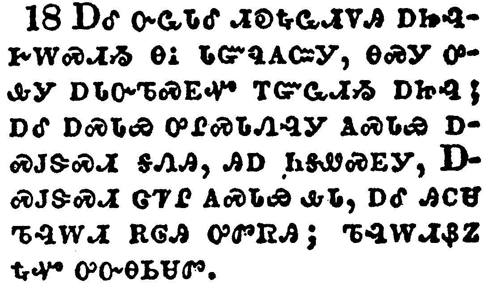</a></td>
</tr>
<tr class="even">
<td>And another angel came out from the altar, which had power over fire; and cried with a loud cry to him that had the sharp sickle, saying, Thrust in thy sharp sickle, and gather the clusters of the vine of the earth; for her grapes are fully ripe.</td>
</tr>
<tr class="odd">
<td>ᎠᎴ ᏅᏩᏓᎴ ᏗᎧᎿᎭᏩᏗᏙᎯ ᎠᏥᎸᎨᎳᏍᏗᏱ ᎾᎥ ᏓᏳᏄᎪᏨᎩ, ᎾᏍᎩ ᎤᎲᎩ ᎠᏓᏅᏖᏍᎬᏉ ᎢᏳᏩᏗᏱ ᎠᏥᎸ; ᎠᎴ ᎠᏍᏓᏯ ᎤᎵᏍᏓᏁᎸᎩ ᎪᏍᏓᏯ ᎠᏍᎫᏕᏍᏗ ᎦᏁᎯ, ᎯᎠ ᏂᎦᏪᏍᎬᎩ, ᎠᏍᎫᏕᏍᏗ ᏣᏤᎵ ᎪᏍᏓᏯ ᎲᏓ, ᎠᎴ ᎯᏟᏌ ᏖᎸᎳᏗ ᎡᎶᎯ ᎤᏛᏒᎯ; ᏖᎸᎳᏗᏰᏃ ᎿᎭᏉ ᎤᏅᎾᏏᏌᏛ.</td>
</tr>
<tr class="even">
<td>A-le nv-wa-da-le di-ka-hna-wa-di-do-hi a-tsi-lv-ge-la-s-di-yi na-v da-yu-nu-go-tsv-gi, na-s-gi u-hv-gi a-da-nv-te-s-gv-quo i-yu-wa-di-yi a-tsi-lv; a-le a-s-da-ya u-li-s-da-ne-lv-gi go-s-da-ya a-s-gu-de-s-di ga-ne-hi, hi-a ni-ga-we-s-gv-gi, A-s-gu-de-s-di tsa-tse-li go-s-da-ya hv-da, a-le hi-tli-sa te-lv-la-di e-lo-hi u-dv-sv-hi; te-lv-la-di-ye-no hna-quo u-nv-na-si-sa-dv.</td>
</tr>
</tbody>
</table>

<table>
<tbody>
<tr class="odd">
<td><a href="271419.png">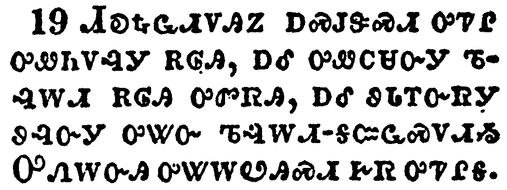</a></td>
</tr>
<tr class="even">
<td>And the angel thrust in his sickle into the earth, and gathered the vine of the earth, and cast it into the great winepress of the wrath of God.</td>
</tr>
<tr class="odd">
<td>ᏗᎧᎿᎭᏩᏗᏙᎯᏃ ᎠᏍᎫᏕᏍᏗ ᎤᏤᎵ ᎤᏪᏂᏙᎸᎩ ᎡᎶᎯ, ᎠᎴ ᎤᏪᏟᏌᏅᎩ ᏖᎸᎳᏗ ᎡᎶᎯ ᎤᏛᏒᎯ, ᎠᎴ ᏭᏓᎢᏅᏒᎩ ᏭᎸᏅᎩ ᎤᏔᏅ ᏖᎸᎳᏗ-ᎦᏨᏩᏍᏙᏗᏱ ᎤᏁᎳᏅᎯ ᎤᏔᎳᏬᎯᏍᏗ ᎨᏒ ᎤᏤᎵᎦ.</td>
</tr>
<tr class="even">
<td>Di-ka-hna-wa-di-do-hi-no a-s-gu-de-s-di u-tse-li u-we-ni-do-lv-gi e-lo-hi, a-le u-we-tli-sa-nv-gi te-lv-la-di e-lo-hi u-dv-sv-hi, a-le wu-da-i-nv-sv-gi wu-lv-nv-gi u-ta-nv te-lv-la-di--ga-tsv-wa-s-do-di-yi U-ne-la-nv-hi u-ta-la-wo-hi-s-di ge-sv u-tse-li-ga.</td>
</tr>
</tbody>
</table>

<table>
<tbody>
<tr class="odd">
<td><a href="271420.png">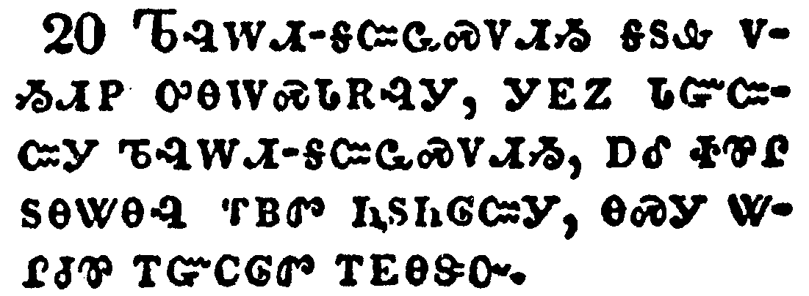</a></td>
</tr>
<tr class="even">
<td>And the winepress was trodden without the city, and blood came out of the winepress, even unto the horse bridles, by the space of a thousand and six hundred furlongs.</td>
</tr>
<tr class="odd">
<td>ᏖᎸᎳᏗ-ᎦᏨᏩᏍᏙᏗᏱ ᎦᏚᎲ ᏙᏱᏗᏢ ᎤᎾᎳᏍᏓᎡᎸᎩ, ᎩᎬᏃ ᏓᏳᏨᏨᎩ ᏖᎸᎳᏗ-ᎦᏨᏩᏍᏙᏗᏱ, ᎠᎴ ᏐᏈᎵ ᏚᎾᏔᎾᎸ ᎢᏴᏛ ᏂᏚᏂᎶᏨᎩ, ᎾᏍᎩ ᏔᎵᏧᏈ ᎢᏳᏟᎶᏛ ᎢᎬᎾᏕᏅ.</td>
</tr>
<tr class="even">
<td>Te-lv-la-di--ga-tsv-wa-s-do-di-yi ga-du-hv do-yi-di-tlv u-na-la-s-da-e-lv-gi, gi-gv-no da-yu-tsv-tsv-gi te-lv-la-di--ga-tsv-wa-s-do-di-yi, a-le so-qui-li du-na-ta-na-lv i-yv-dv ni-du-ni-lo-tsv-gi, na-s-gi ta-li-tsu-qui i-yu-tli-lo-dv i-gv-na-de-nv.</td>
</tr>
</tbody>
</table>

