+++
draft=false
date = 2014-12-18T21:11:07Z
title = "Revelation - Chapter 17 - Cherokee New Testament"
weight = 1418955067

[taxonomies]

authors = ["Timothy Legg"]
categories = []
tags = []

[extra]
+++

<table>
<tbody>
<tr class="odd">
<td><a href="271701.png">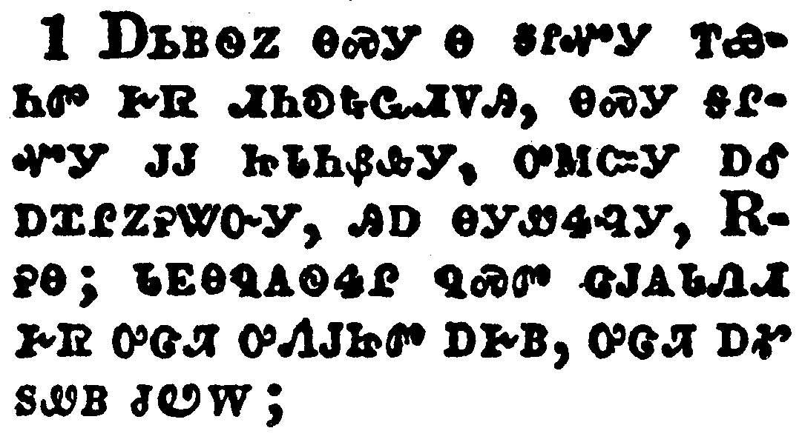</a></td>
</tr>
<tr class="even">
<td>And there came one of the seven angels which had the seven vials, and talked with me, saying unto me, Come hither; I will shew unto thee the judgment of the great whore that sitteth upon many waters:</td>
</tr>
<tr class="odd">
<td>ᎠᏏᏴᏫᏃ ᎾᏍᎩ Ꮎ ᎦᎵᏉᎩ ᎢᏯᏂᏛ ᎨᏒ ᏗᏂᎧᎿᎭᏩᏗᏙᎯ, ᎾᏍᎩ ᎦᎵᏉᎩ ᎫᎫ ᏥᏓᏂᏰᎲᎩ, ᎤᎷᏨᎩ ᎠᎴ ᎠᏆᎵᏃᎮᏔᏅᎩ, ᎯᎠ ᎾᎩᏪᏎᎸᎩ, ᎡᎮᎾ; ᏓᎬᎾᏄᎪᏫᏎᎵ ᏄᏍᏛ ᏣᎫᎪᏓᏁᏗ ᎨᏒ ᎤᏣᏘ ᎤᏁᎫᏥᏛ ᎠᎨᏴ, ᎤᏣᏘ ᎠᎹ ᏚᏪᏴ ᏧᏬᎳ;</td>
</tr>
<tr class="even">
<td>A-si-yv-wi-no na-s-gi na ga-li-quo-gi i-ya-ni-dv ge-sv di-ni-ka-hna-wa-di-do-hi, na-s-gi ga-li-quo-gi gu-gu tsi-da-ni-ye-hv-gi, u-lu-tsv-gi a-le a-qua-li-no-he-ta-nv-gi, hi-a na-gi-we-se-lv-gi, E-he-na; da-gv-na-nu-go-wi-se-li nu-s-dv tsa-gu-go-da-ne-di ge-sv u-tsa-ti u-ne-gu-tsi-dv a-ge-yv, u-tsa-ti a-ma du-we-yv tsu-wo-la;</td>
</tr>
</tbody>
</table>

<table>
<tbody>
<tr class="odd">
<td><a href="271702.png">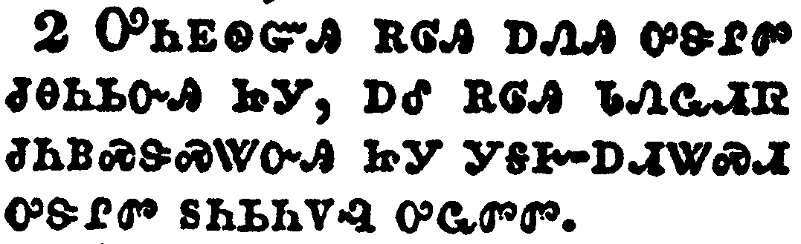</a></td>
</tr>
<tr class="even">
<td>With whom the kings of the earth have committed fornication, and the inhabitants of the earth have been made drunk with the wine of her fornication.</td>
</tr>
<tr class="odd">
<td>ᎤᏂᎬᏫᏳᎯ ᎡᎶᎯ ᎠᏁᎯ ᎤᏕᎵᏛ ᏧᎾᏂᏏᏅᎯ ᏥᎩ, ᎠᎴ ᎡᎶᎯ ᏓᏁᏩᏗᏒ ᏧᏂᏴᏍᏕᏍᏔᏅᎯ ᏥᎩ ᎩᎦᎨ-ᎠᏗᏔᏍᏗ ᎤᏕᎵᏛ ᏚᏂᏏᏂᏙᎸ ᎤᏩᏛᏛ.</td>
</tr>
<tr class="even">
<td>U-ni-gv-wi-yu-hi e-lo-hi a-ne-hi u-de-li-dv tsu-na-ni-si-nv-hi tsi-gi, a-le e-lo-hi da-ne-wa-di-sv tsu-ni-yv-s-de-s-ta-nv-hi tsi-gi gi-ga-ge--a-di-ta-s-di u-de-li-dv du-ni-si-ni-do-lv u-wa-dv-dv.</td>
</tr>
</tbody>
</table>

<table>
<tbody>
<tr class="odd">
<td><a href="271703.png">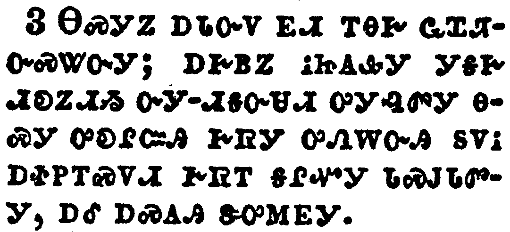</a></td>
</tr>
<tr class="even">
<td>So he carried me away in the spirit into the wilderness: and I saw a woman sit upon a scarlet coloured beast, full of names of blasphemy, having seven heads and ten horns.</td>
</tr>
<tr class="odd">
<td>ᎾᏍᎩᏃ ᎠᏓᏅᏙ ᎬᏗ ᎢᎾᎨ ᏩᏆᏘᏅᏍᏔᏅᎩ; ᎠᎨᏴᏃ ᎥᏥᎪᎲᎩ ᎩᎦᎨ ᏗᎧᏃᏗᏱ ᏅᎩ-ᏗᎦᏅᏌᏗ ᎤᎩᎸᏛᎩ ᎾᏍᎩ ᎤᎧᎵᏨᎯ ᎨᏒᎩ ᎤᏁᎳᏅᎯ ᏚᏙᎥ ᎠᏐᏢᎢᏍᏙᏗ ᎨᏒᎢ ᎦᎵᏉᎩ ᏓᏍᎫᏓᏛᎩ, ᎠᎴ ᎠᏍᎪᎯ ᏕᎤᎷᎬᎩ.</td>
</tr>
<tr class="even">
<td>Na-s-gi-no a-da-nv-do gv-di i-na-ge wa-qua-ti-nv-s-ta-nv-gi; a-ge-yv-no v-tsi-go-hv-gi gi-ga-ge di-ka-no-di-yi nv-gi--di-ga-nv-sa-di u-gi-lv-dv-gi na-s-gi u-ka-li-tsv-hi ge-sv-gi u-ne-la-nv-hi du-do-v a-so-tlv-i-s-do-di ge-sv-i ga-li-quo-gi da-s-gu-da-dv-gi, a-le a-s-go-hi de-u-lu-gv-gi.</td>
</tr>
</tbody>
</table>

<table>
<tbody>
<tr class="odd">
<td><a href="271704.png">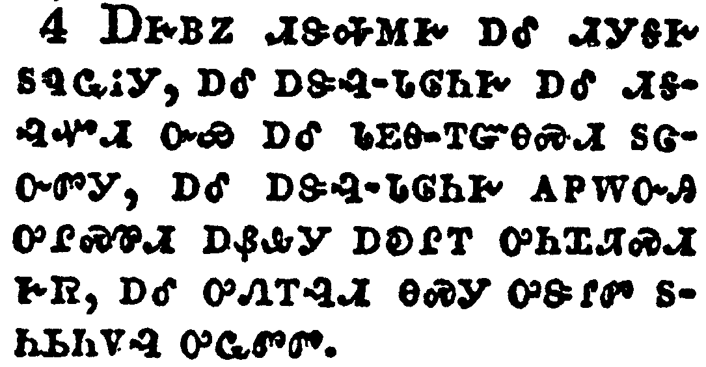</a></td>
</tr>
<tr class="even">
<td>And the woman was arrayed in purple and scarlet colour, and decked with gold and precious stones and pearls, having a golden cup in her hand full of abominations and filthiness of her fornication:</td>
</tr>
<tr class="odd">
<td>ᎠᎨᏴᏃ ᏗᏕᎭᎷᎨ ᎠᎴ ᏗᎩᎦᎨ ᏚᏄᏩᎥᎩ, ᎠᎴ ᎠᏕᎸ-ᏓᎶᏂᎨ ᎠᎴ ᏗᎦᎸᏉᏗ, ᏅᏯ ᎠᎴ ᏓᎬᎾ-ᎢᏳᎾᏍᏗ ᏚᏣᏅᏛᎩ, ᎠᎴ ᎠᏕᎸ-ᏓᎶᏂᎨ ᎠᏢᎳᏅᎯ ᎤᎵᏍᏈᏗ ᎠᏰᎲᎩ ᎠᎧᎵᎢ ᎤᏂᏆᏘᏍᏗ ᎨᏒ, ᎠᎴ ᎤᏁᎢᎸᏗ ᎾᏍᎩ ᎤᏕᎵᏛ ᏚᏂᏏᏂᏙᎸ ᎤᏩᏛᏛ.</td>
</tr>
<tr class="even">
<td>A-ge-yv-no di-de-ha-lu-ge a-le di-gi-ga-ge du-nu-wa-v-gi, a-le a-de-lv--da-lo-ni-ge a-le di-ga-lv-quo-di, nv-ya a-le da-gv-na--i-yu-na-s-di du-tsa-nv-dv-gi, a-le a-de-lv--da-lo-ni-ge a-tlv-la-nv-hi u-li-s-qui-di a-ye-hv-gi a-ka-li-i u-ni-qua-ti-s-di ge-sv, a-le u-ne-i-lv-di na-s-gi u-de-li-dv du-ni-si-ni-do-lv u-wa-dv-dv.</td>
</tr>
</tbody>
</table>

<table>
<tbody>
<tr class="odd">
<td><a href="271705.png">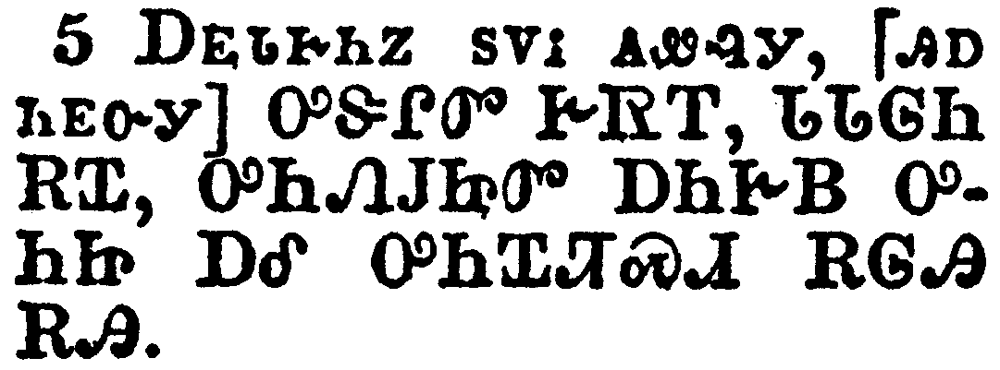</a></td>
</tr>
<tr class="even">
<td>And upon her forehead was a name written, MYSTERY, BABYLON THE GREAT, THE MOTHER OF HARLOTS AND ABOMINATIONS OF THE EARTH.</td>
</tr>
<tr class="odd">
<td>ᎠᎬᏓᎨᏂᏃ ᏚᏙᎥ ᎪᏪᎸᎩ, [ᎯᎠ ᏂᎬᏅᎩ] ᎤᏕᎵᏛ ᎨᏒᎢ, ᏓᏓᎶᏂ ᎡᏆ, ᎤᏂᏁᎫᏥᏛ ᎠᏂᎨᏴ ᎤᏂᏥ ᎠᎴ ᎤᏂᏆᏘᏍᏗ ᎡᎶᎯ ᎡᎯ.</td>
</tr>
<tr class="even">
<td>A-gv-da-ge-ni-no du-do-v go-we-lv-gi, [hi-a ni-gv-nv-gi] U-De-Li-Dv Ge-Sv-I, Da-Da-Lo-Ni E-Qua, U-Ni-Ne-Gu-Tsi-Dv A-Ni-Ge-Yv U-Ni-Tsi A-Le U-Ni-Qua-Ti-S-Di E-Lo-Hi E-Hi.</td>
</tr>
</tbody>
</table>

<table>
<tbody>
<tr class="odd">
<td><a href="271706.png">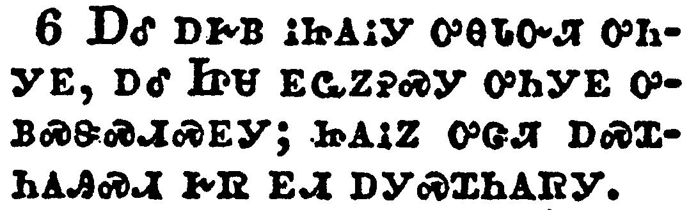</a></td>
</tr>
<tr class="even">
<td>And I saw the woman drunken with the blood of the saints, and with the blood of the martyrs of Jesus: and when I saw her, I wondered with great admiration.</td>
</tr>
<tr class="odd">
<td>ᎠᎴ ᎠᎨᏴ ᎥᏥᎪᎥᎩ ᎤᎾᏓᏅᏘ ᎤᏂᎩᎬ, ᎠᎴ ᏥᏌ ᎬᏩᏃᎮᏍᎩ ᎤᏂᎩᎬ ᎤᏴᏍᏕᏍᏗᏍᎬᎩ; ᏥᎪᎥᏃ ᎤᏣᏘ ᎠᏍᏆᏂᎪᎯᏍᏗ ᎨᏒ ᎬᏗ ᎠᎩᏍᏆᏂᎪᏒᎩ.</td>
</tr>
<tr class="even">
<td>A-le a-ge-yv v-tsi-go-v-gi u-na-da-nv-ti u-ni-gi-gv, a-le Tsi-sa gv-wa-no-he-s-gi u-ni-gi-gv u-yv-s-de-s-di-s-gv-gi; tsi-go-v-no u-tsa-ti a-s-qua-ni-go-hi-s-di ge-sv gv-di a-gi-s-qua-ni-go-sv-gi.</td>
</tr>
</tbody>
</table>

<table>
<tbody>
<tr class="odd">
<td><a href="271707.png">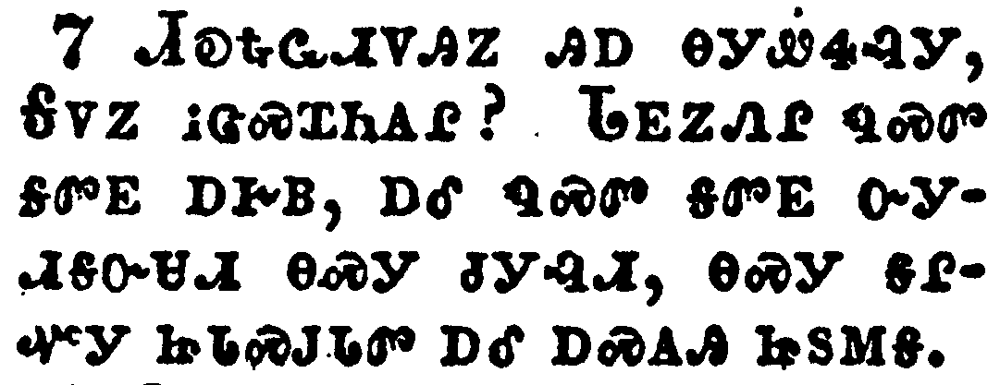</a></td>
</tr>
<tr class="even">
<td>And the angel said unto me, Wherefore didst thou marvel? I will tell thee the mystery of the woman, and of the beast that carrieth her, which hath the seven heads and ten horns.</td>
</tr>
<tr class="odd">
<td>ᏗᎧᎿᎭᏩᏗᏙᎯᏃ ᎯᎠ ᎾᎩᏪᏎᎸᎩ, ᎦᏙᏃ ᎥᏣᏍᏆᏂᎪᎵ? ᏓᎬᏃᏁᎵ ᏄᏍᏛ ᎦᏛᎬ ᎠᎨᏴ, ᎠᎴ ᏄᏍᏛ ᎦᏛᎬ ᏅᎩᏗᎦᏅᏌᏗ ᎾᏍᎩ ᏧᎩᎸᏗ, ᎾᏍᎩ ᎦᎵᏉᎩ ᏥᏓᏍᎫᏓᏛ ᎠᎴ ᎠᏍᎪᎯ ᏥᏚᎷᎦ.</td>
</tr>
<tr class="even">
<td>Di-ka-hna-wa-di-do-hi-no hi-a na-gi-we-se-lv-gi, Ga-do-no v-tsa-s-qua-ni-go-li? Da-gv-no-ne-li nu-s-dv ga-dv-gv a-ge-yv, a-le nu-s-dv ga-dv-gv nv-gi-di-ga-nv-sa-di na-s-gi tsu-gi-lv-di, na-s-gi ga-li-quo-gi tsi-da-s-gu-da-dv a-le a-s-go-hi tsi-du-lu-ga.</td>
</tr>
</tbody>
</table>

<table>
<tbody>
<tr class="odd">
<td><a href="271708.png">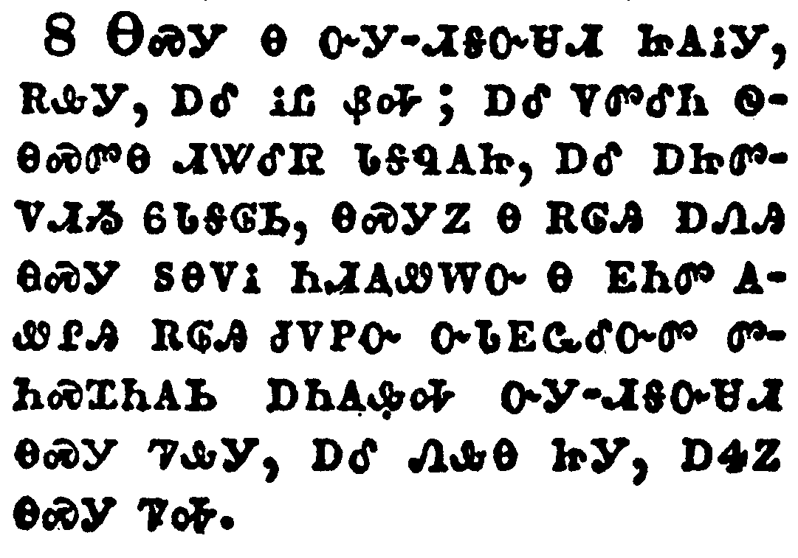</a></td>
</tr>
<tr class="even">
<td>The beast that thou sawest was, and is not; and shall ascend out of the bottomless pit, and go into perdition: and they that dwell on the earth shall wonder, whose names were not written in the book of life from the foundation of the world, when they behold the beast that was, and is not, and yet is.</td>
</tr>
<tr class="odd">
<td>ᎾᏍᎩ Ꮎ ᏅᎩ-ᏗᎦᏅᏌᏗ ᏥᎪᎥᎩ, ᎡᎲᎩ, ᎠᎴ ᎥᏝ ᏰᎭ; ᎠᎴ ᏙᏛᎴᏂ ᏫᎾᏍᏛᎾ ᏗᏔᎴᏒ ᏓᎦᏄᎪᏥ, ᎠᎴ ᎠᏥᏛᏙᏗᏱ ᏮᏓᎦᎶᏏ, ᎾᏍᎩᏃ Ꮎ ᎡᎶᎯ ᎠᏁᎯ ᎾᏍᎩ ᏚᎾᏙᎥ ᏂᏗᎪᏪᎳᏅ Ꮎ ᎬᏂᏛ ᎪᏪᎵᎯ ᎡᎶᎯ ᏧᏙᏢᏅ ᏅᏓᎬᏩᎴᏅᏛ ᏛᏂᏍᏆᏂᎪᏏ ᎠᏂᎪᎲᎭ ᏅᎩ-ᏗᎦᏅᏌᏗ ᎾᏍᎩ ᏤᎲᎩ, ᎠᎴ ᏁᎲᎾ ᏥᎩ, ᎠᏎᏃ ᎾᏍᎩ ᏤᎭ.</td>
</tr>
<tr class="even">
<td>Na-s-gi na nv-gi--di-ga-nv-sa-di tsi-go-v-gi, e-hv-gi, a-le v-tla ye-ha; a-le do-dv-le-ni wi-na-s-dv-na di-ta-le-sv da-ga-nu-go-tsi, a-le a-tsi-dv-do-di-yi wv-da-ga-lo-si, na-s-gi-no na e-lo-hi a-ne-hi na-s-gi du-na-do-v ni-di-go-we-la-nv na gv-ni-dv go-we-li-hi e-lo-hi tsu-do-tlv-nv nv-da-gv-wa-le-nv-dv dv-ni-s-qua-ni-go-si a-ni-go-hv-ha nv-gi--di-ga-nv-sa-di na-s-gi tse-hv-gi, a-le ne-hv-na tsi-gi, a-se-no na-s-gi tse-ha.</td>
</tr>
</tbody>
</table>

<table>
<tbody>
<tr class="odd">
<td><a href="271709.png">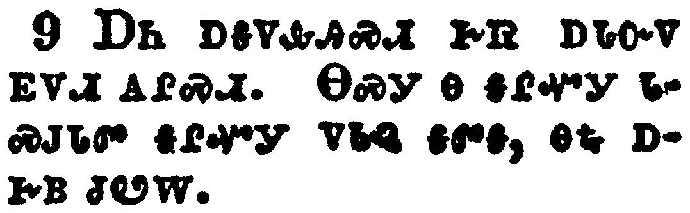</a></td>
</tr>
<tr class="even">
<td>And here is the mind which hath wisdom. The seven heads are seven mountains, on which the woman sitteth.</td>
</tr>
<tr class="odd">
<td>ᎠᏂ ᎠᎦᏙᎲᎯᏍᏗ ᎨᏒ ᎠᏓᏅᏙ ᎬᏙᏗ ᎪᎵᏍᏗ. ᎾᏍᎩ Ꮎ ᎦᎵᏉᎩ ᏓᏍᎫᏓᏛ ᎦᎵᏉᎩ ᏙᏓᎸ ᎦᏛᎦ, ᎾᎿᎭᎠᎨᏴ ᏧᏬᎳ.</td>
</tr>
<tr class="even">
<td>A-ni a-ga-do-hv-hi-s-di ge-sv a-da-nv-do gv-do-di go-li-s-di. Na-s-gi na ga-li-quo-gi da-s-gu-da-dv ga-li-quo-gi do-da-lv ga-dv-ga, na-hna a-ge-yv tsu-wo-la.</td>
</tr>
</tbody>
</table>

<table>
<tbody>
<tr class="odd">
<td><a href="271710.png">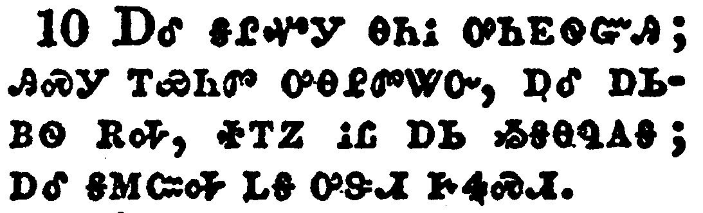</a></td>
</tr>
<tr class="even">
<td>And there are seven kings: five are fallen, and one is, and the other is not yet come; and when he cometh, he must continue a short space.</td>
</tr>
<tr class="odd">
<td>ᎠᎴ ᎦᎵᏉᎩ ᎾᏂᎥ ᎤᏂᎬᏫᏳᎯ; ᎯᏍᎩ ᎢᏯᏂᏛ ᎤᎾᎵᏛᏔᏅ, ᎠᎴ ᎠᏏᏴᏫ ᎡᎭ, ᏐᎢᏃ ᎥᏝ ᎠᏏ ᏱᎦᎾᏄᎪᎦ; ᎠᎴ ᎦᎷᏨᎭ ᏝᎦ ᎤᏕᏗ ᎨᏎᏍᏗ.</td>
</tr>
<tr class="even">
<td>A-le ga-li-quo-gi na-ni-v u-ni-gv-wi-yu-hi; hi-s-gi i-ya-ni-dv u-na-li-dv-ta-nv, a-le a-si-yv-wi e-ha, so-i-no v-tla a-si yi-ga-na-nu-go-ga; a-le ga-lu-tsv-ha tla-ga u-de-di ge-se-s-di.</td>
</tr>
</tbody>
</table>

<table>
<tbody>
<tr class="odd">
<td><a href="271711.png">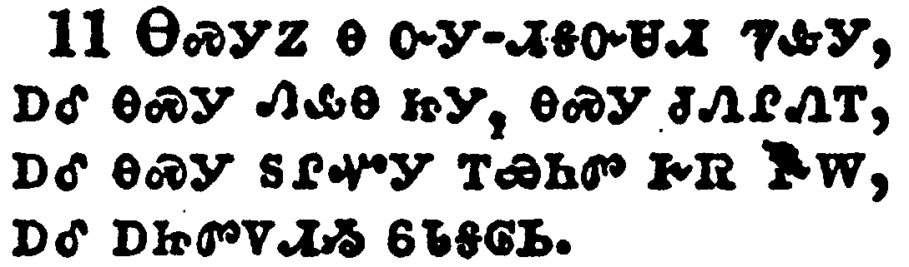</a></td>
</tr>
<tr class="even">
<td>And the beast that was, and is not, even he is the eighth, and is of the seven, and goeth into perdition.</td>
</tr>
<tr class="odd">
<td>ᎾᏍᎩᏃ Ꮎ ᏅᎩ-ᏗᎦᏅᏌᏗ ᏤᎲᎩ, ᎠᎴ ᎾᏍᎩ ᏁᎲᎾ ᏥᎩ, ᎾᏍᎩ ᏧᏁᎵᏁᎢ, ᎠᎴ ᎾᏍᎩ ᏚᎵᏉᎩ ᎢᏯᏂᏛ ᎨᏒ ᎨᎳ, ᎠᎴ ᎠᏥᏛᏙᏗᏱ ᏮᏓᎦᎶᏏ.</td>
</tr>
<tr class="even">
<td>Na-s-gi-no na nv-gi--di-ga-nv-sa-di tse-hv-gi, a-le na-s-gi ne-hv-na tsi-gi, na-s-gi tsu-ne-li-ne-i, a-le na-s-gi du-li-quo-gi i-ya-ni-dv ge-sv ge-la, a-le a-tsi-dv-do-di-yi wv-da-ga-lo-si.</td>
</tr>
</tbody>
</table>

<table>
<tbody>
<tr class="odd">
<td><a href="271712.png">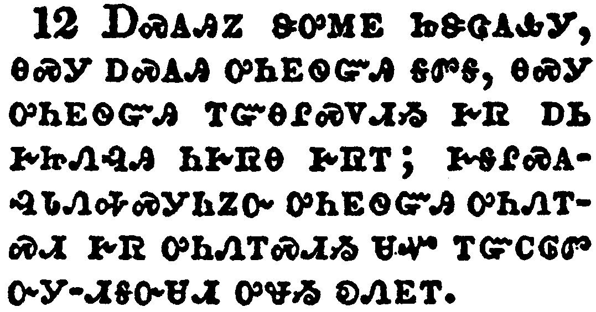</a></td>
</tr>
<tr class="even">
<td>And the ten horns which thou sawest are ten kings, which have received no kingdom as yet; but receive power as kings one hour with the beast.</td>
</tr>
<tr class="odd">
<td>ᎠᏍᎪᎯᏃ ᏕᎤᎷᎬ ᏥᏕᏣᎪᎲᎩ, ᎾᏍᎩ ᎠᏍᎪᎯ ᎤᏂᎬᏫᏳᎯ ᎦᏛᎦ, ᎾᏍᎩ ᎤᏂᎬᏫᏳᎯ ᎢᏳᎾᎵᏍᏙᏗᏱ ᎨᏒ ᎠᏏ ᎨᏥᏁᎸᎯ ᏂᎨᏒᎾ ᎨᏒᎢ; ᎨᎦᎵᏍᎪᎸᏓᏁᎭᏍᎩᏂᏃᏅ ᎤᏂᎬᏫᏳᎯ ᎤᏂᏁᎢᏍᏗ ᎨᏒ ᎤᏂᏁᎢᏍᏗᏱ ᏌᏉ ᎢᏳᏟᎶᏛ ᏅᎩ-ᏗᎦᏅᏌᏗ ᎤᏠᏱ ᎧᏁᎬᎢ.</td>
</tr>
<tr class="even">
<td>A-s-go-hi-no de-u-lu-gv tsi-de-tsa-go-hv-gi, na-s-gi a-s-go-hi u-ni-gv-wi-yu-hi ga-dv-ga, na-s-gi u-ni-gv-wi-yu-hi i-yu-na-li-s-do-di-yi ge-sv a-si ge-tsi-ne-lv-hi ni-ge-sv-na ge-sv-i; ge-ga-li-s-go-lv-da-ne-ha-s-gi-ni-no-nv u-ni-gv-wi-yu-hi u-ni-ne-i-s-di ge-sv u-ni-ne-i-s-di-yi sa-quo i-yu-tli-lo-dv nv-gi--di-ga-nv-sa-di u-tlo-yi ka-ne-gv-i.</td>
</tr>
</tbody>
</table>

<table>
<tbody>
<tr class="odd">
<td><a href="271713.png">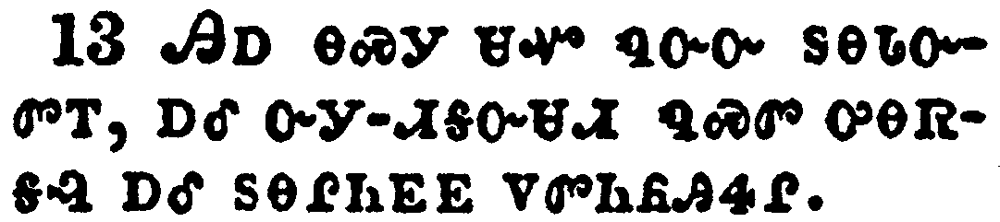</a></td>
</tr>
<tr class="even">
<td>These have one mind, and shall give their power and strength unto the beast.</td>
</tr>
<tr class="odd">
<td>ᎯᎠ ᎾᏍᎩ ᏌᏉ ᏄᏅᏅ ᏚᎾᏓᏅᏛᎢ, ᎠᎴ ᏅᎩ-ᏗᎦᏅᏌᏗ ᏄᏍᏛ ᎤᎾᏒᎦᎸ ᎠᎴ ᏚᎾᎵᏂᎬᎬ ᏙᏛᏂᏲᎯᏎᎵ.</td>
</tr>
<tr class="even">
<td>Hi-a na-s-gi sa-quo nu-nv-nv du-na-da-nv-dv-i, a-le nv-gi--di-ga-nv-sa-di nu-s-dv u-na-sv-ga-lv a-le du-na-li-ni-gv-gv do-dv-ni-yo-hi-se-li.</td>
</tr>
</tbody>
</table>

<table>
<tbody>
<tr class="odd">
<td><a href="271714.png">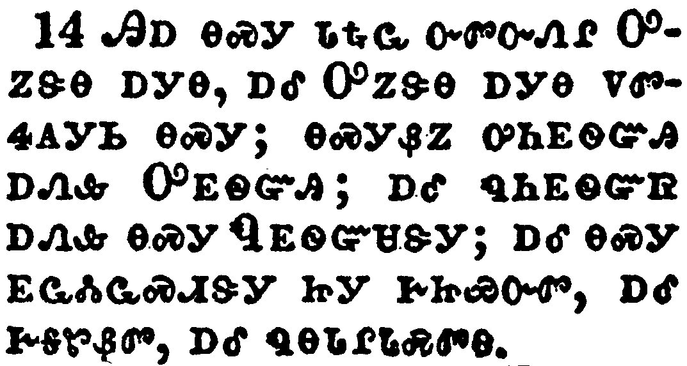</a></td>
</tr>
<tr class="even">
<td>These shall make war with the Lamb, and the Lamb shall overcome them: for he is Lord of lords, and King of kings: and they that are with him are called, and chosen, and faithful.</td>
</tr>
<tr class="odd">
<td>ᎯᎠ ᎾᏍᎩ ᏓᎿᎭᏩ ᏅᏛᏅᏁᎵ ᎤᏃᏕᎾ ᎠᎩᎾ, ᎠᎴ ᎤᏃᏕᎾ ᎠᎩᎾ ᏙᏛᏎᎪᎩᏏ ᎾᏍᎩ; ᎾᏍᎩᏰᏃ ᎤᏂᎬᏫᏳᎯ ᎠᏁᎲ ᎤᎬᏫᏳᎯ; ᎠᎴ ᏄᏂᎬᏫᏳᏒ ᎠᏁᎲ ᎾᏍᎩ ᏄᎬᏫᏳᏌᏕᎩ; ᎠᎴ ᎾᏍᎩ ᎬᏩᏜᏓᏩᏍᏗᏕᎩ ᏥᎩ ᎨᏥᏯᏅᏛ, ᎠᎴ ᎨᎦᏑᏰᏛ, ᎠᎴ ᏄᎾᏓᎵᏓᏍᏛᎾ.</td>
</tr>
<tr class="even">
<td>Hi-a na-s-gi da-hna-wa nv-dv-nv-ne-li U-no-de-na a-gi-na, a-le U-no-de-na a-gi-na do-dv-se-go-gi-si na-s-gi; na-s-gi-ye-no u-ni-gv-wi-yu-hi a-ne-hv U-gv-wi-yu-hi; a-le nu-ni-gv-wi-yu-sv a-ne-hv na-s-gi Nu-gv-wi-yu-sa-de-gi; a-le na-s-gi gv-wa-dla-wa-s-di-de-gi tsi-gi ge-tsi-ya-nv-dv, a-le ge-ga-su-ye-dv, a-le nu-na-da-li-da-s-dv-na.</td>
</tr>
</tbody>
</table>

<table>
<tbody>
<tr class="odd">
<td><a href="271715.png">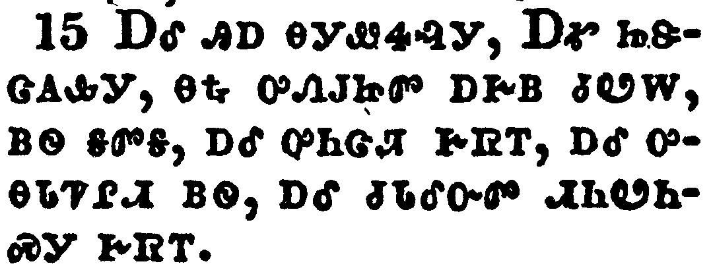</a></td>
</tr>
<tr class="even">
<td>And he saith unto me, The waters which thou sawest, where the whore sitteth, are peoples, and multitudes, and nations, and tongues.</td>
</tr>
<tr class="odd">
<td>ᎠᎴ ᎯᎠ ᎾᎩᏪᏎᎸᎩ, ᎠᎹ ᏥᏕᏣᎪᎲᎩ, ᎾᎿᎭᎤᏁᎫᏥᏛ ᎠᎨᏴ ᏧᏬᎳ, ᏴᏫ ᎦᏛᎦ, ᎠᎴ ᎤᏂᏣᏘ ᎨᏒᎢ, ᎠᎴ ᎤᎾᏓᏤᎵᏗ ᏴᏫ, ᎠᎴ ᏧᏓᎴᏅᏛ ᏗᏂᏬᏂᏍᎩ ᎨᏒᎢ.</td>
</tr>
<tr class="even">
<td>A-le hi-a na-gi-we-se-lv-gi, A-ma tsi-de-tsa-go-hv-gi, na-hna u-ne-gu-tsi-dv a-ge-yv tsu-wo-la, yv-wi ga-dv-ga, a-le u-ni-tsa-ti ge-sv-i, a-le u-na-da-tse-li-di yv-wi, a-le tsu-da-le-nv-dv di-ni-wo-ni-s-gi ge-sv-i.</td>
</tr>
</tbody>
</table>

<table>
<tbody>
<tr class="odd">
<td><a href="271716.png">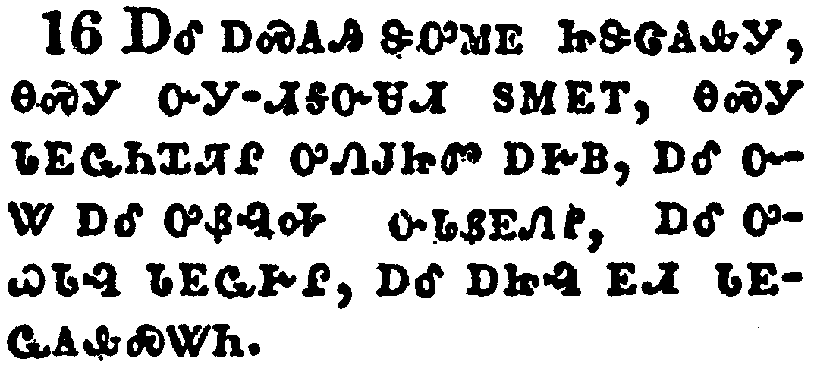</a></td>
</tr>
<tr class="even">
<td>And the ten horns which thou sawest upon the beast, these shall hate the whore, and shall make her desolate and naked, and shall eat her flesh, and burn her with fire.</td>
</tr>
<tr class="odd">
<td>ᎠᎴ ᎠᏍᎪᎯ ᏕᎤᎷᎬ ᏥᏕᏣᎪᎲᎩ, ᎾᏍᎩ ᏅᎩ-ᏗᎦᏅᏌᏗ ᏚᎷᎬᎢ, ᎾᏍᎩ ᏓᎬᏩᏂᏆᏘᎵ ᎤᏁᎫᏥᏛ ᎠᎨᏴ, ᎠᎴ ᏅᏔ ᎠᎴ ᎤᏰᎸᎭ ᏅᏓᏰᎬᏁᎵ, ᎠᎴ ᎤᏇᏓᎸ ᏓᎬᏩᎨᎵ, ᎠᎴ ᎠᏥᎸ ᎬᏗ ᏓᎬᏩᎪᎲᏍᏔᏂ.</td>
</tr>
<tr class="even">
<td>A-le a-s-go-hi de-u-lu-gv tsi-de-tsa-go-hv-gi, na-s-gi nv-gi--di-ga-nv-sa-di du-lu-gv-i, na-s-gi da-gv-wa-ni-qua-ti-li u-ne-gu-tsi-dv a-ge-yv, a-le nv-ta a-le u-ye-lv-ha nv-da-ye-gv-ne-li, a-le u-que-da-lv da-gv-wa-ge-li, a-le a-tsi-lv gv-di da-gv-wa-go-hv-s-ta-ni.</td>
</tr>
</tbody>
</table>

<table>
<tbody>
<tr class="odd">
<td><a href="271717.png">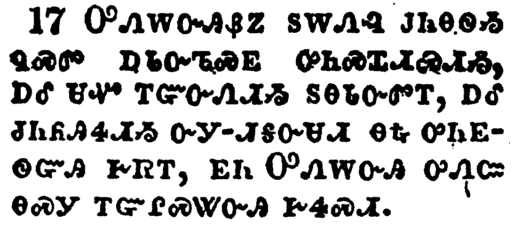</a></td>
</tr>
<tr class="even">
<td>For God hath put in their hearts to fulfill his will, and to agree, and give their kingdom unto the beast, until the words of God shall be fulfilled.</td>
</tr>
<tr class="odd">
<td>ᎤᏁᎳᏅᎯᏰᏃ ᏚᎳᏁᎸ ᎫᏂᎾᏫᏱ ᏄᏍᏛ ᎠᏓᏅᏖᏍᎬ ᎤᏂᏍᏆᏗᏍᏗᏱ, ᎠᎴ ᏌᏉ ᎢᏳᏅᏁᏗᏱ ᏚᎾᏓᏅᏛᎢ, ᎠᎴ ᏧᏂᏲᎯᏎᏗᏱ ᏅᎩ-ᏗᎦᏅᏌᏗ ᎾᎿᎭᎤᏂᎬᏫᏳᎯ ᎨᏒᎢ, ᎬᏂ ᎤᏁᎳᏅᎯ ᎤᏁᏨ ᎾᏍᎩ ᎢᏳᎵᏍᏔᏅᎯ ᎨᏎᏍᏗ.</td>
</tr>
<tr class="even">
<td>U-ne-la-nv-hi-ye-no du-la-ne-lv gu-ni-na-wi-yi nu-s-dv a-da-nv-te-s-gv u-ni-s-qua-di-s-di-yi, a-le sa-quo i-yu-nv-ne-di-yi du-na-da-nv-dv-i, a-le tsu-ni-yo-hi-se-di-yi nv-gi--di-ga-nv-sa-di na-hna u-ni-gv-wi-yu-hi ge-sv-i, gv-ni U-ne-la-nv-hi u-ne-tsv na-s-gi i-yu-li-s-ta-nv-hi ge-se-s-di.</td>
</tr>
</tbody>
</table>

<table>
<tbody>
<tr class="odd">
<td><a href="271718.png">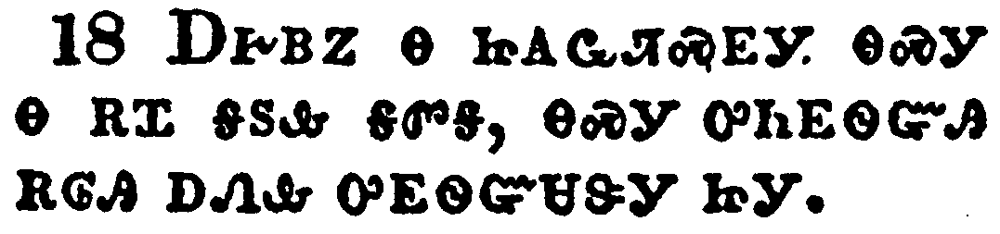</a></td>
</tr>
<tr class="even">
<td>And the woman which thou sawest is that great city, which reigneth over the kings of the earth.</td>
</tr>
<tr class="odd">
<td>ᎠᎨᏴᏃ Ꮎ ᏥᎪᏩᏘᏍᎬᎩ ᎾᏍᎩ Ꮎ ᎡᏆ ᎦᏚᎲ ᎦᏛᎦ, ᎾᏍᎩ ᎤᏂᎬᏫᏳᎯ ᎡᎶᎯ ᎠᏁᎲ ᎤᎬᏫᏳᏌᏕᎩ ᏥᎩ.</td>
</tr>
<tr class="even">
<td>A-ge-yv-no na tsi-go-wa-ti-s-gv-gi na-s-gi na e-qua ga-du-hv ga-dv-ga, na-s-gi u-ni-gv-wi-yu-hi e-lo-hi a-ne-hv u-gv-wi-yu-sa-de-gi tsi-gi.</td>
</tr>
</tbody>
</table>

