+++
draft=false
date = 2014-12-18T21:11:07Z
title = "Romans - Chapter 1 - Cherokee New Testament"
weight = 1418955067

[taxonomies]

authors = ["Timothy Legg"]
categories = []
tags = []

[extra]
+++

<table>
<tbody>
<tr class="odd">
<td><a href="060101.png">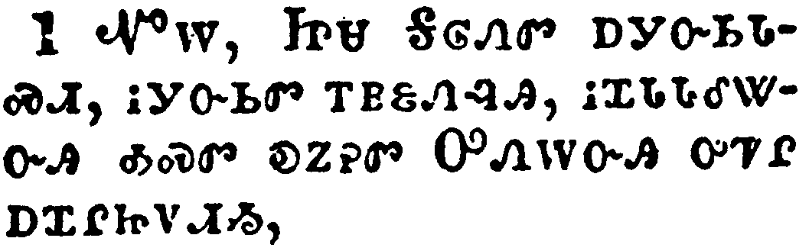</a></td>
</tr>
<tr class="even">
<td>Paul, a servant of Jesus Christ, called to be an apostle, separated unto the gospel of God,</td>
</tr>
<tr class="odd">
<td>ᏉᎳ, ᏥᏌ ᎦᎶᏁᏛ ᎠᎩᏅᏏᏓᏍᏗ, ᎥᎩᏅᏏᏛ ᎢᏴᏋᏁᎸᎯ, ᎥᏆᏓᏓᎴᏔᏅᎯ ᎣᏍᏛ ᎧᏃᎮᏛ ᎤᏁᎳᏅᎯ ᎤᏤᎵ ᎠᏆᎵᏥᏙᏗᏱ,</td>
</tr>
<tr class="even">
<td>Quo-la, Tsi-sa Ga-lo-ne-dv a-gi-nv-si-da-s-di, v-gi-nv-si-dv i-yv-quv-ne-lv-hi, v-qua-da-da-le-ta-nv-hi o-s-dv ka-no-he-dv U-ne-la-nv-hi u-tse-li a-qua-li-tsi-do-di-yi,</td>
</tr>
</tbody>
</table>

<table>
<tbody>
<tr class="odd">
<td><a href="060102.png">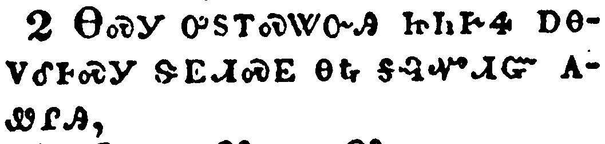</a></td>
</tr>
<tr class="even">
<td>(Which he had promised afore by his prophets in the holy scriptures,)</td>
</tr>
<tr class="odd">
<td>ᎾᏍᎩ ᎤᏚᎢᏍᏔᏅᎯ ᏥᏂᎨᏎ ᎠᎾᏙᎴᎰᏍᎩ ᏕᎬᏗᏍᎬ ᎾᎿᎭᎦᎸᏉᏗᏳ ᎪᏪᎵᎯ,</td>
</tr>
<tr class="even">
<td>Na-s-gi u-du-i-s-ta-nv-hi tsi-ni-ge-se a-na-do-le-ho-s-gi de-gv-di-s-gv na-hna ga-lv-quo-di-yu go-we-li-hi,</td>
</tr>
</tbody>
</table>

<table>
<tbody>
<tr class="odd">
<td><a href="060103.png">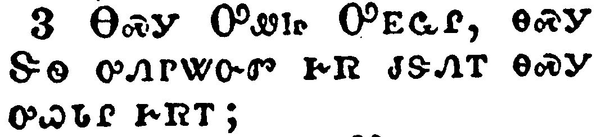</a></td>
</tr>
<tr class="even">
<td>Concerning his Son Jesus Christ our Lord, which was made of the seed of David according to the flesh;</td>
</tr>
<tr class="odd">
<td>ᎾᏍᎩ ᎤᏪᏥ ᎤᎬᏩᎵ, ᎾᏍᎩ ᏕᏫ ᎤᏁᏢᏔᏅᏛ ᎨᏒ ᏧᏕᏁᎢ ᎾᏍᎩ ᎤᏇᏓᎵ ᎨᏒᎢ;</td>
</tr>
<tr class="even">
<td>Na-s-gi U-we-tsi U-gv-wa-li, na-s-gi De-wi u-ne-tlv-ta-nv-dv ge-sv tsu-de-ne-i na-s-gi u-que-da-li ge-sv-i;</td>
</tr>
</tbody>
</table>

<table>
<tbody>
<tr class="odd">
<td><a href="060104.png">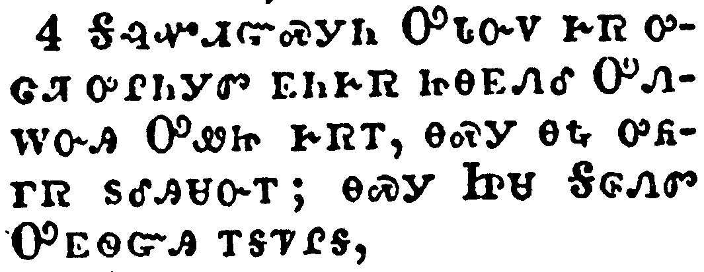</a></td>
</tr>
<tr class="even">
<td>And declared to be the Son of God with power, according to the spirit of holiness, by the resurrection from the dead:</td>
</tr>
<tr class="odd">
<td>ᎦᎸᏉᏗᏳᏍᎩᏂ ᎤᏓᏅᏙ ᎨᏒ ᎤᏣᏘ ᎤᎵᏂᎩᏛ ᎬᏂᎨᏒ ᏥᎾᎬᏁᎴ ᎤᏁᎳᏅᎯ ᎤᏪᏥ ᎨᏒᎢ, ᎾᏍᎩ ᎾᎿᎭᎤᏲᎱᏒ ᏚᎴᎯᏌᏅᎢ; ᎾᏍᎩ ᏥᏌ ᎦᎶᏁᏛ ᎤᎬᏫᏳᎯ ᎢᎦᏤᎵᎦ,</td>
</tr>
<tr class="even">
<td>Ga-lv-quo-di-yu-s-gi-ni U-da-nv-do ge-sv u-tsa-ti u-li-ni-gi-dv gv-ni-ge-sv tsi-na-gv-ne-le U-ne-la-nv-hi U-we-tsi ge-sv-i, na-s-gi na-hna u-yo-hu-sv du-le-hi-sa-nv-i; na-s-gi Tsi-sa Ga-lo-ne-dv U-gv-wi-yu-hi i-ga-tse-li-ga,</td>
</tr>
</tbody>
</table>

<table>
<tbody>
<tr class="odd">
<td><a href="060105.png">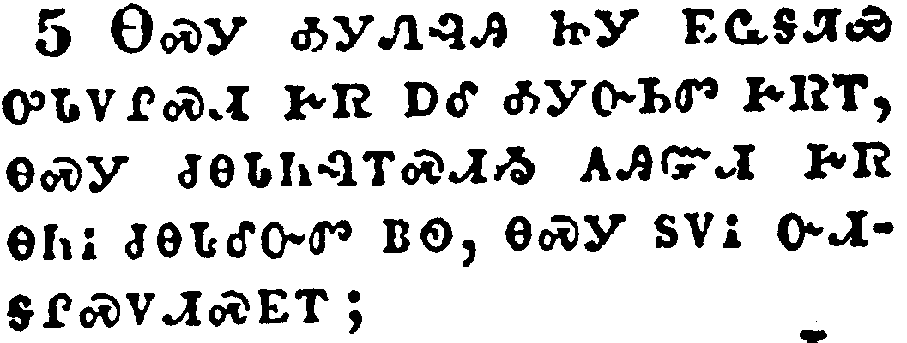</a></td>
</tr>
<tr class="even">
<td>By whom we have received grace and apostleship, for obedience to the faith among all nations, for his name:</td>
</tr>
<tr class="odd">
<td>ᎾᏍᎩ ᎣᎩᏁᎸᎯ ᏥᎩ ᎬᏩᎦᏘᏯ ᎤᏓᏙᎵᏍᏗ ᎨᏒ ᎠᎴ ᎣᎩᏅᏏᏛ ᎨᏒᎢ, ᎾᏍᎩ ᏧᎾᏓᏂᎸᎢᏍᏗᏱ ᎪᎯᏳᏗ ᎨᏒ ᎾᏂᎥ ᏧᎾᏓᎴᏅᏛ ᏴᏫ, ᎾᏍᎩ ᏚᏙᎥ ᏅᏗᎦᎵᏍᏙᏗᏍᎬᎢ;</td>
</tr>
<tr class="even">
<td>Na-s-gi o-gi-ne-lv-hi tsi-gi gv-wa-ga-ti-ya u-da-do-li-s-di ge-sv a-le o-gi-nv-si-dv ge-sv-i, na-s-gi tsu-na-da-ni-lv-i-s-di-yi go-hi-yu-di ge-sv na-ni-v tsu-na-da-le-nv-dv yv-wi, na-s-gi du-do-v nv-di-ga-li-s-do-di-s-gv-i;</td>
</tr>
</tbody>
</table>

<table>
<tbody>
<tr class="odd">
<td><a href="060106.png">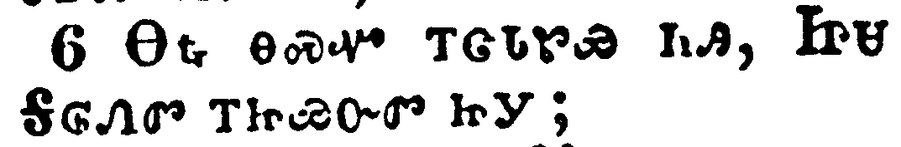</a></td>
</tr>
<tr class="even">
<td>Among whom are ye also the called of Jesus Christ:</td>
</tr>
<tr class="odd">
<td>ᎾᎿᎭᎾᏍᏉ ᎢᏣᏓᏑᏯ ᏂᎯ, ᏥᏌ ᎦᎶᏁᏛ ᎢᏥᏯᏅᏛ ᏥᎩ;</td>
</tr>
<tr class="even">
<td>Na-hna na-s-quo i-tsa-da-su-ya ni-hi, Tsi-sa Ga-lo-ne-dv i-tsi-ya-nv-dv tsi-gi;</td>
</tr>
</tbody>
</table>

<table>
<tbody>
<tr class="odd">
<td><a href="060107.png">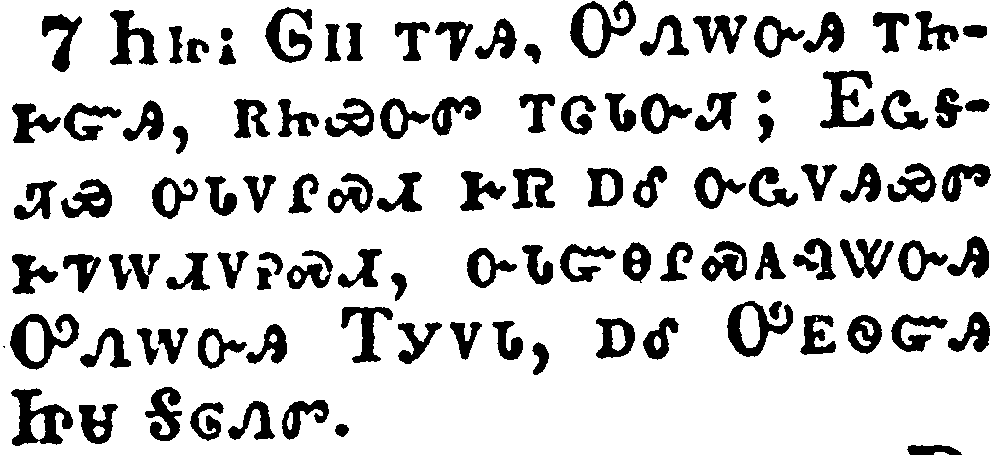</a></td>
</tr>
<tr class="even">
<td>To all that be in Rome, beloved of God, called to be saints: Grace to you and peace from God our Father, and the Lord Jesus Christ.</td>
</tr>
<tr class="odd">
<td>ᏂᏥᎥ ᎶᎻ, ᎤᏁᎳᏅᎯ ᎢᏥᎨᏳᎯ, ᎡᏥᏯᏅᏛ ᎢᏣᏓᏅᏘ; ᎬᏩᎦᏘᏯ ᎤᏓᏙᎵᏍᏗ ᎨᏒ ᎠᎴ ᏅᏩᏙᎯᏯᏛ ᎨᏤᎳᏗᏙᎮᏍᏗ, ᏅᏓᏳᎾᎵᏍᎪᎸᏔᏅᎯ ᎤᏁᎳᏅᎯ ᎢᎩᏙᏓ, ᎠᎴ ᎤᎬᏫᏳᎯ ᏥᏌ ᎦᎶᏁᏛ.</td>
</tr>
<tr class="even">
<td>Ni-tsi-v Lo-mi, U-ne-la-nv-hi i-tsi-ge-yu-hi, e-tsi-ya-nv-dv i-tsa-da-nv-ti; Gv-wa-ga-ti-ya u-da-do-li-s-di ge-sv a-le nv-wa-do-hi-ya-dv ge-tse-la-di-do-he-s-di, nv-da-yu-na-li-s-go-lv-ta-nv-hi U-ne-la-nv-hi I-gi-do-da, a-le U-gv-wi-yu-hi Tsi-sa Ga-lo-ne-dv.</td>
</tr>
</tbody>
</table>

<table>
<tbody>
<tr class="odd">
<td><a href="060108.png">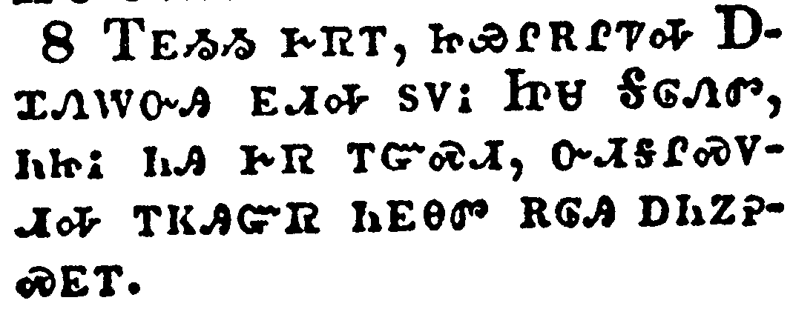</a></td>
</tr>
<tr class="even">
<td>First, I thank my God through Jesus Christ for you all, that your faith is spoken of throughout the whole world.</td>
</tr>
<tr class="odd">
<td>ᎢᎬᏱᏱ ᎨᏒᎢ, ᏥᏯᎵᎡᎵᏤᎭ ᎠᏆᏁᎳᏅᎯ ᎬᏗᎭ ᏚᏙᎥ ᏥᏌ ᎦᎶᏁᏛ, ᏂᏥᎥ ᏂᎯ ᎨᏒ ᎢᏳᏍᏗ, ᏅᏗᎦᎵᏍᏙᏗᎭ ᎢᏦᎯᏳᏒ ᏂᎬᎾᏛ ᎡᎶᎯ ᎠᏂᏃᎮᏍᎬᎢ.</td>
</tr>
<tr class="even">
<td>I-gv-yi-yi ge-sv-i, tsi-ya-li-e-li-tse-ha A-qua-ne-la-nv-hi gv-di-ha du-do-v Tsi-sa Ga-lo-ne-dv, ni-tsi-v ni-hi ge-sv i-yu-s-di, nv-di-ga-li-s-do-di-ha i-tso-hi-yu-sv ni-gv-na-dv e-lo-hi a-ni-no-he-s-gv-i.</td>
</tr>
</tbody>
</table>

<table>
<tbody>
<tr class="odd">
<td><a href="060109.png">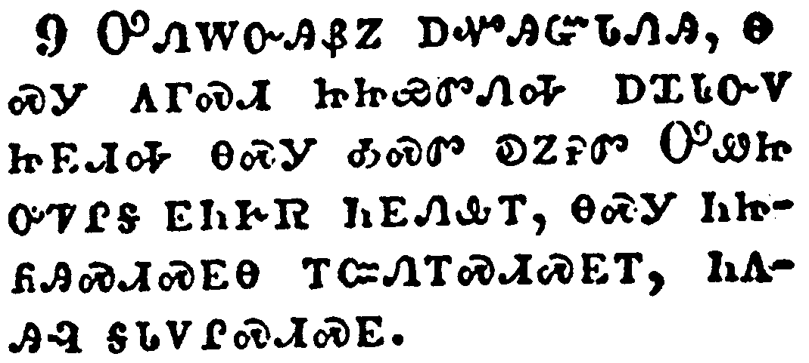</a></td>
</tr>
<tr class="even">
<td>For God is my witness, whom I serve with my spirit in the gospel of his Son, that without ceasing I make mention of you always in my prayers;</td>
</tr>
<tr class="odd">
<td>ᎤᏁᎳᏅᎯᏰᏃ ᎠᏉᎯᏳᏓᏁᎯ, ᎾᏍᎩ ᎪᎱᏍᏗ ᏥᏥᏯᏛᏁᎭ ᎠᏆᏓᏅᏙ ᏥᎬᏗᎭ ᎾᏍᎩ ᎣᏍᏛ ᎧᏃᎮᏛ ᎤᏪᏥ ᎤᏤᎵᎦ ᎬᏂᎨᏒ ᏂᎬᏁᎲᎢ, ᎾᏍᎩ ᏂᏥᏲᎯᏍᏗᏍᎬᎾ ᎢᏨᏁᎢᏍᏗᏍᎬᎢ, ᏂᎪᎯᎸ ᎦᏓᏙᎵᏍᏗᏍᎬ.</td>
</tr>
<tr class="even">
<td>U-ne-la-nv-hi-ye-no a-quo-hi-yu-da-ne-hi, na-s-gi go-hu-s-di tsi-tsi-ya-dv-ne-ha a-qua-da-nv-do tsi-gv-di-ha na-s-gi o-s-dv ka-no-he-dv U-we-tsi u-tse-li-ga gv-ni-ge-sv ni-gv-ne-hv-i, na-s-gi ni-tsi-yo-hi-s-di-s-gv-na i-tsv-ne-i-s-di-s-gv-i, ni-go-hi-lv ga-da-do-li-s-di-s-gv.</td>
</tr>
</tbody>
</table>

<table>
<tbody>
<tr class="odd">
<td><a href="060110.png">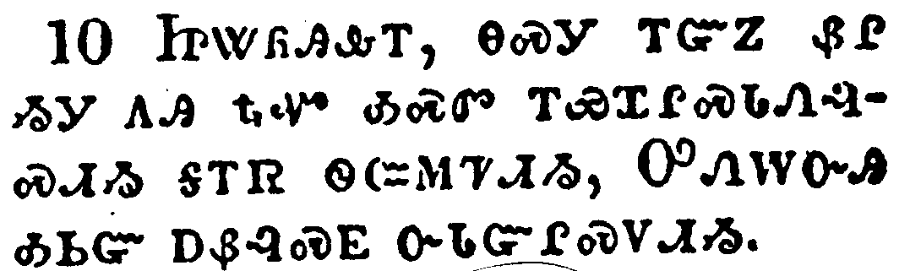</a></td>
</tr>
<tr class="even">
<td>Making request, if by any means now at length I might have a prosperous journey by the will of God to come unto you.</td>
</tr>
<tr class="odd">
<td>ᏥᏔᏲᎯᎲᎢ, ᎾᏍᎩ ᎢᏳᏃ ᏰᎵ ᏱᎩ ᎪᎯ ᎿᎭᏉ ᎣᏍᏛ ᎢᏯᏆᎵᏍᏓᏁᎸᏍᏗᏱ ᎦᎢᏒ ᏫᏨᎷᏤᏗᏱ, ᎤᏁᎳᏅᎯ ᎣᏏᏳ ᎠᏰᎸᏍᎬ ᏅᏓᏳᎵᏍᏙᏗᏱ.</td>
</tr>
<tr class="even">
<td>Tsi-ta-yo-hi-hv-i, na-s-gi i-yu-no ye-li yi-gi go-hi hna-quo o-s-dv i-ya-qua-li-s-da-ne-lv-s-di-yi ga-i-sv wi-tsv-lu-tse-di-yi, U-ne-la-nv-hi o-si-yu a-ye-lv-s-gv nv-da-yu-li-s-do-di-yi.</td>
</tr>
</tbody>
</table>

<table>
<tbody>
<tr class="odd">
<td><a href="060111.png">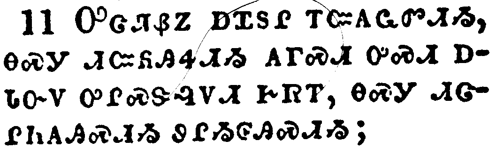</a></td>
</tr>
<tr class="even">
<td>For I long to see you, that I may impart unto you some spiritual gift, to the end ye may be established;</td>
</tr>
<tr class="odd">
<td>ᎤᏣᏘᏰᏃ ᎠᏆᏚᎵ ᎢᏨᎪᏩᏛᏗᏱ, ᎾᏍᎩ ᏗᏨᏲᎯᏎᏗᏱ ᎪᎱᏍᏗ ᎤᏍᏗ ᎠᏓᏅᏙ ᎤᎵᏍᏕᎸᏙᏗ ᎨᏒᎢ, ᎾᏍᎩ ᏗᏣᎵᏂᎪᎯᏍᏗᏱ ᏭᎵᏱᎶᎯᏍᏗᏱ;</td>
</tr>
<tr class="even">
<td>U-tsa-ti-ye-no a-qua-du-li i-tsv-go-wa-dv-di-yi, na-s-gi di-tsv-yo-hi-se-di-yi go-hu-s-di u-s-di a-da-nv-do u-li-s-de-lv-do-di ge-sv-i, na-s-gi di-tsa-li-ni-go-hi-s-di-yi wu-li-yi-lo-hi-s-di-yi;</td>
</tr>
</tbody>
</table>

<table>
<tbody>
<tr class="odd">
<td><a href="060112.png">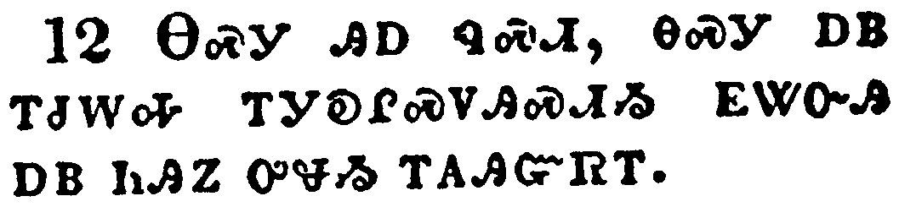</a></td>
</tr>
<tr class="even">
<td>That is, that I may be comforted together with you by the mutual faith both of you and me.</td>
</tr>
<tr class="odd">
<td>ᎾᏍᎩ ᎯᎠ ᏄᏍᏗ, ᎾᏍᎩ ᎠᏴ ᎢᏧᎳᎭ ᎢᎩᎧᎵᏍᏙᎯᏍᏗᏱ ᎬᏔᏅᎯ ᎠᏴ ᏂᎯᏃ ᎤᏠᏱ ᎢᎪᎯᏳᏒᎢ.</td>
</tr>
<tr class="even">
<td>Na-s-gi hi-a nu-s-di, na-s-gi a-yv i-tsu-la-ha i-gi-ka-li-s-do-hi-s-di-yi gv-ta-nv-hi a-yv ni-hi-no u-tlo-yi i-go-hi-yu-sv-i.</td>
</tr>
</tbody>
</table>

<table>
<tbody>
<tr class="odd">
<td><a href="060113.png">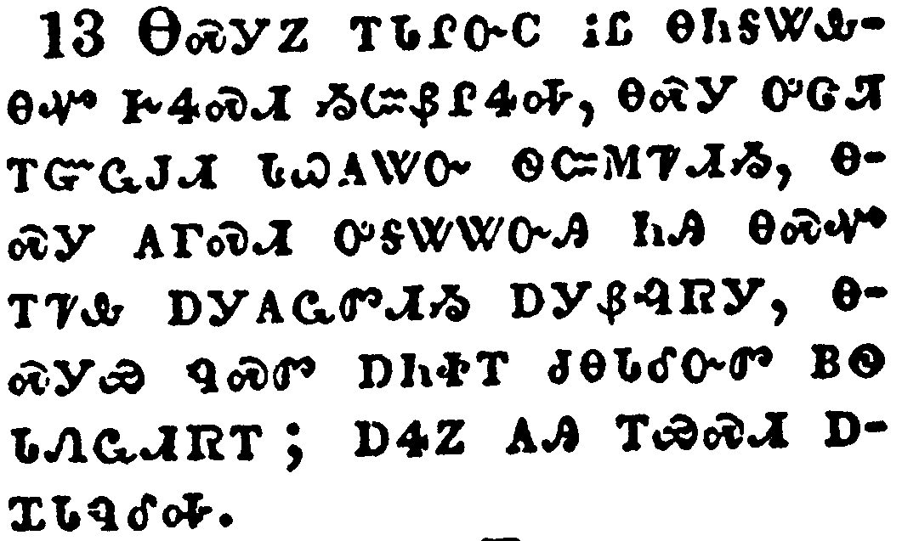</a></td>
</tr>
<tr class="even">
<td>Now I would not have you ignorant, brethren, that oftentimes I purposed to come unto you, (but was let hitherto,) that I might have some fruit among you also, even as among other Gentiles.</td>
</tr>
<tr class="odd">
<td>ᎾᏍᎩᏃ ᎢᏓᎵᏅᏟ ᎥᏝ ᎾᏂᎦᏔᎲᎾᏉ ᎨᏎᏍᏗ ᏱᏨᏰᎵᏎᎭ, ᎾᏍᎩ ᎤᏣᏘ ᎢᏳᏩᎫᏗ ᏓᏇᎪᏔᏅ ᏫᏨᎷᏤᏗᏱ, ᎾᏍᎩ ᎪᎱᏍᏗ ᎤᎦᏔᏔᏅᎯ ᏂᎯ ᎾᏍᏉ ᎢᏤᎲ ᎠᎩᎪᏩᏛᏗᏱ ᎠᎩᏰᎸᏒᎩ, ᎾᏍᎩᏯ ᏄᏍᏛ ᎠᏂᏐᎢ ᏧᎾᏓᎴᏅᏛ ᏴᏫ ᏓᏁᏩᏗᏒᎢ; ᎠᏎᏃ ᎪᎯ ᎢᏯᏍᏗ ᎠᏆᏓᏄᎴᎭ.</td>
</tr>
<tr class="even">
<td>Na-s-gi-no i-da-li-nv-tli v-tla na-ni-ga-ta-hv-na-quo ge-se-s-di yi-tsv-ye-li-se-ha, na-s-gi u-tsa-ti i-yu-wa-gu-di da-que-go-ta-nv wi-tsv-lu-tse-di-yi, na-s-gi go-hu-s-di u-ga-ta-ta-nv-hi ni-hi na-s-quo i-tse-hv a-gi-go-wa-dv-di-yi a-gi-ye-lv-sv-gi, na-s-gi-ya nu-s-dv a-ni-so-i tsu-na-da-le-nv-dv yv-wi da-ne-wa-di-sv-i; a-se-no go-hi i-ya-s-di a-qua-da-nu-le-ha.</td>
</tr>
</tbody>
</table>

<table>
<tbody>
<tr class="odd">
<td><a href="060114.png">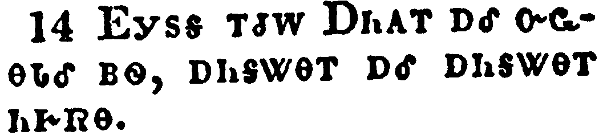</a></td>
</tr>
<tr class="even">
<td>I am debtor both to the Greeks, and to the Barbarians; both to the wise, and to the unwise.</td>
</tr>
<tr class="odd">
<td>ᎬᎩᏚᎦ ᎢᏧᎳ ᎠᏂᎪᎢ ᎠᎴ ᏅᏩᎾᏓᎴ ᏴᏫ, ᎠᏂᎦᏔᎾᎢ ᎠᎴ ᎠᏂᎦᏔᎾᎢ ᏂᎨᏒᎾ.</td>
</tr>
<tr class="even">
<td>Gv-gi-du-ga i-tsu-la A-ni-go-i a-le nv-wa-na-da-le yv-wi, a-ni-ga-ta-na-i a-le a-ni-ga-ta-na-i ni-ge-sv-na.</td>
</tr>
</tbody>
</table>

<table>
<tbody>
<tr class="odd">
<td><a href="060115.png">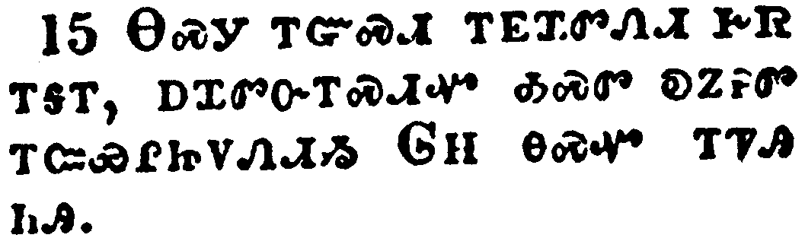</a></td>
</tr>
<tr class="even">
<td>So, as much as in me is, I am ready to preach the gospel to you that are at Rome also.</td>
</tr>
<tr class="odd">
<td>ᎾᏍᎩ ᎢᏳᏍᏗ ᎢᎬᏆᏛᏁᏗ ᎨᏒ ᎢᎦᎢ, ᎠᏆᏛᏅᎢᏍᏗᏉ ᎣᏍᏛ ᎧᏃᎮᏛ ᎢᏨᏯᎵᏥᏙᏁᏗᏱ ᎶᎻ ᎾᏍᏉ ᎢᏤᎯ ᏂᎯ.</td>
</tr>
<tr class="even">
<td>Na-s-gi i-yu-s-di i-gv-qua-dv-ne-di ge-sv i-ga-i, a-qua-dv-nv-i-s-di-quo o-s-dv ka-no-he-dv i-tsv-ya-li-tsi-do-ne-di-yi Lo-mi na-s-quo i-tse-hi ni-hi.</td>
</tr>
</tbody>
</table>

<table>
<tbody>
<tr class="odd">
<td></td>
</tr>
<tr class="even">
<td>For I am not ashamed of the gospel of Christ: for it is the power of God unto salvation to every one that believeth; to the Jew first, and also to the Greek.</td>
</tr>
<tr class="odd">
<td>ᎥᏝᏰᏃ ᏱᎦᏕᎣᏍᎦ ᎣᏍᏛ ᎧᏃᎮᏛ ᎦᎶᏁᏛ ᎤᏤᎵᎦ; ᎾᏍᎩᏰᏃ ᎤᏁᎳᏅᎯ ᎤᎵᏂᎩᏗᏳ ᎨᏒ ᎬᏂᎨᏒ ᎢᎬᏁᎯ, ᎾᏍᎩ ᎾᎿᎭᎠᎾᎵᏍᏕᎸᏙᏗᏍᎬ ᎾᏂᎥ ᎠᏃᎯᏳᎲᏍᎩ; ᎠᏂᏧᏏ ᎢᎬᏱ, ᎠᎴ ᎾᏍᏉ ᎠᏂᎪᎢ.</td>
</tr>
<tr class="even">
<td>V-tla-ye-no yi-ga-de-o-s-ga o-s-dv ka-no-he-dv Ga-lo-ne-dv u-tse-li-ga; na-s-gi-ye-no U-ne-la-nv-hi u-li-ni-gi-di-yu ge-sv gv-ni-ge-sv i-gv-ne-hi, na-s-gi na-hna a-na-li-s-de-lv-do-di-s-gv na-ni-v a-no-hi-yu-hv-s-gi; A-ni-tsu-si i-gv-yi, a-le na-s-quo A-ni-go-i.</td>
</tr>
</tbody>
</table>

<table>
<tbody>
<tr class="odd">
<td><a href="060117.png">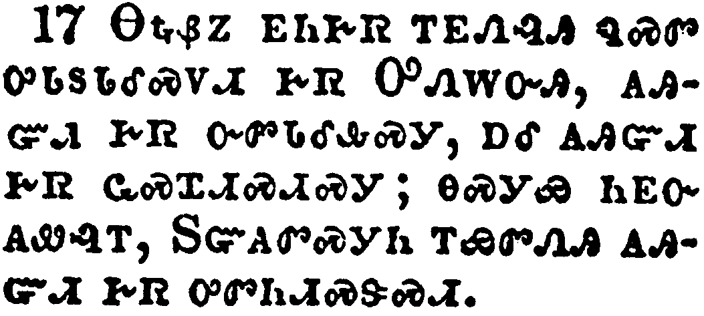</a></td>
</tr>
<tr class="even">
<td>For therein is the righteousness of God revealed from faith to faith: as it is written, The just shall live by faith.</td>
</tr>
<tr class="odd">
<td>ᎾᎿᎭᏰᏃ ᎬᏂᎨᏒ ᎢᎬᏁᎸᎯ ᏄᏍᏛ ᎤᏓᏚᏓᎴᏍᏙᏗ ᎨᏒ ᎤᏁᎳᏅᎯ, ᎪᎯᏳᏗ ᎨᏒ ᏅᏛᏓᎴᎲᏍᎩ, ᎠᎴ ᎪᎯᏳᏗ ᎨᏒ ᏩᏍᏆᏗᏍᏗᏍᎩ; ᎾᏍᎩᏯ ᏂᎬᏅᎪᏪᎸᎢ, ᏚᏳᎪᏛᏍᎩᏂ ᎢᏯᏛᏁᎯ ᎪᎯᏳᏗ ᎨᏒ ᎤᏛᏂᏗᏍᏕᏍᏗ.</td>
</tr>
<tr class="even">
<td>Na-hna-ye-no gv-ni-ge-sv i-gv-ne-lv-hi nu-s-dv u-da-du-da-le-s-do-di ge-sv U-ne-la-nv-hi, go-hi-yu-di ge-sv nv-dv-da-le-hv-s-gi, a-le go-hi-yu-di ge-sv wa-s-qua-di-s-di-s-gi; na-s-gi-ya ni-gv-nv-go-we-lv-i, Du-yu-go-dv-s-gi-ni i-ya-dv-ne-hi go-hi-yu-di ge-sv u-dv-ni-di-s-de-s-di.</td>
</tr>
</tbody>
</table>

<table>
<tbody>
<tr class="odd">
<td><a href="060118.png">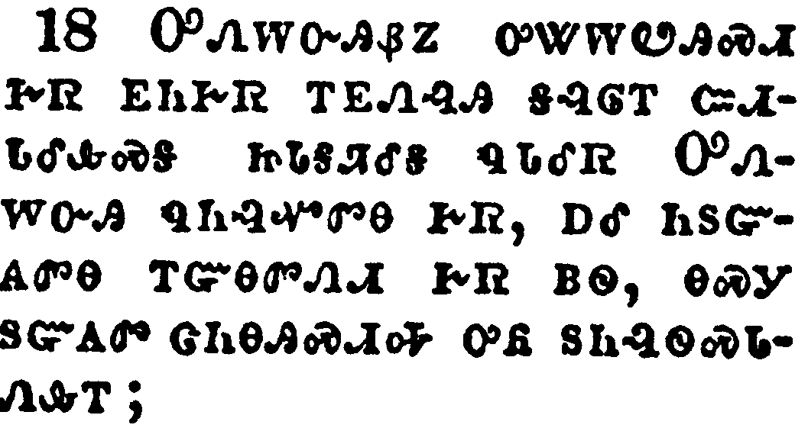</a></td>
</tr>
<tr class="even">
<td>For the wrath of God is revealed from heaven against all ungodliness and unrighteousness of men, who hold the truth in unrighteousness;</td>
</tr>
<tr class="odd">
<td>ᎤᎾᎳᏅᎯᏰᏃ ᎤᏔᎳᏬᎯᏍᏗ ᎨᏒ ᎬᏂᎨᏒ ᎢᎬᏁᎸᎯ ᎦᎸᎶᎢ ᏨᏗᏓᎴᎲᏍᎦ ᏥᏓᎦᏘᎴᎦ ᏄᏓᎴᏒ ᎤᏁᎳᏅᎯ ᏄᏂᎸᏉᏛᎾ ᎨᏒ, ᎠᎴ ᏂᏚᏳᎪᏛᎾ ᎢᏳᎾᏛᏁᏗ ᎨᏒ ᏴᏫ, ᎾᏍᎩ ᏚᏳᎪᏛ ᏣᏂᎾᎯᏍᏗᎭ ᎤᏲ ᏚᏂᎸᏫᏍᏓᏁᎲᎢ;</td>
</tr>
<tr class="even">
<td>U-na-la-nv-hi-ye-no u-ta-la-wo-hi-s-di ge-sv gv-ni-ge-sv i-gv-ne-lv-hi ga-lv-lo-i tsv-di-da-le-hv-s-ga tsi-da-ga-ti-le-ga nu-da-le-sv U-ne-la-nv-hi nu-ni-lv-quo-dv-na ge-sv, a-le ni-du-yu-go-dv-na i-yu-na-dv-ne-di ge-sv yv-wi, na-s-gi du-yu-go-dv tsa-ni-na-hi-s-di-ha u-yo du-ni-lv-wi-s-da-ne-hv-i;</td>
</tr>
</tbody>
</table>

<table>
<tbody>
<tr class="odd">
<td><a href="060119.png">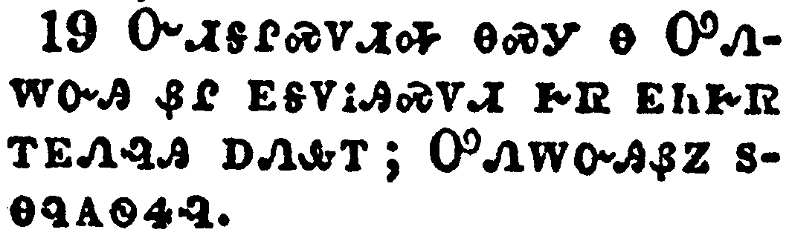</a></td>
</tr>
<tr class="even">
<td>Because that which may be known of God is manifest in them; for God hath shewed it unto them.</td>
</tr>
<tr class="odd">
<td>ᏅᏗᎦᎵᏍᏙᏗᎭ ᎾᏍᎩ Ꮎ ᎤᏁᎳᏅᎯ ᏰᎵ ᎬᎦᏙᎥᎯᏍᏙᏗ ᎨᏒ ᎬᏂᎨᏒ ᎢᎬᏁᎸᎯ ᎠᏁᎲᎢ; ᎤᏁᎳᏅᎯᏰᏃ ᏚᎾᏄᎪᏫᏎᎸ.</td>
</tr>
<tr class="even">
<td>Nv-di-ga-li-s-do-di-ha na-s-gi na U-ne-la-nv-hi ye-li gv-ga-do-v-hi-s-do-di ge-sv gv-ni-ge-sv i-gv-ne-lv-hi a-ne-hv-i; U-ne-la-nv-hi-ye-no du-na-nu-go-wi-se-lv.</td>
</tr>
</tbody>
</table>

<table>
<tbody>
<tr class="odd">
<td><a href="060120.png">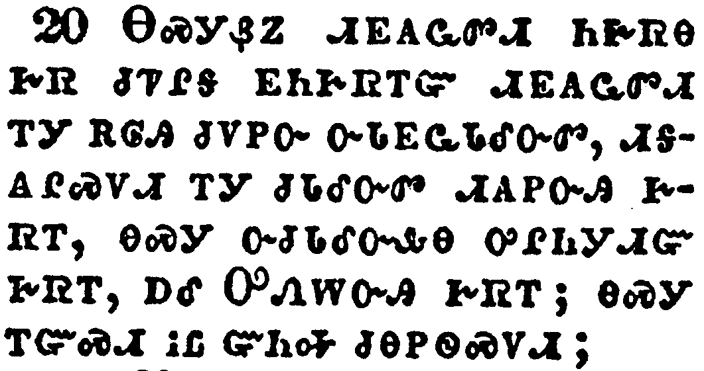</a></td>
</tr>
<tr class="even">
<td>For the invisible things of him from the creation of the world are clearly seen, being understood by the things that are made, even his eternal power and Godhead; so that they are without excuse:</td>
</tr>
<tr class="odd">
<td>ᎾᏍᎩᏰᏃ ᏗᎬᎪᏩᏛᏗ ᏂᎨᏒᎾ ᎨᏒ ᏧᏤᎵᎦ ᎬᏂᎨᏒᎢᏳ ᏗᎬᎪᏩᏛᏗ ᎢᎩ ᎡᎶᎯ ᏧᏙᏢᏅ ᏅᏓᎬᏩᏓᎴᏅᏛ, ᏗᎦᎪᎵᏍᏙᏗ ᎢᎩ ᏧᏓᎴᏅᏛ ᏗᎪᏢᏅᎯ ᎨᏒᎢ, ᎾᏍᎩ ᏅᏧᏓᎴᏅᎲᎾ ᎤᎵᏂᎩᏗᏳ ᎨᏒᎢ, ᎠᎴ ᎤᏁᎳᏅᎯ ᎨᏒᎢ; ᎾᏍᎩ ᎢᏳᏍᏗ ᎥᏝ ᏳᏂᎭ ᏧᎾᏢᏫᏍᏙᏗ;</td>
</tr>
<tr class="even">
<td>Na-s-gi-ye-no di-gv-go-wa-dv-di ni-ge-sv-na ge-sv tsu-tse-li-ga gv-ni-ge-sv-i-yu di-gv-go-wa-dv-di i-gi e-lo-hi tsu-do-tlv-nv nv-da-gv-wa-da-le-nv-dv, di-ga-go-li-s-do-di i-gi tsu-da-le-nv-dv di-go-tlv-nv-hi ge-sv-i, na-s-gi nv-tsu-da-le-nv-hv-na u-li-ni-gi-di-yu ge-sv-i, a-le U-ne-la-nv-hi ge-sv-i; na-s-gi i-yu-s-di v-tla yu-ni-ha tsu-na-tlv-wi-s-do-di;</td>
</tr>
</tbody>
</table>

<table>
<tbody>
<tr class="odd">
<td><a href="060121.png">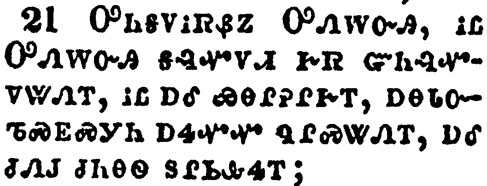</a></td>
</tr>
<tr class="even">
<td>Because that, when they knew God, they glorified him not as God, neither were thankful; but became vain in their imaginations, and their foolish heart was darkened.</td>
</tr>
<tr class="odd">
<td>ᎤᏂᎦᏙᎥᏒᏰᏃ ᎤᏁᎳᏅᎯ, ᎥᏝ ᎤᏁᎳᏅᎯ ᎦᎸᏉᏙᏗ ᎨᏒ ᏳᏂᎸᏉᏙᏔᏁᎢ, ᎥᏝ ᎠᎴ ᏯᎾᎵᎮᎵᎨᎢ, ᎠᎾᏓᏅᏖᏍᎬᏍᎩᏂ ᎠᏎᏉᏉ ᏄᎵᏍᏔᏁᎢ, ᎠᎴ ᏧᏁᎫ ᏧᏂᎾᏫ ᏚᎵᏏᎲᏎᎢ;</td>
</tr>
<tr class="even">
<td>U-ni-ga-do-v-sv-ye-no U-ne-la-nv-hi, v-tla U-ne-la-nv-hi ga-lv-quo-do-di ge-sv yu-ni-lv-quo-do-ta-ne-i, v-tla a-le ya-na-li-he-li-ge-i, a-na-da-nv-te-s-gv-s-gi-ni a-se-quo-quo nu-li-s-ta-ne-i, a-le tsu-ne-gu tsu-ni-na-wi du-li-si-hv-se-i;</td>
</tr>
</tbody>
</table>

<table>
<tbody>
<tr class="odd">
<td><a href="060122.png">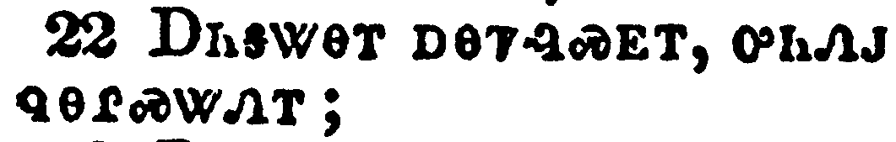</a></td>
</tr>
<tr class="even">
<td>Professing themselves to be wise, they became fools,</td>
</tr>
<tr class="odd">
<td>ᎠᏂᎦᏔᎾᎢ ᎠᎾᏤᎸᏍᎬᎢ, ᎤᏂᏁᎫ ᏄᎾᎵᏍᏔᏁᎢ;</td>
</tr>
<tr class="even">
<td>A-ni-ga-ta-na-i a-na-tse-lv-s-gv-i, u-ni-ne-gu nu-na-li-s-ta-ne-i;</td>
</tr>
</tbody>
</table>

<table>
<tbody>
<tr class="odd">
<td><a href="060123.png">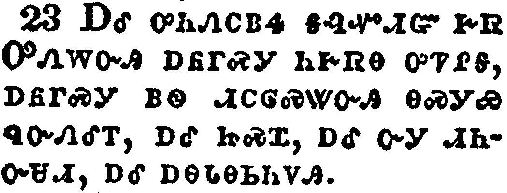</a></td>
</tr>
<tr class="even">
<td>And changed the glory of the uncorruptible God into an image made like to corruptible man, and to birds, and fourfooted beasts, and creeping things.</td>
</tr>
<tr class="odd">
<td>ᎠᎴ ᎤᏂᏁᏟᏴᏎ ᎦᎸᏉᏗᏳ ᎨᏒ ᎤᏁᎳᏅᎯ ᎠᏲᎱᏍᎩ ᏂᎨᏒᎾ ᎤᏤᎵᎦ, ᎠᏲᎱᏍᎩ ᏴᏫ ᏗᏟᎶᏍᏔᏅᎯ ᎾᏍᎩᏯ ᏄᏅᏁᎴᎢ, ᎠᎴ ᏥᏍᏆ, ᎠᎴ ᏅᎩ ᏗᏂᏅᏌᏗ, ᎠᎴ ᎠᎾᏓᎾᏏᏂᏙᎯ.</td>
</tr>
<tr class="even">
<td>A-le u-ni-ne-tli-yv-se ga-lv-quo-di-yu ge-sv U-ne-la-nv-hi a-yo-hu-s-gi ni-ge-sv-na u-tse-li-ga, a-yo-hu-s-gi yv-wi di-tli-lo-s-ta-nv-hi na-s-gi-ya nu-nv-ne-le-i, a-le tsi-s-qua, a-le nv-gi di-ni-nv-sa-di, a-le a-na-da-na-si-ni-do-hi.</td>
</tr>
</tbody>
</table>

<table>
<tbody>
<tr class="odd">
<td><a href="060124.png">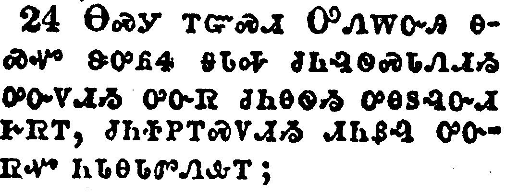</a></td>
</tr>
<tr class="even">
<td>Wherefore God also gave them up to uncleanness through the lusts of their own hearts, to dishonour their own bodies between themselves:</td>
</tr>
<tr class="odd">
<td>ᎾᏍᎩ ᎢᏳᏍᏗ ᎤᏁᎳᏅᎯ ᎾᏍᏉ ᏕᎤᏲᏎ ᎦᏓᎭ ᏧᏂᎸᏫᏍᏓᏁᏗᏱ ᎤᏅᏙᏗᏱ ᎤᏅᏒ ᏧᏂᎾᏫᏱ ᎤᎾᏑᎸᏅᏗ ᎨᏒᎢ, ᏧᏂᏐᏢᎢᏍᏙᏗᏱ ᏗᏂᏰᎸ ᎤᏅᏒᏉ ᏂᏓᎾᏓᏛᏁᎲᎢ;</td>
</tr>
<tr class="even">
<td>Na-s-gi i-yu-s-di U-ne-la-nv-hi na-s-quo de-u-yo-se ga-da-ha tsu-ni-lv-wi-s-da-ne-di-yi u-nv-do-di-yi u-nv-sv tsu-ni-na-wi-yi u-na-su-lv-nv-di ge-sv-i, tsu-ni-so-tlv-i-s-do-di-yi di-ni-ye-lv u-nv-sv-quo ni-da-na-da-dv-ne-hv-i;</td>
</tr>
</tbody>
</table>

<table>
<tbody>
<tr class="odd">
<td><a href="060125.png">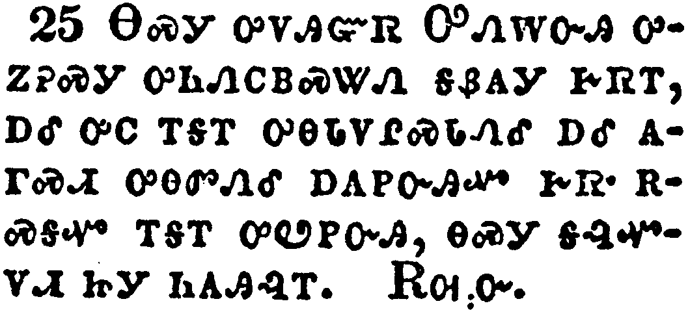</a></td>
</tr>
<tr class="even">
<td>Who changed the truth of God into a lie, and worshipped and served the creature more than the Creator, who is blessed for ever. Amen.</td>
</tr>
<tr class="odd">
<td>ᎾᏍᎩ ᎤᏙᎯᏳᏒ ᎤᏁᎳᏅᎯ ᎤᏃᎮᏍᎩ ᎤᏂᏁᏟᏴᏍᏔᏁ ᎦᏰᎪᎩ ᎨᏒᎢ, ᎠᎴ ᎤᏟ ᎢᎦᎢ ᎤᎾᏓᏙᎵᏍᏓᏁᎴ ᎠᎴ ᎪᎱᏍᏗ ᎤᎾᏛᏁᎴ ᎠᎪᏢᏅᎯᏉ ᎨᏒ ᎡᏍᎦᏉ ᎢᎦᎢ ᎤᏬᏢᏅᎯ, ᎾᏍᎩ ᎦᎸᏉᏙᏗ ᏥᎩ ᏂᎪᎯᎸᎢ. ᎡᎺᏅ.</td>
</tr>
<tr class="even">
<td>Na-s-gi u-do-hi-yu-sv U-ne-la-nv-hi u-no-he-s-gi u-ni-ne-tli-yv-s-ta-ne ga-ye-go-gi ge-sv-i, a-le u-tli i-ga-i u-na-da-do-li-s-da-ne-le a-le go-hu-s-di u-na-dv-ne-le a-go-tlv-nv-hi-quo ge-sv e-s-ga-quo i-ga-i u-wo-tlv-nv-hi, na-s-gi ga-lv-quo-do-di tsi-gi ni-go-hi-lv-i. E-me-nv.</td>
</tr>
</tbody>
</table>

<table>
<tbody>
<tr class="odd">
<td><a href="060126.png">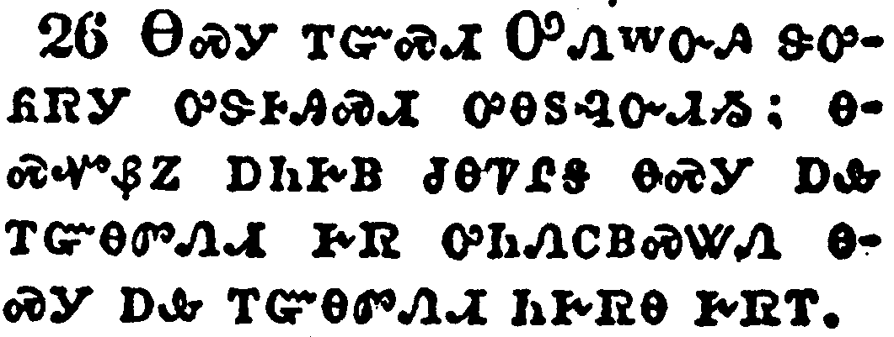</a></td>
</tr>
<tr class="even">
<td>For this cause God gave them up unto vile affections: for even their women did change the natural use into that which is against nature:</td>
</tr>
<tr class="odd">
<td>ᎾᏍᎩ ᎢᏳᏍᏗ ᎤᏁᎳᏅᎯ ᏕᎤᏲᏒᎩ ᎤᏕᎰᎯᏍᏗ ᎤᎾᏚᎸᏅᏗᏱ; ᎾᏍᏉᏰᏃ ᎠᏂᎨᏴ ᏧᎾᏤᎵᎦ ᎾᏍᎩ ᎠᎲ ᎢᏳᎾᏛᏁᏗ ᎨᏒ ᎤᏂᏁᏟᏴᏍᏔᏁ ᎾᏍᎩ ᎠᎲ ᎢᏳᎾᏛᏁᏗ ᏂᎨᏒᎾ ᎨᏒᎢ.</td>
</tr>
<tr class="even">
<td>Na-s-gi i-yu-s-di U-ne-la-nv-hi de-u-yo-sv-gi u-de-ho-hi-s-di u-na-du-lv-nv-di-yi; na-s-quo-ye-no a-ni-ge-yv tsu-na-tse-li-ga na-s-gi a-hv i-yu-na-dv-ne-di ge-sv u-ni-ne-tli-yv-s-ta-ne na-s-gi a-hv i-yu-na-dv-ne-di ni-ge-sv-na ge-sv-i.</td>
</tr>
</tbody>
</table>

<table>
<tbody>
<tr class="odd">
<td><a href="060127.png">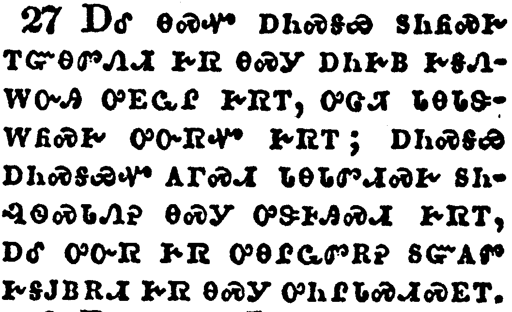</a></td>
</tr>
<tr class="even">
<td>And likewise also the men, leaving the natural use of the woman, burned in their lust one toward another; men with men working that which is unseemly, and receiving in themselves that recompence of their error which was meet.</td>
</tr>
<tr class="odd">
<td>ᎠᎴ ᎾᏍᏉ ᎠᏂᏍᎦᏯ ᏚᏂᏲᏍᎨ ᎢᏳᎾᏛᏁᏗ ᎨᏒ ᎾᏍᎩ ᎠᏂᎨᏴ ᎨᎦᏁᎳᏅᎯ ᎤᎬᏩᎵ ᎨᏒᎢ, ᎤᏣᏘ ᏓᎾᏓᏕᎳᏲᏍᎨ ᎤᏅᏒᏉ ᎨᏒᎢ; ᎠᏂᏍᎦᏯ ᎠᏂᏍᎦᏯᏉ ᎪᎱᏍᏗ ᏓᎾᏓᏛᏗᏍᎨ ᏚᏂᎸᏫᏍᏓᏁᎮ ᎾᏍᎩ ᎤᏕᎰᎯᏍᏗ ᎨᏒᎢ, ᎠᎴ ᎤᏅᏒ ᎨᏒ ᎤᎾᎵᏩᏛᎡᎮ ᏚᏳᎪᏛ ᎨᎦᎫᏴᎡᏗ ᎨᏒ ᎾᏍᎩ ᎤᏂᎵᏓᏍᏗᏍᎬᎢ.</td>
</tr>
<tr class="even">
<td>A-le na-s-quo a-ni-s-ga-ya du-ni-yo-s-ge i-yu-na-dv-ne-di ge-sv na-s-gi a-ni-ge-yv ge-ga-ne-la-nv-hi u-gv-wa-li ge-sv-i, u-tsa-ti da-na-da-de-la-yo-s-ge u-nv-sv-quo ge-sv-i; a-ni-s-ga-ya a-ni-s-ga-ya-quo go-hu-s-di da-na-da-dv-di-s-ge du-ni-lv-wi-s-da-ne-he na-s-gi u-de-ho-hi-s-di ge-sv-i, a-le u-nv-sv ge-sv u-na-li-wa-dv-e-he du-yu-go-dv ge-ga-gu-yv-e-di ge-sv na-s-gi u-ni-li-da-s-di-s-gv-i.</td>
</tr>
</tbody>
</table>

<table>
<tbody>
<tr class="odd">
<td><a href="060128.png">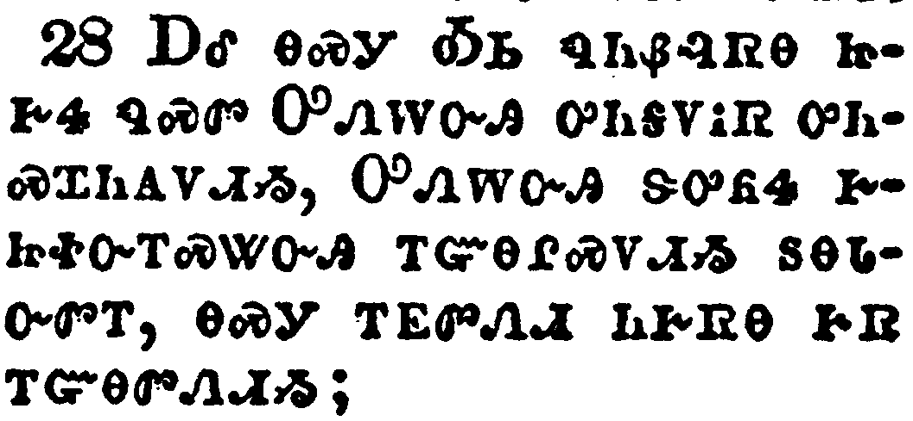</a></td>
</tr>
<tr class="even">
<td>And even as they did not like to retain God in their knowledge, God gave them over to a reprobate mind, to do those things which are not convenient;</td>
</tr>
<tr class="odd">
<td>ᎠᎴ ᎾᏍᎩ ᎣᏏ ᏄᏂᏰᎸᏒᎾ ᏥᎨᏎ ᏄᏍᏛ ᎤᏁᎳᏅᎯ ᎤᏂᎦᏙᎥᏒ ᎤᏂᏍᏆᏂᎪᏙᏗᏱ, ᎤᏁᎳᏅᎯ ᏕᎤᏲᏎ ᎨᏥᏐᏅᎢᏍᏔᏅᎯ ᎢᏳᎾᎵᏍᏙᏗᏱ ᏚᎾᏓᏅᏛᎢ, ᎾᏍᎩ ᎢᎬᏛᏁᏗ ᏂᎨᏒᎾ ᎨᏒ ᎢᏳᎾᏛᏁᏗᏱ;</td>
</tr>
<tr class="even">
<td>A-le na-s-gi O-si nu-ni-ye-lv-sv-na tsi-ge-se nu-s-dv U-ne-la-nv-hi u-ni-ga-do-v-sv u-ni-s-qua-ni-go-do-di-yi, U-ne-la-nv-hi de-u-yo-se ge-tsi-so-nv-i-s-ta-nv-hi i-yu-na-li-s-do-di-yi du-na-da-nv-dv-i, na-s-gi i-gv-dv-ne-di ni-ge-sv-na ge-sv i-yu-na-dv-ne-di-yi;</td>
</tr>
</tbody>
</table>

<table>
<tbody>
<tr class="odd">
<td></td>
</tr>
<tr class="even">
<td>Being filled with all unrighteousness, fornication, wickedness, covetousness, maliciousness; full of envy, murder, debate, deceit, malignity; whisperers,</td>
</tr>
<tr class="odd">
<td>ᎤᏂᎧᎵᏨᎯ ᎨᏒ ᏄᏓᎴᏒ ᏂᏚᏳᎪᏛᎾ ᎨᏒᎢ, ᎤᏕᎵᏛ ᏗᏂᏏᏗ ᎨᏒᎢ, ᎤᏲ ᎢᏯᏓᏛᏁᏗ ᎨᏒᎢ, ᏧᎬᏩᎶᏗ ᎠᎬᎥᎯᏍᏗ ᎨᏒᎢ, ᎤᏂᏲ ᎨᏒᎢ; ᎤᏂᎧᎵᏨᎯ ᎠᏛᏳᎨᏗ ᎨᏒᎢ, ᏗᏓᎯᏍᏗ ᎨᏒᎢ, ᏗᏘᏲᏍᏗ ᎨᏒᎢ, ᎠᏠᏄᎮᏛ, ᎤᏲ ᏗᎦᎸᏫᏍᏓᏁᏗ ᎨᏒᎢ; ᎠᎾᏙᏅᎢᎯ,</td>
</tr>
<tr class="even">
<td>U-ni-ka-li-tsv-hi ge-sv nu-da-le-sv ni-du-yu-go-dv-na ge-sv-i, u-de-li-dv di-ni-si-di ge-sv-i, u-yo i-ya-da-dv-ne-di ge-sv-i, tsu-gv-wa-lo-di a-gv-v-hi-s-di ge-sv-i, u-ni-yo ge-sv-i; u-ni-ka-li-tsv-hi a-dv-yu-ge-di ge-sv-i, di-da-hi-s-di ge-sv-i, di-ti-yo-s-di ge-sv-i, a-tlo-nu-he-dv, u-yo di-ga-lv-wi-s-da-ne-di ge-sv-i; a-na-do-nv-i-hi,</td>
</tr>
</tbody>
</table>

<table>
<tbody>
<tr class="odd">
<td><a href="060130.png">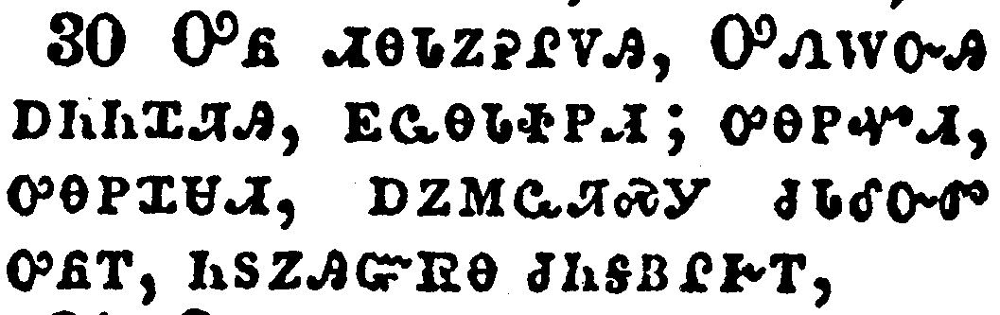</a></td>
</tr>
<tr class="even">
<td>Backbiters, haters of God, despiteful, proud, boasters, inventors of evil things, disobedient to parents,</td>
</tr>
<tr class="odd">
<td>ᎤᏲ ᏗᎾᏓᏃᎮᎵᏙᎯ, ᎤᏁᎳᏅᎯ ᎠᏂᏂᏆᏘᎯ, ᎬᏩᎾᏓᏐᏢᏗ; ᎤᎾᏢᏉᏗ, ᎤᎾᏢᏆᏌᏗ, ᎠᏃᎷᏩᏘᏍᎩ ᏧᏓᎴᏅᏛ ᎤᏲᎢ, ᏂᏚᏃᎯᏳᏒᎾ ᏧᏂᎦᏴᎵᎨᎢ,</td>
</tr>
<tr class="even">
<td>U-yo di-na-da-no-he-li-do-hi, U-ne-la-nv-hi a-ni-ni-qua-ti-hi, gv-wa-na-da-so-tlv-di; u-na-tlv-quo-di, u-na-tlv-qua-sa-di, a-no-lu-wa-ti-s-gi tsu-da-le-nv-dv u-yo-i, ni-du-no-hi-yu-sv-na tsu-ni-ga-yv-li-ge-i,</td>
</tr>
</tbody>
</table>

<table>
<tbody>
<tr class="odd">
<td><a href="060131.png">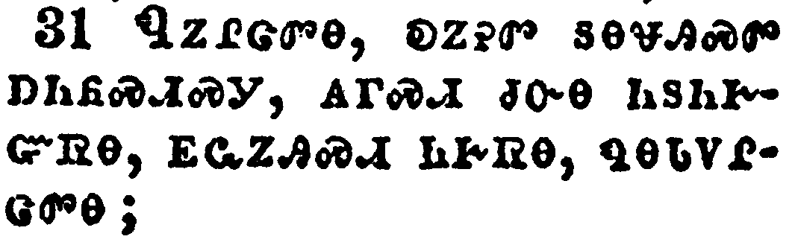</a></td>
</tr>
<tr class="even">
<td>Without understanding, covenantbreakers, without natural affection, implacable, unmerciful:</td>
</tr>
<tr class="odd">
<td>ᏄᏃᎵᏣᏛᎾ, ᎧᏃᎮᏛ ᏚᎾᏠᎯᏍᏛ ᎠᏂᏲᏍᏗᏍᎩ, ᎪᎱᏍᏗ ᏧᏅᎾ ᏂᏚᏂᎨᏳᏒᎾ, ᎬᏩᏃᎯᏍᏗ ᏂᎨᏒᎾ, ᏄᎾᏓᏙᎵᏣᏛᎾ;</td>
</tr>
<tr class="even">
<td>Nu-no-li-tsa-dv-na, ka-no-he-dv du-na-tlo-hi-s-dv a-ni-yo-s-di-s-gi, go-hu-s-di tsu-nv-na ni-du-ni-ge-yu-sv-na, gv-wa-no-hi-s-di ni-ge-sv-na, nu-na-da-do-li-tsa-dv-na;</td>
</tr>
</tbody>
</table>

<table>
<tbody>
<tr class="odd">
<td></td>
</tr>
<tr class="even">
<td>Who knowing the judgment of God, that they which commit such things are worthy of death, not only do the same, but have pleasure in them that do them.</td>
</tr>
<tr class="odd">
<td>ᎾᏍᎩ ᏣᏂᎦᏔᎭ ᏄᏍᏛ ᏕᎫᎪᏗᏍᎬ ᎤᏁᎳᏅᎯ, ᎾᏍᎩ ᎩᎶ ᎾᏍᎩ ᎢᏳᏍᏗ ᏧᎸᏫᏍᏓᏁᎯ ᏰᎵᏉ ᏗᎬᏩᏂᏲᎱᎯᏍᏗ ᎨᏒᎢ, ᎥᏝ ᎾᏍᎩᏉ ᎾᎾᏛᏁᎲ ᎤᏩᏒ ᏱᎩ, ᎣᏏᏳᏍᎩᏂ ᏚᏂᏰᎸᎭ ᎾᏍᎩ ᎢᏯᎾᏛᏁᎯ.</td>
</tr>
<tr class="even">
<td>Na-s-gi tsa-ni-ga-ta-ha nu-s-dv de-gu-go-di-s-gv U-ne-la-nv-hi, na-s-gi gi-lo na-s-gi i-yu-s-di tsu-lv-wi-s-da-ne-hi ye-li-quo di-gv-wa-ni-yo-hu-hi-s-di ge-sv-i, v-tla na-s-gi-quo na-na-dv-ne-hv u-wa-sv yi-gi, o-si-yu-s-gi-ni du-ni-ye-lv-ha na-s-gi i-ya-na-dv-ne-hi.</td>
</tr>
</tbody>
</table>

