+++
draft=false
date = 2014-12-18T21:11:07Z
title = "Romans - Chapter 6 - Cherokee New Testament"
weight = 1418955067

[taxonomies]

authors = ["Timothy Legg"]
categories = []
tags = []

[extra]
+++

<table>
<tbody>
<tr class="odd">
<td><a href="060601.png">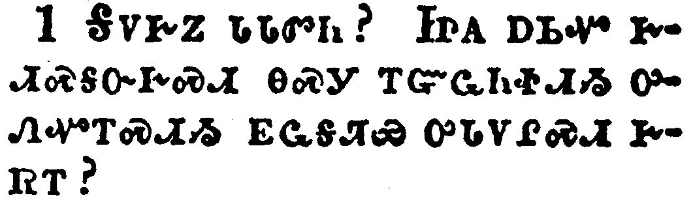</a></td>
</tr>
<tr class="even">
<td>What shall we say then? Shall we continue in sin, that grace may abound?</td>
</tr>
<tr class="odd">
<td>ᎦᏙᎨᏃ ᏓᏓᏛᏂ? ᏥᎪ ᎠᏏᏉ ᎨᏗᏍᎦᏅᎨᏍᏗ ᎾᏍᎩ ᎢᏳᏩᏂᏐᏗᏱ ᎤᏁᏉᎢᏍᏗᏱ ᎬᏩᎦᏘᏯ ᎤᏓᏙᎵᏍᏗ ᎨᏒᎢ?</td>
</tr>
<tr class="even">
<td>Ga-do-ge-no da-da-dv-ni? Tsi-go a-si-quo ge-di-s-ga-nv-ge-s-di na-s-gi i-yu-wa-ni-so-di-yi u-ne-quo-i-s-di-yi gv-wa-ga-ti-ya u-da-do-li-s-di ge-sv-i?</td>
</tr>
</tbody>
</table>

<table>
<tbody>
<tr class="odd">
<td><a href="060602.png">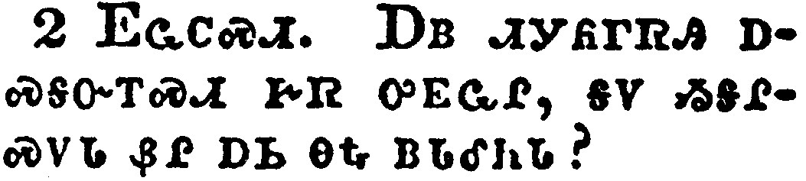</a></td>
</tr>
<tr class="even">
<td>God forbid. How shall we, that are dead to sin, live any longer therein?</td>
</tr>
<tr class="odd">
<td>ᎬᏩᏟᏍᏗ. ᎠᏴ ᏗᎩᏲᎱᏒᎯ ᎠᏍᎦᏅᎢᏍᏗ ᎨᏒ ᎤᎬᏩᎵ, ᎦᏙ ᏱᏚᎵᏍᏙᏓ ᏰᎵ ᎠᏏ ᎾᎿᎭᏴᏓᎴᏂᏓ?</td>
</tr>
<tr class="even">
<td>Gv-wa-tli-s-di. A-yv di-gi-yo-hu-sv-hi a-s-ga-nv-i-s-di ge-sv u-gv-wa-li, ga-do yi-du-li-s-do-da ye-li a-si na-hna yv-da-le-ni-da?</td>
</tr>
</tbody>
</table>

<table>
<tbody>
<tr class="odd">
<td><a href="060603.png">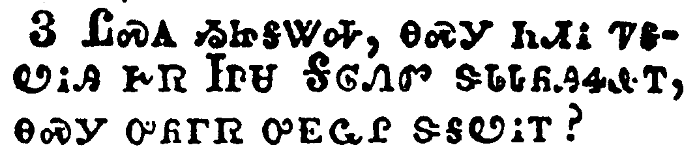</a></td>
</tr>
<tr class="even">
<td>Know ye not, that so many of us as were baptized into Jesus Christ were baptized into his death?</td>
</tr>
<tr class="odd">
<td>ᏝᏍᎪ ᏱᏥᎦᏔᎭ, ᎾᏍᎩ ᏂᏗᎥ ᏤᎦᏬᎥᎯ ᎨᏒ ᏥᏌ ᎦᎶᏁᏛ ᏕᏓᏓᏲᎯᏎᎲᎢ, ᎾᏍᎩ ᎤᏲᎱᏒ ᎤᎬᏩᎵ ᏕᎦᏬᎥᎢ?</td>
</tr>
<tr class="even">
<td>Tla-s-go yi-tsi-ga-ta-ha, na-s-gi ni-di-v tse-ga-wo-v-hi ge-sv Tsi-sa Ga-lo-ne-dv de-da-da-yo-hi-se-hv-i, na-s-gi u-yo-hu-sv u-gv-wa-li de-ga-wo-v-i?</td>
</tr>
</tbody>
</table>

<table>
<tbody>
<tr class="odd">
<td><a href="060604.png">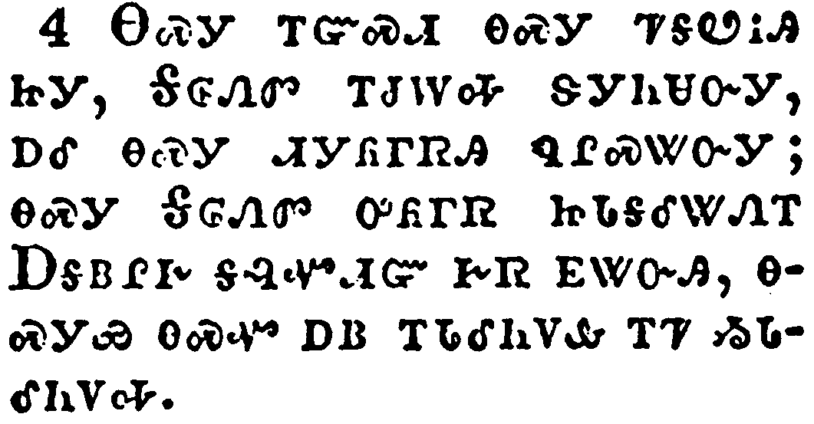</a></td>
</tr>
<tr class="even">
<td>Therefore we are buried with him by baptism into death: that like as Christ was raised up from the dead by the glory of the Father, even so we also should walk in newness of life.</td>
</tr>
<tr class="odd">
<td>ᎾᏍᎩ ᎢᏳᏍᏗ ᎾᏍᎩ ᏤᎦᏬᎥᎯ ᏥᎩ, ᎦᎶᏁᏛ ᎢᏧᎳᎭ ᏕᎩᏂᏌᏅᎩ, ᎠᎴ ᎾᏍᎩ ᏗᎩᏲᎱᏒᎯ ᏄᎵᏍᏔᏅᎩ; ᎾᏍᎩ ᎦᎶᏁᏛ ᎤᏲᎱᏒ ᏥᏓᎦᎴᏔᏁᎢ ᎠᎦᏴᎵᎨ ᎦᎸᏉᏗᏳ ᎨᏒ ᎬᏔᏅᎯ, ᎾᏍᎩᏯ ᎾᏍᏉ ᎠᏴ ᎢᏓᎴᏂᏙᎲ ᎢᏤ ᏱᏓᎴᏂᏙᎭ.</td>
</tr>
<tr class="even">
<td>Na-s-gi i-yu-s-di na-s-gi tse-ga-wo-v-hi tsi-gi, Ga-lo-ne-dv i-tsu-la-ha de-gi-ni-sa-nv-gi, a-le na-s-gi di-gi-yo-hu-sv-hi nu-li-s-ta-nv-gi; na-s-gi Ga-lo-ne-dv u-yo-hu-sv tsi-da-ga-le-ta-ne-i A-ga-yv-li-ge ga-lv-quo-di-yu ge-sv gv-ta-nv-hi, na-s-gi-ya na-s-quo a-yv i-da-le-ni-do-hv i-tse yi-da-le-ni-do-ha.</td>
</tr>
</tbody>
</table>

<table>
<tbody>
<tr class="odd">
<td><a href="060605.png">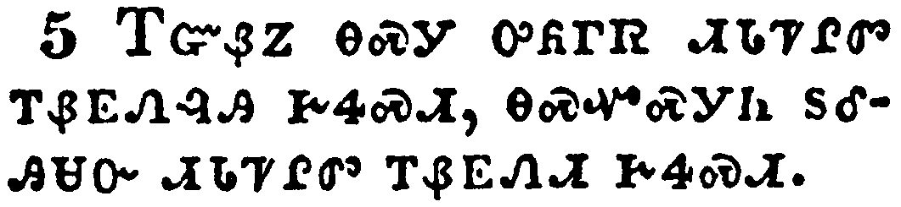</a></td>
</tr>
<tr class="even">
<td>For if we have been planted together in the likeness of his death, we shall be also in the likeness of his resurrection:</td>
</tr>
<tr class="odd">
<td>ᎢᏳᏰᏃ ᎾᏍᎩ ᎤᏲᎱᏒ ᏗᏓᏤᎵᏛ ᎢᏰᎬᏁᎸᎯ ᎨᏎᏍᏗ, ᎾᏍᏉᏍᎩᏂ ᏚᎴᎯᏌᏅ ᏗᏓᏤᎵᏛ ᎢᏰᎬᏁᏗ ᎨᏎᏍᏗ.</td>
</tr>
<tr class="even">
<td>I-yu-ye-no na-s-gi u-yo-hu-sv di-da-tse-li-dv i-ye-gv-ne-lv-hi ge-se-s-di, na-s-quo-s-gi-ni du-le-hi-sa-nv di-da-tse-li-dv i-ye-gv-ne-di ge-se-s-di.</td>
</tr>
</tbody>
</table>

<table>
<tbody>
<tr class="odd">
<td><a href="060606.png">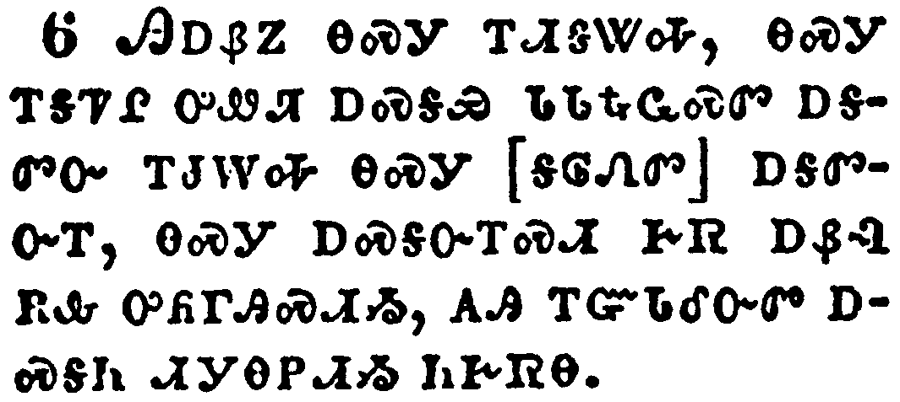</a></td>
</tr>
<tr class="even">
<td>Knowing this, that our old man is crucified with him, that the body of sin might be destroyed, that henceforth we should not serve sin.</td>
</tr>
<tr class="odd">
<td>ᎯᎠᏰᏃ ᎾᏍᎩ ᎢᏗᎦᏔᎭ, ᎾᏍᎩ ᎢᎦᏤᎵ ᎤᏪᏥ ᎠᏍᎦᏯ ᏓᏓᎿᎭᏩᏍᏛ ᎠᎦᏛᏅ ᎢᏧᎳᎭ ᎾᏍᎩ [ᎦᎶᏁᏛ] ᎠᎦᏛᏅᎢ, ᎾᏍᎩ ᎠᏍᎦᏅᎢᏍᏗ ᎨᏒ ᎠᏰᎸ ᎡᎲ ᎤᏲᎱᎯᏍᏗᏱ, ᎪᎯ ᎢᏳᏓᎴᏅᏛ ᎠᏍᎦᏂ ᏗᎩᎾᏢᏗᏱ ᏂᎨᏒᎾ.</td>
</tr>
<tr class="even">
<td>Hi-a-ye-no na-s-gi i-di-ga-ta-ha, na-s-gi i-ga-tse-li u-we-tsi a-s-ga-ya da-da-hna-wa-s-dv a-ga-dv-nv i-tsu-la-ha na-s-gi [ga-lo-ne-dv] a-ga-dv-nv-i, na-s-gi a-s-ga-nv-i-s-di ge-sv a-ye-lv e-hv u-yo-hu-hi-s-di-yi, go-hi i-yu-da-le-nv-dv a-s-ga-ni di-gi-na-tlv-di-yi ni-ge-sv-na.</td>
</tr>
</tbody>
</table>

<table>
<tbody>
<tr class="odd">
<td><a href="060607.png">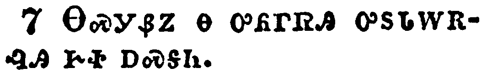</a></td>
</tr>
<tr class="even">
<td>For he that is dead is freed from sin.</td>
</tr>
<tr class="odd">
<td>ᎾᏍᎩᏰᏃ Ꮎ ᎤᏲᎱᏒᎯ ᎤᏚᏓᎳᎡᎸᎯ ᎨᏐ ᎠᏍᎦᏂ.</td>
</tr>
<tr class="even">
<td>Na-s-gi-ye-no na u-yo-hu-sv-hi u-du-da-la-e-lv-hi ge-so a-s-ga-ni.</td>
</tr>
</tbody>
</table>

<table>
<tbody>
<tr class="odd">
<td><a href="060608.png">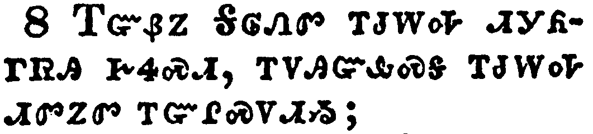</a></td>
</tr>
<tr class="even">
<td>Now if we be dead with Christ, we believe that we shall also live with him:</td>
</tr>
<tr class="odd">
<td>ᎢᏳᏰᏃ ᎦᎶᏁᏛ ᎢᏧᎳᎭ ᏗᎩᏲᎱᏒᎯ ᎨᏎᏍᏗ, ᎢᏙᎯᏳᎲᏍᎦ ᎢᏧᎳᎭ ᏗᏛᏃᏛ ᎢᏳᎵᏍᏙᏗᏱ;</td>
</tr>
<tr class="even">
<td>I-yu-ye-no Ga-lo-ne-dv i-tsu-la-ha di-gi-yo-hu-sv-hi ge-se-s-di, i-do-hi-yu-hv-s-ga i-tsu-la-ha di-dv-no-dv i-yu-li-s-do-di-yi;</td>
</tr>
</tbody>
</table>

<table>
<tbody>
<tr class="odd">
<td><a href="060609.png">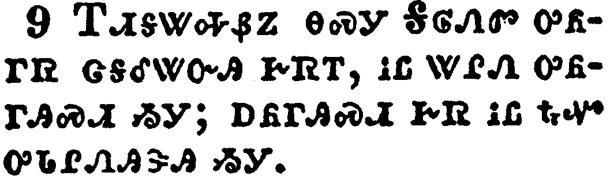</a></td>
</tr>
<tr class="even">
<td>Knowing that Christ being raised from the dead dieth no more; death hath no more dominion over him.</td>
</tr>
<tr class="odd">
<td>ᎢᏗᎦᏔᎭᏰᏃ ᎾᏍᎩ ᎦᎶᏁᏛ ᎤᏲᎱᏒ ᏣᎦᎴᏔᏅᎯ ᎨᏒᎢ, ᎥᏝ ᏔᎵᏁ ᎤᏲᎱᎯᏍᏗ ᏱᎩ; ᎠᏲᎱᎯᏍᏗ ᎨᏒ ᎥᏝ ᎿᎭᏉ ᎤᏓᎵᏁᎯᏕᎯ ᏱᎩ.</td>
</tr>
<tr class="even">
<td>I-di-ga-ta-ha-ye-no na-s-gi Ga-lo-ne-dv u-yo-hu-sv tsa-ga-le-ta-nv-hi ge-sv-i, v-tla ta-li-ne u-yo-hu-hi-s-di yi-gi; a-yo-hu-hi-s-di ge-sv v-tla hna-quo u-da-li-ne-hi-de-hi yi-gi.</td>
</tr>
</tbody>
</table>

<table>
<tbody>
<tr class="odd">
<td><a href="060610.png">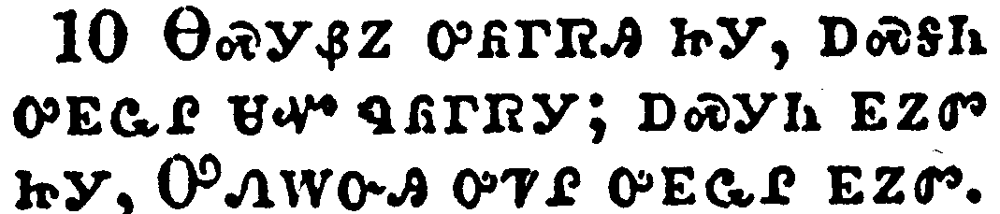</a></td>
</tr>
<tr class="even">
<td>For in that he died, he died unto sin once: but in that he liveth, he liveth unto God.</td>
</tr>
<tr class="odd">
<td>ᎾᏍᎩᏰᏃ ᎤᏲᎱᏒᎯ ᏥᎩ, ᎠᏍᎦᏂ ᎤᎬᏩᎵ ᏌᏉ ᏄᏲᎱᏒᎩ; ᎠᏍᎩᏂ ᎬᏃᏛ ᏥᎩ, ᎤᏁᎳᏅᎯ ᎤᏤᎵ ᎤᎬᏩᎵ ᎬᏃᏛ.</td>
</tr>
<tr class="even">
<td>Na-s-gi-ye-no u-yo-hu-sv-hi tsi-gi, a-s-ga-ni u-gv-wa-li sa-quo nu-yo-hu-sv-gi; a-s-gi-ni gv-no-dv tsi-gi, U-ne-la-nv-hi u-tse-li u-gv-wa-li gv-no-dv.</td>
</tr>
</tbody>
</table>

<table>
<tbody>
<tr class="odd">
<td><a href="060611.png">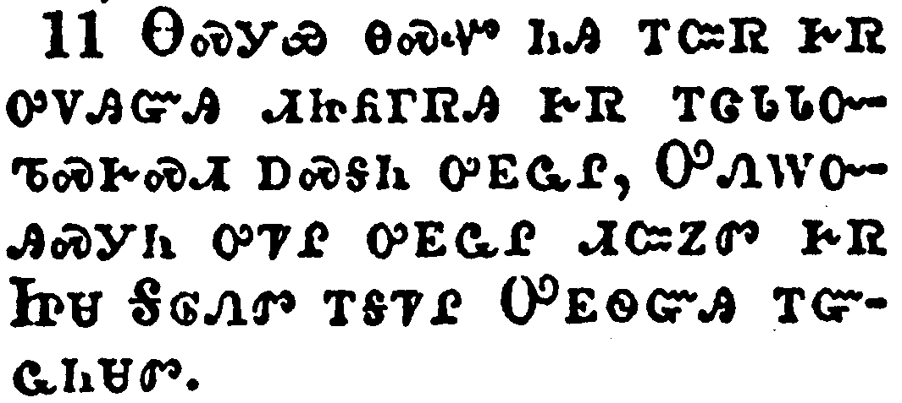</a></td>
</tr>
<tr class="even">
<td>Likewise reckon ye also yourselves to be dead indeed unto sin, but alive unto God through Jesus Christ our Lord.</td>
</tr>
<tr class="odd">
<td>ᎾᏍᎩᏯ ᎾᏍᏉ ᏂᎯ ᎢᏨᏒ ᎨᏒ ᎤᏙᎯᏳᎯ ᏗᏥᏲᎱᏒᎯ ᎨᏒ ᎢᏣᏓᏓᏅᏖᏍᎨᏍᏗ ᎠᏍᎦᏂ ᎤᎬᏩᎵ, ᎤᏁᎳᏅᎯᏍᎩᏂ ᎤᏤᎵ ᎤᎬᏩᎵ ᏗᏨᏃᏛ ᎨᏒ ᏥᏌ ᎦᎶᏁᏛ ᎢᎦᏤᎵ ᎤᎬᏫᏳᎯ ᎢᏳᏩᏂᏌᏛ.</td>
</tr>
<tr class="even">
<td>Na-s-gi-ya na-s-quo ni-hi i-tsv-sv ge-sv u-do-hi-yu-hi di-tsi-yo-hu-sv-hi ge-sv i-tsa-da-da-nv-te-s-ge-s-di a-s-ga-ni u-gv-wa-li, U-ne-la-nv-hi-s-gi-ni u-tse-li u-gv-wa-li di-tsv-no-dv ge-sv Tsi-sa Ga-lo-ne-dv i-ga-tse-li U-gv-wi-yu-hi i-yu-wa-ni-sa-dv.</td>
</tr>
</tbody>
</table>

<table>
<tbody>
<tr class="odd">
<td><a href="060612.png">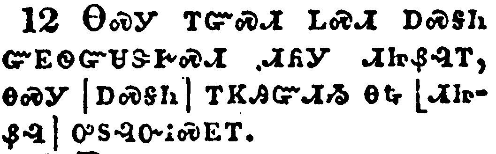</a></td>
</tr>
<tr class="even">
<td>Let not sin therefore reign in your mortal body, that ye should obey it in the lusts thereof.</td>
</tr>
<tr class="odd">
<td>ᎾᏍᎩ ᎢᏳᏍᏗ ᏞᏍᏗ ᎠᏍᎦᏂ ᏳᎬᏫᏳᏌᏕᎨᏍᏗ ᏗᏲᎩ ᏗᏥᏰᎸᎢ, ᎾᏍᎩ [ᎠᏍᎦᏂ] ᎢᏦᎯᏳᏗᏱ ᎾᎿᎭ[ᏗᏥᏰᎸ] ᎤᏚᎸᏅᎥᏍᎬᎢ.</td>
</tr>
<tr class="even">
<td>Na-s-gi i-yu-s-di tle-s-di a-s-ga-ni yu-gv-wi-yu-sa-de-ge-s-di di-yo-gi di-tsi-ye-lv-i, na-s-gi [a-s-ga-ni] i-tso-hi-yu-di-yi na-hna [di-tsi-ye-lv] u-du-lv-nv-v-s-gv-i.</td>
</tr>
</tbody>
</table>

<table>
<tbody>
<tr class="odd">
<td><a href="060613.png">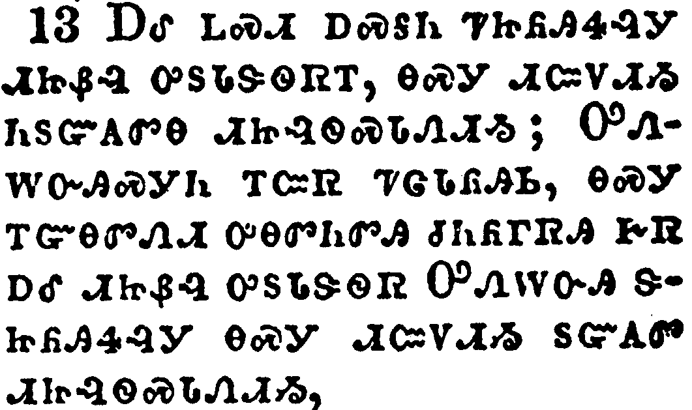</a></td>
</tr>
<tr class="even">
<td>Neither yield ye your members as instruments of unrighteousness unto sin: but yield yourselves unto God, as those that are alive from the dead, and your members as instruments of righteousness unto God.</td>
</tr>
<tr class="odd">
<td>ᎠᎴ ᏞᏍᏗ ᎠᏍᎦᏂ ᏤᏥᏲᎯᏎᎸᎩ ᏗᏥᏰᎸ ᎤᏚᏓᏕᏫᏒᎢ, ᎾᏍᎩ ᏗᏨᏙᏗᏱ ᏂᏚᏳᎪᏛᎾ ᏗᏥᎸᏫᏍᏓᏁᏗᏱ; ᎤᏁᎳᏅᎯᏍᎩᏂ ᎢᏨᏒ ᏤᏣᏓᏲᎯᏏ, ᎾᏍᎩ ᎢᏳᎾᏛᏁᏗ ᎤᎾᏛᏂᏛᎯ ᏧᏂᏲᎱᏒᎯ ᎨᏒ ᎠᎴ ᏗᏥᏰᎸ ᎤᏚᏓᏕᏫᏒ ᎤᏁᎳᏅᎯ ᏕᏥᏲᎯᏎᎸᎩ ᎾᏍᎩ ᏗᏨᏙᏗᏱ ᏚᏳᎪᏛ ᏗᏥᎸᏫᏍᏓᏁᏗᏱ,</td>
</tr>
<tr class="even">
<td>A-le tle-s-di a-s-ga-ni tse-tsi-yo-hi-se-lv-gi di-tsi-ye-lv u-du-da-de-wi-sv-i, na-s-gi di-tsv-do-di-yi ni-du-yu-go-dv-na di-tsi-lv-wi-s-da-ne-di-yi; U-ne-la-nv-hi-s-gi-ni i-tsv-sv tse-tsa-da-yo-hi-si, na-s-gi i-yu-na-dv-ne-di u-na-dv-ni-dv-hi tsu-ni-yo-hu-sv-hi ge-sv a-le di-tsi-ye-lv u-du-da-de-wi-sv U-ne-la-nv-hi de-tsi-yo-hi-se-lv-gi na-s-gi di-tsv-do-di-yi du-yu-go-dv di-tsi-lv-wi-s-da-ne-di-yi,</td>
</tr>
</tbody>
</table>

<table>
<tbody>
<tr class="odd">
<td><a href="060614.png">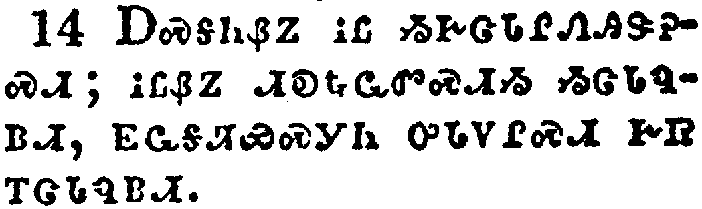</a></td>
</tr>
<tr class="even">
<td>For sin shall not have dominion over you: for ye are not under the law, but under grace.</td>
</tr>
<tr class="odd">
<td>ᎠᏍᎦᏂᏰᏃ ᎥᏝ ᏱᎨᏣᏓᎵᏁᎯᏕᎮᏍᏗ; ᎥᏝᏰᏃ ᏗᎧᎿᎭᏩᏛᏍᏗᏱ ᏱᏣᏓᏄᏴᏗ, ᎬᏩᎦᏘᏯᏍᎩᏂ ᎤᏓᏙᎵᏍᏗ ᎨᏒ ᎢᏣᏓᏄᏴᏗ.</td>
</tr>
<tr class="even">
<td>A-s-ga-ni-ye-no v-tla yi-ge-tsa-da-li-ne-hi-de-he-s-di; v-tla-ye-no di-ka-hna-wa-dv-s-di-yi yi-tsa-da-nu-yv-di, gv-wa-ga-ti-ya-s-gi-ni u-da-do-li-s-di ge-sv i-tsa-da-nu-yv-di.</td>
</tr>
</tbody>
</table>

<table>
<tbody>
<tr class="odd">
<td><a href="060615.png">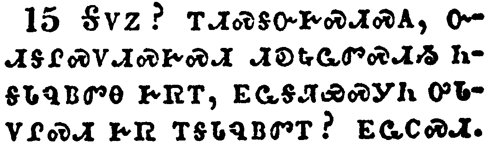</a></td>
</tr>
<tr class="even">
<td>What then? shall we sin, because we are not under the law, but under grace? God forbid.</td>
</tr>
<tr class="odd">
<td>ᎦᏙᏃ? ᎢᏗᏍᎦᏅᎨᏍᏗᏍᎪ, ᏅᏗᎦᎵᏍᏙᏗᏍᎨᏍᏗ ᏗᎧᎿᎭᏩᏛᏍᏗᏱ ᏂᎦᏓᏄᏴᏛᎾ ᎨᏒᎢ, ᎬᏩᎦᏘᏯᏍᎩᏂ ᎤᏓᏙᎵᏍᏗ ᎨᏒ ᎢᎦᏓᏄᏴᏛᎢ? ᎬᏩᏟᏍᏗ.</td>
</tr>
<tr class="even">
<td>Ga-do-no? i-di-s-ga-nv-ge-s-di-s-go, nv-di-ga-li-s-do-di-s-ge-s-di di-ka-hna-wa-dv-s-di-yi ni-ga-da-nu-yv-dv-na ge-sv-i, gv-wa-ga-ti-ya-s-gi-ni u-da-do-li-s-di ge-sv i-ga-da-nu-yv-dv-i? gv-wa-tli-s-di.</td>
</tr>
</tbody>
</table>

<table>
<tbody>
<tr class="odd">
<td><a href="060616.png">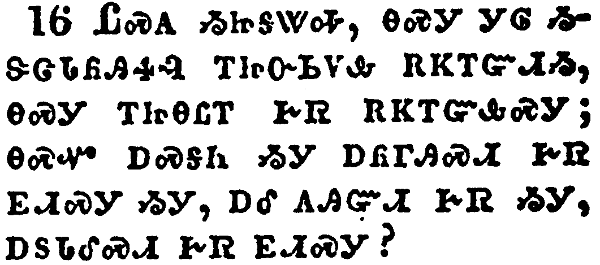</a></td>
</tr>
<tr class="even">
<td>Know ye not, that to whom ye yield yourselves servants to obey, his servants ye are to whom ye obey; whether of sin unto death, or of obedience unto righteousness?</td>
</tr>
<tr class="odd">
<td>ᏝᏍᎪ ᏱᏥᎦᏔᎭ, ᎾᏍᎩ ᎩᎶ ᏱᏕᏣᏓᏲᎯᏎᎸ ᎢᏥᏅᏏᏙᎲ ᎡᏦᎢᏳᏗᏱ, ᎾᏍᎩ ᎢᏥᎾᏝᎢ ᎨᏒ ᎡᏦᎢᏳᎲᏍᎩ; ᎾᏍᏉ ᎠᏍᎦᏂ ᏱᎩ ᎠᏲᎱᎯᏍᏗ ᎨᏒ ᎬᏗᏍᎩ ᏱᎩ, ᎠᎴ ᎪᎯᏳᏗ ᎨᏒ ᏱᎩ, ᎠᏚᏓᎴᏍᏗ ᎨᏒ ᎬᏗᏍᎩ?</td>
</tr>
<tr class="even">
<td>Tla-s-go yi-tsi-ga-ta-ha, na-s-gi gi-lo yi-de-tsa-da-yo-hi-se-lv i-tsi-nv-si-do-hv e-tso-i-yu-di-yi, na-s-gi i-tsi-na-tla-i ge-sv e-tso-i-yu-hv-s-gi; na-s-quo a-s-ga-ni yi-gi a-yo-hu-hi-s-di ge-sv gv-di-s-gi yi-gi, a-le go-hi-yu-di ge-sv yi-gi, a-du-da-le-s-di ge-sv gv-di-s-gi?</td>
</tr>
</tbody>
</table>

<table>
<tbody>
<tr class="odd">
<td><a href="060617.png">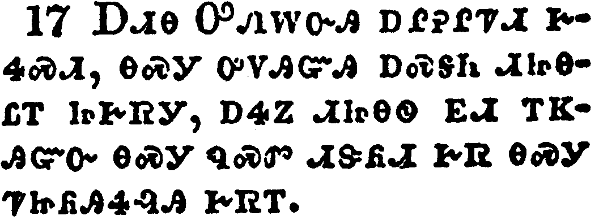</a></td>
</tr>
<tr class="even">
<td>But God be thanked, that ye were the servants of sin, but ye have obeyed from the heart that form of doctrine which was delivered you.</td>
</tr>
<tr class="odd">
<td>ᎠᏗᎾ ᎤᏁᎳᏅᎯ ᎠᎵᎮᎵᏤᏗ ᎨᏎᏍᏗ, ᎾᏍᎩ ᎤᏙᎯᏳᎯ ᎠᏍᎦᏂ ᏗᏥᎾᏝᎢ ᏥᎨᏒᎩ, ᎠᏎᏃ ᏗᏥᎾᏫ ᎬᏗ ᎢᏦᎯᏳᏅ ᎾᏍᎩ ᏄᏍᏛ ᏗᏕᏲᏗ ᎨᏒ ᎾᏍᎩ ᏤᏥᏲᎯᏎᎸᎯ ᎨᏒᎢ.</td>
</tr>
<tr class="even">
<td>A-di-na U-ne-la-nv-hi a-li-he-li-tse-di ge-se-s-di, na-s-gi u-do-hi-yu-hi a-s-ga-ni di-tsi-na-tla-i tsi-ge-sv-gi, a-se-no di-tsi-na-wi gv-di i-tso-hi-yu-nv na-s-gi nu-s-dv di-de-yo-di ge-sv na-s-gi tse-tsi-yo-hi-se-lv-hi ge-sv-i.</td>
</tr>
</tbody>
</table>

<table>
<tbody>
<tr class="odd">
<td><a href="060618.png">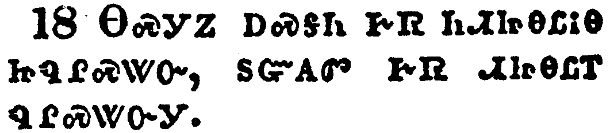</a></td>
</tr>
<tr class="even">
<td>Being then made free from sin, ye became the servants of righteousness.</td>
</tr>
<tr class="odd">
<td>ᎾᏍᎩᏃ ᎠᏍᎦᏂ ᎨᏒ ᏂᏗᏥᎾᏝᎥᎾ ᏥᏄᎵᏍᏔᏅ, ᏚᏳᎪᏛ ᎨᏒ ᏗᏥᎾᏝᎢ ᏄᎵᏍᏔᏅᎩ.</td>
</tr>
<tr class="even">
<td>Na-s-gi-no a-s-ga-ni ge-sv ni-di-tsi-na-tla-v-na tsi-nu-li-s-ta-nv, du-yu-go-dv ge-sv di-tsi-na-tla-i nu-li-s-ta-nv-gi.</td>
</tr>
</tbody>
</table>

<table>
<tbody>
<tr class="odd">
<td><a href="060619.png">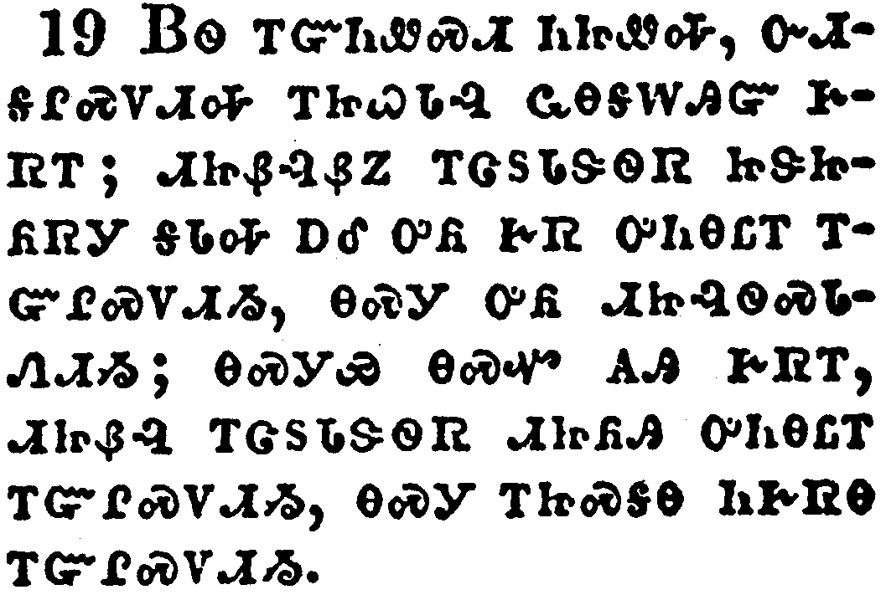</a></td>
</tr>
<tr class="even">
<td>I speak after the manner of men because of the infirmity of your flesh: for as ye have yielded your members servants to uncleanness and to iniquity unto iniquity; even so now yield your members servants to righteousness unto holiness.</td>
</tr>
<tr class="odd">
<td>ᏴᏫ ᎢᏳᏂᏪᏍᏗ ᏂᏥᏪᎭ, ᏅᏗᎦᎵᏍᏙᏗᎭ ᎢᏥᏇᏓᎸ ᏩᎾᎦᎳᎯᏳ ᎨᏒᎢ; ᏗᏥᏰᎸᏰᏃ ᎢᏣᏚᏓᏕᏫᏒ ᏥᏕᏥᏲᏒᎩ ᎦᏓᎭ ᎠᎴ ᎤᏲ ᎨᏒ ᎤᏂᎾᏝᎢ ᎢᏳᎵᏍᏙᏗᏱ, ᎾᏍᎩ ᎤᏲ ᏗᏥᎸᏫᏍᏓᏁᏗᏱ; ᎾᏍᎩᏯ ᎾᏍᏉ ᎪᎯ ᎨᏒᎢ, ᏗᏥᏰᎸ ᎢᏣᏚᏓᏕᏫᏒ ᏗᏥᏲᎯ ᎤᏂᎾᏝᎢ ᎢᏳᎵᏍᏙᏗᏱ, ᎾᏍᎩ ᎢᏥᏍᎦᎾ ᏂᎨᏒᎾ ᎢᏳᎵᏍᏙᏗᏱ.</td>
</tr>
<tr class="even">
<td>Yv-wi i-yu-ni-we-s-di ni-tsi-we-ha, nv-di-ga-li-s-do-di-ha i-tsi-que-da-lv wa-na-ga-la-hi-yu ge-sv-i; di-tsi-ye-lv-ye-no i-tsa-du-da-de-wi-sv tsi-de-tsi-yo-sv-gi ga-da-ha a-le u-yo ge-sv u-ni-na-tla-i i-yu-li-s-do-di-yi, na-s-gi u-yo di-tsi-lv-wi-s-da-ne-di-yi; na-s-gi-ya na-s-quo go-hi ge-sv-i, di-tsi-ye-lv i-tsa-du-da-de-wi-sv di-tsi-yo-hi u-ni-na-tla-i i-yu-li-s-do-di-yi, na-s-gi i-tsi-s-ga-na ni-ge-sv-na i-yu-li-s-do-di-yi.</td>
</tr>
</tbody>
</table>

<table>
<tbody>
<tr class="odd">
<td><a href="060620.png">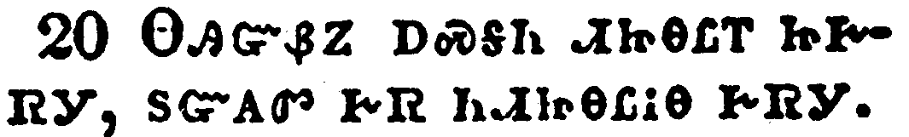</a></td>
</tr>
<tr class="even">
<td>For when ye were the servants of sin, ye were free from righteousness.</td>
</tr>
<tr class="odd">
<td>ᎾᎯᏳᏰᏃ ᎠᏍᎦᏂ ᏗᏥᎾᏝᎢ ᏥᎨᏒᎩ, ᏚᏳᎪᏛ ᎨᏒ ᏂᏗᏥᎾᏝᎥᎾ ᎨᏒᎩ.</td>
</tr>
<tr class="even">
<td>Na-hi-yu-ye-no a-s-ga-ni di-tsi-na-tla-i tsi-ge-sv-gi, du-yu-go-dv ge-sv ni-di-tsi-na-tla-v-na ge-sv-gi.</td>
</tr>
</tbody>
</table>

<table>
<tbody>
<tr class="odd">
<td><a href="060621.png">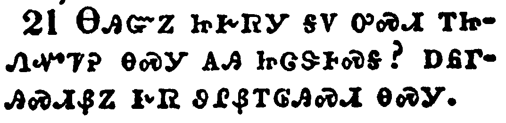</a></td>
</tr>
<tr class="even">
<td>What fruit had ye then in those things whereof ye are now ashamed? for the end of those things is death.</td>
</tr>
<tr class="odd">
<td>ᎾᎯᏳᏃ ᏥᎨᏒᎩ ᎦᏙ ᎤᏍᏗ ᎢᏥᏁᏉᏤᎮ ᎾᏍᎩ ᎪᎯ ᏥᏣᏕᎰᏍᎦ? ᎠᏲᎱᎯᏍᏗᏰᏃ ᎨᏒ ᏭᎵᏰᎢᎶᎯᏍᏗ ᎾᏍᎩ.</td>
</tr>
<tr class="even">
<td>Na-hi-yu-no tsi-ge-sv-gi ga-do u-s-di i-tsi-ne-quo-tse-he na-s-gi go-hi tsi-tsa-de-ho-s-ga? a-yo-hu-hi-s-di-ye-no ge-sv wu-li-ye-i-lo-hi-s-di na-s-gi.</td>
</tr>
</tbody>
</table>

<table>
<tbody>
<tr class="odd">
<td><a href="060622.png">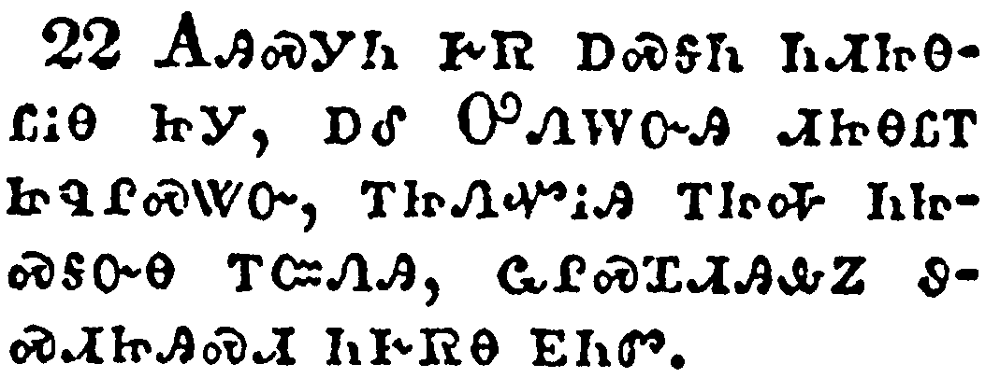</a></td>
</tr>
<tr class="even">
<td>But now being made free from sin, and become servants to God, ye have your fruit unto holiness, and the end everlasting life.</td>
</tr>
<tr class="odd">
<td>ᎪᎯᏍᎩᏂ ᎨᏒ ᎠᏍᎦᏂ ᏂᏗᏥᎾᏝᎥᎾ ᏥᎩ, ᎠᎴ ᎤᏁᎳᏅᎯ ᏗᏥᎾᏝᎢ ᏥᏄᎵᏍᏔᏅ, ᎢᏥᏁᏉᎥᎯ ᎢᏥᎭ ᏂᏥᏍᎦᏅᎾ ᎢᏨᏁᎯ, ᏩᎵᏍᏆᏗᎯᎲᏃ ᏭᏍᏗᏥᎯᏍᏗ ᏂᎨᏒᎾ ᎬᏂᏛ.</td>
</tr>
<tr class="even">
<td>Go-hi-s-gi-ni ge-sv a-s-ga-ni ni-di-tsi-na-tla-v-na tsi-gi, a-le U-ne-la-nv-hi di-tsi-na-tla-i tsi-nu-li-s-ta-nv, i-tsi-ne-quo-v-hi i-tsi-ha ni-tsi-s-ga-nv-na i-tsv-ne-hi, wa-li-s-qua-di-hi-hv-no wu-s-di-tsi-hi-s-di ni-ge-sv-na gv-ni-dv.</td>
</tr>
</tbody>
</table>

<table>
<tbody>
<tr class="odd">
<td><a href="060623.png">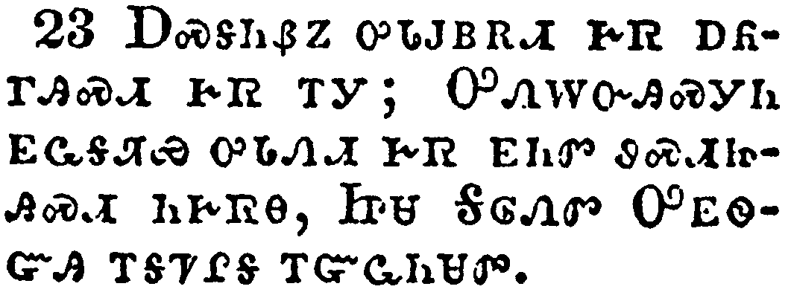</a></td>
</tr>
<tr class="even">
<td>For the wages of sin is death; but the gift of God is eternal life through Jesus Christ our Lord.</td>
</tr>
<tr class="odd">
<td>ᎠᏍᎦᏂᏰᏃ ᎤᏓᎫᏴᎡᏗ ᎨᏒ ᎠᏲᎱᎯᏍᏗ ᎨᏒ ᎢᎩ; ᎤᏁᎳᏅᎯᏍᎩᏂ ᎬᏩᎦᏘᏯ ᎤᏓᏁᏗ ᎨᏒ ᎬᏂᏛ ᏭᏍᏗᏥᎯᏍᏗ ᏂᎨᏒᎾ, ᏥᏌ ᎦᎶᏁᏛ ᎤᎬᏫᏳᎯ ᎢᎦᏤᎵᎦ ᎢᏳᏩᏂᏌᏛ.</td>
</tr>
<tr class="even">
<td>A-s-ga-ni-ye-no u-da-gu-yv-e-di ge-sv a-yo-hu-hi-s-di ge-sv i-gi; U-ne-la-nv-hi-s-gi-ni gv-wa-ga-ti-ya u-da-ne-di ge-sv gv-ni-dv wu-s-di-tsi-hi-s-di ni-ge-sv-na, Tsi-sa Ga-lo-ne-dv U-gv-wi-yu-hi i-ga-tse-li-ga i-yu-wa-ni-sa-dv.</td>
</tr>
</tbody>
</table>

