+++
draft=false
date = 2014-12-18T21:11:07Z
title = "The Acts - Chapter 4 - Cherokee New Testament"
weight = 1418955067

[taxonomies]

authors = ["Timothy Legg"]
categories = []
tags = []

[extra]
+++

<table>
<tbody>
<tr class="odd">
<td><a href="050401.png">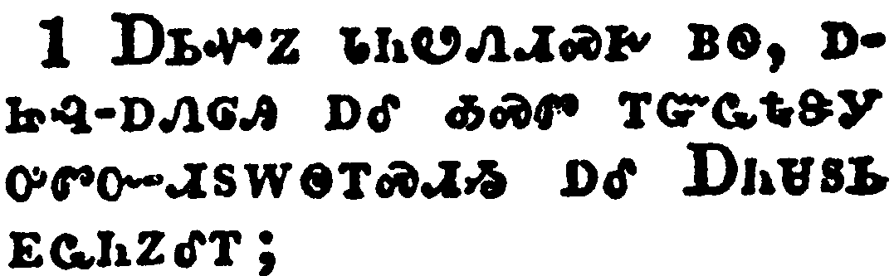</a></td>
</tr>
<tr class="even">
<td>And as they spake unto the people, the priests, and the captain of the temple, and the Sadducees, came upon them,</td>
</tr>
<tr class="odd">
<td>ᎠᏏᏉᏃ ᏓᏂᏬᏁᏗᏍᎨ ᏴᏫ, ᎠᏥᎸ-ᎠᏁᎶᎯ ᎠᎴ ᎣᏍᏛ ᎢᏳᏩᎿᎭᏕᎩ ᎤᏛᏅ-ᏗᏚᎳᏫᎢᏍᏗᏱ ᎠᎴ ᎠᏂᏌᏚᏏ ᎬᏩᏂᏃᎴᎢ;</td>
</tr>
<tr class="even">
<td>A-si-quo-no da-ni-wo-ne-di-s-ge yv-wi, a-tsi-lv--a-ne-lo-hi a-le o-s-dv i-yu-wa-hna-de-gi u-dv-nv--di-du-la-wi-i-s-di-yi a-le A-ni-sa-du-si gv-wa-ni-no-le-i;</td>
</tr>
</tbody>
</table>

<table>
<tbody>
<tr class="odd">
<td><a href="050402.png">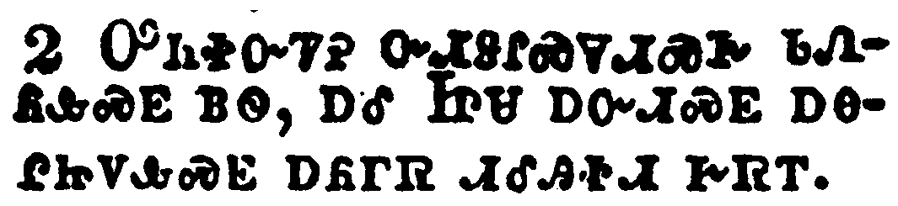</a></td>
</tr>
<tr class="even">
<td>Being grieved that they taught the people, and preached through Jesus the resurrection from the dead.</td>
</tr>
<tr class="odd">
<td>ᎤᏥᏐᏅᏤᎮ ᏅᏗᎦᎵᏍᏙᏗᏍᎨ ᏓᏁᏲᎲᏍᎬ ᏴᏫ, ᎠᎴ ᏥᏌ ᎠᏅᏗᏍᎬ ᎠᎾᎵᏥᏙᎲᏍᎬ ᎠᏲᎱᏒ ᏗᎴᎯᏐᏗ ᎨᏒᎢ.</td>
</tr>
<tr class="even">
<td>U-tsi-so-nv-tse-he nv-di-ga-li-s-do-di-s-ge da-ne-yo-hv-s-gv yv-wi, a-le Tsi-sa a-nv-di-s-gv a-na-li-tsi-do-hv-s-gv a-yo-hu-sv di-le-hi-so-di ge-sv-i.</td>
</tr>
</tbody>
</table>

<table>
<tbody>
<tr class="odd">
<td><a href="050403.png">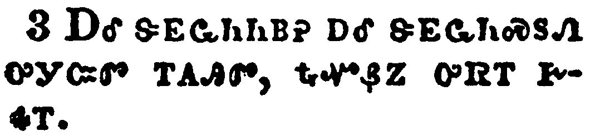</a></td>
</tr>
<tr class="even">
<td>And they laid hands on them, and put them in hold unto the next day: for it was now eventide.</td>
</tr>
<tr class="odd">
<td>ᎠᎴ ᏕᎬᏩᏂᏂᏴᎨ ᎠᎴ ᏕᎬᏩᏂᏍᏚᏁ ᎤᎩᏨᏛ ᎢᎪᎯᏛ, ᎿᎭᏉᏰᏃ ᎤᏒᎢ ᎨᏎᎢ.</td>
</tr>
<tr class="even">
<td>A-le de-gv-wa-ni-ni-yv-ge a-le de-gv-wa-ni-s-du-ne u-gi-tsv-dv i-go-hi-dv, hna-quo-ye-no u-sv-i ge-se-i.</td>
</tr>
</tbody>
</table>

<table>
<tbody>
<tr class="odd">
<td><a href="050404.png">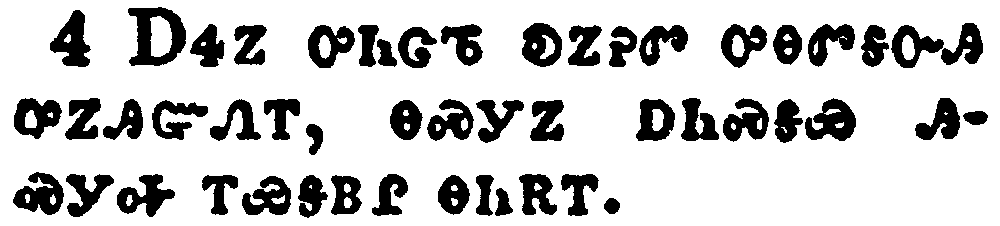</a></td>
</tr>
<tr class="even">
<td>Howbeit many of them which heard the word believed; and the number of the men was about five thousand.</td>
</tr>
<tr class="odd">
<td>ᎠᏎᏃ ᎤᏂᏣᏖ ᎧᏃᎮᏛ ᎤᎾᏛᎦᏅᎯ ᎤᏃᎯᏳᏁᎢ, ᎾᏍᎩᏃ ᎠᏂᏍᎦᏯ ᎯᏍᎩᎭ ᎢᏯᎦᏴᎵ ᎾᏂᎡᎢ.</td>
</tr>
<tr class="even">
<td>A-se-no u-ni-tsa-te ka-no-he-dv u-na-dv-ga-nv-hi u-no-hi-yu-ne-i, na-s-gi-no a-ni-s-ga-ya hi-s-gi-ha i-ya-ga-yv-li na-ni-e-i.</td>
</tr>
</tbody>
</table>

<table>
<tbody>
<tr class="odd">
<td><a href="050405.png">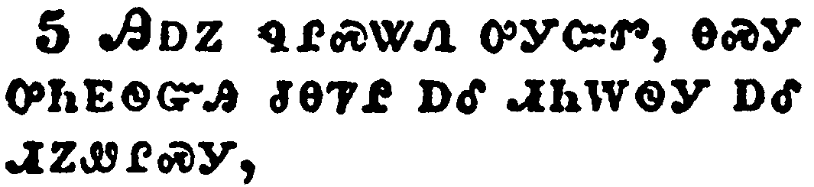</a></td>
</tr>
<tr class="even">
<td>And it came to pass on the morrow, that their rulers, and elders, and scribes,</td>
</tr>
<tr class="odd">
<td>ᎯᎠᏃ ᏄᎵᏍᏔᏁ ᎤᎩᏨᏛ, ᎾᏍᎩ ᎤᏂᎬᏫᏳᎯ ᏧᎾᏤᎵ ᎠᎴ ᏗᏂᎳᏫᎩ ᎠᎴ ᏗᏃᏪᎵᏍᎩ,</td>
</tr>
<tr class="even">
<td>Hi-a-no nu-li-s-ta-ne u-gi-tsv-dv, na-s-gi u-ni-gv-wi-yu-hi tsu-na-tse-li a-le di-ni-la-wi-gi a-le di-no-we-li-s-gi,</td>
</tr>
</tbody>
</table>

<table>
<tbody>
<tr class="odd">
<td><a href="050406.png">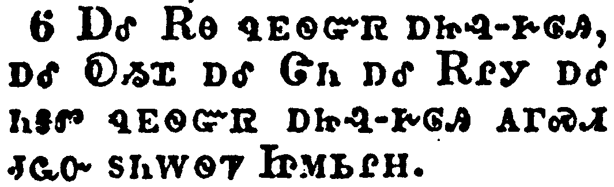</a></td>
</tr>
<tr class="even">
<td>And Annas the high priest, and Caiaphas, and John, and Alexander, and as many as were of the kindred of the high priest, were gathered together at Jerusalem.</td>
</tr>
<tr class="odd">
<td>ᎠᎴ ᎡᎾ ᏄᎬᏫᏳᏒ ᎠᏥᎸ-ᎨᎶᎯ, ᎠᎴ ᎧᏱᏆ ᎠᎴ ᏣᏂ ᎠᎴ ᎡᎵᎩ ᎠᎴ ᏂᎦᏛ ᏄᎬᏫᏳᏒ ᎠᏥᎸ-ᎨᎶᎯ ᎪᎱᏍᏗ ᏧᏩᏅ ᏚᏂᎳᏫᏤ ᏥᎷᏏᎵᎻ.</td>
</tr>
<tr class="even">
<td>A-le E-na nu-gv-wi-yu-sv a-tsi-lv--ge-lo-hi, a-le Ka-yi-qua a-le Tsa-ni a-le E-li-gi a-le ni-ga-dv nu-gv-wi-yu-sv a-tsi-lv--ge-lo-hi go-hu-s-di tsu-wa-nv du-ni-la-wi-tse Tsi-lu-si-li-mi.</td>
</tr>
</tbody>
</table>

<table>
<tbody>
<tr class="odd">
<td><a href="050407.png">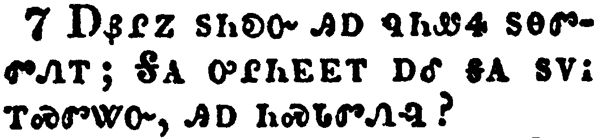</a></td>
</tr>
<tr class="even">
<td>And when they had set them in the midst, they asked, By what power, or by what name, have ye done this?</td>
</tr>
<tr class="odd">
<td>ᎠᏰᎵᏃ ᏚᏂᎧᏅ ᎯᎠ ᏄᏂᏪᏎ ᏚᎾᏛᏛᏁᎢ; ᎦᎪ ᎤᎵᏂᎬᎬᎢ ᎠᎴ ᎦᎪ ᎦᏙᎥ ᎢᏍᏛᏔᏅ, ᎯᎠ ᏂᏍᏓᏛᏁᎸ?</td>
</tr>
<tr class="even">
<td>A-ye-li-no du-ni-ka-nv hi-a nu-ni-we-se du-na-dv-dv-ne-i; Ga-go u-li-ni-gv-gv-i a-le ga-go ga-do-v i-s-dv-ta-nv, hi-a ni-s-da-dv-ne-lv?</td>
</tr>
</tbody>
</table>

<table>
<tbody>
<tr class="odd">
<td><a href="050408.png">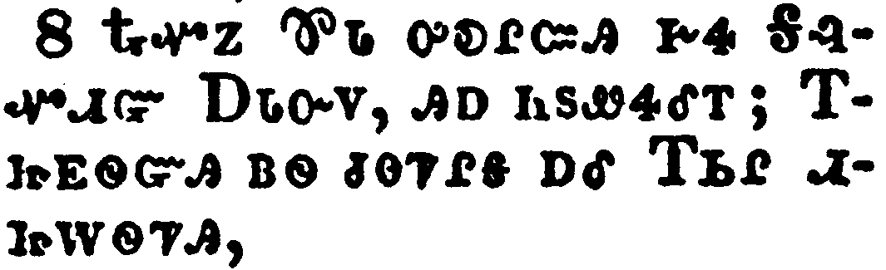</a></td>
</tr>
<tr class="even">
<td>Then Peter, filled with the Holy Ghost, said unto them, Ye rulers of the people, and elders of Israel,</td>
</tr>
<tr class="odd">
<td>ᎿᎭᏉᏃ ᏈᏓ ᎤᎧᎵᏨᎯ ᎨᏎ ᎦᎸᏉᏗᏳ ᎠᏓᏅᏙ, ᎯᎠ ᏂᏚᏪᏎᎴᎢ; ᎢᏥᎬᏫᏳᎯ ᏴᏫ ᏧᎾᏤᎵᎦ ᎠᎴ ᎢᏏᎵ ᏗᏥᎳᏫᏤᎯ,</td>
</tr>
<tr class="even">
<td>Hna-quo-no Qui-da u-ka-li-tsv-hi ge-se Ga-lv-quo-di-yu A-da-nv-do, hi-a ni-du-we-se-le-i; I-tsi-gv-wi-yu-hi yv-wi tsu-na-tse-li-ga a-le I-si-li di-tsi-la-wi-tse-hi,</td>
</tr>
</tbody>
</table>

<table>
<tbody>
<tr class="odd">
<td><a href="050409.png">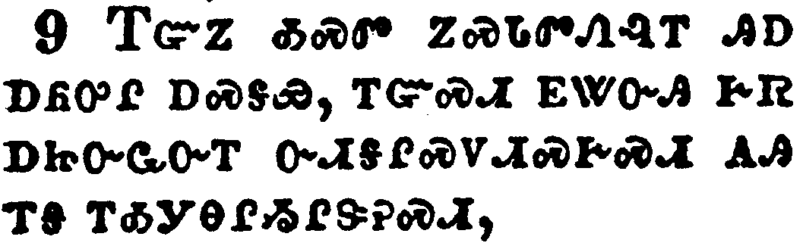</a></td>
</tr>
<tr class="even">
<td>If we this day be examined of the good deed done to the impotent man, by what means he is made whole;</td>
</tr>
<tr class="odd">
<td>ᎢᏳᏃ ᎣᏍᏛ ᏃᏍᏓᏛᏁᎸᎢ ᎯᎠ ᎠᏲᎤᎵ ᎠᏍᎦᏯ, ᎢᏳᏍᏗ ᎬᏔᏅᎯ ᎨᏒ ᎠᏥᏅᏩᏅᎢ ᏅᏗᎦᎵᏍᏙᏗᏍᎨᏍᏗ ᎪᎯ ᎢᎦ ᎢᎣᎩᎾᎵᏱᎵᏕᎮᏍᏗ,</td>
</tr>
<tr class="even">
<td>I-yu-no o-s-dv no-s-da-dv-ne-lv-i hi-a a-yo-u-li a-s-ga-ya, i-yu-s-di gv-ta-nv-hi ge-sv a-tsi-nv-wa-nv-i nv-di-ga-li-s-do-di-s-ge-s-di go-hi i-ga i-o-gi-na-li-yi-li-de-he-s-di,</td>
</tr>
</tbody>
</table>

<table>
<tbody>
<tr class="odd">
<td><a href="050410.png">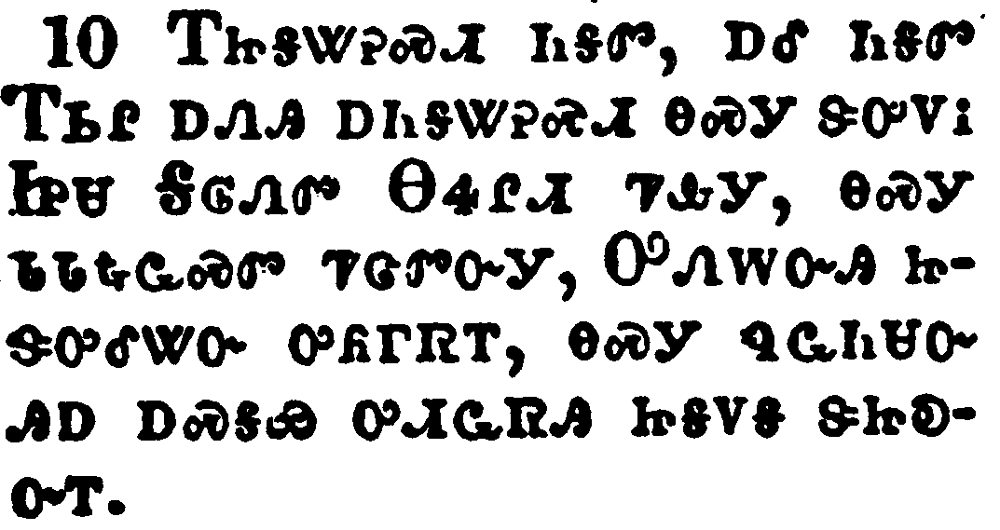</a></td>
</tr>
<tr class="even">
<td>Be it known unto you all, and to all the people of Israel, that by the name of Jesus Christ of Nazareth, whom ye crucified, whom God raised from the dead, even by him doth this man stand here before you whole.</td>
</tr>
<tr class="odd">
<td>ᎢᏥᎦᏔᎮᏍᏗ ᏂᎦᏛ, ᎠᎴ ᏂᎦᏛ ᎢᏏᎵ ᎠᏁᎯ ᎠᏂᎦᏔᎮᏍᏗ ᎾᏍᎩ ᏕᎤᏙᎥ ᏥᏌ ᎦᎶᏁᏛ ᎾᏎᎵᏗ ᏤᎲᎩ, ᎾᏍᎩ ᏓᏓᎿᎭᏩᏍᏛ ᏤᏣᏛᏅᎩ, ᎤᏁᎳᏅᎯ ᏥᏕᎤᎴᏔᏅ ᎤᏲᎱᏒᎢ, ᎾᏍᎩ ᏄᏩᏂᏌᏅ ᎯᎠ ᎠᏍᎦᏯ ᎤᏗᏩᏒᎯ ᏥᎦᏙᎦ ᏕᏥᎧᏅᎢ.</td>
</tr>
<tr class="even">
<td>I-tsi-ga-ta-he-s-di ni-ga-dv, a-le ni-ga-dv I-si-li a-ne-hi a-ni-ga-ta-he-s-di na-s-gi de-u-do-v Tsi-sa Ga-lo-ne-dv Na-se-li-di tse-hv-gi, na-s-gi da-da-hna-wa-s-dv tse-tsa-dv-nv-gi, U-ne-la-nv-hi tsi-de-u-le-ta-nv u-yo-hu-sv-i, na-s-gi nu-wa-ni-sa-nv hi-a a-s-ga-ya u-di-wa-sv-hi tsi-ga-do-ga de-tsi-ka-nv-i.</td>
</tr>
</tbody>
</table>

<table>
<tbody>
<tr class="odd">
<td><a href="050411.png">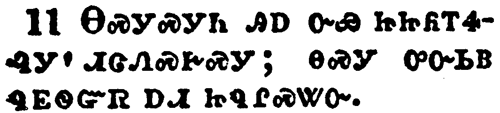</a></td>
</tr>
<tr class="even">
<td>This is the stone which was set at nought of you builders, which is become the head of the corner.</td>
</tr>
<tr class="odd">
<td>ᎾᏍᎩᏍᎩᏂ ᎯᎠ ᏅᏯ ᏥᏥᏲᎢᏎᎸᎩ ᏗᏣᏁᏍᎨᏍᎩ; ᎾᏍᎩ ᎤᏅᏏᏴ ᏄᎬᏫᏳᏒ ᎠᏗ ᏥᏄᎵᏍᏔᏅ.</td>
</tr>
<tr class="even">
<td>Na-s-gi-s-gi-ni hi-a nv-ya tsi-tsi-yo-i-se-lv-gi di-tsa-ne-s-ge-s-gi; na-s-gi u-nv-si-yv nu-gv-wi-yu-sv a-di tsi-nu-li-s-ta-nv.</td>
</tr>
</tbody>
</table>

<table>
<tbody>
<tr class="odd">
<td><a href="050412.png">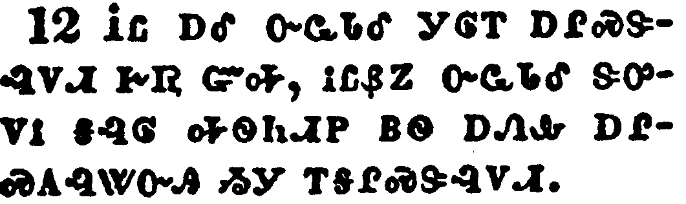</a></td>
</tr>
<tr class="even">
<td>Neither is there salvation in any other: for there is none other name under heaven given among men, whereby we must be saved.</td>
</tr>
<tr class="odd">
<td>ᎥᏝ ᎠᎴ ᏅᏩᏓᎴ ᎩᎶᎢ ᎠᎵᏍᏕᎸᏙᏗ ᎨᏒ ᏳᎭ, ᎥᏝᏰᏃ ᏅᏩᏓᎴ ᏕᎤᏙᎥ ᎦᎸᎶ ᎭᏫᏂᏗᏢ ᏴᏫ ᎠᏁᎲ ᎠᎵᏍᎪᎸᏔᏅᎯ ᏱᎩ ᎢᎦᎵᏍᏕᎸᏙᏗ.</td>
</tr>
<tr class="even">
<td>V-tla a-le nv-wa-da-le gi-lo-i a-li-s-de-lv-do-di ge-sv yu-ha, v-tla-ye-no nv-wa-da-le de-u-do-v ga-lv-lo ha-wi-ni-di-tlv yv-wi a-ne-hv a-li-s-go-lv-ta-nv-hi yi-gi i-ga-li-s-de-lv-do-di.</td>
</tr>
</tbody>
</table>

<table>
<tbody>
<tr class="odd">
<td><a href="050413.png">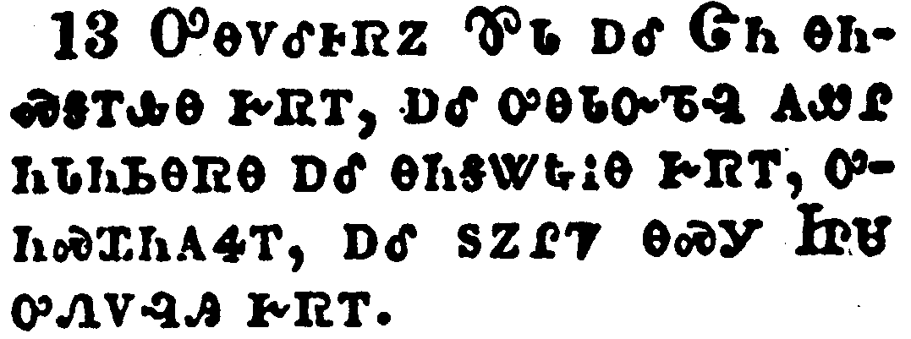</a></td>
</tr>
<tr class="even">
<td>Now when they saw the boldness of Peter and John, and perceived that they were unlearned and ignorant men, they marvelled; and they took knowledge of them, that they had been with Jesus.</td>
</tr>
<tr class="odd">
<td>ᎤᎾᏙᎴᎰᏒᏃ ᏈᏓ ᎠᎴ ᏣᏂ ᎾᏂᏯᎦᎢᎲᎾ ᎨᏒᎢ, ᎠᎴ ᎤᎾᏓᏅᏖᎸ ᎪᏪᎵ ᏂᏓᏂᏏᎾᏒᎾ ᎠᎴ ᎾᏂᎦᏔᎿᎭᎥᎾ ᎨᏒᎢ, ᎤᏂᏍᏆᏂᎪᏎᎢ, ᎠᎴ ᏚᏃᎵᏤ ᎾᏍᎩ ᏥᏌ ᎤᏁᏙᎸᎯ ᎨᏒᎢ.</td>
</tr>
<tr class="even">
<td>U-na-do-le-ho-sv-no Qui-da a-le Tsa-ni na-ni-ya-ga-i-hv-na ge-sv-i, a-le u-na-da-nv-te-lv go-we-li ni-da-ni-si-na-sv-na a-le na-ni-ga-ta-hna-v-na ge-sv-i, u-ni-s-qua-ni-go-se-i, a-le du-no-li-tse na-s-gi Tsi-sa u-ne-do-lv-hi ge-sv-i.</td>
</tr>
</tbody>
</table>

<table>
<tbody>
<tr class="odd">
<td><a href="050414.png">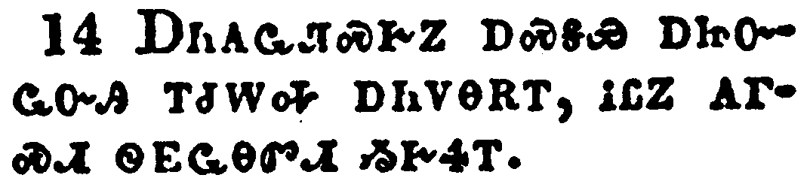</a></td>
</tr>
<tr class="even">
<td>And beholding the man which was healed standing with them, they could say nothing against it.</td>
</tr>
<tr class="odd">
<td>ᎠᏂᎪᏩᏘᏍᎨᏃ ᎠᏍᎦᏯ ᎠᏥᏅᏩᏅᎯ ᎢᏧᎳᎭ ᎠᏂᏙᎾᎡᎢ, ᎥᏝᏃ ᎪᎱᏍᏗ ᏫᎬᏩᎾᏛᏗ ᏱᎨᏎᎢ.</td>
</tr>
<tr class="even">
<td>A-ni-go-wa-ti-s-ge-no a-s-ga-ya a-tsi-nv-wa-nv-hi i-tsu-la-ha a-ni-do-na-e-i, v-tla-no go-hu-s-di wi-gv-wa-na-dv-di yi-ge-se-i.</td>
</tr>
</tbody>
</table>

<table>
<tbody>
<tr class="odd">
<td><a href="050415.png">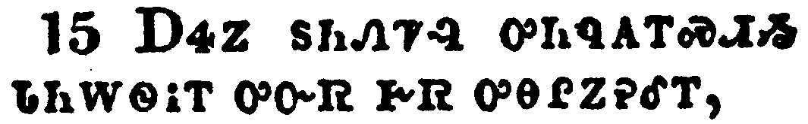</a></td>
</tr>
<tr class="even">
<td>But when they had commanded them to go aside out of the council, they conferred among themselves,</td>
</tr>
<tr class="odd">
<td>ᎠᏎᏃ ᏚᏂᏁᏥᎸ ᎤᏂᏄᎪᎢᏍᏗᏱ ᏓᏂᎳᏫᎥᎢ ᎤᏅᏒ ᎨᏒ ᎤᎾᎵᏃᎮᎴᎢ,</td>
</tr>
<tr class="even">
<td>A-se-no du-ni-ne-tsi-lv u-ni-nu-go-i-s-di-yi da-ni-la-wi-v-i u-nv-sv ge-sv u-na-li-no-he-le-i,</td>
</tr>
</tbody>
</table>

<table>
<tbody>
<tr class="odd">
<td><a href="050416.png">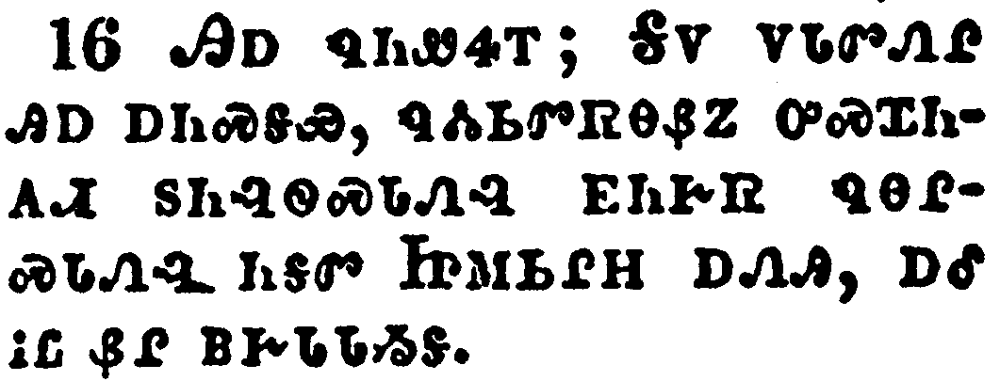</a></td>
</tr>
<tr class="even">
<td>Saying, What shall we do to these men? for that indeed a notable miracle hath been done by them is manifest to all them that dwell in Jerusalem; and we cannot deny it.</td>
</tr>
<tr class="odd">
<td>ᎯᎠ ᏄᏂᏪᏎᎢ; ᎦᏙ ᏙᏓᏛᏁᎵ ᎯᎠ ᎠᏂᏍᎦᏯ, ᏄᏜᏓᏏᏛᏒᎾᏰᏃ ᎤᏍᏆᏂᎪᏗ ᏚᏂᎸᏫᏍᏓᏁᎸ ᎬᏂᎨᏒ ᏄᎾᎵᏍᏓᏁᎸ ᏂᎦᏛ ᏥᎷᏏᎵᎻ ᎠᏁᎯ, ᎠᎴ ᎥᏝ ᏰᎵ ᏴᎨᏓᏓᏱᎦ.</td>
</tr>
<tr class="even">
<td>Hi-a nu-ni-we-se-i; Ga-do do-da-dv-ne-li hi-a a-ni-s-ga-ya, nu-dla-si-dv-sv-na-ye-no u-s-qua-ni-go-di du-ni-lv-wi-s-da-ne-lv gv-ni-ge-sv nu-na-li-s-da-ne-lv ni-ga-dv Tsi-lu-si-li-mi a-ne-hi, a-le v-tla ye-li yv-ge-da-da-yi-ga.</td>
</tr>
</tbody>
</table>

<table>
<tbody>
<tr class="odd">
<td><a href="050417.png">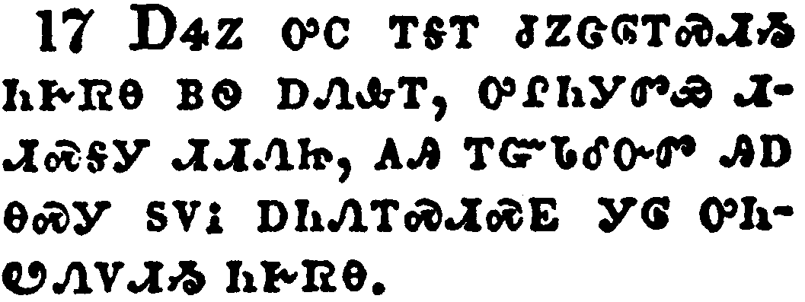</a></td>
</tr>
<tr class="even">
<td>But that it spread no further among the people, let us straitly threaten them, that they speak henceforth to no man in this name.</td>
</tr>
<tr class="odd">
<td>ᎠᏎᏃ ᎤᏟ ᎢᎦᎢ ᏧᏃᏣᎶᎢᏍᏗᏱ ᏂᎨᏒᎾ ᏴᏫ ᎠᏁᎲᎢ, ᎤᎵᏂᎩᏛᏯ ᏗᏗᏍᎦᎩ ᏗᏗᏁᏥ, ᎪᎯ ᎢᏳᏓᎴᏅᏛ ᎯᎠ ᎾᏍᎩ ᏚᏙᎥ ᎠᏂᏁᎢᏍᏗᏍᎬ ᎩᎶ ᎤᏂᏬᏁᏙᏗᏱ ᏂᎨᏒᎾ.</td>
</tr>
<tr class="even">
<td>A-se-no u-tli i-ga-i tsu-no-tsa-lo-i-s-di-yi ni-ge-sv-na yv-wi a-ne-hv-i, u-li-ni-gi-dv-ya di-di-s-ga-gi di-di-ne-tsi, go-hi i-yu-da-le-nv-dv hi-a na-s-gi du-do-v a-ni-ne-i-s-di-s-gv gi-lo u-ni-wo-ne-do-di-yi ni-ge-sv-na.</td>
</tr>
</tbody>
</table>

<table>
<tbody>
<tr class="odd">
<td></td>
</tr>
<tr class="even">
<td>And they called them, and commanded them not to speak at all nor teach in the name of Jesus.</td>
</tr>
<tr class="odd">
<td>ᏫᏚᏂᏯᏅᎲᏃ ᏚᏂᏁᏤᎴ ᏥᏌ ᏚᏙᎥ ᎤᏅᏙᏗᏱ ᎤᏂᏁᎢᏍᏗᏱ ᎠᎴ ᏧᎾᏕᏲᏗᏱ ᏂᎨᏒᎾ.</td>
</tr>
<tr class="even">
<td>Wi-du-ni-ya-nv-hv-no du-ni-ne-tse-le Tsi-sa du-do-v u-nv-do-di-yi u-ni-ne-i-s-di-yi a-le tsu-na-de-yo-di-yi ni-ge-sv-na.</td>
</tr>
</tbody>
</table>

<table>
<tbody>
<tr class="odd">
<td><a href="050419.png">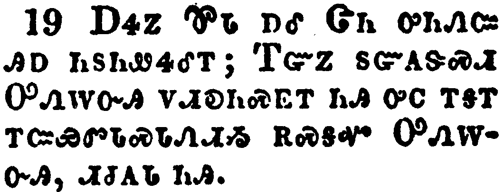</a></td>
</tr>
<tr class="even">
<td>But Peter and John answered and said unto them, Whether it be right in the sight of God to hearken unto you more than unto God, judge ye.</td>
</tr>
<tr class="odd">
<td>ᎠᏎᏃ ᏈᏓ ᎠᎴ ᏣᏂ ᎤᏂᏁᏨ ᎯᎠ ᏂᏚᏂᏪᏎᎴᎢ; ᎢᏳᏃ ᏚᏳᎪᏕᏍᏗ ᎤᏁᎳᏅᎯ ᏙᏗᎧᏂᏍᎬᎢ ᏂᎯ ᎤᏟ ᎢᎦᎢ ᎢᏨᏯᏛᏓᏍᏓᏁᏗᏱ ᎡᏍᎦᏉ ᎤᏁᎳᏅᎯ, ᏗᏧᎪᏓ ᏂᎯ.</td>
</tr>
<tr class="even">
<td>A-se-no Qui-da a-le Tsa-ni u-ni-ne-tsv hi-a ni-du-ni-we-se-le-i; I-yu-no du-yu-go-de-s-di U-ne-la-nv-hi do-di-ka-ni-s-gv-i ni-hi u-tli i-ga-i i-tsv-ya-dv-da-s-da-ne-di-yi e-s-ga-quo U-ne-la-nv-hi, di-tsu-go-da ni-hi.</td>
</tr>
</tbody>
</table>

<table>
<tbody>
<tr class="odd">
<td><a href="050420.png">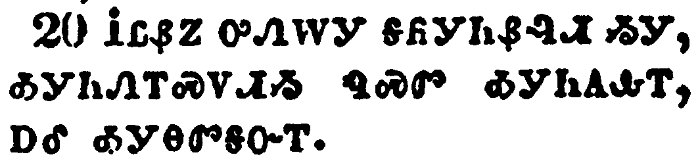</a></td>
</tr>
<tr class="even">
<td>For we cannot but speak the things which we have seen and heard.</td>
</tr>
<tr class="odd">
<td>ᎥᏝᏰᏃ ᎤᏁᎳᎩ ᎦᏲᎩᏂᏰᎸᏗ ᏱᎩ, ᎣᎩᏂᏁᎢᏍᏙᏗᏱ ᏄᏍᏛ ᎣᎩᏂᎪᎲᎢ, ᎠᎴ ᎣᎩᎾᏛᎦᏅᎢ.</td>
</tr>
<tr class="even">
<td>V-tla-ye-no u-ne-la-gi ga-yo-gi-ni-ye-lv-di yi-gi, o-gi-ni-ne-i-s-do-di-yi nu-s-dv o-gi-ni-go-hv-i, a-le o-gi-na-dv-ga-nv-i.</td>
</tr>
</tbody>
</table>

<table>
<tbody>
<tr class="odd">
<td><a href="050421.png">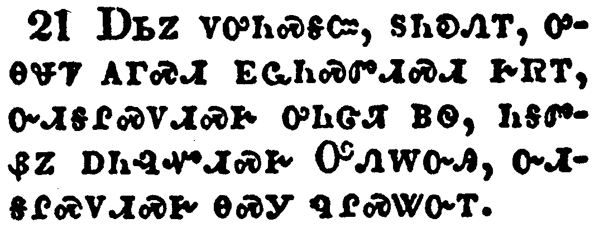</a></td>
</tr>
<tr class="even">
<td>So when they had further threatened them, they let them go, finding nothing how they might punish them, because of the people: for all men glorified God for that which was done.</td>
</tr>
<tr class="odd">
<td>ᎠᏏᏃ ᏙᎤᏂᏍᎦᏨ, ᏚᏂᎧᏁᎢ, ᎤᎾᏠᏤ ᎪᎱᏍᏗ ᎬᏩᏂᏍᏛᏗᏍᏗ ᎨᏒᎢ, ᏅᏗᎦᎵᏍᏙᏗᏍᎨ ᎤᏂᏣᏘ ᏴᏫ, ᏂᎦᏛᏰᏃ ᎠᏂᎸᏉᏗᏍᎨ ᎤᏁᎳᏅᎯ, ᏅᏗᎦᎵᏍᏙᏗᏍᎨ ᎾᏍᎩ ᏄᎵᏍᏔᏅᎢ.</td>
</tr>
<tr class="even">
<td>A-si-no do-u-ni-s-ga-tsv, du-ni-ka-ne-i, u-na-tlo-tse go-hu-s-di gv-wa-ni-s-dv-di-s-di ge-sv-i, nv-di-ga-li-s-do-di-s-ge u-ni-tsa-ti yv-wi, ni-ga-dv-ye-no a-ni-lv-quo-di-s-ge U-ne-la-nv-hi, nv-di-ga-li-s-do-di-s-ge na-s-gi nu-li-s-ta-nv-i.</td>
</tr>
</tbody>
</table>

<table>
<tbody>
<tr class="odd">
<td><a href="050422.png">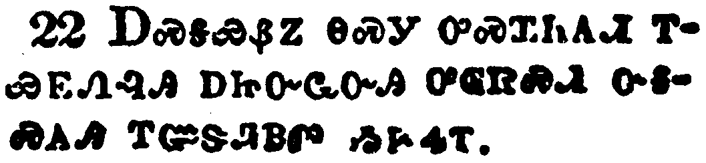</a></td>
</tr>
<tr class="even">
<td>For the man was above forty years old, on whom this miracle of healing was shewed.</td>
</tr>
<tr class="odd">
<td>ᎠᏍᎦᏯᏰᏃ ᎾᏍᎩ ᎤᏍᏆᏂᎪᏗ ᎢᏯᎬᏁᎸᎯ ᎠᏥᏅᏩᏅᎯ ᎤᎶᏒᏍᏗ ᏅᎦᏍᎪᎯ ᎢᏳᏕᏘᏴᏛ ᏱᎰᏎᎢ.</td>
</tr>
<tr class="even">
<td>A-s-ga-ya-ye-no na-s-gi u-s-qua-ni-go-di i-ya-gv-ne-lv-hi a-tsi-nv-wa-nv-hi u-lo-sv-s-di nv-ga-s-go-hi i-yu-de-ti-yv-dv yi-ho-se-i.</td>
</tr>
</tbody>
</table>

<table>
<tbody>
<tr class="odd">
<td><a href="050423.png">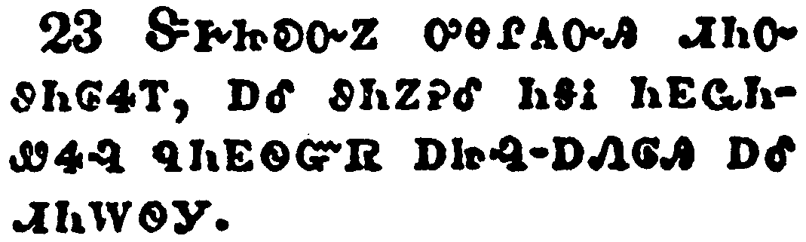</a></td>
</tr>
<tr class="even">
<td>And being let go, they went to their own company, and reported all that the chief priests and elders had said unto them.</td>
</tr>
<tr class="odd">
<td>ᏕᎨᏥᎧᏅᏃ ᎤᎾᎵᎪᏅᎯ ᏗᏂᏅ ᏭᏂᎶᏎᎢ, ᎠᎴ ᏭᏂᏃᎮᎴ ᏂᎦᎥ ᏂᎬᏩᏂᏪᏎᎸ ᏄᏂᎬᏫᏳᏒ ᎠᏥᎸ-ᎠᏁᎶᎯ ᎠᎴ ᏗᏂᎳᏫᎩ.</td>
</tr>
<tr class="even">
<td>De-ge-tsi-ka-nv-no u-na-li-go-nv-hi di-ni-nv wu-ni-lo-se-i, a-le wu-ni-no-he-le ni-ga-v ni-gv-wa-ni-we-se-lv nu-ni-gv-wi-yu-sv a-tsi-lv--a-ne-lo-hi a-le di-ni-la-wi-gi.</td>
</tr>
</tbody>
</table>

<table>
<tbody>
<tr class="odd">
<td></td>
</tr>
<tr class="even">
<td>And when they heard that, they lifted up their voice to God with one accord, and said, Lord, thou art God, which hast made heaven, and earth, and the sea, and all that in them is:</td>
</tr>
<tr class="odd">
<td>ᎾᏍᎩᏃ ᎤᎾᏛᎦᏅ ᏌᏉ ᎢᎦᎦᏛ ᎤᏁᎳᏅᎯ ᎤᏂᏌᎳᏓᏁᎴ ᎠᏂᏁᎬᎢ, ᎯᎠ ᏄᏂᏪᏎᎢ; ᏣᎬᏫᏳᎯ, ᏂᎯ ᏣᏁᎳᏅᎯ, ᏗᏦᏢᏅᎯ ᎦᎸᎶᎢ ᎠᎴ ᎡᎶᎯ ᎠᎴ ᎠᎺᏉᎯ ᎠᎴ ᏂᎦᏛ ᎾᎿᎭᎠᏁᎯ;</td>
</tr>
<tr class="even">
<td>Na-s-gi-no u-na-dv-ga-nv sa-quo i-ga-ga-dv U-ne-la-nv-hi u-ni-sa-la-da-ne-le a-ni-ne-gv-i, hi-a nu-ni-we-se-i; Tsa-gv-wi-yu-hi, ni-hi Tsa-ne-la-nv-hi, di-tso-tlv-nv-hi ga-lv-lo-i a-le e-lo-hi a-le a-me-quo-hi a-le ni-ga-dv na-hna a-ne-hi;</td>
</tr>
</tbody>
</table>

<table>
<tbody>
<tr class="odd">
<td><a href="050425.png">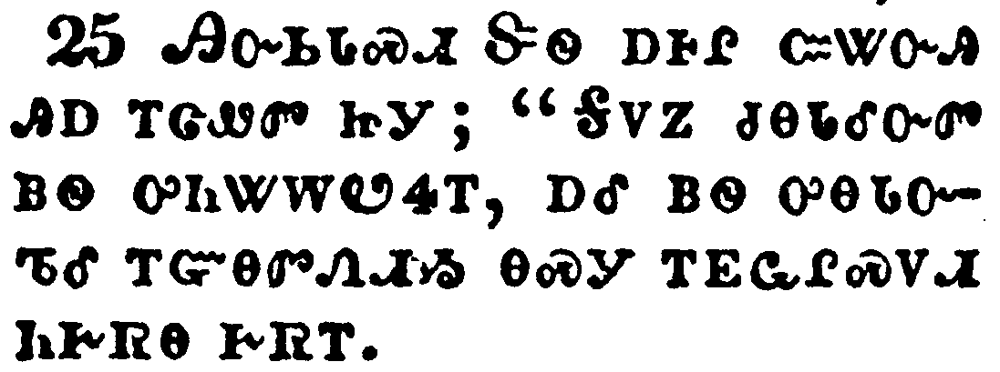</a></td>
</tr>
<tr class="even">
<td>Who by the mouth of thy servant David hast said, Why did the heathen rage, and the people imagine vain things?</td>
</tr>
<tr class="odd">
<td>ᎯᏅᏏᏓᏍᏗ ᏕᏫ ᎠᎰᎵ ᏨᏔᏅᎯ ᎯᎠ ᎢᏣᏪᏛ ᏥᎩ; "ᎦᏙᏃ ᏧᎾᏓᎴᏅᏛ ᏴᏫ ᎤᏂᏔᎳᏬᏎᎢ, ᎠᎴ ᏴᏫ ᎤᎾᏓᏅᏖᎴ ᎢᏳᎾᏛᏁᏗᏱ ᎾᏍᎩ ᎢᎬᏩᎵᏍᏙᏗ ᏂᎨᏒᎾ ᎨᏒᎢ.</td>
</tr>
<tr class="even">
<td>Hi-nv-si-da-s-di De-wi a-ho-li tsv-ta-nv-hi hi-a i-tsa-we-dv tsi-gi; "Ga-do-no tsu-na-da-le-nv-dv yv-wi u-ni-ta-la-wo-se-i, a-le yv-wi u-na-da-nv-te-le i-yu-na-dv-ne-di-yi na-s-gi i-gv-wa-li-s-do-di ni-ge-sv-na ge-sv-i.</td>
</tr>
</tbody>
</table>

<table>
<tbody>
<tr class="odd">
<td><a href="050426.png">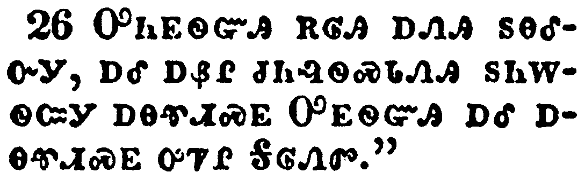</a></td>
</tr>
<tr class="even">
<td>The kings of the earth stood up, and the rulers were gathered together against the Lord, and against his Christ.</td>
</tr>
<tr class="odd">
<td>ᎤᏂᎬᏫᏳᎯ ᎡᎶᎯ ᎠᏁᎯ ᏚᎾᎴᏅᎩ, ᎠᎴ ᎠᏰᎵ ᏧᏂᎸᏫᏍᏓᏁᎯ ᏚᏂᎳᏫᏨᎩ ᎠᎾᏡᏗᏍᎬ ᎤᎬᏫᏳᎯ ᎠᎴ ᎠᎾᏡᏗᏍᎬ ᎤᏤᎵ ᎦᎶᏁᏛ."</td>
</tr>
<tr class="even">
<td>U-ni-gv-wi-yu-hi e-lo-hi a-ne-hi du-na-le-nv-gi, a-le a-ye-li tsu-ni-lv-wi-s-da-ne-hi du-ni-la-wi-tsv-gi a-na-tlu-di-s-gv U-gv-wi-yu-hi a-le a-na-tlu-di-s-gv u-tse-li Ga-lo-ne-dv."</td>
</tr>
</tbody>
</table>

<table>
<tbody>
<tr class="odd">
<td><a href="050427.png">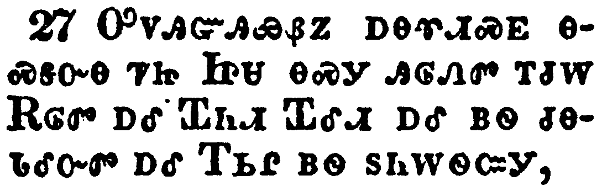</a></td>
</tr>
<tr class="even">
<td>For of a truth against thy holy child Jesus, whom thou hast anointed, both Herod, and Pontius Pilate, with the Gentiles, and the people of Israel, were gathered together,</td>
</tr>
<tr class="odd">
<td>ᎤᏙᎯᏳᎯᏯᏰᏃ ᎠᎾᏡᏗᏍᎬ ᎾᏍᎦᏅᎾ ᏤᏥ ᏥᏌ ᎾᏍᎩ ᎯᎶᏁᏛ ᎢᏧᎳ ᎡᎶᏛ ᎠᎴ ᏆᏂᏗ ᏆᎴᏗ ᎠᎴ ᏴᏫ ᏧᎾᏓᎴᏅᏛ ᎠᎴ ᎢᏏᎵ ᏴᏫ ᏚᏂᎳᏫᏨᎩ,</td>
</tr>
<tr class="even">
<td>U-do-hi-yu-hi-ya-ye-no a-na-tlu-di-s-gv na-s-ga-nv-na tse-tsi Tsi-sa na-s-gi hi-lo-ne-dv i-tsu-la E-lo-dv a-le Qua-ni-di Qua-le-di a-le yv-wi tsu-na-da-le-nv-dv a-le I-si-li yv-wi du-ni-la-wi-tsv-gi,</td>
</tr>
</tbody>
</table>

<table>
<tbody>
<tr class="odd">
<td><a href="050428.png">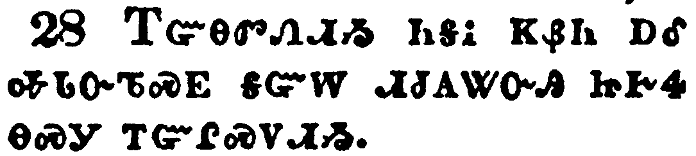</a></td>
</tr>
<tr class="even">
<td>For to do whatsoever thy hand and thy counsel determined before to be done.</td>
</tr>
<tr class="odd">
<td>ᎢᏳᎾᏛᏁᏗᏱ ᏂᎦᎥ ᏦᏰᏂ ᎠᎴ ᎭᏓᏅᏖᏍᎬ ᎦᏳᎳ ᏗᏧᎪᏔᏅᎯ ᏥᎨᏎ ᎾᏍᎩ ᎢᏳᎵᏍᏙᏗᏱ.</td>
</tr>
<tr class="even">
<td>I-yu-na-dv-ne-di-yi ni-ga-v tso-ye-ni a-le ha-da-nv-te-s-gv ga-yu-la di-tsu-go-ta-nv-hi tsi-ge-se na-s-gi i-yu-li-s-do-di-yi.</td>
</tr>
</tbody>
</table>

<table>
<tbody>
<tr class="odd">
<td><a href="050429.png">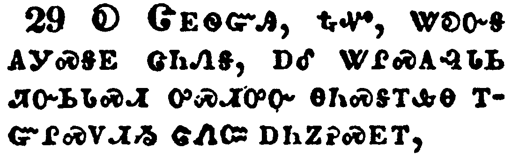</a></td>
</tr>
<tr class="even">
<td>And now, Lord, behold their threatenings: and grant unto thy servants, that with all boldness they may speak thy word,</td>
</tr>
<tr class="odd">
<td>Ꭷ ᏣᎬᏫᏳᎯ, ᎿᎭᏉ, ᏔᎧᏅᎦ ᎪᎩᏍᎦᎬ ᏣᏂᏁᎦ, ᎠᎴ ᏔᎵᏍᎪᎸᏓᏏ ᏘᏅᏏᏓᏍᏗ ᎤᏍᏗᎤᏅ ᎾᏂᏍᎦᎢᎲᎾ ᎢᏳᎵᏍᏙᏗᏱ ᏣᏁᏨ ᎠᏂᏃᎮᏍᎬᎢ,</td>
</tr>
<tr class="even">
<td>Ka Tsa-gv-wi-yu-hi, hna-quo, ta-ka-nv-ga go-gi-s-ga-gv tsa-ni-ne-ga, a-le ta-li-s-go-lv-da-si ti-nv-si-da-s-di u-s-di-u-nv na-ni-s-ga-i-hv-na i-yu-li-s-do-di-yi tsa-ne-tsv a-ni-no-he-s-gv-i,</td>
</tr>
</tbody>
</table>

<table>
<tbody>
<tr class="odd">
<td><a href="050430.png">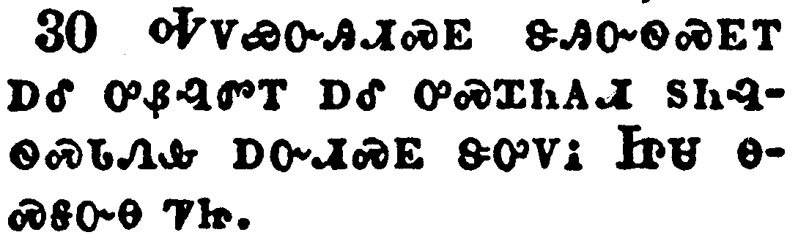</a></td>
</tr>
<tr class="even">
<td>By stretching forth thine hand to heal; and that signs and wonders may be done by the name of thy holy child Jesus.</td>
</tr>
<tr class="odd">
<td>ᎭᏙᏯᎯᏗᏍᎬ ᏕᎯᏅᏫᏍᎬᎢ ᎠᎴ ᎤᏰᎸᏛᎢ ᎠᎴ ᎤᏍᏆᏂᎪᏗ ᏚᏂᎸᏫᏍᏓᏁᎲ ᎠᏅᏗᏍᎬ ᏕᎤᏙᎥ ᏥᏌ ᎾᏍᎦᏅᎾ ᏤᏥ.</td>
</tr>
<tr class="even">
<td>Ha-do-ya-hi-di-s-gv de-hi-nv-wi-s-gv-i a-le u-ye-lv-dv-i a-le u-s-qua-ni-go-di du-ni-lv-wi-s-da-ne-hv a-nv-di-s-gv de-u-do-v Tsi-sa na-s-ga-nv-na tse-tsi.</td>
</tr>
</tbody>
</table>

<table>
<tbody>
<tr class="odd">
<td><a href="050431.png">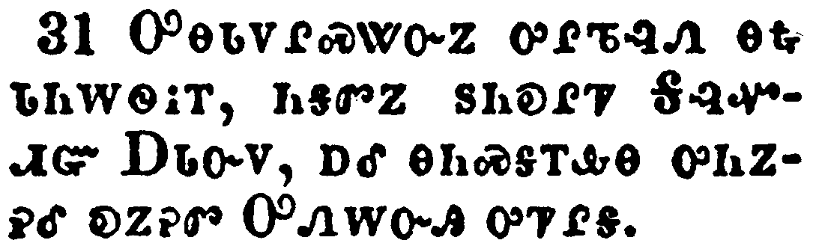</a></td>
</tr>
<tr class="even">
<td>And when they had prayed, the place was shaken where they were assembled together; and they were all filled with the Holy Ghost, and they spake the word of God with boldness.</td>
</tr>
<tr class="odd">
<td>ᎤᎾᏓᏙᎵᏍᏔᏅᏃ ᎤᎵᏖᎸᏁ ᎾᎿᎭᏓᏂᎳᏫᎥᎢ, ᏂᎦᏛᏃ ᏚᏂᎧᎵᏤ ᎦᎸᏉᏗᏳ ᎠᏓᏅᏙ, ᎠᎴ ᎾᏂᏍᎦᎢᎲᎾ ᎤᏂᏃᎮᎴ ᎧᏃᎮᏛ ᎤᏁᎳᏅᎯ ᎤᏤᎵᎦ.</td>
</tr>
<tr class="even">
<td>U-na-da-do-li-s-ta-nv-no u-li-te-lv-ne na-hna da-ni-la-wi-v-i, ni-ga-dv-no du-ni-ka-li-tse Ga-lv-quo-di-yu A-da-nv-do, a-le na-ni-s-ga-i-hv-na u-ni-no-he-le ka-no-he-dv U-ne-la-nv-hi u-tse-li-ga.</td>
</tr>
</tbody>
</table>

<table>
<tbody>
<tr class="odd">
<td><a href="050432.png">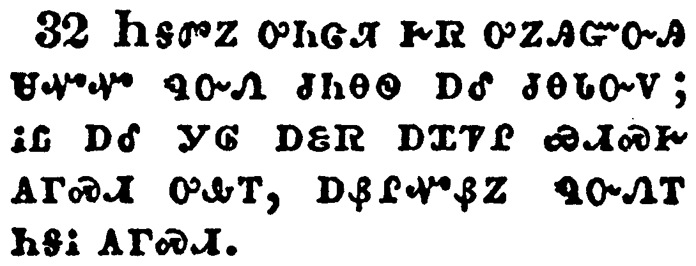</a></td>
</tr>
<tr class="even">
<td>And the multitude of them that believed were of one heart and of one soul: neither said any of them that ought of the things which he possessed was his own; but they had all things common.</td>
</tr>
<tr class="odd">
<td>ᏂᎦᏛᏃ ᎤᏂᏣᏘ ᎨᏒ ᎤᏃᎯᏳᏅᎯ ᏌᏉᏉ ᏄᏅᏁ ᏧᏂᎾᏫ ᎠᎴ ᏧᎾᏓᏅᏙ; ᎥᏝ ᎠᎴ ᎩᎶ ᎠᏋᏒ ᎠᏆᏤᎵ ᏯᏗᏍᎨ ᎪᎱᏍᏗ ᎤᎲᎢ, ᎠᏰᎵᏉᏰᏃ ᏄᏅᏁᎢ ᏂᎦᎥ ᎪᎱᏍᏗ.</td>
</tr>
<tr class="even">
<td>Ni-ga-dv-no u-ni-tsa-ti ge-sv u-no-hi-yu-nv-hi sa-quo-quo nu-nv-ne tsu-ni-na-wi a-le tsu-na-da-nv-do; v-tla a-le gi-lo a-quv-sv a-qua-tse-li ya-di-s-ge go-hu-s-di u-hv-i, a-ye-li-quo-ye-no nu-nv-ne-i ni-ga-v go-hu-s-di.</td>
</tr>
</tbody>
</table>

<table>
<tbody>
<tr class="odd">
<td><a href="050433.png">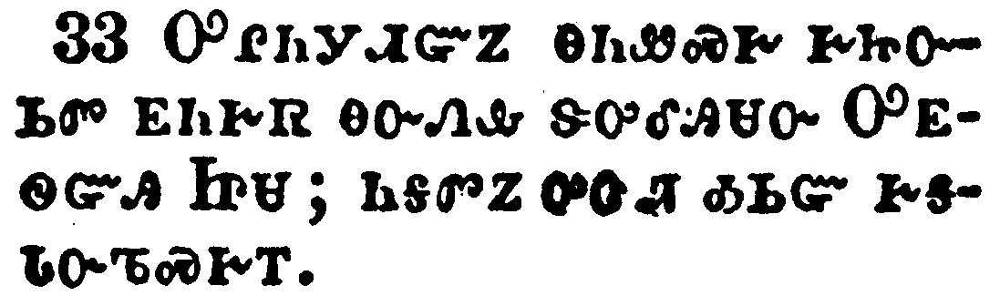</a></td>
</tr>
<tr class="even">
<td>And with great power gave the apostles witness of the resurrection of the Lord Jesus: and great grace was upon them all.</td>
</tr>
<tr class="odd">
<td>ᎤᎵᏂᎩᏗᏳᏃ ᎾᏂᏪᏍᎨ ᎨᏥᏪᏍᎨ ᎨᏥᏅᏏᏛ ᎬᏂᎨᏒ ᎾᏅᏁᎲ ᏕᏅᎴᎯᏌᏅ ᎤᎬᏫᏳᎯ ᏥᏌ; ᏂᎦᏛᏃ ᎤᏣᏘ ᎣᏏᏳ ᎨᎦᏓᏅᏖᏍᎨᎢ.</td>
</tr>
<tr class="even">
<td>U-li-ni-gi-di-yu-no na-ni-we-s-ge ge-tsi-we-s-ge ge-tsi-nv-si-dv gv-ni-ge-sv na-nv-ne-hv de-nv-le-hi-sa-nv U-gv-wi-yu-hi Tsi-sa; ni-ga-dv-no u-tsa-ti o-si-yu ge-ga-da-nv-te-s-ge-i.</td>
</tr>
</tbody>
</table>

<table>
<tbody>
<tr class="odd">
<td><a href="050434.png">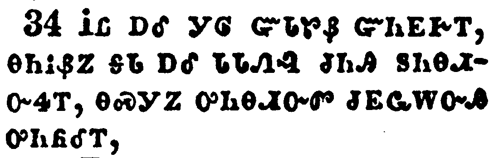</a></td>
</tr>
<tr class="even">
<td>Neither was there any among them that lacked: for as many as were possessors of lands or houses sold them, and brought the prices of the things that were sold,</td>
</tr>
<tr class="odd">
<td>ᎥᏝ ᎠᎴ ᎩᎶ ᏳᏓᏑᏰ ᏳᏂᎬᎨᎢ, ᎾᏂᎥᏰᏃ ᎦᏓ ᎠᎴ ᏓᏓᏁᎸ ᏧᏂᎯ ᏚᏂᎾᏗᏅᏎᎢ, ᎾᏍᎩᏃ ᎤᏂᎾᏗᏅᏛ ᏧᎬᏩᎳᏅᎯ ᎤᏂᏲᎴᎢ,</td>
</tr>
<tr class="even">
<td>V-tla a-le gi-lo yu-da-su-ye yu-ni-gv-ge-i, na-ni-v-ye-no ga-da a-le da-da-ne-lv tsu-ni-hi du-ni-na-di-nv-se-i, na-s-gi-no u-ni-na-di-nv-dv tsu-gv-wa-la-nv-hi u-ni-yo-le-i,</td>
</tr>
</tbody>
</table>

<table>
<tbody>
<tr class="odd">
<td><a href="050435.png">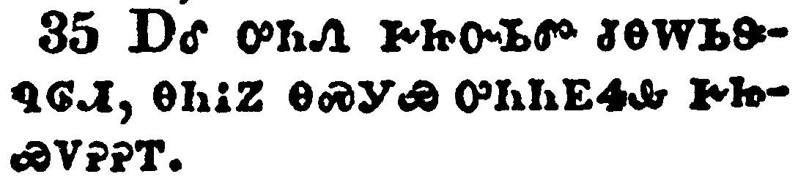</a></td>
</tr>
<tr class="even">
<td>And laid them down at the apostles' feet: and distribution was made unto every man according as he had need.</td>
</tr>
<tr class="odd">
<td>ᎠᎴ ᎤᏂᏁ ᎨᏥᏅᏏᏛ ᏧᎾᎳᏏᏕᏄᎶᏗ, ᎾᏂᎥᏃ ᎾᏍᎩᏯ ᎤᏂᏂᎬᏎᎲ ᎨᏥᏯᏙᎮᎮᎢ.</td>
</tr>
<tr class="even">
<td>A-le u-ni-ne ge-tsi-nv-si-dv tsu-na-la-si-de-nu-lo-di, na-ni-v-no na-s-gi-ya u-ni-ni-gv-se-hv ge-tsi-ya-do-he-he-i.</td>
</tr>
</tbody>
</table>

<table>
<tbody>
<tr class="odd">
<td><a href="050436.png">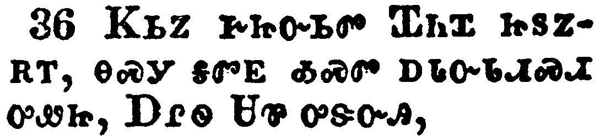</a></td>
</tr>
<tr class="even">
<td>And Joses, who by the apostles was surnamed Barnabas, (which is, being interpreted, The son of consolation,) a Levite, and of the country of Cyprus,</td>
</tr>
<tr class="odd">
<td>ᏦᏏᏃ ᎨᏥᏅᏏᏛ ᏆᏂᏆ ᏥᏚᏃᎡᎢ, ᎾᏍᎩ ᎦᏛᎬ ᎣᏍᏛ ᎠᏓᏅᏓᏗᏍᏗ ᎤᏪᏥ, ᎠᎵᏫ ᏌᏈ ᎤᏕᏅᎯ,</td>
</tr>
<tr class="even">
<td>Tso-si-no ge-tsi-nv-si-dv Qua-ni-qua tsi-du-no-e-i, na-s-gi ga-dv-gv o-s-dv a-da-nv-da-di-s-di u-we-tsi, A-li-wi Sa-qui u-de-nv-hi,</td>
</tr>
</tbody>
</table>

<table>
<tbody>
<tr class="odd">
<td><a href="050437.png">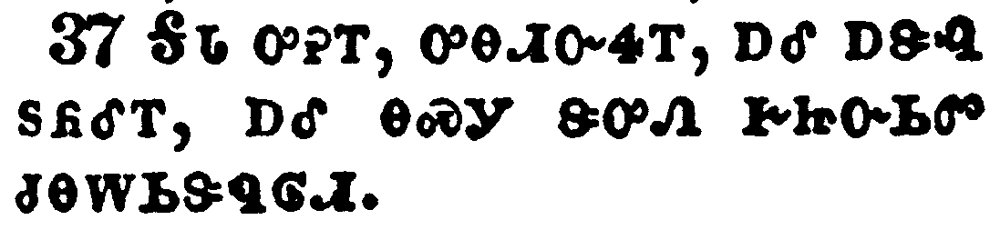</a></td>
</tr>
<tr class="even">
<td>Having land, sold it, and brought the money, and laid it at the apostles' feet.</td>
</tr>
<tr class="odd">
<td>ᎦᏓ ᎤᎮᎢ, ᎤᎾᏗᏅᏎᎢ, ᎠᎴ ᎠᏕᎸ ᏚᏲᎴᎢ, ᎠᎴ ᎾᏍᎩ ᏕᎤᏁ ᎨᏥᏅᏏᏛ ᏧᎾᎳᏏᏕᏄᎶᏗ.</td>
</tr>
<tr class="even">
<td>Ga-da u-he-i, u-na-di-nv-se-i, a-le a-de-lv du-yo-le-i, a-le na-s-gi de-u-ne ge-tsi-nv-si-dv tsu-na-la-si-de-nu-lo-di.</td>
</tr>
</tbody>
</table>

