+++
draft=false
date = 2014-12-18T21:11:07Z
title = "The Acts - Chapter 5 - Cherokee New Testament"
weight = 1418955067

[taxonomies]

authors = ["Timothy Legg"]
categories = []
tags = []

[extra]
+++

<table>
<tbody>
<tr class="odd">
<td><a href="050501.png">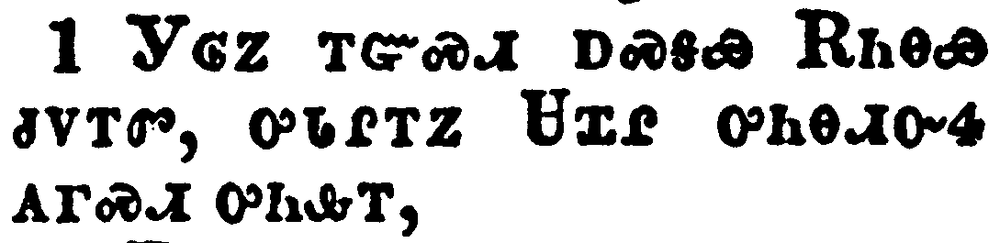</a></td>
</tr>
<tr class="even">
<td>But a certain man named Ananias, with Sapphira his wife, sold a possession,</td>
</tr>
<tr class="odd">
<td>ᎩᎶᏃ ᎢᏳᏍᏗ ᎠᏍᎦᏯ ᎡᏂᎾᏯ ᏧᏙᎢᏛ, ᎤᏓᎵᎢᏃ ᏌᏉᎵ ᎤᏂᎾᏗᏅᏎ ᎪᎱᏍᏗ ᎤᏂᎲᎢ,</td>
</tr>
<tr class="even">
<td>Gi-lo-no i-yu-s-di a-s-ga-ya E-ni-na-ya tsu-do-i-dv, u-da-li-i-no Sa-quo-li u-ni-na-di-nv-se go-hu-s-di u-ni-hv-i,</td>
</tr>
</tbody>
</table>

<table>
<tbody>
<tr class="odd">
<td><a href="050502.png">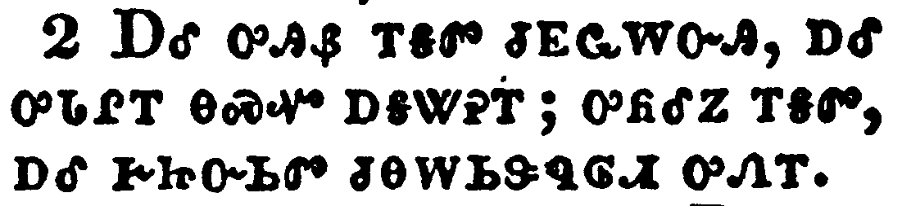</a></td>
</tr>
<tr class="even">
<td>And kept back part of the price, his wife also being privy to it, and brought a certain part, and laid it at the apostles' feet.</td>
</tr>
<tr class="odd">
<td>ᎠᎴ ᎤᎯᏰ ᎢᎦᏛ ᏧᎬᏩᎳᏅᎯ, ᎠᎴ ᎤᏓᎵᎢ ᎾᏍᏉ ᎠᎦᏔᎮᎢ; ᎤᏲᎴᏃ ᎢᎦᏛ, ᎠᎴ ᎨᏥᏅᏏᏛ ᏧᎾᎳᏏᏕᏄᎶᏗ ᎤᏁᎢ.</td>
</tr>
<tr class="even">
<td>A-le u-hi-ye i-ga-dv tsu-gv-wa-la-nv-hi, a-le u-da-li-i na-s-quo a-ga-ta-he-i; u-yo-le-no i-ga-dv, a-le ge-tsi-nv-si-dv tsu-na-la-si-de-nu-lo-di u-ne-i.</td>
</tr>
</tbody>
</table>

<table>
<tbody>
<tr class="odd">
<td><a href="050503.png">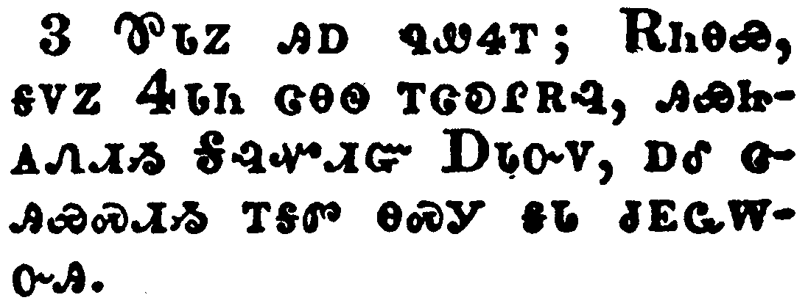</a></td>
</tr>
<tr class="even">
<td>But Peter said, Ananias, why hath Satan filled thine heart to lie to the Holy Ghost, and to keep back part of the price of the land?</td>
</tr>
<tr class="odd">
<td>ᏈᏓᏃ ᎯᎠ ᏄᏪᏎᎢ; ᎡᏂᎾᏯ, ᎦᏙᏃ ᏎᏓᏂ ᏣᎾᏫ ᎢᏣᎧᎵᎡᎸ, ᎯᏯᏥᎪᏁᏗᏱ ᎦᎸᏉᏗᏳ ᎠᏓᏅᏙ, ᎠᎴ ᏣᎯᏯᏍᏗᏱ ᎢᎦᏛ ᎾᏍᎩ ᎦᏓ ᏧᎬᏩᎳᏅᎯ.</td>
</tr>
<tr class="even">
<td>Qui-da-no hi-a nu-we-se-i; E-ni-na-ya, ga-do-no Se-da-ni tsa-na-wi i-tsa-ka-li-e-lv, hi-ya-tsi-go-ne-di-yi Ga-lv-quo-di-yu A-da-nv-do, a-le tsa-hi-ya-s-di-yi i-ga-dv na-s-gi ga-da tsu-gv-wa-la-nv-hi.</td>
</tr>
</tbody>
</table>

<table>
<tbody>
<tr class="odd">
<td><a href="050504.png">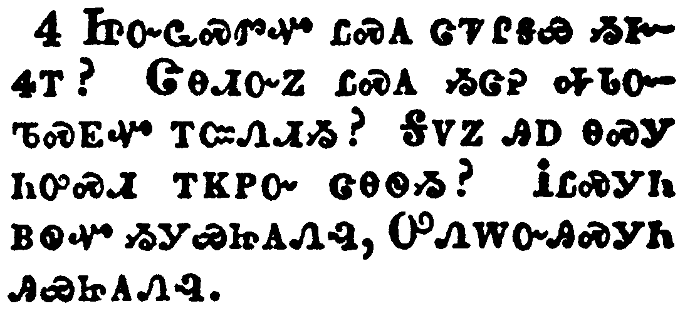</a></td>
</tr>
<tr class="even">
<td>Whiles it remained, was it not thine own? and after it was sold, was it not in thine own power? why hast thou conceived this thing in thine heart? thou hast not lied unto men, but unto God.</td>
</tr>
<tr class="odd">
<td>ᏥᏅᏩᏍᏛᏉ ᏝᏍᎪ ᏣᏤᎵᎦᏯ ᏱᎨᏎᎢ? ᏣᎾᏗᏅᏃ ᏝᏍᎪ ᏱᏣᎮ ᎭᏓᏅᏖᏍᎬᏉ ᎢᏨᏁᏗᏱ? ᎦᏙᏃ ᎯᎠ ᎾᏍᎩ ᏂᎤᏍᏗ ᎢᏦᏢᏅ ᏣᎾᏫᏱ? ᎥᏝᏍᎩᏂ ᏴᏫᏉ ᏱᎩᏯᏥᎪᏁᎸ, ᎤᏁᎳᏅᎯᏍᎩᏂ ᎯᏯᏥᎪᏁᎸ.</td>
</tr>
<tr class="even">
<td>Tsi-nv-wa-s-dv-quo tla-s-go tsa-tse-li-ga-ya yi-ge-se-i? Tsa-na-di-nv-no tla-s-go yi-tsa-he ha-da-nv-te-s-gv-quo i-tsv-ne-di-yi? Ga-do-no hi-a na-s-gi ni-u-s-di i-tso-tlv-nv tsa-na-wi-yi? V-tla-s-gi-ni yv-wi-quo yi-gi-ya-tsi-go-ne-lv, U-ne-la-nv-hi-s-gi-ni hi-ya-tsi-go-ne-lv.</td>
</tr>
</tbody>
</table>

<table>
<tbody>
<tr class="odd">
<td><a href="050505.png">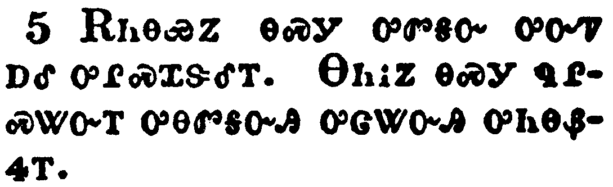</a></td>
</tr>
<tr class="even">
<td>And Ananias hearing these words fell down, and gave up the ghost: and great fear came on all them that heard these things.</td>
</tr>
<tr class="odd">
<td>ᎡᏂᎾᏯᏃ ᎾᏍᎩ ᎤᏛᎦᏅ ᎤᏅᏤ ᎠᎴ ᎤᎵᏍᏆᏕᎴᎢ. ᎾᏂᎥᏃ ᎾᏍᎩ ᏄᎵᏍᏔᏅᎢ ᎤᎾᏛᎦᏅᎯ ᎤᏣᏔᏅᎯ ᎤᏂᎾᏰᏎᎢ.</td>
</tr>
<tr class="even">
<td>E-ni-na-ya-no na-s-gi u-dv-ga-nv u-nv-tse a-le u-li-s-qua-de-le-i. Na-ni-v-no na-s-gi nu-li-s-ta-nv-i u-na-dv-ga-nv-hi u-tsa-ta-nv-hi u-ni-na-ye-se-i.</td>
</tr>
</tbody>
</table>

<table>
<tbody>
<tr class="odd">
<td></td>
</tr>
<tr class="even">
<td>And the young men arose, wound him up, and carried him out, and buried him.</td>
</tr>
<tr class="odd">
<td>ᎠᏂᏫᏅᏃ ᏚᎾᎴᏁ ᎠᎴ ᎤᏂᏣᏄᎳᏁᎢ, ᎤᏂᎾᏫᏛᎲᏃ ᏭᏂᏂᏌᏁᎢ.</td>
</tr>
<tr class="even">
<td>a-ni-wi-nv-no du-na-le-ne a-le u-ni-tsa-nu-la-ne-i, u-ni-na-wi-dv-hv-no wu-ni-ni-sa-ne-i.</td>
</tr>
</tbody>
</table>

<table>
<tbody>
<tr class="odd">
<td><a href="050507.png">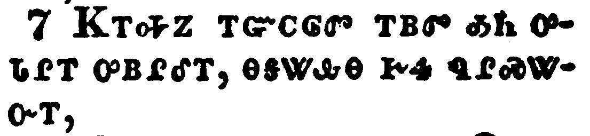</a></td>
</tr>
<tr class="even">
<td>And it was about the space of three hours after, when his wife, not knowing what was done, came in.</td>
</tr>
<tr class="odd">
<td>ᏦᎢᎭᏃ ᎢᏳᏟᎶᏛ ᎢᏴᏛ ᎣᏂ ᎤᏓᎵᎢ ᎤᏴᎵᎴᎢ, ᎾᎦᏔᎲᎾ ᎨᏎ ᏄᎵᏍᏔᏅᎢ,</td>
</tr>
<tr class="even">
<td>Tso-i-ha-no i-yu-tli-lo-dv i-yv-dv o-ni u-da-li-i u-yv-li-le-i, na-ga-ta-hv-na ge-se nu-li-s-ta-nv-i,</td>
</tr>
</tbody>
</table>

<table>
<tbody>
<tr class="odd">
<td><a href="050508.png">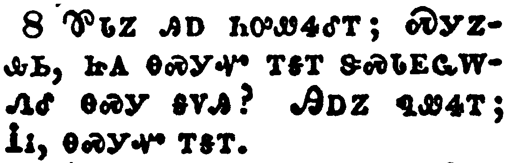</a></td>
</tr>
<tr class="even">
<td>And Peter answered unto her, Tell me whether ye sold the land for so much? And she said, Yea, for so much.</td>
</tr>
<tr class="odd">
<td>ᏈᏓᏃ ᎯᎠ ᏂᏅᏪᏎᎴᎢ; ᏍᎩᏃᎲᏏ, ᏥᎪ ᎾᏍᎩᏉ ᎢᎦᎢ ᏕᏍᏓᎬᏩᎳᏁᎴ ᎾᏍᎩ ᎦᏙᎯ? ᎯᎠᏃ ᏄᏪᏎᎢ; ᎥᎥ, ᎾᏍᎩᏉ ᎢᎦᎢ.</td>
</tr>
<tr class="even">
<td>Qui-da-no hi-a ni-nv-we-se-le-i; S-gi-no-hv-si, tsi-go na-s-gi-quo i-ga-i de-s-da-gv-wa-la-ne-le na-s-gi ga-do-hi? Hi-a-no nu-we-se-i; V-v, na-s-gi-quo i-ga-i.</td>
</tr>
</tbody>
</table>

<table>
<tbody>
<tr class="odd">
<td><a href="050509.png">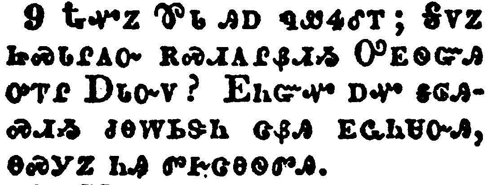</a></td>
</tr>
<tr class="even">
<td>Then Peter said unto her, How is it that ye have agreed together to tempt the Spirit of the Lord? behold, the feet of them which have buried thy husband are at the door, and shall carry thee out.</td>
</tr>
<tr class="odd">
<td>ᎿᎭᏉᏃ ᏈᏓ ᎯᎠ ᏄᏪᏎᎴᎢ; ᎦᏙᏃ ᏥᏍᏓᎵᎪᏅ ᎡᏍᏗᎪᎵᏰᏗᏱ ᎤᎬᏫᏳᎯ ᎤᏤᎵ ᎠᏓᏅᏙ? ᎬᏂᏳᏉ ᎠᏉ ᎦᎶᎯᏍᏗᏱ ᏧᎾᎳᏏᏕᏂ ᏣᏰᎯ ᎬᏩᏂᏌᏅᎯ, ᎾᏍᎩᏃ ᏂᎯ ᏛᎨᏣᎾᏫᏛᎯ.</td>
</tr>
<tr class="even">
<td>Hna-quo-no Qui-da hi-a nu-we-se-le-i; Ga-do-no tsi-s-da-li-go-nv e-s-di-go-li-ye-di-yi U-gv-wi-yu-hi u-tse-li A-da-nv-do? Gv-ni-yu-quo a-quo ga-lo-hi-s-di-yi tsu-na-la-si-de-ni tsa-ye-hi gv-wa-ni-sa-nv-hi, na-s-gi-no ni-hi dv-ge-tsa-na-wi-dv-hi.</td>
</tr>
</tbody>
</table>

<table>
<tbody>
<tr class="odd">
<td><a href="050510.png">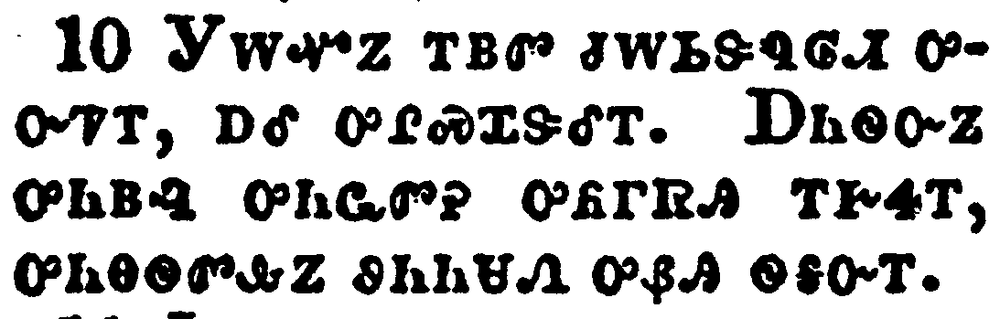</a></td>
</tr>
<tr class="even">
<td>Then fell she down straightway at his feet, and yielded up the ghost: and the young men came in, and found her dead, and, carrying her forth, buried her by her husband.</td>
</tr>
<tr class="odd">
<td>ᎩᎳᏉᏃ ᎢᏴᏛ ᏧᎳᏏᏕᏄᎶᏗ ᎤᏅᏤᎢ, ᎠᎴ ᎤᎵᏍᏆᏕᎴᎢ. ᎠᏂᏫᏅᏃ ᎤᏂᏴᎸ ᎤᏂᏩᏛᎮ ᎤᏲᎱᏒᎯ ᎢᎨᏎᎢ, ᎤᏂᎾᏫᏛᎲᏃ ᏭᏂᏂᏌᏁ ᎤᏰᎯ ᏫᎦᏅᎢ.</td>
</tr>
<tr class="even">
<td>Gi-la-quo-no i-yv-dv tsu-la-si-de-nu-lo-di u-nv-tse-i, a-le u-li-s-qua-de-le-i. A-ni-wi-nv-no u-ni-yv-lv u-ni-wa-dv-he u-yo-hu-sv-hi i-ge-se-i, u-ni-na-wi-dv-hv-no wu-ni-ni-sa-ne u-ye-hi wi-ga-nv-i.</td>
</tr>
</tbody>
</table>

<table>
<tbody>
<tr class="odd">
<td><a href="050511.png">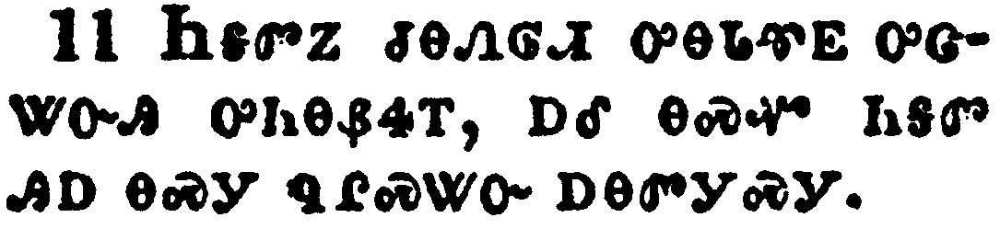</a></td>
</tr>
<tr class="even">
<td>And great fear came upon all the church, and upon as many as heard these things.</td>
</tr>
<tr class="odd">
<td>ᏂᎦᏛᏃ ᏧᎾᏁᎶᏗ ᎤᎾᏓᏡᎬ ᎤᏣᏔᏅᎯ ᎤᏂᎾᏰᏎᎢ, ᎠᎴ ᎾᏍᏉ ᏂᎦᏛ ᎯᎠ ᎾᏍᎩ ᏄᎵᏍᏔᏅ ᎠᎾᏛᎩᏍᎩ.</td>
</tr>
<tr class="even">
<td>Ni-ga-dv-no tsu-na-ne-lo-di u-na-da-tlu-gv u-tsa-ta-nv-hi u-ni-na-ye-se-i, a-le na-s-quo ni-ga-dv hi-a na-s-gi nu-li-s-ta-nv a-na-dv-gi-s-gi.</td>
</tr>
</tbody>
</table>

<table>
<tbody>
<tr class="odd">
<td><a href="050512.png">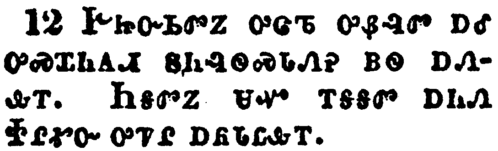</a></td>
</tr>
<tr class="even">
<td>And by the hands of the apostles were many signs and wonders wrought among the people; (and they were all with one accord in Solomon's porch.</td>
</tr>
<tr class="odd">
<td>ᎨᏥᏅᏏᏛᏃ ᎤᏣᏖ ᎤᏰᎸᏛ ᎠᎴ ᎤᏍᏆᏂᎪᏗ ᏚᏂᎸᏫᏍᏓᏁᎮ ᏴᏫ ᎠᏁᎲᎢ. ᏂᎦᏛᏃ ᏌᏉ ᎢᎦᎦᏛ ᎠᏂᏁ ᏐᎵᎹᏅ ᎤᏤᎵ ᎠᏲᏓᏝᎲᎢ.</td>
</tr>
<tr class="even">
<td>Ge-tsi-nv-si-dv-no u-tsa-te u-ye-lv-dv a-le u-s-qua-ni-go-di du-ni-lv-wi-s-da-ne-he yv-wi a-ne-hv-i. Ni-ga-dv-no sa-quo i-ga-ga-dv a-ni-ne So-li-ma-nv u-tse-li a-yo-da-tla-hv-i.</td>
</tr>
</tbody>
</table>

<table>
<tbody>
<tr class="odd">
<td><a href="050513.png">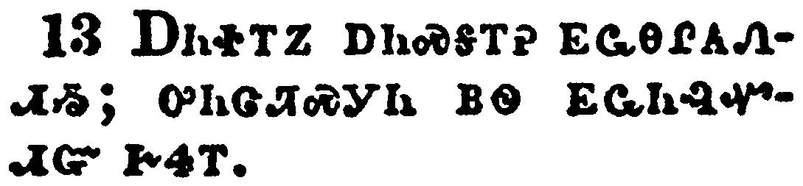</a></td>
</tr>
<tr class="even">
<td>And of the rest durst no man join himself to them: but the people magnified them.</td>
</tr>
<tr class="odd">
<td>ᎠᏂᏐᎢᏃ ᎠᏂᏍᎦᎢᎮ ᎬᏩᎾᎵᎪᏁᏗᏱ; ᎤᏂᏣᏘᏍᎩᏂ ᏴᏫ ᎬᏩᏂᎸᏉᏗᏳ ᎨᏎᎢ.</td>
</tr>
<tr class="even">
<td>A-ni-so-i-no a-ni-s-ga-i-he gv-wa-na-li-go-ne-di-yi; u-ni-tsa-ti-s-gi-ni yv-wi gv-wa-ni-lv-quo-di-yu ge-se-i.</td>
</tr>
</tbody>
</table>

<table>
<tbody>
<tr class="odd">
<td><a href="050514.png">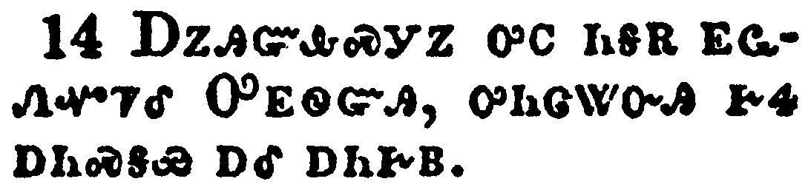</a></td>
</tr>
<tr class="even">
<td>And believers were the more added to the Lord, multitudes both of men and women.)</td>
</tr>
<tr class="odd">
<td>ᎠᏃᎯᏳᎲᏍᎩᏃ ᎤᏟ ᏂᎦᎡ ᎬᏩᏁᏉᏤᎴ ᎤᎬᏫᏳᎯ, ᎤᏂᏣᏔᏅᎯ ᎨᏎ ᎠᏂᏍᎦᏯ ᎠᎴ ᎠᏂᎨᏴ.</td>
</tr>
<tr class="even">
<td>A-no-hi-yu-hv-s-gi-no u-tli ni-ga-e gv-wa-ne-quo-tse-le U-gv-wi-yu-hi, u-ni-tsa-ta-nv-hi ge-se a-ni-s-ga-ya a-le a-ni-ge-yv.</td>
</tr>
</tbody>
</table>

<table>
<tbody>
<tr class="odd">
<td><a href="050515.png">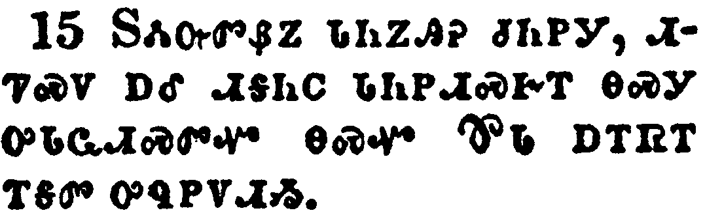</a></td>
</tr>
<tr class="even">
<td>Insomuch that they brought forth the sick into the streets, and laid them on beds and couches, that at the least the shadow of Peter passing by might overshadow some of them.</td>
</tr>
<tr class="odd">
<td>ᏚᏜᏓᏅᏛᏰᏃ ᏓᏂᏃᎯᎮ ᏧᏂᏢᎩ, ᏗᏤᏍᏙ ᎠᎴ ᏗᎦᏂᏟ ᏓᏂᏢᏗᏍᎨᎢ ᎾᏍᎩ ᎤᏓᏩᏗᏍᏛᏉ ᎾᏍᏉ ᏈᏓ ᎠᎢᏒᎢ ᎢᎦᏛ ᎤᏄᏢᏙᏗᏱ.</td>
</tr>
<tr class="even">
<td>Du-dla-nv-dv-ye-no da-ni-no-hi-he tsu-ni-tlv-gi, di-tse-s-do a-le di-ga-ni-tli da-ni-tlv-di-s-ge-i na-s-gi u-da-wa-di-s-dv-quo na-s-quo Qui-da a-i-sv-i i-ga-dv u-nu-tlv-do-di-yi.</td>
</tr>
</tbody>
</table>

<table>
<tbody>
<tr class="odd">
<td><a href="050516.png">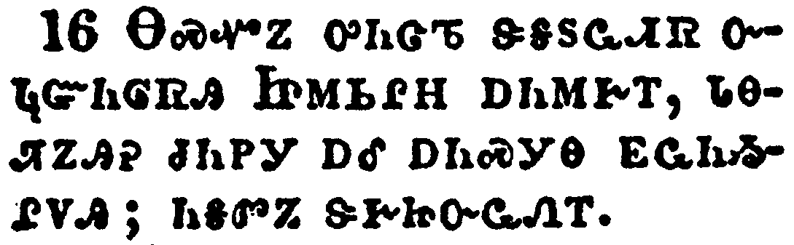</a></td>
</tr>
<tr class="even">
<td>There came also a multitude out of the cities round about unto Jerusalem, bringing sick folks, and them which were vexed with unclean spirits: and they were healed every one.</td>
</tr>
<tr class="odd">
<td>ᎾᏍᏉᏃ ᎤᏂᏣᏖ ᏕᎦᏚᏩᏗᏒ ᏅᏓᏳᏂᎶᏒᎯ ᏥᎷᏏᎵᎻ ᎠᏂᎷᎨᎢ, ᏓᎾᏖᏃᎯᎮ ᏧᏂᏢᎩ ᎠᎴ ᎠᏂᏍᎩᎾ ᎬᏩᏂᏱᎵᏙᎯ; ᏂᎦᏛᏃ ᏕᎨᏥᏅᏩᏁᎢ.</td>
</tr>
<tr class="even">
<td>Na-s-quo-no u-ni-tsa-te de-ga-du-wa-di-sv nv-da-yu-ni-lo-sv-hi Tsi-lu-si-li-mi a-ni-lu-ge-i, da-na-te-no-hi-he tsu-ni-tlv-gi a-le a-ni-s-gi-na gv-wa-ni-yi-li-do-hi; ni-ga-dv-no de-ge-tsi-nv-wa-ne-i.</td>
</tr>
</tbody>
</table>

<table>
<tbody>
<tr class="odd">
<td><a href="050517.png">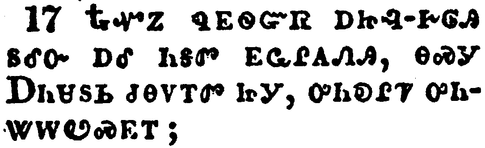</a></td>
</tr>
<tr class="even">
<td>Then the high priest rose up, and all they that were with him, (which is the sect of the Sadducees,) and were filled with indignation,</td>
</tr>
<tr class="odd">
<td>ᎿᎭᏉᏃ ᏄᎬᏫᏳᏒ ᎠᏥᎸ-ᎨᎶᎯ ᏚᎴᏅ ᎠᎴ ᏂᎦᏛ ᎬᏩᎵᎪᏁᎯ, ᎾᏍᎩ ᎠᏂᏌᏚᏏ ᏧᎾᏙᎢᏛ ᏥᎩ, ᎤᏂᎧᎵᏤ ᎤᏂᏔᎳᏬᏍᎬᎢ;</td>
</tr>
<tr class="even">
<td>Hna-quo-no nu-gv-wi-yu-sv a-tsi-lv--ge-lo-hi du-le-nv a-le ni-ga-dv gv-wa-li-go-ne-hi, na-s-gi A-ni-sa-du-si tsu-na-do-i-dv tsi-gi, u-ni-ka-li-tse u-ni-ta-la-wo-s-gv-i;</td>
</tr>
</tbody>
</table>

<table>
<tbody>
<tr class="odd">
<td></td>
</tr>
<tr class="even">
<td>And laid their hands on the apostles, and put them in the common prison.</td>
</tr>
<tr class="odd">
<td>ᎠᎴ ᏚᏂᏂᏴᎮ ᎨᏥᏅᏏᏛ ᎠᎴ ᏗᏓᏍᏚᏗᏱ ᏚᏂᏴᏔᏁᎢ.</td>
</tr>
<tr class="even">
<td>A-le du-ni-ni-yv-he ge-tsi-nv-si-dv a-le di-da-s-du-di-yi du-ni-yv-ta-ne-i.</td>
</tr>
</tbody>
</table>

<table>
<tbody>
<tr class="odd">
<td><a href="050519.png">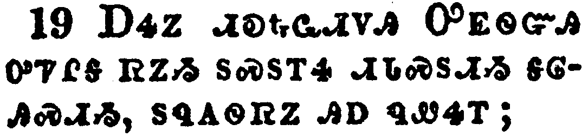</a></td>
</tr>
<tr class="even">
<td>But the angel of the Lord by night opened the prison doors, and brought them forth, and said,</td>
</tr>
<tr class="odd">
<td>ᎠᏎᏃ ᏗᎧᎿᎭᏩᏗᏙᎯ ᎤᎬᏫᏳᎯ ᎤᏤᎵᎦ ᏒᏃᏱ ᏚᏍᏚᎢᏎ ᏗᏓᏍᏚᏗᏱ ᎦᎶᎯᏍᏗᏱ, ᏚᏄᎪᏫᏒᏃ ᎯᎠ ᏄᏪᏎᎢ;</td>
</tr>
<tr class="even">
<td>A-se-no di-ka-hna-wa-di-do-hi U-gv-wi-yu-hi u-tse-li-ga sv-no-yi du-s-du-i-se di-da-s-du-di-yi ga-lo-hi-s-di-yi, du-nu-go-wi-sv-no hi-a nu-we-se-i;</td>
</tr>
</tbody>
</table>

<table>
<tbody>
<tr class="odd">
<td><a href="050520.png">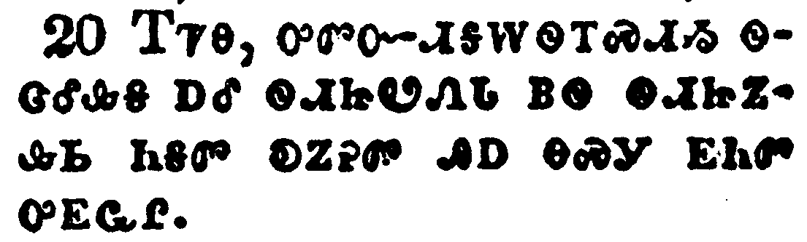</a></td>
</tr>
<tr class="even">
<td>Go, stand and speak in the temple to the people all the words of this life.</td>
</tr>
<tr class="odd">
<td>ᎢᏤᎾ, ᎤᏛᏅ-ᏗᎦᎳᏫᎢᏍᏗᏱ ᏫᏣᎴᎲᎦ ᎠᎴ ᏫᏗᏥᏬᏁᏓ ᏴᏫ ᏫᏗᏥᏃᎲᏏ ᏂᎦᏛ ᎧᏃᎮᏛ ᎯᎠ ᎾᏍᎩ ᎬᏂᏛ ᎤᎬᏩᎵ.</td>
</tr>
<tr class="even">
<td>I-tse-na, u-dv-nv--di-ga-la-wi-i-s-di-yi wi-tsa-le-hv-ga a-le wi-di-tsi-wo-ne-da yv-wi wi-di-tsi-no-hv-si ni-ga-dv ka-no-he-dv hi-a na-s-gi gv-ni-dv u-gv-wa-li.</td>
</tr>
</tbody>
</table>

<table>
<tbody>
<tr class="odd">
<td></td>
</tr>
<tr class="even">
<td>And when they heard that, they entered into the temple early in the morning, and taught. But the high priest came, and they that were with him, and called the council together, and all the senate of the children of Israel and sent to the prison to have them brought.</td>
</tr>
<tr class="odd">
<td>ᎾᏍᎩᏃ ᎤᎾᏛᎦᏅ ᎩᎳ ᏧᎩᏥᏍᎪᎢ ᏭᏂᏴᎴ ᎤᏛᏅ-ᏗᎦᎳᏫᎢᏍᏗᏱ ᎠᎴ ᏚᎾᏕᏲᏁᎢ. ᎠᏎᏃ ᏄᎬᏫᏳᏒ ᎠᏥᎸ-ᎨᎶᎯ ᎤᎷᏨ, ᎠᎴ ᎾᏍᎩ ᎬᏩᎵᎪᏁᎯ, ᏚᏂᏟᏌᏁ ᏗᏂᎳᏫᎩ, ᎠᎴ ᏂᎦᏛ ᏄᏂᎬᏫᏳᏌᏕᎩ ᎢᏏᎵ ᏧᏪᏥ ᏧᎾᏤᎵᎦ, ᎠᎴ ᏫᏓᏯᏅᎲ ᎤᎾᏓᏅᏎ ᏗᏓᏍᏚᏗᏱ.</td>
</tr>
<tr class="even">
<td>Na-s-gi-no u-na-dv-ga-nv gi-la tsu-gi-tsi-s-go-i wu-ni-yv-le u-dv-nv--di-ga-la-wi-i-s-di-yi a-le du-na-de-yo-ne-i. A-se-no nu-gv-wi-yu-sv a-tsi-lv--ge-lo-hi u-lu-tsv, a-le na-s-gi gv-wa-li-go-ne-hi, du-ni-tli-sa-ne di-ni-la-wi-gi, a-le ni-ga-dv nu-ni-gv-wi-yu-sa-de-gi I-si-li tsu-we-tsi tsu-na-tse-li-ga, a-le wi-da-ya-nv-hv u-na-da-nv-se di-da-s-du-di-yi.</td>
</tr>
</tbody>
</table>

<table>
<tbody>
<tr class="odd">
<td></td>
</tr>
<tr class="even">
<td>But when the officers came, and found them not in the prison, they returned, and told,</td>
</tr>
<tr class="odd">
<td>ᎠᏎᏃ ᏗᎾᏓᏂᏱᏍᎩ ᏭᏂᎷᏨ ᏫᏚᎾᏠᏤ ᏗᏓᏍᏚᏗᏱ, ᏗᎤᎾᏨᏒᏃ ᎤᏂᏃᏁᎢ,</td>
</tr>
<tr class="even">
<td>A-se-no di-na-da-ni-yi-s-gi wu-ni-lu-tsv wi-du-na-tlo-tse di-da-s-du-di-yi, di-u-na-tsv-sv-no u-ni-no-ne-i,</td>
</tr>
</tbody>
</table>

<table>
<tbody>
<tr class="odd">
<td><a href="050523.png">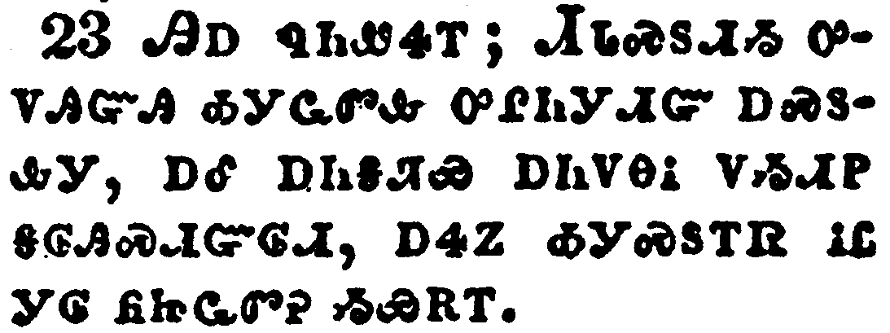</a></td>
</tr>
<tr class="even">
<td>Saying, The prison truly found we shut with all safety, and the keepers standing without before the doors: but when we had opened, we found no man within.</td>
</tr>
<tr class="odd">
<td>ᎯᎠ ᏄᏂᏪᏎᎢ; ᏗᏓᏍᏚᏗᏱ ᎤᏙᎯᏳᎯ ᎣᎩᏩᏛᎲ ᎤᎵᏂᎩᏗᏳ ᎠᏍᏚᎲᎩ, ᎠᎴ ᎠᏂᎦᏘᏯ ᎠᏂᏙᎾᎥ ᏙᏱᏗᏢ ᎦᎶᎯᏍᏗᏳᎶᏗ, ᎠᏎᏃ ᎣᎩᏍᏚᎢᏒ ᎥᏝ ᎩᎶ ᏲᏥᏩᏛᎮ ᏱᏯᎡᎢ.</td>
</tr>
<tr class="even">
<td>Hi-a nu-ni-we-se-i; Di-da-s-du-di-yi u-do-hi-yu-hi o-gi-wa-dv-hv u-li-ni-gi-di-yu a-s-du-hv-gi, a-le a-ni-ga-ti-ya a-ni-do-na-v do-yi-di-tlv ga-lo-hi-s-di-yu-lo-di, a-se-no o-gi-s-du-i-sv v-tla gi-lo yo-tsi-wa-dv-he yi-ya-e-i.</td>
</tr>
</tbody>
</table>

<table>
<tbody>
<tr class="odd">
<td><a href="050524.png">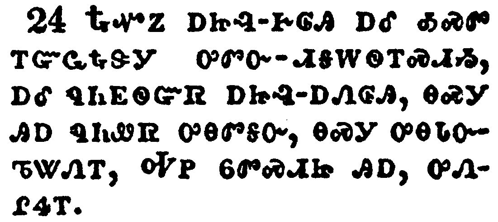</a></td>
</tr>
<tr class="even">
<td>Now when the high priest and the captain of the temple and the chief priests heard these things, they doubted of them whereunto this would grow.</td>
</tr>
<tr class="odd">
<td>ᎿᎭᏉᏃ ᎠᏥᎸ-ᎨᎶᎯ ᎠᎴ ᎣᏍᏛ ᎢᏳᏩᎿᎭᏕᎩ ᎤᏛᏅ-ᏗᎦᎳᏫᎢᏍᏗᏱ, ᎠᎴ ᏄᏂᎬᏫᏳᏒ ᎠᏥᎸ-ᎠᏁᎶᎯ, ᎾᏍᎩ ᎯᎠ ᏄᏂᏪᏒ ᎤᎾᏛᎦᏅ, ᎾᏍᎩ ᎤᎾᏓᏅᏖᏔᏁᎢ, ᎭᏢ ᏮᏛᏍᏗᏥ ᎯᎠ, ᎤᏁᎵᏎᎢ.</td>
</tr>
<tr class="even">
<td>Hna-quo-no a-tsi-lv--ge-lo-hi a-le o-s-dv i-yu-wa-hna-de-gi u-dv-nv--di-ga-la-wi-i-s-di-yi, a-le nu-ni-gv-wi-yu-sv a-tsi-lv--a-ne-lo-hi, na-s-gi hi-a nu-ni-we-sv u-na-dv-ga-nv, na-s-gi u-na-da-nv-te-ta-ne-i, Ha-tlv wv-dv-s-di-tsi hi-a, u-ne-li-se-i.</td>
</tr>
</tbody>
</table>

<table>
<tbody>
<tr class="odd">
<td><a href="050525.png">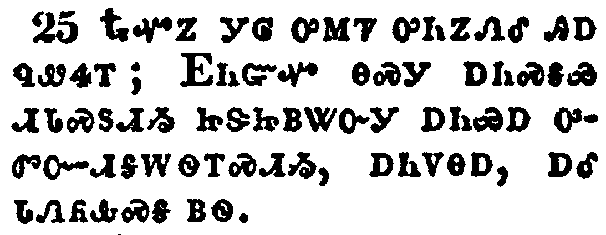</a></td>
</tr>
<tr class="even">
<td>Then came one and told them, saying, Behold, the men whom ye put in prison are standing in the temple, and teaching the people.</td>
</tr>
<tr class="odd">
<td>ᎿᎭᏉᏃ ᎩᎶ ᎤᎷᏤ ᎤᏂᏃᏁᎴ ᎯᎠ ᏄᏪᏎᎢ; ᎬᏂᏳᏉ ᎾᏍᎩ ᎠᏂᏍᎦᏯ ᏗᏓᏍᏚᏗᏱ ᏥᏕᏥᏴᏔᏅᎩ ᎠᏂᏯᎠ ᎤᏛᏅ-ᏗᎦᎳᏫᎢᏍᏗᏱ, ᎠᏂᏙᎾᎠ, ᎠᎴ ᏓᏁᏲᎲᏍᎦ ᏴᏫ.</td>
</tr>
<tr class="even">
<td>Hna-quo-no gi-lo u-lu-tse u-ni-no-ne-le hi-a nu-we-se-i; Gv-ni-yu-quo na-s-gi a-ni-s-ga-ya di-da-s-du-di-yi tsi-de-tsi-yv-ta-nv-gi a-ni-ya-a u-dv-nv--di-ga-la-wi-i-s-di-yi, a-ni-do-na-a, a-le da-ne-yo-hv-s-ga yv-wi.</td>
</tr>
</tbody>
</table>

<table>
<tbody>
<tr class="odd">
<td><a href="050526.png">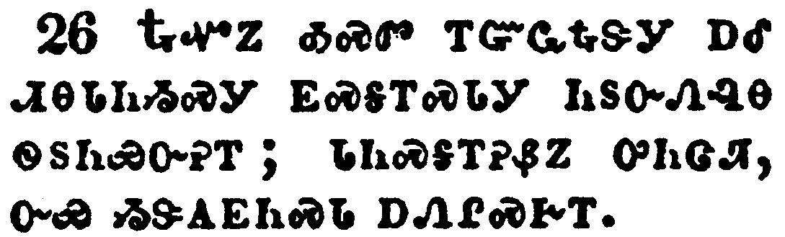</a></td>
</tr>
<tr class="even">
<td>Then went the captain with the officers, and brought them without violence: for they feared the people, lest they should have been stoned.</td>
</tr>
<tr class="odd">
<td>ᎿᎭᏉᏃ ᎣᏍᏛ ᎢᏳᏩᎿᎭᏕᎩ ᎠᎴ ᏗᎾᏓᏂᏱᏍᎩ ᎬᏍᎦᎢᏍᏓᎩ ᏂᏚᏅᏁᎸᎾ ᏫᏚᏂᏯᏅᎮᎢ; ᏓᏂᏍᎦᎢᎮᏰᏃ ᎤᏂᏣᏘ, ᏅᏯ ᏱᏕᎪᎬᏂᏍᏓ ᎠᏁᎵᏍᎨᎢ.</td>
</tr>
<tr class="even">
<td>Hna-quo-no o-s-dv i-yu-wa-hna-de-gi a-le di-na-da-ni-yi-s-gi gv-s-ga-i-s-da-gi ni-du-nv-ne-lv-na wi-du-ni-ya-nv-he-i; da-ni-s-ga-i-he-ye-no u-ni-tsa-ti, nv-ya yi-de-go-gv-ni-s-da a-ne-li-s-ge-i.</td>
</tr>
</tbody>
</table>

<table>
<tbody>
<tr class="odd">
<td><a href="050527.png">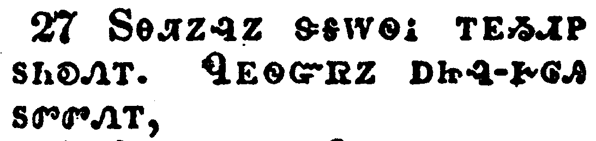</a></td>
</tr>
<tr class="even">
<td>And when they had brought them, they set them before the council: and the high priest asked them,</td>
</tr>
<tr class="odd">
<td>ᏚᎾᏘᏃᎸᏃ ᏕᎦᎳᏫᎥ ᎢᎬᏱᏗᏢ ᏑᏂᎧᏁᎢ. ᏄᎬᏫᏳᏒᏃ ᎠᏥᎸ-ᎨᎶᎯ ᏚᏛᏛᏁᎢ,</td>
</tr>
<tr class="even">
<td>Du-na-ti-no-lv-no de-ga-la-wi-v i-gv-yi-di-tlv su-ni-ka-ne-i. Nu-gv-wi-yu-sv-no a-tsi-lv--ge-lo-hi du-dv-dv-ne-i,</td>
</tr>
</tbody>
</table>

<table>
<tbody>
<tr class="odd">
<td><a href="050528.png">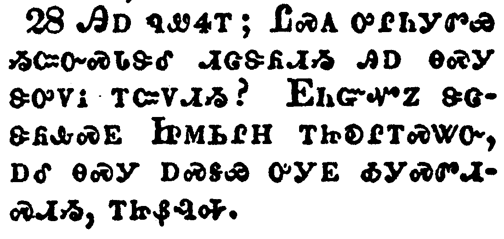</a></td>
</tr>
<tr class="even">
<td>Saying, Did not we straitly command you that ye should not teach in this name? and, behold, ye have filled Jerusalem with your doctrine, and intend to bring this man's blood upon us.</td>
</tr>
<tr class="odd">
<td>ᎯᎠ ᏄᏪᏎᎢ; ᏝᏍᎪ ᎤᎵᏂᎩᏛᏯ ᏱᏨᏅᏍᏓᏕᎴ ᏗᏣᏕᏲᏗᏱ ᎯᎠ ᎾᏍᎩ ᏕᎤᏙᎥ ᎢᏨᏙᏗᏱ? ᎬᏂᏳᏉᏃ ᏕᏣᏕᏲᎲᏍᎬ ᏥᎷᏏᎵᎻ ᎢᏥᎧᎵᎢᏍᏔᏅ, ᎠᎴ ᎾᏍᎩ ᎠᏍᎦᏯ ᎤᎩᎬ ᎣᎩᏍᏛᏗᏍᏗᏱ, ᎢᏥᏰᎸᎭ.</td>
</tr>
<tr class="even">
<td>Hi-a nu-we-se-i; Tla-s-go u-li-ni-gi-dv-ya yi-tsv-nv-s-da-de-le di-tsa-de-yo-di-yi hi-a na-s-gi de-u-do-v i-tsv-do-di-yi? Gv-ni-yu-quo-no de-tsa-de-yo-hv-s-gv Tsi-lu-si-li-mi i-tsi-ka-li-i-s-ta-nv, a-le na-s-gi a-s-ga-ya u-gi-gv o-gi-s-dv-di-s-di-yi, i-tsi-ye-lv-ha.</td>
</tr>
</tbody>
</table>

<table>
<tbody>
<tr class="odd">
<td><a href="050529.png">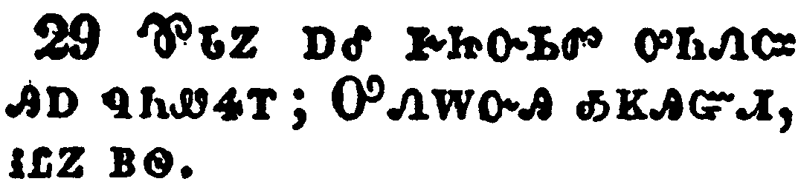</a></td>
</tr>
<tr class="even">
<td>Then Peter and the other apostles answered and said, We ought to obey God rather than men.</td>
</tr>
<tr class="odd">
<td>ᏈᏓᏃ ᎠᎴ ᎨᏥᏅᏏᏛ ᎤᏂᏁᏨ ᎯᎠ ᏄᏂᏪᏎᎢ; ᎤᏁᎳᏅᎯ ᎣᏦᎯᏳᏗ, ᎥᏝᏃ ᏴᏫ.</td>
</tr>
<tr class="even">
<td>Qui-da-no a-le ge-tsi-nv-si-dv u-ni-ne-tsv hi-a nu-ni-we-se-i; U-ne-la-nv-hi o-tso-hi-yu-di, v-tla-no yv-wi.</td>
</tr>
</tbody>
</table>

<table>
<tbody>
<tr class="odd">
<td><a href="050530.png">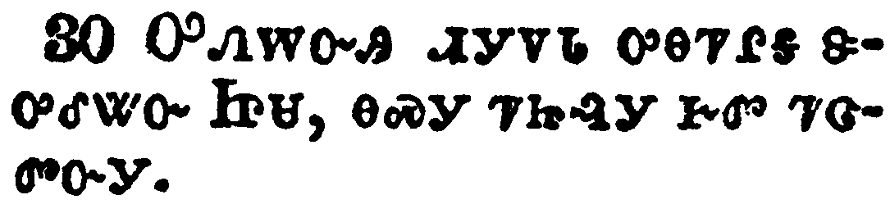</a></td>
</tr>
<tr class="even">
<td>The God of our fathers raised up Jesus, whom ye slew and hanged on a tree.</td>
</tr>
<tr class="odd">
<td>ᎤᏁᎳᏅᎯ ᏗᎩᏙᏓ ᎤᎾᏤᎵᎦ ᏕᎤᎴᏔᏅ ᏥᏌ, ᎾᏍᎩ ᏤᏥᎸᎩ ᎨᏛ ᏤᏣᏛᏅᎩ.</td>
</tr>
<tr class="even">
<td>U-ne-la-nv-hi di-gi-do-da u-na-tse-li-ga de-u-le-ta-nv Tsi-sa, na-s-gi tse-tsi-lv-gi ge-dv tse-tsa-dv-nv-gi.</td>
</tr>
</tbody>
</table>

<table>
<tbody>
<tr class="odd">
<td><a href="050531.png">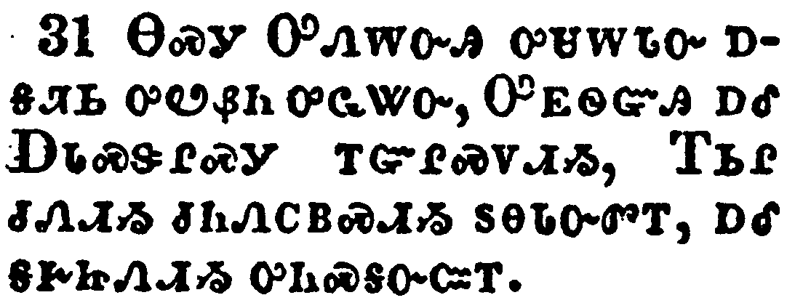</a></td>
</tr>
<tr class="even">
<td>Him hath God exalted with his right hand to be a Prince and a Saviour, for to give repentance to Israel, and forgiveness of sins.</td>
</tr>
<tr class="odd">
<td>ᎾᏍᎩ ᎤᏁᎳᏅᎯ ᎤᏌᎳᏓᏅ ᎠᎦᏘᏏ ᎤᏬᏰᏂ ᎤᏩᏔᏅ, ᎤᎬᏫᏳᎯ ᎠᎴ ᎠᏓᏍᏕᎵᏍᎩ ᎢᏳᎵᏍᏙᏗᏱ, ᎢᏏᎵ ᏧᏁᏗᏱ ᏧᏂᏁᏟᏴᏍᏗᏱ ᏚᎾᏓᏅᏛᎢ, ᎠᎴ ᎦᎨᏥᏁᏗᏱ ᎤᏂᏍᎦᏅᏨᎢ.</td>
</tr>
<tr class="even">
<td>Na-s-gi U-ne-la-nv-hi u-sa-la-da-nv a-ga-ti-si u-wo-ye-ni u-wa-ta-nv, U-gv-wi-yu-hi a-le A-da-s-de-li-s-gi i-yu-li-s-do-di-yi, I-si-li tsu-ne-di-yi tsu-ni-ne-tli-yv-s-di-yi du-na-da-nv-dv-i, a-le ga-ge-tsi-ne-di-yi u-ni-s-ga-nv-tsv-i.</td>
</tr>
</tbody>
</table>

<table>
<tbody>
<tr class="odd">
<td><a href="050532.png">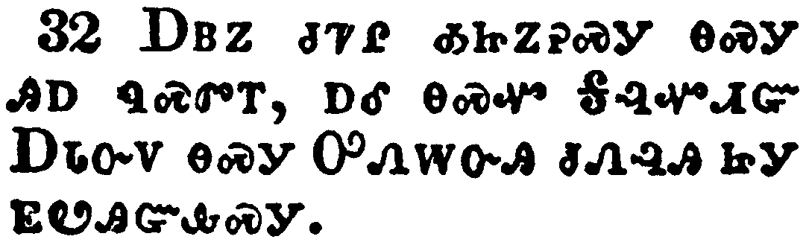</a></td>
</tr>
<tr class="even">
<td>And we are his witnesses of these things; and so is also the Holy Ghost, whom God hath given to them that obey him.</td>
</tr>
<tr class="odd">
<td>ᎠᏴᏃ ᏧᏤᎵ ᎣᏥᏃᎮᏍᎩ ᎾᏍᎩ ᎯᎠ ᏄᏍᏛᎢ, ᎠᎴ ᎾᏍᏉ ᎦᎸᏉᏗᏳ ᎠᏓᏅᏙ ᎾᏍᎩ ᎤᏁᎳᏅᎯ ᏧᏁᎸᎯ ᏥᎩ ᎬᏬᎯᏳᎲᏍᎩ.</td>
</tr>
<tr class="even">
<td>A-yv-no tsu-tse-li o-tsi-no-he-s-gi na-s-gi hi-a nu-s-dv-i, a-le na-s-quo Ga-lv-quo-di-yu A-da-nv-do na-s-gi U-ne-la-nv-hi tsu-ne-lv-hi tsi-gi gv-wo-hi-yu-hv-s-gi.</td>
</tr>
</tbody>
</table>

<table>
<tbody>
<tr class="odd">
<td><a href="050533.png">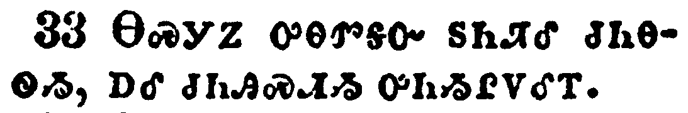</a></td>
</tr>
<tr class="even">
<td>When they heard that, they were cut to the heart, and took counsel to slay them.</td>
</tr>
<tr class="odd">
<td>ᎾᏍᎩᏃ ᎤᎾᏛᎦᏅ ᏚᏂᏘᎴ ᏧᏂᎾᏫᏱ, ᎠᎴ ᏧᏂᎯᏍᏗᏱ ᎤᏂᏱᎵᏙᎴᎢ.</td>
</tr>
<tr class="even">
<td>Na-s-gi-no u-na-dv-ga-nv du-ni-ti-le tsu-ni-na-wi-yi, a-le tsu-ni-hi-s-di-yi u-ni-yi-li-do-le-i.</td>
</tr>
</tbody>
</table>

<table>
<tbody>
<tr class="odd">
<td><a href="050534.png">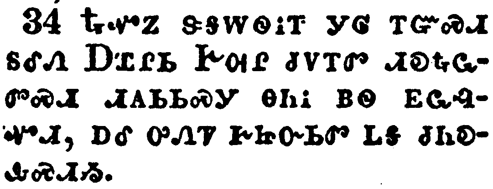</a></td>
</tr>
<tr class="even">
<td>Then stood there up one in the council, a Pharisee, named Gamaliel, a doctor of the law, had in reputation among all the people, and commanded to put the apostles forth a little space;</td>
</tr>
<tr class="odd">
<td>ᎿᎭᏉᏃ ᏕᎦᎳᏫᎥᎢ ᎩᎶ ᎢᏳᏍᏗ ᏚᎴᏁ ᎠᏆᎵᏏ ᎨᎺᎵ ᏧᏙᎢᏛ ᏗᎧᎿᎭᏩᏛᏍᏗ ᏗᎪᏏᏏᏍᎩ ᎾᏂᎥ ᏴᏫ ᎬᏩᎸᏉᏗ, ᎠᎴ ᎤᏁᏤ ᎨᏥᏅᏏᏛ ᏞᎦ ᏧᏂᎧᎲᏍᏗᏱ.</td>
</tr>
<tr class="even">
<td>Hna-quo-no de-ga-la-wi-v-i gi-lo i-yu-s-di du-le-ne A-qua-li-si Ge-me-li tsu-do-i-dv di-ka-hna-wa-dv-s-di di-go-si-si-s-gi na-ni-v yv-wi gv-wa-lv-quo-di, a-le u-ne-tse ge-tsi-nv-si-dv tle-ga tsu-ni-ka-hv-s-di-yi.</td>
</tr>
</tbody>
</table>

<table>
<tbody>
<tr class="odd">
<td><a href="050535.png">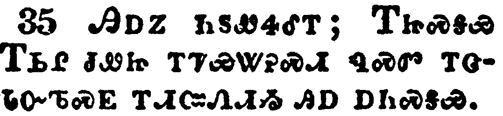</a></td>
</tr>
<tr class="even">
<td>And said unto them, Ye men of Israel, take heed to yourselves what ye intend to do as touching these men.</td>
</tr>
<tr class="odd">
<td>ᎯᎠᏃ ᏂᏚᏪᏎᎴᎢ; ᎢᏥᏍᎦᏯ ᎢᏏᎵ ᏧᏪᏥ ᎢᏤᏯᏔᎮᏍᏗ ᏄᏍᏛ ᎢᏣᏓᏅᏖᏍᎬ ᎢᏗᏳᏁᏗᏱ ᎯᎠ ᎠᏂᏍᎦᏯ.</td>
</tr>
<tr class="even">
<td>Hi-a-no ni-du-we-se-le-i; I-tsi-s-ga-ya I-si-li tsu-we-tsi i-tse-ya-ta-he-s-di nu-s-dv i-tsa-da-nv-te-s-gv i-di-yu-ne-di-yi hi-a a-ni-s-ga-ya.</td>
</tr>
</tbody>
</table>

<table>
<tbody>
<tr class="odd">
<td><a href="050536.png">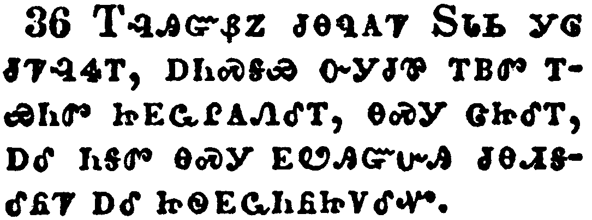</a></td>
</tr>
<tr class="even">
<td>For before these days rose up Theudas, boasting himself to be somebody; to whom a number of men, about four hundred, joined themselves: who was slain; and all, as many as obeyed him, were scattered, and brought to nought.</td>
</tr>
<tr class="odd">
<td>ᎢᎸᎯᏳᏰᏃ ᏧᎾᏄᎪᏤ ᏚᏓᏏ ᎩᎶ ᏧᏤᎸᏎᎢ, ᎠᏂᏍᎦᏯ ᏅᎩᏧᏈ ᎢᏴᏛ ᎢᏯᏂᏛ ᏥᎬᏩᎵᎪᏁᎴᎢ, ᎾᏍᎩ ᏣᏥᎴᎢ, ᎠᎴ ᏂᎦᏛ ᎾᏍᎩ ᎬᏬᎯᏳᏅᎯ ᏧᎾᏗᎦᎴᏲᏤ ᎠᎴ ᏥᏫᎬᏩᏂᏲᏥᏙᎴᏉ.</td>
</tr>
<tr class="even">
<td>I-lv-hi-yu-ye-no tsu-na-nu-go-tse Du-da-si gi-lo tsu-tse-lv-se-i, a-ni-s-ga-ya nv-gi-tsu-qui i-yv-dv i-ya-ni-dv tsi-gv-wa-li-go-ne-le-i, na-s-gi tsa-tsi-le-i, a-le ni-ga-dv na-s-gi gv-wo-hi-yu-nv-hi tsu-na-di-ga-le-yo-tse a-le tsi-wi-gv-wa-ni-yo-tsi-do-le-quo.</td>
</tr>
</tbody>
</table>

<table>
<tbody>
<tr class="odd">
<td><a href="050537.png">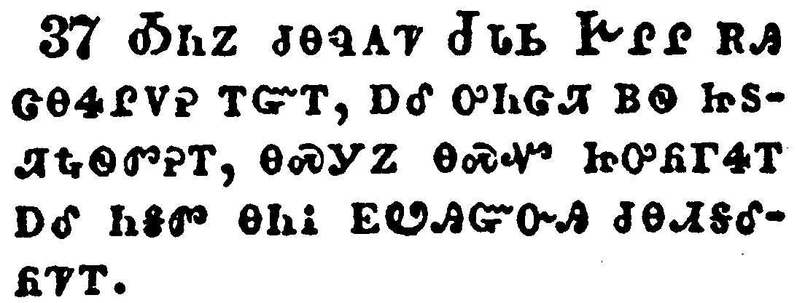</a></td>
</tr>
<tr class="even">
<td>After this man rose up Judas of Galilee in the days of the taxing, and drew away much people after him: he also perished; and all, even as many as obeyed him, were dispersed.</td>
</tr>
<tr class="odd">
<td>ᎣᏂᏃ ᏧᎾᏄᎪᏤ ᏧᏓᏏ ᎨᎵᎵ ᎡᎯ ᏣᎾᏎᎵᏙᎮ ᎢᏳᎢ, ᎠᎴ ᎤᏂᏣᏘ ᏴᏫ ᏥᏚᏘᎿᎭᏫᏛᎮᎢ, ᎾᏍᎩᏃ ᎾᏍᏉ ᏥᎤᏲᎱᏎᎢ ᎠᎴ ᏂᎦᏛ ᎾᏂᎥ ᎬᏬᎯᏳᏅᎯ ᏧᎾᏗᎦᎴᏲᏤᎢ.</td>
</tr>
<tr class="even">
<td>O-ni-no tsu-na-nu-go-tse Tsu-da-si Ge-li-li e-hi tsa-na-se-li-do-he i-yu-i, a-le u-ni-tsa-ti yv-wi tsi-du-ti-hna-wi-dv-he-i, na-s-gi-no na-s-quo tsi-u-yo-hu-se-i a-le ni-ga-dv na-ni-v gv-wo-hi-yu-nv-hi tsu-na-di-ga-le-yo-tse-i.</td>
</tr>
</tbody>
</table>

<table>
<tbody>
<tr class="odd">
<td><a href="050538.png">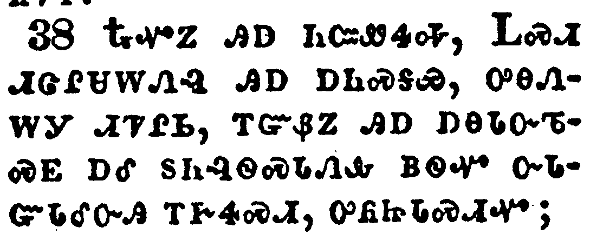</a></td>
</tr>
<tr class="even">
<td>And now I say unto you, Refrain from these men, and let them alone: for if this counsel or this work be of men, it will come to nought:</td>
</tr>
<tr class="odd">
<td>ᎿᎭᏉᏃ ᎯᎠ ᏂᏨᏪᏎᎭ, ᏞᏍᏗ ᏗᏣᎵᏌᎳᏁᎸ ᎯᎠ ᎠᏂᏍᎦᏯ, ᎤᎾᏁᎳᎩ ᏗᏤᎵᏏ, ᎢᏳᏰᏃ ᎯᎠ ᎠᎾᏓᏅᏖᏍᎬ ᎠᎴ ᏚᏂᎸᏫᏍᏓᏁᎲ ᏴᏫᏉ ᏅᏓᏳᏓᎴᏅᎯ ᎢᎨᏎᏍᏗ, ᎤᏲᏥᏓᏍᏗᏉ;</td>
</tr>
<tr class="even">
<td>Hna-quo-no hi-a ni-tsv-we-se-ha, Tle-s-di di-tsa-li-sa-la-ne-lv hi-a a-ni-s-ga-ya, u-na-ne-la-gi di-tse-li-si, i-yu-ye-no hi-a a-na-da-nv-te-s-gv a-le du-ni-lv-wi-s-da-ne-hv yv-wi-quo nv-da-yu-da-le-nv-hi i-ge-se-s-di, u-yo-tsi-da-s-di-quo;</td>
</tr>
</tbody>
</table>

<table>
<tbody>
<tr class="odd">
<td><a href="050539.png">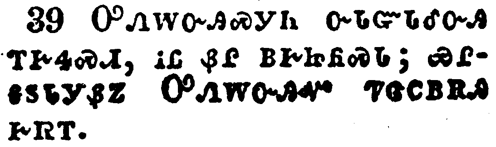</a></td>
</tr>
<tr class="even">
<td>But if it be of God, ye cannot overthrow it; lest haply ye be found even to fight against God.</td>
</tr>
<tr class="odd">
<td>ᎤᏁᎳᏅᎯᏍᎩᏂ ᏅᏓᏳᏓᎴᏅᎯ ᎢᎨᏎᏍᏗ, ᎥᏝ ᏰᎵ ᏴᎨᏥᏲᏍᏓ; ᏯᎵᎦᏚᏓᎩᏰᏃ ᎤᏁᎳᏅᎯᏉ ᏤᏣᏟᏴᎡᎯ ᎨᏒᎢ.</td>
</tr>
<tr class="even">
<td>U-ne-la-nv-hi-s-gi-ni nv-da-yu-da-le-nv-hi i-ge-se-s-di, v-tla ye-li yv-ge-tsi-yo-s-da; ya-li-ga-du-da-gi-ye-no U-ne-la-nv-hi-quo tse-tsa-tli-yv-e-hi ge-sv-i.</td>
</tr>
</tbody>
</table>

<table>
<tbody>
<tr class="odd">
<td><a href="050540.png">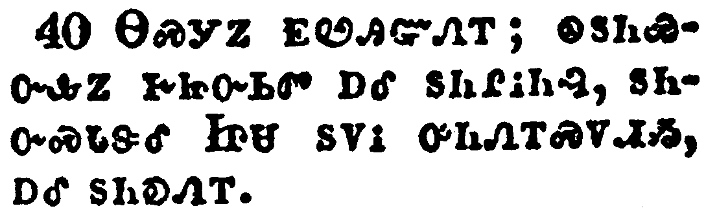</a></td>
</tr>
<tr class="even">
<td>And to him they agreed: and when they had called the apostles, and beaten them, they commanded that they should not speak in the name of Jesus, and let them go.</td>
</tr>
<tr class="odd">
<td>ᎾᏍᎩᏃ ᎬᏬᎯᏳᏁᎢ; ᏫᏚᏂᏯᏅᎲᏃ ᎨᏥᏅᏏᏛ ᎠᎴ ᏚᏂᎵᎥᏂᎸ, ᏚᏂᏅᏍᏓᏕᎴ ᏥᏌ ᏚᏙᎥ ᎤᏂᏁᎢᏍᏙᏗᏱ, ᎠᎴ ᏚᏂᎧᏁᎢ.</td>
</tr>
<tr class="even">
<td>Na-s-gi-no gv-wo-hi-yu-ne-i; wi-du-ni-ya-nv-hv-no ge-tsi-nv-si-dv a-le du-ni-li-v-ni-lv, du-ni-nv-s-da-de-le Tsi-sa du-do-v u-ni-ne-i-s-do-di-yi, a-le du-ni-ka-ne-i.</td>
</tr>
</tbody>
</table>

<table>
<tbody>
<tr class="odd">
<td><a href="050541.png">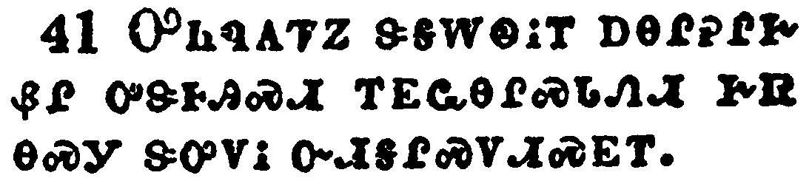</a></td>
</tr>
<tr class="even">
<td>And they departed from the presence of the council, rejoicing that they were counted worthy to suffer shame for his name.</td>
</tr>
<tr class="odd">
<td>ᎤᏂᏄᎪᏤᏃ ᏕᎦᎳᏫᎥᎢ ᎠᎾᎵᎮᎵᎨ ᏰᎵ ᎤᏕᎰᎯᏍᏗ ᎢᎬᏩᎾᎵᏍᏓᏁᏗ ᎨᏒ ᎾᏍᎩ ᏕᎤᏙᎥ ᏅᏗᎦᎵᏍᏙᏍᎬᎢ.</td>
</tr>
<tr class="even">
<td>U-ni-nu-go-tse-no de-ga-la-wi-v-i a-na-li-he-li-ge ye-li u-de-ho-hi-s-di i-gv-wa-na-li-s-da-ne-di ge-sv na-s-gi de-u-do-v nv-di-ga-li-s-do-s-gv-i.</td>
</tr>
</tbody>
</table>

<table>
<tbody>
<tr class="odd">
<td><a href="050542.png">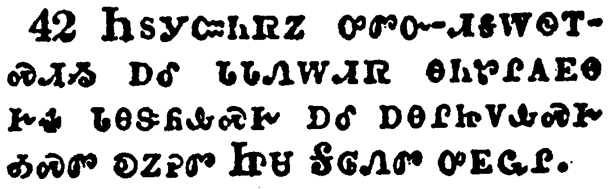</a></td>
</tr>
<tr class="even">
<td>And daily in the temple, and in every house, they ceased not to teach and preach Jesus Christ.</td>
</tr>
<tr class="odd">
<td>ᏂᏚᎩᏨᏂᏒᏃ ᎤᏛᏅ-ᏗᎦᎳᏫᎢᏍᏗᏱ ᎠᎴ ᏓᏓᏁᎳᏗᏒ ᎾᏂᏑᎵᎪᎬᎾ ᎨᏎ ᏓᎾᏕᏲᎲᏍᎨ ᎠᎴ ᎠᎾᎵᏥᏙᎲᏍᎨ ᎣᏍᏛ ᎧᏃᎮᏛ ᏥᏌ ᎦᎶᏁᏛ ᎤᎬᏩᎵ.</td>
</tr>
<tr class="even">
<td>Ni-du-gi-tsv-ni-sv-no u-dv-nv--di-ga-la-wi-i-s-di-yi a-le da-da-ne-la-di-sv na-ni-su-li-go-gv-na ge-se da-na-de-yo-hv-s-ge a-le a-na-li-tsi-do-hv-s-ge o-s-dv ka-no-he-dv Tsi-sa Ga-lo-ne-dv u-gv-wa-li.</td>
</tr>
</tbody>
</table>

