+++
draft=false
date = 2014-12-18T21:11:07Z
title = "The Acts - Chapter 7 - Cherokee New Testament"
weight = 1418955067

[taxonomies]

authors = ["Timothy Legg"]
categories = []
tags = []

[extra]
+++

<table>
<tbody>
<tr class="odd">
<td><a href="050701.png">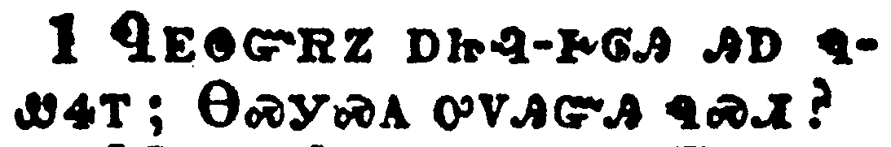</a></td>
</tr>
<tr class="even">
<td>Then said the high priest, Are these things so?</td>
</tr>
<tr class="odd">
<td>ᏄᎬᏫᏳᏒᏃ ᎠᏥᎸ-ᎨᎶᎯ ᎯᎠ ᏄᏪᏎᎢ; ᎾᏍᎩᏍᎪ ᎤᏃᎯᏳᎯ ᏄᏍᏗ?</td>
</tr>
<tr class="even">
<td>Nu-gv-wi-yu-sv-no a-tsi-lv--ge-lo-hi hi-a nu-we-se-i; Na-s-gi-s-go u-no-hi-yu-hi nu-s-di?</td>
</tr>
</tbody>
</table>

<table>
<tbody>
<tr class="odd">
<td><a href="050702.png">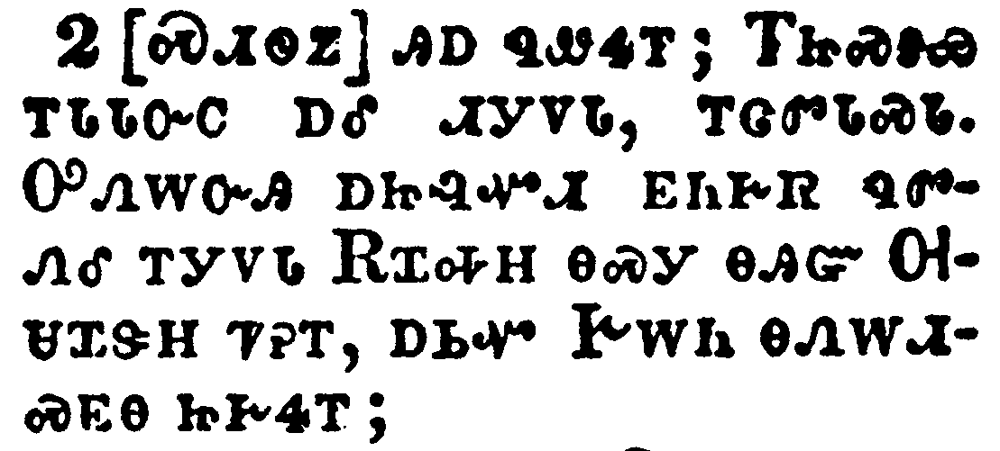</a></td>
</tr>
<tr class="even">
<td>And he said, Men, brethren, and fathers, hearken; The God of glory appeared unto our father Abraham, when he was in Mesopotamia, before he dwelt in Charran,</td>
</tr>
<tr class="odd">
<td>[ᏍᏗᏫᏃ] ᎯᎠ ᏄᏪᏎᎢ; ᎢᏥᏍᎦᏯ ᎢᏓᏓᏅᏟ ᎠᎴ ᏗᎩᏙᏓ, ᎢᏣᏛᏓᏍᏓ. ᎤᏁᎳᏅᎯ ᎠᏥᎸᏉᏗ ᎬᏂᎨᏒ ᏄᏛᏁᎴ ᎢᎩᏙᏓ ᎡᏆᎭᎻ ᎾᏍᎩ ᎾᎯᏳ ᎺᏌᏆᏕᎻ ᏤᎮᎢ, ᎠᏏᏉ ᎨᎳᏂ ᎾᏁᎳᏗᏍᎬᎾ ᏥᎨᏎᎢ;</td>
</tr>
<tr class="even">
<td>[S-di-wi-no] hi-a nu-we-se-i; I-tsi-s-ga-ya i-da-da-nv-tli a-le di-gi-do-da, i-tsa-dv-da-s-da. U-ne-la-nv-hi a-tsi-lv-quo-di gv-ni-ge-sv nu-dv-ne-le i-gi-do-da E-qua-ha-mi na-s-gi na-hi-yu Me-sa-qua-de-mi tse-he-i, a-si-quo Ge-la-ni na-ne-la-di-s-gv-na tsi-ge-se-i;</td>
</tr>
</tbody>
</table>

<table>
<tbody>
<tr class="odd">
<td><a href="050703.png">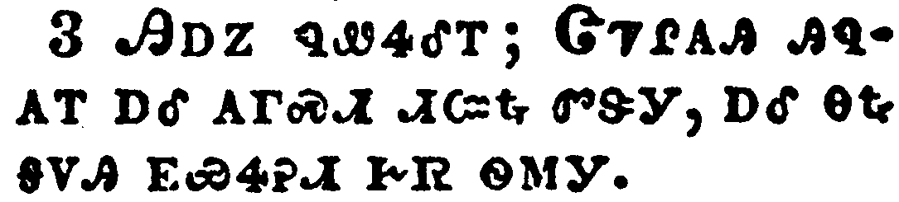</a></td>
</tr>
<tr class="even">
<td>And said unto him, Get thee out of thy country, and from thy kindred, and come into the land which I shall shew thee.</td>
</tr>
<tr class="odd">
<td>ᎯᎠᏃ ᏄᏪᏎᎴᎢ; ᏣᏤᎵᎪᎯ ᎯᏄᎪᎢ ᎠᎴ ᎪᎱᏍᏗ ᏗᏨᎿᎭ ᎠᎴ ᎾᎿᎭᎦᏙᎯ ᎬᏯᏎᎮᏗ ᎨᏒ ᏫᎷᎩ.</td>
</tr>
<tr class="even">
<td>Hi-a-no nu-we-se-le-i; Tsa-tse-li-go-hi hi-nu-go-i a-le go-hu-s-di di-tsv-hna, a-le na-hna ga-do-hi gv-ya-se-he-di ge-sv wi-lu-gi.</td>
</tr>
</tbody>
</table>

<table>
<tbody>
<tr class="odd">
<td></td>
</tr>
<tr class="even">
<td>Then came he out of the land of the Chaldaeans, and dwelt in Charran: and from thence, when his father was dead, he removed him into this land, wherein ye now dwell.</td>
</tr>
<tr class="odd">
<td>ᎿᎭᏉᏃ ᎤᏓᏅᏎ ᎠᏂᎦᎵᏗ ᎤᎾᏤᎵᎪᎯ, ᎨᎳᏂᏃ ᎤᏁᎳᏕᎢ, ᎾᎿᎭᏃ ᏗᎤᏓᏅᏒ, ᎤᏙᏓ ᎤᏲᎱᏒ, ᎡᏍᎦᏂ ᎤᎷᏤᎴᎢ ᎾᏍᎩ ᎠᏂ ᎪᎯ ᏥᏤᎭ.</td>
</tr>
<tr class="even">
<td>Hna-quo-no u-da-nv-se A-ni-ga-li-di u-na-tse-li-go-hi, Ge-la-ni-no u-ne-la-de-i, na-hna-no di-u-da-nv-sv, u-do-da u-yo-hu-sv, e-s-ga-ni u-lu-tse-le-i na-s-gi a-ni go-hi tsi-tse-ha.</td>
</tr>
</tbody>
</table>

<table>
<tbody>
<tr class="odd">
<td><a href="050705.png">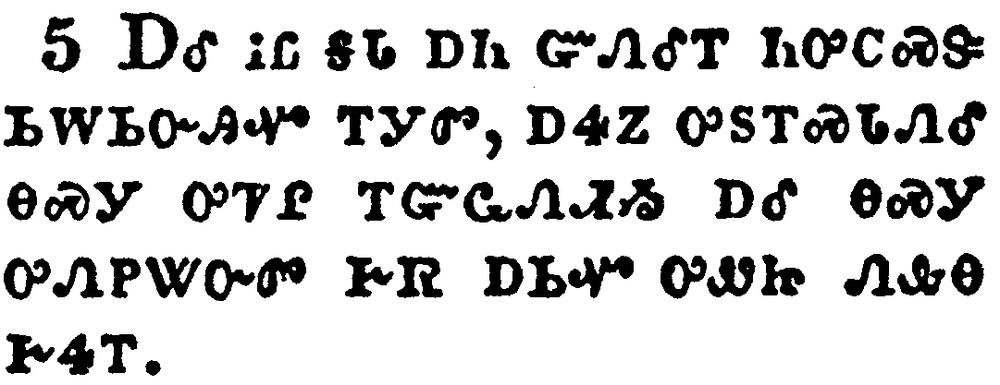</a></td>
</tr>
<tr class="even">
<td>And he gave him none inheritance in it, no, not so much as to set his foot on: yet he promised that he would give it to him for a possession, and to his seed after him, when as yet he had no child.</td>
</tr>
<tr class="odd">
<td>ᎠᎴ ᎥᏝ ᎦᏓ ᎠᏂ ᏳᏁᎴᎢ ᏂᎤᏟᏍᏕ ᏏᎳᏏᏅᎯᏉ ᎢᎩᏛ, ᎠᏎᏃ ᎤᏚᎢᏍᏓᏁᎴ ᎾᏍᎩ ᎤᏤᎵ ᎢᏳᏩᏁᏗᏱ ᎠᎴ ᎾᏍᎩ ᎤᏁᏢᏔᏅᏛ ᎨᏒ ᎠᏏᏉ ᎤᏪᏥ ᏁᎲᎾ ᎨᏎᎢ.</td>
</tr>
<tr class="even">
<td>A-le v-tla ga-da a-ni yu-ne-le-i ni-u-tli-s-de si-la-si-nv-hi-quo i-gi-dv, a-se-no u-du-i-s-da-ne-le na-s-gi u-tse-li i-yu-wa-ne-di-yi a-le na-s-gi u-ne-tlv-ta-nv-dv ge-sv a-si-quo u-we-tsi ne-hv-na ge-se-i.</td>
</tr>
</tbody>
</table>

<table>
<tbody>
<tr class="odd">
<td><a href="050706.png">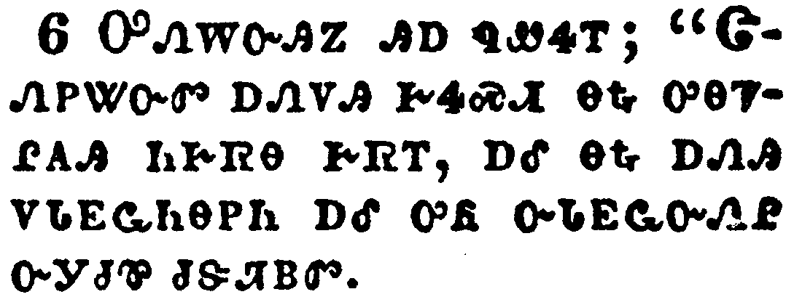</a></td>
</tr>
<tr class="even">
<td>And God spake on this wise, That his seed should sojourn in a strange land; and that they should bring them into bondage, and entreat them evil four hundred years.</td>
</tr>
<tr class="odd">
<td>ᎤᏁᎳᏅᎯᏃ ᎯᎠ ᏄᏪᏎᎢ; "ᏣᏁᏢᏔᏅᏛ ᎠᏁᏙᎯ ᎨᏎᏍᏗ ᎾᎿᎭᎤᎾᏤ-ᎵᎪᎯ ᏂᎨᏒᎾ ᎨᏒᎢ, ᎠᎴ ᎾᎿᎭᎠᏁᎯ ᏙᏓᎬᏩᏂᎾᏢᏂ ᎠᎴ ᎤᏲ ᏅᏓᎬᏩᏅᏁᎵ ᏅᎩᏧᏈ ᏧᏕᏘᏴᏛ.</td>
</tr>
<tr class="even">
<td>U-ne-la-nv-hi-no hi-a nu-we-se-i; "Tsa-ne-tlv-ta-nv-dv a-ne-do-hi ge-se-s-di na-hna u-na-tse--li-go-hi ni-ge-sv-na ge-sv-i, a-le na-hna a-ne-hi do-da-gv-wa-ni-na-tlv-ni a-le u-yo nv-da-gv-wa-nv-ne-li nv-gi-tsu-qui tsu-de-ti-yv-dv.</td>
</tr>
</tbody>
</table>

<table>
<tbody>
<tr class="odd">
<td><a href="050707.png">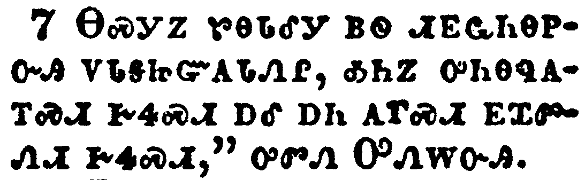</a></td>
</tr>
<tr class="even">
<td>And the nation to whom they shall be in bondage will I judge, said God: and after that shall they come forth, and serve me in this place.</td>
</tr>
<tr class="odd">
<td>ᎾᏍᎩᏃ ᏑᎾᏓᎴᎩ ᏴᏫ ᏗᎬᏩᏂᎾᏢᏅᎯ ᏙᏓᎦᏥᏳᎪᏓᏁᎵ, ᎣᏂᏃ ᎤᏂᎾᏄᎪᎢᏍᏗ ᎨᏎᏍᏗ ᎠᎴ ᎠᏂ ᎪᎱᏍᏗ ᎬᏆᏛᏁᏗ ᎨᏎᏍᏗ," ᎤᏛᏁ ᎤᏁᎳᏅᎯ.</td>
</tr>
<tr class="even">
<td>Na-s-gi-no su-na-da-le-gi yv-wi di-gv-wa-ni-na-tlv-nv-hi do-da-ga-tsi-yu-go-da-ne-li, o-ni-no u-ni-na-nu-go-i-s-di ge-se-s-di a-le a-ni go-hu-s-di gv-qua-dv-ne-di ge-se-s-di," u-dv-ne U-ne-la-nv-hi.</td>
</tr>
</tbody>
</table>

<table>
<tbody>
<tr class="odd">
<td><a href="050708.png">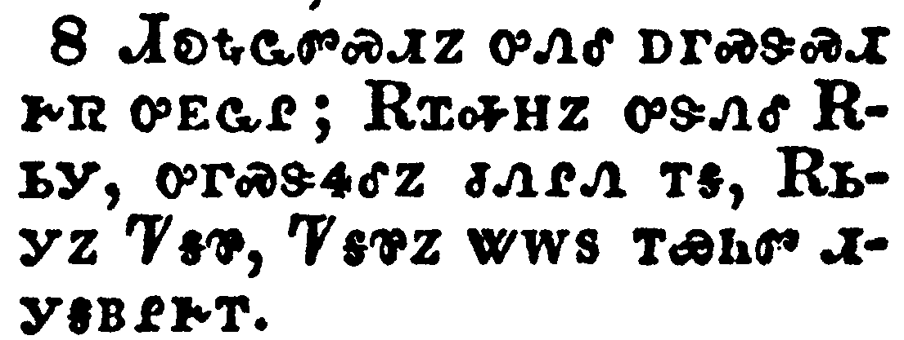</a></td>
</tr>
<tr class="even">
<td>And he gave him the covenant of circumcision: and so Abraham begat Isaac, and circumcised him the eighth day; and Isaac begat Jacob; and Jacob begat the twelve patriarchs.</td>
</tr>
<tr class="odd">
<td>ᏗᎧᎿᎭᏩᏛᏍᏗᏃ ᎤᏁᎴ ᎠᎱᏍᏕᏍᏗ ᎨᏒ ᎤᎬᏩᎵ; ᎡᏆᎭᎻᏃ ᎤᏕᏁᎴ ᎡᏏᎩ, ᎤᎱᏍᏕᏎᎴᏃ ᏧᏁᎵᏁ ᎢᎦ, ᎡᏏᎩᏃ ᏤᎦᏈ, ᏤᎦᏈᏃ ᏔᎳᏚ ᎢᏯᏂᏛ ᏗᎩᎦᏴᎵᎨᎢ.</td>
</tr>
<tr class="even">
<td>Di-ka-hna-wa-dv-s-di-no u-ne-le a-hu-s-de-s-di ge-sv u-gv-wa-li; E-qua-ha-mi-no u-de-ne-le E-si-gi, u-hu-s-de-se-le-no tsu-ne-li-ne i-ga, E-si-gi-no Tse-ga-qui, Tse-ga-qui-no ta-la-du i-ya-ni-dv di-gi-ga-yv-li-ge-i.</td>
</tr>
</tbody>
</table>

<table>
<tbody>
<tr class="odd">
<td><a href="050709.png">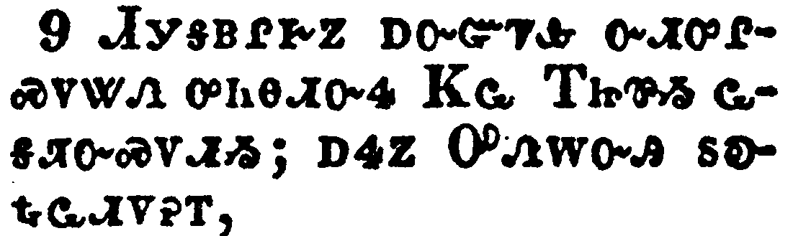</a></td>
</tr>
<tr class="even">
<td>And the patriarchs, moved with envy, sold Joseph into Egypt: but God was with him,</td>
</tr>
<tr class="odd">
<td>ᏗᎩᎦᏴᎵᎨᏃ ᎠᏅᏳᏤᎲ ᏅᏗᎤᎵᏍᏙᏔᏁ ᎤᏂᎾᏗᏅᏎ ᏦᏩ ᎢᏥᏈᏱ ᏩᎦᏘᏅᏍᏙᏗᏱ; ᎠᏎᏃ ᎤᏁᎳᏅᎯ ᏚᎧᎿᎭᏩᏗᏙᎮᎢ,</td>
</tr>
<tr class="even">
<td>Di-gi-ga-yv-li-ge-no a-nv-yu-tse-hv nv-di-u-li-s-do-ta-ne u-ni-na-di-nv-se Tso-wa I-tsi-qui-yi wa-ga-ti-nv-s-do-di-yi; a-se-no U-ne-la-nv-hi du-ka-hna-wa-di-do-he-i,</td>
</tr>
</tbody>
</table>

<table>
<tbody>
<tr class="odd">
<td><a href="050710.png">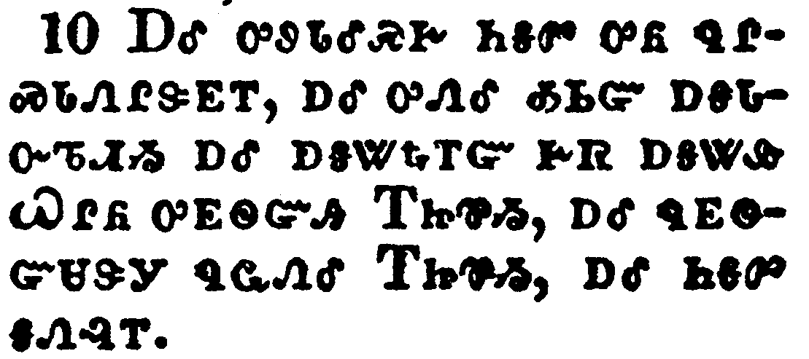</a></td>
</tr>
<tr class="even">
<td>And delivered him out of all his afflictions, and gave him favour and wisdom in the sight of Pharaoh king of Egypt; and he made him governor over Egypt and all his house.</td>
</tr>
<tr class="odd">
<td>ᎠᎴ ᎤᏭᏓᎴᏍᎨ ᏂᎦᏛ ᎤᏲ ᏄᎵᏍᏓᏁᎵᏕᎬᎢ, ᎠᎴ ᎤᏁᎴ ᎣᏏᏳ ᎠᎦᏓᏅᏖᏗᏱ ᎠᎴ ᎠᎦᏔᎿᎭᎢᏳ ᎨᏒ ᎠᎦᏔᎲ ᏇᎵᏲ ᎤᎬᏫᏳᎯ ᎢᏥᏈᏱ, ᎠᎴ ᏄᎬᏫᏳᏌᏕᎩ ᏄᏩᏁᎴ ᎢᏥᏈᏱ, ᎠᎴ ᏂᎦᏛ ᎦᏁᎸᎢ.</td>
</tr>
<tr class="even">
<td>A-le u-wu-da-le-s-ge ni-ga-dv u-yo nu-li-s-da-ne-li-de-gv-i, a-le u-ne-le o-si-yu a-ga-da-nv-te-di-yi a-le a-ga-ta-hna-i-yu ge-sv a-ga-ta-hv Que-li-yo u-gv-wi-yu-hi I-tsi-qui-yi, a-le nu-gv-wi-yu-sa-de-gi nu-wa-ne-le I-tsi-qui-yi, a-le ni-ga-dv ga-ne-lv-i.</td>
</tr>
</tbody>
</table>

<table>
<tbody>
<tr class="odd">
<td><a href="050711.png">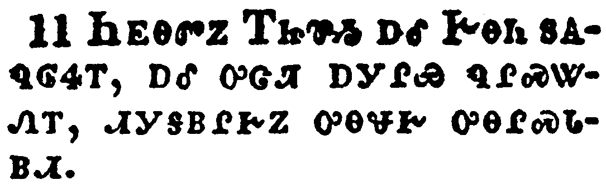</a></td>
</tr>
<tr class="even">
<td>Now there came a dearth over all the land of Egypt and Chanaan, and great affliction: and our fathers found no sustenance.</td>
</tr>
<tr class="odd">
<td>ᏂᎬᎾᏛᏃ ᎢᏥᏈᏱ ᎠᎴ ᎨᎾᏂ ᏚᎪᏄᎶᏎᎢ, ᎠᎴ ᎤᏣᏘ ᎠᎩᎵᏯ ᏄᎵᏍᏔᏁᎢ, ᏗᎩᎦᏴᎵᎨᏃ ᎤᎾᏠᎨ ᎤᎾᎵᏍᏓᏴᏗ.</td>
</tr>
<tr class="even">
<td>Ni-gv-na-dv-no I-tsi-qui-yi a-le Ge-na-ni du-go-nu-lo-se-i, a-le u-tsa-ti a-gi-li-ya nu-li-s-ta-ne-i, di-gi-ga-yv-li-ge-no u-na-tlo-ge u-na-li-s-da-yv-di.</td>
</tr>
</tbody>
</table>

<table>
<tbody>
<tr class="odd">
<td><a href="050712.png">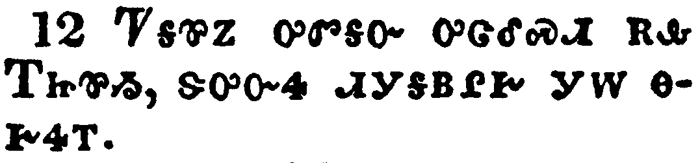</a></td>
</tr>
<tr class="even">
<td>But when Jacob heard that there was corn in Egypt, he sent out our fathers first.</td>
</tr>
<tr class="odd">
<td>ᏤᎦᏈᏃ ᎤᏛᎦᏅ ᎤᏣᎴᏍᏗ ᎡᎲ ᎢᏥᏈᏱ, ᏕᎤᏅᏎ ᏗᎩᎦᏴᎵᎨ ᎩᎳ ᎾᎨᏎᎢ.</td>
</tr>
<tr class="even">
<td>Tse-ga-qui-no u-dv-ga-nv u-tsa-le-s-di e-hv I-tsi-qui-yi, de-u-nv-se di-gi-ga-yv-li-ge gi-la na-ge-se-i.</td>
</tr>
</tbody>
</table>

<table>
<tbody>
<tr class="odd">
<td><a href="050713.png">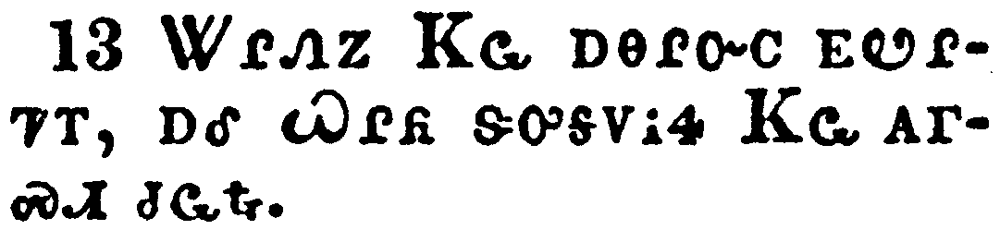</a></td>
</tr>
<tr class="even">
<td>And at the second time Joseph was made known to his brethren; and Joseph's kindred was made known unto Pharaoh.</td>
</tr>
<tr class="odd">
<td>ᏔᎵᏁᏃ ᏦᏩ ᎠᎾᎵᏅᏟ ᎬᏬᎵᏤᎢ, ᎠᎴ ᏇᎵᏲ ᏕᎤᎦᏙᎥᏎ ᏦᏩ ᎪᎱᏍᏗ ᏧᏩᎿᎭ</td>
</tr>
<tr class="even">
<td>Ta-li-ne-no Tso-wa a-na-li-nv-tli gv-wo-li-tse-i, a-le Que-li-yo de-u-ga-do-v-se Tso-wa go-hu-s-di tsu-wa-hna.</td>
</tr>
</tbody>
</table>

<table>
<tbody>
<tr class="odd">
<td><a href="050714.png">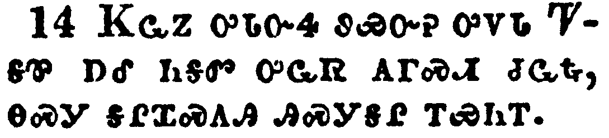</a></td>
</tr>
<tr class="even">
<td>Then sent Joseph, and called his father Jacob to him, and all his kindred, threescore and fifteen souls.</td>
</tr>
<tr class="odd">
<td>ᏦᏩᏃ ᎤᏓᏅᏎ ᏭᏯᏅᎮ ᎤᏙᏓ ᏤᎦᏈ ᎠᎴ ᏂᎦᏛ ᎤᏩᏒ ᎪᎱᏍᏗ ᏧᏩᎿᎭ ᎾᏍᎩ ᎦᎵᏆᏍᎪᎯ ᎯᏍᎩᎦᎵ ᎢᏯᏂᎢ.</td>
</tr>
<tr class="even">
<td>Tso-wa-no u-da-nv-se wu-ya-nv-he u-do-da Tse-ga-qui a-le ni-ga-dv u-wa-sv go-hu-s-di tsu-wa-hna, na-s-gi ga-li-qua-s-go-hi hi-s-gi-ga-li i-ya-ni-i.</td>
</tr>
</tbody>
</table>

<table>
<tbody>
<tr class="odd">
<td><a href="050715.png">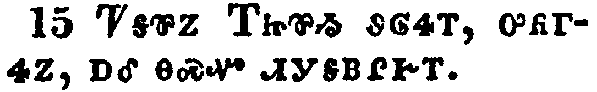</a></td>
</tr>
<tr class="even">
<td>So Jacob went down into Egypt, and died, he, and our fathers,</td>
</tr>
<tr class="odd">
<td>ᏤᎦᏈᏃ ᎢᏥᏈᏱ ᏭᎶᏎᎢ, ᎤᏲᎱᏎᏃ, ᎠᎴ ᎾᏍᏉ ᏗᎩᎦᏴᎵᎨᎢ.</td>
</tr>
<tr class="even">
<td>Tse-ga-qui-no I-tsi-qui-yi wu-lo-se-i, u-yo-hu-se-no, a-le na-s-quo di-gi-ga-yv-li-ge-i.</td>
</tr>
</tbody>
</table>

<table>
<tbody>
<tr class="odd">
<td></td>
</tr>
<tr class="even">
<td>And were carried over into Sychem, and laid in the sepulchre that Abraham bought for a sum of money of the sons of Emmor the father of Sychem.</td>
</tr>
<tr class="odd">
<td>ᏌᎩᎻᏃ ᏫᏗᎨᏥᏅᏍᏔᏁᎢ ᎠᎴ ᏕᎨᏥᏂᏌᏁ ᎠᏤᎵᏍᏛ ᎾᏍᎩ ᎡᏆᎭᎻ ᎠᏕᎸ ᏧᎫᏴᏔᏁ ᏥᏚᏩᏎᎴ ᎡᎹ ᏧᏪᏥ, ᎾᏍᎩ ᏌᎩᎻ ᎤᏙᏓ.</td>
</tr>
<tr class="even">
<td>Sa-gi-mi-no wi-di-ge-tsi-nv-s-ta-ne-i a-le de-ge-tsi-ni-sa-ne a-tse-li-s-dv na-s-gi E-qua-ha-mi a-de-lv tsu-gu-yv-ta-ne tsi-du-wa-se-le E-ma tsu-we-tsi, na-s-gi Sa-gi-mi u-do-da.</td>
</tr>
</tbody>
</table>

<table>
<tbody>
<tr class="odd">
<td><a href="050717.png">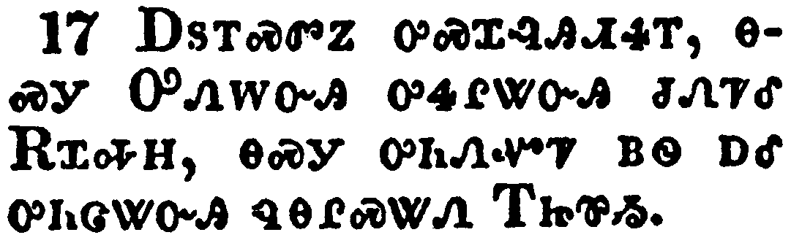</a></td>
</tr>
<tr class="even">
<td>But when the time of the promise drew nigh, which God had sworn to Abraham, the people grew and multiplied in Egypt,</td>
</tr>
<tr class="odd">
<td>ᎠᏚᎢᏍᏛᏃ ᎤᏍᏆᎸᎯᏗᏎᎢ, ᎾᏍᎩ ᎤᏁᎳᏅᎯ ᎤᏎᎵᏔᏅᎯ ᏧᏁᏤᎴ ᎡᏆᎭᎻ, ᎾᏍᎩ ᎤᏂᏁᏉᏤ ᏴᏫ ᎠᎴ ᎤᏂᏣᏔᏅᎯ ᏄᎾᎵᏍᏔᏁ ᎢᏥᏈᏱ.</td>
</tr>
<tr class="even">
<td>A-du-i-s-dv-no u-s-qua-lv-hi-di-se-i, na-s-gi U-ne-la-nv-hi u-se-li-ta-nv-hi tsu-ne-tse-le E-qua-ha-mi, na-s-gi u-ni-ne-quo-tse yv-wi a-le u-ni-tsa-ta-nv-hi nu-na-li-s-ta-ne I-tsi-qui-yi.</td>
</tr>
</tbody>
</table>

<table>
<tbody>
<tr class="odd">
<td><a href="050718.png">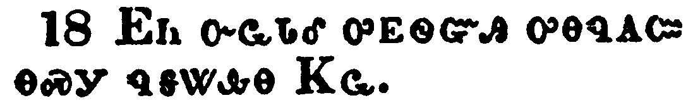</a></td>
</tr>
<tr class="even">
<td>Till another king arose, which knew not Joseph.</td>
</tr>
<tr class="odd">
<td>ᎬᏂ ᏅᏩᏓᎴ ᎤᎬᏫᏳᎯ ᎤᎾᏄᎪᏨ ᎾᏍᎩ ᏄᎦᏔᎲᎾ ᏦᏩ.</td>
</tr>
<tr class="even">
<td>Gv-ni nv-wa-da-le u-gv-wi-yu-hi u-na-nu-go-tsv na-s-gi nu-ga-ta-hv-na Tso-wa.</td>
</tr>
</tbody>
</table>

<table>
<tbody>
<tr class="odd">
<td><a href="050719.png">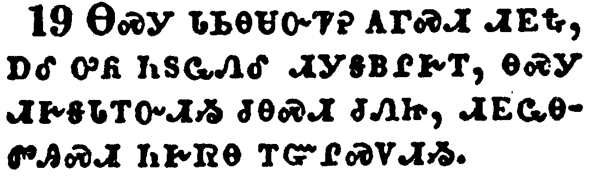</a></td>
</tr>
<tr class="even">
<td>The same dealt subtilly with our kindred, and evil entreated our fathers, so that they cast out their young children, to the end they might not live.</td>
</tr>
<tr class="odd">
<td>ᎾᏍᎩ ᏓᏏᎾᏌᏅᏤᎮ ᎪᎱᏍᏗ ᏗᎬᎿᎭ ᎠᎴ ᎤᏲ ᏂᏚᏩᏁᎴ ᏗᎩᎦᏴᎵᎨᎢ, ᎾᏍᎩ ᏗᎨᎦᏓᎢᏅᏗᏱ ᏧᎾᏍᏗ ᏧᏁᏥ, ᏗᎬᏩᎾᏛᎯᏍᏗ ᏂᎨᏒᎾ ᎢᏳᎵᏍᏙᏗᏱ.</td>
</tr>
<tr class="even">
<td>Na-s-gi da-si-na-sa-nv-tse-he go-hu-s-di di-gv-hna, a-le u-yo ni-du-wa-ne-le di-gi-ga-yv-li-ge-i, na-s-gi di-ge-ga-da-i-nv-di-yi tsu-na-s-di tsu-ne-tsi, di-gv-wa-na-dv-hi-s-di ni-ge-sv-na i-yu-li-s-do-di-yi.</td>
</tr>
</tbody>
</table>

<table>
<tbody>
<tr class="odd">
<td><a href="050720.png">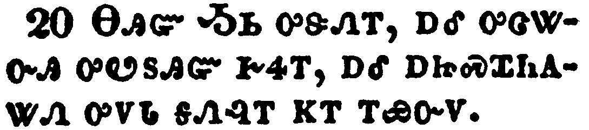</a></td>
</tr>
<tr class="even">
<td>In which time Moses was born, and was exceeding fair, and nourished up in his father's house three months:</td>
</tr>
<tr class="odd">
<td>ᎾᎯᏳ ᎼᏏ ᎤᏕᏁᎢ, ᎠᎴ ᎤᏩᏔᏅᎯ ᎤᏬᏚᎯᏳ ᎨᏎᎢ, ᎠᎴ ᎠᏥᏍᏆᏂᎪᏔᏁ ᎤᏙᏓ ᎦᏁᎸᎢ ᏦᎢ ᎢᏯᏅᏙ.</td>
</tr>
<tr class="even">
<td>Na-hi-yu Mo-si u-de-ne-i, a-le u-wa-ta-nv-hi u-wo-du-hi-yu ge-se-i, a-le a-tsi-s-qua-ni-go-ta-ne u-do-da ga-ne-lv-i tso-i i-ya-nv-do.</td>
</tr>
</tbody>
</table>

<table>
<tbody>
<tr class="odd">
<td><a href="050721.png">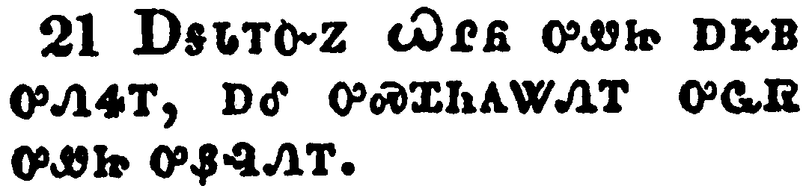</a></td>
</tr>
<tr class="even">
<td>And when he was cast out, Pharaoh's daughter took him up, and nourished him for her own son.</td>
</tr>
<tr class="odd">
<td>ᎠᎦᏓᎢᏅᏃ ᏇᎵᏲ ᎤᏪᏥ ᎠᎨᏴ ᎤᏁᏎᎢ, ᎠᎴ ᎤᏍᏆᏂᎪᏔᏁᎢ ᎤᏩᏒ ᎤᏪᏥ ᎤᏰᎸᏁᎢ.</td>
</tr>
<tr class="even">
<td>A-ga-da-i-nv-no Que-li-yo u-we-tsi a-ge-yv u-ne-se-i, a-le u-s-qua-ni-go-ta-ne-i u-wa-sv u-we-tsi u-ye-lv-ne-i.</td>
</tr>
</tbody>
</table>

<table>
<tbody>
<tr class="odd">
<td><a href="050722.png">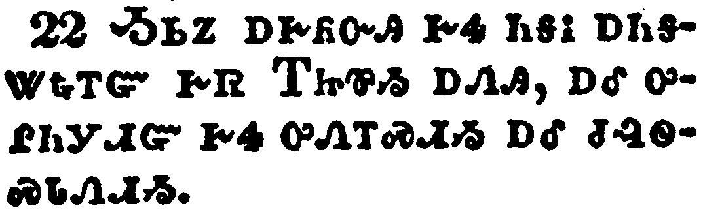</a></td>
</tr>
<tr class="even">
<td>And Moses was learned in all the wisdom of the Egyptians, and was mighty in words and in deeds.</td>
</tr>
<tr class="odd">
<td>ᏱᏏᏃ ᎠᎨᏲᏅᎯ ᎨᏎ ᏂᎦᎥ ᎠᏂᎦᏔᎿᎭᎢᏳ ᎨᏒ ᎢᏥᏈᏱ ᎠᏁᎯ, ᎠᎴ ᎤᎵᏂᎩᏗᏳ ᎨᏎ ᎤᏁᎢᏍᏗᏱ ᎠᎴ ᏧᎸᏫᏍᏓᏁᏗᏱ.</td>
</tr>
<tr class="even">
<td>Yi-si-no a-ge-yo-nv-hi ge-se ni-ga-v a-ni-ga-ta-hna-i-yu ge-sv I-tsi-qui-yi a-ne-hi, a-le u-li-ni-gi-di-yu ge-se u-ne-i-s-di-yi a-le tsu-lv-wi-s-da-ne-di-yi.</td>
</tr>
</tbody>
</table>

<table>
<tbody>
<tr class="odd">
<td><a href="050723.png">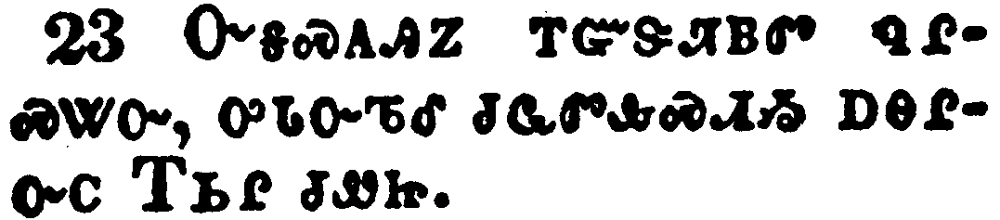</a></td>
</tr>
<tr class="even">
<td>And when he was full forty years old, it came into his heart to visit his brethren the children of Israel.</td>
</tr>
<tr class="odd">
<td>ᏅᎦᏍᎪᎯᏃ ᎢᏳᏕᏘᏴᏛ ᏄᎵᏍᏔᏅ, ᎤᏓᏅᏖᎴ ᏧᏩᏛᎲᏍᏗᏱ ᎠᎾᎵᏅᏟ ᎢᏏᎵ ᏧᏪᏥ.</td>
</tr>
<tr class="even">
<td>Nv-ga-s-go-hi-no i-yu-de-ti-yv-dv nu-li-s-ta-nv, u-da-nv-te-le tsu-wa-dv-hv-s-di-yi a-na-li-nv-tli I-si-li tsu-we-tsi.</td>
</tr>
</tbody>
</table>

<table>
<tbody>
<tr class="odd">
<td><a href="050724.png">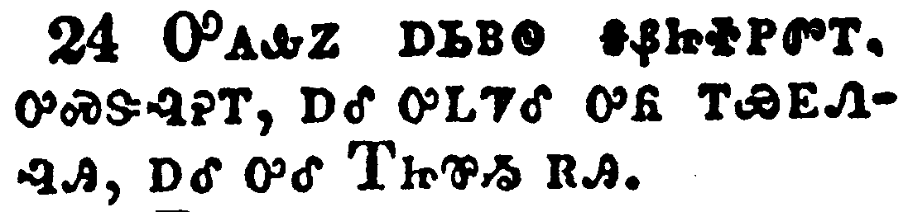</a></td>
</tr>
<tr class="even">
<td>And seeing one of them suffer wrong, he defended him, and avenged him that was oppressed, and smote the Egyptian:</td>
</tr>
<tr class="odd">
<td>ᎤᎪᎲᏃ ᎠᏏᏴᏫ ᎦᏰᏥᏐᏢᏛᎢ, ᎤᏍᏕᎸᎮᎢ, ᎠᎴ ᎤᏞᏤᎴ ᎤᏲ ᎢᏯᎬᏁᎸᎯ, ᎠᎴ ᎤᎴ ᎢᏥᏈᏱ ᎡᎯ.</td>
</tr>
<tr class="even">
<td>U-go-hv-no a-si-yv-wi ga-ye-tsi-so-tlv-dv-i, u-s-de-lv-he-i, a-le u-tle-tse-le u-yo i-ya-gv-ne-lv-hi, a-le u-le I-tsi-qui-yi e-hi.</td>
</tr>
</tbody>
</table>

<table>
<tbody>
<tr class="odd">
<td><a href="050725.png">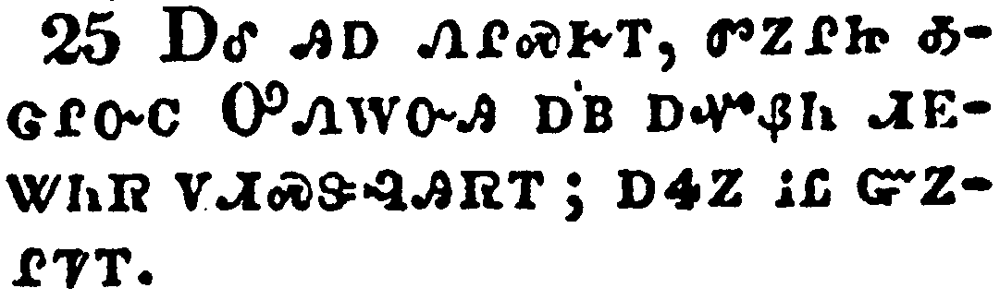</a></td>
</tr>
<tr class="even">
<td>For he supposed his brethren would have understood how that God by his hand would deliver them: but they understood not.</td>
</tr>
<tr class="odd">
<td>ᎠᎴ ᎯᎠ ᏁᎵᏍᎨᎢ, ᏛᏃᎵᏥ ᎣᏣᎵᏅᏟ ᎤᏁᎳᏅᎯ ᎠᏴ ᎠᏉᏰᏂ ᏗᎬᏔᏂᏒ ᏙᏗᏍᏕᎸᎯᏒᎢ; ᎠᏎᏃ ᎥᏝ ᏳᏃᎵᏤᎢ.</td>
</tr>
<tr class="even">
<td>A-le hi-a ne-li-s-ge-i, dv-no-li-tsi o-tsa-li-nv-tli U-ne-la-nv-hi a-yv a-quo-ye-ni di-gv-ta-ni-sv do-di-s-de-lv-hi-sv-i; a-se-no v-tla yu-no-li-tse-i.</td>
</tr>
</tbody>
</table>

<table>
<tbody>
<tr class="odd">
<td></td>
</tr>
<tr class="even">
<td>And the next day he shewed himself unto them as they strove, and would have set them at one again, saying, Sirs, ye are brethren; why do ye wrong one to another?</td>
</tr>
<tr class="odd">
<td>ᎤᎩᏨᏛᏃ ᏚᎾᏄᎪᏤᎴ ᎠᎾᎵᎲᎢ, ᎠᎴ ᎦᎪᎯᏍᏓᏁᎮ ᎯᎠ ᏄᏪᏎᎢ; "ᎢᏍᏗᏍᎦᏯ, ᏗᏍᏓᏓᏅᏟᏉ; ᎦᏙᏃ ᎤᏲ ᏂᏙᏍᏓᏓᏛᏁᎭ?"</td>
</tr>
<tr class="even">
<td>U-gi-tsv-dv-no du-na-nu-go-tse-le a-na-li-hv-i, a-le ga-go-hi-s-da-ne-he hi-a nu-we-se-i; "I-s-di-s-ga-ya, di-s-da-da-nv-tli-quo; ga-do-no u-yo ni-do-s-da-da-dv-ne-ha?"</td>
</tr>
</tbody>
</table>

<table>
<tbody>
<tr class="odd">
<td><a href="050727.png">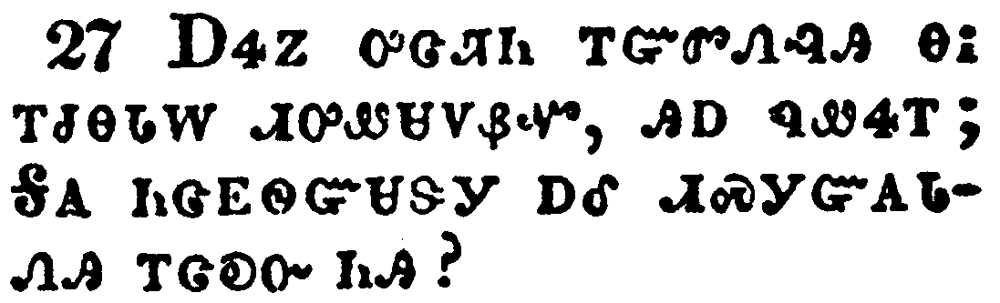</a></td>
</tr>
<tr class="even">
<td>But he that did his neighbour wrong thrust him away, saying, Who made thee a ruler and a judge over us?</td>
</tr>
<tr class="odd">
<td>ᎠᏎᏃ ᎤᏣᏘᏂ ᎢᏳᏛᏁᎸᎯ ᎾᎥ ᎢᏧᎾᏓᎳ ᏗᎤᏪᏌᏙᏰᏉ, ᎯᎠ ᏄᏪᏎᎢ; ᎦᎪ ᏂᏣᎬᏫᏳᏌᏕᎩ ᎠᎴ ᏗᏍᎩᏳᎪᏓᏁᎯ ᎢᏣᎧᏅ ᏂᎯ?</td>
</tr>
<tr class="even">
<td>A-se-no u-tsa-ti-ni i-yu-dv-ne-lv-hi na-v i-tsu-na-da-la di-u-we-sa-do-ye-quo, hi-a nu-we-se-i; Ga-go ni-tsa-gv-wi-yu-sa-de-gi a-le di-s-gi-yu-go-da-ne-hi i-tsa-ka-nv ni-hi?</td>
</tr>
</tbody>
</table>

<table>
<tbody>
<tr class="odd">
<td><a href="050728.png">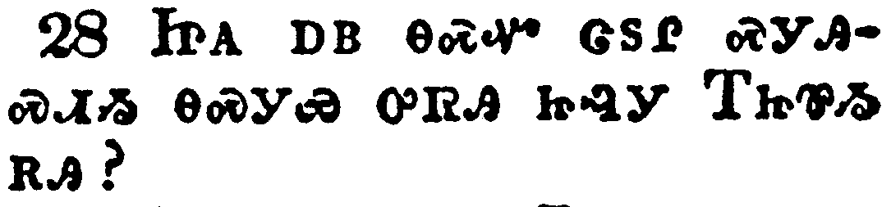</a></td>
</tr>
<tr class="even">
<td>Wilt thou kill me, as thou diddest the Egyptian yesterday?</td>
</tr>
<tr class="odd">
<td>ᏥᎪ ᎠᏴ ᎾᏍᏉ ᏣᏚᎵ ᏍᎩᎯᏍᏗᏱ ᎾᏍᎩᏯ ᎤᏒᎯ ᏥᎸᎩ ᎢᏥᏈᏱ ᎡᎯ?</td>
</tr>
<tr class="even">
<td>Tsi-go a-yv na-s-quo tsa-du-li s-gi-hi-s-di-yi na-s-gi-ya u-sv-hi tsi-lv-gi I-tsi-qui-yi e-hi?</td>
</tr>
</tbody>
</table>

<table>
<tbody>
<tr class="odd">
<td><a href="050729.png">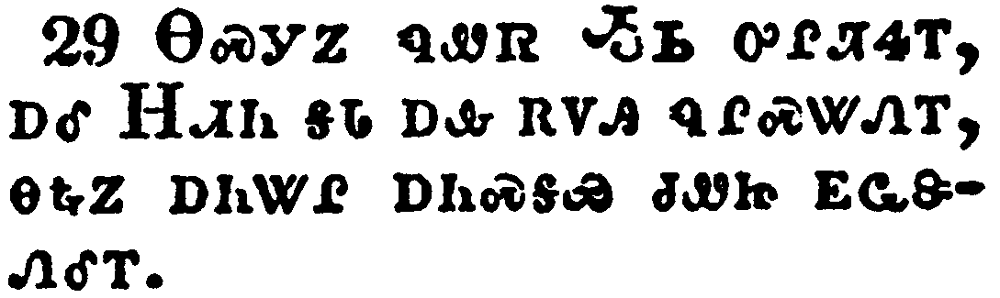</a></td>
</tr>
<tr class="even">
<td>Then fled Moses at this saying, and was a stranger in the land of Madian, where he begat two sons.</td>
</tr>
<tr class="odd">
<td>ᎾᏍᎩᏃ ᏄᏪᏒ ᎼᏏ ᎤᎵᏘᏎᎢ, ᎠᎴ ᎻᏗᏂ ᎦᏓ ᎠᎲ ᎡᏙᎯ ᏄᎵᏍᏔᏁᎢ, ᎾᎿᎭᏃ ᎠᏂᏔᎵ ᎠᏂᏍᎦᏯ ᏧᏪᏥ ᎬᏩᏕᏁᎴᎢ.</td>
</tr>
<tr class="even">
<td>Na-s-gi-no nu-we-sv Mo-si u-li-ti-se-i, a-le Mi-di-ni ga-da a-hv e-do-hi nu-li-s-ta-ne-i, na-hna-no a-ni-ta-li a-ni-s-ga-ya tsu-we-tsi gv-wa-de-ne-le-i.</td>
</tr>
</tbody>
</table>

<table>
<tbody>
<tr class="odd">
<td><a href="050730.png">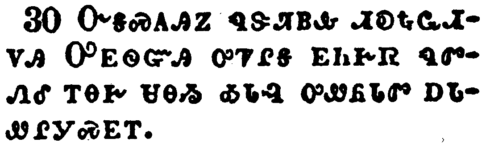</a></td>
</tr>
<tr class="even">
<td>And when forty years were expired, there appeared to him in the wilderness of mount Sina an angel of the Lord in a flame of fire in a bush.</td>
</tr>
<tr class="odd">
<td>ᏅᎦᏍᎪᎯᏃ ᏄᏕᏘᏴᎲ ᏗᎧᎿᎭᏩᏗᏙᎯ ᎤᎬᏫᏳᎯ ᎤᏤᎵᎦ ᎬᏂᎨᏒ ᏄᏛᏁᎴ ᎢᎾᎨ ᏌᎾᏱ ᎣᏓᎸ ᎤᏪᏲᏓᏛ ᎠᏓᏪᎵᎩᏍᎬᎢ.</td>
</tr>
<tr class="even">
<td>Nv-ga-s-go-hi-no nu-de-ti-yv-hv di-ka-hna-wa-di-do-hi U-gv-wi-yu-hi u-tse-li-ga gv-ni-ge-sv nu-dv-ne-le i-na-ge sa-na-yi o-da-lv u-we-yo-da-dv a-da-we-li-gi-s-gv-i.</td>
</tr>
</tbody>
</table>

<table>
<tbody>
<tr class="odd">
<td><a href="050731.png">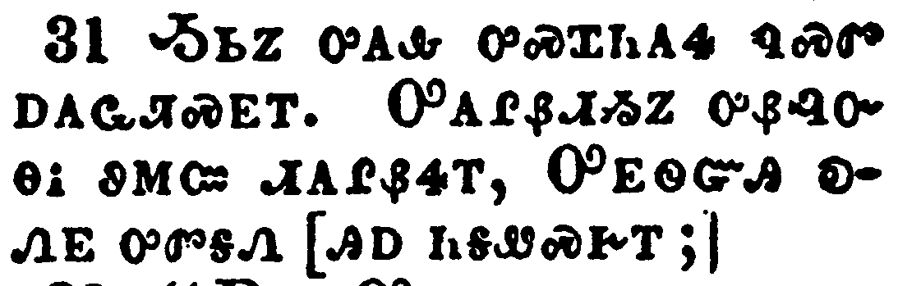</a></td>
</tr>
<tr class="even">
<td>When Moses saw it, he wondered at the sight: and as he drew near to behold it, the voice of the Lord came unto him,</td>
</tr>
<tr class="odd">
<td>ᎼᏏᏃ ᎤᎪᎲ ᎤᏍᏆᏂᎪᏎ ᏄᏍᏛ ᎠᎪᏩᏘᏍᎬᎢ. ᎤᎪᎵᏰᏗᏱᏃ ᎤᏰᎸᏅ ᎾᎥ ᏭᎷᏨ ᏗᎪᎵᏰᏎᎢ, ᎤᎬᏫᏳᎯ ᎧᏁᎬ ᎤᏛᎦᏁ [ᎯᎠ ᏂᎦᏪᏍᎨᎢ;]</td>
</tr>
<tr class="even">
<td>Mo-si-no u-go-hv u-s-qua-ni-go-se nu-s-dv a-go-wa-ti-s-gv-i. U-go-li-ye-di-yi-no u-ye-lv-nv na-v wu-lu-tsv di-go-li-ye-se-i, U-gv-wi-yu-hi ka-ne-gv u-dv-ga-ne [hi-a ni-ga-we-s-ge-i;]</td>
</tr>
</tbody>
</table>

<table>
<tbody>
<tr class="odd">
<td><a href="050732.png">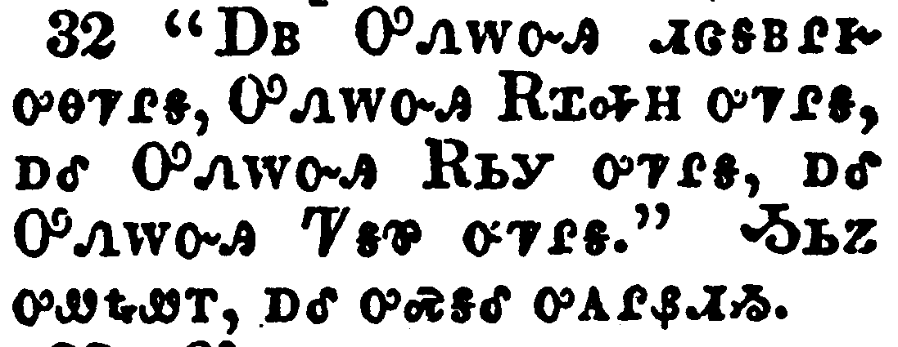</a></td>
</tr>
<tr class="even">
<td>Saying, I am the God of thy fathers, the God of Abraham, and the God of Isaac, and the God of Jacob. Then Moses trembled, and durst not behold.</td>
</tr>
<tr class="odd">
<td>"ᎠᏴ ᎤᏁᎳᏅᎯ ᏗᏣᎦᏴᎵᎨ ᎤᎾᏤᎵᎦ, ᎤᏁᎳᏅᎯ ᎡᏆᎭᎻ ᎤᏤᎵᎦ, ᎠᎴ ᎤᏁᎳᏅᎯ ᎡᏏᎩ ᎤᏤᎵᎦ, ᎠᎴ ᎤᏁᎳᏅᎯ ᏤᎦᏈ ᏅᏤᎵᎦ." ᎣᏏᏃ ᎤᏪᎿᎭᏪᎢ, ᎠᎴ ᎤᏍᎦᎴ ᎤᎪᎵᏰᏗᏱ.</td>
</tr>
<tr class="even">
<td>"A-yv U-ne-la-nv-hi di-tsa-ga-yv-li-ge u-na-tse-li-ga, U-ne-la-nv-hi E-qua-ha-mi u-tse-li-ga, a-le U-ne-la-nv-hi E-si-gi u-tse-li-ga, a-le U-ne-la-nv-hi Tse-ga-qui nv-tse-li-ga." O-si-no u-we-hna-we-i, a-le u-s-ga-le u-go-li-ye-di-yi.</td>
</tr>
</tbody>
</table>

<table>
<tbody>
<tr class="odd">
<td><a href="050733.png">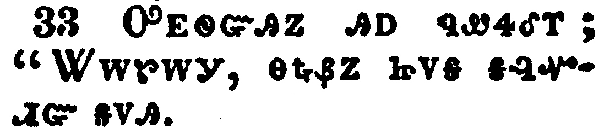</a></td>
</tr>
<tr class="even">
<td>Then said the Lord to him, Put off thy shoes from thy feet: for the place where thou standest is holy ground.</td>
</tr>
<tr class="odd">
<td>ᎤᎬᏫᏳᎯᏃ ᎯᎠ ᏄᏪᏎᎴᎢ; "ᏔᎳᏑᎳᎩ, ᎾᎿᎭᏰᏃ ᏥᏙᎦ ᎦᎸᏉᏗᏳ ᎦᏙᎯ.</td>
</tr>
<tr class="even">
<td>U-gv-wi-yu-hi-no hi-a nu-we-se-le-i; "Ta-la-su-la-gi, na-hna-ye-no tsi-do-ga ga-lv-quo-di-yu ga-do-hi.</td>
</tr>
</tbody>
</table>

<table>
<tbody>
<tr class="odd">
<td><a href="050734.png">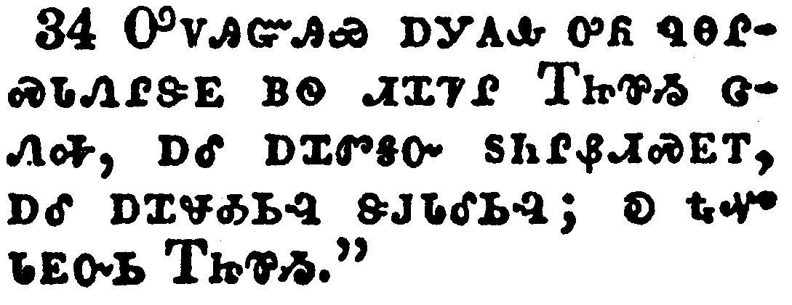</a></td>
</tr>
<tr class="even">
<td>I have seen, I have seen the affliction of my people which is in Egypt, and I have heard their groaning, and am come down to deliver them. And now come, I will send thee into Egypt.</td>
</tr>
<tr class="odd">
<td>ᎤᏙᎯᏳᎯᏯ ᎠᎩᎪᎲ ᎤᏲ ᏄᎾᎵᏍᏓᏁᎵᏕᎬ ᏴᏫ ᏗᏆᏤᎵ ᎢᏥᏈᏱ ᏣᏁᎭ, ᎠᎴ ᎠᏆᏛᎦᏅ ᏚᏂᎵᏰᏗᏍᎬᎢ, ᎠᎴ ᎠᏆᏠᎣᏏᎸ ᏕᎫᏓᎴᏏᎸ; Ꭷ ᎿᎭᏉ ᏓᎬᏅᏏ ᎢᏥᏈᏱ."</td>
</tr>
<tr class="even">
<td>U-do-hi-yu-hi-ya a-gi-go-hv u-yo nu-na-li-s-da-ne-li-de-gv yv-wi di-qua-tse-li I-tsi-qui-yi tsa-ne-ha, a-le a-qua-dv-ga-nv du-ni-li-ye-di-s-gv-i, a-le a-qua-tlo-o-si-lv de-gu-da-le-si-lv; ka hna-quo da-gv-nv-si I-tsi-qui-yi."</td>
</tr>
</tbody>
</table>

<table>
<tbody>
<tr class="odd">
<td><a href="050735.png">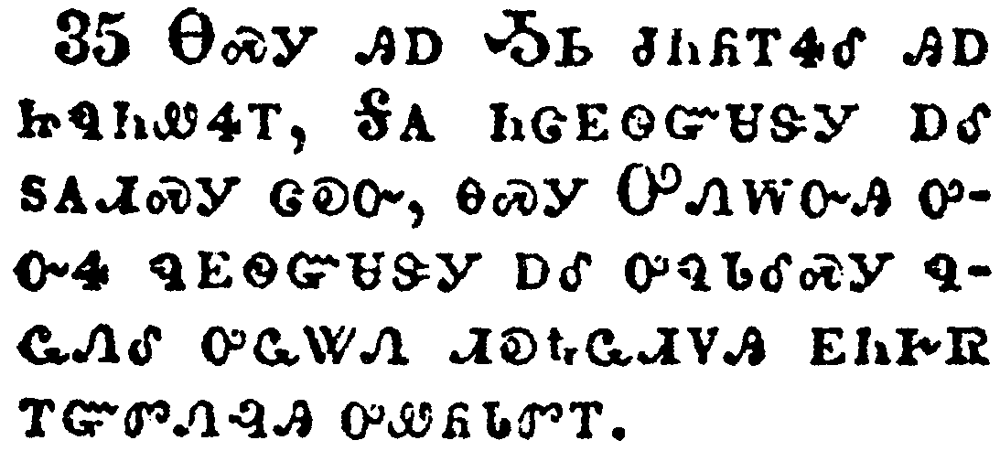</a></td>
</tr>
<tr class="even">
<td>This Moses whom they refused, saying, Who made thee a ruler and a judge? the same did God send to be a ruler and a deliverer by the hand of the angel which appeared to him in the bush.</td>
</tr>
<tr class="odd">
<td>ᎾᏍᎩ ᎯᎠ ᎼᏏ ᏧᏂᏲᎢᏎᎴ ᎯᎠ ᏥᏄᏂᏪᏎᎢ, ᎦᎪ ᏂᏣᎬᏫᏳᏌᏕᎩ ᎠᎴ ᏚᎪᏗᏍᎩ ᏣᎧᏅ, ᎾᏍᎩ ᎤᏁᎳᏅᎯ ᎤᏅᏎ ᏄᎬᏫᏳᏌᏕᎩ ᎠᎴ ᎤᏄᏓᎴᏍᎩ ᏄᏩᏁᎴ ᎤᏩᏔᏁ ᏗᎧᎿᎭᏩᏗᏙᎯ ᎬᏂᎨᏒ ᎢᏳᏛᏁᎸᎯ ᎤᏪᏲᏓᏛᎢ.</td>
</tr>
<tr class="even">
<td>Na-s-gi hi-a Mo-si tsu-ni-yo-i-se-le hi-a tsi-nu-ni-we-se-i, Ga-go ni-tsa-gv-wi-yu-sa-de-gi a-le du-go-di-s-gi tsa-ka-nv, na-s-gi U-ne-la-nv-hi u-nv-se nu-gv-wi-yu-sa-de-gi a-le u-nu-da-le-s-gi nu-wa-ne-le u-wa-ta-ne di-ka-hna-wa-di-do-hi gv-ni-ge-sv i-yu-dv-ne-lv-hi u-we-yo-da-dv-i.</td>
</tr>
</tbody>
</table>

<table>
<tbody>
<tr class="odd">
<td><a href="050736.png">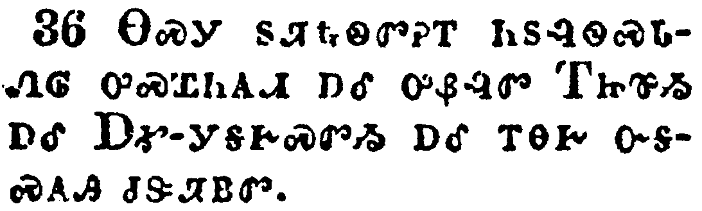</a></td>
</tr>
<tr class="even">
<td>He brought them out, after that he had shewed wonders and signs in the land of Egypt, and in the Red sea, and in the wilderness forty years.</td>
</tr>
<tr class="odd">
<td>ᎾᏍᎩ ᏚᏘᎿᎭᏫᏛᎮᎢ ᏂᏚᎸᏫᏍᏓᏁᎶ ᎤᏍᏆᏂᎪᏗ ᎠᎴ ᎤᏰᎸᏛ ᎢᏥᏈᏱ ᎠᎴ ᎠᎹ-ᎩᎦᎨᏍᏛᏱ ᎠᎴ ᎢᎾᎨ ᏅᎦᏍᎪᎯ ᏧᏕᏘᏴᏛ.</td>
</tr>
<tr class="even">
<td>Na-s-gi du-ti-hna-wi-dv-he-i ni-du-lv-wi-s-da-ne-lo u-s-qua-ni-go-di a-le u-ye-lv-dv I-tsi-qui-yi a-le A-ma--gi-ga-ge-s-dv-yi a-le i-na-ge nv-ga-s-go-hi tsu-de-ti-yv-dv.</td>
</tr>
</tbody>
</table>

<table>
<tbody>
<tr class="odd">
<td><a href="050737.png">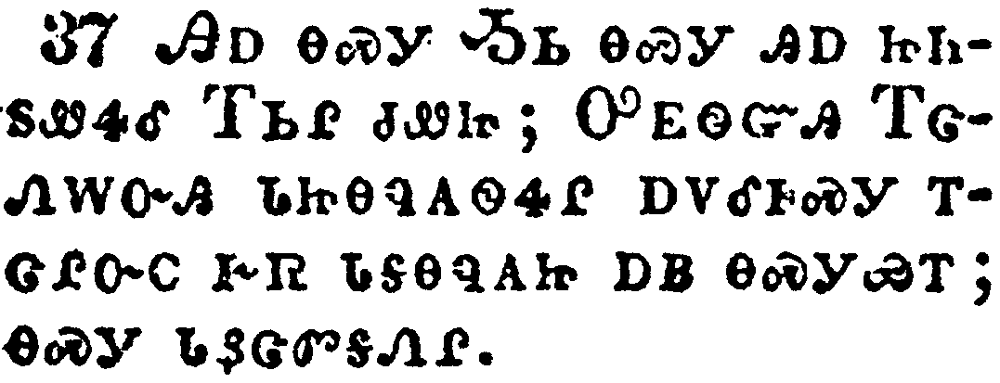</a></td>
</tr>
<tr class="even">
<td>This is that Moses, which said unto the children of Israel, A prophet shall the Lord your God raise up unto you of your brethren, like unto me; him shall ye hear.</td>
</tr>
<tr class="odd">
<td>ᎯᎠ ᎾᏍᎩ ᎼᏏ ᎾᏍᎩ ᎯᎠ ᏥᏂᏚᏪᏎᎴ ᎢᏏᎵ ᏧᏪᏥ; ᎤᎬᏫᏳᎯ ᎢᏣᏁᎳᏅᎯ ᏓᏥᎾᏄᎪᏫᏎᎵ ᎠᏙᎴᎰᏍᎩ ᎢᏣᎵᏅᏟ ᎨᏒ ᏓᎦᎾᏄᎪᏥ ᎠᏴ ᎾᏍᎩᏯᎢ; ᎾᏍᎩ ᏓᏰᏣᏛᎦᏁᎵ.</td>
</tr>
<tr class="even">
<td>Hi-a na-s-gi Mo-si na-s-gi hi-a tsi-ni-du-we-se-le I-si-li tsu-we-tsi; U-gv-wi-yu-hi I-tsa-ne-la-nv-hi da-tsi-na-nu-go-wi-se-li a-do-le-ho-s-gi i-tsa-li-nv-tli ge-sv da-ga-na-nu-go-tsi a-yv na-s-gi-ya-i; na-s-gi da-ye-tsa-dv-ga-ne-li.</td>
</tr>
</tbody>
</table>

<table>
<tbody>
<tr class="odd">
<td><a href="050738.png">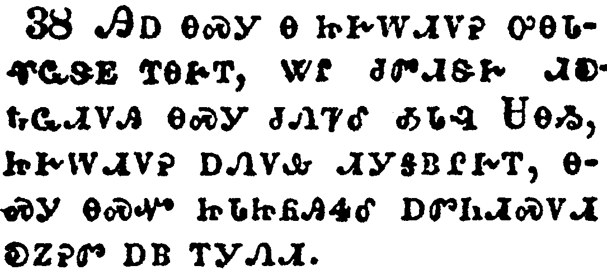</a></td>
</tr>
<tr class="even">
<td>This is he, that was in the church in the wilderness with the angel which spake to him in the mount Sina, and with our fathers: who received the lively oracles to give unto us:</td>
</tr>
<tr class="odd">
<td>ᎯᎠ ᎾᏍᎩ Ꮎ ᏥᎨᎳᏗᏙᎮ ᎤᎾᏓᏡᏩᏕᎬ ᎢᎾᎨᎢ, ᏔᎵ ᏧᏛᏗᏕᎨ ᏗᎧᎿᎭᏩᏗᏙᎯ ᎾᏍᎩ ᏧᏁᏤᎴ ᎣᏓᎸ ᏌᎾᏱ, ᏥᎨᎳᏗᏙᎮ ᎠᏁᏙᎲ ᏗᎩᎦᏴᎵᎨᎢ, ᎾᏍᎩ ᎾᏍᏉ ᏥᏓᏥᏲᎯᏎᎴ ᎠᏛᏂᏗᏍᏙᏗ ᎧᏃᎮᏛ ᎠᏴ ᎢᎩᏁᏗ.</td>
</tr>
<tr class="even">
<td>Hi-a na-s-gi na tsi-ge-la-di-do-he u-na-da-tlu-wa-de-gv i-na-ge-i, ta-li tsu-dv-di-de-ge di-ka-hna-wa-di-do-hi na-s-gi tsu-ne-tse-le o-da-lv Sa-na-yi, tsi-ge-la-di-do-he a-ne-do-hv di-gi-ga-yv-li-ge-i, na-s-gi na-s-quo tsi-da-tsi-yo-hi-se-le a-dv-ni-di-s-do-di ka-no-he-dv a-yv i-gi-ne-di.</td>
</tr>
</tbody>
</table>

<table>
<tbody>
<tr class="odd">
<td><a href="050739.png">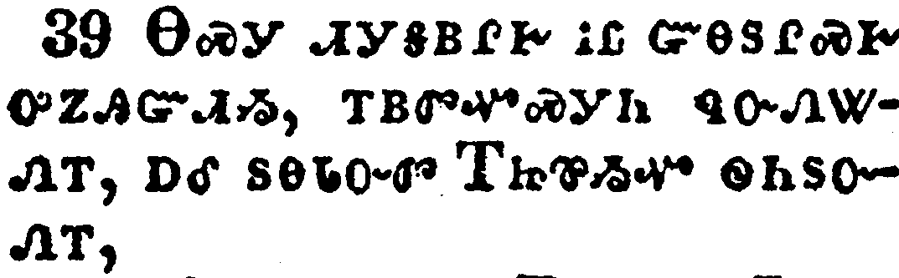</a></td>
</tr>
<tr class="even">
<td>To whom our fathers would not obey, but thrust him from them, and in their hearts turned back again into Egypt,</td>
</tr>
<tr class="odd">
<td>ᎾᏍᎩ ᏗᎩᎦᏴᎵᎨ ᎥᏝ ᏳᎾᏚᎵᏍᎨ ᎤᏃᎯᏳᏗᏱ, ᎢᏴᏛᏉᏍᎩᏂ ᏄᏅᏁᏔᏁᎢ, ᎠᎴ ᏚᎾᏓᏅᏛ ᎢᏥᏈᏱᏉ ᏫᏂᏚᏅᏁᎢ,</td>
</tr>
<tr class="even">
<td>Na-s-gi di-gi-ga-yv-li-ge v-tla yu-na-du-li-s-ge u-no-hi-yu-di-yi, i-yv-dv-quo-s-gi-ni nu-nv-ne-ta-ne-i, a-le du-na-da-nv-dv I-tsi-qui-yi-quo wi-ni-du-nv-ne-i,</td>
</tr>
</tbody>
</table>

<table>
<tbody>
<tr class="odd">
<td><a href="050740.png">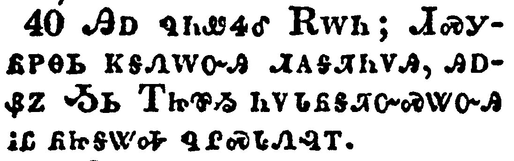</a></td>
</tr>
<tr class="even">
<td>Saying unto Aaron, Make us gods to go before us: for as for this Moses, which brought us out of the land of Egypt, we wot not what is become of him.</td>
</tr>
<tr class="odd">
<td>ᎯᎠ ᏄᏂᏪᏎᎴ ᎡᎳᏂ; ᏗᏍᎩᏲᏢᎾᏏ ᏦᎦᏁᎳᏅᎯ ᏗᎪᎦᏘᏂᏙᎯ, ᎯᎠᏰᏃ ᎼᏏ ᎢᏥᏈᏱ ᏂᏙᏓᏲᎦᏘᏅᏍᏔᏅᎯ ᎥᏝ ᏲᏥᎦᏔᎭ ᏄᎵᏍᏓᏁᎸᎢ.</td>
</tr>
<tr class="even">
<td>Hi-a nu-ni-we-se-le E-la-ni; Di-s-gi-yo-tlv-na-si tso-ga-ne-la-nv-hi di-go-ga-ti-ni-do-hi, hi-a-ye-no Mo-si I-tsi-qui-yi ni-do-da-yo-ga-ti-nv-s-ta-nv-hi v-tla yo-tsi-ga-ta-ha nu-li-s-da-ne-lv-i.</td>
</tr>
</tbody>
</table>

<table>
<tbody>
<tr class="odd">
<td><a href="050741.png">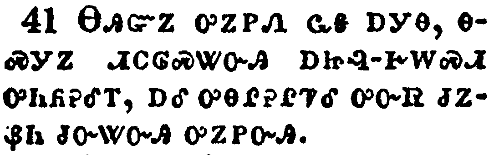</a></td>
</tr>
<tr class="even">
<td>And they made a calf in those days, and offered sacrifice unto the idol, and rejoiced in the works of their own hands.</td>
</tr>
<tr class="odd">
<td>ᎾᎯᏳᏃ ᎤᏃᏢᏁ ᏩᎦ ᎠᎩᎾ, ᎾᏍᎩᏃ ᏗᏟᎶᏍᏔᏅᎯ ᎠᏥᎸ-ᎨᎳᏍᏗ ᎤᏂᏲᎮᎴᎢ, ᎠᎴ ᎤᎾᎵᎮᎵᏤᎴ ᎤᏅᏒ ᏧᏃᏰᏂ ᏧᏅᏔᏅᎯ ᎤᏃᏢᏅᎯ.</td>
</tr>
<tr class="even">
<td>Na-hi-yu-no u-no-tlv-ne wa-ga a-gi-na, na-s-gi-no di-tli-lo-s-ta-nv-hi a-tsi-lv--ge-la-s-di u-ni-yo-he-le-i, a-le u-na-li-he-li-tse-le u-nv-sv tsu-no-ye-ni tsu-nv-ta-nv-hi u-no-tlv-nv-hi.</td>
</tr>
</tbody>
</table>

<table>
<tbody>
<tr class="odd">
<td><a href="050742.png">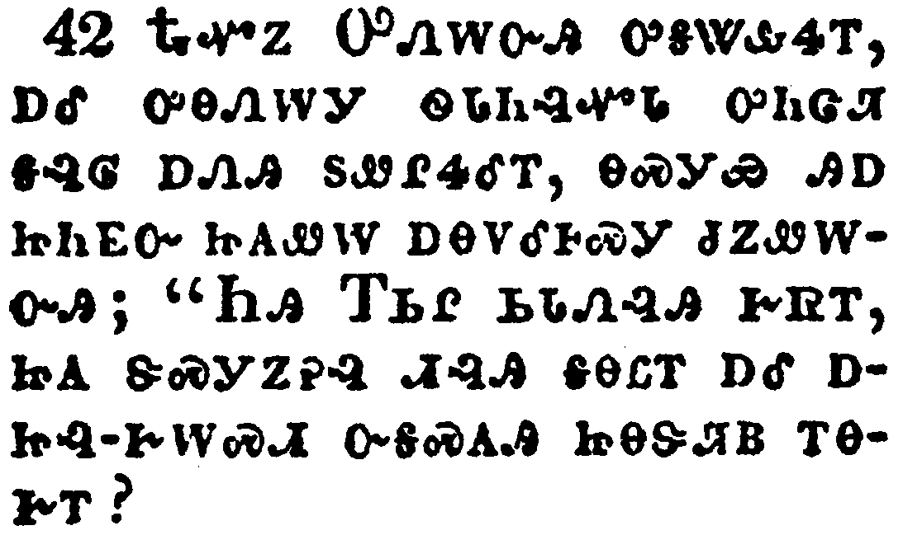</a></td>
</tr>
<tr class="even">
<td>Then God turned, and gave them up to worship the host of heaven; as it is written in the book of the prophets, O ye house of Israel, have ye offered to me slain beasts and sacrifices by the space of forty years in the wilderness?</td>
</tr>
<tr class="odd">
<td>ᎿᎭᏉᏃ ᎤᏁᎳᏅᎯ ᎤᎦᏔᎲᏎᎢ, ᎠᎴ ᎤᎾᏁᎳᎩ ᏫᏓᏂᎸᏉᏓ ᎤᏂᏣᏘ ᎦᎸᎶ ᎠᏁᎯ ᏚᏪᎵᏎᎴᎢ, ᎾᏍᎩᏯ ᎯᎠ ᏥᏂᎬᏅ ᏥᎪᏪᎳ ᎠᎾᏙᎴᎰᏍᎩ ᏧᏃᏪᎳᏅᎯ; "ᏂᎯ ᎢᏏᎵ ᏏᏓᏁᎸᎯ ᎨᏒᎢ, ᏥᎪ ᏕᏍᎩᏃᎮᎸ ᏗᎸᎯ ᎦᎾᏝᎢ ᎠᎴ ᎠᏥᎸ-ᎨᎳᏍᏗ ᏅᎦᏍᎪᎯ ᏥᎾᏕᏘᏴ ᎢᎾᎨᎢ?</td>
</tr>
<tr class="even">
<td>Hna-quo-no U-ne-la-nv-hi u-ga-ta-hv-se-i, a-le u-na-ne-la-gi wi-da-ni-lv-quo-da u-ni-tsa-ti ga-lv-lo a-ne-hi du-we-li-se-le-i, na-s-gi-ya hi-a tsi-ni-gv-nv tsi-go-we-la a-na-do-le-ho-s-gi tsu-no-we-la-nv-hi; "Ni-hi I-si-li si-da-ne-lv-hi ge-sv-i, tsi-go de-s-gi-no-he-lv di-lv-hi ga-na-tla-i a-le a-tsi-lv--ge-la-s-di nv-ga-s-go-hi tsi-na-de-ti-yv i-na-ge-i?</td>
</tr>
</tbody>
</table>

<table>
<tbody>
<tr class="odd">
<td><a href="050743.png">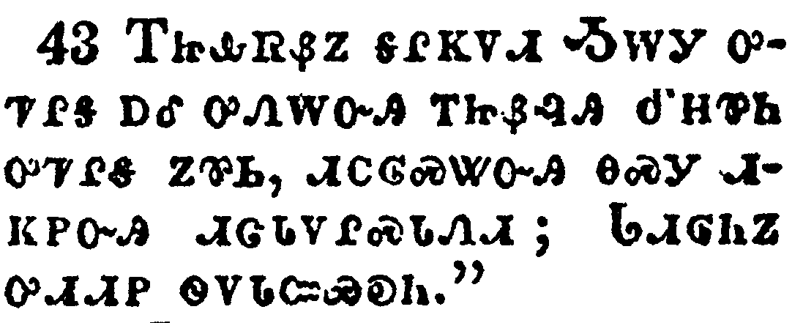</a></td>
</tr>
<tr class="even">
<td>Yea, ye took up the tabernacle of Moloch, and the star of your god Remphan, figures which ye made to worship them: and I will carry you away beyond Babylon.</td>
</tr>
<tr class="odd">
<td>ᎢᏥᎲᏒᏰᏃ ᎦᎵᏦᏙᏗ ᎼᎳᎩ ᎤᏤᎵᎦ ᎠᎴ ᎤᏁᎳᏅᎯ ᎢᏥᏰᎸᎯ ᎴᎻᏈᏂ ᎤᏤᎵᎦ ᏃᏈᏏ, ᏗᏟᎶᏍᏔᏅᎯ ᎾᏍᎩ ᏗᏦᏢᏅᎯ ᏗᏣᏓᏙᎵᏍᏓᏁᏗ; ᏓᏗᎶᏂᏃ ᎤᏗᏗᏢ ᏫᏙᏓᏨᏯᎧᏂ."</td>
</tr>
<tr class="even">
<td>I-tsi-hv-sv-ye-no ga-li-tso-do-di Mo-la-gi u-tse-li-ga a-le u-ne-la-nv-hi i-tsi-ye-lv-hi le-mi-qui-ni u-tse-li-ga no-qui-si, di-tli-lo-s-ta-nv-hi na-s-gi di-tso-tlv-nv-hi di-tsa-da-do-li-s-da-ne-di; Da-di-lo-ni-no u-di-di-tlv wi-do-da-tsv-ya-ka-ni."</td>
</tr>
</tbody>
</table>

<table>
<tbody>
<tr class="odd">
<td><a href="050744.png">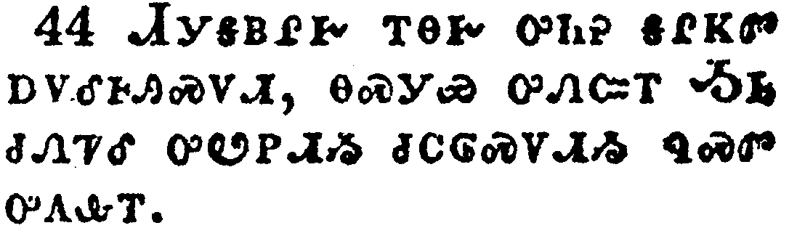</a></td>
</tr>
<tr class="even">
<td>Our fathers had the tabernacle of witness in the wilderness, as he had appointed, speaking unto Moses, that he should make it according to the fashion that he had seen.</td>
</tr>
<tr class="odd">
<td>ᏗᎩᎦᏴᎵᎨ ᎢᎾᎨ ᎤᏂᎮ ᎦᎵᏦᏛ ᎠᏙᎴᎰᎯᏍᏙᏗ, ᎾᏍᎩᏯ ᎤᏁᏨᎢ ᎼᏏ ᏧᏁᏤᎴ ᎤᏬᏢᏗᏱ ᏧᏟᎶᏍᏙᏗᏱ ᏄᏍᏛ ᎤᎪᎲᎢ.</td>
</tr>
<tr class="even">
<td>Di-gi-ga-yv-li-ge i-na-ge u-ni-he ga-li-tso-dv a-do-le-ho-hi-s-do-di, na-s-gi-ya u-ne-tsv-i Mo-si tsu-ne-tse-le u-wo-tlv-di-yi tsu-tli-lo-s-do-di-yi nu-s-dv u-go-hv-i.</td>
</tr>
</tbody>
</table>

<table>
<tbody>
<tr class="odd">
<td><a href="050745.png">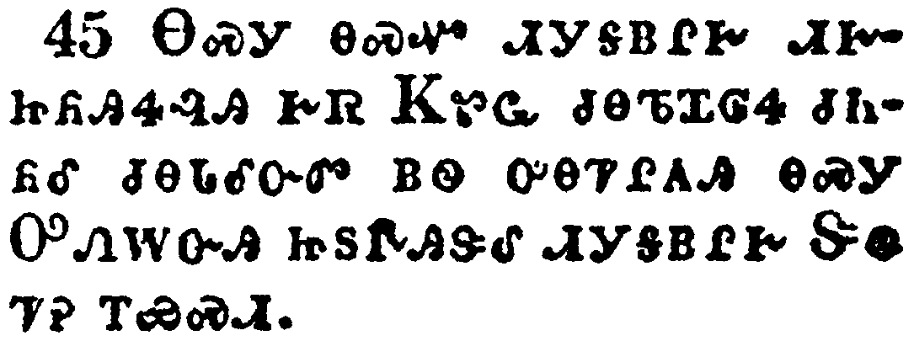</a></td>
</tr>
<tr class="even">
<td>Which also our fathers that came after brought in with Jesus into the possession of the Gentiles, whom God drave out before the face of our fathers, unto the days of David;</td>
</tr>
<tr class="odd">
<td>ᎾᏍᎩ ᎾᏍᏉ ᏗᎩᎦᏴᎵᎨ ᏗᎨᏥᏲᎯᏎᎸᎯ ᎨᏒ ᏦᏑᏩ ᏧᎾᏖᏉᎶᏎ ᏧᏂᏲᎴ ᏧᎾᏓᎴᏅᏛ ᏴᏫ ᎤᎾᏤᎵᎪᎯ ᎾᏍᎩ ᎤᏁᎳᏅᎯ ᏥᏚᎨᎯᏕᎴ ᏗᎩᎦᏴᎵᎨ ᏕᏫ ᏤᎮ ᎢᏯᏍᏗ.</td>
</tr>
<tr class="even">
<td>Na-s-gi na-s-quo di-gi-ga-yv-li-ge di-ge-tsi-yo-hi-se-lv-hi ge-sv Tso-su-wa tsu-na-te-quo-lo-se tsu-ni-yo-le tsu-na-da-le-nv-dv yv-wi u-na-tse-li-go-hi na-s-gi U-ne-la-nv-hi tsi-du-ge-hi-de-le di-gi-ga-yv-li-ge De-wi tse-he i-ya-s-di.</td>
</tr>
</tbody>
</table>

<table>
<tbody>
<tr class="odd">
<td><a href="050746.png">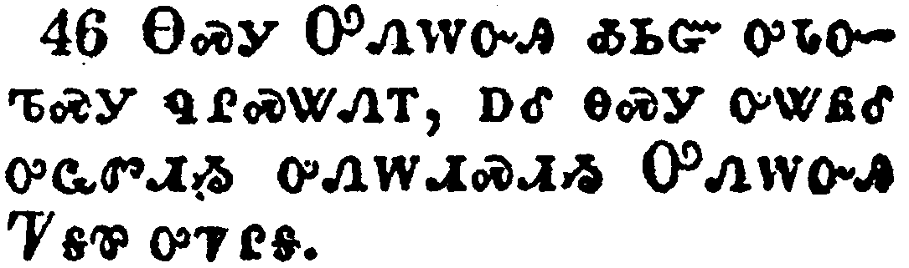</a></td>
</tr>
<tr class="even">
<td>Who found favour before God, and desired to find a tabernacle for the God of Jacob.</td>
</tr>
<tr class="odd">
<td>ᎾᏍᎩ ᎤᏁᎳᏅᎯ ᎣᏏᏳ ᎤᏓᏅᏖᏍᎩ ᏄᎵᏍᏔᏁᎢ, ᎠᎴ ᎾᏍᎩ ᎤᏔᏲᎴ ᎤᏩᏛᏗᏱ ᎤᏁᎳᏗᏍᏗᏱ ᎤᏁᎳᏅᎯ ᏤᎦᏈ ᎤᏤᎵᎦ.</td>
</tr>
<tr class="even">
<td>Na-s-gi U-ne-la-nv-hi o-si-yu u-da-nv-te-s-gi nu-li-s-ta-ne-i, a-le na-s-gi u-ta-yo-le u-wa-dv-di-yi u-ne-la-di-s-di-yi U-ne-la-nv-hi Tse-ga-qui u-tse-li-ga.</td>
</tr>
</tbody>
</table>

<table>
<tbody>
<tr class="odd">
<td></td>
</tr>
<tr class="even">
<td>But Solomon built him an house.</td>
</tr>
<tr class="odd">
<td>ᎠᏎᏃ ᏐᎵᎹᏅ ᎤᏁᏍᎨᎴᎢ.</td>
</tr>
<tr class="even">
<td>A-se-no So-li-ma-nv u-ne-s-ge-le-i.</td>
</tr>
</tbody>
</table>

<table>
<tbody>
<tr class="odd">
<td><a href="050748.png">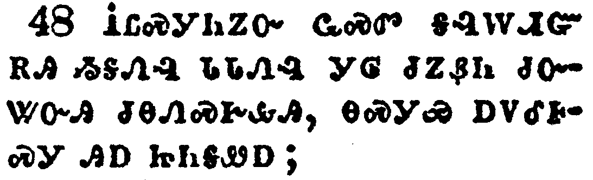</a></td>
</tr>
<tr class="even">
<td>Howbeit the most High dwelleth not in temples made with hands; as saith the prophet,</td>
</tr>
<tr class="odd">
<td>ᎥᏝᏍᎩᏂᏃᏅ ᏩᏍᏛ ᎦᎸᎳᏗᏳ ᎡᎯ ᏱᎦᏁᎸ ᏓᏓᏁᎸ ᎩᎶ ᏧᏃᏰᏂ ᏧᏅᏔᏅᎯ ᏧᎾᏁᏍᎨᎲᎯ, ᎾᏍᎩᏯ ᎠᏙᎴᎰᏍᎩ ᎯᎠ ᏥᏂᎦᏪᎠ;</td>
</tr>
<tr class="even">
<td>V-tla-s-gi-ni-no-nv wa-s-dv ga-lv-la-di-yu e-hi yi-ga-ne-lv da-da-ne-lv gi-lo tsu-no-ye-ni tsu-nv-ta-nv-hi tsu-na-ne-s-ge-hv-hi, na-s-gi-ya a-do-le-ho-s-gi hi-a tsi-ni-ga-we-a;</td>
</tr>
</tbody>
</table>

<table>
<tbody>
<tr class="odd">
<td><a href="050749.png">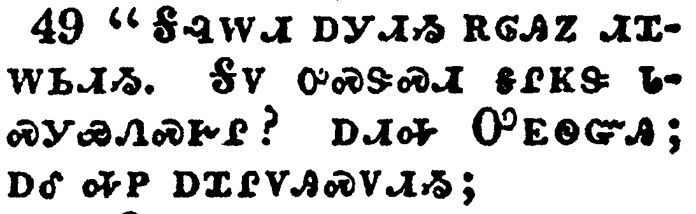</a></td>
</tr>
<tr class="even">
<td>Heaven is my throne, and earth is my footstool: what house will ye build me? saith the Lord: or what is the place of my rest?</td>
</tr>
<tr class="odd">
<td>"ᎦᎸᎳᏗ ᎠᎩᏗᏱ ᎡᎶᎯᏃ ᏗᏆᎳᏏᏗᏱ. ᎦᏙ ᎤᏍᏕᏍᏗ ᎦᎵᏦᏕ ᏓᏍᎩᏯᏁᏍᎨᎵ? ᎠᏗᎭ ᎤᎬᏫᏳᎯ; ᎠᎴ ᎭᏢ ᎠᏆᎵᏙᎯᏍᏙᏗᏱ;</td>
</tr>
<tr class="even">
<td>"Ga-lv-la-di a-gi-di-yi e-lo-hi-no di-qua-la-si-di-yi. Ga-do u-s-de-s-di ga-li-tso-de da-s-gi-ya-ne-s-ge-li? a-di-ha U-gv-wi-yu-hi; a-le ha-tlv a-qua-li-do-hi-s-do-di-yi;</td>
</tr>
</tbody>
</table>

<table>
<tbody>
<tr class="odd">
<td><a href="050750.png">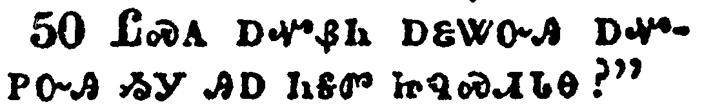</a></td>
</tr>
<tr class="even">
<td>Hath not my hand made all these things?</td>
</tr>
<tr class="odd">
<td>ᏝᏍᎪ ᎠᏉᏰᏂ ᎠᏋᏔᏅᎯ ᎠᏉᏢᏅᎯ ᏱᎩ ᎯᎠ ᏂᎦᏛ ᏥᏄᏍᏗᏓᎾ?"</td>
</tr>
<tr class="even">
<td>Tla-s-go a-quo-ye-ni a-quv-ta-nv-hi a-quo-tlv-nv-hi yi-gi hi-a ni-ga-dv tsi-nu-s-di-da-na?"</td>
</tr>
</tbody>
</table>

<table>
<tbody>
<tr class="odd">
<td><a href="050751.png">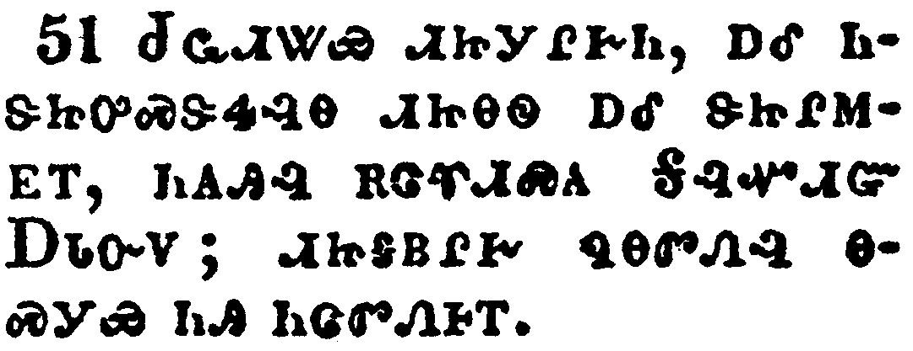</a></td>
</tr>
<tr class="even">
<td>Ye stiffnecked and uncircumcised in heart and ears, ye do always resist the Holy Ghost: as your fathers did, so do ye.</td>
</tr>
<tr class="odd">
<td>ᏧᏩᏗᏔᏯ ᏗᏥᎩᎵᎨᏂ, ᎠᎴ ᏂᏕᏥᎤᏍᏕᏎᎸᎾ ᏗᏥᎾᏫ ᎠᎴ ᏕᏥᎵᎷᎬᎢ, ᏂᎪᎯᎸ ᎡᏣᏡᏗᏍᎪ ᎦᎸᏉᏗᏳ ᎠᏓᏅᏙ; ᏗᏥᎦᏴᎵᎨ ᏄᎾᏛᏁᎸ ᎾᏍᎩᏯ ᏂᎯ ᏂᏣᏛᏁᎰᎢ.</td>
</tr>
<tr class="even">
<td>Tsu-wa-di-ta-ya di-tsi-gi-li-ge-ni, a-le ni-de-tsi-u-s-de-se-lv-na di-tsi-na-wi a-le de-tsi-li-lu-gv-i, ni-go-hi-lv e-tsa-tlu-di-s-go Ga-lv-quo-di-yu A-da-nv-do; di-tsi-ga-yv-li-ge nu-na-dv-ne-lv na-s-gi-ya ni-hi ni-tsa-dv-ne-ho-i.</td>
</tr>
</tbody>
</table>

<table>
<tbody>
<tr class="odd">
<td><a href="050752.png">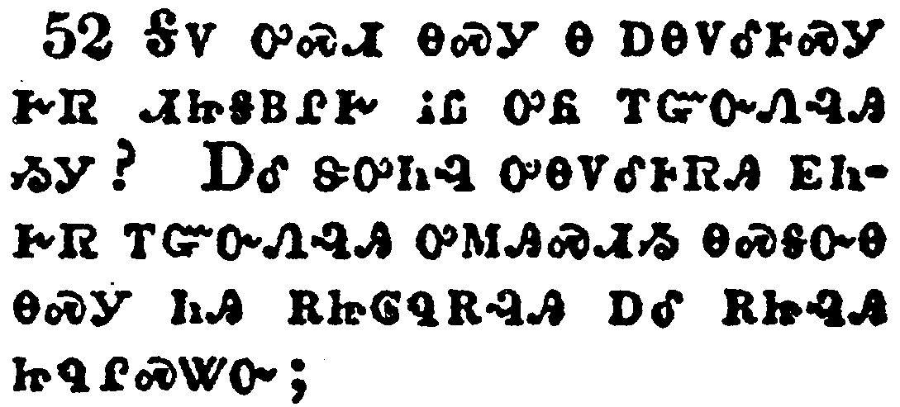</a></td>
</tr>
<tr class="even">
<td>Which of the prophets have not your fathers persecuted? and they have slain them which shewed before of the coming of the Just One; of whom ye have been now the betrayers and murderers:</td>
</tr>
<tr class="odd">
<td>ᎦᏙ ᎤᏍᏗ ᎾᏍᎩ Ꮎ ᎠᎾᏙᎴᎰᏍᎩ ᎨᏒ ᏗᏥᎦᏴᎵᎨ ᎥᏝ ᎤᏲ ᎢᏳᏅᏁᎸᎯ ᏱᎩ? ᎠᎴ ᏕᎤᏂᎸ ᎤᎾᏙᎴᎰᏒᎯ ᎬᏂᎨᏒ ᎢᏳᏅᏁᎸᎯ ᎤᎷᎯᏍᏗᏱ ᎾᏍᎦᏅᎾ ᎾᏍᎩ ᏂᎯ ᎡᏥᎶᏄᎡᎸᎯ ᎠᎴ ᎡᏥᎸᎯ ᏥᏄᎵᏍᏔᏅ;</td>
</tr>
<tr class="even">
<td>Ga-do u-s-di na-s-gi na a-na-do-le-ho-s-gi ge-sv di-tsi-ga-yv-li-ge v-tla u-yo i-yu-nv-ne-lv-hi yi-gi? A-le de-u-ni-lv u-na-do-le-ho-sv-hi gv-ni-ge-sv i-yu-nv-ne-lv-hi u-lu-hi-s-di-yi na-s-ga-nv-na na-s-gi ni-hi e-tsi-lo-nu-e-lv-hi a-le e-tsi-lv-hi tsi-nu-li-s-ta-nv;</td>
</tr>
</tbody>
</table>

<table>
<tbody>
<tr class="odd">
<td><a href="050753.png">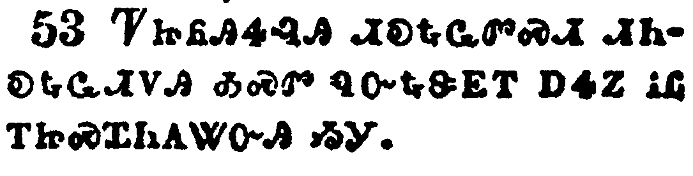</a></td>
</tr>
<tr class="even">
<td>Who have received the law by the disposition of angels, and have not kept it.</td>
</tr>
<tr class="odd">
<td>ᏤᏥᏲᎯᏎᎸᎩ ᏗᎧᎿᎭᏩᏛᏍᏗ ᏗᏂᎧᎿᎭᏩᏗᏙᎯ ᎣᏍᏛ ᏄᏅᎿᎭᏕᎬᎢ ᎠᏎᏃ ᎥᏝ ᎢᏥᏍᏆᏂᎪᏔᏅᎯ ᏱᎩ.</td>
</tr>
<tr class="even">
<td>Tse-tsi-yo-hi-se-lv-gi di-ka-hna-wa-dv-s-di di-ni-ka-hna-wa-di-do-hi o-s-dv nu-nv-hna-de-gv-i a-se-no v-tla i-tsi-s-qua-ni-go-ta-nv-hi yi-gi.</td>
</tr>
</tbody>
</table>

<table>
<tbody>
<tr class="odd">
<td><a href="050754.png">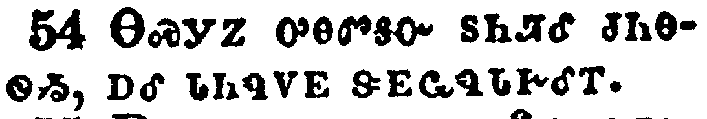</a></td>
</tr>
<tr class="even">
<td>When they heard these things, they were cut to the heart, and they gnashed on him with their teeth.</td>
</tr>
<tr class="odd">
<td>ᎾᏍᎩᏃ ᎤᎾᏛᎦᏅ ᏚᏂᏘᎴ ᏧᏂᎾᏫᏱ, ᎠᎴ ᏗᏂᏄᏙᎬ ᏕᎬᏩᏄᏓᎨᎴᎢ.</td>
</tr>
<tr class="even">
<td>Na-s-gi-no u-na-dv-ga-nv du-ni-ti-le tsu-ni-na-wi-yi, a-le di-ni-nu-do-gv de-gv-wa-nu-da-ge-le-i.</td>
</tr>
</tbody>
</table>

<table>
<tbody>
<tr class="odd">
<td><a href="050755.png">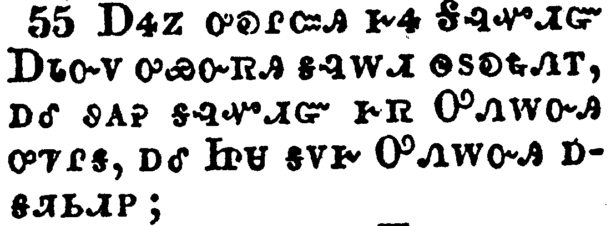</a></td>
</tr>
<tr class="even">
<td>But he, being full of the Holy Ghost, looked up stedfastly into heaven, and saw the glory of God, and Jesus standing on the right hand of God,</td>
</tr>
<tr class="odd">
<td>ᎠᏎᏃ ᎤᎧᎵᏨᎯ ᎨᏎ ᎦᎸᏉᏗᏳ ᎠᏓᏅᏙ ᎤᏯᏅᏒᎯ ᎦᎸᎳᏗ ᏫᏚᎧᎿᎭᏁᎢ, ᎠᎴ ᏭᎪᎮ ᎦᎸᏉᏗᏳ ᎨᏒ ᎤᏁᎳᏅᎯ ᎤᏤᎵᎦ, ᎠᎴ ᏥᏌ ᎦᏙᎨ ᎤᏁᎳᏅᎯ ᎠᎦᏘᏏᏗᏢ;</td>
</tr>
<tr class="even">
<td>A-se-no u-ka-li-tsv-hi ge-se Ga-lv-quo-di-yu A-da-nv-do u-ya-nv-sv-hi ga-lv-la-di wi-du-ka-hna-ne-i, a-le wu-go-he ga-lv-quo-di-yu ge-sv U-ne-la-nv-hi u-tse-li-ga, a-le Tsi-sa ga-do-ge U-ne-la-nv-hi a-ga-ti-si-di-tlv;</td>
</tr>
</tbody>
</table>

<table>
<tbody>
<tr class="odd">
<td><a href="050756.png">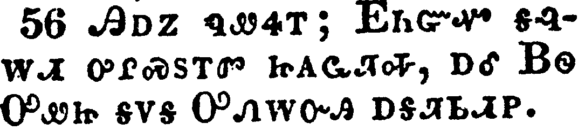</a></td>
</tr>
<tr class="even">
<td>And said, Behold, I see the heavens opened, and the Son of man standing on the right hand of God.</td>
</tr>
<tr class="odd">
<td>ᎯᎠᏃ ᏄᏪᏎᎢ; ᎬᏂᏳᏉ ᎦᎸᎳᏗ ᎤᎵᏍᏚᎢᏛ ᏥᎪᏩᏘᎭ, ᎠᎴ ᏴᏫ ᎤᏪᏥ ᎦᏙᎦ ᎤᏁᎳᏅᎯ ᎠᎦᏘᏏᏗᏢ.</td>
</tr>
<tr class="even">
<td>Hi-a-no nu-we-se-i; Gv-ni-yu-quo ga-lv-la-di u-li-s-du-i-dv tsi-go-wa-ti-ha, a-le Yv-wi U-we-tsi ga-do-ga U-ne-la-nv-hi a-ga-ti-si-di-tlv.</td>
</tr>
</tbody>
</table>

<table>
<tbody>
<tr class="odd">
<td><a href="050757.png">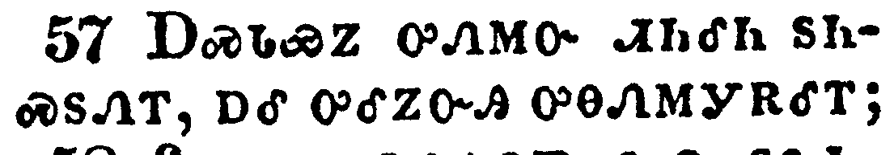</a></td>
</tr>
<tr class="even">
<td>Then they cried out with a loud voice, and stopped their ears, and ran upon him with one accord,</td>
</tr>
<tr class="odd">
<td>ᎠᏍᏓᏯᏃ ᎤᏁᎷᏅ ᏗᏏᎴᏂ ᏚᏂᏍᏚᏁᎢ, ᎠᎴ ᎤᎴᏃᏅᎯ ᎤᎾᏁᎷᎩᎡᎴᎢ;</td>
</tr>
<tr class="even">
<td>A-s-da-ya-no u-ne-lu-nv di-si-le-ni du-ni-s-du-ne-i, a-le u-le-no-nv-hi u-na-ne-lu-gi-e-le-i;</td>
</tr>
</tbody>
</table>

<table>
<tbody>
<tr class="odd">
<td><a href="050758.png">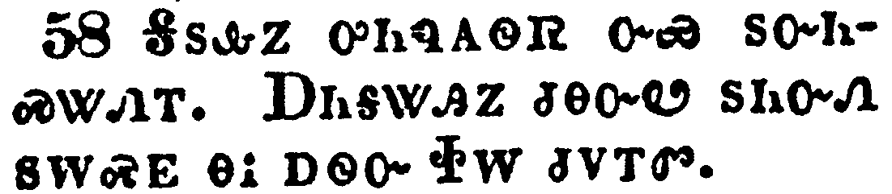</a></td>
</tr>
<tr class="even">
<td>And cast him out of the city, and stoned him: and the witnesses laid down their clothes at a young man's feet, whose name was Saul.</td>
</tr>
<tr class="odd">
<td>ᎦᏚᎲᏃ ᎤᏂᏄᎪᏫᏒ ᏅᏯ ᏚᏅᏂᏍᏔᏁᎢ. ᎠᏂᎦᏔᎯᏃ ᏧᎾᏅᏬ ᏚᏂᏅᏁ ᏚᎳᏍᎬ ᎾᎥ ᎠᏫᏅ ᏐᎳ ᏧᏙᎢᏛ.</td>
</tr>
<tr class="even">
<td>Ga-du-hv-no u-ni-nu-go-wi-sv nv-ya du-nv-ni-s-ta-ne-i. A-ni-ga-ta-hi-no tsu-na-nv-wo du-ni-nv-ne du-la-s-gv na-v a-wi-nv So-la tsu-do-i-dv.</td>
</tr>
</tbody>
</table>

<table>
<tbody>
<tr class="odd">
<td><a href="050759.png">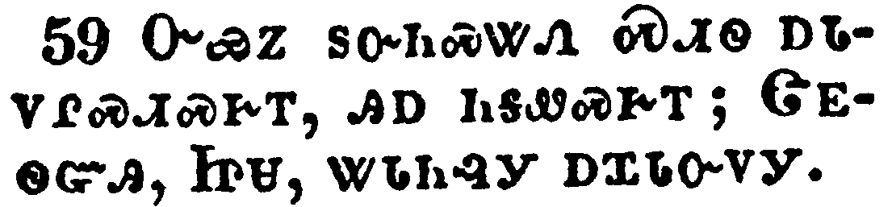</a></td>
</tr>
<tr class="even">
<td>And they stoned Stephen, calling upon God, and saying, Lord Jesus, receive my spirit.</td>
</tr>
<tr class="odd">
<td>ᏅᏯᏃ ᏚᏅᏂᏍᏔᏁ ᏍᏗᏫ ᎠᏓᏙᎵᏍᏗᏍᎨᎢ, ᎯᎠ ᏂᎦᏪᏍᎨᎢ; ᏣᎬᏫᏳᎯ, ᏥᏌ, ᏔᏓᏂᎸᎩ ᎠᏆᏓᏅᏙᎩ.</td>
</tr>
<tr class="even">
<td>Nv-ya-no du-nv-ni-s-ta-ne S-di-wi a-da-do-li-s-di-s-ge-i, hi-a ni-ga-we-s-ge-i; Tsa-gv-wi-yu-hi, Tsi-sa, ta-da-ni-lv-gi a-qua-da-nv-do-gi.</td>
</tr>
</tbody>
</table>

<table>
<tbody>
<tr class="odd">
<td><a href="050760.png">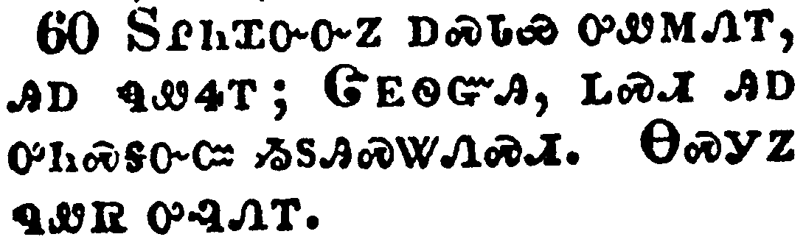</a></td>
</tr>
<tr class="even">
<td>And he kneeled down, and cried with a loud voice, Lord, lay not this sin to their charge. And when he had said this, he fell asleep.</td>
</tr>
<tr class="odd">
<td>ᏚᎵᏂᏆᏅᏅᏃ ᎠᏍᏓᏯ ᎤᏪᎷᏁᎢ, ᎯᎠ ᏄᏪᏎᎢ; ᏣᎬᏫᏳᎯ, ᏞᏍᏗ ᎯᎠ ᎤᏂᏍᎦᏅᏨ ᏱᎦᎯᏍᏔᏁᏍᏗ. ᎾᏍᎩᏃ ᏄᏪᏒ ᎤᎸᏁᎢ.</td>
</tr>
<tr class="even">
<td>Du-li-ni-qua-nv-nv-no a-s-da-ya u-we-lu-ne-i, hi-a nu-we-se-i; Tsa-gv-wi-yu-hi, tle-s-di hi-a u-ni-s-ga-nv-tsv yi-ga-hi-s-ta-ne-s-di. Na-s-gi-no nu-we-sv u-lv-ne-i.</td>
</tr>
</tbody>
</table>

