+++
draft=false
date = 2014-12-18T21:11:07Z
title = "The Acts - Chapter 8 - Cherokee New Testament"
weight = 1418955067

[taxonomies]

authors = ["Timothy Legg"]
categories = []
tags = []

[extra]
+++

<table>
<tbody>
<tr class="odd">
<td><a href="050801.png">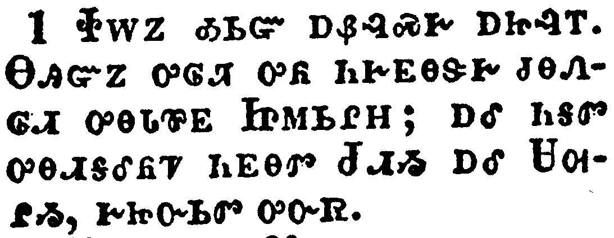</a></td>
</tr>
<tr class="even">
<td>And Saul was consenting unto his death. And at that time there was a great persecution against the church which was at Jerusalem; and they were all scattered abroad throughout the regions of Judaea and Samaria, except the apostles.</td>
</tr>
<tr class="odd">
<td>ᏐᎳᏃ ᎣᏏᏳ ᎠᏰᎸᏍᎨ ᎠᏥᎸᎢ. ᎾᎯᏳᏃ ᎤᎶᏘ ᎤᏲ ᏂᎨᎬᎾᏕᎨ ᏧᎾᏁᎶᏗ ᎤᎾᏓᏈᎬ ᏥᎷᏏᎵᎻ; ᎠᎴ ᏂᎦᏛ ᎤᎾᏗᎦᎴᏲᏤ ᏂᎬᎾᏛ ᏧᏗᏱ ᎠᎴ ᏌᎺᎵᏱ, ᎨᏥᏅᏏᏛ ᎤᏅᏒ.</td>
</tr>
<tr class="even">
<td>So-la-no o-si-yu a-ye-lv-s-ge a-tsi-lv-i. Na-hi-yu-no u-lo-ti u-yo ni-ge-gv-na-de-ge tsu-na-ne-lo-di u-na-da-qui-gv Tsi-lu-si-li-mi; a-le ni-ga-dv u-na-di-ga-le-yo-tse ni-gv-na-dv Tsu-di-yi a-le Sa-me-li-yi, ge-tsi-nv-si-dv u-nv-sv.</td>
</tr>
</tbody>
</table>

<table>
<tbody>
<tr class="odd">
<td><a href="050802.png">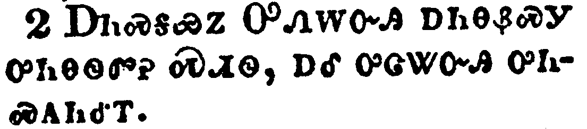</a></td>
</tr>
<tr class="even">
<td>And devout men carried Stephen to his burial, and made great lamentation over him.</td>
</tr>
<tr class="odd">
<td>ᎠᏂᏍᎦᏯᏃ ᎤᏁᎳᏅᎯ ᎠᏂᎾᏰᏍᎩ ᎤᏂᎾᏫᏛᎮ ᏍᏗᏫ, ᎠᎴ ᎤᏣᏔᏅᎯ ᎤᏂᏍᎪᏂᎴᎢ.</td>
</tr>
<tr class="even">
<td>A-ni-s-ga-ya-no U-ne-la-nv-hi a-ni-na-ye-s-gi u-ni-na-wi-dv-he S-di-wi, a-le u-tsa-ta-nv-hi u-ni-s-go-ni-le-i.</td>
</tr>
</tbody>
</table>

<table>
<tbody>
<tr class="odd">
<td><a href="050803.png">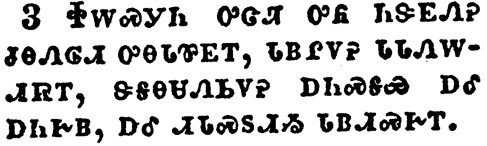</a></td>
</tr>
<tr class="even">
<td>As for Saul, he made havock of the church, entering into every house, and haling men and women committed them to prison.</td>
</tr>
<tr class="odd">
<td>ᏐᎳᏍᎩᏂ ᎤᏣᏘ ᎤᏲ ᏂᏕᎬᏁᎮ ᏧᎾᏁᎶᏗ ᎤᎾᏓᏈᎬᎢ, ᏓᏴᎵᏙᎮ ᏓᏓᏁᎳᏗᏒᎢ, ᏕᎦᎾᏌᏁᏏᏙᎮ ᎠᏂᏍᎦᏯ ᎠᎴ ᎠᏂᎨᏴ, ᎠᎴ ᏗᏓᏍᏚᏗᏱ ᏓᏴᏗᏍᎨᎢ.</td>
</tr>
<tr class="even">
<td>So-la-s-gi-ni u-tsa-ti u-yo ni-de-gv-ne-he tsu-na-ne-lo-di u-na-da-qui-gv-i, da-yv-li-do-he da-da-ne-la-di-sv-i, de-ga-na-sa-ne-si-do-he a-ni-s-ga-ya a-le a-ni-ge-yv, a-le di-da-s-du-di-yi da-yv-di-s-ge-i.</td>
</tr>
</tbody>
</table>

<table>
<tbody>
<tr class="odd">
<td><a href="050804.png">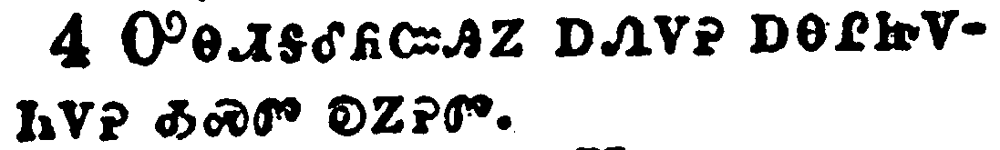</a></td>
</tr>
<tr class="even">
<td>Therefore they that were scattered abroad went every where preaching the word.</td>
</tr>
<tr class="odd">
<td>ᎤᎾᏗᎦᎴᏲᏨᎯᏃ ᎠᏁᏙᎮ ᎠᎾᎵᏥᏙᏂᏙᎮ ᎣᏍᏛ ᎧᏃᎮᏛ.</td>
</tr>
<tr class="even">
<td>U-na-di-ga-le-yo-tsv-hi-no a-ne-do-he a-na-li-tsi-do-ni-do-he o-s-dv ka-no-he-dv.</td>
</tr>
</tbody>
</table>

<table>
<tbody>
<tr class="odd">
<td><a href="050805.png">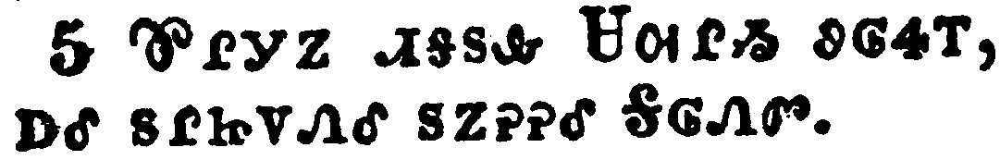</a></td>
</tr>
<tr class="even">
<td>Then Philip went down to the city of Samaria, and preached Christ unto them.</td>
</tr>
<tr class="odd">
<td>ᏈᎵᎩᏃ ᏗᎦᏚᎲ ᏌᎺᎵᏱ ᏭᎶᏎᎢ, ᎠᎴ ᏚᎵᏥᏙᏁᎴ ᏚᏃᎮᎮᎴ ᎦᎶᏁᏛ.</td>
</tr>
<tr class="even">
<td>Qui-li-gi-no di-ga-du-hv Sa-me-li-yi wu-lo-se-i, a-le du-li-tsi-do-ne-le du-no-he-he-le Ga-lo-ne-dv.</td>
</tr>
</tbody>
</table>

<table>
<tbody>
<tr class="odd">
<td><a href="050806.png">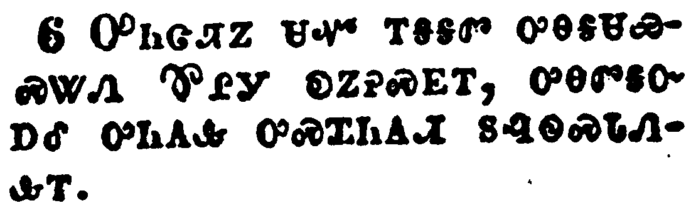</a></td>
</tr>
<tr class="even">
<td>And the people with one accord gave heed unto those things which Philip spake, hearing and seeing the miracles which he did.</td>
</tr>
<tr class="odd">
<td>ᎤᏂᏣᏘᏃ ᏌᏉ ᎢᎦᎦᏛ ᎤᎾᎦᏌᏯᏍᏔᏁ ᏈᎵᎩ ᎧᏃᎮᏍᎬᎢ, ᎤᎾᏛᎦᏅ ᎠᎴ ᎤᏂᎪᎲ ᎤᏍᏆᏂᎪᏗ ᏚᎸᏫᏍᏓᏁᎲᎢ.</td>
</tr>
<tr class="even">
<td>U-ni-tsa-ti-no sa-quo i-ga-ga-dv u-na-ga-sa-ya-s-ta-ne Qui-li-gi ka-no-he-s-gv-i, u-na-dv-ga-nv a-le u-ni-go-hv u-s-qua-ni-go-di du-lv-wi-s-da-ne-hv-i.</td>
</tr>
</tbody>
</table>

<table>
<tbody>
<tr class="odd">
<td><a href="050807.png">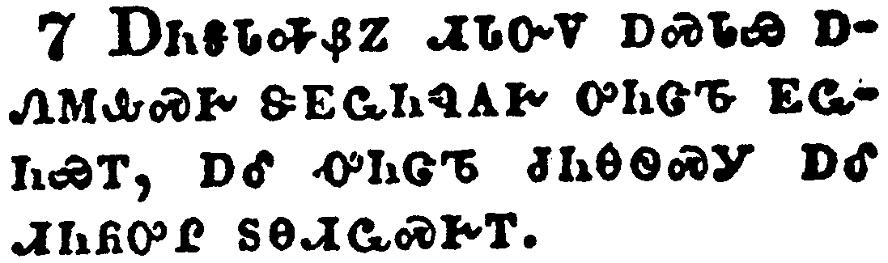</a></td>
</tr>
<tr class="even">
<td>For unclean spirits, crying with loud voice, came out of many that were possessed with them: and many taken with palsies, and that were lame, were healed.</td>
</tr>
<tr class="odd">
<td>ᎠᏂᎦᏓᎭᏰᏃ ᏗᏓᏅᏙ ᎠᏍᏓᏯ ᎠᏁᎷᎲᏍᎨ ᏕᎬᏩᏂᏄᎪᎨ ᎤᏂᏣᏖ ᎬᏩᏂᏯᎢ, ᎠᎴ ᎤᏂᏤᏖ ᏧᏂᎾᏫᏍᎩ ᎠᎴ ᏗᏂᏲᎤᎵ ᏚᎾᏗᏩᏍᎨᎢ.</td>
</tr>
<tr class="even">
<td>A-ni-ga-da-ha-ye-no di-da-nv-do a-s-da-ya a-ne-lu-hv-s-ge de-gv-wa-ni-nu-go-ge u-ni-tsa-te gv-wa-ni-ya-i, a-le u-ni-tse-te tsu-ni-na-wi-s-gi a-le di-ni-yo-u-li du-na-di-wa-s-ge-i.</td>
</tr>
</tbody>
</table>

<table>
<tbody>
<tr class="odd">
<td><a href="050808.png">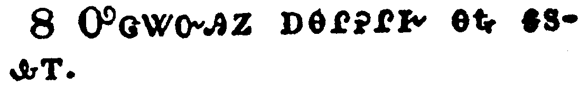</a></td>
</tr>
<tr class="even">
<td>And there was great joy in that city.</td>
</tr>
<tr class="odd">
<td>ᎤᏣᏔᏅᎯᏃ ᎠᎾᎵᎮᎵᎨ ᎾᎿᎭᎦᏚᎲᎢ.</td>
</tr>
<tr class="even">
<td>U-tsa-ta-nv-hi-no a-na-li-he-li-ge na-hna ga-du-hv-i.</td>
</tr>
</tbody>
</table>

<table>
<tbody>
<tr class="odd">
<td><a href="050809.png">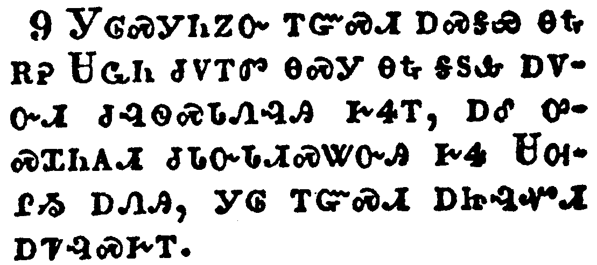</a></td>
</tr>
<tr class="even">
<td>But there was a certain man, called Simon, which beforetime in the same city used sorcery, and bewitched the people of Samaria, giving out that himself was some great one:</td>
</tr>
<tr class="odd">
<td>ᎩᎶᏍᎩᏂᏃᏅ ᎢᏳᏍᏗ ᎠᏍᎦᏯ ᎾᎿᎭᎡᎮ ᏌᏩᏂ ᏧᏙᎢᏛ ᎾᏍᎩ ᎾᎿᎭᎦᏚᎲ ᎠᏙᏅᏗ ᏧᎸᏫᏍᏓᏁᎸᎯ ᎨᏎᎢ, ᎠᎴ ᎤᏍᏆᏂᎪᏗ ᏧᏓᏅᏓᏗᏍᏔᏅᎯ ᎨᏎ ᏌᎺᎵᏱ ᎠᏁᎯ, ᎩᎶ ᎢᏳᏍᏗ ᎠᏥᎸᏉᏗ ᎠᏤᎸᏍᎨᎢ.</td>
</tr>
<tr class="even">
<td>Gi-lo-s-gi-ni-no-nv i-yu-s-di a-s-ga-ya na-hna e-he Sa-wa-ni tsu-do-i-dv na-s-gi na-hna ga-du-hv a-do-nv-di tsu-lv-wi-s-da-ne-lv-hi ge-se-i, a-le u-s-qua-ni-go-di tsu-da-nv-da-di-s-ta-nv-hi ge-se Sa-me-li-yi a-ne-hi, gi-lo i-yu-s-di a-tsi-lv-quo-di a-tse-lv-s-ge-i.</td>
</tr>
</tbody>
</table>

<table>
<tbody>
<tr class="odd">
<td><a href="050810.png">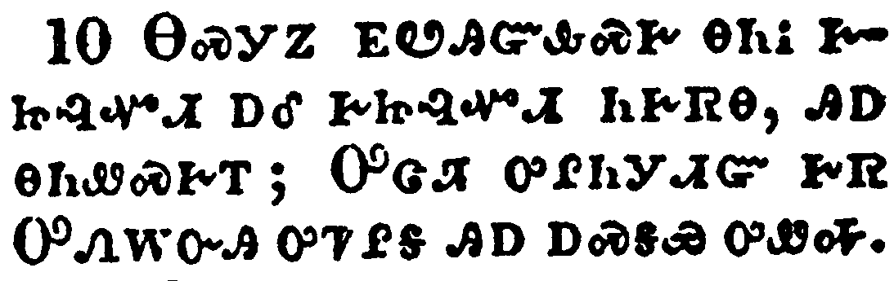</a></td>
</tr>
<tr class="even">
<td>To whom they all gave heed, from the least to the greatest, saying, This man is the great power of God.</td>
</tr>
<tr class="odd">
<td>ᎾᏍᎩᏃ ᎬᏬᎯᏳᎲᏍᎨ ᎾᏂᎥ ᎨᏥᎸᏉᏗ ᎠᎴ ᎨᏥᎸᏉᏗ ᏂᎨᏒᎾ, ᎯᎠ ᎾᏂᏪᏍᎨᎢ; ᎤᏣᏘ ᎤᎵᏂᎩᏗᏳ ᎨᏒ ᎤᏁᎳᏅᎯ ᎤᏤᎵᎦ ᎯᎠ ᎠᏍᎦᏯ ᎤᏪᎭ.</td>
</tr>
<tr class="even">
<td>Na-s-gi-no gv-wo-hi-yu-hv-s-ge na-ni-v ge-tsi-lv-quo-di a-le ge-tsi-lv-quo-di ni-ge-sv-na, hi-a na-ni-we-s-ge-i; U-tsa-ti u-li-ni-gi-di-yu ge-sv U-ne-la-nv-hi u-tse-li-ga hi-a a-s-ga-ya u-we-ha.</td>
</tr>
</tbody>
</table>

<table>
<tbody>
<tr class="odd">
<td><a href="050811.png">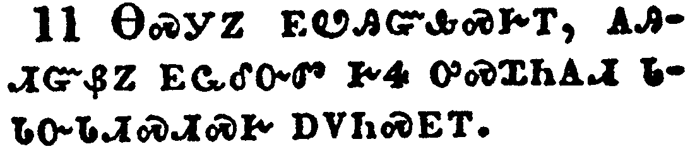</a></td>
</tr>
<tr class="even">
<td>And to him they had regard, because that of long time he had bewitched them with sorceries.</td>
</tr>
<tr class="odd">
<td>ᎾᏍᎩᏃ ᎬᏬᎯᏳᎲᏍᎨᎢ, ᎪᎯᏗᏳᏰᏃ ᎬᏩᎴᏅᏛ ᎨᏎ ᎤᏍᏆᏂᎪᏗ ᏓᏓᏅᏓᏗᏍᏗᏍᎨ ᎠᏙᏂᏍᎬᎢ.</td>
</tr>
<tr class="even">
<td>Na-s-gi-no gv-wo-hi-yu-hv-s-ge-i, go-hi-di-yu-ye-no gv-wa-le-nv-dv ge-se u-s-qua-ni-go-di da-da-nv-da-di-s-di-s-ge a-do-ni-s-gv-i.</td>
</tr>
</tbody>
</table>

<table>
<tbody>
<tr class="odd">
<td><a href="050812.png">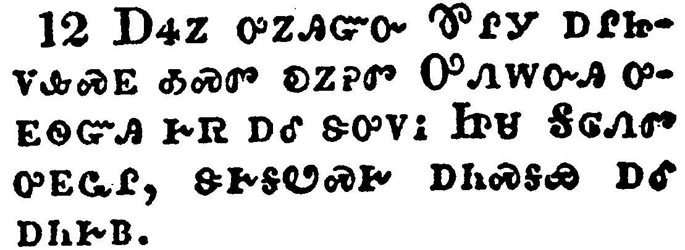</a></td>
</tr>
<tr class="even">
<td>But when they believed Philip preaching the things concerning the kingdom of God, and the name of Jesus Christ, they were baptized, both men and women.</td>
</tr>
<tr class="odd">
<td>ᎠᏎᏃ ᎤᏃᎯᏳᏅ ᏈᎵᎩ ᎠᎵᏥᏙᎲᏍᎬ ᎣᏍᏛ ᎧᏃᎮᏛ ᎤᏁᎳᏅᎯ ᎤᎬᏫᏳᎯ ᎨᏒ ᎠᎴ ᏕᎤᏙᎥ ᏥᏌ ᎦᎶᏁᏛ ᎤᎬᏩᎵ, ᏕᎨᎦᏬᏍᎨ ᎠᏂᏍᎦᏯ ᎠᎴ ᎠᏂᎨᏴ.</td>
</tr>
<tr class="even">
<td>A-se-no u-no-hi-yu-nv Qui-li-gi a-li-tsi-do-hv-s-gv o-s-dv ka-no-he-dv U-ne-la-nv-hi u-gv-wi-yu-hi ge-sv a-le de-u-do-v Tsi-sa Ga-lo-ne-dv u-gv-wa-li, de-ge-ga-wo-s-ge a-ni-s-ga-ya a-le a-ni-ge-yv.</td>
</tr>
</tbody>
</table>

<table>
<tbody>
<tr class="odd">
<td><a href="050813.png">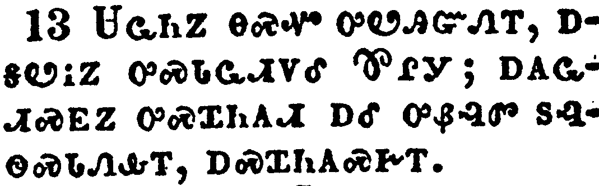</a></td>
</tr>
<tr class="even">
<td>Then Simon himself believed also: and when he was baptized, he continued with Philip, and wondered, beholding the miracles and signs which were done.</td>
</tr>
<tr class="odd">
<td>ᏌᏩᏂᏃ ᎾᏍᏉ ᎤᏬᎯᏳᏁᎢ, ᎠᎦᏬᎥᏃ ᎤᏍᏓᏩᏗᏙᎴ ᏈᎵᎩ; ᎠᎪᏩᏗᏍᎬᏃ ᎤᏍᏆᏂᎪᏗ ᎠᎴ ᎤᏰᎸᏛ ᏚᎸᏫᏍᏓᏁᎲᎢ, ᎠᏍᏆᏂᎪᏍᎨᎢ.</td>
</tr>
<tr class="even">
<td>Sa-wa-ni-no na-s-quo u-wo-hi-yu-ne-i, a-ga-wo-v-no u-s-da-wa-di-do-le Qui-li-gi; a-go-wa-di-s-gv-no u-s-qua-ni-go-di a-le u-ye-lv-dv du-lv-wi-s-da-ne-hv-i, a-s-qua-ni-go-s-ge-i.</td>
</tr>
</tbody>
</table>

<table>
<tbody>
<tr class="odd">
<td><a href="050814.png">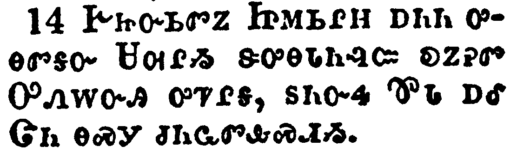</a></td>
</tr>
<tr class="even">
<td>Now when the apostles which were at Jerusalem heard that Samaria had received the word of God, they sent unto them Peter and John:</td>
</tr>
<tr class="odd">
<td>ᎨᏥᏅᏏᏛᏃ ᏥᎷᏏᎵᎻ ᎠᏂᏂ ᎤᎾᏛᎦᏅ ᏌᎺᎵᏱ ᏕᎤᎾᏓᏂᎸᏨ ᎧᏃᎮᏛ ᎤᏁᎳᏅᎯ ᎤᏤᎵᎦ, ᏚᏂᏅᏎ ᏈᏓ ᎠᎴ ᏣᏂ ᎾᏍᎩ ᏧᏂᏩᏛᎲᏍᏗᏱ.</td>
</tr>
<tr class="even">
<td>Ge-tsi-nv-si-dv-no Tsi-lu-si-li-mi a-ni-ni u-na-dv-ga-nv Sa-me-li-yi de-u-na-da-ni-lv-tsv ka-no-he-dv U-ne-la-nv-hi u-tse-li-ga, du-ni-nv-se Qui-da a-le Tsa-ni na-s-gi tsu-ni-wa-dv-hv-s-di-yi.</td>
</tr>
</tbody>
</table>

<table>
<tbody>
<tr class="odd">
<td><a href="050815.png">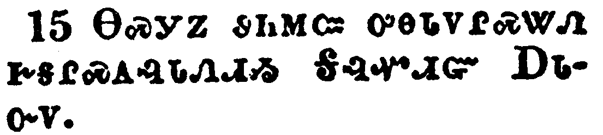</a></td>
</tr>
<tr class="even">
<td>Who, when they were come down, prayed for them, that they might receive the Holy Ghost:</td>
</tr>
<tr class="odd">
<td>ᎾᏍᎩᏃ ᏭᏂᎷᏨ ᎤᎾᏓᏙᎵᏍᏔᏁ ᎨᎦᎵᏍᎪᎸᏓᏁᏗᏱ ᎦᎸᏉᏗᏳ ᎠᏓᏅᏙ.</td>
</tr>
<tr class="even">
<td>Na-s-gi-no wu-ni-lu-tsv u-na-da-do-li-s-ta-ne ge-ga-li-s-go-lv-da-ne-di-yi Ga-lv-quo-di-yu A-da-nv-do.</td>
</tr>
</tbody>
</table>

<table>
<tbody>
<tr class="odd">
<td><a href="050816.png">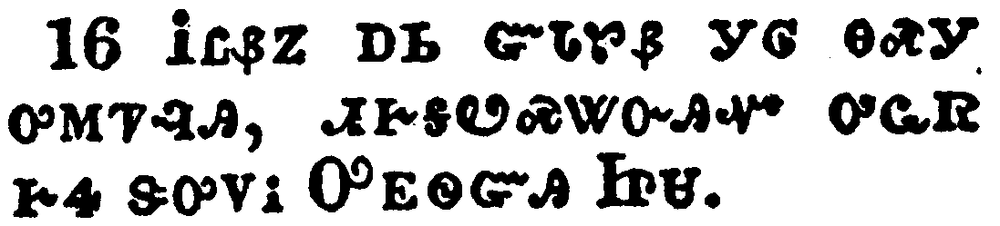</a></td>
</tr>
<tr class="even">
<td>(For as yet he was fallen upon none of them: only they were baptized in the name of the Lord Jesus.)</td>
</tr>
<tr class="odd">
<td>ᎥᏝᏰᏃ ᎠᏏ ᏳᏓᏑᏰ ᎩᎶ ᎾᏍᎩ ᎤᎷᏤᎸᎯ, ᏗᎨᎦᏬᏍᏔᏅᎯᏉ ᎤᏩᏒ ᎨᏎ ᏕᎤᏙᎥ ᎤᎬᏫᏳᎯ ᏥᏌ.</td>
</tr>
<tr class="even">
<td>V-tla-ye-no a-si yu-da-su-ye gi-lo na-s-gi u-lu-tse-lv-hi, di-ge-ga-wo-s-ta-nv-hi-quo u-wa-sv ge-se de-u-do-v U-gv-wi-yu-hi Tsi-sa.</td>
</tr>
</tbody>
</table>

<table>
<tbody>
<tr class="odd">
<td><a href="050817.png">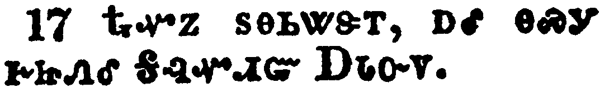</a></td>
</tr>
<tr class="even">
<td>Then laid they their hands on them, and they received the Holy Ghost.</td>
</tr>
<tr class="odd">
<td>ᎿᎭᏉᏃ ᏚᎾᏏᏔᏕᎢ, ᎠᎴ ᎾᏍᎩ ᎨᏥᏁᎴ ᎦᎸᏉᏗᏳ ᎠᏓᏅᏙ.</td>
</tr>
<tr class="even">
<td>Hna-quo-no du-na-si-ta-de-i, a-le na-s-gi ge-tsi-ne-le Ga-lv-quo-di-yu A-da-nv-do.</td>
</tr>
</tbody>
</table>

<table>
<tbody>
<tr class="odd">
<td><a href="050818.png">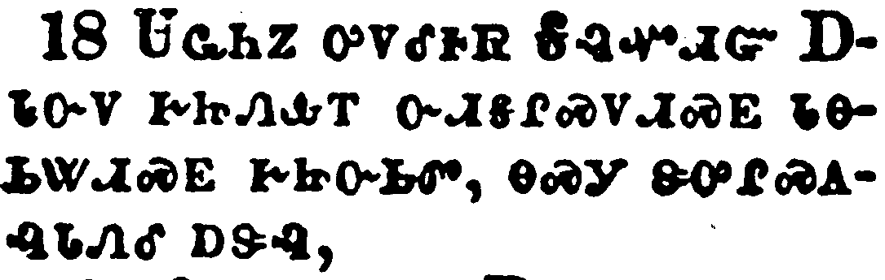</a></td>
</tr>
<tr class="even">
<td>And when Simon saw that through laying on of the apostles' hands the Holy Ghost was given, he offered them money,</td>
</tr>
<tr class="odd">
<td>ᏌᏩᏂᏃ ᎤᏙᎴᎰᏒ ᎦᎸᏉᏗᏳ ᎠᏓᏅᏙ ᎨᏥᏁᎲᎢ ᏅᏗᎦᎵᏍᏙᏗᏍᎬ ᏓᎾᏏᏔᏗᏍᎬ ᎨᏥᏅᏏᏛ, ᎾᏍᎩ ᏕᎤᎵᏍᎪᎸᏓᏁᎴ ᎠᏕᎸ,</td>
</tr>
<tr class="even">
<td>Sa-wa-ni-no u-do-le-ho-sv Ga-lv-quo-di-yu A-da-nv-do ge-tsi-ne-hv-i nv-di-ga-li-s-do-di-s-gv da-na-si-ta-di-s-gv ge-tsi-nv-si-dv, na-s-gi de-u-li-s-go-lv-da-ne-le a-de-lv,</td>
</tr>
</tbody>
</table>

<table>
<tbody>
<tr class="odd">
<td><a href="050819.png">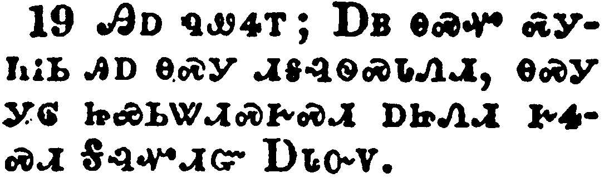</a></td>
</tr>
<tr class="even">
<td>Saying, Give me also this power, that on whomsoever I lay hands, he may receive the Holy Ghost.</td>
</tr>
<tr class="odd">
<td>ᎯᎠ ᏄᏪᏎᎢ; ᎠᏴ ᎾᏍᏉ ᏍᎩᏂᎥᏏ ᎯᎠ ᎾᏍᎩ ᏗᎦᎸᏫᏍᏓᏁᏗ, ᎾᏍᎩ ᎩᎶ ᏥᏯᏏᏔᏗᏍᎨᏍᏗ ᎠᏥᏁᏗ ᎨᏎᏍᏗ ᎦᎸᏉᏗᏳ ᎠᏓᏅᏙ.</td>
</tr>
<tr class="even">
<td>Hi-a nu-we-se-i; A-yv na-s-quo s-gi-ni-v-si hi-a na-s-gi di-ga-lv-wi-s-da-ne-di, na-s-gi gi-lo tsi-ya-si-ta-di-s-ge-s-di a-tsi-ne-di ge-se-s-di Ga-lv-quo-di-yu A-da-nv-do.</td>
</tr>
</tbody>
</table>

<table>
<tbody>
<tr class="odd">
<td><a href="050820.png">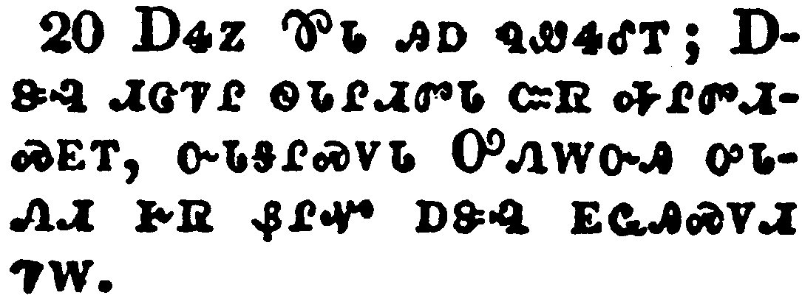</a></td>
</tr>
<tr class="even">
<td>But Peter said unto him, Thy money perish with thee, because thou hast thought that the gift of God may be purchased with money.</td>
</tr>
<tr class="odd">
<td>ᎠᏎᏃ ᏈᏓ ᎯᎠ ᏄᏪᏎᎴᎢ; ᎠᏕᎸ ᏗᏣᏤᎵ ᏫᏓᎵᏗᏛᏓ ᏨᏒ ᎭᎵᏛᏗᏍᎬᎢ, ᏅᏓᎦᎵᏍᏙᏓ ᎤᏁᎳᏅᎯ ᎤᏓᏁᏗ ᎨᏒ ᏰᎵᏉ ᎠᏕᎸ ᎬᏩᎯᏍᏙᏗ ᏤᎳ.</td>
</tr>
<tr class="even">
<td>A-se-no Qui-da hi-a nu-we-se-le-i; A-de-lv di-tsa-tse-li wi-da-li-di-dv-da tsv-sv ha-li-dv-di-s-gv-i, nv-da-ga-li-s-do-da U-ne-la-nv-hi u-da-ne-di ge-sv ye-li-quo a-de-lv gv-wa-hi-s-do-di tse-la.</td>
</tr>
</tbody>
</table>

<table>
<tbody>
<tr class="odd">
<td><a href="050821.png">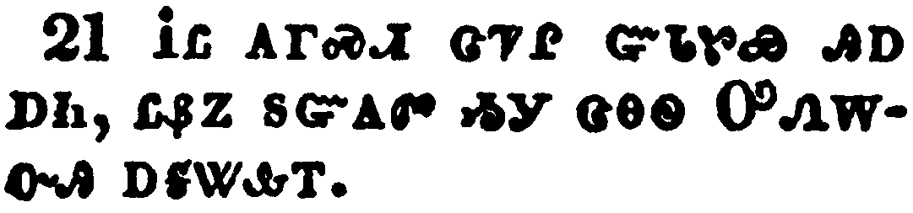</a></td>
</tr>
<tr class="even">
<td>Thou hast neither part nor lot in this matter: for thy heart is not right in the sight of God.</td>
</tr>
<tr class="odd">
<td>ᎥᏝ ᎪᎱᏍᏗ ᏣᏤᎵ ᏳᏓᏑᏯ ᎯᎠ ᎠᏂ, ᏝᏰᏃ ᏚᏳᎪᏛ ᏱᎩ ᏣᎾᏫ ᎤᏁᎳᏅᎯ ᎠᎦᏔᎲᎢ.</td>
</tr>
<tr class="even">
<td>V-tla go-hu-s-di tsa-tse-li yu-da-su-ya hi-a a-ni, tla-ye-no du-yu-go-dv yi-gi tsa-na-wi U-ne-la-nv-hi a-ga-ta-hv-i.</td>
</tr>
</tbody>
</table>

<table>
<tbody>
<tr class="odd">
<td><a href="050822.png">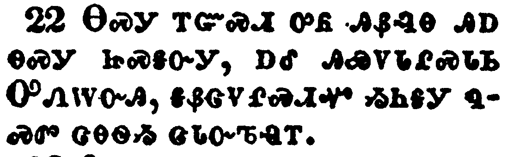</a></td>
</tr>
<tr class="even">
<td>Repent therefore of this thy wickedness, and pray God, if perhaps the thought of thine heart may be forgiven thee.</td>
</tr>
<tr class="odd">
<td>ᎾᏍᎩ ᎢᏳᏍᏗ ᎤᏲ ᎯᏰᎸᎾ ᎯᎠ ᎾᏍᎩ ᏥᏍᎦᏅᎩ, ᎠᎴ ᎯᏯᏙᏓᎵᏍᏓᏏ ᎤᏁᎳᏅᎯ, ᎦᏰᏣᏙᎵᏍᏗᏉ ᏱᏂᎦᎩ ᏄᏍᏛ ᏣᎾᏫᏱ ᏣᏓᏅᏖᎸᎢ.</td>
</tr>
<tr class="even">
<td>Na-s-gi i-yu-s-di u-yo hi-ye-lv-na hi-a na-s-gi tsi-s-ga-nv-gi, a-le hi-ya-do-da-li-s-da-si U-ne-la-nv-hi, ga-ye-tsa-do-li-s-di-quo yi-ni-ga-gi nu-s-dv tsa-na-wi-yi tsa-da-nv-te-lv-i.</td>
</tr>
</tbody>
</table>

<table>
<tbody>
<tr class="odd">
<td><a href="050823.png">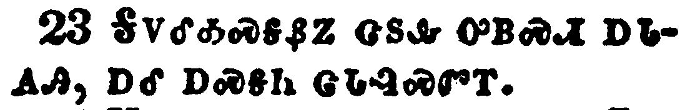</a></td>
</tr>
<tr class="even">
<td>For I perceive that thou art in the gall of bitterness, and in the bond of iniquity.</td>
</tr>
<tr class="odd">
<td>ᎦᏙᎴᎣᏍᎦᏰᏃ ᏣᏚᎲ ᎤᏴᏍᏗ ᎠᏓᎪᎯ, ᎠᎴ ᎠᏍᎦᏂ ᏣᏓᎸᏍᏛᎢ.</td>
</tr>
<tr class="even">
<td>Ga-do-le-o-s-ga-ye-no tsa-du-hv u-yv-s-di a-da-go-hi, a-le a-s-ga-ni tsa-da-lv-s-dv-i.</td>
</tr>
</tbody>
</table>

<table>
<tbody>
<tr class="odd">
<td><a href="050824.png">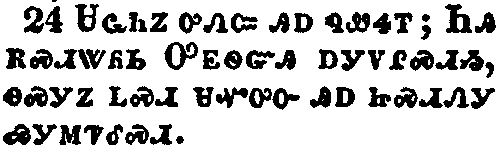</a></td>
</tr>
<tr class="even">
<td>Then answered Simon, and said, Pray ye to the Lord for me, that none of these things which ye have spoken come upon me.</td>
</tr>
<tr class="odd">
<td>ᏌᏩᏂᏃ ᎤᏁᏨ ᎯᎠ ᏄᏪᏎᎢ; ᏂᎯ ᎡᏍᏗᏔᏲᏏ ᎤᎬᏫᏳᎯ ᎠᎩᏙᎵᏍᏗᏱ, ᎾᏍᎩᏃ ᏞᏍᏗ ᏌᏉᎤᏅ ᎯᎠ ᏥᏍᏗᏁᎩ ᏯᎩᎷᏤᎴᏍᏗ.</td>
</tr>
<tr class="even">
<td>Sa-wa-ni-no u-ne-tsv hi-a nu-we-se-i; Ni-hi e-s-di-ta-yo-si U-gv-wi-yu-hi a-gi-do-li-s-di-yi, na-s-gi-no tle-s-di sa-quo-u-nv hi-a tsi-s-di-ne-gi ya-gi-lu-tse-le-s-di.</td>
</tr>
</tbody>
</table>

<table>
<tbody>
<tr class="odd">
<td><a href="050825.png">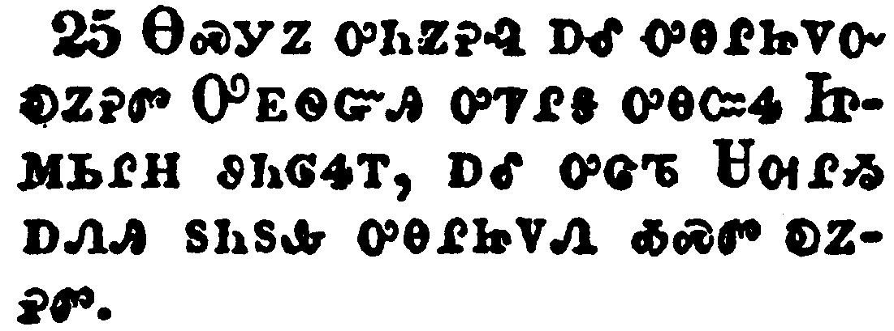</a></td>
</tr>
<tr class="even">
<td>And they, when they had testified and preached the word of the Lord, returned to Jerusalem, and preached the gospel in many villages of the Samaritans.</td>
</tr>
<tr class="odd">
<td>ᎾᏍᎩᏃ ᎤᏂᏃᎮᎸ ᎠᎴ ᎤᎾᎵᏥᏙᏅ ᎧᏃᎮᏛ ᎤᎬᏫᏳᎯ ᎤᏤᎵᎦ ᎤᎾᏨᏎ ᏥᎷᏏᎵᎻ ᏭᏂᎶᏎᎢ, ᎠᎴ ᎤᏣᏖ ᏌᎺᎵᏱ ᎠᏁᎯ ᏚᏂᏚᎲ ᎤᎾᎵᏥᏙᏁ ᎣᏍᏛ ᎧᏃᎮᏛ.</td>
</tr>
<tr class="even">
<td>Na-s-gi-no u-ni-no-he-lv a-le u-na-li-tsi-do-nv ka-no-he-dv U-gv-wi-yu-hi u-tse-li-ga u-na-tsv-se Tsi-lu-si-li-mi wu-ni-lo-se-i, a-le u-tsa-te Sa-me-li-yi a-ne-hi du-ni-du-hv u-na-li-tsi-do-ne o-s-dv ka-no-he-dv.</td>
</tr>
</tbody>
</table>

<table>
<tbody>
<tr class="odd">
<td><a href="050826.png">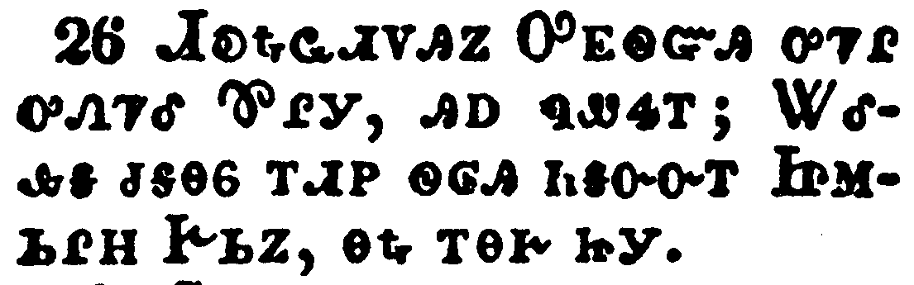</a></td>
</tr>
<tr class="even">
<td>And the angel of the Lord spake unto Philip, saying, Arise, and go toward the south unto the way that goeth down from Jerusalem unto Gaza, which is desert.</td>
</tr>
<tr class="odd">
<td>ᏗᎧᎿᎭᏩᏗᏙᎯᏃ ᎤᎬᏫᏳᎯ ᎤᏤᎵ ᎤᏁᏤᎴ ᏈᎵᎩ, ᎯᎠ ᏄᏪᏎᎢ; ᏔᎴᎲᎦ ᏧᎦᎾᏮ ᎢᏗᏢ ᏫᎶᎯ ᏂᎦᏅᏅᎢ ᏥᎷᏏᎵᎻ ᎨᏏᏃ, ᎾᎿᎭᎢᎾᎨ ᏥᎩ.</td>
</tr>
<tr class="even">
<td>Di-ka-hna-wa-di-do-hi-no U-gv-wi-yu-hi u-tse-li u-ne-tse-le Qui-li-gi, hi-a nu-we-se-i; Ta-le-hv-ga tsu-ga-na-wv i-di-tlv wi-lo-hi ni-ga-nv-nv-i Tsi-lu-si-li-mi Ge-si-no, na-hna i-na-ge tsi-gi.</td>
</tr>
</tbody>
</table>

<table>
<tbody>
<tr class="odd">
<td><a href="050827.png">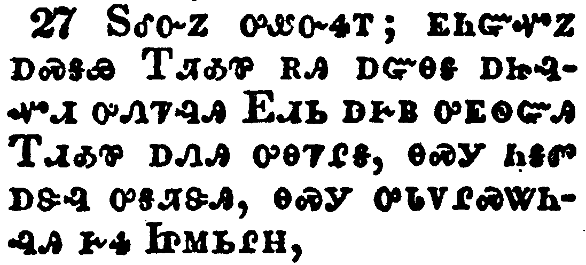</a></td>
</tr>
<tr class="even">
<td>And he arose and went: and, behold, a man of Ethiopia, an eunuch of great authority under Candace queen of the Ethiopians, who had the charge of all her treasure, and had come to Jerusalem for to worship,</td>
</tr>
<tr class="odd">
<td>ᏚᎴᏅᏃ ᎤᏪᏅᏎᎢ; ᎬᏂᏳᏉᏃ ᎠᏍᎦᏯ ᎢᏘᏱᏈ ᎡᎯ ᎠᏳᎾᎦ ᎠᏥᎸᏉᏗ ᎤᏁᏤᎸᎯ ᎬᏗᏏ ᎠᎨᏴ ᎤᎬᏫᏳᎯ ᎢᏗᎣᏈ ᎠᏁᎯ ᎤᎾᏤᎵᎦ, ᎾᏍᎩ ᏂᎦᏛ ᎠᏕᎸ ᎤᎦᏘᏕᎯ, ᎾᏍᎩ ᎤᏓᏙᎵᏍᏔᏂᎸᎯ ᎨᏎ ᏥᎷᏏᎵᎻ,</td>
</tr>
<tr class="even">
<td>Du-le-nv-no u-we-nv-se-i; gv-ni-yu-quo-no a-s-ga-ya I-ti-yi-qui e-hi a-yu-na-ga a-tsi-lv-quo-di u-ne-tse-lv-hi Gv-di-si a-ge-yv u-gv-wi-yu-hi I-di-o-qui a-ne-hi u-na-tse-li-ga, na-s-gi ni-ga-dv a-de-lv u-ga-ti-de-hi, na-s-gi u-da-do-li-s-ta-ni-lv-hi ge-se Tsi-lu-si-li-mi,</td>
</tr>
</tbody>
</table>

<table>
<tbody>
<tr class="odd">
<td><a href="050828.png">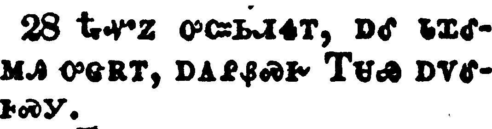</a></td>
</tr>
<tr class="even">
<td>Was returning, and sitting in his chariot read Esaias the prophet.</td>
</tr>
<tr class="odd">
<td>ᎿᎭᏉᏃ ᎤᏨᏏᏗᏎᎢ, ᎠᎴ ᏓᏆᎴᎷᎯ ᎤᏣᎡᎢ, ᎠᎪᎵᏰᏍᎨ ᎢᏌᏯ ᎠᏙᎴᎰᏍᎩ.</td>
</tr>
<tr class="even">
<td>Hna-quo-no u-tsv-si-di-se-i, a-le da-qua-le-lu-hi u-tsa-e-i, a-go-li-ye-s-ge I-sa-ya a-do-le-ho-s-gi.</td>
</tr>
</tbody>
</table>

<table>
<tbody>
<tr class="odd">
<td><a href="050829.png">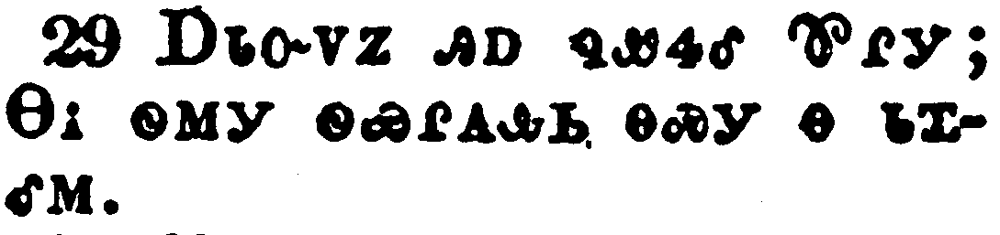</a></td>
</tr>
<tr class="even">
<td>Then the Spirit said unto Philip, Go near, and join thyself to this chariot.</td>
</tr>
<tr class="odd">
<td>ᎠᏓᏅᏙᏃ ᎯᎠ ᏄᏪᏎᎴ ᏈᎵᎩ; ᎾᎥ ᏫᎷᎩ ᏫᏯᎵᎪᎲᏏ ᎾᏍᎩ Ꮎ ᏓᏆᎴᎷ.</td>
</tr>
<tr class="even">
<td>A-da-nv-do-no hi-a nu-we-se-le Qui-li-gi; Na-v wi-lu-gi wi-ya-li-go-hv-si na-s-gi na da-qua-le-lu.</td>
</tr>
</tbody>
</table>

<table>
<tbody>
<tr class="odd">
<td></td>
</tr>
<tr class="even">
<td>And Philip ran thither to him, and heard him read the prophet Esaias, and said, Understandest thou what thou readest?</td>
</tr>
<tr class="odd">
<td>ᏈᎵᎩᏃ ᎾᎿᎭᏭᏗᏠᎸ ᎤᏛᎦᏁ ᎠᏙᎴᎰᏍᎩ ᎢᏌᏯ ᎠᎪᎵᏰᏍᎬᎢ, ᎯᎠᏃ ᏄᏪᏎᎢ; ᎰᎵᎦᎨᎵ ᎾᏍᎩ ᏥᎪᎵᏰᎭ?</td>
</tr>
<tr class="even">
<td>Qui-li-gi-no na-hna wu-di-tlo-lv u-dv-ga-ne a-do-le-ho-s-gi I-sa-ya a-go-li-ye-s-gv-i, hi-a-no nu-we-se-i; Ho-li-ga-ge-li na-s-gi tsi-go-li-ye-ha?</td>
</tr>
</tbody>
</table>

<table>
<tbody>
<tr class="odd">
<td><a href="050831.png">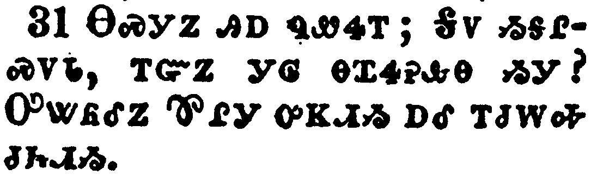</a></td>
</tr>
<tr class="even">
<td>And he said, How can I, except some man should guide me? And he desired Philip that he would come up and sit with him.</td>
</tr>
<tr class="odd">
<td>ᎾᏍᎩᏃ ᎯᎠ ᏄᏪᏎᎢ; ᎦᏙ ᏱᎦᎵᏍᏙᏓ, ᎢᏳᏃ ᎩᎶ ᎾᏆᏎᎮᎲᎾ ᏱᎩ? ᎤᏔᏲᎴᏃ ᏈᎵᎩ ᎤᏦᏗᏱ ᎠᎴ ᎢᏧᎳᎭ ᏧᏂᏗᏱ.</td>
</tr>
<tr class="even">
<td>Na-s-gi-no hi-a nu-we-se-i; Ga-do yi-ga-li-s-do-da, i-yu-no gi-lo na-qua-se-he-hv-na yi-gi? U-ta-yo-le-no Qui-li-gi u-tso-di-yi a-le i-tsu-la-ha tsu-ni-di-yi.</td>
</tr>
</tbody>
</table>

<table>
<tbody>
<tr class="odd">
<td><a href="050832.png">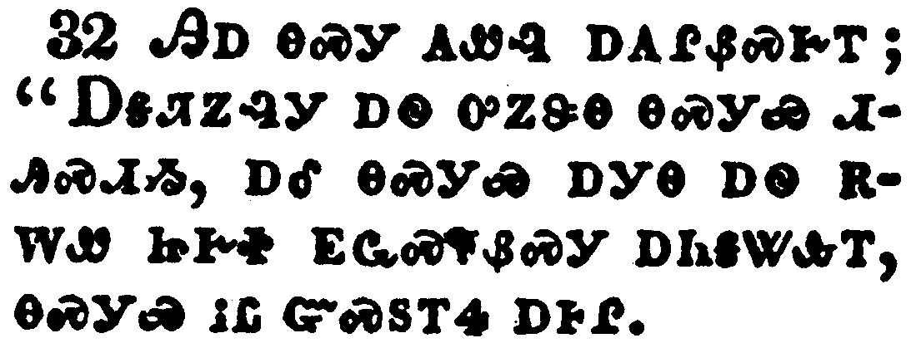</a></td>
</tr>
<tr class="even">
<td>The place of the scripture which he read was this, He was led as a sheep to the slaughter; and like a lamb dumb before his shearer, so opened he not his mouth:</td>
</tr>
<tr class="odd">
<td>ᎯᎠ ᎾᏍᎩ ᎪᏪᎸ ᎠᎪᎵᏰᏍᎨᎢ; "ᎠᎦᏘᏃᎸᎩ ᎠᏫ ᎤᏃᏕᎾ ᎾᏍᎩᏯ ᏗᎯᏍᏗᏱ, ᎠᎴ ᎾᏍᎩᏯ ᎠᎩᎾ ᎠᏫ ᎡᎳᏪ ᏥᎨᏐ ᎬᏩᏍᏰᏍᎩ ᎠᏂᎦᏔᎲᎢ, ᎾᏍᎩᏯ ᎥᏝ ᏳᏍᏚᎢᏎ ᎠᎰᎵ.</td>
</tr>
<tr class="even">
<td>Hi-a na-s-gi go-we-lv a-go-li-ye-s-ge-i; "A-ga-ti-no-lv-gi a-wi u-no-de-na na-s-gi-ya di-hi-s-di-yi, a-le na-s-gi-ya a-gi-na a-wi e-la-we tsi-ge-so gv-wa-s-ye-s-gi a-ni-ga-ta-hv-i, na-s-gi-ya v-tla yu-s-du-i-se a-ho-li.</td>
</tr>
</tbody>
</table>

<table>
<tbody>
<tr class="odd">
<td></td>
</tr>
<tr class="even">
<td>In his humiliation his judgment was taken away: and who shall declare his generation? for his life is taken from the earth.</td>
</tr>
<tr class="odd">
<td>ᎤᏲ ᏄᏛᎿᎭᏕᎬᎢ ᎠᏥᎩᎡᎸᎩ ᎤᏤᎵ ᎨᏒ ᏚᏳᎪᏛᎢ; ᎠᎴ ᎦᎪ ᏙᏓᎧᏃᎮᎵ ᏴᏫ ᎾᎯᏳ ᏤᎮ ᎠᏁᎯ? ᎬᏅᏰᏃ ᎤᏂᎩᏒᎩ ᎡᎶᎯ."</td>
</tr>
<tr class="even">
<td>U-yo nu-dv-hna-de-gv-i a-tsi-gi-e-lv-gi u-tse-li ge-sv du-yu-go-dv-i; a-le ga-go do-da-ka-no-he-li yv-wi na-hi-yu tse-he a-ne-hi? gv-nv-ye-no u-ni-gi-sv-gi e-lo-hi."</td>
</tr>
</tbody>
</table>

<table>
<tbody>
<tr class="odd">
<td><a href="050834.png">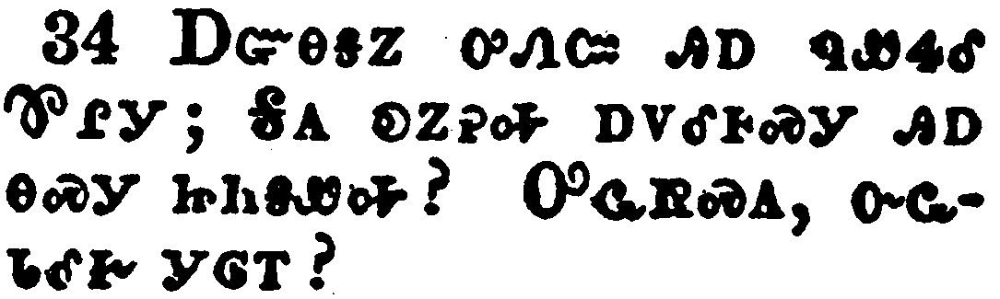</a></td>
</tr>
<tr class="even">
<td>And the eunuch answered Philip, and said, I pray thee, of whom speaketh the prophet this? of himself, or of some other man?</td>
</tr>
<tr class="odd">
<td>ᎠᏳᎾᎦᏃ ᎤᏁᏨ ᎯᎠ ᏄᏪᏎᎴ ᏈᎵᎩ; ᎦᎪ ᎧᏃᎮᎭ ᎠᏙᎴᎰᏍᎩ ᎯᎠ ᎾᏍᎩ ᏥᏂᎦᏪᏎ? ᎤᏩᏒᏍᎪ, ᏅᏩᏓᎴᎨ ᎩᎶᎢ?</td>
</tr>
<tr class="even">
<td>A-yu-na-ga-no u-ne-tsv hi-a nu-we-se-le Qui-li-gi; Ga-go ka-no-he-ha a-do-le-ho-s-gi hi-a na-s-gi tsi-ni-ga-we-se? U-wa-sv-s-go, nv-wa-da-le-ge gi-lo-i?</td>
</tr>
</tbody>
</table>

<table>
<tbody>
<tr class="odd">
<td><a href="050835.png">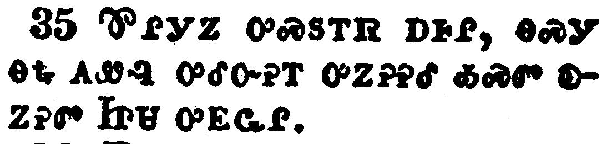</a></td>
</tr>
<tr class="even">
<td>Then Philip opened his mouth, and began at the same scripture, and preached unto him Jesus.</td>
</tr>
<tr class="odd">
<td>ᏈᎵᎩᏃ ᎤᏍᏚᎢᏒ ᎠᎰᎵ, ᎾᏍᎩ ᎾᎿᎭᎪᏪᎸ ᎤᎴᏅᎮᎢ ᎤᏃᎮᎮᎴ ᎣᏍᏛ ᎧᏃᎮᏛ ᏥᏌ ᎤᎬᏩᎵ.</td>
</tr>
<tr class="even">
<td>Qui-li-gi-no u-s-du-i-sv a-ho-li, na-s-gi na-hna go-we-lv u-le-nv-he-i u-no-he-he-le o-s-dv ka-no-he-dv Tsi-sa u-gv-wa-li.</td>
</tr>
</tbody>
</table>

<table>
<tbody>
<tr class="odd">
<td><a href="050836.png">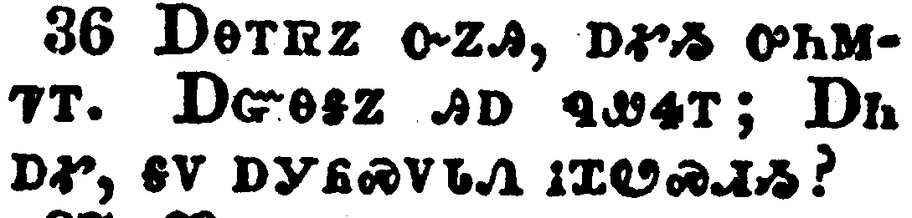</a></td>
</tr>
<tr class="even">
<td>And as they went on their way, they came unto a certain water: and the eunuch said, See, here is water; what doth hinder me to be baptized?</td>
</tr>
<tr class="odd">
<td>ᎠᎾᎢᏒᏃ ᏅᏃᎯ, ᎠᎹᏱ ᎤᏂᎷᏤᎢ. ᎠᏳᎾᎦᏃ ᎯᎠ ᏄᏪᏎᎢ; ᎠᏂ ᎠᎹ, ᎦᏙ ᎠᎩᏲᏍᏙᏓᏁ ᎥᏆᏬᏍᏗᏱ?</td>
</tr>
<tr class="even">
<td>A-na-i-sv-no nv-no-hi, a-ma-yi u-ni-lu-tse-i. A-yu-na-ga-no hi-a nu-we-se-i; A-ni a-ma, ga-do a-gi-yo-s-do-da-ne v-qua-wo-s-di-yi?</td>
</tr>
</tbody>
</table>

<table>
<tbody>
<tr class="odd">
<td><a href="050837.png">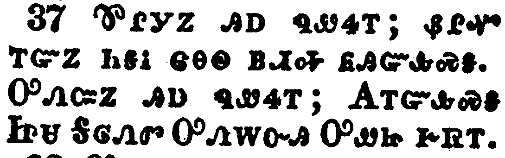</a></td>
</tr>
<tr class="even">
<td>And Philip said, If thou believest with all thine heart, thou mayest. And he answered and said, I believe that Jesus Christ is the Son of God.</td>
</tr>
<tr class="odd">
<td>ᏈᎵᎩᏃ ᎯᎠ ᏄᏪᏎᎢ; ᏰᎵᏉ ᎢᏳᏃ ᏂᎦᎥ ᏣᎾᏫ ᏴᏗᎭ ᏲᎯᏳᎲᏍᎦ. ᎤᏁᏨᏃ ᎯᎠ ᏄᏪᏎᎢ; ᎪᎢᏳᎲᏍᎦ ᏥᏌ ᎦᎶᏁᏛ ᎤᏁᎳᏅᎯ ᎤᏪᏥ ᎨᏒᎢ.</td>
</tr>
<tr class="even">
<td>Qui-li-gi-no hi-a nu-we-se-i; ye-li-quo i-yu-no ni-ga-v tsa-na-wi yv-di-ha yo-hi-yu-hv-s-ga. U-ne-tsv-no hi-a nu-we-se-i; Go-i-yu-hv-s-ga Tsi-sa Ga-lo-ne-dv U-ne-la-nv-hi U-we-tsi ge-sv-i.</td>
</tr>
</tbody>
</table>

<table>
<tbody>
<tr class="odd">
<td><a href="050838.png">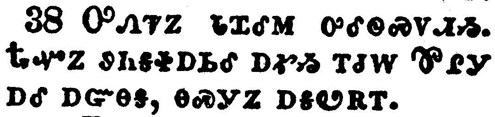</a></td>
</tr>
<tr class="even">
<td>And he commanded the chariot to stand still: and they went down both into the water, both Philip and the eunuch; and he baptized him.</td>
</tr>
<tr class="odd">
<td>ᎤᏁᏤᏃ ᏓᏆᎴᎷ ᎤᎴᏫᏍᏙᏗᏱ. ᎿᎭᏉᏃ ᏭᏂᎦᏐᎠᏏᎴ ᎠᎹᏱ ᎢᏧᎳ ᏈᎵᎩ ᎠᎴ ᎠᏳᎾᎦ, ᎾᏍᎩᏃ ᎠᎦᏬᎡᎢ.</td>
</tr>
<tr class="even">
<td>U-ne-tse-no da-qua-le-lu u-le-wi-s-do-di-yi. Hna-quo-no wu-ni-ga-so-a-si-le a-ma-yi i-tsu-la Qui-li-gi a-le a-yu-na-ga, na-s-gi-no a-ga-wo-e-i.</td>
</tr>
</tbody>
</table>

<table>
<tbody>
<tr class="odd">
<td><a href="050839.png">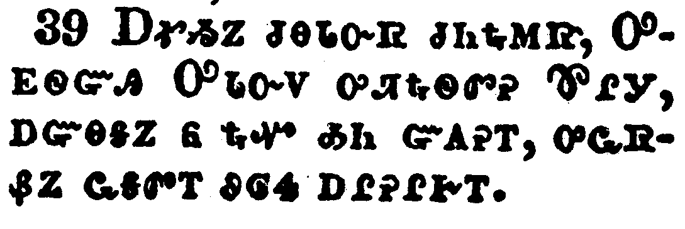</a></td>
</tr>
<tr class="even">
<td>And when they were come up out of the water, the Spirit of the Lord caught away Philip, that the eunuch saw him no more: and he went on his way rejoicing.</td>
</tr>
<tr class="odd">
<td>ᎠᎹᏱᏃ ᏧᎾᏓᏅᏒ ᏧᏂᎿᎭᎷᏒ, ᎤᎬᏫᏳᎯ ᎤᏓᏅᏙ ᎤᏘᎿᎭᏫᏛᎮ ᏈᎵᎩ, ᎠᏳᎾᎦᏃ Ᏺ ᎿᎭᏉ ᎣᏂ ᏳᎪᎮᎢ, ᎤᏩᏒᏰᏃ ᏩᎦᏛᎢ ᏭᎶᏎ ᎠᎵᎮᎵᎨᎢ.</td>
</tr>
<tr class="even">
<td>A-ma-yi-no tsu-na-da-nv-sv tsu-ni-hna-lu-sv, U-gv-wi-yu-hi U-da-nv-do u-ti-hna-wi-dv-he Qui-li-gi, a-yu-na-ga-no yo hna-quo o-ni yu-go-he-i, u-wa-sv-ye-no wa-ga-dv-i wu-lo-se a-li-he-li-ge-i.</td>
</tr>
</tbody>
</table>

<table>
<tbody>
<tr class="odd">
<td><a href="050840.png">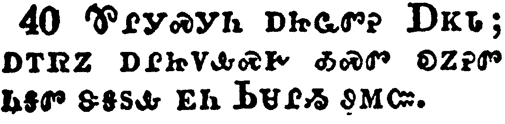</a></td>
</tr>
<tr class="even">
<td>But Philip was found at Azotus: and passing through he preached in all the cities, till he came to Caesarea.</td>
</tr>
<tr class="odd">
<td>ᏈᎵᎩᏍᎩᏂ ᎠᏥᏩᏛᎮ ᎠᏦᏓ; ᎠᎢᏒᏃ ᎠᎵᏥᏙᎲᏍᎨ ᎣᏍᏛ ᎧᏃᎮᏛ ᏂᎦᏛ ᏕᎦᏚᎲ ᎬᏂ ᏏᏌᎵᏱ ᏭᎷᏨ.</td>
</tr>
<tr class="even">
<td>Qui-li-gi-s-gi-ni a-tsi-wa-dv-he A-tso-da; a-i-sv-no a-li-tsi-do-hv-s-ge o-s-dv ka-no-he-dv ni-ga-dv de-ga-du-hv gv-ni Si-sa-li-yi wu-lu-tsv.</td>
</tr>
</tbody>
</table>

