+++
draft=false
date = 2014-12-18T21:11:07Z
title = "Titus - Chapter 3 - Cherokee New Testament"
weight = 1418955067

[taxonomies]

authors = ["Timothy Legg"]
categories = []
tags = []

[extra]
+++

<table>
<tbody>
<tr class="odd">
<td><a href="170301.png">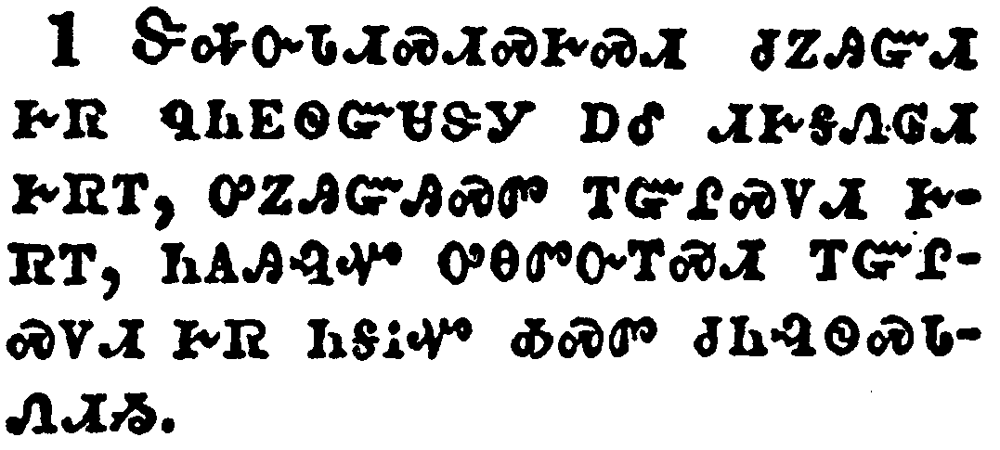</a></td>
</tr>
<tr class="even">
<td>Put them in mind to be subject to principalities and powers, to obey magistrates, to be ready to every good work,</td>
</tr>
<tr class="odd">
<td>ᏕᎭᏅᏓᏗᏍᏗᏍᎨᏍᏗ ᏧᏃᎯᏳᏗ ᎨᏒ ᏄᏂᎬᏫᏳᏌᏕᎩ ᎠᎴ ᏗᎨᎦᏁᎶᏗ ᎨᏒᎢ, ᎤᏃᎯᏳᎯᏍᏛ ᎢᏳᎵᏍᏙᏗ ᎨᏒᎢ, ᏂᎪᎯᎸᏉ ᎤᎾᏛᏅᎢᏍᏗ ᎢᏳᎵᏍᏙᏗ ᎨᏒ ᏂᎦᎥᏉ ᎣᏍᏛ ᏧᏂᎸᏫᏍᏓᏁᏗᏱ.</td>
</tr>
<tr class="even">
<td>De-ha-nv-da-di-s-di-s-ge-s-di tsu-no-hi-yu-di ge-sv nu-ni-gv-wi-yu-sa-de-gi a-le di-ge-ga-ne-lo-di ge-sv-i, u-no-hi-yu-hi-s-dv i-yu-li-s-do-di ge-sv-i, ni-go-hi-lv-quo u-na-dv-nv-i-s-di i-yu-li-s-do-di ge-sv ni-ga-v-quo o-s-dv tsu-ni-lv-wi-s-da-ne-di-yi.</td>
</tr>
</tbody>
</table>

<table>
<tbody>
<tr class="odd">
<td><a href="170302.png">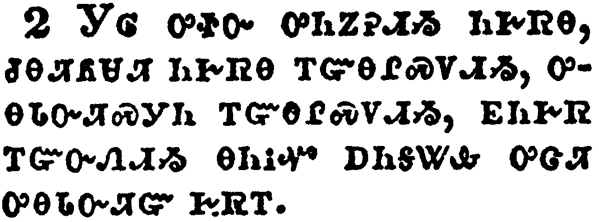</a></td>
</tr>
<tr class="even">
<td>To speak evil of no man, to be no brawlers, but gentle, shewing all meekness unto all men.</td>
</tr>
<tr class="odd">
<td>ᎩᎶ ᎤᏐᏅ ᎤᏂᏃᎮᏗᏱ ᏂᎨᏒᎾ, ᏧᎾᏘᏲᏌᏘ ᏂᎨᏒᎾ ᎢᏳᎾᎵᏍᏙᏗᏱ, ᎤᎾᏓᏅᏘᏍᎩᏂ ᎢᏳᎾᎵᏍᏙᏗᏱ, ᎬᏂᎨᏒ ᎢᏳᏅᏁᏗᏱ ᎾᏂᎥᏉ ᎠᏂᎦᏔᎲ ᎤᏣᏘ ᎤᎾᏓᏅᏘᏳ ᎨᏒᎢ.</td>
</tr>
<tr class="even">
<td>Gi-lo u-so-nv u-ni-no-he-di-yi ni-ge-sv-na, tsu-na-ti-yo-sa-ti ni-ge-sv-na i-yu-na-li-s-do-di-yi, u-na-da-nv-ti-s-gi-ni i-yu-na-li-s-do-di-yi, gv-ni-ge-sv i-yu-nv-ne-di-yi na-ni-v-quo a-ni-ga-ta-hv u-tsa-ti u-na-da-nv-ti-yu ge-sv-i.</td>
</tr>
</tbody>
</table>

<table>
<tbody>
<tr class="odd">
<td><a href="170303.png">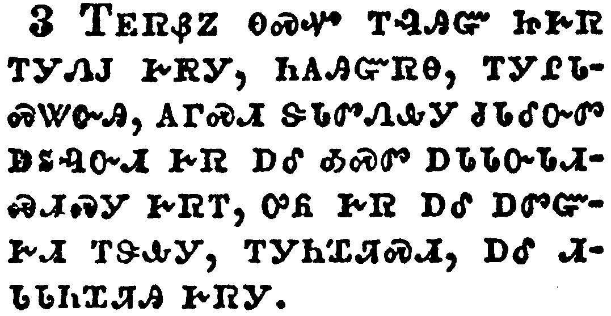</a></td>
</tr>
<tr class="even">
<td>For we ourselves also were sometimes foolish, disobedient, deceived, serving divers lusts and pleasures, living in malice and envy, hateful, and hating one another.</td>
</tr>
<tr class="odd">
<td>ᎢᎬᏒᏰᏃ ᎾᏍᏉ ᎢᎸᎯᏳ ᏥᎨᏒ ᎢᎩᏁᎫ ᎨᏒᎩ, ᏂᎪᎯᏳᏒᎾ, ᎢᎩᎵᏓᏍᏔᏅᎯ, ᎪᎱᏍᏗ ᏕᏓᏛᏁᎲᎩ ᏧᏓᎴᏅᏛ ᎠᏚᎸᏅᏗ ᎨᏒ ᎠᎴ ᎣᏍᏛ ᎠᏓᏓᏅᏓᏗᏍᏗᏍᎩ ᎨᏒᎢ, ᎤᏲ ᎨᏒ ᎠᎴ ᎠᏛᏳᎨᏗ ᎢᏕᎲᎩ, ᎢᎩᏂᏆᏘᏍᏗ, ᎠᎴ ᏗᏓᏓᏂᏆᏘᎯ ᎨᏒᎩ.</td>
</tr>
<tr class="even">
<td>I-gv-sv-ye-no na-s-quo i-lv-hi-yu tsi-ge-sv i-gi-ne-gu ge-sv-gi, ni-go-hi-yu-sv-na, i-gi-li-da-s-ta-nv-hi, go-hu-s-di de-da-dv-ne-hv-gi tsu-da-le-nv-dv a-du-lv-nv-di ge-sv a-le o-s-dv a-da-da-nv-da-di-s-di-s-gi ge-sv-i, u-yo ge-sv a-le a-dv-yu-ge-di i-de-hv-gi, i-gi-ni-qua-ti-s-di, a-le di-da-da-ni-qua-ti-hi ge-sv-gi.</td>
</tr>
</tbody>
</table>

<table>
<tbody>
<tr class="odd">
<td><a href="170304.png">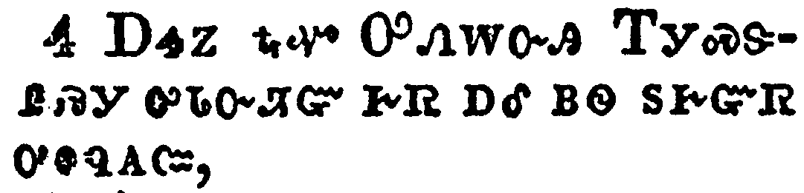</a></td>
</tr>
<tr class="even">
<td>But after that the kindness and love of God our Saviour toward man appeared,</td>
</tr>
<tr class="odd">
<td>ᎠᏎᏃ ᎿᎭᏉ ᎤᏁᎳᏅᎯ ᎢᎩᏍᏕᎵᏍᎩ ᎤᏓᏅᏘᏳ ᎨᏒ ᎠᎴ ᏴᏫ ᏚᎨᏳᏒ ᎤᎦᏄᎪᏨ,</td>
</tr>
<tr class="even">
<td>A-se-no hna-quo U-ne-la-nv-hi I-gi-s-de-li-s-gi u-da-nv-ti-yu ge-sv a-le yv-wi du-ge-yu-sv u-ga-nu-go-tsv,</td>
</tr>
</tbody>
</table>

<table>
<tbody>
<tr class="odd">
<td><a href="170305.png">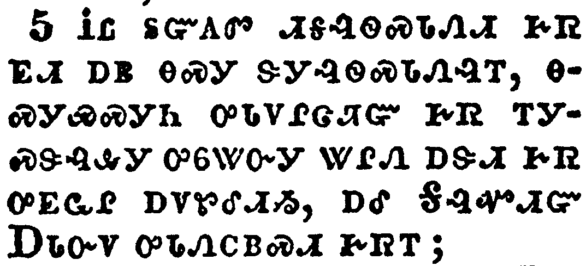</a></td>
</tr>
<tr class="even">
<td>Not by works of righteousness which we have done, but according to his mercy he saved us, by the washing of regeneration, and renewing of the Holy Ghost;</td>
</tr>
<tr class="odd">
<td>ᎥᏝ ᏚᏳᎪᏛ ᏗᎦᎸᏫᏍᏓᏁᏗ ᎨᏒ ᎬᏗ ᎠᏴ ᎾᏍᎩ ᏕᎩᎸᏫᏍᏓᏁᎸᎢ, ᎾᏍᎩᏯᏍᎩᏂ ᎤᏓᏙᎵᏣᏘᏳ ᎨᏒ ᎢᎩᏍᏕᎸᎲᎩ ᎤᏮᏔᏅᎩ ᏔᎵᏁ ᎠᏕᏗ ᎨᏒ ᎤᎬᏩᎵ ᎠᏙᏑᎴᏗᏱ, ᎠᎴ ᎦᎸᏉᏗᏳ ᎠᏓᏅᏙ ᎤᏓᏁᏟᏴᏍᏗ ᎨᏒᎢ;</td>
</tr>
<tr class="even">
<td>V-tla du-yu-go-dv di-ga-lv-wi-s-da-ne-di ge-sv gv-di a-yv na-s-gi de-gi-lv-wi-s-da-ne-lv-i, na-s-gi-ya-s-gi-ni u-da-do-li-tsa-ti-yu ge-sv i-gi-s-de-lv-hv-gi u-wv-ta-nv-gi ta-li-ne a-de-di ge-sv u-gv-wa-li a-do-su-le-di-yi, a-le Ga-lv-quo-di-yu A-da-nv-do u-da-ne-tli-yv-s-di ge-sv-i;</td>
</tr>
</tbody>
</table>

<table>
<tbody>
<tr class="odd">
<td><a href="170306.png">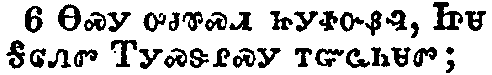</a></td>
</tr>
<tr class="even">
<td>Which he shed on us abundantly through Jesus Christ our Saviour;</td>
</tr>
<tr class="odd">
<td>ᎾᏍᎩ ᎤᏧᏈᏍᏗ ᏥᎩᏐᏅᏰᎵ, ᏥᏌ ᎦᎶᏁᏛ ᎢᎩᏍᏕᎵᏍᎩ ᎢᏳᏩᏂᏌᏛ;</td>
</tr>
<tr class="even">
<td>Na-s-gi u-tsu-qui-s-di tsi-gi-so-nv-ye-li, Tsi-sa Ga-lo-ne-dv I-gi-s-de-li-s-gi i-yu-wa-ni-sa-dv;</td>
</tr>
</tbody>
</table>

<table>
<tbody>
<tr class="odd">
<td><a href="170307.png">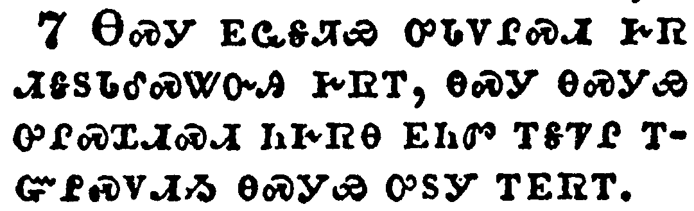</a></td>
</tr>
<tr class="even">
<td>That being justified by his grace, we should be made heirs according to the hope of eternal life.</td>
</tr>
<tr class="odd">
<td>ᎾᏍᎩ ᎬᏩᎦᏘᏯ ᎤᏓᏙᎵᏍᏗ ᎨᏒ ᏗᎦᏚᏓᎴᏍᏔᏅᎯ ᎨᏒᎢ, ᎾᏍᎩ ᎾᏍᎩᏯ ᎤᎵᏍᏆᏗᏍᏗ ᏂᎨᏒᎾ ᎬᏂᏛ ᎢᎦᏤᎵ ᎢᏳᎵᏍᏙᏗᏱ ᎾᏍᎩᏯ ᎤᏚᎩ ᎢᎬᏒᎢ.</td>
</tr>
<tr class="even">
<td>Na-s-gi gv-wa-ga-ti-ya u-da-do-li-s-di ge-sv di-ga-du-da-le-s-ta-nv-hi ge-sv-i, na-s-gi na-s-gi-ya u-li-s-qua-di-s-di ni-ge-sv-na gv-ni-dv i-ga-tse-li i-yu-li-s-do-di-yi na-s-gi-ya u-du-gi i-gv-sv-i.</td>
</tr>
</tbody>
</table>

<table>
<tbody>
<tr class="odd">
<td><a href="170308.png">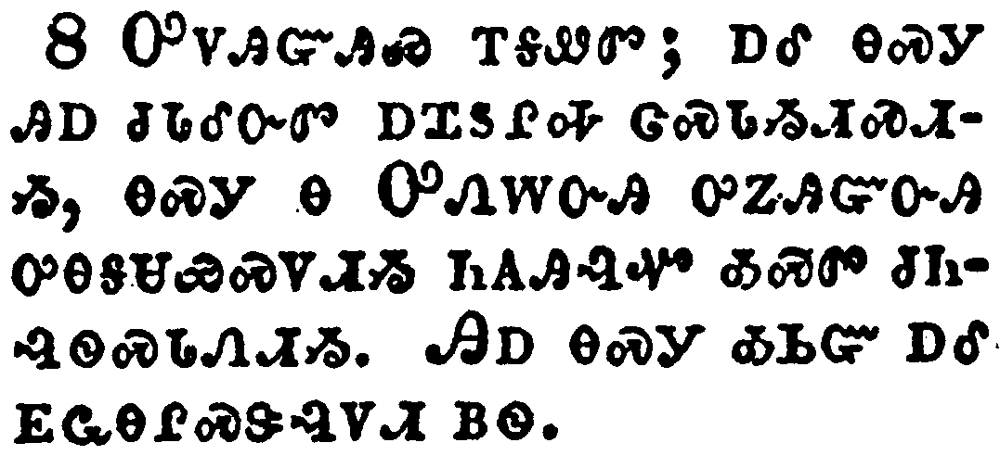</a></td>
</tr>
<tr class="even">
<td>This is a faithful saying, and these things I will that thou affirm constantly, that they which have believed in God might be careful to maintain good works. These things are good and profitable unto men.</td>
</tr>
<tr class="odd">
<td>ᎤᏙᎯᏳᎯᏯ ᎢᎦᏪᏛ; ᎠᎴ ᎾᏍᎩ ᎯᎠ ᏧᏓᎴᏅᏛ ᎠᏆᏚᎵᎭ ᏣᏍᏓᏱᏗᏍᏗᏱ, ᎾᏍᎩ Ꮎ ᎤᏁᎳᏅᎯ ᎤᏃᎯᏳᏅᎯ ᎤᎾᎦᏌᏯᏍᏙᏗᏱ ᏂᎪᎯᎸᏉ ᎣᏍᏛ ᏧᏂᎸᏫᏍᏓᏁᏗᏱ. ᎯᎠ ᎾᏍᎩ ᎣᏏᏳ ᎠᎴ ᎬᏩᎾᎵᏍᏕᎸᏙᏗ ᏴᏫ.</td>
</tr>
<tr class="even">
<td>U-do-hi-yu-hi-ya i-ga-we-dv; a-le na-s-gi hi-a tsu-da-le-nv-dv a-qua-du-li-ha tsa-s-da-yi-di-s-di-yi, na-s-gi na U-ne-la-nv-hi u-no-hi-yu-nv-hi u-na-ga-sa-ya-s-do-di-yi ni-go-hi-lv-quo o-s-dv tsu-ni-lv-wi-s-da-ne-di-yi. Hi-a na-s-gi o-si-yu a-le gv-wa-na-li-s-de-lv-do-di yv-wi.</td>
</tr>
</tbody>
</table>

<table>
<tbody>
<tr class="odd">
<td><a href="170309.png">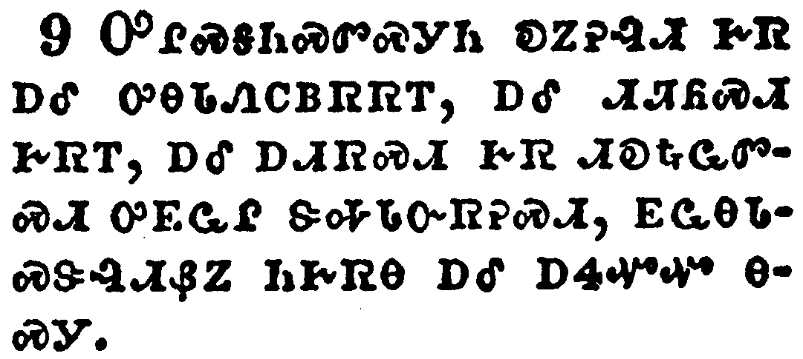</a></td>
</tr>
<tr class="even">
<td>But avoid foolish questions, and genealogies, and contentions, and strivings about the law; for they are unprofitable and vain.</td>
</tr>
<tr class="odd">
<td>ᎤᎵᏍᎦᏂᏍᏛᏍᎩᏂ ᎧᏃᎮᎸᏗ ᎨᏒ ᎠᎴ ᎤᎾᏓᏁᏟᏴᏒᏒᎢ, ᎠᎴ ᏗᏘᏲᏍᏗ ᎨᏒᎢ, ᎠᎴ ᎠᏗᏒᏍᏗ ᎨᏒ ᏗᎧᎿᎭᏩᏛᏍᏗ ᎤᎬᏩᎵ ᏕᎭᏓᏅᏒᎮᏍᏗ, ᎬᏩᎾᏓᏍᏕᎸᏗᏰᏃ ᏂᎨᏒᎾ ᎠᎴ ᎠᏎᏉᏉ ᎾᏍᎩ.</td>
</tr>
<tr class="even">
<td>U-li-s-ga-ni-s-dv-s-gi-ni ka-no-he-lv-di ge-sv a-le u-na-da-ne-tli-yv-sv-sv-i, a-le di-ti-yo-s-di ge-sv-i, a-le a-di-sv-s-di ge-sv di-ka-hna-wa-dv-s-di u-gv-wa-li de-ha-da-nv-sv-he-s-di, gv-wa-na-da-s-de-lv-di-ye-no ni-ge-sv-na a-le a-se-quo-quo na-s-gi.</td>
</tr>
</tbody>
</table>

<table>
<tbody>
<tr class="odd">
<td><a href="170310.png">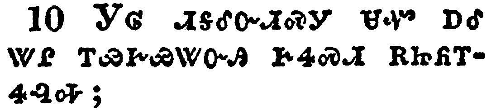</a></td>
</tr>
<tr class="even">
<td>A man that is an heretick after the first and second admonition reject;</td>
</tr>
<tr class="odd">
<td>ᎩᎶ ᏗᎦᎴᏅᏗᏍᎩ ᏌᏉ ᎠᎴ ᏔᎵ ᎢᏯᎨᏯᏔᏅᎯ ᎨᏎᏍᏗ ᎡᏥᏲᎢᏎᎸᎭ;</td>
</tr>
<tr class="even">
<td>Gi-lo di-ga-le-nv-di-s-gi sa-quo a-le ta-li i-ya-ge-ya-ta-nv-hi ge-se-s-di e-tsi-yo-i-se-lv-ha;</td>
</tr>
</tbody>
</table>

<table>
<tbody>
<tr class="odd">
<td><a href="170311.png">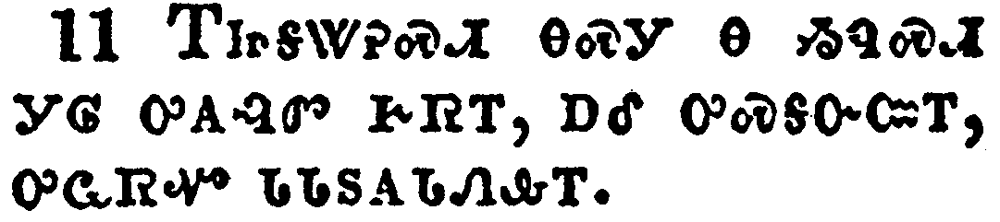</a></td>
</tr>
<tr class="even">
<td>Knowing that he that is such is subverted, and sinneth, being condemned of himself.</td>
</tr>
<tr class="odd">
<td>ᎢᏥᎦᏔᎮᏍᏗ ᎾᏍᎩ Ꮎ ᏱᏄᏍᏗ ᎩᎶ ᎤᎪᎸᏛ ᎨᏒᎢ, ᎠᎴ ᎤᏍᎦᏅᏨᎢ, ᎤᏩᏒᏉ ᏓᏓᏚᎪᏓᏁᎲᎢ.</td>
</tr>
<tr class="even">
<td>I-tsi-ga-ta-he-s-di na-s-gi na yi-nu-s-di gi-lo u-go-lv-dv ge-sv-i, a-le u-s-ga-nv-tsv-i, u-wa-sv-quo da-da-du-go-da-ne-hv-i.</td>
</tr>
</tbody>
</table>

<table>
<tbody>
<tr class="odd">
<td><a href="170312.png">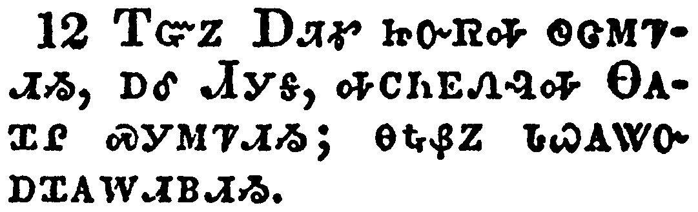</a></td>
</tr>
<tr class="even">
<td>When I shall send Artemas unto thee, or Tychicus, be diligent to come unto me to Nicopolis: for I have determined there to winter.</td>
</tr>
<tr class="odd">
<td>ᎢᏳᏃ ᎠᏘᎹ ᏥᏅᏒᎭ ᏫᏣᎷᏤᏗᏱ, ᎠᎴ ᏗᎩᎦ, ᎭᏟᏂᎬᏁᎸᎭ ᎾᎪᏆᎵ ᏍᎩᎷᏤᏗᏱ; ᎾᎿᎭᏰᏃ ᏓᏇᎪᏔᏅ ᎠᏆᎪᎳᏗᏴᏗᏱ.</td>
</tr>
<tr class="even">
<td>I-yu-no A-ti-ma tsi-nv-sv-ha wi-tsa-lu-tse-di-yi, a-le Di-gi-ga, ha-tli-ni-gv-ne-lv-ha Na-go-qua-li s-gi-lu-tse-di-yi; na-hna-ye-no da-que-go-ta-nv a-qua-go-la-di-yv-di-yi.</td>
</tr>
</tbody>
</table>

<table>
<tbody>
<tr class="odd">
<td><a href="170313.png">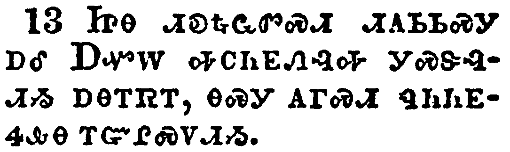</a></td>
</tr>
<tr class="even">
<td>Bring Zenas the lawyer and Apollos on their journey diligently, that nothing be wanting unto them.</td>
</tr>
<tr class="odd">
<td>ᏥᎾ ᏗᎧᎿᎭᏩᏛᏍᏗ ᏗᎪᏏᏏᏍᎩ ᎠᎴ ᎠᏉᎳ ᎭᏟᏂᎬᏁᎸᎭ ᎩᏍᏕᎸᏗᏱ ᎠᎾᎢᏒᎢ, ᎾᏍᎩ ᎪᎱᏍᏗ ᏄᏂᏂᎬᏎᎲᎾ ᎢᏳᎵᏍᏙᏗᏱ.</td>
</tr>
<tr class="even">
<td>Tsi-na di-ka-hna-wa-dv-s-di di-go-si-si-s-gi a-le A-quo-la ha-tli-ni-gv-ne-lv-ha Gi-s-de-lv-di-yi a-na-i-sv-i, na-s-gi go-hu-s-di nu-ni-ni-gv-se-hv-na i-yu-li-s-do-di-yi.</td>
</tr>
</tbody>
</table>

<table>
<tbody>
<tr class="odd">
<td><a href="170314.png">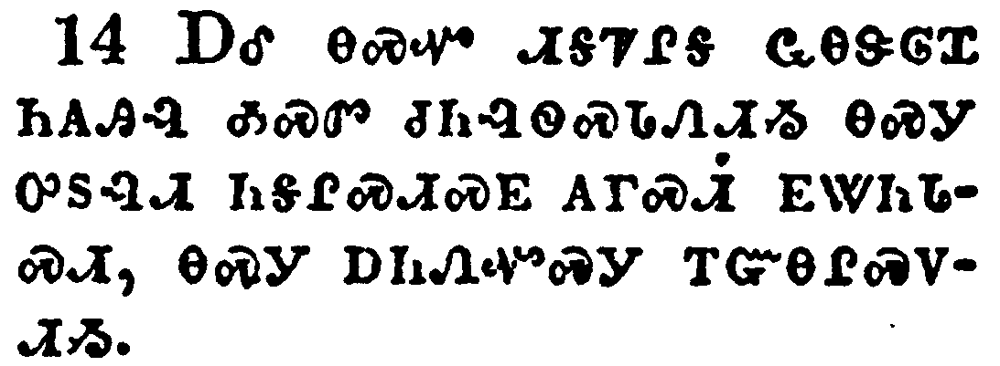</a></td>
</tr>
<tr class="even">
<td>And let ours also learn to maintain good works for necessary uses, that they be not unfruitful.</td>
</tr>
<tr class="odd">
<td>ᎠᎴ ᎾᏍᏉ ᏗᎦᏤᎵᎦ ᏩᎾᏕᎶᏆ ᏂᎪᎯᎸ ᎣᏍᏛ ᏧᏂᎸᏫᏍᏓᏁᏗᏱ ᎾᏍᎩ ᎤᏚᎸᏗ ᏂᎦᎵᏍᏗᏍᎬ ᎪᎱᏍᏗ ᎬᏔᏂᏓᏍᏗ, ᎾᏍᎩ ᎠᏂᏁᏉᏍᎩ ᎢᏳᎾᎵᏍᏙᏗᏱ.</td>
</tr>
<tr class="even">
<td>A-le na-s-quo di-ga-tse-li-ga wa-na-de-lo-qua ni-go-hi-lv o-s-dv tsu-ni-lv-wi-s-da-ne-di-yi na-s-gi u-du-lv-di ni-ga-li-s-di-s-gv go-hu-s-di gv-ta-ni-da-s-di, na-s-gi a-ni-ne-quo-s-gi i-yu-na-li-s-do-di-yi.</td>
</tr>
</tbody>
</table>

<table>
<tbody>
<tr class="odd">
<td><a href="170315.png">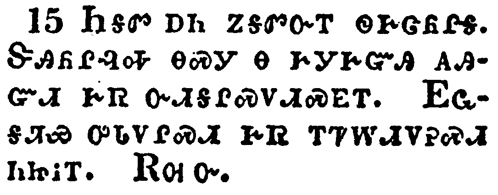</a></td>
</tr>
<tr class="even">
<td>All that are with me salute thee. Greet them that love us in the faith. Grace be with you all. Amen.</td>
</tr>
<tr class="odd">
<td>ᏂᎦᏛ ᎠᏂ ᏃᎦᏛᏅᎢ ᏫᎨᏣᏲᎵᎦ. ᏕᎯᏲᎵᎸᎭ ᎾᏍᎩ Ꮎ ᎨᎩᎨᏳᎯ ᎪᎯᏳᏗ ᎨᏒ ᏅᏗᎦᎵᏍᏙᏗᏍᎬᎢ. ᎬᏩᎦᏘᏯ ᎤᏓᏙᎵᏍᏗ ᎨᏒ ᎢᏤᎳᏗᏙᎮᏍᏗ ᏂᏥᎥᎢ. ᎡᎺᏅ.</td>
</tr>
<tr class="even">
<td>Ni-ga-dv a-ni no-ga-dv-nv-i wi-ge-tsa-yo-li-ga. De-hi-yo-li-lv-ha na-s-gi na ge-gi-ge-yu-hi go-hi-yu-di ge-sv nv-di-ga-li-s-do-di-s-gv-i. Gv-wa-ga-ti-ya u-da-do-li-s-di ge-sv i-tse-la-di-do-he-s-di ni-tsi-v-i. E-me-nv.</td>
</tr>
</tbody>
</table>

