+++
draft=false
date = 2014-12-18T21:11:07Z
title = "1 Corinthians - Chapter 4 - Cherokee New Testament"
weight = 1418955067

[taxonomies]

authors = ["Timothy Legg"]
categories = []
tags = []

[extra]
+++

<table>
<tbody>
<tr class="odd">
<td><a href="070401.png">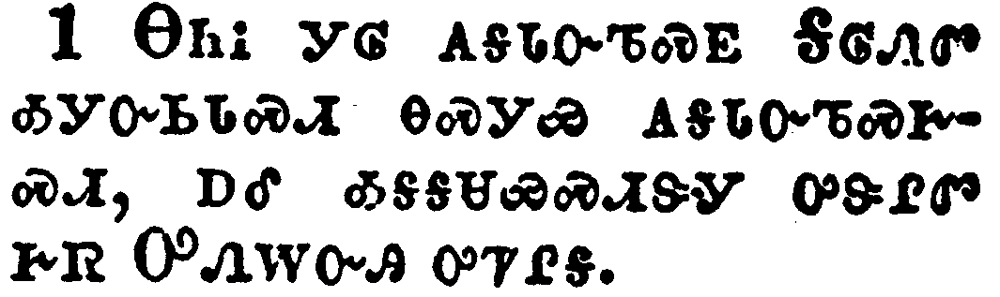</a></td>
</tr>
<tr class="even">
<td>Let a man so account of us, as of the ministers of Christ, and stewards of the mysteries of God.</td>
</tr>
<tr class="odd">
<td>ᎾᏂᎥ ᎩᎶ ᎪᎦᏓᏅᏖᏍᎬ ᎦᎶᏁᏛ ᎣᎩᏅᏏᏓᏍᏗ ᎾᏍᎩᏯ ᎪᎦᏓᏅᏖᏍᎨᏍᏗ, ᎠᎴ ᎣᎦᎦᏌᏯᏍᏗᏕᎩ ᎤᏕᎵᏛ ᎨᏒ ᎤᏁᎳᏅᎯ ᎤᏤᎵᎦ.</td>
</tr>
<tr class="even">
<td>Na-ni-v gi-lo go-ga-da-nv-te-s-gv Ga-lo-ne-dv o-gi-nv-si-da-s-di na-s-gi-ya go-ga-da-nv-te-s-ge-s-di, a-le o-ga-ga-sa-ya-s-di-de-gi u-de-li-dv ge-sv U-ne-la-nv-hi u-tse-li-ga.</td>
</tr>
</tbody>
</table>

<table>
<tbody>
<tr class="odd">
<td></td>
</tr>
<tr class="even">
<td>Moreover it is required in stewards, that a man be found faithful.</td>
</tr>
<tr class="odd">
<td>ᎠᎴ ᎾᏍᏉ ᎤᎾᎦᏌᏯᏍᏗᏕᎩ ᎤᏚᎩ ᎨᎬᏐ ᏚᏳᎪᏛ ᎢᏳᎾᏛᏁᏗᏱ.</td>
</tr>
<tr class="even">
<td>A-le na-s-quo u-na-ga-sa-ya-s-di-de-gi u-du-gi ge-gv-so du-yu-go-dv i-yu-na-dv-ne-di-yi.</td>
</tr>
</tbody>
</table>

<table>
<tbody>
<tr class="odd">
<td><a href="070403.png">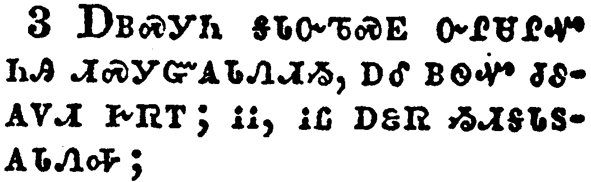</a></td>
</tr>
<tr class="even">
<td>But with me it is a very small thing that I should be judged of you, or of man's judgment: yea, I judge not mine own self.</td>
</tr>
<tr class="odd">
<td>ᎠᏴᏍᎩᏂ ᎦᏓᏅᏖᏍᎬ ᏅᎵᏌᎵᏉ ᏂᎯ ᏗᏍᎩᏳᎪᏓᏁᏗᏱ, ᎠᎴ ᎠᏫᏉ ᏧᏭᎪᏙᏗ ᎨᏒᎢ; ᎥᎥ, ᎥᏝ ᎠᏋᏒ ᏱᏗᎦᏓᏚᎪᏓᏁᎭ;</td>
</tr>
<tr class="even">
<td>A-yv-s-gi-ni ga-da-nv-te-s-gv nv-li-sa-li-quo ni-hi di-s-gi-yu-go-da-ne-di-yi, a-le a-wi-quo tsu-wu-go-do-di ge-sv-i; v-v, v-tla a-quv-sv yi-di-ga-da-du-go-da-ne-ha;</td>
</tr>
</tbody>
</table>

<table>
<tbody>
<tr class="odd">
<td><a href="070404.png">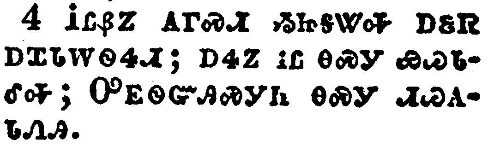</a></td>
</tr>
<tr class="even">
<td>For I know nothing by myself; yet am I not hereby justified: but he that judgeth me is the Lord.</td>
</tr>
<tr class="odd">
<td>ᎥᏝᏰᏃ ᎪᎱᏍᏗ ᏱᏥᎦᏔᎭ ᎠᏋᏒ ᎠᏆᏓᎳᏫᏎᏗ; ᎠᏎᏃ ᎥᏝ ᎾᏍᎩ ᏯᏊᏓᎴᎭ; ᎤᎬᏫᏳᎯᏍᎩᏂ ᎾᏍᎩ ᏗᏊᎪᏓᏁᎯ.</td>
</tr>
<tr class="even">
<td>V-tla-ye-no go-hu-s-di yi-tsi-ga-ta-ha a-quv-sv a-qua-da-la-wi-se-di; a-se-no v-tla na-s-gi ya-quu-da-le-ha; U-gv-wi-yu-hi-s-gi-ni na-s-gi di-quu-go-da-ne-hi.</td>
</tr>
</tbody>
</table>

<table>
<tbody>
<tr class="odd">
<td><a href="070405.png">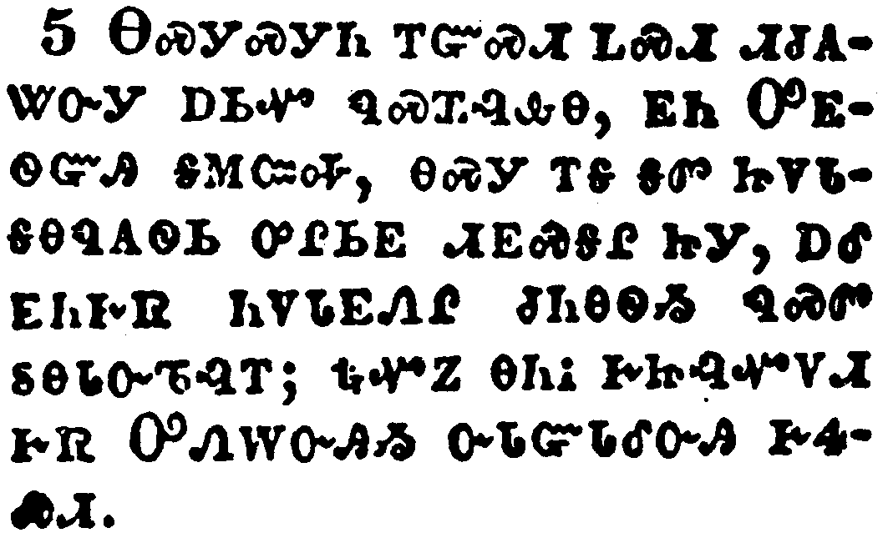</a></td>
</tr>
<tr class="even">
<td>Therefore judge nothing before the time, until the Lord come, who both will bring to light the hidden things of darkness, and will make manifest the counsels of the hearts: and then shall every man have praise of God.</td>
</tr>
<tr class="odd">
<td>ᎾᏍᎩᏍᎩᏂ ᎢᏳᏍᏗ ᏞᏍᏗ ᏗᏧᎪᏔᏅᎩ ᎠᏏᏉ ᏄᏍᏆᎸᎲᎾ, ᎬᏂ ᎤᎬᏫᏳᎯ ᎦᎷᏨᎭ, ᎾᏍᎩ ᎢᎦ ᎦᏛ ᏥᏙᏓᎦᎾᏄᎪᏫᏏ ᎤᎵᏏᎬ ᏗᎬᏍᎦᎵ ᏥᎩ, ᎠᎴ ᎬᏂᎨᏒ ᏂᏙᏓᎬᏁᎵ ᏧᏂᎾᏫᏱ ᏄᏍᏛ ᏚᎾᏓᏅᏖᎸᎢ; ᎿᎭᏉᏃ ᎾᏂᎥ ᎨᏥᎸᏉᏙᏗ ᎨᏒ ᎤᏁᎳᏅᎯᏱ ᏅᏓᏳᏓᎴᏅᎯ ᎨᏎᏍᏗ.</td>
</tr>
<tr class="even">
<td>Na-s-gi-s-gi-ni i-yu-s-di tle-s-di di-tsu-go-ta-nv-gi a-si-quo nu-s-qua-lv-hv-na, gv-ni U-gv-wi-yu-hi ga-lu-tsv-ha, na-s-gi i-ga ga-dv tsi-do-da-ga-na-nu-go-wi-si u-li-si-gv di-gv-s-ga-li tsi-gi, a-le gv-ni-ge-sv ni-do-da-gv-ne-li tsu-ni-na-wi-yi nu-s-dv du-na-da-nv-te-lv-i; hna-quo-no na-ni-v ge-tsi-lv-quo-do-di ge-sv U-ne-la-nv-hi-yi nv-da-yu-da-le-nv-hi ge-se-s-di.</td>
</tr>
</tbody>
</table>

<table>
<tbody>
<tr class="odd">
<td><a href="070406.png">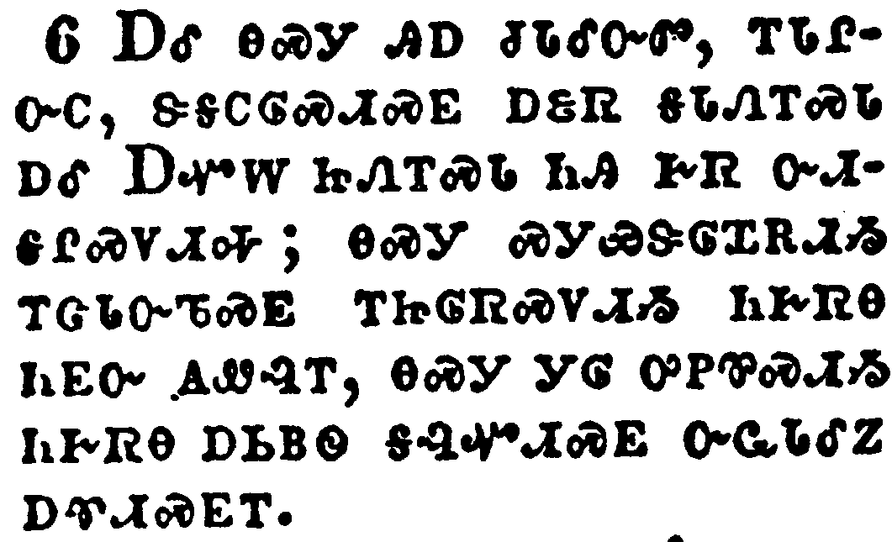</a></td>
</tr>
<tr class="even">
<td>And these things, brethren, I have in a figure transferred to myself and to Apollos for your sakes; that ye might learn in us not to think of men above that which is written, that no one of you be puffed up for one against another.</td>
</tr>
<tr class="odd">
<td>ᎠᎵ ᎾᏍᎩ ᎯᎠ ᏧᏓᎴᏅᏛ, ᎢᏓᎵᏅᏟ, ᏕᎦᏟᎶᏍᏗᏍᎬ ᎠᏋᏒ ᎦᏓᏁᎢᏍᏓ ᎠᎴ ᎠᏉᎳ ᏥᏁᎢᏍᏓ ᏂᎯ ᎨᏒ ᏅᏗᎦᎵᏍᏙᏗᎭ; ᎾᏍᎩ ᏍᎩᏯᏕᎶᏆᎡᏗᏱ ᎢᏣᏓᏅᏖᏍᎬ ᎢᏥᎶᏒᏍᏙᏗᏱ ᏂᎨᏒᎾ ᏂᎬᏅ ᎪᏪᎸᎢ, ᎾᏍᎩ ᎩᎶ ᎤᏢᏈᏍᏗᏱ ᏂᎨᏒᎾ ᎠᏏᏴᏫ ᎦᎸᏉᏗᏍᎬ ᏅᏩᏓᎴᏃ ᎠᏡᏗᏍᎬᎢ.</td>
</tr>
<tr class="even">
<td>A-li na-s-gi hi-a tsu-da-le-nv-dv, i-da-li-nv-tli, de-ga-tli-lo-s-di-s-gv a-quv-sv ga-da-ne-i-s-da a-le A-quo-la tsi-ne-i-s-da ni-hi ge-sv nv-di-ga-li-s-do-di-ha; na-s-gi s-gi-ya-de-lo-qua-e-di-yi i-tsa-da-nv-te-s-gv i-tsi-lo-sv-s-do-di-yi ni-ge-sv-na ni-gv-nv go-we-lv-i, na-s-gi gi-lo u-tlv-qui-s-di-yi ni-ge-sv-na a-si-yv-wi ga-lv-quo-di-s-gv nv-wa-da-le-no a-tlu-di-s-gv-i.</td>
</tr>
</tbody>
</table>

<table>
<tbody>
<tr class="odd">
<td><a href="070407.png">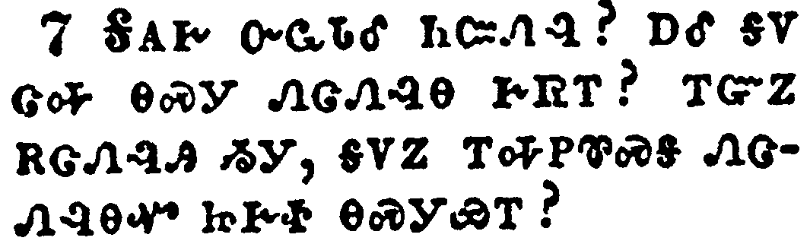</a></td>
</tr>
<tr class="even">
<td>For who maketh thee to differ from another? and what hast thou that thou didst not receive? now if thou didst receive it, why dost thou glory, as if thou hadst not received it?</td>
</tr>
<tr class="odd">
<td>ᎦᎪᎨ ᏅᏩᏓᎴ ᏂᏨᏁᎸ? ᎠᎴ ᎦᏙ ᏣᎭ ᎾᏍᎩ ᏁᏣᏁᎸᎾ ᎨᏒᎢ? ᎢᏳᏃ ᎡᏣᏁᎸᎯ ᏱᎩ, ᎦᏙᏃ ᎢᎭᏢᏈᏍᎦ ᏁᏣᏁᎸᎾᏉ ᏥᎨᏐ ᎾᏍᎩᏯᎢ?</td>
</tr>
<tr class="even">
<td>Ga-go-ge nv-wa-da-le ni-tsv-ne-lv? a-le ga-do tsa-ha na-s-gi ne-tsa-ne-lv-na ge-sv-i? i-yu-no e-tsa-ne-lv-hi yi-gi, ga-do-no i-ha-tlv-qui-s-ga ne-tsa-ne-lv-na-quo tsi-ge-so na-s-gi-ya-i?</td>
</tr>
</tbody>
</table>

<table>
<tbody>
<tr class="odd">
<td><a href="070408.png">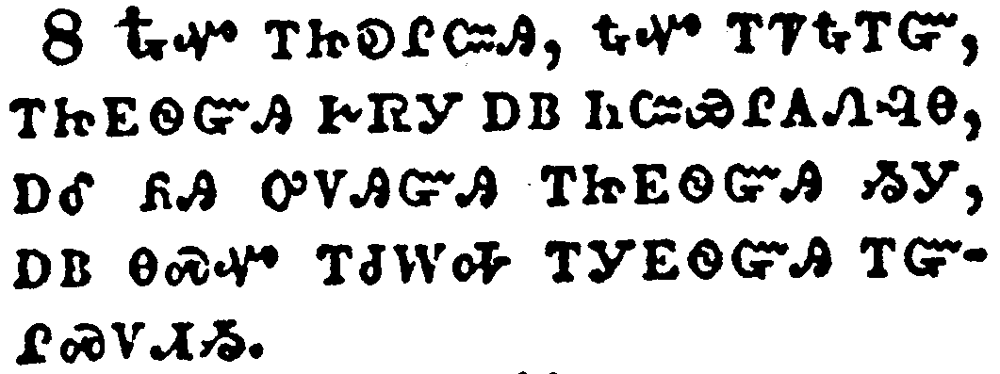</a></td>
</tr>
<tr class="even">
<td>Now ye are full, now ye are rich, ye have reigned as kings without us: and I would to God ye did reign, that we also might reign with you.</td>
</tr>
<tr class="odd">
<td>ᎿᎭᏉ ᎢᏥᎧᎵᏨᎯ, ᎿᎭᏉ ᎢᏤᎿᎭᎢᏳ, ᎢᏥᎬᏫᏳᎯ ᎨᏒᎢ ᎠᏴ ᏂᏨᏯᎵᎪᏁᎸᎾ, ᎠᎴ ᏲᎯ ᎤᏙᎯᏳᎯ ᎢᏥᎬᏫᏳᎯ ᏱᎩ, ᎠᏴ ᎾᏍᏉ ᎢᏧᎳᎭ ᎢᎩᎬᏫᏳᎯ ᎢᏳᎵᏍᏙᏗᏱ.</td>
</tr>
<tr class="even">
<td>Hna-quo i-tsi-ka-li-tsv-hi, hna-quo i-tse-hna-i-yu, i-tsi-gv-wi-yu-hi ge-sv-i a-yv ni-tsv-ya-li-go-ne-lv-na, a-le yo-hi u-do-hi-yu-hi i-tsi-gv-wi-yu-hi yi-gi, a-yv na-s-quo i-tsu-la-ha i-gi-gv-wi-yu-hi i-yu-li-s-do-di-yi.</td>
</tr>
</tbody>
</table>

<table>
<tbody>
<tr class="odd">
<td><a href="070409.png">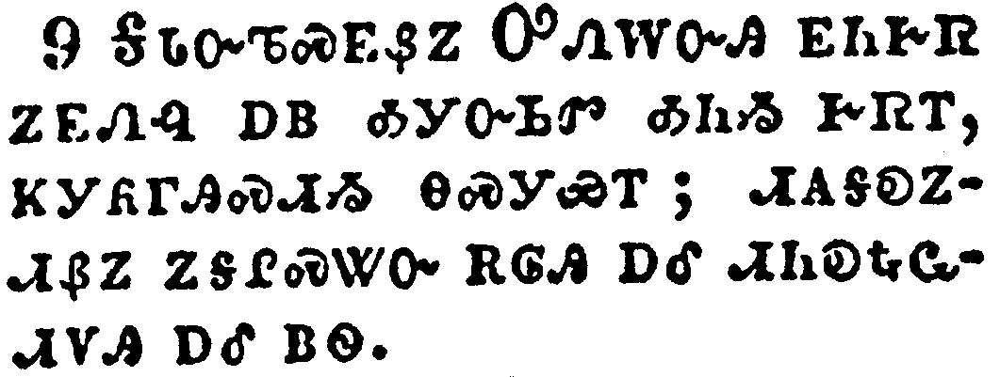</a></td>
</tr>
<tr class="even">
<td>For I think that God hath set forth us the apostles last, as it were appointed to death: for we are made a spectacle unto the world, and to angels, and to men.</td>
</tr>
<tr class="odd">
<td>ᎦᏓᏅᏖᏍᎬᏰᏃ ᎤᏁᎳᏅᎯ ᎬᏂᎨᏒ ᏃᎬᏁᎸ ᎠᏴ ᎣᎩᏅᏏᏛ ᎣᏂᏱ ᎨᏒᎢ, ᏦᎩᏲᎱᎯᏍᏗᏱ ᎾᏍᎩᏯᎢ; ᏗᎪᎦᎧᏃᏗᏰᏃ ᏃᎦᎵᏍᏔᏅ ᎡᎶᎯ ᎠᎴ ᏗᏂᎧᎿᎭᏩᏗᏙᎯ ᎠᎴ ᏴᏫ.</td>
</tr>
<tr class="even">
<td>Ga-da-nv-te-s-gv-ye-no U-ne-la-nv-hi gv-ni-ge-sv no-gv-ne-lv a-yv o-gi-nv-si-dv o-ni-yi ge-sv-i, tso-gi-yo-hu-hi-s-di-yi na-s-gi-ya-i; di-go-ga-ka-no-di-ye-no no-ga-li-s-ta-nv e-lo-hi a-le di-ni-ka-hna-wa-di-do-hi a-le yv-wi.</td>
</tr>
</tbody>
</table>

<table>
<tbody>
<tr class="odd">
<td><a href="070410.png">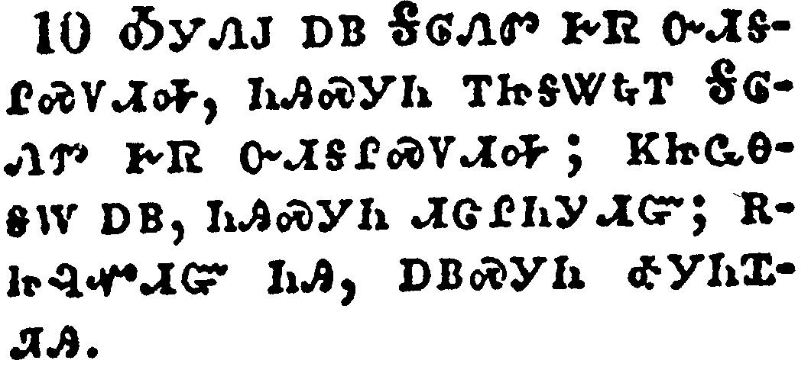</a></td>
</tr>
<tr class="even">
<td>We are fools for Christ's sake, but ye are wise in Christ; we are weak, but ye are strong; ye are honourable, but we are despised.</td>
</tr>
<tr class="odd">
<td>ᎣᎩᏁᎫ ᎠᏴ ᎦᎶᏁᏛ ᎨᏒ ᏅᏗᎦᎵᏍᏙᏗᎭ, ᏂᎯᏍᎩᏂ ᎢᏥᎦᏔᎿᎭᎢ ᎦᎶᏁᏛ ᎨᏒ ᏅᏗᎦᎵᏍᏙᏗᎭ; ᏦᏥᏩᎾᎦᎳ ᎠᏴ, ᏂᎯᏍᎩᏂ ᏗᏣᎵᏂᎩᏗᏳ; ᎡᏥᎸᏉᏗᏳ ᏂᎯ, ᎠᏴᏍᎩᏂ ᎣᎩᏂᏆᏘᎯ.</td>
</tr>
<tr class="even">
<td>O-gi-ne-gu a-yv Ga-lo-ne-dv ge-sv nv-di-ga-li-s-do-di-ha, ni-hi-s-gi-ni i-tsi-ga-ta-hna-i Ga-lo-ne-dv ge-sv nv-di-ga-li-s-do-di-ha; tso-tsi-wa-na-ga-la a-yv, ni-hi-s-gi-ni di-tsa-li-ni-gi-di-yu; e-tsi-lv-quo-di-yu ni-hi, a-yv-s-gi-ni o-gi-ni-qua-ti-hi.</td>
</tr>
</tbody>
</table>

<table>
<tbody>
<tr class="odd">
<td><a href="070411.png">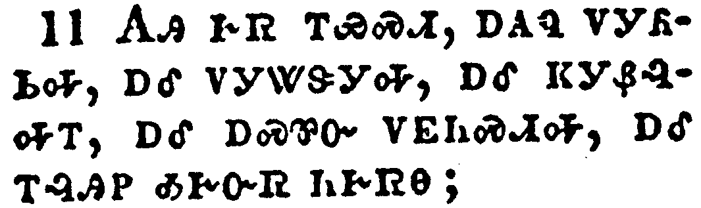</a></td>
</tr>
<tr class="even">
<td>Even unto this present hour we both hunger, and thirst, and are naked, and are buffeted, and have no certain dwellingplace;</td>
</tr>
<tr class="odd">
<td>ᎪᎯ ᎨᏒ ᎢᏯᏍᏗ, ᎠᎪᏄ ᏙᎩᏲᏏᎭ, ᎠᎴ ᏙᎩᏔᏕᎩᎭ, ᎠᎴ ᏦᎩᏰᎸᏌᎢ, ᎠᎴ ᎠᏍᏈᏅ ᏙᎬᏂᏍᏗᎭ, ᎠᎴ ᎢᎸᎯᏢ ᎣᎨᏅᏒ ᏂᎨᏒᎾ;</td>
</tr>
<tr class="even">
<td>Go-hi ge-sv i-ya-s-di, a-go-nu do-gi-yo-si-ha, a-le do-gi-ta-de-gi-ha, a-le tso-gi-ye-lv-sa-i, a-le a-s-qui-nv do-gv-ni-s-di-ha, a-le i-lv-hi-tlv o-ge-nv-sv ni-ge-sv-na;</td>
</tr>
</tbody>
</table>

<table>
<tbody>
<tr class="odd">
<td><a href="070412.png">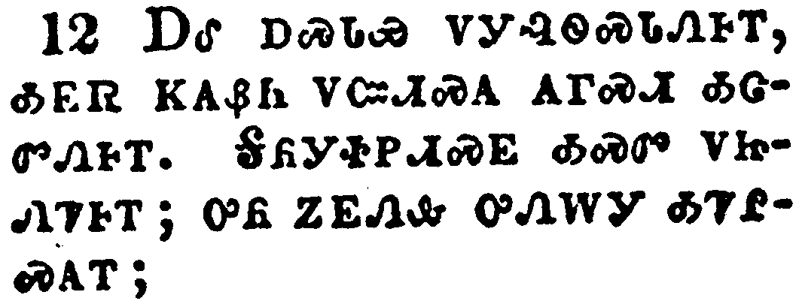</a></td>
</tr>
<tr class="even">
<td>And labour, working with our own hands: being reviled, we bless; being persecuted, we suffer it:</td>
</tr>
<tr class="odd">
<td>ᎠᎴ ᎠᏍᏓᏯ ᏙᎩᎸᏫᏍᏓᏁᎰᎢ, ᎣᎬᏒ ᏦᎪᏰᏂ ᏙᏨᏗᏍᎪ ᎪᎱᏍᏗ ᎣᏣᏛᏁᎰᎢ. ᎦᏲᎩᏐᏢᏗᏍᎬ ᎣᏍᏛ ᏙᏥᏁᏤᎰᎢ; ᎤᏲ ᏃᎬᏁᎲ ᎤᏁᎳᎩ ᎣᏤᎵᏍᎪᎢ;</td>
</tr>
<tr class="even">
<td>A-le a-s-da-ya do-gi-lv-wi-s-da-ne-ho-i, o-gv-sv tso-go-ye-ni do-tsv-di-s-go go-hu-s-di o-tsa-dv-ne-ho-i. Ga-yo-gi-so-tlv-di-s-gv o-s-dv do-tsi-ne-tse-ho-i; u-yo no-gv-ne-hv u-ne-la-gi o-tse-li-s-go-i;</td>
</tr>
</tbody>
</table>

<table>
<tbody>
<tr class="odd">
<td><a href="070413.png">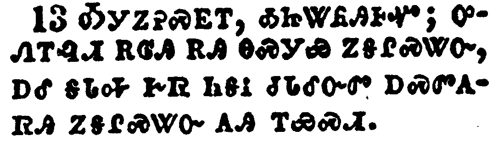</a></td>
</tr>
<tr class="even">
<td>Being defamed, we intreat: we are made as the filth of the world, and are the offscouring of all things unto this day.</td>
</tr>
<tr class="odd">
<td>ᎣᎩᏃᎮᏍᎬᎢ, ᎣᏥᏔᏲᎯᎰᏉ; ᎤᏁᎢᎸᏗ ᎡᎶᎯ ᎡᎯ ᎾᏍᎩᏯ ᎾᎦᎵᏍᏔᏅ, ᎠᎴ ᎦᏓᎭ ᎨᏒ ᎾᎦᎥ ᏧᏓᎴᏅᏛ ᎠᏍᏛᎪᏒᎯ ᏃᎦᎵᏍᏔᏅ ᎪᎯ ᎢᏯᏍᏗ.</td>
</tr>
<tr class="even">
<td>O-gi-no-he-s-gv-i, o-tsi-ta-yo-hi-ho-quo; u-ne-i-lv-di e-lo-hi e-hi na-s-gi-ya na-ga-li-s-ta-nv, a-le ga-da-ha ge-sv na-ga-v tsu-da-le-nv-dv a-s-dv-go-sv-hi no-ga-li-s-ta-nv go-hi i-ya-s-di.</td>
</tr>
</tbody>
</table>

<table>
<tbody>
<tr class="odd">
<td><a href="070414.png">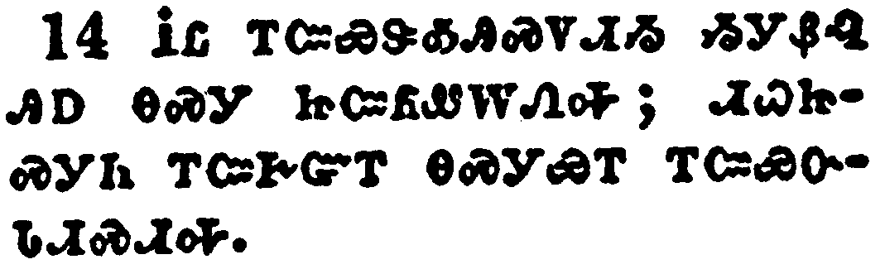</a></td>
</tr>
<tr class="even">
<td>I write not these things to shame you, but as my beloved sons I warn you.</td>
</tr>
<tr class="odd">
<td>ᎥᏝ ᎢᏨᏍᏕᎣᎯᏍᏙᏗᏱ ᏱᎩᏰᎸ ᎯᎠ ᎾᏍᎩ ᏥᏨᏲᏪᎳᏁᎭ; ᏗᏇᏥᏍᎩᏂ ᎢᏨᎨᏳᎢ ᎾᏍᎩᏯᎢ ᎢᏨᏯᏅᏓᏗᏍᏗᎭ.</td>
</tr>
<tr class="even">
<td>V-tla i-tsv-s-de-o-hi-s-do-di-yi yi-gi-ye-lv hi-a na-s-gi tsi-tsv-yo-we-la-ne-ha; di-que-tsi-s-gi-ni i-tsv-ge-yu-i na-s-gi-ya-i i-tsv-ya-nv-da-di-s-di-ha.</td>
</tr>
</tbody>
</table>

<table>
<tbody>
<tr class="odd">
<td><a href="070415.png">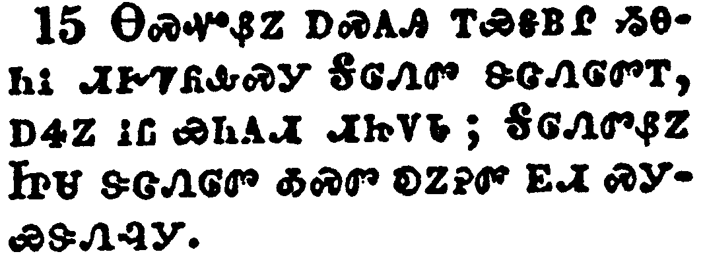</a></td>
</tr>
<tr class="even">
<td>For though ye have ten thousand instructors in Christ, yet have ye not many fathers: for in Christ Jesus I have begotten you through the gospel.</td>
</tr>
<tr class="odd">
<td>ᎾᏍᏉᏰᏃ ᎠᏍᎪᎯ ᎢᏯᎦᏴᎵ ᏱᎾᏂᎥ ᏗᎨᏤᏲᎲᏍᎩ ᎦᎶᏁᏛ ᏕᏣᏁᎶᏛᎢ, ᎠᏎᏃ ᎥᏝ ᏯᏂᎪᏗ ᏗᏥᏙᏓ; ᎦᎶᏁᏛᏰᏃ ᏥᏌ ᏕᏣᏁᎶᏛ ᎣᏍᏛ ᎧᏃᎮᏛ ᎬᏗ ᏍᎩᏯᏕᏁᎸᎩ.</td>
</tr>
<tr class="even">
<td>Na-s-quo-ye-no a-s-go-hi i-ya-ga-yv-li yi-na-ni-v di-ge-tse-yo-hv-s-gi Ga-lo-ne-dv de-tsa-ne-lo-dv-i, a-se-no v-tla ya-ni-go-di di-tsi-do-da; Ga-lo-ne-dv-ye-no Tsi-sa de-tsa-ne-lo-dv o-s-dv ka-no-he-dv gv-di s-gi-ya-de-ne-lv-gi.</td>
</tr>
</tbody>
</table>

<table>
<tbody>
<tr class="odd">
<td><a href="070416.png">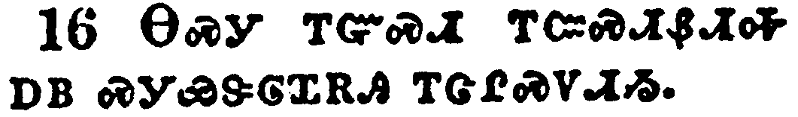</a></td>
</tr>
<tr class="even">
<td>Wherefore I beseech you, be ye followers of me.</td>
</tr>
<tr class="odd">
<td>ᎾᏍᎩ ᎢᏳᏍᏗ ᎢᏨᏍᏗᏰᏗᎭ ᎠᏴ ᏍᎩᏯᏕᎶᏆᎡᎯ ᎢᏣᎵᏍᏙᏗᏱ.</td>
</tr>
<tr class="even">
<td>Na-s-gi i-yu-s-di i-tsv-s-di-ye-di-ha a-yv s-gi-ya-de-lo-qua-e-hi i-tsa-li-s-do-di-yi.</td>
</tr>
</tbody>
</table>

<table>
<tbody>
<tr class="odd">
<td><a href="070417.png">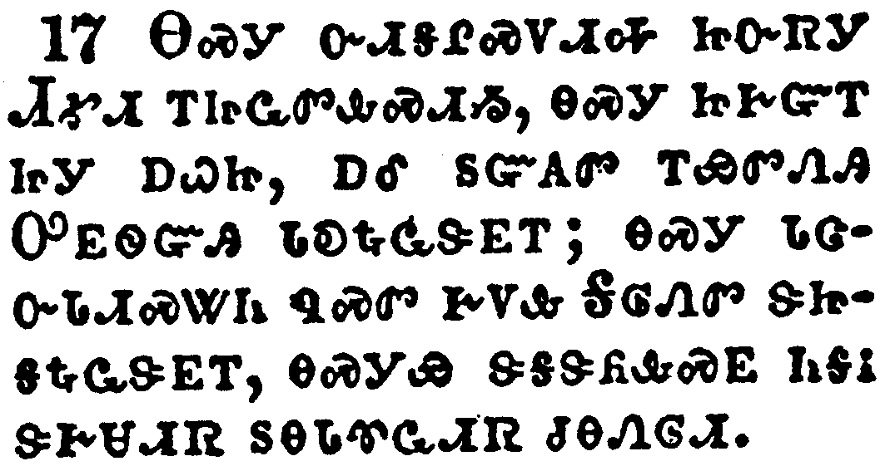</a></td>
</tr>
<tr class="even">
<td>For this cause have I sent unto you Timotheus, who is my beloved son, and faithful in the Lord, who shall bring you into remembrance of my ways which be in Christ, as I teach every where in every church.</td>
</tr>
<tr class="odd">
<td>ᎾᏍᎩ ᏅᏗᎦᎵᏍᏙᏗᎭ ᏥᏅᏒᎩ ᏗᎹᏗ ᎢᏥᏩᏛᎲᏍᏗᏱ, ᎾᏍᎩ ᏥᎨᏳᎢ ᏥᎩ ᎠᏇᏥ, ᎠᎴ ᏚᏳᎪᏛ ᎢᏯᏛᏁᎯ ᎤᎬᏫᏳᎯ ᏓᎧᎿᎭᏩᏕᎬᎢ; ᎾᏍᎩ ᏓᏣᏅᏓᏗᏍᏔᏂ ᏄᏍᏛ ᎨᏙᎲ ᎦᎶᏁᏛ ᏕᏥᎦᎿᎭᏩᏕᎬᎢ, ᎾᏍᎩᏯ ᏕᎦᏕᏲᎲᏍᎬ ᏂᎦᎥ ᏕᎨᏌᏗᏒ ᏚᎾᏓᏡᏩᏗᏒ ᏧᎾᏁᎶᏗ.</td>
</tr>
<tr class="even">
<td>Na-s-gi nv-di-ga-li-s-do-di-ha tsi-nv-sv-gi Di-ma-di i-tsi-wa-dv-hv-s-di-yi, na-s-gi tsi-ge-yu-i tsi-gi a-que-tsi, a-le du-yu-go-dv i-ya-dv-ne-hi U-gv-wi-yu-hi da-ka-hna-wa-de-gv-i; na-s-gi da-tsa-nv-da-di-s-ta-ni nu-s-dv ge-do-hv Ga-lo-ne-dv de-tsi-ga-hna-wa-de-gv-i, na-s-gi-ya de-ga-de-yo-hv-s-gv ni-ga-v de-ge-sa-di-sv du-na-da-tlu-wa-di-sv tsu-na-ne-lo-di.</td>
</tr>
</tbody>
</table>

<table>
<tbody>
<tr class="odd">
<td><a href="070418.png">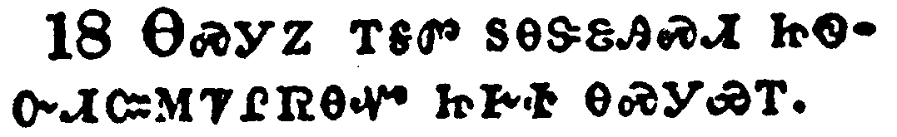</a></td>
</tr>
<tr class="even">
<td>Now some are puffed up, as though I would not come to you.</td>
</tr>
<tr class="odd">
<td>ᎾᏍᎩᏃ ᎢᎦᏛ ᏚᎾᏕᏋᎯᏍᏗ ᏥᏫᏅᏗᏨᎷᏤᎵᏒᎾᏉ ᏥᎨᏐ ᎾᏍᎩᏯᎢ.</td>
</tr>
<tr class="even">
<td>Na-s-gi-no i-ga-dv du-na-de-quv-hi-s-di tsi-wi-nv-di-tsv-lu-tse-li-sv-na-quo tsi-ge-so na-s-gi-ya-i.</td>
</tr>
</tbody>
</table>

<table>
<tbody>
<tr class="odd">
<td><a href="070419.png">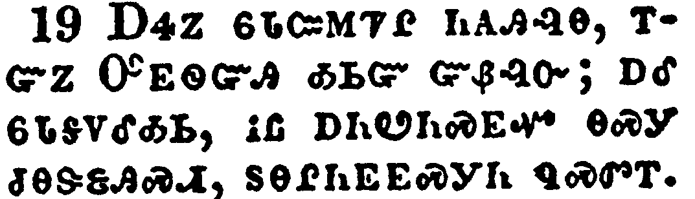</a></td>
</tr>
<tr class="even">
<td>But I will come to you shortly, if the Lord will, and will know, not the speech of them which are puffed up, but the power.</td>
</tr>
<tr class="odd">
<td>ᎠᏎᏃ ᏮᏓᏨᎷᏤᎵ ᏂᎪᎯᎸᎾ, ᎢᏳᏃ ᎤᎬᏫᏳᎯ ᎣᏏᏳ ᏳᏰᎸᏅ; ᎠᎴ ᏮᏓᎦᏙᎴᎣᏏ, ᎥᏝ ᎠᏂᏬᏂᏍᎬᏉ ᎾᏍᎩ ᏧᎾᏕᏋᎯᏍᏗ, ᏚᎾᎵᏂᎬᎬᏍᎩᏂ ᏄᏍᏛᎢ.</td>
</tr>
<tr class="even">
<td>A-se-no wv-da-tsv-lu-tse-li ni-go-hi-lv-na, i-yu-no U-gv-wi-yu-hi o-si-yu yu-ye-lv-nv; a-le wv-da-ga-do-le-o-si, v-tla a-ni-wo-ni-s-gv-quo na-s-gi tsu-na-de-quv-hi-s-di, du-na-li-ni-gv-gv-s-gi-ni nu-s-dv-i.</td>
</tr>
</tbody>
</table>

<table>
<tbody>
<tr class="odd">
<td><a href="070420.png">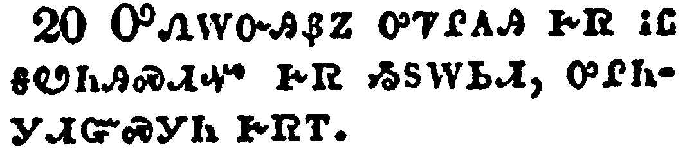</a></td>
</tr>
<tr class="even">
<td>For the kingdom of God is not in word, but in power.</td>
</tr>
<tr class="odd">
<td>ᎤᏁᎳᏅᎯᏰᏃ ᎤᏤᎵᎪᎯ ᎨᏒ ᎥᏝ ᎦᏬᏂᎯᏍᏗᏉ ᎨᏒ ᏱᏚᎳᏏᏗ, ᎤᎵᏂᎩᏗᏳᏍᎩᏂ ᎨᏒᎢ.</td>
</tr>
<tr class="even">
<td>U-ne-la-nv-hi-ye-no u-tse-li-go-hi ge-sv v-tla ga-wo-ni-hi-s-di-quo ge-sv yi-du-la-si-di, u-li-ni-gi-di-yu-s-gi-ni ge-sv-i.</td>
</tr>
</tbody>
</table>

<table>
<tbody>
<tr class="odd">
<td><a href="070421.png">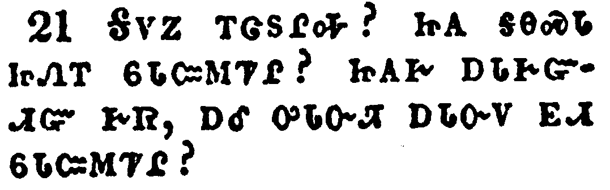</a></td>
</tr>
<tr class="even">
<td>What will ye? shall I come unto you with a rod, or in love, and in the spirit of meekness?</td>
</tr>
<tr class="odd">
<td>ᎦᏙᏃ ᎢᏣᏚᎵᎭ? ᏥᎪ ᎦᎾᏍᏓ ᏥᏁᎢ ᏮᏓᏨᎷᏤᎵ? ᏥᎪᎨ ᎠᏓᎨᏳᏗᏳ ᎨᏒ, ᎠᎴ ᎤᏓᏅᏘ ᎠᏓᏅᏙ ᎬᏗ ᏮᏓᏨᎷᏤᎵ?</td>
</tr>
<tr class="even">
<td>Ga-do-no i-tsa-du-li-ha? tsi-go ga-na-s-da tsi-ne-i wv-da-tsv-lu-tse-li? tsi-go-ge a-da-ge-yu-di-yu ge-sv, a-le u-da-nv-ti a-da-nv-do gv-di wv-da-tsv-lu-tse-li?</td>
</tr>
</tbody>
</table>

