+++
draft=false
date = 2014-12-18T21:11:07Z
title = "1 Corinthians - Chapter 8 - Cherokee New Testament"
weight = 1418955067

[taxonomies]

authors = ["Timothy Legg"]
categories = []
tags = []

[extra]
+++

<table>
<tbody>
<tr class="odd">
<td><a href="070801.png">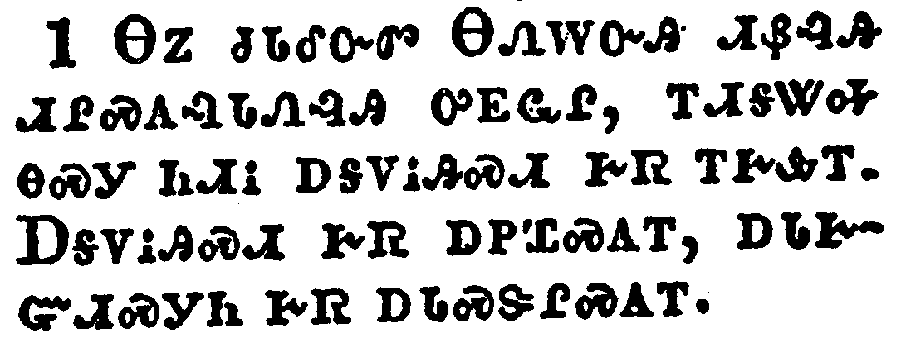</a></td>
</tr>
<tr class="even">
<td>Now as touching things offered unto idols, we know that we all have knowledge. Knowledge puffeth up, but charity edifieth.</td>
</tr>
<tr class="odd">
<td>ᎾᏃ ᏧᏓᎴᏅᏛ ᎾᏁᎳᏅᎯ ᏗᏰᎸᎯ ᏗᎵᏍᎪᎸᏓᏁᎸᎯ ᎤᎬᏩᎵ, ᎢᏗᎦᏔᎭ ᎾᏍᎩ ᏂᏗᎥ ᎠᎦᏙᎥᎯᏍᏗ ᎨᏒ ᎢᎨᎲᎢ. ᎠᎦᏙᎥᎯᏍᏗ ᎨᏒ ᎠᏢᏆᏍᎪᎢ, ᎠᏓᎨᏳᏗᏍᎩᏂ ᎨᏒ ᎠᏓᏍᏕᎵᏍᎪᎢ.</td>
</tr>
<tr class="even">
<td>Na-no tsu-da-le-nv-dv Na-ne-la-nv-hi di-ye-lv-hi di-li-s-go-lv-da-ne-lv-hi u-gv-wa-li, i-di-ga-ta-ha na-s-gi ni-di-v a-ga-do-v-hi-s-di ge-sv i-ge-hv-i. A-ga-do-v-hi-s-di ge-sv a-tlv-qua-s-go-i, a-da-ge-yu-di-s-gi-ni ge-sv a-da-s-de-li-s-go-i.</td>
</tr>
</tbody>
</table>

<table>
<tbody>
<tr class="odd">
<td><a href="070802.png">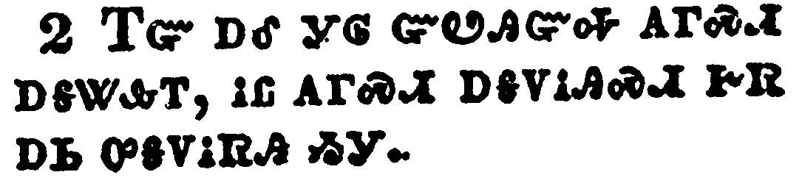</a></td>
</tr>
<tr class="even">
<td>And if any man think that he knoweth anything, he knoweth nothing yet as he ought to know.</td>
</tr>
<tr class="odd">
<td>ᎢᏳ ᎠᎴ ᎩᎶ ᏳᏬᎯᏳᎭ ᎪᎱᏍᏗ ᎠᎦᏔᎲᎢ, ᎥᏝ ᎪᎱᏍᏗ ᎠᎦᏙᎥᎯᏍᏗ ᎨᏒ ᎠᏏ ᎤᎦᏙᎥᏒᎯ ᏱᎩ.</td>
</tr>
<tr class="even">
<td>i-yu a-le gi-lo yu-wo-hi-yu-ha go-hu-s-di a-ga-ta-hv-i, v-tla go-hu-s-di a-ga-do-v-hi-s-di ge-sv a-si u-ga-do-v-sv-hi yi-gi.</td>
</tr>
</tbody>
</table>

<table>
<tbody>
<tr class="odd">
<td><a href="070803.png">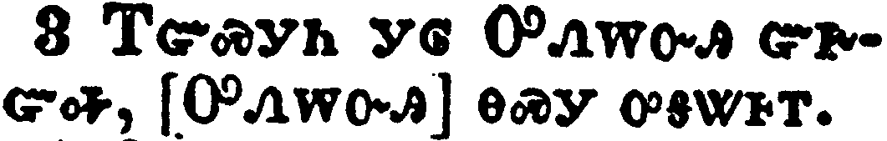</a></td>
</tr>
<tr class="even">
<td>But if any man love God, the same is known of him.</td>
</tr>
<tr class="odd">
<td>ᎢᏳᏍᎩᏂ ᎩᎶ ᎤᏁᎳᏅᎯ ᏳᎨᏳᎭ, [ᎤᏁᎳᏅᎯ] ᎾᏍᎩ ᎤᎦᏔᎰᎢ.</td>
</tr>
<tr class="even">
<td>I-yu-s-gi-ni gi-lo U-ne-la-nv-hi yu-ge-yu-ha, [U-ne-la-nv-hi] na-s-gi u-ga-ta-ho-i.</td>
</tr>
</tbody>
</table>

<table>
<tbody>
<tr class="odd">
<td><a href="070804.png">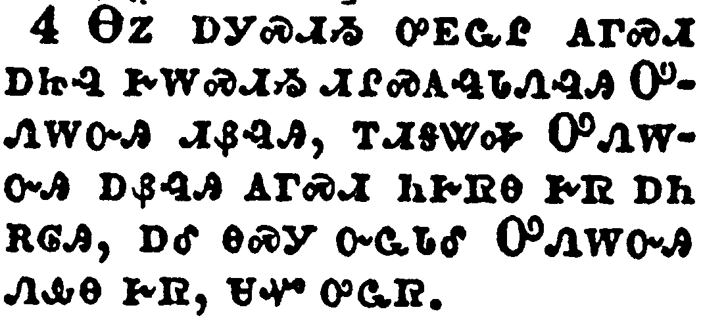</a></td>
</tr>
<tr class="even">
<td>As concerning therefore the eating of those things that are offered in sacrifice unto idols, we know that an idol is nothing in the world, and that there is none other God but one.</td>
</tr>
<tr class="odd">
<td>ᎾᏃ ᎠᎩᏍᏗᏱ ᎤᎬᏩᎵ ᎪᎱᏍᏗ ᎠᏥᎸ ᎨᎳᏍᏗᏱ ᏗᎵᏍᎪᎸᏓᏁᎸᎯ ᎤᏁᎳᏅᎯ ᏗᏰᎸᎯ, ᎢᏗᎦᏔᎭ ᎤᏁᎳᏅᎯ ᎠᏰᎸᎯ ᎪᎱᏍᏗ ᏂᎨᏒᎾ ᎨᏒ ᎠᏂ ᎡᎶᎯ, ᎠᎴ ᎾᏍᎩ ᏅᏩᏓᎴ ᎤᏁᎳᏅᎯ ᏁᎲᎾ ᎨᏒ, ᏌᏉ ᎤᏩᏒ.</td>
</tr>
<tr class="even">
<td>Na-no a-gi-s-di-yi u-gv-wa-li go-hu-s-di a-tsi-lv ge-la-s-di-yi di-li-s-go-lv-da-ne-lv-hi U-ne-la-nv-hi di-ye-lv-hi, i-di-ga-ta-ha U-ne-la-nv-hi a-ye-lv-hi go-hu-s-di ni-ge-sv-na ge-sv a-ni e-lo-hi, a-le na-s-gi nv-wa-da-le U-ne-la-nv-hi ne-hv-na ge-sv, sa-quo u-wa-sv.</td>
</tr>
</tbody>
</table>

<table>
<tbody>
<tr class="odd">
<td><a href="070805.png">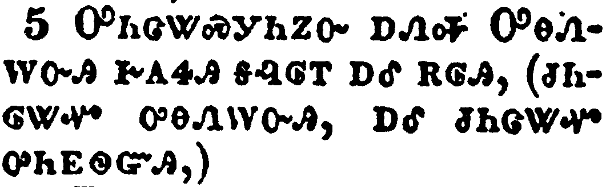</a></td>
</tr>
<tr class="even">
<td>For though there be that are called gods, whether in heaven or in earth, (as there be gods many, and lords many,)</td>
</tr>
<tr class="odd">
<td>ᎤᏂᏣᏔᏍᎩᏂᏃᏅ ᎠᏁᎭ ᎤᎾᏁᎳᏅᎯ ᎨᎪᏎᎯ ᎦᎸᎶᎢ ᎠᎴ ᎡᎶᎯ, (ᏧᏂᎶᏔᏉ ᎤᎾᏁᎳᏅᎯ, ᎠᎴ ᏧᏂᏣᏔᏉ ᎤᏂᎬᏫᏳᎯ,)</td>
</tr>
<tr class="even">
<td>U-ni-tsa-ta-s-gi-ni-no-nv a-ne-ha U-na-ne-la-nv-hi ge-go-se-hi ga-lv-lo-i a-le e-lo-hi, (tsu-ni-lo-ta-quo u-na-ne-la-nv-hi, a-le tsu-ni-tsa-ta-quo u-ni-gv-wi-yu-hi,)</td>
</tr>
</tbody>
</table>

<table>
<tbody>
<tr class="odd">
<td><a href="070806.png">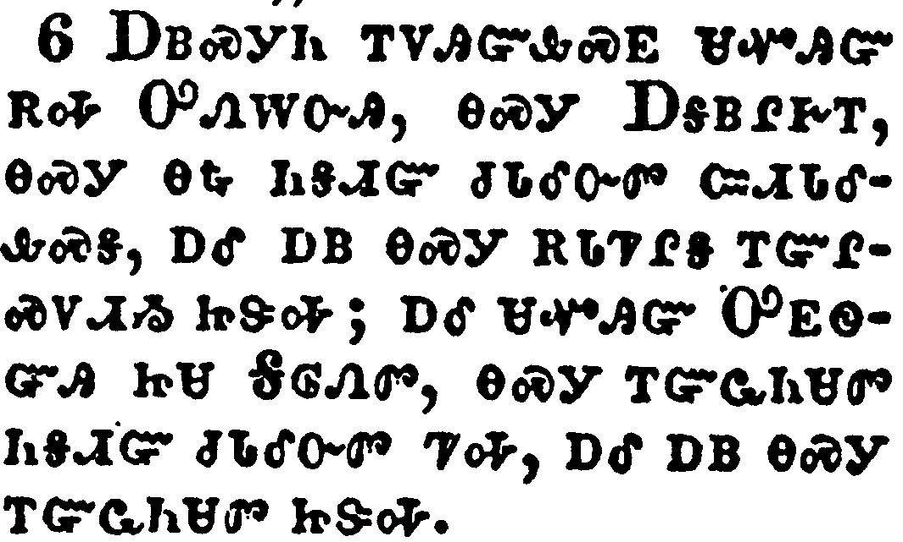</a></td>
</tr>
<tr class="even">
<td>But to us there is but one God, the Father, of whom are all things, and we in him; and one Lord Jesus Christ, by whom are all things, and we by him.</td>
</tr>
<tr class="odd">
<td>ᎠᏴᏍᎩᏂ ᎢᏙᎯᏳᎲᏍᎬ ᏌᏉᎯᏳ ᎡᎭ ᎤᏁᎳᏅᎯ, ᎾᏍᎩ ᎠᎦᏴᎵᎨᎢ, ᎾᏍᎩ ᎾᎿᎭᏂᎦᏗᏳ ᏧᏓᎴᏅᏛ ᏨᏗᏓᎴᎲᏍᎦ, ᎠᎴ ᎠᏴ ᎾᏍᎩ ᎡᏓᏤᎵᎦ ᎢᏳᎵᏍᏙᏗᏱ ᏥᏕᎭ; ᎠᎴ ᏌᏉᎯᏳ ᎤᎬᏫᏳᎯ ᏥᏌ ᎦᎶᏁᏛ, ᎾᏍᎩ ᎢᏳᏩᏂᏌᏛ ᏂᎦᏗᏳ ᏧᏓᎴᏅᏛ ᏤᎭ, ᎠᎴ ᎠᏴ ᎾᏍᎩ ᎢᏳᏩᏂᏌᏛ ᏥᏕᎭ.</td>
</tr>
<tr class="even">
<td>A-yv-s-gi-ni i-do-hi-yu-hv-s-gv sa-quo-hi-yu e-ha U-ne-la-nv-hi, na-s-gi A-ga-yv-li-ge-i, na-s-gi na-hna ni-ga-di-yu tsu-da-le-nv-dv tsv-di-da-le-hv-s-ga, a-le a-yv na-s-gi e-da-tse-li-ga i-yu-li-s-do-di-yi tsi-de-ha; a-le sa-quo-hi-yu U-gv-wi-yu-hi tsi-sa Ga-lo-ne-dv, na-s-gi i-yu-wa-ni-sa-dv ni-ga-di-yu tsu-da-le-nv-dv tse-ha, a-le a-yv na-s-gi i-yu-wa-ni-sa-dv tsi-de-ha.</td>
</tr>
</tbody>
</table>

<table>
<tbody>
<tr class="odd">
<td><a href="070807.png">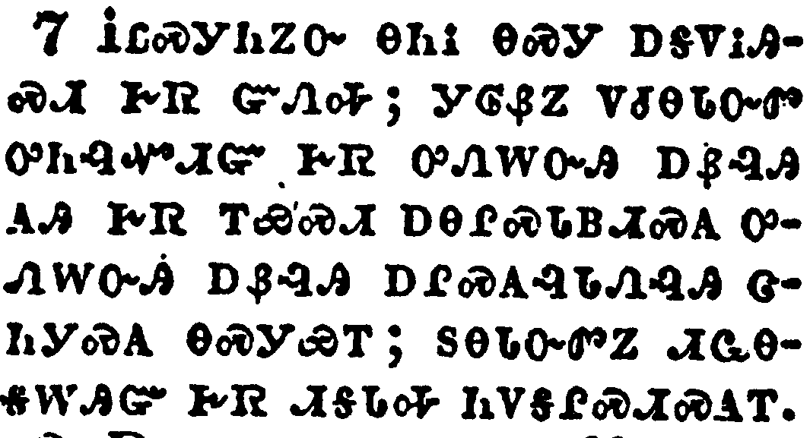</a></td>
</tr>
<tr class="even">
<td>Howbeit there is not in every man that knowledge: for some with conscience of the idol unto this hour eat it as a thing offered unto an idol; and their conscience being weak is defiled.</td>
</tr>
<tr class="odd">
<td>ᎥᏝᏍᎩᏂᏃᏅ ᎾᏂᎥ ᎾᏍᎩ ᎠᎦᏙᎥᎯᏍᏗ ᎨᏒ ᏳᏁᎭ; ᎩᎶᏰᏃ ᏙᏧᎾᏓᏅᏛ ᎤᏂᎸᏉᏗᏳ ᎨᏒ ᎤᏁᎳᏅᎯ ᎠᏰᎸᎯ ᎪᎯ ᎨᏒ ᎢᏯᏍᏗ ᎠᎾᎵᏍᏓᏴᏗᏍᎪ ᎤᏁᎳᏅᎯ ᎠᏰᎸᎯ ᎠᎵᏍᎪᎸᏓᏁᎸᎯ ᏣᏂᎩᏍᎪ ᎾᏍᎩᏯᎢ; ᏚᎾᏓᏅᏛᏃ ᏗᏩᎾᎦᎳᎯᏳ ᎨᏒ ᏗᎦᏓᎭ ᏂᏙᎦᎵᏍᏗᏍᎪᎢ.</td>
</tr>
<tr class="even">
<td>V-tla-s-gi-ni-no-nv na-ni-v na-s-gi a-ga-do-v-hi-s-di ge-sv yu-ne-ha; gi-lo-ye-no do-tsu-na-da-nv-dv u-ni-lv-quo-di-yu ge-sv u-ne-la-nv-hi a-ye-lv-hi go-hi ge-sv i-ya-s-di a-na-li-s-da-yv-di-s-go u-ne-la-nv-hi a-ye-lv-hi a-li-s-go-lv-da-ne-lv-hi tsa-ni-gi-s-go na-s-gi-ya-i; du-na-da-nv-dv-no di-wa-na-ga-la-hi-yu ge-sv di-ga-da-ha ni-do-ga-li-s-di-s-go-i.</td>
</tr>
</tbody>
</table>

<table>
<tbody>
<tr class="odd">
<td><a href="070808.png">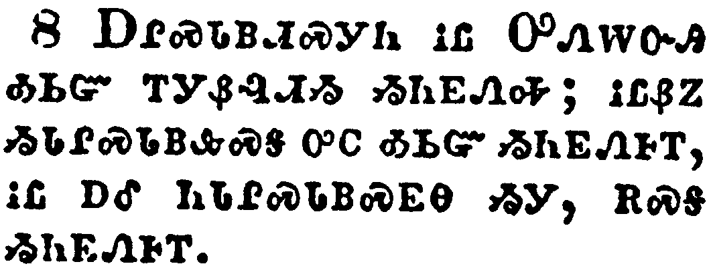</a></td>
</tr>
<tr class="even">
<td>But meat commendeth us not to God: for neither, if we eat, are we the better; neither, if we eat not, are we the worse.</td>
</tr>
<tr class="odd">
<td>ᎠᎵ ᏍᏓᏴᏗᏍᎩᏂ ᎥᏝ ᎤᏁᎳᏅᎯ ᎣᏏᏳ ᎢᎩᏰᎸᏗᏱ ᏱᏂᎬᏁᎭ; ᎥᏝᏰᏃ ᏱᏓᎵᏍᏓᏴᎲᏍᎦ ᎤᏟ ᎣᏏᏳ ᏱᏂᎬᏁᎰᎢ, ᎥᏝ ᎠᎴ ᏂᏓᎵᏍᏓᏴᏍᎬᎾ ᏱᎩ, ᎡᏍᎦ ᏱᏂᎬᏁᎰᎢ.</td>
</tr>
<tr class="even">
<td>A-li s-da-yv-di-s-gi-ni v-tla U-ne-la-nv-hi o-si-yu i-gi-ye-lv-di-yi yi-ni-gv-ne-ha; v-tla-ye-no yi-da-li-s-da-yv-hv-s-ga u-tli o-si-yu yi-ni-gv-ne-ho-i, v-tla a-le ni-da-li-s-da-yv-s-gv-na yi-gi, e-s-ga yi-ni-gv-ne-ho-i.</td>
</tr>
</tbody>
</table>

<table>
<tbody>
<tr class="odd">
<td></td>
</tr>
<tr class="even">
<td>But take heed lest by any means this liberty of yours become a stumblingblock to them that are weak.</td>
</tr>
<tr class="odd">
<td>ᎠᏎᏃ ᎢᏤᏯᏔᎮᏍᏗ ᏞᏍᏗ ᎾᏍᎩ ᎢᎨᏣᏛᏁᏗ ᎢᏥᎲ ᏗᏂᏩᎾᎦᎳ ᏧᏃᏕᏍᏗᏍᎩ ᏱᏄᎵᏍᏔᏁᏍᏗ.</td>
</tr>
<tr class="even">
<td>A-se-no i-tse-ya-ta-he-s-di tle-s-di na-s-gi i-ge-tsa-dv-ne-di i-tsi-hv di-ni-wa-na-ga-la tsu-no-de-s-di-s-gi yi-nu-li-s-ta-ne-s-di.</td>
</tr>
</tbody>
</table>

<table>
<tbody>
<tr class="odd">
<td><a href="070810.png">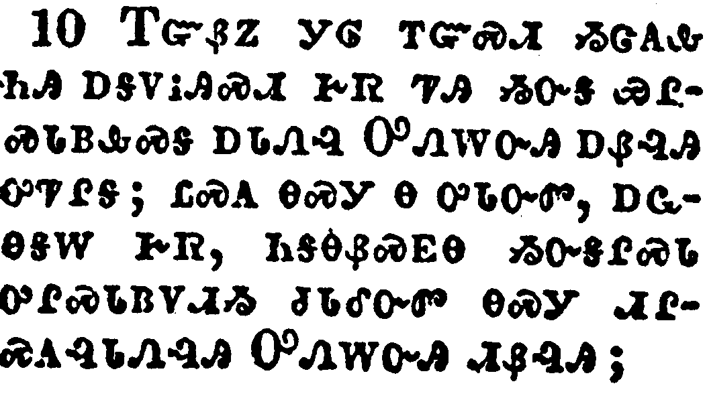</a></td>
</tr>
<tr class="even">
<td>For if any man see thee which hast knowledge sit at meat in the idol's temple, shall not the conscience of him which is weak be emboldened to eat those things which are offered to idols;</td>
</tr>
<tr class="odd">
<td>ᎢᏳᏰᏃ ᎩᎶ ᎢᏳᏍᏗ ᏱᏣᎪᎲ ᏂᎯ ᎠᎦᏙᎥᎯᏍᏗ ᎨᏒ ᏤᎯ ᏱᏅᎦ ᏯᎵᏍᏓᏴᎲᏍᎦ ᎠᏓᏁᎸ ᎤᏁᎳᏅᎯ ᎠᏰᎸᎯ ᎤᏤᎵᎦ; ᏝᏍᎪ ᎾᏍᎩ Ꮎ ᎤᏓᏅᏛ, ᎠᏩᎾᎦᎳ ᎨᏒ, ᏂᎦᎾᏰᏍᎬᎾ ᏱᏅᎦᎵᏍᏓ ᎤᎵᏍᏓᏴᏙᏗᏱ ᏧᏓᎴᏅᏛ ᎾᏍᎩ ᏗᎵᏍᎪᎸᏓᏁᎸᎯ ᎤᏁᎳᏅᎯ ᏗᏰᎸᎯ;</td>
</tr>
<tr class="even">
<td>I-yu-ye-no gi-lo i-yu-s-di yi-tsa-go-hv ni-hi a-ga-do-v-hi-s-di ge-sv tse-hi yi-nv-ga ya-li-s-da-yv-hv-s-ga a-da-ne-lv U-ne-la-nv-hi a-ye-lv-hi u-tse-li-ga; tla-s-go na-s-gi na u-da-nv-dv, a-wa-na-ga-la ge-sv, ni-ga-na-ye-s-gv-na yi-nv-ga-li-s-da u-li-s-da-yv-do-di-yi tsu-da-le-nv-dv na-s-gi di-li-s-go-lv-da-ne-lv-hi U-ne-la-nv-hi di-ye-lv-hi;</td>
</tr>
</tbody>
</table>

<table>
<tbody>
<tr class="odd">
<td><a href="070811.png">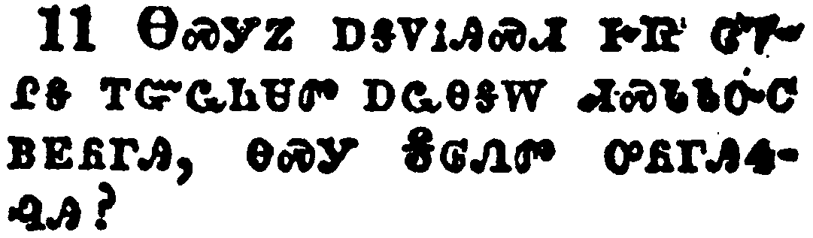</a></td>
</tr>
<tr class="even">
<td>And through thy knowledge shall the weak brother perish, for whom Christ died?</td>
</tr>
<tr class="odd">
<td>ᎾᏍᎩᏃ ᎠᎦᏙᎥᎯᏍᏗ ᎨᏒ ᏣᏤᎵᎦ ᎢᏳᏩᏂᏌᏛ ᎠᏩᎾᎦᎳ ᏗᏍᏓᏓᏅᏟ ᏴᎬᏲᎱᎯ, ᎾᏍᎩ ᎦᎶᏁᏛ ᎤᏲᎱᎯᏎᎸᎯ?</td>
</tr>
<tr class="even">
<td>Na-s-gi-no a-ga-do-v-hi-s-di ge-sv tsa-tse-li-ga i-yu-wa-ni-sa-dv a-wa-na-ga-la di-s-da-da-nv-tli yv-gv-yo-hu-hi, na-s-gi Ga-lo-ne-dv u-yo-hu-hi-se-lv-hi?</td>
</tr>
</tbody>
</table>

<table>
<tbody>
<tr class="odd">
<td><a href="070812.png">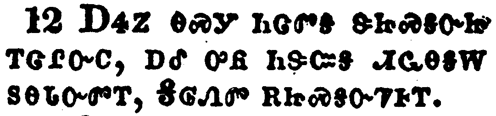</a></td>
</tr>
<tr class="even">
<td>But when ye sin so against the brethren, and wound their weak conscience, ye sin against Christ.</td>
</tr>
<tr class="odd">
<td>ᎠᏎᏃ ᎾᏍᎩ ᏂᏣᏛᎦ ᏕᏥᏍᎦᏅᏥ ᎢᏣᎵᏅᏟ, ᎠᎴ ᎤᏲ ᏂᏕᏨᎦ ᏗᏩᎾᎦᎳ ᏚᎾᏓᏅᏛᎢ, ᎦᎶᏁᏛ ᎡᏥᏍᎦᏅᏤᎰᎢ.</td>
</tr>
<tr class="even">
<td>A-se-no na-s-gi ni-tsa-dv-ga de-tsi-s-ga-nv-tsi i-tsa-li-nv-tli, a-le u-yo ni-de-tsv-ga di-wa-na-ga-la du-na-da-nv-dv-i, Ga-lo-ne-dv e-tsi-s-ga-nv-tse-ho-i.</td>
</tr>
</tbody>
</table>

<table>
<tbody>
<tr class="odd">
<td><a href="070813.png">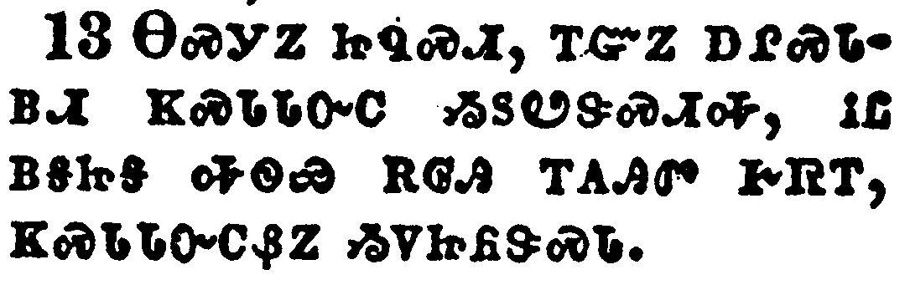</a></td>
</tr>
<tr class="even">
<td>Wherefore, if meat make my brother to offend, I will eat no flesh while the world standeth, lest I make my brother to offend.</td>
</tr>
<tr class="odd">
<td>ᎾᏍᎩᏃ ᏥᏄᏍᏗ, ᎢᏳᏃ ᎠᎵᏍᏓᏴᏗ ᏦᏍᏓᏓᏅᏟ ᏱᏚᏬᏕᏍᏗᎭ, ᎥᏝ ᏴᎦᏥᎦ ᎭᏫᏯ ᎡᎶᎯ ᎢᎪᎯᏛ ᎨᏒᎢ, ᏦᏍᏓᏓᏅᏟᏰᏃ ᏱᏙᏥᏲᏕᏍᏓ.</td>
</tr>
<tr class="even">
<td>Na-s-gi-no tsi-nu-s-di, i-yu-no a-li-s-da-yv-di tso-s-da-da-nv-tli yi-du-wo-de-s-di-ha, v-tla yv-ga-tsi-ga ha-wi-ya e-lo-hi i-go-hi-dv ge-sv-i, tso-s-da-da-nv-tli-ye-no yi-do-tsi-yo-de-s-da.</td>
</tr>
</tbody>
</table>

