+++
draft=false
date = 2014-12-18T21:11:07Z
title = "1 Corinthians - Chapter 11 - Cherokee New Testament"
weight = 1418955067

[taxonomies]

authors = ["Timothy Legg"]
categories = []
tags = []

[extra]
+++
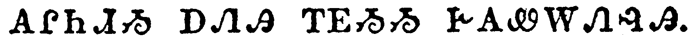

<table>
<tbody>
<tr class="odd">
<td><a href="071101.png">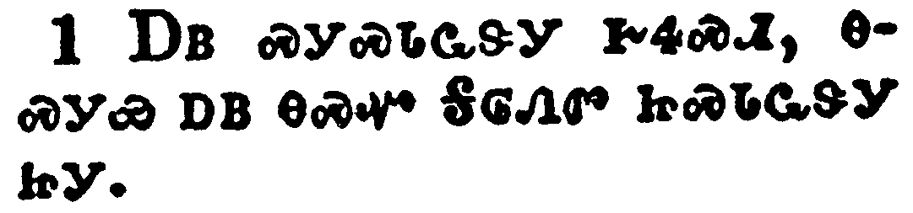</a></td>
</tr>
<tr class="even">
<td>Be ye followers of me, even as I also am of Christ.</td>
</tr>
<tr class="odd">
<td>ᎠᏴ ᏍᎩᏍᏓᏩᏕᎩ ᎨᏎᏍᏗ, ᎾᏍᎩᏯ ᎠᏴ ᎾᏍᏉ ᎦᎶᏁᏛ ᏥᏍᏓᏩᏕᎩ ᏥᎩ.</td>
</tr>
<tr class="even">
<td>A-yv s-gi-s-da-wa-de-gi ge-se-s-di, na-s-gi-ya a-yv na-s-quo Ga-lo-ne-dv tsi-s-da-wa-de-gi tsi-gi.</td>
</tr>
</tbody>
</table>

<table>
<tbody>
<tr class="odd">
<td><a href="071102.png">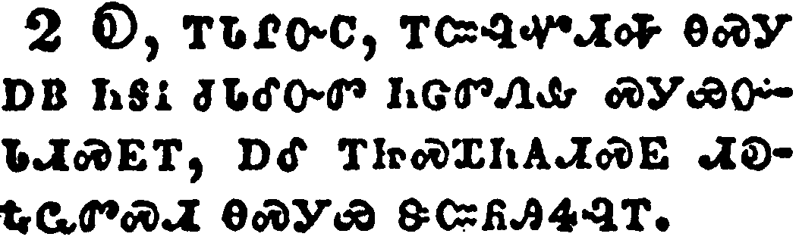</a></td>
</tr>
<tr class="even">
<td>Now I praise you, brethren, that ye remember me in all things, and keep the ordinances, as I delivered them to you.</td>
</tr>
<tr class="odd">
<td>Ꭷ, ᎢᏓᎵᏅᏟ, ᎢᏨᎸᏉᏗᎭ ᎾᏍᎩ ᎠᏴ ᏂᎦᎥ ᏧᏓᎴᏅᏛ ᏂᏣᏛᏁᎲ ᏍᎩᏯᏅᏓᏗᏍᎬᎢ, ᎠᎴ ᎢᏥᏍᏆᏂᎪᏗᏍᎬ ᏗᎧᎿᎭᏩᏛᏍᏗ ᎾᏍᎩᏯ ᏕᏨᏲᎯᏎᎸᎢ.</td>
</tr>
<tr class="even">
<td>Ka, i-da-li-nv-tli, i-tsv-lv-quo-di-ha na-s-gi a-yv ni-ga-v tsu-da-le-nv-dv ni-tsa-dv-ne-hv s-gi-ya-nv-da-di-s-gv-i, a-le i-tsi-s-qua-ni-go-di-s-gv di-ka-hna-wa-dv-s-di na-s-gi-ya de-tsv-yo-hi-se-lv-i.</td>
</tr>
</tbody>
</table>

<table>
<tbody>
<tr class="odd">
<td><a href="071103.png">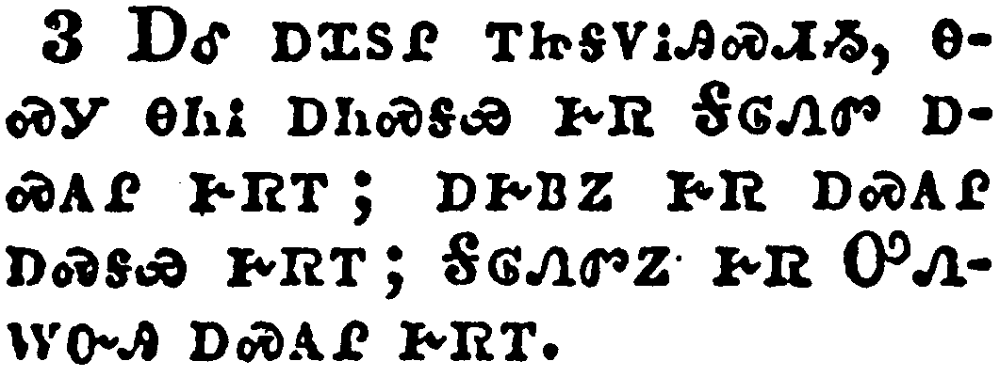</a></td>
</tr>
<tr class="even">
<td>But I would have you know, that the head of every man is Christ; and the head of the woman is the man; and the head of Christ is God.</td>
</tr>
<tr class="odd">
<td>ᎠᎴ ᎠᏆᏚᎵ ᎢᏥᎦᏙᎥᎯᏍᏗᏱ, ᎾᏍᎩ ᎾᏂᎥ ᎠᏂᏍᎦᏯ ᎨᏒ ᎦᎶᏁᏛ ᎠᏍᎪᎵ ᎨᏒᎢ; ᎠᎨᏴᏃ ᎨᏒ ᎠᏍᎪᎵ ᎠᏍᎦᏯ ᎨᏒᎢ; ᎦᎶᏁᏛᏃ ᎨᏒ ᎤᏁᎳᏅᎯ ᎠᏍᎪᎵ ᎨᏒᎢ.</td>
</tr>
<tr class="even">
<td>A-le a-qua-du-li i-tsi-ga-do-v-hi-s-di-yi, na-s-gi na-ni-v a-ni-s-ga-ya ge-sv Ga-lo-ne-dv a-s-go-li ge-sv-i; a-ge-yv-no ge-sv a-s-go-li a-s-ga-ya ge-sv-i; Ga-lo-ne-dv-no ge-sv U-ne-la-nv-hi a-s-go-li ge-sv-i.</td>
</tr>
</tbody>
</table>

<table>
<tbody>
<tr class="odd">
<td><a href="071104.png">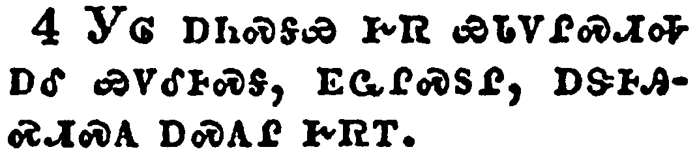</a></td>
</tr>
<tr class="even">
<td>Every man praying or prophesying, having his head covered, dishonoureth his head.</td>
</tr>
<tr class="odd">
<td>ᎩᎶ ᎠᏂᏍᎦᏯ ᎨᏒ ᏯᏓᏙᎵᏍᏗᎭ ᎠᎴ ᏯᏙᎴᎰᏍᎦ, ᎬᏩᎵᏍᏚᎵ, ᎠᏕᎰᎯᏍᏗᏍᎪ ᎠᏍᎪᎵ ᎨᏒᎢ.</td>
</tr>
<tr class="even">
<td>Gi-lo a-ni-s-ga-ya ge-sv ya-da-do-li-s-di-ha a-le ya-do-le-ho-s-ga, gv-wa-li-s-du-li, a-de-ho-hi-s-di-s-go a-s-go-li ge-sv-i.</td>
</tr>
</tbody>
</table>

<table>
<tbody>
<tr class="odd">
<td><a href="071105.png">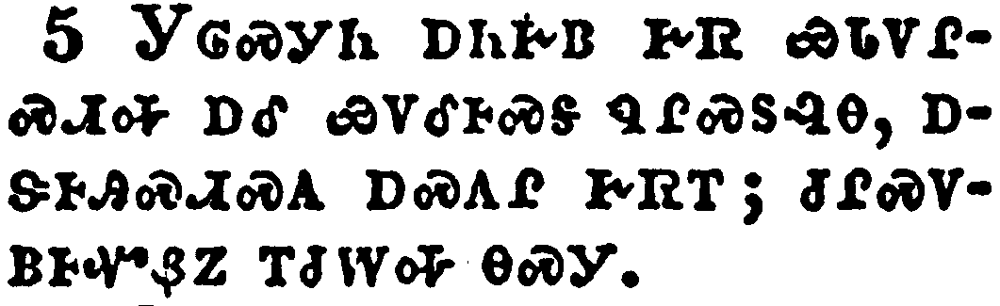</a></td>
</tr>
<tr class="even">
<td>But every woman that prayeth or prophesieth with her head uncovered dishonoureth her head: for that is even all one as if she were shaven.</td>
</tr>
<tr class="odd">
<td>ᎩᎶᏍᎩᏂ ᎠᏂᎨᏴ ᎨᏒ ᏯᏓᏙᎵᏍᏗᎭ ᎠᎴ ᏯᏙᎴᎰᏍᎦ ᏄᎵᏍᏚᎸᎾ, ᎠᏕᎰᎯᏍᏗᏍᎪ ᎠᏍᎪᎵ ᎨᏒᎢ; ᏧᎵᏍᏙᏴᎰᏉᏰᏃ ᎢᏧᎳᎭ ᎾᏍᎩ.</td>
</tr>
<tr class="even">
<td>Gi-lo-s-gi-ni a-ni-ge-yv ge-sv ya-da-do-li-s-di-ha a-le ya-do-le-ho-s-ga nu-li-s-du-lv-na, a-de-ho-hi-s-di-s-go a-s-go-li ge-sv-i; tsu-li-s-do-yv-ho-quo-ye-no i-tsu-la-ha na-s-gi.</td>
</tr>
</tbody>
</table>

<table>
<tbody>
<tr class="odd">
<td><a href="071106.png">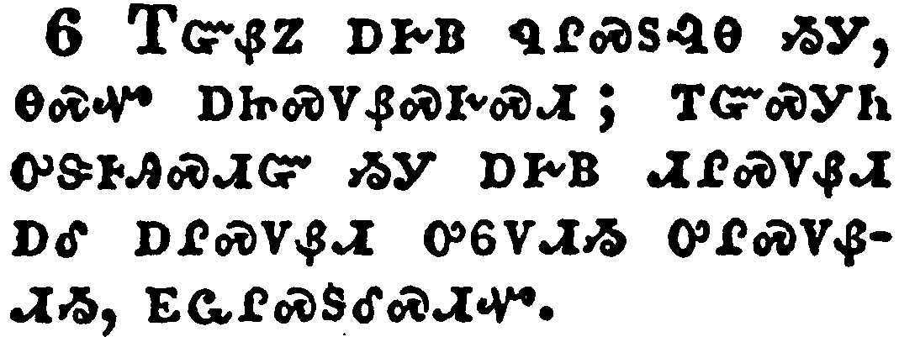</a></td>
</tr>
<tr class="even">
<td>For if the woman be not covered, let her also be shorn: but if it be a shame for a woman to be shorn or shaven, let her be covered.</td>
</tr>
<tr class="odd">
<td>ᎢᏳᏰᏃ ᎠᎨᏴ ᏄᎵᏍᏚᎸᎾ ᏱᎩ, ᎾᏍᏉ ᎠᏥᏍᏙᏰᏍᎨᏍᏗ; ᎢᏳᏍᎩᏂ ᎤᏕᎰᎯᏍᏗᏳ ᏱᎩ ᎠᎨᏴ ᏗᎵᏍᏙᏰᏗ ᎠᎴ ᎠᎵᏍᏙᏰᏗ ᎤᏮᏙᏗᏱ ᎤᎵᏍᏙᏰᏗᏱ, ᎬᏩᎵᏍᏚᎴᏍᏗᏉ.</td>
</tr>
<tr class="even">
<td>I-yu-ye-no a-ge-yv nu-li-s-du-lv-na yi-gi, na-s-quo a-tsi-s-do-ye-s-ge-s-di; i-yu-s-gi-ni u-de-ho-hi-s-di-yu yi-gi a-ge-yv di-li-s-do-ye-di a-le a-li-s-do-ye-di u-wv-do-di-yi u-li-s-do-ye-di-yi, gv-wa-li-s-du-le-s-di-quo.</td>
</tr>
</tbody>
</table>

<table>
<tbody>
<tr class="odd">
<td><a href="071107.png">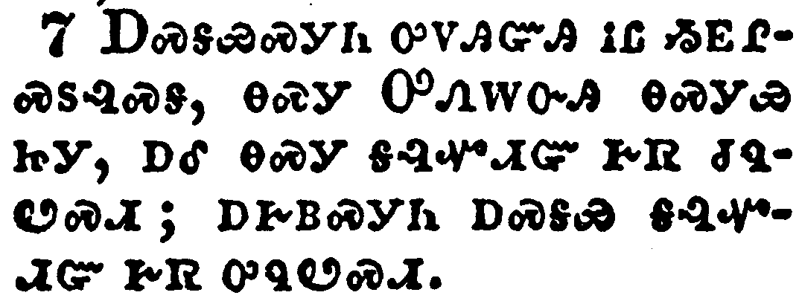</a></td>
</tr>
<tr class="even">
<td>For a man indeed ought not to cover his head, forasmuch as he is the image and glory of God: but the woman is the glory of the man.</td>
</tr>
<tr class="odd">
<td>ᎠᏍᎦᏯᏍᎩᏂ ᎤᏙᎯᏳᎯ ᎥᏝ ᏱᎬᎵᏍᏚᎸᏍᎦ, ᎾᏍᎩ ᎤᏁᎳᏅᎯ ᎾᏍᎩᏯ ᏥᎩ, ᎠᎴ ᎾᏍᎩ ᎦᎸᏉᏗᏳ ᎨᏒ ᏧᏄᏬᏍᏗ; ᎠᎨᏴᏍᎩᏂ ᎠᏍᎦᏯ ᎦᎸᏉᏗᏳ ᎨᏒ ᎤᏄᏬᏍᏗ.</td>
</tr>
<tr class="even">
<td>A-s-ga-ya-s-gi-ni u-do-hi-yu-hi v-tla yi-gv-li-s-du-lv-s-ga, na-s-gi U-ne-la-nv-hi na-s-gi-ya tsi-gi, a-le na-s-gi ga-lv-quo-di-yu ge-sv tsu-nu-wo-s-di; a-ge-yv-s-gi-ni a-s-ga-ya ga-lv-quo-di-yu ge-sv u-nu-wo-s-di.</td>
</tr>
</tbody>
</table>

<table>
<tbody>
<tr class="odd">
<td><a href="071108.png">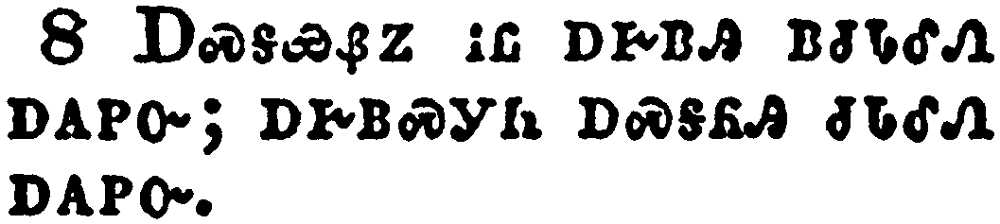</a></td>
</tr>
<tr class="even">
<td>For the man is not of the woman; but the woman of the man.</td>
</tr>
<tr class="odd">
<td>ᎠᏍᎦᏯᏰᏃ ᎥᏝ ᎠᎨᏴᎯ ᏴᏧᏓᎴᏁ ᎠᎪᏢᏅ; ᎠᎨᏴᏍᎩᏂ ᎠᏍᎦᏲᎯ ᏧᏓᎴᏁ ᎠᎪᏢᏅ.</td>
</tr>
<tr class="even">
<td>A-s-ga-ya-ye-no v-tla a-ge-yv-hi yv-tsu-da-le-ne a-go-tlv-nv; a-ge-yv-s-gi-ni a-s-ga-yo-hi tsu-da-le-ne a-go-tlv-nv.</td>
</tr>
</tbody>
</table>

<table>
<tbody>
<tr class="odd">
<td><a href="071109.png">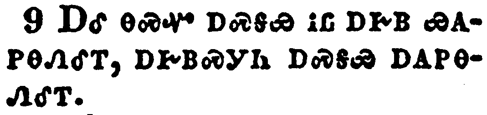</a></td>
</tr>
<tr class="even">
<td>Neither was the man created for the woman; but the woman for the man.</td>
</tr>
<tr class="odd">
<td>ᎠᎴ ᎾᏍᏉ ᎠᏍᎦᏯ ᎥᏝ ᎠᎨᏴ ᏯᎪᏢᎾᏁᎴᎢ, ᎠᎨᏴᏍᎩᏂ ᎠᏍᎦᏯ ᎠᎪᏢᎾᏁᎴᎢ.</td>
</tr>
<tr class="even">
<td>A-le na-s-quo a-s-ga-ya v-tla a-ge-yv ya-go-tlv-na-ne-le-i, a-ge-yv-s-gi-ni a-s-ga-ya a-go-tlv-na-ne-le-i.</td>
</tr>
</tbody>
</table>

<table>
<tbody>
<tr class="odd">
<td><a href="071110.png">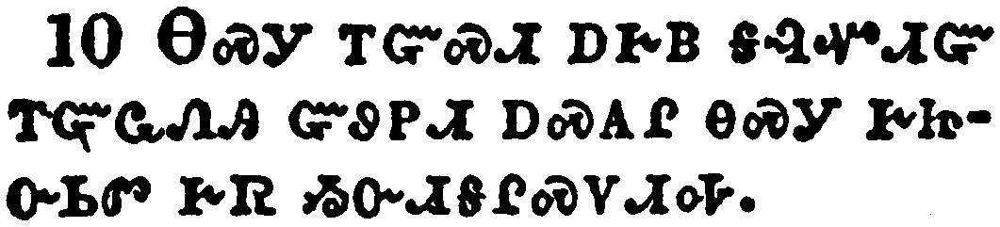</a></td>
</tr>
<tr class="even">
<td>For this cause ought the woman to have power on her head because of the angels.</td>
</tr>
<tr class="odd">
<td>ᎾᏍᎩ ᎢᏳᏍᏗ ᎠᎨᏴ ᎦᎸᏉᏗᏳ ᎢᏳᏩᏁᎯ ᏳᏭᏢᏗ ᎠᏍᎪᎵ ᎾᏍᎩ ᎨᏥᏅᏏᏛ ᎨᏒ ᏱᏅᏗᎦᎵᏍᏙᏗᎭ.</td>
</tr>
<tr class="even">
<td>Na-s-gi i-yu-s-di a-ge-yv ga-lv-quo-di-yu i-yu-wa-ne-hi yu-wu-tlv-di a-s-go-li na-s-gi ge-tsi-nv-si-dv ge-sv yi-nv-di-ga-li-s-do-di-ha.</td>
</tr>
</tbody>
</table>

<table>
<tbody>
<tr class="odd">
<td><a href="071111.png">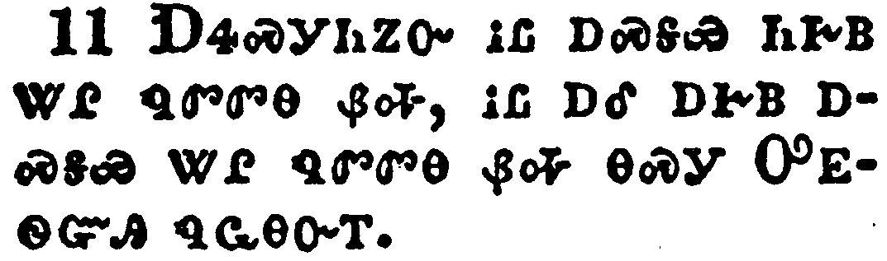</a></td>
</tr>
<tr class="even">
<td>Nevertheless neither is the man without the woman, neither the woman without the man, in the Lord.</td>
</tr>
<tr class="odd">
<td>ᎠᏎᏍᎩᏂᏃᏅ ᎥᏝ ᎠᏍᎦᏯ ᏂᎨᏴ ᏔᎵ ᏄᏛᏛᎾ ᏰᎭ, ᎥᏝ ᎠᎴ ᎠᎨᏴ ᎠᏍᎦᏯ ᏔᎵ ᏄᏛᏛᎾ ᏰᎭ ᎾᏍᎩ ᎤᎬᏫᏳᎯ ᏄᏩᎾᏅᎢ.</td>
</tr>
<tr class="even">
<td>A-se-s-gi-ni-no-nv v-tla a-s-ga-ya ni-ge-yv ta-li nu-dv-dv-na ye-ha, v-tla a-le a-ge-yv a-s-ga-ya ta-li nu-dv-dv-na ye-ha na-s-gi U-gv-wi-yu-hi nu-wa-na-nv-i.</td>
</tr>
</tbody>
</table>

<table>
<tbody>
<tr class="odd">
<td><a href="071112.png">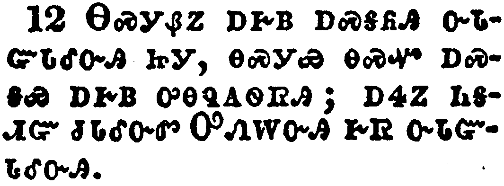</a></td>
</tr>
<tr class="even">
<td>For as the woman is of the man, even so is the man also by the woman; but all things of god.</td>
</tr>
<tr class="odd">
<td>ᎾᏍᎩᏰᏃ ᎠᎨᏴ ᎠᏍᎦᏲᎯ ᏅᏓᏳᏓᎴᏅᎯ ᏥᎩ, ᎾᏍᎩᏯ ᎾᏍᏉ ᎠᏍᎦᏯ ᎠᎨᏴ ᎤᎾᏄᎪᏫᏒᎯ; ᎠᏎᏃ ᏂᎦᏗᏳ ᏧᏓᎴᏅᏛ ᎤᏁᎳᏅᎯ ᎨᏒ ᏅᏓᏳᏓᎴᏅᎯ.</td>
</tr>
<tr class="even">
<td>Na-s-gi-ye-no a-ge-yv a-s-ga-yo-hi nv-da-yu-da-le-nv-hi tsi-gi, na-s-gi-ya na-s-quo a-s-ga-ya a-ge-yv u-na-nu-go-wi-sv-hi; a-se-no ni-ga-di-yu tsu-da-le-nv-dv U-ne-la-nv-hi ge-sv nv-da-yu-da-le-nv-hi.</td>
</tr>
</tbody>
</table>

<table>
<tbody>
<tr class="odd">
<td><a href="071113.png">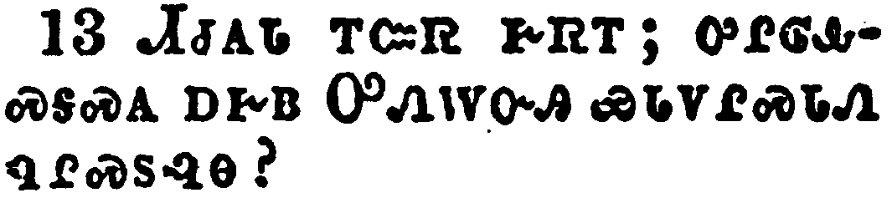</a></td>
</tr>
<tr class="even">
<td>Judge in yourselves: is it comely that a woman pray unto God uncovered?</td>
</tr>
<tr class="odd">
<td>ᏗᏧᎪᏓ ᎢᏨᏒ ᎨᏒᎢ; ᎤᎵᎶᎲᏍᎦᏍᎪ ᎠᎨᏴ ᎤᏁᎳᏅᎯ ᏯᏓᏙᎵᏍᏓᏁ ᏄᎵᏍᏚᎸᎾ?</td>
</tr>
<tr class="even">
<td>Di-tsu-go-da i-tsv-sv ge-sv-i; u-li-lo-hv-s-ga-s-go a-ge-yv U-ne-la-nv-hi ya-da-do-li-s-da-ne nu-li-s-du-lv-na?</td>
</tr>
</tbody>
</table>

<table>
<tbody>
<tr class="odd">
<td><a href="071114.png">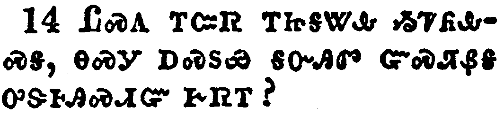</a></td>
</tr>
<tr class="even">
<td>Doth not even nature itself teach you, that, if a man have long hair, it is a shame unto him?</td>
</tr>
<tr class="odd">
<td>ᏝᏍᎪ ᎢᏨᏒ ᎢᏥᎦᏔᎲ ᏱᏤᏲᎲᏍᎦ, ᎾᏍᎩ ᎠᏍᏚᏯ ᎦᏅᎯᏛ ᏳᏍᏘᏰᎦ ᎤᏕᎰᎯᏍᏗᏳ ᎨᏒᎢ?</td>
</tr>
<tr class="even">
<td>Tla-s-go i-tsv-sv i-tsi-ga-ta-hv yi-tse-yo-hv-s-ga, na-s-gi a-s-du-ya ga-nv-hi-dv yu-s-ti-ye-ga u-de-ho-hi-s-di-yu ge-sv-i?</td>
</tr>
</tbody>
</table>

<table>
<tbody>
<tr class="odd">
<td><a href="071115.png">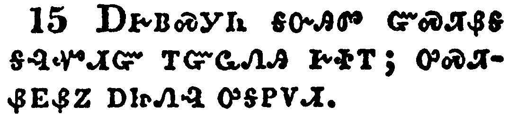</a></td>
</tr>
<tr class="even">
<td>But if a woman have long hair, it is a glory to her: for her hair is given her for a covering.</td>
</tr>
<tr class="odd">
<td>ᎠᎨᏴᏍᎩᏂ ᎦᏅᎯᏛ ᏳᏍᏘᏰᎦ ᎦᎸᏉᏗᏳ ᎢᏳᏩᏁᎯ ᎨᏐᎢ; ᎤᏍᏘᏰᎬᏰᏃ ᎠᏥᏁᎸ ᎤᎦᏢᏙᏗ.</td>
</tr>
<tr class="even">
<td>A-ge-yv-s-gi-ni ga-nv-hi-dv yu-s-ti-ye-ga ga-lv-quo-di-yu i-yu-wa-ne-hi ge-so-i; u-s-ti-ye-gv-ye-no a-tsi-ne-lv u-ga-tlv-do-di.</td>
</tr>
</tbody>
</table>

<table>
<tbody>
<tr class="odd">
<td><a href="071116.png">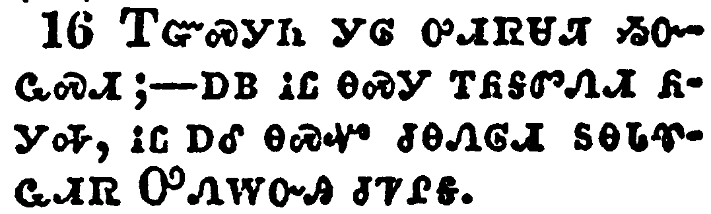</a></td>
</tr>
<tr class="even">
<td>But if any man seem to be contentious, we have no such custom, neither the churches of God.</td>
</tr>
<tr class="odd">
<td>ᎢᏳᏍᎩᏂ ᎩᎶ ᎤᏗᏒᏌᏘ ᏱᏅᏩᏍᏗ; ^ᎠᏴ ᎥᏝ ᎾᏍᎩ ᎢᏲᎦᏛᏁᏗ ᏲᎩᎭ, ᎥᏝ ᎠᎴ ᎾᏍᏉ ᏧᎾᏁᎶᏗ ᏚᎾᏓᏡᏩᏗᏒ ᎤᏁᎳᏅᎯ ᏧᏤᎵᎦ.</td>
</tr>
<tr class="even">
<td>I-yu-s-gi-ni gi-lo u-di-sv-sa-ti yi-nv-wa-s-di; ^a-yv v-tla na-s-gi i-yo-ga-dv-ne-di yo-gi-ha, v-tla a-le na-s-quo tsu-na-ne-lo-di du-na-da-tlu-wa-di-sv U-ne-la-nv-hi tsu-tse-li-ga.</td>
</tr>
</tbody>
</table>

<table>
<tbody>
<tr class="odd">
<td><a href="071117.png">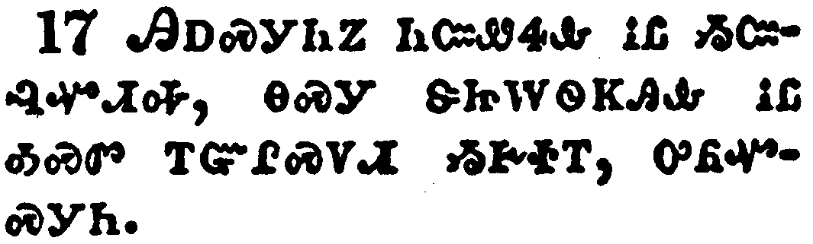</a></td>
</tr>
<tr class="even">
<td>Now in this that I declare unto you I praise you not, that ye come together not for the better, but for the worse.</td>
</tr>
<tr class="odd">
<td>ᎯᎠᏍᎩᏂᏃ ᏂᏨᏪᏎᎲ ᎥᏝ ᏱᏨᎸᏉᏗᎭ, ᎾᏍᎩ ᏕᏥᎳᏫᏦᎯᎲ ᎥᏝ ᎣᏍᏛ ᎢᏳᎵᏍᏙᏗ ᏱᎨᏐᎢ, ᎤᏲᏉᏍᎩᏂ.</td>
</tr>
<tr class="even">
<td>Hi-a-s-gi-ni-no ni-tsv-we-se-hv v-tla yi-tsv-lv-quo-di-ha, na-s-gi de-tsi-la-wi-tso-hi-hv v-tla o-s-dv i-yu-li-s-do-di yi-ge-so-i, u-yo-quo-s-gi-ni.</td>
</tr>
</tbody>
</table>

<table>
<tbody>
<tr class="odd">
<td><a href="071118.png">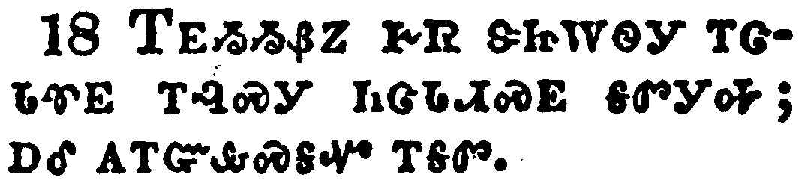</a></td>
</tr>
<tr class="even">
<td>For first of all, when ye come together in the church, I hear that there be divisions among you; and I partly believe it.</td>
</tr>
<tr class="odd">
<td>ᎢᎬᏱᏱᏰᏃ ᎨᏒ ᏕᏥᎳᏫᎩ ᎢᏣᏓᏡᎬ ᎢᎸᏍᎩ ᏂᏣᏓᏗᏍᎬ ᎦᏛᎩᎭ; ᎠᎴ ᎪᎢᏳᎲᏍᎦᏉ ᎢᎦᏛ.</td>
</tr>
<tr class="even">
<td>I-gv-yi-yi-ye-no ge-sv de-tsi-la-wi-gi i-tsa-da-tlu-gv i-lv-s-gi ni-tsa-da-di-s-gv ga-dv-gi-ha; a-le go-i-yu-hv-s-ga-quo i-ga-dv.</td>
</tr>
</tbody>
</table>

<table>
<tbody>
<tr class="odd">
<td><a href="071119.png">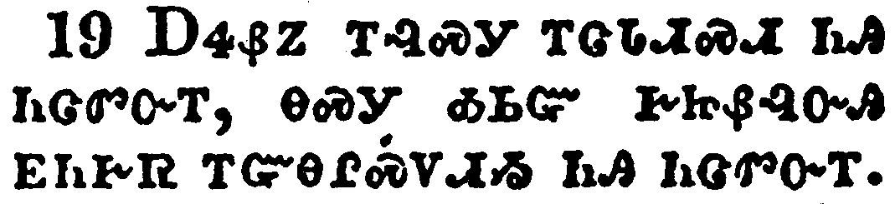</a></td>
</tr>
<tr class="even">
<td>For there must be also heresies among you, that they which are approved may be made manifest among you.</td>
</tr>
<tr class="odd">
<td>ᎠᏎᏰᏃ ᎢᎸᏍᎩ ᎢᏣᏓᏗᏍᏗ ᏂᎯ ᏂᏣᏛᏅᎢ, ᎾᏍᎩ ᎣᏏᏳ ᎨᏥᏰᎸᏅᎯ ᎬᏂᎨᏒ ᎢᏳᎾᎵᏍᏙᏗᏱ ᏂᎯ ᏂᏣᏛᏅᎢ.</td>
</tr>
<tr class="even">
<td>A-se-ye-no i-lv-s-gi i-tsa-da-di-s-di ni-hi ni-tsa-dv-nv-i, na-s-gi o-si-yu ge-tsi-ye-lv-nv-hi gv-ni-ge-sv i-yu-na-li-s-do-di-yi ni-hi ni-tsa-dv-nv-i.</td>
</tr>
</tbody>
</table>

<table>
<tbody>
<tr class="odd">
<td><a href="071120.png">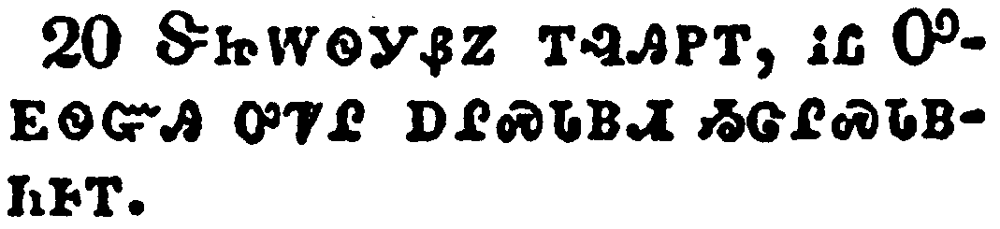</a></td>
</tr>
<tr class="even">
<td>When ye come together therefore into one place, this is not to eat the Lord's supper.</td>
</tr>
<tr class="odd">
<td>ᏕᏥᎳᏫᎩᏰᏃ ᎢᎸᎯᏢᎢ, ᎥᏝ ᎤᎬᏫᏳᎯ ᎤᏤᎵ ᎠᎵᏍᏓᏴᏗ ᏱᏣᎵᏍᏓᏴᏂᎰᎢ.</td>
</tr>
<tr class="even">
<td>De-tsi-la-wi-gi-ye-no i-lv-hi-tlv-i, v-tla U-gv-wi-yu-hi u-tse-li a-li-s-da-yv-di yi-tsa-li-s-da-yv-ni-ho-i.</td>
</tr>
</tbody>
</table>

<table>
<tbody>
<tr class="odd">
<td><a href="071121.png">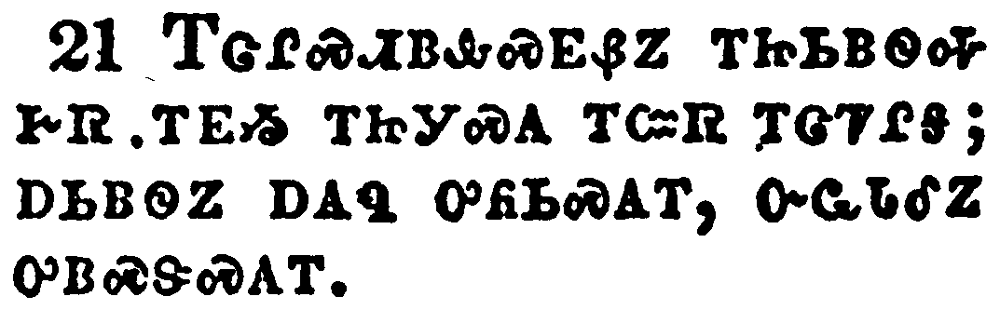</a></td>
</tr>
<tr class="even">
<td>For in eating every one taketh before other his own supper: and one is hungry, and another is drunken.</td>
</tr>
<tr class="odd">
<td>ᎢᏣᎵᏍᏗᏴᎲᏍᎬᏰᏃ ᎢᏥᏏᏴᏫᎭ ᎨᏒ ᎢᎬᏱ ᎢᏥᎩᏍᎪ ᎢᏨᏒ ᎢᏣᏤᎵᎦ; ᎠᏏᏴᏫᏃ ᎠᎪᏄ ᎤᏲᏏᏍᎪᎢ, ᏅᏩᏓᎴᏃ ᎤᏴᏍᏕᏍᎪᎢ.</td>
</tr>
<tr class="even">
<td>I-tsa-li-s-di-yv-hv-s-gv-ye-no i-tsi-si-yv-wi-ha ge-sv i-gv-yi i-tsi-gi-s-go i-tsv-sv i-tsa-tse-li-ga; a-si-yv-wi-no a-go-nu u-yo-si-s-go-i, nv-wa-da-le-no u-yv-s-de-s-go-i.</td>
</tr>
</tbody>
</table>

<table>
<tbody>
<tr class="odd">
<td><a href="071122.png">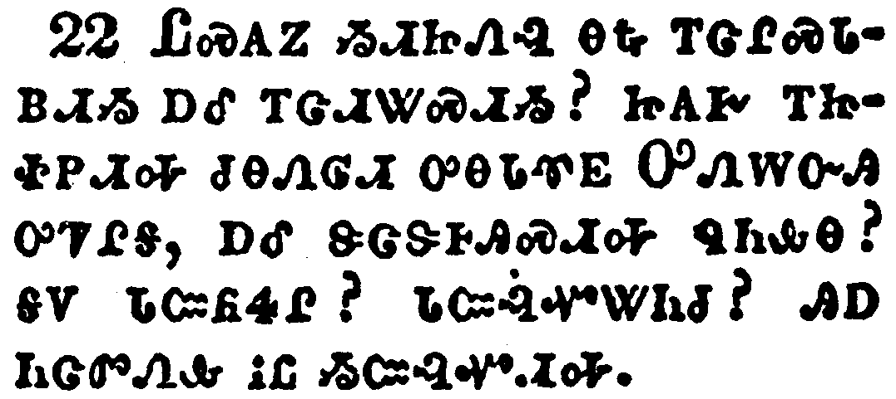</a></td>
</tr>
<tr class="even">
<td>What? have ye not houses to eat and to drink in? or despise ye the church of God, and shame them that have not? What shall I say to you? shall I praise you in this? I praise you not.</td>
</tr>
<tr class="odd">
<td>ᏝᏍᎪᏃ ᏱᏗᏥᏁᎸ ᎾᎿᎭᎢᏣᎵᏍᏓᏴᏗᏱ ᎠᎴ ᎢᏔᏗᏔᏍᏗᏱ? ᏥᎪᎨ ᎢᏥᏐᏢᏗᎭ ᏧᎾᏁᎶᏗ ᎤᎾᏓᏡᎬ ᎤᏁᎳᏅᎯ ᎤᏤᎵᎦ, ᎠᎴ ᏕᏣᏕᎰᎯᏍᏗᎭ ᏄᏂᎲᎾ? ᎦᏙ ᏓᏨᏲᏎᎵ? ᏓᏨᎸᏉᏔᏂᏧ? ᎯᎠ ᏂᏨᏛᏁᎲ ᎥᏝ ᏱᏨᎸᏉᏗᎭ.</td>
</tr>
<tr class="even">
<td>Tla-s-go-no yi-di-tsi-ne-lv na-hna i-tsa-li-s-da-yv-di-yi a-le i-ta-di-ta-s-di-yi? tsi-go-ge i-tsi-so-tlv-di-ha tsu-na-ne-lo-di u-na-da-tlu-gv U-ne-la-nv-hi u-tse-li-ga, a-le de-tsa-de-ho-hi-s-di-ha nu-ni-hv-na? ga-do da-tsv-yo-se-li? da-tsv-lv-quo-ta-ni-tsu? hi-a ni-tsv-dv-ne-hv v-tla yi-tsv-lv-quo-di-ha.</td>
</tr>
</tbody>
</table>

<table>
<tbody>
<tr class="odd">
<td><a href="071123.png">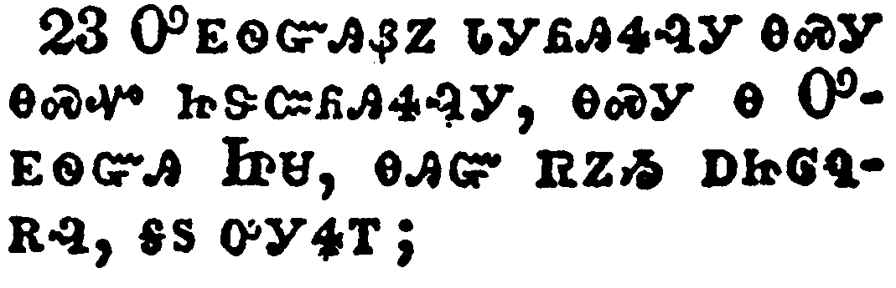</a></td>
</tr>
<tr class="even">
<td>For I have received of the Lord that which also I delivered unto you, That the Lord Jesus the same night in which he was betrayed took bread:</td>
</tr>
<tr class="odd">
<td>ᎤᎬᏫᏳᎯᏰᏃ ᏓᎩᏲᎯᏎᎸᎩ ᎾᏍᎩ ᎾᏍᏉ ᏥᏕᏨᏲᎯᏎᎸᎩ, ᎾᏍᎩ Ꮎ ᎤᎬᏫᏳᎯ ᏥᏌ, ᎾᎯᏳ ᏒᏃᏱ ᎠᏥᎶᏄᎡᎸ, ᎦᏚ ᎤᎩᏎᎢ;</td>
</tr>
<tr class="even">
<td>U-gv-wi-yu-hi-ye-no da-gi-yo-hi-se-lv-gi na-s-gi na-s-quo tsi-de-tsv-yo-hi-se-lv-gi, na-s-gi na U-gv-wi-yu-hi Tsi-sa, na-hi-yu sv-no-yi a-tsi-lo-nu-e-lv, ga-du u-gi-se-i;</td>
</tr>
</tbody>
</table>

<table>
<tbody>
<tr class="odd">
<td><a href="071124.png">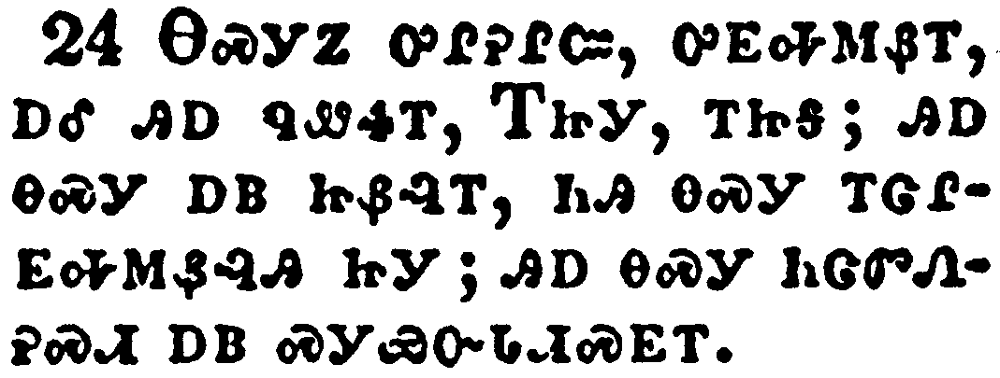</a></td>
</tr>
<tr class="even">
<td>And when he had given thanks, he brake it, and said, Take, eat: this is my body, which is broken for you: this do in remembrance of me.</td>
</tr>
<tr class="odd">
<td>ᎾᏍᎩᏃ ᎤᎵᎮᎵᏨ, ᎤᎬᎭᎷᏰᎢ, ᎠᎴ ᎯᎠ ᏄᏪᏎᎢ, ᎢᏥᎩ, ᎢᏥᎦ; ᎯᎠ ᎾᏍᎩ ᎠᏴ ᏥᏰᎸᎢ, ᏂᎯ ᎾᏍᎩ ᎢᏣᎵᎬᎭᎷᏰᎸᎯ ᏥᎩ; ᎯᎠ ᎾᏍᎩ ᏂᏣᏛᏁᎮᏍᏗ ᎠᏴ ᏍᎩᏯᏅᏓᏗᏍᎬᎢ.</td>
</tr>
<tr class="even">
<td>Na-s-gi-no u-li-he-li-tsv, u-gv-ha-lu-ye-i, a-le hi-a nu-we-se-i, I-tsi-gi, i-tsi-ga; hi-a na-s-gi a-yv tsi-ye-lv-i, ni-hi na-s-gi i-tsa-li-gv-ha-lu-ye-lv-hi tsi-gi; hi-a na-s-gi ni-tsa-dv-ne-he-s-di a-yv s-gi-ya-nv-da-di-s-gv-i.</td>
</tr>
</tbody>
</table>

<table>
<tbody>
<tr class="odd">
<td><a href="071125.png">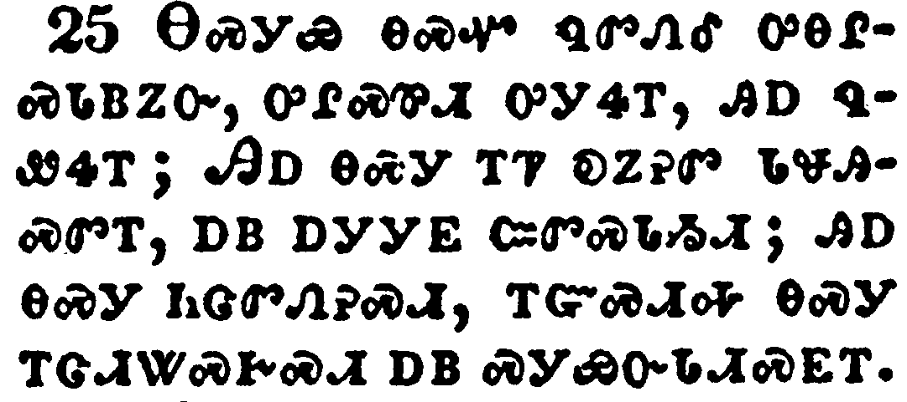</a></td>
</tr>
<tr class="even">
<td>After the same manner also he took the cup, when he had supped, saying, This cup is the new testament in my blood: this do ye, as oft as ye drink it, in remembrance of me.</td>
</tr>
<tr class="odd">
<td>ᎾᏍᎩᏯ ᎾᏍᏉ ᏄᏛᏁᎴ ᎤᎾᎵᏍᏓᏴᏃᏅ, ᎤᎵᏍᏈᏗ ᎤᎩᏎᎢ, ᎯᎠ ᏄᏪᏎᎢ; ᎯᎠ ᎾᏍᎩ ᎢᏤ ᎧᏃᎮᏛ ᏓᏠᎯᏍᏛᎢ, ᎠᏴ ᎠᎩᎩᎬ ᏨᏛᏍᏓᏱᏗ; ᎯᎠ ᎾᏍᎩ ᏂᏣᏛᏁᎮᏍᏗ, ᎢᏳᏍᏗᎭ ᎾᏍᎩ ᎢᏣᏗᏔᏍᎨᏍᏗ ᎠᏴ ᏍᎩᏯᏅᏓᏗᏍᎬᎢ.</td>
</tr>
<tr class="even">
<td>Na-s-gi-ya na-s-quo nu-dv-ne-le u-na-li-s-da-yv-no-nv, u-li-s-qui-di u-gi-se-i, hi-a nu-we-se-i; Hi-a na-s-gi i-tse ka-no-he-dv da-tlo-hi-s-dv-i, a-yv a-gi-gi-gv tsv-dv-s-da-yi-di; hi-a na-s-gi ni-tsa-dv-ne-he-s-di, i-yu-s-di-ha na-s-gi i-tsa-di-ta-s-ge-s-di a-yv s-gi-ya-nv-da-di-s-gv-i.</td>
</tr>
</tbody>
</table>

<table>
<tbody>
<tr class="odd">
<td><a href="071126.png">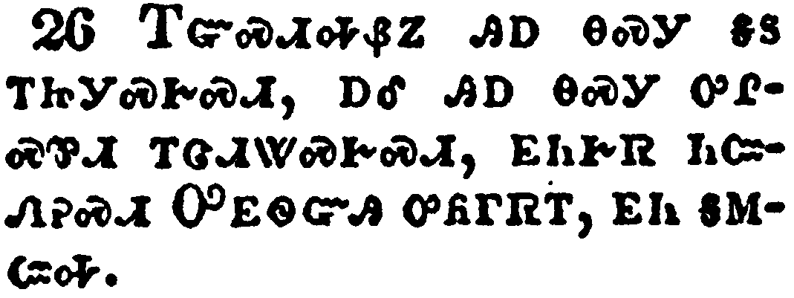</a></td>
</tr>
<tr class="even">
<td>For as often as ye eat this bread, and drink this cup, ye do shew the Lord's death till he come.</td>
</tr>
<tr class="odd">
<td>ᎢᏳᏍᏗᎭᏰᏃ ᎯᎠ ᎾᏍᎩ ᎦᏚ ᎢᏥᎩᏍᎨᏍᏗ, ᎠᎴ ᎯᎠ ᎾᏍᎩ ᎤᎵᏍᏈᏗ ᎢᏣᏗᏔᏍᎨᏍᏗ, ᎬᏂᎨᏒ ᏂᏨᏁᎮᏍᏗ ᎤᎬᏫᏳᎯ ᎤᏲᎱᏒᎢ, ᎬᏂ ᎦᎷᏨᎭ.</td>
</tr>
<tr class="even">
<td>I-yu-s-di-ha-ye-no hi-a na-s-gi ga-du i-tsi-gi-s-ge-s-di, a-le hi-a na-s-gi u-li-s-qui-di i-tsa-di-ta-s-ge-s-di, gv-ni-ge-sv ni-tsv-ne-he-s-di U-gv-wi-yu-hi u-yo-hu-sv-i, gv-ni ga-lu-tsv-ha.</td>
</tr>
</tbody>
</table>

<table>
<tbody>
<tr class="odd">
<td><a href="071127.png">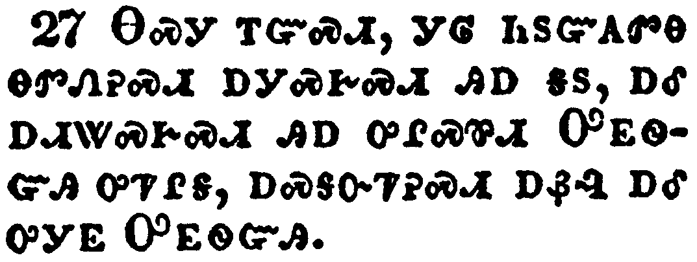</a></td>
</tr>
<tr class="even">
<td>Wherefore whosoever shall eat this bread, and drink this cup of the Lord, unworthily, shall be guilty of the body and blood of the Lord.</td>
</tr>
<tr class="odd">
<td>ᎾᏍᎩ ᎢᏳᏍᏗ, ᎩᎶ ᏂᏚᏳᎪᏛᎾ ᎾᏛᏁᎮᏍᏗ ᎠᎩᏍᎨᏍᏗ ᎯᎠ ᎦᏚ, ᎠᎴ ᎠᏗᏔᏍᎨᏍᏗ ᎯᎠ ᎤᎵᏍᏈᏗ ᎤᎬᏫᏳᎯ ᎤᏤᎵᎦ, ᎠᏍᎦᏅᏤᎮᏍᏗ ᎠᏰᎸ ᎠᎴ ᎤᎩᎬ ᎤᎬᏫᏳᎯ.</td>
</tr>
<tr class="even">
<td>Na-s-gi i-yu-s-di, gi-lo ni-du-yu-go-dv-na na-dv-ne-he-s-di a-gi-s-ge-s-di hi-a ga-du, a-le a-di-ta-s-ge-s-di hi-a u-li-s-qui-di U-gv-wi-yu-hi u-tse-li-ga, a-s-ga-nv-tse-he-s-di a-ye-lv a-le u-gi-gv U-gv-wi-yu-hi.</td>
</tr>
</tbody>
</table>

<table>
<tbody>
<tr class="odd">
<td><a href="071128.png">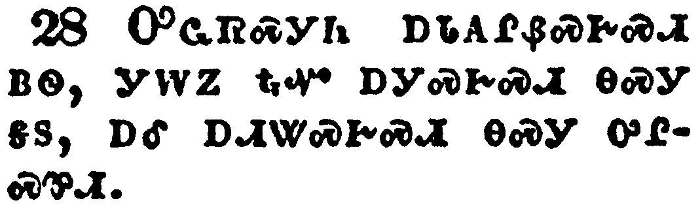</a></td>
</tr>
<tr class="even">
<td>But let a man examine himself, and so let him eat of that bread, and drink of that cup.</td>
</tr>
<tr class="odd">
<td>ᎤᏩᏒᏍᎩᏂ ᎠᏓᎪᎵᏰᏍᎨᏍᏗ ᏴᏫ, ᎩᎳᏃ ᎿᎭᏉ ᎠᎩᏍᎨᏍᏗ ᎾᏍᎩ ᎦᏚ, ᎠᎴ ᎠᏗᏔᏍᎨᏍᏗ ᎾᏍᎩ ᎤᎵᏍᏈᏗ.</td>
</tr>
<tr class="even">
<td>U-wa-sv-s-gi-ni a-da-go-li-ye-s-ge-s-di yv-wi, gi-la-no hna-quo a-gi-s-ge-s-di na-s-gi ga-du, a-le a-di-ta-s-ge-s-di na-s-gi u-li-s-qui-di.</td>
</tr>
</tbody>
</table>

<table>
<tbody>
<tr class="odd">
<td><a href="071129.png">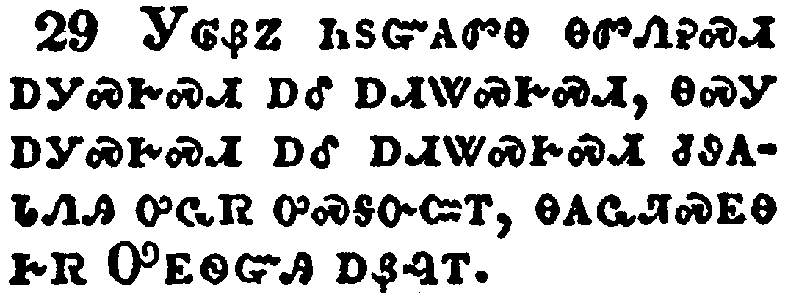</a></td>
</tr>
<tr class="even">
<td>For he that eateth and drinketh unworthily, eateth and drinketh damnation to himself, not discerning the Lord's body.</td>
</tr>
<tr class="odd">
<td>ᎩᎶᏰᏃ ᏂᏚᏳᎪᏛᎾ ᎾᏛᏁᎮᏍᏗ ᎠᎩᏍᎨᏍᏗ ᎠᎴ ᎠᏗᏔᏍᎨᏍᏗ, ᎾᏍᎩ ᎠᎩᏍᎨᏍᏗ ᎠᎴ ᎠᏗᏔᏍᎨᏍᏗ ᏧᏭᎪᏓᏁᎯ ᎤᏩᏒ ᎤᏍᎦᏅᏨᎢ, ᎾᎪᏩᏘᏍᎬᎾ ᎨᏒ ᎤᎬᏫᏳᎯ ᎠᏰᎸᎢ.</td>
</tr>
<tr class="even">
<td>Gi-lo-ye-no ni-du-yu-go-dv-na na-dv-ne-he-s-di a-gi-s-ge-s-di a-le a-di-ta-s-ge-s-di, na-s-gi a-gi-s-ge-s-di a-le a-di-ta-s-ge-s-di tsu-wu-go-da-ne-hi u-wa-sv u-s-ga-nv-tsv-i, na-go-wa-ti-s-gv-na ge-sv U-gv-wi-yu-hi a-ye-lv-i.</td>
</tr>
</tbody>
</table>

<table>
<tbody>
<tr class="odd">
<td><a href="071130.png">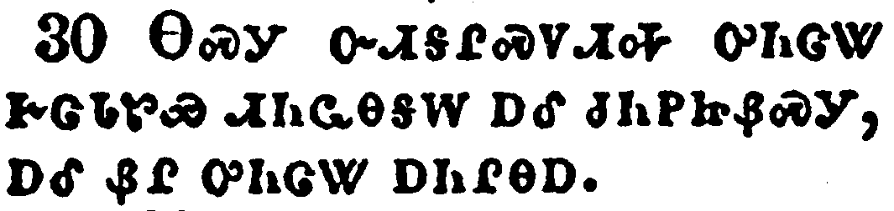</a></td>
</tr>
<tr class="even">
<td>For this cause many are weak and sickly among you, and many sleep.</td>
</tr>
<tr class="odd">
<td>ᎾᏍᎩ ᏅᏗᎦᎵᏍᏙᏗᎭ ᎤᏂᏣᏔ ᎨᏣᏓᏑᏯ ᏗᏂᏩᎾᎦᎳ ᎠᎴ ᏧᏂᏢᏥᏰᏍᎩ, ᎠᎴ ᏰᎵ ᎤᏂᏣᏔ ᎠᏂᎵᎾᎠ.</td>
</tr>
<tr class="even">
<td>Na-s-gi nv-di-ga-li-s-do-di-ha u-ni-tsa-ta ge-tsa-da-su-ya di-ni-wa-na-ga-la a-le tsu-ni-tlv-tsi-ye-s-gi, a-le ye-li u-ni-tsa-ta a-ni-li-na-a.</td>
</tr>
</tbody>
</table>

<table>
<tbody>
<tr class="odd">
<td><a href="071131.png">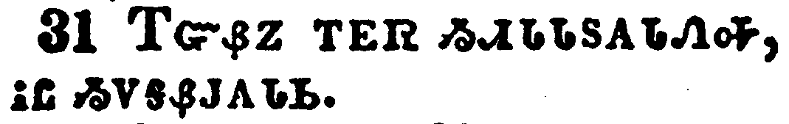</a></td>
</tr>
<tr class="even">
<td>For if we would judge ourselves, we should not be judged.</td>
</tr>
<tr class="odd">
<td>ᎢᏳᏰᏃ ᎢᎬᏒ ᏱᏗᏓᏓᏚᎪᏓᏁᎭ, ᎥᏝ ᏱᏙᎦᏰᎫᎪᏓᏏ.</td>
</tr>
<tr class="even">
<td>I-yu-ye-no i-gv-sv yi-di-da-da-du-go-da-ne-ha, v-tla yi-do-ga-ye-gu-go-da-si.</td>
</tr>
</tbody>
</table>

<table>
<tbody>
<tr class="odd">
<td><a href="071132.png">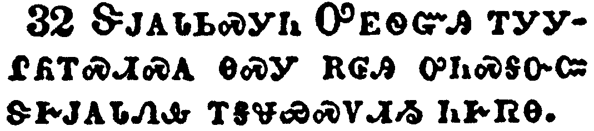</a></td>
</tr>
<tr class="even">
<td>But when we are judged, we are chastened of the Lord, that we should not be condemned with the world.</td>
</tr>
<tr class="odd">
<td>ᏕᎫᎪᏓᏏᏍᎩᏂ ᎤᎬᏫᏳᎯ ᎢᎩᎩᎵᏲᎢᏍᏗᏍᎪ ᎾᏍᎩ ᎡᎶᎯ ᎤᏂᏍᎦᏅᏨ ᏕᎨᎫᎪᏓᏁᎲ ᎢᎦᏠᏯᏍᏙᏗᏱ ᏂᎨᏒᎾ.</td>
</tr>
<tr class="even">
<td>De-gu-go-da-si-s-gi-ni U-gv-wi-yu-hi i-gi-gi-li-yo-i-s-di-s-go na-s-gi e-lo-hi u-ni-s-ga-nv-tsv de-ge-gu-go-da-ne-hv i-ga-tlo-ya-s-do-di-yi ni-ge-sv-na.</td>
</tr>
</tbody>
</table>

<table>
<tbody>
<tr class="odd">
<td><a href="071133.png">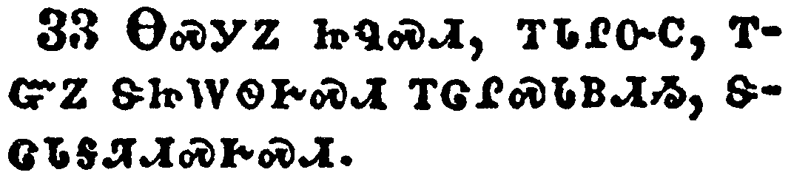</a></td>
</tr>
<tr class="even">
<td>Wherefore, my brethren, when ye come together to eat, tarry one for another.</td>
</tr>
<tr class="odd">
<td>ᎾᏍᎩᏃ ᏥᏄᏍᏗ, ᎢᏓᎵᏅᏟ, ᎢᏳᏃ ᏕᏥᎳᏫᎨᏍᏗ ᎢᏣᎵᏍᏓᏴᏗᏱ, ᏕᏣᏓᎦᏘᏗᏍᎨᏍᏗ.</td>
</tr>
<tr class="even">
<td>Na-s-gi-no tsi-nu-s-di, i-da-li-nv-tli, i-yu-no de-tsi-la-wi-ge-s-di i-tsa-li-s-da-yv-di-yi, de-tsa-da-ga-ti-di-s-ge-s-di.</td>
</tr>
</tbody>
</table>

<table>
<tbody>
<tr class="odd">
<td><a href="071134.png">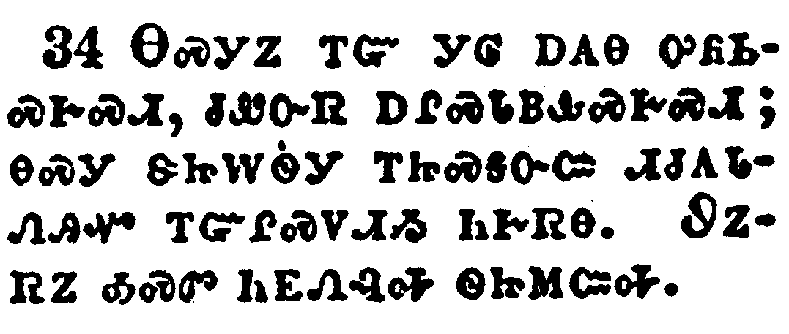</a></td>
</tr>
<tr class="even">
<td>And if any man hunger, let him eat at home; that ye come not together unto condemnation. And the rest will I set in order when I come.</td>
</tr>
<tr class="odd">
<td>ᎾᏍᎩᏃ ᎢᏳ ᎩᎶ ᎠᎪᎾ ᎤᏲᏏᏍᎨᏍᏗ, ᏧᏪᏅᏒ ᎠᎵᏍᏓᏴᎲᏍᎨᏍᏗ; ᎾᏍᎩ ᏕᏥᎳᏫᎩ ᎢᏥᏍᎦᏅᏨ ᏗᏧᎪᏓᏁᎯᏉ ᎢᏳᎵᏍᏙᏗᏱ ᏂᎨᏒᎾ. ᏭᏃᏒᏃ ᎣᏍᏛ ᏂᎬᏁᎸᎭ ᏫᏥᎷᏨᎭ.</td>
</tr>
<tr class="even">
<td>Na-s-gi-no i-yu gi-lo a-go-na u-yo-si-s-ge-s-di, tsu-we-nv-sv a-li-s-da-yv-hv-s-ge-s-di; na-s-gi de-tsi-la-wi-gi i-tsi-s-ga-nv-tsv di-tsu-go-da-ne-hi-quo i-yu-li-s-do-di-yi ni-ge-sv-na. Wu-no-sv-no o-s-dv ni-gv-ne-lv-ha wi-tsi-lu-tsv-ha.</td>
</tr>
</tbody>
</table>

