+++
draft=false
date = 2014-12-18T21:11:07Z
title = "1 Corinthians - Chapter 13 - Cherokee New Testament"
weight = 1418955067

[taxonomies]

authors = ["Timothy Legg"]
categories = []
tags = []

[extra]
+++

<table>
<tbody>
<tr class="odd">
<td><a href="071301.png">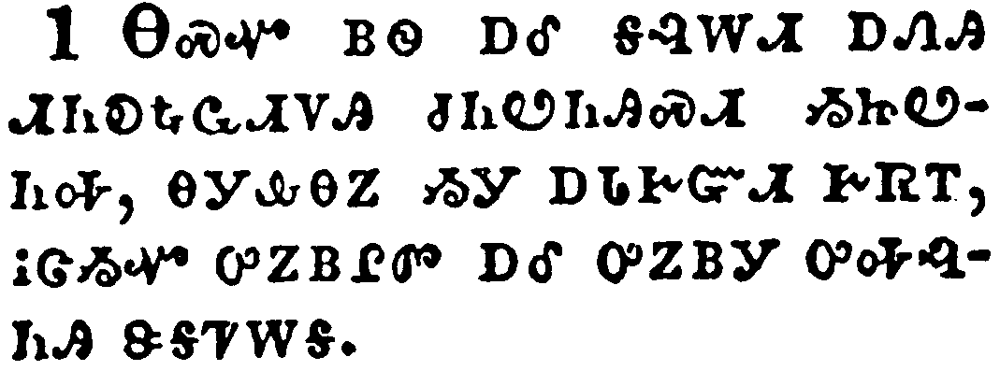</a></td>
</tr>
<tr class="even">
<td>Though I speak with the tongues of men and of angels, and have not charity, I am become as sounding brass, or a tinkling cymbal.</td>
</tr>
<tr class="odd">
<td>ᎾᏍᏉ ᏴᏫ ᎠᎴ ᎦᎸᎳᏗ ᎠᏁᎯ ᏗᏂᎧᎿᎭᏩᏗᏙᎯ ᏧᏂᏬᏂᎯᏍᏗ ᏱᏥᏬᏂᎭ, ᎾᎩᎲᎾᏃ ᏱᎩ ᎠᏓᎨᏳᏗ ᎨᏒᎢ, ᎥᏣᏱᏉ ᎤᏃᏴᎵᏛ ᎠᎴ ᎤᏃᏴᎩ ᎤᎭᎸᏂᎯ ᏕᎦᏤᎳᎦ.</td>
</tr>
<tr class="even">
<td>Na-s-quo yv-wi a-le ga-lv-la-di a-ne-hi di-ni-ka-hna-wa-di-do-hi tsu-ni-wo-ni-hi-s-di yi-tsi-wo-ni-ha, na-gi-hv-na-no yi-gi a-da-ge-yu-di ge-sv-i, v-tsa-yi-quo u-no-yv-li-dv a-le u-no-yv-gi u-ha-lv-ni-hi de-ga-tse-la-ga.</td>
</tr>
</tbody>
</table>

<table>
<tbody>
<tr class="odd">
<td><a href="071302.png">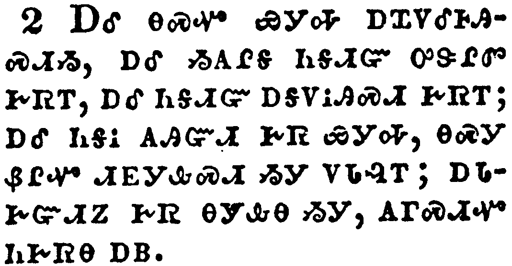</a></td>
</tr>
<tr class="even">
<td>And though I have the gift of prophecy, and understand all mysteries, and all knowledge; and though I have all faith, so that I could remove mountains, and have not charity, I am nothing.</td>
</tr>
<tr class="odd">
<td>ᎠᎴ ᎾᏍᎩ ᏯᎩᎭ ᎠᏆᏙᎴᎰᎯᏍᏗᏱ, ᎠᎴ ᏱᎪᎵᎦ ᏂᎦᏗᏳ ᎤᏕᎵᏛ ᎨᏒᎢ, ᎠᎴ ᏂᎦᏗᏳ ᎠᎦᏙᎥᎯᏍᏗ ᎨᏒᎢ; ᎠᎴ ᏂᎦᎥ ᎪᎯᏳᏗ ᎨᏒ ᏯᎩᎭ, ᎾᏍᎩ ᏰᎵᏉ ᏗᎬᎩᎲᏍᏗ ᏱᎩ ᏙᏓᎸᎢ; ᎠᏓᎨᏳᏗᏃ ᎨᏒ ᎾᎩᎲᎾ ᏱᎩ, ᎪᎱᏍᏗᏉ ᏂᎨᏒᎾ ᎠᏴ.</td>
</tr>
<tr class="even">
<td>A-le na-s-gi ya-gi-ha a-qua-do-le-ho-hi-s-di-yi, a-le yi-go-li-ga ni-ga-di-yu u-de-li-dv ge-sv-i, a-le ni-ga-di-yu a-ga-do-v-hi-s-di ge-sv-i; a-le ni-ga-v go-hi-yu-di ge-sv ya-gi-ha, na-s-gi ye-li-quo di-gv-gi-hv-s-di yi-gi do-da-lv-i; a-da-ge-yu-di-no ge-sv na-gi-hv-na yi-gi, go-hu-s-di-quo ni-ge-sv-na a-yv.</td>
</tr>
</tbody>
</table>

<table>
<tbody>
<tr class="odd">
<td><a href="071303.png">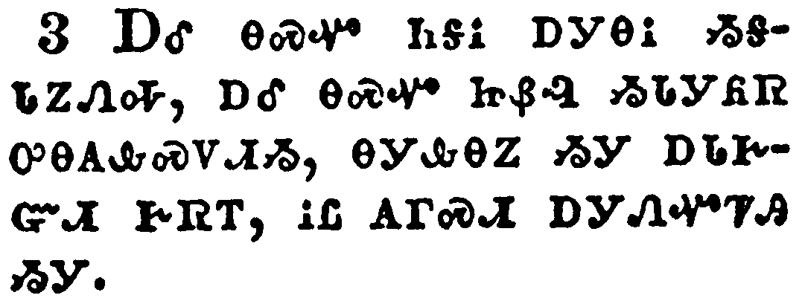</a></td>
</tr>
<tr class="even">
<td>And though I bestow all my goods to feed the poor, and though I give my body to be burned, and have not charity, it profiteth me nothing.</td>
</tr>
<tr class="odd">
<td>ᎠᎴ ᎾᏍᏉ ᏂᎦᎥ ᎠᎩᎾᎥ ᏱᎦᏓᏃᏁᎭ, ᎠᎴ ᎾᏍᏉ ᏥᏰᎸ ᏱᏓᎩᏲᏒ ᎤᎾᎪᎲᏍᏙᏗᏱ, ᎾᎩᎲᎾᏃ ᏱᎩ ᎠᏓᎨᏳᏗ ᎨᏒᎢ, ᎥᏝ ᎪᎱᏍᏗ ᎠᎩᏁᏉᏤᎯ ᏱᎩ.</td>
</tr>
<tr class="even">
<td>A-le na-s-quo ni-ga-v a-gi-na-v yi-ga-da-no-ne-ha, a-le na-s-quo tsi-ye-lv yi-da-gi-yo-sv u-na-go-hv-s-do-di-yi, na-gi-hv-na-no yi-gi a-da-ge-yu-di ge-sv-i, v-tla go-hu-s-di a-gi-ne-quo-tse-hi yi-gi.</td>
</tr>
</tbody>
</table>

<table>
<tbody>
<tr class="odd">
<td><a href="071304.png">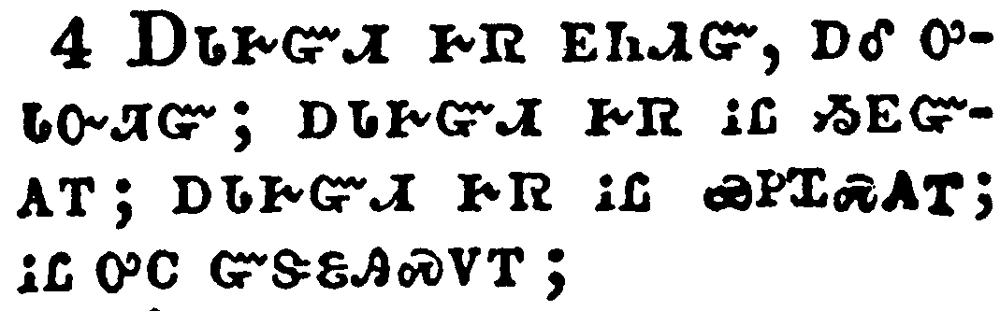</a></td>
</tr>
<tr class="even">
<td>Charity suffereth long, and is kind; charity envieth not; charity vaunteth not itself, is not puffed up,</td>
</tr>
<tr class="odd">
<td>ᎠᏓᎨᏳᏗ ᎨᏒ ᎬᏂᏗᏳ, ᎠᎴ ᎤᏓᏅᏘᏳ; ᎠᏓᎨᏳᏗ ᎨᏒ ᎥᏝ ᏱᎬᏳᎪᎢ; ᎠᏓᎨᏳᏗ ᎨᏒ ᎥᏝ ᏯᏢᏆᏍᎪᎢ; ᎥᏝ ᎤᏟ ᏳᏕᏋᎯᏍᏙᎢ;</td>
</tr>
<tr class="even">
<td>A-da-ge-yu-di ge-sv gv-ni-di-yu, a-le u-da-nv-ti-yu; a-da-ge-yu-di ge-sv v-tla yi-gv-yu-go-i; a-da-ge-yu-di ge-sv v-tla ya-tlv-qua-s-go-i; v-tla u-tli yu-de-quv-hi-s-do-i;</td>
</tr>
</tbody>
</table>

<table>
<tbody>
<tr class="odd">
<td><a href="071305.png">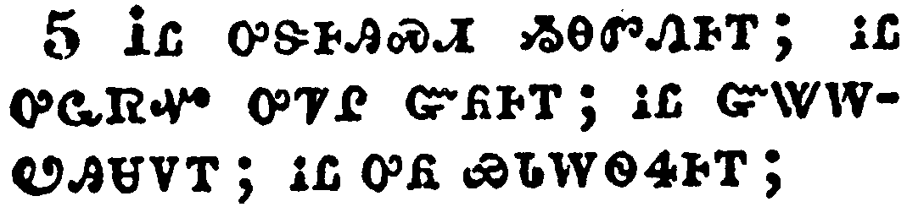</a></td>
</tr>
<tr class="even">
<td>Doth not behave itself unseemly, seeketh not her own, is not easily provoked, thinketh no evil;</td>
</tr>
<tr class="odd">
<td>ᎥᏝ ᎤᏕᎰᎯᏍᏗ ᏱᎾᏛᏁᎰᎢ; ᎥᏝ ᎤᏩᏒᏉ ᎤᏤᎵ ᏳᏲᎰᎢ; ᎥᏝ ᏳᏔᎳᏬᎯᏌᏙᎢ; ᎥᏝ ᎤᏲ ᏯᏓᎳᏫᏎᎰᎢ;</td>
</tr>
<tr class="even">
<td>V-tla u-de-ho-hi-s-di yi-na-dv-ne-ho-i; v-tla u-wa-sv-quo u-tse-li yu-yo-ho-i; v-tla yu-ta-la-wo-hi-sa-do-i; v-tla u-yo ya-da-la-wi-se-ho-i;</td>
</tr>
</tbody>
</table>

<table>
<tbody>
<tr class="odd">
<td><a href="071306.png">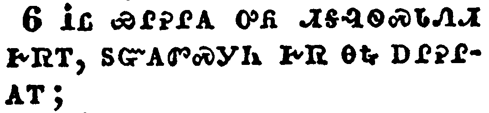</a></td>
</tr>
<tr class="even">
<td>Rejoiceth not in iniquity, but rejoiceth in the truth;</td>
</tr>
<tr class="odd">
<td>ᎥᏝ ᏯᎵᎮᎵᎪ ᎤᏲ ᏗᎦᎸᏫᏍᏓᏁᏗ ᎨᏒᎢ, ᏚᏳᎪᏛᏍᎩᏂ ᎨᏒ ᎾᎿᎭᎠᎵᎮᎵᎪᎢ;</td>
</tr>
<tr class="even">
<td>V-tla ya-li-he-li-go u-yo di-ga-lv-wi-s-da-ne-di ge-sv-i, du-yu-go-dv-s-gi-ni ge-sv na-hna a-li-he-li-go-i;</td>
</tr>
</tbody>
</table>

<table>
<tbody>
<tr class="odd">
<td><a href="071307.png">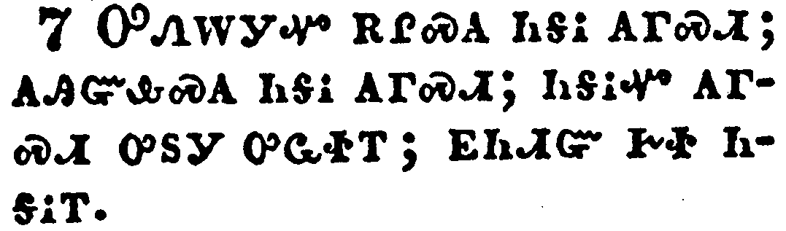</a></td>
</tr>
<tr class="even">
<td>Beareth all things, believeth all things, hopeth all things, endureth all things.</td>
</tr>
<tr class="odd">
<td>ᎤᏁᎳᎩᏉ ᎡᎵᏍᎪ ᏂᎦᎥ ᎪᎱᏍᏗ; ᎪᎯᏳᎲᏍᎪ ᏂᎦᎥ ᎪᎱᏍᏗ; ᏂᎦᎥᏉ ᎪᎱᏍᏗ ᎤᏚᎩ ᎤᏩᏐᎢ; ᎬᏂᏗᏳ ᎨᏐ ᏂᎦᎥᎢ.</td>
</tr>
<tr class="even">
<td>U-ne-la-gi-quo e-li-s-go ni-ga-v go-hu-s-di; go-hi-yu-hv-s-go ni-ga-v go-hu-s-di; ni-ga-v-quo go-hu-s-di u-du-gi u-wa-so-i; gv-ni-di-yu ge-so ni-ga-v-i.</td>
</tr>
</tbody>
</table>

<table>
<tbody>
<tr class="odd">
<td><a href="071308.png">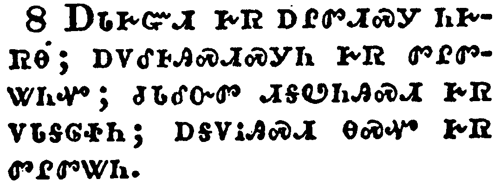</a></td>
</tr>
<tr class="even">
<td>Charity never faileth: but whether there be prophecies, they shall fail; whether there be tongues, they shall cease; whether there be knowledge, it shall vanish away.</td>
</tr>
<tr class="odd">
<td>ᎠᏓᎨᏳᏗ ᎨᏒ ᎠᎵᏛᏗᏍᎩ ᏂᎨᏒᎾ; ᎠᏙᎴᎰᎯᏍᏗᏍᎩᏂ ᎨᏒ ᏛᎵᏛᏔᏂᏉ; ᏧᏓᎴᏅᏛ ᏗᎦᏬᏂᎯᏍᏗ ᎨᏒ ᏙᏓᎦᎶᏐᏂ; ᎠᎦᏙᎥᎯᏍᏗ ᎾᏍᏉ ᎨᏒ ᏛᎵᏛᏔᏂ.</td>
</tr>
<tr class="even">
<td>A-da-ge-yu-di ge-sv a-li-dv-di-s-gi ni-ge-sv-na; a-do-le-ho-hi-s-di-s-gi-ni ge-sv dv-li-dv-ta-ni-quo; tsu-da-le-nv-dv di-ga-wo-ni-hi-s-di ge-sv do-da-ga-lo-so-ni; a-ga-do-v-hi-s-di na-s-quo ge-sv dv-li-dv-ta-ni.</td>
</tr>
</tbody>
</table>

<table>
<tbody>
<tr class="odd">
<td><a href="071309.png">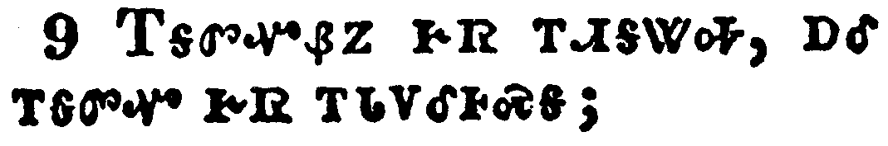</a></td>
</tr>
<tr class="even">
<td>For we know in part, and we prophesy in part.</td>
</tr>
<tr class="odd">
<td>ᎢᎦᏛᏉᏰᏃ ᎨᏒ ᎢᏗᎦᏔᎭ, ᎠᎴ ᎢᎦᏛᏉ ᎨᏒ ᎢᏓᏙᎴᎰᏍᎦ;</td>
</tr>
<tr class="even">
<td>I-ga-dv-quo-ye-no ge-sv i-di-ga-ta-ha, a-le i-ga-dv-quo ge-sv i-da-do-le-ho-s-ga;</td>
</tr>
</tbody>
</table>

<table>
<tbody>
<tr class="odd">
<td><a href="071310.png">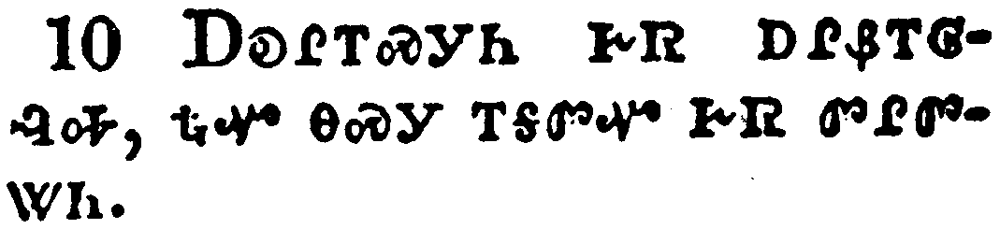</a></td>
</tr>
<tr class="even">
<td>But when that which is perfect is come, then that which is in part shall be done away.</td>
</tr>
<tr class="odd">
<td>ᎠᎧᎵᎢᏍᎩᏂ ᎨᏒ ᎠᎵᏰᎢᎶᎸᎭ, ᎿᎭᏉ ᎾᏍᎩ ᎢᎦᏛᏉ ᎨᏒ ᏛᎵᏛᏔᏂ.</td>
</tr>
<tr class="even">
<td>A-ka-li-i-s-gi-ni ge-sv a-li-ye-i-lo-lv-ha, hna-quo na-s-gi i-ga-dv-quo ge-sv dv-li-dv-ta-ni.</td>
</tr>
</tbody>
</table>

<table>
<tbody>
<tr class="odd">
<td><a href="071311.png">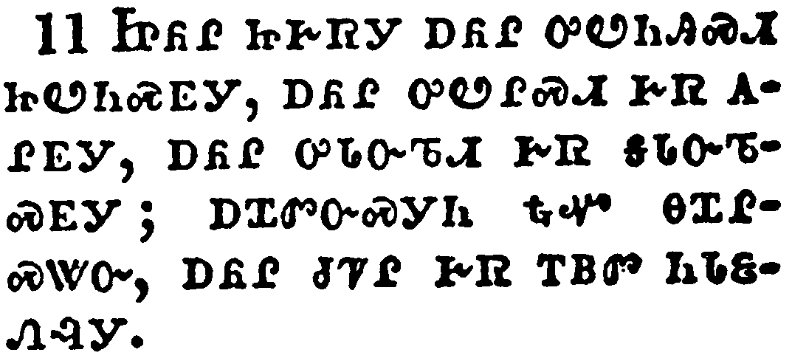</a></td>
</tr>
<tr class="even">
<td>When I was a child, I spake as a child, I understood as a child, I thought as a child: but when I became a man, I put away childish things.</td>
</tr>
<tr class="odd">
<td>ᏥᏲᎵ ᏥᎨᏒᎩ ᎠᏲᎵ ᎤᏬᏂᎯᏍᏗ ᏥᏬᏂᏍᎬᎩ, ᎠᏲᎵ ᎤᏬᎵᏍᏗ ᎨᏒ ᎪᎵᎬᎩ, ᎠᏲᎵ ᎤᏓᏅᏖᏗ ᎨᏒ ᎦᏓᏅᏖᏍᎬᎩ; ᎠᏆᏛᏅᏍᎩᏂ ᎿᎭᏉ ᎾᏆᎵᏍᏔᏅ, ᎠᏲᎵ ᏧᏤᎵ ᎨᏒ ᎢᏴᏛ ᏂᏓᏋᏁᎸᎩ.</td>
</tr>
<tr class="even">
<td>Tsi-yo-li tsi-ge-sv-gi a-yo-li u-wo-ni-hi-s-di tsi-wo-ni-s-gv-gi, a-yo-li u-wo-li-s-di ge-sv go-li-gv-gi, a-yo-li u-da-nv-te-di ge-sv ga-da-nv-te-s-gv-gi; a-qua-dv-nv-s-gi-ni hna-quo na-qua-li-s-ta-nv, a-yo-li tsu-tse-li ge-sv i-yv-dv ni-da-quv-ne-lv-gi.</td>
</tr>
</tbody>
</table>

<table>
<tbody>
<tr class="odd">
<td><a href="071312.png">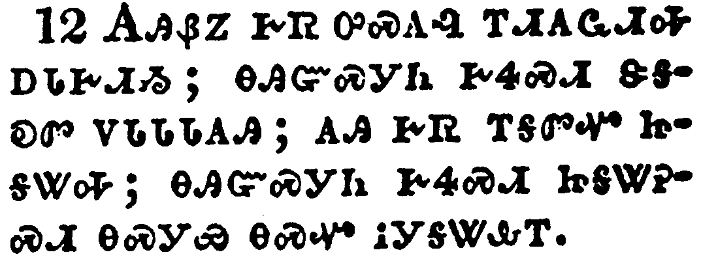</a></td>
</tr>
<tr class="even">
<td>For now we see through a glass, darkly; but then face to face: now I know in part; but then shall I know even as also I am known.</td>
</tr>
<tr class="odd">
<td>ᎪᎯᏰᏃ ᎨᏒ ᎤᏍᎪᎸ ᎢᏗᎪᏩᏗᎭ ᎠᏓᎨᏗᏱ; ᎾᎯᏳᏍᎩᏂ ᎨᏎᏍᏗ ᏕᎦᎧᏛ ᏙᏓᏓᏓᎪᎯ; ᎪᎯ ᎨᏒ ᎢᎦᏛᏉ ᏥᎦᏔᎭ; ᎾᎯᏳᏍᎩᏂ ᎨᏎᏍᏗ ᏥᎦᏔᎮᏍᏗ ᎾᏍᎩᏯ ᎾᏍᏉ ᎥᎩᎦᏔᎲᎢ.</td>
</tr>
<tr class="even">
<td>Go-hi-ye-no ge-sv u-s-go-lv i-di-go-wa-di-ha a-da-ge-di-yi; na-hi-yu-s-gi-ni ge-se-s-di de-ga-ka-dv do-da-da-da-go-hi; go-hi ge-sv i-ga-dv-quo tsi-ga-ta-ha; na-hi-yu-s-gi-ni ge-se-s-di tsi-ga-ta-he-s-di na-s-gi-ya na-s-quo v-gi-ga-ta-hv-i.</td>
</tr>
</tbody>
</table>

<table>
<tbody>
<tr class="odd">
<td><a href="071313.png">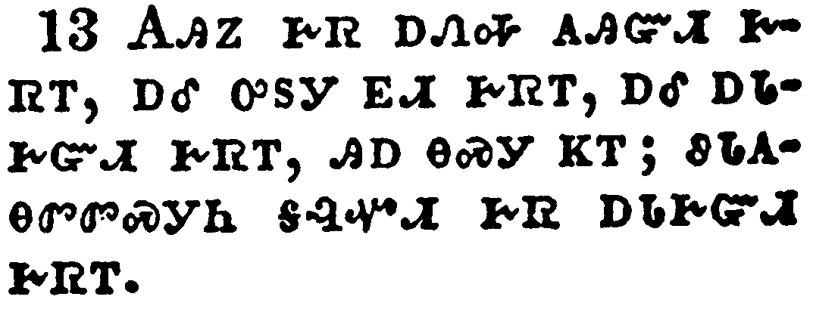</a></td>
</tr>
<tr class="even">
<td>And now abideth faith, hope, charity, these three; but the greatest of these is charity.</td>
</tr>
<tr class="odd">
<td>ᎪᎯᏃ ᎨᏒ ᎠᏁᎭ ᎪᎯᏳᏗ ᎨᏒᎢ, ᎠᎴ ᎤᏚᎩ ᎬᏗ ᎨᏒᎢ, ᎠᎴ ᎠᏓᎨᏳᏗ ᎨᏒᎢ, ᎯᎠ ᎾᏍᎩ ᏦᎢ; ᏭᏓᎪᎾᏛᏛᏍᎩᏂ ᎦᎸᏉᏗ ᎬᏒ ᎠᏓᎨᏳᏗ ᎨᏒᎢ.</td>
</tr>
<tr class="even">
<td>Go-hi-no ge-sv a-ne-ha go-hi-yu-di ge-sv-i, a-le u-du-gi gv-di ge-sv-i, a-le a-da-ge-yu-di ge-sv-i, hi-a na-s-gi tso-i; wu-da-go-na-dv-dv-s-gi-ni ga-lv-quo-di gv-sv a-da-ge-yu-di ge-sv-i.</td>
</tr>
</tbody>
</table>

