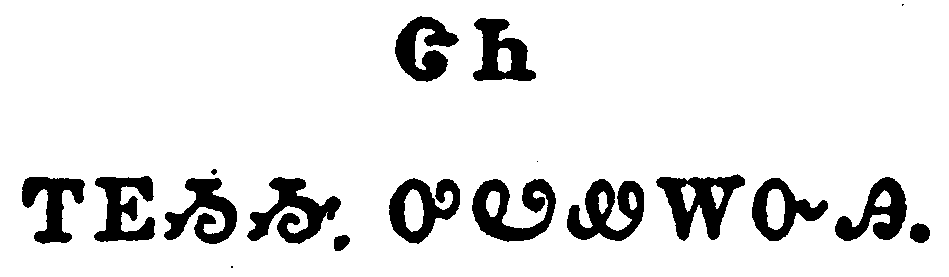

+++
draft=false
date = 2014-12-18T21:11:07Z
title = "1 John - Chapter 1 - Cherokee New Testament"
weight = 1418955067

[taxonomies]

authors = ["Timothy Legg"]
categories = []
tags = []

[extra]
+++

<table>
<tbody>
<tr class="odd">
<td></td>
</tr>
<tr class="even">
<td>That which was from the beginning, which we have heard, which we have seen with our eyes, which we have looked upon, and our hands have handled, of the Word of life;</td>
</tr>
<tr class="odd">
<td>ᎾᏍᎩ ᏗᏓᎴᏂᏍᎬ ᏤᎮᎢ, ᎠᏴ ᎣᎦᏛᎦᏅᎯ, ᏦᏥᎦᏙᎵ ᏦᎬᏔᏅᎯ ᎣᎩᎪᎲᎯ, ᎾᏍᎩ ᏦᎦᎧᎿᎭᏅᎯ, ᎠᎴ ᏦᎪᏰᏂ ᏦᎬᏔᏅᎯ ᎣᎦᏒᏂᎵᏙᎸᎯ, ᎧᏃᎮᏛ ᎬᏂᏛ^</td>
</tr>
<tr class="even">
<td>Na-s-gi di-da-le-ni-s-gv tse-he-i, a-yv o-ga-dv-ga-nv-hi, tso-tsi-ga-do-li tso-gv-ta-nv-hi o-gi-go-hv-hi, na-s-gi tso-ga-ka-hna-nv-hi, a-le tso-go-ye-ni tso-gv-ta-nv-hi o-ga-sv-ni-li-do-lv-hi, ka-no-he-dv gv-ni-dv^</td>
</tr>
</tbody>
</table>

<table>
<tbody>
<tr class="odd">
<td></td>
</tr>
<tr class="even">
<td>(For the life was manifested, and we have seen it, and bear witness, and shew unto you that eternal life, which was with the Father, and was manifested unto us;)</td>
</tr>
<tr class="odd">
<td>ᎬᏂᏛᏰᏃ ᎬᏂᎨᏒ ᏄᎵᏍᏔᏅᎩ, ᎠᎴ ᎣᎩᎪᎲᎩ, ᎠᎴ ᎣᏥᏃᎮᎭ, ᎠᎴ ᎢᏨᎾᏄᏫᏎᎭ ᎾᏍᎩ ᎠᎵᏍᏆᏗᏍᎩ ᏂᎨᏒᎾ ᎬᏂᏛ, ᎾᏍᎩ ᎠᎦᏴᎵᎨᎢ ᎡᎲ ᏤᎮᎢ, ᎠᎴ ᎬᏂᎨᏒ ᎢᏲᎬᏁᎸᎯ ᏥᎩ^</td>
</tr>
<tr class="even">
<td>Gv-ni-dv-ye-no gv-ni-ge-sv nu-li-s-ta-nv-gi, a-le o-gi-go-hv-gi, a-le o-tsi-no-he-ha, a-le i-tsv-na-nu-wi-se-ha na-s-gi a-li-s-qua-di-s-gi ni-ge-sv-na gv-ni-dv, na-s-gi A-ga-yv-li-ge-i e-hv tse-he-i, a-le gv-ni-ge-sv i-yo-gv-ne-lv-hi tsi-gi^</td>
</tr>
</tbody>
</table>

<table>
<tbody>
<tr class="odd">
<td></td>
</tr>
<tr class="even">
<td>That which we have seen and heard declare we unto you, that ye also may have fellowship with us: and truly our fellowship is with the Father, and with his Son Jesus Christ.</td>
</tr>
<tr class="odd">
<td>ᎾᏍᎩ Ꮎ ᎣᎩᎪᎲᎯ ᎠᎴ ᎣᎦᏛᎦᏅᎯ ᎨᏒ ᎢᏨᎾᏄᏫᏎᎭ, ᎾᏍᏉ ᏂᎯ ᎢᏣᏖᎳᏗᏍᏗᏱ ᎣᎦᏚᏓᏕᏫᏒᎢ; ᎠᎴ ᎤᏙᎯᏳᎯᏯ ᎣᎦᏚᏓᏕᏫᏒ ᎠᎦᏴᎵᎨᎢ ᎠᎴ ᎤᏪᏥ ᏥᏌ ᎦᎶᏁᏛ.</td>
</tr>
<tr class="even">
<td>Na-s-gi na o-gi-go-hv-hi a-le o-ga-dv-ga-nv-hi ge-sv i-tsv-na-nu-wi-se-ha, na-s-quo ni-hi i-tsa-te-la-di-s-di-yi o-ga-du-da-de-wi-sv-i; a-le u-do-hi-yu-hi-ya o-ga-du-da-de-wi-sv A-ga-yv-li-ge-i a-le U-we-tsi Tsi-sa Ga-lo-ne-dv.</td>
</tr>
</tbody>
</table>

<table>
<tbody>
<tr class="odd">
<td></td>
</tr>
<tr class="even">
<td>And these things write we unto you, that your joy may be full.</td>
</tr>
<tr class="odd">
<td>ᎯᎠ ᎠᎴ ᎾᏍᎩ ᎢᏨᏲᏪᎳᏁᎭ ᎢᏣᎵᎮᎵᎬ ᎤᎧᎵᎢᏍᏗᏱ.</td>
</tr>
<tr class="even">
<td>Hi-a a-le na-s-gi i-tsv-yo-we-la-ne-ha i-tsa-li-he-li-gv u-ka-li-i-s-di-yi.</td>
</tr>
</tbody>
</table>

<table>
<tbody>
<tr class="odd">
<td></td>
</tr>
<tr class="even">
<td>This then is the message which we have heard of him, and declare unto you, that God is light, and in him is no darkness at all.</td>
</tr>
<tr class="odd">
<td>ᎯᎠᏃ ᎾᏍᎩ ᎧᏃᎮᏛ ᎣᏣᏛᎦᏁᎸᎯ ᏥᎩ ᎠᎴ ᏥᏨᎾᏄᏫᏎᎭ ᎾᏍᎩ ᎤᏁᎳᏅᎯ ᎢᎦᎦᏘ ᎨᏒᎢ, ᎠᎴ ᎤᏍᏗ ᎤᏅᎤᎵᏏᎩ ᏄᏪᎲᎾ ᎨᏒᎢ.</td>
</tr>
<tr class="even">
<td>Hi-a-no na-s-gi ka-no-he-dv o-tsa-dv-ga-ne-lv-hi tsi-gi a-le tsi-tsv-na-nu-wi-se-ha na-s-gi U-ne-la-nv-hi i-ga-ga-ti ge-sv-i, a-le u-s-di u-nv-u-li-si-gi nu-we-hv-na ge-sv-i.</td>
</tr>
</tbody>
</table>

<table>
<tbody>
<tr class="odd">
<td></td>
</tr>
<tr class="even">
<td>If we say that we have fellowship with him, and walk in darkness, we lie, and do not the truth:</td>
</tr>
<tr class="odd">
<td>ᎢᏳᏃ ᎾᏍᎩ ᏙᎦᏚᏓᏔ ᏱᏓᏗᎭ, ᎤᎵᏏᎬᏃ ᏱᏕᏙᎭ, ᏱᏓᏥᎪᎥᏍᎦᏉ ᎠᎴ ᎥᏝ ᏱᎨᏗᏍᏓᏩᏕᎦ ᎤᏙᎯᏳᎯ ᎨᏒᎢ.</td>
</tr>
<tr class="even">
<td>I-yu-no na-s-gi do-ga-du-da-ta yi-da-di-ha, u-li-si-gv-no yi-de-do-ha, yi-da-tsi-go-v-s-ga-quo a-le v-tla yi-ge-di-s-da-wa-de-ga u-do-hi-yu-hi ge-sv-i.</td>
</tr>
</tbody>
</table>

<table>
<tbody>
<tr class="odd">
<td></td>
</tr>
<tr class="even">
<td>But if we walk in the light, as he is in the light, we have fellowship one with another, and the blood of Jesus Christ his Son cleanseth us from all sin.</td>
</tr>
<tr class="odd">
<td>ᎢᎦᎦᏛᏍᎩᏂ ᏱᏕᏙᎭ, ᎾᏍᎩᏯ ᎾᏍᎩ ᎢᎦᎦᏛᎢ ᏤᎭ, ᏕᎦᏚᏓᏕᏫᏒ ᎢᎬᏒ ᎨᏒᎢ; ᎠᎴ ᎤᏪᏥ ᏥᏌ ᎦᎶᏁᏛ ᎤᎩᎬ ᎢᎩᏅᎦᎵᎭ ᏂᎦᎥ ᎢᎩᏍᎦᏅᏨᎢ.</td>
</tr>
<tr class="even">
<td>I-ga-ga-dv-s-gi-ni yi-de-do-ha, na-s-gi-ya na-s-gi i-ga-ga-dv-i tse-ha, de-ga-du-da-de-wi-sv i-gv-sv ge-sv-i; a-le u-we-tsi Tsi-sa Ga-lo-ne-dv u-gi-gv i-gi-nv-ga-li-ha ni-ga-v i-gi-s-ga-nv-tsv-i.</td>
</tr>
</tbody>
</table>

<table>
<tbody>
<tr class="odd">
<td></td>
</tr>
<tr class="even">
<td>If we say that we have no sin, we deceive ourselves, and the truth is not in us.</td>
</tr>
<tr class="odd">
<td>ᎢᏳᏃ ᎥᏝ ᎠᏍᎦᏂ ᏲᎨᎭ ᏱᏓᏗᎭ, ᎢᎬᏒ ᏱᏓᏓᎵᏓᏍᏗᎭ, ᎠᎴ ᎥᏝ ᏱᎨᎨᎭ ᎤᏙᎯᏳᎯ ᎨᏒᎢ.</td>
</tr>
<tr class="even">
<td>I-yu-no v-tla a-s-ga-ni yo-ge-ha yi-da-di-ha, i-gv-sv yi-da-da-li-da-s-di-ha, a-le v-tla yi-ge-ge-ha u-do-hi-yu-hi ge-sv-i.</td>
</tr>
</tbody>
</table>

<table>
<tbody>
<tr class="odd">
<td></td>
</tr>
<tr class="even">
<td>If we confess our sins, he is faithful and just to forgive us our sins, and to cleanse us from all unrighteousness.</td>
</tr>
<tr class="odd">
<td>ᎢᏳᏃ ᏱᏗᏃᎲᏍᎦ ᎢᎩᏍᎦᏅᏨᎢ, ᏄᏓᎵᏓᏍᏛᎾ ᎠᎴ ᎤᏓᏅᏘᏳ, ᎾᏍᎩ ᎢᎩᏁᏗᏱ ᎢᎩᏍᎦᏅᏨᎢ, ᎠᎴ ᎢᎩᏅᎦᎸᏗᏱ ᏂᎦᎥ ᎤᏲ ᏗᎦᎸᏫᏍᏓᏗ ᎨᏒᎢ.</td>
</tr>
<tr class="even">
<td>I-yu-no yi-di-no-hv-s-ga i-gi-s-ga-nv-tsv-i, nu-da-li-da-s-dv-na a-le u-da-nv-ti-yu, na-s-gi i-gi-ne-di-yi i-gi-s-ga-nv-tsv-i, a-le i-gi-nv-ga-lv-di-yi ni-ga-v u-yo di-ga-lv-wi-s-da-di ge-sv-i.</td>
</tr>
</tbody>
</table>

<table>
<tbody>
<tr class="odd">
<td></td>
</tr>
<tr class="even">
<td>If we say that we have not sinned, we make him a liar, and his word is not in us.</td>
</tr>
<tr class="odd">
<td>ᎢᏳᏃ ᎥᏝ ᏲᎩᏍᎦᏅᏨ ᏱᏓᏗᎭ, ᎡᏗᏰᎪᎥᏍᎦᏉ, ᎠᎴ ᎧᏃᎮᏛ ᎤᏤᎵᎦ ᎥᏝ ᏱᎨᎨᎭ.</td>
</tr>
<tr class="even">
<td>I-yu-no v-tla yo-gi-s-ga-nv-tsv yi-da-di-ha, e-di-ye-go-v-s-ga-quo, a-le ka-no-he-dv u-tse-li-ga v-tla yi-ge-ge-ha.</td>
</tr>
</tbody>
</table>

