+++
draft=false
date = 2014-12-18T21:11:07Z
title = "1 John - Chapter 3 - Cherokee New Testament"
weight = 1418955067

[taxonomies]

authors = ["Timothy Legg"]
categories = []
tags = []

[extra]
+++

<table>
<tbody>
<tr class="odd">
<td><a href="230301.png">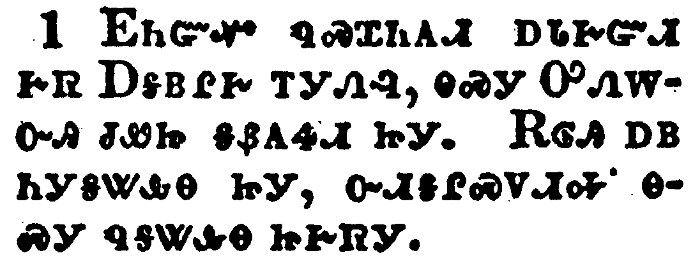</a></td>
</tr>
<tr class="even">
<td>Behold, what manner of love the Father hath bestowed upon us, that we should be called the sons of God: therefore the world knoweth us not, because it knew him not.</td>
</tr>
<tr class="odd">
<td>ᎬᏂᏳᏉ ᏄᏍᏆᏂᎪᏗ ᎠᏓᎨᏳᏗ ᎨᏒ ᎠᎦᏴᎵᎨ ᎢᎩᏁᎸ, ᎾᏍᎩ ᎤᏁᎳᏅᎯ ᏧᏪᏥ ᎦᏰᎪᏎᏗ ᏥᎩ. ᎡᎶᎯ ᎠᏴ ᏂᎩᎦᏔᎲᎾ ᏥᎩ, ᏅᏗᎦᎵᏍᏙᏗᎭ ᎾᏍᎩ ᏄᎦᏔᎲᎾ ᏥᎨᏒᎩ.</td>
</tr>
<tr class="even">
<td>Gv-ni-yu-quo nu-s-qua-ni-go-di a-da-ge-yu-di ge-sv A-ga-yv-li-ge i-gi-ne-lv, na-s-gi u-ne-la-nv-hi tsu-we-tsi ga-ye-go-se-di tsi-gi. E-lo-hi a-yv ni-gi-ga-ta-hv-na tsi-gi, nv-di-ga-li-s-do-di-ha na-s-gi nu-ga-ta-hv-na tsi-ge-sv-gi.</td>
</tr>
</tbody>
</table>

<table>
<tbody>
<tr class="odd">
<td><a href="230302.png">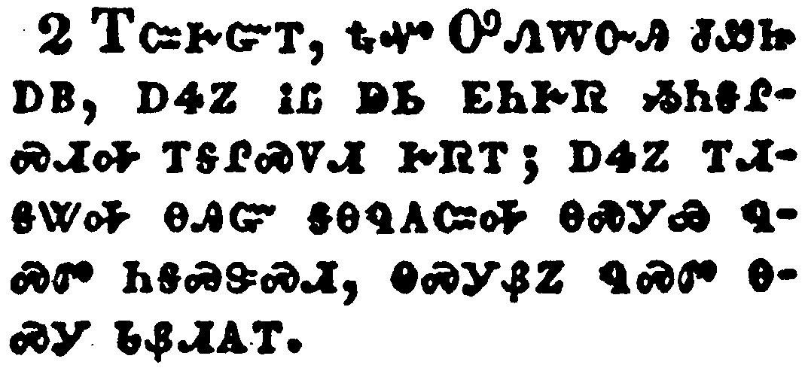</a></td>
</tr>
<tr class="even">
<td>Beloved, now are we the sons of God, and it doth not yet appear what we shall be: but we know that, when he shall appear, we shall be like him; for we shall see him as he is.</td>
</tr>
<tr class="odd">
<td>ᎢᏨᎨᏳᎢ, ᎿᎭᏉ ᎤᏁᎳᏅᎯ ᏧᏪᏥ ᎠᏴ, ᎠᏎᏃ ᎥᏝ ᎠᏏ ᎬᏂᎨᏒ ᏱᏂᎦᎵᏍᏗᎭ ᎢᎦᎵᏍᏙᏗ ᎨᏒᎢ; ᎠᏎᏃ ᎢᏗᎦᏔᎭ ᎾᎯᏳ ᎦᎾᏄᎪᏨᎭ ᎾᏍᎩᏯ ᏄᏍᏛ ᏂᎦᏍᏕᏍᏗ, ᎾᏍᎩᏰᏃ ᏄᏍᏛ ᎾᏍᎩ ᏓᏰᏗᎪᎢ.</td>
</tr>
<tr class="even">
<td>I-tsv-ge-yu-i, hna-quo U-ne-la-nv-hi tsu-we-tsi a-yv, a-se-no v-tla a-si gv-ni-ge-sv yi-ni-ga-li-s-di-ha i-ga-li-s-do-di ge-sv-i; a-se-no i-di-ga-ta-ha na-hi-yu ga-na-nu-go-tsv-ha na-s-gi-ya nu-s-dv ni-ga-s-de-s-di, na-s-gi-ye-no nu-s-dv na-s-gi da-ye-di-go-i.</td>
</tr>
</tbody>
</table>

<table>
<tbody>
<tr class="odd">
<td><a href="230303.png">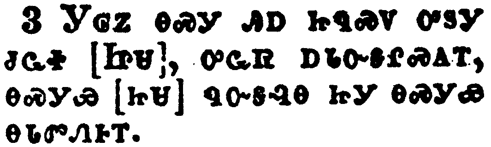</a></td>
</tr>
<tr class="even">
<td>And every man that hath this hope in him purifieth himself, even as he is pure.</td>
</tr>
<tr class="odd">
<td>ᎩᎶᏃ ᎾᏍᎩ ᎯᎠ ᏥᏄᏍᏙ ᎤᏚᎩ ᏧᏩᏐ [ᏥᏌ], ᎤᏩᏒ ᎠᏓᏅᎦᎵᏍᎪᎢ, ᎾᏍᎩᏯ [ᏥᏌ] ᏄᏅᎦᎸᎾ ᏥᎩ ᎾᏍᎩᏯ ᎾᏓᏛᏁᎰᎢ.</td>
</tr>
<tr class="even">
<td>Gi-lo-no na-s-gi hi-a tsi-nu-s-do u-du-gi tsu-wa-so [Tsi-sa], u-wa-sv a-da-nv-ga-li-s-go-i, na-s-gi-ya [tsi-sa] nu-nv-ga-lv-na tsi-gi na-s-gi-ya na-da-dv-ne-ho-i.</td>
</tr>
</tbody>
</table>

<table>
<tbody>
<tr class="odd">
<td><a href="230304.png">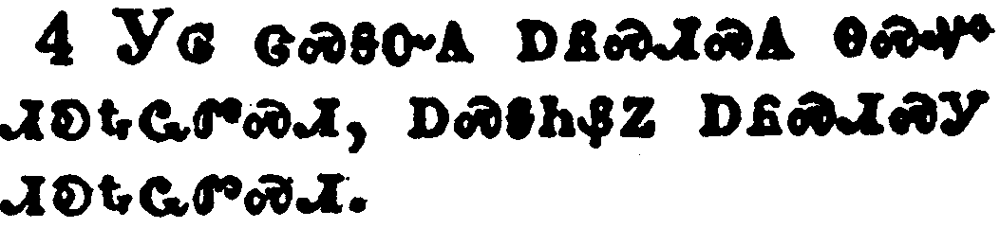</a></td>
</tr>
<tr class="even">
<td>Whosoever committeth sin transgresseth also the law: for sin is the transgression of the law.</td>
</tr>
<tr class="odd">
<td>ᎩᎶ ᏣᏍᎦᏅᎪ ᎠᏲᏍᏗᏍᎪ ᎾᏍᏉ ᏗᎧᎿᎭᏩᏛᏍᏗ, ᎠᏍᎦᏂᏰᏃ ᎠᏲᏍᏗᏍᎩ ᏗᎧᎿᎭᏩᏛᏍᏗ.</td>
</tr>
<tr class="even">
<td>Gi-lo tsa-s-ga-nv-go a-yo-s-di-s-go na-s-quo di-ka-hna-wa-dv-s-di, a-s-ga-ni-ye-no a-yo-s-di-s-gi di-ka-hna-wa-dv-s-di.</td>
</tr>
</tbody>
</table>

<table>
<tbody>
<tr class="odd">
<td><a href="230305.png">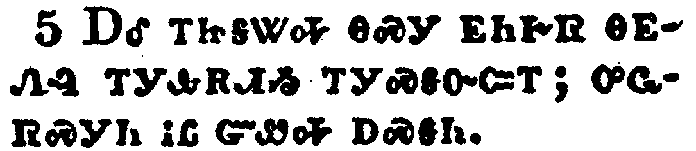</a></td>
</tr>
<tr class="even">
<td>And ye know that he was manifested to take away our sins; and in him is no sin.</td>
</tr>
<tr class="odd">
<td>ᎠᎴ ᎢᏥᎦᏔᎭ ᎾᏍᎩ ᎬᏂᎨᏒ ᎾᎬᏁᎸ ᎢᎩᎲᎡᏗᏱ ᎢᎩᏍᎦᏅᏨᎢ; ᎤᏩᏒᏍᎩᏂ ᎥᏝ ᏳᏪᎭ ᎠᏍᎦᏂ.</td>
</tr>
<tr class="even">
<td>A-le i-tsi-ga-ta-ha na-s-gi gv-ni-ge-sv na-gv-ne-lv i-gi-hv-e-di-yi i-gi-s-ga-nv-tsv-i; u-wa-sv-s-gi-ni v-tla yu-we-ha a-s-ga-ni.</td>
</tr>
</tbody>
</table>

<table>
<tbody>
<tr class="odd">
<td><a href="230306.png">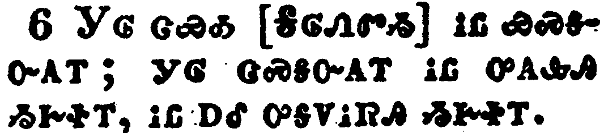</a></td>
</tr>
<tr class="even">
<td>Whosoever abideth in him sinneth not: whosoever sinneth hath not seen him, neither known him.</td>
</tr>
<tr class="odd">
<td>ᎩᎶ ᏣᏯᎣ [ᎦᎶᏁᏛᏱ] ᎥᏝ ᏯᏍᎦᏅᎪᎢ; ᎩᎶ ᏣᏍᎦᏅᎪᎢ ᎥᏝ ᎤᎪᎲᎯ ᏱᎨᏐᎢ, ᎥᏝ ᎠᎴ ᎤᎦᏙᎥᏒᎯ ᏱᎨᏐᎢ.</td>
</tr>
<tr class="even">
<td>Gi-lo tsa-ya-o [Ga-lo-ne-dv-yi] v-tla ya-s-ga-nv-go-i; gi-lo tsa-s-ga-nv-go-i v-tla u-go-hv-hi yi-ge-so-i, v-tla a-le u-ga-do-v-sv-hi yi-ge-so-i.</td>
</tr>
</tbody>
</table>

<table>
<tbody>
<tr class="odd">
<td><a href="230307.png">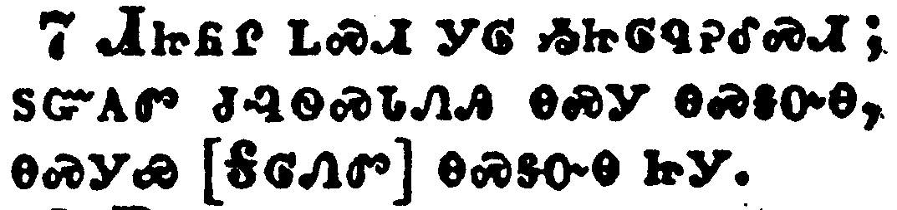</a></td>
</tr>
<tr class="even">
<td>Little children, let no man deceive you: he that doeth righteousness is righteous, even as he is righteous.</td>
</tr>
<tr class="odd">
<td>ᏗᏥᏲᎵ ᏞᏍᏗ ᎩᎶ ᏱᏥᎶᏄᎮᎴᏍᏗ; ᏚᏳᎪᏛ ᏧᎸᏫᏍᏓᏁᎯ ᎾᏍᎩ ᎾᏍᎦᏅᎾ, ᎾᏍᎩᏯ [ᎦᎶᏁᏛ] ᎾᏍᎦᏅᎾ ᏥᎩ.</td>
</tr>
<tr class="even">
<td>Di-tsi-yo-li tle-s-di gi-lo yi-tsi-lo-nu-he-le-s-di; du-yu-go-dv tsu-lv-wi-s-da-ne-hi na-s-gi na-s-ga-nv-na, na-s-gi-ya [Ga-lo-ne-dv] na-s-ga-nv-na tsi-gi.</td>
</tr>
</tbody>
</table>

<table>
<tbody>
<tr class="odd">
<td><a href="230308.png">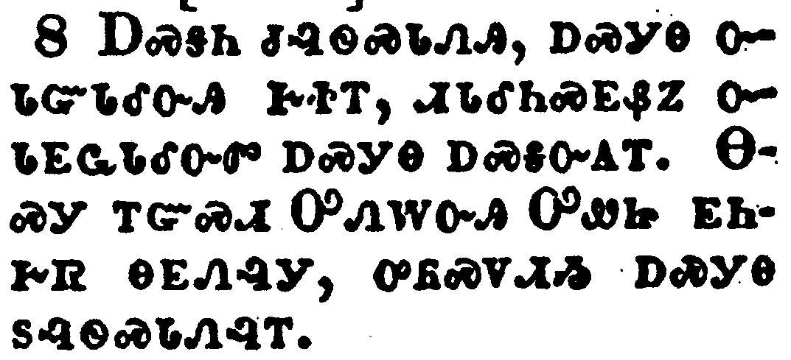</a></td>
</tr>
<tr class="even">
<td>He that committeth sin is of the devil; for the devil sinneth from the beginning. For this purpose the Son of God was manifested, that he might destroy the works of the devil.</td>
</tr>
<tr class="odd">
<td>ᎠᏍᎦᏂ ᏧᎸᏫᏍᏓᏁᎯ, ᎠᏍᎩᎾ ᏅᏓᏳᏓᎴᏅᎯ ᎨᏐᎢ, ᏗᏓᎴᏂᏍᎬᏰᏃ ᏅᏓᎬᏩᏓᎴᏅᏛ ᎠᏍᎩᎾ ᎠᏍᎦᏅᎪᎢ. ᎾᏍᎩ ᎢᏳᏍᏗ ᎤᏁᎳᏅᎯ ᎤᏪᏥ ᎬᏂᎨᏒ ᎾᎬᏁᎸᎩ, ᎤᏲᏍᏙᏗᏱ ᎠᏍᎩᎾ ᏚᎸᏫᏍᏓᏁᎸᎢ.</td>
</tr>
<tr class="even">
<td>A-s-ga-ni tsu-lv-wi-s-da-ne-hi, a-s-gi-na nv-da-yu-da-le-nv-hi ge-so-i, di-da-le-ni-s-gv-ye-no nv-da-gv-wa-da-le-nv-dv a-s-gi-na a-s-ga-nv-go-i. Na-s-gi i-yu-s-di U-ne-la-nv-hi U-we-tsi gv-ni-ge-sv na-gv-ne-lv-gi, u-yo-s-do-di-yi a-s-gi-na du-lv-wi-s-da-ne-lv-i.</td>
</tr>
</tbody>
</table>

<table>
<tbody>
<tr class="odd">
<td><a href="230309.png">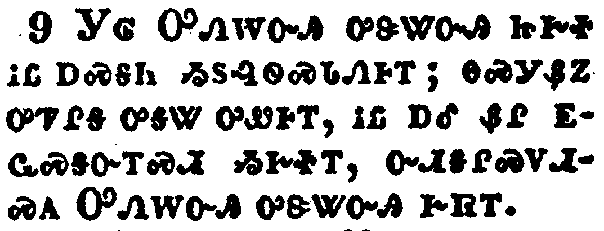</a></td>
</tr>
<tr class="even">
<td>Whosoever is born of God doth not commit sin; for his seed remaineth in him: and he cannot sin, because he is born of God.</td>
</tr>
<tr class="odd">
<td>ᎩᎶ ᎤᏁᎳᏅᎯ ᎤᏕᏔᏅᎯ ᏥᎨᏐ ᎥᏝ ᎠᏍᎦᏂ ᏱᏚᎸᏫᏍᏓᏁᎰᎢ; ᎾᏍᎩᏰᏃ ᎤᏤᎵᎦ ᎤᎦᏔ ᎤᏪᎰᎢ, ᎥᏝ ᎠᎴ ᏰᎵ ᎬᏩᏍᎦᏅᎢᏍᏗ ᏱᎨᏐᎢ, ᏅᏗᎦᎵᏍᏙᏗᏍᎪ ᎤᏁᎳᏅᎯ ᎤᏕᏔᏅᎯ ᎨᏒᎢ.</td>
</tr>
<tr class="even">
<td>Gi-lo U-ne-la-nv-hi u-de-ta-nv-hi tsi-ge-so v-tla a-s-ga-ni yi-du-lv-wi-s-da-ne-ho-i; na-s-gi-ye-no u-tse-li-ga u-ga-ta u-we-ho-i, v-tla a-le ye-li gv-wa-s-ga-nv-i-s-di yi-ge-so-i, nv-di-ga-li-s-do-di-s-go U-ne-la-nv-hi u-de-ta-nv-hi ge-sv-i.</td>
</tr>
</tbody>
</table>

<table>
<tbody>
<tr class="odd">
<td><a href="230310.png">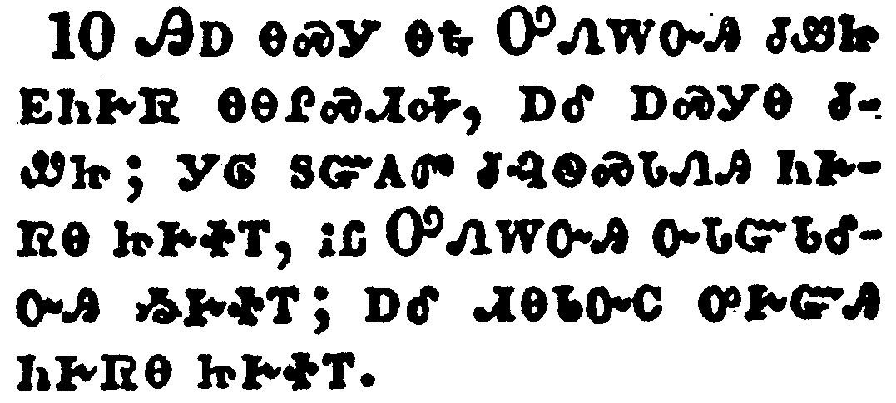</a></td>
</tr>
<tr class="even">
<td>In this the children of God are manifest, and the children of the devil: whosoever doeth not righteousness is not of God, neither he that loveth not his brother.</td>
</tr>
<tr class="odd">
<td>ᎯᎠ ᎾᏍᎩ ᎾᎿᎭᎤᏁᎳᏅᎯ ᏧᏪᏥ ᎬᏂᎨᏒ ᎾᎾᎵᏍᏗᎭ, ᎠᎴ ᎠᏍᎩᎾ ᏧᏪᏥ; ᎩᎶ ᏚᏳᎪᏛ ᏧᎸᏫᏍᏓᏁᎯ ᏂᎨᏒᎾ ᏥᎨᏐᎢ, ᎥᏝ ᎤᏁᎳᏅᎯ ᏅᏓᏳᏓᎴᏅᎯ ᏱᎨᏐᎢ; ᎠᎴ ᏗᎾᏓᏅᏟ ᎤᎨᏳᎯ ᏂᎨᏒᎾ ᏥᎨᏐᎢ.</td>
</tr>
<tr class="even">
<td>Hi-a na-s-gi na-hna U-ne-la-nv-hi tsu-we-tsi gv-ni-ge-sv na-na-li-s-di-ha, a-le a-s-gi-na tsu-we-tsi; gi-lo du-yu-go-dv tsu-lv-wi-s-da-ne-hi ni-ge-sv-na tsi-ge-so-i, v-tla U-ne-la-nv-hi nv-da-yu-da-le-nv-hi yi-ge-so-i; a-le di-na-da-nv-tli u-ge-yu-hi ni-ge-sv-na tsi-ge-so-i.</td>
</tr>
</tbody>
</table>

<table>
<tbody>
<tr class="odd">
<td><a href="230311.png">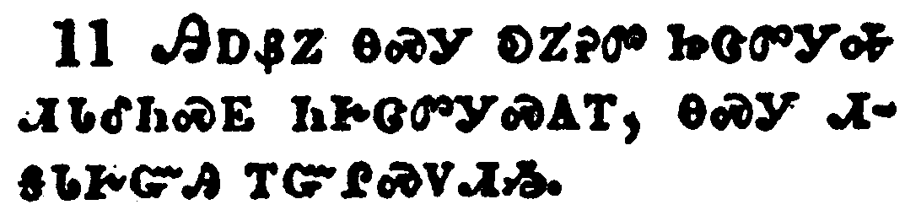</a></td>
</tr>
<tr class="even">
<td>For this is the message that ye heard from the beginning, that we should love one another.</td>
</tr>
<tr class="odd">
<td>ᎯᎠᏰᏃ ᎾᏍᎩ ᎧᏃᎮᏛ ᏥᏣᏛᎩᎭ ᏗᏓᎴᏂᏍᎬ ᏂᎨᏣᏛᎩᏍᎪᎢ, ᎾᏍᎩ ᏗᎦᏓᎨᏳᎯ ᎢᏳᎵᏍᏙᏗᏱ.</td>
</tr>
<tr class="even">
<td>Hi-a-ye-no na-s-gi ka-no-he-dv tsi-tsa-dv-gi-ha di-da-le-ni-s-gv ni-ge-tsa-dv-gi-s-go-i, na-s-gi di-ga-da-ge-yu-hi i-yu-li-s-do-di-yi.</td>
</tr>
</tbody>
</table>

<table>
<tbody>
<tr class="odd">
<td></td>
</tr>
<tr class="even">
<td>Not as Cain, who was of that wicked one, and slew his brother. And wherefore slew he him? Because his own works were evil, and his brother's righteous.</td>
</tr>
<tr class="odd">
<td>ᎥᏝ ᎾᏍᎩ ᎨᎾ ᏄᏛᏁᎸᎢ, ᎾᏍᎩ ᎤᏁᎫᏥᏛ ᏅᏓᏳᏓᎴᏅᎯ ᏥᎨᏎᎢ, ᎠᎴ ᎤᏅᏟ ᏧᎴ. ᎦᏙᏃ ᎢᎤᎴᎢ? ᏅᏗᎦᎵᏍᏙᏗᏍᎨᏍᎩᏂ ᎤᏩᏒ ᏚᎸᏫᏍᏓᏁᎲ ᎤᏲᎢᏳ ᎨᏒᎢ, ᎤᏅᏟᏃ ᏚᎸᏫᏍᏓᏁᎲ ᎣᏏᏳ ᎨᏒᎢ.</td>
</tr>
<tr class="even">
<td>V-tla na-s-gi ge-na nu-dv-ne-lv-i, na-s-gi u-ne-gu-tsi-dv nv-da-yu-da-le-nv-hi tsi-ge-se-i, a-le u-nv-tli tsu-le. Ga-do-no i-u-le-i? Nv-di-ga-li-s-do-di-s-ge-s-gi-ni u-wa-sv du-lv-wi-s-da-ne-hv u-yo-i-yu ge-sv-i, u-nv-tli-no du-lv-wi-s-da-ne-hv o-si-yu ge-sv-i.</td>
</tr>
</tbody>
</table>

<table>
<tbody>
<tr class="odd">
<td><a href="230313.png">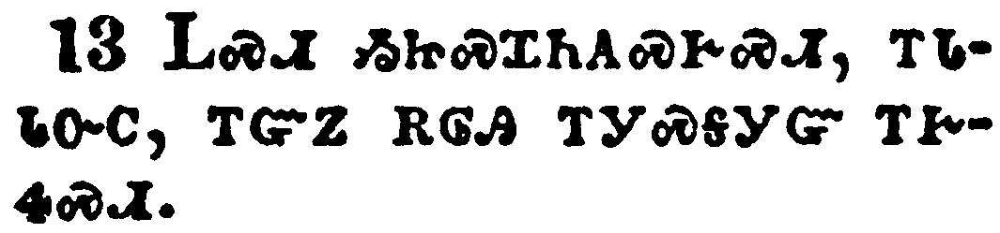</a></td>
</tr>
<tr class="even">
<td>Marvel not, my brethren, if the world hate you.</td>
</tr>
<tr class="odd">
<td>ᏞᏍᏗ ᏱᏥᏍᏆᏂᎪᏍᎨᏍᏗ, ᎢᏓᏓᏅᏟ, ᎢᏳᏃ ᎡᎶᎯ ᎢᎩᏍᎦᎩᏳ ᎢᎨᏎᏍᏗ.</td>
</tr>
<tr class="even">
<td>Tle-s-di yi-tsi-s-qua-ni-go-s-ge-s-di, i-da-da-nv-tli, i-yu-no e-lo-hi i-gi-s-ga-gi-yu i-ge-se-s-di.</td>
</tr>
</tbody>
</table>

<table>
<tbody>
<tr class="odd">
<td><a href="230314.png">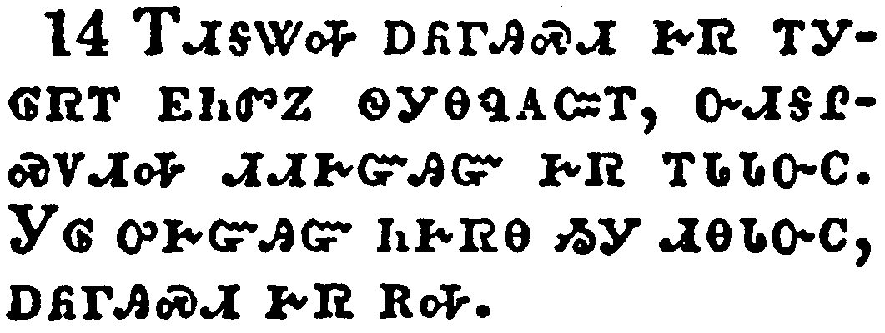</a></td>
</tr>
<tr class="even">
<td>We know that we have passed from death unto life, because we love the brethren. He that loveth not his brother abideth in death.</td>
</tr>
<tr class="odd">
<td>ᎢᏗᎦᏔᎭ ᎠᏲᎱᎯᏍᏗ ᎨᏒ ᎢᎩᎶᏒᎢ ᎬᏂᏛᏃ ᏫᎩᎾᏄᎪᏨᎢ, ᏅᏗᎦᎵᏍᏙᏗᎭ ᏗᏗᎨᏳᎯᏳ ᎨᏒ ᎢᏓᏓᏅᏟ. ᎩᎶ ᎤᎨᏳᎯᏳ ᏂᎨᏒᎾ ᏱᎩ ᏗᎾᏓᏅᏟ, ᎠᏲᎱᎯᏍᏗ ᎨᏒ ᎡᎭ.</td>
</tr>
<tr class="even">
<td>I-di-ga-ta-ha a-yo-hu-hi-s-di ge-sv i-gi-lo-sv-i gv-ni-dv-no wi-gi-na-nu-go-tsv-i, nv-di-ga-li-s-do-di-ha di-di-ge-yu-hi-yu ge-sv i-da-da-nv-tli. Gi-lo u-ge-yu-hi-yu ni-ge-sv-na yi-gi di-na-da-nv-tli, a-yo-hu-hi-s-di ge-sv e-ha.</td>
</tr>
</tbody>
</table>

<table>
<tbody>
<tr class="odd">
<td><a href="230315.png">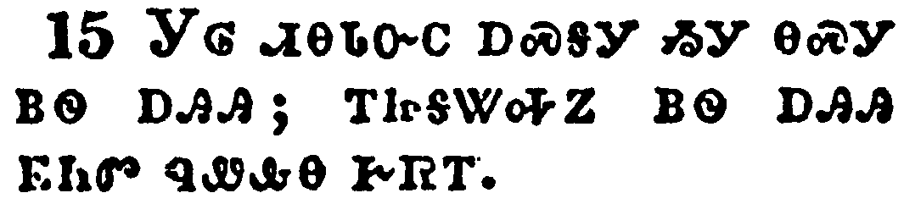</a></td>
</tr>
<tr class="even">
<td>Whosoever hateth his brother is a murderer: and ye know that no murderer hath eternal life abiding in him.</td>
</tr>
<tr class="odd">
<td>ᎩᎶ ᏗᎾᏓᏅᏟ ᎠᏍᎦᎩ ᏱᎩ ᎾᏍᎩ ᏴᏫ ᎠᎯᎯ; ᎢᏥᎦᏔᎭᏃ ᏴᏫ ᎠᎯᎯ ᎬᏂᏛ ᏄᏪᎲᎾ ᎨᏒᎢ.</td>
</tr>
<tr class="even">
<td>Gi-lo di-na-da-nv-tli a-s-ga-gi yi-gi na-s-gi yv-wi a-hi-hi; i-tsi-ga-ta-ha-no yv-wi a-hi-hi gv-ni-dv nu-we-hv-na ge-sv-i.</td>
</tr>
</tbody>
</table>

<table>
<tbody>
<tr class="odd">
<td><a href="230316.png">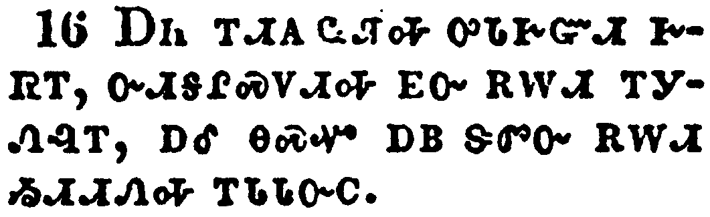</a></td>
</tr>
<tr class="even">
<td>Hereby perceive we the love of God, because he laid down his life for us: and we ought to lay down our lives for the brethren.</td>
</tr>
<tr class="odd">
<td>ᎠᏂ ᎢᏗᎪ ᏩᏘᎭ ᎤᏓᎨᏳᏗ ᎨᏒᎢ, ᏅᏗᎦᎵᏍᏙᏗᎭ ᎬᏅ ᎡᎳᏗ ᎢᎩᏁᎸᎢ, ᎠᎴ ᎾᏍᏉ ᎠᏴ ᏕᏛᏅ ᎡᎳᏗ ᏱᏗᏗᏁᎭ ᎢᏓᏓᏅᏟ.</td>
</tr>
<tr class="even">
<td>A-ni i-di-go wa-ti-ha u-da-ge-yu-di ge-sv-i, nv-di-ga-li-s-do-di-ha gv-nv e-la-di i-gi-ne-lv-i, a-le na-s-quo a-yv de-dv-nv e-la-di yi-di-di-ne-ha i-da-da-nv-tli.</td>
</tr>
</tbody>
</table>

<table>
<tbody>
<tr class="odd">
<td><a href="230317.png">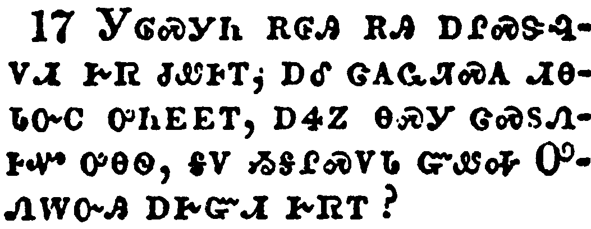</a></td>
</tr>
<tr class="even">
<td>But whoso hath this world's good, and seeth his brother have need, and shutteth up his bowels of compassion from him, how dwelleth the love of God in him?</td>
</tr>
<tr class="odd">
<td>ᎩᎶᏍᎩᏂ ᎡᎶᎯ ᎡᎯ ᎠᎵᏍᏕᎸᏙᏗ ᎨᏒ ᏧᏪᎰᎢ, ᎠᎴ ᏣᎪᏩᏘᏍᎪ ᏗᎾᏓᏅᏟ ᎤᏂᎬᎬᎢ, ᎠᏎᏃ ᎾᏍᎩ ᏣᏍᏚᏁᎰᏉ ᎤᎾᏫ, ᎦᏙ ᏱᎦᎵᏍᏙᏓ ᏳᏪᎭ ᎤᏁᎳᏅᎯ ᎠᎨᏳᏗ ᎨᏒᎢ?</td>
</tr>
<tr class="even">
<td>Gi-lo-s-gi-ni e-lo-hi e-hi a-li-s-de-lv-do-di ge-sv tsu-we-ho-i, a-le tsa-go-wa-ti-s-go di-na-da-nv-tli u-ni-gv-gv-i, a-se-no na-s-gi tsa-s-du-ne-ho-quo u-na-wi, ga-do yi-ga-li-s-do-da yu-we-ha U-ne-la-nv-hi a-ge-yu-di ge-sv-i?</td>
</tr>
</tbody>
</table>

<table>
<tbody>
<tr class="odd">
<td><a href="230318.png">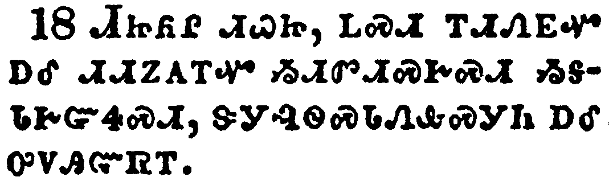</a></td>
</tr>
<tr class="even">
<td>My little children, let us not love in word, neither in tongue; but in deed and in truth.</td>
</tr>
<tr class="odd">
<td>ᏗᏥᏲᎵ ᏗᏇᏥ, ᏞᏍᏗ ᎢᏗᏁᎬᏉ ᎠᎴ ᏗᏗᏃᎪᎢᏉ ᏱᏗᏛᏗᏍᎨᏍᏗ ᏱᎦᏓᎨᏳᏎᏍᏗ, ᏕᎩᎸᏫᏍᏓᏁᎲᏍᎩᏂ ᎠᎴ ᎤᏙᎯᏳᏒᎢ.</td>
</tr>
<tr class="even">
<td>Di-tsi-yo-li di-que-tsi, tle-s-di i-di-ne-gv-quo a-le di-di-no-go-i-quo yi-di-dv-di-s-ge-s-di yi-ga-da-ge-yu-se-s-di, de-gi-lv-wi-s-da-ne-hv-s-gi-ni a-le u-do-hi-yu-sv-i.</td>
</tr>
</tbody>
</table>

<table>
<tbody>
<tr class="odd">
<td><a href="230319.png">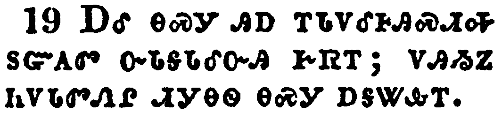</a></td>
</tr>
<tr class="even">
<td>And hereby we know that we are of the truth, and shall assure our hearts before him.</td>
</tr>
<tr class="odd">
<td>ᎠᎴ ᎾᏍᎩ ᎯᎠ ᎢᏓᏙᎴᎰᎯᏍᏗᎭ ᏚᏳᎪᏛ ᏅᏓᎦᏓᎴᏅᎯ ᎨᏒᎢ; ᏙᎯᏱᏃ ᏂᏙᏓᏛᏁᎵ ᏗᎩᎾᏫ ᎾᏍᎩ ᎠᎦᏔᎲᎢ.</td>
</tr>
<tr class="even">
<td>A-le na-s-gi hi-a i-da-do-le-ho-hi-s-di-ha du-yu-go-dv nv-da-ga-da-le-nv-hi ge-sv-i; do-hi-yi-no ni-do-da-dv-ne-li di-gi-na-wi na-s-gi a-ga-ta-hv-i.</td>
</tr>
</tbody>
</table>

<table>
<tbody>
<tr class="odd">
<td><a href="230320.png">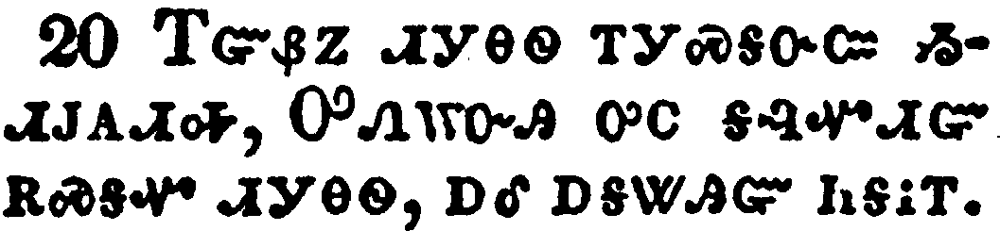</a></td>
</tr>
<tr class="even">
<td>For if our heart condemn us, God is greater than our heart, and knoweth all things.</td>
</tr>
<tr class="odd">
<td>ᎢᏳᏰᏃ ᏗᎩᎾᏫ ᎢᎩᏍᎦᏅᏨ ᏱᏗᎫᎪᏗᎭ, ᎤᏁᎳᏅᎯ ᎤᏟ ᎦᎸᏉᏗᏳ ᎡᏍᎦᏉ ᏗᎩᎾᏫ, ᎠᎴ ᎠᎦᏔᎯᏳ ᏂᎦᎥᎢ.</td>
</tr>
<tr class="even">
<td>I-yu-ye-no di-gi-na-wi i-gi-s-ga-nv-tsv yi-di-gu-go-di-ha, U-ne-la-nv-hi u-tli ga-lv-quo-di-yu e-s-ga-quo di-gi-na-wi, a-le a-ga-ta-hi-yu ni-ga-v-i.</td>
</tr>
</tbody>
</table>

<table>
<tbody>
<tr class="odd">
<td></td>
</tr>
<tr class="even">
<td>Beloved, if our heart condemn us not, then have we confidence toward God.</td>
</tr>
<tr class="odd">
<td>ᎢᏨᎨᏳᎢ, ᎢᏳᏃ ᏗᎩᎾᏫ ᏂᏗᎫᎪᏓᏁᎲᎾ ᏱᎩ, ᎤᎦᎵᏍᏗᏳ ᎢᎦᏓᏅᏔ ᎤᏁᎳᏅᎯ ᎡᏓᏓᏅᏖᏍᎬᎢ;</td>
</tr>
<tr class="even">
<td>I-tsv-ge-yu-i, i-yu-no di-gi-na-wi ni-di-gu-go-da-ne-hv-na yi-gi, u-ga-li-s-di-yu i-ga-da-nv-ta u-ne-la-nv-hi e-da-da-nv-te-s-gv-i;</td>
</tr>
</tbody>
</table>

<table>
<tbody>
<tr class="odd">
<td><a href="230322.png">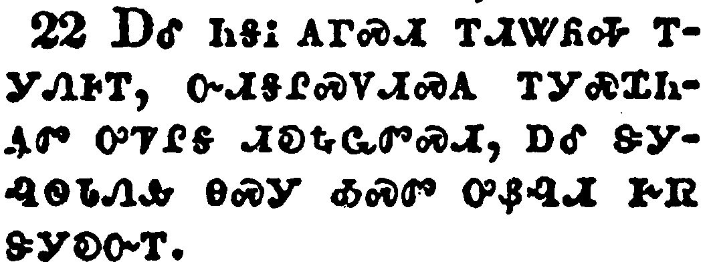</a></td>
</tr>
<tr class="even">
<td>And whatsoever we ask, we receive of him, because we keep his commandments, and do those things that are pleasing in his sight.</td>
</tr>
<tr class="odd">
<td>ᎠᎴ ᏂᎦᎥ ᎪᎱᏍᏗ ᎢᏗᏔᏲᎭ ᎢᎩᏁᎰᎢ, ᏅᏗᎦᎵᏍᏙᏗᏍᎪ ᎢᎩᏍᏆᏂᎪᏛ ᎤᏤᎵᎦ ᏗᎧᎿᎭᏩᏛᏍᏗ, ᎠᎴ ᏕᎩᎸᏫᏓᏁᎲ ᎾᏍᎩ ᎣᏍᏛ ᎤᏰᎸᏗ ᎨᏒ ᏕᎩᎧᏅᎢ.</td>
</tr>
<tr class="even">
<td>A-le ni-ga-v go-hu-s-di i-di-ta-yo-ha i-gi-ne-ho-i, nv-di-ga-li-s-do-di-s-go i-gi-s-qua-ni-go-dv u-tse-li-ga di-ka-hna-wa-dv-s-di, a-le de-gi-lv-wi-da-ne-hv na-s-gi o-s-dv u-ye-lv-di ge-sv de-gi-ka-nv-i.</td>
</tr>
</tbody>
</table>

<table>
<tbody>
<tr class="odd">
<td><a href="230323.png">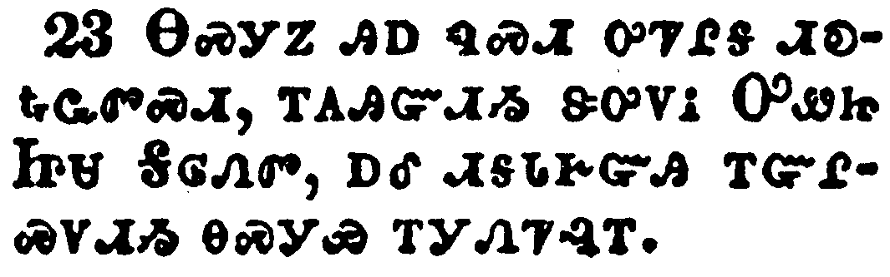</a></td>
</tr>
<tr class="even">
<td>And this is his commandment, That we should believe on the name of his Son Jesus Christ, and love one another, as he gave us commandment.</td>
</tr>
<tr class="odd">
<td>ᎾᏍᎩᏃ ᎯᎠ ᏄᏍᏗ ᎤᏤᎵᎦ ᏗᎧᎿᎭᏩᏛᏍᏗ, ᎢᎪᎯᏳᏗᏱ ᏕᎤᏙᎥ ᎤᏪᏥ ᏥᏌ ᎦᎶᏁᏛ, ᎠᎴ ᏗᎦᏓᎨᏳᎯ ᎢᏳᎵᏍᏙᏗᏱ ᎾᏍᎩᏯ ᎢᎩᏁᏤᎸᎢ.</td>
</tr>
<tr class="even">
<td>Na-s-gi-no hi-a nu-s-di u-tse-li-ga di-ka-hna-wa-dv-s-di, i-go-hi-yu-di-yi de-u-do-v U-we-tsi Tsi-sa Ga-lo-ne-dv, a-le di-ga-da-ge-yu-hi i-yu-li-s-do-di-yi na-s-gi-ya i-gi-ne-tse-lv-i.</td>
</tr>
</tbody>
</table>

<table>
<tbody>
<tr class="odd">
<td><a href="230324.png">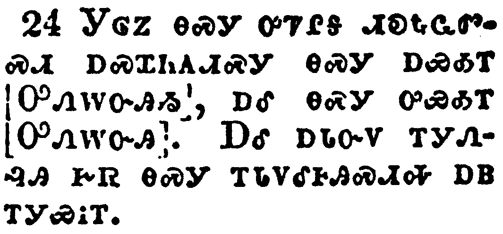</a></td>
</tr>
<tr class="even">
<td>And he that keepeth his commandments dwelleth in him, and he in him. And hereby we know that he abideth in us, by the Spirit which he hath given us.</td>
</tr>
<tr class="odd">
<td>ᎩᎶᏃ ᎾᏍᎩ ᎤᏤᎵᎦ ᏗᎧᎿᎭᏩᏛᏍᏗ ᎠᏍᏆᏂᎪᏗᏍᎩ ᎾᏍᎩ ᎠᏯᎣᎢ [ᎤᏁᎳᏅᎯᏱ], ᎠᎴ ᎾᏍᎩ ᎤᏯᎣᎢ [ᎤᏁᎳᏅᎯ]. ᎠᎴ ᎠᏓᏅᏙ ᎢᎩᏁᎸᎯ ᎨᏒ ᎾᏍᎩ ᎢᏓᏙᎴᎰᎯᏍᏗᎭ ᎠᏴ ᎢᎩᏯᎥᎢ.</td>
</tr>
<tr class="even">
<td>Gi-lo-no na-s-gi u-tse-li-ga di-ka-hna-wa-dv-s-di a-s-qua-ni-go-di-s-gi na-s-gi a-ya-o-i [U-ne-la-nv-hi-yi], a-le na-s-gi u-ya-o-i [U-ne-la-nv-hi]. A-le a-da-nv-do i-gi-ne-lv-hi ge-sv na-s-gi i-da-do-le-ho-hi-s-di-ha a-yv i-gi-ya-v-i.</td>
</tr>
</tbody>
</table>

