+++
draft=false
date = 2014-12-18T21:11:07Z
title = "1 Timothy - Chapter 6 - Cherokee New Testament"
weight = 1418955067

[taxonomies]

authors = ["Timothy Legg"]
categories = []
tags = []

[extra]
+++

<table>
<tbody>
<tr class="odd">
<td><a href="150601.png">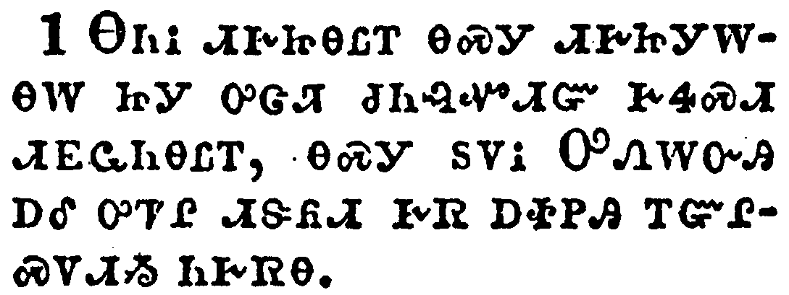</a></td>
</tr>
<tr class="even">
<td>Let as many servants as are under the yoke count their own masters worthy of all honour, that the name of God and his doctrine be not blasphemed.</td>
</tr>
<tr class="odd">
<td>ᎾᏂᎥ ᏗᎨᏥᎾᏝᎢ ᎾᏍᎩ ᏗᎨᏥᎩᎳᎾᎳ ᏥᎩ ᎤᏣᏘ ᏧᏂᎸᏉᏗᏳ ᎨᏎᏍᏗ ᏗᎬᏩᏂᎾᏝᎢ, ᎾᏍᎩ ᏚᏙᎥ ᎤᏁᎳᏅᎯ ᎠᎴ ᎤᏤᎵ ᏗᏕᏲᏗ ᎨᏒ ᎠᏐᏢᎯ ᎢᏳᎵᏍᏙᏗᏱ ᏂᎨᏒᎾ.</td>
</tr>
<tr class="even">
<td>Na-ni-v di-ge-tsi-na-tla-i na-s-gi di-ge-tsi-gi-la-na-la tsi-gi u-tsa-ti tsu-ni-lv-quo-di-yu ge-se-s-di di-gv-wa-ni-na-tla-i, na-s-gi du-do-v U-ne-la-nv-hi a-le u-tse-li di-de-yo-di ge-sv a-so-tlv-hi i-yu-li-s-do-di-yi ni-ge-sv-na.</td>
</tr>
</tbody>
</table>

<table>
<tbody>
<tr class="odd">
<td><a href="150602.png">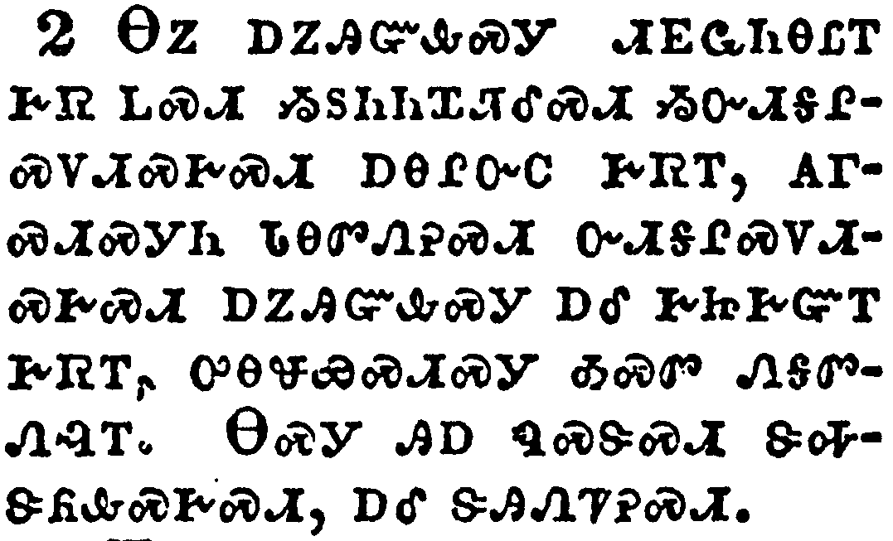</a></td>
</tr>
<tr class="even">
<td>And they that have believing masters, let them not despise them, because they are brethren; but rather do them service, because they are faithful and beloved, partakers of the benefit. These things teach and exhort.</td>
</tr>
<tr class="odd">
<td>ᎾᏃ ᎠᏃᎯᏳᎲᏍᎩ ᏗᎬᏩᏂᎾᏝᎢ ᎨᏒ ᏞᏍᏗ ᏱᏚᏂᏂᏆᏘᎴᏍᏗ ᏱᏅᏗᎦᎵᏍᏙᏗᏍᎨᏍᏗ ᎠᎾᎵᏅᏟ ᎨᏒᎢ, ᎪᎱᏍᏗᏍᎩᏂ ᏓᎾᏛᏁᎮᏍᏗ ᏅᏗᎦᎵᏍᏙᏗᏍᎨᏍᏗ ᎠᏃᎯᏳᎲᏍᎩ ᎠᎴ ᎨᏥᎨᏳᎢ ᎨᏒᎢ, ᎤᎾᏠᏯᏍᏗᏍᎩ ᎣᏍᏛ ᎾᎦᏛᏁᎸᎢ. ᎾᏍᎩ ᎯᎠ ᏄᏍᏕᏍᏗ ᏕᎭᏕᏲᎲᏍᎨᏍᏗ, ᎠᎴ ᏕᎯᏁᏤᎮᏍᏗ.</td>
</tr>
<tr class="even">
<td>Na-no a-no-hi-yu-hv-s-gi di-gv-wa-ni-na-tla-i ge-sv tle-s-di yi-du-ni-ni-qua-ti-le-s-di yi-nv-di-ga-li-s-do-di-s-ge-s-di a-na-li-nv-tli ge-sv-i, go-hu-s-di-s-gi-ni da-na-dv-ne-he-s-di nv-di-ga-li-s-do-di-s-ge-s-di a-no-hi-yu-hv-s-gi a-le ge-tsi-ge-yu-i ge-sv-i, u-na-tlo-ya-s-di-s-gi o-s-dv na-ga-dv-ne-lv-i. Na-s-gi hi-a nu-s-de-s-di de-ha-de-yo-hv-s-ge-s-di, a-le de-hi-ne-tse-he-s-di.</td>
</tr>
</tbody>
</table>

<table>
<tbody>
<tr class="odd">
<td></td>
</tr>
<tr class="even">
<td>If any man teach otherwise, and consent not to wholesome words, even the words of our Lord Jesus Christ, and to the doctrine which is according to godliness;</td>
</tr>
<tr class="odd">
<td>ᎢᏳᏃ ᎩᎶ ᎤᏣᏘᏂ ᏂᎦᏪᏍᎨᏍᏗ ᏓᏕᏲᎲᏍᎨᏍᏗ, ᎠᎴ ᎣᏏ ᎾᏰᎸᏍᎬᎾ ᎢᎨᏎᏍᏗ ᎣᏍᏛ ᎤᏬᏂᏒ ᎢᎦᏤᎵ ᎤᎬᏫᏳᎯ ᏥᏌ ᎦᎶᏁᏛ, ᎠᎴ ᏗᏕᏲᏗ ᎨᏒ ᎾᏍᎩ ᎤᏁᎳᏅᎯ ᏗᏂᎶᏙᏗ ᎨᏒ ᏥᏓᏕᏲᎲᏍᎦ;</td>
</tr>
<tr class="even">
<td>I-yu-no gi-lo u-tsa-ti-ni ni-ga-we-s-ge-s-di da-de-yo-hv-s-ge-s-di, a-le o-si na-ye-lv-s-gv-na i-ge-se-s-di o-s-dv u-wo-ni-sv i-ga-tse-li U-gv-wi-yu-hi Tsi-sa Ga-lo-ne-dv, a-le di-de-yo-di ge-sv na-s-gi U-ne-la-nv-hi di-ni-lo-do-di ge-sv tsi-da-de-yo-hv-s-ga;</td>
</tr>
</tbody>
</table>

<table>
<tbody>
<tr class="odd">
<td></td>
</tr>
<tr class="even">
<td>He is proud, knowing nothing, but doting about questions and strifes of words, whereof cometh envy, strife, railings, evil surmisings,</td>
</tr>
<tr class="odd">
<td>ᎾᏍᎩ Ꮎ ᎤᏢᏉᏗ, ᎪᎱᏍᏗ ᎾᎦᏔᎲᎾ, ᎤᎵᏰᏔᏁᎯ ᎦᏬᏂᎯᏍᏗ ᎨᏒ, ᎠᎴ ᏧᏘᏲᏌᏘ ᎠᎵᏃᎮᏍᎬᎢ, ᎾᎿᎭᏨᏗᏓᎴᎲᏍᎦ ᎠᏛᏳᎨᏗ ᎨᏒᎢ, ᎠᎴ ᎠᏗᏒᏍᏗ ᎨᏒᎢ, ᎠᎴ ᎠᏐᏢᎢᏍᏙᏗ ᎨᏒᎢ, ᎠᎴ ᎪᎱᏍᏗ ᏗᏓᏕᎵᏎᏗ ᎨᏒᎢ,</td>
</tr>
<tr class="even">
<td>Na-s-gi na u-tlv-quo-di, go-hu-s-di na-ga-ta-hv-na, u-li-ye-ta-ne-hi ga-wo-ni-hi-s-di ge-sv, a-le tsu-ti-yo-sa-ti a-li-no-he-s-gv-i, na-hna tsv-di-da-le-hv-s-ga a-dv-yu-ge-di ge-sv-i, a-le a-di-sv-s-di ge-sv-i, a-le a-so-tlv-i-s-do-di ge-sv-i, a-le go-hu-s-di di-da-de-li-se-di ge-sv-i,</td>
</tr>
</tbody>
</table>

<table>
<tbody>
<tr class="odd">
<td><a href="150605.png">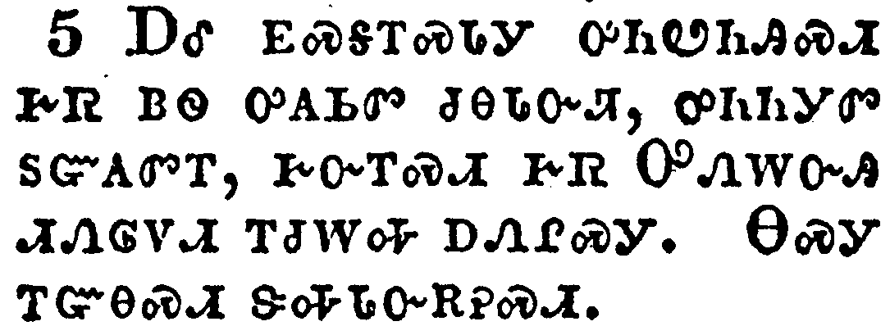</a></td>
</tr>
<tr class="even">
<td>Perverse disputings of men of corrupt minds, and destitute of the truth, supposing that gain is godliness: from such withdraw thyself.</td>
</tr>
<tr class="odd">
<td>ᎠᎴ ᎬᏍᎦᎢᏍᏓᎩ ᎤᏂᏬᏂᎯᏍᏗ ᎨᏒ ᏴᏫ ᎤᎪᏏᏛ ᏧᎾᏓᏅᏘ, ᎤᏂᏂᎩᏛ ᏚᏳᎪᏛᎢ, ᎨᏅᎢᏍᏗ ᎨᏒ ᎤᏁᎳᏅᎯ ᏗᏁᎶᏙᏗ ᎢᏧᎳᎭ ᎠᏁᎵᏍᎩ. ᎾᏍᎩ ᎢᏳᎾᏍᏗ ᏕᎭᏓᏅᎡᎮᏍᏗ.</td>
</tr>
<tr class="even">
<td>A-le gv-s-ga-i-s-da-gi u-ni-wo-ni-hi-s-di ge-sv yv-wi u-go-si-dv tsu-na-da-nv-ti, u-ni-ni-gi-dv du-yu-go-dv-i, ge-nv-i-s-di ge-sv U-ne-la-nv-hi di-ne-lo-do-di i-tsu-la-ha a-ne-li-s-gi. Na-s-gi i-yu-na-s-di de-ha-da-nv-e-he-s-di.</td>
</tr>
</tbody>
</table>

<table>
<tbody>
<tr class="odd">
<td><a href="150606.png">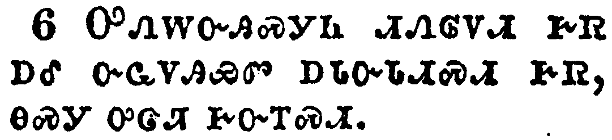</a></td>
</tr>
<tr class="even">
<td>But godliness with contentment is great gain.</td>
</tr>
<tr class="odd">
<td>ᎤᏁᎳᏅᎯᏍᎩᏂ ᏗᏁᎶᏙᏗ ᎨᏒ ᎠᎴ ᏅᏩᏙᎯᏯᏛ ᎠᏓᏅᏓᏗᏍᏗ ᎨᏒ, ᎾᏍᎩ ᎤᏣᏘ ᎨᏅᎢᏍᏗ.</td>
</tr>
<tr class="even">
<td>U-ne-la-nv-hi-s-gi-ni di-ne-lo-do-di ge-sv a-le nv-wa-do-hi-ya-dv a-da-nv-da-di-s-di ge-sv, na-s-gi u-tsa-ti ge-nv-i-s-di.</td>
</tr>
</tbody>
</table>

<table>
<tbody>
<tr class="odd">
<td><a href="150607.png">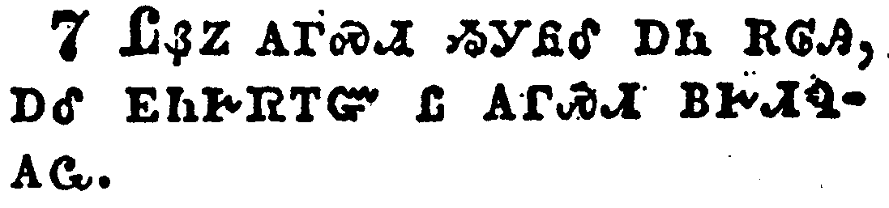</a></td>
</tr>
<tr class="even">
<td>For we brought nothing into this world, and it is certain we can carry nothing out.</td>
</tr>
<tr class="odd">
<td>ᏝᏰᏃ ᎪᎱᏍᏗ ᏱᎩᏲᎴ ᎠᏂ ᎡᎶᎯ, ᎠᎴ ᎬᏂᎨᏳᎢᏳ Ꮭ ᎪᎱᏍᏗ ᏴᎨᏗᏄᎪᏩ.</td>
</tr>
<tr class="even">
<td>Tla-ye-no go-hu-s-di yi-gi-yo-le a-ni e-lo-hi, a-le gv-ni-ge-yu-i-yu tla go-hu-s-di yv-ge-di-nu-go-wa.</td>
</tr>
</tbody>
</table>

<table>
<tbody>
<tr class="odd">
<td><a href="150608.png">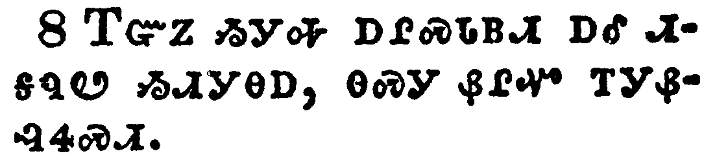</a></td>
</tr>
<tr class="even">
<td>And having food and raiment let us be therewith content.</td>
</tr>
<tr class="odd">
<td>ᎢᏳᏃ ᏱᎩᎭ ᎠᎵᏍᏓᏴᏗ ᎠᎴ ᏗᎦᏄᏬ ᏱᏗᎩᎾᎠ, ᎾᏍᎩ ᏰᎵᏉ ᎢᎩᏰᎸᏎᏍᏗ.</td>
</tr>
<tr class="even">
<td>I-yu-no yi-gi-ha a-li-s-da-yv-di a-le di-ga-nu-wo yi-di-gi-na-a, na-s-gi ye-li-quo i-gi-ye-lv-se-s-di.</td>
</tr>
</tbody>
</table>

<table>
<tbody>
<tr class="odd">
<td><a href="150609.png">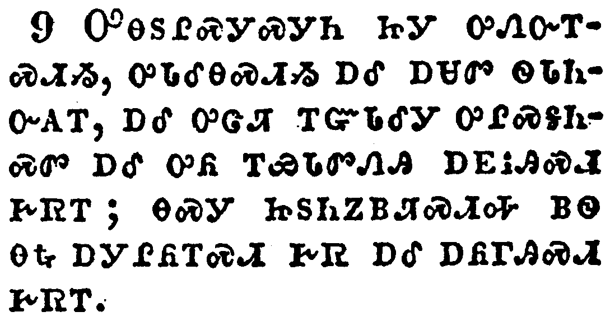</a></td>
</tr>
<tr class="even">
<td>But they that will be rich fall into temptation and a snare, and into many foolish and hurtful lusts, which drown men in destruction and perdition.</td>
</tr>
<tr class="odd">
<td>ᎤᎾᏚᎵᏍᎩᏍᎩᏂ ᏥᎩ ᎤᏁᏅᎢᏍᏗᏱ, ᎤᏓᎴᎾᏍᏗᏱ ᎠᎴ ᎠᏌᏛ ᏫᏓᏂᏅᎪᎢ, ᎠᎴ ᎤᏣᏘ ᎢᏳᏓᎴᎩ ᎤᎵᏍᎦᏂᏍᏛ ᎠᎴ ᎤᏲ ᎢᏯᏓᏛᏁᎯ ᎠᎬᎥᎯᏍᏗ ᎨᏒᎢ; ᎾᏍᎩ ᏥᏚᏂᏃᏴᏘᏍᏗᎭ ᏴᏫ ᎾᎿᎭᎠᎩᎵᏲᎢᏍᏗ ᎨᏒ ᎠᎴ ᎠᏲᎱᎯᏍᏗ ᎨᏒᎢ.</td>
</tr>
<tr class="even">
<td>U-na-du-li-s-gi-s-gi-ni tsi-gi u-ne-nv-i-s-di-yi, u-da-le-na-s-di-yi a-le a-sa-dv wi-da-ni-nv-go-i, a-le u-tsa-ti i-yu-da-le-gi u-li-s-ga-ni-s-dv a-le u-yo i-ya-da-dv-ne-hi a-gv-v-hi-s-di ge-sv-i; na-s-gi tsi-du-ni-no-yv-ti-s-di-ha yv-wi na-hna a-gi-li-yo-i-s-di ge-sv a-le a-yo-hu-hi-s-di ge-sv-i.</td>
</tr>
</tbody>
</table>

<table>
<tbody>
<tr class="odd">
<td></td>
</tr>
<tr class="even">
<td>For the love of money is the root of all evil: which while some coveted after, they have erred from the faith, and pierced themselves through with many sorrows.</td>
</tr>
<tr class="odd">
<td>ᎠᏕᎸᏰᏃ ᏗᎨᏳᏗ ᎨᏒ ᎾᎿᎭᏗᏓᎴᎲᏍᎦ ᏄᏓᎴᏒ ᎤᏲᎢ, ᎾᏍᎩ ᎩᎶ ᎤᏂᎬᎥᏍᎬᎢ ᎤᎾᏞᏒ ᎪᎯᏳᏗ ᎨᏒᎢ, ᎠᎴ ᎤᏅᏒ ᏚᎾᏓᏘᏍᏔᏅ ᎤᏣᏘ ᎤᏲ ᎠᏓᏅᏓᏗᏍᏗ ᎨᏒᎢ.</td>
</tr>
<tr class="even">
<td>A-de-lv-ye-no di-ge-yu-di ge-sv na-hna di-da-le-hv-s-ga nu-da-le-sv u-yo-i, na-s-gi gi-lo u-ni-gv-v-s-gv-i u-na-tle-sv go-hi-yu-di ge-sv-i, a-le u-nv-sv du-na-da-ti-s-ta-nv u-tsa-ti u-yo a-da-nv-da-di-s-di ge-sv-i.</td>
</tr>
</tbody>
</table>

<table>
<tbody>
<tr class="odd">
<td><a href="150611.png">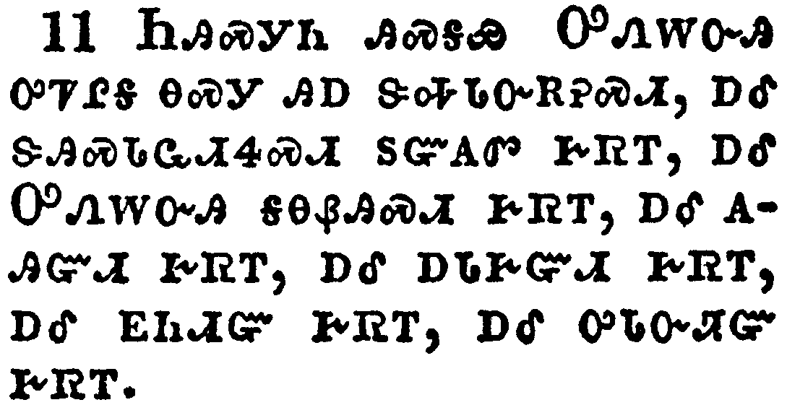</a></td>
</tr>
<tr class="even">
<td>But thou, O man of God, flee these things; and follow after righteousness, godliness, faith, love, patience, meekness.</td>
</tr>
<tr class="odd">
<td>ᏂᎯᏍᎩᏂ ᎯᏍᎦᏯ ᎤᏁᎳᏅᎯ ᎤᏤᎵᎦ ᎾᏍᎩ ᎯᎠ ᏕᎭᏓᏅᎡᎮᏍᏗ, ᎠᎴ ᏕᎯᏍᏓᏩᏗᏎᏍᏗ ᏚᏳᎪᏛ ᎨᏒᎢ, ᎠᎴ ᎤᏁᎳᏅᎯ ᎦᎾᏰᎯᏍᏗ ᎨᏒᎢ, ᎠᎴ ᎪᎯᏳᏗ ᎨᏒᎢ, ᎠᎴ ᎠᏓᎨᏳᏗ ᎨᏒᎢ, ᎠᎴ ᎬᏂᏗᏳ ᎨᏒᎢ, ᎠᎴ ᎤᏓᏅᏘᏳ ᎨᏒᎢ.</td>
</tr>
<tr class="even">
<td>Ni-hi-s-gi-ni hi-s-ga-ya U-ne-la-nv-hi u-tse-li-ga na-s-gi hi-a de-ha-da-nv-e-he-s-di, a-le de-hi-s-da-wa-di-se-s-di du-yu-go-dv ge-sv-i, a-le U-ne-la-nv-hi ga-na-ye-hi-s-di ge-sv-i, a-le go-hi-yu-di ge-sv-i, a-le a-da-ge-yu-di ge-sv-i, a-le gv-ni-di-yu ge-sv-i, a-le u-da-nv-ti-yu ge-sv-i.</td>
</tr>
</tbody>
</table>

<table>
<tbody>
<tr class="odd">
<td><a href="150612.png">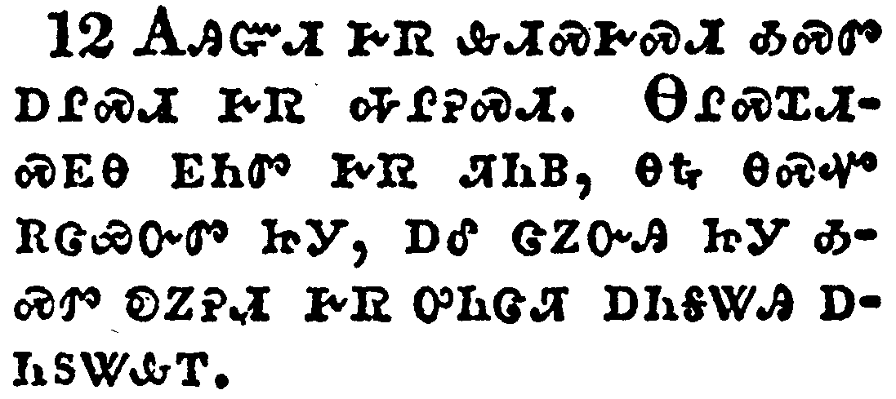</a></td>
</tr>
<tr class="even">
<td>Fight the good fight of faith, lay hold on eternal life, whereunto thou art also called, and hast professed a good profession before many witnesses.</td>
</tr>
<tr class="odd">
<td>ᎪᎯᏳᏗ ᎨᏒ ᎲᏗᏍᎨᏍᏗ ᎣᏍᏛ ᎠᎵᏍᏗ ᎨᏒ ᎭᎵᎮᏍᏗ. ᎾᎵᏍᏆᏗᏍᎬᎾ ᎬᏂᏛ ᎨᏒ ᏘᏂᏴ, ᎾᎿᎭᎾᏍᏉ ᎡᏣᏯᏅᏛ ᏥᎩ, ᎠᎴ ᏣᏃᏅᎯ ᏥᎩ ᎣᏍᏛ ᎧᏃᎮᏗ ᎨᏒ ᎤᏂᏣᏘ ᎠᏂᎦᏔᎯ ᎠᏂᏚᏔᎲᎢ.</td>
</tr>
<tr class="even">
<td>Go-hi-yu-di ge-sv hv-di-s-ge-s-di o-s-dv a-li-s-di ge-sv ha-li-he-s-di. Na-li-s-qua-di-s-gv-na gv-ni-dv ge-sv ti-ni-yv, na-hna na-s-quo e-tsa-ya-nv-dv tsi-gi, a-le tsa-no-nv-hi tsi-gi o-s-dv ka-no-he-di ge-sv u-ni-tsa-ti a-ni-ga-ta-hi a-ni-du-ta-hv-i.</td>
</tr>
</tbody>
</table>

<table>
<tbody>
<tr class="odd">
<td><a href="150613.png">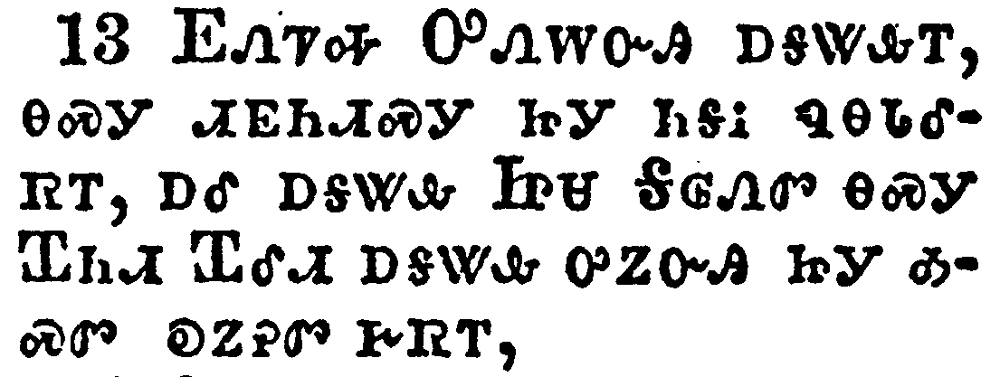</a></td>
</tr>
<tr class="even">
<td>I give thee charge in the sight of God, who quickeneth all things, and before Christ Jesus, who before Pontius Pilate witnessed a good confession;</td>
</tr>
<tr class="odd">
<td>ᎬᏁᏤᎭ ᎤᏁᎳᏅᎯ ᎠᎦᏔᎲᎢ, ᎾᏍᎩ ᏗᎬᏂᏗᏍᎩ ᏥᎩ ᏂᎦᎥ ᏄᎾᏓᎴᏒᎢ, ᎠᎴ ᎠᎦᏔᎲ ᏥᏌ ᎦᎶᏁᏛ ᎾᏍᎩ ᏆᏂᏗ ᏆᎴᏗ ᎠᎦᏔᎲ ᎤᏃᏅᎯ ᏥᎩ ᎣᏍᏛ ᎧᏃᎮᏛ ᎨᏒᎢ,</td>
</tr>
<tr class="even">
<td>Gv-ne-tse-ha U-ne-la-nv-hi a-ga-ta-hv-i, na-s-gi di-gv-ni-di-s-gi tsi-gi ni-ga-v nu-na-da-le-sv-i, a-le a-ga-ta-hv Tsi-sa Ga-lo-ne-dv na-s-gi Qua-ni-di Qua-le-di a-ga-ta-hv u-no-nv-hi tsi-gi o-s-dv ka-no-he-dv ge-sv-i,</td>
</tr>
</tbody>
</table>

<table>
<tbody>
<tr class="odd">
<td><a href="150614.png">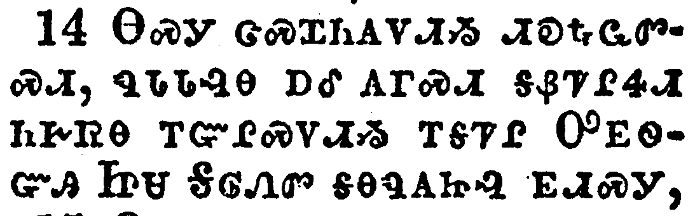</a></td>
</tr>
<tr class="even">
<td>That thou keep this commandment without spot, unrebukeable, until the appearing of our Lord Jesus Christ:</td>
</tr>
<tr class="odd">
<td>ᎾᏍᎩ ᏣᏍᏆᏂᎪᏙᏗᏱ ᏗᎧᎿᎭᏩᏛᏍᏗ, ᏄᏓᏓᎸᎾ ᎠᎴ ᎪᎱᏍᏗ ᎦᏰᏤᎵᏎᏗ ᏂᎨᏒᎾ ᎢᏳᎵᏍᏙᏗᏱ ᎢᎦᏤᎵ ᎤᎬᏫᏳᎯ ᏥᏌ ᎦᎶᏁᏛ ᎦᎾᏄᎪᏥᎸ ᎬᏗᏍᎩ,</td>
</tr>
<tr class="even">
<td>Na-s-gi tsa-s-qua-ni-go-do-di-yi di-ka-hna-wa-dv-s-di, nu-da-da-lv-na a-le go-hu-s-di ga-ye-tse-li-se-di ni-ge-sv-na i-yu-li-s-do-di-yi i-ga-tse-li U-gv-wi-yu-hi Tsi-sa Ga-lo-ne-dv ga-na-nu-go-tsi-lv gv-di-s-gi,</td>
</tr>
</tbody>
</table>

<table>
<tbody>
<tr class="odd">
<td><a href="150615.png">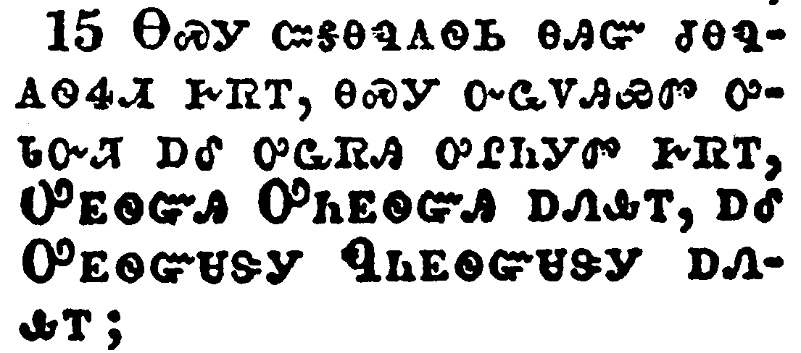</a></td>
</tr>
<tr class="even">
<td>Which in his times he shall shew, who is the blessed and only Potentate, the King of kings, and Lord of lords;</td>
</tr>
<tr class="odd">
<td>ᎾᏍᎩ ᏨᎦᎾᏄᎪᏫᏏ ᎾᎯᏳ ᏧᎾᏄᎪᏫᏎᏗ ᎨᏒᎢ, ᎾᏍᎩ ᏅᏩᏙᎯᏯᏛ ᎤᏓᏅᏘ ᎠᎴ ᎤᏩᏒᎯ ᎤᎵᏂᎩᏛ ᎨᏒᎢ, ᎤᎬᏫᏳᎯ ᎤᏂᎬᏫᏳᎯ ᎠᏁᎲᎢ, ᎠᎴ ᎤᎬᏫᏳᏌᏕᎩ ᏄᏂᎬᏫᏳᏌᏕᎩ ᎠᏁᎲᎢ;</td>
</tr>
<tr class="even">
<td>Na-s-gi tsv-ga-na-nu-go-wi-si na-hi-yu tsu-na-nu-go-wi-se-di ge-sv-i, na-s-gi nv-wa-do-hi-ya-dv u-da-nv-ti a-le u-wa-sv-hi u-li-ni-gi-dv ge-sv-i, U-gv-wi-yu-hi U-ni-gv-wi-yu-hi a-ne-hv-i, a-le U-gv-wi-yu-sa-de-gi Nu-ni-gv-wi-yu-sa-de-gi a-ne-hv-i;</td>
</tr>
</tbody>
</table>

<table>
<tbody>
<tr class="odd">
<td><a href="150616.png">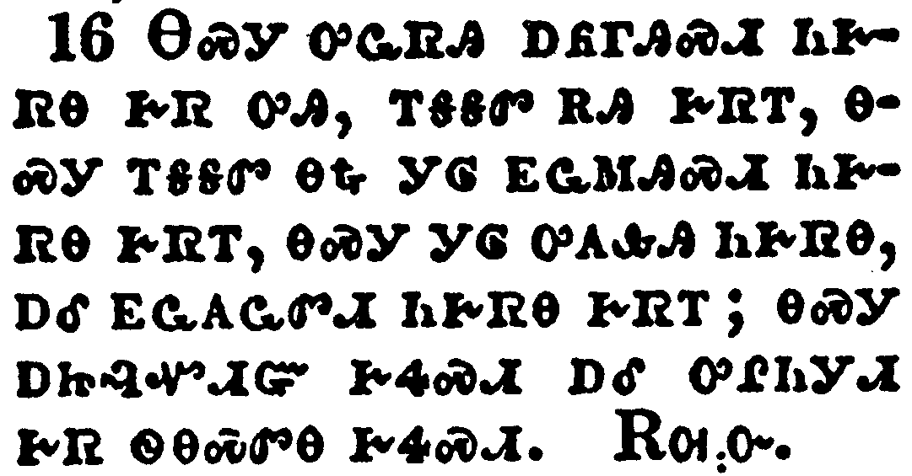</a></td>
</tr>
<tr class="even">
<td>Who only hath immortality, dwelling in the light which no man can approach unto; whom no man hath seen, nor can see: to whom be honour and power everlasting. Amen.</td>
</tr>
<tr class="odd">
<td>ᎾᏍᎩ ᎤᏩᏒᎯ ᎠᏲᎱᎯᏍᏗ ᏂᎨᏒᎾ ᎨᏒ ᎤᎯ, ᎢᎦᎦᏛ ᎡᎯ ᎨᏒᎢ, ᎾᏍᎩ ᎢᎦᎦᏛ ᎾᎿᎭᎩᎶ ᎬᏩᎷᎯᏍᏗ ᏂᎨᏒᎾ ᎨᏒᎢ, ᎾᏍᎩ ᎩᎶ ᎤᎪᎲᎩ ᏂᎨᏒᎾ, ᎠᎴ ᎬᏩᎪᏩᏛᏗ ᏂᎨᏒᎾ ᎨᏒᎢ; ᎾᏍᎩ ᎠᏥᎸᏉᏗᏳ ᎨᏎᏍᏗ ᎠᎴ ᎤᎵᏂᎩᏗ ᎨᏒ ᏫᎾᏍᏛᎾ ᎨᏎᏍᏗ. ᎡᎺᏅ.</td>
</tr>
<tr class="even">
<td>Na-s-gi u-wa-sv-hi a-yo-hu-hi-s-di ni-ge-sv-na ge-sv u-hi, i-ga-ga-dv e-hi ge-sv-i, na-s-gi i-ga-ga-dv na-hna gi-lo gv-wa-lu-hi-s-di ni-ge-sv-na ge-sv-i, na-s-gi gi-lo u-go-hv-gi ni-ge-sv-na, a-le gv-wa-go-wa-dv-di ni-ge-sv-na ge-sv-i; na-s-gi a-tsi-lv-quo-di-yu ge-se-s-di a-le u-li-ni-gi-di ge-sv wi-na-s-dv-na ge-se-s-di. E-me-nv.</td>
</tr>
</tbody>
</table>

<table>
<tbody>
<tr class="odd">
<td><a href="150617.png">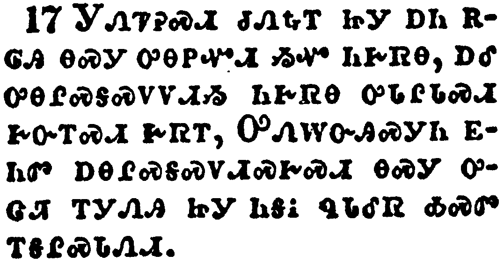</a></td>
</tr>
<tr class="even">
<td>Charge them that are rich in this world, that they be not highminded, nor trust in uncertain riches, but in the living God, who giveth us richly all things to enjoy;</td>
</tr>
<tr class="odd">
<td>ᎩᏁᏤᎮᏍᏗ ᏧᏁᎿᎭᎢ ᏥᎩ ᎠᏂ ᎡᎶᎯ ᎾᏍᎩ ᎤᎾᏢᏉᏗ ᏱᏉ ᏂᎨᏒᎾ, ᎠᎴ ᎤᎾᎵᏍᎦᏍᏙᏙᏗᏱ ᏂᎨᏒᎾ ᎤᏓᎵᏓᏍᏗ ᎨᏅᎢᏍᏗ ᎨᏒᎢ, ᎤᏁᎳᏅᎯᏍᎩᏂ ᎬᏂᏛ ᎠᎾᎵᏍᎦᏍᏙᏗᏍᎨᏍᏗ ᎾᏍᎩ ᎤᏣᏘ ᎢᎩᏁᎯ ᏥᎩ ᎾᎦᎥ ᏄᏓᎴᏒ ᎣᏍᏛ ᎢᎦᎵᏍᏓᏁᏗ.</td>
</tr>
<tr class="even">
<td>Gi-ne-tse-he-s-di tsu-ne-hna-i tsi-gi a-ni e-lo-hi na-s-gi u-na-tlv-quo-di yi-quo ni-ge-sv-na, a-le u-na-li-s-ga-s-do-do-di-yi ni-ge-sv-na u-da-li-da-s-di ge-nv-i-s-di ge-sv-i, U-ne-la-nv-hi-s-gi-ni gv-ni-dv a-na-li-s-ga-s-do-di-s-ge-s-di na-s-gi u-tsa-ti i-gi-ne-hi tsi-gi na-ga-v nu-da-le-sv o-s-dv i-ga-li-s-da-ne-di.</td>
</tr>
</tbody>
</table>

<table>
<tbody>
<tr class="odd">
<td><a href="150618.png">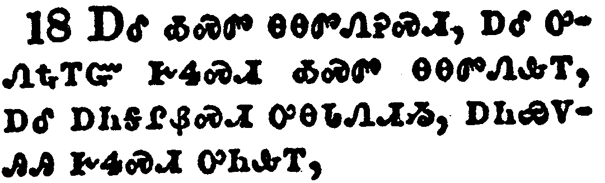</a></td>
</tr>
<tr class="even">
<td>That they do good, that they be rich in good works, ready to distribute, willing to communicate;</td>
</tr>
<tr class="odd">
<td>ᎠᎴ ᎣᏍᏛ ᎾᎾᏛᏁᎮᏍᏗ, ᎠᎴ ᎤᏁᎿᎭᎢᏳ ᎨᏎᏍᏗ ᎣᏍᏛ ᎾᎾᏛᏁᎲᎢ, ᎠᎴ ᎠᏂᎦᎵᏰᏍᏗ ᎤᎾᏓᏁᏗᏱ, ᎠᏂᏯᏙᎯᎯ ᎨᏎᏍᏗ ᎤᏂᎲᎢ,</td>
</tr>
<tr class="even">
<td>A-le o-s-dv na-na-dv-ne-he-s-di, a-le u-ne-hna-i-yu ge-se-s-di o-s-dv na-na-dv-ne-hv-i, a-le a-ni-ga-li-ye-s-di u-na-da-ne-di-yi, a-ni-ya-do-hi-hi ge-se-s-di u-ni-hv-i,</td>
</tr>
</tbody>
</table>

<table>
<tbody>
<tr class="odd">
<td></td>
</tr>
<tr class="even">
<td>Laying up in store for themselves a good foundation against the time to come, that they may lay hold on eternal life.</td>
</tr>
<tr class="odd">
<td>ᎠᎾᏓᏁᎸᏍᎨᏍᏗ ᎤᏅᏒ ᎤᎾᏤᎵᎦ ᎣᏍᏛ ᎦᎫᏍᏛᏗ ᎠᏏ ᎾᏍᏆᎵᏍᎬᎾ ᎾᎯᏳ ᎤᏍᏆᎸᏗ ᏥᎩ, ᎾᏍᎩ ᎾᎵᏍᏆᏗᏍᎬᎾ ᎬᏂᏛ ᏗᎬᏩᏂᏂᏴᏗ ᎢᏳᎵᏍᏙᏗᏱ.</td>
</tr>
<tr class="even">
<td>A-na-da-ne-lv-s-ge-s-di u-nv-sv u-na-tse-li-ga o-s-dv ga-gu-s-dv-di a-si na-s-qua-li-s-gv-na na-hi-yu u-s-qua-lv-di tsi-gi, na-s-gi na-li-s-qua-di-s-gv-na gv-ni-dv di-gv-wa-ni-ni-yv-di i-yu-li-s-do-di-yi.</td>
</tr>
</tbody>
</table>

<table>
<tbody>
<tr class="odd">
<td><a href="150620.png">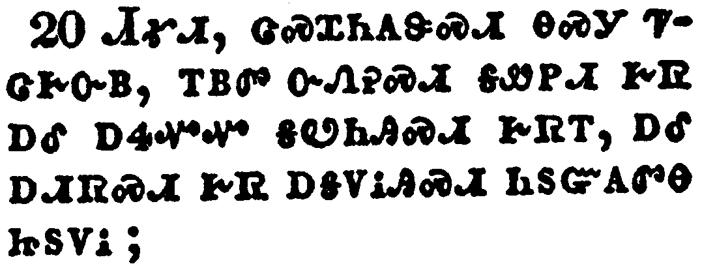</a></td>
</tr>
<tr class="even">
<td>O Timothy, keep that which is committed to thy trust, avoiding profane and vain babblings, and oppositions of science falsely so called:</td>
</tr>
<tr class="odd">
<td>ᏗᎹᏗ, ᏣᏍᏆᏂᎪᏕᏍᏗ ᎾᏍᎩ ᏤᏣᎨᏅᏴ, ᎢᏴᏛ ᏅᏁᎮᏍᏗ ᎦᏪᏢᏗ ᎨᏒ ᎠᎴ ᎠᏎᏉᏉ ᎦᏬᏂᎯᏍᏗ ᎨᏒᎢ, ᎠᎴ ᎠᏗᏒᏍᏗ ᎨᏒ ᎠᎦᏙᎥᎯᏍᏗ ᏂᏚᏳᎪᏛᎾ ᏥᏚᏙᎥ;</td>
</tr>
<tr class="even">
<td>Di-ma-di, tsa-s-qua-ni-go-de-s-di na-s-gi tse-tsa-ge-nv-yv, i-yv-dv nv-ne-he-s-di ga-we-tlv-di ge-sv a-le a-se-quo-quo ga-wo-ni-hi-s-di ge-sv-i, a-le a-di-sv-s-di ge-sv a-ga-do-v-hi-s-di ni-du-yu-go-dv-na tsi-du-do-v;</td>
</tr>
</tbody>
</table>

<table>
<tbody>
<tr class="odd">
<td><a href="150621.png">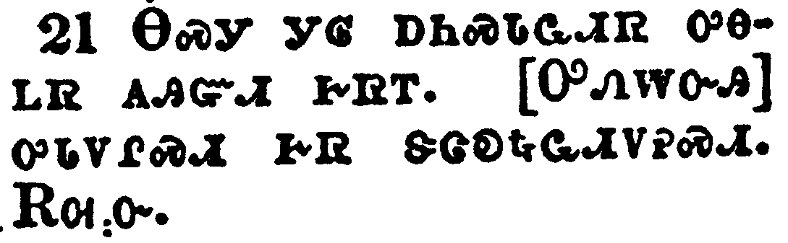</a></td>
</tr>
<tr class="even">
<td>Which some professing have erred concerning the faith. Grace be with thee. Amen.</td>
</tr>
<tr class="odd">
<td>ᎾᏍᎩ ᎩᎶ ᎠᏂᏍᏓᏩᏗᏒ ᎤᎾᏞᏒ ᎪᎯᏳᏗ ᎨᏒᎢ. [ᎤᏁᎳᏅᎯ] ᎤᏓᏙᎵᏍᏗ ᎨᏒ ᏕᏣᎧᏩᏗᏙᎮᏍᏗ. ᎡᎺᏅ.</td>
</tr>
<tr class="even">
<td>Na-s-gi gi-lo a-ni-s-da-wa-di-sv u-na-tle-sv go-hi-yu-di ge-sv-i. [U-ne-la-nv-hi] u-da-do-li-s-di ge-sv de-tsa-ka-wa-di-do-he-s-di. E-me-nv.</td>
</tr>
</tbody>
</table>

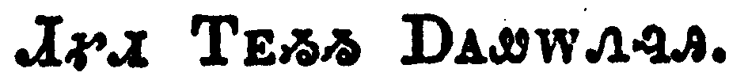
