+++
draft=false
date = 2014-12-18T21:11:07Z
title = "2 Corinthians - Chapter 2 - Cherokee New Testament"
weight = 1418955067

[taxonomies]

authors = ["Timothy Legg"]
categories = []
tags = []

[extra]
+++

<table>
<tbody>
<tr class="odd">
<td><a href="080201.png">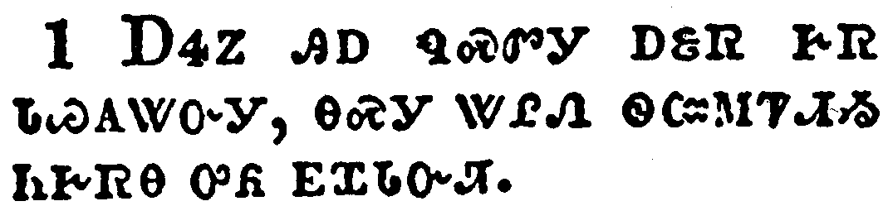</a></td>
</tr>
<tr class="even">
<td>But I determined this with myself, that I would not come again to you in heaviness.</td>
</tr>
<tr class="odd">
<td>ᎠᏎᏃ ᎯᎠ ᏄᏍᏛᎩ ᎠᏋᏒ ᎨᏒ ᏓᏊᎪᏔᏅᎩ, ᎾᏍᎩ ᏔᎵᏁ ᏫᏨᎷᏤᏗᏱ ᏂᎨᏒᎾ ᎤᏲ ᎬᏆᏓᏅᏘ.</td>
</tr>
<tr class="even">
<td>A-se-no hi-a nu-s-dv-gi a-quv-sv ge-sv da-quu-go-ta-nv-gi, na-s-gi ta-li-ne wi-tsv-lu-tse-di-yi ni-ge-sv-na u-yo gv-qua-da-nv-ti.</td>
</tr>
</tbody>
</table>

<table>
<tbody>
<tr class="odd">
<td><a href="080202.png">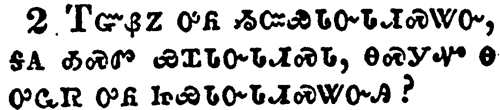</a></td>
</tr>
<tr class="even">
<td>For if I make you sorry, who is he then that maketh me glad, but the same which is made sorry by me?</td>
</tr>
<tr class="odd">
<td>ᎢᏳᏰᏃ ᎤᏲ ᏱᏨᏯᏓᏅᏓᏗᏍᏔᏅ, ᎦᎪ ᎣᏍᏛ ᏯᏆᏓᏅᏓᏗᏍᏓ, ᎾᏍᎩᏉ Ꮎ ᎤᏩᏒ ᎤᏲ ᏥᏯᏓᏅᏓᏗᏍᏔᏅᎯ?</td>
</tr>
<tr class="even">
<td>I-yu-ye-no u-yo yi-tsv-ya-da-nv-da-di-s-ta-nv, ga-go o-s-dv ya-qua-da-nv-da-di-s-da, na-s-gi-quo na u-wa-sv u-yo tsi-ya-da-nv-da-di-s-ta-nv-hi?</td>
</tr>
</tbody>
</table>

<table>
<tbody>
<tr class="odd">
<td><a href="080203.png">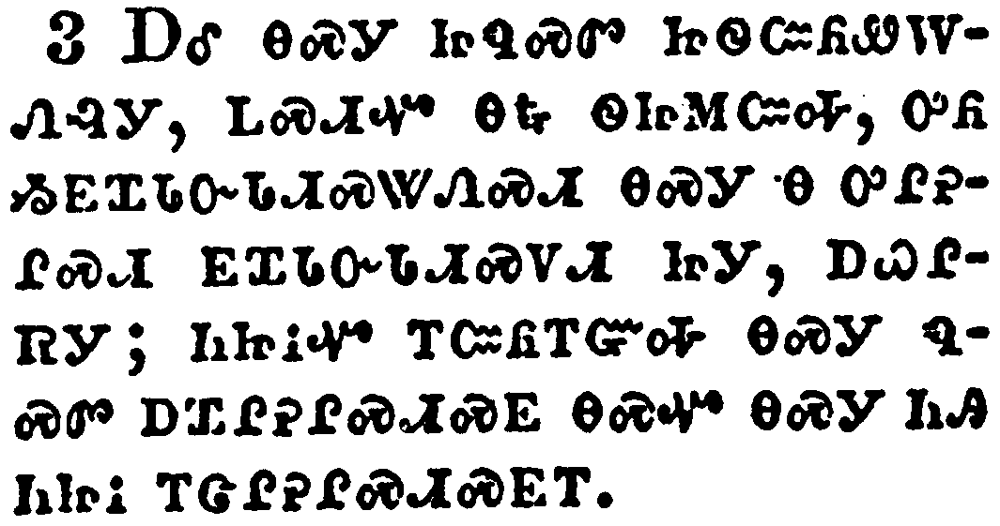</a></td>
</tr>
<tr class="even">
<td>And I wrote this same unto you, lest, when I came, I should have sorrow from them of whom I ought to rejoice; having confidence in you all, that my joy is the joy of you all.</td>
</tr>
<tr class="odd">
<td>ᎠᎴ ᎾᏍᎩ ᏥᏄᏍᏛ ᏥᏫᏨᏲᏪᎳᏁᎸᎩ, ᏞᏍᏗᏉ ᎾᎿᎭᏫᏥᎷᏨᎭ, ᎤᏲ ᏱᎬᏆᏓᏅᏓᏗᏍᏔᏁᏍᏗ ᎾᏍᎩ Ꮎ ᎤᎵᎮᎵᏍᏗ ᎬᏆᏓᏅᏓᏗᏍᏙᏗ ᏥᎩ, ᎠᏇᎵᏒᎩ; ᏂᏥᎥᏉ ᎢᏨᏲᎢᏳᎭ ᎾᏍᎩ ᏄᏍᏛ ᎠᏆᎵᎮᎵᏍᏗᏍᎬ ᎾᏍᏉ ᎾᏍᎩ ᏂᎯ ᏂᏥᎥ ᎢᏣᎵᎮᎵᏍᏗᏍᎬᎢ.</td>
</tr>
<tr class="even">
<td>A-le na-s-gi tsi-nu-s-dv tsi-wi-tsv-yo-we-la-ne-lv-gi, tle-s-di-quo na-hna wi-tsi-lu-tsv-ha, u-yo yi-gv-qua-da-nv-da-di-s-ta-ne-s-di na-s-gi na u-li-he-li-s-di gv-qua-da-nv-da-di-s-do-di tsi-gi, a-que-li-sv-gi; ni-tsi-v-quo i-tsv-yo-i-yu-ha na-s-gi nu-s-dv a-qua-li-he-li-s-di-s-gv na-s-quo na-s-gi ni-hi ni-tsi-v i-tsa-li-he-li-s-di-s-gv-i.</td>
</tr>
</tbody>
</table>

<table>
<tbody>
<tr class="odd">
<td><a href="080204.png">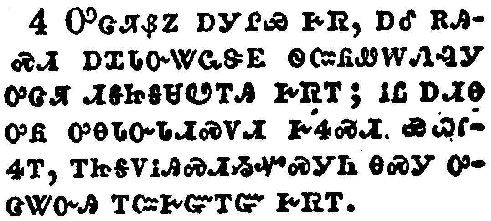</a></td>
</tr>
<tr class="even">
<td>For out of much affliction and anguish of heart I wrote unto you with many tears; not that ye should be grieved, but that ye might know the love which I have more abundantly unto you.</td>
</tr>
<tr class="odd">
<td>ᎤᏣᏘᏰᏃ ᎠᎩᎵᏯ ᎨᏒ, ᎠᎴ ᎡᎯᏍᏗ ᎠᏆᏓᏅᏔᏩᏕᎬ ᏫᏨᏲᏪᎳᏁᎸᎩ ᎤᏣᏘ ᏗᎦᏥᎦᏌᏬᎢᎯ ᎨᏒᎢ; ᎥᏝ ᎠᏗᎾ ᎤᏲ ᎤᎾᏓᏅᏓᏗᏍᏙᏗ ᎨᏎᏍᏗ ᏯᏇᎵᏎᎢ, ᎢᏥᎦᏙᎥᎯᏍᏗᏱᏉᏍᎩᏂ ᎾᏍᎩ ᎤᏣᏔᏅᎯ ᎢᏨᎨᏳᎢᏳ ᎨᏒᎢ.</td>
</tr>
<tr class="even">
<td>U-tsa-ti-ye-no a-gi-li-ya ge-sv, a-le e-hi-s-di a-qua-da-nv-ta-wa-de-gv wi-tsv-yo-we-la-ne-lv-gi u-tsa-ti di-ga-tsi-ga-sa-wo-i-hi ge-sv-i; v-tla a-di-na u-yo u-na-da-nv-da-di-s-do-di ge-se-s-di ya-que-li-se-i, i-tsi-ga-do-v-hi-s-di-yi-quo-s-gi-ni na-s-gi u-tsa-ta-nv-hi i-tsv-ge-yu-i-yu ge-sv-i.</td>
</tr>
</tbody>
</table>

<table>
<tbody>
<tr class="odd">
<td><a href="080205.png">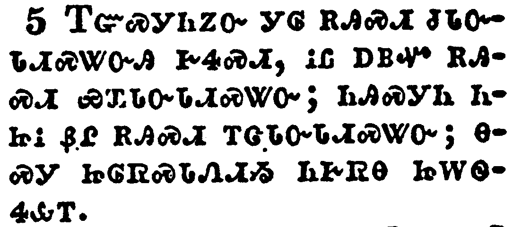</a></td>
</tr>
<tr class="even">
<td>But if any have caused grief, he hath not grieved me, but in part: that I may not overcharge you all.</td>
</tr>
<tr class="odd">
<td>ᎢᏳᏍᎩᏂᏃᏅ ᎩᎶ ᎡᎯᏍᏗ ᏧᏓᏅᏓᏗᏍᏔᏅᎯ ᎨᏎᏍᏗ, ᎥᏝ ᎠᏴᏉ ᎡᎯᏍᏗ ᏯᏆᏓᏅᏓᏗᏍᏔᏅ; ᏂᎯᏍᎩᏂ ᏂᏥᎥ ᏰᎵ ᎡᎯᏍᏗ ᎢᏣᏓᏅᏓᏗᏍᏔᏅ; ᎾᏍᎩ ᏥᎶᏒᏍᏓᏁᏗᏱ ᏂᎨᏒᎾ ᏥᎳᏫᏎᎲᎢ.</td>
</tr>
<tr class="even">
<td>I-yu-s-gi-ni-no-nv gi-lo e-hi-s-di tsu-da-nv-da-di-s-ta-nv-hi ge-se-s-di, v-tla a-yv-quo e-hi-s-di ya-qua-da-nv-da-di-s-ta-nv; ni-hi-s-gi-ni ni-tsi-v ye-li e-hi-s-di i-tsa-da-nv-da-di-s-ta-nv; na-s-gi tsi-lo-sv-s-da-ne-di-yi ni-ge-sv-na tsi-la-wi-se-hv-i.</td>
</tr>
</tbody>
</table>

<table>
<tbody>
<tr class="odd">
<td><a href="080206.png">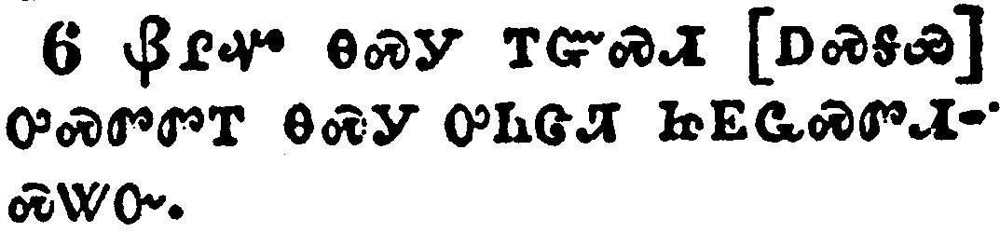</a></td>
</tr>
<tr class="even">
<td>Sufficient to such a man is this punishment, which was inflicted of many.</td>
</tr>
<tr class="odd">
<td>ᎠᎵᏉ ᎾᏍᎩ ᎢᏳᏍᏗ [ᎠᏍᎦᏯ] ᏅᏍᏛᏛᎢ ᎾᏍᎩ ᎤᏂᏣᏘ ᏥᎬᏩᏍᏛᏗᏍᏔᏅ.</td>
</tr>
<tr class="even">
<td>A-li-quo na-s-gi i-yu-s-di [a-s-ga-ya] nv-s-dv-dv-i na-s-gi u-ni-tsa-ti tsi-gv-wa-s-dv-di-s-ta-nv.</td>
</tr>
</tbody>
</table>

<table>
<tbody>
<tr class="odd">
<td><a href="080207.png">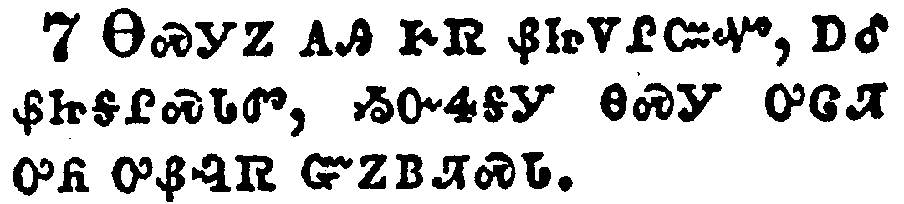</a></td>
</tr>
<tr class="even">
<td>So that contrariwise ye ought rather to forgive him, and comfort him, lest perhaps such a one should be swallowed up with overmuch sorrow.</td>
</tr>
<tr class="odd">
<td>ᎾᏍᎩᏃ ᎪᎯ ᎨᏒ ᏰᏥᏙᎵᏨᏉ, ᎠᎴ ᏰᏥᎦᎵᏍᏓᏛ, ᏱᏅᏎᎦᎩ ᎾᏍᎩ ᎤᏣᏘ ᎤᏲ ᎤᏰᎸᏒ ᏳᏃᏴᏘᏍᏓ.</td>
</tr>
<tr class="even">
<td>Na-s-gi-no go-hi ge-sv ye-tsi-do-li-tsv-quo, a-le ye-tsi-ga-li-s-da-dv, yi-nv-se-ga-gi na-s-gi u-tsa-ti u-yo u-ye-lv-sv yu-no-yv-ti-s-da.</td>
</tr>
</tbody>
</table>

<table>
<tbody>
<tr class="odd">
<td></td>
</tr>
<tr class="even">
<td>Wherefore I beseech you that ye would confirm your love toward him.</td>
</tr>
<tr class="odd">
<td>ᎾᏍᎩ ᎢᏳᏍᏗ ᎢᏨᏔᏲᏎᎭ ᎡᏥᏍᏓᏱᏕᏗᏱ ᎡᏥᎨᏳᎢᏳ ᎨᏒᎢ.</td>
</tr>
<tr class="even">
<td>Na-s-gi i-yu-s-di i-tsv-ta-yo-se-ha e-tsi-s-da-yi-de-di-yi e-tsi-ge-yu-i-yu ge-sv-i.</td>
</tr>
</tbody>
</table>

<table>
<tbody>
<tr class="odd">
<td><a href="080209.png">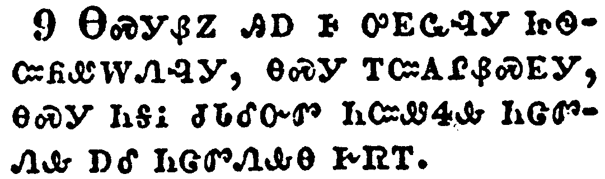</a></td>
</tr>
<tr class="even">
<td>For to this end also did I write, that I might know the proof of you, whether ye be obedient in all things.</td>
</tr>
<tr class="odd">
<td>ᎾᏍᎩᏰᏃ ᎯᎠ Ꮀ ᎤᎬᏩᎸᎩ ᏥᏫᏨᏲᏪᎳᏁᎸᎩ, ᎾᏍᎩ ᎢᏨᎪᎵᏰᏍᎬᎩ, ᎾᏍᎩ ᏂᎦᎥ ᏧᏓᎴᏅᏛ ᏂᏨᏪᏎᎲ ᏂᏣᏛᏁᎲ ᎠᎴ ᏂᏣᏛᏁᎲᎾ ᎨᏒᎢ.</td>
</tr>
<tr class="even">
<td>Na-s-gi-ye-no hi-a ho u-gv-wa-lv-gi tsi-wi-tsv-yo-we-la-ne-lv-gi, na-s-gi i-tsv-go-li-ye-s-gv-gi, na-s-gi ni-ga-v tsu-da-le-nv-dv ni-tsv-we-se-hv ni-tsa-dv-ne-hv a-le ni-tsa-dv-ne-hv-na ge-sv-i.</td>
</tr>
</tbody>
</table>

<table>
<tbody>
<tr class="odd">
<td><a href="080210.png">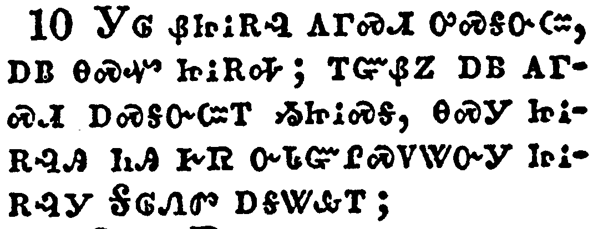</a></td>
</tr>
<tr class="even">
<td>To whom ye forgive any thing, I forgive also: for if I forgave any thing, to whom I forgave it, for your sakes forgave I it in the person of Christ;</td>
</tr>
<tr class="odd">
<td>ᎩᎶ ᏰᏥᎥᎡᎸ ᎪᎱᏍᏗ ᎤᏍᎦᏅᏨ, ᎠᏴ ᎾᏍᏉ ᏥᎥᎡᎭ; ᎢᏳᏰᏃ ᎠᏴ ᎪᎱᏍᏗ ᎠᏍᎦᏅᏨᎢ ᏱᏥᎥᏍᎦ, ᎾᏍᎩ ᏥᎥᎡᎸᎯ ᏂᎯ ᎨᏒ ᏅᏓᏳᎵᏍᏙᏔᏅᎩ ᏥᎥᎡᎸᎩ ᎦᎶᏁᏛ ᎠᎦᏔᎲᎢ;</td>
</tr>
<tr class="even">
<td>Gi-lo ye-tsi-v-e-lv go-hu-s-di u-s-ga-nv-tsv, a-yv na-s-quo tsi-v-e-ha; i-yu-ye-no a-yv go-hu-s-di a-s-ga-nv-tsv-i yi-tsi-v-s-ga, na-s-gi tsi-v-e-lv-hi ni-hi ge-sv nv-da-yu-li-s-do-ta-nv-gi tsi-v-e-lv-gi Ga-lo-ne-dv a-ga-ta-hv-i;</td>
</tr>
</tbody>
</table>

<table>
<tbody>
<tr class="odd">
<td><a href="080211.png">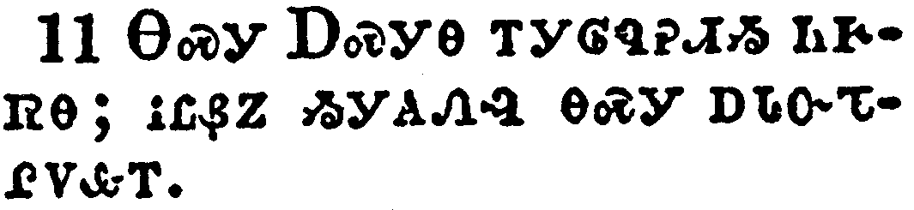</a></td>
</tr>
<tr class="even">
<td>Lest Satan should get an advantage of us: for we are not ignorant of his devices.</td>
</tr>
<tr class="odd">
<td>ᎾᏍᎩ ᎠᏍᎩᎾ ᎢᎩᎶᏄᎮᏗᏱ ᏂᎨᏒᎾ; ᎥᏝᏰᏃ ᏱᎩᎪᏁᎸ ᎾᏍᎩ ᎠᏓᏅᏖᎵᏙᎲᎢ.</td>
</tr>
<tr class="even">
<td>Na-s-gi A-s-gi-na i-gi-lo-nu-he-di-yi ni-ge-sv-na; v-tla-ye-no yi-gi-go-ne-lv na-s-gi a-da-nv-te-li-do-hv-i.</td>
</tr>
</tbody>
</table>

<table>
<tbody>
<tr class="odd">
<td><a href="080212.png">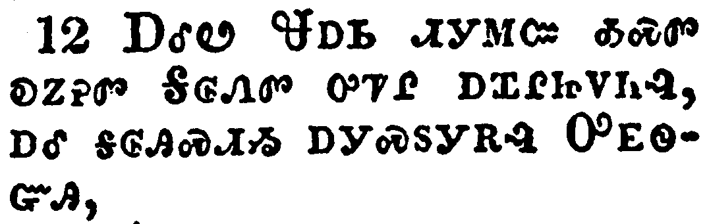</a></td>
</tr>
<tr class="even">
<td>Furthermore, when I came to Troas to preach Christ's gospel, and a door was opened unto me of the Lord,</td>
</tr>
<tr class="odd">
<td>ᎠᎴᏬ ᏠᎠᏏ ᏗᎩᎷᏨ ᎣᏍᏛ ᎧᏃᎮᏛ ᎦᎶᏁᏛ ᎤᏤᎵ ᎠᏆᎵᏥᏙᏂᎸ, ᎠᎴ ᎦᎶᎯᏍᏗᏱ ᎠᎩᏍᏚᎩᎡᎸ ᎤᎬᏫᏳᎯ,</td>
</tr>
<tr class="even">
<td>A-le-wo Tlo-a-si di-gi-lu-tsv o-s-dv ka-no-he-dv Ga-lo-ne-dv u-tse-li a-qua-li-tsi-do-ni-lv, a-le ga-lo-hi-s-di-yi a-gi-s-du-gi-e-lv U-gv-wi-yu-hi,</td>
</tr>
</tbody>
</table>

<table>
<tbody>
<tr class="odd">
<td><a href="080213.png">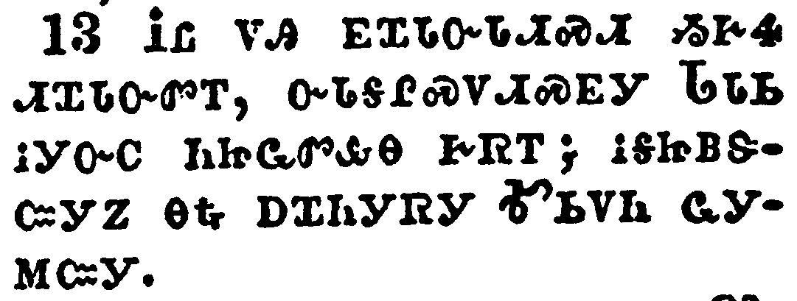</a></td>
</tr>
<tr class="even">
<td>I had no rest in my spirit, because I found not Titus my brother: but taking my leave of them, I went from thence into Macedonia.</td>
</tr>
<tr class="odd">
<td>ᎥᏝ ᏙᎯ ᎬᏆᏓᏅᏓᏗᏍᏗ ᏱᎨᏎ ᏗᏆᏓᏅᏛᎢ, ᏅᏓᎦᎵᏍᏙᏗᏍᎬᎩ ᏓᏓᏏ ᎥᎩᏅᏟ ᏂᏥᏩᏛᎲᎾ ᎨᏒᎢ; ᎥᎦᏥᏴᏕᏨᎩᏃ ᎾᎿᎭᎠᏆᏂᎩᏒᎩ ᎹᏏᏙᏂ ᏩᎩᎷᏨᎩ.</td>
</tr>
<tr class="even">
<td>V-tla do-hi gv-qua-da-nv-da-di-s-di yi-ge-se di-qua-da-nv-dv-i, nv-da-ga-li-s-do-di-s-gv-gi Da-da-si v-gi-nv-tli ni-tsi-wa-dv-hv-na ge-sv-i; v-ga-tsi-yv-de-tsv-gi-no na-hna A-qua-ni-gi-sv-gi Ma-si-do-ni wa-gi-lu-tsv-gi.</td>
</tr>
</tbody>
</table>

<table>
<tbody>
<tr class="odd">
<td><a href="080214.png">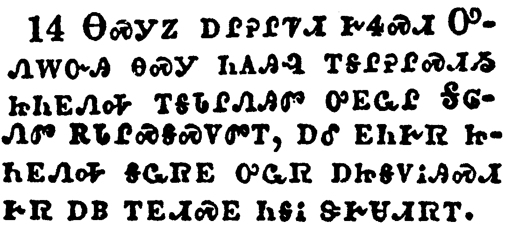</a></td>
</tr>
<tr class="even">
<td>Now thanks be unto God, which always causeth us to triumph in Christ, and maketh manifest the savour of his knowledge by us in every place.</td>
</tr>
<tr class="odd">
<td>ᎾᏍᎩᏃ ᎠᎵᎮᎵᏤᏗ ᎨᏎᏍᏗ ᎤᏁᎳᏅᎯ ᎾᏍᎩ ᏂᎪᎯᎸ ᎢᎦᎵᎮᎵᏍᏗᏱ ᏥᏂᎬᏁᎭ ᎢᎦᏓᎵᏁᎯᏛ ᎤᎬᏩᎵ ᎦᎶᏁᏛ ᎡᏓᎵᏍᎦᏍᏙᏛᎢ, ᎠᎴ ᎬᏂᎨᏒ ᏥᏂᎬᏁᎭ ᎦᏩᏒᎬ ᎤᏩᏒ ᎠᏥᎦᏙᎥᎯᏍᏗ ᎨᏒ ᎠᏴ ᎢᎬᏗᏍᎬ ᏂᎦᎥ ᏕᎨᏌᏗᏒᎢ.</td>
</tr>
<tr class="even">
<td>Na-s-gi-no a-li-he-li-tse-di ge-se-s-di U-ne-la-nv-hi na-s-gi ni-go-hi-lv i-ga-li-he-li-s-di-yi tsi-ni-gv-ne-ha i-ga-da-li-ne-hi-dv u-gv-wa-li Ga-lo-ne-dv e-da-li-s-ga-s-do-dv-i, a-le gv-ni-ge-sv tsi-ni-gv-ne-ha ga-wa-sv-gv u-wa-sv a-tsi-ga-do-v-hi-s-di ge-sv a-yv i-gv-di-s-gv ni-ga-v de-ge-sa-di-sv-i.</td>
</tr>
</tbody>
</table>

<table>
<tbody>
<tr class="odd">
<td><a href="080215.png">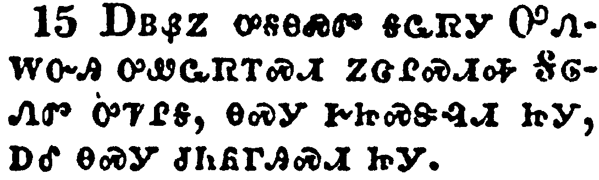</a></td>
</tr>
<tr class="even">
<td>For we are unto God a sweet savour of Christ, in them that are saved, and in them that perish:</td>
</tr>
<tr class="odd">
<td>ᎠᏴᏰᏃ ᎤᎦᎾᏍᏛ ᎦᏩᏒᎩ ᎤᏁᎳᏅᎯ ᎤᏪᏩᏒᎢᏍᏗ ᏃᏣᎵᏍᏗᎭ ᎦᎶᏁᏛ ᎤᏤᎵᎦ, ᎾᏍᎩ ᎨᏥᏍᏕᎸᏗ ᏥᎩ, ᎠᎴ ᎾᏍᎩ ᏧᏂᏲᎱᎯᏍᏗ ᏥᎩ.</td>
</tr>
<tr class="even">
<td>A-yv-ye-no u-ga-na-s-dv ga-wa-sv-gi U-ne-la-nv-hi u-we-wa-sv-i-s-di no-tsa-li-s-di-ha Ga-lo-ne-dv u-tse-li-ga, na-s-gi ge-tsi-s-de-lv-di tsi-gi, a-le na-s-gi tsu-ni-yo-hu-hi-s-di tsi-gi.</td>
</tr>
</tbody>
</table>

<table>
<tbody>
<tr class="odd">
<td><a href="080216.png">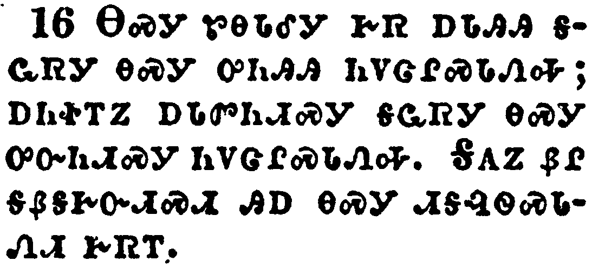</a></td>
</tr>
<tr class="even">
<td>To the one we are the savour of death unto death; and to the other the savour of life unto life. And who is sufficient for these things?</td>
</tr>
<tr class="odd">
<td>ᎾᏍᎩ ᏑᎾᏓᎴᎩ ᎨᏒ ᎠᏓᎯᎯ ᎦᏩᏒᎩ ᎾᏍᎩ ᎤᏂᎯᎯ ᏂᏙᏣᎵᏍᏓᏁᎭ; ᎠᏂᏐᎢᏃ ᎠᏓᏛᏂᏗᏍᎩ ᎦᏩᏒᎩ ᎾᏍᎩ ᎤᏅᏂᏗᏍᎩ ᏂᏙᏣᎵᏍᏓᏁᎭ. ᎦᎪᏃ ᏰᎵ ᎦᏰᎦᎨᏅᏗᏍᏗ ᎯᎠ ᎾᏍᎩ ᏗᎦᎸᏫᏍᏓᏁᏗ ᎨᏒᎢ.</td>
</tr>
<tr class="even">
<td>Na-s-gi su-na-da-le-gi ge-sv a-da-hi-hi ga-wa-sv-gi na-s-gi u-ni-hi-hi ni-do-tsa-li-s-da-ne-ha; a-ni-so-i-no a-da-dv-ni-di-s-gi ga-wa-sv-gi na-s-gi u-nv-ni-di-s-gi ni-do-tsa-li-s-da-ne-ha. Ga-go-no ye-li ga-ye-ga-ge-nv-di-s-di hi-a na-s-gi di-ga-lv-wi-s-da-ne-di ge-sv-i.</td>
</tr>
</tbody>
</table>

<table>
<tbody>
<tr class="odd">
<td><a href="080217.png">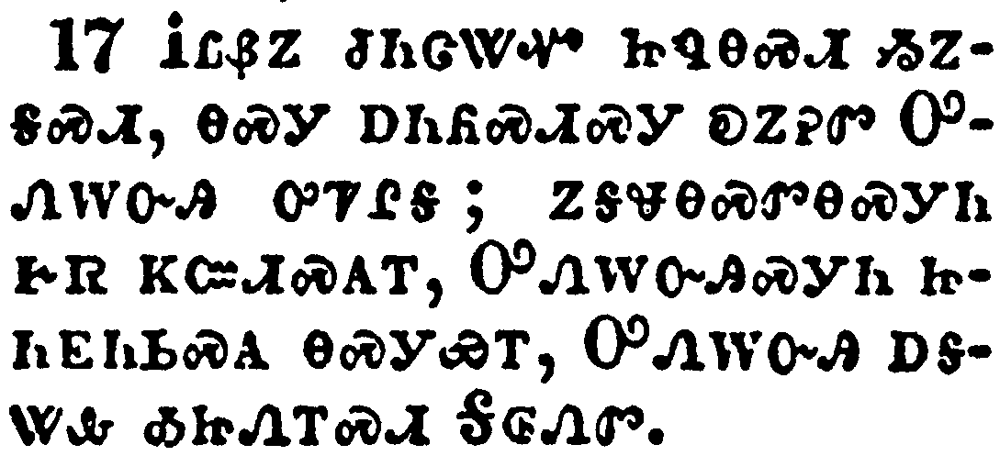</a></td>
</tr>
<tr class="even">
<td>For we are not as many, which corrupt the word of God: but as of sincerity, but as of God, in the sight of God speak we in Christ.</td>
</tr>
<tr class="odd">
<td>ᎥᏣᏰᏃ ᏧᏂᏣᏔᏉ ᏥᏄᎾᏍᏗ ᏱᏃᎦᏍᏗ, ᎾᏍᎩ ᎠᏂᏲᏍᏗᏍᎩ ᎧᏃᎮᏛ ᎤᏁᎳᏅᎯ ᎤᏤᎵᎦ; ᏃᎦᏠᎾᏍᏛᎾᏍᎩᏂ ᎨᏒ ᏦᏨᏗᏍᎪᎢ, ᎤᏁᎳᏅᎯᏍᎩᏂ ᏥᏂᎬᏂᏏᏍᎪ ᎾᏍᎩᏯᎢ, ᎤᏁᎳᏅᎯ ᎠᎦᏔᎲ ᎣᏥᏁᎢᏍᏗ ᎦᎶᏁᏛ.</td>
</tr>
<tr class="even">
<td>V-tsa-ye-no tsu-ni-tsa-ta-quo tsi-nu-na-s-di yi-no-ga-s-di, na-s-gi a-ni-yo-s-di-s-gi ka-no-he-dv U-ne-la-nv-hi u-tse-li-ga; no-ga-tlo-na-s-dv-na-s-gi-ni ge-sv tso-tsv-di-s-go-i, U-ne-la-nv-hi-s-gi-ni tsi-ni-gv-ni-si-s-go na-s-gi-ya-i, U-ne-la-nv-hi a-ga-ta-hv o-tsi-ne-i-s-di Ga-lo-ne-dv.</td>
</tr>
</tbody>
</table>

