+++
draft=false
date = 2014-12-18T21:11:07Z
title = "2 Corinthians - Chapter 3 - Cherokee New Testament"
weight = 1418955067

[taxonomies]

authors = ["Timothy Legg"]
categories = []
tags = []

[extra]
+++

<table>
<tbody>
<tr class="odd">
<td><a href="080301.png">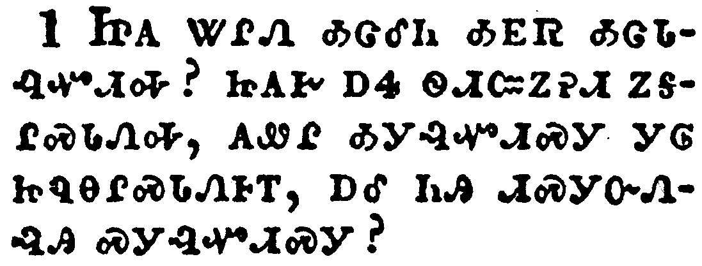</a></td>
</tr>
<tr class="even">
<td>Do we begin again to commend ourselves? or need we, as some others, epistles of commendation to you, or letters of commendation from you?</td>
</tr>
<tr class="odd">
<td>ᏥᎪ ᏔᎵᏁ ᎣᏣᎴᏂ ᎣᎬᏒ ᎣᏣᏓᎸᏉᏗᎭ? ᏥᎪᎨ ᎠᏎ ᏫᏗᏨᏃᎮᏗ ᏃᎦᎵᏍᏓᏁᎭ, ᎪᏪᎵ ᎣᎩᎸᏉᏗᏍᎩ ᎩᎶ ᏥᏄᎾᎵᏍᏓᏁᎰᎢ, ᎠᎴ ᏂᎯ ᏗᏍᎩᏅᏁᎸᎯ ᏍᎩᎸᏉᏗᏍᎩ?</td>
</tr>
<tr class="even">
<td>Tsi-go ta-li-ne o-tsa-le-ni o-gv-sv o-tsa-da-lv-quo-di-ha? tsi-go-ge a-se wi-di-tsv-no-he-di no-ga-li-s-da-ne-ha, go-we-li o-gi-lv-quo-di-s-gi gi-lo tsi-nu-na-li-s-da-ne-ho-i, a-le ni-hi di-s-gi-nv-ne-lv-hi s-gi-lv-quo-di-s-gi?</td>
</tr>
</tbody>
</table>

<table>
<tbody>
<tr class="odd">
<td><a href="080302.png">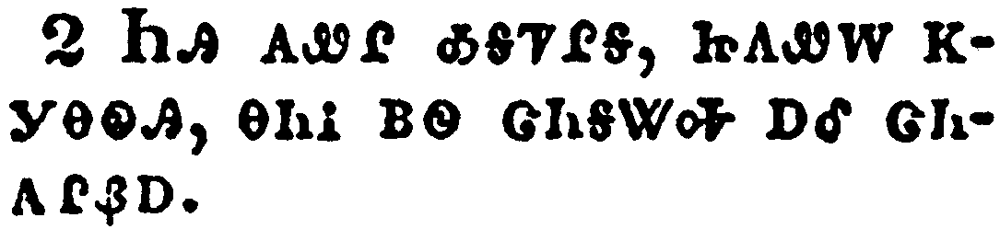</a></td>
</tr>
<tr class="even">
<td>Ye are our epistle written in our hearts, known and read of all men:</td>
</tr>
<tr class="odd">
<td>ᏂᎯ ᎪᏪᎵ ᎣᎦᏤᎵᎦ, ᏥᎪᏪᎳ ᏦᎩᎾᏫᎯ, ᎾᏂᎥ ᏴᏫ ᏣᏂᎦᏔᎭ ᎠᎴ ᏣᏂᎪᎵᏰᎠ.</td>
</tr>
<tr class="even">
<td>Ni-hi go-we-li o-ga-tse-li-ga, tsi-go-we-la tso-gi-na-wi-hi, na-ni-v yv-wi tsa-ni-ga-ta-ha a-le tsa-ni-go-li-ye-a.</td>
</tr>
</tbody>
</table>

<table>
<tbody>
<tr class="odd">
<td><a href="080303.png">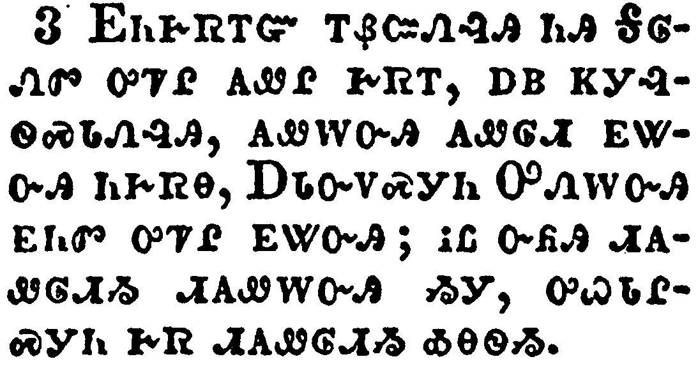</a></td>
</tr>
<tr class="even">
<td>Forasmuch as ye are manifestly declared to be the epistle of Christ ministered by us, written not with ink, but with the Spirit of the living God; not in tables of stone, but in fleshy tables of the heart.</td>
</tr>
<tr class="odd">
<td>ᎬᏂᎨᏒᎢᏳ ᎢᏰᏨᏁᎸᎯ ᏂᎯ ᎦᎶᏁᏛ ᎤᏤᎵ ᎪᏪᎵ ᎨᏒᎢ, ᎠᏴ ᏦᎩᎸᏫᏍᏓᏁᎸᎯ, ᎪᏪᎳᏅᎯ ᎪᏪᎶᏗ ᎬᏔᏅᎯ ᏂᎨᏒᎾ, ᎠᏓᏅᏙᏍᎩᏂ ᎤᏁᎳᏅᎯ ᎬᏂᏛ ᎤᏤᎵ ᎬᏔᏅᎯ; ᎥᏝ ᏅᏲᎯ ᏗᎪᏪᎶᏗᏱ ᏗᎪᏪᎳᏅᎯ ᏱᎩ, ᎤᏇᏓᎵᏍᎩᏂ ᎨᏒ ᏗᎪᏪᎶᏗᏱ ᎣᎾᏫᏱ.</td>
</tr>
<tr class="even">
<td>Gv-ni-ge-sv-i-yu i-ye-tsv-ne-lv-hi ni-hi Ga-lo-ne-dv u-tse-li go-we-li ge-sv-i, a-yv tso-gi-lv-wi-s-da-ne-lv-hi, go-we-la-nv-hi go-we-lo-di gv-ta-nv-hi ni-ge-sv-na, A-da-nv-do-s-gi-ni U-ne-la-nv-hi gv-ni-dv u-tse-li gv-ta-nv-hi; v-tla nv-yo-hi di-go-we-lo-di-yi di-go-we-la-nv-hi yi-gi, u-que-da-li-s-gi-ni ge-sv di-go-we-lo-di-yi o-na-wi-yi.</td>
</tr>
</tbody>
</table>

<table>
<tbody>
<tr class="odd">
<td><a href="080304.png">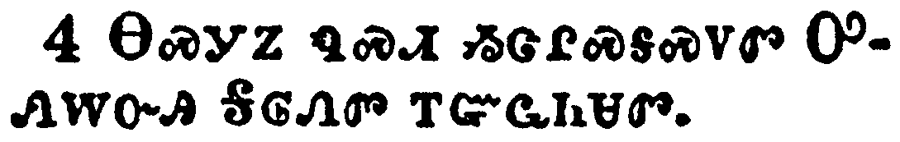</a></td>
</tr>
<tr class="even">
<td>And such trust have we through Christ to God-ward:</td>
</tr>
<tr class="odd">
<td>ᎾᏍᎩᏃ ᏄᏍᏗ ᏱᏣᎵᏍᎦᏍᏙᏛ ᎤᏁᎳᏅᎯ ᎦᎶᏁᏛ ᎢᏳᏩᏂᏌᏛ.</td>
</tr>
<tr class="even">
<td>Na-s-gi-no nu-s-di yi-tsa-li-s-ga-s-do-dv U-ne-la-nv-hi Ga-lo-ne-dv i-yu-wa-ni-sa-dv.</td>
</tr>
</tbody>
</table>

<table>
<tbody>
<tr class="odd">
<td><a href="080305.png">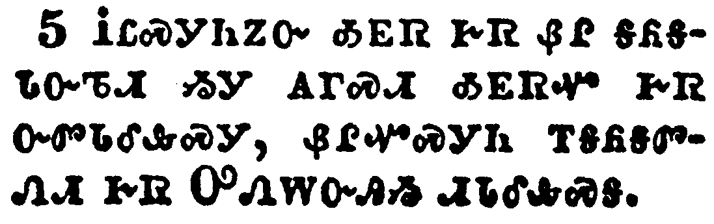</a></td>
</tr>
<tr class="even">
<td>Not that we are sufficient of ourselves to think any thing as of ourselves; but our sufficiency is of God;</td>
</tr>
<tr class="odd">
<td>ᎥᏝᏍᎩᏂᏃᏅ ᎣᎬᏒ ᎨᏒ ᏰᎵ ᎦᏲᎦᏓᏅᏖᏗ ᏱᎩ ᎪᎱᏍᏗ ᎣᎬᏒᏉ ᎨᏒ ᏅᏛᏓᎴᎲᏍᎩ, ᏰᎵᏉᏍᎩᏂ ᎢᎦᏲᎦᏛᏁᏗ ᎨᏒ ᎤᏁᎳᏅᎯᏱ ᏗᏓᎴᎲᏍᎦ.</td>
</tr>
<tr class="even">
<td>V-tla-s-gi-ni-no-nv o-gv-sv ge-sv ye-li ga-yo-ga-da-nv-te-di yi-gi go-hu-s-di o-gv-sv-quo ge-sv nv-dv-da-le-hv-s-gi, ye-li-quo-s-gi-ni i-ga-yo-ga-dv-ne-di ge-sv U-ne-la-nv-hi-yi di-da-le-hv-s-ga.</td>
</tr>
</tbody>
</table>

<table>
<tbody>
<tr class="odd">
<td><a href="080306.png">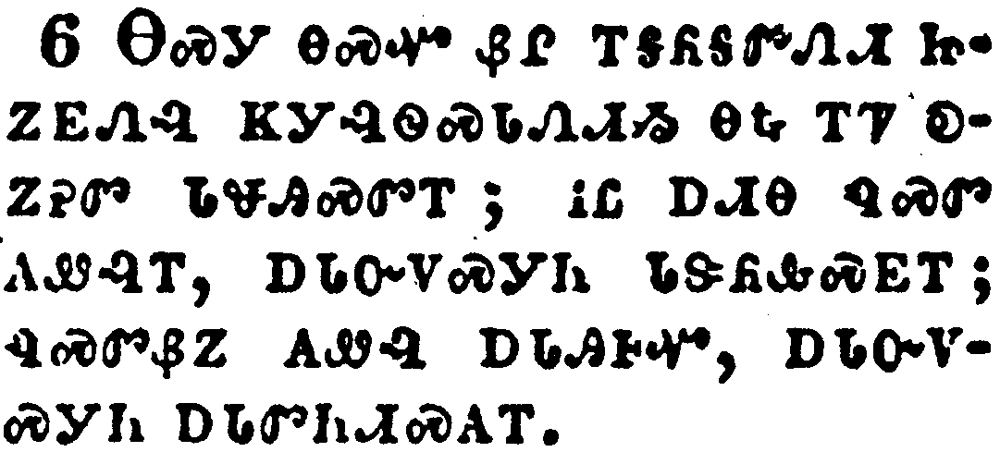</a></td>
</tr>
<tr class="even">
<td>Who also hath made us able ministers of the new testament; not of the letter, but of the spirit: for the letter killeth, but the spirit giveth life.</td>
</tr>
<tr class="odd">
<td>ᎾᏍᎩ ᎾᏍᏉ ᏰᎵ ᎢᎦᏲᎦᏛᏁᏗ ᏥᏃᎬᏁᎸ ᏦᎩᎸᏫᏍᏓᏁᏗᏱ ᎾᎿᎭᎢᏤ ᎧᏃᎮᏛ ᏓᏠᎯᏍᏛᎢ; ᎥᏝ ᎠᏗᎾ ᏄᏍᏛ ᎪᏪᎸᎢ, ᎠᏓᏅᏙᏍᎩᏂ ᏓᏕᏲᎲᏍᎬᎢ; ᏄᏍᏛᏰᏃ ᎪᏪᎸ ᎠᏓᎯᎰᏉ, ᎠᏓᏅᏙᏍᎩᏂ ᎠᏓᏛᏂᏗᏍᎪᎢ.</td>
</tr>
<tr class="even">
<td>Na-s-gi na-s-quo ye-li i-ga-yo-ga-dv-ne-di tsi-no-gv-ne-lv tso-gi-lv-wi-s-da-ne-di-yi na-hna i-tse ka-no-he-dv da-tlo-hi-s-dv-i; v-tla a-di-na nu-s-dv go-we-lv-i, a-da-nv-do-s-gi-ni da-de-yo-hv-s-gv-i; nu-s-dv-ye-no go-we-lv a-da-hi-ho-quo, a-da-nv-do-s-gi-ni a-da-dv-ni-di-s-go-i.</td>
</tr>
</tbody>
</table>

<table>
<tbody>
<tr class="odd">
<td><a href="080307.png">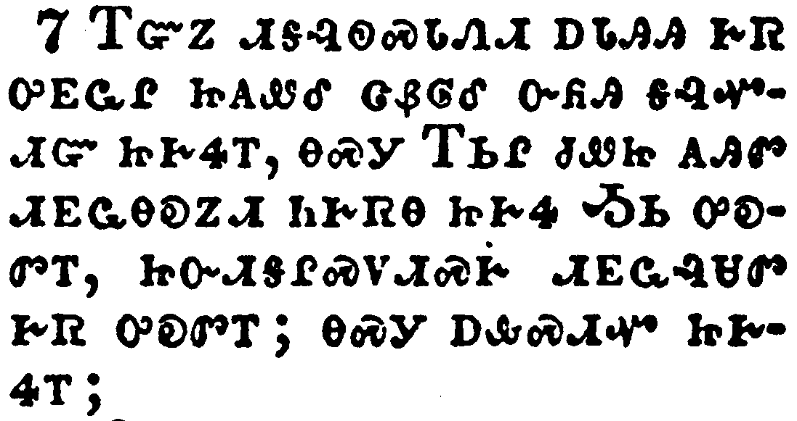</a></td>
</tr>
<tr class="even">
<td>But if the ministration of death, written and engraven in stones, was glorious, so that the children of Israel could not stedfastly behold the face of Moses for the glory of his countenance; which glory was to be done away:</td>
</tr>
<tr class="odd">
<td>ᎢᏳᏃ ᏗᎦᎸᏫᏍᏓᏁᏗ ᎠᏓᎯᎯ ᎨᏒ ᎤᎬᏩᎵ ᏥᎪᏪᎴ ᏣᏰᎶᎴ ᏅᏲᎯ ᎦᎸᏉᏗᏳ ᏥᎨᏎᎢ, ᎾᏍᎩ ᎢᏏᎵ ᏧᏪᏥ ᎪᎯᏛ ᏗᎬᏩᎾᎧᏃᏗ ᏂᎨᏒᎾ ᏥᎨᏎ ᎼᏏ ᎤᎧᏛᎢ, ᏥᏅᏗᎦᎵᏍᏙᏗᏍᎨ ᏗᎬᏩᎸᏌᏛ ᎨᏒ ᎤᎧᏛᎢ; ᎾᏍᎩ ᎠᎲᏍᏗᏉ ᏥᎨᏎᎢ;</td>
</tr>
<tr class="even">
<td>I-yu-no di-ga-lv-wi-s-da-ne-di a-da-hi-hi ge-sv u-gv-wa-li tsi-go-we-le tsa-ye-lo-le nv-yo-hi ga-lv-quo-di-yu tsi-ge-se-i, na-s-gi I-si-li tsu-we-tsi go-hi-dv di-gv-wa-na-ka-no-di ni-ge-sv-na tsi-ge-se Mo-si u-ka-dv-i, tsi-nv-di-ga-li-s-do-di-s-ge di-gv-wa-lv-sa-dv ge-sv u-ka-dv-i; na-s-gi a-hv-s-di-quo tsi-ge-se-i;</td>
</tr>
</tbody>
</table>

<table>
<tbody>
<tr class="odd">
<td><a href="080308.png">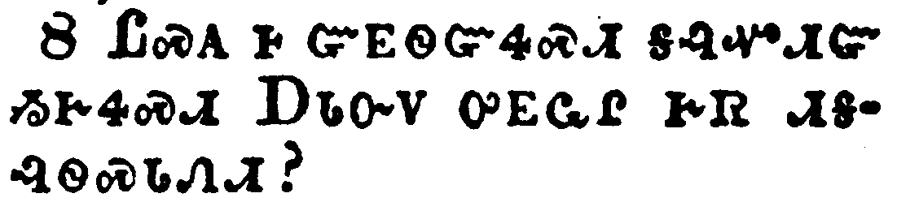</a></td>
</tr>
<tr class="even">
<td>How shall not the ministration of the spirit be rather glorious?</td>
</tr>
<tr class="odd">
<td>ᏝᏍᎪ Ꮀ ᏳᎬᏫᏳᏎᏍᏗ ᎦᎸᏉᏗᏳ ᏱᎨᏎᏍᏗ ᎠᏓᏅᏙ ᎤᎬᏩᎵ ᎨᏒ ᏗᎦᎸᏫᏍᏓᏁᏗ?</td>
</tr>
<tr class="even">
<td>Tla-s-go ho yu-gv-wi-yu-se-s-di ga-lv-quo-di-yu yi-ge-se-s-di A-da-nv-do u-gv-wa-li ge-sv di-ga-lv-wi-s-da-ne-di?</td>
</tr>
</tbody>
</table>

<table>
<tbody>
<tr class="odd">
<td><a href="080309.png">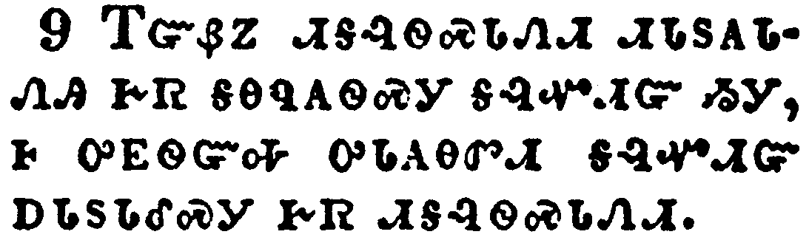</a></td>
</tr>
<tr class="even">
<td>For if the ministration of condemnation be glory, much more doth the ministration of righteousness exceed in glory.</td>
</tr>
<tr class="odd">
<td>ᎢᏳᏰᏃ ᏗᎦᎸᏫᏍᏓᏁᏗ ᏗᏓᏚᎪᏓᏁᎯ ᎨᏒ ᎦᎾᏄᏫᏍᎩ ᎦᎸᏉᏗᏳ ᏱᎩ, Ꮀ ᎤᎬᏫᏳᎭ ᎤᏓᎪᎾᏛᏗ ᎦᎸᏉᏗᏳ ᎠᏓᏚᏓᎴᏍᎩ ᎨᏒ ᏗᎦᎸᏫᏍᏓᏁᏗ.</td>
</tr>
<tr class="even">
<td>I-yu-ye-no di-ga-lv-wi-s-da-ne-di di-da-du-go-da-ne-hi ge-sv ga-na-nu-wi-s-gi ga-lv-quo-di-yu yi-gi, ho u-gv-wi-yu-ha u-da-go-na-dv-di ga-lv-quo-di-yu a-da-du-da-le-s-gi ge-sv di-ga-lv-wi-s-da-ne-di.</td>
</tr>
</tbody>
</table>

<table>
<tbody>
<tr class="odd">
<td><a href="080310.png">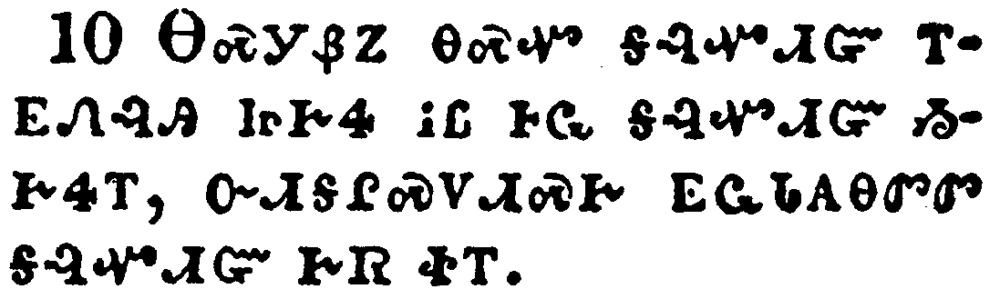</a></td>
</tr>
<tr class="even">
<td>For even that which was made glorious had no glory in this respect, by reason of the glory that excelleth.</td>
</tr>
<tr class="odd">
<td>ᎾᏍᎩᏰᏃ ᎾᏍᏉ ᎦᎸᏉᏗᏳ ᎢᎬᏁᎸᎯ ᏥᎨᏎ ᎥᏝ ᎰᏩ ᎦᎸᏉᏗᏳ ᏱᎨᏎᎢ, ᏅᏗᎦᎵᏍᏙᏗᏍᎨ ᎬᏩᏓᎪᎾᏛᏛ ᎦᎸᏉᏗᏳ ᎨᏒ ᏐᎢ.</td>
</tr>
<tr class="even">
<td>Na-s-gi-ye-no na-s-quo ga-lv-quo-di-yu i-gv-ne-lv-hi tsi-ge-se v-tla ho-wa ga-lv-quo-di-yu yi-ge-se-i, nv-di-ga-li-s-do-di-s-ge gv-wa-da-go-na-dv-dv ga-lv-quo-di-yu ge-sv so-i.</td>
</tr>
</tbody>
</table>

<table>
<tbody>
<tr class="odd">
<td><a href="080311.png">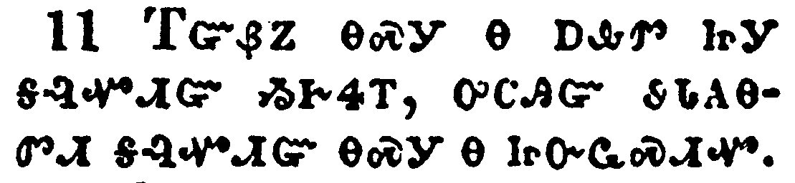</a></td>
</tr>
<tr class="even">
<td>For if that which is done away was glorious, much more that which remaineth is glorious.</td>
</tr>
<tr class="odd">
<td>ᎢᏳᏰᏃ ᎾᏍᎩ Ꮎ ᎠᎲᏛ ᏥᎩ ᎦᎸᏉᏗᏳ ᏱᎨᏎᎢ, ᎤᏟᎯᏳ ᏭᏓᎪᎾᏛᏗ ᎦᎸᏉᏗᏳ ᎾᏍᎩ Ꮎ ᏥᏅᏩᏍᏗᏉ.</td>
</tr>
<tr class="even">
<td>I-yu-ye-no na-s-gi na a-hv-dv tsi-gi ga-lv-quo-di-yu yi-ge-se-i, u-tli-hi-yu wu-da-go-na-dv-di ga-lv-quo-di-yu na-s-gi na tsi-nv-wa-s-di-quo.</td>
</tr>
</tbody>
</table>

<table>
<tbody>
<tr class="odd">
<td><a href="080312.png">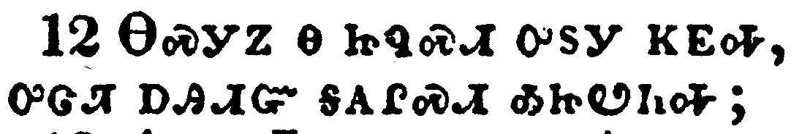</a></td>
</tr>
<tr class="even">
<td>Seeing then that we have such hope, we use great plainness of speech:</td>
</tr>
<tr class="odd">
<td>ᎾᏍᎩᏃ Ꮎ ᏥᏄᏍᏗ ᎤᏚᎩ ᏦᎬᎭ, ᎤᏣᏘ ᎠᎯᏗᏳ ᎦᎪᎵᏍᏗ ᎣᏥᏬᏂᎭ;</td>
</tr>
<tr class="even">
<td>Na-s-gi-no na tsi-nu-s-di u-du-gi tso-gv-ha, u-tsa-ti a-hi-di-yu ga-go-li-s-di o-tsi-wo-ni-ha;</td>
</tr>
</tbody>
</table>

<table>
<tbody>
<tr class="odd">
<td><a href="080313.png">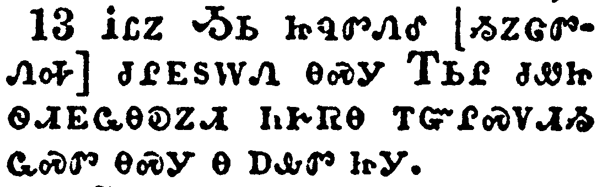</a></td>
</tr>
<tr class="even">
<td>And not as Moses, which put a vail over his face, that the children of Israel could not stedfastly look to the end of that which is abolished:</td>
</tr>
<tr class="odd">
<td>ᎢᏝᏃ ᎼᏏ ᏥᏄᏛᏁᎴ [ᏱᏃᏣᏛᏁᎭ] ᏧᎵᎬᏚᎳᏁ ᎾᏍᎩ ᎢᏏᎵ ᏧᏪᏥ ᏫᏗᎬᏩᎾᎧᏃᏗ ᏂᎨᏒᎾ ᎢᏳᎵᏍᏙᏗᏱ ᏩᏍᏛ ᎾᏍᎩ Ꮎ ᎠᎲᏛ ᏥᎩ.</td>
</tr>
<tr class="even">
<td>I-tla-no Mo-si tsi-nu-dv-ne-le [yi-no-tsa-dv-ne-ha] tsu-li-gv-du-la-ne na-s-gi I-si-li tsu-we-tsi wi-di-gv-wa-na-ka-no-di ni-ge-sv-na i-yu-li-s-do-di-yi wa-s-dv na-s-gi na a-hv-dv tsi-gi.</td>
</tr>
</tbody>
</table>

<table>
<tbody>
<tr class="odd">
<td><a href="080314.png">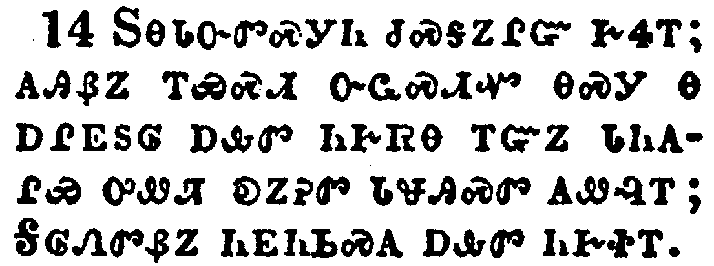</a></td>
</tr>
<tr class="even">
<td>But their minds were blinded: for until this day remaineth the same vail untaken away in the reading of the old testament; which vail is done away in Christ.</td>
</tr>
<tr class="odd">
<td>ᏚᎾᏓᏅᏛᏍᎩᏂ ᏧᏍᎦᏃᎵᏳ ᎨᏎᎢ; ᎪᎯᏰᏃ ᎢᏯᏍᏗ ᏅᏩᏍᏗᏉ ᎾᏍᎩ Ꮎ ᎠᎵᎬᏚᎶ ᎠᎲᏛ ᏂᎨᏒᎾ ᎢᏳᏃ ᏓᏂᎪᎵᏯ ᎤᏪᏘ ᎧᏃᎮᏛ ᏓᏠᎯᏍᏛ ᎪᏪᎸᎢ; ᎦᎶᏁᏛᏰᏃ ᏂᎬᏂᏏᏍᎪ ᎠᎲᏛ ᏂᎨᏐᎢ.</td>
</tr>
<tr class="even">
<td>Du-na-da-nv-dv-s-gi-ni tsu-s-ga-no-li-yu ge-se-i; go-hi-ye-no i-ya-s-di nv-wa-s-di-quo na-s-gi na a-li-gv-du-lo a-hv-dv ni-ge-sv-na i-yu-no da-ni-go-li-ya u-we-ti ka-no-he-dv da-tlo-hi-s-dv go-we-lv-i; Ga-lo-ne-dv-ye-no ni-gv-ni-si-s-go a-hv-dv ni-ge-so-i.</td>
</tr>
</tbody>
</table>

<table>
<tbody>
<tr class="odd">
<td><a href="080315.png">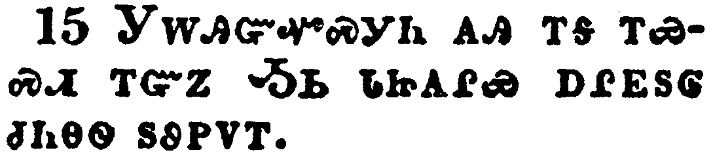</a></td>
</tr>
<tr class="even">
<td>But even unto this day, when Moses is read, the vail is upon their heart.</td>
</tr>
<tr class="odd">
<td>ᎩᎳᎯᏳᏉᏍᎩᏂ ᎪᎯ ᎢᎦ ᎢᏯᏍᏗ ᎢᏳᏃ ᎼᏏ ᏓᏥᎪᎵᏯ ᎠᎵᎬᏚᎶ ᏧᏂᎾᏫ ᏚᏭᏢᏙᎢ.</td>
</tr>
<tr class="even">
<td>Gi-la-hi-yu-quo-s-gi-ni go-hi i-ga i-ya-s-di i-yu-no Mo-si da-tsi-go-li-ya a-li-gv-du-lo tsu-ni-na-wi du-wu-tlv-do-i.</td>
</tr>
</tbody>
</table>

<table>
<tbody>
<tr class="odd">
<td><a href="080316.png">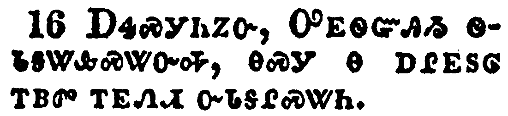</a></td>
</tr>
<tr class="even">
<td>Nevertheless when it shall turn to the Lord, the vail shall be taken away.</td>
</tr>
<tr class="odd">
<td>ᎠᏎᏍᎩᏂᏃᏅ, ᎤᎬᏫᏳᎯᏱ ᏫᏓᎦᏔᎲᏍᏔᏅᎭ, ᎾᏍᎩ Ꮎ ᎠᎵᎬᏚᎶ ᎢᏴᏛ ᎢᎬᏁᏗ ᏅᏓᎦᎵᏍᏔᏂ.</td>
</tr>
<tr class="even">
<td>A-se-s-gi-ni-no-nv, U-gv-wi-yu-hi-yi wi-da-ga-ta-hv-s-ta-nv-ha, na-s-gi na a-li-gv-du-lo i-yv-dv i-gv-ne-di nv-da-ga-li-s-ta-ni.</td>
</tr>
</tbody>
</table>

<table>
<tbody>
<tr class="odd">
<td><a href="080317.png">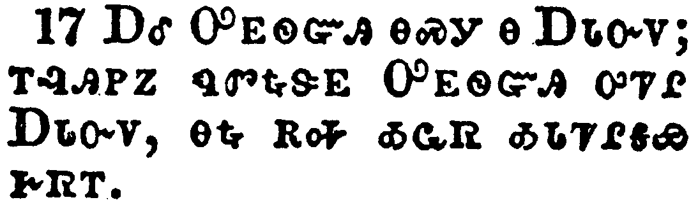</a></td>
</tr>
<tr class="even">
<td>Now the Lord is that Spirit: and where the Spirit of the Lord is, there is liberty.</td>
</tr>
<tr class="odd">
<td>ᎠᎴ ᎤᎬᏫᏳᎯ ᎾᏍᎩ Ꮎ ᎠᏓᏅᏙ; ᎢᎸᎯᏢᏃ ᏄᏛᎿᎭᏕᎬ ᎤᎬᏫᏳᎯ ᎤᏤᎵ ᎠᏓᏅᏙ, ᎾᎿᎭᎡᎭ ᎣᏩᏒ ᎣᏓᏤᎵᎦᏯ ᎨᏒᎢ.</td>
</tr>
<tr class="even">
<td>A-le U-gv-wi-yu-hi na-s-gi na A-da-nv-do; i-lv-hi-tlv-no nu-dv-hna-de-gv U-gv-wi-yu-hi u-tse-li A-da-nv-do, na-hna e-ha o-wa-sv o-da-tse-li-ga-ya ge-sv-i.</td>
</tr>
</tbody>
</table>

<table>
<tbody>
<tr class="odd">
<td><a href="080318.png">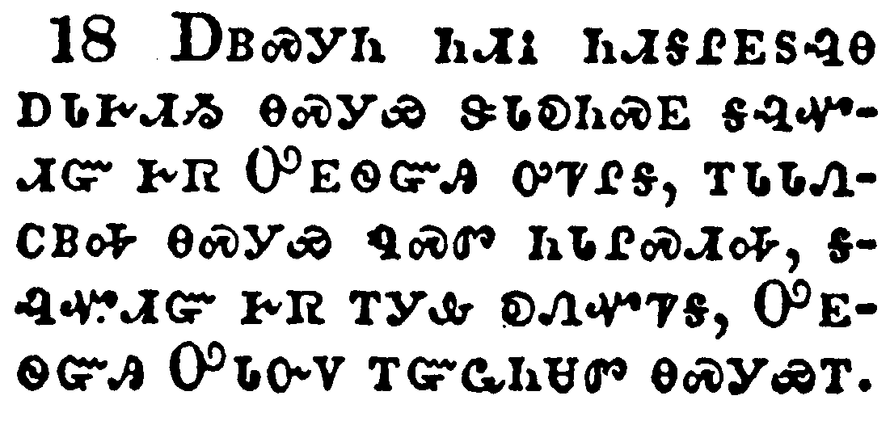</a></td>
</tr>
<tr class="even">
<td>But we all, with open face beholding as in a glass the glory of the Lord, are changed into the same image from glory to glory, even as by the Spirit of the Lord.</td>
</tr>
<tr class="odd">
<td>ᎠᏴᏍᎩᏂ ᏂᏗᎥ ᏂᏗᎦᎵᎬᏚᎸᎾ ᎠᏓᎨᏗᏱ ᎾᏍᎩᏯ ᏕᏓᎧᏂᏍᎬ ᎦᎸᏉᏗᏳ ᎨᏒ ᎤᎬᏫᏳᎯ ᎤᏤᎵᎦ, ᎢᏓᏓᏁᏟᏴᎭ ᎾᏍᎩᏯ ᏄᏍᏛ ᏂᏓᎵᏍᏗᎭ, ᎦᎸᏉᏗᏳ ᎨᏒ ᎢᎩᎲ ᎧᏁᏉᏤᎦ, ᎤᎬᏫᏳᎯ ᎤᏓᏅᏙ ᎢᏳᏩᏂᏌᏛ ᎾᏍᎩᏯᎢ.</td>
</tr>
<tr class="even">
<td>A-yv-s-gi-ni ni-di-v ni-di-ga-li-gv-du-lv-na a-da-ge-di-yi na-s-gi-ya de-da-ka-ni-s-gv ga-lv-quo-di-yu ge-sv U-gv-wi-yu-hi u-tse-li-ga, i-da-da-ne-tli-yv-ha na-s-gi-ya nu-s-dv ni-da-li-s-di-ha, ga-lv-quo-di-yu ge-sv i-gi-hv ka-ne-quo-tse-ga, U-gv-wi-yu-hi U-da-nv-do i-yu-wa-ni-sa-dv na-s-gi-ya-i.</td>
</tr>
</tbody>
</table>

