+++
draft=false
date = 2014-12-18T21:11:07Z
title = "2 Corinthians - Chapter 10 - Cherokee New Testament"
weight = 1418955067

[taxonomies]

authors = ["Timothy Legg"]
categories = []
tags = []

[extra]
+++

<table>
<tbody>
<tr class="odd">
<td><a href="081001.png">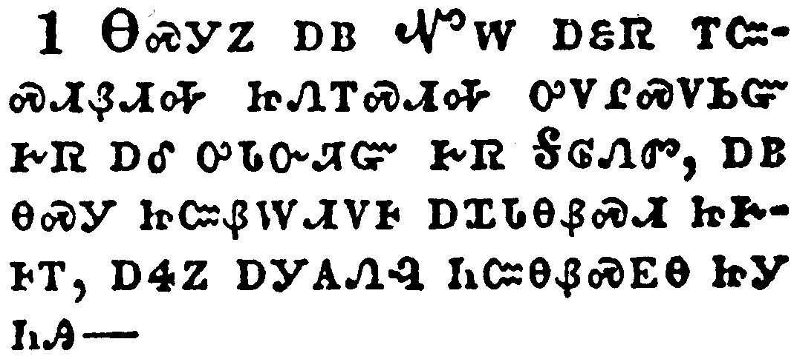</a></td>
</tr>
<tr class="even">
<td>Now I Paul myself beseech you by the meekness and gentleness of Christ, who in presence am base among you, but being absent am bold toward you:</td>
</tr>
<tr class="odd">
<td>ᎾᏍᎩᏃ ᎠᏴ ᏉᎳ ᎠᏋᏒ ᎢᏨᏍᏗᏰᏗᎭ ᏥᏁᎢᏍᏗᎭ ᎤᏙᎵᏍᏙᏏᏳ ᎨᏒ ᎠᎴ ᎤᏓᏅᏘᏳ ᎨᏒ ᎦᎶᏁᏛ, ᎠᏴ ᎾᏍᎩ ᏥᏨᏰᎳᏗᏙᎰ ᎠᏆᏓᎾᏰᏍᏗ ᏥᎨᎰᎢ, ᎠᏎᏃ ᎠᎩᎪᏁᎸ ᏂᏨᎾᏰᏍᎬᎾ ᏥᎩ ᏂᎯ^</td>
</tr>
<tr class="even">
<td>Na-s-gi-no a-yv Quo-la a-quv-sv i-tsv-s-di-ye-di-ha tsi-ne-i-s-di-ha u-do-li-s-do-si-yu ge-sv a-le u-da-nv-ti-yu ge-sv Ga-lo-ne-dv, a-yv na-s-gi tsi-tsv-ye-la-di-do-ho a-qua-da-na-ye-s-di tsi-ge-ho-i, a-se-no a-gi-go-ne-lv ni-tsv-na-ye-s-gv-na tsi-gi ni-hi^</td>
</tr>
</tbody>
</table>

<table>
<tbody>
<tr class="odd">
<td><a href="081002.png">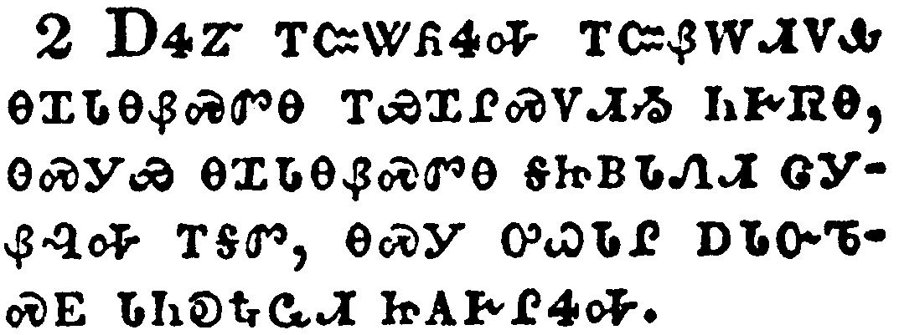</a></td>
</tr>
<tr class="even">
<td>But I beseech you, that I may not be bold when I am present with that confidence, wherewith I think to be bold against some, which think of us as if we walked according to the flesh.</td>
</tr>
<tr class="odd">
<td>ᎠᏎᏃ ᎢᏨᏔᏲᏎᎭ ᎢᏨᏰᎳᏗᏙᎲ ᎾᏆᏓᎾᏰᏍᏛᎾ ᎢᏯᏆᎵᏍᏙᏗᏱ ᏂᎨᏒᎾ, ᎾᏍᎩᏯ ᎾᏆᏓᎾᏰᏍᏛᎾ ᎦᏥᏴᏓᏁᏗ ᏣᎩᏰᎸᎭ ᎢᎦᏛ, ᎾᏍᎩ ᎤᏇᏓᎵ ᎠᏓᏅᏖᏍᎬ ᏓᏂᎧᎿᎭᏩᏗ ᏥᎪᎨᎵᏎᎭ.</td>
</tr>
<tr class="even">
<td>A-se-no i-tsv-ta-yo-se-ha i-tsv-ye-la-di-do-hv na-qua-da-na-ye-s-dv-na i-ya-qua-li-s-do-di-yi ni-ge-sv-na, na-s-gi-ya na-qua-da-na-ye-s-dv-na ga-tsi-yv-da-ne-di tsa-gi-ye-lv-ha i-ga-dv, na-s-gi u-que-da-li a-da-nv-te-s-gv da-ni-ka-hna-wa-di tsi-go-ge-li-se-ha.</td>
</tr>
</tbody>
</table>

<table>
<tbody>
<tr class="odd">
<td></td>
</tr>
<tr class="even">
<td>For though we walk in the flesh, we do not war after the flesh:</td>
</tr>
<tr class="odd">
<td>ᎤᏙᎯᏳᎯᏍᎩᏂᏃᏅ ᎤᏇᏓᎸ ᎤᏤᏙᎭ, ᎠᏎᏃ ᎥᏝ ᎤᏇᏓᎵ ᏧᏟᏴᏙᏗ ᎨᏒ ᏱᏙᏣᏟᏴᏗᎭ;</td>
</tr>
<tr class="even">
<td>U-do-hi-yu-hi-s-gi-ni-no-nv u-que-da-lv u-tse-do-ha, a-se-no v-tla u-que-da-li tsu-tli-yv-do-di ge-sv yi-do-tsa-tli-yv-di-ha;</td>
</tr>
</tbody>
</table>

<table>
<tbody>
<tr class="odd">
<td><a href="081004.png">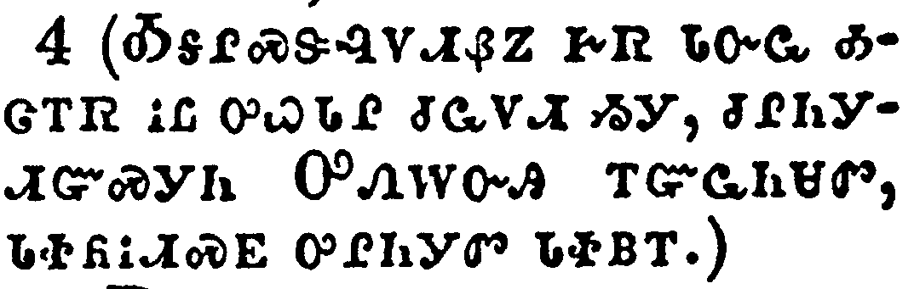</a></td>
</tr>
<tr class="even">
<td>(For the weapons of our warfare are not carnal, but mighty through God to the pulling down of strong holds;)</td>
</tr>
<tr class="odd">
<td>(ᎣᎦᎵᏍᏕᎸᏙᏗᏰᏃ ᎨᏒ ᏓᏅᏩ ᎣᏣᎢᏒ ᎥᏝ ᎤᏇᏓᎵ ᏧᏩᏙᏗ ᏱᎩ, ᏧᎵᏂᎩᏗᏳᏍᎩᏂ ᎤᏁᎳᏅᎯ ᎢᏳᏩᏂᏌᏛ, ᏓᏐᏲᎥᏗᏍᎬ ᎤᎵᏂᎩᏛ ᏓᏐᏴᎢ.)</td>
</tr>
<tr class="even">
<td>(O-ga-li-s-de-lv-do-di-ye-no ge-sv da-nv-wa o-tsa-i-sv v-tla u-que-da-li tsu-wa-do-di yi-gi, tsu-li-ni-gi-di-yu-s-gi-ni U-ne-la-nv-hi i-yu-wa-ni-sa-dv, da-so-yo-v-di-s-gv u-li-ni-gi-dv da-so-yv-i.)</td>
</tr>
</tbody>
</table>

<table>
<tbody>
<tr class="odd">
<td><a href="081005.png">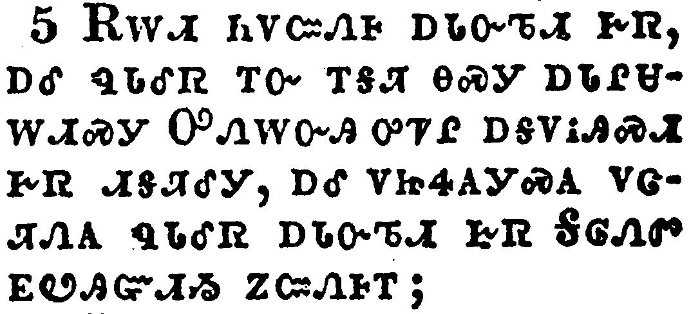</a></td>
</tr>
<tr class="even">
<td>Casting down imaginations, and every high thing that exalteth itself against the knowledge of God, and bringing into captivity every thought to the obedience of Christ;</td>
</tr>
<tr class="odd">
<td>ᎡᎳᏗ ᏂᏙᏨᏁᎰ ᎠᏓᏅᏖᏗ ᎨᏒ, ᎠᎴ ᏄᏓᎴᏒ ᎢᏅ ᎢᎦᏘ ᎾᏍᎩ ᎠᏓᎵᏌᎳᏗᏍᎩ ᎤᏁᎳᏅᎯ ᎤᏤᎵ ᎠᎦᏙᎥᎯᏍᏗ ᎨᏒ ᏗᎦᏘᎴᎩ, ᎠᎴ ᏙᏥᏎᎪᎩᏍᎪ ᏙᏣᏘᏁᎪ ᏄᏓᎴᏒ ᎠᏓᏅᏖᏗ ᎨᏒ ᎦᎶᏁᏛ ᎬᏬᎯᏳᏗᏱ ᏃᏨᏁᎰᎢ;</td>
</tr>
<tr class="even">
<td>E-la-di ni-do-tsv-ne-ho a-da-nv-te-di ge-sv, a-le nu-da-le-sv i-nv i-ga-ti na-s-gi a-da-li-sa-la-di-s-gi U-ne-la-nv-hi u-tse-li a-ga-do-v-hi-s-di ge-sv di-ga-ti-le-gi, a-le do-tsi-se-go-gi-s-go do-tsa-ti-ne-go nu-da-le-sv a-da-nv-te-di ge-sv Ga-lo-ne-dv gv-wo-hi-yu-di-yi no-tsv-ne-ho-i;</td>
</tr>
</tbody>
</table>

<table>
<tbody>
<tr class="odd">
<td><a href="081006.png">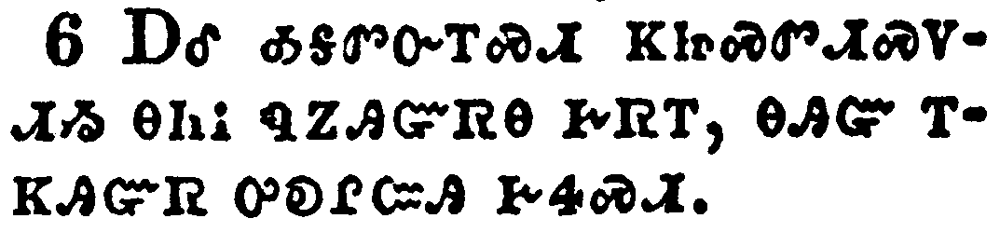</a></td>
</tr>
<tr class="even">
<td>And having in a readiness to revenge all disobedience, when your obedience is fulfilled.</td>
</tr>
<tr class="odd">
<td>ᎠᎴ ᎣᎦᏛᏅᎢᏍᏗ ᏦᏥᏍᏛᏗᏍᏙᏗᏱ ᎾᏂᎥ ᏄᏃᎯᏳᏒᎾ ᎨᏒᎢ, ᎾᎯᏳ ᎢᏦᎯᏳᏒ ᎤᎧᎵᏨᎯ ᎨᏎᏍᏗ.</td>
</tr>
<tr class="even">
<td>A-le o-ga-dv-nv-i-s-di tso-tsi-s-dv-di-s-do-di-yi na-ni-v nu-no-hi-yu-sv-na ge-sv-i, na-hi-yu i-tso-hi-yu-sv u-ka-li-tsv-hi ge-se-s-di.</td>
</tr>
</tbody>
</table>

<table>
<tbody>
<tr class="odd">
<td><a href="081007.png">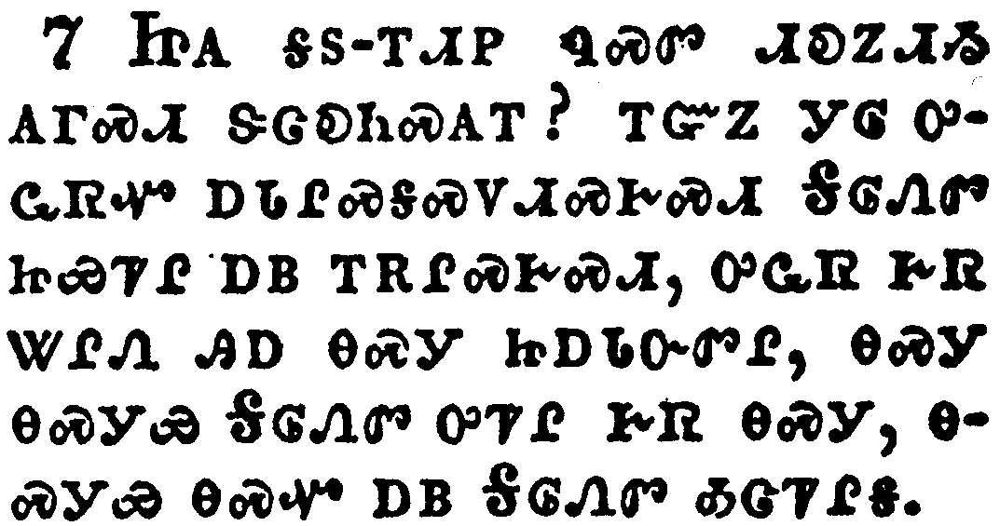</a></td>
</tr>
<tr class="even">
<td>Do ye look on things after the outward appearance? If any man trust to himself that he is Christ's, let him of himself think this again, that, as he is Christ's, even so are we Christ's.</td>
</tr>
<tr class="odd">
<td>ᏥᎪ ᎦᏚ-ᎢᏗᏢ ᏄᏍᏛ ᏗᎧᏃᏗᏱ ᎪᎱᏍᏗ ᏕᏣᎧᏂᏍᎪᎢ? ᎢᏳᏃ ᎩᎶ ᎤᏩᏒᏉ ᎠᏓᎵᏍᎦᏍᏙᏗᏍᎨᏍᏗ ᎦᎶᏁᏛ ᏥᏯᏤᎵ ᎠᏴ ᎢᎡᎵᏍᎨᏍᏗ, ᎤᏩᏒ ᎨᏒ ᏔᎵᏁ ᎯᎠ ᎾᏍᎩ ᏥᎠᏓᏅᏛᎵ, ᎾᏍᎩ ᎾᏍᎩᏯ ᎦᎶᏁᏛ ᎤᏤᎵ ᎨᏒ ᎾᏍᎩ, ᎾᏍᎩᏯ ᎾᏍᏉ ᎠᏴ ᎦᎶᏁᏛ ᎣᏣᏤᎵᎦ.</td>
</tr>
<tr class="even">
<td>Tsi-go ga-du--i-di-tlv nu-s-dv di-ka-no-di-yi go-hu-s-di de-tsa-ka-ni-s-go-i? i-yu-no gi-lo u-wa-sv-quo a-da-li-s-ga-s-do-di-s-ge-s-di Ga-lo-ne-dv tsi-ya-tse-li a-yv i-e-li-s-ge-s-di, u-wa-sv ge-sv ta-li-ne hi-a na-s-gi tsi-a-da-nv-dv-li, na-s-gi na-s-gi-ya Ga-lo-ne-dv u-tse-li ge-sv na-s-gi, na-s-gi-ya na-s-quo a-yv Ga-lo-ne-dv o-tsa-tse-li-ga.</td>
</tr>
</tbody>
</table>

<table>
<tbody>
<tr class="odd">
<td></td>
</tr>
<tr class="even">
<td>For though I should boast somewhat more of our authority, which the Lord hath given us for edification, and not for your destruction, I should not be ashamed:</td>
</tr>
<tr class="odd">
<td>ᎢᏳᏰᏃ ᎾᏍᏉ ᎤᏟ ᎢᎦᎢ ᏯᏆᏢᏈᏍᏔᏅ ᏄᏍᏛ ᎣᎦᏒᎦᎸᎢ, ᎾᏍᎩ ᎤᎬᏫᏳᎯ ᏦᎩᏁᎸ ᎢᏣᎵᏍᏕᎸᏙᏗ ᎨᏒᎢ, ᎥᏝᏃ ᎡᎳᏗ ᎢᏰᏨᏁᏙᏗ ᎨᏒᎢ, ᎥᏝ ᏱᎦᎦᏕᎣᏍᎦ.</td>
</tr>
<tr class="even">
<td>I-yu-ye-no na-s-quo u-tli i-ga-i ya-qua-tlv-qui-s-ta-nv nu-s-dv o-ga-sv-ga-lv-i, na-s-gi U-gv-wi-yu-hi tso-gi-ne-lv i-tsa-li-s-de-lv-do-di ge-sv-i, v-tla-no e-la-di i-ye-tsv-ne-do-di ge-sv-i, v-tla yi-ga-ga-de-o-s-ga.</td>
</tr>
</tbody>
</table>

<table>
<tbody>
<tr class="odd">
<td><a href="081009.png">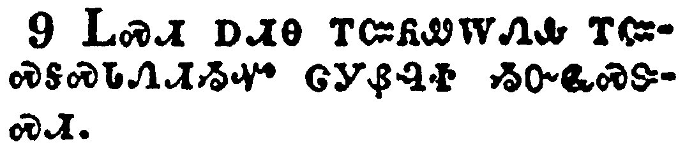</a></td>
</tr>
<tr class="even">
<td>That I may not seem as if I would terrify you by letters.</td>
</tr>
<tr class="odd">
<td>ᏞᏍᏗ ᎠᏗᎾ ᎢᏨᏲᏪᎳᏁᎲ ᎢᏨᏍᎦᏍᏓᏁᏗᏱᏉ ᏣᎩᏰᎸᏐ ᏱᏅᏩᏍᏕᏍᏗ.</td>
</tr>
<tr class="even">
<td>Tle-s-di a-di-na i-tsv-yo-we-la-ne-hv i-tsv-s-ga-s-da-ne-di-yi-quo tsa-gi-ye-lv-so yi-nv-wa-s-de-s-di.</td>
</tr>
</tbody>
</table>

<table>
<tbody>
<tr class="odd">
<td><a href="081010.png">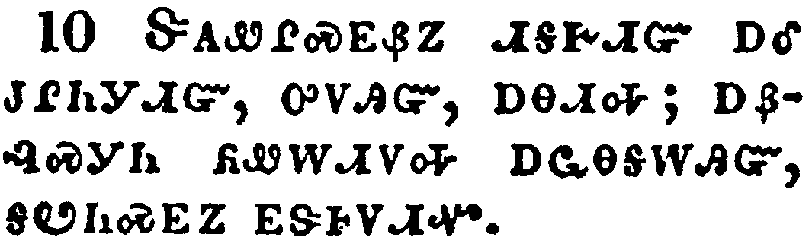</a></td>
</tr>
<tr class="even">
<td>For his letters, say they, are weighty and powerful; but his bodily presence is weak, and his speech contemptible.</td>
</tr>
<tr class="odd">
<td>ᏕᎪᏪᎵᏍᎬᏰᏃ ᏗᎦᎨᏗᏳ ᎠᎴ ᏧᎵᏂᎩᏗᏳ, ᎤᏙᎯᏳ, ᎠᎾᏗᎭ; ᎠᏰᎸᏍᎩᏂ ᏲᏪᎳᏗᏙᎭ ᎠᏩᎾᎦᎳᎯᏳ, ᎦᏬᏂᏍᎬᏃ ᎬᏕᎰᏙᏗᏉ.</td>
</tr>
<tr class="even">
<td>De-go-we-li-s-gv-ye-no di-ga-ge-di-yu a-le tsu-li-ni-gi-di-yu, u-do-hi-yu, a-na-di-ha; a-ye-lv-s-gi-ni yo-we-la-di-do-ha a-wa-na-ga-la-hi-yu, ga-wo-ni-s-gv-no gv-de-ho-do-di-quo.</td>
</tr>
</tbody>
</table>

<table>
<tbody>
<tr class="odd">
<td><a href="081011.png">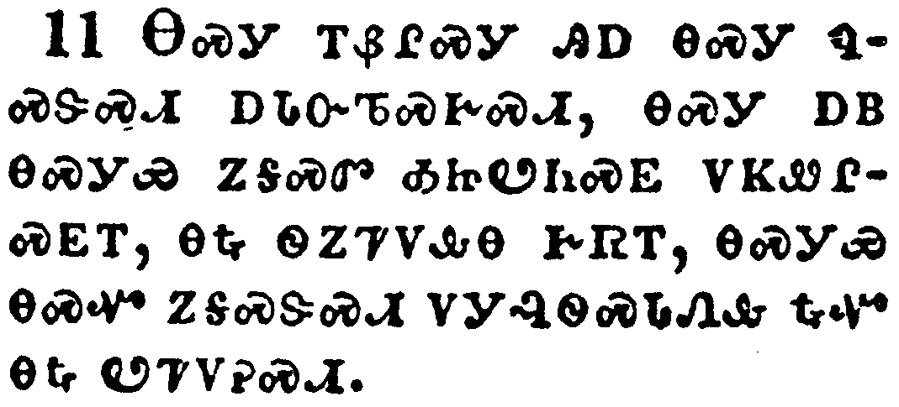</a></td>
</tr>
<tr class="even">
<td>Let such an one think this, that, such as we are in word by letters when we are absent, such will we be also in deed when we are present.</td>
</tr>
<tr class="odd">
<td>ᎾᏍᎩ ᎢᏰᎵᏍᎩ ᎯᎠ ᎾᏍᎩ ᏄᏍᏕᏍᏗ ᎠᏓᏅᏖᏍᎨᏍᏗ, ᎾᏍᎩ ᎠᏴ ᎾᏍᎩᏯ ᏃᎦᏍᏛ ᎣᏥᏬᏂᏍᎬ ᏙᏦᏪᎵᏍᎬᎢ, ᎾᎿᎭᏫᏃᏤᏙᎲᎾ ᎨᏒᎢ, ᎾᏍᎩᏯ ᎾᏍᏉ ᏃᎦᏍᏕᏍᏗ ᏙᎩᎸᏫᏍᏓᏁᎲ ᎿᎭᏉ ᎾᎿᎭᏬᏤᏙᎮᏍᏗ.</td>
</tr>
<tr class="even">
<td>Na-s-gi i-ye-li-s-gi hi-a na-s-gi nu-s-de-s-di a-da-nv-te-s-ge-s-di, na-s-gi a-yv na-s-gi-ya no-ga-s-dv o-tsi-wo-ni-s-gv do-tso-we-li-s-gv-i, na-hna wi-no-tse-do-hv-na ge-sv-i, na-s-gi-ya na-s-quo no-ga-s-de-s-di do-gi-lv-wi-s-da-ne-hv hna-quo na-hna wo-tse-do-he-s-di.</td>
</tr>
</tbody>
</table>

<table>
<tbody>
<tr class="odd">
<td><a href="081012.png">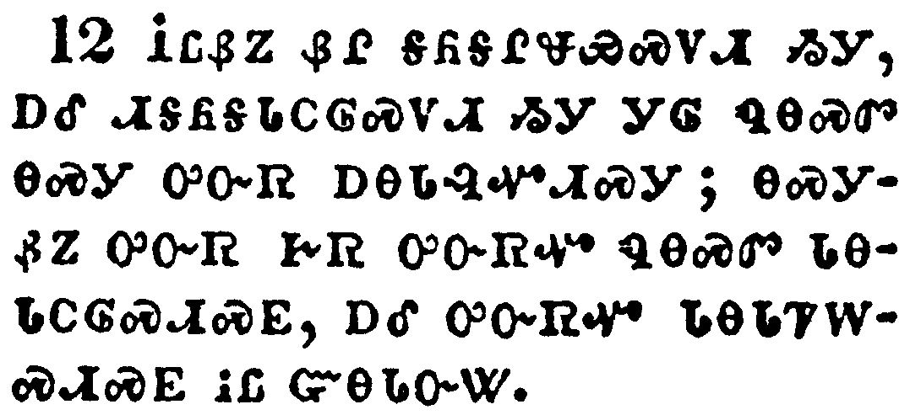</a></td>
</tr>
<tr class="even">
<td>For we dare not make ourselves of the number, or compare ourselves with some that commend themselves: but they measuring themselves by themselves, and comparing themselves among themselves, are not wise.</td>
</tr>
<tr class="odd">
<td>ᎥᏝᏰᏃ ᏰᎵ ᎦᏲᎦᎵᏠᏯᏍᏙᏗ ᏱᎩ, ᎠᎴ ᏗᎦᏲᎦᏓᏟᎶᏍᏙᏗ ᏱᎩ ᏄᎾᏍᏛ ᎾᏍᎩ ᎤᏅᏒ ᎠᎾᏓᎸᏉᏗᏍᎩ; ᎾᏍᎩᏰᏃ ᎤᏅᏒ ᎨᏒ ᎤᏅᏒᏉ ᏄᎾᏍᏛ ᏓᎾᏓᏟᎶᏍᏗᏍᎬ, ᎠᎴ ᎤᏅᏒᏉ ᏓᎾᏓᏤᎳᏍᏗᏍᎬ ᎥᏝ ᏳᎾᏓᏅᏔ.</td>
</tr>
<tr class="even">
<td>V-tla-ye-no ye-li ga-yo-ga-li-tlo-ya-s-do-di yi-gi, a-le di-ga-yo-ga-da-tli-lo-s-do-di yi-gi nu-na-s-dv na-s-gi u-nv-sv a-na-da-lv-quo-di-s-gi; na-s-gi-ye-no u-nv-sv ge-sv u-nv-sv-quo nu-na-s-dv da-na-da-tli-lo-s-di-s-gv, a-le u-nv-sv-quo da-na-da-tse-la-s-di-s-gv v-tla yu-na-da-nv-ta.</td>
</tr>
</tbody>
</table>

<table>
<tbody>
<tr class="odd">
<td><a href="081013.png">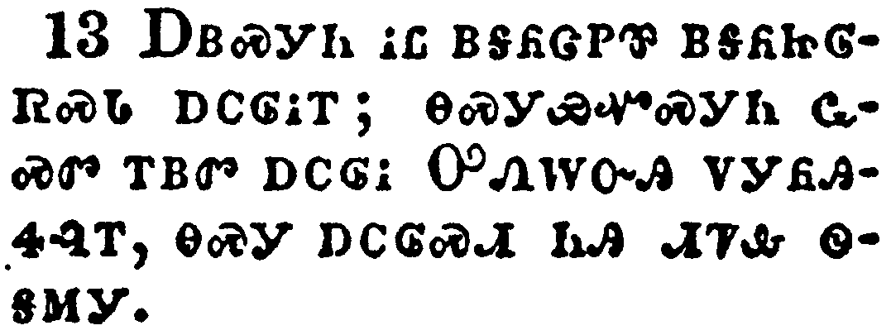</a></td>
</tr>
<tr class="even">
<td>But we will not boast of things without our measure, but according to the measure of the rule which God hath distributed to us, a measure to reach even unto you.</td>
</tr>
<tr class="odd">
<td>ᎠᏴᏍᎩᏂ ᎥᏝ ᏴᎦᏲᏣᏢᏈ ᎠᎦᏲᏥᎶᏒᏍᏓ ᎠᏟᎶᎥᎢ; ᎾᏍᎩᏯᏉᏍᎩᏂ ᏩᏍᏛ ᎢᏴᏛ ᎠᏟᎶᎥ ᎤᏁᎳᏅᎯ ᏙᎩᏲᎯᏎᎸᎢ, ᎾᏍᎩ ᎠᏟᎶᏍᏗ ᏂᎯ ᏗᏤᎲ ᏫᎦᎷᎩ.</td>
</tr>
<tr class="even">
<td>A-yv-s-gi-ni v-tla yv-ga-yo-tsa-tlv-qui a-ga-yo-tsi-lo-sv-s-da a-tli-lo-v-i; na-s-gi-ya-quo-s-gi-ni wa-s-dv i-yv-dv a-tli-lo-v U-ne-la-nv-hi do-gi-yo-hi-se-lv-i, na-s-gi a-tli-lo-s-di ni-hi di-tse-hv wi-ga-lu-gi.</td>
</tr>
</tbody>
</table>

<table>
<tbody>
<tr class="odd">
<td><a href="081014.png">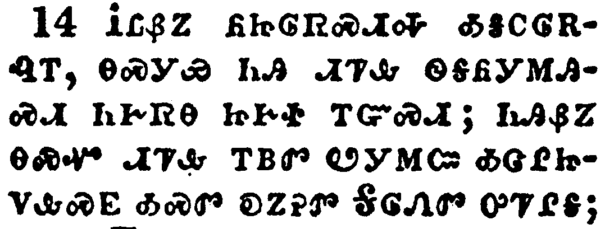</a></td>
</tr>
<tr class="even">
<td>For we stretch not ourselves beyond our measure, as though we reached not unto you: for we are come as far as to you also in preaching the gospel of Christ:</td>
</tr>
<tr class="odd">
<td>ᎥᏝᏰᏃ ᏲᏥᎶᏒᏍᏗᎭ ᎣᎦᏟᎶᏒᎸᎢ, ᎾᏍᎩᏯ ᏂᎯ ᏗᏤᎲ ᏫᎦᏲᎩᎷᎯᏍᏗ ᏂᎨᏒᎾ ᏥᎨᏐ ᎢᏳᏍᏗ; ᏂᎯᏰᏃ ᎾᏍᏉ ᏗᏤᎲ ᎢᏴᏛ ᏬᎩᎷᏨ ᎣᏣᎵᏥᏙᎲᏍᎬ ᎣᏍᏛ ᎧᏃᎮᏛ ᎦᎶᏁᏛ ᎤᏤᎵᎦ;</td>
</tr>
<tr class="even">
<td>V-tla-ye-no yo-tsi-lo-sv-s-di-ha o-ga-tli-lo-sv-lv-i, na-s-gi-ya ni-hi di-tse-hv wi-ga-yo-gi-lu-hi-s-di ni-ge-sv-na tsi-ge-so i-yu-s-di; ni-hi-ye-no na-s-quo di-tse-hv i-yv-dv wo-gi-lu-tsv o-tsa-li-tsi-do-hv-s-gv o-s-dv ka-no-he-dv Ga-lo-ne-dv u-tse-li-ga;</td>
</tr>
</tbody>
</table>

<table>
<tbody>
<tr class="odd">
<td><a href="081015.png">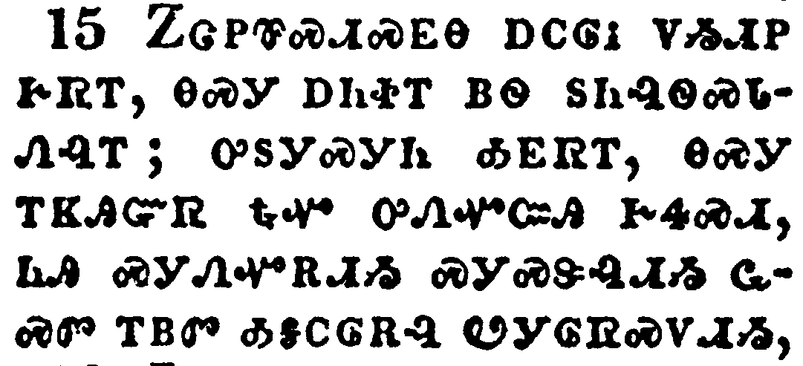</a></td>
</tr>
<tr class="even">
<td>Not boasting of things without our measure, that is, of other men's labours; but having hope, when your faith is increased, that we shall be enlarged by you according to our rule abundantly,</td>
</tr>
<tr class="odd">
<td>ᏃᏣᏢᏈᏍᏗᏍᎬᎾ ᎠᏟᎶᎥ ᏙᏱᏗᏢ ᎨᏒᎢ, ᎾᏍᎩ ᎠᏂᏐᎢ ᏴᏫ ᏚᏂᎸᏫᏍᏓᏁᎸᎢ; ᎤᏚᎩᏍᎩᏂ ᎣᎬᏒᎢ, ᎾᏍᎩ ᎢᏦᎯᏳᏒ ᎿᎭᏉ ᎤᏁᏉᏨᎯ ᎨᏎᏍᏗ, ᏂᎯ ᏍᎩᏁᏉᎡᏗᏱ ᏍᎩᏍᏕᎸᏗᏱ ᏩᏍᏛ ᎢᏴᏛ ᎣᎦᏟᎶᎡᎸ ᏬᎩᎶᏒᏍᏙᏗᏱ,</td>
</tr>
<tr class="even">
<td>No-tsa-tlv-qui-s-di-s-gv-na a-tli-lo-v do-yi-di-tlv ge-sv-i, na-s-gi a-ni-so-i yv-wi du-ni-lv-wi-s-da-ne-lv-i; u-du-gi-s-gi-ni o-gv-sv-i, na-s-gi i-tso-hi-yu-sv hna-quo u-ne-quo-tsv-hi ge-se-s-di, ni-hi s-gi-ne-quo-e-di-yi s-gi-s-de-lv-di-yi wa-s-dv i-yv-dv o-ga-tli-lo-e-lv wo-gi-lo-sv-s-do-di-yi,</td>
</tr>
</tbody>
</table>

<table>
<tbody>
<tr class="odd">
<td><a href="081016.png">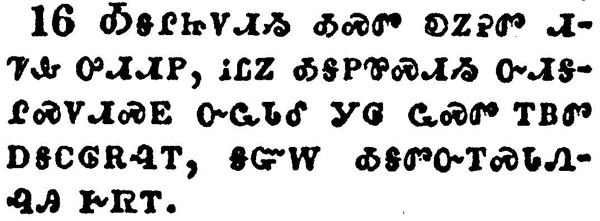</a></td>
</tr>
<tr class="even">
<td>To preach the gospel in the regions beyond you, and not to boast in another man's line of things made ready to our hand.</td>
</tr>
<tr class="odd">
<td>ᎣᎦᎵᏥᏙᏗᏱ ᎣᏍᏛ ᎧᏃᎮᏛ ᏗᏤᎲ ᎤᏗᏗᏢ, ᎥᏝᏃ ᎣᎦᏢᏈᏍᏗᏱ ᏅᏗᎦᎵᏍᏙᏗᏍᎬ ᏅᏩᏓᏕ ᎩᎶ ᏩᏍᏛ ᎢᏴᏛ ᎠᎦᏟᎶᎡᎸᎢ, ᎦᏳᎳ ᎣᎦᏛᏅᎢᏍᏓᏁᎸᎯ ᎨᏒᎢ.</td>
</tr>
<tr class="even">
<td>O-ga-li-tsi-do-di-yi o-s-dv ka-no-he-dv di-tse-hv u-di-di-tlv, v-tla-no o-ga-tlv-qui-s-di-yi nv-di-ga-li-s-do-di-s-gv nv-wa-da-de gi-lo wa-s-dv i-yv-dv a-ga-tli-lo-e-lv-i, ga-yu-la o-ga-dv-nv-i-s-da-ne-lv-hi ge-sv-i.</td>
</tr>
</tbody>
</table>

<table>
<tbody>
<tr class="odd">
<td><a href="081017.png">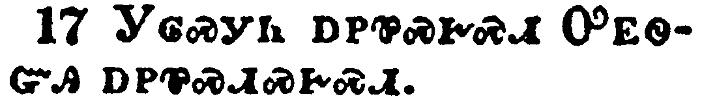</a></td>
</tr>
<tr class="even">
<td>But he that glorieth, let him glory in the Lord.</td>
</tr>
<tr class="odd">
<td>ᎩᎶᏍᎩᏂ ᎠᏢᏈᏍᎨᏍᏗ ᎤᎬᏫᏳᎯ ᎠᏢᏈᏍᏗᏍᎨᏍᏗ.</td>
</tr>
<tr class="even">
<td>Gi-lo-s-gi-ni a-tlv-qui-s-ge-s-di U-gv-wi-yu-hi a-tlv-qui-s-di-s-ge-s-di.</td>
</tr>
</tbody>
</table>

<table>
<tbody>
<tr class="odd">
<td><a href="081018.png">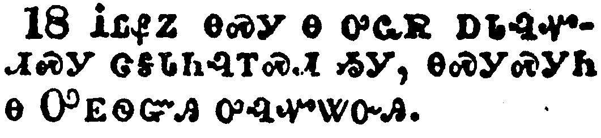</a></td>
</tr>
<tr class="even">
<td>For not he that commendeth himself is approved, but whom the Lord commendeth.</td>
</tr>
<tr class="odd">
<td>ᎥᏝᏰᏃ ᎾᏍᎩ Ꮎ ᎤᏩᏒ ᎠᏓᎸᏉᏗᏍᎩ ᏣᎦᏓᏂᎸᎢᏍᏗ ᏱᎩ, ᎾᏍᎩᏍᎩᏂ Ꮎ ᎤᎬᏫᏳᎯ ᎤᎸᏉᏔᏅᎯ.</td>
</tr>
<tr class="even">
<td>V-tla-ye-no na-s-gi na u-wa-sv a-da-lv-quo-di-s-gi tsa-ga-da-ni-lv-i-s-di yi-gi, na-s-gi-s-gi-ni na U-gv-wi-yu-hi u-lv-quo-ta-nv-hi.</td>
</tr>
</tbody>
</table>

