+++
draft=false
date = 2014-12-18T21:11:07Z
title = "2 Corinthians - Chapter 13 - Cherokee New Testament"
weight = 1418955067

[taxonomies]

authors = ["Timothy Legg"]
categories = []
tags = []

[extra]
+++

<table>
<tbody>
<tr class="odd">
<td><a href="081301.png">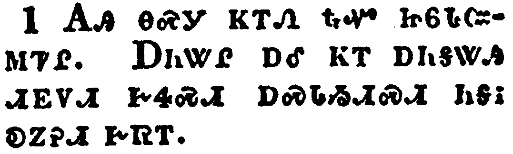</a></td>
</tr>
<tr class="even">
<td>This is the third time I am coming to you. In the mouth of two or three witnesses shall every word be established.</td>
</tr>
<tr class="odd">
<td>ᎪᎯ ᎾᏍᎩ ᏦᎢᏁ ᎿᎭᏉ ᏥᏮᏓᏨᎷᏤᎵ. ᎠᏂᏔᎵ ᎠᎴ ᏦᎢ ᎠᏂᎦᏔᎯ ᏗᎬᏙᏗ ᎨᏎᏍᏗ ᎠᏍᏓᏱᏗᏍᏗ ᏂᎦᎥ ᎧᏃᎮᏗ ᎨᏒᎢ.</td>
</tr>
<tr class="even">
<td>Go-hi na-s-gi tso-i-ne hna-quo tsi-wv-da-tsv-lu-tse-li. A-ni-ta-li a-le tso-i a-ni-ga-ta-hi di-gv-do-di ge-se-s-di a-s-da-yi-di-s-di ni-ga-v ka-no-he-di ge-sv-i.</td>
</tr>
</tbody>
</table>

<table>
<tbody>
<tr class="odd">
<td><a href="081302.png">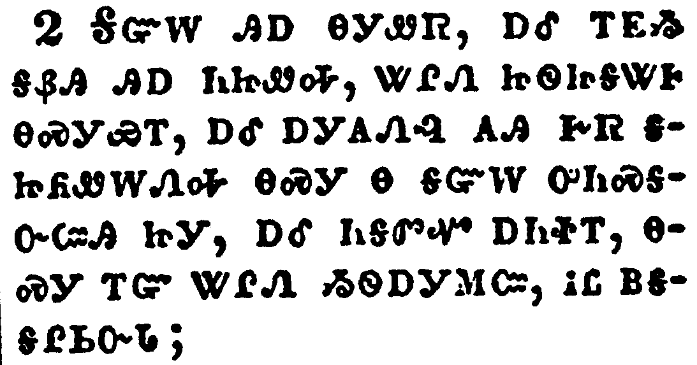</a></td>
</tr>
<tr class="even">
<td>I told you before, and foretell you, as if I were present, the second time; and being absent now I write to them which heretofore have sinned, and to all other, that, if I come again, I will not spare:</td>
</tr>
<tr class="odd">
<td>ᎦᏳᎳ ᎯᎠ ᎾᎩᏪᏒ, ᎠᎴ ᎢᎬᏱ ᎦᏰᎯ ᎯᎠ ᏂᏥᏪᎭ, ᏔᎵᏁ ᏥᏫᏥᎦᏔᎰ ᎾᏍᎩᏯᎢ, ᎠᎴ ᎠᎩᎪᏁᎸ ᎪᎯ ᎨᏒ ᎦᏥᏲᏪᎳᏁᎭ ᎾᏍᎩ Ꮎ ᎦᏳᎳ ᎤᏂᏍᎦᏅᏨᎯ ᏥᎩ, ᎠᎴ ᏂᎦᏛᏉ ᎠᏂᏐᎢ, ᎾᏍᎩ ᎢᏳ ᏔᎵᏁ ᏱᏫᎠᎩᎷᏨ, ᎥᏝ ᏴᎦᎦᎵᏏᏅᏓ;</td>
</tr>
<tr class="even">
<td>Ga-yu-la hi-a na-gi-we-sv, a-le i-gv-yi ga-ye-hi hi-a ni-tsi-we-ha, ta-li-ne tsi-wi-tsi-ga-ta-ho na-s-gi-ya-i, a-le a-gi-go-ne-lv go-hi ge-sv ga-tsi-yo-we-la-ne-ha na-s-gi na ga-yu-la u-ni-s-ga-nv-tsv-hi tsi-gi, a-le ni-ga-dv-quo a-ni-so-i, na-s-gi i-yu ta-li-ne yi-wi-a-gi-lu-tsv, v-tla yv-ga-ga-li-si-nv-da;</td>
</tr>
</tbody>
</table>

<table>
<tbody>
<tr class="odd">
<td><a href="081303.png">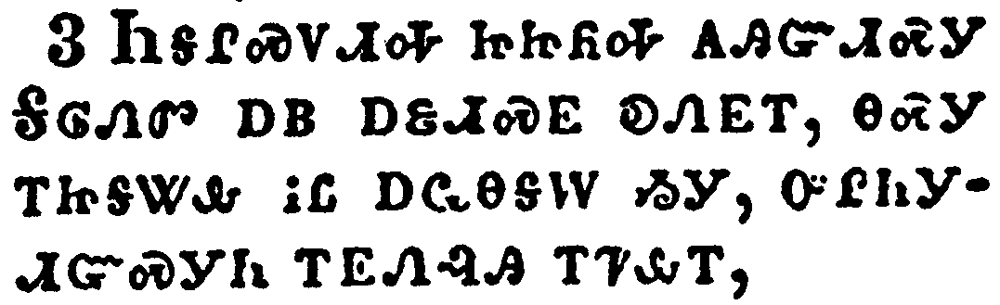</a></td>
</tr>
<tr class="even">
<td>Since ye seek a proof of Christ speaking in me, which to you-ward is not weak, but is mighty in you.</td>
</tr>
<tr class="odd">
<td>ᏂᎦᎵᏍᏙᏗᎭ ᏥᏥᏲᎭ ᎪᎯᏳᏗᏍᎩ ᎦᎶᏁᏛ ᎠᏴ ᎠᏋᏗᏍᎬ ᎧᏁᎬᎢ, ᎾᏍᎩ ᎢᏥᎦᏔᎲ ᎥᏝ ᎠᏩᎾᎦᎳ ᏱᎩ, ᎤᎵᏂᎩᏗᏳᏍᎩᏂ ᎢᎬᏁᎸᎯ ᎢᏤᎲᎢ,</td>
</tr>
<tr class="even">
<td>Ni-ga-li-s-do-di-ha tsi-tsi-yo-ha go-hi-yu-di-s-gi Ga-lo-ne-dv a-yv a-quv-di-s-gv ka-ne-gv-i, na-s-gi i-tsi-ga-ta-hv v-tla a-wa-na-ga-la yi-gi, u-li-ni-gi-di-yu-s-gi-ni i-gv-ne-lv-hi i-tse-hv-i,</td>
</tr>
</tbody>
</table>

<table>
<tbody>
<tr class="odd">
<td><a href="081304.png">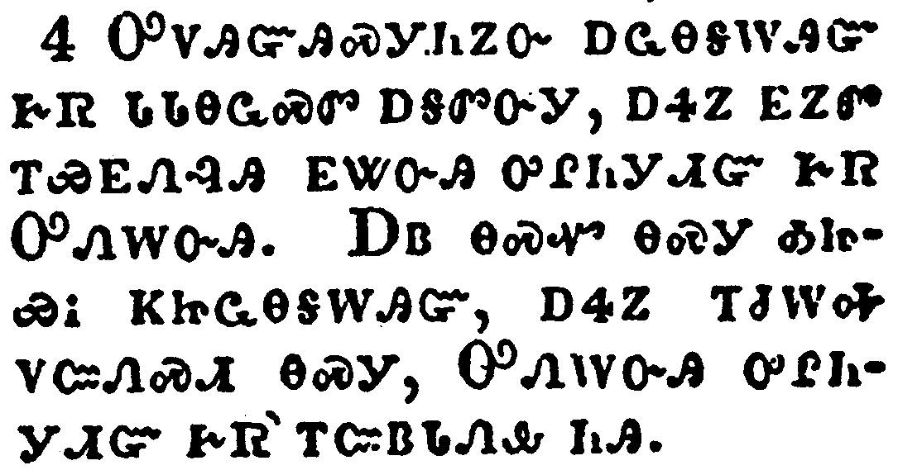</a></td>
</tr>
<tr class="even">
<td>For though he was crucified through weakness, yet he liveth by the power of God. For we also are weak in him, but we shall live with him by the power of God toward you.</td>
</tr>
<tr class="odd">
<td>ᎤᏙᎯᏳᎯᏍᎩᏂᏃᏅ ᎠᏩᎾᎦᎳᎯᏳ ᎨᏒ ᏓᏓᎾᏩᏍᏛ ᎠᎦᏛᏅᎩ, ᎠᏎᏃ ᎬᏃᏛ ᎢᏯᎬᏁᎸᎯ ᎬᏔᏅᎯ ᎤᎵᏂᎩᏗᏳ ᎨᏒ ᎤᏁᎳᏅᎯ. ᎠᏴ ᎾᏍᏉ ᎾᏍᎩ ᎣᏥᏯᎥ ᏦᏥᏩᎾᎦᎳᎯᏳ, ᎠᏎᏃ ᎢᏧᎳᎭ ᏙᏨᏁᏍᏗ ᎾᏍᎩ, ᎤᏁᎳᏅᎯ ᎤᎵᏂᎩᏗᏳ ᎨᏒ ᎢᏨᏴᏓᏁᎲ ᏂᎯ.</td>
</tr>
<tr class="even">
<td>U-do-hi-yu-hi-s-gi-ni-no-nv a-wa-na-ga-la-hi-yu ge-sv da-da-na-wa-s-dv a-ga-dv-nv-gi, a-se-no gv-no-dv i-ya-gv-ne-lv-hi gv-ta-nv-hi u-li-ni-gi-di-yu ge-sv U-ne-la-nv-hi. A-yv na-s-quo na-s-gi o-tsi-ya-v tso-tsi-wa-na-ga-la-hi-yu, a-se-no i-tsu-la-ha do-tsv-ne-s-di na-s-gi, U-ne-la-nv-hi u-li-ni-gi-di-yu ge-sv i-tsv-yv-da-ne-hv ni-hi.</td>
</tr>
</tbody>
</table>

<table>
<tbody>
<tr class="odd">
<td><a href="081305.png">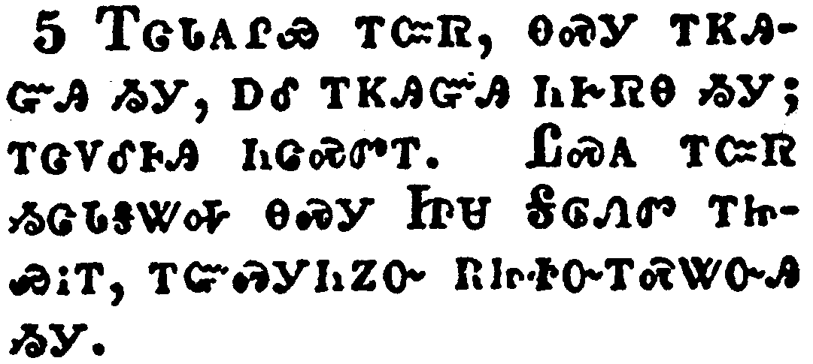</a></td>
</tr>
<tr class="even">
<td>Examine yourselves, whether ye be in the faith; prove your own selves. Know ye not your own selves, how that Jesus Christ is in you, except ye be reprobates?</td>
</tr>
<tr class="odd">
<td>ᎢᏣᏓᎪᎵᏯ ᎢᏨᏒ, ᎾᏍᎩ ᎢᏦᎯᏳᎯ ᏱᎩ, ᎠᎴ ᎢᏦᎯᏳᎯ ᏂᎨᏒᎾ ᏱᎩ; ᎢᏣᏙᎴᎰᎯ ᏂᏣᏍᏛᎢ. ᏝᏍᎪ ᎢᏨᏒ ᏱᏣᏓᎦᏔᎭ ᎾᏍᎩ ᏥᏌ ᎦᎶᏁᏛ ᎢᏥᏯᎥᎢ, ᎢᏳᏍᎩᏂᏃᏅ ᎡᏥᏐᏅᎢᏍᏔᏅᎯ ᏱᎩ.</td>
</tr>
<tr class="even">
<td>I-tsa-da-go-li-ya i-tsv-sv, na-s-gi i-tso-hi-yu-hi yi-gi, a-le i-tso-hi-yu-hi ni-ge-sv-na yi-gi; i-tsa-do-le-ho-hi ni-tsa-s-dv-i. Tla-s-go i-tsv-sv yi-tsa-da-ga-ta-ha na-s-gi Tsi-sa Ga-lo-ne-dv i-tsi-ya-v-i, i-yu-s-gi-ni-no-nv e-tsi-so-nv-i-s-ta-nv-hi yi-gi.</td>
</tr>
</tbody>
</table>

<table>
<tbody>
<tr class="odd">
<td><a href="081306.png">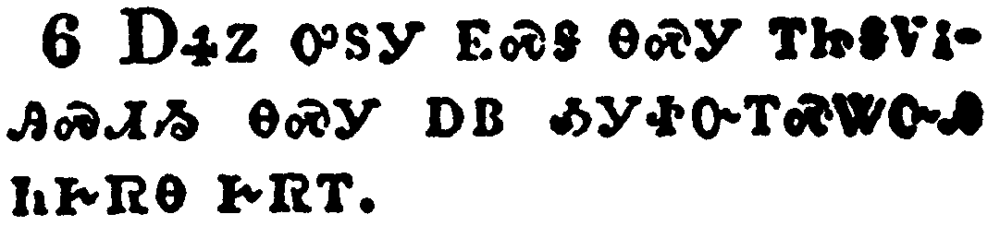</a></td>
</tr>
<tr class="even">
<td>But I trust that ye shall know that we are not reprobates.</td>
</tr>
<tr class="odd">
<td>ᎠᏎᏃ ᎤᏚᎩ ᎬᏍᎦ ᎾᏍᎩ ᎢᏥᎦᏙᎥᎯᏍᏗᏱ ᎾᏍᎩ ᎠᏴ ᎣᎩᏐᏅᎢᏍᏔᏅᎯ ᏂᎨᏒᎾ ᎨᏒᎢ.</td>
</tr>
<tr class="even">
<td>A-se-no u-du-gi gv-s-ga na-s-gi i-tsi-ga-do-v-hi-s-di-yi na-s-gi a-yv o-gi-so-nv-i-s-ta-nv-hi ni-ge-sv-na ge-sv-i.</td>
</tr>
</tbody>
</table>

<table>
<tbody>
<tr class="odd">
<td><a href="081307.png">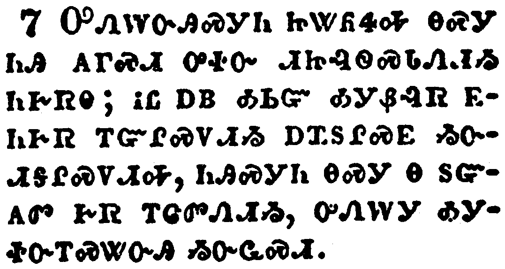</a></td>
</tr>
<tr class="even">
<td>Now I pray to God that ye do no evil; not that we should appear approved, but that ye should do that which is honest, though we be as reprobates.</td>
</tr>
<tr class="odd">
<td>ᎤᏁᎳᏅᎯᏍᎩᏂ ᏥᏔᏲᏎᎭ ᎾᏍᎩ ᏂᎯ ᎪᎱᏍᏗ ᎤᏐᏅ ᏗᏥᎸᏫᏍᏓᏁᏗᏱ ᏂᎨᏒᎾ; ᎥᏝ ᎠᏴ ᎣᏏᏳ ᎣᎩᏰᎸᏒ ᎬᏂᎨᏒ ᎢᏳᎵᏍᏙᏗᏱ ᎠᏆᏚᎵᏍᎬ ᏱᏅᏗᎦᎵᏍᏙᏗᎭ, ᏂᎯᏍᎩᏂ ᎾᏍᎩ Ꮎ ᏚᏳᎪᏛ ᎨᏒ ᎢᏣᏛᏁᏗᏱ, ᎤᏁᎳᎩ ᎣᎩᏐᏅᎢᏍᏔᏅᎯ ᏱᏅᏩᏍᏗ.</td>
</tr>
<tr class="even">
<td>U-ne-la-nv-hi-s-gi-ni tsi-ta-yo-se-ha na-s-gi ni-hi go-hu-s-di u-so-nv di-tsi-lv-wi-s-da-ne-di-yi ni-ge-sv-na; v-tla a-yv o-si-yu o-gi-ye-lv-sv gv-ni-ge-sv i-yu-li-s-do-di-yi a-qua-du-li-s-gv yi-nv-di-ga-li-s-do-di-ha, ni-hi-s-gi-ni na-s-gi na du-yu-go-dv ge-sv i-tsa-dv-ne-di-yi, u-ne-la-gi o-gi-so-nv-i-s-ta-nv-hi yi-nv-wa-s-di.</td>
</tr>
</tbody>
</table>

<table>
<tbody>
<tr class="odd">
<td></td>
</tr>
<tr class="even">
<td>For we can do nothing against the truth, but for the truth.</td>
</tr>
<tr class="odd">
<td>ᎥᏝᏰᏃ ᏰᎵ ᏴᎦᏲᏣᏡᏓ ᎤᏙᎯᏳᎯ ᎨᏒᎢ, ᏲᏥᏍᏕᎸᏍᎩᏂ ᎤᏙᎯᏳᎯ ᎨᏒᎢ.</td>
</tr>
<tr class="even">
<td>V-tla-ye-no ye-li yv-ga-yo-tsa-tlu-da u-do-hi-yu-hi ge-sv-i, yo-tsi-s-de-lv-s-gi-ni u-do-hi-yu-hi ge-sv-i.</td>
</tr>
</tbody>
</table>

<table>
<tbody>
<tr class="odd">
<td></td>
</tr>
<tr class="even">
<td>For we are glad, when we are weak, and ye are strong: and this also we wish, even your perfection.</td>
</tr>
<tr class="odd">
<td>ᎣᏏᏳᏰᏃ ᎣᎩᏰᎸᎭ ᏦᏥᏩᎾᎦᎳ ᏥᎨᏐᎢ, ᏂᎯᏃ ᏥᏕᏣᎵᏂᎬᎪᎢ; ᎯᎠᏃ ᎾᏍᏉ ᎣᎦᏚᎵᎭ, ᎾᏍᎩ ᏂᏥᎪᎸᎾ ᎢᏣᎵᏍᏙᏗᏱ.</td>
</tr>
<tr class="even">
<td>O-si-yu-ye-no o-gi-ye-lv-ha tso-tsi-wa-na-ga-la tsi-ge-so-i, ni-hi-no tsi-de-tsa-li-ni-gv-go-i; hi-a-no na-s-quo o-ga-du-li-ha, na-s-gi ni-tsi-go-lv-na i-tsa-li-s-do-di-yi.</td>
</tr>
</tbody>
</table>

<table>
<tbody>
<tr class="odd">
<td><a href="081310.png">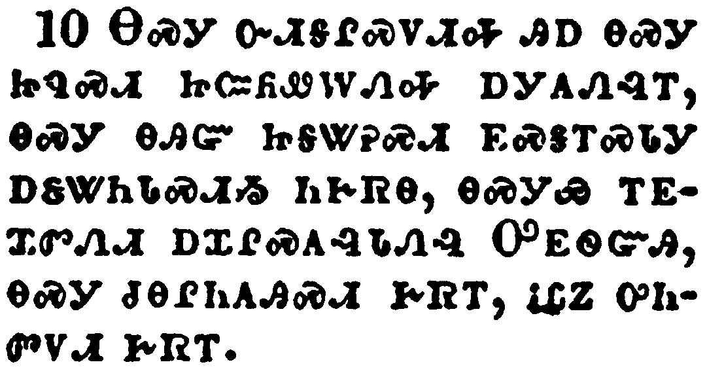</a></td>
</tr>
<tr class="even">
<td>Therefore I write these things being absent, lest being present I should use sharpness, according to the power which the Lord hath given me to edification, and not to destruction.</td>
</tr>
<tr class="odd">
<td>ᎾᏍᎩ ᏅᏗᎦᎵᏍᏙᏗᎭ ᎯᎠ ᎾᏍᎩ ᏥᏄᏍᏗ ᏥᏨᏲᏪᎳᏁᎭ ᎠᎩᎪᏁᎸᎢ, ᎾᏍᎩ ᎾᎯᏳ ᏥᎦᏔᎮᏍᏗ ᎬᏍᎦᎢᏍᏓᎩ ᎠᏋᏔᏂᏓᏍᏗᏱ ᏂᎨᏒᎾ, ᎾᏍᎩᏯ ᎢᎬᏆᏛᏁᏗ ᎠᏆᎵᏍᎪᎸᏓᏁᎸ ᎤᎬᏫᏳᎯ, ᎾᏍᎩ ᏧᎾᎵᏂᎪᎯᏍᏗ ᎨᏒᎢ, ᎥᏝᏃ ᎤᏂᏛᏙᏗ ᎨᏒᎢ.</td>
</tr>
<tr class="even">
<td>Na-s-gi nv-di-ga-li-s-do-di-ha hi-a na-s-gi tsi-nu-s-di tsi-tsv-yo-we-la-ne-ha a-gi-go-ne-lv-i, na-s-gi na-hi-yu tsi-ga-ta-he-s-di gv-s-ga-i-s-da-gi a-quv-ta-ni-da-s-di-yi ni-ge-sv-na, na-s-gi-ya i-gv-qua-dv-ne-di a-qua-li-s-go-lv-da-ne-lv U-gv-wi-yu-hi, na-s-gi tsu-na-li-ni-go-hi-s-di ge-sv-i, v-tla-no u-ni-dv-do-di ge-sv-i.</td>
</tr>
</tbody>
</table>

<table>
<tbody>
<tr class="odd">
<td><a href="081311.png">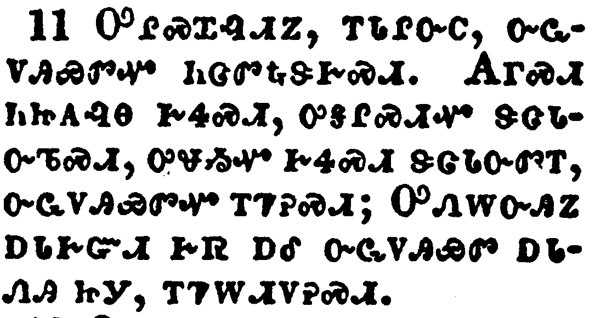</a></td>
</tr>
<tr class="even">
<td>Finally, brethren, farewell. Be perfect, be of good comfort, be of one mind, live in peace; and the God of love and peace shall be with you.</td>
</tr>
<tr class="odd">
<td>ᎤᎵᏍᏆᎸᏗᏃ, ᎢᏓᎵᏅᏟ, ᏅᏩᏙᎯᏯᏛᏉ ᏂᏣᏛᎿᎭᏕᎨᏍᏗ. ᎪᎱᏍᏗ ᏂᏥᎪᎸᎾ ᎨᏎᏍᏗ, ᎤᎦᎵᏍᏗᏉ ᏕᏣᏓᏅᏖᏍᏗ, ᎤᏠᏱᏉ ᎨᏎᏍᏗ ᏕᏣᏓᏅᏛᎢ, ᏅᏩᏙᎯᏯᏛᏉ ᎢᏤᎮᏍᏗ; ᎤᏁᎳᏅᎯᏃ ᎠᏓᎨᏳᏗ ᎨᏒ ᎠᎴ ᏅᏩᏙᎯᏯᏛ ᎠᏓᏁᎯ ᏥᎩ, ᎢᏤᎳᏗᏙᎮᏍᏗ.</td>
</tr>
<tr class="even">
<td>U-li-s-qua-lv-di-no, i-da-li-nv-tli, nv-wa-do-hi-ya-dv-quo ni-tsa-dv-hna-de-ge-s-di. Go-hu-s-di ni-tsi-go-lv-na ge-se-s-di, u-ga-li-s-di-quo de-tsa-da-nv-te-s-di, u-tlo-yi-quo ge-se-s-di de-tsa-da-nv-dv-i, nv-wa-do-hi-ya-dv-quo i-tse-he-s-di; U-ne-la-nv-hi-no a-da-ge-yu-di ge-sv a-le nv-wa-do-hi-ya-dv a-da-ne-hi tsi-gi, i-tse-la-di-do-he-s-di.</td>
</tr>
</tbody>
</table>

<table>
<tbody>
<tr class="odd">
<td><a href="081312.png">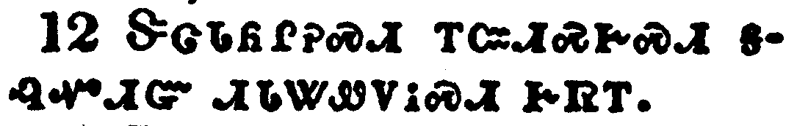</a></td>
</tr>
<tr class="even">
<td>Greet one another with an holy kiss.</td>
</tr>
<tr class="odd">
<td>ᏕᏣᏓᏲᎵᎮᏍᏗ ᎢᏨᏗᏍᎨᏍᏗ ᎦᎸᏉᏗᏳ ᏗᏓᏔᏪᏙᎥᏍᏗ ᎨᏒᎢ.</td>
</tr>
<tr class="even">
<td>De-tsa-da-yo-li-he-s-di i-tsv-di-s-ge-s-di ga-lv-quo-di-yu di-da-ta-we-do-v-s-di ge-sv-i.</td>
</tr>
</tbody>
</table>

<table>
<tbody>
<tr class="odd">
<td></td>
</tr>
<tr class="even">
<td>All the saints salute you.</td>
</tr>
<tr class="odd">
<td>ᏂᎦᏛ ᎤᎾᏓᏅᏘ ᏫᎨᏥᏲᎵᎭ.</td>
</tr>
<tr class="even">
<td>Ni-ga-dv u-na-da-nv-ti wi-ge-tsi-yo-li-ha.</td>
</tr>
</tbody>
</table>

<table>
<tbody>
<tr class="odd">
<td><a href="081314.png">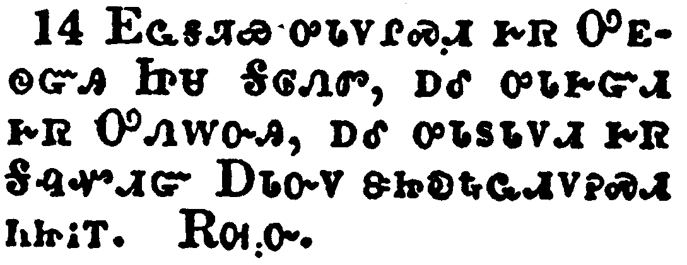</a></td>
</tr>
<tr class="even">
<td>The grace of the Lord Jesus Christ, and the love of God, and the communion of the Holy Ghost, be with you all. Amen.</td>
</tr>
<tr class="odd">
<td>ᎬᏩᎦᏘᏯ ᎤᏓᏙᎵᏍᏗ ᎨᏒ ᎤᎬᏫᏳᎯ ᏥᏌ ᎦᎶᏁᏛ, ᎠᎴ ᎤᏓᎨᏳᏗ ᎨᏒ ᎤᏁᎳᏅᎯ, ᎠᎴ ᎤᏓᏚᏓᏙᏗ ᎨᏒ ᎦᎸᏉᏗᏳ ᎠᏓᏅᏙ ᏕᏥᎧᎿᎭᏩᏗᏙᎮᏍᏗ ᏂᏥᎥᎢ. ᎡᎺᏅ.</td>
</tr>
<tr class="even">
<td>Gv-wa-ga-ti-ya u-da-do-li-s-di ge-sv U-gv-wi-yu-hi Tsi-sa Ga-lo-ne-dv, a-le u-da-ge-yu-di ge-sv U-ne-la-nv-hi, a-le u-da-du-da-do-di ge-sv Ga-lv-quo-di-yu A-da-nv-do de-tsi-ka-hna-wa-di-do-he-s-di ni-tsi-v-i. E-me-nv.</td>
</tr>
</tbody>
</table>

