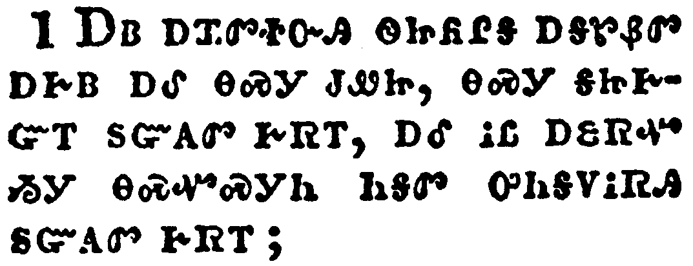
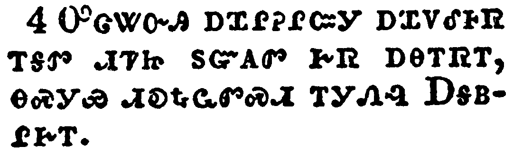
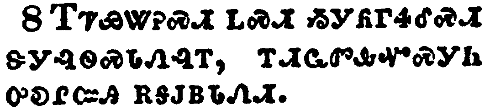

+++
draft=false
date = 2014-12-18T21:11:07Z
title = "2 John - Chapter 1 - Cherokee New Testament"
weight = 1418955067

[taxonomies]

authors = ["Timothy Legg"]
categories = []
tags = []

[extra]
+++

<table>
<tbody>
<tr class="odd">
<td></td>
</tr>
<tr class="even">
<td>The elder unto the elect lady and her children, whom I love in the truth; and not I only, but also all they that have known the truth;</td>
</tr>
<tr class="odd">
<td>ᎠᏴ ᎠᏆᏛᏐᏅᎯ ᏫᏥᏲᎵᎦ ᎠᎦᏑᏰᏛ ᎠᎨᏴ ᎠᎴ ᎾᏍᎩ ᏧᏪᏥ, ᎾᏍᎩ ᎦᏥᎨᏳᎢ ᏚᏳᎪᏛ ᎨᏒᎢ, ᎠᎴ ᎥᏝ ᎠᏋᏒᏉ ᏱᎩ ᎾᏍᏉᏍᎩᏂ ᏂᎦᏛ ᎤᏂᎦᏙᎥᏒᎯ ᏚᏳᎪᏛ ᎨᏒᎢ;</td>
</tr>
<tr class="even">
<td>A-yv a-qua-dv-so-nv-hi wi-tsi-yo-li-ga a-ga-su-ye-dv a-ge-yv a-le na-s-gi tsu-we-tsi, na-s-gi ga-tsi-ge-yu-i du-yu-go-dv ge-sv-i, a-le v-tla a-quv-sv-quo yi-gi na-s-quo-s-gi-ni ni-ga-dv u-ni-ga-do-v-sv-hi du-yu-go-dv ge-sv-i;</td>
</tr>
</tbody>
</table>

<table>
<tbody>
<tr class="odd">
<td></td>
</tr>
<tr class="even">
<td>For the truth's sake, which dwelleth in us, and shall be with us for ever.</td>
</tr>
<tr class="odd">
<td>ᏅᏗᎦᎵᏍᏙᏗᎭ ᎾᏍᎩ ᏚᏳᎪᏛ ᎨᏒ ᏥᎩᏯᎠ, ᎠᎴ ᎾᏍᎩ ᎠᏎ ᏥᎨᎳᏗᏙᎮᏍᏗ ᏂᎪᎯᎸᎢ.</td>
</tr>
<tr class="even">
<td>Nv-di-ga-li-s-do-di-ha na-s-gi du-yu-go-dv ge-sv tsi-gi-ya-a, a-le na-s-gi a-se tsi-ge-la-di-do-he-s-di ni-go-hi-lv-i.</td>
</tr>
</tbody>
</table>

<table>
<tbody>
<tr class="odd">
<td></td>
</tr>
<tr class="even">
<td>Grace be with you, mercy, and peace, from God the Father, and from the Lord Jesus Christ, the Son of the Father, in truth and love.</td>
</tr>
<tr class="odd">
<td>ᎬᏩᎦᏗᏯ ᎤᏓᏙᎵᏍᏗ ᎨᏒᎢ ᎢᏤᎳᏗᏙᎮᏍᏗ ᎠᎴ ᎤᏓᏙᎵᏍᏗ ᎨᏒᎢ ᎠᎴ ᏅᏩᏙᎯᏯᏛ ᎨᏒᎢ, ᏅᏓᏳᎾᎵᏍᎪᎸᏔᏅᎯ ᎤᏁᎳᏅᎯ ᎠᎦᏴᎵᎨᎢ ᎠᎴ ᎤᎬᏫᏳᎯ ᏥᏌ ᎦᎶᏁᏛ ᎠᎦᏴᎵᎨ ᎤᏪᏥ, ᏚᏳᎪᏛ ᎨᏒᎢ ᎠᎴ ᎠᏓᎨᏳᏗ ᎨᏒᎢ.</td>
</tr>
<tr class="even">
<td>Gv-wa-ga-di-ya u-da-do-li-s-di ge-sv-i i-tse-la-di-do-he-s-di a-le u-da-do-li-s-di ge-sv-i a-le nv-wa-do-hi-ya-dv ge-sv-i, nv-da-yu-na-li-s-go-lv-ta-nv-hi U-ne-la-nv-hi A-ga-yv-li-ge-i a-le U-gv-wi-yu-hi Tsi-sa Ga-lo-ne-dv A-ga-yv-li-ge U-we-tsi, du-yu-go-dv ge-sv-i a-le a-da-ge-yu-di ge-sv-i.</td>
</tr>
</tbody>
</table>

<table>
<tbody>
<tr class="odd">
<td></td>
</tr>
<tr class="even">
<td>I rejoiced greatly that I found of thy children walking in truth, as we have received a commandment from the Father.</td>
</tr>
<tr class="odd">
<td>ᎤᏣᏔᏅᎯ ᎠᏆᎵᎮᎵᏨᎩ ᎠᏆᏙᎴᎰᏒ ᎢᎦᏛ ᏗᏤᏥ ᏚᏳᎪᏛ ᎨᏒ ᎠᎾᎢᏒᎢ, ᎾᏍᎩᏯ ᏗᎧᎿᎭᏩᏛᏍᏗ ᎢᎩᏁᎸ ᎠᎦᏴᎵᎨᎢ.</td>
</tr>
<tr class="even">
<td>U-tsa-ta-nv-hi a-qua-li-he-li-tsv-gi a-qua-do-le-ho-sv i-ga-dv di-tse-tsi du-yu-go-dv ge-sv a-na-i-sv-i, na-s-gi-ya di-ka-hna-wa-dv-s-di i-gi-ne-lv A-ga-yv-li-ge-i.</td>
</tr>
</tbody>
</table>

<table>
<tbody>
<tr class="odd">
<td></td>
</tr>
<tr class="even">
<td>And now I beseech thee, lady, not as though I wrote a new commandment unto thee, but that which we had from the beginning, that we love one another.</td>
</tr>
<tr class="odd">
<td>ᎿᎭᏉᏃ ᎬᏔᏲᏎᎭ ᎯᎨᏴ, ᏗᎦᎵᎨᏳᎯ ᎢᏳᎵᏍᏙᏗᏱ; ᎥᏝ ᎠᏗᎾ ᎢᏤ ᏗᎧᎿᎭᏩᏛᏍᏗ ᏥᎬᏲᏪᎳᏁᎰ ᎢᏳᏍᏗ ᏱᎩ, ᎾᏍᎩᏉᏍᎩᏂ ᏥᏁᎩᎰᎢ, ᏗᎦᏓᎨᏳᎯ ᎢᏳᎵᏍᏙᏗᏱ.</td>
</tr>
<tr class="even">
<td>Hna-quo-no gv-ta-yo-se-ha hi-ge-yv, di-ga-li-ge-yu-hi i-yu-li-s-do-di-yi; v-tla a-di-na i-tse di-ka-hna-wa-dv-s-di tsi-gv-yo-we-la-ne-ho i-yu-s-di yi-gi, na-s-gi-quo-s-gi-ni tsi-ne-gi-ho-i, di-ga-da-ge-yu-hi i-yu-li-s-do-di-yi.</td>
</tr>
</tbody>
</table>

<table>
<tbody>
<tr class="odd">
<td></td>
</tr>
<tr class="even">
<td>And this is love, that we walk after his commandments. This is the commandment, That, as ye have heard from the beginning, ye should walk in it.</td>
</tr>
<tr class="odd">
<td>ᎠᎴ ᎾᏍᎩ ᎯᎠ ᏄᏍᏗ ᎠᏓᎨᏳᏗ ᎨᏒᎢ, ᎾᏍᎩ ᎢᎨᏓᏍᏗᏱ ᎾᏍᎩᏯ ᏗᎧᎿᎭᏩᏛᏍᏗ ᎤᏤᎵᎦ ᏂᎦᏪᏍᎬᎢ. ᎾᏍᎩ ᎯᎠ ᏗᎧᎿᎭᏩᏛᏍᏗ ᏗᏓᎴᏂᏍᎬ ᏅᏓᎬᏩᏓᎴᏅᏛ ᏥᏁᏣᏛᎩᏍᎪᎢ, ᎾᏍᎩ ᏗᏥᎧᎿᎭᏩᏛᏍᏗᏱ.</td>
</tr>
<tr class="even">
<td>A-le na-s-gi hi-a nu-s-di a-da-ge-yu-di ge-sv-i, na-s-gi i-ge-da-s-di-yi na-s-gi-ya di-ka-hna-wa-dv-s-di u-tse-li-ga ni-ga-we-s-gv-i. Na-s-gi hi-a di-ka-hna-wa-dv-s-di di-da-le-ni-s-gv nv-da-gv-wa-da-le-nv-dv tsi-ne-tsa-dv-gi-s-go-i, na-s-gi di-tsi-ka-hna-wa-dv-s-di-yi.</td>
</tr>
</tbody>
</table>

<table>
<tbody>
<tr class="odd">
<td></td>
</tr>
<tr class="even">
<td>For many deceivers are entered into the world, who confess not that Jesus Christ is come in the flesh. This is a deceiver and an antichrist.</td>
</tr>
<tr class="odd">
<td>ᎤᏂᏣᏔᏰᏃ ᎤᏠᎾᏍᏗ ᎠᏁᏙᎭ ᎡᎶᎯ, ᎾᏍᎩ ᎠᏃᎯᏳᎲᏍᎩ ᏂᎨᏒᎾ ᏥᏌ ᎦᎶᏁᏛ ᎤᏇᏓᎵ ᎤᎾᏄᎪᏥᎸᎢ; ᎾᏍᎩ ᎯᎠ ᎤᏠᎾᏍᏗ ᎠᎴ ᎦᎶᏁᏛᎠᏡᏗᏍᎩ.</td>
</tr>
<tr class="even">
<td>U-ni-tsa-ta-ye-no u-tlo-na-s-di a-ne-do-ha e-lo-hi, na-s-gi a-no-hi-yu-hv-s-gi ni-ge-sv-na Tsi-sa Ga-lo-ne-dv u-que-da-li u-na-nu-go-tsi-lv-i; na-s-gi hi-a u-tlo-na-s-di a-le ga-lo-ne-dv-a-tlu-di-s-gi.</td>
</tr>
</tbody>
</table>

<table>
<tbody>
<tr class="odd">
<td></td>
</tr>
<tr class="even">
<td>Look to yourselves, that we lose not those things which we have wrought, but that we receive a full reward.</td>
</tr>
<tr class="odd">
<td>ᎢᏤᏯᏔᎮᏍᏗ ᏞᏍᏗ ᏱᎩᏲᎱᏎᎴᏍᏗ ᏕᎩᎸᏫᏍᏓᏁᎸᎢ, ᎢᏗᏩᏛᎲᏉᏍᎩᏂ ᎤᎧᎵᏨᎯ ᎡᎦᎫᏴᏓᏁᏗ.</td>
</tr>
<tr class="even">
<td>I-tse-ya-ta-he-s-di tle-s-di yi-gi-yo-hu-se-le-s-di de-gi-lv-wi-s-da-ne-lv-i, i-di-wa-dv-hv-quo-s-gi-ni u-ka-li-tsv-hi e-ga-gu-yv-da-ne-di.</td>
</tr>
</tbody>
</table>

<table>
<tbody>
<tr class="odd">
<td></td>
</tr>
<tr class="even">
<td>Whosoever transgresseth, and abideth not in the doctrine of Christ, hath not God. He that abideth in the doctrine of Christ, he hath both the Father and the Son.</td>
</tr>
<tr class="odd">
<td>ᎩᎶ ᏣᏍᎦᏅᎪᎢ ᎠᎴ ᏂᏓᎧᎿᎭᏩᏕᎬᎾ ᏥᎨᏐ ᎦᎶᏁᏛ ᏧᏕᏲᏅᎯ, ᎾᏍᎩ ᎥᏝ ᎤᏁᎳᏅᎢ ᏳᏪᎰᎢ. ᎾᏑᎵᎪᎬᎾᏍᎩᏂ Ꮎ ᏓᎧᎾᏩᏗᏒ ᏗᎧᎿᎭᏩᏕᎩ ᎦᎶᏁᏛ ᏧᏕᏲᏅᎯ, ᎾᏍᎩ ᏚᏪᎭ ᎢᏧᎳ ᎠᎦᏴᎵᎨ ᎠᎴ ᎤᏪᏥ.</td>
</tr>
<tr class="even">
<td>gi-lo tsa-s-ga-nv-go-i a-le ni-da-ka-hna-wa-de-gv-na tsi-ge-so ga-lo-ne-dv tsu-de-yo-nv-hi, na-s-gi v-tla u-ne-la-nv-i yu-we-ho-i. na-su-li-go-gv-na-s-gi-ni na da-ka-na-wa-di-sv di-ka-hna-wa-de-gi ga-lo-ne-dv tsu-de-yo-nv-hi, na-s-gi du-we-ha i-tsu-la a-ga-yv-li-ge a-le u-we-tsi.</td>
</tr>
</tbody>
</table>

<table>
<tbody>
<tr class="odd">
<td></td>
</tr>
<tr class="even">
<td>If there come any unto you, and bring not this doctrine, receive him not into your house, neither bid him God speed:</td>
</tr>
<tr class="odd">
<td>ᎢᏳᏃ ᎩᎶ ᏱᏥᎷᏤᎸ ᎠᎴ ᏄᏲᎸᎾ ᏱᎩ ᎯᎠ ᎾᏍᎩ ᏗᏕᏲᏗ ᎨᏒᎢ, ᏞᏍᏗ ᏕᏥᏁᎸ ᏱᏕᏣᎵᏂᎸᏤᏍᏗ, ᎠᎴ ᏞᏍᏗ ᏰᏥᏲᎵᎴᏍᏗ;</td>
</tr>
<tr class="even">
<td>I-yu-no gi-lo yi-tsi-lu-tse-lv a-le nu-yo-lv-na yi-gi hi-a na-s-gi di-de-yo-di ge-sv-i, tle-s-di de-tsi-ne-lv yi-de-tsa-li-ni-lv-tse-s-di, a-le tle-s-di ye-tsi-yo-li-le-s-di;</td>
</tr>
</tbody>
</table>

<table>
<tbody>
<tr class="odd">
<td></td>
</tr>
<tr class="even">
<td>For he that biddeth him God speed is partaker of his evil deeds.</td>
</tr>
<tr class="odd">
<td>ᎾᏍᎩᏰᏃ Ꮎ ᎠᏲᎵᎯ ᎤᏪᎳᏗᏍᏗᎭ ᎤᏲ ᏚᎸᏫᏍᏓᏁᎲᎢ.</td>
</tr>
<tr class="even">
<td>Na-s-gi-ye-no na a-yo-li-hi u-we-la-di-s-di-ha u-yo du-lv-wi-s-da-ne-hv-i.</td>
</tr>
</tbody>
</table>

<table>
<tbody>
<tr class="odd">
<td></td>
</tr>
<tr class="even">
<td>Having many things to write unto you, I would not write with paper and ink: but I trust to come unto you, and speak face to face, that our joy may be full.</td>
</tr>
<tr class="odd">
<td>ᎤᏣᏛᎩ ᎢᏳᏓᎴᎩ ᎢᏨᏲᏪᎳᏁᏗ ᎠᎩᎲᎩ, ᎠᏎᏃ ᎥᏝ ᎪᏪᎵᏉ ᎠᎴ ᏗᎪᏪᎶᏗ ᏗᎬᏙᏗ ᏯᎩᏰᎸᏎᎢ, ᎤᏚᎩᏰᏃ ᎠᏋᎭ ᎢᏨᏩᏛᎲᏍᏗᏱ, ᎠᎴ ᏗᏗᎰᎵ ᏗᎬᏙᏗᏱ ᎢᎦᎵᏃᎮᏗᏱ, ᎠᎴ ᎢᏓᎵᎮᎵᎬ ᎤᎧᎵᎢᏍᏗᏱ.</td>
</tr>
<tr class="even">
<td>U-tsa-dv-gi i-yu-da-le-gi i-tsv-yo-we-la-ne-di a-gi-hv-gi, a-se-no v-tla go-we-li-quo a-le di-go-we-lo-di di-gv-do-di ya-gi-ye-lv-se-i, u-du-gi-ye-no a-quv-ha i-tsv-wa-dv-hv-s-di-yi, a-le di-di-ho-li di-gv-do-di-yi i-ga-li-no-he-di-yi, a-le i-da-li-he-li-gv u-ka-li-i-s-di-yi.</td>
</tr>
</tbody>
</table>

<table>
<tbody>
<tr class="odd">
<td></td>
</tr>
<tr class="even">
<td>The children of thy elect sister greet thee. Amen.</td>
</tr>
<tr class="odd">
<td>ᎠᎦᏑᏴᏛ ᎡᏣᎸᎢ ᏧᏪᏥ ᏫᎨᏣᏲᎵᎭ. ᎡᎺᏅ.</td>
</tr>
<tr class="even">
<td>A-ga-su-yv-dv e-tsa-lv-i tsu-we-tsi wi-ge-tsa-yo-li-ha. E-me-nv.</td>
</tr>
</tbody>
</table>

