+++
draft=false
date = 2014-12-18T21:11:07Z
title = "2 Thessalonians - Chapter 3 - Cherokee New Testament"
weight = 1418955067

[taxonomies]

authors = ["Timothy Legg"]
categories = []
tags = []

[extra]
+++
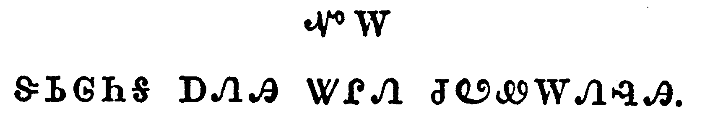

<table>
<tbody>
<tr class="odd">
<td><a href="140301.png">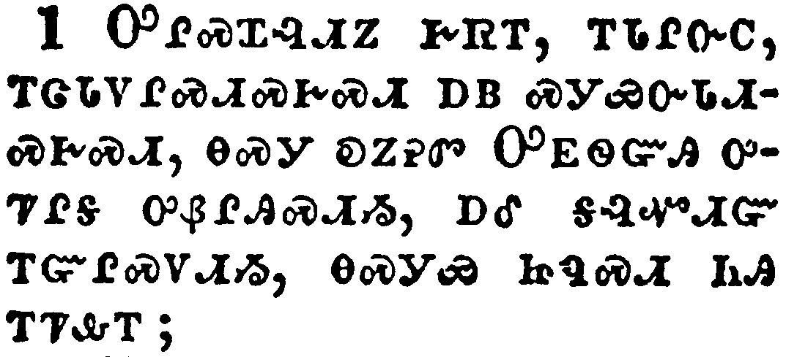</a></td>
</tr>
<tr class="even">
<td>Finally, brethren, pray for us, that the word of the Lord may have free course, and be glorified, even as it is with you:</td>
</tr>
<tr class="odd">
<td>ᎤᎵᏍᏆᎸᏗᏃ ᎨᏒᎢ, ᎢᏓᎵᏅᏟ, ᎢᏣᏓᏙᎵᏍᏗᏍᎨᏍᏗ ᎠᏴ ᏍᎩᏯᏅᏓᏗᏍᎨᏍᏗ, ᎾᏍᎩ ᎧᏃᎮᏛ ᎤᎬᏫᏳᎯ ᎤᏤᎵᎦ ᎤᏰᎵᎯᏍᏗᏱ, ᎠᎴ ᎦᎸᏉᏗᏳ ᎢᏳᎵᏍᏙᏗᏱ, ᎾᏍᎩᏯ ᏥᏄᏍᏗ ᏂᎯ ᎢᏤᎲᎢ;</td>
</tr>
<tr class="even">
<td>U-li-s-qua-lv-di-no ge-sv-i, i-da-li-nv-tli, i-tsa-da-do-li-s-di-s-ge-s-di a-yv s-gi-ya-nv-da-di-s-ge-s-di, na-s-gi ka-no-he-dv U-gv-wi-yu-hi u-tse-li-ga u-ye-li-hi-s-di-yi, a-le ga-lv-quo-di-yu i-yu-li-s-do-di-yi, na-s-gi-ya tsi-nu-s-di ni-hi i-tse-hv-i;</td>
</tr>
</tbody>
</table>

<table>
<tbody>
<tr class="odd">
<td><a href="140302.png">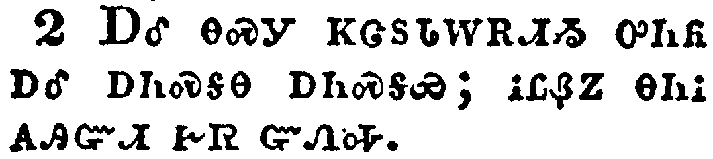</a></td>
</tr>
<tr class="even">
<td>And that we may be delivered from unreasonable and wicked men: for all men have not faith.</td>
</tr>
<tr class="odd">
<td>ᎠᎴ ᎾᏍᎩ ᏦᏣᏚᏓᎳᎡᏗᏱ ᎤᏂᏲ ᎠᎴ ᎠᏂᏍᎦᎾ ᎠᏂᏍᎦᏯ; ᎥᏝᏰᏃ ᎾᏂᎥ ᎪᎯᏳᏗ ᎨᏒ ᏳᏁᎭ.</td>
</tr>
<tr class="even">
<td>A-le na-s-gi tso-tsa-du-da-la-e-di-yi u-ni-yo a-le a-ni-s-ga-na a-ni-s-ga-ya; v-tla-ye-no na-ni-v go-hi-yu-di ge-sv yu-ne-ha.</td>
</tr>
</tbody>
</table>

<table>
<tbody>
<tr class="odd">
<td><a href="140303.png">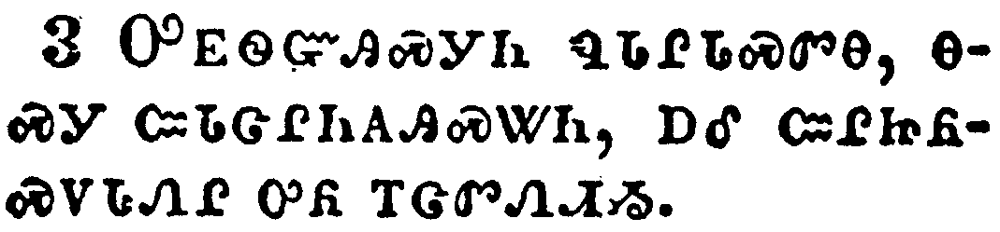</a></td>
</tr>
<tr class="even">
<td>But the Lord is faithful, who shall stablish you, and keep you from evil.</td>
</tr>
<tr class="odd">
<td>ᎤᎬᏫᏳᎯᏍᎩᏂ ᏄᏓᎵᏓᏍᏛᎾ, ᎾᏍᎩ ᏨᏓᏣᎵᏂᎪᎯᏍᏔᏂ, ᎠᎴ ᏨᎵᏥᏲᏍᏙᏓᏁᎵ ᎤᏲ ᎢᏣᏛᏁᏗᏱ.</td>
</tr>
<tr class="even">
<td>U-gv-wi-yu-hi-s-gi-ni nu-da-li-da-s-dv-na, na-s-gi tsv-da-tsa-li-ni-go-hi-s-ta-ni, a-le tsv-li-tsi-yo-s-do-da-ne-li u-yo i-tsa-dv-ne-di-yi.</td>
</tr>
</tbody>
</table>

<table>
<tbody>
<tr class="odd">
<td><a href="140304.png">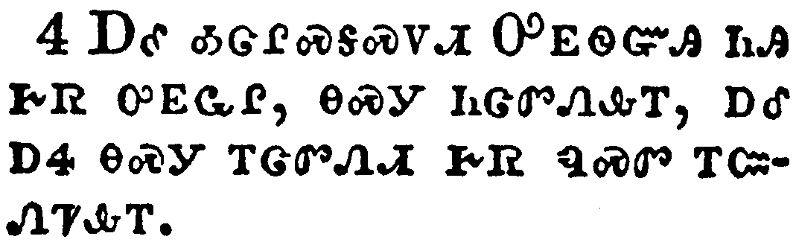</a></td>
</tr>
<tr class="even">
<td>And we have confidence in the Lord touching you, that ye both do and will do the things which we command you.</td>
</tr>
<tr class="odd">
<td>ᎠᎴ ᎣᏣᎵᏍᎦᏍᏙᏗ ᎤᎬᏫᏳᎯ ᏂᎯ ᎨᏒ ᎤᎬᏩᎵ, ᎾᏍᎩ ᏂᏣᏛᏁᎲᎢ, ᎠᎴ ᎠᏎ ᎾᏍᎩ ᎢᏣᏛᏁᏗ ᎨᏒ ᏄᏍᏛ ᎢᏨᏁᏤᎲᎢ.</td>
</tr>
<tr class="even">
<td>A-le o-tsa-li-s-ga-s-do-di U-gv-wi-yu-hi ni-hi ge-sv u-gv-wa-li, na-s-gi ni-tsa-dv-ne-hv-i, a-le a-se na-s-gi i-tsa-dv-ne-di ge-sv nu-s-dv i-tsv-ne-tse-hv-i.</td>
</tr>
</tbody>
</table>

<table>
<tbody>
<tr class="odd">
<td><a href="140305.png">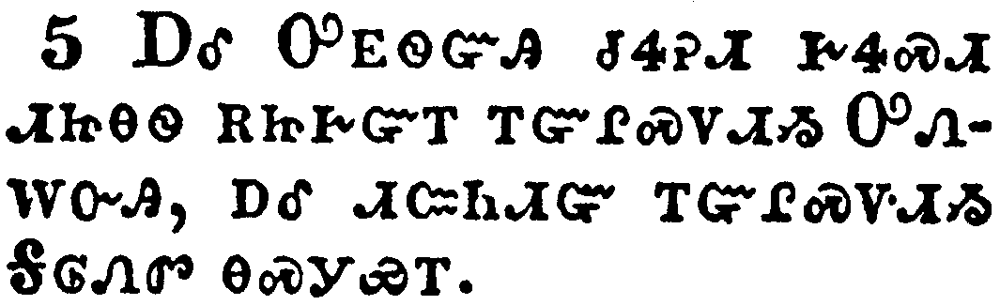</a></td>
</tr>
<tr class="even">
<td>And the Lord direct your hearts into the love of God, and into the patient waiting for Christ.</td>
</tr>
<tr class="odd">
<td>ᎠᎴ ᎤᎬᏫᏳᎯ ᏧᏎᎮᏗ ᎨᏎᏍᏗ ᏗᏥᎾᏫ ᎡᏥᎨᏳᎢ ᎢᏳᎵᏍᏙᏗᏱ ᎤᏁᎳᏅᎯ, ᎠᎴ ᏗᏨᏂᏗᏳ ᎢᏳᎵᏍᏙᏗᏱ ᎦᎶᏁᏛ ᎾᏍᎩᏯᎢ.</td>
</tr>
<tr class="even">
<td>A-le U-gv-wi-yu-hi tsu-se-he-di ge-se-s-di di-tsi-na-wi e-tsi-ge-yu-i i-yu-li-s-do-di-yi U-ne-la-nv-hi, a-le di-tsv-ni-di-yu i-yu-li-s-do-di-yi Ga-lo-ne-dv na-s-gi-ya-i.</td>
</tr>
</tbody>
</table>

<table>
<tbody>
<tr class="odd">
<td><a href="140306.png">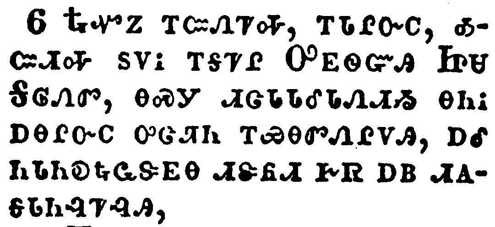</a></td>
</tr>
<tr class="even">
<td>Now we command you, brethren, in the name of our Lord Jesus Christ, that ye withdraw yourselves from every brother that walketh disorderly, and not after the tradition which he received of us.</td>
</tr>
<tr class="odd">
<td>ᎿᎭᏉᏃ ᎢᏨᏁᏤᎭ, ᎢᏓᎵᏅᏟ, ᎣᏨᏗᎭ ᏚᏙᎥ ᎢᎦᏤᎵ ᎤᎬᏫᏳᎯ ᏥᏌ ᎦᎶᏁᏛ, ᎾᏍᎩ ᏗᏣᏓᏓᎴᏓᏁᏗᏱ ᎾᏂᎥ ᎠᎾᎵᏅᏟ ᎤᏣᏘᏂ ᎢᏯᎾᏛᏁᎵᏙᎯ, ᎠᎴ ᏂᏓᏂᎧᎿᎭᏩᏕᎬᎾ ᏗᏕᏲᏗ ᎨᏒ ᎠᏴ ᏗᎪᎦᏓᏂᎸᏤᎸᎯ,</td>
</tr>
<tr class="even">
<td>Hna-quo-no i-tsv-ne-tse-ha, i-da-li-nv-tli, o-tsv-di-ha du-do-v i-ga-tse-li U-gv-wi-yu-hi Tsi-sa Ga-lo-ne-dv, na-s-gi di-tsa-da-da-le-da-ne-di-yi na-ni-v a-na-li-nv-tli u-tsa-ti-ni i-ya-na-dv-ne-li-do-hi, a-le ni-da-ni-ka-hna-wa-de-gv-na di-de-yo-di ge-sv a-yv di-go-ga-da-ni-lv-tse-lv-hi,</td>
</tr>
</tbody>
</table>

<table>
<tbody>
<tr class="odd">
<td><a href="140307.png">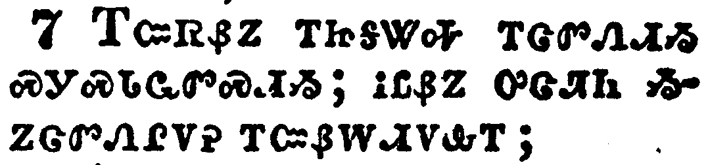</a></td>
</tr>
<tr class="even">
<td>For yourselves know how ye ought to follow us: for we behaved not ourselves disorderly among you;</td>
</tr>
<tr class="odd">
<td>ᎢᏳᏒᏰᏃ ᎢᏥᎦᏔᎭ ᎢᏣᏛᏁᏗᏱ ᏍᎩᏍᏓᏩᏛᏍᏗᏱ; ᎥᏝᏰᏃ ᎤᏣᏘᏂ ᏱᏃᏣᏛᏁᎵᏙᎮ ᎢᏨᏰᎳᏗᏙᎲᎢ;</td>
</tr>
<tr class="even">
<td>I-yu-sv-ye-no i-tsi-ga-ta-ha i-tsa-dv-ne-di-yi s-gi-s-da-wa-dv-s-di-yi; v-tla-ye-no u-tsa-ti-ni yi-no-tsa-dv-ne-li-do-he i-tsv-ye-la-di-do-hv-i;</td>
</tr>
</tbody>
</table>

<table>
<tbody>
<tr class="odd">
<td></td>
</tr>
<tr class="even">
<td>Neither did we eat any man's bread for nought; but wrought with labour and travail night and day, that we might not be chargeable to any of you:</td>
</tr>
<tr class="odd">
<td>ᎥᏝ ᎠᎴ ᎩᎶ ᎠᏎᏉ ᏲᏣᎵᏍᏓᏴᎾᏁᎮᎢ; ᏙᎩᎸᏫᏍᏓᏁᎲᎩᏍᎩᏂ ᎠᎴ ᏙᎩᏯᏪᏥᏙᎲᎩ ᎬᏩᎩᏨᏗ, ᏃᎦᏚᎵᏍᎬᎾ ᎨᏒ ᎢᏳᏍᏗ ᎠᏴ ᎠᏏᏴᏫ ᏂᏣᏛᏅ ᎦᎨᏛ ᎢᏲᏨᏴᏁᏗᏱ;</td>
</tr>
<tr class="even">
<td>V-tla a-le gi-lo a-se-quo yo-tsa-li-s-da-yv-na-ne-he-i; do-gi-lv-wi-s-da-ne-hv-gi-s-gi-ni a-le do-gi-ya-we-tsi-do-hv-gi gv-wa-gi-tsv-di, no-ga-du-li-s-gv-na ge-sv i-yu-s-di a-yv a-si-yv-wi ni-tsa-dv-nv ga-ge-dv i-yo-tsv-yv-ne-di-yi;</td>
</tr>
</tbody>
</table>

<table>
<tbody>
<tr class="odd">
<td><a href="140309.png">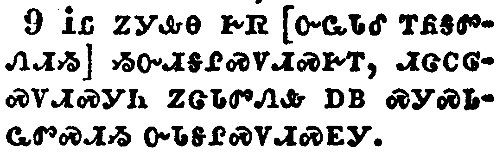</a></td>
</tr>
<tr class="even">
<td>Not because we have not power, but to make ourselves an ensample unto you to follow us.</td>
</tr>
<tr class="odd">
<td>ᎥᏝ ᏃᎩᎲᎾ ᎨᏒ [ᏅᏩᏓᎴ ᎢᏲᎦᏛᏁᏗᏱ] ᏱᏅᏗᎦᎵᏍᏙᏗᏍᎨᎢ, ᏗᏣᏟᎶᏍᏙᏗᏍᎩᏂ ᏃᏣᏓᏛᏁᎲ ᎠᏴ ᏍᎩᏍᏓᏩᏛᏍᏗᏱ ᏅᏓᎦᎵᏍᏙᏗᏍᎬᎩ.</td>
</tr>
<tr class="even">
<td>V-tla no-gi-hv-na ge-sv [nv-wa-da-le i-yo-ga-dv-ne-di-yi] yi-nv-di-ga-li-s-do-di-s-ge-i, di-tsa-tli-lo-s-do-di-s-gi-ni no-tsa-da-dv-ne-hv a-yv s-gi-s-da-wa-dv-s-di-yi nv-da-ga-li-s-do-di-s-gv-gi.</td>
</tr>
</tbody>
</table>

<table>
<tbody>
<tr class="odd">
<td><a href="140310.png">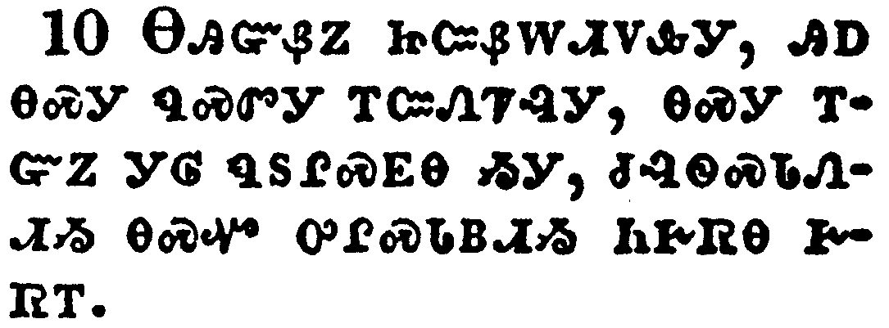</a></td>
</tr>
<tr class="even">
<td>For even when we were with you, this we commanded you, that if any would not work, neither should he eat.</td>
</tr>
<tr class="odd">
<td>ᎾᎯᏳᏰᏃ ᏥᏨᏰᎳᏗᏙᎲᎩ, ᎯᎠ ᎾᏍᎩ ᏄᏍᏛᎩ ᎢᏨᏁᏤᎸᎩ, ᎾᏍᎩ ᎢᏳᏃ ᎩᎶ ᏄᏚᎵᏍᎬᎾ ᏱᎩ, ᏧᎸᏫᏍᏓᏁᏗᏱ ᎾᏍᏉ ᎤᎵᏍᏓᏴᏗᏱ ᏂᎨᏒᎾ ᎨᏒᎢ.</td>
</tr>
<tr class="even">
<td>Na-hi-yu-ye-no tsi-tsv-ye-la-di-do-hv-gi, hi-a na-s-gi nu-s-dv-gi i-tsv-ne-tse-lv-gi, na-s-gi i-yu-no gi-lo nu-du-li-s-gv-na yi-gi, tsu-lv-wi-s-da-ne-di-yi na-s-quo u-li-s-da-yv-di-yi ni-ge-sv-na ge-sv-i.</td>
</tr>
</tbody>
</table>

<table>
<tbody>
<tr class="odd">
<td><a href="140311.png">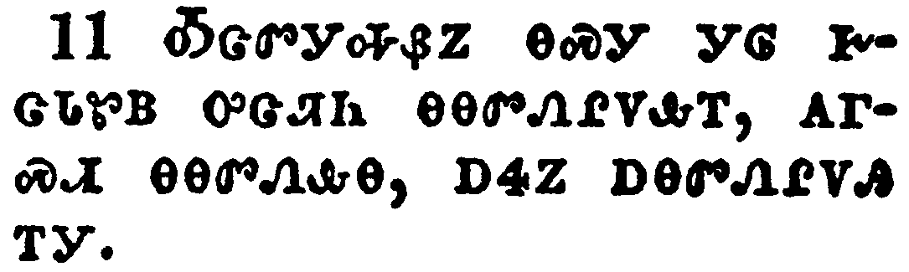</a></td>
</tr>
<tr class="even">
<td>For we hear that there are some which walk among you disorderly, working not at all, but are busybodies.</td>
</tr>
<tr class="odd">
<td>ᎣᏣᏛᎩᎭᏰᏃ ᎾᏍᎩ ᎩᎶ ᎨᏣᏓᏑᏴ ᎤᏣᏘᏂ ᎾᎾᏛᏁᎵᏙᎲᎢ, ᎪᎱᏍᏗ ᎾᎾᏛᏁᎲᎾ, ᎠᏎᏃ ᎠᎾᏛᏁᎵᏙᎯ ᎢᎩ.</td>
</tr>
<tr class="even">
<td>O-tsa-dv-gi-ha-ye-no na-s-gi gi-lo ge-tsa-da-su-yv u-tsa-ti-ni na-na-dv-ne-li-do-hv-i, go-hu-s-di na-na-dv-ne-hv-na, a-se-no a-na-dv-ne-li-do-hi i-gi.</td>
</tr>
</tbody>
</table>

<table>
<tbody>
<tr class="odd">
<td><a href="140312.png">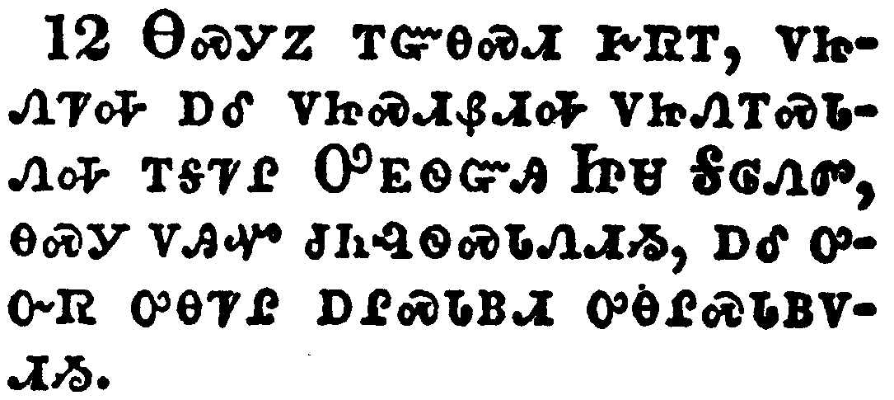</a></td>
</tr>
<tr class="even">
<td>Now them that are such we command and exhort by our Lord Jesus Christ, that with quietness they work, and eat their own bread.</td>
</tr>
<tr class="odd">
<td>ᎾᏍᎩᏃ ᎢᏳᎾᏍᏗ ᎨᏒᎢ, ᏙᏥᏁᏤᎭ ᎠᎴ ᏙᏥᏍᏗᏰᏗᎭ ᏙᏥᏁᎢᏍᏓᏁᎭ ᎢᎦᏤᎵ ᎤᎬᏫᏳᎯ ᏥᏌ ᎦᎶᏁᏛ, ᎾᏍᎩ ᏙᎯᏉ ᏧᏂᎸᏫᏍᏓᏁᏗᏱ, ᎠᎴ ᎤᏅᏒ ᎤᎾᏤᎵ ᎠᎵᏍᏓᏴᏗ ᎤᎾᎵᏍᏓᏴᏙᏗᏱ.</td>
</tr>
<tr class="even">
<td>Na-s-gi-no i-yu-na-s-di ge-sv-i, do-tsi-ne-tse-ha a-le do-tsi-s-di-ye-di-ha do-tsi-ne-i-s-da-ne-ha i-ga-tse-li U-gv-wi-yu-hi Tsi-sa Ga-lo-ne-dv, na-s-gi do-hi-quo tsu-ni-lv-wi-s-da-ne-di-yi, a-le u-nv-sv u-na-tse-li a-li-s-da-yv-di u-na-li-s-da-yv-do-di-yi.</td>
</tr>
</tbody>
</table>

<table>
<tbody>
<tr class="odd">
<td><a href="140313.png">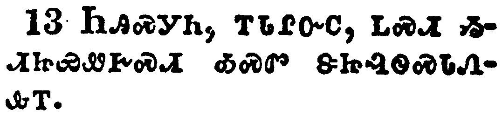</a></td>
</tr>
<tr class="even">
<td>But ye, brethren, be not weary in well doing.</td>
</tr>
<tr class="odd">
<td>ᏂᎯᏍᎩᏂ, ᎢᏓᎵᏅᏟ, ᏞᏍᏗ ᏱᏗᏥᏯᏪᎨᏍᏗ ᎣᏍᏛ ᏕᏥᎸᏫᏍᏓᏁᎲᎢ.</td>
</tr>
<tr class="even">
<td>Ni-hi-s-gi-ni, i-da-li-nv-tli, tle-s-di yi-di-tsi-ya-we-ge-s-di o-s-dv de-tsi-lv-wi-s-da-ne-hv-i.</td>
</tr>
</tbody>
</table>

<table>
<tbody>
<tr class="odd">
<td><a href="140314.png">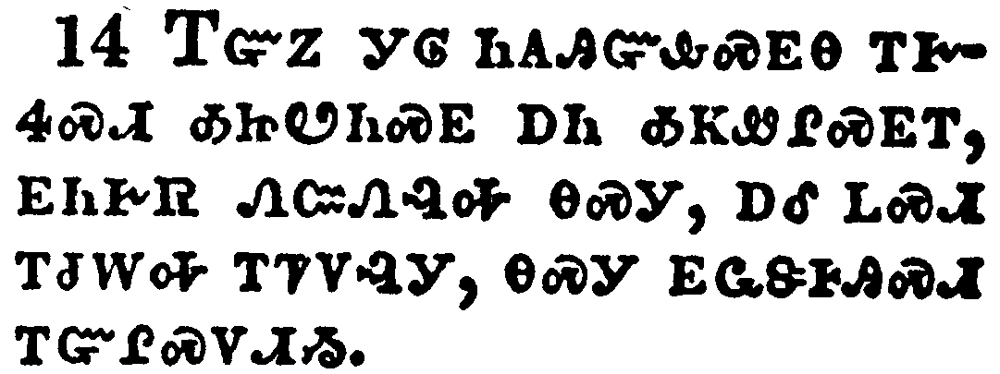</a></td>
</tr>
<tr class="even">
<td>And if any man obey not our word by this epistle, note that man, and have no company with him, that he may be ashamed.</td>
</tr>
<tr class="odd">
<td>ᎢᏳᏃ ᎩᎶ ᏂᎪᎯᏳᎲᏍᎬᎾ ᎢᎨᏎᏍᏗ ᎣᏥᏬᏂᏍᎬ ᎠᏂ ᎣᏦᏪᎵᏍᎬᎢ, ᎬᏂᎨᏒ ᏁᏨᏁᎸᎭ ᎾᏍᎩ, ᎠᎴ ᏞᏍᏗ ᎢᏧᎳᎭ ᎢᏤᏙᎸᎩ, ᎾᏍᎩ ᎬᏩᏕᎰᎯᏍᏗ ᎢᏳᎵᏍᏙᏗᏱ.</td>
</tr>
<tr class="even">
<td>I-yu-no gi-lo ni-go-hi-yu-hv-s-gv-na i-ge-se-s-di o-tsi-wo-ni-s-gv a-ni o-tso-we-li-s-gv-i, gv-ni-ge-sv ne-tsv-ne-lv-ha na-s-gi, a-le tle-s-di i-tsu-la-ha i-tse-do-lv-gi, na-s-gi gv-wa-de-ho-hi-s-di i-yu-li-s-do-di-yi.</td>
</tr>
</tbody>
</table>

<table>
<tbody>
<tr class="odd">
<td><a href="140315.png">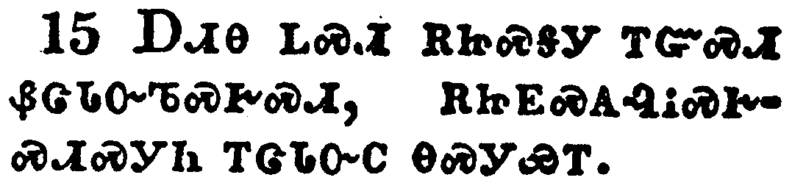</a></td>
</tr>
<tr class="even">
<td>Yet count him not as an enemy, but admonish him as a brother.</td>
</tr>
<tr class="odd">
<td>ᎠᏗᎾ ᏞᏍᏗ ᎡᏥᏍᎦᎩ ᎢᏳᏍᏗ ᏰᏣᏓᏅᏖᏍᎨᏍᏗ, ᎡᏥᎬᏍᎪᎸᎥᏍᎨᏍᏗᏍᎩᏂ ᎢᏣᏓᏅᏟ ᎾᏍᎩᏯᎢ.</td>
</tr>
<tr class="even">
<td>A-di-na tle-s-di e-tsi-s-ga-gi i-yu-s-di ye-tsa-da-nv-te-s-ge-s-di, e-tsi-gv-s-go-lv-v-s-ge-s-di-s-gi-ni i-tsa-da-nv-tli na-s-gi-ya-i.</td>
</tr>
</tbody>
</table>

<table>
<tbody>
<tr class="odd">
<td><a href="140316.png">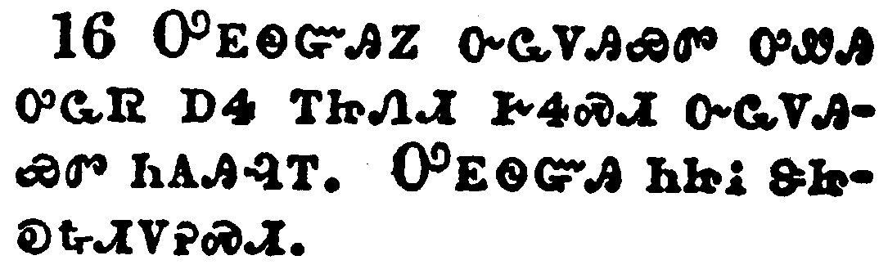</a></td>
</tr>
<tr class="even">
<td>Now the Lord of peace himself give you peace always by all means. The Lord be with you all.</td>
</tr>
<tr class="odd">
<td>ᎤᎬᏫᏳᎯᏃ ᏅᏩᏙᎯᏯᏛ ᎤᏪᎯ ᎤᏩᏒ ᎠᏎ ᎢᏥᏁᏗ ᎨᏎᏍᏗ ᏅᏩᏙᎯᏯᏛ ᏂᎪᎯᎸᎢ. ᎤᎬᏫᏳᎯ ᏂᏥᎥ ᏕᏥᎧᎿᎭᏗᏙᎮᏍᏗ.</td>
</tr>
<tr class="even">
<td>U-gv-wi-yu-hi-no nv-wa-do-hi-ya-dv u-we-hi u-wa-sv a-se i-tsi-ne-di ge-se-s-di nv-wa-do-hi-ya-dv ni-go-hi-lv-i. U-gv-wi-yu-hi ni-tsi-v de-tsi-ka-hna-di-do-he-s-di.</td>
</tr>
</tbody>
</table>

<table>
<tbody>
<tr class="odd">
<td><a href="140317.png">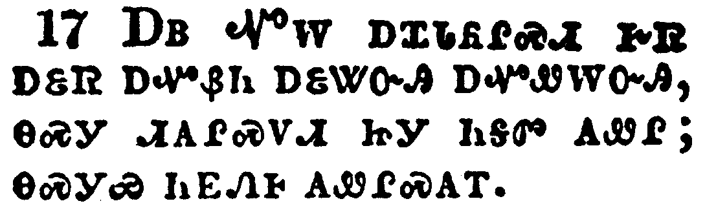</a></td>
</tr>
<tr class="even">
<td>The salutation of Paul with mine own hand, which is the token in every epistle: so I write.</td>
</tr>
<tr class="odd">
<td>ᎠᏴ ᏉᎳ ᎠᏆᏓᏲᎵᏍᏗ ᎨᏒ ᎠᏋᏒ ᎠᏉᏰᏂ ᎠᏋᏔᏅᎯ ᎠᏉᏪᎳᏅᎯ, ᎾᏍᎩ ᏗᎪᎵᏍᏙᏗ ᏥᎩ ᏂᎦᏛ ᎪᏪᎵ; ᎾᏍᎩᏯ ᏂᎬᏁᎰ ᎪᏪᎵᏍᎪᎢ.</td>
</tr>
<tr class="even">
<td>A-yv Quo-la a-qua-da-yo-li-s-di ge-sv a-quv-sv a-quo-ye-ni a-quv-ta-nv-hi a-quo-we-la-nv-hi, na-s-gi di-go-li-s-do-di tsi-gi ni-ga-dv go-we-li; na-s-gi-ya ni-gv-ne-ho go-we-li-s-go-i.</td>
</tr>
</tbody>
</table>

<table>
<tbody>
<tr class="odd">
<td><a href="140318.png">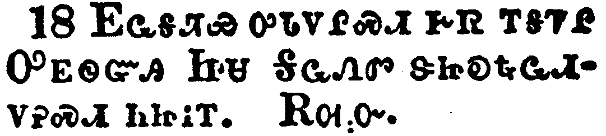</a></td>
</tr>
<tr class="even">
<td>The grace of our Lord Jesus Christ be with you all. Amen.</td>
</tr>
<tr class="odd">
<td>ᎬᏩᎦᏘᏯ ᎤᏓᏙᎵᏍᏗ ᎨᏒ ᎢᎦᏤᎵ ᎤᎬᏫᏳᎯ ᏥᏌ ᎦᎶᏁᏛ ᏕᏥᎧᎿᎭᏩᏗᏙᎮᏍᏗ ᏂᏥᎥᎢ. ᎡᎺᏅ.</td>
</tr>
<tr class="even">
<td>Gv-wa-ga-ti-ya u-da-do-li-s-di ge-sv i-ga-tse-li U-gv-wi-yu-hi Tsi-sa Ga-lo-ne-dv de-tsi-ka-hna-wa-di-do-he-s-di ni-tsi-v-i. E-me-nv.</td>
</tr>
</tbody>
</table>

