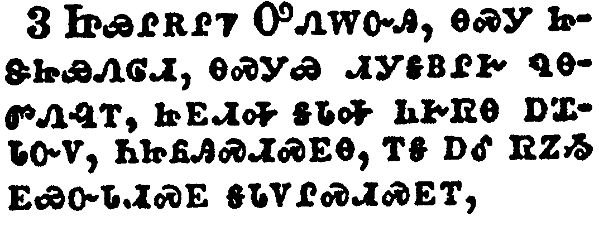

+++
draft=false
date = 2014-12-18T21:11:07Z
title = "2 Timothy - Chapter 1 - Cherokee New Testament"
weight = 1418955067

[taxonomies]

authors = ["Timothy Legg"]
categories = []
tags = []

[extra]
+++

<table>
<tbody>
<tr class="odd">
<td></td>
</tr>
<tr class="even">
<td>Paul, an apostle of Jesus Christ by the will of God, according to the promise of life which is in Christ Jesus,</td>
</tr>
<tr class="odd">
<td>ᎠᏴ ᏉᎳ ᎠᎩᏅᏏᏛ ᏥᏌ ᎦᎶᏁᏛ ᏅᏧᎵᏍᏙᏔᏅ ᎤᏁᎳᏅᎯ ᎣᏏ ᎤᏰᎸᏅᎢ, ᎾᏍᎩᏯ ᎠᏚᎢᏍᏛ ᎬᏂᏛ ᎡᎩᏁᏗᏱ, ᎾᏍᎩ ᎦᎶᏁᏛ ᏥᏌ ᏨᏗᏓᎴᎲᏍᎦ;</td>
</tr>
<tr class="even">
<td>A-yv Quo-la a-gi-nv-si-dv Tsi-sa Ga-lo-ne-dv nv-tsu-li-s-do-ta-nv U-ne-la-nv-hi o-si u-ye-lv-nv-i, na-s-gi-ya a-du-i-s-dv gv-ni-dv e-gi-ne-di-yi, na-s-gi Ga-lo-ne-dv Tsi-sa tsv-di-da-le-hv-s-ga;</td>
</tr>
</tbody>
</table>

<table>
<tbody>
<tr class="odd">
<td></td>
</tr>
<tr class="even">
<td>To Timothy, my dearly beloved son: Grace, mercy, and peace, from God the Father and Christ Jesus our Lord.</td>
</tr>
<tr class="odd">
<td>ᏫᎬᏲᏪᎳᏏ ᏗᎹᏗ ᎬᎨᏳᎢ ᎠᏇᏥ; ᎬᏩᎦᏘᏯ ᎤᏓᏙᎵᏍᏗ ᎨᏒ ᎠᎴ ᎤᏓᏙᎵᏣᏛ ᎨᏒ ᎠᎴ ᏅᏩᏙᎯᏯᏛ ᏕᏣᎧᎿᎭᏩᏗᏙᎮᏍᏗ ᏅᏓᏳᎾᎵᏍᎪᎸᏔᏅᎯ ᎤᏁᎳᏅᎯ ᎢᎩᏙᏓ ᎠᎴ ᎦᎶᏁᏛ ᏥᏌ ᎢᎦᏤᎵ ᎤᎬᏫᏳᎯ.</td>
</tr>
<tr class="even">
<td>Wi-gv-yo-we-la-si Di-ma-di gv-ge-yu-i a-que-tsi; gv-wa-ga-ti-ya u-da-do-li-s-di ge-sv a-le u-da-do-li-tsa-dv ge-sv a-le nv-wa-do-hi-ya-dv de-tsa-ka-hna-wa-di-do-he-s-di nv-da-yu-na-li-s-go-lv-ta-nv-hi U-ne-la-nv-hi I-gi-do-da a-le Ga-lo-ne-dv Tsi-sa i-ga-tse-li U-gv-wi-yu-hi.</td>
</tr>
</tbody>
</table>

<table>
<tbody>
<tr class="odd">
<td></td>
</tr>
<tr class="even">
<td>I thank God, whom I serve from my forefathers with pure conscience, that without ceasing I have remembrance of thee in my prayers night and day;</td>
</tr>
<tr class="odd">
<td>ᏥᏯᎵᎡᎵᏤ ᎤᏁᎳᏅᎯ, ᎾᏍᎩ ᏥᏕᏥᏯᏁᎶᏗ, ᎾᏍᎩᏯ ᏗᎩᎦᏴᎵᎨ ᏄᎾᏛᏁᎸᎢ, ᏥᎬᏗᎭ ᎦᏓᎭ ᏂᎨᏒᎾ ᎠᏆᏓᏅᏙ, ᏂᏥᏲᎯᏍᏗᏍᎬᎾ, ᎢᎦ ᎠᎴ ᏒᏃᏱ ᎬᏯᏅᏓᏗᏍᎬ ᎦᏓᏙᎵᏍᏗᏍᎬᎢ,</td>
</tr>
<tr class="even">
<td>Tsi-ya-li-e-li-tse U-ne-la-nv-hi, na-s-gi tsi-de-tsi-ya-ne-lo-di, na-s-gi-ya di-gi-ga-yv-li-ge nu-na-dv-ne-lv-i, tsi-gv-di-ha ga-da-ha ni-ge-sv-na a-qua-da-nv-do, ni-tsi-yo-hi-s-di-s-gv-na, i-ga a-le sv-no-yi gv-ya-nv-da-di-s-gv ga-da-do-li-s-di-s-gv-i,</td>
</tr>
</tbody>
</table>

<table>
<tbody>
<tr class="odd">
<td></td>
</tr>
<tr class="even">
<td>Greatly desiring to see thee, being mindful of thy tears, that I may be filled with joy;</td>
</tr>
<tr class="odd">
<td>ᎾᏍᎩ ᎤᏣᏘ ᎠᏆᏚᎵᏍᎬ ᎬᎪᏩᏛᏗᏱ, ᎠᎴ ᎦᏅᏓᏗᏍᎬ ᏕᏣᏠᏱᎸᎢ ᎾᏍᎩᏃ ᎠᎩᎧᎵᎢᏍᏗᏱ ᎤᎵᎮᎵᏍᏗ ᎨᏒᎢ,</td>
</tr>
<tr class="even">
<td>Na-s-gi u-tsa-ti a-qua-du-li-s-gv gv-go-wa-dv-di-yi, a-le ga-nv-da-di-s-gv de-tsa-tlo-yi-lv-i na-s-gi-no a-gi-ka-li-i-s-di-yi u-li-he-li-s-di ge-sv-i,</td>
</tr>
</tbody>
</table>

<table>
<tbody>
<tr class="odd">
<td></td>
</tr>
<tr class="even">
<td>When I call to remembrance the unfeigned faith that is in thee, which dwelt first in thy grandmother Lois, and thy mother Eunice; and I am persuaded that in thee also.</td>
</tr>
<tr class="odd">
<td>ᎢᏳᏃ ᎦᏅᏓᏓ ᎤᏠᎾᏍᏗ ᏂᎨᏒᎾ ᎪᎯᏳᏗ ᎨᏒ ᏥᏣᏯᎠ, ᎾᏍᎩ ᎢᎬᏱ ᏧᏯᎥ ᏣᎵᏏ ᎶᏏ ᎠᎴ ᏣᏥ ᏳᏂᏏ, ᎠᎴ ᏄᏜᏓᏏᏛᏒᎾ ᎠᎩᏰᎸᎭ ᏂᎯ ᎾᏍᏉ ᏣᏯᎥᎢ.</td>
</tr>
<tr class="even">
<td>I-yu-no ga-nv-da-da u-tlo-na-s-di ni-ge-sv-na go-hi-yu-di ge-sv tsi-tsa-ya-a, na-s-gi i-gv-yi tsu-ya-v tsa-li-si Lo-si a-le tsa-tsi Yu-ni-si, a-le nu-dla-si-dv-sv-na a-gi-ye-lv-ha ni-hi na-s-quo tsa-ya-v-i.</td>
</tr>
</tbody>
</table>

<table>
<tbody>
<tr class="odd">
<td></td>
</tr>
<tr class="even">
<td>Wherefore I put thee in remembrance that thou stir up the gift of God, which is in thee by the putting on of my hands.</td>
</tr>
<tr class="odd">
<td>ᎾᏍᎩ ᎢᏳᏍᏗ ᎬᏯᏅᏓᏗᏍᏗᎭ ᏣᏖᎸᏗᏱ ᎤᏁᎳᏅᎩ ᏣᏁᎸᎯ ᎨᏒᎢ, ᎾᏍᎩ ᏥᏣᏯᎠ, ᎾᏍᎩ ᏕᎬᏯᏏᏔᏛ ᏥᏅᏗᎦᎵᏍᏙᏗᎭ.</td>
</tr>
<tr class="even">
<td>Na-s-gi i-yu-s-di gv-ya-nv-da-di-s-di-ha tsa-te-lv-di-yi U-ne-la-nv-gi tsa-ne-lv-hi ge-sv-i, na-s-gi tsi-tsa-ya-a, na-s-gi de-gv-ya-si-ta-dv tsi-nv-di-ga-li-s-do-di-ha.</td>
</tr>
</tbody>
</table>

<table>
<tbody>
<tr class="odd">
<td></td>
</tr>
<tr class="even">
<td>For God hath not given us the spirit of fear; but of power, and of love, and of a sound mind.</td>
</tr>
<tr class="odd">
<td>ᎤᏁᎳᏅᎯᏰᏃ ᎥᏝ ᏱᎩᏁᎸ ᎠᏓᏅᏙ ᎤᏓᏍᎦᏍᏗ, ᎤᎵᏂᎩᏛᏍᎩᏂ ᎠᎴ ᎠᏓᎨᏳᏗ ᎨᏒ ᎠᎴ ᎣᏍᏛ ᎠᏓᏅᏖᏗ ᎨᏒᎢ.</td>
</tr>
<tr class="even">
<td>U-ne-la-nv-hi-ye-no v-tla yi-gi-ne-lv a-da-nv-do u-da-s-ga-s-di, u-li-ni-gi-dv-s-gi-ni a-le a-da-ge-yu-di ge-sv a-le o-s-dv a-da-nv-te-di ge-sv-i.</td>
</tr>
</tbody>
</table>

<table>
<tbody>
<tr class="odd">
<td></td>
</tr>
<tr class="even">
<td>Be not thou therefore ashamed of the testimony of our Lord, nor of me his prisoner: but be thou partaker of the afflictions of the gospel according to the power of God;</td>
</tr>
<tr class="odd">
<td>ᎾᏍᎩ ᎢᏳᏍᏗ ᏞᏍᏗ ᏯᏕᎰᏍᎨᏍᏗ ᎯᏃᎮᏍᎬ ᎤᎬᏫᏳᎯ ᎢᎦᏤᎵᎦ, ᎠᎴ ᏞᏍᏗ ᏱᏍᏆᏕᎰᏍᎨᏍᏗ ᎠᏴ ᏥᏴᎩ ᎾᏍᎩ ᎤᏤᎵᎦ, ᏤᎳᏗᏍᏗᏍᎨᏍᏗᏍᎩᏂ ᎠᎩᎵᏲᎬ ᎣᏍᏛ ᎧᏃᎮᏛ, ᏣᏍᏕᎵᏍᎨᏍᏗ ᎤᎵᏂᎩᏗ ᎨᏒ ᎤᏁᎳᏅᎯ,</td>
</tr>
<tr class="even">
<td>Na-s-gi i-yu-s-di tle-s-di ya-de-ho-s-ge-s-di hi-no-he-s-gv u-gv-wi-yu-hi i-ga-tse-li-ga, a-le tle-s-di yi-s-qua-de-ho-s-ge-s-di a-yv tsi-yv-gi na-s-gi u-tse-li-ga, tse-la-di-s-di-s-ge-s-di-s-gi-ni a-gi-li-yo-gv o-s-dv ka-no-he-dv, tsa-s-de-li-s-ge-s-di u-li-ni-gi-di ge-sv U-ne-la-nv-hi,</td>
</tr>
</tbody>
</table>

<table>
<tbody>
<tr class="odd">
<td></td>
</tr>
<tr class="even">
<td>Who hath saved us, and called us with an holy calling, not according to our works, but according to his own purpose and grace, which was given us in Christ Jesus before the world began,</td>
</tr>
<tr class="odd">
<td>ᎾᏍᎩ ᎢᎩᏍᏕᎸᏛ ᏥᎩ, ᎠᎴ ᎢᎩᏯᏅᏛ ᏥᎩ ᎤᏩᏔᏅᎯ ᎦᎸᏉᏗ ᎠᏓᏯᏅᏗ ᎨᏒᎢ, ᎥᏝ ᎠᏴ ᏕᎩᎸᏫᏍᏓᏁᎲ ᏱᏅᏧᎵᏍᏙᏔᏅ, ᎤᏩᏒᏍᎩᏂ ᎤᏓᏅᏖᎸᎢ ᎠᎴ ᎬᏩᎦᏘᏯ ᎤᏓᏙᎵᏍᏗ ᎨᏒ ᏅᏧᎵᏍᏙᏔᏅ, ᎾᏍᎩ ᎢᎩᏁᎸᎯ ᏥᎩ ᏅᏧᏓᎴᏅᎲᎾ, ᏥᏌ ᎦᎶᏁᏛ ᎨᏒ ᎢᏳᏍᏗ,</td>
</tr>
<tr class="even">
<td>Na-s-gi i-gi-s-de-lv-dv tsi-gi, a-le i-gi-ya-nv-dv tsi-gi u-wa-ta-nv-hi ga-lv-quo-di a-da-ya-nv-di ge-sv-i, v-tla a-yv de-gi-lv-wi-s-da-ne-hv yi-nv-tsu-li-s-do-ta-nv, u-wa-sv-s-gi-ni u-da-nv-te-lv-i a-le gv-wa-ga-ti-ya u-da-do-li-s-di ge-sv nv-tsu-li-s-do-ta-nv, na-s-gi i-gi-ne-lv-hi tsi-gi nv-tsu-da-le-nv-hv-na, Tsi-sa Ga-lo-ne-dv ge-sv i-yu-s-di,</td>
</tr>
</tbody>
</table>

<table>
<tbody>
<tr class="odd">
<td></td>
</tr>
<tr class="even">
<td>But is now made manifest by the appearing of our Saviour Jesus Christ, who hath abolished death, and hath brought life and immortality to light through the gospel:</td>
</tr>
<tr class="odd">
<td>ᎪᎯᏃ ᎨᏒ ᎬᏂᎨᏒ ᎢᎬᏁᎸᎯ ᎾᏍᎩ ᎤᎾᏄᎪᏥᎸ ᎢᎩᏍᏕᎵᏍᎩ ᏥᏌ ᎦᎶᏁᏛ, ᎾᏍᎩ ᎤᏲᏍᏔᏅᎯ ᏥᎩ ᎠᏲᎱᎯᏍᏗ ᎨᏒ, ᎠᎴ ᎤᎾᏄᎪᏫᏒᎯ ᏥᎩ ᎬᏂᏛ ᎠᎴ ᎠᏲᎱᎯᏍᏗ ᏂᎨᏒᎾ ᎨᏒ, ᎣᏍᏛ ᎧᏃᎮᏛ ᎬᏔᏅᎯ,</td>
</tr>
<tr class="even">
<td>Go-hi-no ge-sv gv-ni-ge-sv i-gv-ne-lv-hi na-s-gi u-na-nu-go-tsi-lv I-gi-s-de-li-s-gi Tsi-sa Ga-lo-ne-dv, na-s-gi u-yo-s-ta-nv-hi tsi-gi a-yo-hu-hi-s-di ge-sv, a-le u-na-nu-go-wi-sv-hi tsi-gi gv-ni-dv a-le a-yo-hu-hi-s-di ni-ge-sv-na ge-sv, o-s-dv ka-no-he-dv gv-ta-nv-hi,</td>
</tr>
</tbody>
</table>

<table>
<tbody>
<tr class="odd">
<td></td>
</tr>
<tr class="even">
<td>Whereunto I am appointed a preacher, and an apostle, and a teacher of the Gentiles.</td>
</tr>
<tr class="odd">
<td>ᎾᏍᎩ ᎠᏴ ᎥᎩᏁᏤᎸᎯ ᎦᎵᏥᏙᎲᏍᎩ ᎠᎴ ᎥᎩᏅᏏᏛ ᎠᎴ ᏗᎦᏥᏰᏲᎲᏍᎩ ᏧᎾᏓᎴᏅᏛ ᏴᏫ.</td>
</tr>
<tr class="even">
<td>Na-s-gi a-yv v-gi-ne-tse-lv-hi ga-li-tsi-do-hv-s-gi a-le v-gi-nv-si-dv a-le di-ga-tsi-ye-yo-hv-s-gi tsu-na-da-le-nv-dv yv-wi.</td>
</tr>
</tbody>
</table>

<table>
<tbody>
<tr class="odd">
<td></td>
</tr>
<tr class="even">
<td>For the which cause I also suffer these things: nevertheless I am not ashamed: for I know whom I have believed, and am persuaded that he is able to keep that which I have committed unto him against that day.</td>
</tr>
<tr class="odd">
<td>ᎾᏍᎩ ᎾᏍᏉ ᏅᏗᎦᎵᏍᏙᏗᎭ ᎯᎠ ᎾᏍᎩ ᏧᏓᎴᏅᏛ ᏥᎩᎵᏲᎦ; ᎠᏎᏃ ᎥᏝ ᏱᎦᏕᎣᏍᎦ; ᏥᎦᏔᎭᏰᏃ ᎾᏍᎩ ᏥᏥᏯᎵᏍᎦᏍᏙᏔᏅ, ᎠᎴ ᎤᎵᏂᎩᏗᏳ ᎠᏉᎯᏳᎭ ᏰᎵᏉ ᎬᏩᏍᏆᏂᎪᏙᏗ ᎨᏒ ᎾᏍᎩ ᏥᏥᏯᎨᏅᏴ ᎬᏂ ᎾᎯᏳ ᎢᎦ ᎠᏍᏆᎸᎲᎭ.</td>
</tr>
<tr class="even">
<td>Na-s-gi na-s-quo nv-di-ga-li-s-do-di-ha hi-a na-s-gi tsu-da-le-nv-dv tsi-gi-li-yo-ga; a-se-no v-tla yi-ga-de-o-s-ga; tsi-ga-ta-ha-ye-no na-s-gi tsi-tsi-ya-li-s-ga-s-do-ta-nv, a-le u-li-ni-gi-di-yu a-quo-hi-yu-ha ye-li-quo gv-wa-s-qua-ni-go-do-di ge-sv na-s-gi tsi-tsi-ya-ge-nv-yv gv-ni na-hi-yu i-ga a-s-qua-lv-hv-ha.</td>
</tr>
</tbody>
</table>

<table>
<tbody>
<tr class="odd">
<td></td>
</tr>
<tr class="even">
<td>Hold fast the form of sound words, which thou hast heard of me, in faith and love which is in Christ Jesus.</td>
</tr>
<tr class="odd">
<td>ᏕᏣᏂᏴᏎᏍᏗ ᎾᏍᎩ ᏗᏣᏟᎶᏍᏔᏅᎯ ᎣᏍᏛ ᎧᏃᎮᏛ ᎾᏍᎩ ᏍᏆᏛᎦᏁᎸᎯ ᏥᎩ, ᎲᏗᏍᎨᏍᏗ ᎪᎯᏳᏗ ᎨᏒ ᎠᎴ ᎠᏓᎨᏳᏗ ᎨᏒ ᎾᏍᎩ ᎦᎶᏁᏛ ᏥᏌ ᏅᏓᏳᏓᎴᏅᎯ.</td>
</tr>
<tr class="even">
<td>De-tsa-ni-yv-se-s-di na-s-gi di-tsa-tli-lo-s-ta-nv-hi o-s-dv ka-no-he-dv na-s-gi s-qua-dv-ga-ne-lv-hi tsi-gi, hv-di-s-ge-s-di go-hi-yu-di ge-sv a-le a-da-ge-yu-di ge-sv na-s-gi Ga-lo-ne-dv Tsi-sa nv-da-yu-da-le-nv-hi.</td>
</tr>
</tbody>
</table>

<table>
<tbody>
<tr class="odd">
<td></td>
</tr>
<tr class="even">
<td>That good thing which was committed unto thee keep by the Holy Ghost which dwelleth in us.</td>
</tr>
<tr class="odd">
<td>ᎾᏍᎩ Ꮎ ᎣᏍᏛ ᏤᏣᎨᏅᏴ ᏣᏍᏆᏂᎪᏕᏍᏗ, ᏣᏍᏕᎵᏍᎨᏍᏗ ᎦᎸᏉᏗᏳ ᎠᏓᏅᏙ ᎾᏍᎩ ᏥᎩᏯᎠ.</td>
</tr>
<tr class="even">
<td>Na-s-gi na o-s-dv tse-tsa-ge-nv-yv tsa-s-qua-ni-go-de-s-di, tsa-s-de-li-s-ge-s-di Ga-lv-quo-di-yu A-da-nv-do na-s-gi tsi-gi-ya-a.</td>
</tr>
</tbody>
</table>

<table>
<tbody>
<tr class="odd">
<td></td>
</tr>
<tr class="even">
<td>This thou knowest, that all they which are in Asia be turned away from me; of whom are Phygellus and Hermogenes.</td>
</tr>
<tr class="odd">
<td>ᎯᎠ ᎾᏍᎩ ᎯᎦᏔᎭ, ᏂᎦᏛ ᎡᏏᏱ ᎠᏁᎯ ᎬᏋᏕᏨᎢ, ᎾᏍᎩ ᎤᎾᏓᏑᏯ ᏆᏤᎳ ᎠᎴ ᎭᎹᏥᏂ.</td>
</tr>
<tr class="even">
<td>Hi-a na-s-gi hi-ga-ta-ha, ni-ga-dv E-si-yi a-ne-hi gv-quv-de-tsv-i, na-s-gi u-na-da-su-ya Qua-tse-la a-le Ha-ma-tsi-ni.</td>
</tr>
</tbody>
</table>

<table>
<tbody>
<tr class="odd">
<td></td>
</tr>
<tr class="even">
<td>The Lord give mercy unto the house of Onesiphorus; for he oft refreshed me, and was not ashamed of my chain:</td>
</tr>
<tr class="odd">
<td>ᎤᎬᏫᏳᎯ ᏧᏁᏗ ᎨᏎᏍᏗ ᎤᏓᏙᎵᏍᏗ ᎨᏒ ᏚᏓᏘᎿᎭᎥ ᎣᏁᏏᏉᎳ, ᏯᏃᏰᏃ ᎠᎩᎦᎵᏍᏓᏗᏍᎬᎩ, ᎠᎴ ᎥᏝ ᏯᏉᏕᎰᎯᏎᎮ ᎠᏆᏤᎵ ᏧᏓᏕᏒᏛ;</td>
</tr>
<tr class="even">
<td>U-gv-wi-yu-hi tsu-ne-di ge-se-s-di u-da-do-li-s-di ge-sv du-da-ti-hna-v O-ne-si-quo-la, ya-no-ye-no a-gi-ga-li-s-da-di-s-gv-gi, a-le v-tla ya-quo-de-ho-hi-se-he a-qua-tse-li tsu-da-de-sv-dv;</td>
</tr>
</tbody>
</table>

<table>
<tbody>
<tr class="odd">
<td></td>
</tr>
<tr class="even">
<td>But, when he was in Rome, he sought me out very diligently, and found me.</td>
</tr>
<tr class="odd">
<td>ᎶᎻᏍᎩᏂ ᎤᏪᏙᎸ ᎤᎵᏂᎩᏛ ᎠᎩᏲᎸᎩ, ᎠᎴ ᎠᎩᏩᏛᎲᎩ.</td>
</tr>
<tr class="even">
<td>Lo-mi-s-gi-ni u-we-do-lv u-li-ni-gi-dv a-gi-yo-lv-gi, a-le a-gi-wa-dv-hv-gi.</td>
</tr>
</tbody>
</table>

<table>
<tbody>
<tr class="odd">
<td></td>
</tr>
<tr class="even">
<td>The Lord grant unto him that he may find mercy of the Lord in that day: and in how many things he ministered unto me at Ephesus, thou knowest very well.</td>
</tr>
<tr class="odd">
<td>ᎤᎬᏫᏳᎯ ᎤᏁᏗ ᎨᏎᏍᏗ ᎤᏩᏛᏗᏱ ᎤᏓᏙᎵᏍᏗ ᎨᏒ ᎤᎬᏫᏳᎯ ᎾᎯᏳ ᎢᎦ. ᎠᎴ ᏂᎦᎥ ᎠᎩᏍᏕᎸᎯᏙᎸ ᎡᏈᏌ ᎣᏏᏳ ᎯᎦᏔᎭ.</td>
</tr>
<tr class="even">
<td>U-gv-wi-yu-hi u-ne-di ge-se-s-di u-wa-dv-di-yi u-da-do-li-s-di ge-sv U-gv-wi-yu-hi na-hi-yu i-ga. A-le ni-ga-v a-gi-s-de-lv-hi-do-lv E-qui-sa o-si-yu hi-ga-ta-ha.</td>
</tr>
</tbody>
</table>

