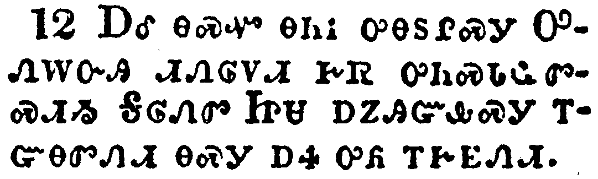

+++
draft=false
date = 2014-12-18T21:11:07Z
title = "2 Timothy - Chapter 3 - Cherokee New Testament"
weight = 1418955067

[taxonomies]

authors = ["Timothy Legg"]
categories = []
tags = []

[extra]
+++

<table>
<tbody>
<tr class="odd">
<td></td>
</tr>
<tr class="even">
<td>This know also, that in the last days perilous times shall come.</td>
</tr>
<tr class="odd">
<td>ᎯᎠᏃ ᎾᏍᏉ ᎯᎦᏔᎮᏍᏗ, ᎤᎵᏍᏆ ᎸᏗ ᎨᏎᏍᏗ ᎠᏎ ᎤᏕᏯᏙᏗ ᎤᎵᏰᎢᎶᎯᏍᏗ ᎨᏎᏍᏗ.</td>
</tr>
<tr class="even">
<td>Hi-a-no na-s-quo hi-ga-ta-he-s-di, u-li-s-qua lv-di ge-se-s-di a-se u-de-ya-do-di u-li-ye-i-lo-hi-s-di ge-se-s-di.</td>
</tr>
</tbody>
</table>

<table>
<tbody>
<tr class="odd">
<td></td>
</tr>
<tr class="even">
<td>For men shall be lovers of their own selves, covetous, boasters, proud, blasphemers, disobedient to parents, unthankful, unholy,</td>
</tr>
<tr class="odd">
<td>ᏴᏫᏰᏃ ᎤᏅᏒ ᎤᎾᏓᎸᏉᏗᏳ ᎨᏎᏍᏗ, ᎠᏕᎸ ᎤᏂᎬᎥᏍᎩ, ᎠᎾᏢᏆᏍᎩ, ᎤᎾᏢᏉᏗ, ᎤᏁᎳᏅᎯ ᎬᏩᏂᏐᏢᏗ, ᏧᏂᎦᏴᎵᎨ ᏗᏂᎳᏏᏘᏍᎩ, ᏄᎾᎵᎮᎵᏣᏛᎾ, ᎠᏂᎦᏓᎭᎢ,</td>
</tr>
<tr class="even">
<td>Yv-wi-ye-no u-nv-sv u-na-da-lv-quo-di-yu ge-se-s-di, a-de-lv u-ni-gv-v-s-gi, a-na-tlv-qua-s-gi, u-na-tlv-quo-di, U-ne-la-nv-hi gv-wa-ni-so-tlv-di, tsu-ni-ga-yv-li-ge di-ni-la-si-ti-s-gi, nu-na-li-he-li-tsa-dv-na, a-ni-ga-da-ha-i,</td>
</tr>
</tbody>
</table>

<table>
<tbody>
<tr class="odd">
<td></td>
</tr>
<tr class="even">
<td>Without natural affection, trucebreakers, false accusers, incontinent, fierce, despisers of those that are good,</td>
</tr>
<tr class="odd">
<td>ᎪᎱᏍᏗ ᏧᏅᎾ ᏂᏚᏂᎨᏳᏒᎾ, ᏄᏃᎯᏍᏘᏒᎾ, ᎤᏐᏅ ᎠᎾᏓᏃᎮᎵᏙᎯ, ᏄᎾᎵᏏᎾᎯᏍᏛᎾ, ᎤᏂᎿᎭᎸᎯ, ᎠᏂᏍᎦᎩ ᎣᏍᏛ,</td>
</tr>
<tr class="even">
<td>Go-hu-s-di tsu-nv-na ni-du-ni-ge-yu-sv-na, nu-no-hi-s-ti-sv-na, u-so-nv a-na-da-no-he-li-do-hi, nu-na-li-si-na-hi-s-dv-na, u-ni-hna-lv-hi, a-ni-s-ga-gi o-s-dv,</td>
</tr>
</tbody>
</table>

<table>
<tbody>
<tr class="odd">
<td></td>
</tr>
<tr class="even">
<td>Traitors, heady, highminded, lovers of pleasures more than lovers of God;</td>
</tr>
<tr class="odd">
<td>ᎠᎾᏓᎶᏄᎮᏍᎩ, ᎤᏂᎫᏏᏯ, ᎤᎾᏓᎵᏌᎳᏗ, ᎤᏂᎨᏳᎯ ᏱᏍᏛ ᎤᎾᏓᏅᏓᏗᏍᏗᏍᎩ ᎤᏁᎳᏅᎯᏃ ᏄᏂᎨᏳᏒᎾ,</td>
</tr>
<tr class="even">
<td>A-na-da-lo-nu-he-s-gi, u-ni-gu-si-ya, u-na-da-li-sa-la-di, u-ni-ge-yu-hi yi-s-dv u-na-da-nv-da-di-s-di-s-gi U-ne-la-nv-hi-no nu-ni-ge-yu-sv-na,</td>
</tr>
</tbody>
</table>

<table>
<tbody>
<tr class="odd">
<td></td>
</tr>
<tr class="even">
<td>Having a form of godliness, but denying the power thereof: from such turn away.</td>
</tr>
<tr class="odd">
<td>ᎤᏁᎳᏅᎯ ᏗᏁᎶᏙᏗ ᏗᏤᎵᏛ ᎤᏂᎯ, ᎠᏎᏃ ᎠᎾᏓᏱᎯ ᎤᏁᎳᏅᎯ ᏗᏁᎶᏙᏗ ᎨᏒᎢ. ᎾᏍᎩ ᎢᏳᎾᏍᏗ ᏕᎭᏓᏅᎡᎮᏍᏗ.</td>
</tr>
<tr class="even">
<td>U-ne-la-nv-hi di-ne-lo-do-di di-tse-li-dv u-ni-hi, a-se-no a-na-da-yi-hi U-ne-la-nv-hi di-ne-lo-do-di ge-sv-i. Na-s-gi i-yu-na-s-di de-ha-da-nv-e-he-s-di.</td>
</tr>
</tbody>
</table>

<table>
<tbody>
<tr class="odd">
<td></td>
</tr>
<tr class="even">
<td>For of this sort are they which creep into houses, and lead captive silly women laden with sins, led away with divers lusts,</td>
</tr>
<tr class="odd">
<td>ᎾᏍᎩᏰᏃ ᎯᎠ ᎢᏳᎾᏍᏗ ᏥᏓᏂᏴᎵᏙᎰ ᏓᏓᏁᎸᎢ ᎠᎴ ᏥᏓᎾᏘᎾᏫᏗᏍᎪ ᏄᎾᏓᏅᏛᎾ ᎠᏂᎨᏴ ᎤᏂᎧᎵᏨᎯ ᎠᏍᎦᎾᎢ, ᏚᎾᏘᏂᏒ ᏧᏓᎴᏅᏛ ᎠᏚᎸᏗ ᎨᏒᎢ,</td>
</tr>
<tr class="even">
<td>Na-s-gi-ye-no hi-a i-yu-na-s-di tsi-da-ni-yv-li-do-ho da-da-ne-lv-i a-le tsi-da-na-ti-na-wi-di-s-go nu-na-da-nv-dv-na a-ni-ge-yv u-ni-ka-li-tsv-hi a-s-ga-na-i, du-na-ti-ni-sv tsu-da-le-nv-dv a-du-lv-di ge-sv-i,</td>
</tr>
</tbody>
</table>

<table>
<tbody>
<tr class="odd">
<td></td>
</tr>
<tr class="even">
<td>Ever learning, and never able to come to the knowledge of the truth.</td>
</tr>
<tr class="odd">
<td>ᎾᏍᎩ ᏂᎪᎯᎸ ᎠᎾᏕᎶᏆᏍᎪᎢ, ᎠᏎᏃ ᎥᏝ ᎢᎸᎯᏳ ᏱᏩᏂᏰᎢᎶᎯᎰ ᏚᏳᎪᏛ ᎠᎦᏙᎥᎯᏍᏗ ᎨᏒᎢ.</td>
</tr>
<tr class="even">
<td>Na-s-gi ni-go-hi-lv a-na-de-lo-qua-s-go-i, a-se-no v-tla i-lv-hi-yu yi-wa-ni-ye-i-lo-hi-ho du-yu-go-dv a-ga-do-v-hi-s-di ge-sv-i.</td>
</tr>
</tbody>
</table>

<table>
<tbody>
<tr class="odd">
<td></td>
</tr>
<tr class="even">
<td>Now as Jannes and Jambres withstood Moses, so do these also resist the truth: men of corrupt minds, reprobate concerning the faith.</td>
</tr>
<tr class="odd">
<td>ᎠᎴ ᎾᏍᎩᏯ ᏤᏂ ᎠᎴ ᏨᏈ ᏣᎾᏡᏗᏍᎨ ᎼᏏ ᎾᏍᎩᏯ ᎾᏍᏉ ᎯᎠ ᎠᎾᏡᏗ ᏚᏳᎪᏛ ᎨᏒᎢ; ᎠᏂᏍᎦᏯ ᎤᏲᏨᎯ ᏚᎾᏓᏅᏛᎢ, ᎠᎴ ᎨᏥᏲᎢᏎᏛ ᎾᏍᎩ ᎪᎯᏳᏗ ᎨᏒ ᎤᎬᏩᎵ.</td>
</tr>
<tr class="even">
<td>A-le na-s-gi-ya Tse-ni a-le Tsv-qui tsa-na-tlu-di-s-ge Mo-si na-s-gi-ya na-s-quo hi-a a-na-tlu-di du-yu-go-dv ge-sv-i; a-ni-s-ga-ya u-yo-tsv-hi du-na-da-nv-dv-i, a-le ge-tsi-yo-i-se-dv na-s-gi go-hi-yu-di ge-sv u-gv-wa-li.</td>
</tr>
</tbody>
</table>

<table>
<tbody>
<tr class="odd">
<td></td>
</tr>
<tr class="even">
<td>But they shall proceed no further: for their folly shall be manifest unto all men, as theirs also was.</td>
</tr>
<tr class="odd">
<td>ᎠᏎᏃ ᎥᏝ ᎤᏟ ᎢᏴᏛ ᎬᏩᏁᏅᏍᏗ ᏱᎩ, ᎾᏂᎦᏔᎿᎭᎥᎾᏰᏃ ᎨᏒ ᎬᏂᎨᏒ ᏅᏓᏳᎾᎵᏍᏓᏁᎵ ᎾᏂᎥᎢ, ᎾᏍᎩᏯ ᎾᏍᏉ ᏥᏄᏍᏕ ᎾᏍᎩ.</td>
</tr>
<tr class="even">
<td>A-se-no v-tla u-tli i-yv-dv gv-wa-ne-nv-s-di yi-gi, na-ni-ga-ta-hna-v-na-ye-no ge-sv gv-ni-ge-sv nv-da-yu-na-li-s-da-ne-li na-ni-v-i, na-s-gi-ya na-s-quo tsi-nu-s-de na-s-gi.</td>
</tr>
</tbody>
</table>

<table>
<tbody>
<tr class="odd">
<td></td>
</tr>
<tr class="even">
<td>But thou hast fully known my doctrine, manner of life, purpose, faith, longsuffering, charity, patience,</td>
</tr>
<tr class="odd">
<td>ᏂᎯᏍᎩᏂ ᎣᏏᏳ ᏣᎦᏙᎥᏒ ᏄᏍᏛ ᏓᏆᏕᏲᏅᎢ, ᏄᏍᏛ ᎠᏆᎴᏂᏙᎸᎢ, ᏄᏍᏛ ᏓᏇᎪᏔᏅ ᏗᏆᏓᏅᏛᎢ, ᎠᏉᎯᏳᏒᎢ, ᎬᏂᏗᏳ ᎨᏒᎢ, ᎠᏆᏓᎨᏳᎯᏳ ᎨᏒᎢ, ᎤᏁᎳᎩ ᎨᎵᏍᎬ ᏥᎩᎵᏲᎬᎢ,</td>
</tr>
<tr class="even">
<td>Ni-hi-s-gi-ni o-si-yu tsa-ga-do-v-sv nu-s-dv da-qua-de-yo-nv-i, nu-s-dv a-qua-le-ni-do-lv-i, nu-s-dv da-que-go-ta-nv di-qua-da-nv-dv-i, a-quo-hi-yu-sv-i, gv-ni-di-yu ge-sv-i, a-qua-da-ge-yu-hi-yu ge-sv-i, u-ne-la-gi ge-li-s-gv tsi-gi-li-yo-gv-i,</td>
</tr>
</tbody>
</table>

<table>
<tbody>
<tr class="odd">
<td></td>
</tr>
<tr class="even">
<td>Persecutions, afflictions, which came unto me at Antioch, at Iconium, at Lystra; what persecutions I endured: but out of them all the Lord delivered me.</td>
</tr>
<tr class="odd">
<td>ᎤᏲ ᏅᏋᏁᎵᏙᎸᎢ, ᎠᎩᎩᎵᏲᏥᏙᎸᎢ ᎥᏘᎣᎩ, ᎢᎪᏂᏯ, ᎵᏍᏗ-ᏂᎦᎥ ᎤᏲ ᏅᏋᏁᎵᏙᎸᎢ; ᎠᏎᏃ ᎾᏍᎩ ᏂᎦᏛ ᎾᎿᎭᎤᎬᏫᏳᎯ ᎠᏯᏓᎴᏒᎩ.</td>
</tr>
<tr class="even">
<td>U-yo nv-quv-ne-li-do-lv-i, a-gi-gi-li-yo-tsi-do-lv-i V-ti-o-gi, I-go-ni-ya, Li-s-di---ni-ga-v u-yo nv-quv-ne-li-do-lv-i; a-se-no na-s-gi ni-ga-dv na-hna U-gv-wi-yu-hi a-ya-da-le-sv-gi.</td>
</tr>
</tbody>
</table>

<table>
<tbody>
<tr class="odd">
<td></td>
</tr>
<tr class="even">
<td>Yea, and all that will live godly in Christ Jesus shall suffer persecution.</td>
</tr>
<tr class="odd">
<td>ᎠᎴ ᎾᏍᏉ ᎾᏂᎥ ᎤᎾᏚᎵᏍᎩ ᎤᏁᎳᏅᎯ ᏗᏁᎶᏙᏗ ᎨᏒ ᎤᏂᏍᏓᏩᏛᏍᏗᏱ ᎦᎶᏁᏛ ᏥᏌ ᎠᏃᎯᏳᎲᏍᎩ ᎢᏳᎾᏛᏁᏗ ᎾᏍᎩ ᎠᏎ ᎤᏲ ᎢᎨᎬᏁᏗ.</td>
</tr>
<tr class="even">
<td>A-le na-s-quo na-ni-v u-na-du-li-s-gi U-ne-la-nv-hi di-ne-lo-do-di ge-sv u-ni-s-da-wa-dv-s-di-yi Ga-lo-ne-dv Tsi-sa a-no-hi-yu-hv-s-gi i-yu-na-dv-ne-di na-s-gi a-se u-yo i-ge-gv-ne-di.</td>
</tr>
</tbody>
</table>

<table>
<tbody>
<tr class="odd">
<td></td>
</tr>
<tr class="even">
<td>But evil men and seducers shall wax worse and worse, deceiving, and being deceived.</td>
</tr>
<tr class="odd">
<td>ᎤᏂᏲᏍᎩᏂ ᏴᏫ ᎠᎴ ᎤᎾᏠᎾᏍᏗ ᎠᏂᏁᏉᎨᏍᏗ ᎤᏂᏲ ᎨᏒᎢ, ᏓᏂᎶᎾᏍᏗᏍᎨᏍᏗ ᎠᎴ ᎨᏥᎶᎾᏍᏗᏍᎨᏍᏗ.</td>
</tr>
<tr class="even">
<td>U-ni-yo-s-gi-ni yv-wi a-le u-na-tlo-na-s-di a-ni-ne-quo-ge-s-di u-ni-yo ge-sv-i, da-ni-lo-na-s-di-s-ge-s-di a-le ge-tsi-lo-na-s-di-s-ge-s-di.</td>
</tr>
</tbody>
</table>

<table>
<tbody>
<tr class="odd">
<td></td>
</tr>
<tr class="even">
<td>But continue thou in the things which thou hast learned and hast been assured of, knowing of whom thou hast learned them;</td>
</tr>
<tr class="odd">
<td>ᏂᎯᏍᎩᏂ ᏕᏣᏂᏴᏎᏍᏗ ᏄᏍᏛ ᏣᏕᎶᏆᎥᎢ ᎠᎴ ᏦᎯᏳᏅᎢ; ᎯᎦᏔᎭᏰᏃ ᎾᏍᎩ ᎯᏯᏕᎶᏆᎡᎸᎯ ᎨᏒᎢ,</td>
</tr>
<tr class="even">
<td>Ni-hi-s-gi-ni de-tsa-ni-yv-se-s-di nu-s-dv tsa-de-lo-qua-v-i a-le tso-hi-yu-nv-i; hi-ga-ta-ha-ye-no na-s-gi hi-ya-de-lo-qua-e-lv-hi ge-sv-i,</td>
</tr>
</tbody>
</table>

<table>
<tbody>
<tr class="odd">
<td></td>
</tr>
<tr class="even">
<td>And that from a child thou hast known the holy scriptures, which are able to make thee wise unto salvation through faith which is in Christ Jesus.</td>
</tr>
<tr class="odd">
<td>ᎠᎴ ᎯᎦᏔᎭ ᏣᏍᏗ ᎨᏒ ᏅᏓᎬᏩᏓᎴᏅᏛ ᏕᎯᎦᏔᎲ ᏗᎦᎸᏉᏗ ᎪᏪᎵ, ᎾᏍᎩ ᏰᎵ ᎯᎦᏔᎿᎭᎢᏳ ᎢᎬᏩᏁᏗ, ᏣᎵᏍᏕᎸᏙᏗ ᎨᏒ ᏫᎬᏩᎵᏱᎶᎯᏍᏗ, ᎦᎶᏁᏛ ᏥᏌ ᎯᏲᎢᏳᏒ ᎢᏳᏩᏂᏐᏗ.</td>
</tr>
<tr class="even">
<td>A-le hi-ga-ta-ha tsa-s-di ge-sv nv-da-gv-wa-da-le-nv-dv de-hi-ga-ta-hv di-ga-lv-quo-di go-we-li, na-s-gi ye-li hi-ga-ta-hna-i-yu i-gv-wa-ne-di, tsa-li-s-de-lv-do-di ge-sv wi-gv-wa-li-yi-lo-hi-s-di, Ga-lo-ne-dv Tsi-sa hi-yo-i-yu-sv i-yu-wa-ni-so-di.</td>
</tr>
</tbody>
</table>

<table>
<tbody>
<tr class="odd">
<td></td>
</tr>
<tr class="even">
<td>All scripture is given by inspiration of God, and is profitable for doctrine, for reproof, for correction, for instruction in righteousness:</td>
</tr>
<tr class="odd">
<td>ᏂᎦᎥ ᎪᏪᎵ ᎤᏁᎳᏅᎯ ᎤᏓᏅᏖᎸᎯ ᏗᎪᏪᎳᏅᎯ, ᎠᎴ ᎣᏏᏳ ᎤᏓᏕᏲᏗᏱ, ᎤᏓᎬᏍᎪᎸᏗᏱ, ᎤᏓᎪᏗᏱ ᏚᏳᎪᏛᎢ, ᎤᏓᏕᏲᏗᏱ ᎣᏍᏛ ᎨᏒᎢ,</td>
</tr>
<tr class="even">
<td>Ni-ga-v go-we-li U-ne-la-nv-hi u-da-nv-te-lv-hi di-go-we-la-nv-hi, a-le o-si-yu u-da-de-yo-di-yi, u-da-gv-s-go-lv-di-yi, u-da-go-di-yi du-yu-go-dv-i, u-da-de-yo-di-yi o-s-dv ge-sv-i,</td>
</tr>
</tbody>
</table>

<table>
<tbody>
<tr class="odd">
<td></td>
</tr>
<tr class="even">
<td>That the man of God may be perfect, throughly furnished unto all good works.</td>
</tr>
<tr class="odd">
<td>ᎾᏍᎩ ᎠᏍᎦᏯ ᎤᏁᎳᏅᎯ ᎤᏤᎵᎦ ᎤᏍᏆᏗᏍᏗᏱ, ᎤᏓᏁᎵᏌᏛ ᎢᏳᎵᏍᏙᏗᏱ ᏂᎦᎥ ᎣᏍᏛ ᏗᎦᎸᏫᏍᏓᏁᏗ ᎨᏒᎢ.</td>
</tr>
<tr class="even">
<td>Na-s-gi a-s-ga-ya U-ne-la-nv-hi u-tse-li-ga u-s-qua-di-s-di-yi, u-da-ne-li-sa-dv i-yu-li-s-do-di-yi ni-ga-v o-s-dv di-ga-lv-wi-s-da-ne-di ge-sv-i.</td>
</tr>
</tbody>
</table>

