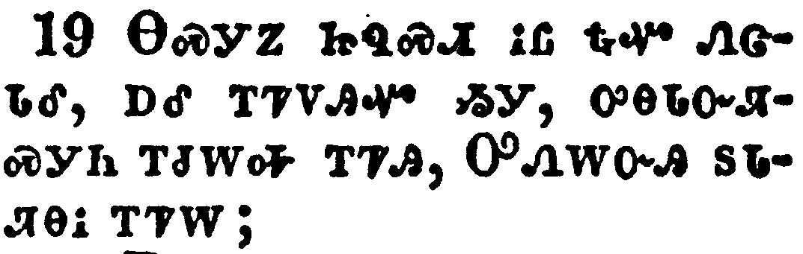

+++
draft=false
date = 2014-12-18T21:11:07Z
title = "Ephesians - Chapter 2 - Cherokee New Testament"
weight = 1418955067

[taxonomies]

authors = ["Timothy Legg"]
categories = []
tags = []

[extra]
+++

<table>
<tbody>
<tr class="odd">
<td></td>
</tr>
<tr class="even">
<td>And you hath he quickened, who were dead in trespasses and sins;</td>
</tr>
<tr class="odd">
<td>ᏂᎯᏃ ᏗᏥᏲᎱᏒᎯ ᏥᎨᏒ ᎤᏣᏘᏂ ᏂᏣᏛᏁᎸ ᎠᎴ ᎢᏥᏍᎦᏅᏨᎢ;^</td>
</tr>
<tr class="even">
<td>Ni-hi-no di-tsi-yo-hu-sv-hi tsi-ge-sv u-tsa-ti-ni ni-tsa-dv-ne-lv a-le i-tsi-s-ga-nv-tsv-i;^</td>
</tr>
</tbody>
</table>

<table>
<tbody>
<tr class="odd">
<td></td>
</tr>
<tr class="even">
<td>Wherein in time past ye walked according to the course of this world, according to the prince of the power of the air, the spirit that now worketh in the children of disobedience:</td>
</tr>
<tr class="odd">
<td>ᎾᎿᎭᏂ ᏧᏩᎫᏔᏅᏒ ᎢᏤᏙᎸᎢ ᎾᏍᎩᏯ ᎢᏳᎾᏛᏁᏗ ᎨᏒ ᎡᎶᎲ ᎠᏁᎯ, ᎾᏍᎩᏯ [ᎤᏚᎵᏍᎬ] ᎦᏃᎴᏍᎬ ᎡᎯ ᎡᎬᏫᏳᏌᏕᎩ, ᎾᏍᎩ ᎠᏓᏅᏙ ᎪᎯ ᎨᏒ ᏥᏚᎸᏫᏍᏓᏁ ᏚᎾᏓᏅᏛ ᎪᎯᏳᏗ ᏂᎨᏒᎾ ᎨᏒ ᏧᏪᏥ;</td>
</tr>
<tr class="even">
<td>Na-hna-ni tsu-wa-gu-ta-nv-sv i-tse-do-lv-i na-s-gi-ya i-yu-na-dv-ne-di ge-sv e-lo-hv a-ne-hi, na-s-gi-ya [u-du-li-s-gv] ga-no-le-s-gv e-hi e-gv-wi-yu-sa-de-gi, na-s-gi a-da-nv-do go-hi ge-sv tsi-du-lv-wi-s-da-ne du-na-da-nv-dv go-hi-yu-di ni-ge-sv-na ge-sv tsu-we-tsi;</td>
</tr>
</tbody>
</table>

<table>
<tbody>
<tr class="odd">
<td></td>
</tr>
<tr class="even">
<td>Among whom also we all had our conversation in times past in the lusts of our flesh, fulfilling the desires of the flesh and of the mind; and were by nature the children of wrath, even as others.</td>
</tr>
<tr class="odd">
<td>ᎾᏍᎩ ᎾᏍᏉ ᏧᏩᎫᏔᏅᏒ ᏂᏗᎥ ᎨᏓᎵᎪᏁᎲᎩ ᎾᎿᎭᎢᎩᏇᏓᎸ ᎤᎬᎥᏍᎬᎢ, ᎠᎴ ᎤᏇᏓᎸ ᎠᎴ ᎠᏓᏅᏖᏗ ᎨᏒ ᎤᎾᏚᎵᏍᎬ ᏂᏓᏛᏁᎲᎩ; ᎠᎴ ᏗᎦᏕᏅ ᏂᎦᏍᏛ ᎤᏔᎳᏬᎯᏍᏗ ᎨᏒ ᏧᏪᏥ ᎨᏒᎩ, ᎾᏍᎩᏯᏉ ᎠᏂᏐᎢ ᏄᎾᏍᏛᎢ.</td>
</tr>
<tr class="even">
<td>Na-s-gi na-s-quo tsu-wa-gu-ta-nv-sv ni-di-v ge-da-li-go-ne-hv-gi na-hna i-gi-que-da-lv u-gv-v-s-gv-i, a-le u-que-da-lv a-le a-da-nv-te-di ge-sv u-na-du-li-s-gv ni-da-dv-ne-hv-gi; a-le di-ga-de-nv ni-ga-s-dv u-ta-la-wo-hi-s-di ge-sv tsu-we-tsi ge-sv-gi, na-s-gi-ya-quo a-ni-so-i nu-na-s-dv-i.</td>
</tr>
</tbody>
</table>

<table>
<tbody>
<tr class="odd">
<td></td>
</tr>
<tr class="even">
<td>But God, who is rich in mercy, for his great love wherewith he loved us,</td>
</tr>
<tr class="odd">
<td>ᎠᏎᏃ ᎤᏁᎳᏅᎯ ᎤᏪᎿᎭᎢᏳ ᏥᎩ ᎤᏓᏙᎵᏍᏗ ᎨᏒᎢ, ᏥᏅᏗᎦᎵᏍᏙᏗᏍᎨ ᎤᏣᏘ ᎤᏓᎨᏳᏗ ᎨᏒ ᏧᏩᏔᏁ ᎠᏴ ᎢᎩᎨᏳᎯᏳ ᏥᏄᎵᏍᏔᏁᎢ,</td>
</tr>
<tr class="even">
<td>A-se-no U-ne-la-nv-hi u-we-hna-i-yu tsi-gi u-da-do-li-s-di ge-sv-i, tsi-nv-di-ga-li-s-do-di-s-ge u-tsa-ti u-da-ge-yu-di ge-sv tsu-wa-ta-ne a-yv i-gi-ge-yu-hi-yu tsi-nu-li-s-ta-ne-i,</td>
</tr>
</tbody>
</table>

<table>
<tbody>
<tr class="odd">
<td></td>
</tr>
<tr class="even">
<td>Even when we were dead in sins, hath quickened us together with Christ, (by grace ye are saved;)</td>
</tr>
<tr class="odd">
<td>ᎾᏍᎩ ᎠᏍᎦᏅᎢᏍᏗ ᎨᏒ ᏗᎩᏲᎱᏒᎯ ᏥᎨᏒᎩ, ᎢᎬᏂᏛ ᎢᎦᏠᏯᏍᏔᏅ ᎦᎶᏁᏛ ᎠᎬᏂᏛᎢ, (ᎬᏩᎦᏘᏯ ᏅᏓᏙᎵᏍᏗ ᎨᏒ ᎡᏥᏍᏕᎸᏔᏅ;)</td>
</tr>
<tr class="even">
<td>Na-s-gi a-s-ga-nv-i-s-di ge-sv di-gi-yo-hu-sv-hi tsi-ge-sv-gi, i-gv-ni-dv i-ga-tlo-ya-s-ta-nv Ga-lo-ne-dv a-gv-ni-dv-i, (gv-wa-ga-ti-ya nv-da-do-li-s-di ge-sv e-tsi-s-de-lv-ta-nv;)</td>
</tr>
</tbody>
</table>

<table>
<tbody>
<tr class="odd">
<td></td>
</tr>
<tr class="even">
<td>And hath raised us up together, and made us sit together in heavenly places in Christ Jesus:</td>
</tr>
<tr class="odd">
<td>ᎠᎴ ᎢᏧᎳᎭ ᏕᎦᎴᎯᏐᏔᏅ, ᎠᎴ ᎢᏧᎳᎭ ᎢᎦᏅᏗᏱ ᏂᎬᏁᎸ ᎦᎸᎳᏗ ᏗᎨᏒ ᎦᎶᏁᏛ ᏥᏌ ᎢᏳᏩᏂᏌᏛ;</td>
</tr>
<tr class="even">
<td>A-le i-tsu-la-ha de-ga-le-hi-so-ta-nv, a-le i-tsu-la-ha i-ga-nv-di-yi ni-gv-ne-lv ga-lv-la-di di-ge-sv Ga-lo-ne-dv Tsi-sa i-yu-wa-ni-sa-dv;</td>
</tr>
</tbody>
</table>

<table>
<tbody>
<tr class="odd">
<td></td>
</tr>
<tr class="even">
<td>That in the ages to come he might shew the exceeding riches of his grace in his kindness toward us through Christ Jesus.</td>
</tr>
<tr class="odd">
<td>ᎾᏍᎩ Ꮎ ᏭᏩᎫᏗᏗᏒ ᎬᏂᎨᏒ ᎢᏳᏩᏁᏗᏱ ᏂᎦᎥ ᎤᏪᎿᎭᎢᏳ ᎨᏒ ᎬᏩᎦᏘᏯ ᎤᏓᏙᎵᏍᏗ ᎨᏒᎢ, ᏂᎦᎥ ᎣᏍᏛ ᏂᎦᏛᏁᎲ ᎦᎶᏁᏛ ᏥᏌ ᏅᏓᏳᏓᎴᏅᎯ.</td>
</tr>
<tr class="even">
<td>Na-s-gi na wu-wa-gu-di-di-sv gv-ni-ge-sv i-yu-wa-ne-di-yi ni-ga-v u-we-hna-i-yu ge-sv gv-wa-ga-ti-ya u-da-do-li-s-di ge-sv-i, ni-ga-v o-s-dv ni-ga-dv-ne-hv Ga-lo-ne-dv Tsi-sa nv-da-yu-da-le-nv-hi.</td>
</tr>
</tbody>
</table>

<table>
<tbody>
<tr class="odd">
<td></td>
</tr>
<tr class="even">
<td>For by grace are ye saved through faith; and that not of yourselves: it is the gift of God:</td>
</tr>
<tr class="odd">
<td>ᎬᏩᎦᏘᏯᏰᏃ ᎤᏓᏙᎵᏍᏗ ᎨᏒ ᎡᏥᏍᏕᎸᏙᏔᏅᎯ ᎪᎯᏳᏗ ᎨᏒ ᎬᏔᏅᎯ; ᎠᎴ ᎾᏍᎩ ᎥᏝ ᎢᏨᏒ ᎨᏒ ᏅᏓᏳᏓᎴᏅᎯ; ᎤᏁᎳᏅᎯ ᎤᎵᏍᎪᎸᏔᏅᎯ;</td>
</tr>
<tr class="even">
<td>Gv-wa-ga-ti-ya-ye-no u-da-do-li-s-di ge-sv e-tsi-s-de-lv-do-ta-nv-hi go-hi-yu-di ge-sv gv-ta-nv-hi; a-le na-s-gi v-tla i-tsv-sv ge-sv nv-da-yu-da-le-nv-hi; U-ne-la-nv-hi u-li-s-go-lv-ta-nv-hi;</td>
</tr>
</tbody>
</table>

<table>
<tbody>
<tr class="odd">
<td></td>
</tr>
<tr class="even">
<td>Not of works, lest any man should boast.</td>
</tr>
<tr class="odd">
<td>ᎥᏝ ᏗᎦᎸᏫᏍᏓᏁᏗ ᎨᏒ ᎢᏳᏩᏂᏌᏛ ᏱᎩ, ᎾᏍᎩ ᎩᎶ ᎤᏢᏈᏍᏗᏱ ᏂᎨᏒᎾ ᎢᏳᎵᏍᏙᏗᏱ.</td>
</tr>
<tr class="even">
<td>V-tla di-ga-lv-wi-s-da-ne-di ge-sv i-yu-wa-ni-sa-dv yi-gi, na-s-gi gi-lo u-tlv-qui-s-di-yi ni-ge-sv-na i-yu-li-s-do-di-yi.</td>
</tr>
</tbody>
</table>

<table>
<tbody>
<tr class="odd">
<td></td>
</tr>
<tr class="even">
<td>For we are his workmanship, created in Christ Jesus unto good works, which God hath before ordained that we should walk in them.</td>
</tr>
<tr class="odd">
<td>ᎾᏍᎩᏰᏃ ᎠᏴ ᎢᎪᏢᏅᎯ, ᎦᎶᏁᏛ ᏥᏌ ᎢᏳᏩᏂᏌᏛ ᎡᎪᏢᏅᎯ ᎣᏍᏛ ᏗᎩᎸᏫᏍᏓᏁᏗᏱ, ᎤᏁᎳᏅᎯ ᎾᏍᎩ ᏥᏂᎦᏛᏅᎢᏍᏓᏁᏟ ᎾᎿᎭᎢᎨᏓᏍᏗᏱ.</td>
</tr>
<tr class="even">
<td>Na-s-gi-ye-no a-yv i-go-tlv-nv-hi, Ga-lo-ne-dv Tsi-sa i-yu-wa-ni-sa-dv e-go-tlv-nv-hi o-s-dv di-gi-lv-wi-s-da-ne-di-yi, U-ne-la-nv-hi na-s-gi tsi-ni-ga-dv-nv-i-s-da-ne-tli na-hna i-ge-da-s-di-yi.</td>
</tr>
</tbody>
</table>

<table>
<tbody>
<tr class="odd">
<td></td>
</tr>
<tr class="even">
<td>Wherefore remember, that ye being in time past Gentiles in the flesh, who are called Uncircumcision by that which is called the Circumcision in the flesh made by hands;</td>
</tr>
<tr class="odd">
<td>ᎾᏍᎩ ᎢᏳᏍᏗ ᎢᏣᏅᏖᏍᏗ ᎾᏍᎩ ᏂᎯ ᏧᏩᎫᏔᏅᏒ ᏗᏣᏓᎴᏅᏛ ᏴᏫ ᎤᏇᏓᎵ ᎨᏒᎢ, ᏂᏗᎨᏥᎤᏍᏕᏎᎸᎾ ᎨᏦᏎᎸᎯ ᎾᏍᎩ Ꮎ ᏗᎨᏥᎤᏍᏕᏎᎸᎯ ᎨᎪᏎᎯ ᏥᎩ, ᎾᏍᎩ ᎤᏇᏓᎸ ᏗᎨᏥᎤᏍᏕᏎᎸᎯ ᏗᎪᏱ ᏗᎬᏔᏅᎯ;</td>
</tr>
<tr class="even">
<td>Na-s-gi i-yu-s-di i-tsa-nv-te-s-di na-s-gi ni-hi tsu-wa-gu-ta-nv-sv di-tsa-da-le-nv-dv yv-wi u-que-da-li ge-sv-i, ni-di-ge-tsi-u-s-de-se-lv-na ge-tso-se-lv-hi na-s-gi na di-ge-tsi-u-s-de-se-lv-hi ge-go-se-hi tsi-gi, na-s-gi u-que-da-lv di-ge-tsi-u-s-de-se-lv-hi di-go-yi di-gv-ta-nv-hi;</td>
</tr>
</tbody>
</table>

<table>
<tbody>
<tr class="odd">
<td></td>
</tr>
<tr class="even">
<td>That at that time ye were without Christ, being aliens from the commonwealth of Israel, and strangers from the covenants of promise, having no hope, and without God in the world:</td>
</tr>
<tr class="odd">
<td>ᎾᏍᎩ ᎾᎯᏳ ᏥᎨᏎ ᎦᎶᏁᏛ ᏂᏤᎲᎾ ᎨᏎᎢ, ᏂᏤᎸᎾᏉ ᎨᏎ ᎢᏏᎵ ᎠᏰᎵ ᎤᏃᏢᏒᎢ, ᎠᎴ ᎢᏥᎪᏁᎳ ᎨᏎ ᎧᏃᎮᏛ ᏓᏠᎯᏍᏛ ᎠᏚᎢᏍᏛᎢ, ᎤᏚᎩ ᏂᏨᏒᎾ, ᎠᎴ ᎤᏁᎳᏅᎯ ᏂᏤᎲᎾ ᎨᏎ ᎠᏂ ᎡᎶᎯ.</td>
</tr>
<tr class="even">
<td>Na-s-gi na-hi-yu tsi-ge-se Ga-lo-ne-dv ni-tse-hv-na ge-se-i, ni-tse-lv-na-quo ge-se I-si-li a-ye-li u-no-tlv-sv-i, a-le i-tsi-go-ne-la ge-se ka-no-he-dv da-tlo-hi-s-dv a-du-i-s-dv-i, u-du-gi ni-tsv-sv-na, a-le U-ne-la-nv-hi ni-tse-hv-na ge-se a-ni e-lo-hi.</td>
</tr>
</tbody>
</table>

<table>
<tbody>
<tr class="odd">
<td></td>
</tr>
<tr class="even">
<td>But now in Christ Jesus ye who sometimes were far off are made nigh by the blood of Christ.</td>
</tr>
<tr class="odd">
<td>ᎪᎯᏍᎩᏂ ᏥᎩ, ᎦᎶᏁᏛ ᏥᏌ ᎢᏳᏩᏂᏌᏛ, ᏂᎯ, ᎢᏅᎯᏳ ᏥᏂᏣᏛᎿᎭᏕᎬᎩ, ᎾᎥ ᏕᏣᏘᏃᎸ ᎬᏔᏅᎯ ᎤᎩᎬ ᎦᎶᏁᏛ.</td>
</tr>
<tr class="even">
<td>Go-hi-s-gi-ni tsi-gi, Ga-lo-ne-dv Tsi-sa i-yu-wa-ni-sa-dv, ni-hi, i-nv-hi-yu tsi-ni-tsa-dv-hna-de-gv-gi, na-v de-tsa-ti-no-lv gv-ta-nv-hi u-gi-gv Ga-lo-ne-dv.</td>
</tr>
</tbody>
</table>

<table>
<tbody>
<tr class="odd">
<td></td>
</tr>
<tr class="even">
<td>For he is our peace, who hath made both one, and hath broken down the middle wall of partition between us;</td>
</tr>
<tr class="odd">
<td>ᎢᎪᎯᏍᏓᏁᎯᏰᏃ ᎾᏍᎩ, ᎢᏧᎳ ᏌᏉᏉ ᎢᎬᏁᎸᎯ, ᎠᎴ ᎤᏲᏍᏔᏅᎯ ᎢᎦᏓᏓᎴᏗᏍᎩ ᎠᏐᏴᎢ;</td>
</tr>
<tr class="even">
<td>I-go-hi-s-da-ne-hi-ye-no na-s-gi, i-tsu-la sa-quo-quo i-gv-ne-lv-hi, a-le u-yo-s-ta-nv-hi i-ga-da-da-le-di-s-gi a-so-yv-i;</td>
</tr>
</tbody>
</table>

<table>
<tbody>
<tr class="odd">
<td></td>
</tr>
<tr class="even">
<td>Having abolished in his flesh the enmity, even the law of commandments contained in ordinances; for to make in himself of twain one new man, so making peace;</td>
</tr>
<tr class="odd">
<td>ᎤᏇᏓᎸ ᎬᏗᏍᎬ ᎤᏛᏔᏅ ᏗᏓᏓᏍᎦᎩ ᎢᎬᏁᎯ, ᎾᏍᎩ ᏯᏛᏅ ᏗᎧᎿᎭᏩᏛᏍᏗ ᎤᎵᏁᏨᎢ ᏧᏓᎴᏅᏛ ᎢᏯᏛᏁᎵᏓᏍᏗ ᎨᏒᎢ; ᎾᏍᎩ ᎠᏂᏔᎵ ᎨᏒ ᏌᏉ ᎢᏤ ᏴᏫ ᎤᏬᏢᏗᏱ ᎤᏩᏒ ᎢᏳᏩᏂᏐᏗᏱ, ᎾᏍᎩᏃ ᏙᎯ ᎢᏳᏩᏁᏗᏱ;</td>
</tr>
<tr class="even">
<td>U-que-da-lv gv-di-s-gv u-dv-ta-nv di-da-da-s-ga-gi i-gv-ne-hi, na-s-gi ya-dv-nv di-ka-hna-wa-dv-s-di u-li-ne-tsv-i tsu-da-le-nv-dv i-ya-dv-ne-li-da-s-di ge-sv-i; na-s-gi a-ni-ta-li ge-sv sa-quo i-tse yv-wi u-wo-tlv-di-yi u-wa-sv i-yu-wa-ni-so-di-yi, na-s-gi-no do-hi i-yu-wa-ne-di-yi;</td>
</tr>
</tbody>
</table>

<table>
<tbody>
<tr class="odd">
<td></td>
</tr>
<tr class="even">
<td>And that he might reconcile both unto God in one body by the cross, having slain the enmity thereby:</td>
</tr>
<tr class="odd">
<td>ᎠᎴ ᎾᏍᎩ ᎢᏳᏩᏂᏐᏗᏱ ᎢᏧᎳ ᏌᏉ ᎠᏰᎸ ᏄᎾᏛᏅ ᏙᎯᏱ ᎢᏳᏅᏁᏗᏱ ᎤᏁᎳᏅᎯ, ᏓᏓᎿᎭᏩᏍᏛ ᎤᏮᏙᏗᏱ, ᎾᏍᎩ ᎤᏮᏔᏅ ᎤᎸ ᏓᎾᏓᏍᎦᎬᎢ.</td>
</tr>
<tr class="even">
<td>A-le na-s-gi i-yu-wa-ni-so-di-yi i-tsu-la sa-quo a-ye-lv nu-na-dv-nv do-hi-yi i-yu-nv-ne-di-yi U-ne-la-nv-hi, da-da-hna-wa-s-dv u-wv-do-di-yi, na-s-gi u-wv-ta-nv u-lv da-na-da-s-ga-gv-i.</td>
</tr>
</tbody>
</table>

<table>
<tbody>
<tr class="odd">
<td></td>
</tr>
<tr class="even">
<td>And came and preached peace to you which were afar off, and to them that were nigh.</td>
</tr>
<tr class="odd">
<td>ᎠᎴ ᎤᎷᏤᎢ ᎠᎴ ᎤᎵᏥᏙᏁ ᎢᏥᏃᎯᎮᎴ ᎾᏍᎩ ᏙᎯ ᎢᏥᏩᏛᎡᎯ ᎨᏒᎢ, ᏂᎯ ᎢᏅ ᎢᏣᏛᎿᎭᏕᎩ, ᎠᎴ ᎾᏍᎩ Ꮎ ᎾᎥ ᎢᏳᎾᏛᎿᎭᏕᎩ.</td>
</tr>
<tr class="even">
<td>A-le u-lu-tse-i a-le u-li-tsi-do-ne i-tsi-no-hi-he-le na-s-gi do-hi i-tsi-wa-dv-e-hi ge-sv-i, ni-hi i-nv i-tsa-dv-hna-de-gi, a-le na-s-gi na na-v i-yu-na-dv-hna-de-gi.</td>
</tr>
</tbody>
</table>

<table>
<tbody>
<tr class="odd">
<td></td>
</tr>
<tr class="even">
<td>For through him we both have access by one Spirit unto the Father.</td>
</tr>
<tr class="odd">
<td>ᎾᏍᎩᏰᏃ ᎢᏳᏩᏂᏌᏛ ᎠᏴ ᎢᏧᎳ, ᏌᏉ ᎠᏓᏅᏙ ᎬᏗ, ᎠᎦᏴᎵᎨ ᏫᎦᏰᏗᎷᏤᏗ ᏄᎵᏍᏔᏅ.</td>
</tr>
<tr class="even">
<td>Na-s-gi-ye-no i-yu-wa-ni-sa-dv a-yv i-tsu-la, sa-quo A-da-nv-do gv-di, A-ga-yv-li-ge wi-ga-ye-di-lu-tse-di nu-li-s-ta-nv.</td>
</tr>
</tbody>
</table>

<table>
<tbody>
<tr class="odd">
<td></td>
</tr>
<tr class="even">
<td>Now therefore ye are no more strangers and foreigners, but fellowcitizens with the saints, and of the household of God;</td>
</tr>
<tr class="odd">
<td>ᎾᏍᎩᏃ ᏥᏄᏍᏗ ᎥᏝ ᎿᎭᏉ ᏁᏣᏓᎴ, ᎠᎴ ᎢᏤᏙᎯᏉ ᏱᎩ, ᎤᎾᏓᏅᏘᏍᎩᏂ ᎢᏧᎳᎭ ᎢᏤᎯ, ᎤᏁᎳᏅᎯ ᎦᏓᏘᎾᎥ ᎢᏖᎳ;</td>
</tr>
<tr class="even">
<td>Na-s-gi-no tsi-nu-s-di v-tla hna-quo ne-tsa-da-le, a-le i-tse-do-hi-quo yi-gi, u-na-da-nv-ti-s-gi-ni i-tsu-la-ha i-tse-hi, U-ne-la-nv-hi ga-da-ti-na-v i-te-la;</td>
</tr>
</tbody>
</table>

<table>
<tbody>
<tr class="odd">
<td></td>
</tr>
<tr class="even">
<td>And are built upon the foundation of the apostles and prophets, Jesus Christ himself being the chief corner stone;</td>
</tr>
<tr class="odd">
<td>ᎡᏣᏁᏍᎨᎲᎯ ᎨᏒ ᎡᏥᏝᏅᎯ ᎨᏥᏅᏏᏛ ᎠᎴ ᎠᎾᏙᎴᎰᏍᎩ ᎡᏥᎫᏍᏛᏔᏅᎯ, ᏥᏌ ᎦᎶᏁᏛ ᎤᏩᏒ ᏄᎬᏫᏳᏒ ᎤᏅᏏᏴ Ꭰ'ᏅᎯ ᏅᏯ ᎢᏳᎵᏍᏔᏅᎯ;</td>
</tr>
<tr class="even">
<td>E-tsa-ne-s-ge-hv-hi ge-sv e-tsi-tla-nv-hi ge-tsi-nv-si-dv a-le a-na-do-le-ho-s-gi e-tsi-gu-s-dv-ta-nv-hi, Tsi-sa Ga-lo-ne-dv u-wa-sv nu-gv-wi-yu-sv u-nv-si-yv a'nv-hi nv-ya i-yu-li-s-ta-nv-hi;</td>
</tr>
</tbody>
</table>

<table>
<tbody>
<tr class="odd">
<td></td>
</tr>
<tr class="even">
<td>In whom all the building fitly framed together groweth unto an holy temple in the Lord:</td>
</tr>
<tr class="odd">
<td>ᎾᎿᎭᏂ ᏂᎬ ᎠᏓᏁᎸ ᎣᏍᏛ ᏗᏓᏙᎵᎩ ᎢᎬᏁᎸᎯ, ᎠᏛᏍᎪᎢ ᎦᎸᏉᏗ ᎠᏓᏁᎸ ᏂᎦᎵᏍᏗᏍᎪ ᎤᎬᏫᏳᎯᏱ ᎠᏝᏅᎯ;</td>
</tr>
<tr class="even">
<td>Na-hna-ni ni-gv a-da-ne-lv o-s-dv di-da-do-li-gi i-gv-ne-lv-hi, a-dv-s-go-i ga-lv-quo-di a-da-ne-lv ni-ga-li-s-di-s-go U-gv-wi-yu-hi-yi a-tla-nv-hi;</td>
</tr>
</tbody>
</table>

<table>
<tbody>
<tr class="odd">
<td></td>
</tr>
<tr class="even">
<td>In whom ye also are builded together for an habitation of God through the Spirit.</td>
</tr>
<tr class="odd">
<td>ᎾᎿᎭᏂ ᎾᏍᏉ ᏂᎯ ᏤᏣᏜᏓᏍᏔᏅᎯ ᎡᏣᏁᏍᎨᎲᎯ ᎡᏥᏝᏅᎯ, ᎤᏁᎳᏅᎯ ᎤᏁᎳᏗᏍᏗᏱ ᎠᏓᏅᏙ ᎬᏗᏍᎬᎢ.</td>
</tr>
<tr class="even">
<td>Na-hna-ni na-s-quo ni-hi tse-tsa-dla-s-ta-nv-hi e-tsa-ne-s-ge-hv-hi e-tsi-tla-nv-hi, U-ne-la-nv-hi u-ne-la-di-s-di-yi A-da-nv-do gv-di-s-gv-i.</td>
</tr>
</tbody>
</table>

