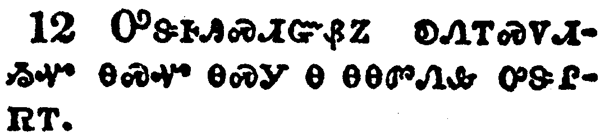

+++
draft=false
date = 2014-12-18T21:11:07Z
title = "Ephesians - Chapter 5 - Cherokee New Testament"
weight = 1418955067

[taxonomies]

authors = ["Timothy Legg"]
categories = []
tags = []

[extra]
+++

<table>
<tbody>
<tr class="odd">
<td></td>
</tr>
<tr class="even">
<td>Be ye therefore followers of God, as dear children;</td>
</tr>
<tr class="odd">
<td>ᎾᏍᎩ ᎢᏳᏍᏗ ᎤᏁᎳᏅᎯ ᎡᏥᏍᏓᏩᏕᎩ ᎨᏎᏍᏗ ᎾᏍᎩᏯ ᎢᏳᎾᏛᏁᏗ ᎨᏒ ᏧᎨᏳᎯ ᏧᏪᏥ;</td>
</tr>
<tr class="even">
<td>Na-s-gi i-yu-s-di U-ne-la-nv-hi e-tsi-s-da-wa-de-gi ge-se-s-di na-s-gi-ya i-yu-na-dv-ne-di ge-sv tsu-ge-yu-hi tsu-we-tsi;</td>
</tr>
</tbody>
</table>

<table>
<tbody>
<tr class="odd">
<td></td>
</tr>
<tr class="even">
<td>And walk in love, as Christ also hath loved us, and hath given himself for us an offering and a sacrifice to God for a sweet smelling savour.</td>
</tr>
<tr class="odd">
<td>ᎠᎴ ᎠᏓᎨᏳᏗ ᎨᏒ ᎬᏂᎨᏒ ᏂᏨᏁᎮᏍᏗ ᎢᏤᎲᎢ, ᎾᏍᎩᏯ ᎾᏍᏉ ᎦᎶᏁᏛ ᎢᎩᎨᏳᎯᏳ ᏥᎨᏒᎩ, ᎠᎴ ᏥᏕᎦᏓᏲᎯᏎᎸᎩ, ᎠᎵᏍᎪᎸᏓᏁᏗ ᎠᎴ ᎠᏥᎸ ᎨᎴᏗ ᏥᏄᎵᏍᏔᏅ ᎤᏁᎳᏅᎯ ᎤᎦᎾᏍᏛ ᎤᏪᏩᏒᎢᏍᏗ.</td>
</tr>
<tr class="even">
<td>A-le a-da-ge-yu-di ge-sv gv-ni-ge-sv ni-tsv-ne-he-s-di i-tse-hv-i, na-s-gi-ya na-s-quo Ga-lo-ne-dv i-gi-ge-yu-hi-yu tsi-ge-sv-gi, a-le tsi-de-ga-da-yo-hi-se-lv-gi, a-li-s-go-lv-da-ne-di a-le a-tsi-lv ge-le-di tsi-nu-li-s-ta-nv U-ne-la-nv-hi u-ga-na-s-dv u-we-wa-sv-i-s-di.</td>
</tr>
</tbody>
</table>

<table>
<tbody>
<tr class="odd">
<td></td>
</tr>
<tr class="even">
<td>But fornication, and all uncleanness, or covetousness, let it not be once named among you, as becometh saints;</td>
</tr>
<tr class="odd">
<td>ᎡᏕᎵᏛᏍᎩᏂ ᏗᏂᏏᏗ ᎨᏒᎢ, ᎠᎴ ᏄᏓᎴᏒᏉ ᎦᏓᎭ ᎨᏒᎢ, ᎠᎴ ᏧᎬᏩᎶᏗ ᎠᎬᎥᎯᏍᏗ ᎨᏒᎢ, ᏞᏍᏗ ᎧᏁᎢᏍᏙᏗ ᎤᏅ ᏱᎨᏎᏍᏗ ᎢᏤᎲᎢ, ᎾᏍᎩ ᏧᏂᎵᎶᎲᏍᎦ ᎤᎾᏓᏅᏘ;</td>
</tr>
<tr class="even">
<td>E-de-li-dv-s-gi-ni di-ni-si-di ge-sv-i, a-le nu-da-le-sv-quo ga-da-ha ge-sv-i, a-le tsu-gv-wa-lo-di a-gv-v-hi-s-di ge-sv-i, tle-s-di ka-ne-i-s-do-di u-nv yi-ge-se-s-di i-tse-hv-i, na-s-gi tsu-ni-li-lo-hv-s-ga u-na-da-nv-ti;</td>
</tr>
</tbody>
</table>

<table>
<tbody>
<tr class="odd">
<td></td>
</tr>
<tr class="even">
<td>Neither filthiness, nor foolish talking, nor jesting, which are not convenient: but rather giving of thanks.</td>
</tr>
<tr class="odd">
<td>ᏞᏍᏗ ᎠᎴ ᎪᎱᏍᏗ ᎤᏁᎢᎸᏗ ᎨᏒᎢ, ᎠᎴ ᎠᎵᏍᎦᏁᏛ ᎦᏬᏂᎯᏍᏗ ᎨᏒᎢ, ᎠᎴ ᎦᏪᏢᏗ ᎨᏒᎢ, ᎾᏍᎩ ᏃᏒᎾ ᏥᎩ; ᎠᎵᎮᎵᏤᏗᏱᏉᏍᎩᏂ [ᎤᏁᎳᏅᎯ] ᎤᎬᏫᏳᏎᏍᏗ.</td>
</tr>
<tr class="even">
<td>Tle-s-di a-le go-hu-s-di u-ne-i-lv-di ge-sv-i, a-le a-li-s-ga-ne-dv ga-wo-ni-hi-s-di ge-sv-i, a-le ga-we-tlv-di ge-sv-i, na-s-gi no-sv-na tsi-gi; a-li-he-li-tse-di-yi-quo-s-gi-ni [U-ne-la-nv-hi] u-gv-wi-yu-se-s-di.</td>
</tr>
</tbody>
</table>

<table>
<tbody>
<tr class="odd">
<td></td>
</tr>
<tr class="even">
<td>For this ye know, that no whoremonger, nor unclean person, nor covetous man, who is an idolater, hath any inheritance in the kingdom of Christ and of God.</td>
</tr>
<tr class="odd">
<td>ᎯᎠᏰᏃ ᎾᏍᎩ ᎢᏥᎦᏔᎭ, ᎾᏍᎩ ᎩᎶ ᎤᏕᎵᏛ ᏗᏂᏏᎲᏍᎩ, ᎠᎴ ᎠᎦᏓᎭᎢ, ᎠᎴ ᏧᎬᏩᎶᏗ ᎤᎬᎥᏍᎩ, ᎾᏍᎩ ᎤᏁᎳᏅᎯ ᎠᏰᎸᎯ ᎠᏓᏙᎵᏍᏓᏁᎯ ᎨᏒᎢ, ᎤᏤᎵ ᎢᏳᎵᏍᏙᏗ ᏂᎨᏒᎾ ᎨᏒ ᎦᎶᏁᏛ ᎤᏤᎵᎪᎯ ᎠᎴ ᎤᏁᎳᏅᎯ ᎤᏤᎵᎪᎯ.</td>
</tr>
<tr class="even">
<td>Hi-a-ye-no na-s-gi i-tsi-ga-ta-ha, na-s-gi gi-lo u-de-li-dv di-ni-si-hv-s-gi, a-le a-ga-da-ha-i, a-le tsu-gv-wa-lo-di u-gv-v-s-gi, na-s-gi U-ne-la-nv-hi a-ye-lv-hi a-da-do-li-s-da-ne-hi ge-sv-i, u-tse-li i-yu-li-s-do-di ni-ge-sv-na ge-sv Ga-lo-ne-dv u-tse-li-go-hi a-le U-ne-la-nv-hi u-tse-li-go-hi.</td>
</tr>
</tbody>
</table>

<table>
<tbody>
<tr class="odd">
<td></td>
</tr>
<tr class="even">
<td>Let no man deceive you with vain words: for because of these things cometh the wrath of God upon the children of disobedience.</td>
</tr>
<tr class="odd">
<td>ᏞᏍᏗ ᎩᎶ ᎢᏥᎶᏄᎮᏔᏅᎩ ᎪᎱᏍᏗ ᎬᏙᏗ ᏂᎨᏒᎾ ᎦᏬᏂᎯᏍᏗ ᎨᏒᎢ; ᎾᏍᎩᏰᏃ ᎯᎠ ᏅᏗᎦᎵᏍᏙᏗᎭ ᎤᏁᎳᏅᎯ ᎤᏔᎳᏬᎯᏍᏗ ᎨᏒ ᎤᏂᎷᏤᎭ ᎪᎯᏳᏗ ᏂᎨᏒᎾ ᎨᏒ ᏧᏪᏥ.</td>
</tr>
<tr class="even">
<td>Tle-s-di gi-lo i-tsi-lo-nu-he-ta-nv-gi go-hu-s-di gv-do-di ni-ge-sv-na ga-wo-ni-hi-s-di ge-sv-i; na-s-gi-ye-no hi-a nv-di-ga-li-s-do-di-ha u-ne-la-nv-hi u-ta-la-wo-hi-s-di ge-sv u-ni-lu-tse-ha go-hi-yu-di ni-ge-sv-na ge-sv tsu-we-tsi.</td>
</tr>
</tbody>
</table>

<table>
<tbody>
<tr class="odd">
<td></td>
</tr>
<tr class="even">
<td>Be not ye therefore partakers with them.</td>
</tr>
<tr class="odd">
<td>ᎾᏍᎩ ᎢᏳᏍᏗ ᏞᏍᏗ ᏂᎯ ᏱᏣᏠᏯᏍᏗᏍᎨᏍᏗ ᎤᎾᎵᏩᏛᎡᎲᎢ.</td>
</tr>
<tr class="even">
<td>Na-s-gi i-yu-s-di tle-s-di ni-hi yi-tsa-tlo-ya-s-di-s-ge-s-di u-na-li-wa-dv-e-hv-i.</td>
</tr>
</tbody>
</table>

<table>
<tbody>
<tr class="odd">
<td></td>
</tr>
<tr class="even">
<td>For ye were sometimes darkness, but now are ye light in the Lord: walk as children of light:</td>
</tr>
<tr class="odd">
<td>ᎢᎸᎯᏳᏰᏃ ᏥᎨᏒ ᎤᎵᏏᎬ ᎢᏤᎲᎩ, ᎪᎯᏍᎩᏂ ᎨᏒ ᎢᎦ-ᎦᏛ ᎢᏤᎭ ᎤᎬᏫᏳᎯ ᎢᏳᏩᏂᏌᏛ; ᎢᎦ-ᎦᏛ ᏧᏪᏥ ᎤᏁᏓᏍᏗ ᎨᏒ ᎢᏤᏙᎮᏍᏗ;</td>
</tr>
<tr class="even">
<td>I-lv-hi-yu-ye-no tsi-ge-sv u-li-si-gv i-tse-hv-gi, go-hi-s-gi-ni ge-sv i-ga--ga-dv i-tse-ha U-gv-wi-yu-hi i-yu-wa-ni-sa-dv; i-ga--ga-dv tsu-we-tsi u-ne-da-s-di ge-sv i-tse-do-he-s-di;</td>
</tr>
</tbody>
</table>

<table>
<tbody>
<tr class="odd">
<td></td>
</tr>
<tr class="even">
<td>(For the fruit of the Spirit is in all goodness and righteousness and truth;)</td>
</tr>
<tr class="odd">
<td>(ᎠᏓᏅᏙᏰᏃ ᎦᎾᏄᎪᏫᏍᎪ ᏂᎦᎥ ᎣᏍᏛ ᎨᏒ ᎠᎴ ᏚᏳᎪᏛ ᎨᏒ ᎠᎴ ᎦᏰᎪᎩ ᏂᎨᏒᎾ ᎨᏒᎢ,)</td>
</tr>
<tr class="even">
<td>(A-da-nv-do-ye-no ga-na-nu-go-wi-s-go ni-ga-v o-s-dv ge-sv a-le du-yu-go-dv ge-sv a-le ga-ye-go-gi ni-ge-sv-na ge-sv-i,)</td>
</tr>
</tbody>
</table>

<table>
<tbody>
<tr class="odd">
<td></td>
</tr>
<tr class="even">
<td>Proving what is acceptable unto the Lord.</td>
</tr>
<tr class="odd">
<td>ᎢᏥᎪᎵᏰᏍᎨᏍᏗ ᎾᏍᎩ ᎣᏏᏳ ᎤᏰᎸᏗ ᎨᏒ ᎤᎬᏫᏳᎯ.</td>
</tr>
<tr class="even">
<td>I-tsi-go-li-ye-s-ge-s-di na-s-gi o-si-yu u-ye-lv-di ge-sv U-gv-wi-yu-hi.</td>
</tr>
</tbody>
</table>

<table>
<tbody>
<tr class="odd">
<td></td>
</tr>
<tr class="even">
<td>And have no fellowship with the unfruitful works of darkness, but rather reprove them.</td>
</tr>
<tr class="odd">
<td>ᎠᎴ ᏞᏍᏗ ᏱᏗᏣᎵᎪᏁᎮᏍᏗ ᎾᏍᎩ ᎪᎱᏍᏗ ᎬᏙᏗ ᏂᎨᏒᎾ ᎤᎵᏏᎩ ᏗᎦᎸᏫᏍᏓᏁᏗ ᎨᏒᎢ, ᏕᏥᎬᏍᎪᎸᎥᏍᎨᏍᏗᏉᏍᎩᏂ.</td>
</tr>
<tr class="even">
<td>A-le tle-s-di yi-di-tsa-li-go-ne-he-s-di na-s-gi go-hu-s-di gv-do-di ni-ge-sv-na u-li-si-gi di-ga-lv-wi-s-da-ne-di ge-sv-i, de-tsi-gv-s-go-lv-v-s-ge-s-di-quo-s-gi-ni.</td>
</tr>
</tbody>
</table>

<table>
<tbody>
<tr class="odd">
<td></td>
</tr>
<tr class="even">
<td>For it is a shame even to speak of those things which are done of them in secret.</td>
</tr>
<tr class="odd">
<td>ᎤᏕᎰᎯᏍᏗᏳᏰᏃ ᎧᏁᎢᏍᏙᏗᏱᏉ ᎾᏍᏉ ᎾᏍᎩ Ꮎ ᎾᎾᏛᏁᎲ ᎤᏕᎵᏒᎢ.</td>
</tr>
<tr class="even">
<td>U-de-ho-hi-s-di-yu-ye-no ka-ne-i-s-do-di-yi-quo na-s-quo na-s-gi na na-na-dv-ne-hv u-de-li-sv-i.</td>
</tr>
</tbody>
</table>

<table>
<tbody>
<tr class="odd">
<td></td>
</tr>
<tr class="even">
<td>But all things that are reproved are made manifest by the light: for whatsoever doth make manifest is light.</td>
</tr>
<tr class="odd">
<td>ᏂᎦᎥᏍᎩᏂ ᏧᏓᎴᏅᏛ ᏗᎬᏍᎪᎸᏅᎯ ᏥᎨᏐ ᎢᎦ-ᎦᏘ ᎬᏗ ᎬᏂᎨᎡ ᎢᏗᎬᏁᎸᎯ ᎨᏐᎢ; ᎾᏍᎩᏰᏃ ᎬᏂᎨᏒ ᎢᏗᎬᏁᎯ ᎨᏒ ᎾᏍᎩ ᎢᎦ-ᎦᏘ.</td>
</tr>
<tr class="even">
<td>Ni-ga-v-s-gi-ni tsu-da-le-nv-dv di-gv-s-go-lv-nv-hi tsi-ge-so i-ga--ga-ti gv-di gv-ni-ge-e i-di-gv-ne-lv-hi ge-so-i; na-s-gi-ye-no gv-ni-ge-sv i-di-gv-ne-hi ge-sv na-s-gi i-ga--ga-ti.</td>
</tr>
</tbody>
</table>

<table>
<tbody>
<tr class="odd">
<td></td>
</tr>
<tr class="even">
<td>Wherefore he saith, Awake thou that sleepest, and arise from the dead, and Christ shall give thee light.</td>
</tr>
<tr class="odd">
<td>ᎾᏍᎩ ᎢᏳᏍᏗ ᎯᎠ ᏂᎦᏪᎭ, ᎯᏰᎩ ᏂᎯ ᎯᎵᎯ, ᎠᎴ ᏔᎴᎲᎦ ᎩᏯᏓᏅᏏ ᏧᏂᏲᎱᏒᎯ ᎩᏯᏓᏑᏴᎢ, ᎦᎶᏁᏛᏃ ᏓᏣᏁᎵ ᎢᎦ-ᎦᏘ.</td>
</tr>
<tr class="even">
<td>Na-s-gi i-yu-s-di hi-a ni-ga-we-ha, Hi-ye-gi ni-hi hi-li-hi, a-le ta-le-hv-ga gi-ya-da-nv-si tsu-ni-yo-hu-sv-hi gi-ya-da-su-yv-i, Ga-lo-ne-dv-no da-tsa-ne-li i-ga--ga-ti.</td>
</tr>
</tbody>
</table>

<table>
<tbody>
<tr class="odd">
<td></td>
</tr>
<tr class="even">
<td>See then that ye walk circumspectly, not as fools, but as wise,</td>
</tr>
<tr class="odd">
<td>ᎾᏍᎩ ᎢᏳᏍᏗ ᎢᏣᎦᏌᏯᏍᏕᏍᏗ ᏂᎦᎥ ᏚᏳᎪᏛ ᎢᏣᎴᏂᏓᏍᏗᏱ, ᏞᏍᏗ ᎤᏂᏁᎫ ᎢᏳᎾᏛᏁᏗ, ᎠᏂᎦᏔᎾᎢᏍᎩᏂ ᎢᏳᎾᏛᏁᏗ,</td>
</tr>
<tr class="even">
<td>Na-s-gi i-yu-s-di i-tsa-ga-sa-ya-s-de-s-di ni-ga-v du-yu-go-dv i-tsa-le-ni-da-s-di-yi, tle-s-di u-ni-ne-gu i-yu-na-dv-ne-di, a-ni-ga-ta-na-i-s-gi-ni i-yu-na-dv-ne-di,</td>
</tr>
</tbody>
</table>

<table>
<tbody>
<tr class="odd">
<td></td>
</tr>
<tr class="even">
<td>Redeeming the time, because the days are evil.</td>
</tr>
<tr class="odd">
<td>ᎢᏧᏓᎴᏍᎨᏍᏗ ᎪᎯ ᎨᏒ ᎠᎵᏱᎵᏒᎢ, ᏅᏗᎦᎵᏍᏙᏗᏍᎨᏍᏗ ᎤᏲᎢᏳ ᎨᏒ ᎪᎯ ᎨᏒᎢ.</td>
</tr>
<tr class="even">
<td>I-tsu-da-le-s-ge-s-di go-hi ge-sv a-li-yi-li-sv-i, nv-di-ga-li-s-do-di-s-ge-s-di u-yo-i-yu ge-sv go-hi ge-sv-i.</td>
</tr>
</tbody>
</table>

<table>
<tbody>
<tr class="odd">
<td></td>
</tr>
<tr class="even">
<td>Wherefore be ye not unwise, but understanding what the will of the Lord is.</td>
</tr>
<tr class="odd">
<td>ᎾᏍᎩ ᎢᏳᏍᏗ ᏞᏍᏗ ᏂᏦᎵᎬᎾ ᏱᎨᏎᏍᏗ, ᎢᏦᎵᎩᏍᎩᏂ ᎨᏎᏍᏗ ᏄᏍᏛ ᎤᏚᎵᏍᎬ ᏅᎬᏫᏳᎯ.</td>
</tr>
<tr class="even">
<td>Na-s-gi i-yu-s-di tle-s-di ni-tso-li-gv-na yi-ge-se-s-di, i-tso-li-gi-s-gi-ni ge-se-s-di nu-s-dv u-du-li-s-gv Nv-gv-wi-yu-hi.</td>
</tr>
</tbody>
</table>

<table>
<tbody>
<tr class="odd">
<td></td>
</tr>
<tr class="even">
<td>And be not drunk with wine, wherein is excess; but be filled with the Spirit;</td>
</tr>
<tr class="odd">
<td>ᎾᏍᎩ ᏞᏍᏗ ᎩᎦᎨ ᎠᏗᏔᏍᏗ ᏱᏗᏥᏴᏍᏕᏍᏗᏍᎨᏍᏗ ᎾᏍᎩ ᎤᏣᏘ ᎤᏲᎢᏳ ᏥᎩ; ᎠᏓᏅᏙᏍᎩᏂ ᎢᏥᎧᎵᏬᎯ ᎨᏎᏍᏗ.</td>
</tr>
<tr class="even">
<td>Na-s-gi tle-s-di gi-ga-ge a-di-ta-s-di yi-di-tsi-yv-s-de-s-di-s-ge-s-di na-s-gi u-tsa-ti u-yo-i-yu tsi-gi; A-da-nv-do-s-gi-ni i-tsi-ka-li-wo-hi ge-se-s-di.</td>
</tr>
</tbody>
</table>

<table>
<tbody>
<tr class="odd">
<td></td>
</tr>
<tr class="even">
<td>Speaking to yourselves in psalms and hymns and spiritual songs, singing and making melody in your heart to the Lord;</td>
</tr>
<tr class="odd">
<td>ᏕᏣᎵᏃᎮᏍᎨᏍᏗ ᏕᏨᏗᏍᎨᏍᏗ ᎤᏁᎳᏅᎯ ᏗᎧᏃᎩᏍᏙᏗ, ᎠᎴ ᎦᎸᏉᏙᏗ ᏗᎧᏃᎩᏍᏗ, ᎠᎴ ᎠᏓᏅᏙ ᎤᎬᏩᎵ ᏗᎧᏃᎩᏍᏗ, ᏕᏥᏃᎩᏍᎨᏍᏗ ᏙᏗᏣᏓᏅᏛ ᏗᏓᎴᎲᏍᎨᏍᏗ ᎤᎬᏫᏳᎯ ᏕᏥᏃᎩᏍᏗᏍᎨᏍᏗ.</td>
</tr>
<tr class="even">
<td>De-tsa-li-no-he-s-ge-s-di de-tsv-di-s-ge-s-di U-ne-la-nv-hi di-ka-no-gi-s-do-di, a-le ga-lv-quo-do-di di-ka-no-gi-s-di, a-le a-da-nv-do u-gv-wa-li di-ka-no-gi-s-di, de-tsi-no-gi-s-ge-s-di do-di-tsa-da-nv-dv di-da-le-hv-s-ge-s-di U-gv-wi-yu-hi de-tsi-no-gi-s-di-s-ge-s-di.</td>
</tr>
</tbody>
</table>

<table>
<tbody>
<tr class="odd">
<td></td>
</tr>
<tr class="even">
<td>Giving thanks always for all things unto God and the Father in the name of our Lord Jesus Christ;</td>
</tr>
<tr class="odd">
<td>ᎡᏣᎵᎡᎵᏤᎮᏍᏗ ᏂᎪᎯᎸ ᎤᏁᎳᏅᎯ ᎠᎴ ᎠᎦᏴᎵᎨᎢ ᏅᏗᎦᎵᏍᏙᏗᏍᎨᏍᏗ ᏂᎦᎥ ᎪᎱᏍᏗ ᎤᎬᏩᎵ, ᎢᏨᏗᏍᎨᏍᏗ ᏚᏙᎥ ᎤᎬᏫᏳᎯ ᎢᎦᏤᎵ ᏥᏌ ᎦᎶᏁᏛ;</td>
</tr>
<tr class="even">
<td>E-tsa-li-e-li-tse-he-s-di ni-go-hi-lv U-ne-la-nv-hi a-le A-ga-yv-li-ge-i nv-di-ga-li-s-do-di-s-ge-s-di ni-ga-v go-hu-s-di u-gv-wa-li, i-tsv-di-s-ge-s-di du-do-v U-gv-wi-yu-hi i-ga-tse-li Tsi-sa Ga-lo-ne-dv;</td>
</tr>
</tbody>
</table>

<table>
<tbody>
<tr class="odd">
<td></td>
</tr>
<tr class="even">
<td>Submitting yourselves one to another in the fear of God.</td>
</tr>
<tr class="odd">
<td>ᏕᏣᏓᏙᎯᏳᎲᏍᎨᏍᏗ ᎢᏥᏏᏴᏫᎭ ᎨᏒ ᎤᏁᎳᏅᎯ ᎡᏥᎾᏰᏍᎬᎢ.</td>
</tr>
<tr class="even">
<td>De-tsa-da-do-hi-yu-hv-s-ge-s-di i-tsi-si-yv-wi-ha ge-sv U-ne-la-nv-hi e-tsi-na-ye-s-gv-i.</td>
</tr>
</tbody>
</table>

<table>
<tbody>
<tr class="odd">
<td></td>
</tr>
<tr class="even">
<td>Wives, submit yourselves unto your own husbands, as unto the Lord.</td>
</tr>
<tr class="odd">
<td>ᎢᏥᎨᏴ, ᎢᏨᏒ ᏗᎨᏥᏰᎯ ᏕᏦᎯᏳᏎᏍᏗ, ᎤᎬᏫᏳᎯ ᎪᎯᏳᏗ ᏥᎩ ᎾᏍᎩᏯᎢ.</td>
</tr>
<tr class="even">
<td>I-tsi-ge-yv, i-tsv-sv di-ge-tsi-ye-hi de-tso-hi-yu-se-s-di, U-gv-wi-yu-hi go-hi-yu-di tsi-gi na-s-gi-ya-i.</td>
</tr>
</tbody>
</table>

<table>
<tbody>
<tr class="odd">
<td></td>
</tr>
<tr class="even">
<td>For the husband is the head of the wife, even as Christ is the head of the church: and he is the saviour of the body.</td>
</tr>
<tr class="odd">
<td>ᎠᏍᎦᏯᏰᏃ ᏄᎬᏫᏳᏌᏕᎩ ᎤᏓᎵᎢ ᎡᎲᎢ, ᎾᏍᎩᏯ ᎦᎶᏁᏛ ᏄᎬᏫᏳᏌᏕᎩ ᏥᎩ ᏧᎾᏁᎶᏗ ᎤᎾᏓᏡᎬ ᎠᏁᎲᎢ; ᎠᎴ ᎾᏍᎩ ᎠᏍᏕᎵᏍᎩ ᎠᏰᎸᎢ.</td>
</tr>
<tr class="even">
<td>A-s-ga-ya-ye-no nu-gv-wi-yu-sa-de-gi u-da-li-i e-hv-i, na-s-gi-ya Ga-lo-ne-dv nu-gv-wi-yu-sa-de-gi tsi-gi tsu-na-ne-lo-di u-na-da-tlu-gv a-ne-hv-i; a-le na-s-gi A-s-de-li-s-gi a-ye-lv-i.</td>
</tr>
</tbody>
</table>

<table>
<tbody>
<tr class="odd">
<td></td>
</tr>
<tr class="even">
<td>Therefore as the church is subject unto Christ, so let the wives be to their own husbands in every thing.</td>
</tr>
<tr class="odd">
<td>ᎾᏍᎩ ᎢᏳᏍᏗ ᏧᎾᏁᎶᏗ ᎤᎾᏓᏡᎬ ᎦᎶᏁᏛ ᎬᏬᎯᏳᏗ ᏥᎩ, ᎾᏍᎩᏯ ᎠᏂᎨᏴ ᏗᎬᏩᏂᏰᎯ ᏧᏃᎯᏳᏗ ᏂᎦᎥ [ᏂᎬᏩᏂᏪᏎᎲᎢ.]</td>
</tr>
<tr class="even">
<td>Na-s-gi i-yu-s-di tsu-na-ne-lo-di u-na-da-tlu-gv Ga-lo-ne-dv gv-wo-hi-yu-di tsi-gi, na-s-gi-ya a-ni-ge-yv di-gv-wa-ni-ye-hi tsu-no-hi-yu-di ni-ga-v [ni-gv-wa-ni-we-se-hv-i.]</td>
</tr>
</tbody>
</table>

<table>
<tbody>
<tr class="odd">
<td></td>
</tr>
<tr class="even">
<td>Husbands, love your wives, even as Christ also loved the church, and gave himself for it;</td>
</tr>
<tr class="odd">
<td>ᎢᏥᏍᎦᏯ, ᏕᏥᎨᏳᏎᏍᏗ ᏗᏣᏓᎵᎢ, ᎾᏍᎩᏯ ᎦᎶᏁᏛ ᎾᏍᏉ ᏧᎨᏳᏎ ᏧᎾᏁᎶᏗ ᎤᎾᏓᏡᎬᎢ, ᎠᎴ ᎾᏍᎩ ᏓᏍᏕᎵᏍᎬ ᎤᏩᏒ ᏥᏚᏓᏲᏎᎢ,</td>
</tr>
<tr class="even">
<td>I-tsi-s-ga-ya, de-tsi-ge-yu-se-s-di di-tsa-da-li-i, na-s-gi-ya Ga-lo-ne-dv na-s-quo tsu-ge-yu-se tsu-na-ne-lo-di u-na-da-tlu-gv-i, a-le na-s-gi da-s-de-li-s-gv u-wa-sv tsi-du-da-yo-se-i,</td>
</tr>
</tbody>
</table>

<table>
<tbody>
<tr class="odd">
<td></td>
</tr>
<tr class="even">
<td>That he might sanctify and cleanse it with the washing of water by the word,</td>
</tr>
<tr class="odd">
<td>ᎾᏍᎩ ᎾᏍᎦᏅᎾ ᎢᏳᏩᏁᏗᏱ ᎦᏅᎦᎵᏍᎬᎢ ᎧᏃᎮᏛ ᎬᏗᏍᎬᎢ ᎠᎹ ᏥᎪᏑᎴᏗᏍᎪ ᎾᏍᎩᏯᎢ.</td>
</tr>
<tr class="even">
<td>Na-s-gi na-s-ga-nv-na i-yu-wa-ne-di-yi ga-nv-ga-li-s-gv-i ka-no-he-dv gv-di-s-gv-i a-ma tsi-go-su-le-di-s-go na-s-gi-ya-i.</td>
</tr>
</tbody>
</table>

<table>
<tbody>
<tr class="odd">
<td></td>
</tr>
<tr class="even">
<td>That he might present it to himself a glorious church, not having spot, or wrinkle, or any such thing; but that it should be holy and without blemish.</td>
</tr>
<tr class="odd">
<td>ᎾᏍᎩ ᎤᏩᏒ ᎠᎦᏔᎲ ᎤᏪᎪᏗᏱ ᏗᎬᏩᎸᏌᏛ ᏧᎾᏁᎶᏗ ᎤᎾᏓᏡᎬᎢ, ᏄᏚᏯᏍᏛᎾ, ᎠᎴ ᏄᏓᏁᎪᏳᏒᎾ, ᎠᎴ ᏂᎦᎥ ᎪᎱᏍᏗ ᎾᏍᎩ ᎢᏳᏍᏗ ᏄᏓᏓᎸᎾ; ᎾᏍᎦᏅᎾᏍᎩᏂ ᎢᏳᎵᏍᏙᏗᏱ ᎠᎴ ᎪᎱᏍᏗ ᎾᎫᎢᏍᏛᎾ.</td>
</tr>
<tr class="even">
<td>Na-s-gi u-wa-sv a-ga-ta-hv u-we-go-di-yi di-gv-wa-lv-sa-dv tsu-na-ne-lo-di u-na-da-tlu-gv-i, nu-du-ya-s-dv-na, a-le nu-da-ne-go-yu-sv-na, a-le ni-ga-v go-hu-s-di na-s-gi i-yu-s-di nu-da-da-lv-na; na-s-ga-nv-na-s-gi-ni i-yu-li-s-do-di-yi a-le go-hu-s-di na-gu-i-s-dv-na.</td>
</tr>
</tbody>
</table>

<table>
<tbody>
<tr class="odd">
<td></td>
</tr>
<tr class="even">
<td>So ought men to love their wives as their own bodies. He that loveth his wife loveth himself.</td>
</tr>
<tr class="odd">
<td>ᎾᏍᎩᏯ ᎠᏂᏍᎦᏯ ᎤᏅᏒ ᏗᏂᏰᎸ ᏂᏚᏂᎨᏳᏒ ᎾᏍᎩᏯ ᏱᏂᏚᏂᎨᏳᎭ ᏧᎾᏓᎵᎢ. ᎩᎶ ᎤᏓᎵᎢ ᏧᎨᏳᏐ ᎤᏩᏒ ᎤᏓᎨᏳᏐᎢ.</td>
</tr>
<tr class="even">
<td>Na-s-gi-ya a-ni-s-ga-ya u-nv-sv di-ni-ye-lv ni-du-ni-ge-yu-sv na-s-gi-ya yi-ni-du-ni-ge-yu-ha tsu-na-da-li-i. Gi-lo u-da-li-i tsu-ge-yu-so u-wa-sv u-da-ge-yu-so-i.</td>
</tr>
</tbody>
</table>

<table>
<tbody>
<tr class="odd">
<td></td>
</tr>
<tr class="even">
<td>For no man ever yet hated his own flesh; but nourisheth and cherisheth it, even as the Lord the church:</td>
</tr>
<tr class="odd">
<td>ᎥᏝᏰᏃ ᎩᎶ ᎠᏏ ᎢᎸᎯᏳ ᏳᏂᏆᏘᎶ ᎤᏩᏒ ᎤᏇᏓᎸᎢ; ᎨᎶᎰᏍᎩᏂ ᎠᎴ ᎠᏍᏆᏂᎪᏗᏍᎪᎢ, ᎾᏍᎩᏯ ᎤᎬᏫᏳᎯ ᏂᏓᏛᏁᎲ ᏧᎾᏁᎶᏗ ᎤᎾᏓᏡᎬᎢ;</td>
</tr>
<tr class="even">
<td>V-tla-ye-no gi-lo a-si i-lv-hi-yu yu-ni-qua-ti-lo u-wa-sv u-que-da-lv-i; ge-lo-ho-s-gi-ni a-le a-s-qua-ni-go-di-s-go-i, na-s-gi-ya U-gv-wi-yu-hi ni-da-dv-ne-hv tsu-na-ne-lo-di u-na-da-tlu-gv-i;</td>
</tr>
</tbody>
</table>

<table>
<tbody>
<tr class="odd">
<td></td>
</tr>
<tr class="even">
<td>For we are members of his body, of his flesh, and of his bones.</td>
</tr>
<tr class="odd">
<td>ᎠᏴᏰᏃ ᎾᏍᎩ ᎠᏰᎸ ᏕᎦᏚᏓᏔ, ᎾᏍᎩ ᎤᏇᏓᎸ ᎠᎴ ᎾᏍᎩ ᏧᎪᎳ.</td>
</tr>
<tr class="even">
<td>A-yv-ye-no na-s-gi a-ye-lv de-ga-du-da-ta, na-s-gi u-que-da-lv a-le na-s-gi tsu-go-la.</td>
</tr>
</tbody>
</table>

<table>
<tbody>
<tr class="odd">
<td></td>
</tr>
<tr class="even">
<td>For this cause shall a man leave his father and mother, and shall be joined unto his wife, and they two shall be one flesh.</td>
</tr>
<tr class="odd">
<td>ᎾᏍᎩ ᎢᏳᏍᏗ ᎠᏍᎦᏯ ᏕᎬᏕᎨᏍᏗ ᎤᏙᏓ ᎠᎴ ᎤᏥ, ᎠᏜᏓᏩᏍᏗᏍᎨᏍᏗᏃ ᎤᏓᎵᎢ, ᎾᏍᎩᏃ ᎠᏂᏔᎵ ᏌᏉᏉ ᎨᏎᏍᏗ ᎤᏂᏇᏓᎸᎢ.</td>
</tr>
<tr class="even">
<td>Na-s-gi i-yu-s-di a-s-ga-ya de-gv-de-ge-s-di u-do-da a-le u-tsi, a-dla-wa-s-di-s-ge-s-di-no u-da-li-i, na-s-gi-no a-ni-ta-li sa-quo-quo ge-se-s-di u-ni-que-da-lv-i.</td>
</tr>
</tbody>
</table>

<table>
<tbody>
<tr class="odd">
<td></td>
</tr>
<tr class="even">
<td>This is a great mystery: but I speak concerning Christ and the church.</td>
</tr>
<tr class="odd">
<td>ᎯᎠ ᎾᏍᎩ ᎤᏣᏘ ᎤᏕᎵᏗᏳ; ᎠᏎᏃ ᎦᎶᏁᏛ ᎠᎴ ᏧᎾᏁᎶᏗ ᎤᎾᏓᏡᎬ ᎦᏥᏁᎢᏍᏗᎭ.</td>
</tr>
<tr class="even">
<td>Hi-a na-s-gi u-tsa-ti u-de-li-di-yu; a-se-no Ga-lo-ne-dv a-le tsu-na-ne-lo-di u-na-da-tlu-gv ga-tsi-ne-i-s-di-ha.</td>
</tr>
</tbody>
</table>

<table>
<tbody>
<tr class="odd">
<td></td>
</tr>
<tr class="even">
<td>Nevertheless let every one of you in particular so love his wife even as himself; and the wife see that she reverence her husband.</td>
</tr>
<tr class="odd">
<td>ᎠᏗᎾ ᏂᏥᎥ ᎢᏥᏏᏴᏫᎭ ᎨᏒ ᎰᏩ ᏕᏥᎨᏳᏎᏍᏗ ᏗᏣᏓᎵᎢ ᎾᏍᎩᏯ ᎢᏨᏒ ᏂᏣᏓᎨᏳᏒᎢ; ᎠᎨᏴᏃ ᎤᎸᏉᏗᏳ ᎨᏎᏍᏗ ᎤᏰᎯ.</td>
</tr>
<tr class="even">
<td>A-di-na ni-tsi-v i-tsi-si-yv-wi-ha ge-sv ho-wa de-tsi-ge-yu-se-s-di di-tsa-da-li-i na-s-gi-ya i-tsv-sv ni-tsa-da-ge-yu-sv-i; a-ge-yv-no u-lv-quo-di-yu ge-se-s-di u-ye-hi.</td>
</tr>
</tbody>
</table>

