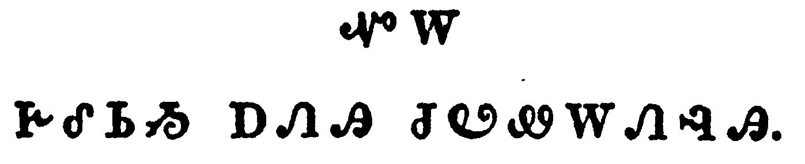

+++
draft=false
date = 2014-12-18T21:11:07Z
title = "Galatians - Chapter 4 - Cherokee New Testament"
weight = 1418955067

[taxonomies]

authors = ["Timothy Legg"]
categories = []
tags = []

[extra]
+++

<table>
<tbody>
<tr class="odd">
<td></td>
</tr>
<tr class="even">
<td>Now I say, That the heir, as long as he is a child, differeth nothing from a servant, though he be lord of all;</td>
</tr>
<tr class="odd">
<td>ᎾᏍᎩᏃ ᎯᎠ ᏂᏥᏪᎭ, ᎾᏍᎩ ᎤᏘᏰᏗ ᎨᏒᎢ, ᎠᏲᎵ ᎨᏒ ᎢᎪᎯᏛ, ᎥᏝ ᏱᏚᎾᏓᎴᎿᎭᎣ ᎠᏥᎾᏝᎢ, ᏄᎬᏫᏳᏌᏕᎩ ᎡᎦᏃ ᏄᏓᎴᏒ ᎪᎱᏍᏗ.</td>
</tr>
<tr class="even">
<td>Na-s-gi-no hi-a ni-tsi-we-ha, Na-s-gi u-ti-ye-di ge-sv-i, a-yo-li ge-sv i-go-hi-dv, v-tla yi-du-na-da-le-hna-o a-tsi-na-tla-i, nu-gv-wi-yu-sa-de-gi e-ga-no nu-da-le-sv go-hu-s-di.</td>
</tr>
</tbody>
</table>

<table>
<tbody>
<tr class="odd">
<td></td>
</tr>
<tr class="even">
<td>But is under tutors and governors until the time appointed of the father.</td>
</tr>
<tr class="odd">
<td>ᏕᎤᏁᎶᏙᏍᎩᏂ ᏗᎬᏪᏲᎲᏍᎩ ᎠᎴ ᎤᎾᏕᏌᏯᏍᏗᏕᎩ ᎠᎦᏴᎵᎨᎢ ᏚᏒᏍᏛ ᎬᏗᏍᎩ.</td>
</tr>
<tr class="even">
<td>De-u-ne-lo-do-s-gi-ni di-gv-we-yo-hv-s-gi a-le u-na-de-sa-ya-s-di-de-gi a-ga-yv-li-ge-i du-sv-s-dv gv-di-s-gi.</td>
</tr>
</tbody>
</table>

<table>
<tbody>
<tr class="odd">
<td></td>
</tr>
<tr class="even">
<td>Even so we, when we were children, were in bondage under the elements of the world:</td>
</tr>
<tr class="odd">
<td>ᎾᏍᎩᏯ ᎾᏍᏉ ᎠᏴ, ᎠᏏ ᏗᏗᏲᎵ ᏥᎨᏒᎩ, ᏤᎩᎾᏝᎢ ᎨᏒᎩ, ᎢᎦᏓᏄᏴᏛᎩ ᏗᎴᏅᏙᏗ ᏗᏕᎶᏆᏍᏗ ᎡᎶᎯ ᎡᎯ ᎨᏒᎢ.</td>
</tr>
<tr class="even">
<td>Na-s-gi-ya na-s-quo a-yv, a-si di-di-yo-li tsi-ge-sv-gi, tse-gi-na-tla-i ge-sv-gi, i-ga-da-nu-yv-dv-gi di-le-nv-do-di di-de-lo-qua-s-di e-lo-hi e-hi ge-sv-i.</td>
</tr>
</tbody>
</table>

<table>
<tbody>
<tr class="odd">
<td></td>
</tr>
<tr class="even">
<td>But when the fullness of the time was come, God sent forth his Son, made of a woman, made under the law,</td>
</tr>
<tr class="odd">
<td>ᎠᏎᏃ ᎾᎯᏳ ᎠᏎᎸᎯ ᎨᏒ ᎠᎧᎵᎢ ᎤᏍᏆᎸᎲᎢ, ᎤᏁᎳᏅᎯ ᏧᏅᏎ ᎤᏪᏥ ᎠᎨᏴ ᎤᎾᏄᎪᏫᏎᎢ, ᏗᎧᎿᎭᏩᏛᏍᏗ ᎠᎲ ᎤᏓᏄᏴᏕᎢ,</td>
</tr>
<tr class="even">
<td>A-se-no na-hi-yu a-se-lv-hi ge-sv a-ka-li-i u-s-qua-lv-hv-i, U-ne-la-nv-hi tsu-nv-se U-we-tsi a-ge-yv u-na-nu-go-wi-se-i, di-ka-hna-wa-dv-s-di a-hv u-da-nu-yv-de-i,</td>
</tr>
</tbody>
</table>

<table>
<tbody>
<tr class="odd">
<td></td>
</tr>
<tr class="even">
<td>To redeem them that were under the law, that we might receive the adoption of sons.</td>
</tr>
<tr class="odd">
<td>ᏧᏚᏴᏗᏱ ᏧᏭᏓᎴᏍᏗᏱ ᎤᏰᎸᏎ ᎾᏍᎩ ᎤᎾᏓᏄᏴᏗ ᏗᎧᎿᎭᏩᏛᏍᏗ ᎠᎲᎢ, ᎾᏍᎩ ᎠᏴ ᏧᏪᏥ ᎢᏰᎬᏁᏗᏱ.</td>
</tr>
<tr class="even">
<td>Tsu-du-yv-di-yi tsu-wu-da-le-s-di-yi u-ye-lv-se na-s-gi u-na-da-nu-yv-di di-ka-hna-wa-dv-s-di a-hv-i, na-s-gi a-yv tsu-we-tsi i-ye-gv-ne-di-yi.</td>
</tr>
</tbody>
</table>

<table>
<tbody>
<tr class="odd">
<td></td>
</tr>
<tr class="even">
<td>And because ye are sons, God hath sent forth the Spirit of his Son into your hearts, crying, Abba, Father.</td>
</tr>
<tr class="odd">
<td>ᎾᏍᎩᏃ ᏧᏪᏥ ᏥᏂᏣᎵᏍᏔᏅ, ᎾᏍᎩ ᏅᏗᎦᎵᏍᏙᏗᎭ, ᎤᏁᎳᏅᎯ ᏧᏅᏒ ᎤᏪᏥ ᎤᏓᏅᏙ ᏗᏣᏓᏅᏙᎩᎯ, ᎤᏪᎷᎦ ᎯᎠ ᏂᎦᏪᎭ, ᎠᏆ, ᎡᏙᏓ.</td>
</tr>
<tr class="even">
<td>Na-s-gi-no tsu-we-tsi tsi-ni-tsa-li-s-ta-nv, na-s-gi nv-di-ga-li-s-do-di-ha, U-ne-la-nv-hi tsu-nv-sv U-we-tsi U-da-nv-do di-tsa-da-nv-do-gi-hi, u-we-lu-ga hi-a ni-ga-we-ha, A-qua, E-do-da.</td>
</tr>
</tbody>
</table>

<table>
<tbody>
<tr class="odd">
<td></td>
</tr>
<tr class="even">
<td>Wherefore thou art no more a servant, but a son; and if a son, then an heir of God through Christ.</td>
</tr>
<tr class="odd">
<td>ᎾᏍᎩ ᏅᏗᎦᎵᏍᏙᏗᎭ ᎥᏝ ᎿᎭᏉ ᎡᏣᎾᏝᎢ ᏱᎩ, ᎤᏪᏥᏉᏍᎩᏂ; ᎠᎴ ᎢᏳ ᎤᏪᏥ ᏱᎩ, ᎿᎭᏉ ᏧᎬᏩᎶᏗ ᎤᏁᎳᏅᎯ ᎤᏓᏁᏗ ᎨᏒ ᏣᏘᏰᎯ, ᎦᎶᏁᏛ ᎢᏳᏩᏂᏌᏅᎯ.</td>
</tr>
<tr class="even">
<td>Na-s-gi nv-di-ga-li-s-do-di-ha v-tla hna-quo e-tsa-na-tla-i yi-gi, u-we-tsi-quo-s-gi-ni; a-le i-yu u-we-tsi yi-gi, hna-quo tsu-gv-wa-lo-di U-ne-la-nv-hi u-da-ne-di ge-sv tsa-ti-ye-hi, Ga-lo-ne-dv i-yu-wa-ni-sa-nv-hi.</td>
</tr>
</tbody>
</table>

<table>
<tbody>
<tr class="odd">
<td></td>
</tr>
<tr class="even">
<td>Howbeit then, when ye knew not God, ye did service unto them which by nature are no gods.</td>
</tr>
<tr class="odd">
<td>ᎠᏎᏃ ᎾᎯᏳᎢ, ᎤᏁᎳᏅᎯ ᏁᏥᎦᏔᎲᎾ ᏥᎨᏒᎩ, ᎪᎱᏍᏗ ᏕᏥᎧᎿᎭᏩᏗᏙᎲᎩ ᎾᏍᎩ ᎤᏙᎯᏳᎯ ᎤᎾᏁᎳᏅᎯ ᏂᎨᏒᎾ ᎨᏒᎢ.</td>
</tr>
<tr class="even">
<td>A-se-no na-hi-yu-i, U-ne-la-nv-hi ne-tsi-ga-ta-hv-na tsi-ge-sv-gi, go-hu-s-di de-tsi-ka-hna-wa-di-do-hv-gi na-s-gi u-do-hi-yu-hi u-na-ne-la-nv-hi ni-ge-sv-na ge-sv-i.</td>
</tr>
</tbody>
</table>

<table>
<tbody>
<tr class="odd">
<td></td>
</tr>
<tr class="even">
<td>But now, after that ye have known God, or rather are known of God, how turn ye again to the weak and beggarly elements, whereunto ye desire again to be in bondage?</td>
</tr>
<tr class="odd">
<td>ᎠᏎᏃ ᎪᎯ ᏥᎩ, ᎿᎭᏉ ᎡᏥᎦᏙᎥᏒᎯ ᏥᎩ ᎤᏁᎳᏅᎯ, ᎠᎴ ᏯᏛᏅ ᎤᏁᎳᏅᎯ ᎢᏥᎦᏙᎥᏒᎯ ᏥᎩ, ᎦᏙ ᏗᎦᎵᏍᏙᏗᎭ ᎢᏣᏨᎭ ᏙᏣᎵᏍᎦᏍᏙᏗᎭ ᎠᏩᎾᎦᎳ ᎠᎴ ᎤᏲ ᎢᏳᏛᎿᎭᏕᎩ ᏗᎴᏅᏙᏗ ᏗᏕᎶᏆᏍᏗ, ᎾᏍᎩ ᎠᏏ ᎾᎿᎭᏥᏣᏚᎵ ᏤᏥᎾᏝ ᏔᎵᏁ ᎢᏣᎵᏍᏙᏗᏱ?</td>
</tr>
<tr class="even">
<td>A-se-no go-hi tsi-gi, hna-quo e-tsi-ga-do-v-sv-hi tsi-gi U-ne-la-nv-hi, a-le ya-dv-nv U-ne-la-nv-hi i-tsi-ga-do-v-sv-hi tsi-gi, ga-do di-ga-li-s-do-di-ha i-tsa-tsv-ha do-tsa-li-s-ga-s-do-di-ha a-wa-na-ga-la a-le u-yo i-yu-dv-hna-de-gi di-le-nv-do-di di-de-lo-qua-s-di, na-s-gi a-si na-hna tsi-tsa-du-li tse-tsi-na-tla ta-li-ne i-tsa-li-s-do-di-yi?</td>
</tr>
</tbody>
</table>

<table>
<tbody>
<tr class="odd">
<td></td>
</tr>
<tr class="even">
<td>Ye observe days, and months, and times, and years.</td>
</tr>
<tr class="odd">
<td>ᏕᏥᏍᏆᏂᎪᏙ ᏓᏙᏓᏇᎬᎢ, ᎠᎴ ᏓᏦᎳᏁᎬᎢ, ᎠᎴ ᏓᏍᏆᎸᎮᎬᎢ, ᎠᎴ ᏓᏕᏘᏴᎮᎬᎢ.</td>
</tr>
<tr class="even">
<td>De-tsi-s-qua-ni-go-do da-do-da-que-gv-i, a-le da-tso-la-ne-gv-i, a-le da-s-qua-lv-he-gv-i, a-le da-de-ti-yv-he-gv-i.</td>
</tr>
</tbody>
</table>

<table>
<tbody>
<tr class="odd">
<td></td>
</tr>
<tr class="even">
<td>I am afraid of you, lest I have bestowed upon you labour in vain.</td>
</tr>
<tr class="odd">
<td>ᎢᏨᎾᏰᎢᏎᎭᏉ, ᎠᏎᏉᏉ ᎪᎱᏍᏗ ᏱᎦᏥᏯᏛᏁᎸ ᎨᎵᏍᎬ ᎢᏳᏍᏗ.</td>
</tr>
<tr class="even">
<td>I-tsv-na-ye-i-se-ha-quo, a-se-quo-quo go-hu-s-di yi-ga-tsi-ya-dv-ne-lv ge-li-s-gv i-yu-s-di.</td>
</tr>
</tbody>
</table>

<table>
<tbody>
<tr class="odd">
<td></td>
</tr>
<tr class="even">
<td>Brethren, I beseech you, be as I am; for I am as ye are: ye have not injured me at all.</td>
</tr>
<tr class="odd">
<td>ᎢᏓᎵᏅᏟ, ᎢᏨᏔᏲᏎᎭ ᎠᏴ ᎾᏆᏍᏛ ᎾᏍᎩᏯ ᎢᏣᎵᏍᏙᏗᏱ; ᏂᏣᏍᏛᏰᏃ ᎾᏍᎩᏯ ᎾᏆᏍᏗ ᎠᏴ, ᎥᏝ ᎪᎱᏍᏗ ᎤᏐᏅ ᎢᏍᎩᏴᏁᎸᎯ ᏱᎩ;</td>
</tr>
<tr class="even">
<td>I-da-li-nv-tli, i-tsv-ta-yo-se-ha a-yv na-qua-s-dv na-s-gi-ya i-tsa-li-s-do-di-yi; ni-tsa-s-dv-ye-no na-s-gi-ya na-qua-s-di a-yv, v-tla go-hu-s-di u-so-nv i-s-gi-yv-ne-lv-hi yi-gi;</td>
</tr>
</tbody>
</table>

<table>
<tbody>
<tr class="odd">
<td></td>
</tr>
<tr class="even">
<td>Ye know how through infirmity of the flesh I preached the gospel unto you at the first.</td>
</tr>
<tr class="odd">
<td>ᎠᏎᏃ ᎢᏥᎦᏔᎭ ᎠᏩᎾᎦᎳᎯᏳ ᎨᏒ ᎠᎩᏇᏓᎸᎢ ᎢᏨᏯᎵᏥᏙᏁᎸ ᎣᏍᏛ ᎧᏃᎮᏛ ᎢᎬᏱᏱ;</td>
</tr>
<tr class="even">
<td>A-se-no i-tsi-ga-ta-ha a-wa-na-ga-la-hi-yu ge-sv a-gi-que-da-lv-i i-tsv-ya-li-tsi-do-ne-lv o-s-dv ka-no-he-dv i-gv-yi-yi;</td>
</tr>
</tbody>
</table>

<table>
<tbody>
<tr class="odd">
<td></td>
</tr>
<tr class="even">
<td>And my temptation which was in my flesh ye despised not, nor rejected; but received me as an angel of God, even as Christ Jesus.</td>
</tr>
<tr class="odd">
<td>ᎠᎴ ᏥᎬᎵᏲᎬ ᎾᏍᎩ ᎠᎩᏇᏓᎸ ᏣᏇᎲᎩ, ᎥᏝ ᏅᎵᏌᎵ ᏱᏥᏰᎸᏁᎢ, ᎠᎴ ᎥᏝ ᏱᏥᏲᎢᏎᎴᎢ; ᏕᏍᎩᏯᏓᏂᎸᏨᎩᏍᎩᏂ ᏗᎧᎿᎭᏩᏗᏙᎯ ᎤᏁᎳᏅᎯ ᎤᏤᎵ ᎾᏍᎩᏯᎢ, ᎠᎴ ᎦᎶᏁᏛ ᏥᏌ ᎾᏍᎩᏯᎢ.</td>
</tr>
<tr class="even">
<td>A-le tsi-gv-li-yo-gv na-s-gi a-gi-que-da-lv tsa-que-hv-gi, v-tla nv-li-sa-li yi-tsi-ye-lv-ne-i, a-le v-tla yi-tsi-yo-i-se-le-i; de-s-gi-ya-da-ni-lv-tsv-gi-s-gi-ni di-ka-hna-wa-di-do-hi U-ne-la-nv-hi u-tse-li na-s-gi-ya-i, a-le Ga-lo-ne-dv Tsi-sa na-s-gi-ya-i.</td>
</tr>
</tbody>
</table>

<table>
<tbody>
<tr class="odd">
<td></td>
</tr>
<tr class="even">
<td>Where is then the blessedness ye spake of? for I bear you record, that, if it had been possible, ye would have plucked out your own eyes, and have given them to me.</td>
</tr>
<tr class="odd">
<td>ᎾᏍᎩᏃ ᏂᎦᎥᎩ ᏅᏩᏙᎯᏯᏛ ᎢᏣᏓᏅᏛᎩ! ᎢᏨᏲᎢᏳᏓᏁᎭᏰᏃ, ᎾᏍᎩ ᎢᏳᏃ ᏰᎵ ᎾᏍᎩ ᎢᎬᏩᎵᏍᏙᏗ ᏱᎨᏎᎢ, ᎢᏨᏒ ᏱᏗᏣᏓᎦᏖᏙᎢᏎᎢ, ᎠᎴ ᎠᏴ ᏱᏗᏍᎩᏁᎴᎢ.</td>
</tr>
<tr class="even">
<td>Na-s-gi-no ni-ga-v-gi nv-wa-do-hi-ya-dv i-tsa-da-nv-dv-gi! i-tsv-yo-i-yu-da-ne-ha-ye-no, na-s-gi i-yu-no ye-li na-s-gi i-gv-wa-li-s-do-di yi-ge-se-i, i-tsv-sv yi-di-tsa-da-ga-te-do-i-se-i, a-le a-yv yi-di-s-gi-ne-le-i.</td>
</tr>
</tbody>
</table>

<table>
<tbody>
<tr class="odd">
<td></td>
</tr>
<tr class="even">
<td>Am I therefore become your enemy, because I tell you the truth?</td>
</tr>
<tr class="odd">
<td>ᏥᎪᏃ ᏍᎩᏍᎦᎩ ᏄᎵᏍᏔᏅ ᏂᎦᎵᏍᏙᏗᎭ ᎤᏙᎯᏳᎯ ᎨᏒ ᎢᏨᏃᏁᎸᎢ?</td>
</tr>
<tr class="even">
<td>Tsi-go-no s-gi-s-ga-gi nu-li-s-ta-nv ni-ga-li-s-do-di-ha u-do-hi-yu-hi ge-sv i-tsv-no-ne-lv-i?</td>
</tr>
</tbody>
</table>

<table>
<tbody>
<tr class="odd">
<td></td>
</tr>
<tr class="even">
<td>They zealously affect you, but not well; yea, they would exclude you, that ye might affect them.</td>
</tr>
<tr class="odd">
<td>ᎤᏣᏘ ᎨᏥᎨᏳᎭ, ᎠᏎᏃ ᎥᏝ ᎣᏍᏛ ᎤᎬᏩᎵ ᏱᎩ; ᎠᎴ ᏂᎯ ᏱᎨᏣᎵᏍᏚᏓ, ᎾᏍᎩ ᎤᏣᏘ ᏗᏥᎨᏳᎯᏳ ᎢᏳᎵᏍᏙᏗᏱ.</td>
</tr>
<tr class="even">
<td>U-tsa-ti ge-tsi-ge-yu-ha, a-se-no v-tla o-s-dv u-gv-wa-li yi-gi; a-le ni-hi yi-ge-tsa-li-s-du-da, na-s-gi u-tsa-ti di-tsi-ge-yu-hi-yu i-yu-li-s-do-di-yi.</td>
</tr>
</tbody>
</table>

<table>
<tbody>
<tr class="odd">
<td></td>
</tr>
<tr class="even">
<td>But it is good to be zealously affected always in a good thing, and not only when I am present with you.</td>
</tr>
<tr class="odd">
<td>ᎣᏏᏳᏍᎩᏂ ᏂᎪᎯᎸ ᎤᏣᏘ ᎢᏥᎨᏳᏗᏱ ᎣᏍᏛ ᎨᏒᎢ, ᎥᏝᏃ ᎾᎯᏳᏉ ᎢᏨᏰᎳᏗᏙᎲ ᎤᏩᏒ.</td>
</tr>
<tr class="even">
<td>O-si-yu-s-gi-ni ni-go-hi-lv u-tsa-ti i-tsi-ge-yu-di-yi o-s-dv ge-sv-i, v-tla-no na-hi-yu-quo i-tsv-ye-la-di-do-hv u-wa-sv.</td>
</tr>
</tbody>
</table>

<table>
<tbody>
<tr class="odd">
<td></td>
</tr>
<tr class="even">
<td>My little children, of whom I travail in birth again until Christ be formed in you,</td>
</tr>
<tr class="odd">
<td>ᏗᏇᏥ ᏗᏣᏍᏗᎢ, ᎾᏍᎩ ᏔᎵᏁ ᎢᏨᏁᎵᏨᎯ ᏥᎩ [ᎢᏗᎬᏤᎵᏛ] ᎢᏣᏕᏗᏱ, ᎬᏂ ᎦᎶᏁᏛ ᎠᏙᏢᏅᎭ ᏕᏣᏓᏅᏛᎢ,</td>
</tr>
<tr class="even">
<td>Di-que-tsi di-tsa-s-di-i, na-s-gi ta-li-ne i-tsv-ne-li-tsv-hi tsi-gi [i-di-gv-tse-li-dv] i-tsa-de-di-yi, gv-ni Ga-lo-ne-dv a-do-tlv-nv-ha de-tsa-da-nv-dv-i,</td>
</tr>
</tbody>
</table>

<table>
<tbody>
<tr class="odd">
<td></td>
</tr>
<tr class="even">
<td>I desire to be present with you now, and to change my voice; for I stand in doubt of you.</td>
</tr>
<tr class="odd">
<td>ᎬᏆᏚᎸᏗ ᏂᎦᎵᏍᏗ ᎪᎯ ᎨᏒ ᎢᏨᏰᎳᏗᏓᏍᏗᏱ, ᎠᎴ ᎠᎩᏁᏟᏴᏍᏗᏱ ᏥᏁᎬᎢ; ᎤᏯᏰᏃ ᎢᏨᏴᏍᎦ.</td>
</tr>
<tr class="even">
<td>Gv-qua-du-lv-di ni-ga-li-s-di go-hi ge-sv i-tsv-ye-la-di-da-s-di-yi, a-le a-gi-ne-tli-yv-s-di-yi tsi-ne-gv-i; u-ya-ye-no i-tsv-yv-s-ga.</td>
</tr>
</tbody>
</table>

<table>
<tbody>
<tr class="odd">
<td></td>
</tr>
<tr class="even">
<td>Tell me, ye that desire to be under the law, do ye not hear the law?</td>
</tr>
<tr class="odd">
<td>ᏍᎩᏃᎲᏏ, ᏂᎯ ᎢᏣᏚᎵᏍᎩ ᏗᎧᎿᎭᏩᏛᏍᏗ ᎠᎲ ᎢᏣᏓᏄᏴᏙᏗᏱ, ᏝᏍᎪ ᏱᏣᏛᎩᎭ ᏗᎧᎿᎭᏩᏛᏍᏗ?</td>
</tr>
<tr class="even">
<td>S-gi-no-hv-si, ni-hi i-tsa-du-li-s-gi di-ka-hna-wa-dv-s-di a-hv i-tsa-da-nu-yv-do-di-yi, tla-s-go yi-tsa-dv-gi-ha di-ka-hna-wa-dv-s-di?</td>
</tr>
</tbody>
</table>

<table>
<tbody>
<tr class="odd">
<td></td>
</tr>
<tr class="even">
<td>For it is written, that Abraham had two sons, the one by a bondmaid, the other by a freewoman.</td>
</tr>
<tr class="odd">
<td>ᎯᎠᏰᏃ ᏂᎬᏅ ᎢᎪᏪᎳ, ᎾᏍᎩ ᎡᏆᎭᎻ ᎠᏂᏔᎵ ᏧᏪᏥ ᎠᏁᎮᎢ, ᎠᏏᏴᏫ ᎠᏥᎾᏝᎢ ᎠᎨᏴ ᎤᎾᏄᎪᏫᏒᎯ, ᏐᎢᏃ ᎾᏥᎾᏝᎥᎾ ᎠᎨᏴ ᎤᎾᏄᎪᏫᏒᎯ.</td>
</tr>
<tr class="even">
<td>Hi-a-ye-no ni-gv-nv i-go-we-la, na-s-gi E-qua-ha-mi a-ni-ta-li tsu-we-tsi a-ne-he-i, a-si-yv-wi a-tsi-na-tla-i a-ge-yv u-na-nu-go-wi-sv-hi, so-i-no na-tsi-na-tla-v-na a-ge-yv u-na-nu-go-wi-sv-hi.</td>
</tr>
</tbody>
</table>

<table>
<tbody>
<tr class="odd">
<td></td>
</tr>
<tr class="even">
<td>But he who was of the bondwoman was born after the flesh; but he of the freewoman was by promise.</td>
</tr>
<tr class="odd">
<td>ᎾᏃ ᎠᏥᎾᏝᎢ ᎠᎨᏴ ᎤᎾᏄᎪᏫᏒᎯ, ᎤᏇᏓᎵ ᎤᏕᏔᏁᎢ; ᎾᏍᎩᏯ ᎾᏥᎾᏝᎥᎾ ᎠᎨᏴ ᎤᎾᏄᎪᏫᏒᎯ ᎠᏚᎢᏍᏛ ᎾᏍᎩᏯ ᎤᏕᏁᎢ.</td>
</tr>
<tr class="even">
<td>Na-no a-tsi-na-tla-i a-ge-yv u-na-nu-go-wi-sv-hi, u-que-da-li u-de-ta-ne-i; na-s-gi-ya na-tsi-na-tla-v-na a-ge-yv u-na-nu-go-wi-sv-hi a-du-i-s-dv na-s-gi-ya u-de-ne-i.</td>
</tr>
</tbody>
</table>

<table>
<tbody>
<tr class="odd">
<td></td>
</tr>
<tr class="even">
<td>Which things are an allegory: for these are the two covenants; the one from the mount Sinai, which gendereth to bondage, which is Agar.</td>
</tr>
<tr class="odd">
<td>ᎯᎠ ᎾᏍᎩ ᏓᏟᎶᏍᏗ; ᎯᎠᏰᏃ ᎾᏍᎩ ᏔᎵ ᎧᏃᎮᏛ ᏓᏠᎯᏍᏛ ᏓᏟᎶᏍᏗ; ᏌᏉ ᎨᏒ ᏌᎾᏱ ᎣᏓᎸ ᏨᏗᏓᎴᎲᏍᎦ, ᎾᏍᎩ ᏥᏕᎦᎾᏄᎪᏫᏍᎦ ᏗᎨᏥᎾᏢᏗ ᎨᏒᎢ, ᎾᏍᎩ ᎮᎦ ᏥᏓᏟᎶᏍᏗ.</td>
</tr>
<tr class="even">
<td>Hi-a na-s-gi da-tli-lo-s-di; hi-a-ye-no na-s-gi ta-li ka-no-he-dv da-tlo-hi-s-dv da-tli-lo-s-di; sa-quo ge-sv Sa-na-yi o-da-lv tsv-di-da-le-hv-s-ga, na-s-gi tsi-de-ga-na-nu-go-wi-s-ga di-ge-tsi-na-tlv-di ge-sv-i, na-s-gi He-ga tsi-da-tli-lo-s-di.</td>
</tr>
</tbody>
</table>

<table>
<tbody>
<tr class="odd">
<td></td>
</tr>
<tr class="even">
<td>For this Agar is mount Sinai in Arabia, and answereth to Jerusalem which now is, and is in bondage with her children.</td>
</tr>
<tr class="odd">
<td>ᎯᎠᏰᏃ ᎾᏍᎩ ᎮᎦ ᏌᎾᏱ ᎣᏓᎸ ᏓᏟᎶᏍᏗ, ᎡᎴᏈᎠ ᏦᏓᎸ, ᎾᏍᎩ ᏥᎷᏏᎵᎻ ᎾᏍᎩᏯ ᏥᎩ, ᎾᏍᎩ ᎪᎯ ᏄᏍᏛᎢ, ᎾᏍᎩᏰᏃ ᏕᎨᏥᎾᏝᎠ ᎤᏩᏒ ᎠᎴ ᎾᏍᎩ ᏧᏪᏥ.</td>
</tr>
<tr class="even">
<td>Hi-a-ye-no na-s-gi He-ga Sa-na-yi o-da-lv da-tli-lo-s-di, E-le-qui-a tso-da-lv, na-s-gi Tsi-lu-si-li-mi na-s-gi-ya tsi-gi, na-s-gi go-hi nu-s-dv-i, na-s-gi-ye-no de-ge-tsi-na-tla-a u-wa-sv a-le na-s-gi tsu-we-tsi.</td>
</tr>
</tbody>
</table>

<table>
<tbody>
<tr class="odd">
<td></td>
</tr>
<tr class="even">
<td>But Jerusalem which is above is free, which is the mother of us all.</td>
</tr>
<tr class="odd">
<td>ᏥᎷᏏᎵᎻᏍᎩᏂ ᎦᎸᎳᏗ ᏨᏗᎦᏚᎭ ᎾᏍᎩ ᎾᏥᎾᏝᎥᎾ, ᎾᏍᎩ ᎠᏴ ᏂᏗᎥ ᎢᎩᏥ.</td>
</tr>
<tr class="even">
<td>Tsi-lu-si-li-mi-s-gi-ni ga-lv-la-di tsv-di-ga-du-ha na-s-gi na-tsi-na-tla-v-na, na-s-gi a-yv ni-di-v i-gi-tsi.</td>
</tr>
</tbody>
</table>

<table>
<tbody>
<tr class="odd">
<td></td>
</tr>
<tr class="even">
<td>For it is written, Rejoice, thou barren that bearest not; break forth and cry, thou that travailest not: for the desolate hath many more children than she which hath an husband.</td>
</tr>
<tr class="odd">
<td>ᎯᎠᏰᏃ ᏂᎬᏅ ᎢᎪᏪᎳ, ᎭᎵᎮᎵᎩ ᏔᎷᎸᎥᏍᎩ ᏂᎨᏒᎾ, ᎾᏍᎩ ᏂᏔᏓᎾᏄᎪᏫᏍᎬᎾ; ᎭᎴᏅ ᎮᎷᎲᎦ, ᏂᎯ ᏂᏘᎾᏄᎪᏫᏍᎬᎾ; ᎾᏰᏃ, ᎾᏥᏰᎲᎾ ᎤᏟ ᎾᏂᎥ ᏚᏪᎧᎭ ᏧᏪᏥ ᎡᏍᎦᏉ Ꮎ ᎠᏥᏰᎯ.</td>
</tr>
<tr class="even">
<td>Hi-a-ye-no ni-gv-nv i-go-we-la, Ha-li-he-li-gi ta-lu-lv-v-s-gi ni-ge-sv-na, na-s-gi ni-ta-da-na-nu-go-wi-s-gv-na; ha-le-nv he-lu-hv-ga, ni-hi ni-ti-na-nu-go-wi-s-gv-na; na-ye-no, na-tsi-ye-hv-na u-tli na-ni-v du-we-ka-ha tsu-we-tsi e-s-ga-quo na a-tsi-ye-hi.</td>
</tr>
</tbody>
</table>

<table>
<tbody>
<tr class="odd">
<td></td>
</tr>
<tr class="even">
<td>Now we, brethren, as Isaac was, are the children of promise.</td>
</tr>
<tr class="odd">
<td>ᎾᏍᎩᏃ ᎠᏴ, ᎢᏓᎵᏅᏟ, ᎠᏚᎢᏍᏛ ᎢᎦᏕᏔᏅᎯ ᎾᏍᎩᏯ ᎡᏏᎩ ᏥᏄᏍᏕᎢ.</td>
</tr>
<tr class="even">
<td>Na-s-gi-no a-yv, i-da-li-nv-tli, a-du-i-s-dv i-ga-de-ta-nv-hi na-s-gi-ya E-si-gi tsi-nu-s-de-i.</td>
</tr>
</tbody>
</table>

<table>
<tbody>
<tr class="odd">
<td></td>
</tr>
<tr class="even">
<td>But as then he that was born after the flesh persecuted him that was born after the Spirit, even so it is now.</td>
</tr>
<tr class="odd">
<td>ᎾᏍᎩᏃ ᎾᎯᏳ ᏥᎨᏎᎢ, ᎾᏍᎩ ᎤᏇᏓᎵ ᎤᏕᏔᏅᎯ ᏣᏕᏯᏙᏗᏍᎨ ᎾᏍᎩ Ꮎ ᎠᏓᏅᏙ ᎤᏕᏔᏅᎯ, ᎾᏍᎩᏯ ᏄᏍᏗ ᎪᎯ ᎨᏒᎢ.</td>
</tr>
<tr class="even">
<td>Na-s-gi-no na-hi-yu tsi-ge-se-i, na-s-gi u-que-da-li u-de-ta-nv-hi tsa-de-ya-do-di-s-ge na-s-gi na A-da-nv-do u-de-ta-nv-hi, na-s-gi-ya nu-s-di go-hi ge-sv-i.</td>
</tr>
</tbody>
</table>

<table>
<tbody>
<tr class="odd">
<td></td>
</tr>
<tr class="even">
<td>Nevertheless what saith the scripture? Cast out the bondwoman and her son: for the son of the bondwoman shall not be heir with the son of the freewoman.</td>
</tr>
<tr class="odd">
<td>ᎠᏎᏃ ᎦᏙ ᎠᏗᎭ ᎪᏪᎵ? ᎯᏄᎪᏩ ᎠᏥᎾᏝᎢ ᎠᎨᏴ ᎠᎴ ᎾᏍᎩ ᎤᏪᏥ; ᎠᏥᎾᏝᎢᏰᏃ ᎠᎨᏴ ᎤᏪᏥ, ᎥᏝ ᎤᏪᎳᏗᏍᏙᏗ ᏱᎨᏎᏍᏗ ᎤᏤᎵ ᎢᏳᎵᏍᏙᏗ ᎨᏒ ᎾᏥᎾᏝᎥᎾ ᎠᎨᏴ ᎤᏪᏥ.</td>
</tr>
<tr class="even">
<td>A-se-no ga-do a-di-ha go-we-li? Hi-nu-go-wa a-tsi-na-tla-i a-ge-yv a-le na-s-gi u-we-tsi; a-tsi-na-tla-i-ye-no a-ge-yv u-we-tsi, v-tla u-we-la-di-s-do-di yi-ge-se-s-di u-tse-li i-yu-li-s-do-di ge-sv na-tsi-na-tla-v-na a-ge-yv u-we-tsi.</td>
</tr>
</tbody>
</table>

<table>
<tbody>
<tr class="odd">
<td></td>
</tr>
<tr class="even">
<td>So then, brethren, we are not children of the bondwoman, but of the free.</td>
</tr>
<tr class="odd">
<td>ᎾᏍᎩᏃ ᎢᏓᎵᏅᏟ, ᎥᏝ ᎠᏥᎾᏝᎢ ᎠᎨᏴ ᏧᏪᏥ ᏱᎩ ᎠᏴ, ᎾᏥᎾᏝᎥᎾᏍᎩᏂ.</td>
</tr>
<tr class="even">
<td>Na-s-gi-no i-da-li-nv-tli, v-tla a-tsi-na-tla-i a-ge-yv tsu-we-tsi yi-gi a-yv, na-tsi-na-tla-v-na-s-gi-ni.</td>
</tr>
</tbody>
</table>

