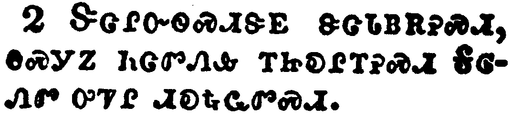
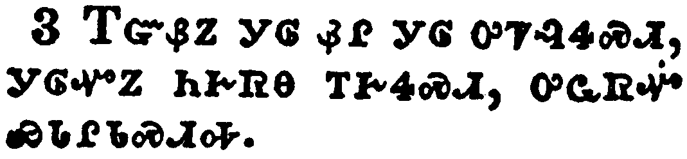
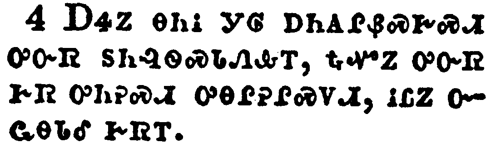
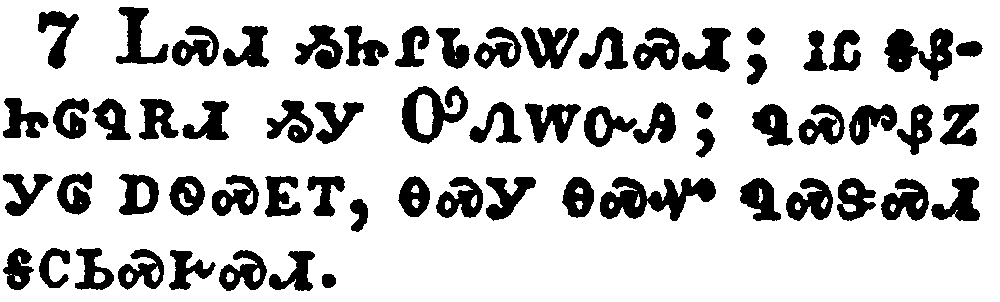
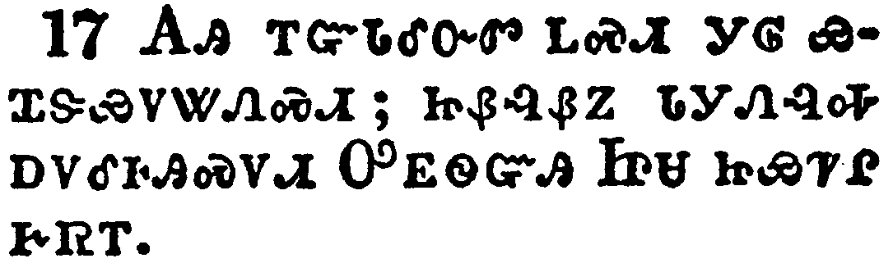
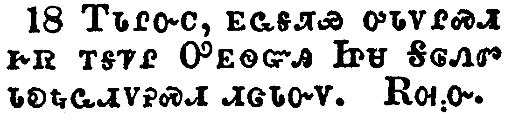

+++
draft=false
date = 2014-12-18T21:11:07Z
title = "Galatians - Chapter 6 - Cherokee New Testament"
weight = 1418955067

[taxonomies]

authors = ["Timothy Legg"]
categories = []
tags = []

[extra]
+++

<table>
<tbody>
<tr class="odd">
<td></td>
</tr>
<tr class="even">
<td>Brethren, if a man be overtaken in a fault, ye which are spiritual, restore such an one in the spirit of meekness; considering thyself, lest thou also be tempted.</td>
</tr>
<tr class="odd">
<td>ᎢᏓᎵᏅᏟ, ᎢᏳᏃ ᎩᎶ ᏳᏎᎦᏤᎸ ᏳᏍᎦᏅᏨ, ᏂᎯ ᎠᏓᏅᏙ ᏗᏣᏘᏂᏙᎯ ᎡᏥᏯᏂᏐᏗ ᎨᏎᏍᏗ ᎾᏍᎩ ᎢᏳᏛᏁᎸᎯ ᎤᏓᏙᎵᏍᏗ ᎢᏣᏓᏅᏛᎢ, ᎮᏯᏔᎮᏍᏗ ᏨᏒ ᎨᏒ ᏱᏅᏎᎦᎩ ᏂᎯ ᎾᏍᏉ ᏰᏣᎪᎵᏯ.</td>
</tr>
<tr class="even">
<td>I-da-li-nv-tli, i-yu-no gi-lo yu-se-ga-tse-lv yu-s-ga-nv-tsv, ni-hi a-da-nv-do di-tsa-ti-ni-do-hi e-tsi-ya-ni-so-di ge-se-s-di na-s-gi i-yu-dv-ne-lv-hi u-da-do-li-s-di i-tsa-da-nv-dv-i, he-ya-ta-he-s-di tsv-sv ge-sv yi-nv-se-ga-gi ni-hi na-s-quo ye-tsa-go-li-ya.</td>
</tr>
</tbody>
</table>

<table>
<tbody>
<tr class="odd">
<td></td>
</tr>
<tr class="even">
<td>Bear ye one another's burdens, and so fulfill the law of Christ.</td>
</tr>
<tr class="odd">
<td>ᏕᏣᎵᏅᏫᏍᏗᏕᎬ ᏕᏣᏓᏴᎡᎮᏍᏗ, ᎾᏍᎩᏃ ᏂᏣᏛᏁᎲ ᎢᏥᎧᎵᎢᎮᏍᏗ ᎦᎶᏁᏛ ᎤᏤᎵ ᏗᎧᎿᎭᏩᏛᏍᏗ.</td>
</tr>
<tr class="even">
<td>De-tsa-li-nv-wi-s-di-de-gv de-tsa-da-yv-e-he-s-di, na-s-gi-no ni-tsa-dv-ne-hv i-tsi-ka-li-i-he-s-di Ga-lo-ne-dv u-tse-li di-ka-hna-wa-dv-s-di.</td>
</tr>
</tbody>
</table>

<table>
<tbody>
<tr class="odd">
<td></td>
</tr>
<tr class="even">
<td>For if a man think himself to be something, when he is nothing, he deceiveth himself.</td>
</tr>
<tr class="odd">
<td>ᎢᏳᏰᏃ ᎩᎶ ᏰᎵ ᎩᎶ ᎤᏤᎸᏎᏍᏗ, ᎩᎶᏉᏃ ᏂᎨᏒᎾ ᎢᎨᏎᏍᏗ, ᎤᏩᏒᏉ ᏯᏓᎵᏓᏍᏗᎭ.</td>
</tr>
<tr class="even">
<td>I-yu-ye-no gi-lo ye-li gi-lo u-tse-lv-se-s-di, gi-lo-quo-no ni-ge-sv-na i-ge-se-s-di, u-wa-sv-quo ya-da-li-da-s-di-ha.</td>
</tr>
</tbody>
</table>

<table>
<tbody>
<tr class="odd">
<td></td>
</tr>
<tr class="even">
<td>But let every man prove his own work, and then shall he have rejoicing in himself alone, and not in another.</td>
</tr>
<tr class="odd">
<td>ᎠᏎᏃ ᎾᏂᎥ ᎩᎶ ᎠᏂᎪᎵᏰᏍᎨᏍᏗ ᎤᏅᏒ ᏚᏂᎸᏫᏍᏓᏁᎲᎢ, ᎿᎭᏉᏃ ᎤᏅᏒ ᎨᏒ ᎤᏂᎮᏍᏗ ᎤᎾᎵᎮᎵᏍᏙᏗ, ᎥᏝᏃ ᏅᏩᎾᏓᎴ ᎨᏒᎢ.</td>
</tr>
<tr class="even">
<td>A-se-no na-ni-v gi-lo a-ni-go-li-ye-s-ge-s-di u-nv-sv du-ni-lv-wi-s-da-ne-hv-i, hna-quo-no u-nv-sv ge-sv u-ni-he-s-di u-na-li-he-li-s-do-di, v-tla-no nv-wa-na-da-le ge-sv-i.</td>
</tr>
</tbody>
</table>

<table>
<tbody>
<tr class="odd">
<td></td>
</tr>
<tr class="even">
<td>For every man shall bear his own burden.</td>
</tr>
<tr class="odd">
<td>ᎾᏂᎥᏰᏃ ᎤᏅᏒ ᏚᎾᎵᏅᏫᏍᏗᏕᎬ ᎠᏂᏰᎮᏍᏗ.</td>
</tr>
<tr class="even">
<td>Na-ni-v-ye-no u-nv-sv du-na-li-nv-wi-s-di-de-gv a-ni-ye-he-s-di.</td>
</tr>
</tbody>
</table>

<table>
<tbody>
<tr class="odd">
<td></td>
</tr>
<tr class="even">
<td>Let him that is taught in the word communicate unto him that teacheth in all good things.</td>
</tr>
<tr class="odd">
<td>ᎾᏍᎩ Ꮎ ᎧᏃᎮᏛ ᎠᎨᏲᏅᎯ Ꭰ'ᏁᎮᏍᏗ ᎾᏍᎩ Ꮎ ᎤᏪᏲᎲᏍᎩ ᏄᏓᎴᏒ ᎣᏍᏛ ᎨᏒᎢ.</td>
</tr>
<tr class="even">
<td>Na-s-gi na ka-no-he-dv a-ge-yo-nv-hi a-'-ne-he-s-di na-s-gi na u-we-yo-hv-s-gi nu-da-le-sv o-s-dv ge-sv-i.</td>
</tr>
</tbody>
</table>

<table>
<tbody>
<tr class="odd">
<td></td>
</tr>
<tr class="even">
<td>Be not deceived; God is not mocked: for whatsoever a man soweth, that shall he also reap.</td>
</tr>
<tr class="odd">
<td>ᏞᏍᏗ ᏱᏥᎵᏓᏍᏔᏁᏍᏗ; ᎥᏝ ᎦᏰᏥᎶᏄᎡᏗ ᏱᎩ ᎤᏁᎳᏅᎯ; ᏄᏍᏛᏰᏃ ᎩᎶ ᎠᏫᏍᎬᎢ, ᎾᏍᎩ ᎾᏍᏉ ᏄᏍᏕᏍᏗ ᎦᏟᏏᏍᎨᏍᏗ.</td>
</tr>
<tr class="even">
<td>Tle-s-di yi-tsi-li-da-s-ta-ne-s-di; v-tla ga-ye-tsi-lo-nu-e-di yi-gi U-ne-la-nv-hi; nu-s-dv-ye-no gi-lo a-wi-s-gv-i, na-s-gi na-s-quo nu-s-de-s-di ga-tli-si-s-ge-s-di.</td>
</tr>
</tbody>
</table>

<table>
<tbody>
<tr class="odd">
<td></td>
</tr>
<tr class="even">
<td>For he that soweth to his flesh shall of the flesh reap corruption; but he that soweth to the Spirit shall of the Spirit reap life everlasting.</td>
</tr>
<tr class="odd">
<td>ᎾᏍᎩᏰᏃ Ꮎ ᎤᏩᏒ ᎤᏇᏓᎵ ᎠᏫᏍᎨᏍᏗ, ᎾᏍᎩ ᎤᏇᏓᎵ ᎤᎾᏄᎪᏫᏒᎯ ᎠᏲᎩ ᎦᏟᏏᏍᎨᏍᏗ; ᎾᏍᎩᏍᎩᏂ Ꮎ ᎠᏓᏅᏙᎩᎯ ᎠᏫᏍᎨᏍᏗ, ᎾᏍᎩ ᎠᏓᏅᏙ ᎤᎾᏄᎪᏫᏒᎯ ᎬᏂᏛ ᎤᎵᏍᏆᏗᏍᏗ ᏂᎨᏒᎾ ᎦᏟᏏᏍᎨᏍᏗ.</td>
</tr>
<tr class="even">
<td>Na-s-gi-ye-no na u-wa-sv u-que-da-li a-wi-s-ge-s-di, na-s-gi u-que-da-li u-na-nu-go-wi-sv-hi a-yo-gi ga-tli-si-s-ge-s-di; na-s-gi-s-gi-ni na A-da-nv-do-gi-hi a-wi-s-ge-s-di, na-s-gi A-da-nv-do u-na-nu-go-wi-sv-hi gv-ni-dv u-li-s-qua-di-s-di ni-ge-sv-na ga-tli-si-s-ge-s-di.</td>
</tr>
</tbody>
</table>

<table>
<tbody>
<tr class="odd">
<td></td>
</tr>
<tr class="even">
<td>And let us not be weary in well doing: for in due season we shall reap, if we faint not.</td>
</tr>
<tr class="odd">
<td>ᎠᎴ ᏞᏍᏗ ᏱᏗᎩᏯᏪᎨᏍᏗ ᎣᏍᏛ ᏕᎩᎸᏫᏍᏓᏁᎲᎢ; ᎾᎯᏳᏰᏃ ᎠᏍᏆᎸᎲᎭ ᎢᎩᏟᏐᏗ ᎨᏎᏍᏗ, ᎢᏳᏃ ᏂᏗᏗᏩᎾᎦᎶᎬᎾ ᎢᎨᏎᏍᏗ.</td>
</tr>
<tr class="even">
<td>A-le tle-s-di yi-di-gi-ya-we-ge-s-di o-s-dv de-gi-lv-wi-s-da-ne-hv-i; na-hi-yu-ye-no a-s-qua-lv-hv-ha i-gi-tli-so-di ge-se-s-di, i-yu-no ni-di-di-wa-na-ga-lo-gv-na i-ge-se-s-di.</td>
</tr>
</tbody>
</table>

<table>
<tbody>
<tr class="odd">
<td></td>
</tr>
<tr class="even">
<td>As we have therefore opportunity, let us do good unto all men, especially unto them who are of the household of faith.</td>
</tr>
<tr class="odd">
<td>ᎾᏍᎩ ᎢᏳᏍᏗ ᏰᎵ ᎢᎨᎦᏛᏁᏗ ᏗᏜᏓᏅᏓᏗᏍᎨᏍᏗ, ᎾᏂᎥ ᎣᏍᏛ ᏂᏕᏓᏛᏁᎮᏍᏗ, Ꮀ ᎤᎬᏫᏳᏎᏍᏗ ᎾᏍᎩ Ꮎ ᎠᏃᎯᏳᎲᏍᎩ ᏏᏓᏁᎸᎯ ᎤᎾᏓᏡᎬᎢ.</td>
</tr>
<tr class="even">
<td>Na-s-gi i-yu-s-di ye-li i-ge-ga-dv-ne-di di-dla-nv-da-di-s-ge-s-di, na-ni-v o-s-dv ni-de-da-dv-ne-he-s-di, ho u-gv-wi-yu-se-s-di na-s-gi na a-no-hi-yu-hv-s-gi si-da-ne-lv-hi u-na-da-tlu-gv-i.</td>
</tr>
</tbody>
</table>

<table>
<tbody>
<tr class="odd">
<td></td>
</tr>
<tr class="even">
<td>Ye see how large a letter I have written unto you with mine own hand.</td>
</tr>
<tr class="odd">
<td>ᎢᏥᎪᏩᏘᎭ ᏂᎦᏅᎯᏒ ᎪᏪᎵ ᎢᏨᏲᏪᎳᏁᎸᎢ, ᎠᏋᏒ ᎠᏉᏰᏂ ᎠᏋᏔᏅᎯ.</td>
</tr>
<tr class="even">
<td>I-tsi-go-wa-ti-ha ni-ga-nv-hi-sv go-we-li i-tsv-yo-we-la-ne-lv-i, a-quv-sv a-quo-ye-ni a-quv-ta-nv-hi.</td>
</tr>
</tbody>
</table>

<table>
<tbody>
<tr class="odd">
<td></td>
</tr>
<tr class="even">
<td>As many as desire to make a fair shew in the flesh, they constrain you to be circumcised; only lest they should suffer persecution for the cross of Christ.</td>
</tr>
<tr class="odd">
<td>ᎾᏂᎥ ᎤᎾᏚᎵᏍᎩ ᎣᏍᏛ ᎢᏳᎵᏍᏙᏗᏱ ᏗᎨᎦᎦᏅᏗᏱ ᎤᏇᏓᎵ ᎨᏒᎢ, ᎾᏍᎩ ᎠᏎ ᏤᏥᎤᏍᏕᏎᏗᏱ ᏂᎨᏨᏁᎰᎢ; ᏄᎾᏚᎵᏍᎬᎾ ᎨᏒ ᎢᏳᏍᏗ ᎨᏥᎩᎵᏲᎢᏍᏙᏗᏱ ᎤᏂᏍᏛᏗᏍᏗᏱ ᎦᎶᏁᏛ ᎤᏤᎵ ᏓᏓᎿᎭᏩᏍᏛᎢ.</td>
</tr>
<tr class="even">
<td>Na-ni-v u-na-du-li-s-gi o-s-dv i-yu-li-s-do-di-yi di-ge-ga-ga-nv-di-yi u-que-da-li ge-sv-i, na-s-gi a-se tse-tsi-u-s-de-se-di-yi ni-ge-tsv-ne-ho-i; nu-na-du-li-s-gv-na ge-sv i-yu-s-di ge-tsi-gi-li-yo-i-s-do-di-yi u-ni-s-dv-di-s-di-yi Ga-lo-ne-dv u-tse-li da-da-hna-wa-s-dv-i.</td>
</tr>
</tbody>
</table>

<table>
<tbody>
<tr class="odd">
<td></td>
</tr>
<tr class="even">
<td>For neither they themselves who are circumcised keep the law; but desire to have you circumcised, that they may glory in your flesh.</td>
</tr>
<tr class="odd">
<td>ᎥᏝᏰᏃ ᎾᏍᏉ ᎤᏅᏒ ᎾᏍᎩ ᏗᎨᏥᎤᏍᏕᏎᎸᎯ ᏳᏂᏍᏆᏂᎪᏗ ᏗᎧᎿᎭᏩᏛᏍᏗ; ᏂᎯᏍᎩᏂ ᏤᏥᎤᏍᏕᏎᏗᏱ ᎤᎾᏚᎵᎭ, ᎾᏍᎩ ᎢᏥᏇᏓᎸ ᎤᎾᏢᏈᏍᏗᏱ.</td>
</tr>
<tr class="even">
<td>V-tla-ye-no na-s-quo u-nv-sv na-s-gi di-ge-tsi-u-s-de-se-lv-hi yu-ni-s-qua-ni-go-di di-ka-hna-wa-dv-s-di; ni-hi-s-gi-ni tse-tsi-u-s-de-se-di-yi u-na-du-li-ha, na-s-gi i-tsi-que-da-lv u-na-tlv-qui-s-di-yi.</td>
</tr>
</tbody>
</table>

<table>
<tbody>
<tr class="odd">
<td></td>
</tr>
<tr class="even">
<td>But God forbid that I should glory, save in the cross of our Lord Jesus Christ, by whom the world is crucified unto me, and I unto the world.</td>
</tr>
<tr class="odd">
<td>ᎠᏎᏃ ᎬᏩᏟᏍᏗ ᎪᎱᏍᏗ ᎠᏆᏢᏈᏍᏙᏗᏱ ᎤᏩᏒᏍᎩᏂᏃᏅ ᏓᏓᎿᎭᏩᏍᏛ ᎢᎦᏤᎵ ᎤᎬᏫᏳᎯ ᏥᏌ ᎦᎶᏁᏛ ᎤᏤᎵᎦ, ᎾᏍᎩ ᏥᏅᏗᎦᎵᏍᏙᏗᎭ, ᎾᏍᎩ ᎡᎶᎯ ᏓᏓᎿᎭᏩᏍᏛ ᎠᎦᏛᏅᎯ ᏥᎩ ᎠᏴ ᎨᏒ ᎢᏗᏢ, ᎠᎴ ᎠᏴ ᎥᏆᏛᏅᎯ ᏥᎩ ᎡᎶᎯ ᎨᏒ ᎢᏗᏢ.</td>
</tr>
<tr class="even">
<td>a-se-no gv-wa-tli-s-di go-hu-s-di a-qua-tlv-qui-s-do-di-yi u-wa-sv-s-gi-ni-no-nv da-da-hna-wa-s-dv i-ga-tse-li U-gv-wi-yu-hi Tsi-sa Ga-lo-ne-dv u-tse-li-ga, na-s-gi tsi-nv-di-ga-li-s-do-di-ha, na-s-gi e-lo-hi da-da-hna-wa-s-dv a-ga-dv-nv-hi tsi-gi a-yv ge-sv i-di-tlv, a-le a-yv v-qua-dv-nv-hi tsi-gi e-lo-hi ge-sv i-di-tlv.</td>
</tr>
</tbody>
</table>

<table>
<tbody>
<tr class="odd">
<td></td>
</tr>
<tr class="even">
<td>For in Christ Jesus neither circumcision availeth anything, nor uncircumcision, but a new creature.</td>
</tr>
<tr class="odd">
<td>ᎦᎶᏁᏛᏰᏃ-ᏥᏌ ᏗᏁᎶᏙᏗ ᎨᏒ ᎠᎱᏍᏕᏍᏗ ᎨᏒ ᎥᏝ ᎪᎱᏍᏗ ᎬᏙᏗ ᏱᎩ, ᎠᎴ ᎠᎱᏍᏕᏍᏗ ᏂᎨᏒᎾ ᎨᏒᎢ; ᎢᏤᏍᎩᏂ ᎢᏯᎬᏁᎸᎯ ᎨᏒᎢ.</td>
</tr>
<tr class="even">
<td>Ga-lo-ne-dv-ye-no--Tsi-sa di-ne-lo-do-di ge-sv a-hu-s-de-s-di ge-sv v-tla go-hu-s-di gv-do-di yi-gi, a-le a-hu-s-de-s-di ni-ge-sv-na ge-sv-i; i-tse-s-gi-ni i-ya-gv-ne-lv-hi ge-sv-i.</td>
</tr>
</tbody>
</table>

<table>
<tbody>
<tr class="odd">
<td></td>
</tr>
<tr class="even">
<td>And as many as walk according to this rule, peace be on them, and mercy, and upon the Israel of God.</td>
</tr>
<tr class="odd">
<td>ᎾᏂᎥᏃ ᎾᏍᎩ ᎯᎠ ᏗᎧᎿᎭᏩᏛᏍᏗ ᏗᏂᎧᎿᎭᏩᏕᎩ, ᏅᏩᏙᎯᏯᏛ ᎠᎴ ᎤᏓᏙᎵᏍᏗ ᎨᏒ ᏭᏁᎳᏗᏓ, ᎠᎴ ᎾᏍᏉ ᎢᏏᎵ ᎤᏁᎳᏅᎯ ᏧᏤᎵᎦ ᏭᏁᎳᏗᏓ.</td>
</tr>
<tr class="even">
<td>Na-ni-v-no na-s-gi hi-a di-ka-hna-wa-dv-s-di di-ni-ka-hna-wa-de-gi, nv-wa-do-hi-ya-dv a-le u-da-do-li-s-di ge-sv wu-ne-la-di-da, a-le na-s-quo I-si-li U-ne-la-nv-hi tsu-tse-li-ga wu-ne-la-di-da.</td>
</tr>
</tbody>
</table>

<table>
<tbody>
<tr class="odd">
<td></td>
</tr>
<tr class="even">
<td>From henceforth let no man trouble me: for I bear in my body the marks of the Lord Jesus.</td>
</tr>
<tr class="odd">
<td>ᎪᎯ ᎢᏳᏓᎴᏅᏛ ᏞᏍᏗ ᎩᎶ ᏯᏆᏕᏯᏙᏔᏁᏍᏗ; ᏥᏰᎸᏰᏃ ᏓᎩᏁᎸᎭ ᎠᏐᎴᎰᎯᏍᏙᏗ ᎤᎬᏫᏳᎯ ᏥᏌ ᏥᏯᏤᎵ ᎨᏒᎢ.</td>
</tr>
<tr class="even">
<td>Go-hi i-yu-da-le-nv-dv tle-s-di gi-lo ya-qua-de-ya-do-ta-ne-s-di; tsi-ye-lv-ye-no da-gi-ne-lv-ha a-so-le-ho-hi-s-do-di U-gv-wi-yu-hi Tsi-sa tsi-ya-tse-li ge-sv-i.</td>
</tr>
</tbody>
</table>

<table>
<tbody>
<tr class="odd">
<td></td>
</tr>
<tr class="even">
<td>Brethren, the grace of our Lord Jesus Christ be with your spirit. Amen.</td>
</tr>
<tr class="odd">
<td>ᎢᏓᎵᏅᏟ, ᎬᏩᎦᏘᏯ ᎤᏓᏙᎵᏍᏗ ᎨᏒ ᎢᎦᏤᎵ ᎤᎬᏫᏳᎯ ᏥᏌ ᎦᎶᏁᏛ ᏓᎧᎿᎭᏩᏗᏙᎮᏍᏗ ᏗᏣᏓᏅᏙ. ᎡᎺᏅ.</td>
</tr>
<tr class="even">
<td>I-da-li-nv-tli, gv-wa-ga-ti-ya u-da-do-li-s-di ge-sv i-ga-tse-li U-gv-wi-yu-hi Tsi-sa Ga-lo-ne-dv da-ka-hna-wa-di-do-he-s-di di-tsa-da-nv-do. E-me-nv.</td>
</tr>
</tbody>
</table>

