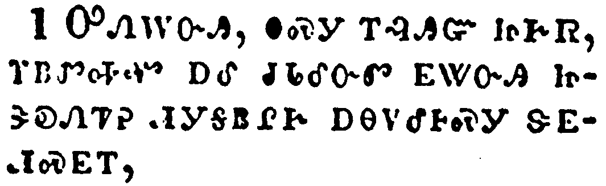
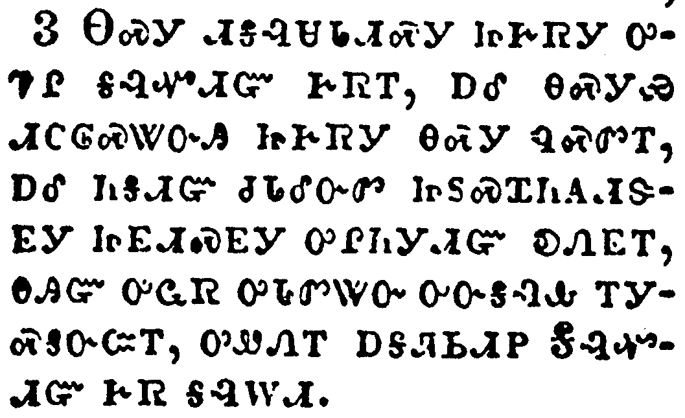
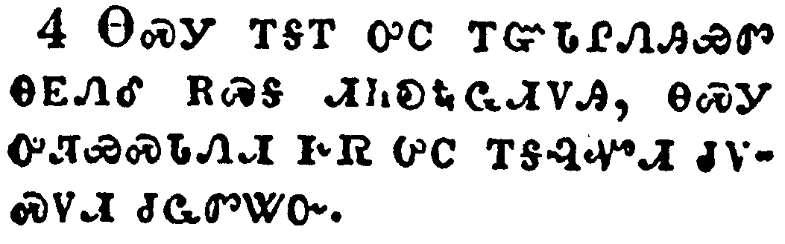
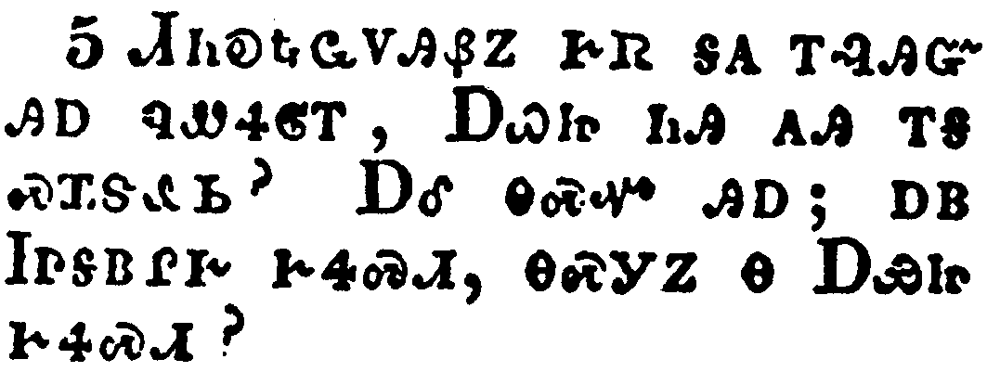
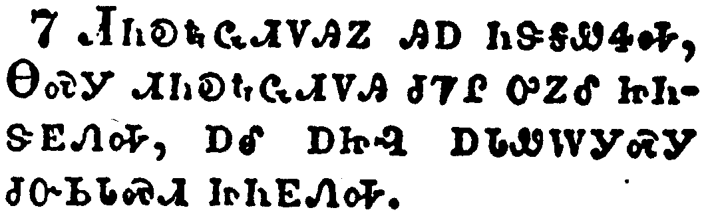
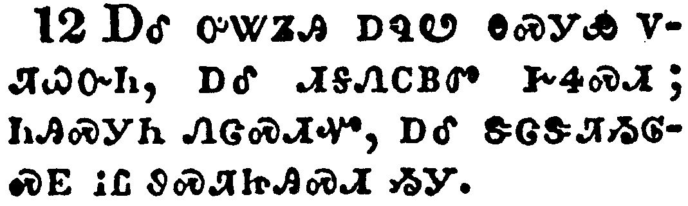
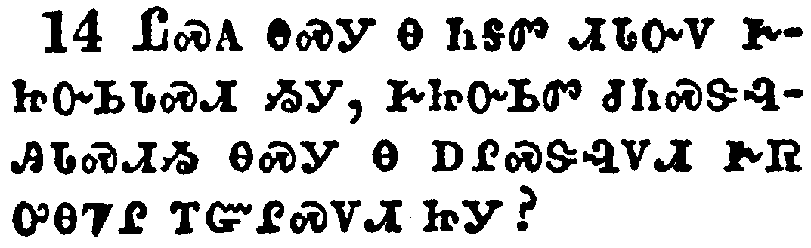

+++
draft=false
date = 2014-12-18T21:11:07Z
title = "Hebrews - Chapter 1 - Cherokee New Testament"
weight = 1418955067

[taxonomies]

authors = ["Timothy Legg"]
categories = []
tags = []

[extra]
+++

<table>
<tbody>
<tr class="odd">
<td></td>
</tr>
<tr class="even">
<td>God, who at sundry times and in divers manners spake in time past unto the fathers by the prophets,</td>
</tr>
<tr class="odd">
<td>ᎤᏁᎳᏅᎯ, ᎾᏍᎩ ᎢᎸᎯᏳ ᏥᎨᏒ, ᎢᏴᏛᎭᏉ ᎠᎴ ᏧᏓᎴᏅᏛ ᎬᏔᏅᎯ ᏥᏕᎧᏁᏤᎮ ᏗᎩᎦᏴᎵᎨ ᎠᎾᏙᎴᎰᏍᎩ ᏕᎬᏗᏍᎬᎢ,</td>
</tr>
<tr class="even">
<td>U-ne-la-nv-hi, na-s-gi i-lv-hi-yu tsi-ge-sv, i-yv-dv-ha-quo a-le tsu-da-le-nv-dv gv-ta-nv-hi tsi-de-ka-ne-tse-he di-gi-ga-yv-li-ge a-na-do-le-ho-s-gi de-gv-di-s-gv-i,</td>
</tr>
</tbody>
</table>

<table>
<tbody>
<tr class="odd">
<td></td>
</tr>
<tr class="even">
<td>Hath in these last days spoken unto us by his Son, whom he hath appointed heir of all things, by whom also he made the worlds;</td>
</tr>
<tr class="odd">
<td>ᎪᎯ ᎤᎵᏍᏆᎸᏗ ᏕᎨᏌᏗᏒ ᎢᎩᏁᏤᎸ ᎤᏪᏥ ᎤᏮᏔᏅ, ᎾᏍᎩ ᎤᏪᎧᏅ ᎤᏤᎵ ᎢᏳᎵᏍᏙᏗᏱ ᏂᎦᏗᏳ ᏧᏓᎴᏅᏛ, ᎾᏍᎩ ᎾᏍᏉ ᎬᏗᏍᎬ ᎡᎶᎯ ᏚᏬᏢᏁᎢ;</td>
</tr>
<tr class="even">
<td>Go-hi u-li-s-qua-lv-di de-ge-sa-di-sv i-gi-ne-tse-lv U-we-tsi u-wv-ta-nv, na-s-gi u-we-ka-nv u-tse-li i-yu-li-s-do-di-yi ni-ga-di-yu tsu-da-le-nv-dv, na-s-gi na-s-quo gv-di-s-gv e-lo-hi du-wo-tlv-ne-i;</td>
</tr>
</tbody>
</table>

<table>
<tbody>
<tr class="odd">
<td></td>
</tr>
<tr class="even">
<td>Who being the brightness of his glory, and the express image of his person, and upholding all things by the word of his power, when he had by himself purged our sins, sat down on the right hand of the Majesty on high;</td>
</tr>
<tr class="odd">
<td>ᎾᏍᎩ ᏗᎦᎸᏌᏓᏗᏍᎩ ᏥᎨᏒᎩ ᎤᏤᎵ ᎦᎸᏉᏗᏳ ᎨᏒᎢ, ᎠᎴ ᎾᏍᎩᏯ ᏗᏟᎶᏍᏔᏅᎯ ᏥᎨᏒᎩ ᎾᏍᎩ ᏄᏍᏛᎢ, ᎠᎴ ᏂᎦᏗᏳ ᏧᏓᎴᏅᏛ ᏥᏚᏍᏆᏂᎪᏗᏕᎬᎩ ᏥᎬᏗᏍᎬᎩ ᎤᎵᏂᎩᏗᏳ ᎧᏁᎬᎢ, ᎾᎯᏳ ᎤᏩᏒ ᎤᏓᏛᏔᏅ ᎤᏅᎦᎸᎭ ᎢᎩᏍᎦᏅᏨᎢ, ᎤᏪᏁᎢ ᎠᎦᏘᏏᏗᏢ ᎦᎸᏉᏗᏳ ᎨᏒ ᎦᎸᎳᏗ.</td>
</tr>
<tr class="even">
<td>Na-s-gi di-ga-lv-sa-da-di-s-gi tsi-ge-sv-gi u-tse-li ga-lv-quo-di-yu ge-sv-i, a-le na-s-gi-ya di-tli-lo-s-ta-nv-hi tsi-ge-sv-gi na-s-gi nu-s-dv-i, a-le ni-ga-di-yu tsu-da-le-nv-dv tsi-du-s-qua-ni-go-di-de-gv-gi tsi-gv-di-s-gv-gi u-li-ni-gi-di-yu ka-ne-gv-i, na-hi-yu u-wa-sv u-da-dv-ta-nv u-nv-ga-lv-ha i-gi-s-ga-nv-tsv-i, u-we-ne-i a-ga-ti-si-di-tlv Ga-lv-quo-di-yu ge-sv ga-lv-la-di.</td>
</tr>
</tbody>
</table>

<table>
<tbody>
<tr class="odd">
<td></td>
</tr>
<tr class="even">
<td>Being made so much better than the angels, as he hath by inheritance obtained a more excellent name than they.</td>
</tr>
<tr class="odd">
<td>ᎾᏍᎩ ᎢᎦᎢ ᎤᏟ ᎢᏳᏓᎵᏁᎯᏯᏛ ᎾᎬᏁᎴ ᎡᏍᎦ ᏗᏂᎧᎿᎭᏩᏗᏙᎯ, ᎾᏍᎩ ᎤᏘᏯᏍᏓᏁᏗ ᎨᏒ ᎤᏟ ᎢᎦᎸᏉᏗ ᏧᏙᏍᏙᏗ ᏧᏩᏛᏔᏅ.</td>
</tr>
<tr class="even">
<td>Na-s-gi i-ga-i u-tli i-yu-da-li-ne-hi-ya-dv na-gv-ne-le e-s-ga di-ni-ka-hna-wa-di-do-hi, na-s-gi u-ti-ya-s-da-ne-di ge-sv u-tli i-ga-lv-quo-di tsu-do-s-do-di tsu-wa-dv-ta-nv.</td>
</tr>
</tbody>
</table>

<table>
<tbody>
<tr class="odd">
<td></td>
</tr>
<tr class="even">
<td>For unto which of the angels said he at any time, Thou art my Son, this day have I begotten thee? And again, I will be to him a Father, and he shall be to me a Son?</td>
</tr>
<tr class="odd">
<td>ᏗᏂᎧᎿᎭᏩᏙᎯᏰᏃ ᎨᏒ ᎦᎪ ᎢᎸᎯᏳ ᎯᎠ ᏄᏪᏎᎶᎢ, ᎠᏇᏥ ᏂᎯ ᎪᎯ ᎢᎦ ᏍᏆᏕᎲᏏ? ᎠᎴ ᎾᏍᏉ ᎯᎠ; ᎠᏴ ᏥᎦᏴᎵᎨ ᎨᏎᏍᏗ, ᎾᏍᎩᏃ Ꮎ ᎠᏯᏥ ᎨᏎᏍᏗ?</td>
</tr>
<tr class="even">
<td>Di-ni-ka-hna-wa-do-hi-ye-no ge-sv ga-go i-lv-hi-yu hi-a nu-we-se-lo-i, A-que-tsi ni-hi go-hi i-ga s-qua-de-hv-si? A-le na-s-quo hi-a; a-yv Tsi-ga-yv-li-ge ge-se-s-di, na-s-gi-no na A-ya-tsi ge-se-s-di?</td>
</tr>
</tbody>
</table>

<table>
<tbody>
<tr class="odd">
<td></td>
</tr>
<tr class="even">
<td>And again, when he bringeth in the firstbegotten into the world, he saith, And let all the angels of God worship him.</td>
</tr>
<tr class="odd">
<td>ᎠᎴ ᎾᏍᏉ, ᎾᎯᏳ ᎢᎬᏱ ᎤᏕᏁᎸᎯ ᎡᎶᎯ ᎤᎾᏄᎪᏫᏒ ᎯᎠ ᏄᏪᏎᎢ; ᎠᎴ ᎾᏂᎥ ᏗᏂᎧᎿᎭᏩᏗᏙᎯ ᎤᏁᎳᏅᎯ ᏧᏤᎵ ᏫᎬᏩᏓᏙᎵᏍᏓᏏ.</td>
</tr>
<tr class="even">
<td>A-le na-s-quo, na-hi-yu i-gv-yi u-de-ne-lv-hi e-lo-hi u-na-nu-go-wi-sv hi-a nu-we-se-i; A-le na-ni-v di-ni-ka-hna-wa-di-do-hi u-ne-la-nv-hi tsu-tse-li wi-gv-wa-da-do-li-s-da-si.</td>
</tr>
</tbody>
</table>

<table>
<tbody>
<tr class="odd">
<td></td>
</tr>
<tr class="even">
<td>And of the angels he saith, Who maketh his angels spirits, and his ministers a flame of fire.</td>
</tr>
<tr class="odd">
<td>ᏗᏂᎧᎿᎭᏩᏗᏙᎯᏃ ᎯᎠ ᏂᏕᎦᏪᏎᎭ, ᎾᏍᎩ ᏗᏂᎧᎿᎭᏩᏗᏙᎯ ᏧᏤᎵ ᎤᏃᎴ ᏥᏂᏕᎬᏁᎭ, ᎠᎴ ᎠᏥᎸ ᎠᏓᏪᎳᎩᏍᎩ ᏧᏅᏏᏓᏍᏗ ᏥᏂᎬᏁᎭ.</td>
</tr>
<tr class="even">
<td>Di-ni-ka-hna-wa-di-do-hi-no hi-a ni-de-ga-we-se-ha, Na-s-gi di-ni-ka-hna-wa-di-do-hi tsu-tse-li u-no-le tsi-ni-de-gv-ne-ha, a-le a-tsi-lv a-da-we-la-gi-s-gi tsu-nv-si-da-s-di tsi-ni-gv-ne-ha.</td>
</tr>
</tbody>
</table>

<table>
<tbody>
<tr class="odd">
<td></td>
</tr>
<tr class="even">
<td>But unto the Son he saith, Thy throne, O God, is for ever and ever: a sceptre of righteousness is the sceptre of thy kingdom.</td>
</tr>
<tr class="odd">
<td>ᎤᏪᏥᏍᎩᏂ ᎯᎠ ᏂᎦᏪᏎᎭ, ᏣᏤᎵ ᎦᏍᎩᎸ, ᏣᏁᎳᏅᎯ, ᏂᎪᎯᎸ ᎠᎴ ᏂᎪᎯᎸ ᏂᎬᏩᏍᏗᏉ; ᎠᏙᎳᏅᏍᏗ ᏚᏳᎪᏛ ᎠᏛᏁᏙᏗ ᎾᏍᎩ ᎠᏙᎳᏅᏍᏗ ᎪᎱᏍᏗ ᏨᏗᎭ ᎾᎿᎭᏣᎬᏫᏳᎯ ᎨᏒᎢ.</td>
</tr>
<tr class="even">
<td>U-we-tsi-s-gi-ni hi-a ni-ga-we-se-ha, Tsa-tse-li ga-s-gi-lv, Tsa-ne-la-nv-hi, ni-go-hi-lv a-le ni-go-hi-lv ni-gv-wa-s-di-quo; a-do-la-nv-s-di du-yu-go-dv a-dv-ne-do-di na-s-gi a-do-la-nv-s-di go-hu-s-di tsv-di-ha na-hna tsa-gv-wi-yu-hi ge-sv-i.</td>
</tr>
</tbody>
</table>

<table>
<tbody>
<tr class="odd">
<td></td>
</tr>
<tr class="even">
<td>Thou hast loved righteousness, and hated iniquity; therefore God, even thy God, hath anointed thee with the oil of gladness above thy fellows.</td>
</tr>
<tr class="odd">
<td>ᎣᏏᏳ ᏣᏰᎸᏅ ᏚᏳᎪᏛ ᎨᏒᎢ; ᎠᎴ ᏣᏂᏆᏘᎸ ᎤᏲ ᎨᏒᎢ, ᎾᏍᎩ ᎢᏳᏍᏗ ᎤᏁᎳᏅᎯ, ᎾᏍᎩ ᏂᎯ ᏣᏁᎳᏅᎯ ᎤᏟ ᎢᎦᎢ ᏣᎶᏁᏔᏅ ᎠᏠᏁᏗ ᎣᏍᏛ ᎠᏓᏓᏅᏓᏗᏍᏗᏍᎩ, ᎡᏍᎦᏉ ᎾᏍᎩ Ꮎ ᎢᏣᎵᎪᎯ.</td>
</tr>
<tr class="even">
<td>O-si-yu tsa-ye-lv-nv du-yu-go-dv ge-sv-i; a-le tsa-ni-qua-ti-lv u-yo ge-sv-i, na-s-gi i-yu-s-di U-ne-la-nv-hi, na-s-gi ni-hi Tsa-ne-la-nv-hi u-tli i-ga-i tsa-lo-ne-ta-nv a-tlo-ne-di o-s-dv a-da-da-nv-da-di-s-di-s-gi, e-s-ga-quo na-s-gi na i-tsa-li-go-hi.</td>
</tr>
</tbody>
</table>

<table>
<tbody>
<tr class="odd">
<td></td>
</tr>
<tr class="even">
<td>And, Thou, Lord, in the beginning hast laid the foundation of the earth; and the heavens are the works of thine hands:</td>
</tr>
<tr class="odd">
<td>ᎠᎴ, ᎾᏍᏉ [ᎯᎠ ᏂᎦᏪᎭ] ᏂᎯ, ᏣᎬᏫᏳᎯ, ᏗᏓᎴᏂᏍᎬ ᎡᎶᎯ ᎦᎫᏍᏓᎥ ᏣᏁᎢ; ᎠᎴ ᎦᎸᎶᎢ ᏗᏦᏰᏂ ᏦᏢᏔᏁᎢ;</td>
</tr>
<tr class="even">
<td>A-le, na-s-quo [hi-a ni-ga-we-ha] Ni-hi, Tsa-gv-wi-yu-hi, di-da-le-ni-s-gv e-lo-hi ga-gu-s-da-v tsa-ne-i; a-le ga-lv-lo-i di-tso-ye-ni tso-tlv-ta-ne-i;</td>
</tr>
</tbody>
</table>

<table>
<tbody>
<tr class="odd">
<td></td>
</tr>
<tr class="even">
<td>They shall perish; but thou remainest; and they all shall wax old as doth a garment;</td>
</tr>
<tr class="odd">
<td>ᏛᎾᎵᏛᏔᏂ ᎾᏍᎩ; ᏂᎯᏍᎩᏂ ᏁᏣᏛᏁᏍᏗᏉ; ᎠᎴ ᎾᏍᎩ ᏂᎦᏛ ᏓᏳᏁᏔᏥ ᎠᏄᏬ ᎾᏍᎩᏯᎢ;</td>
</tr>
<tr class="even">
<td>Dv-na-li-dv-ta-ni na-s-gi; ni-hi-s-gi-ni ne-tsa-dv-ne-s-di-quo; a-le na-s-gi ni-ga-dv da-yu-ne-ta-tsi a-nu-wo na-s-gi-ya-i;</td>
</tr>
</tbody>
</table>

<table>
<tbody>
<tr class="odd">
<td></td>
</tr>
<tr class="even">
<td>And as a vesture shalt thou fold them up, and they shall be changed: but thou art the same, and thy years shall not fail.</td>
</tr>
<tr class="odd">
<td>ᎠᎴ ᎤᏔᏃᎯ ᎠᏄᏬ ᎾᏍᎩᏯ ᏙᏘᏇᏅᎯ, ᎠᎴ ᏗᎦᏁᏟᏴᏛ ᎨᏎᏍᏗ; ᏂᎯᏍᎩᏂ ᏁᏣᏍᏗᏉ, ᎠᎴ ᏕᏣᏕᏘᏱᎶᏍᎬ ᎥᏝ ᏭᏍᏘᏥᎯᏍᏗ ᏱᎩ.</td>
</tr>
<tr class="even">
<td>A-le u-ta-no-hi a-nu-wo na-s-gi-ya do-ti-que-nv-hi, a-le di-ga-ne-tli-yv-dv ge-se-s-di; ni-hi-s-gi-ni ne-tsa-s-di-quo, a-le de-tsa-de-ti-yi-lo-s-gv v-tla wu-s-ti-tsi-hi-s-di yi-gi.</td>
</tr>
</tbody>
</table>

<table>
<tbody>
<tr class="odd">
<td></td>
</tr>
<tr class="even">
<td>But to which of the angels said he at any time, Sit on my right hand, until I make thine enemies thy footstool?</td>
</tr>
<tr class="odd">
<td>ᎦᏙᎨ ᎤᏍᏗ ᏗᏂᎧᎿᎭᏩᏗᏙᎯ ᎨᏒ ᎯᎠ ᏄᏪᏎᎶᎢ, ᏥᎦᏘᏏᏗᏢ ᏦᎴᏍᏗ ᎬᏂ ᎨᏤᏍᎦᎩ ᎦᏍᎩᎶ ᏗᏣᎳᏏᏗᏱ ᏂᎦᏥᏴᏁᎸᎭ?</td>
</tr>
<tr class="even">
<td>Ga-do-ge u-s-di di-ni-ka-hna-wa-di-do-hi ge-sv hi-a nu-we-se-lo-i, Tsi-ga-ti-si-di-tlv tso-le-s-di gv-ni ge-tse-s-ga-gi ga-s-gi-lo di-tsa-la-si-di-yi ni-ga-tsi-yv-ne-lv-ha?</td>
</tr>
</tbody>
</table>

<table>
<tbody>
<tr class="odd">
<td></td>
</tr>
<tr class="even">
<td>Are they not all ministering spirits, sent forth to minister for them who shall be heirs of salvation?</td>
</tr>
<tr class="odd">
<td>ᏝᏍᎪ ᎾᏍᎩ Ꮎ ᏂᎦᏛ ᏗᏓᏅᏙ ᎨᏥᏅᏏᏓᏍᏗ ᏱᎩ, ᎨᏥᏅᏏᏛ ᏧᏂᏍᏕᎸᎯᏓᏍᏗᏱ ᎾᏍᎩ Ꮎ ᎠᎵᏍᏕᎸᏙᏗ ᎨᏒ ᎤᎾᏤᎵ ᎢᏳᎵᏍᏙᏗ ᏥᎩ?</td>
</tr>
<tr class="even">
<td>Tla-s-go na-s-gi na ni-ga-dv di-da-nv-do ge-tsi-nv-si-da-s-di yi-gi, ge-tsi-nv-si-dv tsu-ni-s-de-lv-hi-da-s-di-yi na-s-gi na a-li-s-de-lv-do-di ge-sv u-na-tse-li i-yu-li-s-do-di tsi-gi?</td>
</tr>
</tbody>
</table>

