+++
draft=false
date = 2014-12-18T21:11:07Z
title = "Hebrews - Chapter 2 - Cherokee New Testament"
weight = 1418955067

[taxonomies]

authors = ["Timothy Legg"]
categories = []
tags = []

[extra]
+++

<table>
<tbody>
<tr class="odd">
<td><a href="190201.png">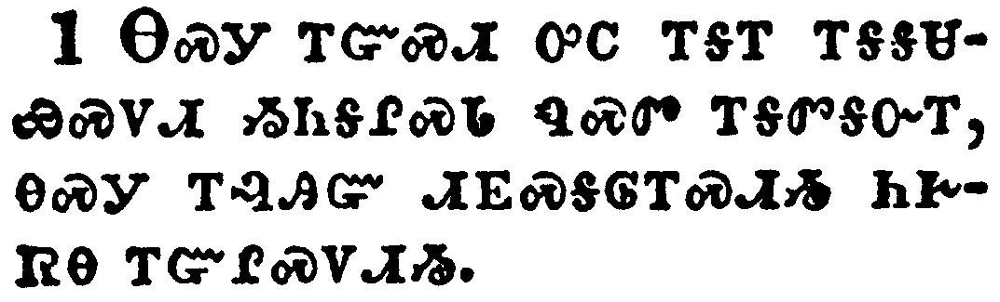</a></td>
</tr>
<tr class="even">
<td>Therefore we ought to give the more earnest heed to the things which we have heard, lest at any time we should let them slip.</td>
</tr>
<tr class="odd">
<td>ᎾᏍᎩ ᎢᏳᏍᏗ ᎤᏟ ᎢᎦᎢ ᎢᎦᎦᏌᏯᏍᏙᏗ ᏱᏂᎦᎵᏍᏓ ᏄᏍᏛ ᎢᎦᏛᎦᏅᎢ, ᎾᏍᎩ ᎢᎸᎯᏳ ᏗᎬᏍᎦᎶᎢᏍᏗᏱ ᏂᎨᏒᎾ ᎢᏳᎵᏍᏙᏗᏱ.</td>
</tr>
<tr class="even">
<td>Na-s-gi i-yu-s-di u-tli i-ga-i i-ga-ga-sa-ya-s-do-di yi-ni-ga-li-s-da nu-s-dv i-ga-dv-ga-nv-i, na-s-gi i-lv-hi-yu di-gv-s-ga-lo-i-s-di-yi ni-ge-sv-na i-yu-li-s-do-di-yi.</td>
</tr>
</tbody>
</table>

<table>
<tbody>
<tr class="odd">
<td><a href="190202.png">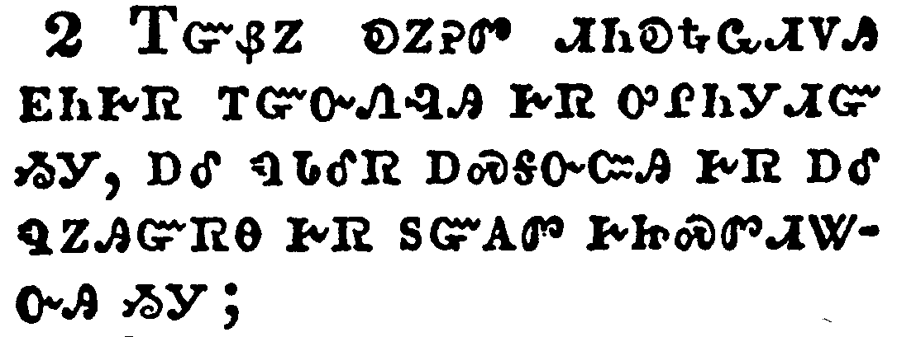</a></td>
</tr>
<tr class="even">
<td>For if the word spoken by angels was stedfast, and every transgression and disobedience received a just recompence of reward;</td>
</tr>
<tr class="odd">
<td>ᎢᏳᏰᏃ ᎧᏃᎮᏛ ᏗᏂᎧᎿᎭᏩᏗᏙᎯ ᎬᏂᎨᏒ ᎢᏳᏅᏁᎸᎯ ᎨᏒ ᎤᎵᏂᎩᏗᏳ ᏱᎩ, ᎠᎴ ᏄᏓᎴᏒ ᎠᏍᎦᏅᏨᎯ ᎨᏒ ᎠᎴ ᏄᏃᎯᏳᏒᎾ ᎨᏒ ᏚᏳᎪᏛ ᎨᏥᏍᏛᏗᏔᏅᎯ ᏱᎩ;</td>
</tr>
<tr class="even">
<td>I-yu-ye-no ka-no-he-dv di-ni-ka-hna-wa-di-do-hi gv-ni-ge-sv i-yu-nv-ne-lv-hi ge-sv u-li-ni-gi-di-yu yi-gi, a-le nu-da-le-sv a-s-ga-nv-tsv-hi ge-sv a-le nu-no-hi-yu-sv-na ge-sv du-yu-go-dv ge-tsi-s-dv-di-ta-nv-hi yi-gi;</td>
</tr>
</tbody>
</table>

<table>
<tbody>
<tr class="odd">
<td><a href="190203.png">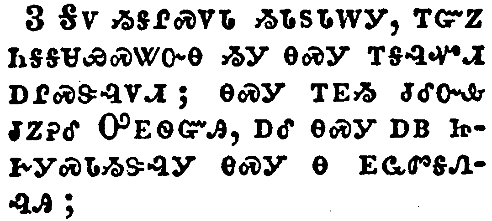</a></td>
</tr>
<tr class="even">
<td>How shall we escape, if we neglect so great salvation; which at the first began to be spoken by the Lord, and was confirmed unto us by them that heard him;</td>
</tr>
<tr class="odd">
<td>ᎦᏙ ᏱᎦᎵᏍᏙᏓ ᏱᏓᏚᏓᎳᎩ, ᎢᏳᏃ ᏂᎦᎦᏌᏯᏍᏔᏅᎾ ᏱᎩ ᎾᏍᎩ ᎢᎦᎸᏉᏗ ᎠᎵᏍᏕᎸᏙᏗ; ᎾᏍᎩ ᎢᎬᏱ ᏧᎴᏅᎲ ᏧᏃᎮᎴ ᎤᎬᏫᏳᎯ, ᎠᎴ ᎾᏍᎩ ᎠᏴ ᏥᎨᎩᏍᏓᏱᏕᎸᎩ ᎾᏍᎩ Ꮎ ᎬᏩᏛᎦᏁᎸᎯ;</td>
</tr>
<tr class="even">
<td>Ga-do yi-ga-li-s-do-da yi-da-du-da-la-gi, i-yu-no ni-ga-ga-sa-ya-s-ta-nv-na yi-gi na-s-gi i-ga-lv-quo-di a-li-s-de-lv-do-di; na-s-gi i-gv-yi tsu-le-nv-hv tsu-no-he-le U-gv-wi-yu-hi, a-le na-s-gi a-yv tsi-ge-gi-s-da-yi-de-lv-gi na-s-gi na gv-wa-dv-ga-ne-lv-hi;</td>
</tr>
</tbody>
</table>

<table>
<tbody>
<tr class="odd">
<td><a href="190204.png">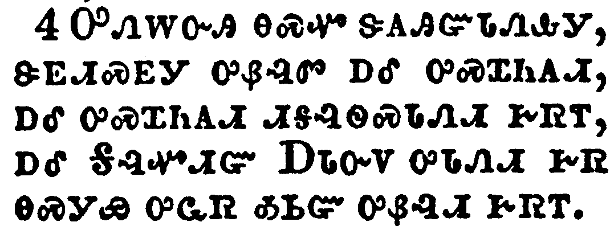</a></td>
</tr>
<tr class="even">
<td>God also bearing them witness, both with signs and wonders, and with divers miracles, and gifts of the Holy Ghost, according to his own will?</td>
</tr>
<tr class="odd">
<td>ᎤᏁᎳᏅᎯ ᎾᏍᏉ ᏕᎪᎯᏳᏓᏁᎲᎩ, ᏕᎬᏗᏍᎬᎩ ᎤᏰᎸᏛ ᎠᎴ ᎤᏍᏆᏂᎪᏗ, ᎠᎴ ᎤᏍᏆᏂᎪᏗ ᏗᎦᎸᏫᏍᏓᏁᏗ ᎨᏒᎢ, ᎠᎴ ᎦᎸᏉᏗᏳ ᎠᏓᏅᏙ ᎤᏓᏁᏗ ᎨᏒ ᎾᏍᎩᏯ ᎤᏩᏒ ᎣᏏᏳ ᎤᏰᎸᏗ ᎨᏒᎢ.</td>
</tr>
<tr class="even">
<td>U-ne-la-nv-hi na-s-quo de-go-hi-yu-da-ne-hv-gi, de-gv-di-s-gv-gi u-ye-lv-dv a-le u-s-qua-ni-go-di, a-le u-s-qua-ni-go-di di-ga-lv-wi-s-da-ne-di ge-sv-i, a-le Ga-lv-quo-di-yu A-da-nv-do u-da-ne-di ge-sv na-s-gi-ya u-wa-sv o-si-yu u-ye-lv-di ge-sv-i.</td>
</tr>
</tbody>
</table>

<table>
<tbody>
<tr class="odd">
<td><a href="190205.png">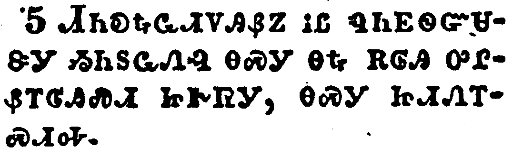</a></td>
</tr>
<tr class="even">
<td>For unto the angels hath he not put in subjection the world to come, whereof we speak.</td>
</tr>
<tr class="odd">
<td>ᏗᏂᎧᎿᎭᏩᏗᏙᎯᏰᏃ ᎥᏝ ᏄᏂᎬᏫᏳᏌᏕᎩ ᏱᏂᏚᏩᏁᎸ ᎾᏍᎩ ᎾᎿᎭᎡᎶᎯ ᎤᎵᏰᎢᎶᎯᏍᏗ ᏥᎨᏒᎩ, ᎾᏍᎩ ᏥᏗᏁᎢᏍᏗᎭ.</td>
</tr>
<tr class="even">
<td>Di-ni-ka-hna-wa-di-do-hi-ye-no v-tla nu-ni-gv-wi-yu-sa-de-gi yi-ni-du-wa-ne-lv na-s-gi na-hna e-lo-hi u-li-ye-i-lo-hi-s-di tsi-ge-sv-gi, na-s-gi tsi-di-ne-i-s-di-ha.</td>
</tr>
</tbody>
</table>

<table>
<tbody>
<tr class="odd">
<td><a href="190206.png">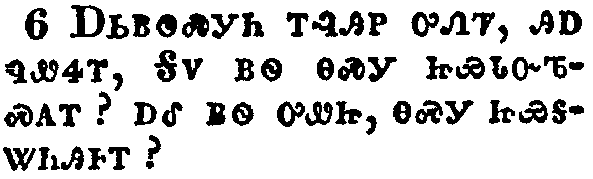</a></td>
</tr>
<tr class="even">
<td>But one in a certain place testified, saying, What is man, that thou art mindful of him? or the son of man, that thou visitest him?</td>
</tr>
<tr class="odd">
<td>ᎠᏏᏴᏫᏍᎩᏂ ᎢᎸᎯᏢ ᎤᏁᏤ, ᎯᎠ ᏄᏪᏎᎢ, ᎦᏙ ᏴᏫ ᎾᏍᎩ ᏥᏯᏓᏅᏖᏍᎪᎢ? ᎠᎴ ᏴᏫ ᎤᏪᏥ, ᎾᏍᎩ ᏥᏯᎦᏔᏂᎯᎰᎢ?</td>
</tr>
<tr class="even">
<td>A-si-yv-wi-s-gi-ni i-lv-hi-tlv u-ne-tse, hi-a nu-we-se-i, Ga-do yv-wi na-s-gi tsi-ya-da-nv-te-s-go-i? a-le yv-wi u-we-tsi, na-s-gi tsi-ya-ga-ta-ni-hi-ho-i?</td>
</tr>
</tbody>
</table>

<table>
<tbody>
<tr class="odd">
<td><a href="190207.png">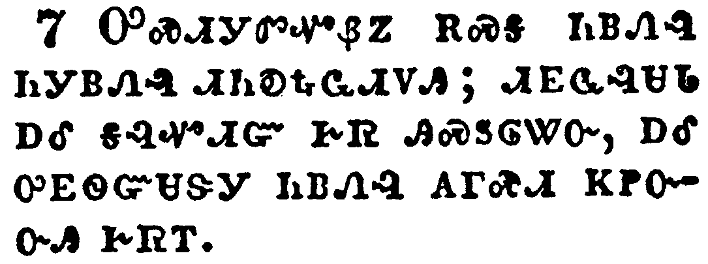</a></td>
</tr>
<tr class="even">
<td>Thou madest him a little lower than the angels; thou crownedst him with glory and honour, and didst set him over the works of thy hands:</td>
</tr>
<tr class="odd">
<td>ᎤᏍᏗᎩᏛᏉᏰᏃ ᎡᏍᎦ ᏂᏴᏁᎸ ᏂᎩᏴᏁᎸ ᏗᏂᎧᎿᎭᏩᏗᏙᎯ; ᏗᎬᏩᎸᏌᏓ ᎠᎴ ᎦᎸᏉᏗᏳ ᎨᏒ ᎯᏍᏚᎶᏔᏅ, ᎠᎴ ᎤᎬᏫᏳᏌᏕᎩ ᏂᏴᏁᎸ ᎪᎱᏍᏗ ᏦᏢᏅᏅᎯ ᎨᏒᎢ.</td>
</tr>
<tr class="even">
<td>U-s-di-gi-dv-quo-ye-no e-s-ga ni-yv-ne-lv ni-gi-yv-ne-lv di-ni-ka-hna-wa-di-do-hi; di-gv-wa-lv-sa-da a-le ga-lv-quo-di-yu ge-sv hi-s-du-lo-ta-nv, a-le u-gv-wi-yu-sa-de-gi ni-yv-ne-lv go-hu-s-di tso-tlv-nv-nv-hi ge-sv-i.</td>
</tr>
</tbody>
</table>

<table>
<tbody>
<tr class="odd">
<td><a href="190208.png">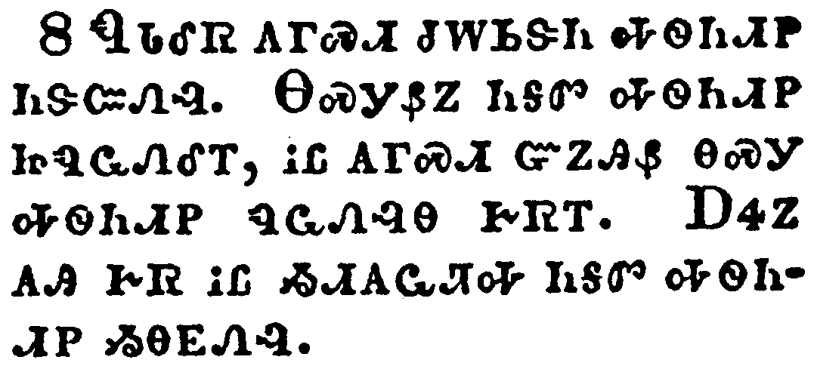</a></td>
</tr>
<tr class="even">
<td>Thou hast put all things in subjection under his feet. For in that he put all in subjection under him, he left nothing that is not put under him. But now we see not yet all things put under him.</td>
</tr>
<tr class="odd">
<td>ᏄᏓᎴᏒ ᎪᎱᏍᏗ ᏧᎳᏏᏕᏂ ᎭᏫᏂᏗᏢ ᏂᏕᏨᏁᎸ. ᎾᏍᎩᏰᏃ ᏂᎦᏛ ᎭᏫᏂᏗᏢ ᏥᏄᏩᏁᎴᎢ, ᎥᏝ ᎪᎱᏍᏗ ᏳᏃᎯᏰ ᎾᏍᎩ ᎭᏫᏂᏗᏢ ᏄᏩᏁᎸᎾ ᎨᏒᎢ. ᎠᏎᏃ ᎪᎯ ᎨᏒ ᎥᏝ ᏱᏗᎪᏩᏘᎭ ᏂᎦᏛ ᎭᏫᏂᏗᏢ ᏱᎾᎬᏁᎸ.</td>
</tr>
<tr class="even">
<td>Nu-da-le-sv go-hu-s-di tsu-la-si-de-ni ha-wi-ni-di-tlv ni-de-tsv-ne-lv. Na-s-gi-ye-no ni-ga-dv ha-wi-ni-di-tlv tsi-nu-wa-ne-le-i, v-tla go-hu-s-di yu-no-hi-ye na-s-gi ha-wi-ni-di-tlv nu-wa-ne-lv-na ge-sv-i. A-se-no go-hi ge-sv v-tla yi-di-go-wa-ti-ha ni-ga-dv ha-wi-ni-di-tlv yi-na-gv-ne-lv.</td>
</tr>
</tbody>
</table>

<table>
<tbody>
<tr class="odd">
<td><a href="190209.png">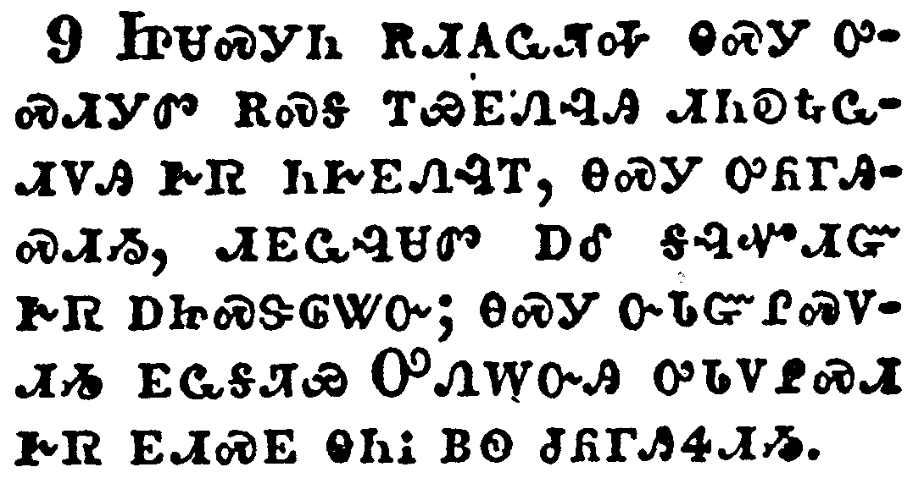</a></td>
</tr>
<tr class="even">
<td>But we see Jesus, who was made a little lower than the angels for the suffering of death, crowned with glory and honour; that he by the grace of God should taste death for every man.</td>
</tr>
<tr class="odd">
<td>ᏥᏌᏍᎩᏂ ᎡᏗᎪᏩᏘᎭ ᎾᏍᎩ ᎤᏍᏗᎩᏛ ᎡᏍᎦ ᎢᏯᎬᏁᎸᎯ ᏗᏂᎧᎿᎭᏩᏗᏙᎯ ᎨᏒ ᏂᎨᎬᏁᎸᎢ, ᎾᏍᎩ ᎤᏲᎱᎯᏍᏗᏱ, ᏗᎬᏩᎸᏌᏛ ᎠᎴ ᎦᎸᏉᏗᏳ ᎨᏒ ᎠᏥᏍᏕᎶᏔᏅ; ᎾᏍᎩ ᏅᏓᏳᎵᏍᏙᏗᏱ ᎬᏩᎦᏘᏯ ᎤᏁᎳᏅᎯ ᎤᏓᏙᎵᏍᏗ ᎨᏒ ᎬᏗᏍᎬ ᎾᏂᎥ ᏴᏫ ᏧᏲᎱᏎᏗᏱ.</td>
</tr>
<tr class="even">
<td>Tsi-sa-s-gi-ni e-di-go-wa-ti-ha na-s-gi u-s-di-gi-dv e-s-ga i-ya-gv-ne-lv-hi di-ni-ka-hna-wa-di-do-hi ge-sv ni-ge-gv-ne-lv-i, na-s-gi u-yo-hu-hi-s-di-yi, di-gv-wa-lv-sa-dv a-le ga-lv-quo-di-yu ge-sv a-tsi-s-de-lo-ta-nv; na-s-gi nv-da-yu-li-s-do-di-yi gv-wa-ga-ti-ya U-ne-la-nv-hi u-da-do-li-s-di ge-sv gv-di-s-gv na-ni-v yv-wi tsu-yo-hu-se-di-yi.</td>
</tr>
</tbody>
</table>

<table>
<tbody>
<tr class="odd">
<td><a href="190210.png">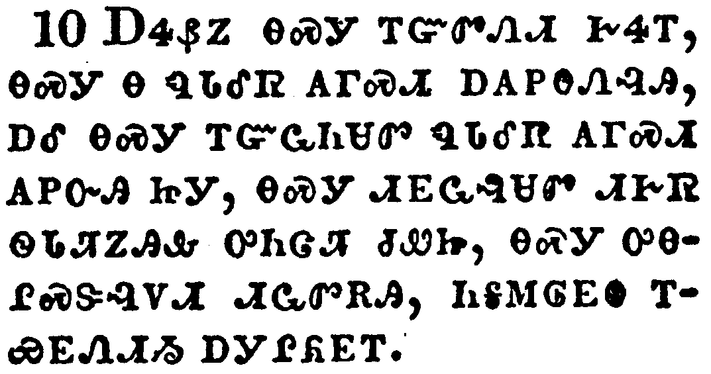</a></td>
</tr>
<tr class="even">
<td>For it became him, for whom are all things, and by whom are all things, in bringing many sons unto glory, to make the captain of their salvation perfect through sufferings.</td>
</tr>
<tr class="odd">
<td>ᎠᏎᏰᏃ ᎾᏍᎩ ᎢᏳᏛᏁᏗ ᎨᏎᎢ, ᎾᏍᎩ Ꮎ ᏄᏓᎴᏒ ᎪᎱᏍᏗ ᎠᎪᏢᎾᏁᎸᎯ, ᎠᎴ ᎾᏍᎩ ᎢᏳᏩᏂᏌᏛ ᏄᏓᎴᏒ ᎪᎱᏍᏗ ᎪᏢᏅᎯ ᏥᎩ, ᎾᏍᎩ ᏗᎬᏩᎸᏌᏛ ᏗᎨᏒ ᏫᏓᏘᏃᎯᎲ ᎤᏂᏣᏘ ᏧᏪᏥ, ᎾᏍᎩ ᎤᎾᎵᏍᏕᎸᏙᏗ ᏗᏩᏛᎡᎯ, ᏂᎦᎷᎶᎬᎾ ᎢᏯᎬᏁᏗᏱ ᎠᎩᎵᏲᎬᎢ.</td>
</tr>
<tr class="even">
<td>A-se-ye-no na-s-gi i-yu-dv-ne-di ge-se-i, na-s-gi na nu-da-le-sv go-hu-s-di a-go-tlv-na-ne-lv-hi, a-le na-s-gi i-yu-wa-ni-sa-dv nu-da-le-sv go-hu-s-di go-tlv-nv-hi tsi-gi, na-s-gi di-gv-wa-lv-sa-dv di-ge-sv wi-da-ti-no-hi-hv u-ni-tsa-ti tsu-we-tsi, na-s-gi u-na-li-s-de-lv-do-di di-wa-dv-e-hi, ni-ga-lu-lo-gv-na i-ya-gv-ne-di-yi a-gi-li-yo-gv-i.</td>
</tr>
</tbody>
</table>

<table>
<tbody>
<tr class="odd">
<td><a href="190211.png">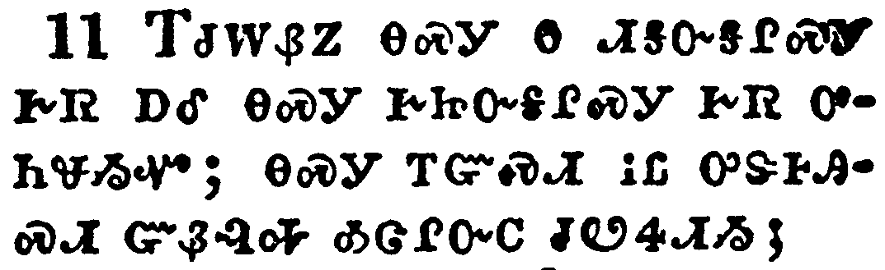</a></td>
</tr>
<tr class="even">
<td>For both he that sanctifieth and they who are sanctified are all of one: for which cause he is not ashamed to call them brethren,</td>
</tr>
<tr class="odd">
<td>ᎢᏧᎳᏰᏃ ᎾᏍᎩ Ꮎ ᏗᎦᏅᎦᎵᏍᎩ ᎨᏒ ᎠᎴ ᎾᏍᎩ ᎨᏥᏅᎦᎵᏍᎩ ᎨᏒ ᎤᏂᏠᏱᏉ; ᎾᏍᎩ ᎢᏳᏍᏗ ᎥᏝ ᎤᏕᎰᎯᏍᏗ ᏳᏰᎸᎭ ᎣᏣᎵᏅᏟ ᏧᏬᏎᏗᏱ;</td>
</tr>
<tr class="even">
<td>I-tsu-la-ye-no na-s-gi na di-ga-nv-ga-li-s-gi ge-sv a-le na-s-gi ge-tsi-nv-ga-li-s-gi ge-sv u-ni-tlo-yi-quo; na-s-gi i-yu-s-di v-tla u-de-ho-hi-s-di yu-ye-lv-ha o-tsa-li-nv-tli tsu-wo-se-di-yi;</td>
</tr>
</tbody>
</table>

<table>
<tbody>
<tr class="odd">
<td><a href="190212.png">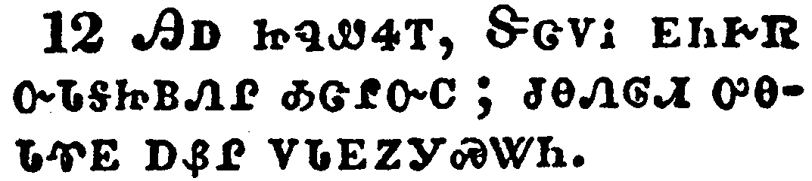</a></td>
</tr>
<tr class="even">
<td>Saying, I will declare thy name unto my brethren, in the midst of the church will I sing praise unto thee.</td>
</tr>
<tr class="odd">
<td>ᎯᎠ ᏥᏄᏪᏎᎢ, ᏕᏣᏙᎥ ᎬᏂᎨᏒ ᏅᏓᎦᏥᏴᏁᎵ ᎣᏣᎵᏅᏟ; ᏧᎾᏁᎶᏗ ᎤᎾᏓᏡᎬ ᎠᏰᎵ ᏙᏓᎬᏃᎩᏍᏔᏂ.</td>
</tr>
<tr class="even">
<td>Hi-a tsi-nu-we-se-i, De-tsa-do-v gv-ni-ge-sv nv-da-ga-tsi-yv-ne-li o-tsa-li-nv-tli; tsu-na-ne-lo-di u-na-da-tlu-gv a-ye-li do-da-gv-no-gi-s-ta-ni.</td>
</tr>
</tbody>
</table>

<table>
<tbody>
<tr class="odd">
<td><a href="190213.png">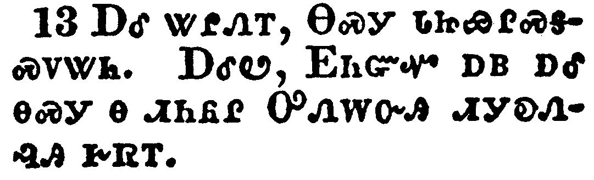</a></td>
</tr>
<tr class="even">
<td>And again, I will put my trust in him. And again, Behold I and the children which God hath given me.</td>
</tr>
<tr class="odd">
<td>ᎠᎴ ᏔᎵᏁᎢ, ᎾᏍᎩ ᏓᏥᏯᎵᏍᎦᏍᏙᏔᏂ. ᎠᎴᏬ, ᎬᏂᏳᏉ ᎠᏴ ᎠᎴ ᎾᏍᎩ Ꮎ ᏗᏂᏲᎵ ᎤᏁᎳᏅᎯ ᏗᎩᎧᏁᎸᎯ ᎨᏒᎢ.</td>
</tr>
<tr class="even">
<td>A-le ta-li-ne-i, Na-s-gi da-tsi-ya-li-s-ga-s-do-ta-ni. A-le-wo, Gv-ni-yu-quo a-yv a-le na-s-gi na di-ni-yo-li U-ne-la-nv-hi di-gi-ka-ne-lv-hi ge-sv-i.</td>
</tr>
</tbody>
</table>

<table>
<tbody>
<tr class="odd">
<td></td>
</tr>
<tr class="even">
<td>Forasmuch then as the children are partakers of flesh and blood, he also himself likewise took part of the same; that through death he might destroy him that had the power of death, that is, the devil;</td>
</tr>
<tr class="odd">
<td>ᎠᎴ ᎾᏍᎩ ᏗᏂᏲᎵ ᎤᏂᏇᏓᎵ ᎠᎴ ᎩᎬ ᎤᏂᏁᎯ ᏥᎩ, ᎤᏩᏒ ᎾᏍᏉ ᎾᏍᎩ ᎤᏠᏯᏍᏔᏁ ᎤᎩᏎᎢ; ᎾᏍᎩ ᎠᏲᎱᎯᏍᏗ ᎨᏒ ᎢᏳᏩᏂᏐᏗᏱ ᎠᏎᏉᏉ ᎢᏳᏩᏁᏗᏱ ᎾᏍᎩ Ꮎ ᎠᏲᎱᎯᏍᏗ ᎨᏒ ᎤᎵᏂᎬᎬ ᎤᎯ, ᎾᏍᎩ ᎠᏍᎩᎾ ᏥᎩ.</td>
</tr>
<tr class="even">
<td>A-le na-s-gi di-ni-yo-li u-ni-que-da-li a-le gi-gv u-ni-ne-hi tsi-gi, u-wa-sv na-s-quo na-s-gi u-tlo-ya-s-ta-ne u-gi-se-i; na-s-gi a-yo-hu-hi-s-di ge-sv i-yu-wa-ni-so-di-yi a-se-quo-quo i-yu-wa-ne-di-yi na-s-gi na a-yo-hu-hi-s-di ge-sv u-li-ni-gv-gv u-hi, na-s-gi a-s-gi-na tsi-gi.</td>
</tr>
</tbody>
</table>

<table>
<tbody>
<tr class="odd">
<td><a href="190215.png">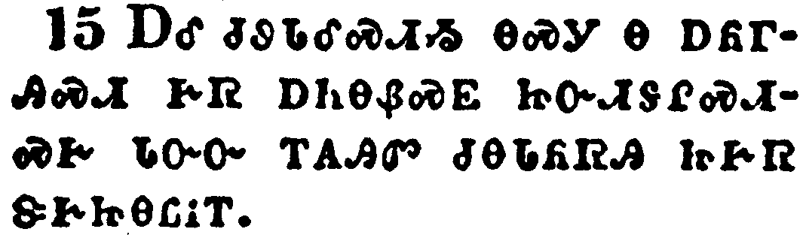</a></td>
</tr>
<tr class="even">
<td>And deliver them who through fear of death were all their lifetime subject to bondage.</td>
</tr>
<tr class="odd">
<td>ᎠᎴ ᏧᏭᏓᎴᏍᏗᏱ ᎾᏍᎩ Ꮎ ᎠᏲᎱᎯᏍᏗ ᎨᏒ ᎠᏂᎾᏰᏍᎬ ᏥᏅᏗᎦᎵᏍᏗᏍᎨ ᏓᏅᏅ ᎢᎪᎯᏛ ᏧᎾᏓᏲᏒᎯ ᏥᎨᏒ ᏕᎨᏥᎾᏝᎥᎢ.</td>
</tr>
<tr class="even">
<td>A-le tsu-wu-da-le-s-di-yi na-s-gi na a-yo-hu-hi-s-di ge-sv a-ni-na-ye-s-gv tsi-nv-di-ga-li-s-di-s-ge da-nv-nv i-go-hi-dv tsu-na-da-yo-sv-hi tsi-ge-sv de-ge-tsi-na-tla-v-i.</td>
</tr>
</tbody>
</table>

<table>
<tbody>
<tr class="odd">
<td><a href="190216.png">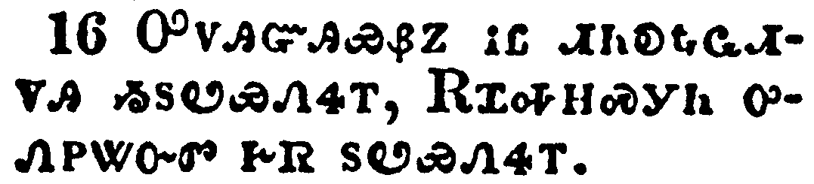</a></td>
</tr>
<tr class="even">
<td>For verily he took not on him the nature of angels; but he took on him the seed of Abraham.</td>
</tr>
<tr class="odd">
<td>ᎤᏙᎯᏳᎯᏰᏃ ᎥᏝ ᏗᏂᎧᎿᎭᏩᏗᏙᎯ ᏱᏚᏬᏯᏁᏎᎢ, ᎡᏆᎭᎻᏍᎩᏂ ᎤᏁᏢᏔᏅᏛ ᎨᏒ ᏚᏬᏯᏁᏎᎢ.</td>
</tr>
<tr class="even">
<td>U-do-hi-yu-hi-ye-no v-tla di-ni-ka-hna-wa-di-do-hi yi-du-wo-ya-ne-se-i, E-qua-ha-mi-s-gi-ni u-ne-tlv-ta-nv-dv ge-sv du-wo-ya-ne-se-i.</td>
</tr>
</tbody>
</table>

<table>
<tbody>
<tr class="odd">
<td><a href="190217.png">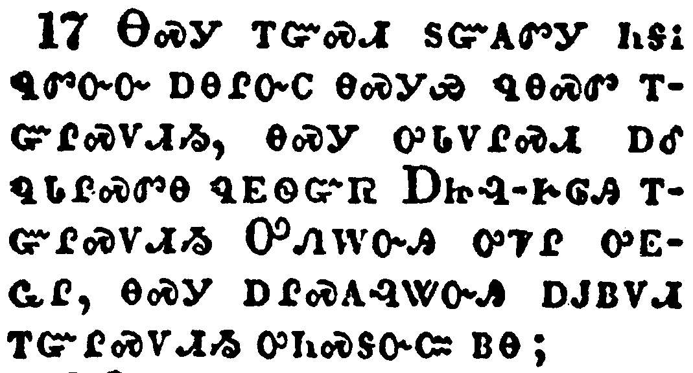</a></td>
</tr>
<tr class="even">
<td>Wherefore in all things it behoved him to be made like unto his brethren, that he might be a merciful and faithful high priest in things pertaining to God, to make reconciliation for the sins of the people.</td>
</tr>
<tr class="odd">
<td>ᎾᏍᎩ ᎢᏳᏍᏗ ᏚᏳᎪᏛᎩ ᏂᎦᎥ ᏄᏛᏅᏅ ᎠᎾᎵᏅᏟ ᎾᏍᎩᏯ ᏄᎾᏍᏛ ᎢᏳᎵᏍᏙᏗᏱ, ᎾᏍᎩ ᎤᏓᏙᎵᏍᏗ ᎠᎴ ᏄᏓᎵᏍᏛᎾ ᏄᎬᏫᏳᏒ ᎠᏥᎸ-ᎨᎶᎯ ᎢᏳᎵᏍᏙᏗᏱ ᎤᏁᎳᏅᎯ ᎤᏤᎵ ᎤᎬᏩᎵ, ᎾᏍᎩ ᎠᎵᏍᎪᎸᏔᏅᎯ ᎠᎫᏴᏙᏗ ᎢᏳᎵᏍᏙᏗᏱ ᎤᏂᏍᎦᏅᏨ ᏴᏫ;</td>
</tr>
<tr class="even">
<td>Na-s-gi i-yu-s-di du-yu-go-dv-gi ni-ga-v nu-dv-nv-nv a-na-li-nv-tli na-s-gi-ya nu-na-s-dv i-yu-li-s-do-di-yi, na-s-gi u-da-do-li-s-di a-le nu-da-li-s-dv-na nu-gv-wi-yu-sv A-tsi-lv--ge-lo-hi i-yu-li-s-do-di-yi U-ne-la-nv-hi u-tse-li u-gv-wa-li, na-s-gi a-li-s-go-lv-ta-nv-hi a-gu-yv-do-di i-yu-li-s-do-di-yi u-ni-s-ga-nv-tsv yv-wi;</td>
</tr>
</tbody>
</table>

<table>
<tbody>
<tr class="odd">
<td><a href="190218.png">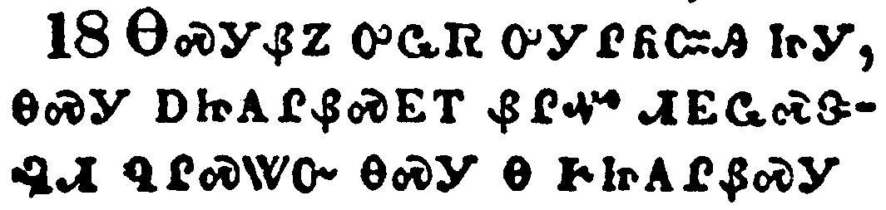</a></td>
</tr>
<tr class="even">
<td>For in that he himself hath suffered being tempted, he is able to succour them that are tempted.</td>
</tr>
<tr class="odd">
<td>ᎾᏍᎩᏰᏃ ᎤᏩᏒ ᎤᎩᎵᏲᏨᎯ ᏥᎩ, ᎾᏍᎩ ᎠᏥᎪᎵᏰᏍᎬᎢ ᏰᎵᏉ ᏗᎬᏩᏍᏕᎸᏗ ᏄᎵᏍᏔᏅ ᎾᏍᎩ Ꮎ ᎨᏥᎪᎵᏰᏍᎩ.</td>
</tr>
<tr class="even">
<td>Na-s-gi-ye-no u-wa-sv u-gi-li-yo-tsv-hi tsi-gi, na-s-gi a-tsi-go-li-ye-s-gv-i ye-li-quo di-gv-wa-s-de-lv-di nu-li-s-ta-nv na-s-gi na ge-tsi-go-li-ye-s-gi.</td>
</tr>
</tbody>
</table>

