+++
draft=false
date = 2014-12-18T21:11:07Z
title = "Hebrews - Chapter 13 - Cherokee New Testament"
weight = 1418955067

[taxonomies]

authors = ["Timothy Legg"]
categories = []
tags = []

[extra]
+++

<table>
<tbody>
<tr class="odd">
<td></td>
</tr>
<tr class="even">
<td>Let brotherly love continue.</td>
</tr>
<tr class="odd">
<td>ᎠᎾᎵᏅᏟ ᏗᎨᏳᏗ ᎨᏒ ᏅᏩᏍᏗᏗᏎᏍᏗᏉ.</td>
</tr>
<tr class="even">
<td>A-na-li-nv-tli di-ge-yu-di ge-sv nv-wa-s-di-di-se-s-di-quo.</td>
</tr>
</tbody>
</table>

<table>
<tbody>
<tr class="odd">
<td><a href="191302.png">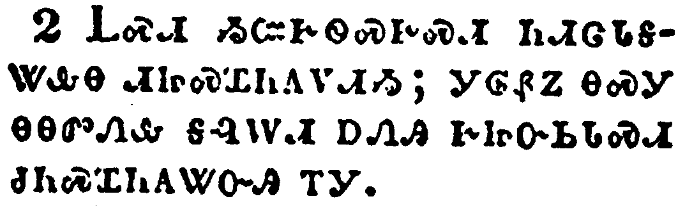</a></td>
</tr>
<tr class="even">
<td>Be not forgetful to entertain strangers: for thereby some have entertained angels unawares.</td>
</tr>
<tr class="odd">
<td>ᏞᏍᏗ ᏱᏨᎨᏫᏍᎨᏍᏗ ᏂᏗᏣᏓᎦᏔᎲᎾ ᏗᏥᏍᏆᏂᎪᏙᏗᏱ; ᎩᎶᏰᏃ ᎾᏍᎩ ᎾᎾᏛᏁᎲ ᎦᎸᎳᏗ ᎠᏁᎯ ᎨᏥᏅᏏᏓᏍᏗ ᏧᏂᏍᏆᏂᎪᏔᏅᎯ ᎢᎩ.</td>
</tr>
<tr class="even">
<td>Tle-s-di yi-tsv-ge-wi-s-ge-s-di ni-di-tsa-da-ga-ta-hv-na di-tsi-s-qua-ni-go-do-di-yi; gi-lo-ye-no na-s-gi na-na-dv-ne-hv ga-lv-la-di a-ne-hi ge-tsi-nv-si-da-s-di tsu-ni-s-qua-ni-go-ta-nv-hi i-gi.</td>
</tr>
</tbody>
</table>

<table>
<tbody>
<tr class="odd">
<td></td>
</tr>
<tr class="even">
<td>Remember them that are in bonds, as bound with them; and them which suffer adversity, as being yourselves also in the body.</td>
</tr>
<tr class="odd">
<td>ᏕᏣᏅᏓᏗᏍᎨᏍᏗ ᏗᎨᎦᎸᎢᏛ ᎨᏒᎢ, ᎾᏍᎩᏯ ᎢᏧᎳᎭ ᏥᏕᏣᎸᎣᎢ; ᎠᎴ ᎾᏍᎩ Ꮎ ᎤᏲ ᎢᎨᎬᎾᏕᎩ, ᎢᏨᏒᏰᏃ ᎾᏍᏉ ᎠᏰᎸ ᎢᏤᎭ.</td>
</tr>
<tr class="even">
<td>De-tsa-nv-da-di-s-ge-s-di di-ge-ga-lv-i-dv ge-sv-i, na-s-gi-ya i-tsu-la-ha tsi-de-tsa-lv-o-i; a-le na-s-gi na u-yo i-ge-gv-na-de-gi, i-tsv-sv-ye-no na-s-quo a-ye-lv i-tse-ha.</td>
</tr>
</tbody>
</table>

<table>
<tbody>
<tr class="odd">
<td><a href="191304.png">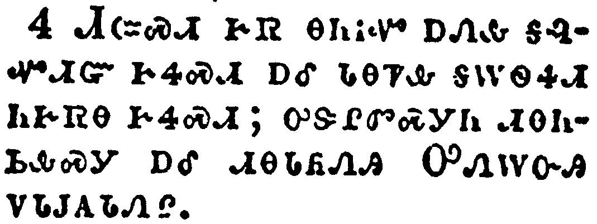</a></td>
</tr>
<tr class="even">
<td>Marriage is honourable in all, and the bed undefiled: but whoremongers and adulterers God will judge.</td>
</tr>
<tr class="odd">
<td>ᏗᏨᏍᏗ ᎨᏒ ᎾᏂᎥᏉ ᎠᏁᎲ ᎦᎸᏉᏗᏳ ᎨᏎᏍᏗ ᎠᎴ ᏓᎾᏤᎲ ᎦᎳᏫᏎᏗ ᏂᎨᏒᎾ ᎨᏎᏍᏗ; ᎤᏕᎵᏛᏍᎩᏂ ᏗᎾᏂᏏᎲᏍᎩ ᎠᎴ ᏗᎾᏓᏲᏁᎯ ᎤᏁᎳᏅᎯ ᏙᏓᎫᎪᏓᏁᎵ.</td>
</tr>
<tr class="even">
<td>Di-tsv-s-di ge-sv na-ni-v-quo a-ne-hv ga-lv-quo-di-yu ge-se-s-di a-le da-na-tse-hv ga-la-wi-se-di ni-ge-sv-na ge-se-s-di; u-de-li-dv-s-gi-ni di-na-ni-si-hv-s-gi a-le di-na-da-yo-ne-hi U-ne-la-nv-hi do-da-gu-go-da-ne-li.</td>
</tr>
</tbody>
</table>

<table>
<tbody>
<tr class="odd">
<td><a href="191305.png">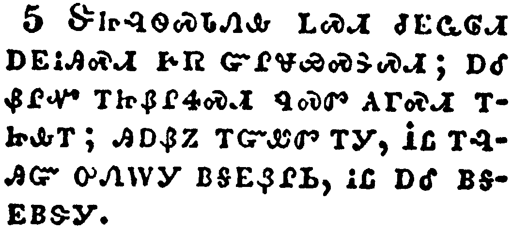</a></td>
</tr>
<tr class="even">
<td>Let your conversation be without covetousness; and be content with such things as ye have: for he hath said, I will never leave thee, nor forsake thee.</td>
</tr>
<tr class="odd">
<td>ᏕᏥᎸᏫᏍᏓᏁᎲ ᏞᏍᏗ ᏧᎬᏩᎶᏗ ᎠᎬᎥᎯᏍᏗ ᎨᏒ ᏳᎵᏠᏯᏍᏕᏍᏗ; ᎠᎴ ᏰᎵᏉ ᎢᏥᏰᎵᏎᏍᏗ ᏄᏍᏛ ᎪᎱᏍᏗ ᎢᏥᎲᎢ; ᎯᎠᏰᏃ ᎢᏳᏪᏛ ᎢᎩ, ᎥᏝ ᎢᎸᎯᏳ ᎤᏁᎳᎩ ᏴᎦᎬᏰᎵᏏ, ᎥᏝ ᎠᎴ ᏴᎦᎬᏴᏕᎩ.</td>
</tr>
<tr class="even">
<td>De-tsi-lv-wi-s-da-ne-hv tle-s-di tsu-gv-wa-lo-di a-gv-v-hi-s-di ge-sv yu-li-tlo-ya-s-de-s-di; a-le ye-li-quo i-tsi-ye-li-se-s-di nu-s-dv go-hu-s-di i-tsi-hv-i; hi-a-ye-no i-yu-we-dv i-gi, V-tla i-lv-hi-yu u-ne-la-gi yv-ga-gv-ye-li-si, v-tla a-le yv-ga-gv-yv-de-gi.</td>
</tr>
</tbody>
</table>

<table>
<tbody>
<tr class="odd">
<td></td>
</tr>
<tr class="even">
<td>So that we may boldly say, The Lord is my helper, and I will not fear what man shall do unto me.</td>
</tr>
<tr class="odd">
<td>ᎾᏍᎩ ᎢᏳᏍᏗ ᏂᏗᎾᏰᏍᎬᎾ ᎯᎠ ᎢᎨᎩᏪᏍᏗ, ᎤᎬᏫᏳᎯ ᎠᎩᏍᏕᎵᏍᎩ, ᎠᎴ ᎥᏝ ᏴᎦᏥᏍᎦᏯ ᏴᏫ ᎢᎦᎬᏋᏁᏗ ᎨᏒᎢ.</td>
</tr>
<tr class="even">
<td>Na-s-gi i-yu-s-di ni-di-na-ye-s-gv-na hi-a i-ge-gi-we-s-di, U-gv-wi-yu-hi a-gi-s-de-li-s-gi, a-le v-tla yv-ga-tsi-s-ga-ya yv-wi i-ga-gv-quv-ne-di ge-sv-i.</td>
</tr>
</tbody>
</table>

<table>
<tbody>
<tr class="odd">
<td><a href="191307.png">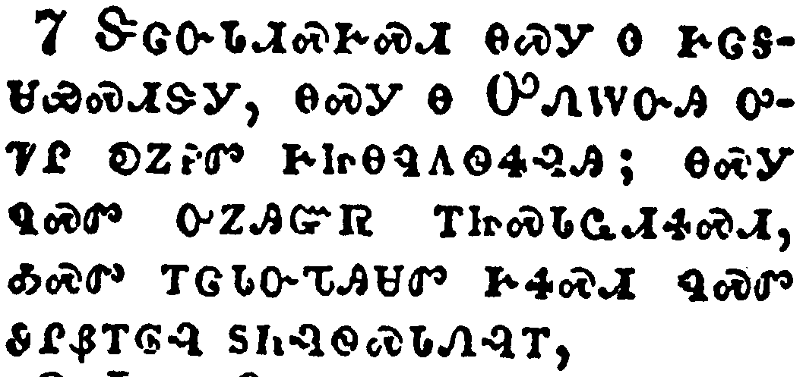</a></td>
</tr>
<tr class="even">
<td>Remember them which have the rule over you, who have spoken unto you the word of God: whose faith follow, considering the end of their conversation.</td>
</tr>
<tr class="odd">
<td>ᏕᏣᏅᏓᏗᏍᎨᏍᏗ ᎾᏍᎩ Ꮎ ᎨᏣᎦᏌᏯᏍᏗᏕᎩ, ᎾᏍᎩ Ꮎ ᎤᏁᎳᏅᎯ ᎤᏤᎵ ᎧᏃᎮᏛ ᎨᏥᎾᏄᎪᏫᏎᎸᎯ; ᎾᏍᎩ ᏄᏍᏛ ᎤᏃᎯᏳᏒ ᎢᏥᏍᏓᏩᏗᏎᏍᏗ, ᎣᏍᏛ ᎢᏣᏓᏅᏖᎯᏌᏛ ᎨᏎᏍᏗ ᏄᏍᏛ ᏭᎵᏰᎢᎶᎸ ᏚᏂᎸᏫᏍᏓᏁᎸᎢ,</td>
</tr>
<tr class="even">
<td>De-tsa-nv-da-di-s-ge-s-di na-s-gi na ge-tsa-ga-sa-ya-s-di-de-gi, na-s-gi na U-ne-la-nv-hi u-tse-li ka-no-he-dv ge-tsi-na-nu-go-wi-se-lv-hi; na-s-gi nu-s-dv u-no-hi-yu-sv i-tsi-s-da-wa-di-se-s-di, o-s-dv i-tsa-da-nv-te-hi-sa-dv ge-se-s-di nu-s-dv wu-li-ye-i-lo-lv du-ni-lv-wi-s-da-ne-lv-i,</td>
</tr>
</tbody>
</table>

<table>
<tbody>
<tr class="odd">
<td><a href="191308.png">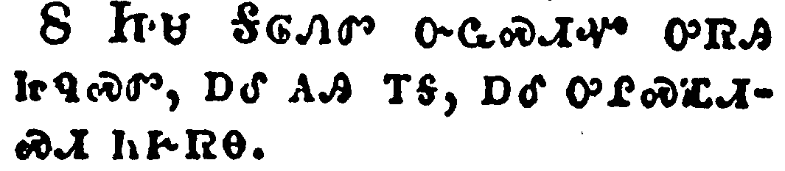</a></td>
</tr>
<tr class="even">
<td>Jesus Christ the same yesterday, and to day, and for ever.</td>
</tr>
<tr class="odd">
<td>ᏥᏌ ᎦᎶᏁᏛ ᏅᏩᏍᏗᏉ ᎤᏒᎯ ᏥᏄᏍᏛ, ᎠᎴ ᎪᎯ ᎢᎦ, ᎠᎴ ᎤᎵᏍᏆᏗᏍᏗ ᏂᎨᏒᎾ.</td>
</tr>
<tr class="even">
<td>Tsi-sa Ga-lo-ne-dv nv-wa-s-di-quo u-sv-hi tsi-nu-s-dv, a-le go-hi i-ga, a-le u-li-s-qua-di-s-di ni-ge-sv-na.</td>
</tr>
</tbody>
</table>

<table>
<tbody>
<tr class="odd">
<td></td>
</tr>
<tr class="even">
<td>Be not carried about with divers and strange doctrines. For it is a good thing that the heart be established with grace; not with meats, which have not profited them that have been occupied therein.</td>
</tr>
<tr class="odd">
<td>ᏞᏍᏗ ᎫᏓᎴᏅᏛ ᎠᎴ ᏂᏥᎦᏔᎲᎾ ᏗᏕᏲᏗ ᎨᏒ ᏱᏗᏣᏘᏂᏙᎮᏍᏗ; ᎣᏏᏳᏰᏃ ᎬᏩᎦᏘᏯ ᎤᏓᏙᎵᏍᏗ ᎨᏒ ᏳᎵᏍᏓᏱᏗᏍᏗ ᎣᎾᏫ; ᎥᏝᏃ ᏄᏍᏛᏉ ᎥᎵᏍᏓᏴᎲᏍᎬᎢ, ᎾᏍᎩ ᎪᎱᏍᏗ ᎤᎾᎵᏍᏕᎸᏙᏗ ᏭᎵᏰᎢᎶᎸᎯ ᏂᎨᏒᎾ ᎨᏒ ᎾᏍᎩ ᎢᏳᏍᏗ ᎤᎾᎦᏌᏯᏍᏔᏅᎯ ᎨᏒᎢ.</td>
</tr>
<tr class="even">
<td>Tle-s-di gu-da-le-nv-dv a-le ni-tsi-ga-ta-hv-na di-de-yo-di ge-sv yi-di-tsa-ti-ni-do-he-s-di; o-si-yu-ye-no gv-wa-ga-ti-ya u-da-do-li-s-di ge-sv yu-li-s-da-yi-di-s-di o-na-wi; v-tla-no nu-s-dv-quo v-li-s-da-yv-hv-s-gv-i, na-s-gi go-hu-s-di u-na-li-s-de-lv-do-di wu-li-ye-i-lo-lv-hi ni-ge-sv-na ge-sv na-s-gi i-yu-s-di u-na-ga-sa-ya-s-ta-nv-hi ge-sv-i.</td>
</tr>
</tbody>
</table>

<table>
<tbody>
<tr class="odd">
<td></td>
</tr>
<tr class="even">
<td>We have an altar, whereof they have no right to eat which serve the tabernacle.</td>
</tr>
<tr class="odd">
<td>ᎠᏥᎸ-ᎨᎳᏍᏗᏱ ᎢᎪᏢᎭ, ᎾᎿᎭᎥᏝ ᏱᏚᏳᎪᏗ ᎤᎾᎵᏍᏓᏴᏗᏱ ᎦᎵᏦᏛᏉ ᎪᎱᏍᏗ ᎠᎾᏛᏁᎯ ᏥᎩ.</td>
</tr>
<tr class="even">
<td>A-tsi-lv--ge-la-s-di-yi i-go-tlv-ha, na-hna v-tla yi-du-yu-go-di u-na-li-s-da-yv-di-yi ga-li-tso-dv-quo go-hu-s-di a-na-dv-ne-hi tsi-gi.</td>
</tr>
</tbody>
</table>

<table>
<tbody>
<tr class="odd">
<td></td>
</tr>
<tr class="even">
<td>For the bodies of those beasts, whose blood is brought into the sanctuary by the high priest for sin, are burned without the camp.</td>
</tr>
<tr class="odd">
<td>ᎠᎴᏬ ᏅᎩ ᏗᏂᏅᏌᏗ ᎤᏂᎩᎬ ᎦᎸᏉᏗᏳ ᏗᎨᏒ ᏥᏫᎦᏁᏨᏍᏗᏍᎨ ᏄᎬᏫᏳᏒ ᎠᏥᎸ-ᎨᎶᎯ ᎠᏍᎦᏂ ᎠᎫᏴᏙᏗ, ᎾᏍᎩ ᏗᏂᏰᎸ ᎦᎵᏦᏛ ᏙᏱᏗᏢ ᏓᎾᎪᎲᏍᏗᏍᎨᎢ.</td>
</tr>
<tr class="even">
<td>A-le-wo nv-gi di-ni-nv-sa-di u-ni-gi-gv ga-lv-quo-di-yu di-ge-sv tsi-wi-ga-ne-tsv-s-di-s-ge nu-gv-wi-yu-sv a-tsi-lv--ge-lo-hi a-s-ga-ni a-gu-yv-do-di, na-s-gi di-ni-ye-lv ga-li-tso-dv do-yi-di-tlv da-na-go-hv-s-di-s-ge-i.</td>
</tr>
</tbody>
</table>

<table>
<tbody>
<tr class="odd">
<td><a href="191312.png">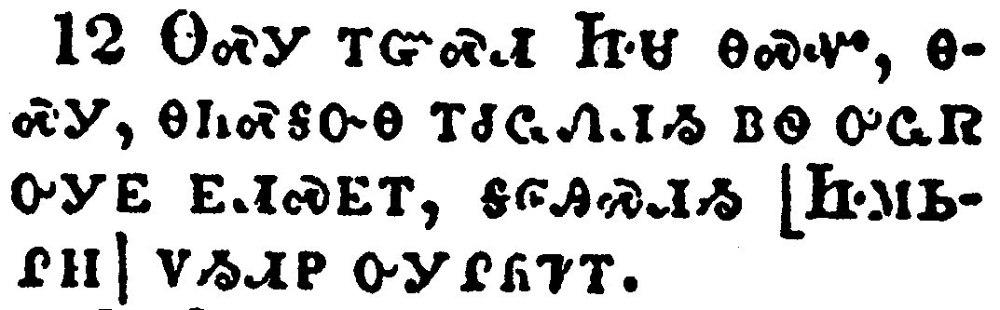</a></td>
</tr>
<tr class="even">
<td>Wherefore Jesus also, that he might sanctify the people with his own blood, suffered without the gate.</td>
</tr>
<tr class="odd">
<td>ᎾᏍᎩ ᎢᏳᏍᏗ ᏥᏌ ᎾᏍᏉ, ᎾᏍᎩ, ᎾᏂᏍᎦᏅᎾ ᎢᏧᏩᏁᏗᏱ ᏴᏫ ᎤᏩᏒ ᎤᎩᎬ ᎬᏗᏍᎬᎢ, ᎦᎶᎯᏍᏗᏱ [ᏥᎷᏏᎵᎻ] ᏙᏱᏗᏢ ᎤᎩᎵᏲᏤᎢ.</td>
</tr>
<tr class="even">
<td>Na-s-gi i-yu-s-di Tsi-sa na-s-quo, na-s-gi, na-ni-s-ga-nv-na i-tsu-wa-ne-di-yi yv-wi u-wa-sv u-gi-gv gv-di-s-gv-i, ga-lo-hi-s-di-yi [Tsi-lu-si-li-mi] do-yi-di-tlv u-gi-li-yo-tse-i.</td>
</tr>
</tbody>
</table>

<table>
<tbody>
<tr class="odd">
<td></td>
</tr>
<tr class="even">
<td>Let us go forth therefore unto him without the camp, bearing his reproach.</td>
</tr>
<tr class="odd">
<td>ᎾᏍᎩ ᎢᏳᏍᏗ ᎢᏕᎾ ᏪᏗᎷᏥ ᎦᎵᏦᏛ ᏙᏱᏗᏢ, ᎢᎦᏠᏯᏍᏗᏍᎨᏍᏗ ᎦᏰᏥᏐᏢᏗᏍᎬᎢ;</td>
</tr>
<tr class="even">
<td>Na-s-gi i-yu-s-di i-de-na we-di-lu-tsi ga-li-tso-dv do-yi-di-tlv, i-ga-tlo-ya-s-di-s-ge-s-di ga-ye-tsi-so-tlv-di-s-gv-i;</td>
</tr>
</tbody>
</table>

<table>
<tbody>
<tr class="odd">
<td></td>
</tr>
<tr class="even">
<td>For here have we no continuing city, but we seek one to come.</td>
</tr>
<tr class="odd">
<td>ᎠᏂᏰᏃ ᎥᏝ ᎠᏲᎩ ᏂᎨᏒᎾ ᏱᎩᏚᎭ, ᎢᎩᏲᎭᏍᎩᏂ ᎾᏍᎩ ᎢᏳᏍᏗ ᎤᎵᏴᎢᎶᎯᏍᏗ ᎨᏒᎢ.</td>
</tr>
<tr class="even">
<td>A-ni-ye-no v-tla a-yo-gi ni-ge-sv-na yi-gi-du-ha, i-gi-yo-ha-s-gi-ni na-s-gi i-yu-s-di u-li-yv-i-lo-hi-s-di ge-sv-i.</td>
</tr>
</tbody>
</table>

<table>
<tbody>
<tr class="odd">
<td><a href="191315.png">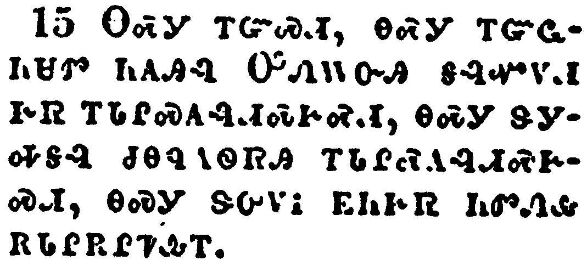</a></td>
</tr>
<tr class="even">
<td>By him therefore let us offer the sacrifice of praise to God continually, that is, the fruit of our lips giving thanks to his name.</td>
</tr>
<tr class="odd">
<td>ᎾᏍᎩ ᎢᏳᏍᏗ, ᎾᏍᎩ ᎢᏳᏩᏂᏌᏛ ᏂᎪᎯᎸ ᎤᏁᎳᏅᎯ ᎦᎸᏉᏙᏗ ᎨᏒ ᎢᏓᎵᏍᎪᎸᏗᏍᎨᏍᏗ, ᎾᏍᎩ ᏕᎩᎭᎦᎸ ᏧᎾᏄᎪᏫᏒᎯ ᎢᏓᎵᏍᎪᎸᏗᏍᎨᏍᏗ, ᎾᏍᎩ ᏕᎤᏙᎥ ᎬᏂᎨᏒ ᏂᏛᏁᎲ ᎡᏓᎵᎡᎵᏤᎲᎢ.</td>
</tr>
<tr class="even">
<td>Na-s-gi i-yu-s-di, na-s-gi i-yu-wa-ni-sa-dv ni-go-hi-lv U-ne-la-nv-hi ga-lv-quo-do-di ge-sv i-da-li-s-go-lv-di-s-ge-s-di, na-s-gi de-gi-ha-ga-lv tsu-na-nu-go-wi-sv-hi i-da-li-s-go-lv-di-s-ge-s-di, na-s-gi de-u-do-v gv-ni-ge-sv ni-dv-ne-hv e-da-li-e-li-tse-hv-i.</td>
</tr>
</tbody>
</table>

<table>
<tbody>
<tr class="odd">
<td><a href="191316.png">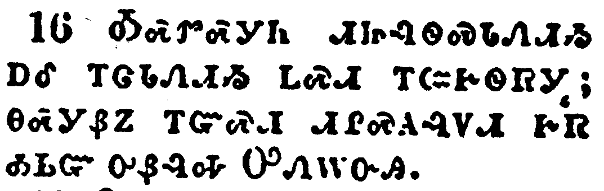</a></td>
</tr>
<tr class="even">
<td>But to do good and to communicate forget not: for with such sacrifices God is well pleased.</td>
</tr>
<tr class="odd">
<td>ᎣᏍᏛᏍᎩᏂ ᏗᏥᎸᏫᏍᏓᏁᏗᏱ ᎠᎴ ᎢᏣᏓᏁᏗᏱ ᏞᏍᏗ ᎢᏨᎨᏫᏒᎩ; ᎾᏍᎩᏰᏃ ᎢᏳᏍᏗ ᏗᎵᏍᎪᎸᏙᏗ ᎨᏒ ᎣᏏᏳ ᎤᏰᎸᎭ ᎤᏁᎳᏅᎯ.</td>
</tr>
<tr class="even">
<td>O-s-dv-s-gi-ni di-tsi-lv-wi-s-da-ne-di-yi a-le i-tsa-da-ne-di-yi tle-s-di i-tsv-ge-wi-sv-gi; na-s-gi-ye-no i-yu-s-di di-li-s-go-lv-do-di ge-sv o-si-yu u-ye-lv-ha U-ne-la-nv-hi.</td>
</tr>
</tbody>
</table>

<table>
<tbody>
<tr class="odd">
<td><a href="191317.png">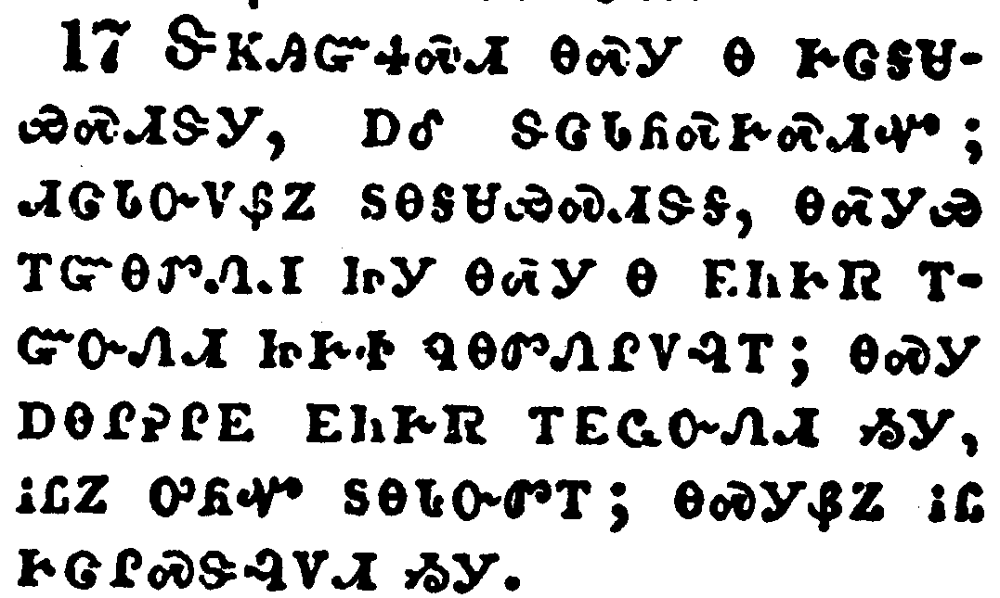</a></td>
</tr>
<tr class="even">
<td>Obey them that have the rule over you, and submit yourselves: for they watch for your souls, as they that must give account, that they may do it with joy, and not with grief: for that is unprofitable for you.</td>
</tr>
<tr class="odd">
<td>ᏕᏦᎯᏳᏎᏍᏗ ᎾᏍᎩ Ꮎ ᎨᏣᎦᏌᏯᏍᏗᏕᎩ, ᎠᎴ ᏕᏣᏓᏲᏍᎨᏍᏗᏉ; ᏗᏣᏓᏅᏙᏰᏃ ᏚᎾᎦᏌᏯᏍᏗᏕᎦ, ᎾᏍᎩᏯ ᎢᏳᎾᏛᏁᏗ ᏥᎩ ᎾᏍᎩ Ꮎ ᎬᏂᎨᏒ ᎢᏳᏅᏁᏗ ᏥᎨᏐ ᏄᎾᏛᏁᎵᏙᎸᎢ; ᎾᏍᎩ ᎠᎾᎵᎮᎵᎬ ᎬᏂᎨᏒ ᎢᎬᏩᏅᏁᏗ ᏱᎩ, ᎥᏝᏃ ᎤᏲᏉ ᏚᎾᏓᏅᏛᎢ; ᎾᏍᎩᏰᏃ ᎥᏝ ᎨᏣᎵᏍᏕᎸᏙᏗ ᏱᎩ.</td>
</tr>
<tr class="even">
<td>De-tso-hi-yu-se-s-di na-s-gi na ge-tsa-ga-sa-ya-s-di-de-gi, a-le de-tsa-da-yo-s-ge-s-di-quo; di-tsa-da-nv-do-ye-no du-na-ga-sa-ya-s-di-de-ga, na-s-gi-ya i-yu-na-dv-ne-di tsi-gi na-s-gi na gv-ni-ge-sv i-yu-nv-ne-di tsi-ge-so nu-na-dv-ne-li-do-lv-i; na-s-gi a-na-li-he-li-gv gv-ni-ge-sv i-gv-wa-nv-ne-di yi-gi, v-tla-no u-yo-quo du-na-da-nv-dv-i; na-s-gi-ye-no v-tla ge-tsa-li-s-de-lv-do-di yi-gi.</td>
</tr>
</tbody>
</table>

<table>
<tbody>
<tr class="odd">
<td></td>
</tr>
<tr class="even">
<td>Pray for us: for we trust we have a good conscience, in all things willing to live honestly.</td>
</tr>
<tr class="odd">
<td>ᎢᏣᏓᏙᎵᏍᏗᏍᎬ ᎠᏴ ᏍᎩᏁᎢᏍᏗᏍᎨᏍᏗ; ᎣᎪᎯᏳᎭᏰᏃ ᎣᏏᏳ ᏂᏙᎬᏅ ᏦᎦᏓᏅᏙ, ᎠᎴ ᎣᎦᏚᎵᎭ ᏂᎦᎥᏉ ᏃᏣᏛᏁᎵᏙᎲ ᏱᏍᏛ ᎢᏲᎦᏛᏁᏗᏱ.</td>
</tr>
<tr class="even">
<td>I-tsa-da-do-li-s-di-s-gv a-yv s-gi-ne-i-s-di-s-ge-s-di; o-go-hi-yu-ha-ye-no o-si-yu ni-do-gv-nv tso-ga-da-nv-do, a-le o-ga-du-li-ha ni-ga-v-quo no-tsa-dv-ne-li-do-hv yi-s-dv i-yo-ga-dv-ne-di-yi.</td>
</tr>
</tbody>
</table>

<table>
<tbody>
<tr class="odd">
<td></td>
</tr>
<tr class="even">
<td>But I beseech you the rather to do this, that I may be restored to you the sooner.</td>
</tr>
<tr class="odd">
<td>ᎯᎠᏍᎩᏂᏃᏅ ᎢᏣᏛᏁᏗᏱ ᎤᏟ ᎢᎦᎢ ᎢᏨᏍᏗᏰᏗᎭ, ᎾᏍᎩ ᏞᎦᎾᎨ ᏗᏤᎲ ᏔᎵᏁ ᏮᏆᏘᏃᎯᏍᏗᏱ.</td>
</tr>
<tr class="even">
<td>Hi-a-s-gi-ni-no-nv i-tsa-dv-ne-di-yi u-tli i-ga-i i-tsv-s-di-ye-di-ha, na-s-gi tle-ga-na-ge di-tse-hv ta-li-ne wv-qua-ti-no-hi-s-di-yi.</td>
</tr>
</tbody>
</table>

<table>
<tbody>
<tr class="odd">
<td><a href="191320.png">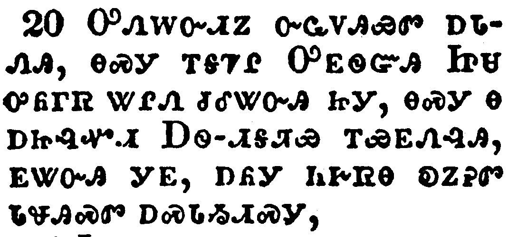</a></td>
</tr>
<tr class="even">
<td>Now the God of peace, that brought again from the dead our Lord Jesus, that great shepherd of the sheep, through the blood of the everlasting covenant,</td>
</tr>
<tr class="odd">
<td>ᎤᏁᎳᏅᏗᏃ ᏅᏩᏙᎯᏯᏛ ᎠᏓᏁᎯ, ᎾᏍᎩ ᎢᎦᏤᎵ ᎤᎬᏫᏳᎯ ᏥᏌ ᎤᏲᎱᏒ ᏔᎵᏁ ᏧᎴᏔᏅᎯ ᏥᎩ, ᎾᏍᎩ Ꮎ ᎠᏥᎸᏉᏗ ᎠᏫ-ᏗᎦᏘᏯ ᎢᏯᎬᏁᎸᎯ, ᎬᏔᏅᎯ ᎩᎬ, ᎠᏲᎩ ᏂᎨᏒᎾ ᎧᏃᎮᏛ ᏓᏠᎯᏍᏛ ᎠᏍᏓᏱᏗᏍᎩ,</td>
</tr>
<tr class="even">
<td>U-ne-la-nv-di-no nv-wa-do-hi-ya-dv a-da-ne-hi, na-s-gi i-ga-tse-li U-gv-wi-yu-hi Tsi-sa u-yo-hu-sv ta-li-ne tsu-le-ta-nv-hi tsi-gi, na-s-gi na a-tsi-lv-quo-di A-wi--di-ga-ti-ya i-ya-gv-ne-lv-hi, gv-ta-nv-hi gi-gv, a-yo-gi ni-ge-sv-na ka-no-he-dv da-tlo-hi-s-dv a-s-da-yi-di-s-gi,</td>
</tr>
</tbody>
</table>

<table>
<tbody>
<tr class="odd">
<td><a href="191321.png">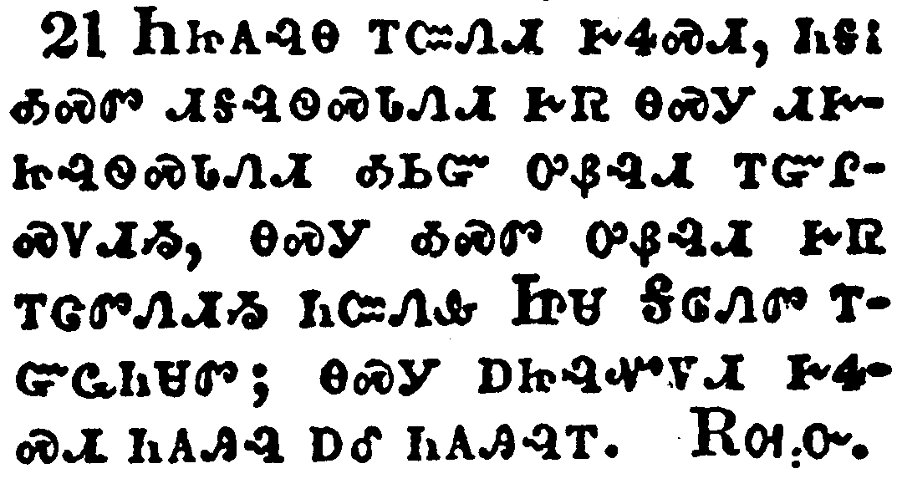</a></td>
</tr>
<tr class="even">
<td>Make you perfect in every good work to do his will, working in you that which is wellpleasing in his sight, through Jesus Christ; to whom be glory for ever and ever. Amen.</td>
</tr>
<tr class="odd">
<td>ᏂᏥᎪᎸᎾ ᎢᏨᏁᏗ ᎨᏎᏍᏗ, ᏂᎦᎥ ᎣᏍᏛ ᏗᎦᎸᏫᏍᏓᏁᏗ ᎨᏒ ᎾᏍᎩ ᏗᎨᏥᎸᏫᏍᏓᏁᏗ ᎣᏏᏳ ᎤᏰᎸᏗ ᎢᏳᎵᏍᏙᏗᏱ, ᎾᏍᎩ ᎣᏍᏛ ᎤᏰᎸᏗ ᎨᏒ ᎢᏣᏛᏁᏗᏱ ᏂᏨᏁᎲ ᏥᏌ ᎦᎶᏁᏛ ᎢᏳᏩᏂᏌᏛ; ᎾᏍᎩ ᎠᏥᎸᏉᏙᏗ ᎨᏎᏍᏗ ᏂᎪᎯᎸ ᎠᎴ ᏂᎪᎯᎸᎢ. ᎠᎺᏅ.</td>
</tr>
<tr class="even">
<td>Ni-tsi-go-lv-na i-tsv-ne-di ge-se-s-di, ni-ga-v o-s-dv di-ga-lv-wi-s-da-ne-di ge-sv na-s-gi di-ge-tsi-lv-wi-s-da-ne-di o-si-yu u-ye-lv-di i-yu-li-s-do-di-yi, na-s-gi o-s-dv u-ye-lv-di ge-sv i-tsa-dv-ne-di-yi ni-tsv-ne-hv Tsi-sa Ga-lo-ne-dv i-yu-wa-ni-sa-dv; na-s-gi a-tsi-lv-quo-do-di ge-se-s-di ni-go-hi-lv a-le ni-go-hi-lv-i. A-me-nv.</td>
</tr>
</tbody>
</table>

<table>
<tbody>
<tr class="odd">
<td><a href="191322.png">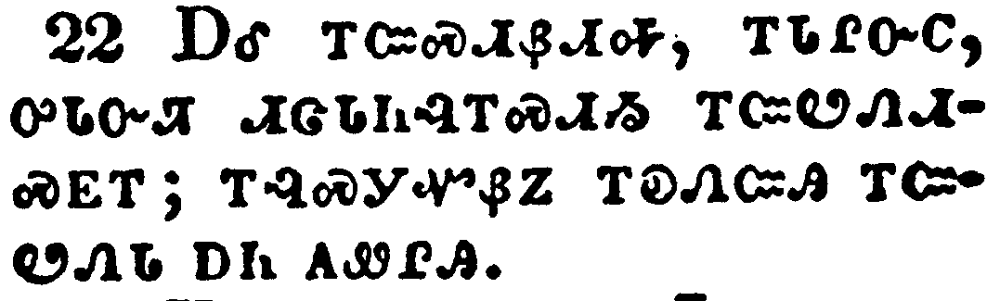</a></td>
</tr>
<tr class="even">
<td>And I beseech you, brethren, suffer the word of exhortation: for I have written a letter unto you in few words.</td>
</tr>
<tr class="odd">
<td>ᎠᎴ ᎢᏨᏍᏗᏰᏗᎭ, ᎢᏓᎵᏅᏟ, ᎤᏓᏅᏘ ᏗᏣᏓᏂᎸᎢᏍᏗᏱ ᎢᏨᏬᏁᏗᏍᎬᎢ; ᎢᎸᏍᎩᏉᏰᏃ ᎢᎧᏁᏨᎯ ᎢᏨᏬᏁᏓ ᎠᏂ ᎪᏪᎵᎯ.</td>
</tr>
<tr class="even">
<td>A-le i-tsv-s-di-ye-di-ha, i-da-li-nv-tli, u-da-nv-ti di-tsa-da-ni-lv-i-s-di-yi i-tsv-wo-ne-di-s-gv-i; i-lv-s-gi-quo-ye-no i-ka-ne-tsv-hi i-tsv-wo-ne-da a-ni go-we-li-hi.</td>
</tr>
</tbody>
</table>

<table>
<tbody>
<tr class="odd">
<td></td>
</tr>
<tr class="even">
<td>Know ye that our brother Timothy is set at liberty; with whom, if he come shortly, I will see you.</td>
</tr>
<tr class="odd">
<td>ᎢᏣᏅᏖᏍᏗ ᎾᏍᎩ ᏗᎹᏗ ᎢᏓᎵᏅᏟ ᎤᏁᎳᏛᎢ; ᎢᏳᏃ ᏂᎪᎯᎸᎾ ᎢᎦᎷᏨᎭ ᎢᏨᎪᏩᏛᏗ ᎢᎨᏎᏍᏗ ᎾᏍᎩ ᎣᏍᏕᎮᏍᏗ.</td>
</tr>
<tr class="even">
<td>I-tsa-nv-te-s-di na-s-gi Di-ma-di i-da-li-nv-tli u-ne-la-dv-i; i-yu-no ni-go-hi-lv-na i-ga-lu-tsv-ha i-tsv-go-wa-dv-di i-ge-se-s-di na-s-gi o-s-de-he-s-di.</td>
</tr>
</tbody>
</table>

<table>
<tbody>
<tr class="odd">
<td></td>
</tr>
<tr class="even">
<td>Salute all them that have the rule over you, and all the saints. They of Italy salute you.</td>
</tr>
<tr class="odd">
<td>ᏕᏥᏲᎵᎸᎭ ᏂᎦᏛ ᎨᏣᎦᏌᏯᏍᏗᏕᎩ, ᎠᎴ ᏂᎦᏛ ᎤᎾᏓᏅᏘ. ᎢᏓᎵ ᎠᏁᎯ ᏫᎨᏥᏲᎵᎦ.</td>
</tr>
<tr class="even">
<td>De-tsi-yo-li-lv-ha ni-ga-dv ge-tsa-ga-sa-ya-s-di-de-gi, a-le ni-ga-dv u-na-da-nv-ti. I-da-li a-ne-hi wi-ge-tsi-yo-li-ga.</td>
</tr>
</tbody>
</table>

<table>
<tbody>
<tr class="odd">
<td></td>
</tr>
<tr class="even">
<td>Grace be with you all. Amen.</td>
</tr>
<tr class="odd">
<td>ᎬᏩᎦᏘᏯ ᎤᏓᏙᎵᏍᏗ ᎨᏒ ᏕᏥᎧᎿᎭᏩᏗᏙᎮᏍᏗ ᏂᏥᎥᎢ. ᎡᎺᏅ.</td>
</tr>
<tr class="even">
<td>Gv-wa-ga-ti-ya u-da-do-li-s-di ge-sv de-tsi-ka-hna-wa-di-do-he-s-di ni-tsi-v-i. E-me-nv.</td>
</tr>
</tbody>
</table>

