+++
draft=false
date = 2014-12-18T21:11:07Z
title = "James - Chapter 5 - Cherokee New Testament"
weight = 1418955067

[taxonomies]

authors = ["Timothy Legg"]
categories = []
tags = []

[extra]
+++

<table>
<tbody>
<tr class="odd">
<td><a href="200501.png">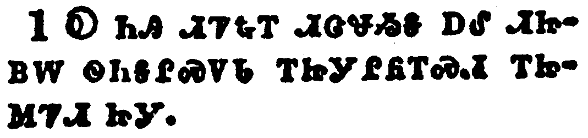</a></td>
</tr>
<tr class="even">
<td>Go to now, ye rich men, weep and howl for your miseries that shall come upon you.</td>
</tr>
<tr class="odd">
<td>Ꭷ ᏂᎯ ᏗᏤᎿᎭᎢ ᏗᏣᏠᏱᎦ ᎠᎴ ᏗᏥᏴᎳ ᏫᏂᎦᎵᏍᏙᏓ ᎢᏥᎩᎵᏲᎢᏍᏗ ᎢᏥᎷᏤᏗ ᏥᎩ.</td>
</tr>
<tr class="even">
<td>Ka ni-hi di-tse-hna-i di-tsa-tlo-yi-ga a-le di-tsi-yv-la wi-ni-ga-li-s-do-da i-tsi-gi-li-yo-i-s-di i-tsi-lu-tse-di tsi-gi.</td>
</tr>
</tbody>
</table>

<table>
<tbody>
<tr class="odd">
<td><a href="200502.png">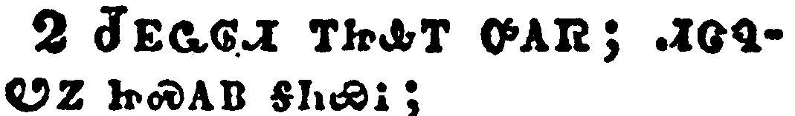</a></td>
</tr>
<tr class="even">
<td>Your riches are corrupted, and your garments are motheaten.</td>
</tr>
<tr class="odd">
<td>ᏧᎬᏩᎶᏗ ᎢᏥᎲᎢ ᎤᎪᏒ; ᏗᏣᏄᏬᏃ ᏥᏍᎪᏴ ᎦᏂᏯᎥ;</td>
</tr>
<tr class="even">
<td>Tsu-gv-wa-lo-di i-tsi-hv-i u-go-sv; di-tsa-nu-wo-no tsi-s-go-yv ga-ni-ya-v;</td>
</tr>
</tbody>
</table>

<table>
<tbody>
<tr class="odd">
<td><a href="200503.png">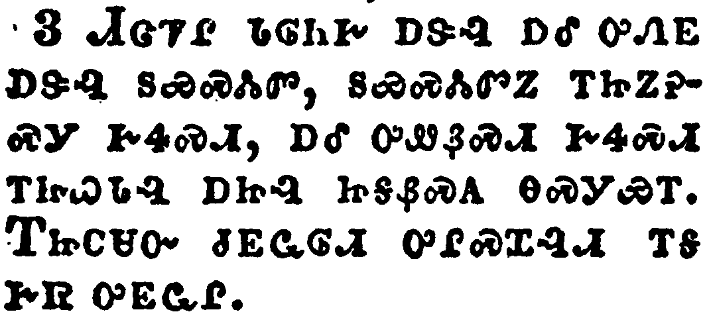</a></td>
</tr>
<tr class="even">
<td>Your gold and silver is cankered; and the rust of them shall be a witness against you, and shall eat your flesh as it were fire. Ye have heaped treasure together for the last days.</td>
</tr>
<tr class="odd">
<td>ᏗᏣᏤᎵ ᏓᎶᏂᎨ ᎠᏕᎸ ᎠᎴ ᎤᏁᎬ ᎠᏕᎸ ᏚᏯᏍᏜᏓᏛ, ᏚᏯᏍᏜᏓᏛᏃ ᎢᏥᏃᎮᏍᎩ ᎨᏎᏍᏗ, ᎠᎴ ᎤᏪᏰᏍᏗ ᎨᏎᏍᏗ ᎢᏥᏇᏓᎸ ᎠᏥᎸ ᏥᎦᏰᏍᎪ ᎾᏍᎩᏯᎢ. ᎢᏥᏟᏌᏅ ᏧᎬᏩᎶᏗ ᎤᎵᏍᏆᎸᏗ ᎢᎦ ᎨᏒ ᎤᎬᏩᎵ.</td>
</tr>
<tr class="even">
<td>Di-tsa-tse-li da-lo-ni-ge a-de-lv a-le u-ne-gv a-de-lv du-ya-s-dla-dv, du-ya-s-dla-dv-no i-tsi-no-he-s-gi ge-se-s-di, a-le u-we-ye-s-di ge-se-s-di i-tsi-que-da-lv a-tsi-lv tsi-ga-ye-s-go na-s-gi-ya-i. I-tsi-tli-sa-nv tsu-gv-wa-lo-di u-li-s-qua-lv-di i-ga ge-sv u-gv-wa-li.</td>
</tr>
</tbody>
</table>

<table>
<tbody>
<tr class="odd">
<td><a href="200504.png">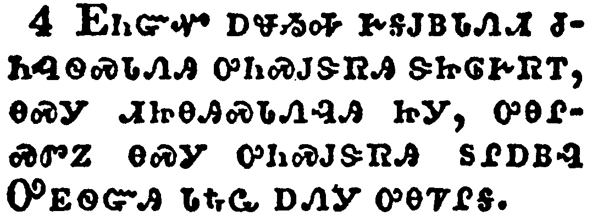</a></td>
</tr>
<tr class="even">
<td>Behold, the hire of the labourers who have reaped down your fields, which is of you kept back by fraud, crieth: and the cries of them which have reaped are entered into the ears of the Lord of sabaoth.</td>
</tr>
<tr class="odd">
<td>ᎬᏂᏳᏉ ᎠᏠᏱᎭ ᎨᎦᎫᏴᏓᏁᏗ ᏧᏂᎸᏫᏍᏓᏁᎯ ᎤᏂᏍᎫᏕᏒᎯ ᏕᏥᎶᎨᏒᎢ, ᎾᏍᎩ ᏗᏥᎾᎯᏍᏓᏁᎸᎯ ᏥᎩ, ᎤᎾᎵᏍᏛᏃ ᎾᏍᎩ ᎤᏂᏍᎫᏕᏒᎯ ᏚᎵᎠᏴᎸ ᎤᎬᏫᏳᎯ ᏓᎿᎭᏩ ᎠᏁᎩ ᎤᎾᏤᎵᎦ.</td>
</tr>
<tr class="even">
<td>Gv-ni-yu-quo a-tlo-yi-ha ge-ga-gu-yv-da-ne-di tsu-ni-lv-wi-s-da-ne-hi u-ni-s-gu-de-sv-hi de-tsi-lo-ge-sv-i, na-s-gi di-tsi-na-hi-s-da-ne-lv-hi tsi-gi, u-na-li-s-dv-no na-s-gi u-ni-s-gu-de-sv-hi du-li-a-yv-lv U-gv-wi-yu-hi da-hna-wa a-ne-gi u-na-tse-li-ga.</td>
</tr>
</tbody>
</table>

<table>
<tbody>
<tr class="odd">
<td><a href="200505.png">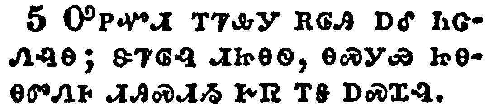</a></td>
</tr>
<tr class="even">
<td>Ye have lived in pleasure on the earth, and been wanton; ye have nourished your hearts, as in a day of slaughter.</td>
</tr>
<tr class="odd">
<td>ᎤᏢᏉᏗ ᎢᏤᎲᎩ ᎡᎶᎯ ᎠᎴ ᏂᏣᏁᎸᎾ; ᏕᏤᎶᎸ ᏗᏥᎾᏫ, ᎾᏍᎩᏯ ᏥᎾᎾᏛᏁᎰ ᏗᎯᏍᏗᏱ ᎨᏒ ᎢᎦ ᎠᏍᏆᎸ.</td>
</tr>
<tr class="even">
<td>U-tlv-quo-di i-tse-hv-gi e-lo-hi a-le ni-tsa-ne-lv-na; de-tse-lo-lv di-tsi-na-wi, na-s-gi-ya tsi-na-na-dv-ne-ho di-hi-s-di-yi ge-sv i-ga a-s-qua-lv.</td>
</tr>
</tbody>
</table>

<table>
<tbody>
<tr class="odd">
<td><a href="200506.png">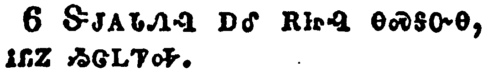</a></td>
</tr>
<tr class="even">
<td>Ye have condemned and killed the just; and he doth not resist you.</td>
</tr>
<tr class="odd">
<td>ᏕᎫᎪᏓᏁᎸ ᎠᎴ ᎡᏥᎸ ᎾᏍᎩᏅᎾ, ᎥᏝᏃ ᏱᏣᏞᏤᎭ.</td>
</tr>
<tr class="even">
<td>De-gu-go-da-ne-lv a-le e-tsi-lv na-s-gi-nv-na, v-tla-no yi-tsa-tle-tse-ha.</td>
</tr>
</tbody>
</table>

<table>
<tbody>
<tr class="odd">
<td><a href="200507.png">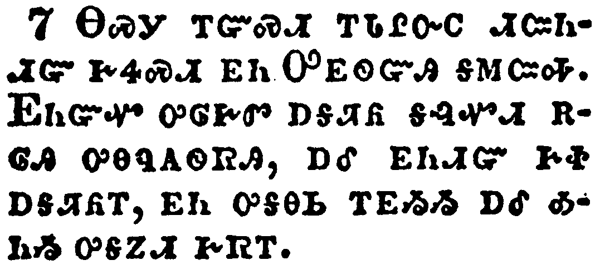</a></td>
</tr>
<tr class="even">
<td>Be patient therefore, brethren, unto the coming of the Lord. Behold, the husbandman waiteth for the precious fruit of the earth, and hath long patience for it, until he receive the early and latter rain.</td>
</tr>
<tr class="odd">
<td>ᎾᏍᎩ ᎢᏳᏍᏗ ᎢᏓᎵᏅᏟ ᏗᏨᏂᏗᏳ ᎨᏎᏍᏗ ᎬᏂ ᎤᎬᏫᏳᎯ ᎦᎷᏨᎭ. ᎬᏂᏳᏉ ᎤᎶᎨᏛ ᎠᎦᏘᏲ ᎦᎸᏉᏗ ᎡᎶᎯ ᎤᎾᏄᎪᏫᏒᎯ, ᎠᎴ ᎬᏂᏗᏳ ᎨᏐ ᎠᎦᏘᏲᎢ, ᎬᏂ ᎤᎦᎾᏏ ᎢᎬᏱᏱ ᎠᎴ ᎣᏂᏱ ᎤᎦᏃᏗ ᎨᏒᎢ.</td>
</tr>
<tr class="even">
<td>Na-s-gi i-yu-s-di i-da-li-nv-tli di-tsv-ni-di-yu ge-se-s-di gv-ni U-gv-wi-yu-hi ga-lu-tsv-ha. Gv-ni-yu-quo u-lo-ge-dv a-ga-ti-yo ga-lv-quo-di e-lo-hi u-na-nu-go-wi-sv-hi, a-le gv-ni-di-yu ge-so a-ga-ti-yo-i, gv-ni u-ga-na-si i-gv-yi-yi a-le o-ni-yi u-ga-no-di ge-sv-i.</td>
</tr>
</tbody>
</table>

<table>
<tbody>
<tr class="odd">
<td><a href="200508.png">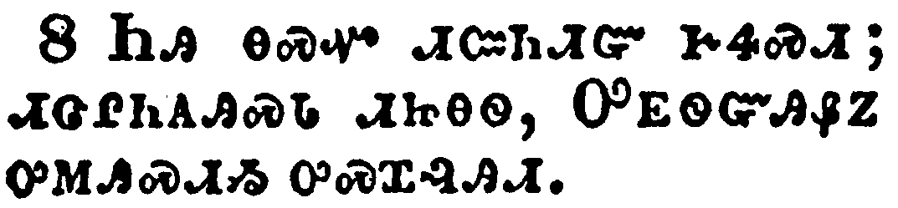</a></td>
</tr>
<tr class="even">
<td>Be ye also patient; stablish your hearts: for the coming of the Lord draweth nigh.</td>
</tr>
<tr class="odd">
<td>ᏂᎯ ᎾᏍᏉ ᏗᏨᏂᏗᏳ ᎨᏎᏍᏗ; ᏗᏣᎵᏂᎪᎯᏍᏓ ᏗᏥᎾᏫ, ᎤᎬᏫᏳᎯᏰᏃ ᎤᎷᎯᏍᏗᏱ ᎤᏍᏆᎸᎯᏗ.</td>
</tr>
<tr class="even">
<td>Ni-hi na-s-quo di-tsv-ni-di-yu ge-se-s-di; di-tsa-li-ni-go-hi-s-da di-tsi-na-wi, U-gv-wi-yu-hi-ye-no u-lu-hi-s-di-yi u-s-qua-lv-hi-di.</td>
</tr>
</tbody>
</table>

<table>
<tbody>
<tr class="odd">
<td><a href="200509.png">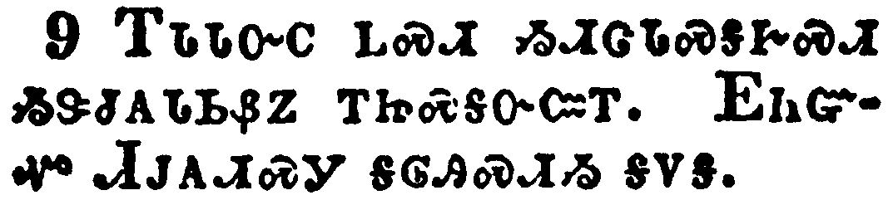</a></td>
</tr>
<tr class="even">
<td>Grudge not one against another, brethren, lest ye be condemned: behold, the judge standeth before the door.</td>
</tr>
<tr class="odd">
<td>ᎢᏓᏓᏅᏟ ᏞᏍᏗ ᏱᏗᏣᏓᏍᎦᎨᏍᏗ ᏱᏕᏧᎪᏓᏏᏰᏃ ᎢᏥᏍᎦᏅᏨᎢ. ᎬᏂᏳᏉ ᏗᎫᎪᏗᏍᎩ ᎦᎶᎯᏍᏗᏱ ᎦᏙᎦ.</td>
</tr>
<tr class="even">
<td>I-da-da-nv-tli tle-s-di yi-di-tsa-da-s-ga-ge-s-di yi-de-tsu-go-da-si-ye-no i-tsi-s-ga-nv-tsv-i. Gv-ni-yu-quo Di-gu-go-di-s-gi ga-lo-hi-s-di-yi ga-do-ga.</td>
</tr>
</tbody>
</table>

<table>
<tbody>
<tr class="odd">
<td><a href="200510.png">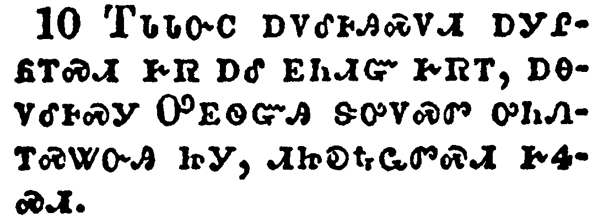</a></td>
</tr>
<tr class="even">
<td>Take, my brethren, the prophets, who have spoken in the name of the Lord, for an example of suffering affliction, and of patience.</td>
</tr>
<tr class="odd">
<td>ᎢᏓᏓᏅᏟ ᎠᏙᎴᎰᎯᏍᏙᏗ ᎠᎩᎵᏲᎢᏍᏗ ᎨᏒ ᎠᎴ ᎬᏂᏗᏳ ᎨᏒᎢ, ᎠᎾᏙᎴᎰᏍᎩ ᎤᎬᏫᏳᎯ ᏕᎤᏙᏍᏛ ᎤᏂᏁᎢᏍᏔᏅᎯ ᏥᎩ, ᏗᏥᎧᎿᎭᏩᏛᏍᏗ ᎨᏎᏍᏗ.</td>
</tr>
<tr class="even">
<td>I-da-da-nv-tli a-do-le-ho-hi-s-do-di a-gi-li-yo-i-s-di ge-sv a-le gv-ni-di-yu ge-sv-i, a-na-do-le-ho-s-gi U-gv-wi-yu-hi de-u-do-s-dv u-ni-ne-i-s-ta-nv-hi tsi-gi, di-tsi-ka-hna-wa-dv-s-di ge-se-s-di.</td>
</tr>
</tbody>
</table>

<table>
<tbody>
<tr class="odd">
<td><a href="200511.png">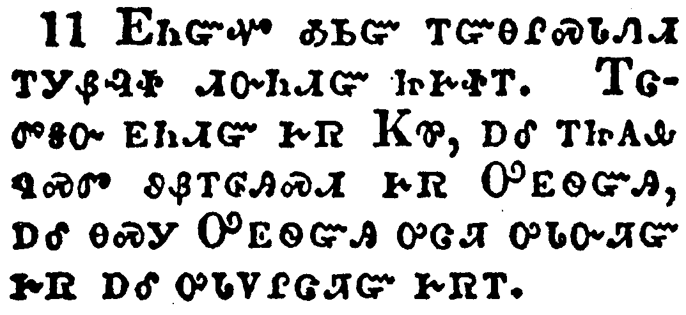</a></td>
</tr>
<tr class="even">
<td>Behold, we count them happy which endure. Ye have heard of the patience of Job, and have seen the end of the Lord; that the Lord is very pitiful, and of tender mercy.</td>
</tr>
<tr class="odd">
<td>ᎬᏂᏳᏉ ᎣᏏᏳ ᎢᏳᎾᎵᏍᏓᏁᏗ ᎢᎩᏰᎸᏐ ᏗᏅᏂᏗᏳ ᏥᎨᏐᎢ. ᎢᏣᏛᎦᏅ ᎬᏂᏗᏳ ᎨᏒ ᏦᏈ, ᎠᎴ ᎢᏥᎪᎲ ᏄᏍᏛ ᏭᏰᎢᎶᎯᏍᏗ ᎨᏒ ᎤᎬᏫᏳᎯ, ᎠᎴ ᎾᏍᎩ ᎤᎬᏫᏳᎯ ᎤᏣᏘ ᎤᏓᏅᏘᏳ ᎨᏒ ᎠᎴ ᎤᏓᏙᎵᏣᏘᏳ ᎨᏒᎢ.</td>
</tr>
<tr class="even">
<td>Gv-ni-yu-quo o-si-yu i-yu-na-li-s-da-ne-di i-gi-ye-lv-so di-nv-ni-di-yu tsi-ge-so-i. I-tsa-dv-ga-nv gv-ni-di-yu ge-sv Tso-qui, a-le i-tsi-go-hv nu-s-dv wu-ye-i-lo-hi-s-di ge-sv U-gv-wi-yu-hi, a-le na-s-gi U-gv-wi-yu-hi u-tsa-ti u-da-nv-ti-yu ge-sv a-le u-da-do-li-tsa-ti-yu ge-sv-i.</td>
</tr>
</tbody>
</table>

<table>
<tbody>
<tr class="odd">
<td><a href="200512.png">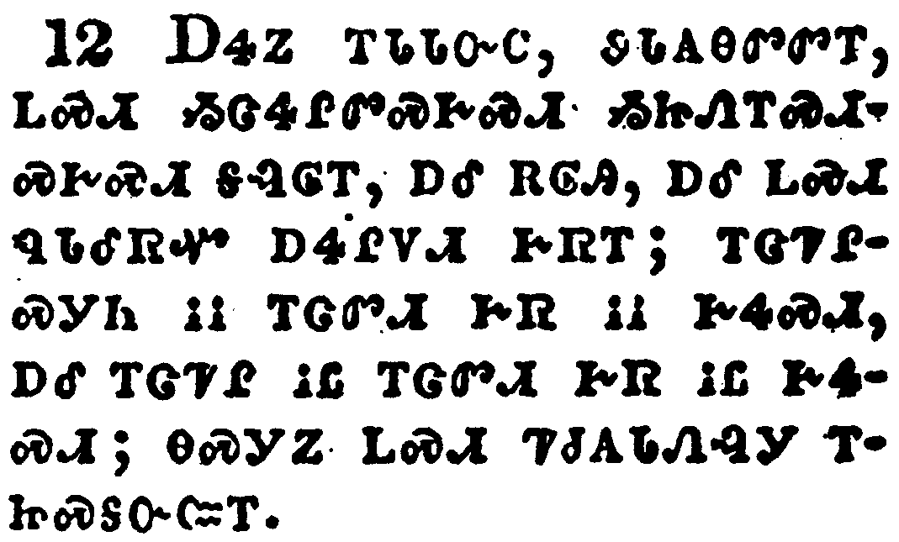</a></td>
</tr>
<tr class="even">
<td>But above all things, my brethren, swear not, neither by heaven, neither by the earth, neither by any other oath: but let your yea be yea; and your nay, nay; lest ye fall into condemnation.</td>
</tr>
<tr class="odd">
<td>ᎠᏎᏃ ᎢᏓᏓᏅᏟ, ᏭᏓᎪᎾᏛᏛᎢ, ᏞᏍᏗ ᏱᏣᏎᎵᏛᏍᎨᏍᏗ ᏱᏥᏁᎢᏍᏗᏍᎨᏍᏗ ᎦᎸᎶᎢ, ᎠᎴ ᎡᎶᎯ, ᎠᎴ ᏞᏍᏗ ᏄᏓᎴᏒᏉ ᎠᏎᎵᏙᏗ ᎨᏒᎢ; ᎠᎴ ᏞᏍᏗ ᏄᏓᎴᏒᏉ ᎠᏎᎵᏙᏗ ᎨᏒᎢ; ᎢᏣᏤᎵᏍᎩᏂ ᎥᎥ ᎢᏣᏛᏗ ᎨᏒ ᎥᎥ ᎨᏎᏍᏗ, ᎠᎴ ᎢᏣᏤᎵ ᎥᏝ ᎢᏣᏛᏗ ᎨᏒ ᎥᏝ ᎨᏎᏍᏗ; ᎾᏍᎩᏃ ᏞᏍᏗ ᏤᏧᎪᏓᏁᎸᎩ ᎢᏥᏍᎦᏅᏨᎢ.</td>
</tr>
<tr class="even">
<td>A-se-no i-da-da-nv-tli, wu-da-go-na-dv-dv-i, tle-s-di yi-tsa-se-li-dv-s-ge-s-di yi-tsi-ne-i-s-di-s-ge-s-di ga-lv-lo-i, a-le e-lo-hi, a-le tle-s-di nu-da-le-sv-quo a-se-li-do-di ge-sv-i; a-le tle-s-di nu-da-le-sv-quo a-se-li-do-di ge-sv-i; i-tsa-tse-li-s-gi-ni v-v i-tsa-dv-di ge-sv v-v ge-se-s-di, a-le i-tsa-tse-li v-tla i-tsa-dv-di ge-sv v-tla ge-se-s-di; na-s-gi-no tle-s-di tse-tsu-go-da-ne-lv-gi i-tsi-s-ga-nv-tsv-i.</td>
</tr>
</tbody>
</table>

<table>
<tbody>
<tr class="odd">
<td><a href="200513.png">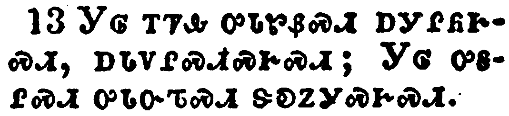</a></td>
</tr>
<tr class="even">
<td>Is any among you afflicted? let him pray. Is any merry? let him sing psalms.</td>
</tr>
<tr class="odd">
<td>ᎩᎶ ᎢᏤᎲ ᎤᏓᏑᏰᏍᏗ ᎠᎩᎵᏲᎨᏍᏗ, ᎠᏓᏙᎵᏍᏗᏍᎨᏍᏗ; ᎩᎶ ᎤᎦᎵᏍᏗ ᎤᏓᏅᏖᏍᏗ ᏕᎧᏃᎩᏍᎨᏍᏗ.</td>
</tr>
<tr class="even">
<td>Gi-lo i-tse-hv u-da-su-ye-s-di a-gi-li-yo-ge-s-di, a-da-do-li-s-di-s-ge-s-di; Gi-lo u-ga-li-s-di u-da-nv-te-s-di de-ka-no-gi-s-ge-s-di.</td>
</tr>
</tbody>
</table>

<table>
<tbody>
<tr class="odd">
<td><a href="200514.png">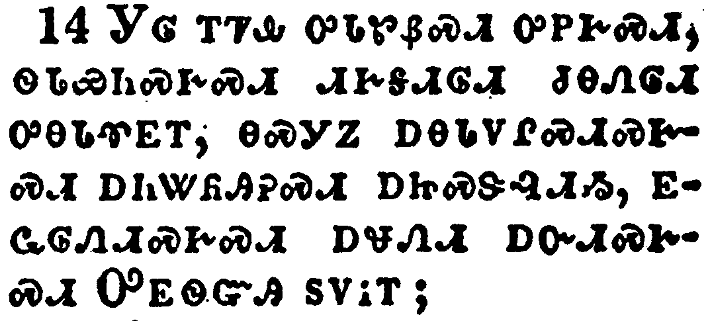</a></td>
</tr>
<tr class="even">
<td>Is any sick among you? let him call for the elders of the church; and let them pray over him, anointing him with oil in the name of the Lord:</td>
</tr>
<tr class="odd">
<td>ᎩᎶ ᎢᏤᎲ ᎤᏓᏑᏰᏍᏗ ᎤᏢᎨᏍᏗ, ᏫᏓᏯᏂᏍᎨᏍᏗ ᏗᎨᎦᏗᎶᏗ ᏧᎾᏁᎶᏗ ᎤᎾᏓᏡᎬᎢ, ᎾᏍᎩᏃ ᎠᎾᏓᏙᎵᏍᏗᏍᎨᏍᏗ ᎠᏂᏔᏲᎯᎮᏍᏗ ᎠᏥᏍᏕᎸᏗᏱ, ᎬᏩᎶᏁᏗᏍᎨᏍᏗ ᎠᏠᏁᏗ ᎠᏅᏗᏍᎨᏍᏗ ᎤᎬᏫᏳᎯ ᏚᏙᎥᎢ;</td>
</tr>
<tr class="even">
<td>Gi-lo i-tse-hv u-da-su-ye-s-di u-tlv-ge-s-di, wi-da-ya-ni-s-ge-s-di di-ge-ga-di-lo-di tsu-na-ne-lo-di u-na-da-tlu-gv-i, na-s-gi-no a-na-da-do-li-s-di-s-ge-s-di a-ni-ta-yo-hi-he-s-di a-tsi-s-de-lv-di-yi, gv-wa-lo-ne-di-s-ge-s-di a-tlo-ne-di a-nv-di-s-ge-s-di U-gv-wi-yu-hi du-do-v-i;</td>
</tr>
</tbody>
</table>

<table>
<tbody>
<tr class="odd">
<td><a href="200515.png">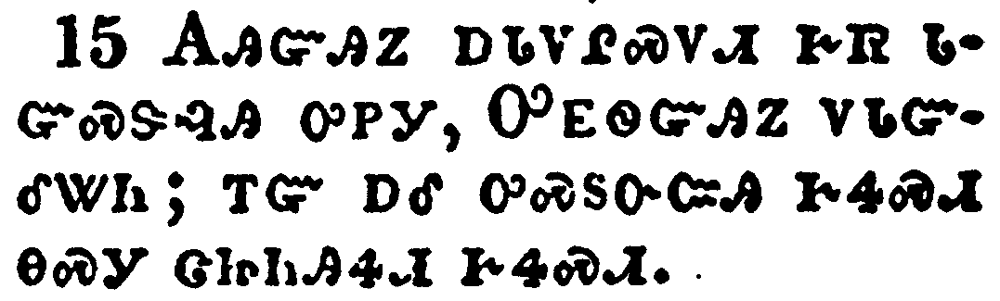</a></td>
</tr>
<tr class="even">
<td>And the prayer of faith shall save the sick, and the Lord shall raise him up; and if he have committed sins, they shall be forgiven him.</td>
</tr>
<tr class="odd">
<td>ᎪᎯᏳᎯᏃ ᎠᏓᏃᎵᏍᏙᏗ ᎨᏒ ᏓᏳᏍᏕᎸᎯ ᎤᏢᎩ, ᎤᎬᏫᏳᎯᏃ ᏙᏓᏳᎴᏔᏂ; ᎢᏳ ᎠᎴ ᎤᏍᏚᏅᏨᎯ ᎨᏎᏍᏗ ᎾᏍᎩ ᏣᏥᏂᎯᏎᏗ ᎨᏎᏍᏗ.</td>
</tr>
<tr class="even">
<td>Go-hi-yu-hi-no a-da-no-li-s-do-di ge-sv da-yu-s-de-lv-hi u-tlv-gi, U-gv-wi-yu-hi-no do-da-yu-le-ta-ni; i-yu a-le u-s-du-nv-tsv-hi ge-se-s-di na-s-gi tsa-tsi-ni-hi-se-di ge-se-s-di.</td>
</tr>
</tbody>
</table>

<table>
<tbody>
<tr class="odd">
<td><a href="200516.png">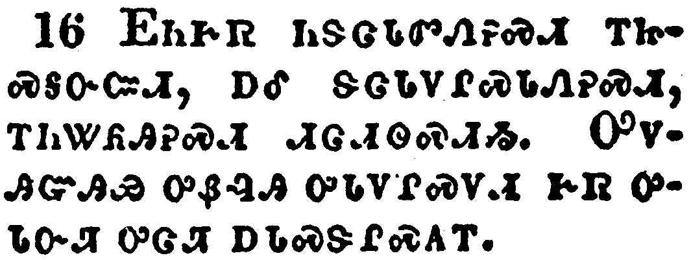</a></td>
</tr>
<tr class="even">
<td>Confess your faults one to another, and pray one for another, that ye may be healed. The effectual fervent prayer of a righteous man availeth much.</td>
</tr>
<tr class="odd">
<td>ᎬᏂᎨᏒ ᏂᏕᏣᏓᏛᏁᎮᏍᏗ ᎢᏥᏍᎦᏅᏨᏗ, ᎠᎴ ᏕᏣᏓᏙᎵᏍᏓᏁᎮᏍᏗ, ᎢᏂᏔᏲᎯᎮᏍᏗ ᏗᏣᏗᏫᏍᏗᏱ. ᎤᏙᎯᏳᎯᏯ ᎤᏰᎸᎯ ᎤᏓᏙᎵᏍᏙᏗ ᎨᏒ ᎤᏓᏅᏘ ᎤᏣᏘ ᎠᏓᏍᏕᎵᏍᎪᎢ.</td>
</tr>
<tr class="even">
<td>Gv-ni-ge-sv ni-de-tsa-da-dv-ne-he-s-di i-tsi-s-ga-nv-tsv-di, a-le de-tsa-da-do-li-s-da-ne-he-s-di, i-ni-ta-yo-hi-he-s-di di-tsa-di-wi-s-di-yi. U-do-hi-yu-hi-ya u-ye-lv-hi u-da-do-li-s-do-di ge-sv u-da-nv-ti u-tsa-ti a-da-s-de-li-s-go-i.</td>
</tr>
</tbody>
</table>

<table>
<tbody>
<tr class="odd">
<td><a href="200517.png">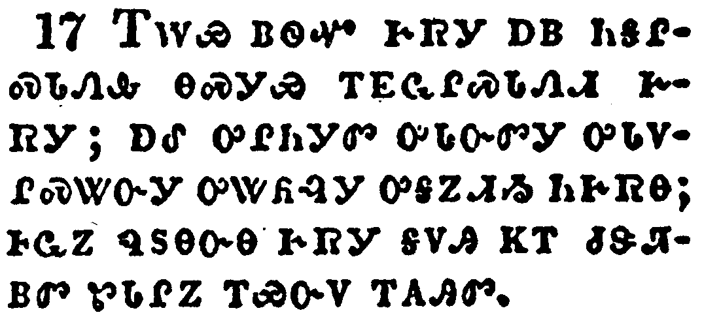</a></td>
</tr>
<tr class="even">
<td>Elias was a man subject to like passions as we are, and he prayed earnestly that it might not rain: and it rained not on the earth by the space of three years and six months.</td>
</tr>
<tr class="odd">
<td>ᎢᎳᏯ ᏴᏫᏉ ᎨᏒᎩ ᎠᏴ ᏂᎦᎵᏍᏓᏁᎲ ᎾᏍᎩᏯ ᎢᎬᏩᎵᏍᏓᏁᏗ ᎨᏒᎩ; ᎠᎴ ᎤᎵᏂᎩᏛ ᎤᏓᏅᏛᎩ ᎤᏓᏙᎵᏍᏔᏅᎩ ᎤᏔᏲᎸᎩ ᎤᎦᏃᏗᏱ ᏂᎨᏒᎾ; ᎰᏩᏃ ᏄᏚᎾᏅᎾ ᎨᏒᎩ ᎦᏙᎯ ᏦᎢ ᏧᏕᏘᏴᏛ ᏑᏓᎵᏃ ᎢᏯᏅᏙ ᎢᎪᎯᏛ.</td>
</tr>
<tr class="even">
<td>I-la-ya yv-wi-quo ge-sv-gi a-yv ni-ga-li-s-da-ne-hv na-s-gi-ya i-gv-wa-li-s-da-ne-di ge-sv-gi; a-le u-li-ni-gi-dv u-da-nv-dv-gi u-da-do-li-s-ta-nv-gi u-ta-yo-lv-gi u-ga-no-di-yi ni-ge-sv-na; ho-wa-no nu-du-na-nv-na ge-sv-gi ga-do-hi tso-i tsu-de-ti-yv-dv su-da-li-no i-ya-nv-do i-go-hi-dv.</td>
</tr>
</tbody>
</table>

<table>
<tbody>
<tr class="odd">
<td><a href="200518.png">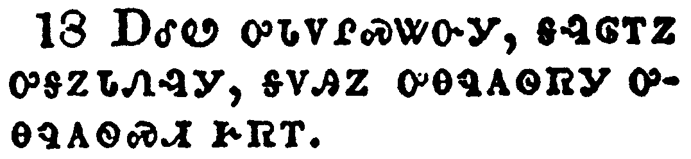</a></td>
</tr>
<tr class="even">
<td>And he prayed again, and the heaven gave rain, and the earth brought forth her fruit.</td>
</tr>
<tr class="odd">
<td>ᎠᎴᏬ ᎤᏓᏙᎵᏍᏔᏅᎩ, ᎦᎸᎶᎢᏃ ᎤᎦᏃᏓᏁᎸᎩ, ᎪᏙᎯᏃ ᎤᎾᏄᎪᏫᏒᎩ ᎤᎾᏄᎪᏫᏍᏗ ᎨᏒᎢ.</td>
</tr>
<tr class="even">
<td>A-le-wo u-da-do-li-s-ta-nv-gi, ga-lv-lo-i-no u-ga-no-da-ne-lv-gi, go-do-hi-no u-na-nu-go-wi-sv-gi u-na-nu-go-wi-s-di ge-sv-i.</td>
</tr>
</tbody>
</table>

<table>
<tbody>
<tr class="odd">
<td><a href="200519.png">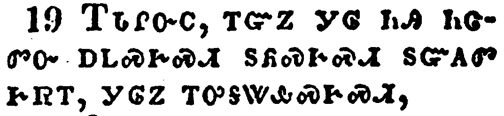</a></td>
</tr>
<tr class="even">
<td>Brethren, if any of you do err from the truth, and one convert him;</td>
</tr>
<tr class="odd">
<td>ᎢᏓᎵᏅᏟ, ᎢᏳᏃ ᎩᎶ ᏂᎯ ᏂᏣᏛᏅ ᎠᏞᏍᎨᏍᏗ ᏚᏲᏍᎨᏍᏗ ᏚᏳᎪᏛ ᎨᏒᎢ, ᎩᎶᏃ ᎢᎤᎦᏔᎲᏍᎨᏍᏗ,</td>
</tr>
<tr class="even">
<td>I-da-li-nv-tli, i-yu-no gi-lo ni-hi ni-tsa-dv-nv a-tle-s-ge-s-di du-yo-s-ge-s-di du-yu-go-dv ge-sv-i, gi-lo-no i-u-ga-ta-hv-s-ge-s-di,</td>
</tr>
</tbody>
</table>

<table>
<tbody>
<tr class="odd">
<td><a href="200520.png">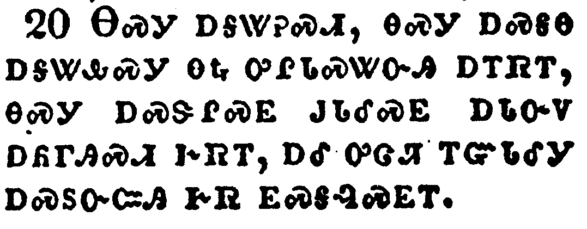</a></td>
</tr>
<tr class="even">
<td>Let him know, that he which converteth the sinner from the error of his way shall save a soul from death, and shall hide a multitude of sins.</td>
</tr>
<tr class="odd">
<td>ᎾᏍᎩ ᎠᎦᏔᎮᏍᏗ, ᎾᏍᎩ ᎠᏍᎦᎾ ᎠᎦᏔᎲᏍᎩ ᎾᎿᎭᎤᎵᏓᏍᏔᏅᎯ ᎠᎢᏒᎢ, ᎾᏍᎩ ᎠᏍᏕᎵᏍᎬ ᎫᏓᎴᏍᎬ ᎠᏓᏅᏙ ᎠᏲᎱᎯᏍᏗ ᎨᏒᎢ, ᎠᎴ ᎤᏣᏘ ᎢᏳᏓᎴᎩ ᎠᏍᏚᏅᏨᎯ ᎨᏒ ᎬᏍᎦᎸᏍᎬᎢ.</td>
</tr>
<tr class="even">
<td>Na-s-gi a-ga-ta-he-s-di, na-s-gi a-s-ga-na a-ga-ta-hv-s-gi na-hna u-li-da-s-ta-nv-hi a-i-sv-i, na-s-gi a-s-de-li-s-gv gu-da-le-s-gv a-da-nv-do a-yo-hu-hi-s-di ge-sv-i, a-le u-tsa-ti i-yu-da-le-gi a-s-du-nv-tsv-hi ge-sv gv-s-ga-lv-s-gv-i.</td>
</tr>
</tbody>
</table>

