+++
draft=false
date = 2014-12-18T21:11:07Z
title = "John - Chapter 1 - Cherokee New Testament"
weight = 1418955067

[taxonomies]

authors = ["Timothy Legg"]
categories = []
tags = []

[extra]
+++

<table>
<tbody>
<tr class="odd">
<td><a href="040101.png">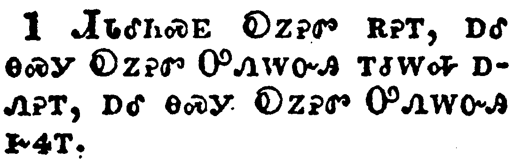</a></td>
</tr>
<tr class="even">
<td>In the beginning was the Word, and the Word was with God, and the Word was God.</td>
</tr>
<tr class="odd">
<td>ᏗᏓᎴᏂᏍᎬ ᎧᏃᎮᏛ ᎡᎮᎢ, ᎠᎴ ᎾᏍᎩ ᎧᏃᎮᏛ ᎤᏁᎳᏅᎯ ᎢᏧᎳᎭ ᎠᏁᎮᎢ, ᎠᎴ ᎾᏍᎩ ᎧᏃᎮᏛ ᎤᏁᎳᏅᎯ ᎨᏎᎢ.</td>
</tr>
<tr class="even">
<td>Di-da-le-ni-s-gv Ka-no-he-dv e-he-i, a-le na-s-gi Ka-no-he-dv U-ne-la-nv-hi i-tsu-la-ha a-ne-he-i, a-le na-s-gi Ka-no-he-dv U-ne-la-nv-hi ge-se-i.</td>
</tr>
</tbody>
</table>

<table>
<tbody>
<tr class="odd">
<td><a href="040102.png">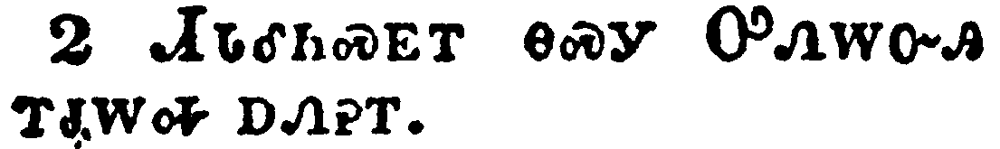</a></td>
</tr>
<tr class="even">
<td>The same was in the beginning with God.</td>
</tr>
<tr class="odd">
<td>ᏗᏓᎴᏂᏍᎬᎢ ᎾᏍᎩ ᎤᏁᎳᏅᎯ ᎢᏧᎳᎭ ᎠᏁᎮᎢ.</td>
</tr>
<tr class="even">
<td>Di-da-le-ni-s-gv-i na-s-gi U-ne-la-nv-hi i-tsu-la-ha a-ne-he-i.</td>
</tr>
</tbody>
</table>

<table>
<tbody>
<tr class="odd">
<td><a href="040103.png">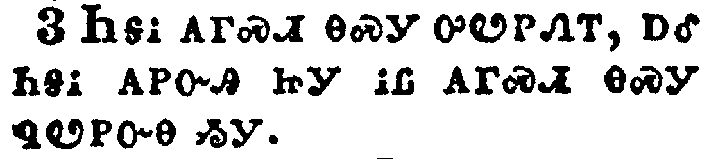</a></td>
</tr>
<tr class="even">
<td>All things were made by him; and without him was not any thing made that was made.</td>
</tr>
<tr class="odd">
<td>ᏂᎦᎥ ᎪᎱᏍᏗ ᎾᏍᎩ ᎤᏬᏢᏁᎢ, ᎠᎴ ᏂᎦᎥ ᎪᏢᏅᎯ ᏥᎩ ᎥᏝ ᎪᎱᏍᏗ ᎾᏍᎩ ᏄᏬᏢᏅᎾ ᏱᎩ.</td>
</tr>
<tr class="even">
<td>Ni-ga-v go-hu-s-di na-s-gi u-wo-tlv-ne-i, a-le ni-ga-v go-tlv-nv-hi tsi-gi v-tla go-hu-s-di na-s-gi nu-wo-tlv-nv-na yi-gi.</td>
</tr>
</tbody>
</table>

<table>
<tbody>
<tr class="odd">
<td><a href="040104.png">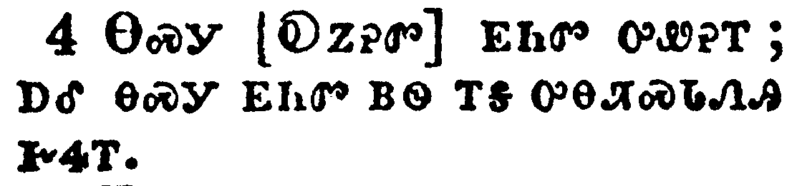</a></td>
</tr>
<tr class="even">
<td>In him was life; and the life was the light of men.</td>
</tr>
<tr class="odd">
<td>ᎾᏍᎩ [ᎧᏃᎮᏛ] ᎬᏂᏛ ᎤᏪᎮᎢ; ᎠᎴ ᎾᏍᎩ ᎬᏂᏛ ᏴᏫ ᎢᎦ ᎤᎾᏘᏍᏓᏁᎯ ᎨᏎᎢ.</td>
</tr>
<tr class="even">
<td>Na-s-gi [Ka-no-he-dv] gv-ni-dv u-we-he-i; a-le na-s-gi gv-ni-dv yv-wi i-ga u-na-ti-s-da-ne-hi ge-se-i.</td>
</tr>
</tbody>
</table>

<table>
<tbody>
<tr class="odd">
<td><a href="040105.png">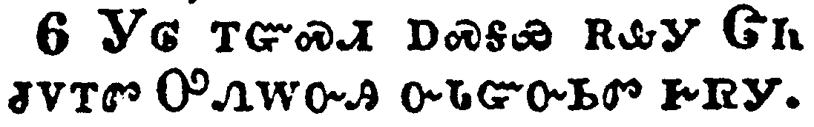</a></td>
</tr>
<tr class="even">
<td>And the light shineth in darkness; and the darkness comprehended it not.</td>
</tr>
<tr class="odd">
<td>ᎠᎴ ᎾᏍᎩ ᎢᎦ-ᎦᏘᏍᏗᏍᎩ ᎤᎵᏏᎬ ᏚᎸᏌᏕᎢ, ᎤᎵᏏᎩᏃ ᎥᏝ ᏱᏚᏓᏂᎸᏤᎢ.</td>
</tr>
<tr class="even">
<td>A-le na-s-gi i-ga--ga-ti-s-di-s-gi u-li-si-gv du-lv-sa-de-i, u-li-si-gi-no v-tla yi-du-da-ni-lv-tse-i.</td>
</tr>
</tbody>
</table>

<table>
<tbody>
<tr class="odd">
<td><a href="040106.png">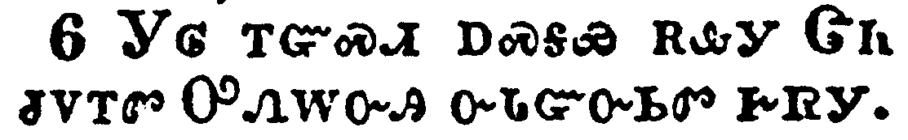</a></td>
</tr>
<tr class="even">
<td>There was a man sent from God, whose name was John.</td>
</tr>
<tr class="odd">
<td>ᎩᎶ ᎢᏳᏍᏗ ᎠᏍᎦᏯ ᎡᎲᎩ ᏣᏂ ᏧᏙᎢᏛ ᎤᏁᎳᏅᎯ ᏅᏓᏳᏅᏏᏛ ᎨᏒᎩ.</td>
</tr>
<tr class="even">
<td>Gi-lo i-yu-s-di a-s-ga-ya e-hv-gi Tsa-ni tsu-do-i-dv U-ne-la-nv-hi nv-da-yu-nv-si-dv ge-sv-gi.</td>
</tr>
</tbody>
</table>

<table>
<tbody>
<tr class="odd">
<td><a href="040107.png">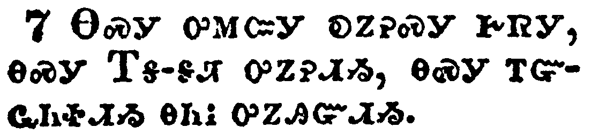</a></td>
</tr>
<tr class="even">
<td>The same came for a witness, to bear witness of the Light, that all men through him might believe.</td>
</tr>
<tr class="odd">
<td>ᎾᏍᎩ ᎤᎷᏨᎩ ᎧᏃᎮᏍᎩ ᎨᏒᎩ, ᎾᏍᎩ ᎢᎦ-ᎦᏘ ᎤᏃᎮᏗᏱ, ᎾᏍᎩ ᎢᏳᏩᏂᏐᏗᏱ ᎾᏂᎥ ᎤᏃᎯᏳᏗᏱ.</td>
</tr>
<tr class="even">
<td>Na-s-gi u-lu-tsv-gi ka-no-he-s-gi ge-sv-gi, na-s-gi I-ga--ga-ti u-no-he-di-yi, na-s-gi i-yu-wa-ni-so-di-yi na-ni-v u-no-hi-yu-di-yi.</td>
</tr>
</tbody>
</table>

<table>
<tbody>
<tr class="odd">
<td><a href="040108.png">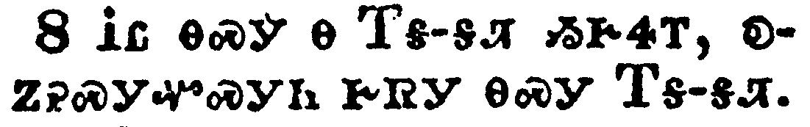</a></td>
</tr>
<tr class="even">
<td>He was not that Light, but was sent to bear witness of that Light.</td>
</tr>
<tr class="odd">
<td>ᎥᏝ ᎾᏍᎩ Ꮎ ᎢᎦ-ᎦᏘ ᏱᎨᏎᎢ, ᎧᏃᎮᏍᎩᏉᏍᎩᏂ ᎨᏒᎩ ᎾᏍᎩ ᎢᎦ-ᎦᏘ.</td>
</tr>
<tr class="even">
<td>V-tla na-s-gi na I-ga--ga-ti yi-ge-se-i, ka-no-he-s-gi-quo-s-gi-ni ge-sv-gi na-s-gi I-ga--ga-ti.</td>
</tr>
</tbody>
</table>

<table>
<tbody>
<tr class="odd">
<td><a href="040109.png">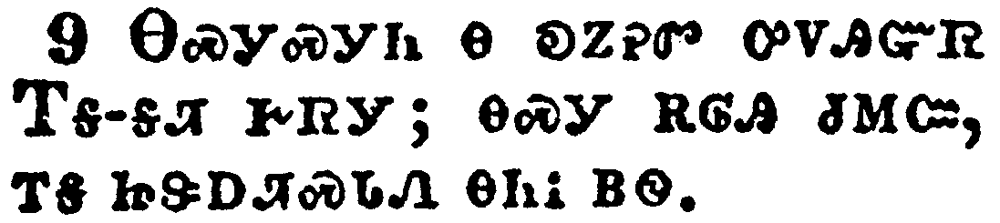</a></td>
</tr>
<tr class="even">
<td>That was the true Light, which lighteth every man that cometh into the world.</td>
</tr>
<tr class="odd">
<td>ᎾᏍᎩᏍᎩᏂ Ꮎ ᎧᏃᎮᏛ ᎤᏙᎯᏳᏒ ᎢᎦ-ᎦᏘ ᎨᏒᎩ; ᎾᏍᎩ ᎡᎶᎯ ᏧᎷᏨ, ᎢᎦ ᏥᏕᎠᏘᏍᏓᏁ ᎾᏂᎥ ᏴᏫ.</td>
</tr>
<tr class="even">
<td>Na-s-gi-s-gi-ni na ka-no-he-dv u-do-hi-yu-sv I-ga--ga-ti ge-sv-gi; na-s-gi e-lo-hi tsu-lu-tsv, i-ga tsi-de-a-ti-s-da-ne na-ni-v yv-wi.</td>
</tr>
</tbody>
</table>

<table>
<tbody>
<tr class="odd">
<td><a href="040110.png">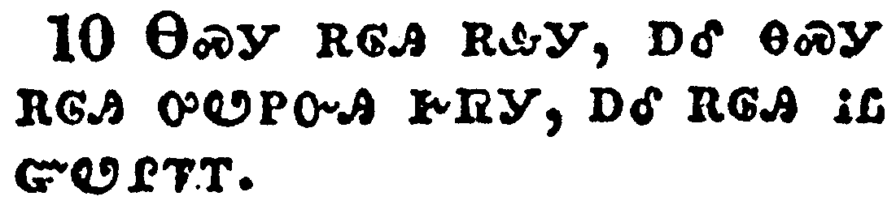</a></td>
</tr>
<tr class="even">
<td>He was in the world, and the world was made by him, and the world knew him not.</td>
</tr>
<tr class="odd">
<td>ᎾᏍᎩ ᎡᎶᎯ ᎡᎲᎩ, ᎠᎴ ᎾᏍᎩ ᎡᎶᎯ ᎤᏬᏢᏅᎯ ᎨᏒᎩ, ᎠᎴ ᎡᎶᎯ ᎥᏝ ᏳᏬᎵᏤᎢ.</td>
</tr>
<tr class="even">
<td>Na-s-gi e-lo-hi e-hv-gi, a-le na-s-gi e-lo-hi u-wo-tlv-nv-hi ge-sv-gi, a-le e-lo-hi v-tla yu-wo-li-tse-i.</td>
</tr>
</tbody>
</table>

<table>
<tbody>
<tr class="odd">
<td><a href="040111.png">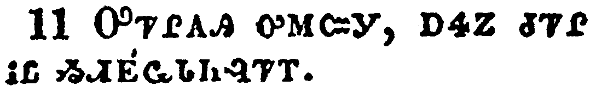</a></td>
</tr>
<tr class="even">
<td>He came unto his own, and his own received him not.</td>
</tr>
<tr class="odd">
<td>ᎤᏤᎵᎪᎯ ᎤᎷᏨᎩ, ᎠᏎᏃ ᏧᏤᎵ ᎥᏝ ᏱᏗᎬᏩᏓᏂᎸᏤᎢ.</td>
</tr>
<tr class="even">
<td>U-tse-li-go-hi u-lu-tsv-gi, a-se-no tsu-tse-li v-tla yi-di-gv-wa-da-ni-lv-tse-i.</td>
</tr>
</tbody>
</table>

<table>
<tbody>
<tr class="odd">
<td><a href="040112.png">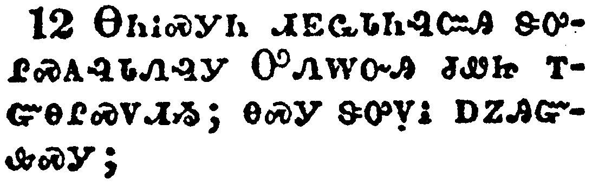</a></td>
</tr>
<tr class="even">
<td>But as many as received him, to them gave he power to become the sons of God, even to them that believe on his name:</td>
</tr>
<tr class="odd">
<td>ᎾᏂᎥᏍᎩᏂ ᏗᎬᏩᏓᏂᎸᏨᎯ ᏕᎤᎵᏍᎪᎸᏓᏁᎸᎩ ᎤᏁᎳᏅ Ꭿ ᏧᏪᏥ ᎢᏳᎾᎵᏍᏙᏗᏱ; ᎾᏍᎩ ᏕᎤᏙᎥ ᎠᏃᎯᏳᎲᏍᎩ;</td>
</tr>
<tr class="even">
<td>Na-ni-v-s-gi-ni di-gv-wa-da-ni-lv-tsv-hi de-u-li-s-go-lv-da-ne-lv-gi U-ne-la-nv hi tsu-we-tsi i-yu-na-li-s-do-di-yi; na-s-gi de-u-do-v a-no-hi-yu-hv-s-gi;</td>
</tr>
</tbody>
</table>

<table>
<tbody>
<tr class="odd">
<td><a href="040113.png">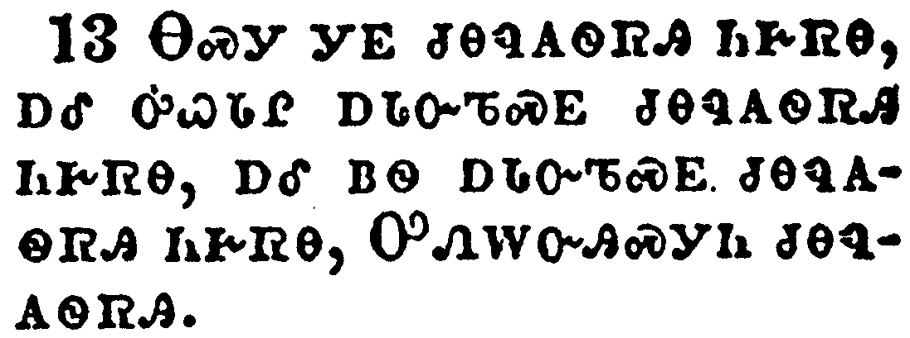</a></td>
</tr>
<tr class="even">
<td>Which were born, not of blood, nor of the will of the flesh, nor of the will of man, but of God.</td>
</tr>
<tr class="odd">
<td>ᎾᏍᎩ ᎩᎬ ᏧᎾᏄᎪᏫᏒᎯ ᏂᎨᏒᎾ, ᎠᎴ ᎤᏇᏓᎵ ᎠᏓᏅᏖᏍᎬ ᏧᎾᏄᎪᏫᏒᎯ ᏂᎨᏒᎾ, ᎠᎴ ᏴᏫ ᎠᏓᏅᏖᏍᎬ ᏧᎾᏄᎪᏫᏒᎯ ᏂᎨᏒᎾ, ᎤᏁᎳᏅᎯᏍᎩᏂ ᏧᎾᏄᎪᏫᏒᎯ.</td>
</tr>
<tr class="even">
<td>Na-s-gi gi-gv tsu-na-nu-go-wi-sv-hi ni-ge-sv-na, a-le u-que-da-li a-da-nv-te-s-gv tsu-na-nu-go-wi-sv-hi ni-ge-sv-na, a-le yv-wi a-da-nv-te-s-gv tsu-na-nu-go-wi-sv-hi ni-ge-sv-na, U-ne-la-nv-hi-s-gi-ni tsu-na-nu-go-wi-sv-hi.</td>
</tr>
</tbody>
</table>

<table>
<tbody>
<tr class="odd">
<td></td>
</tr>
<tr class="even">
<td>And the Word was made flesh, and dwelt among us, (and we beheld his glory, the glory as of the only begotten of the Father,) full of grace and truth.</td>
</tr>
<tr class="odd">
<td>ᎠᎴ ᎧᏃᎮᏛ ᎤᏇᏓᎵ ᏄᎵᏍᏔᏅᎩ, ᎠᎴ ᎢᏕᎲ ᎤᎴᏂᏙᎸᎩ, ᎤᎧᎵᏨᎯ ᎨᏒᎩ ᎤᏓᏙᎵᏣᏛ ᎠᎴ ᏚᏳᎪᏛᎢ; ᎠᎴ ᎢᏗᎪᏩᏘᏍᎬᎩ ᎤᏤᎵᎦ ᎦᎸᏉᏗᏳ ᎨᏒᎢ, ᎾᏍᎩ ᎦᎸᏉᏗᏳ ᎨᏒ ᎠᎦᏴᎵᎨ ᎤᏩᏒᎯᏳ ᎤᏕᏁᎸᎯ ᎤᏤᎵᎦ ᎾᏍᎩᏯ ᎨᏒᎩ.</td>
</tr>
<tr class="even">
<td>A-le Ka-no-he-dv u-que-da-li nu-li-s-ta-nv-gi, a-le i-de-hv u-le-ni-do-lv-gi, u-ka-li-tsv-hi ge-sv-gi u-da-do-li-tsa-dv a-le du-yu-go-dv-i; a-le i-di-go-wa-ti-s-gv-gi u-tse-li-ga ga-lv-quo-di-yu ge-sv-i, na-s-gi ga-lv-quo-di-yu ge-sv A-ga-yv-li-ge u-wa-sv-hi-yu u-de-ne-lv-hi u-tse-li-ga na-s-gi-ya ge-sv-gi.</td>
</tr>
</tbody>
</table>

<table>
<tbody>
<tr class="odd">
<td><a href="040115.png">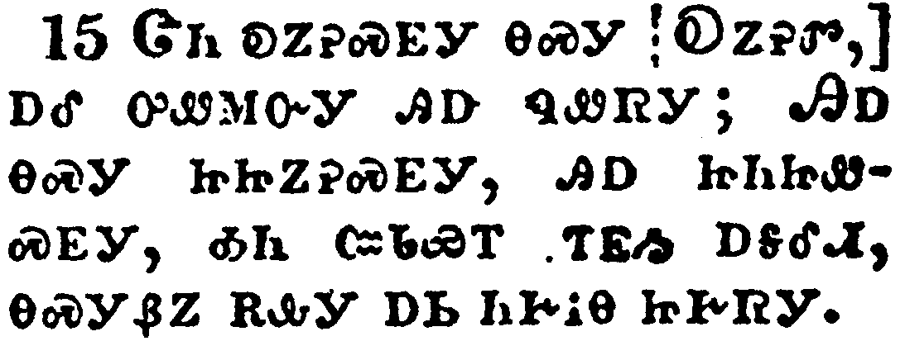</a></td>
</tr>
<tr class="even">
<td>John bare witness of him, and cried, saying, This was he of whom I spake, He that cometh after me is preferred before me: for he was before me.</td>
</tr>
<tr class="odd">
<td>ᏣᏂ ᎧᏃᎮᏍᎬᎩ ᎾᏍᎩ [ᎧᏃᎮᏛ,] ᎠᎴ ᎤᏪᎷᏅᎩ ᎯᎠ ᏄᏪᏒᎩ; ᎯᎠ ᎾᏍᎩ ᏥᏥᏃᎮᏍᎬᎩ, ᎯᎠ ᏥᏂᏥᏪᏍᎬᎩ, ᎣᏂ ᏨᏓᏯᎢ ᎢᎬᏱ ᎠᎦᎴᏗ, ᎾᏍᎩᏰᏃ ᎡᎲᎩ ᎠᏏ ᏂᎨᎥᎾ ᏥᎨᏒᎩ.</td>
</tr>
<tr class="even">
<td>Tsa-ni ka-no-he-s-gv-gi na-s-gi [Ka-no-he-dv,] a-le u-we-lu-nv-gi hi-a nu-we-sv-gi; Hi-a na-s-gi tsi-tsi-no-he-s-gv-gi, hi-a tsi-ni-tsi-we-s-gv-gi, o-ni tsv-da-ya-i i-gv-yi a-ga-le-di, na-s-gi-ye-no e-hv-gi a-si ni-ge-v-na tsi-ge-sv-gi.</td>
</tr>
</tbody>
</table>

<table>
<tbody>
<tr class="odd">
<td><a href="040116.png">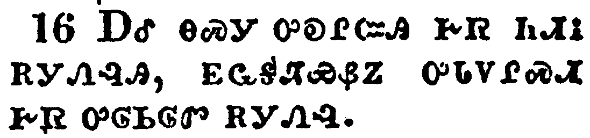</a></td>
</tr>
<tr class="even">
<td>And of his fulness have all we received, and grace for grace.</td>
</tr>
<tr class="odd">
<td>ᎠᎴ ᎾᏍᎩ ᎤᎧᎵᏨᎯ ᎨᏒ ᏂᏗᎥ ᎡᎩᏁᎸᎯ, ᎬᏩᎦᏘᏯᏰᏃ ᎤᏓᏙᎵᏍᏗ ᎨᏒ ᎤᎶᏏᎶᏛ ᎡᎩᏁᎸ.</td>
</tr>
<tr class="even">
<td>A-le na-s-gi u-ka-li-tsv-hi ge-sv ni-di-v e-gi-ne-lv-hi, gv-wa-ga-ti-ya-ye-no u-da-do-li-s-di ge-sv u-lo-si-lo-dv e-gi-ne-lv.</td>
</tr>
</tbody>
</table>

<table>
<tbody>
<tr class="odd">
<td><a href="040117.png">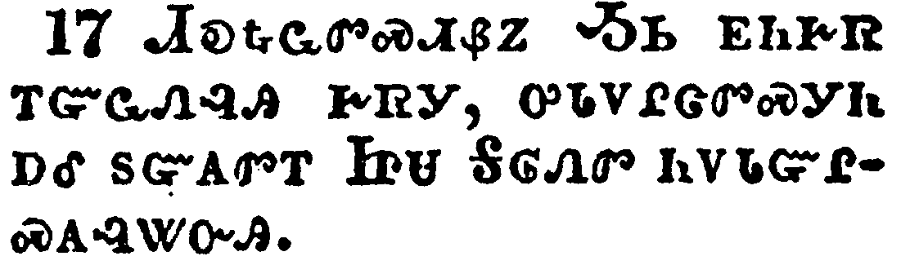</a></td>
</tr>
<tr class="even">
<td>For the law was given by Moses, but grace and truth came by Jesus Christ.</td>
</tr>
<tr class="odd">
<td>ᏗᎧᎿᎭᏩᏛᏍᏗᏰᏃ ᎼᏏ ᎬᏂᎨᏒ ᎢᏳᏩᏁᎸᎯ ᎨᏒᎩ, ᎤᏓᏙᎵᏣᏛᏍᎩᏂ ᎠᎴ ᏚᏳᎪᏛᎢ ᏥᏌ ᎦᎶᏁᏛ ᏂᏙᏓᏳᎵᏍᎪᎸᏔᏅᎯ.</td>
</tr>
<tr class="even">
<td>Di-ka-hna-wa-dv-s-di-ye-no Mo-si gv-ni-ge-sv i-yu-wa-ne-lv-hi ge-sv-gi, u-da-do-li-tsa-dv-s-gi-ni a-le du-yu-go-dv-i Tsi-sa Ga-lo-ne-dv ni-do-da-yu-li-s-go-lv-ta-nv-hi.</td>
</tr>
</tbody>
</table>

<table>
<tbody>
<tr class="odd">
<td><a href="040118.png">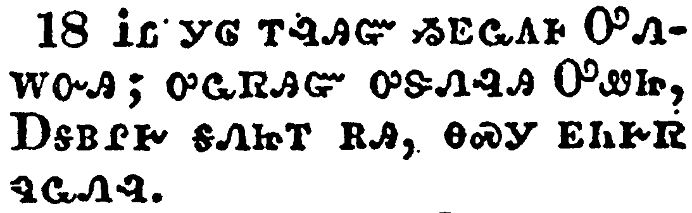</a></td>
</tr>
<tr class="even">
<td>No man hath seen God at any time; the only begotten Son, which is in the bosom of the Father, he hath declared him.</td>
</tr>
<tr class="odd">
<td>ᎥᏝ ᎩᎶ ᎢᎸᎯᏳ ᏱᎬᏩᎪᎰ ᎤᏁᎳᏅᎯ; ᎤᏩᏒᎯᏳ ᎤᏕᏁᎸᎯ ᎤᏪᏥ, ᎠᎦᏴᎵᎨ ᎦᏁᏥᎢ ᎡᎯ, ᎾᏍᎩ ᎬᏂᎨᏒ ᏄᏩᏁᎸ.</td>
</tr>
<tr class="even">
<td>V-tla gi-lo i-lv-hi-yu yi-gv-wa-go-ho U-ne-la-nv-hi; u-wa-sv-hi-yu u-de-ne-lv-hi U-we-tsi, A-ga-yv-li-ge ga-ne-tsi-i e-hi, na-s-gi gv-ni-ge-sv nu-wa-ne-lv.</td>
</tr>
</tbody>
</table>

<table>
<tbody>
<tr class="odd">
<td><a href="040119.png">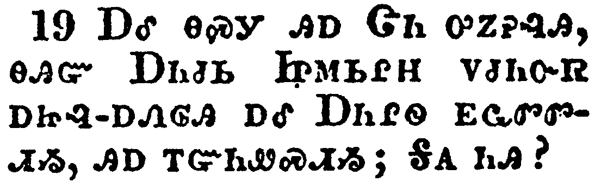</a></td>
</tr>
<tr class="even">
<td>And this is the record of John, when the Jews sent priests and Levites from Jerusalem to ask him, Who art thou?</td>
</tr>
<tr class="odd">
<td>ᎠᎴ ᎾᏍᎩ ᎯᎠ ᏣᏂ ᎤᏃᎮᎸᎯ, ᎾᎯᏳ ᎠᏂᏧᏏ ᏥᎷᏏᎵᎻ ᏙᏧᏂᏅᏒ ᎠᏥᎸ-ᎠᏁᎶᎯ ᎠᎴ ᎠᏂᎵᏫ ᎬᏩᏛᏛᏗᏱ, ᎯᎠ ᎢᏳᏂᏪᏍᏗᏱ; ᎦᎪ ᏂᎯ?</td>
</tr>
<tr class="even">
<td>A-le na-s-gi hi-a Tsa-ni u-no-he-lv-hi, na-hi-yu A-ni-tsu-si Tsi-lu-si-li-mi do-tsu-ni-nv-sv a-tsi-lv--a-ne-lo-hi a-le A-ni-li-wi gv-wa-dv-dv-di-yi, hi-a i-yu-ni-we-s-di-yi; Ga-go ni-hi?</td>
</tr>
</tbody>
</table>

<table>
<tbody>
<tr class="odd">
<td><a href="040120.png">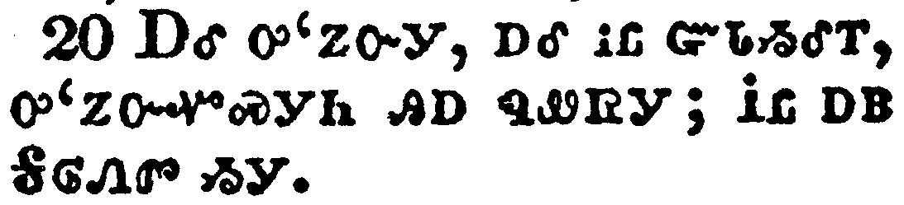</a></td>
</tr>
<tr class="even">
<td>And he confessed, and denied not; but confessed, I am not the Christ.</td>
</tr>
<tr class="odd">
<td>ᎠᎴ Ꭴ'ᏃᏅᎩ, ᎠᎴ ᎥᏝ ᏳᏓᏱᎴᎢ, Ꭴ'ᏃᏅᏉᏍᎩᏂ ᎯᎠ ᏄᏪᏒᎩ; ᎥᏝ ᎠᏴ ᎦᎶᏁᏛ ᏱᎩ.</td>
</tr>
<tr class="even">
<td>A-le u'no-nv-gi, a-le v-tla yu-da-yi-le-i, u'no-nv-quo-s-gi-ni hi-a nu-we-sv-gi; V-tla a-yv Ga-lo-ne-dv yi-gi.</td>
</tr>
</tbody>
</table>

<table>
<tbody>
<tr class="odd">
<td><a href="040121.png">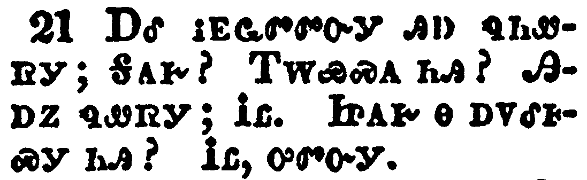</a></td>
</tr>
<tr class="even">
<td>And they asked him, What then? Art thou Elias? And he saith, I am not. Art thou that prophet? And he answered, No.</td>
</tr>
<tr class="odd">
<td>ᎠᎴ ᎥᎬᏩᏛᏛᏅᎩ ᎯᎠ ᏄᏂᏪᏒᎩ; ᎦᎪᎨ? ᎢᎳᏯᏍᎪ ᏂᎯ? ᎯᎠᏃ ᏄᏪᏒᎩ; ᎥᏝ. ᏥᎪᎨ Ꮎ ᎠᏙᎴᎰᏍᎩ ᏂᎯ? ᎥᏝ, ᎤᏛᏅᎩ.</td>
</tr>
<tr class="even">
<td>A-le v-gv-wa-dv-dv-nv-gi hi-a nu-ni-we-sv-gi; Ga-go-ge? I-la-ya-s-go ni-hi? Hi-a-no nu-we-sv-gi; V-tla. Tsi-go-ge na a-do-le-ho-s-gi ni-hi? V-tla, u-dv-nv-gi.</td>
</tr>
</tbody>
</table>

<table>
<tbody>
<tr class="odd">
<td><a href="040122.png">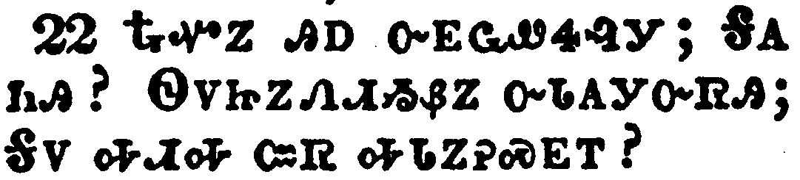</a></td>
</tr>
<tr class="even">
<td>Then said they unto him, Who art thou? that we may give an answer to them that sent us. What sayest thou of thyself?</td>
</tr>
<tr class="odd">
<td>ᎿᎭᏉᏃ ᎯᎠ ᏅᎬᏩᏪᏎᎸᎩ; ᎦᎪ ᏂᎯ? ᏫᏙᏥᏃᏁᏗᏱᏰᏃ ᏅᏓᎪᎩᏅᏒᎯ; ᎦᏙ ᎭᏗᎭ ᏨᏒ ᎭᏓᏃᎮᏍᎬᎢ?</td>
</tr>
<tr class="even">
<td>Hna-quo-no hi-a nv-gv-wa-we-se-lv-gi; Ga-go ni-hi? Wi-do-tsi-no-ne-di-yi-ye-no nv-da-go-gi-nv-sv-hi; Ga-do ha-di-ha tsv-sv ha-da-no-he-s-gv-i?</td>
</tr>
</tbody>
</table>

<table>
<tbody>
<tr class="odd">
<td><a href="040123.png">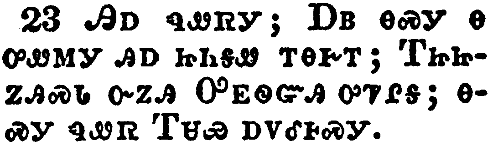</a></td>
</tr>
<tr class="even">
<td>He said, I am the voice of one crying in the wilderness, Make straight the way of the Lord, as said the prophet Esaias.</td>
</tr>
<tr class="odd">
<td>ᎯᎠ ᏄᏪᏒᎩ; ᎠᏴ ᎾᏍᎩ Ꮎ ᎤᏪᎷᎩ ᎯᎠ ᏥᏂᎦᏪ ᎢᎾᎨᎢ; ᎢᏥᏥᏃᎯᏍᏓ ᏅᏃᎯ ᎤᎬᏫᏳᎯ ᎤᏤᎵᎦ; ᎾᏍᎩ ᏄᏪᏒ ᎢᏌᏯ ᎠᏙᎴᎰᏍᎩ.</td>
</tr>
<tr class="even">
<td>Hi-a nu-we-sv-gi; A-yv na-s-gi na u-we-lu-gi hi-a tsi-ni-ga-we i-na-ge-i; I-tsi-tsi-no-hi-s-da nv-no-hi U-gv-wi-yu-hi u-tse-li-ga; na-s-gi nu-we-sv I-sa-ya a-do-le-ho-s-gi.</td>
</tr>
</tbody>
</table>

<table>
<tbody>
<tr class="odd">
<td><a href="040124.png">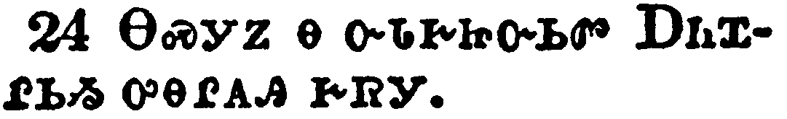</a></td>
</tr>
<tr class="even">
<td>And they which were sent were of the Pharisees.</td>
</tr>
<tr class="odd">
<td>ᎾᏍᎩᏃ Ꮎ ᏅᏓᎨᏥᏅᏏᏛ ᎠᏂᏆᎵᏏᏱ ᎤᎾᎵᎪᎯ ᎨᏒᎩ.</td>
</tr>
<tr class="even">
<td>Na-s-gi-no na nv-da-ge-tsi-nv-si-dv A-ni-qua-li-si-yi u-na-li-go-hi ge-sv-gi.</td>
</tr>
</tbody>
</table>

<table>
<tbody>
<tr class="odd">
<td><a href="040125.png">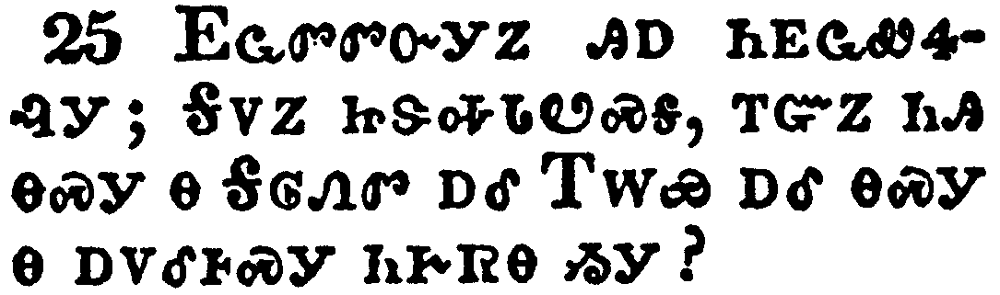</a></td>
</tr>
<tr class="even">
<td>And they asked him, and said unto him, Why baptizest thou then, if thou be not that Christ, nor Elias, neither that prophet?</td>
</tr>
<tr class="odd">
<td>ᎬᏩᏛᏛᏅᎩᏃ ᎯᎠ ᏂᎬᏩᏪᏎᎸᎩ; ᎦᏙᏃ ᏥᏕᎭᏓᏬᏍᎦ, ᎢᏳᏃ ᏂᎯ ᎾᏍᎩ Ꮎ ᎦᎶᏁᏛ ᎠᎴ ᎢᎳᏯ ᎠᎴ ᎾᏍᎩ Ꮎ ᎠᏙᎴᎰᏍᎩ ᏂᎨᏒᎾ ᏱᎩ?</td>
</tr>
<tr class="even">
<td>Gv-wa-dv-dv-nv-gi-no hi-a ni-gv-wa-we-se-lv-gi; Ga-do-no tsi-de-ha-da-wo-s-ga, i-yu-no ni-hi na-s-gi na Ga-lo-ne-dv a-le I-la-ya a-le na-s-gi na a-do-le-ho-s-gi ni-ge-sv-na yi-gi?</td>
</tr>
</tbody>
</table>

<table>
<tbody>
<tr class="odd">
<td><a href="040126.png">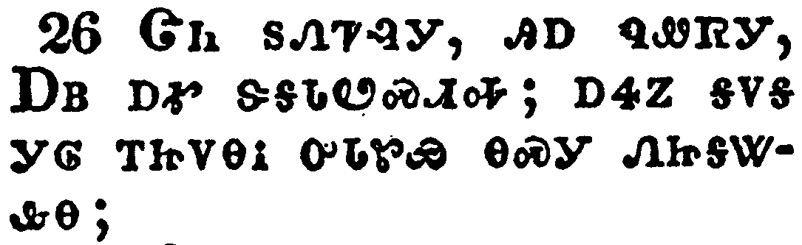</a></td>
</tr>
<tr class="even">
<td>John answered them, saying, I baptize with water: but there standeth one among you, whom ye know not;</td>
</tr>
<tr class="odd">
<td>ᏣᏂ ᏚᏁᏤᎸᎩ, ᎯᎠ ᏄᏪᏒᎩ, ᎠᏴ ᎠᎹ ᏕᎦᏓᏬᏍᏗᎭ; ᎠᏎᏃ ᎦᏙᎦ ᎩᎶ ᎢᏥᏙᎾᎥ ᎤᏓᏑᏯ ᎾᏍᎩ ᏁᏥᎦᏔᎲᎾ;</td>
</tr>
<tr class="even">
<td>Tsa-ni du-ne-tse-lv-gi, hi-a nu-we-sv-gi, A-yv a-ma de-ga-da-wo-s-di-ha; a-se-no ga-do-ga gi-lo i-tsi-do-na-v u-da-su-ya na-s-gi ne-tsi-ga-ta-hv-na;</td>
</tr>
</tbody>
</table>

<table>
<tbody>
<tr class="odd">
<td><a href="040127.png">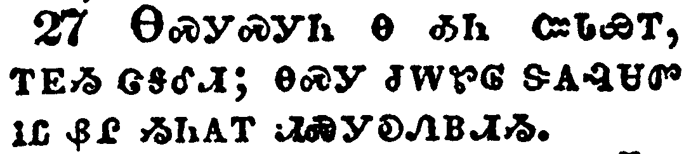</a></td>
</tr>
<tr class="even">
<td>He it is, who coming after me is preferred before me, whose shoe's latchet I am not worthy to unloose.</td>
</tr>
<tr class="odd">
<td>ᎾᏍᎩᏍᎩᏂ Ꮎ ᎣᏂ ᏨᏓᏯᎢ, ᎢᎬᏱ ᏣᎦᎴᏗ; ᎾᏍᎩ ᏧᎳᏑᎶ ᏕᎪᎸᏌᏛ ᎥᏝ ᏰᎵ ᏱᏂᎪᎢ ᏗᏍᎩᎧᏁᏴᏗᏱ.</td>
</tr>
<tr class="even">
<td>Na-s-gi-s-gi-ni na o-ni tsv-da-ya-i, i-gv-yi tsa-ga-le-di; na-s-gi tsu-la-su-lo de-go-lv-sa-dv v-tla ye-li yi-ni-go-i di-s-gi-ka-ne-yv-di-yi.</td>
</tr>
</tbody>
</table>

<table>
<tbody>
<tr class="odd">
<td><a href="040128.png">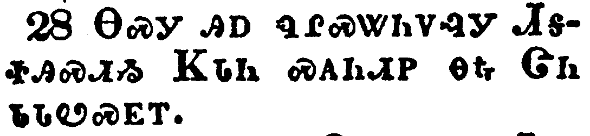</a></td>
</tr>
<tr class="even">
<td>These things were done in Bethabara beyond Jordan, where John was baptizing.</td>
</tr>
<tr class="odd">
<td>ᎾᏍᎩ ᎯᎠ ᏄᎵᏍᏔᏂᏙᎸᎩ ᏗᎦᏐᎯᏍᏗᏱ ᏦᏓᏂ ᏍᎪᏂᏗᏢ ᎾᎿᎭᏣᏂ ᏓᏓᏬᏍᎬᎢ.</td>
</tr>
<tr class="even">
<td>Na-s-gi hi-a nu-li-s-ta-ni-do-lv-gi Di-ga-so-hi-s-di-yi Tso-da-ni s-go-ni-di-tlv na-hna Tsa-ni da-da-wo-s-gv-i.</td>
</tr>
</tbody>
</table>

<table>
<tbody>
<tr class="odd">
<td><a href="040129.png">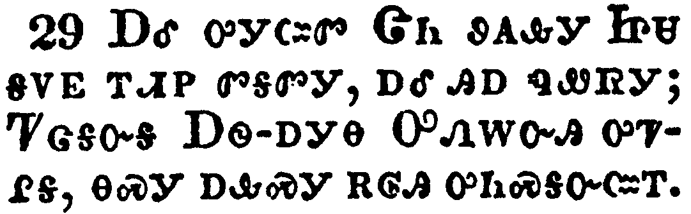</a></td>
</tr>
<tr class="even">
<td>The next day John seeth Jesus coming unto him, and saith, Behold the Lamb of God, which taketh away the sin of the world.</td>
</tr>
<tr class="odd">
<td>ᎠᎴ ᎤᎩᏨᏛ ᏣᏂ ᏭᎪᎲᎩ ᏥᏌ ᎦᏙᎬ ᎢᏗᏢ ᏛᎦᏛᎩ, ᎠᎴ ᎯᎠ ᏄᏪᏒᎩ; ᏤᏣᎦᏅᎦ ᎠᏫ-ᎠᎩᎾ ᎤᏁᎳᏅᎯ ᎤᏤᎵᎦ, ᎾᏍᎩ ᎠᎲᏍᎩ ᎡᎶᎯ ᎤᏂᏍᎦᏅᏨᎢ.</td>
</tr>
<tr class="even">
<td>A-le u-gi-tsv-dv Tsa-ni wu-go-hv-gi Tsi-sa ga-do-gv i-di-tlv dv-ga-dv-gi, a-le hi-a nu-we-sv-gi; Tse-tsa-ga-nv-ga A-wi--a-gi-na U-ne-la-nv-hi u-tse-li-ga, na-s-gi a-hv-s-gi e-lo-hi u-ni-s-ga-nv-tsv-i.</td>
</tr>
</tbody>
</table>

<table>
<tbody>
<tr class="odd">
<td><a href="040130.png">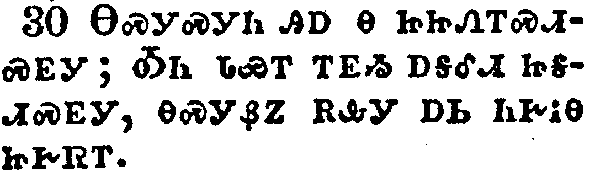</a></td>
</tr>
<tr class="even">
<td>This is he of whom I said, After me cometh a man which is preferred before me: for he was before me.</td>
</tr>
<tr class="odd">
<td>ᎾᏍᎩᏍᎩᏂ ᎯᎠ Ꮎ ᏥᏥᏁᎢᏍᏗᏍᎬᎩ; ᎣᏂ ᏓᏯᎢ ᎢᎬᏱ ᎠᎦᎴᏗ ᏥᎦᏗᏍᎬᎩ, ᎾᏍᎩᏰᏃ ᎡᎲᎩ ᎠᏏ ᏂᎨᎥᎾ ᏥᎨᏒᎢ.</td>
</tr>
<tr class="even">
<td>Na-s-gi-s-gi-ni hi-a na tsi-tsi-ne-i-s-di-s-gv-gi; O-ni da-ya-i i-gv-yi a-ga-le-di tsi-ga-di-s-gv-gi, na-s-gi-ye-no e-hv-gi a-si ni-ge-v-na tsi-ge-sv-i.</td>
</tr>
</tbody>
</table>

<table>
<tbody>
<tr class="odd">
<td><a href="040131.png">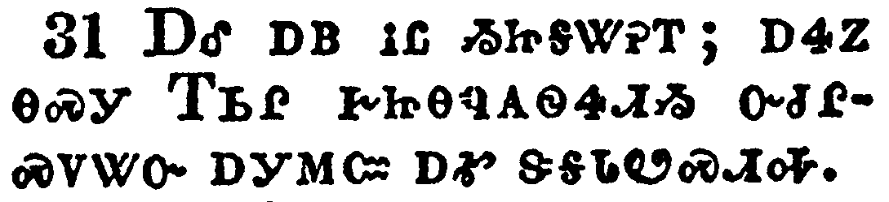</a></td>
</tr>
<tr class="even">
<td>And I knew him not: but that he should be made manifest to Israel, therefore am I come baptizing with water.</td>
</tr>
<tr class="odd">
<td>ᎠᎴ ᎠᏴ ᎥᏝ ᏱᏥᎦᏔᎮᎢ; ᎠᏎᏃ ᎾᏍᎩ ᎢᏏᎵ ᎨᏥᎾᏄᎪᏫᏎᏗᏱ ᏅᏧᎵᏍᏙᏔᏅ ᎠᎩᎷᏨ ᎠᎹ ᏕᎦᏓᏬᏍᏗᎭ.</td>
</tr>
<tr class="even">
<td>A-le a-yv v-tla yi-tsi-ga-ta-he-i; a-se-no na-s-gi I-si-li ge-tsi-na-nu-go-wi-se-di-yi nv-tsu-li-s-do-ta-nv a-gi-lu-tsv a-ma de-ga-da-wo-s-di-ha.</td>
</tr>
</tbody>
</table>

<table>
<tbody>
<tr class="odd">
<td><a href="040132.png">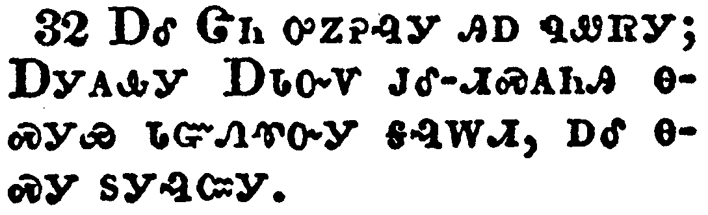</a></td>
</tr>
<tr class="even">
<td>And John bare record, saying, I saw the Spirit descending from heaven like a dove, and it abode upon him.</td>
</tr>
<tr class="odd">
<td>ᎠᎴ ᏣᏂ ᎤᏃᎮᎸᎩ ᎯᎠ ᏄᏪᏒᎩ; ᎠᎩᎪᎲᎩ ᎠᏓᏅᏙ ᎫᎴ-ᏗᏍᎪᏂᎯ ᎾᏍᎩᏯ ᏓᏳᏁᏡᏅᎩ ᎦᎸᎳᏗ, ᎠᎴ ᎾᏍᎩ ᏚᎩᎸᏨᎩ.</td>
</tr>
<tr class="even">
<td>A-le Tsa-ni u-no-he-lv-gi hi-a nu-we-sv-gi; A-gi-go-hv-gi A-da-nv-do gu-le--di-s-go-ni-hi na-s-gi-ya da-yu-ne-tlu-nv-gi ga-lv-la-di, a-le na-s-gi du-gi-lv-tsv-gi.</td>
</tr>
</tbody>
</table>

<table>
<tbody>
<tr class="odd">
<td><a href="040133.png">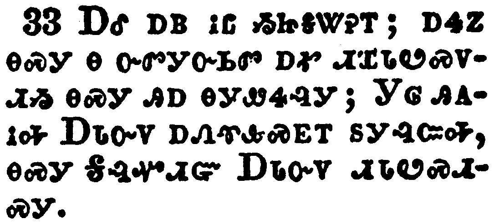</a></td>
</tr>
<tr class="even">
<td>And I knew him not: but he that sent me to baptize with water, the same said unto me, Upon whom thou shalt see the Spirit descending, and remaining on him, the same is he which baptizeth with the Holy Ghost.</td>
</tr>
<tr class="odd">
<td>ᎠᎴ ᎠᏴ ᎥᏝ ᏱᏥᎦᏔᎮᎢ; ᎠᏎᏃ ᎾᏍᎩ Ꮎ ᏅᏛᎩᏅᏏᏛ ᎠᎹ ᏗᏆᏓᏬᏍᏙᏗᏱ ᎾᏍᎩ ᎯᎠ ᎾᎩᏪᏎᎸᎩ; ᎩᎶ ᎯᎪᎥᎭ ᎠᏓᏅᏙ ᎠᏁᏡᎲᏍᎬᎢ ᏚᎩᎸᏨᎭ, ᎾᏍᎩ ᎦᎸᏉᏗᏳ ᎠᏓᏅᏙ ᏗᏓᏬᏍᏗᏍᎩ.</td>
</tr>
<tr class="even">
<td>A-le a-yv v-tla yi-tsi-ga-ta-he-i; a-se-no na-s-gi na nv-dv-gi-nv-si-dv a-ma di-qua-da-wo-s-do-di-yi na-s-gi hi-a na-gi-we-se-lv-gi; Gi-lo hi-go-v-ha A-da-nv-do a-ne-tlu-hv-s-gv-i du-gi-lv-tsv-ha, na-s-gi Ga-lv-quo-di-yu A-da-nv-do di-da-wo-s-di-s-gi.</td>
</tr>
</tbody>
</table>

<table>
<tbody>
<tr class="odd">
<td><a href="040134.png">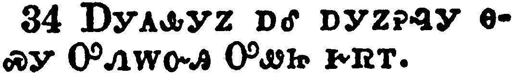</a></td>
</tr>
<tr class="even">
<td>And I saw, and bare record that this is the Son of God.</td>
</tr>
<tr class="odd">
<td>ᎠᎩᎪᎲᎩᏃ ᎠᎴ ᎠᎩᏃᎮᎸᎩ ᎾᏍᎩ ᎤᏁᎳᏅᎯ ᎤᏪᏥ ᎨᏒᎢ.</td>
</tr>
<tr class="even">
<td>A-gi-go-hv-gi-no a-le a-gi-no-he-lv-gi na-s-gi U-ne-la-nv-hi U-we-tsi ge-sv-i.</td>
</tr>
</tbody>
</table>

<table>
<tbody>
<tr class="odd">
<td><a href="040135.png">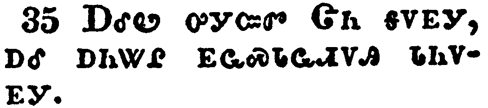</a></td>
</tr>
<tr class="even">
<td>Again the next day after John stood, and two of his disciples;</td>
</tr>
<tr class="odd">
<td>ᎠᎴᏬ ᎤᎩᏨᏛ ᏣᏂ ᎦᏙᎬᎩ, ᎠᎴ ᎠᏂᏔᎵ ᎬᏩᏍᏓᏩᏗᏙᎯ ᏓᏂᏙᎬᎩ.</td>
</tr>
<tr class="even">
<td>A-le-wo u-gi-tsv-dv Tsa-ni ga-do-gv-gi, a-le a-ni-ta-li gv-wa-s-da-wa-di-do-hi da-ni-do-gv-gi.</td>
</tr>
</tbody>
</table>

<table>
<tbody>
<tr class="odd">
<td><a href="040136.png">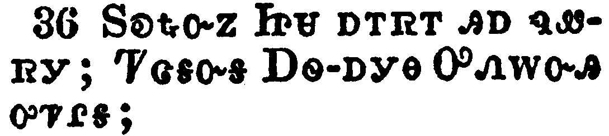</a></td>
</tr>
<tr class="even">
<td>And looking upon Jesus as he walked, he saith, Behold the Lamb of God!</td>
</tr>
<tr class="odd">
<td>ᏚᎧᎿᎭᏅᏃ ᏥᏌ ᎠᎢᏒᎢ ᎯᎠ ᏄᏪᏒᎩ; ᏤᏣᎦᏅᎦ ᎠᏫ-ᎠᎩᎾ ᎤᏁᎳᏅᎯ ᎤᏤᎵᎦ;</td>
</tr>
<tr class="even">
<td>Du-ka-hna-nv-no Tsi-sa a-i-sv-i hi-a nu-we-sv-gi; Tse-tsa-ga-nv-ga A-wi--a-gi-na U-ne-la-nv-hi u-tse-li-ga;</td>
</tr>
</tbody>
</table>

<table>
<tbody>
<tr class="odd">
<td><a href="040137.png">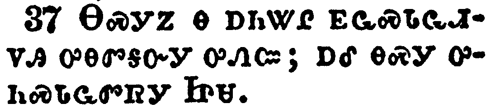</a></td>
</tr>
<tr class="even">
<td>And the two disciples heard him speak, and they followed Jesus.</td>
</tr>
<tr class="odd">
<td>ᎾᏍᎩᏃ Ꮎ ᎠᏂᏔᎵ ᎬᏩᏍᏓᏩᏗᏙᎯ ᎤᎾᏛᎦᏅᎩ ᎤᏁᏨ; ᎠᎴ ᎾᏍᎩ ᎤᏂᏍᏓᏩᏛᏒᎩ ᏥᏌ.</td>
</tr>
<tr class="even">
<td>Na-s-gi-no na a-ni-ta-li gv-wa-s-da-wa-di-do-hi u-na-dv-ga-nv-gi u-ne-tsv; a-le na-s-gi u-ni-s-da-wa-dv-sv-gi Tsi-sa.</td>
</tr>
</tbody>
</table>

<table>
<tbody>
<tr class="odd">
<td><a href="040138.png">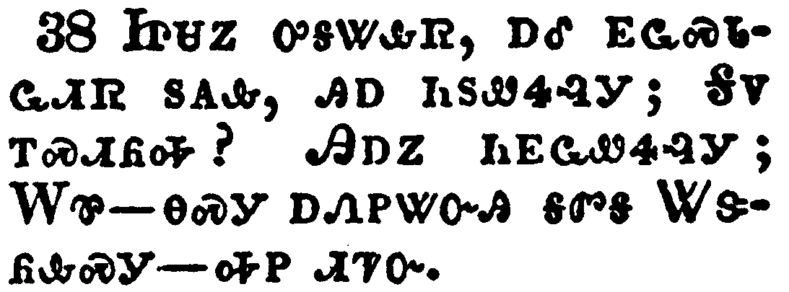</a></td>
</tr>
<tr class="even">
<td>Then Jesus turned, and saw them following, and saith unto them, What seek ye? They said unto him, Rabbi, (which is to say, being interpreted, Master,) where dwellest thou?</td>
</tr>
<tr class="odd">
<td>ᏥᏌᏃ ᎤᎦᏔᎲᏒ, ᎠᎴ ᎬᏩᏍᏓᏩᏗᏒ ᏚᎪᎲ, ᎯᎠ ᏂᏚᏪᏎᎸᎩ; ᎦᏙ ᎢᏍᏗᏲᎭ? ᎯᎠᏃ ᏂᎬᏩᏪᏎᎸᎩ; ᏔᏈ-ᎾᏍᎩ ᎠᏁᏢᏔᏅᎯ ᎦᏛᎦ ᏔᏕᏲᎲᏍᎩ-ᎭᏢ ᏗᏤᏅ.</td>
</tr>
<tr class="even">
<td>Tsi-sa-no u-ga-ta-hv-sv, a-le gv-wa-s-da-wa-di-sv du-go-hv, hi-a ni-du-we-se-lv-gi; Ga-do i-s-di-yo-ha? Hi-a-no ni-gv-wa-we-se-lv-gi; Ta-qui---na-s-gi a-ne-tlv-ta-nv-hi ga-dv-ga Ta-de-yo-hv-s-gi---ha-tlv di-tse-nv.</td>
</tr>
</tbody>
</table>

<table>
<tbody>
<tr class="odd">
<td><a href="040139.png">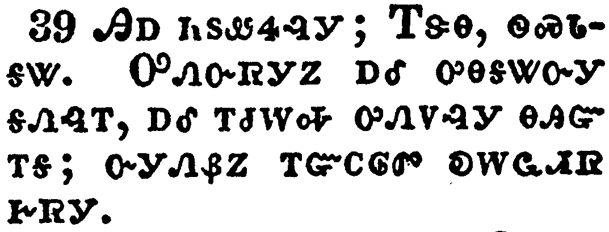</a></td>
</tr>
<tr class="even">
<td>He saith unto them, Come and see. They came and saw where he dwelt, and abode with him that day: for it was about the tenth hour.</td>
</tr>
<tr class="odd">
<td>ᎯᎠ ᏂᏚᏪᏎᎸᎩ; ᎢᏕᎾ, ᏫᏍᏓᎦᏔ. ᎤᏁᏅᏒᎩᏃ ᎠᎴ ᎤᎾᎦᏔᏅᎩ ᎦᏁᎸᎢ, ᎠᎴ ᎢᏧᎳᎭ ᎤᏁᏙᎸᎯ ᎾᎯᏳ ᎢᎦ; ᏅᎩᏁᏰᏃ ᎢᏳᏟᎶᏛ ᎧᎳᏩᏗᏒ ᎨᏒᎩ.</td>
</tr>
<tr class="even">
<td>Hi-a ni-du-we-se-lv-gi; I-de-na, wi-s-da-ga-ta. U-ne-nv-sv-gi-no a-le u-na-ga-ta-nv-gi ga-ne-lv-i, a-le i-tsu-la-ha u-ne-do-lv-hi na-hi-yu i-ga; nv-gi-ne-ye-no i-yu-tli-lo-dv ka-la-wa-di-sv ge-sv-gi.</td>
</tr>
</tbody>
</table>

<table>
<tbody>
<tr class="odd">
<td><a href="040140.png">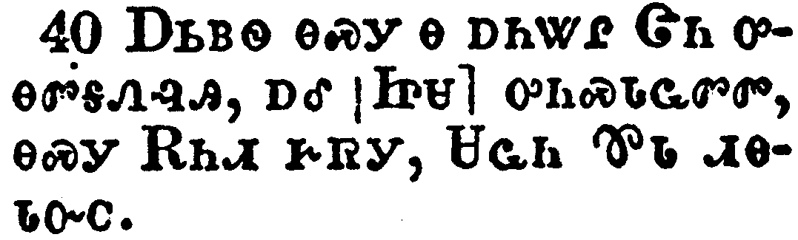</a></td>
</tr>
<tr class="even">
<td>One of the two which heard John speak, and followed him, was Andrew, Simon Peter's brother.</td>
</tr>
<tr class="odd">
<td>ᎠᏏᏴᏫ ᎾᏍᎩ Ꮎ ᎠᏂᏔᎵ ᏣᏂ ᎤᎾᏛᎦᏁᎸᎯ, ᎠᎴ [ᏥᏌ] ᎤᏂᏍᏓᏩᏛᏛ, ᎾᏍᎩ ᎡᏂᏗ ᎨᏒᎩ, ᏌᏩᏂ ᏈᏓ ᏗᎾᏓᏅᏟ.</td>
</tr>
<tr class="even">
<td>A-si-yv-wi na-s-gi na a-ni-ta-li Tsa-ni u-na-dv-ga-ne-lv-hi, a-le [Tsi-sa] u-ni-s-da-wa-dv-dv, na-s-gi E-ni-di ge-sv-gi, Sa-wa-ni Qui-da di-na-da-nv-tli.</td>
</tr>
</tbody>
</table>

<table>
<tbody>
<tr class="odd">
<td><a href="040141.png">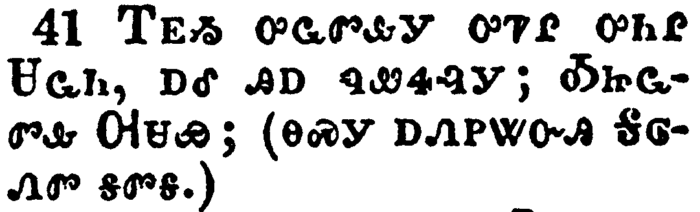</a></td>
</tr>
<tr class="even">
<td>He first findeth his own brother Simon, and saith unto him, We have found the Messias, which is, being interpreted, the Christ.</td>
</tr>
<tr class="odd">
<td>ᎢᎬᏱ ᎤᏩᏛᎲᎩ ᎤᏤᎵ ᎤᏂᎵ ᏌᏩᏂ, ᎠᎴ ᎯᎠ ᏄᏪᏎᎸᎩ; ᎣᏥᏩᏛᎲ ᎺᏌᏯ; (ᎾᏍᎩ ᎠᏁᏢᏔᏅᎯ ᎦᎶᏁᏛ ᎦᏛᎦ.)</td>
</tr>
<tr class="even">
<td>I-gv-yi u-wa-dv-hv-gi u-tse-li u-ni-li Sa-wa-ni, a-le hi-a nu-we-se-lv-gi; O-tsi-wa-dv-hv Me-sa-ya; (na-s-gi a-ne-tlv-ta-nv-hi Ga-lo-ne-dv ga-dv-ga.)</td>
</tr>
</tbody>
</table>

<table>
<tbody>
<tr class="odd">
<td><a href="040142.png">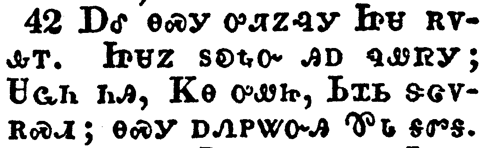</a></td>
</tr>
<tr class="even">
<td>And he brought him to Jesus. And when Jesus beheld him, he said, Thou art Simon the son of Jona: thou shalt be called Cephas, which is by interpretation, A stone.</td>
</tr>
<tr class="odd">
<td>ᎠᎴ ᎾᏍᎩ ᎤᏘᏃᎸᎩ ᏥᏌ ᎡᏙᎲᎢ. ᏥᏌᏃ ᏚᎧᎿᎭᏅ ᎯᎠ ᏄᏪᏒᎩ; ᏌᏩᏂ ᏂᎯ, ᏦᎾ ᎤᏪᏥ, ᏏᏆᏏ ᏕᏣᏙᎡᏍᏗ; ᎾᏍᎩ ᎠᏁᏢᏔᏅᎯ ᏈᏓ ᎦᏛᎦ.</td>
</tr>
<tr class="even">
<td>A-le na-s-gi u-ti-no-lv-gi Tsi-sa e-do-hv-i. Tsi-sa-no du-ka-hna-nv hi-a nu-we-sv-gi; Sa-wa-ni ni-hi, Tso-na u-we-tsi, Si-qua-si de-tsa-do-e-s-di; na-s-gi a-ne-tlv-ta-nv-hi Qui-da ga-dv-ga.</td>
</tr>
</tbody>
</table>

<table>
<tbody>
<tr class="odd">
<td><a href="040143.png">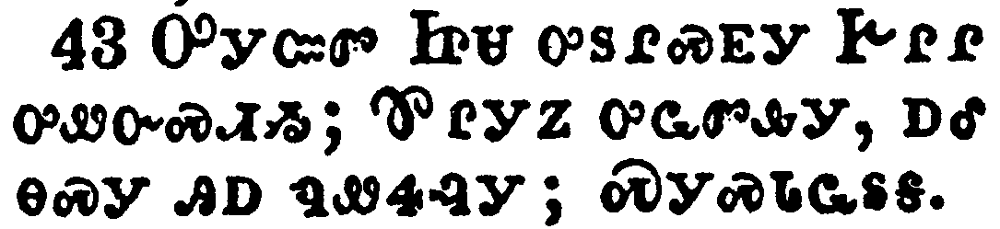</a></td>
</tr>
<tr class="even">
<td>The day following Jesus would go forth into Galilee, and findeth Philip, and saith unto him, Follow me.</td>
</tr>
<tr class="odd">
<td>ᎤᎩᏨᏛ ᏥᏌ ᎤᏚᎵᏍᎬᎩ ᎨᎵᎵ ᎤᏪᏅᏍᏗᏱ; ᏈᎵᎩᏃ ᎤᏩᏛᎲᎩ, ᎠᎴ ᎾᏍᎩ ᎯᎠ ᏄᏪᏎᎸᎩ; ᏍᎩᏍᏓᏩᏚᎦ.</td>
</tr>
<tr class="even">
<td>U-gi-tsv-dv Tsi-sa u-du-li-s-gv-gi Ge-li-li u-we-nv-s-di-yi; Qui-li-gi-no u-wa-dv-hv-gi, a-le na-s-gi hi-a nu-we-se-lv-gi; S-gi-s-da-wa-du-ga.</td>
</tr>
</tbody>
</table>

<table>
<tbody>
<tr class="odd">
<td><a href="040144.png">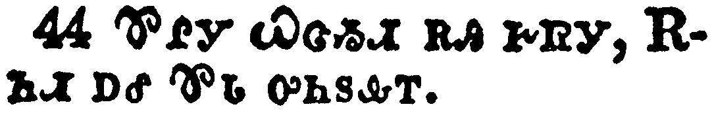</a></td>
</tr>
<tr class="even">
<td>Now Philip was of Bethsaida, the city of Andrew and Peter.</td>
</tr>
<tr class="odd">
<td>ᏈᎵᎩ ᏇᏣᏱᏗ ᎡᎯ ᎨᏒᎩ, ᎡᏂᏗ ᎠᎴ ᏈᏓ ᎤᏂᏚᎲᎢ.</td>
</tr>
<tr class="even">
<td>Qui-li-gi Que-tsa-yi-di e-hi ge-sv-gi, E-ni-di a-le Qui-da u-ni-du-hv-i.</td>
</tr>
</tbody>
</table>

<table>
<tbody>
<tr class="odd">
<td><a href="040145.png">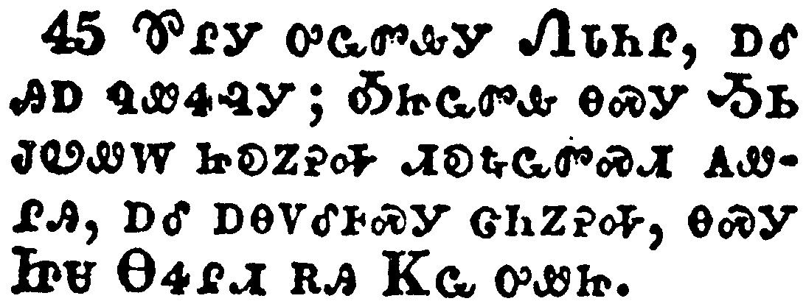</a></td>
</tr>
<tr class="even">
<td>Philip findeth Nathanael, and saith unto him, We have found him, of whom Moses in the law, and the prophets, did write, Jesus of Nazareth, the son of Joseph.</td>
</tr>
<tr class="odd">
<td>ᏈᎵᏃ ᎤᏩᏛᎲᎩ ᏁᏓᏂᎵ, ᎠᎴ ᎯᎠ ᏄᏪᏎᎸᎩ; ᎣᏥᏩᏛᎲ ᎾᏍᎩ ᎼᏏ ᎫᏬᏪᎳ ᏥᎧᏃᎮᎭ ᏗᎧᎿᎭᏩᏛᏍᏗ ᎪᏪᎵᎯ, ᎠᎴ ᎠᎾᏙᎴᎰᏍᎩ ᏣᏂᏃᎮᎭ, ᎾᏍᎩ ᏥᏌ ᎾᏎᎵᏗ ᎡᎯ ᏦᏩ ᎤᏪᏥ.</td>
</tr>
<tr class="even">
<td>Qui-li-no u-wa-dv-hv-gi Ne-da-ni-li, a-le hi-a nu-we-se-lv-gi; O-tsi-wa-dv-hv na-s-gi Mo-si gu-wo-we-la tsi-ka-no-he-ha di-ka-hna-wa-dv-s-di go-we-li-hi, a-le a-na-do-le-ho-s-gi tsa-ni-no-he-ha, na-s-gi Tsi-sa Na-se-li-di e-hi Tso-wa u-we-tsi.</td>
</tr>
</tbody>
</table>

<table>
<tbody>
<tr class="odd">
<td><a href="040146.png">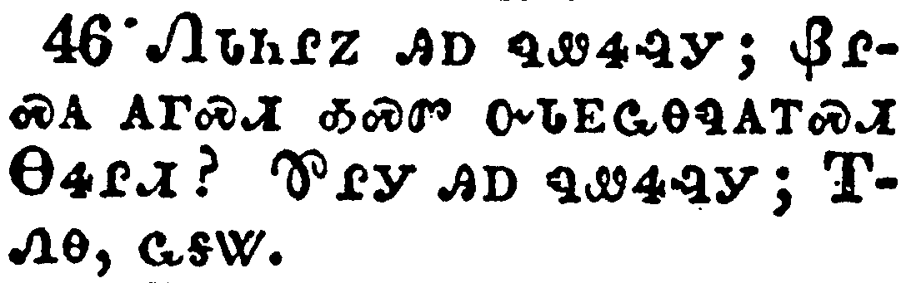</a></td>
</tr>
<tr class="even">
<td>And Nathanael said unto him, Can there any good thing come out of Nazareth? Philip saith unto him, Come and see.</td>
</tr>
<tr class="odd">
<td>ᏁᏓᏂᎵᏃ ᎯᎠ ᏄᏪᏎᎸᎩ; ᏰᎵᏍᎪ ᎪᎱᏍᏗ ᎣᏍᏛ ᏅᏓᎬᏩᎾᏄᎪᎢᏍᏗ ᎾᏎᎵᏗ? ᏈᎵᎩ ᎯᎠ ᏄᏪᏎᎸᎩ; ᎢᏁᎾ, ᏩᎦᏔ.</td>
</tr>
<tr class="even">
<td>Ne-da-ni-li-no hi-a nu-we-se-lv-gi; Ye-li-s-go go-hu-s-di o-s-dv nv-da-gv-wa-na-nu-go-i-s-di Na-se-li-di? Qui-li-gi hi-a nu-we-se-lv-gi; I-ne-na, wa-ga-ta.</td>
</tr>
</tbody>
</table>

<table>
<tbody>
<tr class="odd">
<td><a href="040147.png">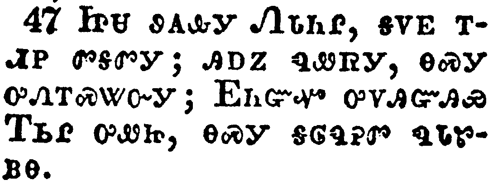</a></td>
</tr>
<tr class="even">
<td>Jesus saw Nathanael coming to him, and saith of him, Behold an Israelite indeed, in whom is no guile!</td>
</tr>
<tr class="odd">
<td>ᏥᏌ ᏭᎪᎲᎩ ᏁᏓᏂᎵ, ᎦᏙᎬ ᎢᏗᏢ ᏛᎦᏛᎩ; ᎯᎠᏃ ᏄᏪᏒᎩ, ᎾᏍᎩ ᎤᏁᎢᏍᏔᏅᎩ; ᎬᏂᏳᏉ ᎤᏙᎯᏳᎯᏯ ᎢᏏᎵ ᎤᏪᏥ, ᎾᏍᎩ ᎦᎶᏄᎮᏛ ᏄᏓᏑᏴᎾ.</td>
</tr>
<tr class="even">
<td>Tsi-sa wu-go-hv-gi Ne-da-ni-li, ga-do-gv i-di-tlv dv-ga-dv-gi; hi-a-no nu-we-sv-gi, na-s-gi u-ne-i-s-ta-nv-gi; Gv-ni-yu-quo u-do-hi-yu-hi-ya I-si-li u-we-tsi, na-s-gi ga-lo-nu-he-dv nu-da-su-yv-na.</td>
</tr>
</tbody>
</table>

<table>
<tbody>
<tr class="odd">
<td><a href="040148.png">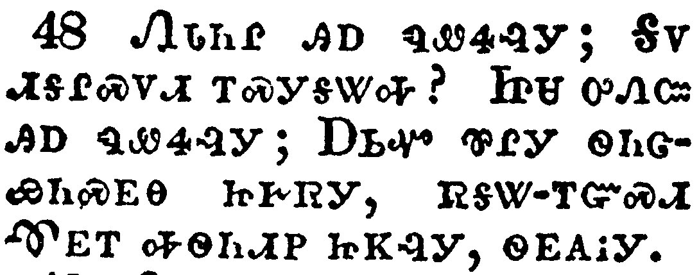</a></td>
</tr>
<tr class="even">
<td>Nathanael saith unto him, Whence knowest thou me? Jesus answered and said unto him, Before that Philip called thee, when thou wast under the fig tree, I saw thee.</td>
</tr>
<tr class="odd">
<td>ᏁᏓᏂᎵ ᎯᎠ ᏄᏪᏎᎸᎩ; ᎦᏙ ᏗᎦᎵᏍᏙᏗ ᎢᏍᎩᎦᏔᎭ? ᏥᏌ ᎤᏁᏨ ᎯᎠ ᏄᏪᏎᎸᎩ; ᎠᏏᏉ ᏈᎵᎩ ᏫᏂᏣᏯᏂᏍᎬᎾ ᏥᎨᏒᎩ, ᎡᎦᏔ-ᎢᏳᏍᏗ ᏡᎬᎢ ᎭᏫᏂᏗᏢ ᏥᏦᎸᎩ, ᏫᎬᎪᎥᎩ.</td>
</tr>
<tr class="even">
<td>Ne-da-ni-li hi-a nu-we-se-lv-gi; Ga-do di-ga-li-s-do-di i-s-gi-ga-ta-ha? Tsi-sa u-ne-tsv hi-a nu-we-se-lv-gi; A-si-quo qui-li-gi wi-ni-tsa-ya-ni-s-gv-na tsi-ge-sv-gi, e-ga-ta--i-yu-s-di Tlu-gv-i ha-wi-ni-di-tlv tsi-tso-lv-gi, wi-gv-go-v-gi.</td>
</tr>
</tbody>
</table>

<table>
<tbody>
<tr class="odd">
<td><a href="040149.png">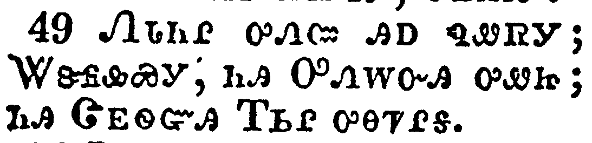</a></td>
</tr>
<tr class="even">
<td>Nathanael answered and saith unto him, Rabbi, thou art the Son of God; thou art the King of Israel.</td>
</tr>
<tr class="odd">
<td>ᏁᏓᏂᎵ ᎤᏅᏨ ᎯᎠ ᏄᏪᏒᎩ; ᏔᏕᏲᎲᏍᎩ, ᏂᎯ ᎤᏁᎳᏅᎯ ᎤᏪᏥ; ᏂᎯ ᏣᎬᏫᏳᎯ ᎢᏏᎵ ᎤᎾᏤᎵᎦ.</td>
</tr>
<tr class="even">
<td>Ne-da-ni-li u-nv-tsv hi-a nu-we-sv-gi; Ta-de-yo-hv-s-gi, ni-hi U-ne-la-nv-hi u-we-tsi; ni-hi Tsa-gv-wi-yu-hi I-si-li u-na-tse-li-ga.</td>
</tr>
</tbody>
</table>

<table>
<tbody>
<tr class="odd">
<td><a href="040150.png">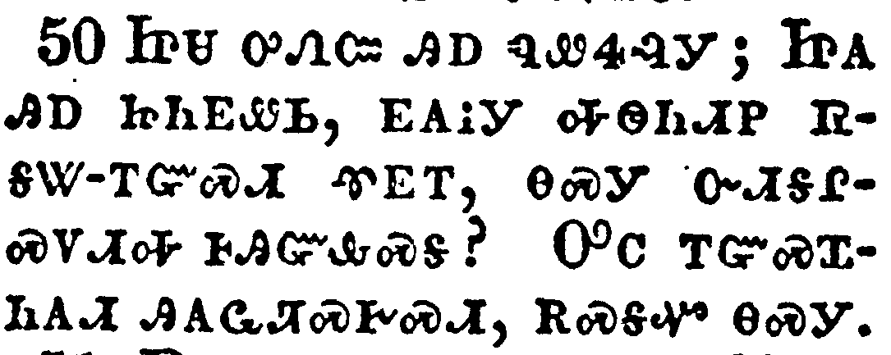</a></td>
</tr>
<tr class="even">
<td>Jesus answered and said unto him, Because I said unto thee, I saw thee under the fig tree, believest thou? thou shalt see greater things than these.</td>
</tr>
<tr class="odd">
<td>ᏥᏌ ᎤᏁᏨ ᎯᎠ ᏄᏪᏎᎸᎩ; ᏥᎪ ᎯᎠ ᏥᏂᎬᏪᏏ, ᎬᎪᎥᎩ ᎭᏫᏂᏗᏢ ᏒᎦᏔ-ᎢᏳᏍᏗ ᏡᎬᎢ, ᎾᏍᎩ ᏅᏗᎦᎵᏍᏙᏗᎭ ᎰᎯᏳᎲᏍᎦ? ᎤᏟ ᎢᏳᏍᏆᏂᎪᏗ ᎯᎪᏩᏘᏍᎨᏍᏗ, ᎡᏍᎦᏉ ᎾᏍᎩ.</td>
</tr>
<tr class="even">
<td>Tsi-sa u-ne-tsv hi-a nu-we-se-lv-gi; Tsi-go hi-a tsi-ni-gv-we-si, gv-go-v-gi ha-wi-ni-di-tlv sv-ga-ta--i-yu-s-di tlu-gv-i, na-s-gi nv-di-ga-li-s-do-di-ha ho-hi-yu-hv-s-ga? U-tli i-yu-s-qua-ni-go-di hi-go-wa-ti-s-ge-s-di, e-s-ga-quo na-s-gi.</td>
</tr>
</tbody>
</table>

<table>
<tbody>
<tr class="odd">
<td><a href="040151.png">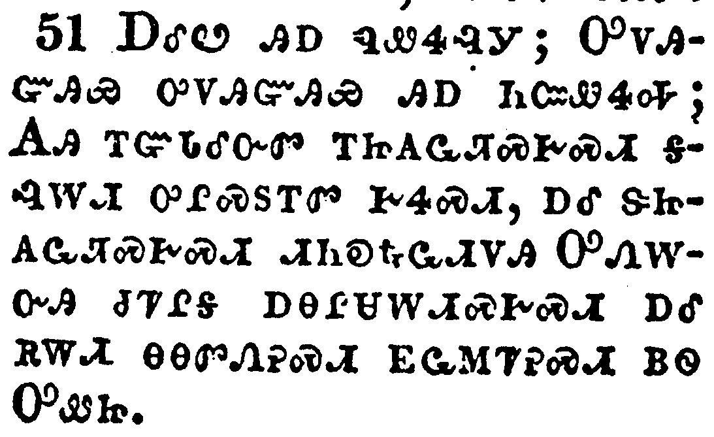</a></td>
</tr>
<tr class="even">
<td>And he saith unto him, Verily, verily, I say unto you, Hereafter ye shall see heaven open, and the angels of God ascending and descending upon the Son of man.</td>
</tr>
<tr class="odd">
<td>ᎠᎴᏬ ᎯᎠ ᏄᏪᏎᎸᎩ; ᎤᏙᎯᏳᎯᏩ ᎤᏙᎯᏳᎯᏯ ᎯᎠ ᏂᏨᏪᏎᎭ; ᎪᎯ ᎢᏳᏓᎴᏅᏛ ᎢᏥᎪᏩᏘᏍᎨᏍᏗ ᎦᎸᎳᏗ ᎤᎵᏍᏚᎢᏛ ᎨᏎᏍᏗ, ᎠᎴ ᏕᏥᎪᏩᏘᏍᎨᏍᏗ ᏗᏂᎧᎿᎭᏩᏗᏙᎯ ᎤᏁᎳᏅᎯ ᏧᏤᎵᎦ ᎠᎾᎵᏌᎳᏗᏍᎨᏍᏗ ᎠᎴ ᎡᎳᏗ ᎾᎾᏛᏁᎮᏍᏗ ᎬᏩᎷᏤᎮᏍᏗ ᏴᏫ ᎤᏪᏥ.</td>
</tr>
<tr class="even">
<td>A-le-wo hi-a nu-we-se-lv-gi; U-do-hi-yu-hi-wa u-do-hi-yu-hi-ya hi-a ni-tsv-we-se-ha; Go-hi i-yu-da-le-nv-dv i-tsi-go-wa-ti-s-ge-s-di ga-lv-la-di u-li-s-du-i-dv ge-se-s-di, a-le de-tsi-go-wa-ti-s-ge-s-di di-ni-ka-hna-wa-di-do-hi U-ne-la-nv-hi tsu-tse-li-ga a-na-li-sa-la-di-s-ge-s-di a-le e-la-di na-na-dv-ne-he-s-di gv-wa-lu-tse-he-s-di yv-wi U-we-tsi.</td>
</tr>
</tbody>
</table>

