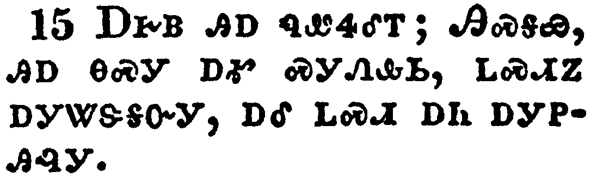

+++
draft=false
date = 2014-12-18T21:11:07Z
title = "John - Chapter 4 - Cherokee New Testament"
weight = 1418955067

[taxonomies]

authors = ["Timothy Legg"]
categories = []
tags = []

[extra]
+++

<table>
<tbody>
<tr class="odd">
<td></td>
</tr>
<tr class="even">
<td>When therefore the Lord knew how the Pharisees had heard that Jesus made and baptized more disciples than John,</td>
</tr>
<tr class="odd">
<td>ᎤᎬᏫᏳᎯᏃ ᎤᏛᎦᏅ ᎠᏂᏆᎵᏏ ᎤᎾᏛᎦᏅ ᏥᏌ ᎤᏟ ᎢᏯᏂᎢ ᎬᏩᏍᏓᏩᏕᎩ ᏂᏕᎬᏁᎲ ᎠᎴ ᏕᎦᏬᏍᎬᎢ, ᎡᏍᎦᏉ ᏣᏂ,</td>
</tr>
<tr class="even">
<td>U-gv-wi-yu-hi-no u-dv-ga-nv A-ni-qua-li-si u-na-dv-ga-nv Tsi-sa u-tli i-ya-ni-i gv-wa-s-da-wa-de-gi ni-de-gv-ne-hv a-le de-ga-wo-s-gv-i, e-s-ga-quo Tsa-ni,</td>
</tr>
</tbody>
</table>

<table>
<tbody>
<tr class="odd">
<td></td>
</tr>
<tr class="even">
<td>(Though Jesus himself baptized not, but his disciples,)</td>
</tr>
<tr class="odd">
<td>(ᎥᏝᏍᎩᏂᏃᏅ ᏥᏌ ᎤᏩᏒ ᏱᏓᏓᏬᏍᎨᎢ, ᎬᏩᏍᏓᏩᏗᏙᎯᏉᏍᎩᏂ,)</td>
</tr>
<tr class="even">
<td>(V-tla-s-gi-ni-no-nv Tsi-sa u-wa-sv yi-da-da-wo-s-ge-i, gv-wa-s-da-wa-di-do-hi-quo-s-gi-ni,)</td>
</tr>
</tbody>
</table>

<table>
<tbody>
<tr class="odd">
<td></td>
</tr>
<tr class="even">
<td>He left Judaea, and departed again into Galilee.</td>
</tr>
<tr class="odd">
<td>ᏧᏗᏱ ᎤᏂᎩᏒᎩ ᎠᎴ ᏔᎵᏁ ᎨᎵᎵ ᏮᎤᎶᏒᎩ.</td>
</tr>
<tr class="even">
<td>Tsu-di-yi u-ni-gi-sv-gi a-le ta-li-ne Ge-li-li wv-u-lo-sv-gi.</td>
</tr>
</tbody>
</table>

<table>
<tbody>
<tr class="odd">
<td></td>
</tr>
<tr class="even">
<td>And he must needs go through Samaria.</td>
</tr>
<tr class="odd">
<td>ᎠᎴ ᏌᎺᎵᏱ ᎠᏎ ᎤᎶᎯᏍᏗ ᎨᏒᎩ.</td>
</tr>
<tr class="even">
<td>A-le Sa-me-li-yi a-se u-lo-hi-s-di ge-sv-gi.</td>
</tr>
</tbody>
</table>

<table>
<tbody>
<tr class="odd">
<td></td>
</tr>
<tr class="even">
<td>Then cometh he to a city of Samaria, which is called Sychar, near to the parcel of ground that Jacob gave to his son Joseph.</td>
</tr>
<tr class="odd">
<td>ᎿᎭᏉᏃ ᏌᎺᎵᏱ ᎦᏚᎲ ᎤᎷᏨᎩ ᏌᎦ ᏧᏙᎢᏛ ᎾᏍᎩ ᎾᎥ ᏥᎦᏚᎭ ᎦᏓ ᎠᎲ ᏤᎦᏈ ᏧᏁᎴ ᎤᏪᏥ ᏦᏩ.</td>
</tr>
<tr class="even">
<td>Hna-quo-no Sa-me-li-yi ga-du-hv u-lu-tsv-gi Sa-ga tsu-do-i-dv na-s-gi na-v tsi-ga-du-ha ga-da a-hv Tse-ga-qui tsu-ne-le u-we-tsi Tso-wa.</td>
</tr>
</tbody>
</table>

<table>
<tbody>
<tr class="odd">
<td></td>
</tr>
<tr class="even">
<td>Now Jacob's well was there. Jesus therefore, being wearied with his journey, sat thus on the well: and it was about the sixth hour.</td>
</tr>
<tr class="odd">
<td>ᎾᎿᎭᏃ ᎠᏔᎴᏒᎩ ᎠᎹ ᏧᏂᏢᏗᏱ ᏤᎦᏈ ᎤᏤᎵᎦ; ᏥᏌᏃ ᏚᏯᏪᏨ ᎠᎢᏒ ᎤᏪᏅᎩ ᎠᏔᎴᏒᎢ; ᏔᎳᏚᏃ ᎢᏴᏛ ᎢᏳᏟᎶᏛ ᎧᎳᏩᏗᏒ ᎨᏒᎩ.</td>
</tr>
<tr class="even">
<td>Na-hna-no a-ta-le-sv-gi a-ma tsu-ni-tlv-di-yi Tse-ga-qui u-tse-li-ga; Tsi-sa-no du-ya-we-tsv a-i-sv u-we-nv-gi a-ta-le-sv-i; ta-la-du-no i-yv-dv i-yu-tli-lo-dv ka-la-wa-di-sv ge-sv-gi.</td>
</tr>
</tbody>
</table>

<table>
<tbody>
<tr class="odd">
<td></td>
</tr>
<tr class="even">
<td>There cometh a woman of Samaria to draw water: Jesus saith unto her, Give me to drink.</td>
</tr>
<tr class="odd">
<td>ᎾᎿᎭᎤᎷᏤ ᎠᎨᏴ ᏌᎺᎵᏱ ᎡᎯ ᎠᎹ ᎤᏢᎯᎴᎢ; ᏥᏌ ᎯᎠ ᏄᏪᏎᎴᎢ; ᎠᏆᏗᏔᏍᏗ ᏍᎩᏁᎲᏏ.</td>
</tr>
<tr class="even">
<td>Na-hna u-lu-tse a-ge-yv Sa-me-li-yi e-hi a-ma u-tlv-hi-le-i; Tsi-sa hi-a nu-we-se-le-i; A-qua-di-ta-s-di s-gi-ne-hv-si.</td>
</tr>
</tbody>
</table>

<table>
<tbody>
<tr class="odd">
<td></td>
</tr>
<tr class="even">
<td>(For his disciples were gone away unto the city to buy meat.)</td>
</tr>
<tr class="odd">
<td>ᎬᏩᏍᏓᏩᏗᏙᎯᏰᏃ ᏗᎦᏚᎲ ᏩᏁᏙᎲᎩ ᎠᎵᏍᏓᏴᏗ ᎤᏂᏩᏒᏒᎩ.</td>
</tr>
<tr class="even">
<td>Gv-wa-s-da-wa-di-do-hi-ye-no di-ga-du-hv wa-ne-do-hv-gi a-li-s-da-yv-di u-ni-wa-sv-sv-gi.</td>
</tr>
</tbody>
</table>

<table>
<tbody>
<tr class="odd">
<td></td>
</tr>
<tr class="even">
<td>Then saith the woman of Samaria unto him, How is it that thou, being a Jew, askest drink of me, which am a woman of Samaria? for the Jews have no dealings with the Samaritans.</td>
</tr>
<tr class="odd">
<td>ᎿᎭᏉᏃ ᎾᏍᎩ ᎠᎨᏴ ᏌᎺᎵᏱ ᎡᎯ ᎯᎠ ᏄᏪᏎᎴᎢ; ᎦᏙ ᏗᎦᎵᏍᏙᏗᎭ ᏂᎯ ᎯᏧᏏ ᎠᏗᏔᏍᏗ ᎢᏍᎩᏔᏲᏎᎭ ᏥᎨᏴ ᏌᎺᎵᏱ ᎨᎢ. (ᎠᏂᏧᏏᏰᏃ ᎠᎴ ᏌᎺᎵᏱ ᎠᏁᎯ ᎥᏝ ᏱᏚᎾᏓᎦᏌᏯᏍᏙᎢ.)</td>
</tr>
<tr class="even">
<td>Hna-quo-no na-s-gi a-ge-yv Sa-me-li-yi e-hi hi-a nu-we-se-le-i; Ga-do di-ga-li-s-do-di-ha ni-hi Hi-tsu-si a-di-ta-s-di i-s-gi-ta-yo-se-ha tsi-ge-yv Sa-me-li-yi ge-i. (A-ni-tsu-si-ye-no a-le Sa-me-li-yi a-ne-hi v-tla yi-du-na-da-ga-sa-ya-s-do-i.)</td>
</tr>
</tbody>
</table>

<table>
<tbody>
<tr class="odd">
<td></td>
</tr>
<tr class="even">
<td>Jesus answered and said unto her, If thou knewest the gift of God, and who it is that saith to thee, Give me to drink; thou wouldest have asked of him, and he would have given thee living water.</td>
</tr>
<tr class="odd">
<td>ᏥᏌ ᎤᏁᏤᎢ ᎯᎠ ᏄᏪᏎᎴᎢ; ᎢᏳᏃ ᏱᎯᎦᏔᎮ ᎤᏁᎳᏅᎯ ᎤᏓᏁᏗ ᏥᎩ, ᎠᎴ ᏱᎯᎦᏔᎮ ᎯᎠ ᎾᏍᎩ ᏥᏂᏣᏪᏎᎭ, ᎠᏆᏗᏔᏍᏗ ᏍᎩᏁᎲᏏ; ᏨᏒ ᏱᏔᏲᏎᎴᎢ, ᎠᎴ ᏱᏣᏁᏁᎴ ᎬᏂᏛ ᎠᎹ.</td>
</tr>
<tr class="even">
<td>Tsi-sa u-ne-tse-i hi-a nu-we-se-le-i; I-yu-no yi-hi-ga-ta-he U-ne-la-nv-hi u-da-ne-di tsi-gi, a-le yi-hi-ga-ta-he hi-a na-s-gi tsi-ni-tsa-we-se-ha, A-qua-di-ta-s-di s-gi-ne-hv-si; tsv-sv yi-ta-yo-se-le-i, a-le yi-tsa-ne-ne-le gv-ni-dv a-ma.</td>
</tr>
</tbody>
</table>

<table>
<tbody>
<tr class="odd">
<td></td>
</tr>
<tr class="even">
<td>The woman saith unto him, Sir, thou hast nothing to draw with, and the well is deep: from whence then hast thou that living water?</td>
</tr>
<tr class="odd">
<td>ᎠᎨᏴ ᎯᎠ ᏄᏪᏎᎴᎢ, ᎯᏍᎦᏯ, ᎥᏝ ᎪᎱᏍᏗ ᏱᏰᎭ ᎠᏢᏗ, ᎭᏫᏂᏳᏃ ᎠᏔᎴᏒᎢ, ᎭᏢᏃ ᏣᏁᎩᏒ ᎾᏍᎩ ᎬᏂᏛ ᎠᎹ?</td>
</tr>
<tr class="even">
<td>A-ge-yv hi-a nu-we-se-le-i, Hi-s-ga-ya, v-tla go-hu-s-di yi-ye-ha a-tlv-di, ha-wi-ni-yu-no a-ta-le-sv-i, ha-tlv-no tsa-ne-gi-sv na-s-gi gv-ni-dv a-ma?</td>
</tr>
</tbody>
</table>

<table>
<tbody>
<tr class="odd">
<td></td>
</tr>
<tr class="even">
<td>Art thou greater than our father Jacob, which gave us the well, and drank thereof himself, and his children, and his cattle?</td>
</tr>
<tr class="odd">
<td>ᏥᏌ ᎤᏟ ᎡᏣᎸᏉᏗᏳ ᏂᎯ, ᎡᏍᎦᏉ ᎢᎩᏙᏓ ᏤᎦᏈ ᎾᏍᎩ ᎢᎩᏁᎸᎯ ᎯᎠ ᎠᏔᎴᏒᎢ, ᎠᎴ ᎾᎿᎭᎤᏩᏒ ᎤᏗᏔᎲᎢ ᎠᎴ ᏚᎾᏗᏔᎲᎢ ᏧᏪᏥ ᎠᎴ ᎤᎾᏝᎾᎥᎢ.</td>
</tr>
<tr class="even">
<td>Tsi-sa u-tli e-tsa-lv-quo-di-yu ni-hi, e-s-ga-quo i-gi-do-da Tse-ga-qui na-s-gi i-gi-ne-lv-hi hi-a a-ta-le-sv-i, a-le na-hna u-wa-sv u-di-ta-hv-i a-le du-na-di-ta-hv-i tsu-we-tsi a-le u-na-tla-na-v-i.</td>
</tr>
</tbody>
</table>

<table>
<tbody>
<tr class="odd">
<td></td>
</tr>
<tr class="even">
<td>Jesus answered and said unto her, Whosoever drinketh of this water shall thirst again:</td>
</tr>
<tr class="odd">
<td>ᏥᏌ ᎤᏁᏤᎢ ᎯᎠ ᏄᏪᏎᎴᎢ; ᎩᎶ ᏳᏗᏔᎲ ᎯᎠ ᎠᎹ ᏔᎵᏁᏉ ᎤᏔᏕᎪᏗ;</td>
</tr>
<tr class="even">
<td>Tsi-sa u-ne-tse-i hi-a nu-we-se-le-i; Gi-lo yu-di-ta-hv hi-a a-ma ta-li-ne-quo u-ta-de-go-di;</td>
</tr>
</tbody>
</table>

<table>
<tbody>
<tr class="odd">
<td></td>
</tr>
<tr class="even">
<td>But whosoever drinketh of the water that I shall give him shall never thirst; but the water that I shall give him shall be in him a well of water springing up into everlasting life.</td>
</tr>
<tr class="odd">
<td>ᎩᎶᏍᎩᏂ ᏳᏗᏔᎲ ᎾᏍᎩ ᎠᎹ ᎠᏴ ᏥᏁᏁᏗ ᏥᎩ ᎥᏝ ᎢᏳᎯᏳ ᎤᏔᏕᎪᏗ ᏱᎩ, ᎠᏴᏍᎩᏂ ᏥᏁᏁᏗ ᏥᎩ ᎠᎹ, ᎭᏫᏂ ᎠᏰᎸ ᎠᎹ ᎦᏄᎪᎬ ᎨᏎᏍᏗ, ᏫᎦᎾᏄᎪᎨᏍᏗ ᎬᏂᏛ ᎠᎵᏍᏆᏗᏍᎩ ᏂᎨᏒᎾ ᏗᎨᏒᎢ.</td>
</tr>
<tr class="even">
<td>Gi-lo-s-gi-ni yu-di-ta-hv na-s-gi a-ma a-yv tsi-ne-ne-di tsi-gi v-tla i-yu-hi-yu u-ta-de-go-di yi-gi, a-yv-s-gi-ni tsi-ne-ne-di tsi-gi a-ma, ha-wi-ni a-ye-lv a-ma ga-nu-go-gv ge-se-s-di, wi-ga-na-nu-go-ge-s-di gv-ni-dv a-li-s-qua-di-s-gi ni-ge-sv-na di-ge-sv-i.</td>
</tr>
</tbody>
</table>

<table>
<tbody>
<tr class="odd">
<td></td>
</tr>
<tr class="even">
<td>The woman saith unto him, Sir, give me this water, that I thirst not, neither come hither to draw.</td>
</tr>
<tr class="odd">
<td>ᎠᎨᏴ ᎯᎠ ᏄᏪᏎᎴᎢ; ᎯᏍᎦᏯ, ᎯᎠ ᎾᏍᎩ ᎠᎹ ᏍᎩᏁᎲᏏ, ᏞᏍᏗᏃ ᎠᎩᏔᏕᎦᏅᎩ, ᎠᎴ ᏞᏍᏗ ᎠᏂ ᎠᎩᏢᎯᎸᎩ.</td>
</tr>
<tr class="even">
<td>A-ge-yv hi-a nu-we-se-le-i; Hi-s-ga-ya, hi-a na-s-gi a-ma s-gi-ne-hv-si, tle-s-di-no a-gi-ta-de-ga-nv-gi, a-le tle-s-di a-ni a-gi-tlv-hi-lv-gi.</td>
</tr>
</tbody>
</table>

<table>
<tbody>
<tr class="odd">
<td></td>
</tr>
<tr class="even">
<td>Jesus saith unto her, Go, call thy husband, and come hither.</td>
</tr>
<tr class="odd">
<td>ᏥᏌ ᎯᎠ ᏄᏪᏎᎴᎢ; ᏣᏰᎯ ᏫᏯᏅ, ᎠᏂᏃ ᎢᏍᏗᎷᏨᎭ.</td>
</tr>
<tr class="even">
<td>Tsi-sa hi-a nu-we-se-le-i; Tsa-ye-hi wi-ya-nv, a-ni-no i-s-di-lu-tsv-ha.</td>
</tr>
</tbody>
</table>

<table>
<tbody>
<tr class="odd">
<td></td>
</tr>
<tr class="even">
<td>The woman answered and said, I have no husband. Jesus said unto her, Thou hast well said, I have no husband:</td>
</tr>
<tr class="odd">
<td>ᎠᎨᏴᏃ ᎤᏁᏤᎢ ᎯᎠ ᏄᏪᏎᎴᎢ; ᎥᏝ ᏰᎭ ᎠᎩᏰᎯ. ᏥᏌ ᎯᎠ ᏄᏪᏎᎴᎢ; ᏰᎵ ᏂᏫ, ᎥᏝ ᏰᎭ ᎠᎩᏰᎯ, ᏣᏛ;</td>
</tr>
<tr class="even">
<td>A-ge-yv-no u-ne-tse-i hi-a nu-we-se-le-i; V-tla ye-ha a-gi-ye-hi. Tsi-sa hi-a nu-we-se-le-i; Ye-li ni-wi, v-tla ye-ha a-gi-ye-hi, tsa-dv;</td>
</tr>
</tbody>
</table>

<table>
<tbody>
<tr class="odd">
<td></td>
</tr>
<tr class="even">
<td>For thou hast had five husbands; and he whom thou now hast is not thy husband: in that saidst thou truly.</td>
</tr>
<tr class="odd">
<td>ᎯᏍᎩᏰᏃ ᎾᏂᎥᎩ ᎨᏣᏰᎯ, ᎪᎯᏃ ᏥᏣᎧᎭ ᎥᏝ ᏣᏰᎯ ᏱᎩ; ᎾᏍᎩ ᏥᏂᏫ ᏚᏳᎪᏛ ᏂᏫ.</td>
</tr>
<tr class="even">
<td>Hi-s-gi-ye-no na-ni-v-gi ge-tsa-ye-hi, go-hi-no tsi-tsa-ka-ha v-tla tsa-ye-hi yi-gi; na-s-gi tsi-ni-wi du-yu-go-dv ni-wi.</td>
</tr>
</tbody>
</table>

<table>
<tbody>
<tr class="odd">
<td></td>
</tr>
<tr class="even">
<td>The woman saith unto him, Sir, I perceive that thou art a prophet.</td>
</tr>
<tr class="odd">
<td>ᎠᎨᏴ ᎯᎠ ᏄᏪᏎᎴᎢ; ᎯᏍᎦᏯ, ᎦᏙᎴᎣᏍᎦ ᎭᏙᎴᎰᏍᎩ ᎨᏒᎢ.</td>
</tr>
<tr class="even">
<td>A-ge-yv hi-a nu-we-se-le-i; Hi-s-ga-ya, ga-do-le-o-s-ga ha-do-le-ho-s-gi ge-sv-i.</td>
</tr>
</tbody>
</table>

<table>
<tbody>
<tr class="odd">
<td></td>
</tr>
<tr class="even">
<td>Our fathers worshipped in this mountain; and ye say, that in Jerusalem is the place where men ought to worship.</td>
</tr>
<tr class="odd">
<td>ᏦᎩᎦᏴᎵᎨ ᎠᎾᏓᏙᎵᏍᏗᏍᎬᎩ ᎠᏂ ᎣᏓᎸᎢ, ᎠᏎᏃ ᏂᎯ ᎯᎠ ᏂᏥᏪᏍᎪᎢ; ᏥᎷᏏᎵᎻᏍᎩᏂ ᎾᎿᎭᎤᎬᏫᏳᎭ ᎠᏓᏙᎵᏍᏙᏗᏱ.</td>
</tr>
<tr class="even">
<td>Tso-gi-ga-yv-li-ge a-na-da-do-li-s-di-s-gv-gi a-ni o-da-lv-i, a-se-no ni-hi hi-a ni-tsi-we-s-go-i; Tsi-lu-si-li-mi-s-gi-ni na-hna u-gv-wi-yu-ha a-da-do-li-s-do-di-yi.</td>
</tr>
</tbody>
</table>

<table>
<tbody>
<tr class="odd">
<td></td>
</tr>
<tr class="even">
<td>Jesus saith unto her, Woman, believe me, the hour cometh, when ye shall neither in this mountain, nor yet at Jerusalem, worship the Father.</td>
</tr>
<tr class="odd">
<td>ᏥᏌ ᎯᎠ ᏄᏪᏎᎴᎢ; ᎯᎨᏴ, ᏍᏉᎯᏳᎲᎦ, ᏛᏍᏆᎸᎯ ᎾᎯᏳ ᎥᏝ ᎠᏂ ᎣᏓᎸᎢ, ᎠᎴ ᎾᏍᏉ ᏥᎷᏏᎵᎻ, ᏱᎦᏰᏣᏓᏙᎵᏍᏓᏁᎮᏍᏗ ᎠᎦᏴᎵᎨᎢ.</td>
</tr>
<tr class="even">
<td>Tsi-sa hi-a nu-we-se-le-i; Hi-ge-yv, s-quo-hi-yu-hv-ga, dv-s-qua-lv-hi na-hi-yu v-tla a-ni o-da-lv-i, a-le na-s-quo Tsi-lu-si-li-mi, yi-ga-ye-tsa-da-do-li-s-da-ne-he-s-di A-ga-yv-li-ge-i.</td>
</tr>
</tbody>
</table>

<table>
<tbody>
<tr class="odd">
<td></td>
</tr>
<tr class="even">
<td>Ye worship ye know not what: we know what we worship: for salvation is of the Jews.</td>
</tr>
<tr class="odd">
<td>ᏂᎯ ᎢᏣᏓᏙᎵᏍᏓᏁᎭ ᎪᎱᏍᏗ ᎾᏍᎩ ᏂᏥᎦᏔᎲᎾ; ᎠᏴᏍᎩᏂ ᎣᏥᎦᏔᎭ ᎢᏳᏍᏗ ᎣᏣᏓᏙᎵᏍᏓᏁᎲᎢ; ᎠᏂᏧᏏᏰᏃ ᎠᏁᎲ ᎠᎵᏍᏕᎸᏙᏗ ᎨᏒ ᏅᏓᏳᎾᏄᎪᎢᏍᏗ.</td>
</tr>
<tr class="even">
<td>Ni-hi i-tsa-da-do-li-s-da-ne-ha go-hu-s-di na-s-gi ni-tsi-ga-ta-hv-na; a-yv-s-gi-ni o-tsi-ga-ta-ha i-yu-s-di o-tsa-da-do-li-s-da-ne-hv-i; A-ni-tsu-si-ye-no a-ne-hv a-li-s-de-lv-do-di ge-sv nv-da-yu-na-nu-go-i-s-di.</td>
</tr>
</tbody>
</table>

<table>
<tbody>
<tr class="odd">
<td></td>
</tr>
<tr class="even">
<td>But the hour cometh, and now is, when the true worshippers shall worship the Father in spirit and in truth: for the Father seeketh such to worship him.</td>
</tr>
<tr class="odd">
<td>ᎠᏎᏃ ᏛᏍᏆᎸᎯ, ᎠᎴ ᎿᎭᏉ ᎤᏍᏆᎸᎲ, ᎾᏍᎩ ᎤᏙᎯᏳᏒ ᎠᎾᏓᏙᎵᏍᏗᏍᎩ ᏛᎾᏓᏙᎵᏍᏓᏁᎵ ᎠᎦᏴᎵᎨ ᏙᏛᏅᏔᏂ ᏧᎾᏓᏅᏙ ᎠᎴ ᏚᏳᎪᏛᎢ; ᎠᎦᏴᎵᎨᏰᏃ ᏚᏲᎰ ᎾᏍᎩ ᎢᏳᎾᏍᏗ ᎬᏩᏓᏙᎵᏍᏓᏁᎯ.</td>
</tr>
<tr class="even">
<td>A-se-no dv-s-qua-lv-hi, a-le hna-quo u-s-qua-lv-hv, na-s-gi u-do-hi-yu-sv a-na-da-do-li-s-di-s-gi dv-na-da-do-li-s-da-ne-li A-ga-yv-li-ge do-dv-nv-ta-ni tsu-na-da-nv-do a-le du-yu-go-dv-i; A-ga-yv-li-ge-ye-no du-yo-ho na-s-gi i-yu-na-s-di gv-wa-da-do-li-s-da-ne-hi.</td>
</tr>
</tbody>
</table>

<table>
<tbody>
<tr class="odd">
<td></td>
</tr>
<tr class="even">
<td>God is a Spirit: and they that worship him must worship him in spirit and in truth.</td>
</tr>
<tr class="odd">
<td>ᎤᏁᎳᏅᎯ ᎠᏓᏅᏙ; ᎾᏍᎩᏃ Ꮎ ᎠᎾᏓᏙᎵᏍᏓᏁᎯ ᏧᎾᏓᏅᏙ ᎠᎴ ᏚᏳᎪᏛ ᏧᏅᏙᏗ ᎤᎾᏓᏙᎵᏍᏓᏁᏗ.</td>
</tr>
<tr class="even">
<td>U-ne-la-nv-hi A-da-nv-do; na-s-gi-no na a-na-da-do-li-s-da-ne-hi tsu-na-da-nv-do a-le du-yu-go-dv tsu-nv-do-di u-na-da-do-li-s-da-ne-di.</td>
</tr>
</tbody>
</table>

<table>
<tbody>
<tr class="odd">
<td></td>
</tr>
<tr class="even">
<td>The woman saith unto him, I know that Messias cometh, which is called Christ: when he is come, he will tell us all things.</td>
</tr>
<tr class="odd">
<td>ᎠᎨᏴ ᎯᎠ ᏄᏪᏎᎴᎢ; ᏥᎦᏔᎭ ᎤᎷᎯᏍᏗ ᎨᏒ ᎺᏌᏯ-ᎾᏍᎩ ᎦᎶᏁᏛ ᏣᏃᏎᎰᎢ-ᎾᏍᎩ ᎦᎷᏨᎭ, ᏓᎩᏃᏁᎵ ᏂᎦᎥ ᎪᎱᏍᏗ.</td>
</tr>
<tr class="even">
<td>A-ge-yv hi-a nu-we-se-le-i; Tsi-ga-ta-ha u-lu-hi-s-di ge-sv Me-sa-ya---na-s-gi Ga-lo-ne-dv tsa-no-se-ho-i---na-s-gi ga-lu-tsv-ha, da-gi-no-ne-li ni-ga-v go-hu-s-di.</td>
</tr>
</tbody>
</table>

<table>
<tbody>
<tr class="odd">
<td></td>
</tr>
<tr class="even">
<td>Jesus saith unto her, I that speak unto thee am he.</td>
</tr>
<tr class="odd">
<td>ᏥᏌ ᎯᎠ ᏄᏪᏎᎴᎢ; ᎠᏴ ᏥᎬᏬᏁᏗᎭ ᎾᏍᎩ [ᎺᏌᏯ.]</td>
</tr>
<tr class="even">
<td>Tsi-sa hi-a nu-we-se-le-i; A-yv tsi-gv-wo-ne-di-ha na-s-gi [Me-sa-ya.]</td>
</tr>
</tbody>
</table>

<table>
<tbody>
<tr class="odd">
<td></td>
</tr>
<tr class="even">
<td>And upon this came his disciples, and marvelled that he talked with the woman: yet no man said, What seekest thou? or, Why talkest thou with her?</td>
</tr>
<tr class="odd">
<td>ᎿᎭᏉᏃ ᎬᏩᏍᏓᏩᏗᏙᎯ ᎤᏂᎷᏨᎩ, ᎠᎴ ᎤᏂᏍᏆᏂᎪᏒᎩ ᎠᎨᏴ ᎠᎵᏃᎮᏗᏍᎬᎢ. ᎠᏎᏃ ᎥᏝ ᎩᎶᎢ, ᎦᏙ ᏣᏲᎭ? ᎠᎴ ᎦᏙᏃ ᎢᎯᏯᎵᏃᎮᏍᏗ? ᏳᏬᏎᎴᎢ.</td>
</tr>
<tr class="even">
<td>Hna-quo-no gv-wa-s-da-wa-di-do-hi u-ni-lu-tsv-gi, a-le u-ni-s-qua-ni-go-sv-gi a-ge-yv a-li-no-he-di-s-gv-i. A-se-no v-tla gi-lo-i, Ga-do tsa-yo-ha? A-le Ga-do-no i-hi-ya-li-no-he-s-di? yu-wo-se-le-i.</td>
</tr>
</tbody>
</table>

<table>
<tbody>
<tr class="odd">
<td></td>
</tr>
<tr class="even">
<td>The woman then left her waterpot, and went her way into the city, and saith to the men,</td>
</tr>
<tr class="odd">
<td>ᎿᎭᏉᏃ ᎠᎨᏴ ᎤᎯᏴᎩ ᎠᎹ ᎤᏢᏗ, ᎠᎴ ᏗᎦᏚᎲ ᏭᎶᏒᎩ, ᎯᎠ ᏫᏂᏚᏪᏎᎸᎩ ᏴᏫ;</td>
</tr>
<tr class="even">
<td>Hna-quo-no a-ge-yv u-hi-yv-gi a-ma u-tlv-di, a-le di-ga-du-hv wu-lo-sv-gi, hi-a wi-ni-du-we-se-lv-gi yv-wi;</td>
</tr>
</tbody>
</table>

<table>
<tbody>
<tr class="odd">
<td></td>
</tr>
<tr class="even">
<td>Come, see a man, which told me all things that ever I did: is not this the Christ?</td>
</tr>
<tr class="odd">
<td>ᎢᏕᎾ, ᏪᏥᎪᏩᏛ ᎠᏍᎦᏯ ᎠᎩᏃᏁᎸᎯ ᏂᎦᎥ ᎾᏆᏛᏁᎵᏙᎸᎢ. ᏝᏍᎪ ᎾᏍᎩ ᎦᎶᏁᏛ ᏱᎩ?</td>
</tr>
<tr class="even">
<td>I-de-na, we-tsi-go-wa-dv a-s-ga-ya a-gi-no-ne-lv-hi ni-ga-v na-qua-dv-ne-li-do-lv-i. Tla-s-go na-s-gi Ga-lo-ne-dv yi-gi?</td>
</tr>
</tbody>
</table>

<table>
<tbody>
<tr class="odd">
<td></td>
</tr>
<tr class="even">
<td>Then they went out of the city, and came unto him.</td>
</tr>
<tr class="odd">
<td>ᎰᏩᏃ ᎦᏚᎲ ᎤᏂᏄᎪᏨᎩ, ᎠᎴ ᎥᎬᏩᎷᏤᎸᎩ.</td>
</tr>
<tr class="even">
<td>Ho-wa-no ga-du-hv u-ni-nu-go-tsv-gi, a-le v-gv-wa-lu-tse-lv-gi.</td>
</tr>
</tbody>
</table>

<table>
<tbody>
<tr class="odd">
<td></td>
</tr>
<tr class="even">
<td>In the mean while his disciples prayed him, saying, Master, eat.</td>
</tr>
<tr class="odd">
<td>ᎠᏏᏉᏃ ᎦᏚᎲ ᏪᏙᎲᎩ, ᎬᏩᏍᏓᏩᏗᏙᎯ ᎬᏩᏍᏗᏰᏔᏅᎩ, ᏗᏍᎩᏰᏲᎲᏍᎩ, ᎭᎵᏍᏓᏴᎲᎦ, ᎠᎾᏗᏍᎬᎩ.</td>
</tr>
<tr class="even">
<td>A-si-quo-no ga-du-hv we-do-hv-gi, gv-wa-s-da-wa-di-do-hi gv-wa-s-di-ye-ta-nv-gi, Di-s-gi-ye-yo-hv-s-gi, ha-li-s-da-yv-hv-ga, a-na-di-s-gv-gi.</td>
</tr>
</tbody>
</table>

<table>
<tbody>
<tr class="odd">
<td></td>
</tr>
<tr class="even">
<td>But he said unto them, I have meat to eat that ye know not of.</td>
</tr>
<tr class="odd">
<td>ᎠᏎᏃ ᎯᎠ ᏂᏚᏪᏎᎸᎩ; ᎠᎩᎭ ᎠᏆᎵᏍᏓᏴᏗ ᏂᎯ ᏂᏥᎦᏔᎲᎾ.</td>
</tr>
<tr class="even">
<td>A-se-no hi-a ni-du-we-se-lv-gi; A-gi-ha a-qua-li-s-da-yv-di ni-hi ni-tsi-ga-ta-hv-na.</td>
</tr>
</tbody>
</table>

<table>
<tbody>
<tr class="odd">
<td></td>
</tr>
<tr class="even">
<td>Therefore said the disciples one to another, Hath any man brought him ought to eat?</td>
</tr>
<tr class="odd">
<td>ᎾᏍᎩᏃ ᎢᏳᏍᏗ ᎬᏩᏍᏓᏩᏗᏙᎯ ᎯᎠ ᏂᏚᎾᏓᏪᏎᎸᎩ; ᏥᎪ ᎩᎶ ᎤᏲᎮᎸ ᎤᎵᏍᏓᏴᏗ?</td>
</tr>
<tr class="even">
<td>Na-s-gi-no i-yu-s-di gv-wa-s-da-wa-di-do-hi hi-a ni-du-na-da-we-se-lv-gi; Tsi-go gi-lo u-yo-he-lv u-li-s-da-yv-di?</td>
</tr>
</tbody>
</table>

<table>
<tbody>
<tr class="odd">
<td></td>
</tr>
<tr class="even">
<td>Jesus saith unto them, My meat is to do the will of him that sent me, and to finish his work.</td>
</tr>
<tr class="odd">
<td>ᏥᏌ ᎯᎠ ᏂᏚᏪᏎᎸᎩ, ᏄᏍᏛ ᎠᏓᏅᏖᏍᎬ ᎠᎩᏅᏏᏛ ᎢᏯᏆᏛᏁᏗᏱ, ᎠᎴ ᎾᏍᎩ ᎤᏤᎵ ᏗᎦᎸᏫᏍᏓᏁᏗ ᎨᏒ ᎠᎩᏍᏆᏗᏍᏗᏱ, ᎾᏍᎩ ᎠᏴ ᎠᏆᎵᏍᏓᏴᏗ.</td>
</tr>
<tr class="even">
<td>Tsi-sa hi-a ni-du-we-se-lv-gi, Nu-s-dv a-da-nv-te-s-gv a-gi-nv-si-dv i-ya-qua-dv-ne-di-yi, a-le na-s-gi u-tse-li di-ga-lv-wi-s-da-ne-di ge-sv a-gi-s-qua-di-s-di-yi, na-s-gi a-yv a-qua-li-s-da-yv-di.</td>
</tr>
</tbody>
</table>

<table>
<tbody>
<tr class="odd">
<td></td>
</tr>
<tr class="even">
<td>Say not ye, There are yet four months, and then cometh harvest? behold, I say unto you, Lift up your eyes, and look on the fields; for they are white already to harvest.</td>
</tr>
<tr class="odd">
<td>ᏝᏍᎪ ᎯᎠ ᎢᎨᏥᏪᏍᏗ ᏱᎩ; ᎠᏏ ᏅᎩ ᎢᏯᏅᏙ ᎩᎳ ᏛᎦᏛᎾᏥ? ᎬᏂᏳᏉ ᎯᎠ ᏂᏨᏪᏎᎭ; ᏗᏥᎦᏙᎵ ᏗᏥᏌᎳᏛᎦ, ᎠᎴ ᏕᎦᎶᎨᏒ ᏗᏣᎧᏅᎦ, ᎿᎭᏉᏰᏃ ᏧᏁᎩᏳ, ᎠᎴ ᎤᏍᏆᎸᎲ ᎠᏍᎫᏕᏍᏗᏱ.</td>
</tr>
<tr class="even">
<td>Tla-s-go hi-a i-ge-tsi-we-s-di yi-gi; A-si nv-gi i-ya-nv-do gi-la dv-ga-dv-na-tsi? Gv-ni-yu-quo hi-a ni-tsv-we-se-ha; di-tsi-ga-do-li di-tsi-sa-la-dv-ga, a-le de-ga-lo-ge-sv di-tsa-ka-nv-ga, hna-quo-ye-no tsu-ne-gi-yu, a-le u-s-qua-lv-hv a-s-gu-de-s-di-yi.</td>
</tr>
</tbody>
</table>

<table>
<tbody>
<tr class="odd">
<td></td>
</tr>
<tr class="even">
<td>And he that reapeth receiveth wages, and gathereth fruit unto life eternal: that both he that soweth and he that reapeth may rejoice together.</td>
</tr>
<tr class="odd">
<td>ᎠᎴ ᎠᏍᎫᏕᏍᎩ ᎠᎦᎫᏴᎡᎰᎢ, ᎠᎴ ᎤᏍᎫᏕᏒᎯ ᏫᎦᏟᏏᏍᎪ ᎬᏂᏛ ᏗᎨᏒᎢ, ᎾᏍᎩ ᎢᏧᎳ ᎤᎾᎵᎮᎵᏍᏗᏱ ᏂᎦᎵᏍᏗᏍᎪ ᎠᏫᏍᎩ ᎾᏃ ᎠᏍᎫᏕᏍᎩ.</td>
</tr>
<tr class="even">
<td>A-le a-s-gu-de-s-gi a-ga-gu-yv-e-ho-i, a-le u-s-gu-de-sv-hi wi-ga-tli-si-s-go gv-ni-dv di-ge-sv-i, na-s-gi i-tsu-la u-na-li-he-li-s-di-yi ni-ga-li-s-di-s-go a-wi-s-gi na-no a-s-gu-de-s-gi.</td>
</tr>
</tbody>
</table>

<table>
<tbody>
<tr class="odd">
<td></td>
</tr>
<tr class="even">
<td>And herein is that saying true, One soweth, and another reapeth.</td>
</tr>
<tr class="odd">
<td>ᎠᎴ ᎾᏍᎩ ᎠᏂ ᎤᏙᎯᏳᎯ ᏂᎦᎵᏍᏗᎭ ᎯᎠ ᎢᎦᏪᏛ ᏥᎩ; ᎩᎶ ᎠᏫᏍᎪᎢ ᏅᏩᏓᎴᏃ ᎠᏍᎫᏕᏍᎪᎢ.</td>
</tr>
<tr class="even">
<td>A-le na-s-gi a-ni u-do-hi-yu-hi ni-ga-li-s-di-ha hi-a i-ga-we-dv tsi-gi; Gi-lo a-wi-s-go-i nv-wa-da-le-no a-s-gu-de-s-go-i.</td>
</tr>
</tbody>
</table>

<table>
<tbody>
<tr class="odd">
<td></td>
</tr>
<tr class="even">
<td>I sent you to reap that whereon ye bestowed no labour: other men laboured, and ye are entered into their labours.</td>
</tr>
<tr class="odd">
<td>ᎢᏨᏅᏒᎩ ᏫᏥᏍᎫᏕᏍᏗᏱ ᎾᎿᎭᏂᎯ ᏗᏥᎸᏫᏍᏓᏁᎸᎯ ᏂᎨᏒᎾ ᎨᏒᎢ; ᏅᏩᎾᏓᎴ ᏗᏂᎸᏫᏍᏓᏁᎸᎩ, ᏂᎯᏃ ᎢᏥᏴᎸ ᏚᏂᎸᏫᏍᏓᏁᎸᎢ.</td>
</tr>
<tr class="even">
<td>I-tsv-nv-sv-gi wi-tsi-s-gu-de-s-di-yi na-hna ni-hi di-tsi-lv-wi-s-da-ne-lv-hi ni-ge-sv-na ge-sv-i; nv-wa-na-da-le di-ni-lv-wi-s-da-ne-lv-gi, ni-hi-no i-tsi-yv-lv du-ni-lv-wi-s-da-ne-lv-i.</td>
</tr>
</tbody>
</table>

<table>
<tbody>
<tr class="odd">
<td></td>
</tr>
<tr class="even">
<td>And many of the Samaritans of that city believed on him for the saying of the woman, which testified, He told me all that ever I did.</td>
</tr>
<tr class="odd">
<td>ᎠᎴ ᎤᏂᏣᏛᎩ ᎠᏂᏌᎺᎵ ᎾᎿᎭᎦᏚᎲ ᎠᏁᎯ ᎬᏬᎯᏳᏅᎩ, ᏅᏓᎦᎵᏍᏙᏗᏍᎬᎩ ᎤᏃᎮᎸ ᎠᎨᏴ ᎯᎠ ᏥᏄᏪᏎᎢ; ᎠᎩᏃᏁᎸᎩ ᏂᎦᎥ ᎾᏆᏛᏁᎵᏙᎸᎢ.</td>
</tr>
<tr class="even">
<td>A-le u-ni-tsa-dv-gi A-ni-sa-me-li na-hna ga-du-hv a-ne-hi gv-wo-hi-yu-nv-gi, nv-da-ga-li-s-do-di-s-gv-gi u-no-he-lv a-ge-yv hi-a tsi-nu-we-se-i; A-gi-no-ne-lv-gi ni-ga-v na-qua-dv-ne-li-do-lv-i.</td>
</tr>
</tbody>
</table>

<table>
<tbody>
<tr class="odd">
<td></td>
</tr>
<tr class="even">
<td>So when the Samaritans were come unto him, they besought him that he would tarry with them: and he abode there two days.</td>
</tr>
<tr class="odd">
<td>ᎠᎴ ᎠᏂᏌᎺᎵ ᎬᏩᎷᏤᎸ ᎬᏩᏔᏲᏎᎸᎩ ᏧᏪᎳᏗᏓᏍᏗᏱ, ᎠᎴ ᎾᎿᎭᏔᎵ ᏧᏒᎯᏛ ᎤᏪᏙᎸᎩ.</td>
</tr>
<tr class="even">
<td>A-le A-ni-sa-me-li gv-wa-lu-tse-lv gv-wa-ta-yo-se-lv-gi tsu-we-la-di-da-s-di-yi, a-le Na-hna ta-li tsu-sv-hi-dv u-we-do-lv-gi.</td>
</tr>
</tbody>
</table>

<table>
<tbody>
<tr class="odd">
<td></td>
</tr>
<tr class="even">
<td>And many more believed because of his own word;</td>
</tr>
<tr class="odd">
<td>ᎠᎴ ᎠᏏ ᎤᏂᏣᏛᎩ ᎤᏃᎯᏳᏅᎩ, ᏅᏓᎦᎵᏍᏙᏗᏍᎬᎩ ᎤᏩᏒ ᎧᏁᎬᎢ;</td>
</tr>
<tr class="even">
<td>A-le a-si u-ni-tsa-dv-gi u-no-hi-yu-nv-gi, nv-da-ga-li-s-do-di-s-gv-gi u-wa-sv ka-ne-gv-i;</td>
</tr>
</tbody>
</table>

<table>
<tbody>
<tr class="odd">
<td></td>
</tr>
<tr class="even">
<td>And said unto the woman, Now we believe, not because of thy saying: for we have heard him ourselves, and know that this is indeed the Christ, the Saviour of the world.</td>
</tr>
<tr class="odd">
<td>ᎠᎴ ᎯᎠ ᏄᏂᏪᏎᎸᎩ ᎠᎨᏴ; ᎿᎭᏉ ᎣᏦᎯᏳᎲᏍᎦ ᎥᏝ ᏂᎯᏉ ᏣᏁᏨ ᏱᏅᏗᎦᎵᏍᏙᎭ ᏦᏦᎯᏳᎲᏍᎦ, ᎣᎬᏒᏰᏃ ᎣᏣᏛᎦᏏ, ᎠᎴ ᎣᏥᎦᏔᎭ ᎾᏍᎩ ᎯᎠ ᎤᏙᎯᏳᎯᏯ ᎦᎶᏁᏛ ᎨᏒ ᎡᎶᎯ ᎠᏍᏕᎵᏍᎩ.</td>
</tr>
<tr class="even">
<td>A-le hi-a nu-ni-we-se-lv-gi a-ge-yv; Hna-quo o-tso-hi-yu-hv-s-ga v-tla ni-hi-quo tsa-ne-tsv yi-nv-di-ga-li-s-do-ha tso-tso-hi-yu-hv-s-ga, o-gv-sv-ye-no o-tsa-dv-ga-si, a-le o-tsi-ga-ta-ha na-s-gi hi-a u-do-hi-yu-hi-ya Ga-lo-ne-dv ge-sv e-lo-hi A-s-de-li-s-gi.</td>
</tr>
</tbody>
</table>

<table>
<tbody>
<tr class="odd">
<td></td>
</tr>
<tr class="even">
<td>Now after two days he departed thence, and went into Galilee.</td>
</tr>
<tr class="odd">
<td>ᎾᏍᎩᏃ ᏔᎵ ᏫᏄᏒᎸ ᎾᎿᎭᎤᏂᎩᏒᎩ, ᎠᎴ ᎨᎵᎵ ᏭᎶᏒᎩ.</td>
</tr>
<tr class="even">
<td>Na-s-gi-no ta-li wi-nu-sv-lv na-hna u-ni-gi-sv-gi, a-le Ge-li-li wu-lo-sv-gi.</td>
</tr>
</tbody>
</table>

<table>
<tbody>
<tr class="odd">
<td></td>
</tr>
<tr class="even">
<td>For Jesus himself testified, that a prophet hath no honour in his own country.</td>
</tr>
<tr class="odd">
<td>ᏥᏌᏰᏃ ᎤᏩᏒ ᎯᎠ ᏄᏪᏒᎩ; ᎠᏙᎴᎰᏍᎩ ᎥᏝ ᎠᏥᎸᏉᏗᏳ ᏱᎨᏐ ᎤᏩᏒ ᎤᏤᎵᎪᎯ.</td>
</tr>
<tr class="even">
<td>Tsi-sa-ye-no u-wa-sv hi-a nu-we-sv-gi; a-do-le-ho-s-gi v-tla a-tsi-lv-quo-di-yu yi-ge-so u-wa-sv u-tse-li-go-hi.</td>
</tr>
</tbody>
</table>

<table>
<tbody>
<tr class="odd">
<td></td>
</tr>
<tr class="even">
<td>Then when he was come into Galilee, the Galilaeans received him, having seen all the things that he did at Jerusalem at the feast: for they also went unto the feast.</td>
</tr>
<tr class="odd">
<td>ᎿᎭᏉᏃ ᎨᎵᎵ ᏭᎷᏨ, ᎨᎵᎵ ᎠᏁᎯ ᏕᎬᏩᏓᏂᎸᏨᎩ, ᎤᏂᎪᎲᎯᏰᏃ ᎨᏒᎩ ᎾᏍᎩ ᏂᎦᏛ ᏚᎸᏫᏍᏓᏁᎸ ᏥᎷᏏᎵᎻ ᎾᎯᏳ ᏓᎾᎵᏍᏓᏴᎲᏍᎬᎢ; ᎾᏍᏉᏰᏃ ᎤᏁᏅᏒᎩ ᏙᏗᎾᎵᏍᏓᏴᎲᏍᎬᎢ.</td>
</tr>
<tr class="even">
<td>Hna-quo-no Ge-li-li wu-lu-tsv, Ge-li-li a-ne-hi de-gv-wa-da-ni-lv-tsv-gi, u-ni-go-hv-hi-ye-no ge-sv-gi na-s-gi ni-ga-dv du-lv-wi-s-da-ne-lv Tsi-lu-si-li-mi na-hi-yu da-na-li-s-da-yv-hv-s-gv-i; na-s-quo-ye-no u-ne-nv-sv-gi do-di-na-li-s-da-yv-hv-s-gv-i.</td>
</tr>
</tbody>
</table>

<table>
<tbody>
<tr class="odd">
<td></td>
</tr>
<tr class="even">
<td>So Jesus came again into Cana of Galilee, where he made the water wine. And there was a certain nobleman, whose son was sick at Capernaum.</td>
</tr>
<tr class="odd">
<td>ᏥᏌᏃ ᏔᎵᏁ ᎤᎷᏨᎩ ᎨᏂ ᎦᏚᎲᎢ ᎨᎵᎵᏱ, ᎾᎿᎭᎩᎦᎨ-ᎠᏗᏔᏍᏗ ᎠᎹ ᎤᏬᏢᏔᏅᎢ. ᎠᎴ ᎩᎶ ᎢᏳᏍᏗ ᎤᎬᏫᏳᎯ ᎠᏍᏕᎵᏍᎩ ᎡᎲᎩ, ᎾᏍᎩ ᎤᏪᏥ ᎤᏢᎬᎩ ᎨᏆᏂ.</td>
</tr>
<tr class="even">
<td>Tsi-sa-no ta-li-ne u-lu-tsv-gi Ge-ni ga-du-hv-i Ge-li-li-yi, na-hna gi-ga-ge--a-di-ta-s-di a-ma u-wo-tlv-ta-nv-i. A-le gi-lo i-yu-s-di u-gv-wi-yu-hi a-s-de-li-s-gi e-hv-gi, na-s-gi u-we-tsi u-tlv-gv-gi Ge-qua-ni.</td>
</tr>
</tbody>
</table>

<table>
<tbody>
<tr class="odd">
<td></td>
</tr>
<tr class="even">
<td>When he heard that Jesus was come out of Judaea into Galilee, he went unto him, and besought him that he would come down, and heal his son: for he was at the point of death.</td>
</tr>
<tr class="odd">
<td>ᎾᏍᎩ Ꮎ ᎤᏛᎦᏅ ᏥᏌ ᏧᏗᏱ ᏧᎶᏒ ᎨᎵᎵ ᎤᎷᏥᎸᎢ, ᎤᏩᏛᎲᏒᎩ, ᎠᎴ ᎤᏔᏲᏎᎸᎩ ᎤᏪᏅᏍᏗᏱ ᏭᏅᏬᏗᏱ ᎤᏪᏥ, ᎤᏲᎱᏏᏕᎾᏰᏃ ᎨᏒᎩ.</td>
</tr>
<tr class="even">
<td>Na-s-gi na u-dv-ga-nv Tsi-sa Tsu-di-yi tsu-lo-sv Ge-li-li u-lu-tsi-lv-i, u-wa-dv-hv-sv-gi, a-le u-ta-yo-se-lv-gi u-we-nv-s-di-yi wu-nv-wo-di-yi u-we-tsi, u-yo-hu-si-de-na-ye-no ge-sv-gi.</td>
</tr>
</tbody>
</table>

<table>
<tbody>
<tr class="odd">
<td></td>
</tr>
<tr class="even">
<td>Then said Jesus unto him, Except ye see signs and wonders, ye will not believe.</td>
</tr>
<tr class="odd">
<td>ᎿᎭᏉᏃ ᏥᏌ ᎯᎠ ᏄᏪᏎᎸᎩ; ᎥᏝ ᏴᎨᏦᎯᏳᎲᎦ, ᎬᏂ ᏱᏥᎪᏩᏘᎭ ᎤᏰᎸᏛᎢ ᎠᎴ ᎤᏍᏆᏂᎪᏗ.</td>
</tr>
<tr class="even">
<td>Hna-quo-no Tsi-sa hi-a nu-we-se-lv-gi; V-tla yv-ge-tso-hi-yu-hv-ga, gv-ni yi-tsi-go-wa-ti-ha u-ye-lv-dv-i a-le u-s-qua-ni-go-di.</td>
</tr>
</tbody>
</table>

<table>
<tbody>
<tr class="odd">
<td></td>
</tr>
<tr class="even">
<td>The nobleman saith unto him, Sir, come down ere my child die.</td>
</tr>
<tr class="odd">
<td>ᎤᎬᏫᏳᎯ ᎠᏍᏕᎵᏍᎩ ᎯᎠ ᏄᏪᏎᎸᎩ, ᏣᎬᏫᏳᎯ, ᎮᎾ ᎠᏏᏉ ᎾᏲᎱᏍᎬᎾ ᎠᏇᏥ.</td>
</tr>
<tr class="even">
<td>U-gv-wi-yu-hi a-s-de-li-s-gi hi-a nu-we-se-lv-gi, Tsa-gv-wi-yu-hi, he-na a-si-quo na-yo-hu-s-gv-na a-que-tsi.</td>
</tr>
</tbody>
</table>

<table>
<tbody>
<tr class="odd">
<td></td>
</tr>
<tr class="even">
<td>Jesus saith unto him, Go thy way; thy son liveth. And the man believed the word that Jesus had spoken unto him, and he went his way.</td>
</tr>
<tr class="odd">
<td>ᏥᏌ ᎯᎠ ᏄᏪᏎᎸᎩ; ᏥᎮᎾ, ᏤᏥ ᎬᏅ. ᎠᎴ ᎾᏍᎩ ᎠᏍᎦᏯ ᎤᏬᎯᏳᏅᎩ ᏥᏌ ᏄᏪᏎᎸᎢ, ᎠᎴ ᎤᏪᏅᏒᎩ.</td>
</tr>
<tr class="even">
<td>Tsi-sa hi-a nu-we-se-lv-gi; Tsi-he-na, tse-tsi gv-nv. A-le na-s-gi a-s-ga-ya u-wo-hi-yu-nv-gi Tsi-sa nu-we-se-lv-i, a-le u-we-nv-sv-gi.</td>
</tr>
</tbody>
</table>

<table>
<tbody>
<tr class="odd">
<td></td>
</tr>
<tr class="even">
<td>And as he was now going down, his servants met him, and told him, saying, Thy son liveth.</td>
</tr>
<tr class="odd">
<td>ᎿᎭᏉᏃ ᎥᎠᎢᏒᎩ, ᏧᏅᏏᏓᏍᏗ ᏕᎬᏩᏠᏒᎩ ᎠᎴ ᎬᏩᏃᏁᎸᎩ, ᏤᏥ ᎬᏅ, ᎥᎬᏬᏎᎸᎩ.</td>
</tr>
<tr class="even">
<td>Hna-quo-no v-a-i-sv-gi, tsu-nv-si-da-s-di de-gv-wa-tlo-sv-gi a-le gv-wa-no-ne-lv-gi, Tse-tsi gv-nv, v-gv-wo-se-lv-gi.</td>
</tr>
</tbody>
</table>

<table>
<tbody>
<tr class="odd">
<td></td>
</tr>
<tr class="even">
<td>Then inquired he of them the hour when he began to amend. And they said unto him, Yesterday at the seventh hour the fever left him.</td>
</tr>
<tr class="odd">
<td>ᎿᎭᏉᏃ ᏚᏛᏛᏅᎩ ᎢᏳᎢ ᎤᎴᏅᎲ ᏏᏲᏍᏛ ᏄᎵᏍᏓᏁᎸᎢ. ᎤᏒᎯ ᏌᏉ ᎢᏳᏟᎶᏛ ᎧᎳᏩᏗᏒ ᏄᏗᎴᎲᏍᎬᎾ ᏄᎵᏍᏔᏅᎩ, ᎥᎬᏬᏎᎸᎩ.</td>
</tr>
<tr class="even">
<td>Hna-quo-no du-dv-dv-nv-gi i-yu-i u-le-nv-hv si-yo-s-dv nu-li-s-da-ne-lv-i. U-sv-hi sa-quo i-yu-tli-lo-dv ka-la-wa-di-sv nu-di-le-hv-s-gv-na nu-li-s-ta-nv-gi, v-gv-wo-se-lv-gi.</td>
</tr>
</tbody>
</table>

<table>
<tbody>
<tr class="odd">
<td></td>
</tr>
<tr class="even">
<td>So the father knew that it was at the same hour, in the which Jesus said unto him, Thy son liveth: and himself believed, and his whole house.</td>
</tr>
<tr class="odd">
<td>ᎾᏍᎩᏃ ᎤᏙᏓ ᎤᏙᎴᎰᏒᎩ ᎾᎯᏳ ᎨᏒ ᏥᏌ ᎯᎠ ᏄᏪᏎᎸᎢ; ᏤᏥ ᎬᏅ. ᎤᏩᏒᏃ ᎤᏬᎯᏳᏅᎩ ᎠᎴ ᎾᏍᏉ ᏂᎦᏛ ᏧᏤᎵ ᏏᏓᏁᎸᎯ ᎨᏒᎢ.</td>
</tr>
<tr class="even">
<td>Na-s-gi-no u-do-da u-do-le-ho-sv-gi na-hi-yu ge-sv Tsi-sa hi-a nu-we-se-lv-i; Tse-tsi gv-nv. U-wa-sv-no u-wo-hi-yu-nv-gi a-le na-s-quo ni-ga-dv tsu-tse-li si-da-ne-lv-hi ge-sv-i.</td>
</tr>
</tbody>
</table>

<table>
<tbody>
<tr class="odd">
<td></td>
</tr>
<tr class="even">
<td>This is again the second miracle that Jesus did, when he was come out of Judaea into Galilee.</td>
</tr>
<tr class="odd">
<td>ᎾᏍᎩ ᎯᎠ ᏔᎵᏁ ᎤᏍᏆᏂᎪᏗ ᏚᎸᏫᏍᏓᏁᎸ ᏥᏌ ᎨᎵᎵ ᎤᎷᏦᏅᎯ, ᏧᏗᏱ ᏅᏓᏳᎶᏒᎯ.</td>
</tr>
<tr class="even">
<td>Na-s-gi hi-a ta-li-ne u-s-qua-ni-go-di du-lv-wi-s-da-ne-lv Tsi-sa Ge-li-li u-lu-tso-nv-hi, Tsu-di-yi nv-da-yu-lo-sv-hi.</td>
</tr>
</tbody>
</table>

