+++
draft=false
date = 2014-12-18T21:11:07Z
title = "John - Chapter 9 - Cherokee New Testament"
weight = 1418955067

[taxonomies]

authors = ["Timothy Legg"]
categories = []
tags = []

[extra]
+++

<table>
<tbody>
<tr class="odd">
<td><a href="040901.png">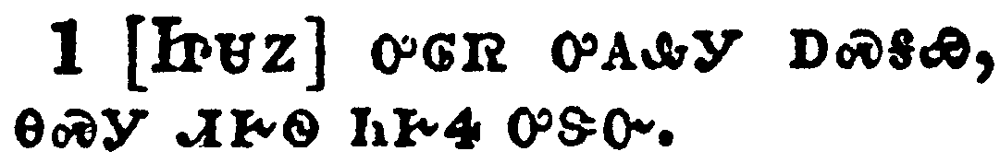</a></td>
</tr>
<tr class="even">
<td>And as Jesus passed by, he saw a man which was blind from his birth.</td>
</tr>
<tr class="odd">
<td>[ᏥᏌᏃ] ᎤᎶᏒ ᎤᎪᎲᎩ ᎠᏍᎦᏯ, ᎾᏍᎩ ᏗᎨᏫ ᏂᎨᏎ ᎤᏕᏅ.</td>
</tr>
<tr class="even">
<td>[Tsi-sa-no] u-lo-sv u-go-hv-gi a-s-ga-ya, na-s-gi di-ge-wi ni-ge-se u-de-nv.</td>
</tr>
</tbody>
</table>

<table>
<tbody>
<tr class="odd">
<td><a href="040902.png">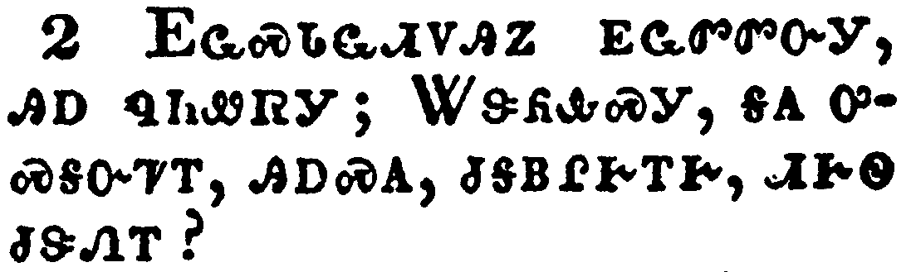</a></td>
</tr>
<tr class="even">
<td>And his disciples asked him, saying, Master, who did sin, this man, or his parents, that he was born blind?</td>
</tr>
<tr class="odd">
<td>ᎬᏩᏍᏓᏩᏗᏙᎯᏃ ᎬᏩᏛᏛᏅᎩ, ᎯᎠ ᏄᏂᏪᏒᎩ; ᏔᏕᏲᎲᏍᎩ, ᎦᎪ ᎤᏍᎦᏅᏤᎢ, ᎯᎠᏍᎪ, ᏧᎦᏴᎵᎨᎢᎨ, ᏗᎨᏫ ᏧᏕᏁᎢ?</td>
</tr>
<tr class="even">
<td>Gv-wa-s-da-wa-di-do-hi-no gv-wa-dv-dv-nv-gi, hi-a nu-ni-we-sv-gi; Ta-de-yo-hv-s-gi, ga-go u-s-ga-nv-tse-i, hi-a-s-go, tsu-ga-yv-li-ge-i-ge, di-ge-wi tsu-de-ne-i?</td>
</tr>
</tbody>
</table>

<table>
<tbody>
<tr class="odd">
<td><a href="040903.png">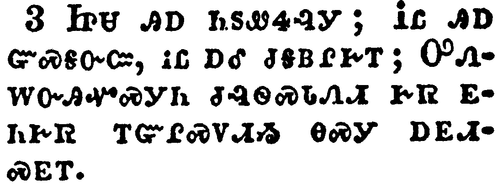</a></td>
</tr>
<tr class="even">
<td>Jesus answered, Neither hath this man sinned, nor his parents: but that the works of God should be made manifest in him.</td>
</tr>
<tr class="odd">
<td>ᏥᏌ ᎯᎠ ᏂᏚᏪᏎᎸᎩ; ᎥᏝ ᎯᎠ ᏳᏍᎦᏅᏨ, ᎥᏝ ᎠᎴ ᏧᎦᏴᎵᎨᎢ; ᎤᏁᎳᏅᎯᏉᏍᎩᏂ ᏧᎸᏫᏍᏓᏁᏗ ᎨᏒ ᎬᏂᎨᏒ ᎢᏳᎵᏍᏙᏗᏱ ᎾᏍᎩ ᎠᎬᏗᏍᎬᎢ.</td>
</tr>
<tr class="even">
<td>Tsi-sa hi-a ni-du-we-se-lv-gi; V-tla hi-a yu-s-ga-nv-tsv, v-tla a-le tsu-ga-yv-li-ge-i; U-ne-la-nv-hi-quo-s-gi-ni tsu-lv-wi-s-da-ne-di ge-sv gv-ni-ge-sv i-yu-li-s-do-di-yi na-s-gi a-gv-di-s-gv-i.</td>
</tr>
</tbody>
</table>

<table>
<tbody>
<tr class="odd">
<td><a href="040904.png">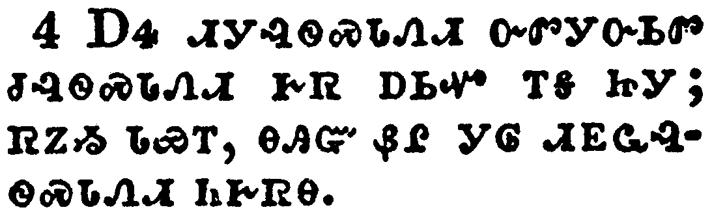</a></td>
</tr>
<tr class="even">
<td>I must work the works of him that sent me, while it is day: the night cometh, when no man can work.</td>
</tr>
<tr class="odd">
<td>ᎠᏎ ᏗᎩᎸᏫᏍᏓᏁᏗ ᏅᏛᎩᏅᏏᏛ ᏧᎸᏫᏍᏓᏁᏗ ᎨᏒ ᎠᏏᏉ ᎢᎦ ᏥᎩ; ᏒᏃᏱ ᏓᏯᎢ, ᎾᎯᏳ ᏰᎵ ᎩᎶ ᏗᎬᏩᎸᏫᏍᏓᏁᏗ ᏂᎨᏒᎾ.</td>
</tr>
<tr class="even">
<td>A-se di-gi-lv-wi-s-da-ne-di nv-dv-gi-nv-si-dv tsu-lv-wi-s-da-ne-di ge-sv a-si-quo i-ga tsi-gi; sv-no-yi da-ya-i, na-hi-yu ye-li gi-lo di-gv-wa-lv-wi-s-da-ne-di ni-ge-sv-na.</td>
</tr>
</tbody>
</table>

<table>
<tbody>
<tr class="odd">
<td><a href="040905.png">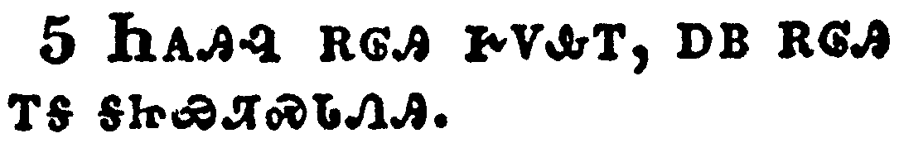</a></td>
</tr>
<tr class="even">
<td>As long as I am in the world, I am the light of the world.</td>
</tr>
<tr class="odd">
<td>ᏂᎪᎯᎸ ᎡᎶᎯ ᎨᏙᎲᎢ, ᎠᏴ ᎡᎶᎯ ᎢᎦ ᎦᏥᏯᏘᏍᏓᏁᎯ.</td>
</tr>
<tr class="even">
<td>Ni-go-hi-lv e-lo-hi ge-do-hv-i, a-yv e-lo-hi i-ga ga-tsi-ya-ti-s-da-ne-hi.</td>
</tr>
</tbody>
</table>

<table>
<tbody>
<tr class="odd">
<td><a href="040906.png">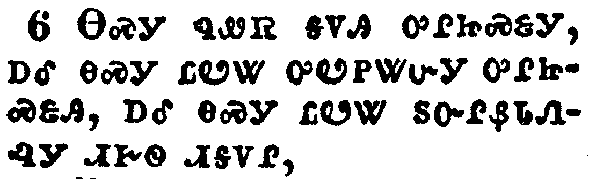</a></td>
</tr>
<tr class="even">
<td>When he had thus spoken, he spat on the ground, and made clay of the spittle, and he anointed the eyes of the blind man with the clay,</td>
</tr>
<tr class="odd">
<td>ᎾᏍᎩ ᏄᏪᏒ ᎦᏙᎯ ᎤᎵᏥᏍᏋᎩ, ᎠᎴ ᎾᏍᎩ ᏝᏬᏔ ᎤᏬᏢᏔᏅᎩ ᎤᎵᏥᏍᏋᎯ, ᎠᎴ ᎾᏍᎩ ᏝᏬᏔ ᏚᏅᎵᏰᏓᏁᎸᎩ ᏗᎨᏫ ᏗᎦᏙᎵ,</td>
</tr>
<tr class="even">
<td>Na-s-gi nu-we-sv ga-do-hi u-li-tsi-s-quv-gi, a-le na-s-gi tla-wo-ta u-wo-tlv-ta-nv-gi u-li-tsi-s-quv-hi, a-le na-s-gi tla-wo-ta du-nv-li-ye-da-ne-lv-gi di-ge-wi di-ga-do-li,</td>
</tr>
</tbody>
</table>

<table>
<tbody>
<tr class="odd">
<td><a href="040907.png">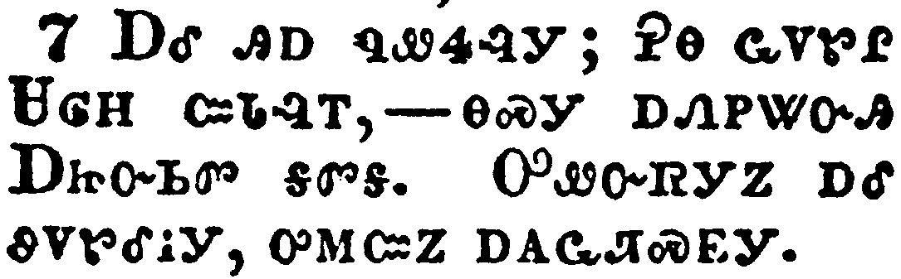</a></td>
</tr>
<tr class="even">
<td>And said unto him, Go, wash in the pool of Siloam, (which is by interpretation, Sent.) He went his way therefore, and washed, and came seeing.</td>
</tr>
<tr class="odd">
<td>ᎠᎴ ᎯᎠ ᏄᏪᏎᎸᎩ; ᎮᎾ ᏩᏙᏑᎵ ᏌᎶᎻ ᏨᏓᎸᎢ,^ᎾᏍᎩ ᎠᏁᏢᏔᏅᎯ ᎠᏥᏅᏏᏛ ᎦᏛᎦ. ᎤᏪᏅᏒᎩᏃ ᎠᎴ ᏭᏙᏑᎴᎥᎩ, ᎤᎷᏨᏃ ᎠᎪᏩᏘᏍᎬᎩ.</td>
</tr>
<tr class="even">
<td>A-le hi-a nu-we-se-lv-gi; He-na wa-do-su-li Sa-lo-mi tsv-da-lv-i,^na-s-gi a-ne-tlv-ta-nv-hi A-tsi-nv-si-dv ga-dv-ga. U-we-nv-sv-gi-no a-le wu-do-su-le-v-gi, u-lu-tsv-no a-go-wa-ti-s-gv-gi.</td>
</tr>
</tbody>
</table>

<table>
<tbody>
<tr class="odd">
<td><a href="040908.png">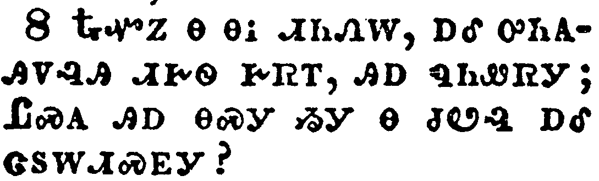</a></td>
</tr>
<tr class="even">
<td>The neighbours therefore, and they which before had seen him that he was blind, said, Is not this he that sat and begged?</td>
</tr>
<tr class="odd">
<td>ᎿᎭᏉᏃ Ꮎ ᎾᎥ ᏗᏂᏁᎳ, ᎠᎴ ᎤᏂᎪᎯᏙᎸᎯ ᏗᎨᏫ ᎨᏒᎢ, ᎯᎠ ᏄᏂᏪᏒᎩ; ᏝᏍᎪ ᎯᎠ ᎾᏍᎩ ᏱᎩ Ꮎ ᏧᏬᎸ ᎠᎴ ᏣᏚᎳᏗᏍᎬᎩ?</td>
</tr>
<tr class="even">
<td>Hna-quo-no na na-v di-ni-ne-la, a-le u-ni-go-hi-do-lv-hi di-ge-wi ge-sv-i, hi-a nu-ni-we-sv-gi; Tla-s-go hi-a na-s-gi yi-gi na tsu-wo-lv a-le tsa-du-la-di-s-gv-gi?</td>
</tr>
</tbody>
</table>

<table>
<tbody>
<tr class="odd">
<td><a href="040909.png">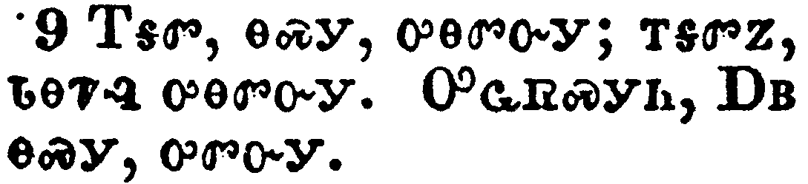</a></td>
</tr>
<tr class="even">
<td>Some said, This is he: others said, He is like him: but he said, I am he.</td>
</tr>
<tr class="odd">
<td>ᎢᎦᏛ, ᎾᏍᎩ, ᎤᎾᏛᏅᎩ; ᎢᎦᏛᏃ, ᏓᎾᏤᎸ ᎤᎾᏛᏅᎩ. ᎤᏩᏒᏍᎩᏂ, ᎠᏴ ᎾᏍᎩ, ᎤᏛᏅᎩ.</td>
</tr>
<tr class="even">
<td>I-ga-dv, na-s-gi, u-na-dv-nv-gi; i-ga-dv-no, da-na-tse-lv u-na-dv-nv-gi. U-wa-sv-s-gi-ni, A-yv na-s-gi, u-dv-nv-gi.</td>
</tr>
</tbody>
</table>

<table>
<tbody>
<tr class="odd">
<td><a href="040910.png">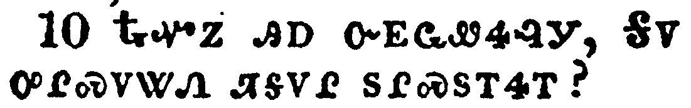</a></td>
</tr>
<tr class="even">
<td>Therefore said they unto him, How were thine eyes opened?</td>
</tr>
<tr class="odd">
<td>ᎿᎭᏉᏃ ᎯᎠ ᏅᎬᏩᏪᏎᎸᎩ, ᎦᏙ ᎤᎵᏍᏙᏔᏁ ᏘᎦᏙᎵ ᏚᎵᏍᏚᎢᏎᎢ?</td>
</tr>
<tr class="even">
<td>Hna-quo-no hi-a nv-gv-wa-we-se-lv-gi, Ga-do u-li-s-do-ta-ne ti-ga-do-li du-li-s-du-i-se-i?</td>
</tr>
</tbody>
</table>

<table>
<tbody>
<tr class="odd">
<td><a href="040911.png">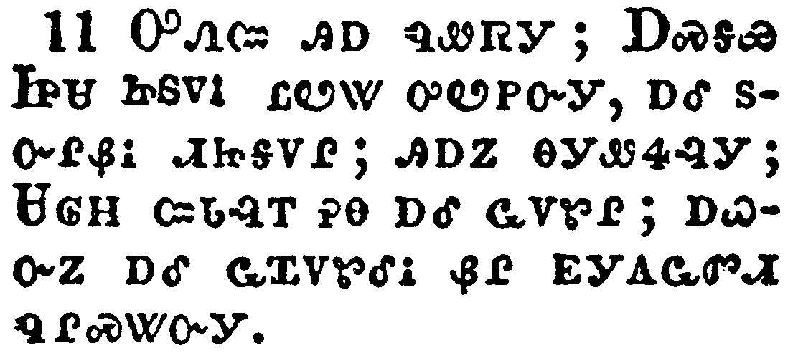</a></td>
</tr>
<tr class="even">
<td>He answered and said, A man that is called Jesus made clay, and anointed mine eyes, and said unto me, Go to the pool of Siloam, and wash: and I went and washed, and I received sight.</td>
</tr>
<tr class="odd">
<td>ᎤᏁᏨ ᎯᎠ ᏄᏪᏒᎩ; ᎠᏍᎦᏯ ᏥᏌ ᏥᏚᏙᎥ ᏝᏬᏔ ᎤᏬᏢᏅᎩ, ᎠᎴ ᏚᏅᎵᏰᎥ ᏗᏥᎦᏙᎵ; ᎯᎠᏃ ᎾᎩᏪᏎᎸᎩ; ᏌᎶᎻ ᏨᏓᎸᎢ ᎮᎾ ᎠᎴ ᏩᏙᏑᎵ; ᎠᏇᏅᏃ ᎠᎴ ᏩᏆᏙᏑᎴᎢ ᏰᎵ ᎬᎩᎪᏩᏛᏗ ᏄᎵᏍᏔᏅᎩ.</td>
</tr>
<tr class="even">
<td>U-ne-tsv hi-a nu-we-sv-gi; A-s-ga-ya Tsi-sa tsi-du-do-v tla-wo-ta u-wo-tlv-nv-gi, a-le du-nv-li-ye-v di-tsi-ga-do-li; hi-a-no na-gi-we-se-lv-gi; Sa-lo-mi tsv-da-lv-i he-na a-le wa-do-su-li; a-que-nv-no a-le wa-qua-do-su-le-i ye-li gv-gi-go-wa-dv-di nu-li-s-ta-nv-gi.</td>
</tr>
</tbody>
</table>

<table>
<tbody>
<tr class="odd">
<td><a href="040912.png">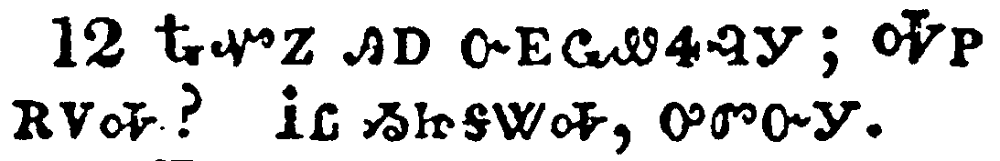</a></td>
</tr>
<tr class="even">
<td>Then said they unto him, Where is he? He said, I know not.</td>
</tr>
<tr class="odd">
<td>ᎿᎭᏉᏃ ᎯᎠ ᏅᎬᏩᏪᏎᎸᎩ; ᎭᏢ ᎡᏙᎭ? ᎥᏝ ᏱᏥᎦᏔᎭ, ᏅᏛᏅᎩ.</td>
</tr>
<tr class="even">
<td>Hna-quo-no hi-a nv-gv-wa-we-se-lv-gi; Ha-tlv e-do-ha? V-tla yi-tsi-ga-ta-ha, nv-dv-nv-gi.</td>
</tr>
</tbody>
</table>

<table>
<tbody>
<tr class="odd">
<td><a href="040913.png">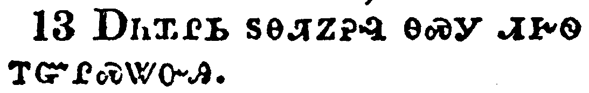</a></td>
</tr>
<tr class="even">
<td>They brought to the Pharisees him that aforetime was blind.</td>
</tr>
<tr class="odd">
<td>ᎠᏂᏆᎵᏏ ᏚᎾᏘᏃᎮᎸ ᎾᏍᎩ ᏗᎨᏫ ᎢᏳᎵᏍᏔᏅᎯ.</td>
</tr>
<tr class="even">
<td>A-ni-qua-li-si du-na-ti-no-he-lv na-s-gi di-ge-wi i-yu-li-s-ta-nv-hi.</td>
</tr>
</tbody>
</table>

<table>
<tbody>
<tr class="odd">
<td><a href="040914.png">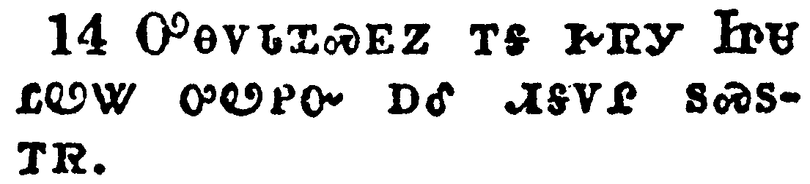</a></td>
</tr>
<tr class="even">
<td>And it was the sabbath day when Jesus made the clay, and opened his eyes.</td>
</tr>
<tr class="odd">
<td>ᎤᎾᏙᏓᏆᏍᎬᏃ ᎢᎦ ᎨᏒᎩ ᏥᏌ ᏝᏬᏔ ᎤᏬᏢᏅ ᎠᎴ ᏗᎦᏙᎵ ᏚᏍᏚᎢᏒ.</td>
</tr>
<tr class="even">
<td>U-na-do-da-qua-s-gv-no i-ga ge-sv-gi Tsi-sa tla-wo-ta u-wo-tlv-nv a-le di-ga-do-li du-s-du-i-sv.</td>
</tr>
</tbody>
</table>

<table>
<tbody>
<tr class="odd">
<td><a href="040915.png">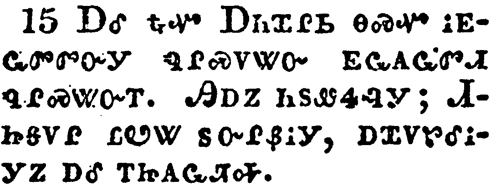</a></td>
</tr>
<tr class="even">
<td>Then again the Pharisees also asked him how he had received his sight. He said unto them, He put clay upon mine eyes, and I washed, and do see.</td>
</tr>
<tr class="odd">
<td>ᎠᎴ ᎿᎭᏉ ᎠᏂᏆᎵᏏ ᎾᏍᏉ ᎥᎬᏩᏛᏛᏅᎩ ᏄᎵᏍᏙᏔᏅ ᎬᏩᎪᏩᏛᏗ ᏄᎵᏍᏔᏅᎢ. ᎯᎠᏃ ᏂᏚᏪᏎᎸᎩ; ᏗᏥᎦᏙᎵ ᏝᏬᏔ ᏚᏅᎵᏰᎥᎩ, ᎠᏆᏙᏑᎴᎥᎩᏃ ᎠᎴ ᎢᏥᎪᏩᏘᎭ.</td>
</tr>
<tr class="even">
<td>A-le hna-quo A-ni-qua-li-si na-s-quo v-gv-wa-dv-dv-nv-gi nu-li-s-do-ta-nv gv-wa-go-wa-dv-di nu-li-s-ta-nv-i. Hi-a-no ni-du-we-se-lv-gi; Di-tsi-ga-do-li tla-wo-ta du-nv-li-ye-v-gi, a-qua-do-su-le-v-gi-no a-le i-tsi-go-wa-ti-ha.</td>
</tr>
</tbody>
</table>

<table>
<tbody>
<tr class="odd">
<td><a href="040916.png">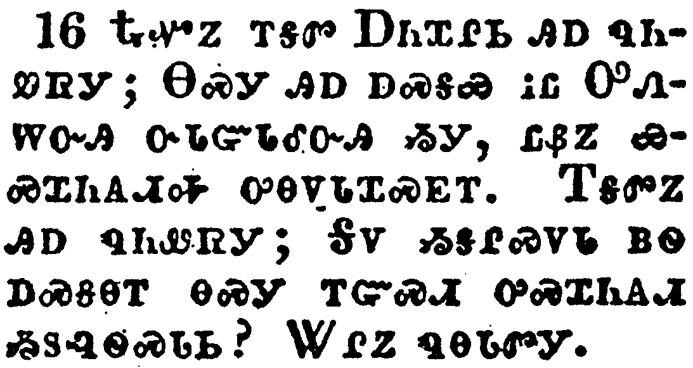</a></td>
</tr>
<tr class="even">
<td>Therefore said some of the Pharisees, This man is not of God, because he keepeth not the sabbath day. Others said, How can a man that is a sinner do such miracles? And there was a division among them.</td>
</tr>
<tr class="odd">
<td>ᎿᎭᏉᏃ ᎢᎦᏛ ᎠᏂᏆᎵᏏ ᎯᎠ ᏄᏂᏪᏒᎩ; ᎾᏍᎩ ᎯᎠ ᎠᏍᎦᏯ ᎥᏝ ᎤᏁᎳᏅᎯ ᏅᏓᏳᏓᎴᏅᎯ ᏱᎩ, ᏝᏰᏃ ᏯᏍᏆᏂᎪᏗᎭ ᎤᎾᏙᏓᏆᏍᎬᎢ. ᎢᎦᏛᏃ ᎯᎠ ᏄᏂᏪᏒᎩ; ᎦᏙ ᏱᎦᎵᏍᏙᏓ ᏴᏫ ᎠᏍᎦᎾᎢ ᎾᏍᎩ ᎢᏳᏍᏗ ᎤᏍᏆᏂᎪᏗ ᏱᏚᎸᏫᏍᏓᏏ? ᏔᎵᏃ ᏄᎾᏓᏛᎩ.</td>
</tr>
<tr class="even">
<td>Hna-quo-no i-ga-dv A-ni-qua-li-si hi-a nu-ni-we-sv-gi; Na-s-gi hi-a a-s-ga-ya v-tla U-ne-la-nv-hi nv-da-yu-da-le-nv-hi yi-gi, tla-ye-no ya-s-qua-ni-go-di-ha u-na-do-da-qua-s-gv-i. I-ga-dv-no hi-a nu-ni-we-sv-gi; Ga-do yi-ga-li-s-do-da yv-wi a-s-ga-na-i na-s-gi i-yu-s-di u-s-qua-ni-go-di yi-du-lv-wi-s-da-si? Ta-li-no nu-na-da-dv-gi.</td>
</tr>
</tbody>
</table>

<table>
<tbody>
<tr class="odd">
<td><a href="040917.png">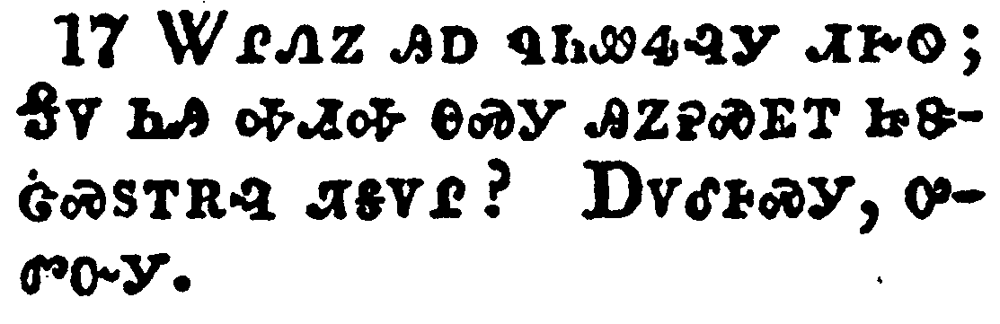</a></td>
</tr>
<tr class="even">
<td>They say unto the blind man again, What sayest thou of him, that he hath opened thine eyes? He said, He is a prophet.</td>
</tr>
<tr class="odd">
<td>ᏔᎵᏁᏃ ᎯᎠ ᏄᏂᏪᏎᎸᎩ ᏗᎨᏫ; ᎦᏙ ᏂᎯ ᎭᏗᎭ ᎾᏍᎩ ᎯᏃᎮᏍᎬᎢ ᏥᏕᏣᏍᏚᎢᎡᎸ ᏘᎦᏙᎵ? ᎠᏙᎴᎰᏍᎩ, ᎤᏛᏅᎩ.</td>
</tr>
<tr class="even">
<td>Ta-li-ne-no hi-a nu-ni-we-se-lv-gi di-ge-wi; Ga-do ni-hi ha-di-ha na-s-gi hi-no-he-s-gv-i tsi-de-tsa-s-du-i-e-lv ti-ga-do-li? A-do-le-ho-s-gi, u-dv-nv-gi.</td>
</tr>
</tbody>
</table>

<table>
<tbody>
<tr class="odd">
<td><a href="040918.png">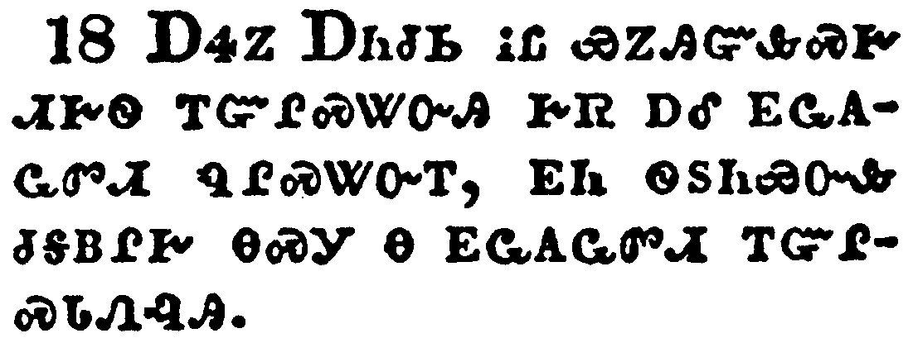</a></td>
</tr>
<tr class="even">
<td>But the Jews did not believe concerning him, that he had been blind, and received his sight, until they called the parents of him that had received his sight.</td>
</tr>
<tr class="odd">
<td>ᎠᏎᏃ ᎠᏂᏧᏏ ᎥᏝ ᏯᏃᎯᏳᎲᏍᎨ ᏗᎨᏫ ᎢᏳᎵᏍᏔᏅᎯ ᎨᏒ ᎠᎴ ᎬᏩᎪᏩᏛᏗ ᏄᎵᏍᏔᏅᎢ, ᎬᏂ ᏫᏚᏂᏯᏅᎲ ᏧᎦᏴᎵᎨ ᎾᏍᎩ Ꮎ ᎬᏩᎪᏩᏛᏗ ᎢᏳᎵᏍᏓᏁᎸᎯ.</td>
</tr>
<tr class="even">
<td>A-se-no A-ni-tsu-si v-tla ya-no-hi-yu-hv-s-ge di-ge-wi i-yu-li-s-ta-nv-hi ge-sv a-le gv-wa-go-wa-dv-di nu-li-s-ta-nv-i, gv-ni wi-du-ni-ya-nv-hv tsu-ga-yv-li-ge na-s-gi na gv-wa-go-wa-dv-di i-yu-li-s-da-ne-lv-hi.</td>
</tr>
</tbody>
</table>

<table>
<tbody>
<tr class="odd">
<td><a href="040919.png">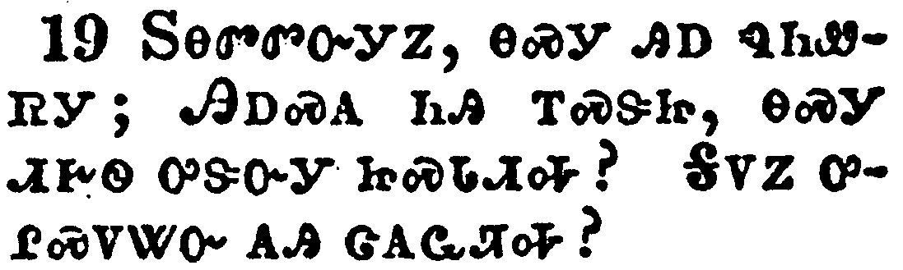</a></td>
</tr>
<tr class="even">
<td>And they asked them, saying, Is this your son, who ye say was born blind? how then doth he now see?</td>
</tr>
<tr class="odd">
<td>ᏚᎾᏛᏛᏅᎩᏃ, ᎾᏍᎩ ᎯᎠ ᏄᏂᏪᏒᎩ; ᎯᎠᏍᎪ ᏂᎯ ᎢᏍᏕᏥ, ᎾᏍᎩ ᏗᎨᏫ ᎤᏕᏅᎩ ᏥᏍᏓᏗᎭ? ᎦᏙᏃ ᎤᎵᏍᏙᏔᏅ ᎪᎯ ᏣᎪᏩᏘᎭ?</td>
</tr>
<tr class="even">
<td>Du-na-dv-dv-nv-gi-no, na-s-gi hi-a nu-ni-we-sv-gi; Hi-a-s-go ni-hi i-s-de-tsi, na-s-gi di-ge-wi u-de-nv-gi tsi-s-da-di-ha? Ga-do-no u-li-s-do-ta-nv go-hi tsa-go-wa-ti-ha?</td>
</tr>
</tbody>
</table>

<table>
<tbody>
<tr class="odd">
<td><a href="040920.png">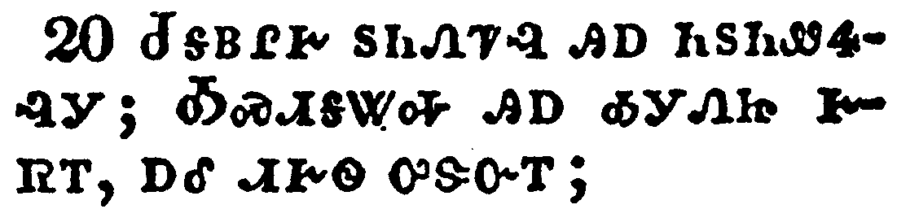</a></td>
</tr>
<tr class="even">
<td>His parents answered them and said, We know that this is our son, and that he was born blind:</td>
</tr>
<tr class="odd">
<td>ᏧᎦᏴᎵᎨ ᏚᏂᏁᏤᎸ ᎯᎠ ᏂᏚᏂᏪᏎᎸᎩ; ᎣᏍᏗᎦᏔᎭ ᎯᎠ ᎣᎩᏁᏥ ᎨᏒᎢ, ᎠᎴ ᏗᎨᏫ ᎤᏕᏅᎢ;</td>
</tr>
<tr class="even">
<td>Tsu-ga-yv-li-ge du-ni-ne-tse-lv hi-a ni-du-ni-we-se-lv-gi; O-s-di-ga-ta-ha hi-a o-gi-ne-tsi ge-sv-i, a-le di-ge-wi u-de-nv-i;</td>
</tr>
</tbody>
</table>

<table>
<tbody>
<tr class="odd">
<td><a href="040921.png">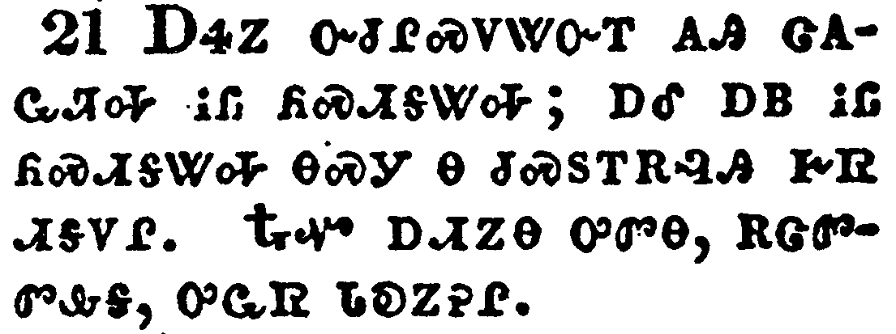</a></td>
</tr>
<tr class="even">
<td>But by what means he now seeth, we know not; or who hath opened his eyes, we know not: he is of age; ask him: he shall speak for himself.</td>
</tr>
<tr class="odd">
<td>ᎠᏎᏃ ᏅᏧᎵᏍᏙᏔᏅᎢ ᎪᎯ ᏣᎪᏩᏘᎭ ᎥᏝ ᏲᏍᏗᎦᏔᎭ; ᎠᎴ ᎠᏴ ᎥᏝ ᏲᏍᏗᎦᏔᎭ ᎾᏍᎩ Ꮎ ᏧᏍᏚᎢᎡᎸᎯ ᎨᏒ ᏗᎦᏙᎵ. ᎿᎭᏉ ᎠᏗᏃᎾ ᎤᏛᎾ, ᎡᏣᏛᏛᎲᎦ, ᎤᏩᏒ ᏓᎧᏃᎮᎵ.</td>
</tr>
<tr class="even">
<td>A-se-no nv-tsu-li-s-do-ta-nv-i go-hi tsa-go-wa-ti-ha v-tla yo-s-di-ga-ta-ha; a-le a-yv v-tla yo-s-di-ga-ta-ha na-s-gi na tsu-s-du-i-e-lv-hi ge-sv di-ga-do-li. Hna-quo a-di-no-na u-dv-na, e-tsa-dv-dv-hv-ga, u-wa-sv da-ka-no-he-li.</td>
</tr>
</tbody>
</table>

<table>
<tbody>
<tr class="odd">
<td><a href="040922.png">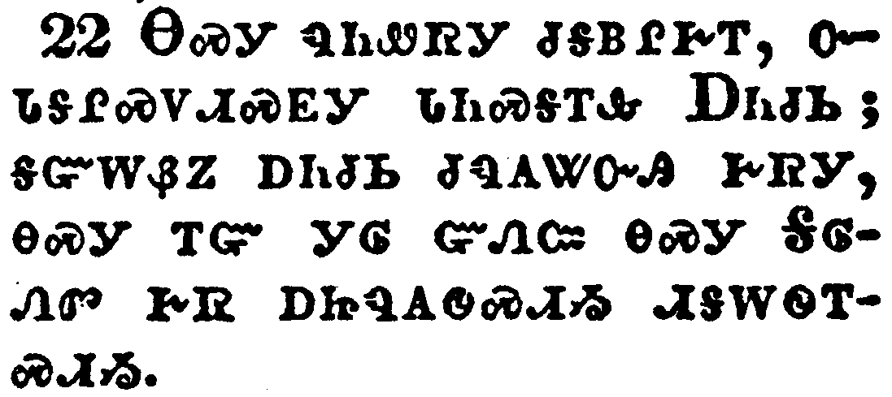</a></td>
</tr>
<tr class="even">
<td>These words spake his parents, because they feared the Jews: for the Jews had agreed already, that if any man did confess that he was Christ, he should be put out of the synagogue.</td>
</tr>
<tr class="odd">
<td>ᎾᏍᎩ ᏄᏂᏪᏒᎩ ᏧᎦᏴᎵᎨᎢ, ᏅᏓᎦᎵᏍᏙᏗᏍᎬᎩ ᏓᏂᏍᎦᎢᎲ ᎠᏂᏧᏏ; ᎦᏳᎳᏰᏃ ᎠᏂᏧᏏ ᏧᏄᎪᏔᏅᎯ ᎨᏒᎩ, ᎾᏍᎩ ᎢᏳ ᎩᎶ ᏳᏁᏨ ᎾᏍᎩ ᎦᎶᏁᏛ ᎨᏒ ᎠᏥᏄᎪᏫᏍᏗᏱ ᏗᎦᎳᏫᎢᏍᏗᏱ.</td>
</tr>
<tr class="even">
<td>Na-s-gi nu-ni-we-sv-gi tsu-ga-yv-li-ge-i, nv-da-ga-li-s-do-di-s-gv-gi da-ni-s-ga-i-hv A-ni-tsu-si; ga-yu-la-ye-no a-ni-tsu-si tsu-nu-go-ta-nv-hi ge-sv-gi, na-s-gi i-yu gi-lo yu-ne-tsv na-s-gi ga-lo-ne-dv ge-sv a-tsi-nu-go-wi-s-di-yi di-ga-la-wi-i-s-di-yi.</td>
</tr>
</tbody>
</table>

<table>
<tbody>
<tr class="odd">
<td><a href="040923.png">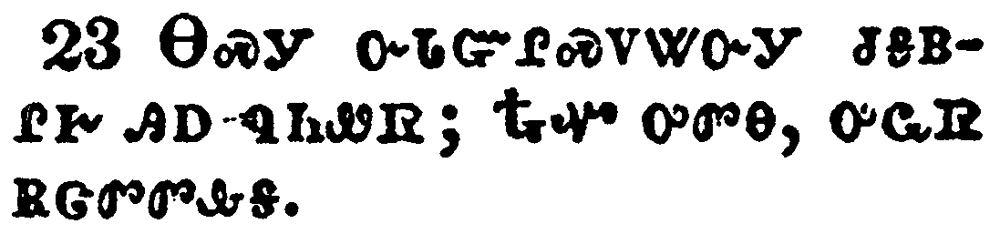</a></td>
</tr>
<tr class="even">
<td>Therefore said his parents, He is of age; ask him.</td>
</tr>
<tr class="odd">
<td>ᎾᏍᎩ ᏅᏓᏳᎵᏍᏙᏔᏅᎩ ᏧᎦᏴᎵᎨ ᎯᎠ ᏄᏂᏪᏒ; ᎿᎭᏉ ᎤᏛᎾ, ᎤᏩᏒ ᎡᏣᏛᏛᎲᎦ.</td>
</tr>
<tr class="even">
<td>Na-s-gi nv-da-yu-li-s-do-ta-nv-gi tsu-ga-yv-li-ge hi-a nu-ni-we-sv; Hna-quo u-dv-na, u-wa-sv e-tsa-dv-dv-hv-ga.</td>
</tr>
</tbody>
</table>

<table>
<tbody>
<tr class="odd">
<td><a href="040924.png">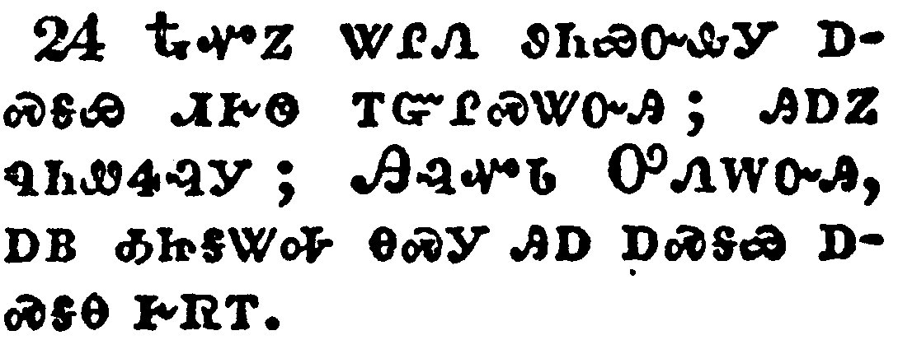</a></td>
</tr>
<tr class="even">
<td>Then again called they the man that was blind, and said unto him, Give God the praise: we know that this man is a sinner.</td>
</tr>
<tr class="odd">
<td>ᎿᎭᏉᏃ ᏔᎵᏁ ᏭᏂᏯᏅᎲᎩ ᎠᏍᎦᏯ ᏗᎨᏫ ᎢᏳᎵᏍᏔᏅᎯ; ᎯᎠᏃ ᏄᏂᏪᏎᎸᎩ; ᎯᎸᏉᏓ ᎤᏁᎳᏅᎯ, ᎠᏴ ᎣᏥᎦᏔᎭ ᎾᏍᎩ ᎯᎠ ᎠᏍᎦᏯ ᎠᏍᎦᎾ ᎨᏒᎢ.</td>
</tr>
<tr class="even">
<td>Hna-quo-no ta-li-ne wu-ni-ya-nv-hv-gi a-s-ga-ya di-ge-wi i-yu-li-s-ta-nv-hi; hi-a-no nu-ni-we-se-lv-gi; Hi-lv-quo-da U-ne-la-nv-hi, a-yv o-tsi-ga-ta-ha na-s-gi hi-a a-s-ga-ya a-s-ga-na ge-sv-i.</td>
</tr>
</tbody>
</table>

<table>
<tbody>
<tr class="odd">
<td></td>
</tr>
<tr class="even">
<td>He answered and said, Whether he be a sinner or no, I know not: one thing I know, that, whereas I was blind, now I see.</td>
</tr>
<tr class="odd">
<td>ᎿᎭᏉᏃ ᎤᏁᏨᎩ ᎯᎠ ᏄᏪᏒᎩ; ᎢᏳᏃ ᎠᏍᎦᎾ ᏱᎩ ᎥᏝ ᏱᏥᎦᏔᎭ; ᏑᏓᎴᎩ ᏥᎦᏔᎭ; ᏗᏥᎨᏫ ᏥᎨᏒᎩ ᎿᎭᏉ ᎢᏥᎪᏩᏘᎭ.</td>
</tr>
<tr class="even">
<td>Hna-quo-no u-ne-tsv-gi hi-a nu-we-sv-gi; I-yu-no a-s-ga-na yi-gi v-tla yi-tsi-ga-ta-ha; su-da-le-gi tsi-ga-ta-ha; di-tsi-ge-wi tsi-ge-sv-gi hna-quo i-tsi-go-wa-ti-ha.</td>
</tr>
</tbody>
</table>

<table>
<tbody>
<tr class="odd">
<td><a href="040926.png">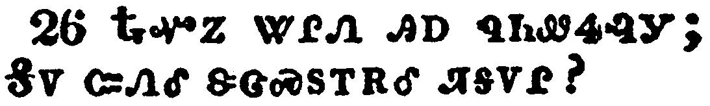</a></td>
</tr>
<tr class="even">
<td>Then said they to him again, What did he to thee? how opened he thine eyes?</td>
</tr>
<tr class="odd">
<td>ᎿᎭᏉᏃ ᏔᎵᏁ ᎯᎠ ᏄᏂᏪᏎᎸᎩ; ᎦᏙ ᏨᏁᎴ ᏕᏣᏍᏚᎢᎡᎴ ᏘᎦᏙᎵ?</td>
</tr>
<tr class="even">
<td>Hna-quo-no ta-li-ne hi-a nu-ni-we-se-lv-gi; Ga-do tsv-ne-le de-tsa-s-du-i-e-le ti-ga-do-li?</td>
</tr>
</tbody>
</table>

<table>
<tbody>
<tr class="odd">
<td><a href="040927.png">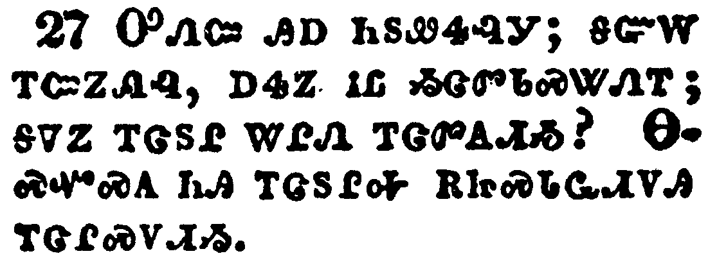</a></td>
</tr>
<tr class="even">
<td>He answered them, I have told you already, and ye did not hear: wherefore would ye hear it again? will ye also be his disciples?</td>
</tr>
<tr class="odd">
<td>ᎤᏁᏨ ᎯᎠ ᏂᏚᏪᏎᎸᎩ; ᎦᏳᎳ ᎢᏨᏃᏁᎸ, ᎠᏎᏃ ᎥᏝ ᏱᏣᏛᏓᏍᏔᏁᎢ; ᎦᏙᏃ ᎢᏣᏚᎵ ᏔᎵᏁ ᎢᏣᏛᎪᏗᏱ? ᎾᏍᏉᏍᎪ ᏂᎯ ᎢᏣᏚᎵᎭ ᎡᏥᏍᏓᏩᏗᏙᎯ ᎢᏣᎵᏍᏙᏗᏱ.</td>
</tr>
<tr class="even">
<td>U-ne-tsv hi-a ni-du-we-se-lv-gi; ga-yu-la i-tsv-no-ne-lv, a-se-no v-tla yi-tsa-dv-da-s-ta-ne-i; ga-do-no i-tsa-du-li ta-li-ne i-tsa-dv-go-di-yi? Na-s-quo-s-go ni-hi i-tsa-du-li-ha e-tsi-s-da-wa-di-do-hi i-tsa-li-s-do-di-yi.</td>
</tr>
</tbody>
</table>

<table>
<tbody>
<tr class="odd">
<td><a href="040928.png">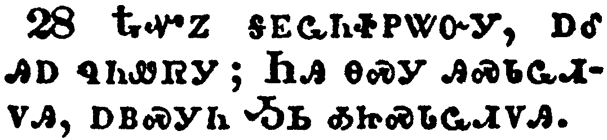</a></td>
</tr>
<tr class="even">
<td>Then they reviled him, and said, Thou art his disciple; but we are Moses' disciples.</td>
</tr>
<tr class="odd">
<td>ᎿᎭᏉᏃ ᎦᎬᏩᏂᏐᏢᏔᏅᎩ, ᎠᎴ ᎯᎠ ᏄᏂᏪᏒᎩ; ᏂᎯ ᎾᏍᎩ ᎯᏍᏓᏩᏗᏙᎯ, ᎠᏴᏍᎩᏂ ᎼᏏ ᎣᏥᏍᏓᏩᏗᏙᎯ.</td>
</tr>
<tr class="even">
<td>Hna-quo-no ga-gv-wa-ni-so-tlv-ta-nv-gi, a-le hi-a nu-ni-we-sv-gi; Ni-hi na-s-gi hi-s-da-wa-di-do-hi, a-yv-s-gi-ni Mo-si o-tsi-s-da-wa-di-do-hi.</td>
</tr>
</tbody>
</table>

<table>
<tbody>
<tr class="odd">
<td><a href="040929.png">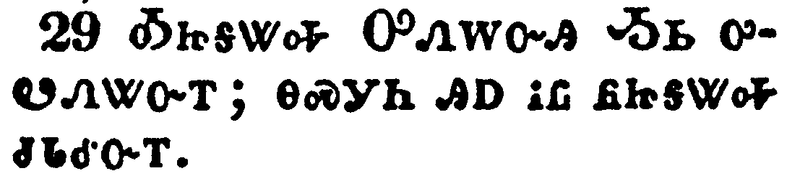</a></td>
</tr>
<tr class="even">
<td>We know that God spake unto Moses: as for this fellow, we know not from whence he is.</td>
</tr>
<tr class="odd">
<td>ᎣᏥᎦᏔᎭ ᎤᏁᎳᏅᎯ ᎼᏏ ᎤᏬᏁᏔᏅᎢ; ᎾᏍᎩᏂ ᎯᎠ ᎥᏝ ᏲᏥᎦᏔᎭᏧᏓᎴᏅᎢ.</td>
</tr>
<tr class="even">
<td>O-tsi-ga-ta-ha U-ne-la-nv-hi Mo-si u-wo-ne-ta-nv-i; na-s-gi-ni hi-a v-tla yo-tsi-ga-ta-ha-tsu-da-le-nv-i.</td>
</tr>
</tbody>
</table>

<table>
<tbody>
<tr class="odd">
<td><a href="040930.png">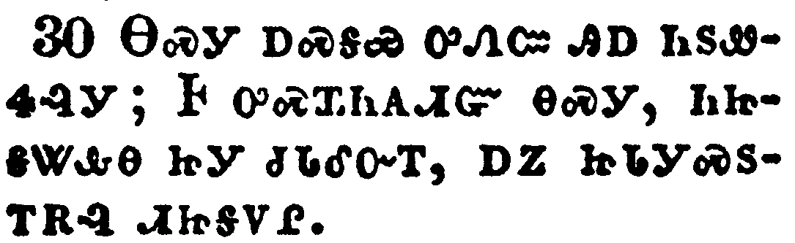</a></td>
</tr>
<tr class="even">
<td>The man answered and said unto them, Why herein is a marvellous thing, that ye know not from whence he is, and yet he hath opened mine eyes.</td>
</tr>
<tr class="odd">
<td>ᎾᏍᎩ ᎠᏍᎦᏯ ᎤᏁᏨ ᎯᎠ ᏂᏚᏪᏎᎸᎩ; Ꮀ ᎤᏍᏆᏂᎪᏗᏳ ᎾᏍᎩ, ᏂᏥᎦᏔᎲᎾ ᏥᎩ ᏧᏓᎴᏅᎢ, ᎠᏃ ᏥᏓᎩᏍᏚᎢᎡᎸ ᏗᏥᎦᏙᎵ.</td>
</tr>
<tr class="even">
<td>Na-s-gi a-s-ga-ya u-ne-tsv hi-a ni-du-we-se-lv-gi; Ho u-s-qua-ni-go-di-yu na-s-gi, ni-tsi-ga-ta-hv-na tsi-gi tsu-da-le-nv-i, a-no tsi-da-gi-s-du-i-e-lv di-tsi-ga-do-li.</td>
</tr>
</tbody>
</table>

<table>
<tbody>
<tr class="odd">
<td><a href="040931.png">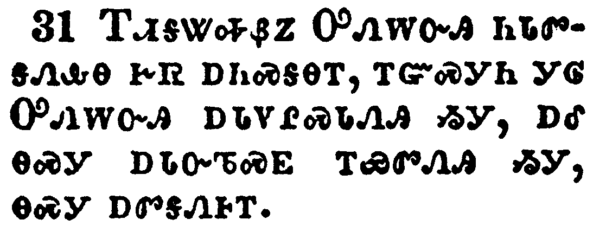</a></td>
</tr>
<tr class="even">
<td>Now we know that God heareth not sinners: but if any man be a worshipper of God, and doeth his will, him he heareth.</td>
</tr>
<tr class="odd">
<td>ᎢᏗᎦᏔᎭᏰᏃ ᎤᏁᎳᏅᎯ ᏂᏓᏛᎦᏁᎲᎾ ᎨᏒ ᎠᏂᏍᎦᎾᎢ, ᎢᏳᏍᎩᏂ ᎩᎶ ᎤᏁᎳᏅᎯ ᎠᏓᏙᎵᏍᏓᏁᎯ ᏱᎩ, ᎠᎴ ᎾᏍᎩ ᎠᏓᏅᏖᏍᎬ ᎢᏯᏛᏁᎯ ᏱᎩ, ᎾᏍᎩ ᎠᏛᎦᏁᎰᎢ.</td>
</tr>
<tr class="even">
<td>I-di-ga-ta-ha-ye-no U-ne-la-nv-hi ni-da-dv-ga-ne-hv-na ge-sv a-ni-s-ga-na-i, i-yu-s-gi-ni gi-lo U-ne-la-nv-hi a-da-do-li-s-da-ne-hi yi-gi, a-le na-s-gi a-da-nv-te-s-gv i-ya-dv-ne-hi yi-gi, na-s-gi a-dv-ga-ne-ho-i.</td>
</tr>
</tbody>
</table>

<table>
<tbody>
<tr class="odd">
<td><a href="040932.png">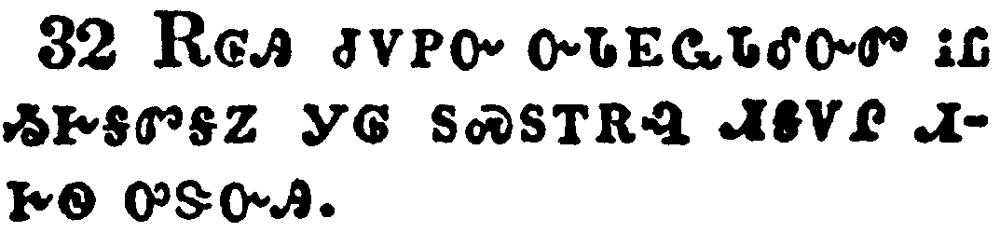</a></td>
</tr>
<tr class="even">
<td>Since the world began was it not heard that any man opened the eyes of one that was born blind.</td>
</tr>
<tr class="odd">
<td>ᎡᎶᎯ ᏧᏙᏢᏅ ᏅᏓᎬᏩᏓᎴᏅᏛ ᎥᏝ ᏱᎨᎦᏛᎦᏃ ᎩᎶ ᏚᏍᏚᎢᎡᎸ ᏗᎦᏙᎵ ᏗᎨᏫ ᎤᏕᏅᎯ.</td>
</tr>
<tr class="even">
<td>E-lo-hi tsu-do-tlv-nv nv-da-gv-wa-da-le-nv-dv v-tla yi-ge-ga-dv-ga-no gi-lo du-s-du-i-e-lv di-ga-do-li di-ge-wi u-de-nv-hi.</td>
</tr>
</tbody>
</table>

<table>
<tbody>
<tr class="odd">
<td><a href="040933.png">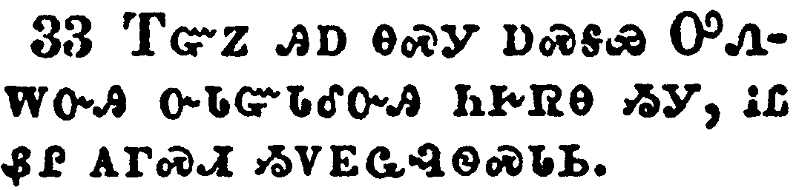</a></td>
</tr>
<tr class="even">
<td>If this man were not of God, he could do nothing.</td>
</tr>
<tr class="odd">
<td>ᎢᏳᏃ ᎯᎠ ᎾᏍᎩ ᎠᏍᎦᏯ ᎤᏁᎳᏅᎯ ᏅᏓᏳᏓᎴᏅᎯ ᏂᎨᏒᎾ ᏱᎩ, ᎥᏝ ᏰᎵ ᎪᎱᏍᏗ ᏱᏙᎬᏩᎸᏫᏍᏓᏏ.</td>
</tr>
<tr class="even">
<td>I-yu-no hi-a na-s-gi a-s-ga-ya U-ne-la-nv-hi nv-da-yu-da-le-nv-hi ni-ge-sv-na yi-gi, v-tla ye-li go-hu-s-di yi-do-gv-wa-lv-wi-s-da-si.</td>
</tr>
</tbody>
</table>

<table>
<tbody>
<tr class="odd">
<td><a href="040934.png">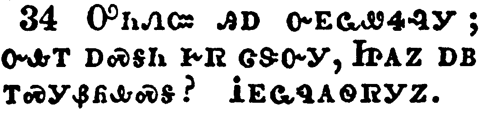</a></td>
</tr>
<tr class="even">
<td>They answered and said unto him, Thou wast altogether born in sins, and dost thou teach us? And they cast him out.</td>
</tr>
<tr class="odd">
<td>ᎤᏂᏁᏨ ᎯᎠ ᏅᎬᏩᏪᏎᎸᎩ; ᏅᎲᎢ ᎠᏍᎦᏂ ᎨᏒ ᏣᏕᏅᎩ, ᏥᎪᏃ ᎠᏴ ᎢᏍᎩᏰᏲᎲᏍᎦ? ᎥᎬᏩᏄᎪᏫᏒᎩᏃ.</td>
</tr>
<tr class="even">
<td>U-ni-ne-tsv hi-a nv-gv-wa-we-se-lv-gi; nv-hv-i a-s-ga-ni ge-sv tsa-de-nv-gi, Tsi-go-no a-yv i-s-gi-ye-yo-hv-s-ga? V-gv-wa-nu-go-wi-sv-gi-no.</td>
</tr>
</tbody>
</table>

<table>
<tbody>
<tr class="odd">
<td><a href="040935.png">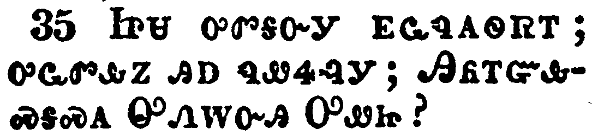</a></td>
</tr>
<tr class="even">
<td>Jesus heard that they had cast him out; and when he had found him, he said unto him, Dost thou believe on the Son of God?</td>
</tr>
<tr class="odd">
<td>ᏥᏌ ᎤᏛᎦᏅᎩ ᎬᏩᏄᎪᏫᏒᎢ; ᎤᏩᏛᎲᏃ ᎯᎠ ᏄᏪᏎᎸᎩ; ᎯᏲᎢᏳᎲᏍᎦᏍᎪ ᎤᏁᎳᏅᎯ ᎤᏪᏥ?</td>
</tr>
<tr class="even">
<td>Tsi-sa u-dv-ga-nv-gi gv-wa-nu-go-wi-sv-i; u-wa-dv-hv-no hi-a nu-we-se-lv-gi; Hi-yo-i-yu-hv-s-ga-s-go U-ne-la-nv-hi U-we-tsi?</td>
</tr>
</tbody>
</table>

<table>
<tbody>
<tr class="odd">
<td><a href="040936.png">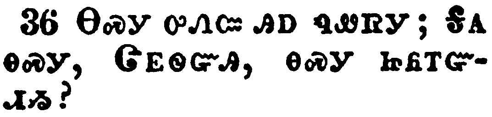</a></td>
</tr>
<tr class="even">
<td>He answered and said, Who is he, Lord, that I might believe on him?</td>
</tr>
<tr class="odd">
<td>ᎾᏍᎩ ᎤᏁᏨ ᎯᎠ ᏄᏪᏒᎩ; ᎦᎪ ᎾᏍᎩ, ᏣᎬᏫᏳᎯ, ᎾᏍᎩ ᏥᏲᎢᏳᏗᏱ?</td>
</tr>
<tr class="even">
<td>Na-s-gi u-ne-tsv hi-a nu-we-sv-gi; Ga-go na-s-gi, Tsa-gv-wi-yu-hi, na-s-gi tsi-yo-i-yu-di-yi?</td>
</tr>
</tbody>
</table>

<table>
<tbody>
<tr class="odd">
<td><a href="040937.png">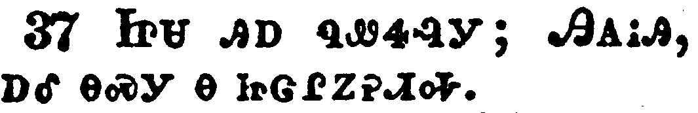</a></td>
</tr>
<tr class="even">
<td>And Jesus said unto him, Thou hast both seen him, and it is he that talketh with thee.</td>
</tr>
<tr class="odd">
<td>ᏥᏌ ᎯᎠ ᏄᏪᏎᎸᎩ; ᎯᎪᎥᎯ, ᎠᎴ ᎾᏍᎩ Ꮎ ᏥᏣᎵᏃᎮᏗᎭ.</td>
</tr>
<tr class="even">
<td>Tsi-sa hi-a nu-we-se-lv-gi; Hi-go-v-hi, a-le na-s-gi na tsi-tsa-li-no-he-di-ha.</td>
</tr>
</tbody>
</table>

<table>
<tbody>
<tr class="odd">
<td><a href="040938.png">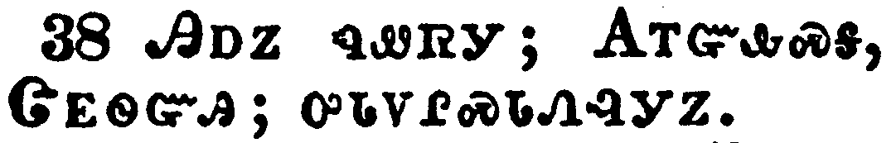</a></td>
</tr>
<tr class="even">
<td>And he said, Lord, I believe. And he worshipped him.</td>
</tr>
<tr class="odd">
<td>ᎯᎠᏃ ᏄᏪᏒᎩ; ᎪᎢᏳᎲᏍᎦ, ᏣᎬᏫᏳᎯ; ᎤᏓᏙᎵᏍᏓᏁᎸᎩᏃ.</td>
</tr>
<tr class="even">
<td>Hi-a-no nu-we-sv-gi; Go-i-yu-hv-s-ga, Tsa-gv-wi-yu-hi; u-da-do-li-s-da-ne-lv-gi-no.</td>
</tr>
</tbody>
</table>

<table>
<tbody>
<tr class="odd">
<td><a href="040939.png">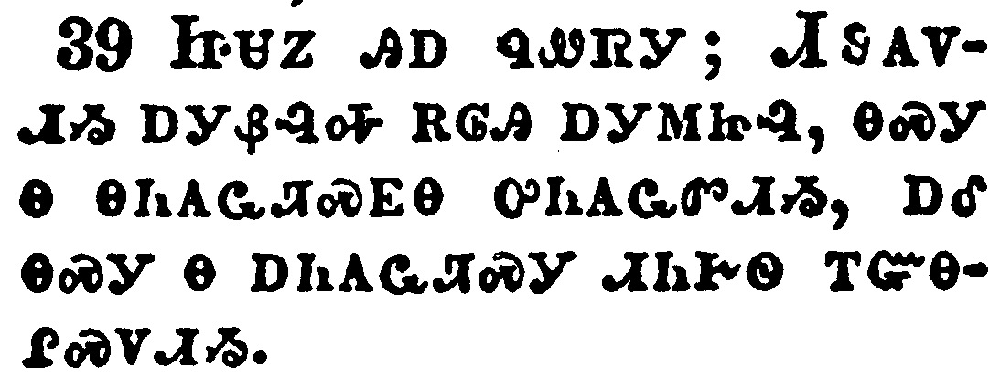</a></td>
</tr>
<tr class="even">
<td>And Jesus said, For judgment I am come into this world, that they which see not might see; and that they which see might be made blind.</td>
</tr>
<tr class="odd">
<td>ᏥᏌᏃ ᎯᎠ ᏄᏪᏒᎩ; ᏗᏬᎪᏙᏗᏱ ᎠᎩᏰᎸᎭ ᎡᎶᎯ ᎠᎩᎷᏥᎸ, ᎾᏍᎩ Ꮎ ᎾᏂᎪᏩᏘᏍᎬᎾ ᎤᏂᎪᏩᏛᏗᏱ, ᎠᎴ ᎾᏍᎩ Ꮎ ᎠᏂᎪᏩᏘᏍᎩ ᏗᏂᎨᏫ ᎢᏳᎾᎵᏍᏙᏗᏱ.</td>
</tr>
<tr class="even">
<td>Tsi-sa-no hi-a nu-we-sv-gi; Di-wo-go-do-di-yi a-gi-ye-lv-ha e-lo-hi a-gi-lu-tsi-lv, na-s-gi na na-ni-go-wa-ti-s-gv-na u-ni-go-wa-dv-di-yi, a-le na-s-gi na a-ni-go-wa-ti-s-gi di-ni-ge-wi i-yu-na-li-s-do-di-yi.</td>
</tr>
</tbody>
</table>

<table>
<tbody>
<tr class="odd">
<td></td>
</tr>
<tr class="even">
<td>And some of the Pharisees which were with him heard these words, and said unto him, Are we blind also?</td>
</tr>
<tr class="odd">
<td>ᎠᏂᏆᎵᏏᏃ ᎡᏙᎲ ᎠᏁᏙᎯ ᎾᏍᎩ ᎤᎾᏛᎦᏅᎩ, ᎠᎴ ᎯᎠ ᏅᎬᏩᏪᏎᎸᎩ; ᏥᎪ ᎾᏍᏉ ᎠᏴ ᏦᏥᎨᏫ?</td>
</tr>
<tr class="even">
<td>A-ni-qua-li-si-no e-do-hv a-ne-do-hi na-s-gi u-na-dv-ga-nv-gi, a-le hi-a nv-gv-wa-we-se-lv-gi; Tsi-go na-s-quo a-yv tso-tsi-ge-wi?</td>
</tr>
</tbody>
</table>

<table>
<tbody>
<tr class="odd">
<td><a href="040941.png">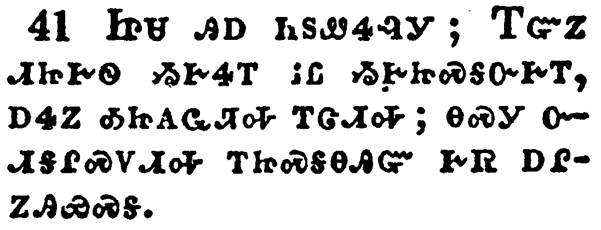</a></td>
</tr>
<tr class="even">
<td>Jesus said unto them, If ye were blind, ye should have no sin: but now ye say, We see; therefore your sin remaineth.</td>
</tr>
<tr class="odd">
<td>ᏥᏌ ᎯᎠ ᏂᏚᏪᏎᎸᎩ; ᎢᏳᏃ ᏗᏥᎨᏫ ᏱᎨᏎᎢ ᎥᏝ ᏱᎨᏥᏍᎦᏅᎨᎢ, ᎠᏎᏃ ᎣᏥᎪᏩᏘᎭ ᎢᏣᏗᎭ; ᎾᏍᎩ ᏅᏗᎦᎵᏍᏙᏗᎭ ᎢᏥᏍᎦᎾᎯᏳ ᎨᏒ ᎠᎵᏃᎯᏯᏍᎦ.</td>
</tr>
<tr class="even">
<td>Tsi-sa hi-a ni-du-we-se-lv-gi; I-yu-no di-tsi-ge-wi yi-ge-se-i v-tla yi-ge-tsi-s-ga-nv-ge-i, a-se-no o-tsi-go-wa-ti-ha i-tsa-di-ha; na-s-gi nv-di-ga-li-s-do-di-ha i-tsi-s-ga-na-hi-yu ge-sv a-li-no-hi-ya-s-ga.</td>
</tr>
</tbody>
</table>

