+++
draft=false
date = 2014-12-18T21:11:07Z
title = "John - Chapter 16 - Cherokee New Testament"
weight = 1418955067

[taxonomies]

authors = ["Timothy Legg"]
categories = []
tags = []

[extra]
+++

<table>
<tbody>
<tr class="odd">
<td><a href="041601.png">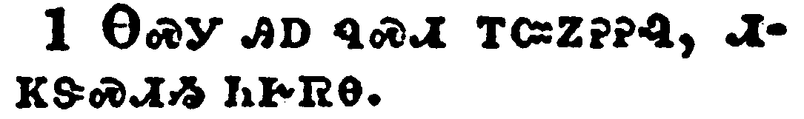</a></td>
</tr>
<tr class="even">
<td>These things have I spoken unto you, that ye should not be offended.</td>
</tr>
<tr class="odd">
<td>ᎾᏍᎩ ᎯᎠ ᏄᏍᏗ ᎢᏨᏃᎮᎮᎸ, ᏗᏦᏕᏍᏗᏱ ᏂᎨᏒᎾ.</td>
</tr>
<tr class="even">
<td>Na-s-gi hi-a nu-s-di i-tsv-no-he-he-lv, di-tso-de-s-di-yi ni-ge-sv-na.</td>
</tr>
</tbody>
</table>

<table>
<tbody>
<tr class="odd">
<td><a href="041602.png">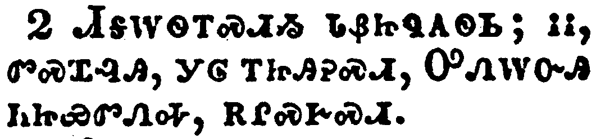</a></td>
</tr>
<tr class="even">
<td>They shall put you out of the synagogues: yea, the time cometh, that whosoever killeth you will think that he doeth God service.</td>
</tr>
<tr class="odd">
<td>ᏗᎦᎳᏫᎢᏍᏗᏱ ᏓᏰᏥᏄᎪᏫᏏ; ᎥᎥ, ᏛᏍᏆᎸᎯ, ᎩᎶ ᎢᏥᎯᎮᏍᏗ, ᎤᏁᎳᏅᎯ ᏂᏥᏯᏛᏁᎭ, ᎡᎵᏍᎨᏍᏗ.</td>
</tr>
<tr class="even">
<td>Di-ga-la-wi-i-s-di-yi da-ye-tsi-nu-go-wi-si; v-v, dv-s-qua-lv-hi, gi-lo i-tsi-hi-he-s-di, U-ne-la-nv-hi ni-tsi-ya-dv-ne-ha, e-li-s-ge-s-di.</td>
</tr>
</tbody>
</table>

<table>
<tbody>
<tr class="odd">
<td><a href="041603.png">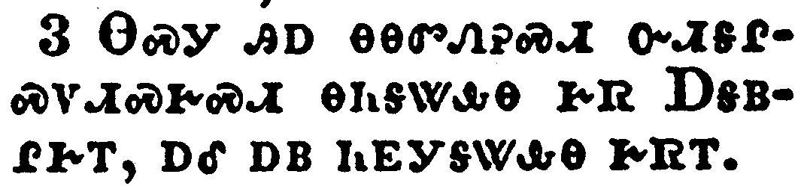</a></td>
</tr>
<tr class="even">
<td>And these things will they do unto you, because they have not known the Father, nor me.</td>
</tr>
<tr class="odd">
<td>ᎾᏍᎩ ᎯᎠ ᎾᎾᏛᏁᎮᏍᏗ ᏅᏗᎦᎵᏍᏙᏗᏍᎨᏍᏗ ᎾᏂᎦᏔᎲᎾ ᎨᏒ ᎠᎦᏴᎵᎨᎢ, ᎠᎴ ᎠᏴ ᏂᎬᎩᎦᏔᎲᎾ ᎨᏒᎢ.</td>
</tr>
<tr class="even">
<td>Na-s-gi hi-a na-na-dv-ne-he-s-di nv-di-ga-li-s-do-di-s-ge-s-di na-ni-ga-ta-hv-na ge-sv A-ga-yv-li-ge-i, a-le a-yv ni-gv-gi-ga-ta-hv-na ge-sv-i.</td>
</tr>
</tbody>
</table>

<table>
<tbody>
<tr class="odd">
<td><a href="041604.png">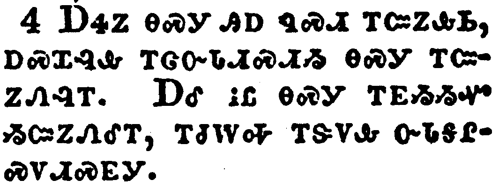</a></td>
</tr>
<tr class="even">
<td>But these things have I told you, that when the time shall come, ye may remember that I told you of them. And these things I said not unto you at the beginning, because I was with you.</td>
</tr>
<tr class="odd">
<td>ᎠᏎᏃ ᎾᏍᎩ ᎯᎠ ᏄᏍᏗ ᎢᏨᏃᎲᏏ, ᎠᏍᏆᎸᎲ ᎢᏣᏅᏓᏗᏍᏗᏱ ᎾᏍᎩ ᎢᏨᏃᏁᎸᎢ. ᎠᎴ ᎥᏝ ᎾᏍᎩ ᎢᎬᏱᏱᏉ ᏱᏨᏃᏁᎴᎢ, ᎢᏧᎳᎭ ᎢᏕᏙᎲ ᏅᏓᎦᎵᏍᏙᏗᏍᎬᎩ.</td>
</tr>
<tr class="even">
<td>A-se-no na-s-gi hi-a nu-s-di i-tsv-no-hv-si, a-s-qua-lv-hv i-tsa-nv-da-di-s-di-yi na-s-gi i-tsv-no-ne-lv-i. A-le v-tla na-s-gi i-gv-yi-yi-quo yi-tsv-no-ne-le-i, i-tsu-la-ha i-de-do-hv nv-da-ga-li-s-do-di-s-gv-gi.</td>
</tr>
</tbody>
</table>

<table>
<tbody>
<tr class="odd">
<td><a href="041605.png">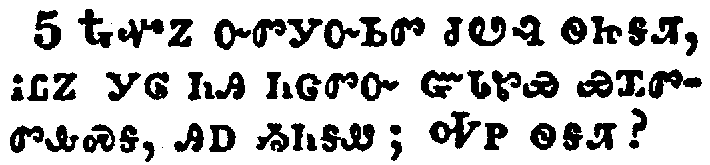</a></td>
</tr>
<tr class="even">
<td>But now I go my way to him that sent me; and none of you asketh me, Whither goest thou?</td>
</tr>
<tr class="odd">
<td>ᎿᎭᏉᏃ ᏅᏛᎩᏅᏏᏛ ᏧᏬᎸ ᏫᏥᎦᏘ, ᎥᏝᏃ ᎩᎶ ᏂᎯ ᏂᏣᏛᏅ ᏳᏓᏑᏯ ᏯᏆᏛᏛᎲᏍᎦ, ᎯᎠ ᏱᏂᎦᏪ; ᎭᏢ ᏫᎦᏘ?</td>
</tr>
<tr class="even">
<td>Hna-quo-no nv-dv-gi-nv-si-dv tsu-wo-lv wi-tsi-ga-ti, v-tla-no gi-lo ni-hi ni-tsa-dv-nv yu-da-su-ya ya-qua-dv-dv-hv-s-ga, hi-a yi-ni-ga-we; Ha-tlv wi-ga-ti?</td>
</tr>
</tbody>
</table>

<table>
<tbody>
<tr class="odd">
<td><a href="041606.png">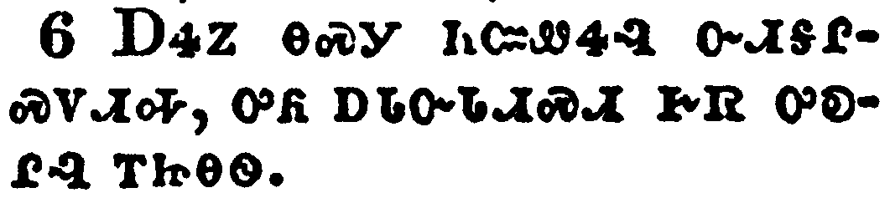</a></td>
</tr>
<tr class="even">
<td>But because I have said these things unto you, sorrow hath filled your heart.</td>
</tr>
<tr class="odd">
<td>ᎠᏎᏃ ᎾᏍᎩ ᏂᏨᏪᏎᎸ ᏅᏗᎦᎵᏍᏙᏗᎭ, ᎤᏲ ᎠᏓᏅᏓᏗᏍᏗ ᎨᏒ ᎤᎧᎵᎸ ᎢᏥᎾᏫ.</td>
</tr>
<tr class="even">
<td>A-se-no na-s-gi ni-tsv-we-se-lv nv-di-ga-li-s-do-di-ha, u-yo a-da-nv-da-di-s-di ge-sv u-ka-li-lv i-tsi-na-wi.</td>
</tr>
</tbody>
</table>

<table>
<tbody>
<tr class="odd">
<td><a href="041607.png">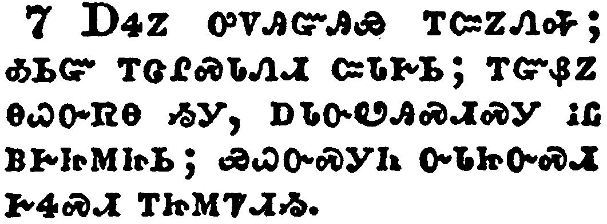</a></td>
</tr>
<tr class="even">
<td>Nevertheless I tell you the truth; It is expedient for you that I go away: for if I go not away, the Comforter will not come unto you; but if I depart, I will send him unto you.</td>
</tr>
<tr class="odd">
<td>ᎠᏎᏃ ᎤᏙᎯᏳᎯᏯ ᎢᏨᏃᏁᎭ; ᎣᏏᏳ ᎢᏣᎵᏍᏓᏁᏗ ᏨᏓᎨᏏ; ᎢᏳᏰᏃ ᎾᏇᏅᏒᎾ ᏱᎩ, ᎠᏓᏅᏬᎯᏍᏗᏍᎩ ᎥᏝ ᏴᎨᏥᎷᏥᏏ; ᏯᏇᏅᏍᎩᏂ ᏅᏓᏥᏅᏍᏗ ᎨᏎᏍᏗ ᎢᏥᎷᏤᏗᏱ.</td>
</tr>
<tr class="even">
<td>A-se-no u-do-hi-yu-hi-ya i-tsv-no-ne-ha; o-si-yu i-tsa-li-s-da-ne-di tsv-da-ge-si; i-yu-ye-no na-que-nv-sv-na yi-gi, a-da-nv-wo-hi-s-di-s-gi v-tla yv-ge-tsi-lu-tsi-si; ya-que-nv-s-gi-ni nv-da-tsi-nv-s-di ge-se-s-di i-tsi-lu-tse-di-yi.</td>
</tr>
</tbody>
</table>

<table>
<tbody>
<tr class="odd">
<td><a href="041608.png">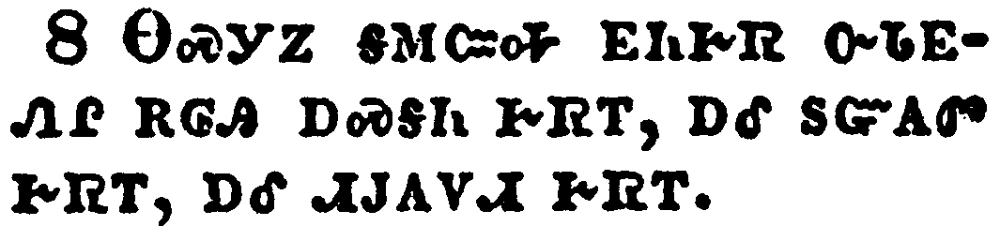</a></td>
</tr>
<tr class="even">
<td>And when he is come, he will reprove the world of sin, and of righteousness, and of judgment:</td>
</tr>
<tr class="odd">
<td>ᎾᏍᎩᏃ ᎦᎷᏨᎭ ᎬᏂᎨᏒ ᏅᏓᎬᏁᎵ ᎡᎶᎯ ᎠᏍᎦᏂ ᎨᏒᎢ, ᎠᎴ ᏚᏳᎪᏛ ᎨᏒᎢ, ᎠᎴ ᏗᎫᎪᏙᏗ ᎨᏒᎢ.</td>
</tr>
<tr class="even">
<td>Na-s-gi-no ga-lu-tsv-ha gv-ni-ge-sv nv-da-gv-ne-li e-lo-hi a-s-ga-ni ge-sv-i, a-le du-yu-go-dv ge-sv-i, a-le di-gu-go-do-di ge-sv-i.</td>
</tr>
</tbody>
</table>

<table>
<tbody>
<tr class="odd">
<td></td>
</tr>
<tr class="even">
<td>Of sin, because they believe not on me;</td>
</tr>
<tr class="odd">
<td>ᎠᏍᎦᏂ ᎨᏒᎢ, ᏂᎬᏉᎯᏳᎲᏍᎬᎾ ᎨᏒ ᎢᏳᏍᏗ;</td>
</tr>
<tr class="even">
<td>A-s-ga-ni ge-sv-i, ni-gv-quo-hi-yu-hv-s-gv-na ge-sv i-yu-s-di;</td>
</tr>
</tbody>
</table>

<table>
<tbody>
<tr class="odd">
<td><a href="041610.png">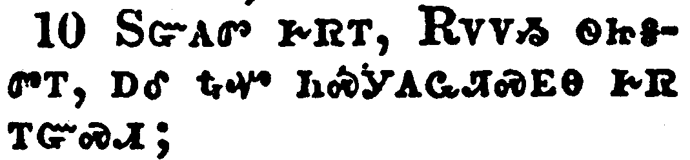</a></td>
</tr>
<tr class="even">
<td>Of righteousness, because I go to my Father, and ye see me no more;</td>
</tr>
<tr class="odd">
<td>ᏚᏳᎪᏛ ᎨᏒᎢ, ᎡᏙᏙᏱ ᏫᏥᎦᏛᎢ, ᎠᎴ ᎿᎭᏉ ᏂᏍᎩᎪᏩᏘᏍᎬᎾ ᎨᏒ ᎢᏳᏍᏗ;</td>
</tr>
<tr class="even">
<td>Du-yu-go-dv ge-sv-i, E-do-do-yi wi-tsi-ga-dv-i, a-le hna-quo ni-s-gi-go-wa-ti-s-gv-na ge-sv i-yu-s-di;</td>
</tr>
</tbody>
</table>

<table>
<tbody>
<tr class="odd">
<td><a href="041611.png">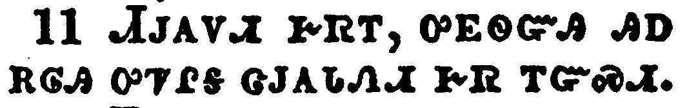</a></td>
</tr>
<tr class="even">
<td>Of judgment, because the prince of this world is judged.</td>
</tr>
<tr class="odd">
<td>ᏗᎫᎪᏙᏗ ᎨᏒᎢ, ᎤᎬᏫᏳᎯ ᎯᎠ ᎡᎶᎯ ᎤᏤᎵᎦ ᏣᎫᎪᏓᏁᏗ ᎨᏒ ᎢᏳᏍᏗ.</td>
</tr>
<tr class="even">
<td>Di-gu-go-do-di ge-sv-i, u-gv-wi-yu-hi hi-a e-lo-hi u-tse-li-ga tsa-gu-go-da-ne-di ge-sv i-yu-s-di.</td>
</tr>
</tbody>
</table>

<table>
<tbody>
<tr class="odd">
<td><a href="041612.png">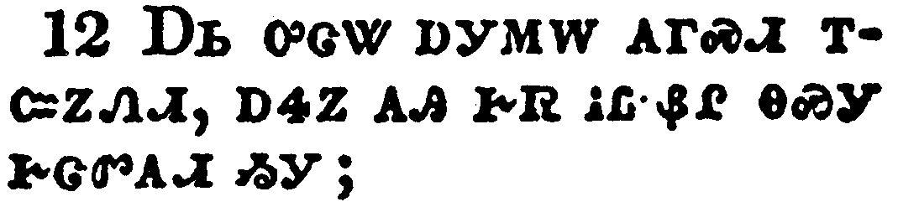</a></td>
</tr>
<tr class="even">
<td>I have yet many things to say unto you, but ye cannot bear them now.</td>
</tr>
<tr class="odd">
<td>ᎠᏏ ᎤᏣᏔ ᎠᎩᎷᎳ ᎪᎱᏍᏗ ᎢᏨᏃᏁᏗ, ᎠᏎᏃ ᎪᎯ ᎨᏒ ᎥᏝ ᏰᎵ ᎾᏍᎩ ᎨᏣᏛᎪᏗ ᏱᎩ;</td>
</tr>
<tr class="even">
<td>A-si u-tsa-ta a-gi-lu-la go-hu-s-di i-tsv-no-ne-di, a-se-no go-hi ge-sv v-tla ye-li na-s-gi ge-tsa-dv-go-di yi-gi;</td>
</tr>
</tbody>
</table>

<table>
<tbody>
<tr class="odd">
<td><a href="041613.png">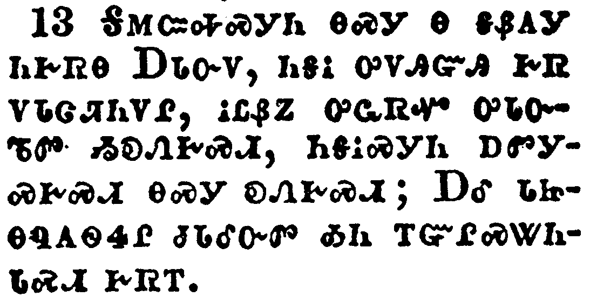</a></td>
</tr>
<tr class="even">
<td>Howbeit when he, the Spirit of truth, is come, he will guide you into all truth: for he shall not speak of himself; but whatsoever he shall hear, that shall he speak: and he will shew you things to come.</td>
</tr>
<tr class="odd">
<td>ᎦᎷᏨᎭᏍᎩᏂ ᎾᏍᎩ Ꮎ ᎦᏰᎪᎩ ᏂᎨᏒᎾ ᎠᏓᏅᏙ, ᏂᎦᎥ ᎤᏙᎯᏳᎯ ᎨᏒ ᏙᏓᏣᏘᏂᏙᎵ, ᎥᏝᏰᏃ ᎤᏩᏒᏉ ᎤᏓᏅᏖᏛ ᏱᎧᏁᎨᏍᏗ, ᏂᎦᎥᏍᎩᏂ ᎠᏛᎩᏍᎨᏍᏗ ᎾᏍᎩ ᎧᏁᎨᏍᏗ; ᎠᎴ ᏓᏥᎾᏄᎪᏫᏎᎵ ᏧᏓᎴᏅᏛ ᎣᏂ ᎢᏳᎵᏍᏔᏂᏓᏍᏗ ᎨᏒᎢ.</td>
</tr>
<tr class="even">
<td>Ga-lu-tsv-ha-s-gi-ni na-s-gi na ga-ye-go-gi ni-ge-sv-na A-da-nv-do, ni-ga-v u-do-hi-yu-hi ge-sv do-da-tsa-ti-ni-do-li, v-tla-ye-no u-wa-sv-quo u-da-nv-te-dv yi-ka-ne-ge-s-di, ni-ga-v-s-gi-ni a-dv-gi-s-ge-s-di na-s-gi ka-ne-ge-s-di; A-le da-tsi-na-nu-go-wi-se-li tsu-da-le-nv-dv o-ni i-yu-li-s-ta-ni-da-s-di ge-sv-i.</td>
</tr>
</tbody>
</table>

<table>
<tbody>
<tr class="odd">
<td><a href="041614.png">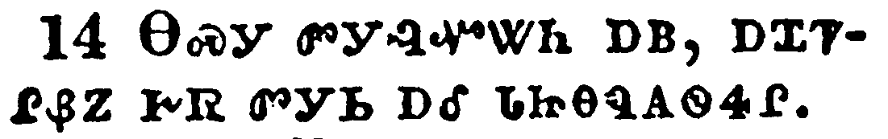</a></td>
</tr>
<tr class="even">
<td>He shall glorify me: for he shall receive of mine, and shall shew it unto you.</td>
</tr>
<tr class="odd">
<td>ᎾᏍᎩ ᏛᎩᎸᏉᏔᏂ ᎠᏴ, ᎠᏆᏤᎵᏰᏃ ᎨᏒ ᏛᎩᏏ ᎠᎴ ᏓᏥᎾᏄᎪᏫᏎᎵ.</td>
</tr>
<tr class="even">
<td>Na-s-gi dv-gi-lv-quo-ta-ni a-yv, a-qua-tse-li-ye-no ge-sv dv-gi-si a-le da-tsi-na-nu-go-wi-se-li.</td>
</tr>
</tbody>
</table>

<table>
<tbody>
<tr class="odd">
<td><a href="041615.png">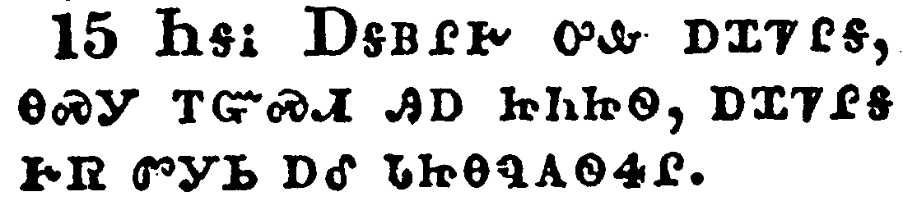</a></td>
</tr>
<tr class="even">
<td>All things that the Father hath are mine: therefore said I, that he shall take of mine, and shall shew it unto you.</td>
</tr>
<tr class="odd">
<td>ᏂᎦᎥ ᎠᎦᏴᎵᎨ ᎤᎲ ᎠᏆᏤᎵᎦ, ᎾᏍᎩ ᎢᏳᏍᏗ ᎯᎠ ᏥᏂᏥᏫ, ᎠᏆᏤᎵᎦ ᎨᏒ ᏛᎩᏏ ᎠᎴ ᏓᏥᎾᏄᎪᏫᏎᎵ.</td>
</tr>
<tr class="even">
<td>Ni-ga-v A-ga-yv-li-ge u-hv a-qua-tse-li-ga, na-s-gi i-yu-s-di hi-a tsi-ni-tsi-wi, a-qua-tse-li-ga ge-sv dv-gi-si a-le da-tsi-na-nu-go-wi-se-li.</td>
</tr>
</tbody>
</table>

<table>
<tbody>
<tr class="odd">
<td></td>
</tr>
<tr class="even">
<td>A little while, and ye shall not see me: and again, a little while, and ye shall see me, because I go to the Father.</td>
</tr>
<tr class="odd">
<td>ᏂᎪᎯᎸᎾᏉ ᎿᎭᏉ ᎥᏝ ᏱᏍᎩᎪᏩᏘᏍᎨᏍᏗ; ᎠᎴ ᎿᎭᏉ ᏔᎵᏁ ᏂᎪᎯᎸᎾᏉ ᎢᏍᎩᎪᏩᏘᏍᎨᏍᏗ; ᏅᏗᎦᎵᏍᏙᏗᎭ ᎠᎦᏴᎵᎨᏍᏛᏱ ᏫᏥᎦᏛᎢ.</td>
</tr>
<tr class="even">
<td>Ni-go-hi-lv-na-quo hna-quo v-tla yi-s-gi-go-wa-ti-s-ge-s-di; a-le hna-quo ta-li-ne ni-go-hi-lv-na-quo i-s-gi-go-wa-ti-s-ge-s-di; nv-di-ga-li-s-do-di-ha A-ga-yv-li-ge-s-dv-yi wi-tsi-ga-dv-i.</td>
</tr>
</tbody>
</table>

<table>
<tbody>
<tr class="odd">
<td><a href="041617.png">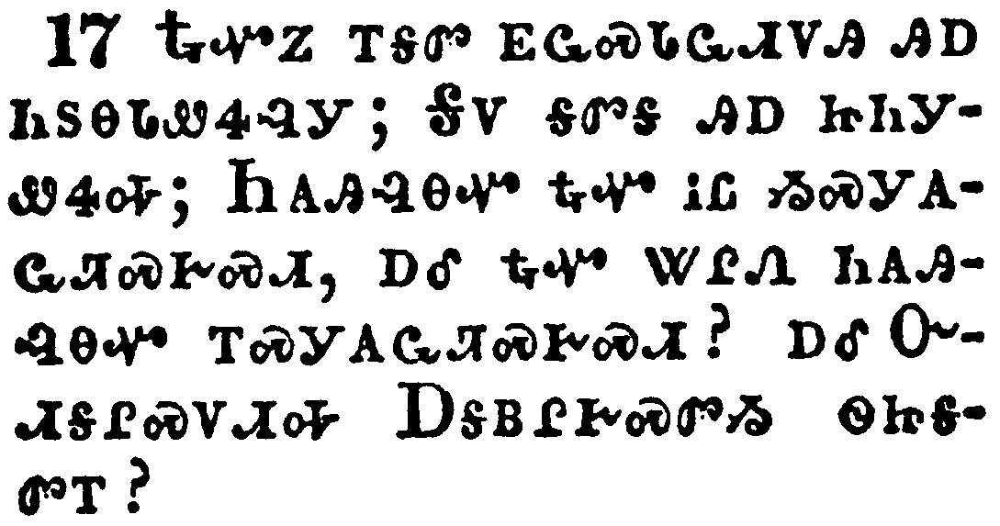</a></td>
</tr>
<tr class="even">
<td>Then said some of his disciples among themselves, What is this that he saith unto us, A little while, and ye shall not see me: and again, a little while, and ye shall see me: and, Because I go to the Father?</td>
</tr>
<tr class="odd">
<td>ᎿᎭᏉᏃ ᎢᎦᏛ ᎬᏩᏍᏓᏩᏗᏙᎯ ᎯᎠ ᏂᏚᎾᏓᏪᏎᎸᎩ; ᎦᏙ ᎦᏛᎦ ᎯᎠ ᏥᏂᎩᏪᏎᎭ; ᏂᎪᎯᎸᎾᏉ ᎿᎭᏉ ᎥᏝ ᏱᏍᎩᎪᏩᏘᏍᎨᏍᏗ, ᎠᎴ ᎿᎭᏉ ᏔᎵᏁ ᏂᎪᎯᎸᎾᏉ ᎢᏍᎩᎪᏩᏘᏍᎨᏍᏗ? ᎠᎴ ᏅᏗᎦᎵᏍᏙᏗᎭ ᎠᎦᏴᎵᎨᏍᏛᏱ ᏫᏥᎦᏛᎢ?</td>
</tr>
<tr class="even">
<td>Hna-quo-no i-ga-dv gv-wa-s-da-wa-di-do-hi hi-a ni-du-na-da-we-se-lv-gi; Ga-do ga-dv-ga hi-a tsi-ni-gi-we-se-ha; Ni-go-hi-lv-na-quo hna-quo v-tla yi-s-gi-go-wa-ti-s-ge-s-di, a-le hna-quo ta-li-ne ni-go-hi-lv-na-quo i-s-gi-go-wa-ti-s-ge-s-di? a-le Nv-di-ga-li-s-do-di-ha A-ga-yv-li-ge-s-dv-yi wi-tsi-ga-dv-i?</td>
</tr>
</tbody>
</table>

<table>
<tbody>
<tr class="odd">
<td><a href="041618.png">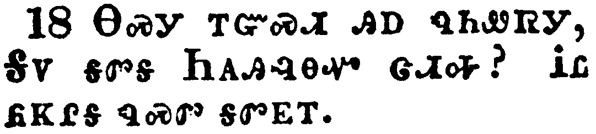</a></td>
</tr>
<tr class="even">
<td>They said therefore, What is this that he saith, A little while? we cannot tell what he saith.</td>
</tr>
<tr class="odd">
<td>ᎾᏍᎩ ᎢᏳᏍᏗ ᎯᎠ ᏄᏂᏪᏒᎩ, ᎦᏙ ᎦᏛᎦ ᏂᎪᎯᎸᎾᏉ ᏣᏗᎭ? ᎥᏝ ᏲᏦᎵᎦ ᏄᏍᏛ ᎦᏛᎬᎢ.</td>
</tr>
<tr class="even">
<td>Na-s-gi i-yu-s-di hi-a nu-ni-we-sv-gi, Ga-do ga-dv-ga Ni-go-hi-lv-na-quo tsa-di-ha? V-tla yo-tso-li-ga nu-s-dv ga-dv-gv-i.</td>
</tr>
</tbody>
</table>

<table>
<tbody>
<tr class="odd">
<td><a href="041619.png">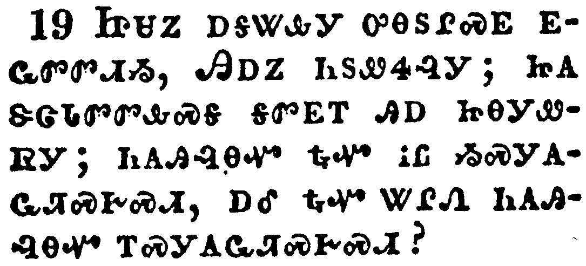</a></td>
</tr>
<tr class="even">
<td>Now Jesus knew that they were desirous to ask him, and said unto them, Do ye inquire among yourselves of that I said, A little while, and ye shall not see me: and again, a little while, and ye shall see me?</td>
</tr>
<tr class="odd">
<td>ᏥᏌᏃ ᎠᎦᏔᎲᎩ ᎤᎾᏚᎵᏍᎬ ᎬᏩᏛᏛᏗᏱ, ᎯᎠᏃ ᏂᏚᏪᏎᎸᎩ; ᏥᎪᏕᏣᏓᏛᏛᎲᏍᎦ ᎦᏛᎬᎢ ᎯᎠ ᏥᎾᎩᏪᏒᎩ; ᏂᎪᎯᎸᎾᏉ ᎿᎭᏉ ᎥᏝ ᏱᏍᎩᎪᏩᏘᏍᎨᏍᏗ, ᎠᎴ ᎿᎭᏉ ᏔᎵᏁ ᏂᎪᎯᎸᎾᏉ ᎢᏍᎩᎪᏩᏘᏍᎨᏍᏗ?</td>
</tr>
<tr class="even">
<td>Tsi-sa-no a-ga-ta-hv-gi u-na-du-li-s-gv gv-wa-dv-dv-di-yi, Hi-a-no ni-du-we-se-lv-gi; tsi-go-de-tsa-da-dv-dv-hv-s-ga ga-dv-gv-i hi-a tsi-na-gi-we-sv-gi; ni-go-hi-lv-na-quo hna-quo v-tla yi-s-gi-go-wa-ti-s-ge-s-di, a-le hna-quo ta-li-ne ni-go-hi-lv-na-quo i-s-gi-go-wa-ti-s-ge-s-di?</td>
</tr>
</tbody>
</table>

<table>
<tbody>
<tr class="odd">
<td><a href="041620.png">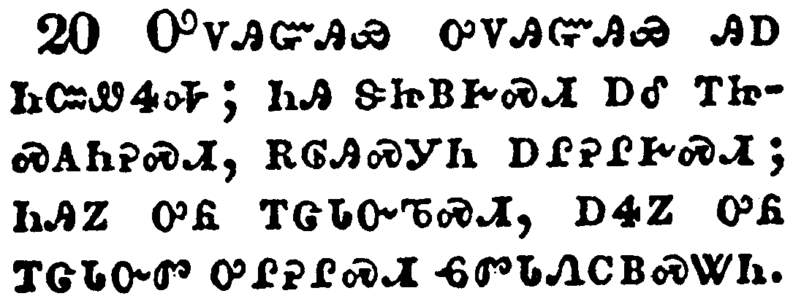</a></td>
</tr>
<tr class="even">
<td>Verily, verily, I say unto you, That ye shall weep and lament, but the world shall rejoice: and ye shall be sorrowful, but your sorrow shall be turned into joy.</td>
</tr>
<tr class="odd">
<td>ᎤᏙᎯᏳᎯᏯ ᎤᏙᎯᏳᎯᏯ ᎯᎠ ᏂᏨᏪᏎᎭ; ᏂᎯ ᏕᏥᏴᎨᏍᏗ ᎠᎴ ᎢᏥᏍᎪᏂᎮᏍᏗ, ᎡᎶᎯᏍᎩᏂ ᎠᎵᎮᎵᎨᏍᏗ; ᏂᎯᏃ ᎤᏲ ᎢᏣᏓᏅᏖᏍᏗ, ᎠᏎᏃ ᎤᏲ ᎢᏣᏓᏅᏛ ᎤᎵᎮᎵᏍᏗ ᏮᏛᏓᏁᏟᏴᏍᏔᏂ.</td>
</tr>
<tr class="even">
<td>U-do-hi-yu-hi-ya u-do-hi-yu-hi-ya hi-a ni-tsv-we-se-ha; ni-hi de-tsi-yv-ge-s-di a-le i-tsi-s-go-ni-he-s-di, e-lo-hi-s-gi-ni a-li-he-li-ge-s-di; ni-hi-no u-yo i-tsa-da-nv-te-s-di, a-se-no u-yo i-tsa-da-nv-dv u-li-he-li-s-di wv-dv-da-ne-tli-yv-s-ta-ni.</td>
</tr>
</tbody>
</table>

<table>
<tbody>
<tr class="odd">
<td><a href="041621.png">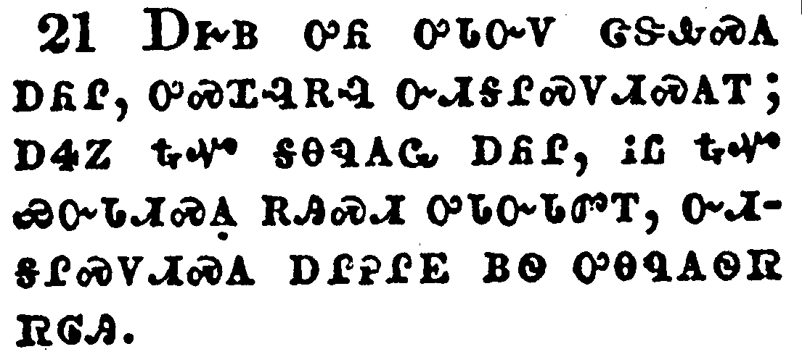</a></td>
</tr>
<tr class="even">
<td>A woman when she is in travail hath sorrow, because her hour is come: but as soon as she is delivered of the child, she remembereth no more the anguish, for joy that a man is born into the world.</td>
</tr>
<tr class="odd">
<td>ᎠᎨᏴ ᎤᏲ ᎤᏓᏅᏙ ᏣᏕᎲᏍᎪ ᎠᏲᎵ, ᎤᏍᏆᎸᎡᎸ ᏅᏗᎦᎵᏍᏙᏗᏍᎪᎢ; ᎠᏎᏃ ᎿᎭᏉ ᎦᎾᏄᎪᏩ ᎠᏲᎵ, ᎥᏝ ᎿᎭᏉ ᏯᏅᏓᏗᏍᎪ ᎡᎯᏍᏗ ᎤᏓᏅᏓᏛᎢ, ᏅᏗᎦᎵᏍᏙᏗᏍᎪ ᎠᎵᎮᎵᎬ ᏴᏫ ᎤᎾᏄᎪᏫᏒ ᏒᎶᎯ.</td>
</tr>
<tr class="even">
<td>A-ge-yv u-yo u-da-nv-do tsa-de-hv-s-go a-yo-li, u-s-qua-lv-e-lv nv-di-ga-li-s-do-di-s-go-i; a-se-no hna-quo ga-na-nu-go-wa a-yo-li, v-tla hna-quo ya-nv-da-di-s-go e-hi-s-di u-da-nv-da-dv-i, nv-di-ga-li-s-do-di-s-go a-li-he-li-gv yv-wi u-na-nu-go-wi-sv sv-lo-hi.</td>
</tr>
</tbody>
</table>

<table>
<tbody>
<tr class="odd">
<td><a href="041622.png">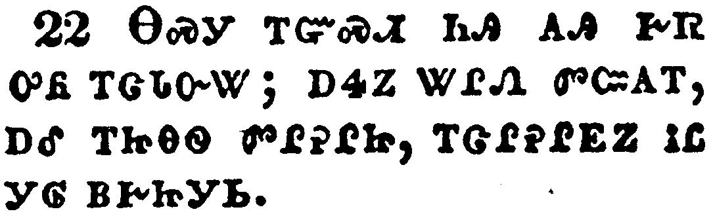</a></td>
</tr>
<tr class="even">
<td>And ye now therefore have sorrow: but I will see you again, and your heart shall rejoice, and your joy no man taketh from you.</td>
</tr>
<tr class="odd">
<td>ᎾᏍᎩ ᎢᏳᏍᏗ ᏂᎯ ᎪᎯ ᎨᏒ ᎤᏲ ᎢᏣᏓᏅᏔ; ᎠᏎᏃ ᏔᎵᏁ ᏛᏨᎪᎢ, ᎠᎴ ᎢᏥᎾᏫ ᏛᎵᎮᎵᏥ, ᎢᏣᎵᎮᎵᎬᏃ ᎥᏝ ᎩᎶ ᏴᎨᏥᎩᏏ.</td>
</tr>
<tr class="even">
<td>Na-s-gi i-yu-s-di ni-hi go-hi ge-sv u-yo i-tsa-da-nv-ta; a-se-no ta-li-ne dv-tsv-go-i, a-le i-tsi-na-wi dv-li-he-li-tsi, i-tsa-li-he-li-gv-no v-tla gi-lo yv-ge-tsi-gi-si.</td>
</tr>
</tbody>
</table>

<table>
<tbody>
<tr class="odd">
<td><a href="041623.png">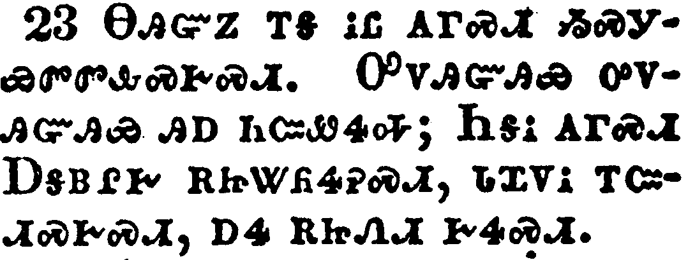</a></td>
</tr>
<tr class="even">
<td>And in that day ye shall ask me nothing. Verily, verily, I say unto you, Whatsoever ye shall ask the Father in my name, he will give it you.</td>
</tr>
<tr class="odd">
<td>ᎾᎯᏳᏃ ᎢᎦ ᎥᏝ ᎪᎱᏍᏗ ᏱᏍᎩᏯᏛᏛᎲᏍᎨᏍᏗ. ᎤᏙᎯᏳᎯᏯ ᎤᏙᎯᏳᎯᏯ ᎯᎠ ᏂᏨᏪᏎᎭ; ᏂᎦᎥ ᎪᎱᏍᏗ ᎠᎦᏴᎵᎨ ᎡᏥᏔᏲᏎᎮᏍᏗ, ᏓᏆᏙᎥ ᎢᏨᏗᏍᎨᏍᏗ, ᎠᏎ ᎡᏥᏁᏗ ᎨᏎᏍᏗ.</td>
</tr>
<tr class="even">
<td>Na-hi-yu-no i-ga v-tla go-hu-s-di yi-s-gi-ya-dv-dv-hv-s-ge-s-di. U-do-hi-yu-hi-ya u-do-hi-yu-hi-ya hi-a ni-tsv-we-se-ha; Ni-ga-v go-hu-s-di A-ga-yv-li-ge e-tsi-ta-yo-se-he-s-di, da-qua-do-v i-tsv-di-s-ge-s-di, a-se e-tsi-ne-di ge-se-s-di.</td>
</tr>
</tbody>
</table>

<table>
<tbody>
<tr class="odd">
<td><a href="041624.png">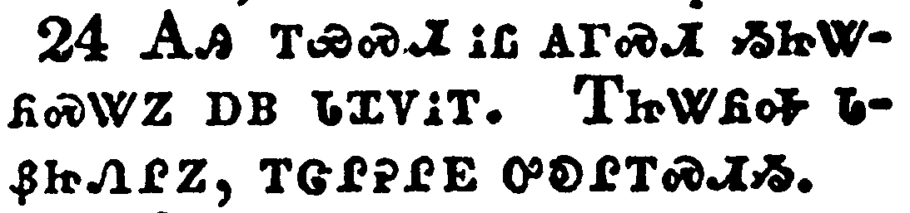</a></td>
</tr>
<tr class="even">
<td>Hitherto have ye asked nothing in my name: ask, and ye shall receive, that your joy may be full.</td>
</tr>
<tr class="odd">
<td>ᎪᎯ ᎢᏯᏍᏗ ᎥᏝ ᎪᎱᏍᏗ ᏱᏥᏔᏲᏍᏔᏃ ᎠᏴ ᏓᏉᏙᎥᎢ. ᎢᏥᏔᏲᎭ ᏓᏰᏥᏁᎵᏃ, ᎢᏣᎵᎮᎵᎬ ᎤᎧᎵᎢᏍᏗᏱ.</td>
</tr>
<tr class="even">
<td>Go-hi i-ya-s-di v-tla go-hu-s-di yi-tsi-ta-yo-s-ta-no a-yv da-quo-do-v-i. I-tsi-ta-yo-ha da-ye-tsi-ne-li-no, i-tsa-li-he-li-gv u-ka-li-i-s-di-yi.</td>
</tr>
</tbody>
</table>

<table>
<tbody>
<tr class="odd">
<td><a href="041625.png">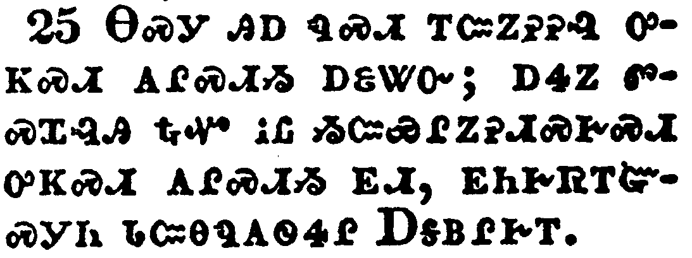</a></td>
</tr>
<tr class="even">
<td>These things have I spoken unto you in proverbs: but the time cometh, when I shall no more speak unto you in proverbs, but I shall shew you plainly of the Father.</td>
</tr>
<tr class="odd">
<td>ᎾᏍᎩ ᎯᎠ ᏄᏍᏗ ᎢᏨᏃᎮᎮᎸ ᎤᏦᏍᏗ ᎪᎵᏍᏗᏱ ᎠᏋᏔᏅ; ᎠᏎᏃ ᏛᏍᏆᎸᎯ ᎿᎭᏉ ᎥᏝ ᏱᏨᏯᎵᏃᎮᏗᏍᎨᏍᏗ ᎤᏦᏍᏗ ᎪᎵᏍᏗᏱ ᎬᏗ, ᎬᏂᎨᏒᎢᏳᏍᎩᏂ ᏓᏨᎾᏄᎪᏫᏎᎵ ᎠᎦᏴᎵᎨᎢ.</td>
</tr>
<tr class="even">
<td>Na-s-gi hi-a nu-s-di i-tsv-no-he-he-lv u-tso-s-di go-li-s-di-yi a-quv-ta-nv; a-se-no dv-s-qua-lv-hi hna-quo v-tla yi-tsv-ya-li-no-he-di-s-ge-s-di u-tso-s-di go-li-s-di-yi gv-di, gv-ni-ge-sv-i-yu-s-gi-ni da-tsv-na-nu-go-wi-se-li A-ga-yv-li-ge-i.</td>
</tr>
</tbody>
</table>

<table>
<tbody>
<tr class="odd">
<td><a href="041626.png">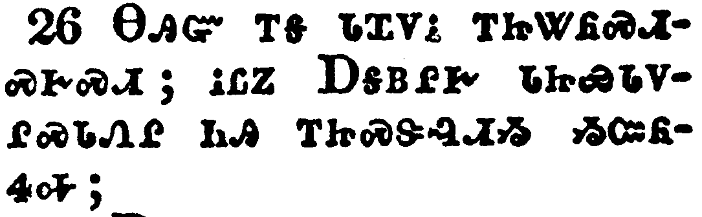</a></td>
</tr>
<tr class="even">
<td>At that day ye shall ask in my name: and I say not unto you, that I will pray the Father for you:</td>
</tr>
<tr class="odd">
<td>ᎾᎯᏳ ᎢᎦ ᏓᏆᏙᎥ ᎢᏥᏔᏲᏍᏗᏍᎨᏍᏗ; ᎥᏝᏃ ᎠᎦᏴᎵᎨ ᏓᏥᏯᏓᏙᎵᏍᏓᏁᎵ ᏂᎯ ᎢᏥᏍᏕᎸᏗᏱ ᏱᏨᏲᏎᎭ;</td>
</tr>
<tr class="even">
<td>Na-hi-yu i-ga da-qua-do-v i-tsi-ta-yo-s-di-s-ge-s-di; v-tla-no A-ga-yv-li-ge da-tsi-ya-da-do-li-s-da-ne-li ni-hi i-tsi-s-de-lv-di-yi yi-tsv-yo-se-ha;</td>
</tr>
</tbody>
</table>

<table>
<tbody>
<tr class="odd">
<td><a href="041627.png">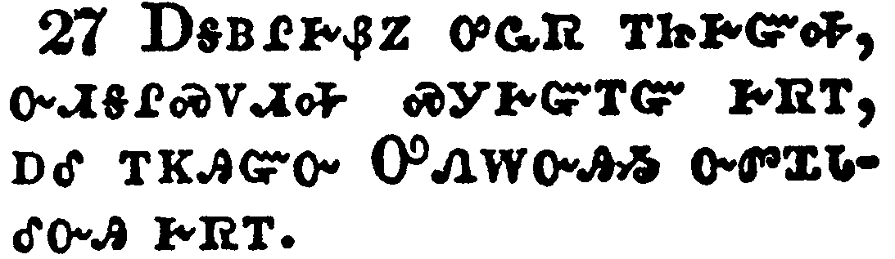</a></td>
</tr>
<tr class="even">
<td>For the Father himself loveth you, because ye have loved me, and have believed that I came out from God.</td>
</tr>
<tr class="odd">
<td>ᎠᎦᏴᎵᎨᏰᏃ ᎤᏩᏒ ᎢᏥᎨᏳᎭ, ᏅᏗᎦᎵᏍᏙᏗᎭ ᏍᎩᎨᏳᎢᏳ ᎨᏒᎢ, ᎠᎴ ᎢᏦᎯᏳᏅ ᎤᏁᎳᏅᎯᏱ ᏅᏛᏆᏓᎴᏅᎯ ᎨᏒᎢ.</td>
</tr>
<tr class="even">
<td>A-ga-yv-li-ge-ye-no u-wa-sv i-tsi-ge-yu-ha, nv-di-ga-li-s-do-di-ha s-gi-ge-yu-i-yu ge-sv-i, a-le i-tso-hi-yu-nv U-ne-la-nv-hi-yi nv-dv-qua-da-le-nv-hi ge-sv-i.</td>
</tr>
</tbody>
</table>

<table>
<tbody>
<tr class="odd">
<td><a href="041628.png">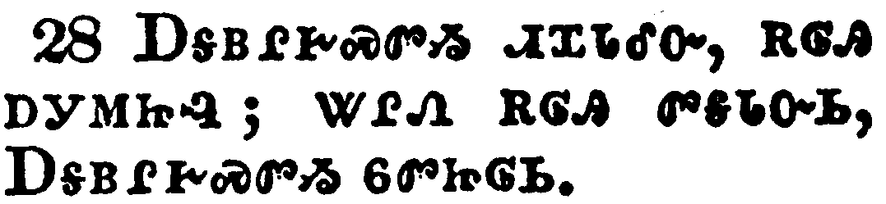</a></td>
</tr>
<tr class="even">
<td>I came forth from the Father, and am come into the world: again, I leave the world, and go to the Father.</td>
</tr>
<tr class="odd">
<td>ᎠᎦᏴᎵᎨᏍᏛᏱ ᏗᏆᏓᎴᏅ, ᎡᎶᎯ ᎠᎩᎷᏥᎸ; ᏔᎵᏁ ᎡᎶᎯ ᏛᎦᏓᏅᏏ, ᎠᎦᏴᎵᎨᏍᏛᏱ ᏮᏛᏥᎶᏏ.</td>
</tr>
<tr class="even">
<td>A-ga-yv-li-ge-s-dv-yi di-qua-da-le-nv, e-lo-hi a-gi-lu-tsi-lv; ta-li-ne e-lo-hi dv-ga-da-nv-si, A-ga-yv-li-ge-s-dv-yi wv-dv-tsi-lo-si.</td>
</tr>
</tbody>
</table>

<table>
<tbody>
<tr class="odd">
<td><a href="041629.png">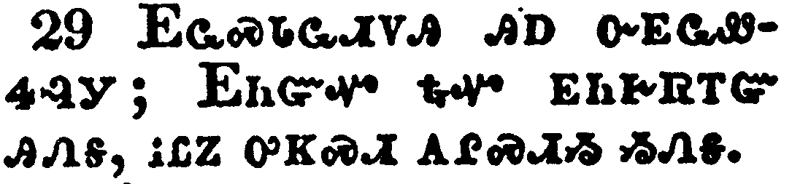</a></td>
</tr>
<tr class="even">
<td>His disciples said unto him, Lo, now speakest thou plainly, and speakest no proverb.</td>
</tr>
<tr class="odd">
<td>ᎬᏩᏍᏓᏩᏗᏙᎯ ᎯᎠ ᏅᎬᏩᏪᏎᎸᎩ; ᎬᏂᏳᏉ ᎿᎭᏉ ᎬᏂᎨᏒᎢᏳ ᎯᏁᎦ, ᎥᏝᏃ ᎤᏦᏍᏗ ᎪᎵᏍᏗᏱ ᏱᏁᎦ.</td>
</tr>
<tr class="even">
<td>Gv-wa-s-da-wa-di-do-hi hi-a nv-gv-wa-we-se-lv-gi; Gv-ni-yu-quo hna-quo gv-ni-ge-sv-i-yu hi-ne-ga, v-tla-no u-tso-s-di go-li-s-di-yi yi-ne-ga.</td>
</tr>
</tbody>
</table>

<table>
<tbody>
<tr class="odd">
<td><a href="041630.png">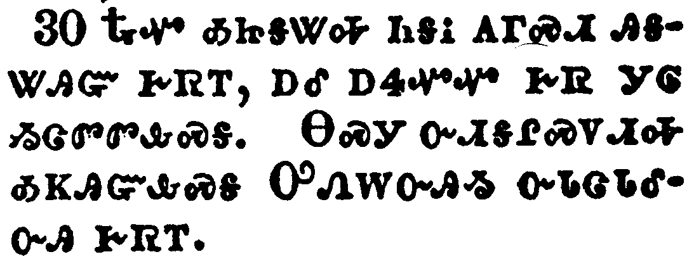</a></td>
</tr>
<tr class="even">
<td>Now are we sure that thou knowest all things, and needest not that any man should ask thee: by this we believe that thou camest forth from God.</td>
</tr>
<tr class="odd">
<td>ᎿᎭᏉ ᎣᏥᎦᏔᎭ ᏂᎦᎥ ᎪᎱᏍᏗ ᎯᎦᏔᎯᏳ ᎨᏒᎢ, ᎠᎴ ᎠᏎᏉᏉ ᎨᏒ ᎩᎶ ᏱᏨᏛᏛᎲᏍᎦ. ᎾᏍᎩ ᎤᏗᎦᎵᏍᏙᏗᎭ ᎣᏦᎯᏳᎲᏍᎦ ᎤᏁᎳᏅᎯᏱ ᏅᏓᏣᏓᎴᏅᎯ ᎨᏒᎢ.</td>
</tr>
<tr class="even">
<td>Hna-quo o-tsi-ga-ta-ha ni-ga-v go-hu-s-di hi-ga-ta-hi-yu ge-sv-i, a-le a-se-quo-quo ge-sv gi-lo yi-tsv-dv-dv-hv-s-ga. Na-s-gi u-di-ga-li-s-do-di-ha o-tso-hi-yu-hv-s-ga U-ne-la-nv-hi-yi nv-da-tsa-da-le-nv-hi ge-sv-i.</td>
</tr>
</tbody>
</table>

<table>
<tbody>
<tr class="odd">
<td><a href="041631.png">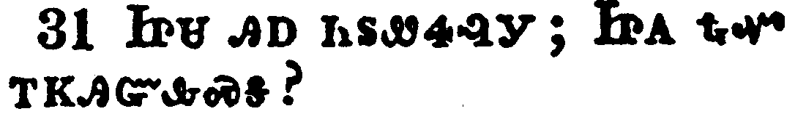</a></td>
</tr>
<tr class="even">
<td>Jesus answered them, Do ye now believe?</td>
</tr>
<tr class="odd">
<td>ᏥᏌ ᎯᎠ ᏂᏚᏪᏎᎸᎩ; ᏥᎪ ᎿᎭᏉ ᎢᏦᎯᏳᎲᏍᎦ?</td>
</tr>
<tr class="even">
<td>Tsi-sa hi-a ni-du-we-se-lv-gi; Tsi-go hna-quo i-tso-hi-yu-hv-s-ga?</td>
</tr>
</tbody>
</table>

<table>
<tbody>
<tr class="odd">
<td><a href="041632.png">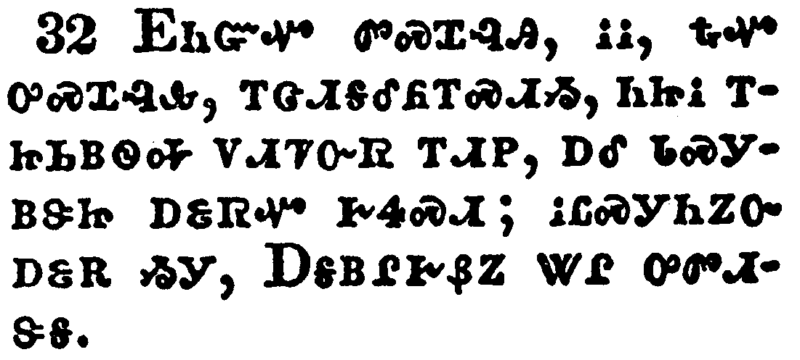</a></td>
</tr>
<tr class="even">
<td>Behold, the hour cometh, yea, is now come, that ye shall be scattered, every man to his own, and shall leave me alone: and yet I am not alone, because the Father is with me.</td>
</tr>
<tr class="odd">
<td>ᎬᏂᏳᏉ ᏛᏍᏆᎸᎯ, ᎥᎥ, ᎿᎭᏉᎤᏍᏆᎸᎲ, ᎢᏣᏗᎦᎴᏲᎢᏍᏗᏱ, ᏂᏥᎥ ᎢᏥᏏᏴᏫᎭ ᏙᏗᏤᏅᏒ ᎢᏗᏢ, ᎠᎴ ᏓᏍᎩᏴᏕᏥ ᎠᏋᏒᏉ ᎨᏎᏍᏗ; ᎥᏝᏍᎩᏂᏃᏅ ᎠᏋᎡ ᏱᎩ, ᎠᎦᏴᎵᎨᏰᏃ ᏔᎵ ᏅᏛᏗᏕᎦ.</td>
</tr>
<tr class="even">
<td>Gv-ni-yu-quo dv-s-qua-lv-hi, v-v, hna-quo-u-s-qua-lv-hv, i-tsa-di-ga-le-yo-i-s-di-yi, ni-tsi-v i-tsi-si-yv-wi-ha do-di-tse-nv-sv i-di-tlv, a-le da-s-gi-yv-de-tsi a-quv-sv-quo ge-se-s-di; v-tla-s-gi-ni-no-nv a-quv-e yi-gi, A-ga-yv-li-ge-ye-no ta-li nv-dv-di-de-ga.</td>
</tr>
</tbody>
</table>

<table>
<tbody>
<tr class="odd">
<td><a href="041633.png">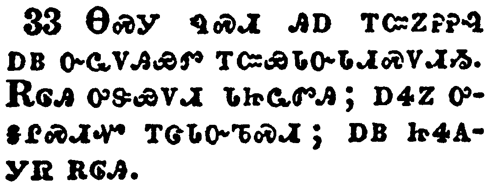</a></td>
</tr>
<tr class="even">
<td>These things I have spoken unto you, that in me ye might have peace. In the world ye shall have tribulation: but be of good cheer; I have overcome the world.</td>
</tr>
<tr class="odd">
<td>ᎾᏍᎩ ᏄᏍᏗ ᎯᎠ ᎢᏨᏃᎮᎮᎸ ᎠᏴ ᏅᏩᏙᎯᏯᏛ ᎢᏨᏯᏓᏅᏓᏗᏍᏙᏗᏱ. ᎡᎶᎯ ᎤᏕᏯᏙᏗ ᏓᏥᏩᏛᎯ; ᎠᏎᏃ ᎤᎦᎵᏍᏗᏉ ᎢᏣᏓᏅᏖᏍᏗ; ᎠᏴ ᏥᏎᎪᎩᏒ ᎡᎶᎯ.</td>
</tr>
<tr class="even">
<td>Na-s-gi nu-s-di hi-a i-tsv-no-he-he-lv a-yv nv-wa-do-hi-ya-dv i-tsv-ya-da-nv-da-di-s-do-di-yi. E-lo-hi u-de-ya-do-di da-tsi-wa-dv-hi; a-se-no u-ga-li-s-di-quo i-tsa-da-nv-te-s-di; a-yv tsi-se-go-gi-sv e-lo-hi.</td>
</tr>
</tbody>
</table>

