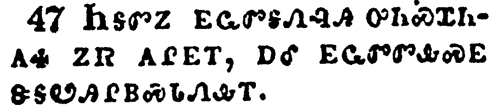

+++
draft=false
date = 2014-12-18T21:11:07Z
title = "Luke - Chapter 2 - Cherokee New Testament"
weight = 1418955067

[taxonomies]

authors = ["Timothy Legg"]
categories = []
tags = []

[extra]
+++

<table>
<tbody>
<tr class="odd">
<td></td>
</tr>
<tr class="even">
<td>And it came to pass in those days, that there went out a decree from Caesar Augustus, that all the world should be taxed.</td>
</tr>
<tr class="odd">
<td>ᎾᎯᏳᏃ ᎯᎠ ᏄᎵᏍᏔᏁᎢ, ᎾᏍᎩ ᏏᏌ ᎣᎦᏍᏓ ᎤᏁᏨᎯ ᎤᎾᏄᎪᏤ ᏂᎬᎾᏛ ᎡᎶᎯ ᎨᎦᏎᏍᏗᏱ.</td>
</tr>
<tr class="even">
<td>Na-hi-yu-no hi-a nu-li-s-ta-ne-i, na-s-gi Si-sa O-ga-s-da u-ne-tsv-hi u-na-nu-go-tse ni-gv-na-dv e-lo-hi ge-ga-se-s-di-yi.</td>
</tr>
</tbody>
</table>

<table>
<tbody>
<tr class="odd">
<td></td>
</tr>
<tr class="even">
<td>(And this taxing was first made when Cyrenius was governor of Syria.)</td>
</tr>
<tr class="odd">
<td>ᎾᏍᎩ ᎯᎠ ᎤᎾᏎᎵᏙᎴ ᎠᏏ ᏌᎵᏂ ᏏᎵᏱ ᎤᎬᏫᏳᎯ ᏂᎨᏒᎾ ᏂᎨᏎᎢ.</td>
</tr>
<tr class="even">
<td>Na-s-gi hi-a u-na-se-li-do-le a-si Sa-li-ni Si-li-yi u-gv-wi-yu-hi ni-ge-sv-na ni-ge-se-i.</td>
</tr>
</tbody>
</table>

<table>
<tbody>
<tr class="odd">
<td></td>
</tr>
<tr class="even">
<td>And all went to be taxed, every one into his own city.</td>
</tr>
<tr class="odd">
<td>ᎠᎴ ᏂᎦᏛ ᎤᏁᏅᏎ ᎨᎦᏎᏍᏗᏱ ᎠᏂᏏᏴᏫᎭ ᎨᏒ ᏙᏓᏂᏚᎲᎢ.</td>
</tr>
<tr class="even">
<td>A-le ni-ga-dv u-ne-nv-se ge-ga-se-s-di-yi a-ni-si-yv-wi-ha ge-sv do-da-ni-du-hv-i.</td>
</tr>
</tbody>
</table>

<table>
<tbody>
<tr class="odd">
<td></td>
</tr>
<tr class="even">
<td>And Joseph also went up from Galilee, out of the city of Nazareth, into Judaea, unto the city of David, which is called Bethlehem; (because he was of the house and lineage of David:)</td>
</tr>
<tr class="odd">
<td>ᎠᎴ ᏦᏩ ᎾᏍᏉ ᎨᎵᎵ ᎤᏂᎩᏎᎢ ᎤᏄᎪᏤ ᎾᏎᎵᏗ ᎦᏚᎲᎢ, ᏭᎷᏤ ᏧᏗᏱ, ᏕᏫ ᏧᏪᏚᎲᎢ, ᎦᏚᏱ ᏧᏙᎢᏛ, ᏕᏫᏰᏃ ᎤᏁᏢᏔᏅᏛ ᎨᏒ ᏅᏓᏳᏓᎴᏅᎯ ᎨᏎᎢ ᎤᎦᏴᎵᎨ ᎨᏎᎢ ᎠᎴ ᏕᏫ,</td>
</tr>
<tr class="even">
<td>A-le Tso-wa na-s-quo Ge-li-li u-ni-gi-se-i u-nu-go-tse Na-se-li-di ga-du-hv-i, wu-lu-tse Tsu-di-yi, De-wi tsu-we-du-hv-i, ga-du-yi tsu-do-i-dv, De-wi-ye-no u-ne-tlv-ta-nv-dv ge-sv nv-da-yu-da-le-nv-hi ge-se-i u-ga-yv-li-ge ge-se-i a-le De-wi,</td>
</tr>
</tbody>
</table>

<table>
<tbody>
<tr class="odd">
<td></td>
</tr>
<tr class="even">
<td>To be taxed with Mary his espoused wife, being great with child.</td>
</tr>
<tr class="odd">
<td>ᎨᎦᏎᏍᏗᏱ ᎤᏰᎸᏎ ᎤᏩᏒ ᎠᎴ ᎺᎵ ᎤᏓᏴᏍᏗ, ᎾᏍᎩ ᎦᏁᎵᏛ ᎨᏎᎢ.</td>
</tr>
<tr class="even">
<td>Ge-ga-se-s-di-yi u-ye-lv-se u-wa-sv a-le Me-li u-da-yv-s-di, na-s-gi ga-ne-li-dv ge-se-i.</td>
</tr>
</tbody>
</table>

<table>
<tbody>
<tr class="odd">
<td></td>
</tr>
<tr class="even">
<td>And so it was, that, while they were there, the days were accomplished that she should be delivered.</td>
</tr>
<tr class="odd">
<td>ᎯᎠᏃ ᏄᎵᏍᏔᏁᎢ, ᎾᏍᎩ ᎠᏏ ᎾᎿᎭᎠᏁᏙᎮᎢ, ᎤᏍᏆᎸᎮ ᎠᏲᎵ ᎤᎾᏄᎪᏫᏍᏗᏱ.</td>
</tr>
<tr class="even">
<td>Hi-a-no nu-li-s-ta-ne-i, na-s-gi a-si na-hna a-ne-do-he-i, u-s-qua-lv-he a-yo-li u-na-nu-go-wi-s-di-yi.</td>
</tr>
</tbody>
</table>

<table>
<tbody>
<tr class="odd">
<td></td>
</tr>
<tr class="even">
<td>And she brought forth her firstborn son, and wrapped him in swaddling clothes, and laid him in a manger; because there was no room for them in the inn.</td>
</tr>
<tr class="odd">
<td>ᎤᎾᏄᎪᏫᏎᏃ ᎢᎬᏱ ᎡᎯ ᎤᏪᏥ ᎠᏧᏣ, ᎠᎴ ᎤᏪᏣᏄᎳᏁᎢ, ᎠᎴ ᏐᏈᎵ ᎤᎾᎵᏍᏓᏴᏗᏱ ᎤᎸᏁᎢ; ᎥᏝᏰᏃ ᏳᏜᏓᏅᏕ ᏧᏂᏒᏍᏗᏱ ᎠᏓᏁᎸᎢ.</td>
</tr>
<tr class="even">
<td>U-na-nu-go-wi-se-no i-gv-yi e-hi u-we-tsi a-tsu-tsa, a-le u-we-tsa-nu-la-ne-i, a-le so-qui-li u-na-li-s-da-yv-di-yi u-lv-ne-i; v-tla-ye-no yu-dla-nv-de tsu-ni-sv-s-di-yi a-da-ne-lv-i.</td>
</tr>
</tbody>
</table>

<table>
<tbody>
<tr class="odd">
<td></td>
</tr>
<tr class="even">
<td>And there were in the same country shepherds abiding in the field, keeping watch over their flock by night.</td>
</tr>
<tr class="odd">
<td>ᎾᎿᎭᏃ ᎾᎥᎢ ᎠᏫ-ᏗᏂᎦᏘᏯ ᎠᏁᏙᎮ ᎤᏜᏓᏅᏛᎢ, ᎠᏫ ᏓᏂᎦᏘᏰ ᏒᏃᏱ.</td>
</tr>
<tr class="even">
<td>Na-hna-no na-v-i a-wi--di-ni-ga-ti-ya a-ne-do-he u-dla-nv-dv-i, a-wi da-ni-ga-ti-ye sv-no-yi.</td>
</tr>
</tbody>
</table>

<table>
<tbody>
<tr class="odd">
<td></td>
</tr>
<tr class="even">
<td>And, lo, the angel of the Lord came upon them, and the glory of the Lord shone round about them: and they were sore afraid.</td>
</tr>
<tr class="odd">
<td>ᎬᏂᏳᏉᏃ ᏗᎧᎿᎭᏩᏗᏙᎯ ᏱᎰᏩ ᎤᏤᎵᎦ ᎤᏂᎷᏤᎴᎢ, ᎠᎴ ᎦᎸᏉᏗᏳ ᏚᎸᏌᏛ ᎤᎬᏫᏳᎯ ᎤᏤᎵᎦ ᏚᎾᏚᏫᏍᏔᏁᎢ ᎠᎴ ᎤᏣᏔᏅᎯ ᎤᏂᏍᎦᎴᎢ.</td>
</tr>
<tr class="even">
<td>Gv-ni-yu-quo-no di-ka-hna-wa-di-do-hi Yi-ho-wa u-tse-li-ga u-ni-lu-tse-le-i, a-le ga-lv-quo-di-yu du-lv-sa-dv U-gv-wi-yu-hi u-tse-li-ga du-na-du-wi-s-ta-ne-i a-le u-tsa-ta-nv-hi u-ni-s-ga-le-i.</td>
</tr>
</tbody>
</table>

<table>
<tbody>
<tr class="odd">
<td></td>
</tr>
<tr class="even">
<td>And the angel said unto them, Fear not: for, behold, I bring you good tidings of great joy, which shall be to all people.</td>
</tr>
<tr class="odd">
<td>ᏗᎧᎿᎭᏩᏗᏙᎯᏃ ᎯᎠ ᏂᏚᏪᏎᎴᎢ; ᏞᏍᏗ ᏱᏥᏍᎦᎢᎮᏍᏗ, ᎬᏂᏳᏉᏰᏃ ᎢᏨᏲᎯᏏ ᎣᏍᏛ ᎧᏃᎮᏛ ᎤᏣᏘ ᎠᎵᎮᎵᏍᏗ, ᎾᏂᎥ ᏴᏫ ᎤᎾᏛᎪᏗ.</td>
</tr>
<tr class="even">
<td>Di-ka-hna-wa-di-do-hi-no hi-a ni-du-we-se-le-i; Tle-s-di yi-tsi-s-ga-i-he-s-di, gv-ni-yu-quo-ye-no i-tsv-yo-hi-si o-s-dv ka-no-he-dv u-tsa-ti a-li-he-li-s-di, na-ni-v yv-wi u-na-dv-go-di.</td>
</tr>
</tbody>
</table>

<table>
<tbody>
<tr class="odd">
<td></td>
</tr>
<tr class="even">
<td>For unto you is born this day in the city of David a Saviour, which is Christ the Lord.</td>
</tr>
<tr class="odd">
<td>ᎪᎯᏰᏃ ᎢᎦ ᎢᏣᏕᏁᎸ ᏕᏫ ᎤᏪᏚᎲᎢ, ᎢᏥᏍᏕᎵᏍᎩ ᎾᏍᎩ ᎦᎶᏁᏛ ᎤᎬᏫᏳᎯ.</td>
</tr>
<tr class="even">
<td>Go-hi-ye-no i-ga i-tsa-de-ne-lv De-wi u-we-du-hv-i, I-tsi-s-de-li-s-gi na-s-gi Ga-lo-ne-dv U-gv-wi-yu-hi.</td>
</tr>
</tbody>
</table>

<table>
<tbody>
<tr class="odd">
<td></td>
</tr>
<tr class="even">
<td>And this shall be a sign unto you; Ye shall find the babe wrapped in swaddling clothes, lying in a manger.</td>
</tr>
<tr class="odd">
<td>ᎯᎠᏃ ᎾᏍᎩ ᎢᏣᏙᎯᎰᎯᏍᏙᏗ ᎨᏎᏍᏗ; ᏓᏰᏥᏩᏛᎯ ᎠᏲᎵ ᎠᏥᏣᏄᎴᏍᏗ, ᏐᏈᎵ ᎤᎾᎵᏍᏓᏴᏗᏱ ᎦᏅᎨᏍᏗ.</td>
</tr>
<tr class="even">
<td>Hi-a-no na-s-gi i-tsa-do-hi-ho-hi-s-do-di ge-se-s-di; Da-ye-tsi-wa-dv-hi a-yo-li a-tsi-tsa-nu-le-s-di, so-qui-li u-na-li-s-da-yv-di-yi ga-nv-ge-s-di.</td>
</tr>
</tbody>
</table>

<table>
<tbody>
<tr class="odd">
<td></td>
</tr>
<tr class="even">
<td>And suddenly there was with the angel a multitude of the heavenly host praising God, and saying,</td>
</tr>
<tr class="odd">
<td>ᎩᎳᏉᏃ ᎢᏴᏛ ᎤᏂᏣᏘ ᎦᎸᎳᏗ ᎠᏁᎯ ᎬᏩᎵᎪᏁᎴ ᏗᎧᎿᎭᏩᏗᏙᎯ, ᎤᏁᎳᏅᎯ ᎠᏂᎸᏉᏗᏍᎨᎢ, ᎯᎠ ᎾᏂᏪᏍᎨᎢ;</td>
</tr>
<tr class="even">
<td>Gi-la-quo-no i-yv-dv u-ni-tsa-ti ga-lv-la-di a-ne-hi gv-wa-li-go-ne-le di-ka-hna-wa-di-do-hi, U-ne-la-nv-hi a-ni-lv-quo-di-s-ge-i, hi-a na-ni-we-s-ge-i;</td>
</tr>
</tbody>
</table>

<table>
<tbody>
<tr class="odd">
<td></td>
</tr>
<tr class="even">
<td>Glory to God in the highest, and on earth peace, good will toward men.</td>
</tr>
<tr class="odd">
<td>ᎦᎸᏉᏗᏳ ᎨᏎᏍᏗ ᎤᏁᎳᏅᎯ ᏩᏍᏛ ᎦᎸᎳᏗᏳ, ᎡᎶᎯᏃ ᏙᎯᎣ ᎨᏎᏍᏗ, ᎣᏍᏛ ᎨᎦᏓᏅᏖᏍᎨᏍᏗ ᏴᏫ.</td>
</tr>
<tr class="even">
<td>Ga-lv-quo-di-yu ge-se-s-di U-ne-la-nv-hi wa-s-dv ga-lv-la-di-yu, e-lo-hi-no do-hi-o ge-se-s-di, o-s-dv ge-ga-da-nv-te-s-ge-s-di yv-wi.</td>
</tr>
</tbody>
</table>

<table>
<tbody>
<tr class="odd">
<td></td>
</tr>
<tr class="even">
<td>And it came to pass, as the angels were gone away from them into heaven, the shepherds said one to another, Let us now go even unto Bethlehem, and see this thing which is come to pass, which the Lord hath made known unto us.</td>
</tr>
<tr class="odd">
<td>ᎿᎭᏉᏃ ᎯᎠ ᏄᎵᏍᏔᏁᎢ, ᎾᏍᎩ ᏗᏂᎧᎿᎭᏩᏗᏙᎯ ᎬᏩᎾᏓᏅᎡᎸ, ᎦᎸᎳᏗ ᏫᎤᏂᎶᏒ, ᎯᎠ ᏂᏚᎾᏓᏪᏎᎴ ᎠᏫ-ᏗᏂᎦᏘᏯ; Ꭷ, ᎿᎭᏉ ᎦᏚᏱ ᎢᏕᎾ, ᎠᎴ ᏫᏓᏙᎴᎰᎯ ᎾᏍᎩ ᎯᎠ ᏄᎵᏍᏔᏅᎢ, ᎾᏍᎩ ᏱᎰᏩ ᎬᏂᎨᏒ ᏥᏂᎬᏂᏏ.</td>
</tr>
<tr class="even">
<td>Hna-quo-no hi-a nu-li-s-ta-ne-i, na-s-gi di-ni-ka-hna-wa-di-do-hi gv-wa-na-da-nv-e-lv, ga-lv-la-di wi-u-ni-lo-sv, hi-a ni-du-na-da-we-se-le a-wi--di-ni-ga-ti-ya; Ka, hna-quo ga-du-yi i-de-na, a-le wi-da-do-le-ho-hi na-s-gi hi-a nu-li-s-ta-nv-i, na-s-gi Yi-ho-wa gv-ni-ge-sv tsi-ni-gv-ni-si.</td>
</tr>
</tbody>
</table>

<table>
<tbody>
<tr class="odd">
<td></td>
</tr>
<tr class="even">
<td>And they came with haste, and found Mary, and Joseph, and the babe lying in a manger.</td>
</tr>
<tr class="odd">
<td>ᎤᎵᏍᏗᏳᏃ ᏭᏂᎷᏤᎢ, ᎠᎴ ᏚᏂᏩᏛᎮ ᎺᎵ ᎠᎴ ᏦᏩ, ᎠᎴ ᎠᏲᎵ ᏐᏈᎵ ᎤᎾᎵᏍᏓᏴᏗᏱ ᎦᏅᎨᎢ.</td>
</tr>
<tr class="even">
<td>U-li-s-di-yu-no wu-ni-lu-tse-i, a-le du-ni-wa-dv-he Me-li a-le Tso-wa, a-le a-yo-li so-qui-li u-na-li-s-da-yv-di-yi ga-nv-ge-i.</td>
</tr>
</tbody>
</table>

<table>
<tbody>
<tr class="odd">
<td></td>
</tr>
<tr class="even">
<td>And when they had seen it, they made known abroad the saying which was told them concerning this child.</td>
</tr>
<tr class="odd">
<td>ᎤᏂᎪᎲᏃ ᎤᏂᏃᎮᎵᏙᎴ ᏄᏍᏛ ᎨᏥᏃᎮᎮᎸ ᎾᏍᎩ ᎠᏲᎵ ᎠᏥᏁᎢᏍᏗᏍᎬᎢ.</td>
</tr>
<tr class="even">
<td>U-ni-go-hv-no u-ni-no-he-li-do-le nu-s-dv ge-tsi-no-he-he-lv na-s-gi a-yo-li a-tsi-ne-i-s-di-s-gv-i.</td>
</tr>
</tbody>
</table>

<table>
<tbody>
<tr class="odd">
<td></td>
</tr>
<tr class="even">
<td>And all they that heard it wondered at those things which were told them by the shepherds.</td>
</tr>
<tr class="odd">
<td>ᏂᎦᏛᏃ ᎤᎾᏛᎦᏅᎯ ᎤᏂᏍᏆᏂᎪᏎ ᏄᏍᏛ ᎬᏩᏂᏃᎮᎮᎸ ᎠᏫ-ᏗᏂᎦᏘᏯ.</td>
</tr>
<tr class="even">
<td>Ni-ga-dv-no u-na-dv-ga-nv-hi u-ni-s-qua-ni-go-se nu-s-dv gv-wa-ni-no-he-he-lv a-wi--di-ni-ga-ti-ya.</td>
</tr>
</tbody>
</table>

<table>
<tbody>
<tr class="odd">
<td></td>
</tr>
<tr class="even">
<td>But Mary kept all these things, and pondered them in her heart.</td>
</tr>
<tr class="odd">
<td>ᎺᎵᏍᎩᏂ ᎾᏍᎩ ᎯᎠ ᏂᎦᏛ ᎤᏍᏆᏂᎪᏔᏁᎢ, ᎠᎴ ᎾᏍᎩ ᎤᏓᏅᏖᎯᎶᎡ ᏧᏓᏅᏛᎢ.</td>
</tr>
<tr class="even">
<td>Me-li-s-gi-ni na-s-gi hi-a ni-ga-dv u-s-qua-ni-go-ta-ne-i, a-le na-s-gi u-da-nv-te-hi-lo-e tsu-da-nv-dv-i.</td>
</tr>
</tbody>
</table>

<table>
<tbody>
<tr class="odd">
<td></td>
</tr>
<tr class="even">
<td>And the shepherds returned, glorifying and praising God for all the things that they had heard and seen, as it was told unto them.</td>
</tr>
<tr class="odd">
<td>ᎠᏫᏃ-ᏗᏂᎦᏘᏯ ᎢᎤᎾᏨᏎᎢ, ᎠᏂᎸᏉᏗᏍᎨ ᎠᎴ ᎠᎾᎵᎮᎵᏤᎮ ᎤᏁᎳᏅᎯ ᏅᏗᎦᎵᏍᏙᏗᏍᎨ ᏂᎦᎥ ᎤᎾᏛᎦᏅ ᎠᎴ ᎤᏂᎪᎲᎢ, ᎾᏍᎩ ᏄᏍᏛ ᎨᏥᏃᏁᎸᎢ.</td>
</tr>
<tr class="even">
<td>A-wi-no--di-ni-ga-ti-ya i-u-na-tsv-se-i, a-ni-lv-quo-di-s-ge a-le a-na-li-he-li-tse-he u-ne-la-nv-hi nv-di-ga-li-s-do-di-s-ge ni-ga-v u-na-dv-ga-nv a-le u-ni-go-hv-i, na-s-gi nu-s-dv ge-tsi-no-ne-lv-i.</td>
</tr>
</tbody>
</table>

<table>
<tbody>
<tr class="odd">
<td></td>
</tr>
<tr class="even">
<td>And when eight days were accomplished for the circumcising of the child, his name was called JESUS, which was so named of the angel before he was conceived in the womb.</td>
</tr>
<tr class="odd">
<td>ᏧᏁᎵᏁᏃ ᎢᎦ ᎤᏍᏆᎸᎲ ᎾᏍᎩ ᎠᎱᏍᏕᏎᏗ ᎨᏒ ᎠᏲᎵ, ᏥᏌ ᏚᏃᎡᎢ, ᎾᏍᎩ ᏗᎧᎿᎭᏩᏗᏙᎯ ᏂᏚᏬᎡ ᎠᏏᏉ ᎾᏥᏁᎵᎬᎾ ᎨᏎᎢ.</td>
</tr>
<tr class="even">
<td>Tsu-ne-li-ne-no i-ga u-s-qua-lv-hv na-s-gi a-hu-s-de-se-di ge-sv a-yo-li, Tsi-Sa du-no-e-i, na-s-gi di-ka-hna-wa-di-do-hi ni-du-wo-e a-si-quo na-tsi-ne-li-gv-na ge-se-i.</td>
</tr>
</tbody>
</table>

<table>
<tbody>
<tr class="odd">
<td></td>
</tr>
<tr class="even">
<td>And when the days of her purification according to the law of Moses were accomplished, they brought him to Jerusalem, to present him to the Lord;</td>
</tr>
<tr class="odd">
<td>ᎿᎭᏉᏃ ᎤᏍᏆᎸᎲ ᎤᎾᏓᏅᎦᎸᏗᏱ ᎾᏍᎩᏯ ᏂᎬᏅ ᏗᎧᎿᎭᏩᏛᏍᏗ ᎼᏏ ᎤᏬᏪᎳᏅᎯ, ᏥᎷᏏᎵᎻ ᎤᏂᏃᎴ ᏱᎰᏩ ᎤᏂᎧᏁᏗᏱ;</td>
</tr>
<tr class="even">
<td>Hna-quo-no u-s-qua-lv-hv u-na-da-nv-ga-lv-di-yi na-s-gi-ya ni-gv-nv di-ka-hna-wa-dv-s-di Mo-si u-wo-we-la-nv-hi, Tsi-lu-si-li-mi u-ni-no-le Yi-ho-wa u-ni-ka-ne-di-yi;</td>
</tr>
</tbody>
</table>

<table>
<tbody>
<tr class="odd">
<td></td>
</tr>
<tr class="even">
<td>(As it is written in the law of the Lord, Every male that openeth the womb shall be called holy to the Lord;)</td>
</tr>
<tr class="odd">
<td>ᎾᏍᎩᏯ ᏂᎬᏅ ᎪᏪᎸ ᏗᎧᎿᎭᏩᏛᏍᏗᏱ ᎼᎰᏩ ᏣᏥᎵᎦ; ᎾᏂᎥ ᎢᎬᏱ ᎤᎾᏕᏅᎯ ᎠᏂᏍᎦᏯ ᏱᎰᏩ ᏣᏥᏲᎯᏎᎸᎯ ᎨᎪᏎᎮᏍᏗ;</td>
</tr>
<tr class="even">
<td>Na-s-gi-ya ni-gv-nv go-we-lv di-ka-hna-wa-dv-s-di-yi Mo-ho-wa tsa-tsi-li-ga; Na-ni-v i-gv-yi u-na-de-nv-hi a-ni-s-ga-ya Yi-ho-wa Tsa-tsi-yo-hi-se-lv-hi ge-go-se-he-s-di;</td>
</tr>
</tbody>
</table>

<table>
<tbody>
<tr class="odd">
<td></td>
</tr>
<tr class="even">
<td>And to offer a sacrifice according to that which is said in the law of the Lord, A pair of turtledoves, or two young pigeons.</td>
</tr>
<tr class="odd">
<td>ᎠᎴ ᎠᏥᎸ-ᎨᎳᏍᏗ ᎤᎾᎵᏍᎪᎸᏙᏗᏱ ᎾᏍᎩᏯ ᎯᎠ ᏂᎦᏪᏍᎬ ᏗᎧᎿᎭᏩᏛᏍᏗ ᏱᎰᏩ ᎤᏤᎵᎦ; ᎠᏂᏔᎵ ᏧᎴᏗᏂᏍᎪᏂᎯ, ᎠᎴ ᎠᏂᏔᎵ ᎠᏂᏛ ᏬᏱ.</td>
</tr>
<tr class="even">
<td>A-le a-tsi-lv--ge-la-s-di u-na-li-s-go-lv-do-di-yi na-s-gi-ya hi-a ni-ga-we-s-gv di-ka-hna-wa-dv-s-di Yi-ho-wa u-tse-li-ga; A-ni-ta-li tsu-le-di-ni-s-go-ni-hi, a-le a-ni-ta-li a-ni-dv wo-yi.</td>
</tr>
</tbody>
</table>

<table>
<tbody>
<tr class="odd">
<td></td>
</tr>
<tr class="even">
<td>And, behold, there was a man in Jerusalem, whose name was Simeon; and the same man was just and devout, waiting for the consolation of Israel: and the Holy Ghost was upon him.</td>
</tr>
<tr class="odd">
<td>ᎠᎴ ᎬᏂᏳᏉ ᎩᎶ ᎢᏳᏍᏗ ᎠᏍᎦᏯ ᏥᎷᏏᎵᎻ ᎡᎮ ᏏᎻᏯᏂ ᏧᏙᎢᏛ; ᎠᎴ ᎾᏍᎩ ᏚᏳᎪᏛ ᎢᏯᏛᏁᎯ ᎠᎴ ᎤᏁᎳᏅᎯ ᏗᎧᎿᎭᏩᏕᎩ ᎨᏎᎢ, ᎠᎦᏘᏰ ᎢᏏᎵ ᎨᏥᏄᏬᎯᏍᏙᏗᏱ; ᎦᎸᏉᏗᏳᏃ ᎠᏓᏅᏙ ᏔᎵ ᎤᏛᏗᏕᎨᎢ.</td>
</tr>
<tr class="even">
<td>A-le gv-ni-yu-quo gi-lo i-yu-s-di a-s-ga-ya Tsi-lu-si-li-mi e-he Si-mi-ya-ni tsu-do-i-dv; a-le na-s-gi du-yu-go-dv i-ya-dv-ne-hi a-le U-ne-la-nv-hi di-ka-hna-wa-de-gi ge-se-i, a-ga-ti-ye I-si-li ge-tsi-nu-wo-hi-s-do-di-yi; Ga-lv-quo-di-yu-no A-da-nv-do ta-li u-dv-di-de-ge-i.</td>
</tr>
</tbody>
</table>

<table>
<tbody>
<tr class="odd">
<td></td>
</tr>
<tr class="even">
<td>And it was revealed unto him by the Holy Ghost, that he should not see death, before he had seen the Lord's Christ.</td>
</tr>
<tr class="odd">
<td>ᎠᎴ ᎬᏂᎨᏒ ᎢᏳᏩᏁᎸᎯ ᎨᏎ ᎦᎸᏉᏗᏳ ᎠᏓᏅᏙ, ᎾᏍᎩ ᎠᏲᎱᎯᏍᏗ ᎨᏒ ᎤᎪᏩᏛᏗ ᏂᎨᏒᎾ ᎨᏒ ᎬᏂ ᏱᎰᏩ ᎤᏤᎵ ᎦᎶᏁᏛ ᎤᎪᎲᎯ ᏱᎩ</td>
</tr>
<tr class="even">
<td>A-le gv-ni-ge-sv i-yu-wa-ne-lv-hi ge-se Ga-lv-quo-di-yu A-da-nv-do, na-s-gi a-yo-hu-hi-s-di ge-sv u-go-wa-dv-di ni-ge-sv-na ge-sv gv-ni Yi-ho-wa u-tse-li Ga-lo-ne-dv u-go-hv-hi yi-gi</td>
</tr>
</tbody>
</table>

<table>
<tbody>
<tr class="odd">
<td></td>
</tr>
<tr class="even">
<td>And he came by the Spirit into the temple: and when the parents brought in the child Jesus, to do for him after the custom of the law,</td>
</tr>
<tr class="odd">
<td>ᎠᎴ ᎠᏓᏅᏙ ᎤᏓᏅᏖᎮᎸᎯ ᏭᎷᏤ ᎤᏛᎾ-ᏗᎦᎳᏫᎢᏍᏗᏱ; ᏧᎦᏴᎵᎨᏃ ᎤᏂᏴᏔᏂᎸ ᎠᏲᎵ ᏥᏌ ᎾᏍᎩ ᏂᎬᏅ ᏗᎧᎿᎭᏩᏛᏍᏗ ᎢᏳᎾᏛᏁᏗᏱ,</td>
</tr>
<tr class="even">
<td>A-le a-da-nv-do u-da-nv-te-he-lv-hi wu-lu-tse u-dv-na--di-ga-la-wi-i-s-di-yi; tsu-ga-yv-li-ge-no u-ni-yv-ta-ni-lv a-yo-li Tsi-sa na-s-gi ni-gv-nv di-ka-hna-wa-dv-s-di i-yu-na-dv-ne-di-yi,</td>
</tr>
</tbody>
</table>

<table>
<tbody>
<tr class="odd">
<td></td>
</tr>
<tr class="even">
<td>Then took he him up in his arms, and blessed God, and said,</td>
</tr>
<tr class="odd">
<td>ᎿᎭᏉ ᎾᏍᎩ ᎤᏁᏎᎢ, ᎠᎴ ᎤᎸᏉᏔᏁ ᎤᏁᎳᏅᎯ, ᎯᎠ ᏄᏪᏎᎢ;</td>
</tr>
<tr class="even">
<td>Hna-quo na-s-gi u-ne-se-i, a-le u-lv-quo-ta-ne U-ne-la-nv-hi, hi-a nu-we-se-i;</td>
</tr>
</tbody>
</table>

<table>
<tbody>
<tr class="odd">
<td></td>
</tr>
<tr class="even">
<td>Lord, now lettest thou thy servant depart in peace, according to thy word:</td>
</tr>
<tr class="odd">
<td>ᏣᎬᏫᏳᎯ, ᎿᎭᏉ ᎯᏅᏏᏓᏍᏗ ᏅᏩᏙᎯᏯᏛ ᏕᎯᏲᏍᎦ, ᎾᏍᎩᏯ ᏂᏣᏪᏒ ᏣᏁᏨᎢ;</td>
</tr>
<tr class="even">
<td>Tsa-gv-wi-yu-hi, hna-quo hi-nv-si-da-s-di nv-wa-do-hi-ya-dv de-hi-yo-s-ga, na-s-gi-ya ni-tsa-we-sv tsa-ne-tsv-i;</td>
</tr>
</tbody>
</table>

<table>
<tbody>
<tr class="odd">
<td></td>
</tr>
<tr class="even">
<td>For mine eyes have seen thy salvation,</td>
</tr>
<tr class="odd">
<td>ᏗᏥᎦᎵᏰᏃ ᎬᏗ ᏥᎪᏩᏛ ᏣᏤᎵ ᎠᎵᏍᏕᎸᏙᏗ.</td>
</tr>
<tr class="even">
<td>Di-tsi-ga-li-ye-no gv-di tsi-go-wa-dv tsa-tse-li a-li-s-de-lv-do-di.</td>
</tr>
</tbody>
</table>

<table>
<tbody>
<tr class="odd">
<td></td>
</tr>
<tr class="even">
<td>Which thou hast prepared before the face of all people;</td>
</tr>
<tr class="odd">
<td>ᎾᏍᎩ ᏣᏓᏁᎳᏅᎯ ᏥᎩ ᎾᏂᎥ ᏴᏫ ᎠᏂᎦᏔᎲᎢ,</td>
</tr>
<tr class="even">
<td>Na-s-gi tsa-da-ne-la-nv-hi tsi-gi na-ni-v yv-wi a-ni-ga-ta-hv-i,</td>
</tr>
</tbody>
</table>

<table>
<tbody>
<tr class="odd">
<td></td>
</tr>
<tr class="even">
<td>A light to lighten the Gentiles, and the glory of thy people Israel.</td>
</tr>
<tr class="odd">
<td>ᎢᎦ-ᎦᏘ ᏧᏂᎸᏌᏓᏕᏗ ᏧᎾᏓᎴᏅᏛ ᏴᏫ, ᎠᎴ ᎦᎸᏉᏗᏳ ᎨᏒ ᏗᏣᏤᎵ ᏴᏫ ᎢᏏᎵ ᎤᎾᏤᎵᎦ.</td>
</tr>
<tr class="even">
<td>I-ga--ga-ti tsu-ni-lv-sa-da-de-di Tsu-na-da-le-nv-dv yv-wi, a-le ga-lv-quo-di-yu ge-sv di-tsa-tse-li yv-wi I-si-li u-na-tse-li-ga.</td>
</tr>
</tbody>
</table>

<table>
<tbody>
<tr class="odd">
<td></td>
</tr>
<tr class="even">
<td>And Joseph and his mother marvelled at those things which were spoken of him.</td>
</tr>
<tr class="odd">
<td>ᏦᏩᏃ ᎠᎴ ᎠᏲᎵ ᎤᏥ ᎠᏂᏍᏆᏂᎪᏍᎨ ᏄᏍᏛ ᎠᏥᏁᎢᏍᏗᏍᎬ ᎾᏍᎩ.</td>
</tr>
<tr class="even">
<td>Tso-wa-no a-le a-yo-li u-tsi a-ni-s-qua-ni-go-s-ge nu-s-dv a-tsi-ne-i-s-di-s-gv na-s-gi.</td>
</tr>
</tbody>
</table>

<table>
<tbody>
<tr class="odd">
<td></td>
</tr>
<tr class="even">
<td>And Simeon blessed them, and said unto Mary his mother, Behold, this child is set for the fall and rising again of many in Israel; and for a sign which shall be spoken against;</td>
</tr>
<tr class="odd">
<td>ᎻᎻᏯᏂᏃ ᎣᏍᏛ ᏚᏁᏤᎴᎢ, ᎠᎴ ᎯᎠ ᏄᏪᏎᎴ ᎺᎵ ᎠᏲᎵ ᎤᏥ, ᎬᏂᏳᏉ ᎯᎠ ᎾᏍᎩ ᎠᏲᎵ ᎠᏥᎧᏅ ᎾᏍᎩ ᎢᏏᎵ ᎠᏁᎯ ᎤᏂᏣᏘ ᏧᏂᏅᎢᏍᏗᏱ ᎠᎴ ᏧᎾᎴᎯᏐᏙᏗᏱ; ᎠᎴ ᎤᏰᎸᏛ ᎤᎾᏡᏙᏗ ᎠᏂᏬᏂᏍᎬᎢ.</td>
</tr>
<tr class="even">
<td>Mi-mi-ya-ni-no o-s-dv du-ne-tse-le-i, a-le hi-a nu-we-se-le Me-li a-yo-li u-tsi, Gv-ni-yu-quo hi-a na-s-gi a-yo-li a-tsi-ka-nv na-s-gi I-si-li a-ne-hi u-ni-tsa-ti tsu-ni-nv-i-s-di-yi a-le tsu-na-le-hi-so-do-di-yi; a-le u-ye-lv-dv u-na-tlu-do-di a-ni-wo-ni-s-gv-i.</td>
</tr>
</tbody>
</table>

<table>
<tbody>
<tr class="odd">
<td></td>
</tr>
<tr class="even">
<td>(Yea, a sword shall pierce through thy own soul also,) that the thoughts of many hearts may be revealed.</td>
</tr>
<tr class="odd">
<td>ᎾᏍᎩ ᎤᏂᏣᏘ ᏄᏍᏛ ᏓᎾᏓᏅᏖᏍᎬ ᏧᏂᎾᏫᏱ ᎬᏂᎨᏒ ᎢᏳᎵᏍᏙᏗᏱ: ᎥᎥ, ᎠᏰᎳᏍᏗ-ᎦᏅᎯᏛ ᎾᏍᏉ ᏨᏒ ᏣᏓᏅᏙ ᏓᏣᏘᎵ.</td>
</tr>
<tr class="even">
<td>Na-s-gi u-ni-tsa-ti nu-s-dv da-na-da-nv-te-s-gv tsu-ni-na-wi-yi gv-ni-ge-sv i-yu-li-s-do-di-yi: V-v, a-ye-la-s-di--ga-nv-hi-dv na-s-quo tsv-sv tsa-da-nv-do da-tsa-ti-li.</td>
</tr>
</tbody>
</table>

<table>
<tbody>
<tr class="odd">
<td></td>
</tr>
<tr class="even">
<td>And there was one Anna, a prophetess, the daughter of Phanuel, of the tribe of Aser: she was of a great age, and had lived with an husband seven years from her virginity;</td>
</tr>
<tr class="odd">
<td>ᎠᎴ ᎩᎶ ᎢᏳᏍᏗ ᎠᎨᏴ ᎡᏂ ᏧᏙᎢᏛ ᎠᏙᎴᎰᏍᎩ ᎡᎮᎢ, ᎾᏍᎩ ᏆᏄᎡᎵ ᎤᏪᏥ ᎨᏎᎢ, ᎡᏌ ᎠᏂᎳᏍᏓᎸ ᎤᏠᏱ, ᎾᏍᎩ ᎤᏣᏘ ᎠᎦᏴᎵᎨ ᎨᏎᎢ, ᎠᎴ ᎦᎵᏉᎩ ᎢᏧᏕᏘᏴᏛ ᎤᎾᏁᎳᏛᎯ ᎨᏎ ᎠᏍᎦᏯ ᎠᏛᏉ ᎨᏒ ᏧᎾᏨᏛ;</td>
</tr>
<tr class="even">
<td>A-le gi-lo i-yu-s-di a-ge-yv E-ni tsu-do-i-dv a-do-le-ho-s-gi e-he-i, na-s-gi Qua-nu-e-li u-we-tsi ge-se-i, E-sa a-ni-la-s-da-lv u-tlo-yi, na-s-gi u-tsa-ti a-ga-yv-li-ge ge-se-i, a-le ga-li-quo-gi i-tsu-de-ti-yv-dv u-na-ne-la-dv-hi ge-se a-s-ga-ya a-dv-quo ge-sv tsu-na-tsv-dv;</td>
</tr>
</tbody>
</table>

<table>
<tbody>
<tr class="odd">
<td></td>
</tr>
<tr class="even">
<td>And she was a widow of about fourscore and four years, which departed not from the temple, but served God with fastings and prayers night and day.</td>
</tr>
<tr class="odd">
<td>ᎠᎴ ᎤᏬᏑᎶᏨᎯ ᎨᏎ ᏁᎳᏍᎪᎯ ᏅᎩᎦᎵ ᎢᏴᏛ ᎢᏳᏕᏘᏴᏛ, ᎾᏍᎩ ᎥᏝ ᏱᏓᏅᏍᎨ ᎤᏛᎾ-ᏗᎦᎳᏫᎢᏍᏗᏱ, ᎤᏁᎳᏅᎯᏉ ᏓᎧᎿᎭᏩᏗᏎᎢ ᎠᎹᏟ ᎬᏍᎬ ᎠᎴ ᎠᏓᏙᎵᏍᏗᏍᎬ ᏂᏚᎵᏏᏂᏒ ᎠᎴ ᏂᏚᎩᏨᏂᏒᎢ.</td>
</tr>
<tr class="even">
<td>A-le u-wo-su-lo-tsv-hi ge-se ne-la-s-go-hi nv-gi-ga-li i-yv-dv i-yu-de-ti-yv-dv, na-s-gi v-tla yi-da-nv-s-ge u-dv-na--di-ga-la-wi-i-s-di-yi, U-ne-la-nv-hi-quo da-ka-hna-wa-di-se-i a-ma-tli gv-s-gv a-le a-da-do-li-s-di-s-gv ni-du-li-si-ni-sv a-le ni-du-gi-tsv-ni-sv-i.</td>
</tr>
</tbody>
</table>

<table>
<tbody>
<tr class="odd">
<td></td>
</tr>
<tr class="even">
<td>And she coming in that instant gave thanks likewise unto the Lord, and spake of him to all them that looked for redemption in Jerusalem.</td>
</tr>
<tr class="odd">
<td>ᎾᏍᎩᏃ ᎾᏍᏉ ᎾᎯᏳᏉ ᎤᎷᏤ ᎤᎵᎮᎵᏤᎴ ᏱᎰᏩ, ᎠᎴ ᎾᏍᎩ ᏕᎧᏁᎢᏍᏓᏁᎮ ᎾᏂᎥᏉ ᏥᎷᏏᎵᎻ ᎠᏁᎯ ᎠᏂᎦᏖᏃᎯ ᎠᎫᏴᏙᏗ ᎨᏒ ᎤᎾᏄᎪᎢᏍᏗᏱ.</td>
</tr>
<tr class="even">
<td>Na-s-gi-no na-s-quo na-hi-yu-quo u-lu-tse u-li-he-li-tse-le Yi-ho-wa, a-le na-s-gi de-ka-ne-i-s-da-ne-he na-ni-v-quo Tsi-lu-si-li-mi a-ne-hi a-ni-ga-te-no-hi a-gu-yv-do-di ge-sv u-na-nu-go-i-s-di-yi.</td>
</tr>
</tbody>
</table>

<table>
<tbody>
<tr class="odd">
<td></td>
</tr>
<tr class="even">
<td>And when they had performed all things according to the law of the Lord, they returned into Galilee, to their own city Nazareth.</td>
</tr>
<tr class="odd">
<td>ᎤᏂᏍᏆᏛᏃ ᏂᎦᏛ ᎢᏯᏛᏁᎵᏓᏍᏗ ᎨᏒ ᎾᏍᎩᏯ ᏂᎬᏅ ᏗᎧᎿᎭᏩᏛᏍᏗ ᏱᎰᏩ ᎤᏤᎵᎦ, ᎢᎤᎾᏨᏎ ᎨᎵᎵ ᏭᏂᎶᏎ, ᎤᏅᏒ ᏧᏂᏚᎲ ᎾᏎᎵᏗ ᏭᏂᎷᏤᎢ.</td>
</tr>
<tr class="even">
<td>U-ni-s-qua-dv-no ni-ga-dv i-ya-dv-ne-li-da-s-di ge-sv na-s-gi-ya ni-gv-nv di-ka-hna-wa-dv-s-di Yi-ho-wa u-tse-li-ga, i-u-na-tsv-se Ge-li-li wu-ni-lo-se, u-nv-sv tsu-ni-du-hv Na-se-li-di wu-ni-lu-tse-i.</td>
</tr>
</tbody>
</table>

<table>
<tbody>
<tr class="odd">
<td></td>
</tr>
<tr class="even">
<td>And the child grew, and waxed strong in spirit, filled with wisdom: and the grace of God was upon him.</td>
</tr>
<tr class="odd">
<td>ᎠᏲᎵᏃ ᎠᏛᏍᎨᎢ ᎠᎴ ᎤᏓᏅᏛ ᎠᎵᏂᎪᏍᎨᎢ, ᎤᎧᎵᏨᎯ ᎨᏎ ᎠᎦᏙᎥᎯᏍᏗ ᎨᏒᎢ; ᎠᎴ ᎤᏁᎳᏅᎯ ᎤᏓᏙᎵᏍᏗ ᎨᏒ ᏚᎧᎿᎭᏩᏗᏙᎮᎢ.</td>
</tr>
<tr class="even">
<td>A-yo-li-no a-dv-s-ge-i a-le u-da-nv-dv a-li-ni-go-s-ge-i, u-ka-li-tsv-hi ge-se a-ga-do-v-hi-s-di ge-sv-i; a-le U-ne-la-nv-hi u-da-do-li-s-di ge-sv du-ka-hna-wa-di-do-he-i.</td>
</tr>
</tbody>
</table>

<table>
<tbody>
<tr class="odd">
<td></td>
</tr>
<tr class="even">
<td>Now his parents went to Jerusalem every year at the feast of the passover.</td>
</tr>
<tr class="odd">
<td>ᏧᎦᏴᎵᎨᏃ ᏥᎷᏏᎵᎻ ᎠᏁᎨ ᏂᏓᏕᏘᏴᎯᏒ ᎧᏃᎯᏰᎩ ᏗᎵᏍᏓᏴᏗᏱ ᎠᏍᏆᎵᏍᎬ ᎢᏳᎢ.</td>
</tr>
<tr class="even">
<td>Tsu-ga-yv-li-ge-no Tsi-lu-si-li-mi a-ne-ge ni-da-de-ti-yv-hi-sv ka-no-hi-ye-gi di-li-s-da-yv-di-yi a-s-qua-li-s-gv i-yu-i.</td>
</tr>
</tbody>
</table>

<table>
<tbody>
<tr class="odd">
<td></td>
</tr>
<tr class="even">
<td>And when he was twelve years old, they went up to Jerusalem after the custom of the feast.</td>
</tr>
<tr class="odd">
<td>ᏔᎳᏚᏃ ᎢᏳᏕᏘᏴᏛ ᎨᏎ ᏥᎷᏏᎵᎻ ᎤᏁᏅᎭ ᎾᏍᎩᏯ ᎢᏳᎾᏛᏁᏗ ᎨᏒ ᏓᎾᎵᏍᏓᏴᎲᏍᎬ ᎢᏳᎢ.</td>
</tr>
<tr class="even">
<td>Ta-la-du-no i-yu-de-ti-yv-dv ge-se Tsi-lu-si-li-mi u-ne-nv-ha na-s-gi-ya i-yu-na-dv-ne-di ge-sv da-na-li-s-da-yv-hv-s-gv i-yu-i.</td>
</tr>
</tbody>
</table>

<table>
<tbody>
<tr class="odd">
<td></td>
</tr>
<tr class="even">
<td>And when they had fulfilled the days, as they returned, the child Jesus tarried behind in Jerusalem; and Joseph and his mother knew not of it.</td>
</tr>
<tr class="odd">
<td>ᎤᏂᏍᏆᏛᏃ ᎢᎪᎯᏛ ᏚᎵᏒᏍᏛᎢ, ᎥᎤᎾᏨᏏᏗᏒ ᎠᏲᎵ ᏥᏌ ᏥᎷᏏᎵᎻ ᏗᎤᏗᎩᏰᎢ, ᏦᏩᏃ ᎠᎴ ᎤᏥ ᎥᏝ ᏱᏁᎵᏍᎨᎢ.</td>
</tr>
<tr class="even">
<td>U-ni-s-qua-dv-no i-go-hi-dv du-li-sv-s-dv-i, v-u-na-tsv-si-di-sv a-yo-li Tsi-sa Tsi-lu-si-li-mi di-u-di-gi-ye-i, Tso-wa-no a-le u-tsi v-tla yi-ne-li-s-ge-i.</td>
</tr>
</tbody>
</table>

<table>
<tbody>
<tr class="odd">
<td></td>
</tr>
<tr class="even">
<td>But they, supposing him to have been in the company, went a day's journey; and they sought him among their kinsfolk and acquaintance.</td>
</tr>
<tr class="odd">
<td>ᎾᏍᎩᏃ ᏑᎾᏓᏡᎩ ᎠᎾᎢᏒ ᎨᎳᏗ ᎠᏁᎵᏍᎬ ᏏᎦ ᎡᏅᏍᏗ ᎢᏴᏛ ᎤᏁᏅᏎᎢ; ᎪᎱᏍᏗᏃ ᏧᏅᏅ ᎠᎴ ᏗᎾᏓᎦᏔᎯ ᎠᏂᏅ ᎤᏂᏲᎴᎢ.</td>
</tr>
<tr class="even">
<td>Na-s-gi-no su-na-da-tlu-gi a-na-i-sv ge-la-di a-ne-li-s-gv si-ga e-nv-s-di i-yv-dv u-ne-nv-se-i; go-hu-s-di-no tsu-nv-nv a-le di-na-da-ga-ta-hi a-ni-nv u-ni-yo-le-i.</td>
</tr>
</tbody>
</table>

<table>
<tbody>
<tr class="odd">
<td></td>
</tr>
<tr class="even">
<td>And when they found him not, they turned back again to Jerusalem, seeking him.</td>
</tr>
<tr class="odd">
<td>ᎬᏩᏠᏨᏃ ᎢᎤᎾᏨᏎᎢ ᏥᎷᏏᎵᎻ ᏭᏂᎶᏎ ᎬᏩᏲᎮᎢ.</td>
</tr>
<tr class="even">
<td>Gv-wa-tlo-tsv-no i-u-na-tsv-se-i Tsi-lu-si-li-mi wu-ni-lo-se gv-wa-yo-he-i.</td>
</tr>
</tbody>
</table>

<table>
<tbody>
<tr class="odd">
<td></td>
</tr>
<tr class="even">
<td>And it came to pass, that after three days they found him in the temple, sitting in the midst of the doctors, both hearing them, and asking them questions.</td>
</tr>
<tr class="odd">
<td>ᎯᎠᏃ ᏄᎵᏍᏔᏁᎢ, ᎾᏍᎩ ᏦᎢᏁ ᎢᎦ ᎤᏂᏩᏛᎮ ᎤᏛᏃᎯ ᏗᎦᎳᏫᎢᏍᏗᏱ, ᎤᏬᎴ ᎠᏰᎵ ᎠᏂᏅ ᏗᎾᏕᏲᎲᏍᎩ ᏓᏛᏓᏍᏓᏁᎮ ᎠᎴ ᏓᏛᏛᎮᎸᎥᏍᎨᎢ.</td>
</tr>
<tr class="even">
<td>Hi-a-no nu-li-s-ta-ne-i, na-s-gi tso-i-ne i-ga u-ni-wa-dv-he u-dv-no-hi di-ga-la-wi-i-s-di-yi, u-wo-le a-ye-li a-ni-nv di-na-de-yo-hv-s-gi da-dv-da-s-da-ne-he a-le da-dv-dv-he-lv-v-s-ge-i.</td>
</tr>
</tbody>
</table>

<table>
<tbody>
<tr class="odd">
<td></td>
</tr>
<tr class="even">
<td>And all that heard him were astonished at his understanding and answers.</td>
</tr>
<tr class="odd">
<td>ᏂᎦᏛᏃ ᎬᏩᏛᎦᏁᎸᎯ ᎤᏂᏍᏆᏂᎪᏎ ᏃᏒ ᎪᎵᎬᎢ, ᎠᎴ ᎬᏩᏛᏛᎲᏍᎬ ᏕᎦᏬᎯᎵᏴᏍᏓᏁᎲᎢ.</td>
</tr>
<tr class="even">
<td>Ni-ga-dv-no gv-wa-dv-ga-ne-lv-hi u-ni-s-qua-ni-go-se no-sv go-li-gv-i, a-le gv-wa-dv-dv-hv-s-gv de-ga-wo-hi-li-yv-s-da-ne-hv-i.</td>
</tr>
</tbody>
</table>

<table>
<tbody>
<tr class="odd">
<td></td>
</tr>
<tr class="even">
<td>And when they saw him, they were amazed: and his mother said unto him, Son, why hast thou thus dealt with us? behold, thy father and I have sought thee sorrowing.</td>
</tr>
<tr class="odd">
<td>ᏧᎦᏴᎵᎨᏃ ᎬᏩᎪᎲ ᎤᏂᏍᏆᏂᎪᏎᎢ; ᎤᏥᏃ ᎯᎠ ᏄᏪᏎᎴᎢ ᎠᏇᏥ, ᎦᏙᏃ ᏅᏍᎩᎾᏛᏂᏏᏉ? ᏣᏙᏓ ᎢᏍᏛᏲᎲᎩ ᎤᏪᎵᎯᏍᏗ ᎣᎩᎾᏓᏅᏔᏩᏕᎬᎩ.</td>
</tr>
<tr class="even">
<td>Tsu-ga-yv-li-ge-no gv-wa-go-hv u-ni-s-qua-ni-go-se-i; u-tsi-no hi-a nu-we-se-le-i A-que-tsi, ga-do-no nv-s-gi-na-dv-ni-si-quo? Tsa-do-da i-s-dv-yo-hv-gi u-we-li-hi-s-di o-gi-na-da-nv-ta-wa-de-gv-gi.</td>
</tr>
</tbody>
</table>

<table>
<tbody>
<tr class="odd">
<td></td>
</tr>
<tr class="even">
<td>And he said unto them, How is it that ye sought me? wist ye not that I must be about my Father's business?</td>
</tr>
<tr class="odd">
<td>ᎯᎠᏃ ᏂᏚᏪᏎᎴᎢ; ᎦᏙᏃ ᎢᏍᎩᏂᏲᎮᎢ? ᏝᏍᎪ ᏱᏍᏗᎦᏔᎮ ᎡᏙᏙᏱ ᎠᏎ ᎠᏇᏓᏍᏗ ᎨᏒᎢ?</td>
</tr>
<tr class="even">
<td>Hi-a-no ni-du-we-se-le-i; Ga-do-no i-s-gi-ni-yo-he-i? Tla-s-go yi-s-di-ga-ta-he E-do-do-yi a-se a-que-da-s-di ge-sv-i?</td>
</tr>
</tbody>
</table>

<table>
<tbody>
<tr class="odd">
<td></td>
</tr>
<tr class="even">
<td>And they understood not the saying which he spake unto them.</td>
</tr>
<tr class="odd">
<td>ᎠᏎᏃ ᎥᏝ ᏳᏃᎵᏤ ᎾᏍᎩ ᏂᏚᏪᏎᎸᎢ.</td>
</tr>
<tr class="even">
<td>A-se-no v-tla yu-no-li-tse na-s-gi ni-du-we-se-lv-i.</td>
</tr>
</tbody>
</table>

<table>
<tbody>
<tr class="odd">
<td></td>
</tr>
<tr class="even">
<td>And he went down with them, and came to Nazareth, and was subject unto them: but his mother kept all these sayings in her heart.</td>
</tr>
<tr class="odd">
<td>ᏚᏍᏓᏩᏛᏎᏃ, ᎠᎴ ᎾᏎᎵᏗ ᏭᎷᏤᎢ, ᎠᎴ ᏕᎤᏁᎶᏕᎢ. ᎤᏥᏍᎩᏂ ᎯᎠ ᎾᏍᎩ ᏂᎦᏛ ᎤᏍᏆᏂᎪᏔᏁ ᎤᎾᏫᏱ.</td>
</tr>
<tr class="even">
<td>Du-s-da-wa-dv-se-no, a-le Na-se-li-di wu-lu-tse-i, a-le de-u-ne-lo-de-i. U-tsi-s-gi-ni hi-a na-s-gi ni-ga-dv u-s-qua-ni-go-ta-ne u-na-wi-yi.</td>
</tr>
</tbody>
</table>

<table>
<tbody>
<tr class="odd">
<td></td>
</tr>
<tr class="even">
<td>And Jesus increased in wisdom and stature, and in favour with God and man.</td>
</tr>
<tr class="odd">
<td>ᎠᎴ ᏥᏌ ᎧᏁᏉᏥᏎ ᎠᎦᏔᎿᎭᎢᏳ ᎨᏒ ᎠᎴ ᎠᏛᏍᎬᎢ ᎠᎴ ᎤᏁᎳᏅᎯ ᎠᎴ ᏴᏫ ᎬᏩᎨᏳᎯᏳ ᎨᏒᎢ.</td>
</tr>
<tr class="even">
<td>A-le Tsi-sa ka-ne-quo-tsi-se a-ga-ta-hna-i-yu ge-sv a-le a-dv-s-gv-i a-le U-ne-la-nv-hi a-le yv-wi gv-wa-ge-yu-hi-yu ge-sv-i.</td>
</tr>
</tbody>
</table>

