+++
draft=false
date = 2014-12-18T21:11:07Z
title = "Luke - Chapter 4 - Cherokee New Testament"
weight = 1418955067

[taxonomies]

authors = ["Timothy Legg"]
categories = []
tags = []

[extra]
+++

<table>
<tbody>
<tr class="odd">
<td><a href="030401.png">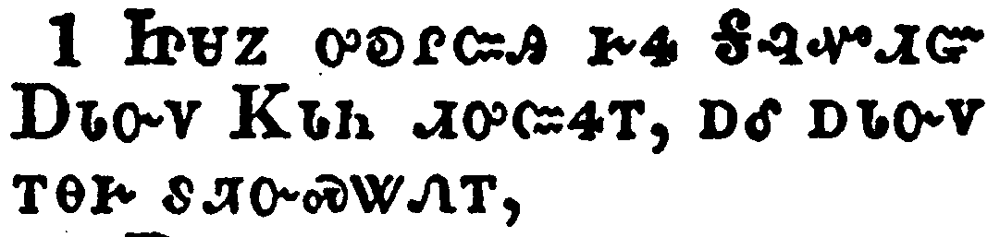</a></td>
</tr>
<tr class="even">
<td>And Jesus being full of the Holy Ghost returned from Jordan, and was led by the Spirit into the wilderness,</td>
</tr>
<tr class="odd">
<td>ᏥᏌᏃ ᎤᎧᎵᏨᎯ ᎨᏎ ᎦᎸᏉᏗᏳ ᎠᏓᏅᏙ ᏦᏓᏂ ᏗᎤᏨᏎᎢ, ᎠᎴ ᎠᏓᏅᏙ ᎢᎾᎨ ᏭᏘᏅᏍᏔᏁᎢ,</td>
</tr>
<tr class="even">
<td>Tsi-sa-no u-ka-li-tsv-hi ge-se Ga-lv-quo-di-yu A-da-nv-do Tso-da-ni di-u-tsv-se-i, a-le a-da-nv-do i-na-ge wu-ti-nv-s-ta-ne-i,</td>
</tr>
</tbody>
</table>

<table>
<tbody>
<tr class="odd">
<td><a href="030402.png">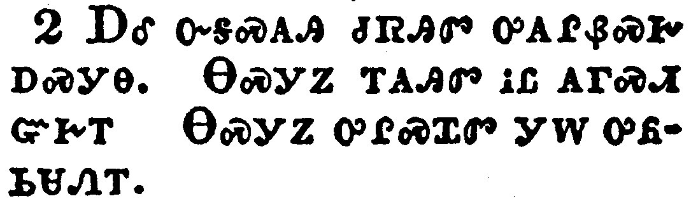</a></td>
</tr>
<tr class="even">
<td>Being forty days tempted of the devil. And in those days he did eat nothing: and when they were ended, he afterward hungered.</td>
</tr>
<tr class="odd">
<td>ᎠᎴ ᏅᎦᏍᎪᎯ ᏧᏒᎯᏛ ᎤᎪᎵᏰᏍᎨ ᎠᏍᎩᎾ. ᎾᏍᎩᏃ ᎢᎪᎯᏛ ᎥᏝ ᎪᎱᏍᏗ ᏳᏎᎢ ᎾᏍᎩᏃ ᎤᎵᏍᏆᏛ ᎩᎳ ᎤᏲᏏᏌᏁᎢ.</td>
</tr>
<tr class="even">
<td>A-le nv-ga-s-go-hi tsu-sv-hi-dv u-go-li-ye-s-ge a-s-gi-na. Na-s-gi-no i-go-hi-dv v-tla go-hu-s-di yu-se-i Na-s-gi-no u-li-s-qua-dv gi-la u-yo-si-sa-ne-i.</td>
</tr>
</tbody>
</table>

<table>
<tbody>
<tr class="odd">
<td><a href="030403.png">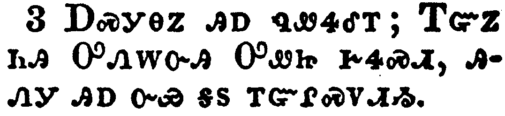</a></td>
</tr>
<tr class="even">
<td>And the devil said unto him, If thou be the Son of God, command this stone that it be made bread.</td>
</tr>
<tr class="odd">
<td>ᎠᏍᎩᎾᏃ ᎯᎠ ᏄᏪᏎᎴᎢ; ᎢᏳᏃ ᏂᎯ ᎤᏁᎳᏅᎯ ᎤᏪᏥ ᎨᏎᏍᏗ, ᎯᏁᎩ ᎯᎠ ᏅᏯ ᎦᏚ ᎢᏳᎵᏍᏙᏗᏱ.</td>
</tr>
<tr class="even">
<td>A-s-gi-na-no hi-a nu-we-se-le-i; I-yu-no ni-hi U-ne-la-nv-hi U-we-tsi ge-se-s-di, hi-ne-gi hi-a nv-ya ga-du i-yu-li-s-do-di-yi.</td>
</tr>
</tbody>
</table>

<table>
<tbody>
<tr class="odd">
<td><a href="030404.png">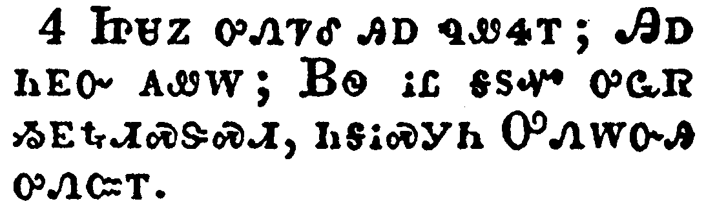</a></td>
</tr>
<tr class="even">
<td>And Jesus answered him, saying, It is written, That man shall not live by bread alone, but by every word of God.</td>
</tr>
<tr class="odd">
<td>ᏥᏌᏃ ᎤᏁᏤᎴ ᎯᎠ ᏄᏪᏎᎢ; ᎯᎠ ᏂᎬᏅ ᎪᏪᎳ; ᏴᏫ ᎥᏝ ᎦᏚᏉ ᎤᏩᏒ ᏱᎬᎿᎭᏗᏍᏕᏍᏗ, ᏂᎦᎥᏍᎩᏂ ᎤᏁᎳᏅᎯ ᎤᏁᏨᎢ.</td>
</tr>
<tr class="even">
<td>Tsi-sa-no u-ne-tse-le hi-a nu-we-se-i; Hi-a ni-gv-nv go-we-la; Yv-wi v-tla ga-du-quo u-wa-sv yi-gv-hna-di-s-de-s-di, ni-ga-v-s-gi-ni U-ne-la-nv-hi u-ne-tsv-i.</td>
</tr>
</tbody>
</table>

<table>
<tbody>
<tr class="odd">
<td><a href="030405.png">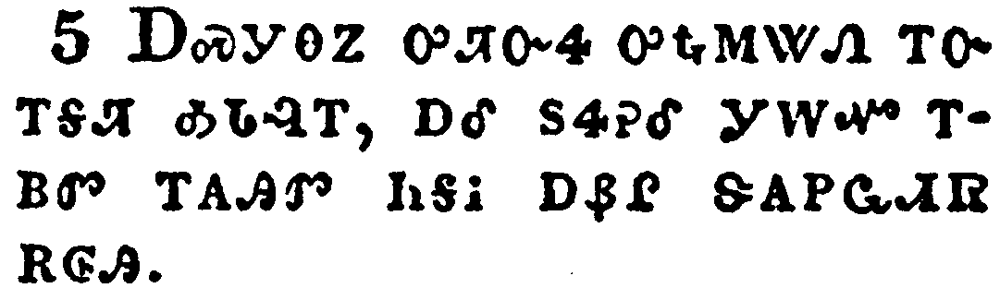</a></td>
</tr>
<tr class="even">
<td>And the devil, taking him up into an high mountain, shewed unto him all the kingdoms of the world in a moment of time.</td>
</tr>
<tr class="odd">
<td>ᎠᏍᎩᎾᏃ ᎤᏘᏅᏎ ᎤᎿᎭᎷᏔᏁ ᎢᏅᎢᎦᏘ ᎣᏓᎸᎢ, ᎠᎴ ᏚᏎᎮᎴ ᎩᎳᏉ ᎢᏴᏛ ᎢᎪᎯᏛ ᏂᎦᎥ ᎠᏰᎵ ᏕᎪᏢᏩᏗᏒ ᎡᎶᎯ.</td>
</tr>
<tr class="even">
<td>A-s-gi-na-no u-ti-nv-se u-hna-lu-ta-ne i-nv-i-ga-ti o-da-lv-i, a-le du-se-he-le gi-la-quo i-yv-dv i-go-hi-dv ni-ga-v a-ye-li de-go-tlv-wa-di-sv e-lo-hi.</td>
</tr>
</tbody>
</table>

<table>
<tbody>
<tr class="odd">
<td><a href="030406.png">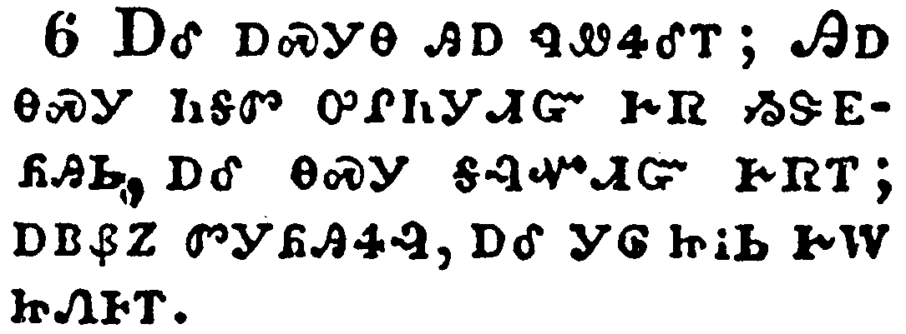</a></td>
</tr>
<tr class="even">
<td>And the devil said unto him, All this power will I give thee, and the glory of them: for that is delivered unto me; and to whomsoever I will I give it.</td>
</tr>
<tr class="odd">
<td>ᎠᎴ ᎠᏍᎩᎾ ᎯᎠ ᏄᏪᏎᎴᎢ; ᎯᎠ ᎾᏍᎩ ᏂᎦᏛ ᎤᎵᏂᎩᏗᏳ ᎨᏒ ᏱᏕᎬᏲᎯᏏ, ᎠᎴ ᎾᏍᎩ ᎦᎸᏉᏗᏳ ᎨᏒᎢ; ᎠᏴᏰᏃ ᏛᎩᏲᎯᏎᎸ, ᎠᎴ ᎩᎶ ᏥᎥᏏ ᎨᎳ ᏥᏁᎰᎢ.</td>
</tr>
<tr class="even">
<td>A-le a-s-gi-na hi-a nu-we-se-le-i; Hi-a na-s-gi ni-ga-dv u-li-ni-gi-di-yu ge-sv yi-de-gv-yo-hi-si, a-le na-s-gi ga-lv-quo-di-yu ge-sv-i; a-yv-ye-no dv-gi-yo-hi-se-lv, a-le gi-lo tsi-v-si ge-la tsi-ne-ho-i.</td>
</tr>
</tbody>
</table>

<table>
<tbody>
<tr class="odd">
<td><a href="030407.png">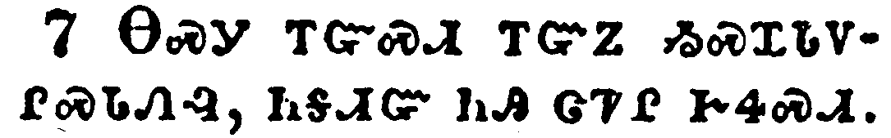</a></td>
</tr>
<tr class="even">
<td>If thou therefore wilt worship me, all shall be thine.</td>
</tr>
<tr class="odd">
<td>ᎾᏍᎩ ᎢᏳᏍᏗ ᎢᏳᏃ ᏱᏍᏆᏓᏙᎵᏍᏓᏁᎸ, ᏂᎦᏗᏳ ᏂᎯ ᏣᏤᎵ ᎨᏎᏍᏗ.</td>
</tr>
<tr class="even">
<td>na-s-gi i-yu-s-di i-yu-no yi-s-qua-da-do-li-s-da-ne-lv, ni-ga-di-yu ni-hi tsa-tse-li ge-se-s-di.</td>
</tr>
</tbody>
</table>

<table>
<tbody>
<tr class="odd">
<td><a href="030408.png">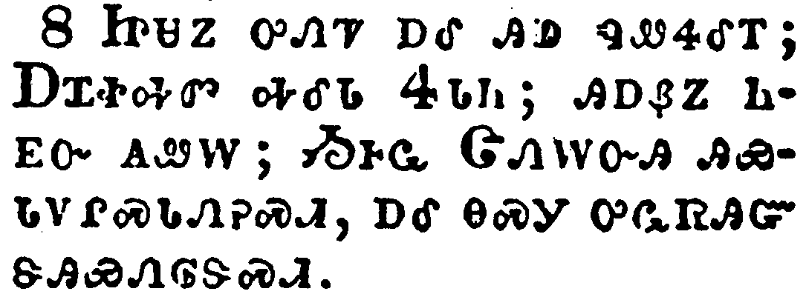</a></td>
</tr>
<tr class="even">
<td>And Jesus answered and said unto him, Get thee behind me, Satan: for it is written, Thou shalt worship the Lord thy God, and him only shalt thou serve.</td>
</tr>
<tr class="odd">
<td>ᏥᏌᏃ ᎤᏁᏤ ᎠᎴ ᎯᎠ ᏄᏪᏎᎴᎢ; ᎠᏆᏐᎭᏛ ᎭᎴᏓ ᏎᏓᏂ; ᎯᎠᏰᏃ ᏂᎬᏅ ᎪᏪᎳ; ᏱᎰᏩ ᏣᏁᎳᏅᎯ ᎯᏯᏓᏙᎵᏍᏓᏁᎮᏍᏗ, ᎠᎴ ᎾᏍᎩ ᎤᏩᏒᎯᏳ ᏕᎯᏯᏁᎶᏕᏍᏗ.</td>
</tr>
<tr class="even">
<td>Tsi-sa-no u-ne-tse a-le hi-a nu-we-se-le-i; A-qua-so-ha-dv ha-le-da Se-da-ni; hi-a-ye-no ni-gv-nv go-we-la; Yi-ho-wa Tsa-ne-la-nv-hi hi-ya-da-do-li-s-da-ne-he-s-di, a-le na-s-gi u-wa-sv-hi-yu de-hi-ya-ne-lo-de-s-di.</td>
</tr>
</tbody>
</table>

<table>
<tbody>
<tr class="odd">
<td><a href="030409.png">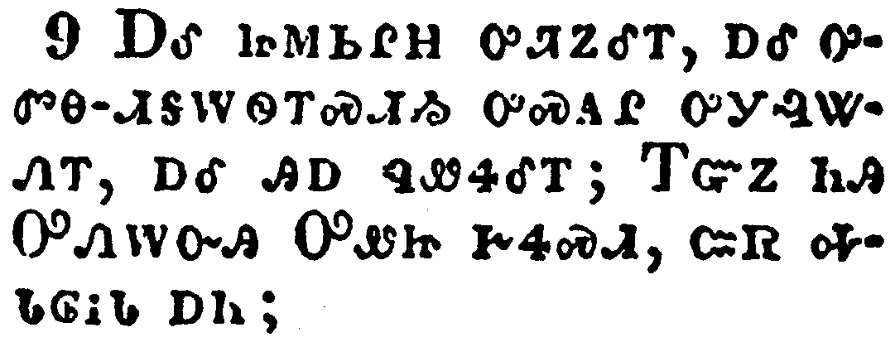</a></td>
</tr>
<tr class="even">
<td>And he brought him to Jerusalem, and set him on a pinnacle of the temple, and said unto him, If thou be the Son of God, cast thyself down from hence:</td>
</tr>
<tr class="odd">
<td>ᎠᎴ ᏥᎷᏏᎵᎻ ᎤᏘᏃᎴᎢ, ᎠᎴ ᎤᏛᎾ-ᏗᎦᎳᏫᎢᏍᏗᏱ ᎤᏍᎪᎵ ᎤᎩᎸᏔᏁᎢ, ᎠᎴ ᎯᎠ ᏄᏪᏎᎴᎢ; ᎢᏳᏃ ᏂᎯ ᎤᏁᎳᏅᎯ ᎤᏪᏥ ᎨᏎᏍᏗ, ᏨᏒ ᎭᏓᎶᎥᏓ ᎠᏂ;</td>
</tr>
<tr class="even">
<td>A-le tsi-lu-si-li-mi u-ti-no-le-i, a-le u-dv-na--di-ga-la-wi-i-s-di-yi u-s-go-li u-gi-lv-ta-ne-i, a-le hi-a nu-we-se-le-i; I-yu-no ni-hi U-ne-la-nv-hi U-we-tsi ge-se-s-di, tsv-sv ha-da-lo-v-da a-ni;</td>
</tr>
</tbody>
</table>

<table>
<tbody>
<tr class="odd">
<td><a href="030410.png">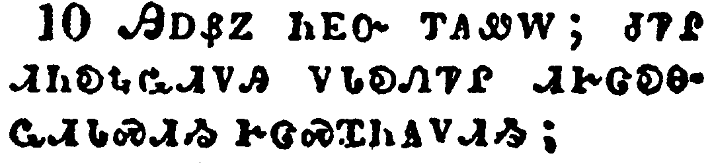</a></td>
</tr>
<tr class="even">
<td>For it is written, He shall give his angels charge over thee, to keep thee:</td>
</tr>
<tr class="odd">
<td>ᎯᎠᏰᏃ ᏂᎬᏅ ᎢᎪᏪᎳ; ᏧᏤᎵ ᏗᏂᎧᎿᎭᏩᏗᏙᎯ ᏙᏓᎧᏁᏤᎵ ᏗᎨᏣᎧᎾᏩᏗᏓᏍᏗᏱ ᎨᏣᏍᏆᏂᎪᏙᏗᏱ;</td>
</tr>
<tr class="even">
<td>Hi-a-ye-no ni-gv-nv i-go-we-la; tsu-tse-li di-ni-ka-hna-wa-di-do-hi do-da-ka-ne-tse-li di-ge-tsa-ka-na-wa-di-da-s-di-yi ge-tsa-s-qua-ni-go-do-di-yi;</td>
</tr>
</tbody>
</table>

<table>
<tbody>
<tr class="odd">
<td><a href="030411.png">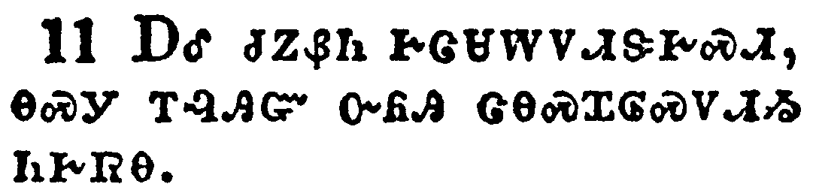</a></td>
</tr>
<tr class="even">
<td>And in their hands they shall bear thee up, lest at any time thou dash thy foot against a stone.</td>
</tr>
<tr class="odd">
<td>ᎠᎴ ᏧᏃᏰᏂ ᎨᏣᏌᎳᏙᏗᏕᎨᏍᏗ, ᎾᏍᎩ ᎢᎸᎯᏳ ᏅᏲᎯ ᏣᎾᏍᏆᎶᏍᏙᏗᏱ ᏂᎨᏒᎾ.</td>
</tr>
<tr class="even">
<td>A-le tsu-no-ye-ni ge-tsa-sa-la-do-di-de-ge-s-di, na-s-gi i-lv-hi-yu nv-yo-hi tsa-na-s-qua-lo-s-do-di-yi ni-ge-sv-na.</td>
</tr>
</tbody>
</table>

<table>
<tbody>
<tr class="odd">
<td><a href="030412.png">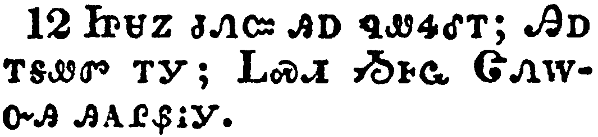</a></td>
</tr>
<tr class="even">
<td>And Jesus answering said unto him, It is said, Thou shalt not tempt the Lord thy God.</td>
</tr>
<tr class="odd">
<td>ᏥᏌᏃ ᏧᏁᏨ ᎯᎠ ᏄᏪᏎᎴᎢ; ᎯᎠ ᎢᎦᏪᏛ ᎢᎩ; ᏞᏍᏗ ᏱᎰᏩ ᏣᏁᎳᏅᎯ ᎯᎪᎵᏰᎥᎩ.</td>
</tr>
<tr class="even">
<td>Tsi-sa-no tsu-ne-tsv hi-a nu-we-se-le-i; Hi-a i-ga-we-dv i-gi; Tle-s-di Yi-ho-wa Tsa-ne-la-nv-hi hi-go-li-ye-v-gi.</td>
</tr>
</tbody>
</table>

<table>
<tbody>
<tr class="odd">
<td><a href="030413.png">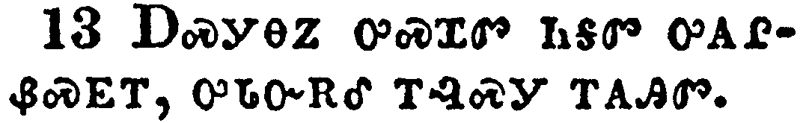</a></td>
</tr>
<tr class="even">
<td>And when the devil had ended all the temptation, he departed from him for a season.</td>
</tr>
<tr class="odd">
<td>ᎠᏍᎩᎾᏃ ᎤᏍᏆᏛ ᏂᎦᏛ ᎤᎪᎵᏰᏍᎬᎢ, ᎤᏓᏅᎡᎴ ᎢᎸᏍᎩ ᎢᎪᎯᏛ.</td>
</tr>
<tr class="even">
<td>A-s-gi-na-no u-s-qua-dv ni-ga-dv u-go-li-ye-s-gv-i, u-da-nv-e-le i-lv-s-gi i-go-hi-dv.</td>
</tr>
</tbody>
</table>

<table>
<tbody>
<tr class="odd">
<td><a href="030414.png">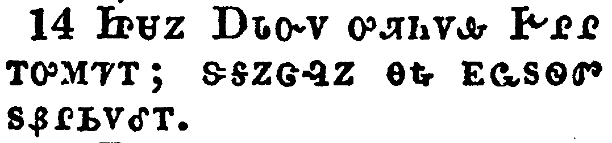</a></td>
</tr>
<tr class="even">
<td>And Jesus returned in the power of the Spirit into Galilee: and there went out a fame of him through all the region round about.</td>
</tr>
<tr class="odd">
<td>ᏥᏌᏃ ᎠᏓᏅᏙ ᎤᏘᏂᏙᎲ ᎨᎵᎵ ᎢᎤᎷᏤᎢ; ᏕᎦᏃᏣᎸᏃ ᎾᎿᎭᎬᏩᏚᏫᏛ ᏚᏰᎵᏏᏙᎴᎢ.</td>
</tr>
<tr class="even">
<td>Tsi-sa-no A-da-nv-do u-ti-ni-do-hv Ge-li-li i-u-lu-tse-i; de-ga-no-tsa-lv-no na-hna gv-wa-du-wi-dv du-ye-li-si-do-le-i.</td>
</tr>
</tbody>
</table>

<table>
<tbody>
<tr class="odd">
<td><a href="030415.png">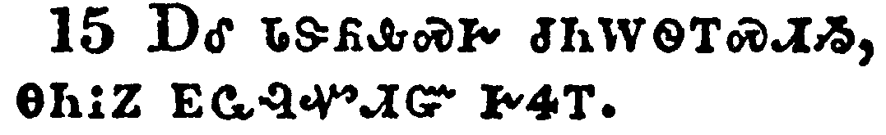</a></td>
</tr>
<tr class="even">
<td>And he taught in their synagogues, being glorified of all.</td>
</tr>
<tr class="odd">
<td>ᎠᎴ ᏓᏕᏲᎲᏍᎨ ᏧᏂᎳᏫᎢᏍᏗᏱ, ᎾᏂᎥᏃ ᎬᏩᎸᏉᏗᏳ ᎨᏎᎢ.</td>
</tr>
<tr class="even">
<td>A-le da-de-yo-hv-s-ge tsu-ni-la-wi-i-s-di-yi, na-ni-v-no gv-wa-lv-quo-di-yu ge-se-i.</td>
</tr>
</tbody>
</table>

<table>
<tbody>
<tr class="odd">
<td><a href="030416.png">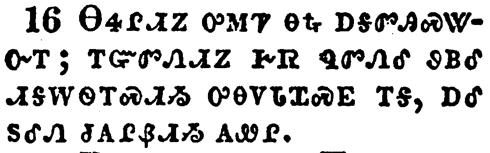</a></td>
</tr>
<tr class="even">
<td>And he came to Nazareth, where he had been brought up: and, as his custom was, he went into the synagogue on the sabbath day, and stood up for to read.</td>
</tr>
<tr class="odd">
<td>ᎾᏎᎵᏗᏃ ᎤᎷᏤ ᎾᎿᎭᎠᎦᏛᎯᏍᏔᏅᎢ; ᎢᏳᏛᏁᏗᏃ ᎨᏒ ᏄᏛᏁᎴ ᏭᏴᎴ ᏗᎦᎳᏫᎢᏍᏗᏱ ᎤᎾᏙᏓᏆᏍᎬ ᎢᎦ, ᎠᎴ ᏚᎴᏁ ᏧᎪᎵᏰᏗᏱ ᎪᏪᎵ.</td>
</tr>
<tr class="even">
<td>Na-se-li-di-no u-lu-tse na-hna a-ga-dv-hi-s-ta-nv-i; i-yu-dv-ne-di-no ge-sv nu-dv-ne-le wu-yv-le di-ga-la-wi-i-s-di-yi u-na-do-da-qua-s-gv i-ga, a-le du-le-ne tsu-go-li-ye-di-yi go-we-li.</td>
</tr>
</tbody>
</table>

<table>
<tbody>
<tr class="odd">
<td><a href="030417.png">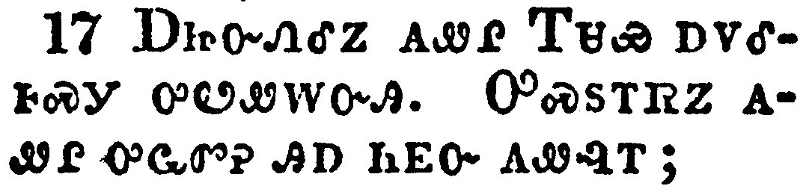</a></td>
</tr>
<tr class="even">
<td>And there was delivered unto him the book of the prophet Esaias. And when he had opened the book, he found the place where it was written,</td>
</tr>
<tr class="odd">
<td>ᎠᏥᏅᏁᎴᏃ ᎪᏪᎵ ᎢᏌᏯ ᎠᏙᎴᎰᏍᎩ ᎤᏬᏪᎳᏅᎯ. ᎤᏍᏚᎢᏒᏃ ᎪᏪᎵ ᎤᏩᏛᎮ ᎯᎠ ᏂᎬᏅ ᎪᏪᎸᎢ;</td>
</tr>
<tr class="even">
<td>A-tsi-nv-ne-le-no go-we-li I-sa-ya a-do-le-ho-s-gi u-wo-we-la-nv-hi. U-s-du-i-sv-no go-we-li u-wa-dv-he hi-a ni-gv-nv go-we-lv-i;</td>
</tr>
</tbody>
</table>

<table>
<tbody>
<tr class="odd">
<td><a href="030418.png">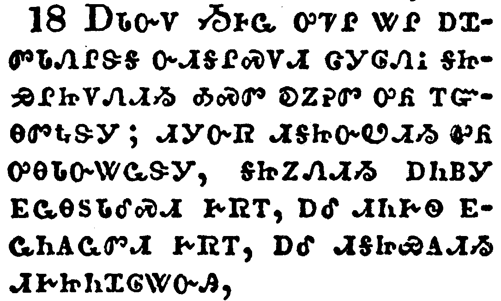</a></td>
</tr>
<tr class="even">
<td>The Spirit of the Lord is upon me, because he hath anointed me to preach the gospel to the poor; he hath sent me to heal the brokenhearted, to preach deliverance to the captives, and recovering of sight to the blind, to set at liberty them that are bruised,</td>
</tr>
<tr class="odd">
<td>ᎠᏓᏅᏙ ᏱᎰᏩ ᎤᏤᎵ ᏔᎵ ᎠᏆᏛᏓᏁᎵᏕᎦ ᏅᏗᎦᎵᏍᏙᏗ ᏣᎩᎶᏁᎥ ᎦᏥᏯᎵᏥᏙᏁᏗᏱ ᎣᏍᏛ ᎧᏃᎮᏛ ᎤᏲ ᎢᏳᎾᏛᎿᎭᏕᎩ; ᏗᎩᏅᏒ ᏗᎦᏥᏅᏬᏗᏱ ᎤᏲ ᎤᎾᏓᏅᏔᏩᏕᎩ, ᎦᏥᏃᏁᏗᏱ ᎠᏂᏴᎩ ᎬᏩᎾᏚᏓᎴᏍᏗ ᎨᏒᎢ, ᎠᎴ ᏗᏂᎨᏫ ᎬᏩᏂᎪᏩᏛᏗ ᎨᏒᎢ, ᎠᎴ ᏗᎦᏥᏯᎪᏗᏱ ᏗᎨᏥᏂᏆᎶᏔᏅᎯ,</td>
</tr>
<tr class="even">
<td>A-da-nv-do Yi-ho-wa u-tse-li ta-li a-qua-dv-da-ne-li-de-ga nv-di-ga-li-s-do-di tsa-gi-lo-ne-v ga-tsi-ya-li-tsi-do-ne-di-yi o-s-dv ka-no-he-dv u-yo i-yu-na-dv-hna-de-gi; di-gi-nv-sv di-ga-tsi-nv-wo-di-yi u-yo u-na-da-nv-ta-wa-de-gi, ga-tsi-no-ne-di-yi a-ni-yv-gi gv-wa-na-du-da-le-s-di ge-sv-i, a-le di-ni-ge-wi gv-wa-ni-go-wa-dv-di ge-sv-i, a-le di-ga-tsi-ya-go-di-yi di-ge-tsi-ni-qua-lo-ta-nv-hi,</td>
</tr>
</tbody>
</table>

<table>
<tbody>
<tr class="odd">
<td><a href="030419.png">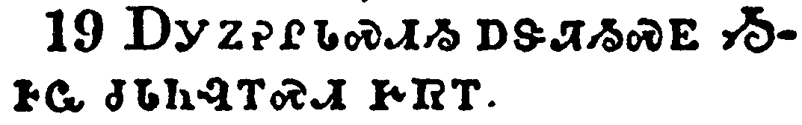</a></td>
</tr>
<tr class="even">
<td>To preach the acceptable year of the Lord.</td>
</tr>
<tr class="odd">
<td>ᎠᎩᏃᎮᎵᏓᏍᏗᏱ ᎠᏕᏘᏱᏍᎬ ᏱᎰᏩ ᏧᏓᏂᎸᎢᏍᏗ ᎨᏒᎢ.</td>
</tr>
<tr class="even">
<td>A-gi-no-he-li-da-s-di-yi a-de-ti-yi-s-gv Yi-ho-wa tsu-da-ni-lv-i-s-di ge-sv-i.</td>
</tr>
</tbody>
</table>

<table>
<tbody>
<tr class="odd">
<td></td>
</tr>
<tr class="even">
<td>And he closed the book, and he gave it again to the minister, and sat down. And the eyes of all them that were in the synagogue were fastened on him.</td>
</tr>
<tr class="odd">
<td>ᎤᏍᏚᏁᏃ ᎪᏪᎵ ᎠᎴ ᏫᎤᏅᏁᎴ ᎠᏥᏅᏏᏓᏍᏗ, ᎠᎴ ᎤᏪᏁᎢ. ᏂᎦᏛᏃ ᏗᎦᎳᏫᎢᏍᏗᏱ ᎠᏂᏯᎢ ᎤᏯᏅᏒᎯ ᏕᎬᏩᎧᎿᎭᏁᎢ.</td>
</tr>
<tr class="even">
<td>U-s-du-ne-no go-we-li a-le wi-u-nv-ne-le a-tsi-nv-si-da-s-di, a-le u-we-ne-i. Ni-ga-dv-no di-ga-la-wi-i-s-di-yi a-ni-ya-i u-ya-nv-sv-hi de-gv-wa-ka-hna-ne-i.</td>
</tr>
</tbody>
</table>

<table>
<tbody>
<tr class="odd">
<td><a href="030421.png">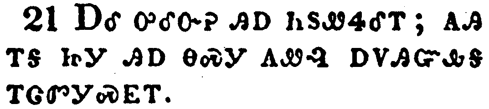</a></td>
</tr>
<tr class="even">
<td>And he began to say unto them, This day is this scripture fulfilled in your ears.</td>
</tr>
<tr class="odd">
<td>ᎠᎴ ᎤᎴᏅᎮ ᎯᎠ ᏂᏚᏪᏎᎴᎢ; ᎪᎯ ᎢᎦ ᏥᎩ ᎯᎠ ᎾᏍᎩ ᎪᏪᎸ ᎠᏙᎯᏳᎲᎦ ᎢᏣᏛᎩᏍᎬᎢ.</td>
</tr>
<tr class="even">
<td>A-le u-le-nv-he hi-a ni-du-we-se-le-i; go-hi i-ga tsi-gi hi-a na-s-gi go-we-lv a-do-hi-yu-hv-ga i-tsa-dv-gi-s-gv-i.</td>
</tr>
</tbody>
</table>

<table>
<tbody>
<tr class="odd">
<td><a href="030422.png">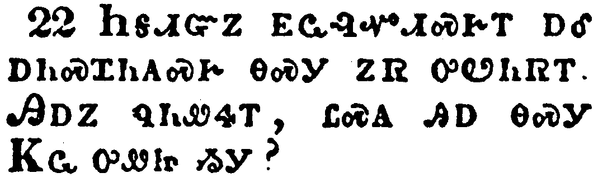</a></td>
</tr>
<tr class="even">
<td>And all bare him witness, and wondered at the gracious words which proceeded out of his mouth. And they said, Is not this Joseph's son?</td>
</tr>
<tr class="odd">
<td>ᏂᎦᏗᏳᏃ ᎬᏩᎸᏉᏗᏍᎨᎢ ᎠᎴ ᎠᏂᏍᏆᏂᎪᏍᎨ ᎾᏍᎩ ᏃᏒ ᎤᏬᏂᏒᎢ. ᎯᎠᏃ ᏄᏂᏪᏎᎢ, ᏝᏍᎪ ᎯᎠ ᎾᏍᎩ ᏦᏩ ᎤᏪᏥ ᏱᎩ?</td>
</tr>
<tr class="even">
<td>Ni-ga-di-yu-no gv-wa-lv-quo-di-s-ge-i a-le a-ni-s-qua-ni-go-s-ge na-s-gi no-sv u-wo-ni-sv-i. Hi-a-no nu-ni-we-se-i, tla-s-go hi-a na-s-gi Tso-wa u-we-tsi yi-gi?</td>
</tr>
</tbody>
</table>

<table>
<tbody>
<tr class="odd">
<td><a href="030423.png">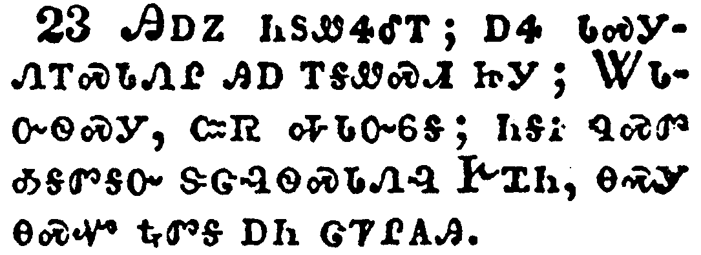</a></td>
</tr>
<tr class="even">
<td>And he said unto them, Ye will surely say unto me this proverb, Physician, heal thyself: whatsoever we have heard done in Capernaum, do also here in thy country.</td>
</tr>
<tr class="odd">
<td>ᎯᎠᏃ ᏂᏚᏪᏎᎴᎢ; ᎠᏎ ᏓᏍᎩᏁᎢᏍᏓᏁᎵ ᎯᎠ ᎢᎦᏪᏍᏗ ᏥᎩ; ᏔᏓᏅᏫᏍᎩ, ᏨᏒ ᎭᏓᏅᏮᎦ; ᏂᎦᎥ ᏄᏍᏛ ᎣᎦᏛᎦᏅ ᏕᏣᎸᏫᏍᏓᏁᎸ ᎨᏆᏂ, ᎾᏍᎩ ᎾᏍᏉ ᎿᎭᏛᎦ ᎠᏂ ᏣᏤᎵᎪᎯ.</td>
</tr>
<tr class="even">
<td>Hi-a-no ni-du-we-se-le-i; a-se da-s-gi-ne-i-s-da-ne-li hi-a i-ga-we-s-di tsi-gi; Ta-da-nv-wi-s-gi, tsv-sv ha-da-nv-wv-ga; ni-ga-v nu-s-dv o-ga-dv-ga-nv de-tsa-lv-wi-s-da-ne-lv Ge-qua-ni, na-s-gi na-s-quo hna-dv-ga a-ni tsa-tse-li-go-hi.</td>
</tr>
</tbody>
</table>

<table>
<tbody>
<tr class="odd">
<td><a href="030424.png">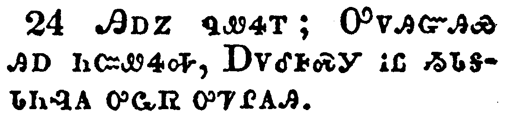</a></td>
</tr>
<tr class="even">
<td>And he said, Verily I say unto you, No prophet is accepted in his own country.</td>
</tr>
<tr class="odd">
<td>ᎯᎠᏃ ᏄᏪᏎᎢ; ᎤᏙᎯᏳᎯᏯ ᎯᎠ ᏂᏨᏪᏎᎭ, ᎠᏙᎴᎰᏍᎩ ᎥᏝ ᏱᏓᎦᏓᏂᎸᎪ ᎤᏩᏒ ᎤᏤᎵᎪᎯ.</td>
</tr>
<tr class="even">
<td>Hi-a-no nu-we-se-i; U-do-hi-yu-hi-ya hi-a ni-tsv-we-se-ha, A-do-le-ho-s-gi v-tla yi-da-ga-da-ni-lv-go u-wa-sv u-tse-li-go-hi.</td>
</tr>
</tbody>
</table>

<table>
<tbody>
<tr class="odd">
<td><a href="030425.png">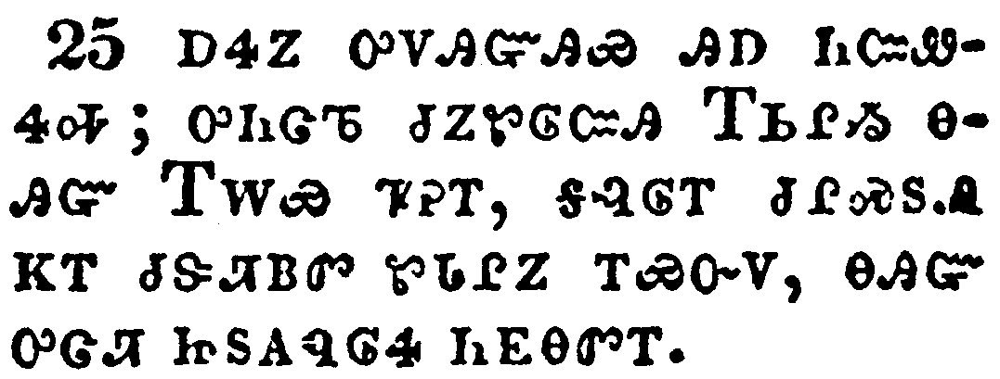</a></td>
</tr>
<tr class="even">
<td>But I tell you of a truth, many widows were in Israel in the days of Elias, when the heaven was shut up three years and six months, when great famine was throughout all the land;</td>
</tr>
<tr class="odd">
<td>ᎠᏎᏃ ᎤᏙᎯᏳᎯᏯ ᎯᎠ ᏂᏨᏪᏎᎭ; ᎤᏂᏣᏖ ᏧᏃᏑᎶᏨᎯ ᎢᏏᎵᏱ ᎾᎯᏳ ᎢᎳᏯ ᏤᎮᎢ, ᎦᎸᎶᎢ ᏧᎵᏍᏚᎯ ᏦᎢ ᏧᏕᏘᏴᏛ ᏑᏓᎵᏃ ᎢᏯᏅᏙ, ᎾᎯᏳ ᎤᏣᏘ ᏥᏚᎪᏄᎶᎭ ᏂᎬᎾᏛᎢ.</td>
</tr>
<tr class="even">
<td>A-se-no u-do-hi-yu-hi-ya hi-a ni-tsv-we-se-ha; u-ni-tsa-te tsu-no-su-lo-tsv-hi I-si-li-yi na-hi-yu I-la-ya tse-he-i, ga-lv-lo-i tsu-li-s-du-hi tso-i tsu-de-ti-yv-dv su-da-li-no i-ya-nv-do, na-hi-yu u-tsa-ti tsi-du-go-nu-lo-ha ni-gv-na-dv-i.</td>
</tr>
</tbody>
</table>

<table>
<tbody>
<tr class="odd">
<td><a href="030426.png">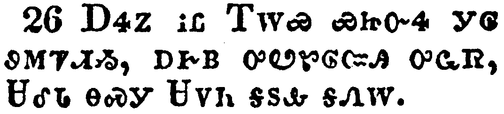</a></td>
</tr>
<tr class="even">
<td>But unto none of them was Elias sent, save unto Sarepta, a city of Sidon, unto a woman that was a widow.</td>
</tr>
<tr class="odd">
<td>ᎠᏎᏃ ᎥᏝ ᎢᎳᏯ ᏯᏥᏅᏎ ᎩᎶ ᏭᎷᏤᏗᏱ, ᎠᎨᏴ ᎤᏬᏑᎶᏨᎯ ᎤᏩᏒ, ᏌᎴᏓ ᎾᏍᎩ ᏌᏙᏂ ᎦᏚᎲ ᎦᏁᎳ.</td>
</tr>
<tr class="even">
<td>A-se-no v-tla I-la-ya ya-tsi-nv-se gi-lo wu-lu-tse-di-yi, a-ge-yv u-wo-su-lo-tsv-hi u-wa-sv, Sa-le-da na-s-gi Sa-do-ni ga-du-hv ga-ne-la.</td>
</tr>
</tbody>
</table>

<table>
<tbody>
<tr class="odd">
<td><a href="030427.png">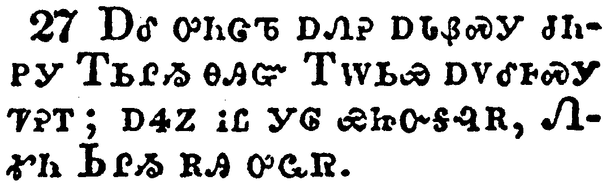</a></td>
</tr>
<tr class="even">
<td>And many lepers were in Israel in the time of Eliseus the prophet; and none of them was cleansed, saving Naaman the Syrian.</td>
</tr>
<tr class="odd">
<td>ᎠᎴ ᎤᏂᏣᏖ ᎠᏁᎮ ᎠᏓᏰᏍᎩ ᏧᏂᏢᎩ ᎢᏏᎵᏱ ᎾᎯᏳ ᎢᎳᏏᏯ ᎠᏙᎴᎰᏍᎩ ᏤᎮᎢ; ᎠᏎᏃ ᎥᏝ ᎩᎶ ᏯᏥᏅᎦᎸᎡ, ᏁᎹᏂ ᏏᎵᏱ ᎡᎯ ᎤᏩᏒ.</td>
</tr>
<tr class="even">
<td>A-le u-ni-tsa-te a-ne-he a-da-ye-s-gi tsu-ni-tlv-gi I-si-li-yi na-hi-yu I-la-si-ya a-do-le-ho-s-gi tse-he-i; a-se-no v-tla gi-lo ya-tsi-nv-ga-lv-e, Ne-ma-ni Si-li-yi e-hi u-wa-sv.</td>
</tr>
</tbody>
</table>

<table>
<tbody>
<tr class="odd">
<td><a href="030428.png">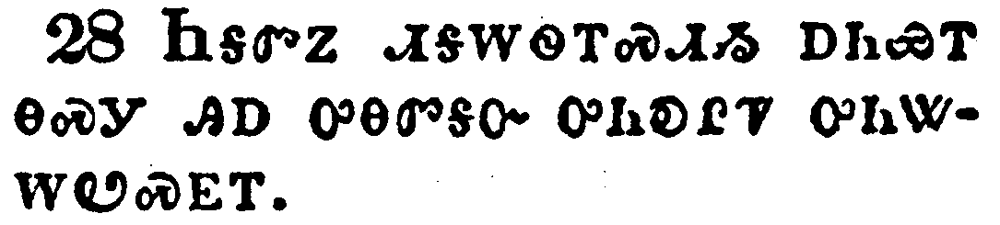</a></td>
</tr>
<tr class="even">
<td>And all they in the synagogue, when they heard these things, were filled with wrath,</td>
</tr>
<tr class="odd">
<td>ᏂᎦᏛᏃ ᏗᎦᎳᏫᎢᏍᏗᏱ ᎠᏂᏯᎢ ᎾᏍᎩ ᎯᎠ ᎤᎾᏛᎦᏅ ᎤᏂᎧᎵᏤ ᎤᏂᏔᎳᏬᏍᎬᎢ.</td>
</tr>
<tr class="even">
<td>Ni-ga-dv-no di-ga-la-wi-i-s-di-yi a-ni-ya-i na-s-gi hi-a u-na-dv-ga-nv u-ni-ka-li-tse u-ni-ta-la-wo-s-gv-i.</td>
</tr>
</tbody>
</table>

<table>
<tbody>
<tr class="odd">
<td><a href="030429.png">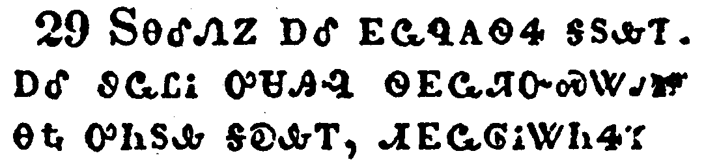</a></td>
</tr>
<tr class="even">
<td>And rose up, and thrust him out of the city, and led him unto the brow of the hill whereon their city was built, that they might cast him down headlong.</td>
</tr>
<tr class="odd">
<td>ᏚᎾᎴᏁᏃ ᎠᎴ ᎬᏩᏄᎪᏫᏎ ᎦᏚᎲᎢ, ᎠᎴ ᏭᏩᏝᎥ ᎤᏌᎯᎸ ᏫᎬᏩᏘᏅᏍᏔ ᎾᎿᎭᎤᏂᏚᎲ ᎦᎧᎲᎢ, ᏗᎬᏩᎶᎥᏔᏂᏎᎢ</td>
</tr>
<tr class="even">
<td>Du-na-le-ne-no a-le gv-wa-nu-go-wi-se ga-du-hv-i, a-le wu-wa-tla-v u-sa-hi-lv wi-gv-wa-ti-nv-s-ta na-hna u-ni-du-hv ga-ka-hv-i, di-gv-wa-lo-v-ta-ni-se-i</td>
</tr>
</tbody>
</table>

<table>
<tbody>
<tr class="odd">
<td></td>
</tr>
<tr class="even">
<td>But he passing through the midst of them went his way,</td>
</tr>
<tr class="odd">
<td>ᎠᏎᏃ ᎤᎦᏛᎴᏎ ᎠᏰᎵ ᎠᏂᏙᎾᎥ ᎢᎬᏪᏅᏍᏔᏁᏉ;</td>
</tr>
<tr class="even">
<td>A-se-no u-ga-dv-le-se a-ye-li a-ni-do-na-v i-gv-we-nv-s-ta-ne-quo;</td>
</tr>
</tbody>
</table>

<table>
<tbody>
<tr class="odd">
<td><a href="030431.png">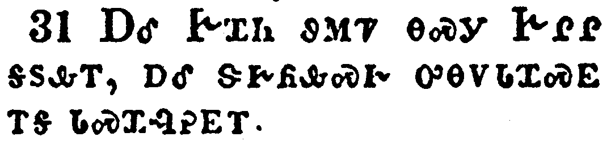</a></td>
</tr>
<tr class="even">
<td>And came down to Capernaum, a city of Galilee, and taught them on the sabbath days.</td>
</tr>
<tr class="odd">
<td>ᎠᎴ ᎨᏆᏂ ᏭᎷᏤ ᎾᏍᎩ ᎨᎵᎵ ᎦᏚᎲᎢ, ᎠᎴ ᏕᎨᏲᎲᏍᎨ ᎤᎾᏙᏓᏆᏍᎬ ᎢᎦ ᏓᏍᏆᎸᎮᎬᎢ.</td>
</tr>
<tr class="even">
<td>A-le Ge-qua-ni wu-lu-tse na-s-gi Ge-li-li ga-du-hv-i, a-le de-ge-yo-hv-s-ge u-na-do-da-qua-s-gv i-ga da-s-qua-lv-he-gv-i.</td>
</tr>
</tbody>
</table>

<table>
<tbody>
<tr class="odd">
<td><a href="030432.png">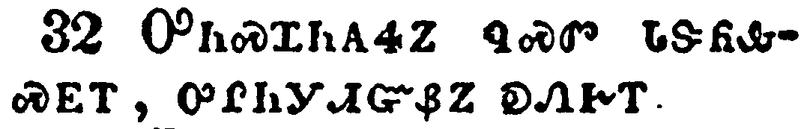</a></td>
</tr>
<tr class="even">
<td>And they were astonished at his doctrine: for his word was with power.</td>
</tr>
<tr class="odd">
<td>ᎤᏂᏍᏆᏂᎪᏎᏃ ᏄᏍᏛ ᏓᏕᏲᎲᏍᎬᎢ, ᎤᎵᏂᎩᏗᏳᏰᏃ ᎧᏁᎨᎢ.</td>
</tr>
<tr class="even">
<td>U-ni-s-qua-ni-go-se-no nu-s-dv da-de-yo-hv-s-gv-i, u-li-ni-gi-di-yu-ye-no ka-ne-ge-i.</td>
</tr>
</tbody>
</table>

<table>
<tbody>
<tr class="odd">
<td><a href="030433.png">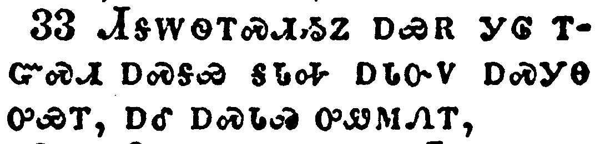</a></td>
</tr>
<tr class="even">
<td>And in the synagogue there was a man, which had a spirit of an unclean devil, and cried out with a loud voice,</td>
</tr>
<tr class="odd">
<td>ᏗᎦᎳᏫᎢᏍᏗᏱᏃ ᎠᏯᎡ ᎩᎶ ᎢᏳᏍᏗ ᎠᏍᎦᏯ ᎦᏓᎭ ᎠᏓᏅᏙ ᎠᏍᎩᎾ ᎤᏯᎢ, ᎠᎴ ᎠᏍᏓᏇ ᎤᏪᎷᏁᎢ,</td>
</tr>
<tr class="even">
<td>Di-ga-la-wi-i-s-di-yi-no a-ya-e gi-lo i-yu-s-di a-s-ga-ya ga-da-ha a-da-nv-do a-s-gi-na u-ya-i, a-le a-s-da-que u-we-lu-ne-i,</td>
</tr>
</tbody>
</table>

<table>
<tbody>
<tr class="odd">
<td><a href="030434.png">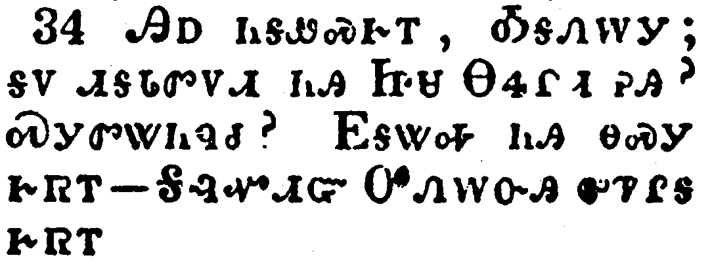</a></td>
</tr>
<tr class="even">
<td>Saying, Let us alone; what have we to do with thee, thou Jesus of Nazareth? art thou come to destroy us? I know thee who thou art; the Holy One of God.</td>
</tr>
<tr class="odd">
<td>ᎯᎠ ᏂᎦᏪᏍᎨᎢ, ᎣᎦᏁᎳᎩ; ᎦᏙ ᏗᎦᏓᏛᏙᏗ ᏂᎯ ᏥᏌ ᎾᏎᎵᏗ ᎮᎯ? ᏍᎩᏛᏔᏂᏄᏧ? ᎬᎦᏔᎭ ᏂᎯ ᎾᏍᎩ ᎨᏒᎢ-ᎦᎸᏉᏗᏳ ᎤᏁᎳᏅᎯ ᎤᏤᎵᎦ ᎨᏒᎢ</td>
</tr>
<tr class="even">
<td>Hi-a ni-ga-we-s-ge-i, O-ga-ne-la-gi; ga-do di-ga-da-dv-do-di ni-hi Tsi-sa Na-se-li-di he-hi? S-gi-dv-ta-ni-nu-tsu? Gv-ga-ta-ha ni-hi na-s-gi ge-sv-i--Ga-lv-quo-di-yu U-ne-la-nv-hi u-tse-li-ga ge-sv-i</td>
</tr>
</tbody>
</table>

<table>
<tbody>
<tr class="odd">
<td><a href="030435.png">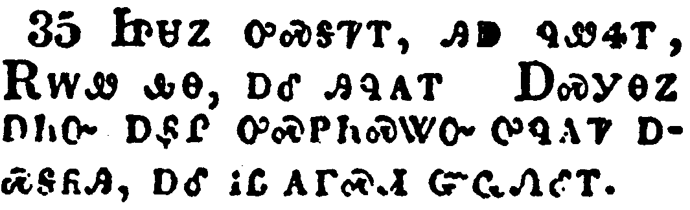</a></td>
</tr>
<tr class="even">
<td>And Jesus rebuked him, saying, Hold thy peace, and come out of him. And when the devil had thrown him in the midst, he came out of him, and hurt him not.</td>
</tr>
<tr class="odd">
<td>ᏥᏌᏃ ᎤᏍᎦᏤᎢ, ᎯᎠ ᏄᏪᏎᎢ, ᎡᎳᏪ ᎲᎾ, ᎠᎴ ᎯᏄᎪᎢ ᎠᏍᎩᎾᏃ ᎠᏂᏅ ᎠᏰᎵ ᎤᏍᏢᏂᏍᏔᏅ ᎤᏄᎪᏤ ᎠᏍᎦᏲᎯ, ᎠᎴ ᎥᏝ ᎪᎱᏍᏗ ᏳᏩᏁᎴᎢ.</td>
</tr>
<tr class="even">
<td>Tsi-sa-no u-s-ga-tse-i, hi-a nu-we-se-i, E-la-we hv-na, a-le hi-nu-go-i A-s-gi-na-no a-ni-nv a-ye-li u-s-tlv-ni-s-ta-nv u-nu-go-tse a-s-ga-yo-hi, a-le v-tla go-hu-s-di yu-wa-ne-le-i.</td>
</tr>
</tbody>
</table>

<table>
<tbody>
<tr class="odd">
<td><a href="030436.png">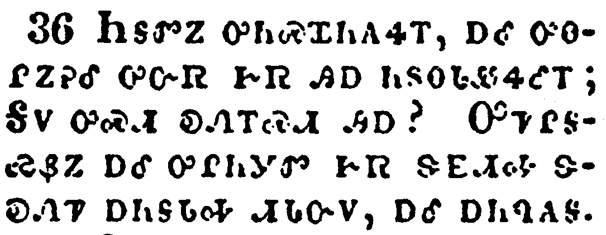</a></td>
</tr>
<tr class="even">
<td>And they were all amazed, and spake among themselves, saying, What a word is this! for with authority and power he commandeth the unclean spirits, and they come out.</td>
</tr>
<tr class="odd">
<td>ᏂᎦᏛᏃ ᎤᏂᏍᏆᏂᎪᏎᎢ, ᎠᎴ ᎤᎾᎵᏃᎮᎴ ᎤᏅᏒ ᎨᏒ ᎯᎠ ᏂᏚᎾᏓᏪᏎᎴᎢ; ᎦᏙ ᎤᏍᏗ ᎧᏁᎢᏍᏗ ᎯᎠ? ᎤᏤᎵᎦᏯᏰᏃ ᎠᎴ ᎤᎵᏂᎩᏛ ᎨᏒ ᏕᎬᏗᎭ ᏕᎧᏁᏤ ᎠᏂᎦᏓᎭ ᏗᏓᏅᏙ, ᎠᎴ ᎠᏂᏄᎪᎦ.</td>
</tr>
<tr class="even">
<td>Ni-ga-dv-no u-ni-s-qua-ni-go-se-i, a-le u-na-li-no-he-le u-nv-sv ge-sv hi-a ni-du-na-da-we-se-le-i; Ga-do u-s-di ka-ne-i-s-di hi-a? U-tse-li-ga-ya-ye-no a-le u-li-ni-gi-dv ge-sv de-gv-di-ha de-ka-ne-tse a-ni-ga-da-ha di-da-nv-do, a-le a-ni-nu-go-ga.</td>
</tr>
</tbody>
</table>

<table>
<tbody>
<tr class="odd">
<td><a href="030437.png">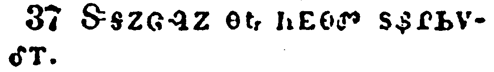</a></td>
</tr>
<tr class="even">
<td>And the fame of him went out into every place of the country round about.</td>
</tr>
<tr class="odd">
<td>ᏕᎦᏃᏣᎸᏃ ᎾᎿᎭᏂᎬᎾᏛ ᏚᏰᎵᏏᏙᎴᎢ.</td>
</tr>
<tr class="even">
<td>De-ga-no-tsa-lv-no na-hna ni-gv-na-dv du-ye-li-si-do-le-i.</td>
</tr>
</tbody>
</table>

<table>
<tbody>
<tr class="odd">
<td><a href="030438.png">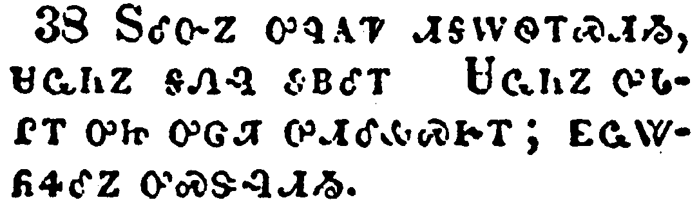</a></td>
</tr>
<tr class="even">
<td>And he arose out of the synagogue, and entered into Simon's house. And Simon's wife's mother was taken with a great fever; and they besought him for her.</td>
</tr>
<tr class="odd">
<td>ᏚᎴᏅᏃ ᎤᏄᎪᏤ ᏗᎦᎳᏫᎢᏍᏗᏱ, ᏌᏩᏂᏃ ᎦᏁᎸ ᏭᏴᎴᎢ. ᏌᏩᏂᏃ ᎤᏓᎵᎢ ᎤᏥ ᎤᏣᏘ ᎤᏗᎴᎲᏍᎨᎢ; ᎬᏩᏔᏲᏎᎴᏃ ᎤᏍᏕᎸᏗᏱ.</td>
</tr>
<tr class="even">
<td>Du-le-nv-no u-nu-go-tse di-ga-la-wi-i-s-di-yi, sa-wa-ni-no ga-ne-lv wu-yv-le-i. Sa-wa-ni-no u-da-li-i u-tsi u-tsa-ti u-di-le-hv-s-ge-i; gv-wa-ta-yo-se-le-no u-s-de-lv-di-yi.</td>
</tr>
</tbody>
</table>

<table>
<tbody>
<tr class="odd">
<td><a href="030439.png">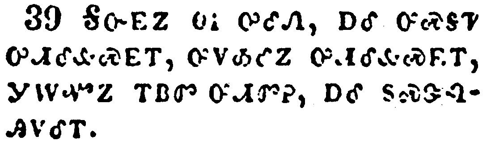</a></td>
</tr>
<tr class="even">
<td>And he stood over her, and rebuked the fever; and it left her: and immediately she arose and ministered unto them.</td>
</tr>
<tr class="odd">
<td>ᎦᏅᎬᏃ ᎾᎥ ᎤᎴᏁ, ᎠᎴ ᎤᏍᎦᏤ ᎤᏗᎴᎲᏍᎬᎢ, ᎤᏙᎣᎴᏃ ᎤᏗᎴᎲᏍᎬᎢ, ᎩᎳᏉᏃ ᎢᏴᏛ ᎤᏗᏛᎮ, ᎠᎴ ᏚᏍᏕᎸᎪᏙᎴᎢ.</td>
</tr>
<tr class="even">
<td>Ga-nv-gv-no na-v u-le-ne, a-le u-s-ga-tse u-di-le-hv-s-gv-i, u-do-o-le-no u-di-le-hv-s-gv-i, gi-la-quo-no i-yv-dv u-di-dv-he, a-le du-s-de-lv-go-do-le-i.</td>
</tr>
</tbody>
</table>

<table>
<tbody>
<tr class="odd">
<td><a href="030440.png">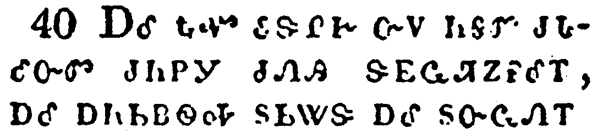</a></td>
</tr>
<tr class="even">
<td>Now when the sun was setting, all they that had any sick with divers diseases brought them unto him; and he laid his hands on every one of them, and healed them.</td>
</tr>
<tr class="odd">
<td>ᎠᎴ ᎿᎭᏉ ᏭᏕᎵᎨ ᏅᏙ ᏂᎦᏛ ᏧᏓᎴᏅᏛ ᏧᏂᏢᎩ ᏧᏁᎯ ᏕᎬᏩᏘᏃᎮᎴᎢ, ᎠᎴ ᎠᏂᏏᏴᏫᎭ ᏚᏏᏔᏕ ᎠᎴ ᏚᏅᏩᏁᎢ</td>
</tr>
<tr class="even">
<td>A-le hna-quo wu-de-li-ge nv-do ni-ga-dv tsu-da-le-nv-dv tsu-ni-tlv-gi tsu-ne-hi de-gv-wa-ti-no-he-le-i, a-le a-ni-si-yv-wi-ha du-si-ta-de a-le du-nv-wa-ne-i</td>
</tr>
</tbody>
</table>

<table>
<tbody>
<tr class="odd">
<td><a href="030441.png">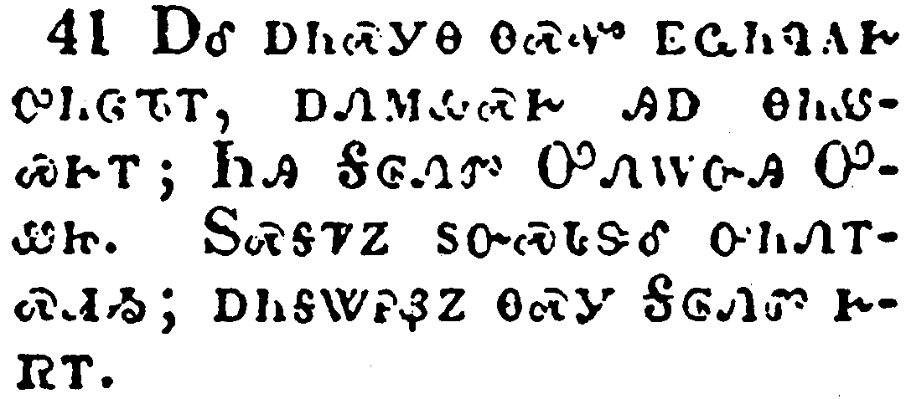</a></td>
</tr>
<tr class="even">
<td>And devils also came out of many, crying out, and saying, Thou art Christ the Son of God. And he rebuking them suffered them not to speak: for they knew that he was Christ.</td>
</tr>
<tr class="odd">
<td>ᎠᎴ ᎠᏂᏍᎩᎾ ᎾᏍᏉ ᎬᏩᏂᏄᎪᎨ ᎤᏂᏣᏖᎢ, ᎠᏁᎷᎲᏍᎨ ᎯᎠ ᎾᏂᏪᏍᎨᎢ; ᏂᎯ ᎦᎶᏁᏛ ᎤᏁᎳᏅᎯ ᎤᏪᏥ. ᏚᏍᎦᏤᏃ ᏚᏅᏍᏓᏕᎴ ᎤᏂᏁᎢᏍᏗᏱ; ᎠᏂᎦᏔᎮᏰᏃ ᎾᏍᎩ ᎦᎶᏁᏛ ᎨᏒᎢ.</td>
</tr>
<tr class="even">
<td>A-le a-ni-s-gi-na na-s-quo gv-wa-ni-nu-go-ge u-ni-tsa-te-i, a-ne-lu-hv-s-ge hi-a na-ni-we-s-ge-i; Ni-hi Ga-lo-ne-dv U-ne-la-nv-hi U-we-tsi. Du-s-ga-tse-no du-nv-s-da-de-le u-ni-ne-i-s-di-yi; a-ni-ga-ta-he-ye-no na-s-gi Ga-lo-ne-dv ge-sv-i.</td>
</tr>
</tbody>
</table>

<table>
<tbody>
<tr class="odd">
<td><a href="030442.png">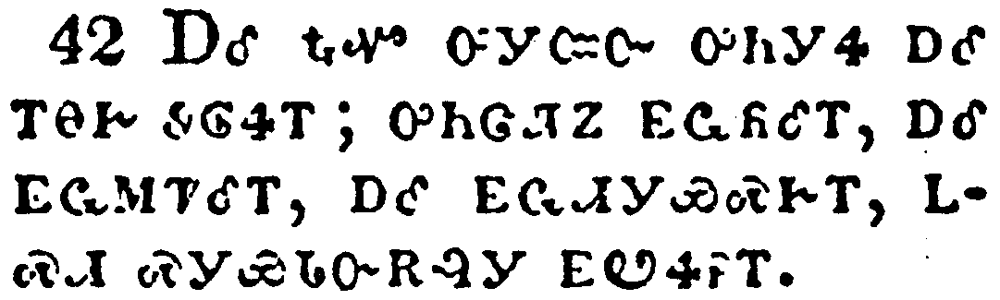</a></td>
</tr>
<tr class="even">
<td>And when it was day, he departed and went into a desert place: and the people sought him, and came unto him, and stayed him, that he should not depart from them.</td>
</tr>
<tr class="odd">
<td>ᎠᎴ ᎿᎭᏉ ᎤᎩᏨᏅ ᎤᏂᎨᏎ ᎠᎴ ᎢᎾᎨ ᏭᎶᏎᎢ; ᎤᏂᏣᏘᏃ ᎬᏩᏲᎴᎢ, ᎠᎴ ᎬᏩᎷᏤᎴᎢ, ᎠᎴ ᎬᏩᏗᎩᏯᏍᎨᎢ, ᏞᏍᏗ ᏍᎩᏯᏓᏅᎡᎸᎩ ᎬᏬᏎᎮᎢ.</td>
</tr>
<tr class="even">
<td>A-le hna-quo u-gi-tsv-nv u-ni-ge-se a-le i-na-ge wu-lo-se-i; u-ni-tsa-ti-no gv-wa-yo-le-i, a-le gv-wa-lu-tse-le-i, a-le gv-wa-di-gi-ya-s-ge-i, tle-s-di s-gi-ya-da-nv-e-lv-gi gv-wo-se-he-i.</td>
</tr>
</tbody>
</table>

<table>
<tbody>
<tr class="odd">
<td><a href="030443.png">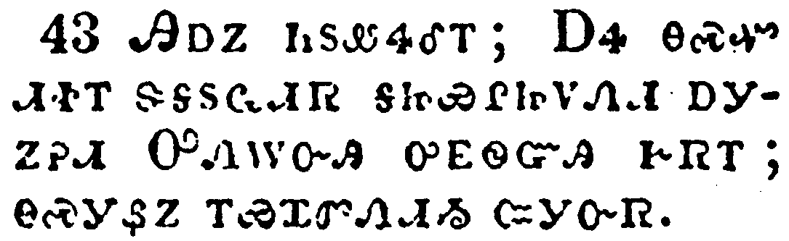</a></td>
</tr>
<tr class="even">
<td>And he said unto them, I must preach the kingdom of God to other cities also: for therefore am I sent.</td>
</tr>
<tr class="odd">
<td>ᎯᎠᏃ ᏂᏚᏪᏎᎴᎢ; ᎠᏎ ᎾᏍᏉ ᏗᏐᎢ ᏕᎦᏚᏩᏗᏒ ᎦᏥᏯᎵᏥᏙᏁᏗ ᎠᎩᏃᎮᏗ ᎤᏁᎳᏅᎯ ᎤᎬᏫᏳᎯ ᎨᏒᎢ; ᎾᏍᎩᏰᏃ ᎢᏯᏆᏛᏁᏗᏱ ᏨᎩᏅᏒ.</td>
</tr>
<tr class="even">
<td>Hi-a-no ni-du-we-se-le-i; A-se na-s-quo di-so-i de-ga-du-wa-di-sv ga-tsi-ya-li-tsi-do-ne-di a-gi-no-he-di U-ne-la-nv-hi u-gv-wi-yu-hi ge-sv-i; na-s-gi-ye-no i-ya-qua-dv-ne-di-yi tsv-gi-nv-sv.</td>
</tr>
</tbody>
</table>

<table>
<tbody>
<tr class="odd">
<td><a href="030444.png">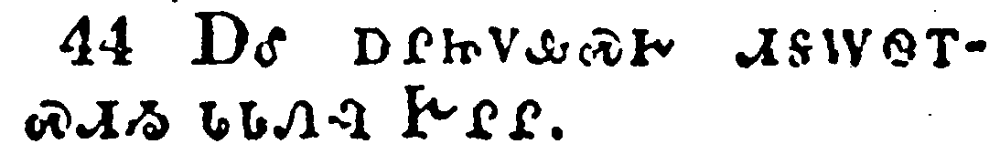</a></td>
</tr>
<tr class="even">
<td>And he preached in the synagogues of Galilee.</td>
</tr>
<tr class="odd">
<td>ᎠᎴ ᎠᎵᏥᏙᎲᏍᎨ ᏗᎦᎳᏫᎢᏍᏗᏱ ᏓᏓᏁᎸ ᎨᎵᎵ.</td>
</tr>
<tr class="even">
<td>A-le a-li-tsi-do-hv-s-ge di-ga-la-wi-i-s-di-yi da-da-ne-lv Ge-li-li.</td>
</tr>
</tbody>
</table>

