+++
draft=false
date = 2014-12-18T21:11:07Z
title = "Luke - Chapter 7 - Cherokee New Testament"
weight = 1418955067

[taxonomies]

authors = ["Timothy Legg"]
categories = []
tags = []

[extra]
+++

<table>
<tbody>
<tr class="odd">
<td></td>
</tr>
<tr class="even">
<td>Now when he had ended all his sayings in the audience of the people, he entered into Capernaum.</td>
</tr>
<tr class="odd">
<td>ᎿᎭᏉᏃ ᎤᏍᏆᏛ ᏂᎦᏛ ᎦᏬᏂᏍᎬ ᎠᎾᏛᎩᏍᎬ ᏴᏫ, ᎨᏆᏂ ᏭᏴᎴᎢ.</td>
</tr>
<tr class="even">
<td>Hna-quo-no u-s-qua-dv ni-ga-dv ga-wo-ni-s-gv a-na-dv-gi-s-gv yv-wi, Ge-qua-ni wu-yv-le-i.</td>
</tr>
</tbody>
</table>

<table>
<tbody>
<tr class="odd">
<td><a href="030702.png">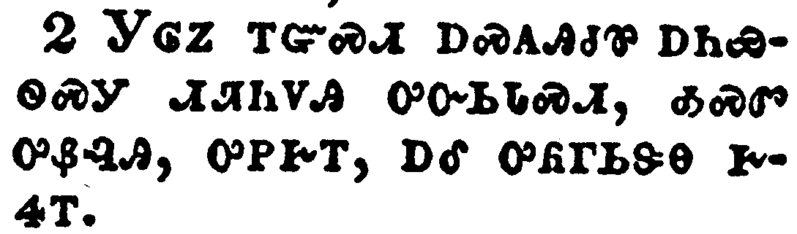</a></td>
</tr>
<tr class="even">
<td>And a certain centurion's servant, who was dear unto him, was sick, and ready to die.</td>
</tr>
<tr class="odd">
<td>ᎩᎶᏃ ᎢᏳᏍᏗ ᎠᏍᎪᎯᏧᏈ ᎠᏂᏯᏫᏍᎩ ᏗᏖᏂᏙᎯ ᎤᏅᏏᏓᏍᏗ, ᎣᏍᏛ ᎤᏰᎸᎯ, ᎤᏢᎨᎢ, ᎠᎴ ᎤᏲᎱᏏᏕᎾ ᎨᏎᎢ.</td>
</tr>
<tr class="even">
<td>Gi-lo-no i-yu-s-di a-s-go-hi-tsu-qui a-ni-ya-wi-s-gi di-te-ni-do-hi u-nv-si-da-s-di, o-s-dv u-ye-lv-hi, u-tlv-ge-i, a-le u-yo-hu-si-de-na ge-se-i.</td>
</tr>
</tbody>
</table>

<table>
<tbody>
<tr class="odd">
<td><a href="030703.png">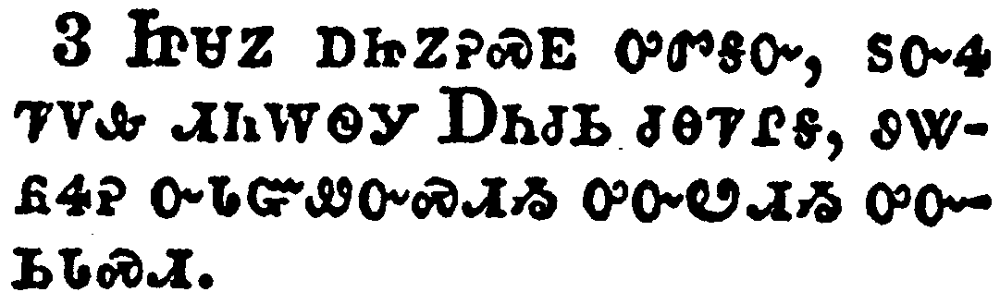</a></td>
</tr>
<tr class="even">
<td>And when he heard of Jesus, he sent unto him the elders of the Jews, beseeching him that he would come and heal his servant.</td>
</tr>
<tr class="odd">
<td>ᏥᏌᏃ ᎠᏥᏃᎮᏍᎬ ᎤᏛᎦᏅ, ᏚᏅᏎ ᏤᏙᎲ ᏗᏂᎳᏫᎩ ᎠᏂᏧᏏ ᏧᎾᏤᎵᎦ, ᏭᏔᏲᏎᎮ ᏅᏓᏳᏪᏅᏍᏗᏱ ᎤᏅᏬᏗᏱ ᎤᏅᏏᏗᏍᏗ.</td>
</tr>
<tr class="even">
<td>Tsi-sa-no a-tsi-no-he-s-gv u-dv-ga-nv, du-nv-se tse-do-hv di-ni-la-wi-gi A-ni-tsu-si tsu-na-tse-li-ga, wu-ta-yo-se-he nv-da-yu-we-nv-s-di-yi u-nv-wo-di-yi u-nv-si-di-s-di.</td>
</tr>
</tbody>
</table>

<table>
<tbody>
<tr class="odd">
<td><a href="030704.png">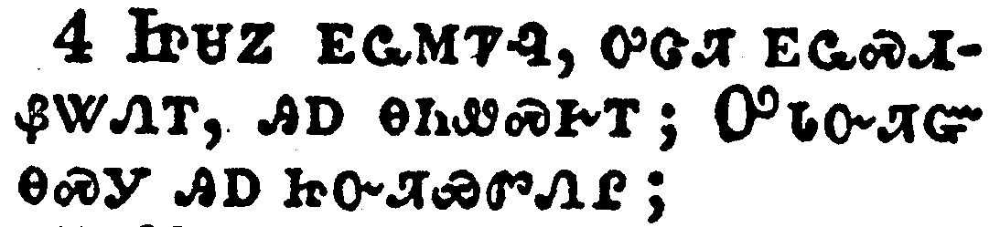</a></td>
</tr>
<tr class="even">
<td>And when they came to Jesus, they besought him instantly, saying, That he was worthy for whom he should do this:</td>
</tr>
<tr class="odd">
<td>ᏥᏌᏃ ᎬᏩᎷᏤᎸ, ᎤᏣᏘ ᎬᏩᏍᏗ ᏰᏔᏁᎢ, ᎯᎠ ᎾᏂᏪᏍᎨᎢ; ᎤᏓᏅᏘᏳ ᎾᏍᎩ ᎯᎠ ᏥᏅᏘᏯᏛᏁᎵ;</td>
</tr>
<tr class="even">
<td>Tsi-sa-no gv-wa-lu-tse-lv, u-tsa-ti gv-wa-s-di ye-ta-ne-i, hi-a na-ni-we-s-ge-i; U-da-nv-ti-yu na-s-gi hi-a tsi-nv-ti-ya-dv-ne-li;</td>
</tr>
</tbody>
</table>

<table>
<tbody>
<tr class="odd">
<td><a href="030705.png">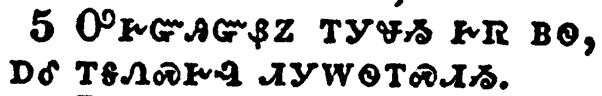</a></td>
</tr>
<tr class="even">
<td>For he loveth our nation, and he hath built us a synagogue.</td>
</tr>
<tr class="odd">
<td>ᎤᎨᏳᎯᏳᏰᏃ ᎢᎩᏠᏱ ᎨᏒ ᏴᏫ, ᎠᎴ ᎢᎦᏁᏍᎨᎸ ᏗᎩᎳᏫᎢᏍᏗᏱ.</td>
</tr>
<tr class="even">
<td>U-ge-yu-hi-yu-ye-no i-gi-tlo-yi ge-sv yv-wi, a-le i-ga-ne-s-ge-lv di-gi-la-wi-i-s-di-yi.</td>
</tr>
</tbody>
</table>

<table>
<tbody>
<tr class="odd">
<td><a href="030706.png">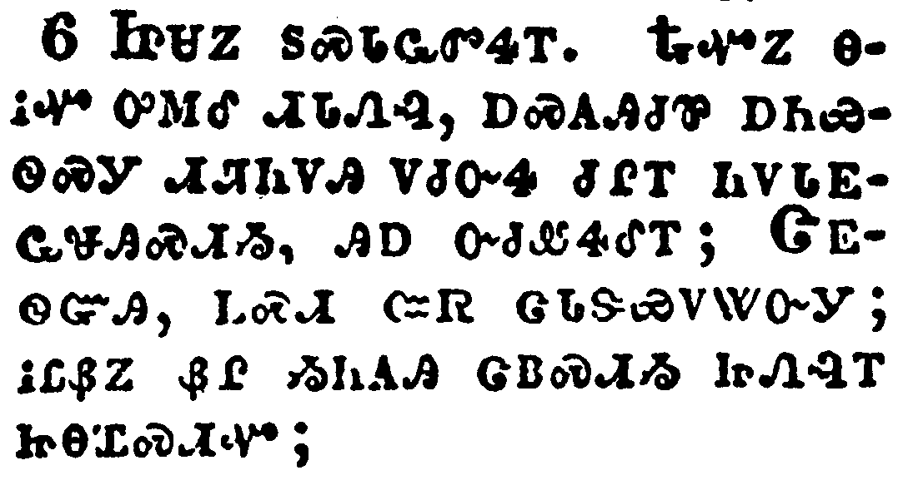</a></td>
</tr>
<tr class="even">
<td>Then Jesus went with them. And when he was now not far from the house, the centurion sent friends to him, saying unto him, Lord, trouble not thyself: for I am not worthy that thou shouldest enter under my roof:</td>
</tr>
<tr class="odd">
<td>ᏥᏌᏃ ᏚᏍᏓᏩᏛᏎᎢ. ᎿᎭᏉᏃ ᎾᎥᏉ ᎤᎷᎴ ᏗᏓᏁᎸ, ᎠᏍᎪᎯᏧᏈ ᎠᏂᏯᏫᏍᎩ ᏗᏘᏂᏙᎯ ᏙᏧᏅᏎ ᏧᎵᎢ ᏂᏙᏓᎬᏩᏠᎯᏍᏗᏱ, ᎯᎠ ᏅᏧᏪᏎᎴᎢ; ᏣᎬᏫᏳᎯ, ᏞᏍᏗ ᏨᏒ ᏣᏓᏕᏯᏙᏔᏅᎩ; ᎥᏝᏰᏃ ᏰᎵ ᏱᏂᎪᎯ ᏣᏴᏍᏗᏱ ᏥᏁᎸᎢ ᏥᎾᏆᏍᏗᏉ;</td>
</tr>
<tr class="even">
<td>Tsi-sa-no du-s-da-wa-dv-se-i. Hna-quo-no na-v-quo u-lu-le di-da-ne-lv, a-s-go-hi-tsu-qui a-ni-ya-wi-s-gi di-ti-ni-do-hi do-tsu-nv-se tsu-li-i ni-do-da-gv-wa-tlo-hi-s-di-yi, hi-a nv-tsu-we-se-le-i; Tsa-gv-wi-yu-hi, tle-s-di tsv-sv tsa-da-de-ya-do-ta-nv-gi; v-tla-ye-no ye-li yi-ni-go-hi tsa-yv-s-di-yi tsi-ne-lv-i tsi-na-qua-s-di-quo;</td>
</tr>
</tbody>
</table>

<table>
<tbody>
<tr class="odd">
<td><a href="030707.png">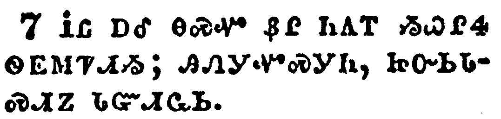</a></td>
</tr>
<tr class="even">
<td>Wherefore neither thought I myself worthy to come unto thee: but say in a word, and my servant shall be healed.</td>
</tr>
<tr class="odd">
<td>ᎥᏝ ᎠᎴ ᎾᏍᏉ ᏰᎵ ᏂᎪᎢ ᏱᏇᎵᏎ ᏫᎬᎷᏤᏗᏱ; ᎯᏁᎩᏉᏍᎩᏂ, ᏥᏅᏏᏓᏍᏗᏃ ᏧᏳᏗᏩᏏ.</td>
</tr>
<tr class="even">
<td>V-tla a-le na-s-quo ye-li ni-go-i yi-que-li-se wi-gv-lu-tse-di-yi; hi-ne-gi-quo-s-gi-ni, tsi-nv-si-da-s-di-no tsu-yu-di-wa-si.</td>
</tr>
</tbody>
</table>

<table>
<tbody>
<tr class="odd">
<td><a href="030708.png">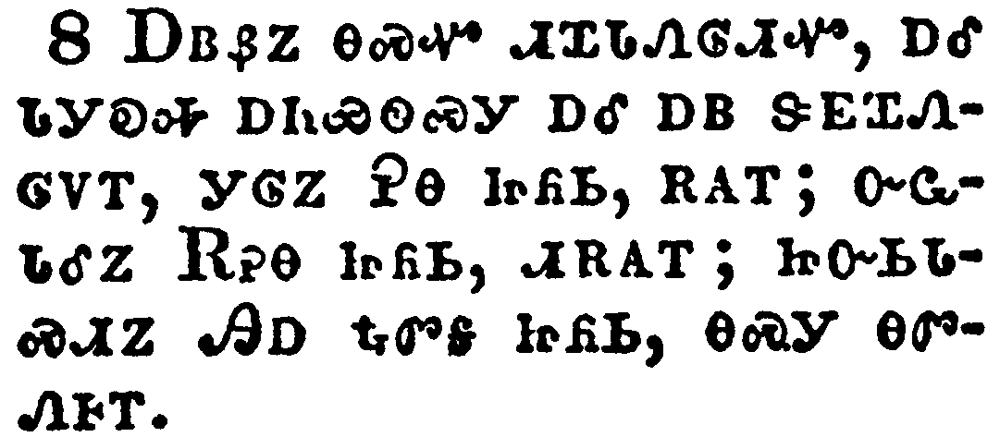</a></td>
</tr>
<tr class="even">
<td>For I also am a man set under authority, having under me soldiers, and I say unto one, Go, and he goeth; and to another, Come, and he cometh; and to my servant, Do this, and he doeth it.</td>
</tr>
<tr class="odd">
<td>ᎠᏴᏰᏃ ᎾᏍᏉ ᏗᏆᏓᏁᎶᏗᏉ, ᎠᎴ ᏗᎩᎧᎭ ᎠᏂᏯᏫᏍᎩ ᎠᎴ ᎠᏴ ᏕᎬᏆᏁᎶᏙᎢ, ᎩᎶᏃ ᎮᎾ ᏥᏲᏏ, ᎡᎪᎢ; ᏅᏩᏓᎴᏃ ᎡᎮᎾ ᏥᏲᏏ, ᏗᎡᎪᎢ; ᏥᏅᏏᏓᏍᏗᏃ ᎯᎠ ᎿᎭᏛᎦ ᏥᏲᏏ, ᎾᏍᎩ ᎾᏛᏁᎰᎢ.</td>
</tr>
<tr class="even">
<td>A-yv-ye-no na-s-quo di-qua-da-ne-lo-di-quo, a-le di-gi-ka-ha a-ni-ya-wi-s-gi a-le a-yv de-gv-qua-ne-lo-do-i, gi-lo-no He-na tsi-yo-si, e-go-i; nv-wa-da-le-no E-he-na tsi-yo-si, di-e-go-i; tsi-nv-si-da-s-di-no Hi-a hna-dv-ga tsi-yo-si, na-s-gi na-dv-ne-ho-i.</td>
</tr>
</tbody>
</table>

<table>
<tbody>
<tr class="odd">
<td><a href="030709.png">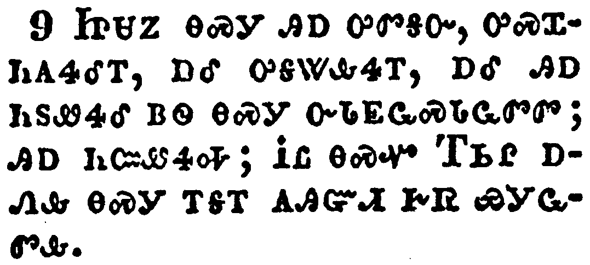</a></td>
</tr>
<tr class="even">
<td>When Jesus heard these things, he marvelled at him, and turned him about, and said unto the people that followed him, I say unto you, I have not found so great faith, no, not in Israel.</td>
</tr>
<tr class="odd">
<td>ᏥᏌᏃ ᎾᏍᎩ ᎯᎠ ᎤᏛᎦᏅ, ᎤᏍᏆᏂᎪᏎᎴᎢ, ᎠᎴ ᎤᎦᏔᎲᏎᎢ, ᎠᎴ ᎯᎠ ᏂᏚᏪᏎᎵ ᏴᏫ ᎾᏍᎩ ᏅᏓᎬᏩᏍᏓᏩᏛᏛ; ᎯᎠ ᏂᏨᏪᏎᎭ; ᎥᏝ ᎾᏍᏉ ᎢᏏᎵ ᎠᏁᎲ ᎾᏍᎩ ᎢᎦᎢ ᎪᎯᏳᏗ ᎨᏒ ᏯᎩᏩᏛᎲ.</td>
</tr>
<tr class="even">
<td>Tsi-sa-no na-s-gi hi-a u-dv-ga-nv, u-s-qua-ni-go-se-le-i, a-le u-ga-ta-hv-se-i, a-le hi-a ni-du-we-se-li yv-wi na-s-gi nv-da-gv-wa-s-da-wa-dv-dv; hi-a ni-tsv-we-se-ha; V-tla na-s-quo I-si-li a-ne-hv na-s-gi i-ga-i go-hi-yu-di ge-sv ya-gi-wa-dv-hv.</td>
</tr>
</tbody>
</table>

<table>
<tbody>
<tr class="odd">
<td><a href="030710.png">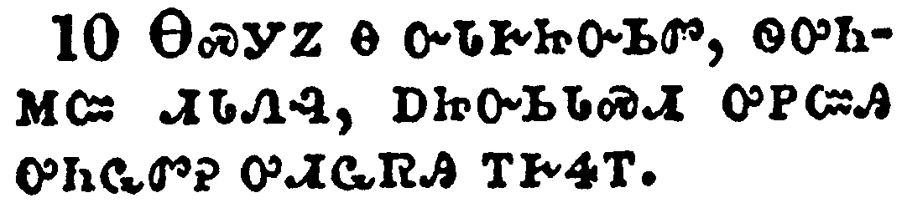</a></td>
</tr>
<tr class="even">
<td>And they that were sent, returning to the house, found the servant whole that had been sick.</td>
</tr>
<tr class="odd">
<td>ᎾᏍᎩᏃ Ꮎ ᏅᏓᎨᏥᏅᏏᏛ, ᏫᎤᏂᎷᏨ ᏗᏓᏁᎸ, ᎠᏥᏅᏏᏓᏍᏗ ᎤᏢᏨᎯ ᎤᏂᏩᏛᎮ ᎤᏗᏩᏒᎯ ᎢᎨᏎᎢ.</td>
</tr>
<tr class="even">
<td>Na-s-gi-no na nv-da-ge-tsi-nv-si-dv, wi-u-ni-lu-tsv di-da-ne-lv, a-tsi-nv-si-da-s-di u-tlv-tsv-hi u-ni-wa-dv-he u-di-wa-sv-hi i-ge-se-i.</td>
</tr>
</tbody>
</table>

<table>
<tbody>
<tr class="odd">
<td><a href="030711.png">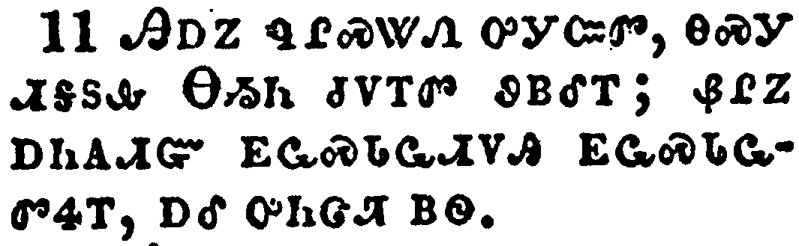</a></td>
</tr>
<tr class="even">
<td>And it came to pass the day after, that he went into a city called Nain; and many of his disciples went with him, and much people.</td>
</tr>
<tr class="odd">
<td>ᎯᎠᏃ ᏄᎵᏍᏔᏁ ᎤᎩᏨᏛ, ᎾᏍᎩ ᏗᎦᏚᎲ ᎾᏱᏂ ᏧᏙᎢᏛ ᏭᏴᎴᎢ; ᏰᎵᏃ ᎠᏂᎪᏗᏳ ᎬᏩᏍᏓᏩᏗᏙᎯ ᎬᏩᏍᏓᏩᏛᏎᎢ, ᎠᎴ ᎤᏂᏣᏘ ᏴᏫ.</td>
</tr>
<tr class="even">
<td>Hi-a-no nu-li-s-ta-ne u-gi-tsv-dv, na-s-gi di-ga-du-hv Na-yi-ni tsu-do-i-dv wu-yv-le-i; ye-li-no a-ni-go-di-yu gv-wa-s-da-wa-di-do-hi gv-wa-s-da-wa-dv-se-i, a-le u-ni-tsa-ti yv-wi.</td>
</tr>
</tbody>
</table>

<table>
<tbody>
<tr class="odd">
<td><a href="030712.png">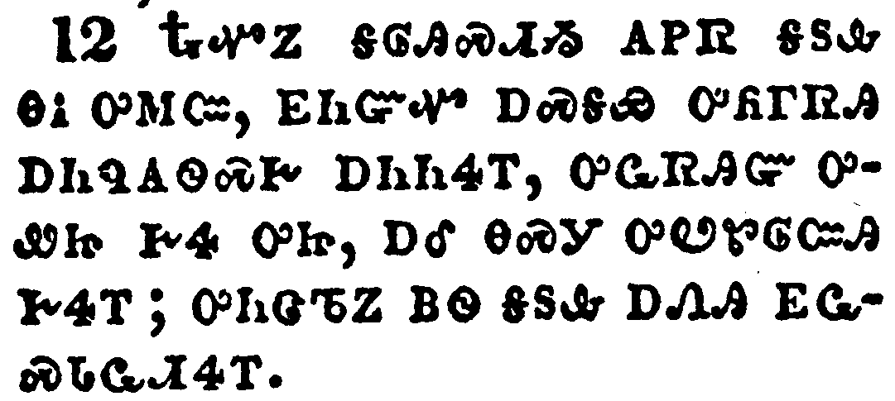</a></td>
</tr>
<tr class="even">
<td>Now when he came nigh to the gate of the city, behold, there was a dead man carried out, the only son of his mother, and she was a widow: and much people of the city was with her.</td>
</tr>
<tr class="odd">
<td>ᎿᎭᏉᏃ ᎦᎶᎯᏍᏗᏱ ᎪᏢᏒ ᎦᏚᎲ ᎾᎥ ᎤᎷᏨ, ᎬᏂᏳᏉ ᎠᏍᎦᏯ ᎤᏲᎱᏒᎯ ᎠᏂᏄᎪᏫᏍᎨ ᎠᏂᏂᏎᎢ, ᎤᏩᏒᎯᏳ ᎤᏪᏥ ᎨᏎ ᎤᏥ, ᎠᎴ ᎾᏍᎩ ᎤᏬᏑᎶᏨᎯ ᎨᏎᎢ; ᎤᏂᏣᏖᏃ ᏴᏫ ᎦᏚᎲ ᎠᏁᎯ ᎬᏩᏍᏓᏩᏗᏎᎢ.</td>
</tr>
<tr class="even">
<td>Hna-quo-no ga-lo-hi-s-di-yi go-tlv-sv ga-du-hv na-v u-lu-tsv, gv-ni-yu-quo a-s-ga-ya u-yo-hu-sv-hi a-ni-nu-go-wi-s-ge a-ni-ni-se-i, u-wa-sv-hi-yu u-we-tsi ge-se u-tsi, a-le na-s-gi u-wo-su-lo-tsv-hi ge-se-i; u-ni-tsa-te-no yv-wi ga-du-hv a-ne-hi gv-wa-s-da-wa-di-se-i.</td>
</tr>
</tbody>
</table>

<table>
<tbody>
<tr class="odd">
<td><a href="030713.png">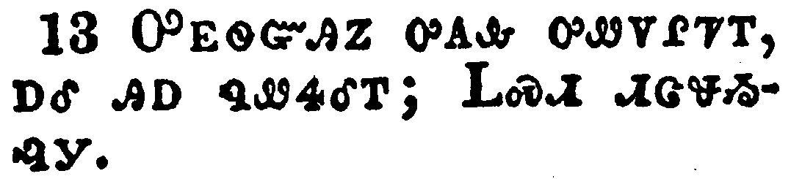</a></td>
</tr>
<tr class="even">
<td>And when the Lord saw her, he had compassion on her, and said unto her, Weep not.</td>
</tr>
<tr class="odd">
<td>ᎤᎬᏫᏳᎯᏃ ᎤᎪᎲ ᎤᏪᏙᎵᏤᎢ, ᎠᎴ ᎯᎠ ᏄᏪᏎᎴᎢ; ᏞᏍᏗ ᏗᏣᏠᏱᎸᎩ.</td>
</tr>
<tr class="even">
<td>U-gv-wi-yu-hi-no u-go-hv u-we-do-li-tse-i, a-le hi-a nu-we-se-le-i; Tle-s-di di-tsa-tlo-yi-lv-gi.</td>
</tr>
</tbody>
</table>

<table>
<tbody>
<tr class="odd">
<td><a href="030714.png">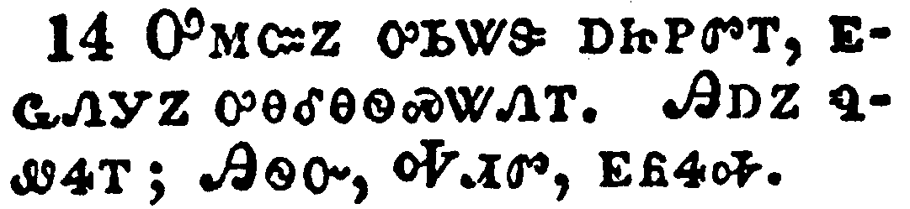</a></td>
</tr>
<tr class="even">
<td>And he came and touched the bier: and they that bare him stood still. And he said, Young man, I say unto thee, Arise.</td>
</tr>
<tr class="odd">
<td>ᎤᎷᏨᏃ ᎤᏏᏔᏕ ᎠᏥᏢᏛᎢ, ᎬᏩᏁᎩᏃ ᎤᎾᎴᎾᏫᏍᏔᏁᎢ. ᎯᎠᏃ ᏄᏪᏎᎢ; ᎯᏫᏅ, ᎭᏗᏛ, ᎬᏲᏎᎭ.</td>
</tr>
<tr class="even">
<td>U-lu-tsv-no u-si-ta-de a-tsi-tlv-dv-i, gv-wa-ne-gi-no u-na-le-na-wi-s-ta-ne-i. Hi-a-no nu-we-se-i; Hi-wi-nv, Ha-di-dv, gv-yo-se-ha.</td>
</tr>
</tbody>
</table>

<table>
<tbody>
<tr class="odd">
<td><a href="030715.png">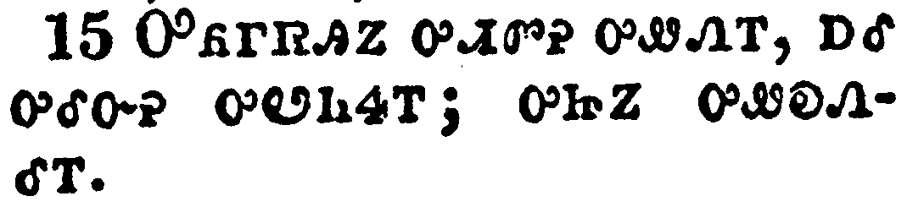</a></td>
</tr>
<tr class="even">
<td>And he that was dead sat up, and began to speak. And he delivered him to his mother.</td>
</tr>
<tr class="odd">
<td>ᎤᏲᎱᏒᎯᏃ ᎤᏗᏛᎮ ᎤᏪᏁᎢ, ᎠᎴ ᎤᎴᏅᎮ ᎤᏬᏂᏎᎢ; ᎤᏥᏃ ᎤᏪᎧᏁᎴᎢ.</td>
</tr>
<tr class="even">
<td>U-yo-hu-sv-hi-no u-di-dv-he u-we-ne-i, a-le u-le-nv-he u-wo-ni-se-i; u-tsi-no u-we-ka-ne-le-i.</td>
</tr>
</tbody>
</table>

<table>
<tbody>
<tr class="odd">
<td><a href="030716.png">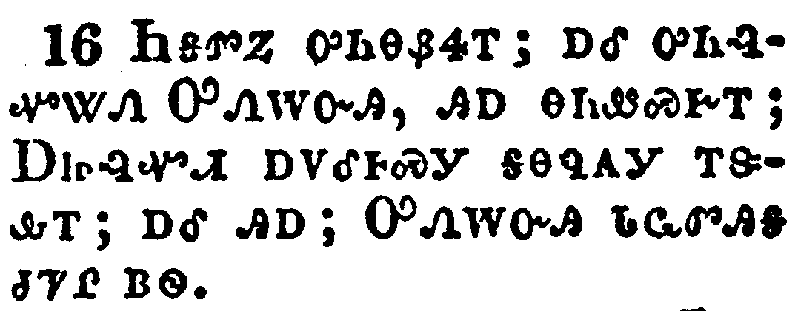</a></td>
</tr>
<tr class="even">
<td>And there came a fear on all: and they glorified God, saying, That a great prophet is risen up among us; and, That God hath visited his people.</td>
</tr>
<tr class="odd">
<td>ᏂᎦᏛᏃ ᎤᏂᎾᏰᏎᎢ; ᎠᎴ ᎤᏂᎸᏉᏔᏁ ᎤᏁᎳᏅᎯ, ᎯᎠ ᎾᏂᏪᏍᎨᎢ; ᎠᏥᎸᏉᏗ ᎠᏙᎴᎰᏍᎩ ᎦᎾᏄᎪᎩ ᎢᏕᎲᎢ; ᎠᎴ ᎯᎠ; ᎤᏁᎳᏅᎯ ᏓᏩᏛᎯᎦ ᏧᏤᎵ ᏴᏫ.</td>
</tr>
<tr class="even">
<td>Ni-ga-dv-no u-ni-na-ye-se-i; a-le u-ni-lv-quo-ta-ne U-ne-la-nv-hi, hi-a na-ni-we-s-ge-i; A-tsi-lv-quo-di a-do-le-ho-s-gi ga-na-nu-go-gi i-de-hv-i; a-le hi-a; U-ne-la-nv-hi da-wa-dv-hi-ga tsu-tse-li yv-wi.</td>
</tr>
</tbody>
</table>

<table>
<tbody>
<tr class="odd">
<td><a href="030717.png">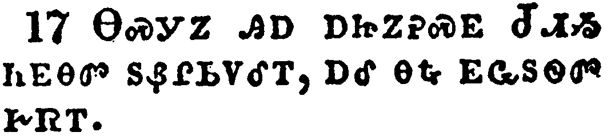</a></td>
</tr>
<tr class="even">
<td>And this rumour of him went forth throughout all Judaea, and throughout all the region round about.</td>
</tr>
<tr class="odd">
<td>ᎾᏍᎩᏃ ᎯᎠ ᎠᏥᏃᎮᏍᎬ ᏧᏗᏱ ᏂᎬᎾᏛ ᏚᏰᎵᏏᏙᎴᎢ, ᎠᎴ ᎾᎿᎭᎬᏩᏚᏫᏛ ᎨᏒᎢ.</td>
</tr>
<tr class="even">
<td>Na-s-gi-no hi-a a-tsi-no-he-s-gv Tsu-di-yi ni-gv-na-dv du-ye-li-si-do-le-i, a-le na-hna gv-wa-du-wi-dv ge-sv-i.</td>
</tr>
</tbody>
</table>

<table>
<tbody>
<tr class="odd">
<td></td>
</tr>
<tr class="even">
<td>And the disciples of John shewed him of all these things.</td>
</tr>
<tr class="odd">
<td>ᏣᏂᏃ ᎬᏩᏍᏓᏩᏗᏙᎯ ᎾᏍᎩ ᎯᎠ ᏂᎦᏛ ᎬᏩᏃᏁᎴᎢ.</td>
</tr>
<tr class="even">
<td>Tsa-ni-no gv-wa-s-da-wa-di-do-hi na-s-gi hi-a ni-ga-dv gv-wa-no-ne-le-i.</td>
</tr>
</tbody>
</table>

<table>
<tbody>
<tr class="odd">
<td><a href="030719.png">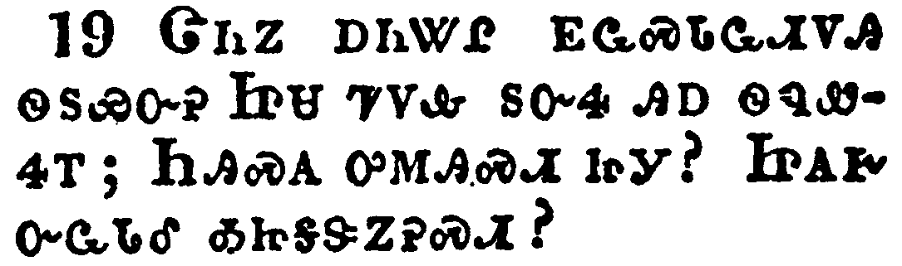</a></td>
</tr>
<tr class="even">
<td>And John calling unto him two of his disciples sent them to Jesus, saying, Art thou he that should come? or look we for another?</td>
</tr>
<tr class="odd">
<td>ᏣᏂᏃ ᎠᏂᏔᎵ ᎬᏩᏍᏓᏩᏗᏙᎯ ᏫᏚᏯᏅᎮ ᏥᏌ ᏤᏙᎲ ᏚᏅᏎ ᎯᎠ ᏫᏄᏪᏎᎢ; ᏂᎯᏍᎪ ᎤᎷᎯᏍᏗ ᏥᎩ? ᏥᎪᎨ ᏅᏩᏓᎴ ᎣᏥᎦᏕᏃᎮᏍᏗ?</td>
</tr>
<tr class="even">
<td>Tsa-ni-no a-ni-ta-li gv-wa-s-da-wa-di-do-hi wi-du-ya-nv-he Tsi-sa tse-do-hv du-nv-se hi-a wi-nu-we-se-i; Ni-hi-s-go u-lu-hi-s-di tsi-gi? Tsi-go-ge nv-wa-da-le o-tsi-ga-de-no-he-s-di?</td>
</tr>
</tbody>
</table>

<table>
<tbody>
<tr class="odd">
<td><a href="030720.png">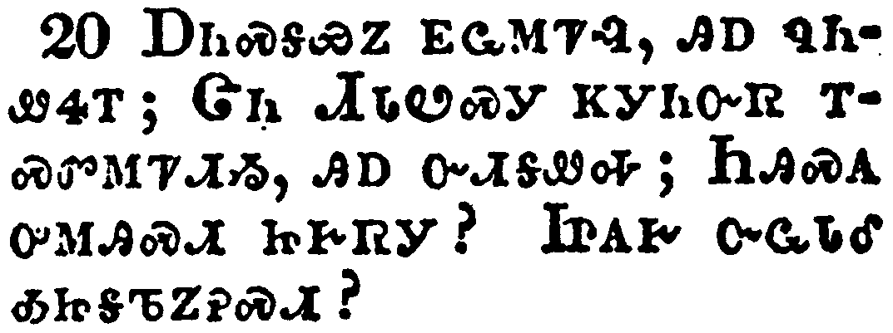</a></td>
</tr>
<tr class="even">
<td>When the men were come unto him, they said, John Baptist hath sent us unto thee, saying, Art thou he that should come? or look we for another?</td>
</tr>
<tr class="odd">
<td>ᎠᏂᏍᎦᏯᏃ ᎬᏩᎷᏤᎸ, ᎯᎠ ᏄᏂᏪᏎᎢ; ᏣᏂ ᏗᏓᏬᏍᎩ ᏦᎩᏂᏅᏒ ᎢᏍᏛᎷᏤᏗᏱ, ᎯᎠ ᏅᏗᎦᏪᎭ; ᏂᎯᏍᎪ ᎤᎷᎯᏍᏗ ᏥᎨᏒᎩ? ᏥᎪᎨ ᏅᏩᏓᎴ ᎣᏥᎦᏖᏃᎮᏍᏗ?</td>
</tr>
<tr class="even">
<td>A-ni-s-ga-ya-no gv-wa-lu-tse-lv, hi-a nu-ni-we-se-i; Tsa-ni Di-da-wo-s-gi tso-gi-ni-nv-sv i-s-dv-lu-tse-di-yi, hi-a nv-di-ga-we-ha; Ni-hi-s-go u-lu-hi-s-di tsi-ge-sv-gi? Tsi-go-ge nv-wa-da-le o-tsi-ga-te-no-he-s-di?</td>
</tr>
</tbody>
</table>

<table>
<tbody>
<tr class="odd">
<td><a href="030721.png">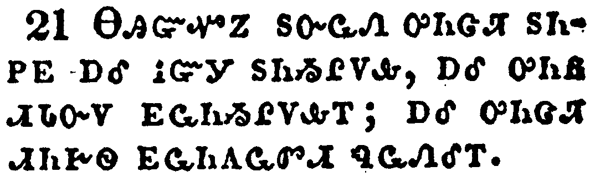</a></td>
</tr>
<tr class="even">
<td>And in that same hour he cured many of their infirmities and plagues, and of evil spirits; and unto many that were blind he gave sight.</td>
</tr>
<tr class="odd">
<td>ᎾᎯᏳᏉᏃ ᏚᏅᏩᏁ ᎤᏂᏣᏘ ᏚᏂᏢᎬ ᎠᎴ ᎥᏳᎩ ᏚᏂᏱᎵᏙᎲ, ᎠᎴ ᎤᏂᏲᏗᏓᏅᏙ ᎬᏩᏂᏱᎵᏙᎲᎢ; ᎠᎴ ᎤᏂᏣᏘ ᏗᏂᎨᏫ ᎬᏩᏂᎪᏩᏛᏗ ᏄᏩᏁᎴᎢ.</td>
</tr>
<tr class="even">
<td>Na-hi-yu-quo-no du-nv-wa-ne u-ni-tsa-ti du-ni-tlv-gv a-le v-yu-gi du-ni-yi-li-do-hv, a-le u-ni-yo-di-da-nv-do gv-wa-ni-yi-li-do-hv-i; a-le u-ni-tsa-ti di-ni-ge-wi gv-wa-ni-go-wa-dv-di nu-wa-ne-le-i.</td>
</tr>
</tbody>
</table>

<table>
<tbody>
<tr class="odd">
<td><a href="030722.png">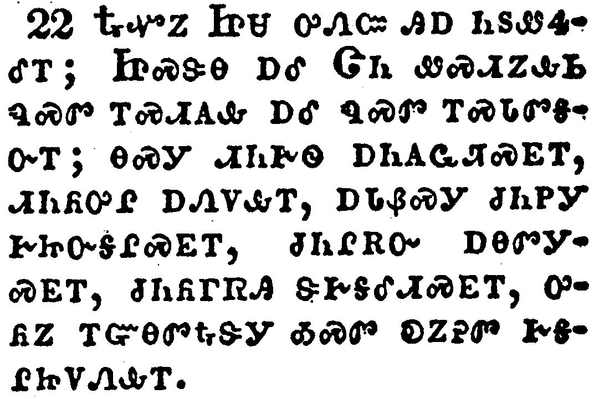</a></td>
</tr>
<tr class="even">
<td>Then Jesus answering said unto them, Go your way, and tell John what things ye have seen and heard; how that the blind see, the lame walk, the lepers are cleansed, the deaf hear, the dead are raised, to the poor the gospel is preached.</td>
</tr>
<tr class="odd">
<td>ᎿᎭᏉᏃ ᏥᏌ ᎤᏁᏨ ᎯᎠ ᏂᏚᏪᏎᎴᎢ; ᏥᏍᏕᎾ ᎠᎴ ᏣᏂ ᏪᏍᏗᏃᎲᏏ ᏄᏍᏛ ᎢᏍᏗᎪᎲ ᎠᎴ ᏄᏍᏛ ᎢᏍᏓᏛᎦᏅᎢ; ᎾᏍᎩ ᏗᏂᎨᏫ ᎠᏂᎪᏩᏘᏍᎬᎢ, ᏗᏂᏲᎤᎵ ᎠᏁᏙᎲᎢ, ᎠᏓᏰᏍᎩ ᏧᏂᏢᎩ ᎨᏥᏅᎦᎵᏍᎬᎢ, ᏧᏂᎵᎡᏅ ᎠᎾᏛᎩᏍᎬᎢ, ᏧᏂᏲᎱᏒᎯ ᏕᎨᎦᎴᏗᏍᎬᎢ, ᎤᏲᏃ ᎢᏳᎾᏛᎿᎭᏕᎩ ᎣᏍᏛ ᎧᏃᎮᏛ ᎨᎦᎵᏥᏙᏁᎲᎢ.</td>
</tr>
<tr class="even">
<td>Hna-quo-no Tsi-sa u-ne-tsv hi-a ni-du-we-se-le-i; Tsi-s-de-na a-le Tsa-ni we-s-di-no-hv-si nu-s-dv i-s-di-go-hv a-le nu-s-dv i-s-da-dv-ga-nv-i; na-s-gi di-ni-ge-wi a-ni-go-wa-ti-s-gv-i, di-ni-yo-u-li a-ne-do-hv-i, a-da-ye-s-gi tsu-ni-tlv-gi ge-tsi-nv-ga-li-s-gv-i, tsu-ni-li-e-nv a-na-dv-gi-s-gv-i, tsu-ni-yo-hu-sv-hi de-ge-ga-le-di-s-gv-i, u-yo-no i-yu-na-dv-hna-de-gi o-s-dv ka-no-he-dv ge-ga-li-tsi-do-ne-hv-i.</td>
</tr>
</tbody>
</table>

<table>
<tbody>
<tr class="odd">
<td><a href="030723.png">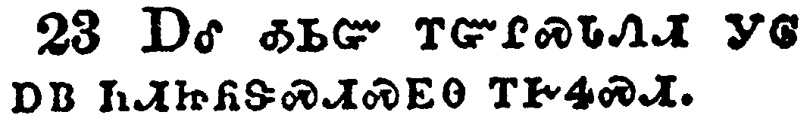</a></td>
</tr>
<tr class="even">
<td>And blessed is he, whosoever shall not be offended in me.</td>
</tr>
<tr class="odd">
<td>ᎠᎴ ᎣᏏᏳ ᎢᏳᎵᏍᏓᏁᏗ ᎩᎶ ᎠᏴ ᏂᏗᏥᏲᏕᏍᏗᏍᎬᎾ ᎢᎨᏎᏍᏗ.</td>
</tr>
<tr class="even">
<td>A-le o-si-yu i-yu-li-s-da-ne-di gi-lo a-yv ni-di-tsi-yo-de-s-di-s-gv-na i-ge-se-s-di.</td>
</tr>
</tbody>
</table>

<table>
<tbody>
<tr class="odd">
<td><a href="030724.png">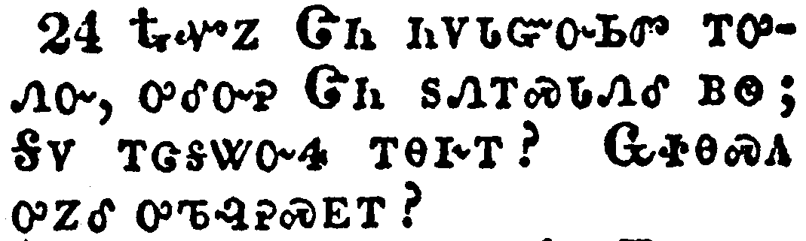</a></td>
</tr>
<tr class="even">
<td>And when the messengers of John were departed, he began to speak unto the people concerning John, What went ye out into the wilderness for to see? A reed shaken with the wind?</td>
</tr>
<tr class="odd">
<td>ᎿᎭᏉᏃ ᏣᏂ ᏂᏙᏓᏳᏅᏏᏛ ᎢᎤᏁᏅ, ᎤᎴᏅᎮ ᏣᏂ ᏚᏁᎢᏍᏓᏁᎴ ᏴᏫ; ᎦᏙ ᎢᏣᎦᏔᏅᏎ ᎢᎾᎨᎢ? ᏩᏐᎾᏍᎪ ᎤᏃᎴ ᎤᏖᎸᎮᏍᎬᎢ?</td>
</tr>
<tr class="even">
<td>Hna-quo-no Tsa-ni ni-do-da-yu-nv-si-dv i-u-ne-nv, u-le-nv-he Tsa-ni du-ne-i-s-da-ne-le yv-wi; Ga-do i-tsa-ga-ta-nv-se i-na-ge-i? Wa-so-na-s-go u-no-le u-te-lv-he-s-gv-i?</td>
</tr>
</tbody>
</table>

<table>
<tbody>
<tr class="odd">
<td><a href="030725.png">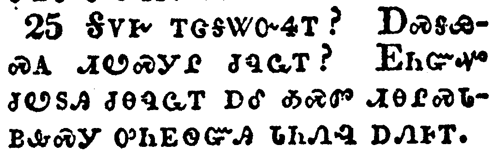</a></td>
</tr>
<tr class="even">
<td>But what went ye out for to see? A man clothed in soft raiment? Behold, they which are gorgeously apparelled, and live delicately, are in kings' courts.</td>
</tr>
<tr class="odd">
<td>ᎦᏙᎨ ᎢᏣᎦᏔᏅᏎᎢ? ᎠᏍᎦᏯᏍᎪ ᏗᏬᏍᎩᎵ ᏧᏄᏩᎢ? ᎬᏂᏳᏉ ᏧᏬᏚᎯ ᏧᎾᏄᏩᎢ ᎠᎴ ᎣᏍᏛ ᏗᎾᎵᏍᏓᏴᎲᏍᎩ ᎤᏂᎬᏫᏳᎯ ᏓᏂᏁᎸ ᎠᏁᎰᎢ.</td>
</tr>
<tr class="even">
<td>Ga-do-ge i-tsa-ga-ta-nv-se-i? A-s-ga-ya-s-go di-wo-s-gi-li tsu-nu-wa-i? Gv-ni-yu-quo tsu-wo-du-hi tsu-na-nu-wa-i a-le o-s-dv di-na-li-s-da-yv-hv-s-gi u-ni-gv-wi-yu-hi da-ni-ne-lv a-ne-ho-i.</td>
</tr>
</tbody>
</table>

<table>
<tbody>
<tr class="odd">
<td><a href="030726.png">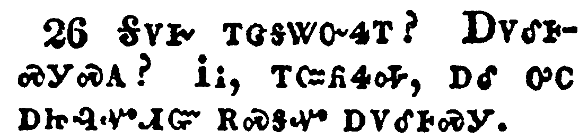</a></td>
</tr>
<tr class="even">
<td>But what went ye out for to see? A prophet? Yea, I say unto you, and much more than a prophet.</td>
</tr>
<tr class="odd">
<td>ᎦᏙᎨ ᎢᏣᎦᏔᏅᏎᎢ? ᎠᏙᎴᎰᏍᎩᏍᎪ? ᎥᎥ, ᎢᏨᏲᏎᎭ, ᎠᎴ ᎤᏟ ᎠᏥᎸᏉᏗᏳ ᎡᏍᎦᏉ ᎠᏙᎴᎰᏍᎩ.</td>
</tr>
<tr class="even">
<td>Ga-do-ge i-tsa-ga-ta-nv-se-i? A-do-le-ho-s-gi-s-go? V-v, i-tsv-yo-se-ha, a-le u-tli a-tsi-lv-quo-di-yu e-s-ga-quo a-do-le-ho-s-gi.</td>
</tr>
</tbody>
</table>

<table>
<tbody>
<tr class="odd">
<td><a href="030727.png">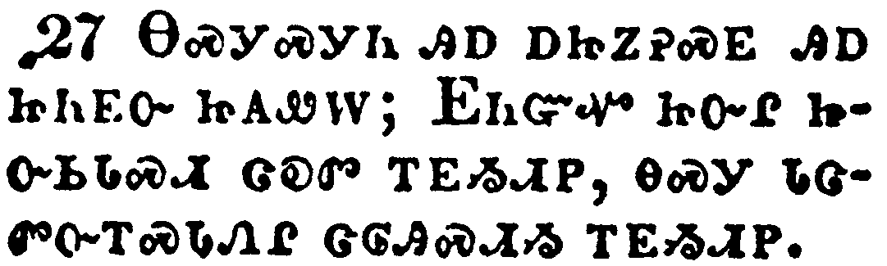</a></td>
</tr>
<tr class="even">
<td>This is he, of whom it is written, Behold, I send my messenger before thy face, which shall prepare thy way before thee.</td>
</tr>
<tr class="odd">
<td>ᎾᏍᎩᏍᎩᏂ ᎯᎠ ᎠᏥᏃᎮᏍᎬ ᎯᎠ ᏥᏂᎬᏅ ᏥᎪᏪᎳ; ᎬᏂᏳᏉ ᏥᏅᎵ ᏥᏅᏏᏓᏍᏗ ᏣᎧᏛ ᎢᎬᏱᏗᏢ, ᎾᏍᎩ ᏓᏣᏛᏅᎢᏍᏓᏁᎵ ᏣᎶᎯᏍᏗᏱ ᎢᎬᏱᏗᏢ.</td>
</tr>
<tr class="even">
<td>Na-s-gi-s-gi-ni hi-a a-tsi-no-he-s-gv hi-a tsi-ni-gv-nv tsi-go-we-la; Gv-ni-yu-quo tsi-nv-li tsi-nv-si-da-s-di tsa-ka-dv i-gv-yi-di-tlv, na-s-gi da-tsa-dv-nv-i-s-da-ne-li tsa-lo-hi-s-di-yi i-gv-yi-di-tlv.</td>
</tr>
</tbody>
</table>

<table>
<tbody>
<tr class="odd">
<td><a href="030728.png">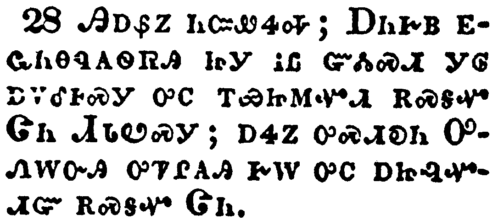</a></td>
</tr>
<tr class="even">
<td>For I say unto you, Among those that are born of women there is not a greater prophet than John the Baptist: but he that is least in the kingdom of God is greater than he.</td>
</tr>
<tr class="odd">
<td>ᎯᎠᏰᏃ ᏂᏨᏪᏎᎭ; ᎠᏂᎨᏴ ᎬᏩᏂᎾᏄᎪᏫᏒᎯ ᏥᎩ ᎥᏝ ᏳᏜᏓᏍᏗ ᎩᎶ ᎠᏙᎴᎰᏍᎩ ᎤᏟ ᎢᏯᏥᎷᏉᏗ ᎡᏍᎦᏉ ᏣᏂ ᏗᏓᏬᏍᎩ; ᎠᏎᏃ ᎤᏍᏗᎧᏂ ᎤᏁᎳᏅᎯ ᎤᏤᎵᎪᎯ ᎨᎳ ᎤᏟ ᎠᏥᎸᏉᏗᏳ ᎡᏍᎦᏉ ᏣᏂ.</td>
</tr>
<tr class="even">
<td>Hi-a-ye-no ni-tsv-we-se-ha; A-ni-ge-yv gv-wa-ni-na-nu-go-wi-sv-hi tsi-gi v-tla yu-dla-s-di gi-lo a-do-le-ho-s-gi u-tli i-ya-tsi-lu-quo-di e-s-ga-quo Tsa-ni Di-da-wo-s-gi; a-se-no u-s-di-ka-ni U-ne-la-nv-hi u-tse-li-go-hi ge-la u-tli a-tsi-lv-quo-di-yu e-s-ga-quo Tsa-ni.</td>
</tr>
</tbody>
</table>

<table>
<tbody>
<tr class="odd">
<td><a href="030729.png">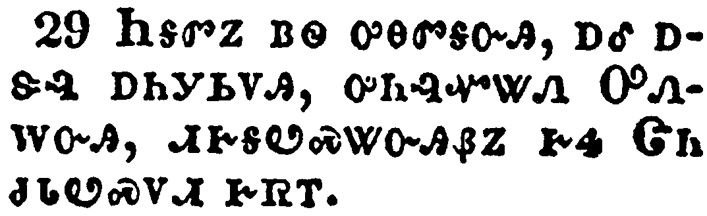</a></td>
</tr>
<tr class="even">
<td>And all the people that heard him, and the publicans, justified God, being baptized with the baptism of John.</td>
</tr>
<tr class="odd">
<td>ᏂᎦᏛᏃ ᏴᏫ ᎤᎾᏛᎦᏅᎯ, ᎠᎴ ᎠᏕᎸ ᎠᏂᎩᏏᏙᎯ, ᎤᏂᎸᏉᏔᏁ ᎤᏁᎳᏅᎯ, ᏗᎨᎦᎧᏍᏔᏅᎯᏰᏃ ᎨᏎ ᏣᏂ ᏧᏓᏬᏍᏙᏗ ᎨᏒᎢ.</td>
</tr>
<tr class="even">
<td>Ni-ga-dv-no yv-wi u-na-dv-ga-nv-hi, a-le a-de-lv a-ni-gi-si-do-hi, u-ni-lv-quo-ta-ne U-ne-la-nv-hi, di-ge-ga-ka-s-ta-nv-hi-ye-no ge-se Tsa-ni tsu-da-wo-s-do-di ge-sv-i.</td>
</tr>
</tbody>
</table>

<table>
<tbody>
<tr class="odd">
<td><a href="030730.png">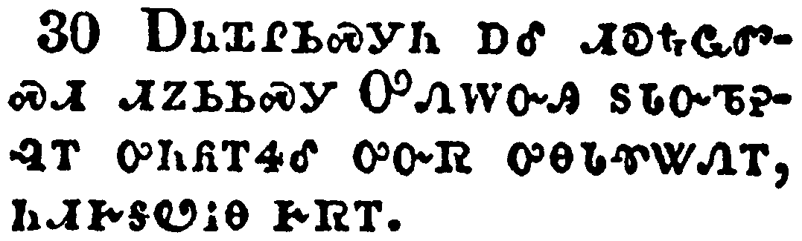</a></td>
</tr>
<tr class="even">
<td>But the Pharisees and lawyers rejected the counsel of God against themselves, being not baptized of him.</td>
</tr>
<tr class="odd">
<td>ᎠᏂᏆᎵᏏᏍᎩᏂ ᎠᎴ ᏗᎧᎿᎭᏩᏛᏍᏗ ᏗᏃᏏᏏᏍᎩ ᎤᏁᎳᏅᎯ ᏚᏓᏅᏖᎮᎸᎢ ᎤᏂᏲᎢᏎᎴ ᎤᏅᏒ ᎤᎾᏓᏡᏔᏁᎢ, ᏂᏗᎨᎦᏬᎥᎾ ᎨᏒᎢ.</td>
</tr>
<tr class="even">
<td>A-ni-qua-li-si-s-gi-ni a-le di-ka-hna-wa-dv-s-di di-no-si-si-s-gi U-ne-la-nv-hi du-da-nv-te-he-lv-i u-ni-yo-i-se-le u-nv-sv u-na-da-tlu-ta-ne-i, ni-di-ge-ga-wo-v-na ge-sv-i.</td>
</tr>
</tbody>
</table>

<table>
<tbody>
<tr class="odd">
<td><a href="030731.png">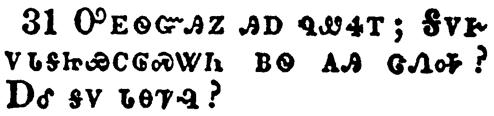</a></td>
</tr>
<tr class="even">
<td>And the Lord said, Whereunto then shall I liken the men of this generation? and to what are they like?</td>
</tr>
<tr class="odd">
<td>ᎤᎬᏫᏳᎯᏃ ᎯᎠ ᏄᏪᏎᎢ; ᎦᏙᎨᏙᏓᎦᏥᏯᏟᎶᏍᏔᏂ ᏴᏫ ᎪᎯ ᏣᏁᎭ? ᎠᎴ ᎦᏙ ᏓᎾᏤᎸ?</td>
</tr>
<tr class="even">
<td>U-gv-wi-yu-hi-no hi-a nu-we-se-i; Ga-do-ge-do-da-ga-tsi-ya-tli-lo-s-ta-ni yv-wi go-hi tsa-ne-ha? A-le ga-do da-na-tse-lv?</td>
</tr>
</tbody>
</table>

<table>
<tbody>
<tr class="odd">
<td><a href="030732.png">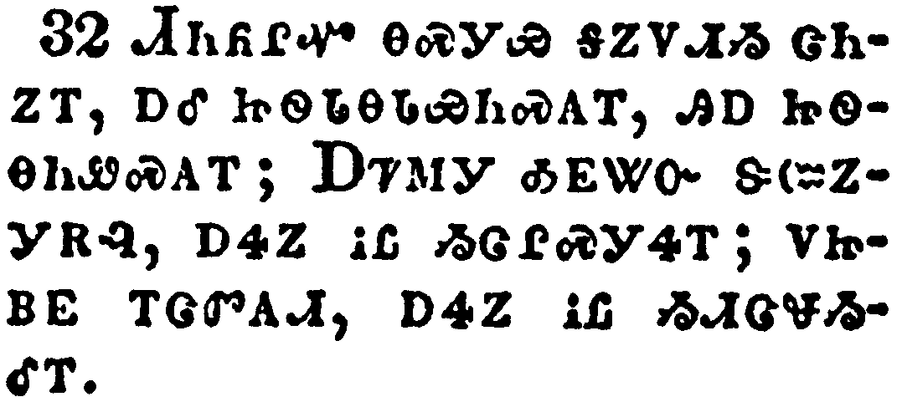</a></td>
</tr>
<tr class="even">
<td>They are like unto children sitting in the marketplace, and calling one to another, and saying, We have piped unto you, and ye have not danced; we have mourned to you, and ye have not wept.</td>
</tr>
<tr class="odd">
<td>ᏗᏂᏲᎵᏉ ᎾᏍᎩᏯ ᎦᏃᏙᏗᏱ ᏣᏂᏃᎢ, ᎠᎴ ᏥᏫᏓᎾᏓᏯᏂᏍᎪᎢ, ᎯᎠ ᏥᏫᎾᏂᏪᏍᎪᎢ; ᎠᏤᎷᎩ ᎣᎬᏔᏅ ᏕᏨᏃᎩᎡᎸ, ᎠᏎᏃ ᎥᏝ ᏱᏣᎵᏍᎩᏎᎢ; ᏙᏥᏴᎬ ᎢᏣᏛᎪᏗ, ᎠᏎᏃ ᎥᏝ ᏱᏗᏣᏠᏱᎴᎢ.</td>
</tr>
<tr class="even">
<td>Di-ni-yo-li-quo na-s-gi-ya ga-no-do-di-yi tsa-ni-no-i, a-le tsi-wi-da-na-da-ya-ni-s-go-i, hi-a tsi-wi-na-ni-we-s-go-i; A-tse-lu-gi o-gv-ta-nv de-tsv-no-gi-e-lv, a-se-no v-tla yi-tsa-li-s-gi-se-i; do-tsi-yv-gv i-tsa-dv-go-di, a-se-no v-tla yi-di-tsa-tlo-yi-le-i.</td>
</tr>
</tbody>
</table>

<table>
<tbody>
<tr class="odd">
<td><a href="030733.png">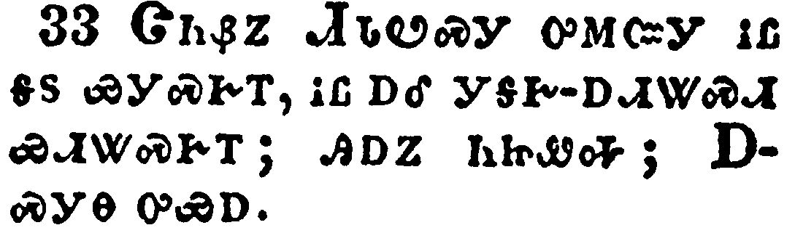</a></td>
</tr>
<tr class="even">
<td>For John the Baptist came neither eating bread nor drinking wine; and ye say, He hath a devil.</td>
</tr>
<tr class="odd">
<td>ᏣᏂᏰᏃ ᏗᏓᏬᏍᎩ ᎤᎷᏨᎩ ᎥᏝ ᎦᏚ ᏯᎩᏍᎨᎢ, ᎥᏝ ᎠᎴ ᎩᎦᎨ-ᎠᏗᏔᏍᏗ ᏯᏗᏔᏍᎨᎢ; ᎯᎠᏃ ᏂᏥᏪᏎ; ᎠᏍᎩᎾ ᎤᏯᎠ.</td>
</tr>
<tr class="even">
<td>Tsa-ni-ye-no Di-da-wo-s-gi u-lu-tsv-gi v-tla ga-du ya-gi-s-ge-i, v-tla a-le gi-ga-ge--a-di-ta-s-di ya-di-ta-s-ge-i; hi-a-no ni-tsi-we-se; A-s-gi-na u-ya-a.</td>
</tr>
</tbody>
</table>

<table>
<tbody>
<tr class="odd">
<td><a href="030734.png">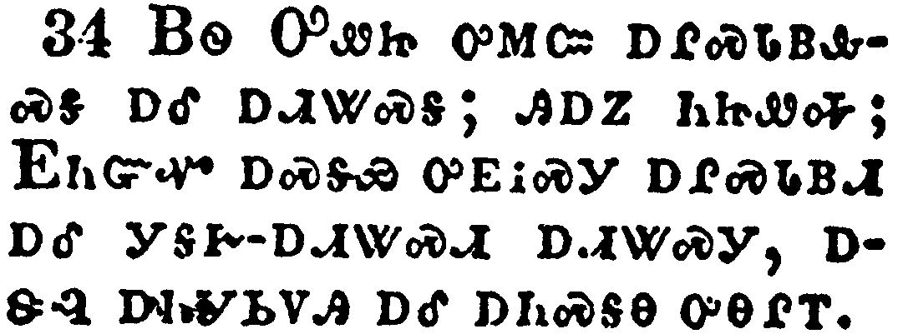</a></td>
</tr>
<tr class="even">
<td>The Son of man is come eating and drinking; and ye say, Behold a gluttonous man, and a winebibber, a friend of publicans and sinners!</td>
</tr>
<tr class="odd">
<td>ᏴᏫ ᎤᏪᏥ ᎤᎷᏨ ᎠᎵᏍᏓᏴᎲᏍᎦ ᎠᎴ ᎠᏗᏔᏍᎦ; ᎯᎠᏃ ᏂᏥᏪᎭ; ᎬᏂᏳᏉ ᎠᏍᎦᏯ ᎤᎬᎥᏍᎩ ᎠᎵᏍᏓᏴᏗ ᎠᎴ ᎩᎦᎨ-ᎠᏗᏔᏍᏗ ᎠᏗᏔᏍᎩ, ᎠᏕᎸ ᎠᏂᎩᏏᏙᎯ ᎠᎴ ᎠᏂᏍᎦᎾ ᎤᎾᎵᎢ.</td>
</tr>
<tr class="even">
<td>Yv-wi U-we-tsi u-lu-tsv a-li-s-da-yv-hv-s-ga a-le a-di-ta-s-ga; hi-a-no ni-tsi-we-ha; Gv-ni-yu-quo a-s-ga-ya u-gv-v-s-gi a-li-s-da-yv-di a-le gi-ga-ge--a-di-ta-s-di a-di-ta-s-gi, a-de-lv a-ni-gi-si-do-hi a-le a-ni-s-ga-na u-na-li-i.</td>
</tr>
</tbody>
</table>

<table>
<tbody>
<tr class="odd">
<td><a href="030735.png">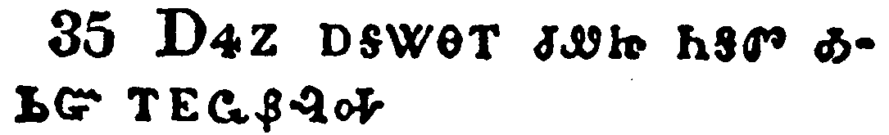</a></td>
</tr>
<tr class="even">
<td>But wisdom is justified of all her children.</td>
</tr>
<tr class="odd">
<td>ᎠᏎᏃ ᎠᎦᏔᎾᎢ ᏧᏪᏥ ᏂᎦᏛ ᎣᏏᏳ ᎢᎬᏩᏰᎸᎭ</td>
</tr>
<tr class="even">
<td>A-se-no a-ga-ta-na-i tsu-we-tsi ni-ga-dv o-si-yu i-gv-wa-ye-lv-ha</td>
</tr>
</tbody>
</table>

<table>
<tbody>
<tr class="odd">
<td><a href="030736.png">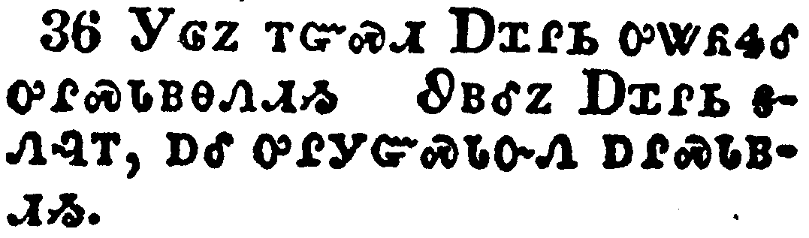</a></td>
</tr>
<tr class="even">
<td>And one of the Pharisees desired him that he would eat with him. And he went into the Pharisee's house, and sat down to meat.</td>
</tr>
<tr class="odd">
<td>ᎩᎶᏃ ᎢᏳᏍᏗ ᎠᏆᎵᏏ ᎤᏔᏲᏎᎴ ᎤᎵᏍᏓᏴᎾᏁᏗᏱ ᏭᏴᎴᏃ ᎠᏆᎵᏏ ᎦᏁᎸᎢ, ᎠᎴ ᎤᎵᎩᏳᏍᏓᏅᏁ ᎠᎵᏍᏓᏴᏗᏱ.</td>
</tr>
<tr class="even">
<td>Gi-lo-no i-yu-s-di A-qua-li-si u-ta-yo-se-le u-li-s-da-yv-na-ne-di-yi Wu-yv-le-no A-qua-li-si ga-ne-lv-i, a-le u-li-gi-yu-s-da-nv-ne a-li-s-da-yv-di-yi.</td>
</tr>
</tbody>
</table>

<table>
<tbody>
<tr class="odd">
<td><a href="030737.png">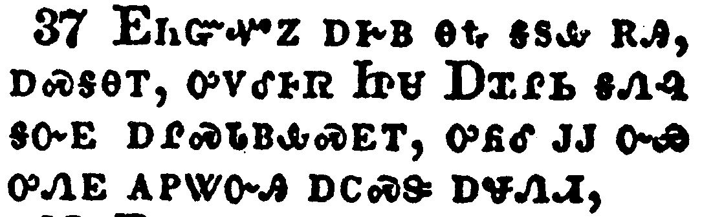</a></td>
</tr>
<tr class="even">
<td>And, behold, a woman in the city, which was a sinner, when she knew that Jesus sat at meat in the Pharisee's house, brought an alabaster box of ointment,</td>
</tr>
<tr class="odd">
<td>ᎬᏂᏳᏉᏃ ᎠᎨᏴ ᎾᎿᎭᎦᏚᎲ ᎡᎯ, ᎠᏍᎦᎾᎢ, ᎤᏙᎴᎰᏒ ᏥᏌ ᎠᏆᎵᏏ ᎦᏁᎸ ᎦᏅᎬ ᎠᎵᏍᏓᏴᎲᏍᎬᎢ, ᎤᏲᎴ ᎫᎫ ᏅᏯ ᎤᏁᎬ ᎪᏢᏔᏅᎯ ᎠᏟᏍᏕ ᎠᏠᏁᏗ,</td>
</tr>
<tr class="even">
<td>Gv-ni-yu-quo-no a-ge-yv na-hna ga-du-hv e-hi, a-s-ga-na-i, u-do-le-ho-sv Tsi-sa A-qua-li-si ga-ne-lv ga-nv-gv a-li-s-da-yv-hv-s-gv-i, u-yo-le gu-gu nv-ya u-ne-gv go-tlv-ta-nv-hi a-tli-s-de a-tlo-ne-di,</td>
</tr>
</tbody>
</table>

<table>
<tbody>
<tr class="odd">
<td><a href="030738.png">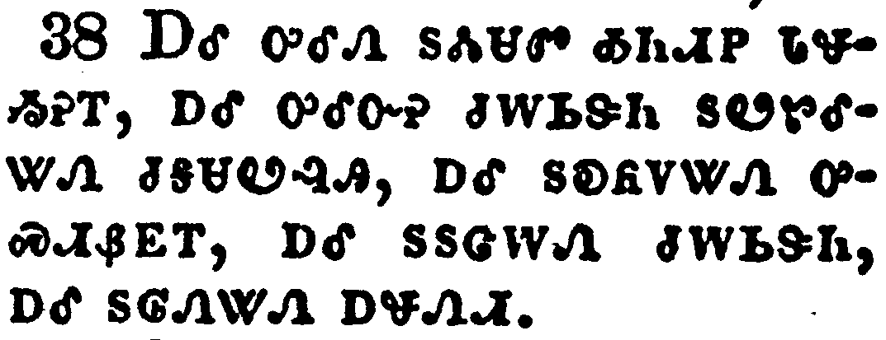</a></td>
</tr>
<tr class="even">
<td>And stood at his feet behind him weeping, and began to wash his feet with tears, and did wipe them with the hairs of her head, and kissed his feet, and anointed them with the ointment.</td>
</tr>
<tr class="odd">
<td>ᎠᎴ ᎤᎴᏁ ᏚᏜᏓᏌᏛ ᎣᏂᏗᏢ ᏓᏠᏱᎮᎢ, ᎠᎴ ᎤᎴᏅᎮ ᏧᎳᏏᏕᏂ ᏚᏬᏑᎴᏔᏁ ᏧᎦᏌᏬᎸᎯ, ᎠᎴ ᏚᎧᏲᏙᏔᏁ ᎤᏍᏗᏰᎬᎢ, ᎠᎴ ᏚᏚᏣᎳᏁ ᏧᎳᏏᏕᏂ, ᎠᎴ ᏚᎶᏁᏔᏁ ᎠᏠᏁᏗ.</td>
</tr>
<tr class="even">
<td>A-le u-le-ne du-dla-sa-dv o-ni-di-tlv da-tlo-yi-he-i, a-le u-le-nv-he tsu-la-si-de-ni du-wo-su-le-ta-ne tsu-ga-sa-wo-lv-hi, a-le du-ka-yo-do-ta-ne u-s-di-ye-gv-i, a-le du-du-tsa-la-ne tsu-la-si-de-ni, a-le du-lo-ne-ta-ne a-tlo-ne-di.</td>
</tr>
</tbody>
</table>

<table>
<tbody>
<tr class="odd">
<td><a href="030739.png">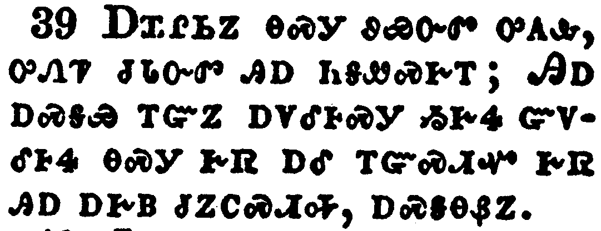</a></td>
</tr>
<tr class="even">
<td>Now when the Pharisee which had bidden him saw it, he spake within himself, saying, This man, if he were a prophet, would have known who and what manner of woman this is that toucheth him: for she is a sinner.</td>
</tr>
<tr class="odd">
<td>ᎠᏆᎵᏏᏃ ᎾᏍᎩ ᏭᏯᏅᏛ ᎤᎪᎲ, ᎤᏁᏤ ᏧᏓᏅᏛ ᎯᎠ ᏂᎦᏪᏍᎨᎢ; ᎯᎠ ᎠᏍᎦᏯ ᎢᏳᏃ ᎠᏙᎴᎰᏍᎩ ᏱᎨᏎ ᏳᏙᎴᎰᏎ ᎾᏍᎩ ᎨᏒ ᎠᎴ ᎢᏳᏍᏗᏉ ᎨᏒ ᎯᎠ ᎠᎨᏴ ᏧᏃᏟᏍᏗᎭ, ᎠᏍᎦᎾᏰᏃ.</td>
</tr>
<tr class="even">
<td>A-qua-li-si-no na-s-gi wu-ya-nv-dv u-go-hv, u-ne-tse tsu-da-nv-dv hi-a ni-ga-we-s-ge-i; Hi-a a-s-ga-ya i-yu-no a-do-le-ho-s-gi yi-ge-se yu-do-le-ho-se na-s-gi ge-sv a-le i-yu-s-di-quo ge-sv hi-a a-ge-yv tsu-no-tli-s-di-ha, a-s-ga-na-ye-no.</td>
</tr>
</tbody>
</table>

<table>
<tbody>
<tr class="odd">
<td><a href="030740.png">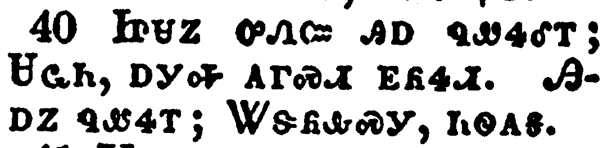</a></td>
</tr>
<tr class="even">
<td>And Jesus answering said unto him, Simon, I have somewhat to say unto thee. And he saith, Master, say on.</td>
</tr>
<tr class="odd">
<td>ᏥᏌᏃ ᎤᏁᏨ ᎯᎠ ᏄᏪᏎᎴᎢ; ᏌᏩᏂ, ᎠᎩᎭ ᎪᎱᏍᏗ ᎬᏲᏎᏗ. ᎯᎠᏃ ᏄᏪᏎᎢ; ᏔᏕᏲᎲᏍᎩ, ᏂᏫᎪᎦ.</td>
</tr>
<tr class="even">
<td>Tsi-sa-no u-ne-tsv hi-a nu-we-se-le-i; Sa-wa-ni, a-gi-ha go-hu-s-di gv-yo-se-di. Hi-a-no nu-we-se-i; Ta-de-yo-hv-s-gi, ni-wi-go-ga.</td>
</tr>
</tbody>
</table>

<table>
<tbody>
<tr class="odd">
<td><a href="030741.png">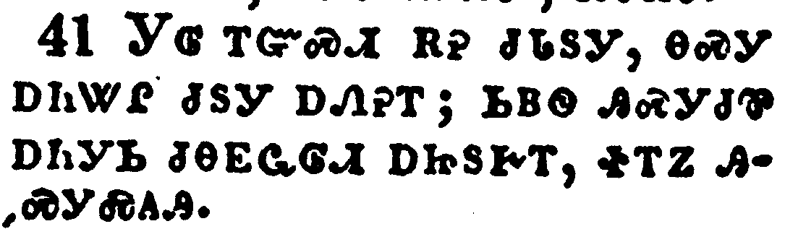</a></td>
</tr>
<tr class="even">
<td>There was a certain creditor which had two debtors: the one owed five hundred pence, and the other fifty.</td>
</tr>
<tr class="odd">
<td>ᎩᎶ ᎢᏳᏍᏗ ᎡᎮ ᏧᏓᏚᎩ, ᎾᏍᎩ ᎠᏂᏔᎵ ᏧᏚᎩ ᎠᏁᎮᎢ; ᏏᏴᏫ ᎯᏍᎩᏧᏈ ᎠᏂᎩᏏ ᏧᎾᎬᏩᎶᏗ ᎠᏥᏚᎨᎢ, ᏐᎢᏃ ᎯᏍᎦᏍᎪᎯ.</td>
</tr>
<tr class="even">
<td>Gi-lo i-yu-s-di e-he tsu-da-du-gi, na-s-gi a-ni-ta-li tsu-du-gi a-ne-he-i; si-yv-wi hi-s-gi-tsu-qui a-ni-gi-si tsu-na-gv-wa-lo-di a-tsi-du-ge-i, so-i-no hi-s-ga-s-go-hi.</td>
</tr>
</tbody>
</table>

<table>
<tbody>
<tr class="odd">
<td><a href="030742.png">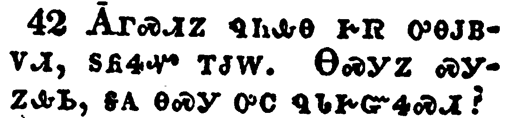</a></td>
</tr>
<tr class="even">
<td>And when they had nothing to pay, he frankly forgave them both. Tell me therefore, which of them will love him most?</td>
</tr>
<tr class="odd">
<td>ᎪᎱᏍᏗᏃ ᏄᏂᎲᎾ ᎨᏒ ᎤᎾᎫᏴᏙᏗ, ᏚᏲᏎᏉ ᎢᏧᎳ. ᎾᏍᎩᏃ ᏍᎩᏃᎲᏏ, ᎦᎪ ᎾᏍᎩ ᎤᏟ ᏄᏓᎨᏳᏎᏍᏗ?</td>
</tr>
<tr class="even">
<td>Go-hu-s-di-no nu-ni-hv-na ge-sv u-na-gu-yv-do-di, du-yo-se-quo i-tsu-la. Na-s-gi-no s-gi-no-hv-si, ga-go na-s-gi u-tli nu-da-ge-yu-se-s-di?</td>
</tr>
</tbody>
</table>

<table>
<tbody>
<tr class="odd">
<td><a href="030743.png">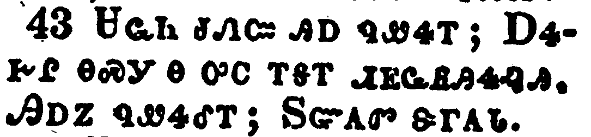</a></td>
</tr>
<tr class="even">
<td>Simon answered and said, I suppose that he, to whom he forgave most. And he said unto him, Thou hast rightly judged.</td>
</tr>
<tr class="odd">
<td>ᏌᏩᏂ ᏧᏁᏨ ᎯᎠ ᏄᏪᏎᎢ; ᎠᏎᎨᎵ ᎾᏍᎩ Ꮎ ᎤᏟ ᎢᎦᎢ ᏗᎬᏩᏲᎯᏎᎸᎯ. ᎯᎠᏃ ᏄᏪᏎᎴᎢ; ᏚᏳᎪᏛ ᏕᎱᎪᏓ.</td>
</tr>
<tr class="even">
<td>Sa-wa-ni tsu-ne-tsv hi-a nu-we-se-i; A-se-ge-li na-s-gi na u-tli i-ga-i di-gv-wa-yo-hi-se-lv-hi. Hi-a-no nu-we-se-le-i; Du-yu-go-dv de-hu-go-da.</td>
</tr>
</tbody>
</table>

<table>
<tbody>
<tr class="odd">
<td><a href="030744.png">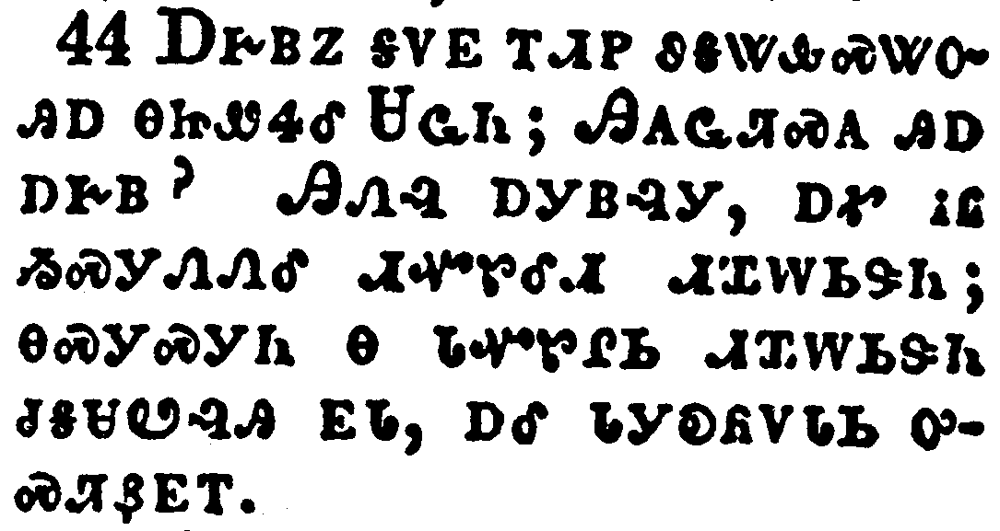</a></td>
</tr>
<tr class="even">
<td>And he turned to the woman, and said unto Simon, Seest thou this woman? I entered into thine house, thou gavest me no water for my feet: but she hath washed my feet with tears, and wiped them with the hairs of her head.</td>
</tr>
<tr class="odd">
<td>ᎠᎨᏴᏃ ᎦᏙᎬ ᎢᏗᏢ ᏭᎦᏔᎲᏍᏔᏅ ᎯᎠ ᎾᏥᏪᏎᎴ ᏌᏩᏂ; ᎯᎪᏩᏘᏍᎪ ᎯᎠ ᎠᎨᏴ? ᎯᏁᎸ ᎠᎩᏴᎸᎩ, ᎠᎹ ᎥᏝ ᏱᏍᎩᏁᏁᎴ ᏗᏉᏑᎴᏗ ᏗᏆᎳᏏᏕᏂ; ᎾᏍᎩᏍᎩᏂ Ꮎ ᏓᏉᏑᎵᏏ ᏗᏆᎳᏏᏕᏂ ᏧᎦᏌᏬᎸᎯ ᎬᏓ, ᎠᎴ ᏓᎩᎧᏲᏙᏓᏏ ᎤᏍᏘᏰᎬᎢ.</td>
</tr>
<tr class="even">
<td>A-ge-yv-no ga-do-gv i-di-tlv wu-ga-ta-hv-s-ta-nv hi-a na-tsi-we-se-le Sa-wa-ni; Hi-go-wa-ti-s-go hi-a a-ge-yv? Hi-ne-lv a-gi-yv-lv-gi, a-ma v-tla yi-s-gi-ne-ne-le di-quo-su-le-di di-qua-la-si-de-ni; na-s-gi-s-gi-ni na da-quo-su-li-si di-qua-la-si-de-ni tsu-ga-sa-wo-lv-hi gv-da, a-le da-gi-ka-yo-do-da-si u-s-ti-ye-gv-i.</td>
</tr>
</tbody>
</table>

<table>
<tbody>
<tr class="odd">
<td><a href="030745.png">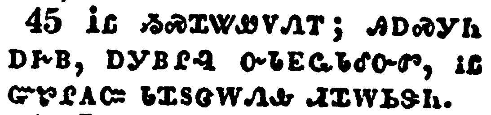</a></td>
</tr>
<tr class="even">
<td>Thou gavest me no kiss: but this woman since the time I came in hath not ceased to kiss my feet.</td>
</tr>
<tr class="odd">
<td>ᎥᏝ ᏱᏍᏆᏔᏪᏙᏁᎢ; ᎯᎠᏍᎩᏂ ᎠᎨᏴ, ᎠᎩᏴᎵᎸ ᏅᏓᎬᏩᏓᎴᏅᏛ, ᎥᏝ ᏳᏑᎵᎪᏨ ᏓᏆᏚᏣᎳᏁᎲ ᏗᏆᎳᏏᏕᏂ.</td>
</tr>
<tr class="even">
<td>V-tla yi-s-qua-ta-we-do-ne-i; hi-a-s-gi-ni a-ge-yv, a-gi-yv-li-lv nv-da-gv-wa-da-le-nv-dv, v-tla yu-su-li-go-tsv da-qua-du-tsa-la-ne-hv di-qua-la-si-de-ni.</td>
</tr>
</tbody>
</table>

<table>
<tbody>
<tr class="odd">
<td><a href="030746.png">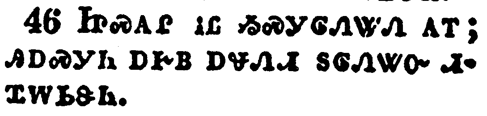</a></td>
</tr>
<tr class="even">
<td>My head with oil thou didst not anoint: but this woman hath anointed my feet with ointment.</td>
</tr>
<tr class="odd">
<td>ᏥᏍᎪᎵ ᎥᏝ ᏱᏍᎩᎶᏁᏔᏁ ᎪᎢ; ᎯᎠᏍᎩᏂ ᎠᎨᏴ ᎠᏠᏁᏗ ᏚᎶᏁᏔᏅ ᏗᏆᎳᏏᏕᏂ.</td>
</tr>
<tr class="even">
<td>Tsi-s-go-li v-tla yi-s-gi-lo-ne-ta-ne go-i; hi-a-s-gi-ni a-ge-yv a-tlo-ne-di du-lo-ne-ta-nv di-qua-la-si-de-ni.</td>
</tr>
</tbody>
</table>

<table>
<tbody>
<tr class="odd">
<td><a href="030747.png">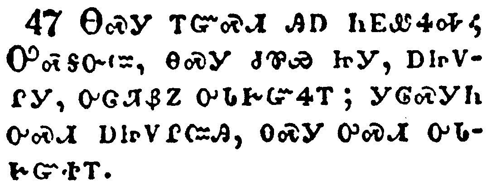</a></td>
</tr>
<tr class="even">
<td>Wherefore I say unto thee, Her sins, which are many, are forgiven; for she loved much: but to whom little is forgiven, the same loveth little.</td>
</tr>
<tr class="odd">
<td>ᎾᏍᎩ ᎢᏳᏍᏗ ᎯᎠ ᏂᎬᏪᏎᎭ; ᎤᏍᎦᏅᏨ, ᎾᏍᎩ ᏧᏈᏯ ᏥᎩ, ᎠᏥᏙᎵᎩ, ᎤᏣᏘᏰᏃ ᎤᏓᎨᏳᏎᎢ; ᎩᎶᏍᎩᏂ ᎤᏍᏗ ᎠᏥᏙᎵᏨᎯ, ᎾᏍᎩ ᎤᏍᏗ ᎤᏓᎨᏳᏐᎢ.</td>
</tr>
<tr class="even">
<td>Na-s-gi i-yu-s-di hi-a ni-gv-we-se-ha; U-s-ga-nv-tsv, na-s-gi tsu-qui-ya tsi-gi, a-tsi-do-li-gi, u-tsa-ti-ye-no u-da-ge-yu-se-i; gi-lo-s-gi-ni u-s-di a-tsi-do-li-tsv-hi, na-s-gi u-s-di u-da-ge-yu-so-i.</td>
</tr>
</tbody>
</table>

<table>
<tbody>
<tr class="odd">
<td><a href="030748.png">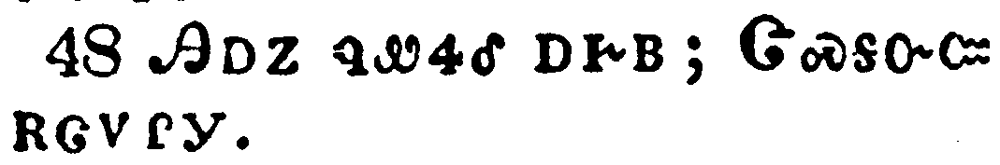</a></td>
</tr>
<tr class="even">
<td>And he said unto her, Thy sins are forgiven.</td>
</tr>
<tr class="odd">
<td>ᎯᎠᏃ ᏄᏪᏎᎴ ᎠᎨᏴ; ᏣᏍᎦᏅᏨ ᎡᏣᏙᎵᎩ.</td>
</tr>
<tr class="even">
<td>Hi-a-no nu-we-se-le a-ge-yv; Tsa-s-ga-nv-tsv e-tsa-do-li-gi.</td>
</tr>
</tbody>
</table>

<table>
<tbody>
<tr class="odd">
<td><a href="030749.png">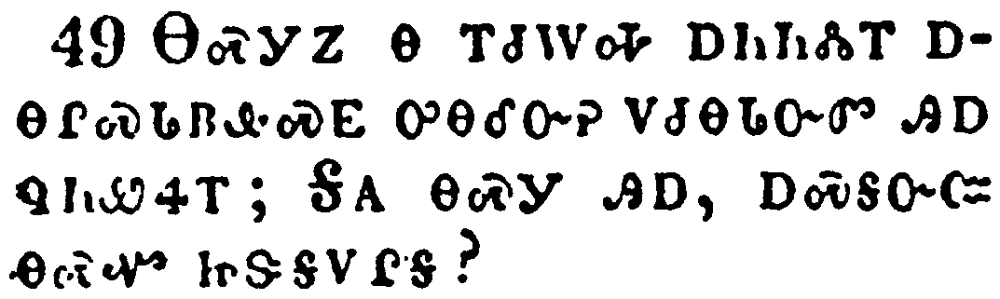</a></td>
</tr>
<tr class="even">
<td>And they that sat at meat with him began to say within themselves, Who is this that forgiveth sins also?</td>
</tr>
<tr class="odd">
<td>ᎾᏍᎩᏃ Ꮎ ᎢᏧᎳᎭ ᎠᏂᏂᏜᏓᎢ ᎠᎾᎵᏍᏓᏴᎲᏍᎬ ᎤᎾᎴᏅᎮ ᏙᏧᎾᏓᏅᏛ ᎯᎠ ᏄᏂᏪᏎᎢ; ᎦᎪ ᎾᏍᎩ ᎯᎠ, ᎠᏍᎦᏅᏨ ᎾᏍᏉ ᏥᏕᎦᏙᎵᎦ?</td>
</tr>
<tr class="even">
<td>Na-s-gi-no na i-tsu-la-ha a-ni-ni-dla-i a-na-li-s-da-yv-hv-s-gv u-na-le-nv-he do-tsu-na-da-nv-dv hi-a nu-ni-we-se-i; Ga-go na-s-gi hi-a, a-s-ga-nv-tsv na-s-quo tsi-de-ga-do-li-ga?</td>
</tr>
</tbody>
</table>

<table>
<tbody>
<tr class="odd">
<td><a href="030750.png">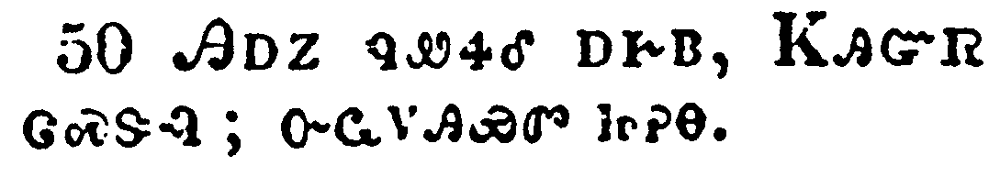</a></td>
</tr>
<tr class="even">
<td>And he said to the woman, Thy faith hath saved thee; go in peace.</td>
</tr>
<tr class="odd">
<td>ᎯᎠᏃ ᏄᏪᏎᎴ ᎠᎨᏴ, ᏦᎯᏳᏒ ᏣᏍᏕᎸ; ᏅᏩᏙᎯᏯᏛ ᏥᎮᎾ.</td>
</tr>
<tr class="even">
<td>Hi-a-no nu-we-se-le a-ge-yv, Tso-hi-yu-sv tsa-s-de-lv; nv-wa-do-hi-ya-dv tsi-he-na.</td>
</tr>
</tbody>
</table>

