+++
draft=false
date = 2014-12-18T21:11:07Z
title = "Luke - Chapter 9 - Cherokee New Testament"
weight = 1418955067

[taxonomies]

authors = ["Timothy Legg"]
categories = []
tags = []

[extra]
+++

<table>
<tbody>
<tr class="odd">
<td><a href="030901.png">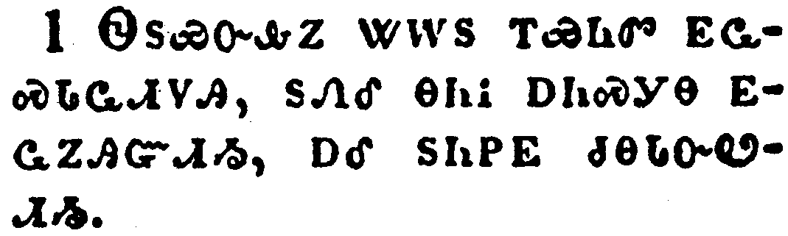</a></td>
</tr>
<tr class="even">
<td>Then he called his twelve disciples together, and gave them power and authority over all devils, and to cure diseases.</td>
</tr>
<tr class="odd">
<td>ᏫᏚᏯᎲᏃ ᏔᎳᏚ ᎢᏯᏂᏛ ᎬᏩᏍᏓᏩᏗᏙᎯ, ᏚᏁᎴ ᎾᏂᎥ ᎠᏂᏍᎩᎾ ᎬᏩᏃᎯᏳᏗᏱ, ᎠᎴ ᏚᏂᏢᎬ ᏧᎾᏓᏅᏬᏗᏱ.</td>
</tr>
<tr class="even">
<td>Wi-du-ya-hv-no ta-la-du i-ya-ni-dv gv-wa-s-da-wa-di-do-hi, du-ne-le na-ni-v a-ni-s-gi-na gv-wa-no-hi-yu-di-yi, a-le du-ni-tlv-gv tsu-na-da-nv-wo-di-yi.</td>
</tr>
</tbody>
</table>

<table>
<tbody>
<tr class="odd">
<td><a href="030902.png">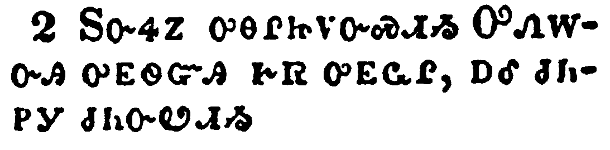</a></td>
</tr>
<tr class="even">
<td>And he sent them to preach the kingdom of God, and to heal the sick.</td>
</tr>
<tr class="odd">
<td>ᏚᏅᏎᏃ ᎤᎾᎵᏥᏙᏅᏍᏗᏱ ᎤᏁᎳᏅᎯ ᎤᎬᏫᏳᎯ ᎨᏒ ᎤᎬᏩᎵ, ᎠᎴ ᏧᏂᏢᎩ ᏧᏂᏅᏬᏗᏱ</td>
</tr>
<tr class="even">
<td>Du-nv-se-no u-na-li-tsi-do-nv-s-di-yi U-ne-la-nv-hi u-gv-wi-yu-hi ge-sv u-gv-wa-li, a-le tsu-ni-tlv-gi tsu-ni-nv-wo-di-yi</td>
</tr>
</tbody>
</table>

<table>
<tbody>
<tr class="odd">
<td><a href="030903.png">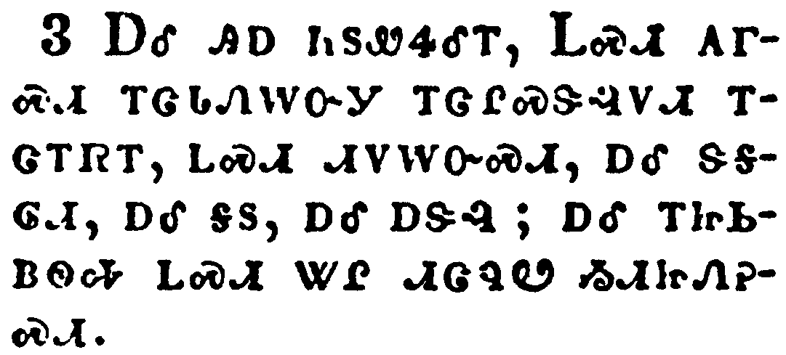</a></td>
</tr>
<tr class="even">
<td>And he said unto them, Take nothing for your journey, neither staves, nor scrip, neither bread, neither money; neither have two coats apiece.</td>
</tr>
<tr class="odd">
<td>ᎠᎴ ᎯᎠ ᏂᏚᏪᏎᎴᎢ, ᏞᏍᏗ ᎪᎱᏍᏗ ᎢᏣᏓᏁᎳᏅᎩ ᎢᏣᎵᏍᏕᎸᏙᏗ ᎢᏣᎢᏒᎢ, ᏞᏍᏗ ᏗᏙᎳᏅᏍᏗ, ᎠᎴ ᏕᎦᎶᏗ, ᎠᎴ ᎦᏚ, ᎠᎴ ᎠᏕᎸ; ᎠᎴ ᎢᏥᏏᏴᏫᎭ ᏞᏍᏗ ᏔᎵ ᏗᏣᏄᏬ ᏱᏗᏥᏁᎮᏍᏗ.</td>
</tr>
<tr class="even">
<td>A-le hi-a ni-du-we-se-le-i, Tle-s-di go-hu-s-di i-tsa-da-ne-la-nv-gi i-tsa-li-s-de-lv-do-di i-tsa-i-sv-i, tle-s-di di-do-la-nv-s-di, a-le de-ga-lo-di, a-le ga-du, a-le a-de-lv; a-le i-tsi-si-yv-wi-ha tle-s-di ta-li di-tsa-nu-wo yi-di-tsi-ne-he-s-di.</td>
</tr>
</tbody>
</table>

<table>
<tbody>
<tr class="odd">
<td><a href="030904.png">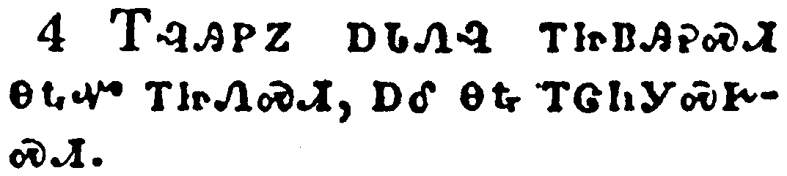</a></td>
</tr>
<tr class="even">
<td>And whatsoever house ye enter into, there abide, and thence depart.</td>
</tr>
<tr class="odd">
<td>ᎢᎸᎯᏢᏃ ᎠᏓᏁᎸ ᎢᏥᏴᎯᎮᏍᏗ ᎾᎭᏉ ᎢᏥᏁᏍᏗ, ᎠᎴ ᎾᎿᎭᎢᏣᏂᎩᏍᎨᏍᏗ.</td>
</tr>
<tr class="even">
<td>I-lv-hi-tlv-no a-da-ne-lv i-tsi-yv-hi-he-s-di na-ha-quo i-tsi-ne-s-di, a-le na-hna i-tsa-ni-gi-s-ge-s-di.</td>
</tr>
</tbody>
</table>

<table>
<tbody>
<tr class="odd">
<td><a href="030905.png">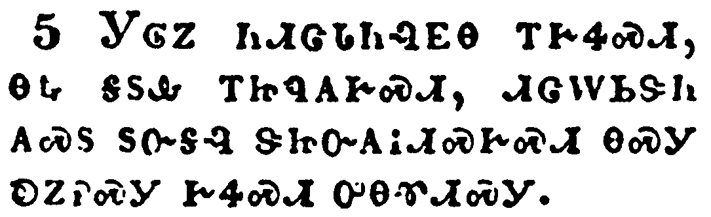</a></td>
</tr>
<tr class="even">
<td>And whosoever will not receive you, when ye go out of that city, shake off the very dust from your feet for a testimony against them.</td>
</tr>
<tr class="odd">
<td>ᎩᎶᏃ ᏂᏗᏣᏓᏂᎸᎬᎾ ᎢᎨᏎᏍᏗ, ᎾᎿᎭᎦᏚᎲ ᎢᏥᏄᎪᎨᏍᏗ, ᏗᏣᎳᏏᏕᏂ ᎪᏍᏚ ᏚᏅᎦᎸ ᏕᏥᏅᎪᎥᏗᏍᎨᏍᏗ ᎾᏍᎩ ᎧᏃᎮᏍᎩ ᎨᏎᏍᏗ ᎤᎾᏡᏗᏍᎩ.</td>
</tr>
<tr class="even">
<td>Gi-lo-no ni-di-tsa-da-ni-lv-gv-na i-ge-se-s-di, na-hna ga-du-hv i-tsi-nu-go-ge-s-di, di-tsa-la-si-de-ni go-s-du du-nv-ga-lv de-tsi-nv-go-v-di-s-ge-s-di na-s-gi ka-no-he-s-gi ge-se-s-di u-na-tlu-di-s-gi.</td>
</tr>
</tbody>
</table>

<table>
<tbody>
<tr class="odd">
<td><a href="030906.png">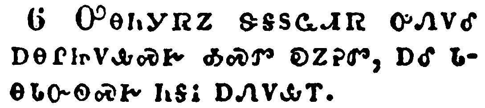</a></td>
</tr>
<tr class="even">
<td>And they departed, and went through the towns, preaching the gospel, and healing every where.</td>
</tr>
<tr class="odd">
<td>ᎤᎾᏂᎩᏒᏃ ᏕᎦᏚᏩᏗᏒ ᎤᏁᏙᎴ ᎠᎾᎵᏥᏙᎲᏍᎨ ᎣᏍᏛ ᎧᏃᎮᏛ, ᎠᎴ ᏓᎾᏓᏅᏫᏍᎨ ᏂᎦᎥ ᎠᏁᏙᎲᎢ.</td>
</tr>
<tr class="even">
<td>U-na-ni-gi-sv-no de-ga-du-wa-di-sv u-ne-do-le a-na-li-tsi-do-hv-s-ge o-s-dv ka-no-he-dv, a-le da-na-da-nv-wi-s-ge ni-ga-v a-ne-do-hv-i.</td>
</tr>
</tbody>
</table>

<table>
<tbody>
<tr class="odd">
<td><a href="030907.png">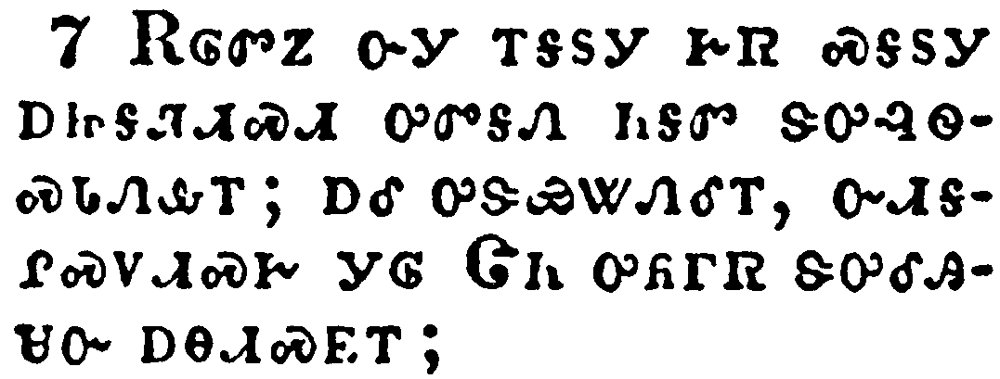</a></td>
</tr>
<tr class="even">
<td>Now Herod the tetrarch heard of all that was done by him: and he was perplexed, because that it was said of some, that John was risen from the dead;</td>
</tr>
<tr class="odd">
<td>ᎡᎶᏛᏃ ᏅᎩ ᎢᎦᏚᎩ ᎨᏒ ᏍᎦᏚᎩ ᎠᏥᎦᏘᏗᏍᏗ ᎤᏛᎦᏁ ᏂᎦᏛ ᏕᎤᎸᏫᏍᏓᏁᎲᎢ; ᎠᎴ ᎤᏕᏯᏔᏁᎴᎢ, ᏅᏗᎦᎵᏍᏙᏗᏍᎨ ᎩᎶ ᏣᏂ ᎤᏲᎱᏒ ᏕᎤᎴᎯᏌᏅ ᎠᎾᏗᏍᎬᎢ;</td>
</tr>
<tr class="even">
<td>E-lo-dv-no nv-gi i-ga-du-gi ge-sv s-ga-du-gi a-tsi-ga-ti-di-s-di u-dv-ga-ne ni-ga-dv de-u-lv-wi-s-da-ne-hv-i; a-le u-de-ya-ta-ne-le-i, nv-di-ga-li-s-do-di-s-ge gi-lo Tsa-ni u-yo-hu-sv de-u-le-hi-sa-nv a-na-di-s-gv-i;</td>
</tr>
</tbody>
</table>

<table>
<tbody>
<tr class="odd">
<td><a href="030908.png">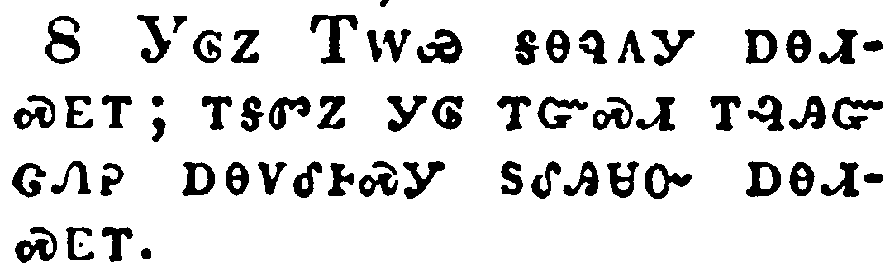</a></td>
</tr>
<tr class="even">
<td>And of some, that Elias had appeared; and of others, that one of the old prophets was risen again.</td>
</tr>
<tr class="odd">
<td>ᎩᎶᏃ ᎢᎳᏯ ᎦᎾᏄᎪᎩ ᎠᎾᏗᏍᎬᎢ; ᎢᎦᏛᏃ ᎩᎶ ᎢᏳᏍᏗ ᎢᎸᎯᏳ ᏣᏁᎮ ᎠᎾᏙᎴᎰᏍᎩ ᏚᎴᎯᏌᏅ ᎠᎾᏗᏍᎬᎢ.</td>
</tr>
<tr class="even">
<td>Gi-lo-no I-la-ya ga-na-nu-go-gi a-na-di-s-gv-i; i-ga-dv-no gi-lo i-yu-s-di i-lv-hi-yu tsa-ne-he a-na-do-le-ho-s-gi du-le-hi-sa-nv a-na-di-s-gv-i.</td>
</tr>
</tbody>
</table>

<table>
<tbody>
<tr class="odd">
<td><a href="030909.png">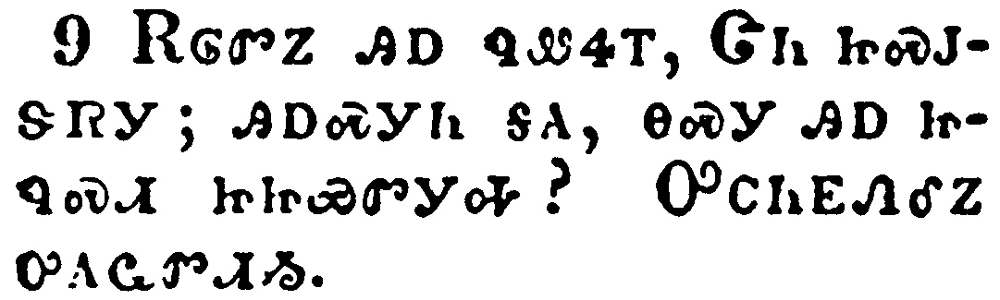</a></td>
</tr>
<tr class="even">
<td>And Herod said, John have I beheaded: but who is this, of whom I hear such things? And he desired to see him.</td>
</tr>
<tr class="odd">
<td>ᎡᎶᏛᏃ ᎯᎠ ᏄᏪᏎᎢ, ᏣᏂ ᏥᏍᎫᏕᏒᎩ; ᎯᎠᏍᎩᏂ ᎦᎪ, ᎾᏍᎩ ᎯᎠ ᏥᏄᏍᏗ ᏥᏥᏯᏛᎩᎭ? ᎤᏟᏂᎬᏁᎴᏃ ᎤᎪᏩᏛᏗᏱ.</td>
</tr>
<tr class="even">
<td>E-lo-dv-no hi-a nu-we-se-i, Tsa-ni tsi-s-gu-de-sv-gi; hi-a-s-gi-ni ga-go, na-s-gi hi-a tsi-nu-s-di tsi-tsi-ya-dv-gi-ha? U-tli-ni-gv-ne-le-no u-go-wa-dv-di-yi.</td>
</tr>
</tbody>
</table>

<table>
<tbody>
<tr class="odd">
<td><a href="030910.png">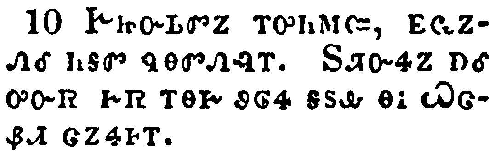</a></td>
</tr>
<tr class="even">
<td>And the apostles, when they were returned, told him all that they had done. And he took them, and went aside privately into a desert place belonging to the city called Bethsaida.</td>
</tr>
<tr class="odd">
<td>ᎨᏥᏅᏏᏛᏃ ᎢᎤᏂᎷᏨ, ᎬᏩᏃᏁᎴ ᏂᎦᏛ ᏄᎾᏛᏁᎸᎢ. ᏚᏘᏅᏎᏃ ᎠᎴ ᎤᏅᏒ ᎨᏒ ᎢᎾᎨ ᏭᎶᏎ ᎦᏚᎲ ᎾᎥ ᏇᏣᏰᏗ ᏣᏃᏎᎰᎢ.</td>
</tr>
<tr class="even">
<td>Ge-tsi-nv-si-dv-no i-u-ni-lu-tsv, gv-wa-no-ne-le ni-ga-dv nu-na-dv-ne-lv-i. Du-ti-nv-se-no a-le u-nv-sv ge-sv i-na-ge wu-lo-se ga-du-hv na-v Que-tsa-ye-di tsa-no-se-ho-i.</td>
</tr>
</tbody>
</table>

<table>
<tbody>
<tr class="odd">
<td></td>
</tr>
<tr class="even">
<td>And the people, when they knew it, followed him: and he received them, and spake unto them of the kingdom of God, and healed them that had need of healing.</td>
</tr>
<tr class="odd">
<td>ᏴᏫᏃ ᎤᎾᏙᎴᎰᏒ ᎬᏩᏍᏓᏩᏛᏎᎢ; ᎠᎴ ᏚᏓᏂᎸᏤᎢ, ᏚᏁᎢᏍᏓᏁᎴ ᎤᏁᎳᏅᎯ ᎤᎬᏫᏳᎯ ᎨᏒ ᎤᎬᏩᎵ, ᎠᎴ ᏚᏅᏩᏁ ᎤᏚᎸᏗ ᎢᏳᎾᎵᏍᏓᏁᎯ ᏗᎨᏥᏅᏬᏗᏱ.</td>
</tr>
<tr class="even">
<td>Yv-wi-no u-na-do-le-ho-sv gv-wa-s-da-wa-dv-se-i; a-le du-da-ni-lv-tse-i, du-ne-i-s-da-ne-le U-ne-la-nv-hi u-gv-wi-yu-hi ge-sv u-gv-wa-li, a-le du-nv-wa-ne u-du-lv-di i-yu-na-li-s-da-ne-hi di-ge-tsi-nv-wo-di-yi.</td>
</tr>
</tbody>
</table>

<table>
<tbody>
<tr class="odd">
<td><a href="030912.png">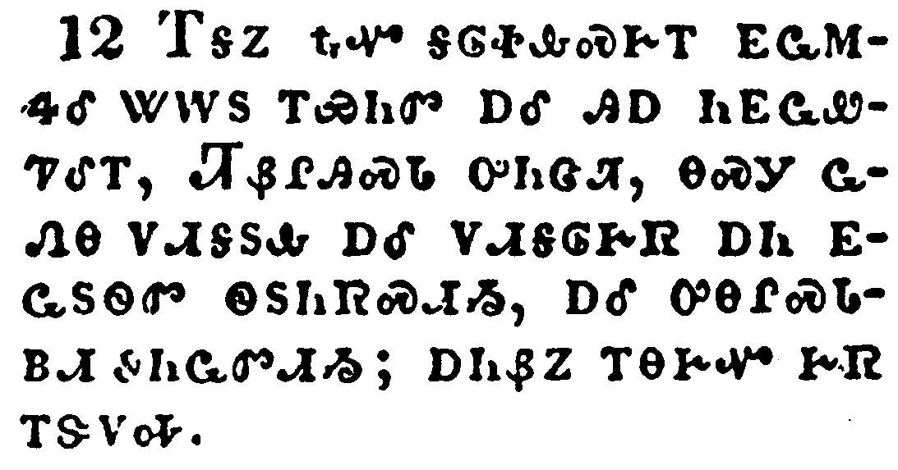</a></td>
</tr>
<tr class="even">
<td>And when the day began to wear away, then came the twelve, and said unto him, Send the multitude away, that they may go into the towns and country round about, and lodge, and get victuals: for we are here in a desert place.</td>
</tr>
<tr class="odd">
<td>ᎢᎦᏃ ᎿᎭᏉ ᎦᎶᏐᎲᏍᎨᎢ ᎬᏩᎷᏎᎴ ᏔᎳᏚ ᎢᏯᏂᏛ ᎠᎴ ᎯᎠ ᏂᎬᏩᏪᏤᎴᎢ, ᏘᏰᎵᎯᏍᏓ ᎤᏂᏣᏘ, ᎾᏍᎩ ᏩᏁᎾ ᏙᏗᎦᏚᎲ ᎠᎴ ᏙᏗᎦᎶᎨᏒ ᎠᏂ ᎬᏩᏚᏫᏛ ᏫᏚᏂᏒᏍᏗᏱ, ᎠᎴ ᎤᎾᎵᏍᏓᏴᏗ ᏭᏂᏩᏛᏗᏱ; ᎠᏂᏰᏃ ᎢᎾᎨᏉ ᎨᏒ ᎢᏕᏙᎭ.</td>
</tr>
<tr class="even">
<td>I-ga-no hna-quo ga-lo-so-hv-s-ge-i gv-wa-lu-se-le ta-la-du i-ya-ni-dv a-le hi-a ni-gv-wa-we-tse-le-i, Ti-ye-li-hi-s-da u-ni-tsa-ti, na-s-gi wa-ne-na do-di-ga-du-hv a-le do-di-ga-lo-ge-sv a-ni gv-wa-du-wi-dv wi-du-ni-sv-s-di-yi, a-le u-na-li-s-da-yv-di wu-ni-wa-dv-di-yi; a-ni-ye-no i-na-ge-quo ge-sv i-de-do-ha.</td>
</tr>
</tbody>
</table>

<table>
<tbody>
<tr class="odd">
<td><a href="030913.png">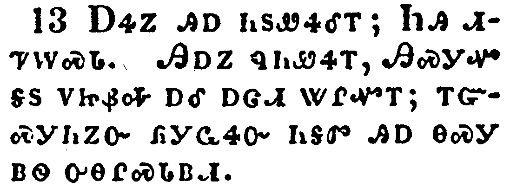</a></td>
</tr>
<tr class="even">
<td>But he said unto them, Give ye them to eat. And they said, We have no more but five loaves and two fishes; except we should go and buy meat for all this people.</td>
</tr>
<tr class="odd">
<td>ᎠᏎᏃ ᎯᎠ ᏂᏚᏪᏎᎴᎢ; ᏂᎯ ᏗᏤᎳᏍᏓ. ᎯᎠᏃ ᏄᏂᏪᏎᎢ, ᎯᏍᎩᏉ ᎦᏚ ᏙᏥᏰᎭ ᎠᎴ ᎠᏣᏗ ᏔᎵᏉᎢ; ᎢᏳᏍᎩᏂᏃᏅ ᏲᎩᏩᏎᏅ ᏂᎦᏛ ᎯᎠ ᎾᏍᎩ ᏴᏫ ᎤᎾᎵᏍᏓᏴᏗ.</td>
</tr>
<tr class="even">
<td>A-se-no hi-a ni-du-we-se-le-i; Ni-hi di-tse-la-s-da. Hi-a-no nu-ni-we-se-i, Hi-s-gi-quo ga-du do-tsi-ye-ha a-le a-tsa-di ta-li-quo-i; i-yu-s-gi-ni-no-nv yo-gi-wa-se-nv ni-ga-dv hi-a na-s-gi yv-wi u-na-li-s-da-yv-di.</td>
</tr>
</tbody>
</table>

<table>
<tbody>
<tr class="odd">
<td><a href="030914.png">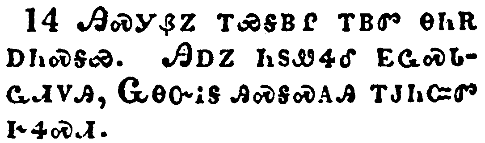</a></td>
</tr>
<tr class="even">
<td>For they were about five thousand men. And he said to his disciples, Make them sit down by fifties in a company.</td>
</tr>
<tr class="odd">
<td>ᎯᏍᎩᏰᏃ ᎢᏯᎦᏴᎵ ᎢᏴᏛ ᎾᏂᎡ ᎠᏂᏍᎦᏯ. ᎯᎠᏃ ᏂᏚᏪᏎᎴ ᎬᏩᏍᏓᏩᏗᏙᎯ, ᏩᎾᏅᎥᎦ ᎯᏍᎦᏍᎪᎯ ᎢᎫᏂᏨᏛ ᎨᏎᏍᏗ.</td>
</tr>
<tr class="even">
<td>Hi-s-gi-ye-no i-ya-ga-yv-li i-yv-dv na-ni-e a-ni-s-ga-ya. Hi-a-no ni-du-we-se-le gv-wa-s-da-wa-di-do-hi, Wa-na-nv-v-ga hi-s-ga-s-go-hi i-gu-ni-tsv-dv ge-se-s-di.</td>
</tr>
</tbody>
</table>

<table>
<tbody>
<tr class="odd">
<td><a href="030915.png">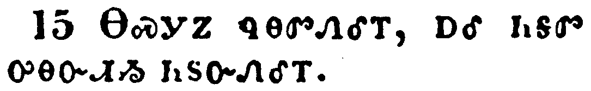</a></td>
</tr>
<tr class="even">
<td>And they did so, and made them all sit down.</td>
</tr>
<tr class="odd">
<td>ᎾᏍᎩᏃ ᏄᎾᏛᏁᎴᎢ, ᎠᎴ ᏂᎦᏛ ᎤᎾᏅᏗᏱ ᏂᏚᏅᎴᎢ.</td>
</tr>
<tr class="even">
<td>Na-s-gi-no nu-na-dv-ne-le-i, a-le ni-ga-dv u-na-nv-di-yi ni-du-nv-le-i.</td>
</tr>
</tbody>
</table>

<table>
<tbody>
<tr class="odd">
<td><a href="030916.png">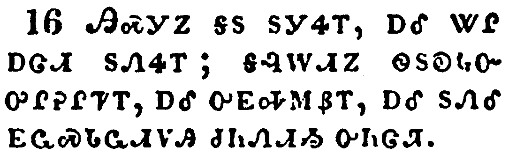</a></td>
</tr>
<tr class="even">
<td>Then he took the five loaves and the two fishes, and looking up to heaven, he blessed them, and brake, and gave to the disciples to set before the multitude.</td>
</tr>
<tr class="odd">
<td>ᎯᏍᎩᏃ ᎦᏚ ᏚᎩᏎᎢ, ᎠᎴ ᏔᎵ ᎠᏣᏗ ᏚᏁᏎᎢ; ᎦᎸᎳᏗᏃ ᏫᏚᎧᎿᎭᏅ ᎤᎵᎮᎵᏤᎢ, ᎠᎴ ᎤᎬᎭᎷᏰᎢ, ᎠᎴ ᏚᏁᎴ ᎬᏩᏍᏓᏩᏗᏙᎯ ᏧᏂᏁᏗᏱ ᎤᏂᏣᏘ.</td>
</tr>
<tr class="even">
<td>Hi-s-gi-no ga-du du-gi-se-i, a-le ta-li a-tsa-di du-ne-se-i; ga-lv-la-di-no wi-du-ka-hna-nv u-li-he-li-tse-i, a-le u-gv-ha-lu-ye-i, a-le du-ne-le gv-wa-s-da-wa-di-do-hi tsu-ni-ne-di-yi u-ni-tsa-ti.</td>
</tr>
</tbody>
</table>

<table>
<tbody>
<tr class="odd">
<td><a href="030917.png">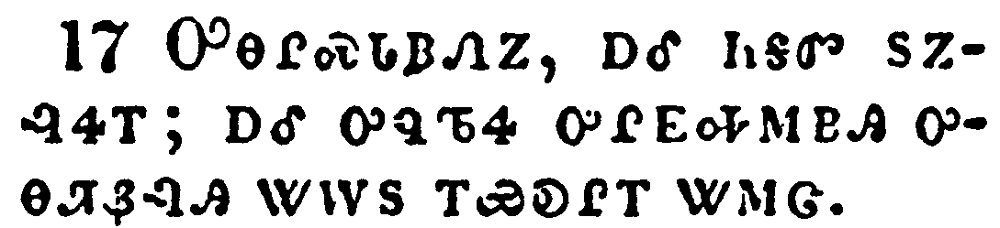</a></td>
</tr>
<tr class="even">
<td>And they did eat, and were all filled: and there was taken up of fragments that remained to them twelve baskets.</td>
</tr>
<tr class="odd">
<td>ᎤᎾᎵᏍᏓᏴᏁᏃ, ᎠᎴ ᏂᎦᏛ ᏚᏃᎸᏎᎢ; ᎠᎴ ᎤᏄᏖᏎ ᎤᎵᎬᎭᎷᏴᎯ ᎤᎾᏘᏰᎸᎯ ᏔᎳᏚ ᎢᏯᎧᎵᎢ ᏔᎷᏣ.</td>
</tr>
<tr class="even">
<td>U-na-li-s-da-yv-ne-no, a-le ni-ga-dv du-no-lv-se-i; a-le u-nu-te-se u-li-gv-ha-lu-yv-hi u-na-ti-ye-lv-hi ta-la-du i-ya-ka-li-i ta-lu-tsa.</td>
</tr>
</tbody>
</table>

<table>
<tbody>
<tr class="odd">
<td><a href="030918.png">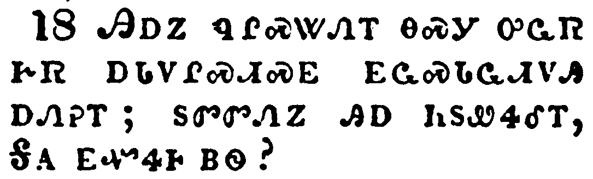</a></td>
</tr>
<tr class="even">
<td>And it came to pass, as he was alone praying, his disciples were with him: and he asked them, saying, Whom say the people that I am?</td>
</tr>
<tr class="odd">
<td>ᎯᎠᏃ ᏄᎵᏍᏔᏁᎢ ᎾᏍᎩ ᎤᏩᏒ ᎨᏒ ᎠᏓᏙᎵᏍᏗᏍᎬ ᎬᏩᏍᏓᏩᏗᏙᎯ ᎠᏁᎮᎢ; ᏚᏛᏛᏁᏃ ᎯᎠ ᏂᏚᏪᏎᎴᎢ, ᎦᎪ ᎬᏉᏎᎰ ᏴᏫ?</td>
</tr>
<tr class="even">
<td>Hi-a-no nu-li-s-ta-ne-i na-s-gi u-wa-sv ge-sv a-da-do-li-s-di-s-gv gv-wa-s-da-wa-di-do-hi a-ne-he-i; du-dv-dv-ne-no hi-a ni-du-we-se-le-i, Ga-go gv-quo-se-ho yv-wi?</td>
</tr>
</tbody>
</table>

<table>
<tbody>
<tr class="odd">
<td><a href="030919.png">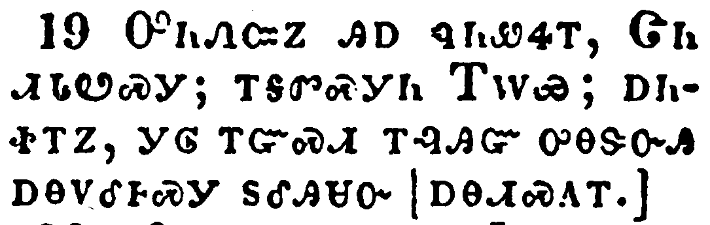</a></td>
</tr>
<tr class="even">
<td>They answering said, John the Baptist; but some say, Elias; and others say, that one of the old prophets is risen again.</td>
</tr>
<tr class="odd">
<td>ᎤᏂᏁᏨᏃ ᎯᎠ ᏄᏂᏪᏎᎢ, ᏣᏂ ᏗᏓᏬᏍᎩ; ᎢᎦᏛᏍᎩᏂ ᎢᎳᏯ; ᎠᏂᏐᎢᏃ, ᎩᎶ ᎢᏳᏍᏗ ᎢᎸᎯᏳ ᎤᎾᏕᏅᎯ ᎠᎾᏙᎴᎰᏍᎩ ᏚᎴᎯᏌᏅ [ᎠᎾᏗᏍᎪᎢ.]</td>
</tr>
<tr class="even">
<td>U-ni-ne-tsv-no hi-a nu-ni-we-se-i, Tsa-ni di-da-wo-s-gi; i-ga-dv-s-gi-ni I-la-ya; a-ni-so-i-no, gi-lo i-yu-s-di i-lv-hi-yu u-na-de-nv-hi a-na-do-le-ho-s-gi du-le-hi-sa-nv [a-na-di-s-go-i.]</td>
</tr>
</tbody>
</table>

<table>
<tbody>
<tr class="odd">
<td><a href="030920.png">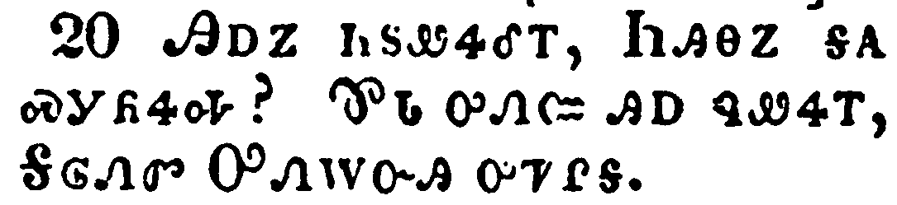</a></td>
</tr>
<tr class="even">
<td>He said unto them, But whom say ye that I am? Peter answering said, The Christ of God.</td>
</tr>
<tr class="odd">
<td>ᎯᎠᏃ ᏂᏚᏪᏎᎴᎢ, ᏂᎯᎾᏃ ᎦᎪ ᏍᎩᏲᏎᎭ? ᏈᏓ ᎤᏁᏨ ᎯᎠ ᏄᏪᏎᎢ, ᎦᎶᏁᏛ ᎤᏁᎳᏅᎯ ᎤᏤᎵᎦ.</td>
</tr>
<tr class="even">
<td>Hi-a-no ni-du-we-se-le-i, Ni-hi-na-no ga-go s-gi-yo-se-ha? Qui-da u-ne-tsv hi-a nu-we-se-i, Ga-lo-ne-dv U-ne-la-nv-hi u-tse-li-ga.</td>
</tr>
</tbody>
</table>

<table>
<tbody>
<tr class="odd">
<td><a href="030921.png">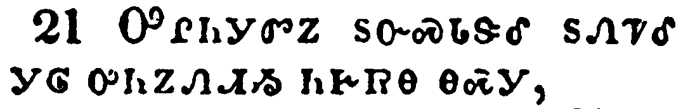</a></td>
</tr>
<tr class="even">
<td>And he straitly charged them, and commanded them to tell no man that thing;</td>
</tr>
<tr class="odd">
<td>ᎤᎵᏂᎩᏛᏃ ᏚᏅᏍᏓᏕᎴ ᏚᏁᏤᎴ ᎩᎶ ᎤᏂᏃᏁᏗᏱ ᏂᎨᏒᎾ ᎾᏍᎩ,</td>
</tr>
<tr class="even">
<td>U-li-ni-gi-dv-no du-nv-s-da-de-le du-ne-tse-le gi-lo u-ni-no-ne-di-yi ni-ge-sv-na na-s-gi,</td>
</tr>
</tbody>
</table>

<table>
<tbody>
<tr class="odd">
<td><a href="030922.png">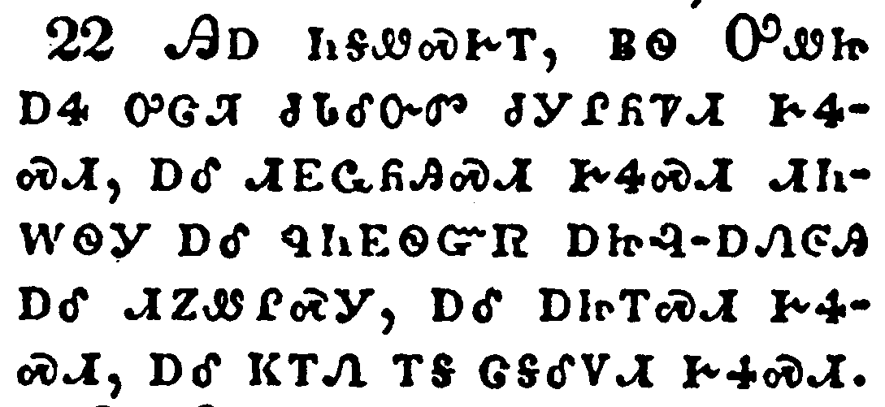</a></td>
</tr>
<tr class="even">
<td>Saying, The Son of man must suffer many things, and be rejected of the elders and chief priests and scribes, and be slain, and be raised the third day.</td>
</tr>
<tr class="odd">
<td>ᎯᎠ ᏂᎦᏪᏍᎨᎢ, ᏴᏫ ᎤᏪᏥ ᎠᏎ ᎤᏣᏘ ᏧᏓᎴᏅᏛ ᏧᎩᎵᏳᏤᏗ ᎨᏎᏍᏗ, ᎠᎴ ᏗᎬᏩᏲᎯᏍᏗ ᎨᏎᏍᏗ ᏗᏂᎳᏫᎩ ᎠᎴ ᏄᏂᎬᏫᏳᏒ ᎠᏥᎸ-ᎠᏁᎶᎯ ᎠᎴ ᏗᏃᏪᎵᏍᎩ, ᎠᎴ ᎠᏥᎢᏍᏗ ᎨᏎᏍᏗ, ᎠᎴ ᏦᎢᏁ ᎢᎦ ᏣᎦᎴᏙᏗ ᎨᏎᏍᏗ.</td>
</tr>
<tr class="even">
<td>Hi-a ni-ga-we-s-ge-i, yv-wi U-we-tsi a-se u-tsa-ti tsu-da-le-nv-dv tsu-gi-li-yu-tse-di ge-se-s-di, a-le di-gv-wa-yo-hi-s-di ge-se-s-di di-ni-la-wi-gi a-le nu-ni-gv-wi-yu-sv a-tsi-lv--a-ne-lo-hi a-le di-no-we-li-s-gi, a-le a-tsi-i-s-di ge-se-s-di, a-le tso-i-ne i-ga tsa-ga-le-do-di ge-se-s-di.</td>
</tr>
</tbody>
</table>

<table>
<tbody>
<tr class="odd">
<td><a href="030923.png">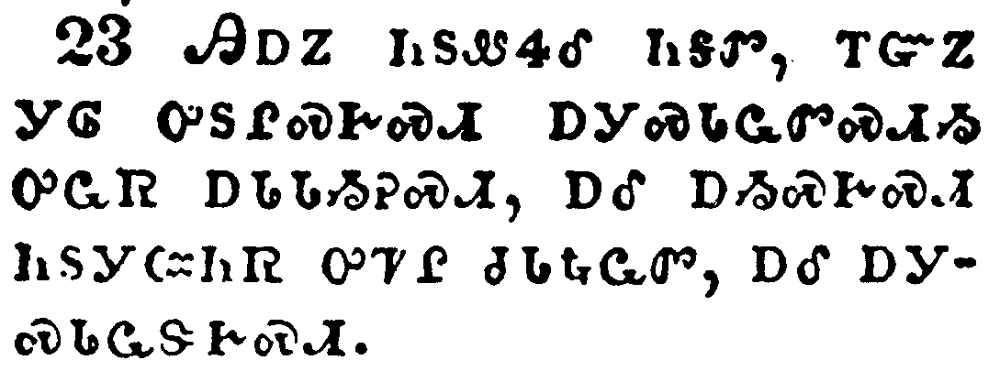</a></td>
</tr>
<tr class="even">
<td>And he said to them all, If any man will come after me, let him deny himself, and take up his cross daily, and follow me.</td>
</tr>
<tr class="odd">
<td>ᎯᎠᏃ ᏂᏚᏪᏎᎴ ᏂᎦᏛ, ᎢᏳᏃ ᎩᎶ ᎤᏚᎵᏍᎨᏍᏗ ᎠᎩᏍᏓᏩᏛᏍᏗᏱ ᎤᏩᏒ ᎠᏓᏓᏱᎮᏍᏗ, ᎠᎴ ᎠᏱᏍᎨᏍᏗ ᏂᏚᎩᏨᏂᏒ ᎤᏤᎵ ᏧᏓᎿᎭᏩᏛ, ᎠᎴ ᎠᎩᏍᏓᏩᏕᎨᏍᏗ.</td>
</tr>
<tr class="even">
<td>Hi-a-no ni-du-we-se-le ni-ga-dv, i-yu-no gi-lo u-du-li-s-ge-s-di a-gi-s-da-wa-dv-s-di-yi u-wa-sv a-da-da-yi-he-s-di, a-le a-yi-s-ge-s-di ni-du-gi-tsv-ni-sv u-tse-li tsu-da-hna-wa-dv, a-le a-gi-s-da-wa-de-ge-s-di.</td>
</tr>
</tbody>
</table>

<table>
<tbody>
<tr class="odd">
<td><a href="030924.png">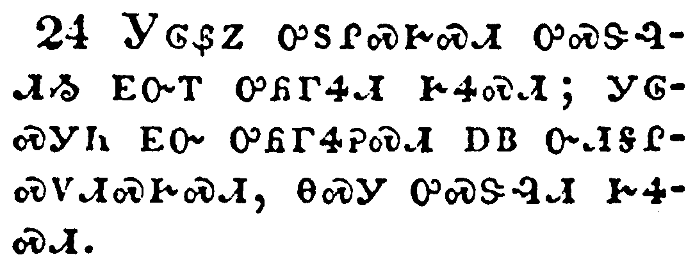</a></td>
</tr>
<tr class="even">
<td>For whosoever will save his life shall lose it: but whosoever will lose his life for my sake, the same shall save it.</td>
</tr>
<tr class="odd">
<td>ᎩᎶᏰᏃ ᎤᏚᎵᏍᎨᏍᏗ ᎤᏍᏕᎸᏗᏱ ᎬᏅᎢ ᎤᏲᎱᏎᏗ ᎨᏎᏍᏗ; ᎩᎶᏍᎩᏂ ᎬᏅ ᎤᏲᎱᏎᎮᏍᏗ ᎠᏴ ᏅᏗᎦᎵᏍᏙᏗᏍᎨᏍᏗ, ᎾᏍᎩ ᎤᏍᏕᎸᏗ ᎨᏎᏍᏗ.</td>
</tr>
<tr class="even">
<td>Gi-lo-ye-no u-du-li-s-ge-s-di u-s-de-lv-di-yi gv-nv-i u-yo-hu-se-di ge-se-s-di; gi-lo-s-gi-ni gv-nv u-yo-hu-se-he-s-di a-yv nv-di-ga-li-s-do-di-s-ge-s-di, na-s-gi u-s-de-lv-di ge-se-s-di.</td>
</tr>
</tbody>
</table>

<table>
<tbody>
<tr class="odd">
<td><a href="030925.png">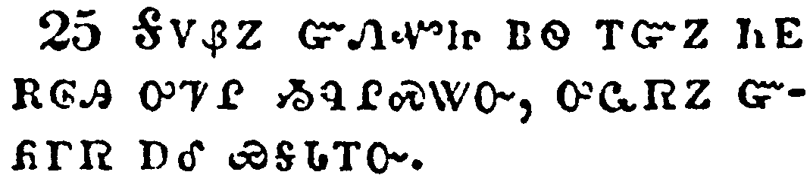</a></td>
</tr>
<tr class="even">
<td>For what is a man advantaged, if he gain the whole world, and lose himself, or be cast away?</td>
</tr>
<tr class="odd">
<td>ᎦᏙᏰᏃ ᏳᏁᏉᏥ ᏴᏫ ᎢᏳᏃ ᏂᎬ ᎡᎶᎯ ᎤᏤᎵ ᏱᏄᎵᏍᏔᏅ, ᎤᏩᏒᏃ ᏳᏲᎱᏒ ᎠᎴ ᏯᎦᏓᎢᏅ.</td>
</tr>
<tr class="even">
<td>Ga-do-ye-no yu-ne-quo-tsi yv-wi i-yu-no ni-gv e-lo-hi u-tse-li yi-nu-li-s-ta-nv, u-wa-sv-no yu-yo-hu-sv a-le ya-ga-da-i-nv.</td>
</tr>
</tbody>
</table>

<table>
<tbody>
<tr class="odd">
<td><a href="030926.png">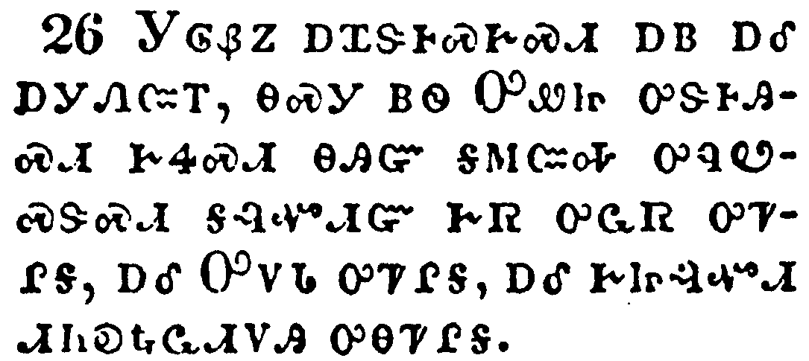</a></td>
</tr>
<tr class="even">
<td>For whosoever shall be ashamed of me and of my words, of him shall the Son of man be ashamed, when he shall come in his own glory, and in his Father's, and of the holy angels.</td>
</tr>
<tr class="odd">
<td>ᎩᎶᏰᏃ ᎠᏆᏕᎰᏍᎨᏍᏗ ᎠᏴ ᎠᎴ ᎠᎩᏁᏨᎢ, ᎾᏍᎩ ᏴᏫ ᎤᏪᏥ ᎤᏕᎰᎯᏍᏗ ᎨᏎᏍᏗ ᎾᎯᏳ ᎦᎷᏨᎭ ᎤᏄᏬᏍᏕᏍᏗ ᎦᎸᏉᏗᏳ ᎨᏒ ᎤᏩᏒ ᎤᏤᎵᎦ, ᎠᎴ ᎤᏙᏓ ᎤᏤᎵᎦ, ᎠᎴ ᎨᏥᎸᏉᏗ ᏗᏂᎧᎿᎭᏩᏗᏙᎯ ᎤᎾᏤᎵᎦ.</td>
</tr>
<tr class="even">
<td>Gi-lo-ye-no a-qua-de-ho-s-ge-s-di a-yv a-le a-gi-ne-tsv-i, na-s-gi yv-wi U-we-tsi u-de-ho-hi-s-di ge-se-s-di na-hi-yu ga-lu-tsv-ha u-nu-wo-s-de-s-di ga-lv-quo-di-yu ge-sv u-wa-sv u-tse-li-ga, a-le U-do-da u-tse-li-ga, a-le ge-tsi-lv-quo-di di-ni-ka-hna-wa-di-do-hi u-na-tse-li-ga.</td>
</tr>
</tbody>
</table>

<table>
<tbody>
<tr class="odd">
<td><a href="030927.png">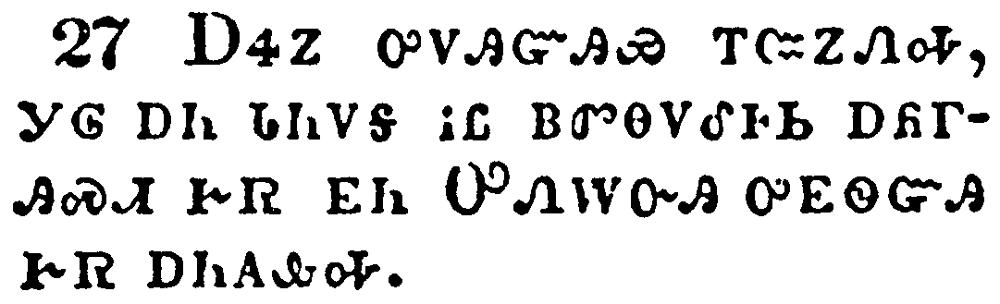</a></td>
</tr>
<tr class="even">
<td>But I tell you of a truth, there be some standing here, which shall not taste of death, till they see the kingdom of God.</td>
</tr>
<tr class="odd">
<td>ᎠᏎᏃ ᎤᏙᎯᏳᎯᏯ ᎢᏨᏃᏁᎭ, ᎩᎶ ᎠᏂ ᏓᏂᏙᎦ ᎥᏝ ᏴᏛᎾᏙᎴᎰᏏ ᎠᏲᎱᎯᏍᏗ ᎨᏒ ᎬᏂ ᎤᏁᎳᏅᎯ ᎤᎬᏫᏳᎯ ᎨᏒ ᎠᏂᎪᎲᎭ.</td>
</tr>
<tr class="even">
<td>A-se-no u-do-hi-yu-hi-ya i-tsv-no-ne-ha, gi-lo a-ni da-ni-do-ga v-tla yv-dv-na-do-le-ho-si a-yo-hu-hi-s-di ge-sv gv-ni U-ne-la-nv-hi u-gv-wi-yu-hi ge-sv a-ni-go-hv-ha.</td>
</tr>
</tbody>
</table>

<table>
<tbody>
<tr class="odd">
<td><a href="030928.png">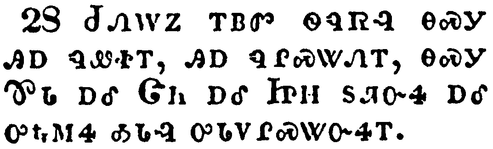</a></td>
</tr>
<tr class="even">
<td>And it came to pass about an eight days after these sayings, he took Peter and John and James, and went up into a mountain to pray.</td>
</tr>
<tr class="odd">
<td>ᏧᏁᎳᏃ ᎢᏴᏛ ᏫᏄᏒᎸ ᎾᏍᎩ ᎯᎠ ᏄᏪᏐᎢ, ᎯᎠ ᏄᎵᏍᏔᏁᎢ, ᎾᏍᎩ ᏈᏓ ᎠᎴ ᏣᏂ ᎠᎴ ᏥᎻ ᏚᏘᏅᏎ ᎠᎴ ᎤᎿᎭᎷᏎ ᎣᏓᎸ ᎤᏓᏙᎵᏍᏔᏅᏎᎢ.</td>
</tr>
<tr class="even">
<td>Tsu-ne-la-no i-yv-dv wi-nu-sv-lv na-s-gi hi-a nu-we-so-i, hi-a nu-li-s-ta-ne-i, na-s-gi Qui-da a-le Tsa-ni a-le Tsi-mi du-ti-nv-se a-le u-hna-lu-se o-da-lv u-da-do-li-s-ta-nv-se-i.</td>
</tr>
</tbody>
</table>

<table>
<tbody>
<tr class="odd">
<td><a href="030929.png">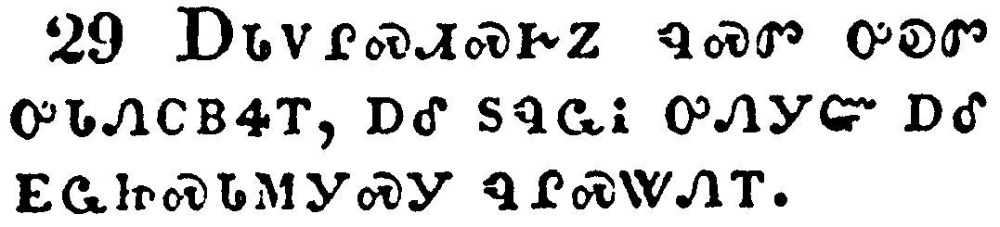</a></td>
</tr>
<tr class="even">
<td>And as he prayed, the fashion of his countenance was altered, and his raiment was white and glistering.</td>
</tr>
<tr class="odd">
<td>ᎠᏓᏙᎵᏍᏗᎨᏃ ᏄᏍᏛ ᎤᎧᏛ ᎤᏓᏁᏟᏴᏎᎢ, ᎠᎴ ᏚᏄᏩᎥ ᎤᏁᎩᏳ ᎠᎴ ᎬᏩᏥᏍᏓᎷᎩᏍᎩ ᏄᎵᏍᏔᏁᎢ.</td>
</tr>
<tr class="even">
<td>A-da-do-li-s-di-ge-no nu-s-dv u-ka-dv u-da-ne-tli-yv-se-i, a-le du-nu-wa-v u-ne-gi-yu a-le gv-wa-tsi-s-da-lu-gi-s-gi nu-li-s-ta-ne-i.</td>
</tr>
</tbody>
</table>

<table>
<tbody>
<tr class="odd">
<td><a href="030930.png">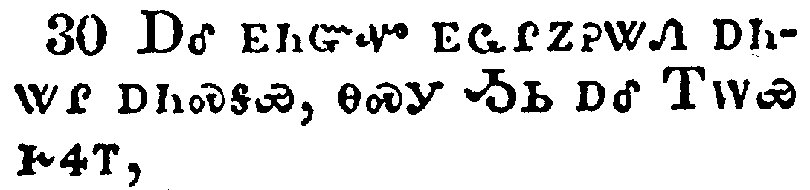</a></td>
</tr>
<tr class="even">
<td>And, behold, there talked with him two men, which were Moses and Elias:</td>
</tr>
<tr class="odd">
<td>ᎠᎴ ᎬᏂᏳᏉ ᎬᏩᎵᏃᎮᏔᏁ ᎠᏂᏔᎵ ᎠᏂᏍᎦᏯ, ᎾᏍᎩ ᎼᏏ ᎠᎴ ᎢᎳᏯᎨᏎᎢ,</td>
</tr>
<tr class="even">
<td>A-le gv-ni-yu-quo gv-wa-li-no-he-ta-ne a-ni-ta-li a-ni-s-ga-ya, na-s-gi Mo-si a-le I-la-ya-ge-se-i,</td>
</tr>
</tbody>
</table>

<table>
<tbody>
<tr class="odd">
<td><a href="030931.png">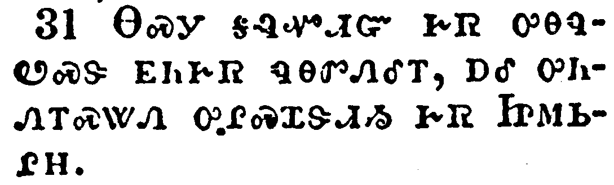</a></td>
</tr>
<tr class="even">
<td>Who appeared in glory, and spake of his decease which he should accomplish at Jerusalem.</td>
</tr>
<tr class="odd">
<td>ᎾᏍᎩ ᎦᎸᏉᏗᏳ ᎨᏒ ᎤᎾᏄᏬᏍᏕ ᎬᏂᎨᏒ ᏄᎾᏛᏁᎴᎢ; ᎠᎴ ᎤᏂᏁᎢᏍᏔᏁ ᎤᎵᏍᏆᏕᏗᏱ ᎨᏒ ᏥᎷᏏᎵᎻ.</td>
</tr>
<tr class="even">
<td>Na-s-gi ga-lv-quo-di-yu ge-sv u-na-nu-wo-s-de gv-ni-ge-sv nu-na-dv-ne-le-i; a-le u-ni-ne-i-s-ta-ne u-li-s-qua-de-di-yi ge-sv Tsi-lu-si-li-mi.</td>
</tr>
</tbody>
</table>

<table>
<tbody>
<tr class="odd">
<td><a href="030932.png">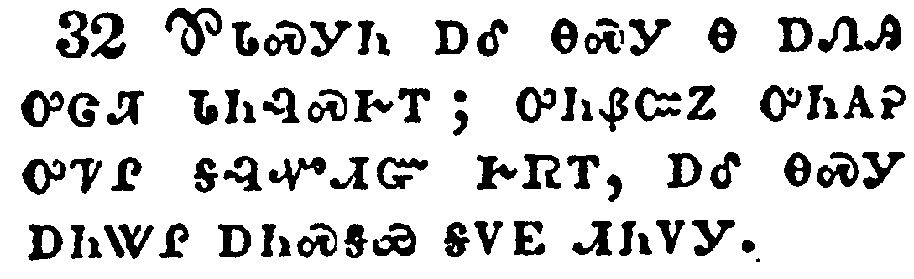</a></td>
</tr>
<tr class="even">
<td>But Peter and they that were with him were heavy with sleep: and when they were awake, they saw his glory, and the two men that stood with him.</td>
</tr>
<tr class="odd">
<td>ᏈᏓᏍᎩᏂ ᎠᎴ ᎾᏍᎩ Ꮎ ᎠᏁᎯ ᎤᏣᏘ ᏓᏂᎸᏍᎨᎢ; ᎤᏂᏰᏨᏃ ᎤᏂᎪᎮ ᎤᏤᎵ ᎦᎸᏉᏗᏳ ᎨᏒᎢ, ᎠᎴ ᎾᏍᎩ ᎠᏂᏔᎵ ᎠᏂᏍᎦᏯ ᎦᏙᎬ ᏗᏂᏙᎩ.</td>
</tr>
<tr class="even">
<td>Qui-da-s-gi-ni a-le na-s-gi na a-ne-hi u-tsa-ti da-ni-lv-s-ge-i; u-ni-ye-tsv-no u-ni-go-he u-tse-li ga-lv-quo-di-yu ge-sv-i, a-le na-s-gi a-ni-ta-li a-ni-s-ga-ya ga-do-gv di-ni-do-gi.</td>
</tr>
</tbody>
</table>

<table>
<tbody>
<tr class="odd">
<td><a href="030933.png">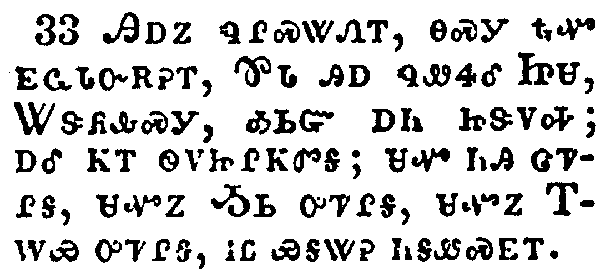</a></td>
</tr>
<tr class="even">
<td>And it came to pass, as they departed from him, Peter said unto Jesus, Master, it is good for us to be here: and let us make three tabernacles; one for thee, and one for Moses, and one for Elias: not knowing what he said.</td>
</tr>
<tr class="odd">
<td>ᎯᎠᏃ ᏄᎵᏍᏔᏁᎢ, ᎾᏍᎩ ᎿᎭᏉ ᎬᏩᏓᏅᎡᎮᎢ, ᏈᏓ ᎯᎠ ᏄᏪᏎᎴ ᏥᏌ, ᏔᏕᏲᎲᏍᎩ, ᎣᏏᏳ ᎠᏂ ᏥᏕᏙᎭ; ᎠᎴ ᏦᎢ ᏫᏙᏥᎵᏦᏛᎦ; ᏌᏉ ᏂᎯ ᏣᏤᎵᎦ, ᏌᏉᏃ ᎼᏏ ᎤᏤᎵᎦ, ᏌᏉᏃ ᎢᎳᏯ ᎤᏤᎵᎦ, ᎥᏝ ᏯᎦᏔᎮ ᏂᎦᏪᏍᎬᎢ.</td>
</tr>
<tr class="even">
<td>Hi-a-no nu-li-s-ta-ne-i, na-s-gi hna-quo gv-wa-da-nv-e-he-i, Qui-da hi-a nu-we-se-le Tsi-sa, Ta-de-yo-hv-s-gi, o-si-yu a-ni tsi-de-do-ha; a-le tso-i wi-do-tsi-li-tso-dv-ga; sa-quo ni-hi tsa-tse-li-ga, sa-quo-no Mo-si u-tse-li-ga, sa-quo-no I-la-ya u-tse-li-ga, v-tla ya-ga-ta-he ni-ga-we-s-gv-i.</td>
</tr>
</tbody>
</table>

<table>
<tbody>
<tr class="odd">
<td><a href="030934.png">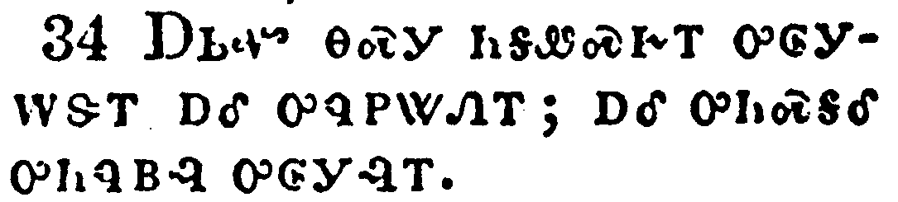</a></td>
</tr>
<tr class="even">
<td>While he thus spake, there came a cloud, and overshadowed them: and they feared as they entered into the cloud.</td>
</tr>
<tr class="odd">
<td>ᎠᏏᏉ ᎾᏍᎩ ᏂᎦᏪᏍᎨᎢ ᎤᎶᎩᎳᏕᎢ ᎠᎴ ᎤᏄᏢᏔᏁᎢ; ᎠᎴ ᎤᏂᏍᎦᎴ ᎤᏂᏄᏴᎸ ᎤᎶᎩᎸᎢ.</td>
</tr>
<tr class="even">
<td>A-si-quo na-s-gi ni-ga-we-s-ge-i u-lo-gi-la-de-i a-le u-nu-tlv-ta-ne-i; a-le u-ni-s-ga-le u-ni-nu-yv-lv u-lo-gi-lv-i.</td>
</tr>
</tbody>
</table>

<table>
<tbody>
<tr class="odd">
<td><a href="030935.png">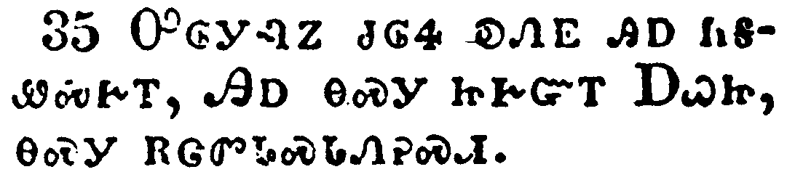</a></td>
</tr>
<tr class="even">
<td>And there came a voice out of the cloud, saying, This is my beloved Son: hear him.</td>
</tr>
<tr class="odd">
<td>ᎤᎶᎩᎸᏃ ᏧᎶᏎ ᎧᏁᎬ ᎯᎠ ᏂᎦᏪᏍᎨᎢ, ᎯᎠ ᎾᏍᎩ ᏥᎨᏳᎢ ᎠᏇᏥ, ᎾᏍᎩ ᎡᏣᏛᏓᏍᏓᏁᎮᏍᏗ.</td>
</tr>
<tr class="even">
<td>U-lo-gi-lv-no tsu-lo-se ka-ne-gv hi-a ni-ga-we-s-ge-i, Hi-a na-s-gi tsi-ge-yu-i A-que-tsi, na-s-gi e-tsa-dv-da-s-da-ne-he-s-di.</td>
</tr>
</tbody>
</table>

<table>
<tbody>
<tr class="odd">
<td><a href="030936.png">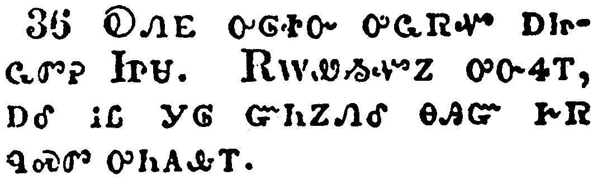</a></td>
</tr>
<tr class="even">
<td>And when the voice was past, Jesus was found alone. And they kept it close, and told no man in those days any of those things which they had seen.</td>
</tr>
<tr class="odd">
<td>ᎧᏁᎬ ᎤᎶᏐᏅ ᎤᏩᏒᏉ ᎠᏥᏩᏛᎮ ᏥᏌ. ᎡᎳᏪᏱᏉᏃ ᎤᏅᏎᎢ, ᎠᎴ ᎥᏝ ᎩᎶ ᏳᏂᏃᏁᎴ ᎾᎯᏳ ᎨᏒ ᏄᏍᏛ ᎤᏂᎪᎲᎢ.</td>
</tr>
<tr class="even">
<td>Ka-ne-gv u-lo-so-nv u-wa-sv-quo a-tsi-wa-dv-he Tsi-sa. E-la-we-yi-quo-no u-nv-se-i, a-le v-tla gi-lo yu-ni-no-ne-le na-hi-yu ge-sv nu-s-dv u-ni-go-hv-i.</td>
</tr>
</tbody>
</table>

<table>
<tbody>
<tr class="odd">
<td><a href="030937.png">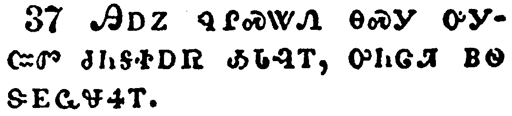</a></td>
</tr>
<tr class="even">
<td>And it came to pass, that on the next day, when they were come down from the hill, much people met him.</td>
</tr>
<tr class="odd">
<td>ᎯᎠᏃ ᏄᎵᏍᏔᏁ ᎾᏍᎩ ᎤᎩᏨᏛ ᏧᏂᎦᏐᎠᏒ ᎣᏓᎸᎢ, ᎤᏂᏣᏘ ᏴᏫ ᏕᎬᏩᏠᏎᎢ.</td>
</tr>
<tr class="even">
<td>Hi-a-no nu-li-s-ta-ne na-s-gi u-gi-tsv-dv tsu-ni-ga-so-a-sv o-da-lv-i, u-ni-tsa-ti yv-wi de-gv-wa-tlo-se-i.</td>
</tr>
</tbody>
</table>

<table>
<tbody>
<tr class="odd">
<td></td>
</tr>
<tr class="even">
<td>And, behold, a man of the company cried out, saying, Master, I beseech thee, look upon my son: for he is mine only child.</td>
</tr>
<tr class="odd">
<td>ᎠᎴ ᎬᏂᏳᏉ ᎠᏍᎦᏯ ᎾᎿᎭᎤᎾᏓᏡᎬ ᎤᏪᎷᏁᎢ ᎯᎠ ᏂᎦᏪᏍᎨᎢ, ᏔᏕᏲᎲᏍᎩ, ᎬᏍᏗᏰᏗᎭ ᏘᏯᎦᏃᏗᏱ ᎠᏇᏥ; ᎤᏩᏒᎯᏳᏰᏃ ᎠᏇᏥ ᎾᏍᎩ;</td>
</tr>
<tr class="even">
<td>A-le gv-ni-yu-quo a-s-ga-ya na-hna u-na-da-tlu-gv u-we-lu-ne-i hi-a ni-ga-we-s-ge-i, Ta-de-yo-hv-s-gi, gv-s-di-ye-di-ha ti-ya-ga-no-di-yi a-que-tsi; u-wa-sv-hi-yu-ye-no a-que-tsi na-s-gi;</td>
</tr>
</tbody>
</table>

<table>
<tbody>
<tr class="odd">
<td><a href="030939.png">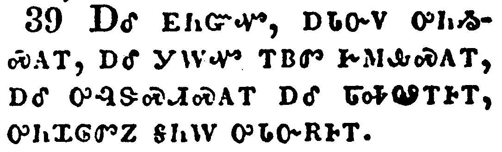</a></td>
</tr>
<tr class="even">
<td>And, lo, a spirit taketh him, and he suddenly crieth out; and it teareth him that he foameth again, and bruising him hardly departeth from him.</td>
</tr>
<tr class="odd">
<td>ᎠᎴ ᎬᏂᏳᏉ, ᎠᏓᏅᏙ ᎤᏂᏱᏍᎪᎢ, ᎠᎴ ᎩᎳᏉ ᎢᏴᏛ ᎨᎷᎲᏍᎪᎢ, ᎠᎴ ᎤᎸᏕᏍᏗᏍᎪᎢ ᎠᎴ ᏓᎭᏬᎢᎰᎢ, ᎤᏂᏆᎶᏛᏃ ᎦᏂᎳ ᎤᏓᏅᎡᎰᎢ.</td>
</tr>
<tr class="even">
<td>A-le gv-ni-yu-quo, a-da-nv-do u-ni-yi-s-go-i, a-le gi-la-quo i-yv-dv ge-lu-hv-s-go-i, a-le u-lv-de-s-di-s-go-i a-le da-ha-wo-i-ho-i, u-ni-qua-lo-dv-no ga-ni-la u-da-nv-e-ho-i.</td>
</tr>
</tbody>
</table>

<table>
<tbody>
<tr class="odd">
<td><a href="030940.png">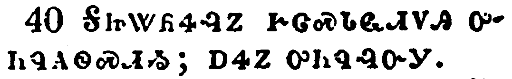</a></td>
</tr>
<tr class="even">
<td>And I besought thy disciples to cast him out; and they could not.</td>
</tr>
<tr class="odd">
<td>ᎦᏥᏔᏲᏎᎸᏃ ᎨᏣᏍᏓᏩᏗᏙᎯ ᎤᏂᏄᎪᏫᏍᏗᏱ; ᎠᏎᏃ ᎤᏂᏄᎸᏅᎩ.</td>
</tr>
<tr class="even">
<td>Ga-tsi-ta-yo-se-lv-no ge-tsa-s-da-wa-di-do-hi u-ni-nu-go-wi-s-di-yi; a-se-no u-ni-nu-lv-nv-gi.</td>
</tr>
</tbody>
</table>

<table>
<tbody>
<tr class="odd">
<td><a href="030941.png">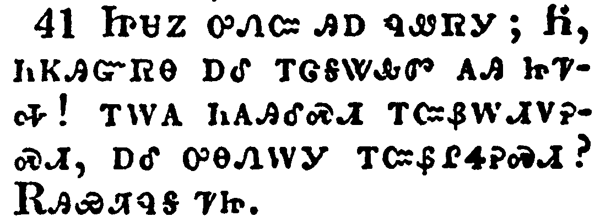</a></td>
</tr>
<tr class="even">
<td>And Jesus answering said, O faithless and perverse generation, how long shall I be with you, and suffer you? Bring thy son hither.</td>
</tr>
<tr class="odd">
<td>ᏥᏌᏃ ᎤᏁᏨ ᎯᎠ ᏄᏪᏒᎩ; Ᏺ, ᏂᏦᎯᏳᏒᎾ ᎠᎴ ᎢᏣᎦᏔᎲᏛ ᎪᎯ ᏥᏤᎭ! ᎢᎳᎪ ᏂᎪᎯᎴᏍᏗ ᎢᏨᏰᎳᏗᏙᎮᏍᏗ, ᎠᎴ ᎤᎾᏁᎳᎩ ᎢᏨᏰᎵᏎᎮᏍᏗ? ᎡᎯᏯᏘᏄᎦ ᏤᏥ.</td>
</tr>
<tr class="even">
<td>Tsi-sa-no u-ne-tsv hi-a nu-we-sv-gi; Yo, ni-tso-hi-yu-sv-na a-le i-tsa-ga-ta-hv-dv go-hi tsi-tse-ha! i-la-go ni-go-hi-le-s-di i-tsv-ye-la-di-do-he-s-di, a-le u-na-ne-la-gi i-tsv-ye-li-se-he-s-di? E-hi-ya-ti-nu-ga tse-tsi.</td>
</tr>
</tbody>
</table>

<table>
<tbody>
<tr class="odd">
<td><a href="030942.png">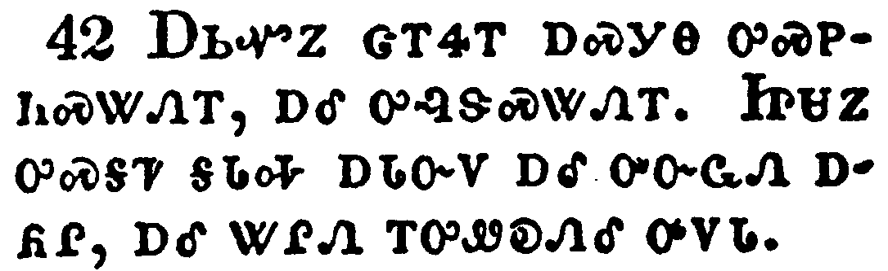</a></td>
</tr>
<tr class="even">
<td>And as he was yet a coming, the devil threw him down, and tare him. And Jesus rebuked the unclean spirit, and healed the child, and delivered him again to his father.</td>
</tr>
<tr class="odd">
<td>ᎠᏏᏉᏃ ᏣᎢᏎᎢ ᎠᏍᎩᎾ ᎤᏍᏢᏂᏍᏔᏁᎢ, ᎠᎴ ᎤᎸᏕᏍᏔᏁᎢ. ᏥᏌᏃ ᎤᏍᎦᏤ ᎦᏓᎭ ᎠᏓᏅᏙ ᎠᎴ ᎤᏅᏩᏁ ᎠᏲᎵ, ᎠᎴ ᏔᎵᏁ ᎢᎤᏪᎧᏁᎴ ᎤᏙᏓ.</td>
</tr>
<tr class="even">
<td>A-si-quo-no tsa-i-se-i a-s-gi-na u-s-tlv-ni-s-ta-ne-i, a-le u-lv-de-s-ta-ne-i. Tsi-sa-no u-s-ga-tse ga-da-ha a-da-nv-do a-le u-nv-wa-ne a-yo-li, a-le ta-li-ne i-u-we-ka-ne-le u-do-da.</td>
</tr>
</tbody>
</table>

<table>
<tbody>
<tr class="odd">
<td><a href="030943.png">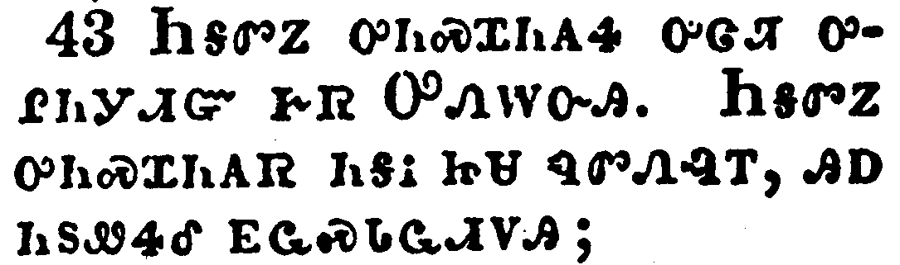</a></td>
</tr>
<tr class="even">
<td>And they were all amazed at the mighty power of God. But while they wondered every one at all things which Jesus did, he said unto his disciples,</td>
</tr>
<tr class="odd">
<td>ᏂᎦᏛᏃ ᎤᏂᏍᏆᏂᎪᏎ ᎤᏣᏘ ᎤᎵᏂᎩᏗᏳ ᎨᏒ ᎤᏁᎳᏅᎯ. ᏂᎦᏛᏃ ᎤᏂᏍᏆᏂᎪᏒ ᏂᎦᎥ ᏥᏌ ᏄᏛᏁᎸᎢ, ᎯᎠ ᏂᏚᏪᏎᎴ ᎬᏩᏍᏓᏩᏗᏙᎯ;</td>
</tr>
<tr class="even">
<td>Ni-ga-dv-no u-ni-s-qua-ni-go-se u-tsa-ti u-li-ni-gi-di-yu ge-sv U-ne-la-nv-hi. Ni-ga-dv-no u-ni-s-qua-ni-go-sv ni-ga-v tsi-sa nu-dv-ne-lv-i, hi-a ni-du-we-se-le gv-wa-s-da-wa-di-do-hi;</td>
</tr>
</tbody>
</table>

<table>
<tbody>
<tr class="odd">
<td><a href="030944.png">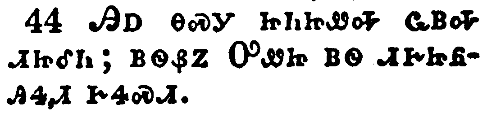</a></td>
</tr>
<tr class="even">
<td>Let these sayings sink down into your ears: for the Son of man shall be delivered into the hands of men.</td>
</tr>
<tr class="odd">
<td>ᎯᎠ ᎾᏍᎩ ᏥᏂᏥᏪᎭ ᏩᏴᎭ ᏗᏥᎴᏂ; ᏴᏫᏰᏃ ᎤᏪᏥ ᏴᏫ ᏗᎨᏥᏲᎯᏎᏗ ᎨᏎᏍᏗ.</td>
</tr>
<tr class="even">
<td>Hi-a na-s-gi tsi-ni-tsi-we-ha wa-yv-ha di-tsi-le-ni; yv-wi-ye-no U-we-tsi yv-wi di-ge-tsi-yo-hi-se-di ge-se-s-di.</td>
</tr>
</tbody>
</table>

<table>
<tbody>
<tr class="odd">
<td><a href="030945.png">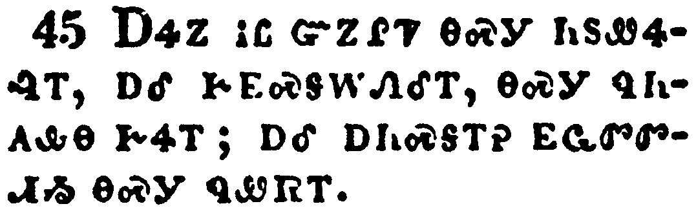</a></td>
</tr>
<tr class="even">
<td>But they understood not this saying, and it was hid from them, that they perceived it not: and they feared to ask him of that saying.</td>
</tr>
<tr class="odd">
<td>ᎠᏎᏃ ᎥᏝ ᏳᏃᎵᏤ ᎾᏍᎩ ᏂᏚᏪᏎᎸᎢ, ᎠᎴ ᎨᎬᏍᎦᎳᏁᎴᎢ, ᎾᏍᎩ ᏄᏂᎪᎲᎾ ᎨᏎᎢ; ᎠᎴ ᎠᏂᏍᎦᎢᎮ ᎬᏩᏛᏛᏗᏱ ᎾᏍᎩ ᏄᏪᏒᎢ.</td>
</tr>
<tr class="even">
<td>A-se-no v-tla yu-no-li-tse na-s-gi ni-du-we-se-lv-i, a-le ge-gv-s-ga-la-ne-le-i, na-s-gi nu-ni-go-hv-na ge-se-i; a-le a-ni-s-ga-i-he gv-wa-dv-dv-di-yi na-s-gi nu-we-sv-i.</td>
</tr>
</tbody>
</table>

<table>
<tbody>
<tr class="odd">
<td><a href="030946.png">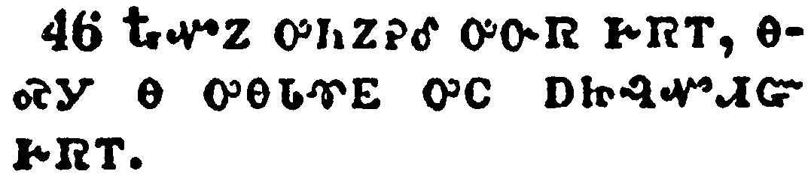</a></td>
</tr>
<tr class="even">
<td>Then there arose a reasoning among them, which of them should be greatest.</td>
</tr>
<tr class="odd">
<td>ᎿᎭᏉᏃ ᎤᏂᏃᎮᎴ ᎤᏅᏒ ᎨᏒᎢ, ᎾᏍᎩ Ꮎ ᎤᎾᏓᏡᎬ ᎤᏟ ᎠᏥᎸᏉᏗᏳ ᎨᏒᎢ.</td>
</tr>
<tr class="even">
<td>Hna-quo-no u-ni-no-he-le u-nv-sv ge-sv-i, na-s-gi na u-na-da-tlu-gv u-tli a-tsi-lv-quo-di-yu ge-sv-i.</td>
</tr>
</tbody>
</table>

<table>
<tbody>
<tr class="odd">
<td><a href="030947.png">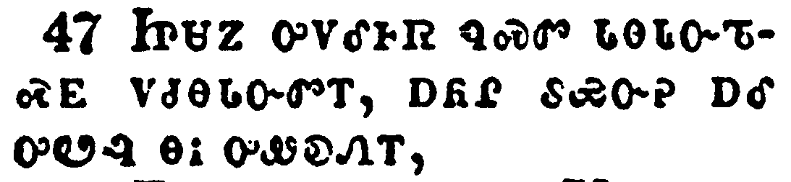</a></td>
</tr>
<tr class="even">
<td>And Jesus, perceiving the thought of their heart, took a child, and set him by him,</td>
</tr>
<tr class="odd">
<td>ᏥᏌᏃ ᎤᏙᎴᎰᏒ ᏄᏍᏛ ᏓᎾᏓᏅᏖᏍᎬ ᏙᏧᎾᏓᏅᏛᎢ, ᎠᏲᎵ ᏭᏯᏅᎮ ᎠᎴ ᎤᏬᎸ ᎾᎥ ᎤᏪᎧᏁᎢ,</td>
</tr>
<tr class="even">
<td>Tsi-sa-no u-do-le-ho-sv nu-s-dv da-na-da-nv-te-s-gv do-tsu-na-da-nv-dv-i, a-yo-li wu-ya-nv-he a-le u-wo-lv na-v u-we-ka-ne-i,</td>
</tr>
</tbody>
</table>

<table>
<tbody>
<tr class="odd">
<td><a href="030948.png">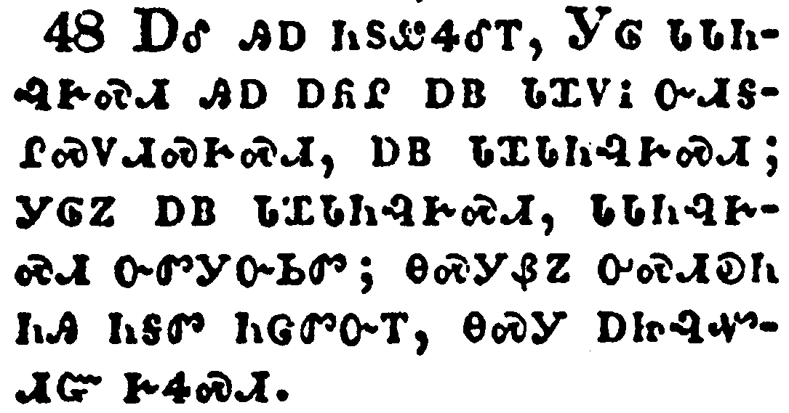</a></td>
</tr>
<tr class="even">
<td>And said unto them, Whosoever shall receive this child in my name receiveth me: and whosoever shall receive me receiveth him that sent me: for he that is least among you all, the same shall be great.</td>
</tr>
<tr class="odd">
<td>ᎠᎴ ᎯᎠ ᏂᏚᏪᏎᎴᎢ, ᎩᎶ ᏓᏓᏂᎸᎨᏍᏗ ᎯᎠ ᎠᏲᎵ ᎠᏴ ᏓᏆᏙᎥ ᏅᏗᎦᎵᏍᏙᏗᏍᎨᏍᏗ, ᎠᏴ ᏓᏆᏓᏂᎸᎨᏍᏗ; ᎩᎶᏃ ᎠᏴ ᏓᏆᏓᏂᎸᎨᏍᏗ, ᏓᏓᏂᎸᎨᏍᏗ ᏅᏛᎩᏅᏏᏛ, ᎾᏍᎩᏰᏃ ᎤᏍᏗᎧᏂ ᏂᎯ ᏂᎦᏛ ᏂᏣᏛᏅᎢ, ᎾᏍᎩ ᎠᏥᎸᏉᏗᏳ ᎨᏎᏍᏗ.</td>
</tr>
<tr class="even">
<td>A-le hi-a ni-du-we-se-le-i, Gi-lo da-da-ni-lv-ge-s-di hi-a a-yo-li a-yv da-qua-do-v nv-di-ga-li-s-do-di-s-ge-s-di, a-yv da-qua-da-ni-lv-ge-s-di; gi-lo-no a-yv da-qua-da-ni-lv-ge-s-di, da-da-ni-lv-ge-s-di nv-dv-gi-nv-si-dv, na-s-gi-ye-no u-s-di-ka-ni ni-hi ni-ga-dv ni-tsa-dv-nv-i, na-s-gi a-tsi-lv-quo-di-yu ge-se-s-di.</td>
</tr>
</tbody>
</table>

<table>
<tbody>
<tr class="odd">
<td><a href="030949.png">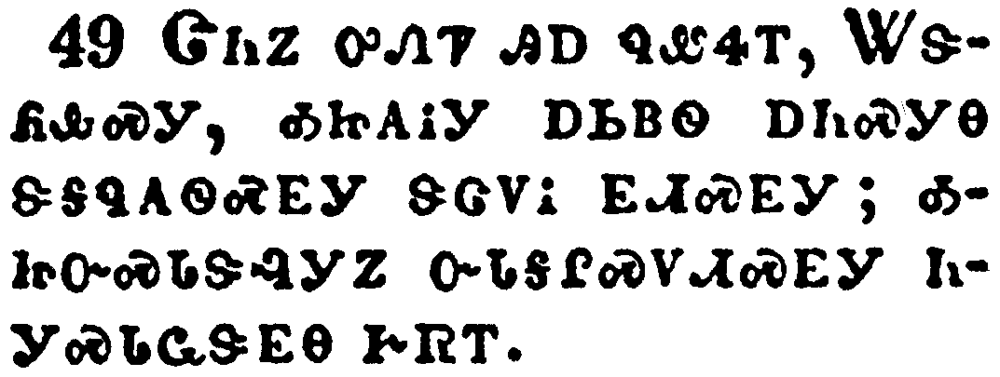</a></td>
</tr>
<tr class="even">
<td>And John answered and said, Master, we saw one casting out devils in thy name; and we forbad him, because he followeth not with us.</td>
</tr>
<tr class="odd">
<td>ᏣᏂᏃ ᎤᏁᏤ ᎯᎠ ᏄᏪᏎᎢ, ᏔᏕᏲᎲᏍᎩ, ᎣᏥᎪᎥᎩ ᎠᏏᏴᏫ ᎠᏂᏍᎩᎾ ᏕᎦᏄᎪᏫᏍᎬᎩ ᏕᏣᏙᎥ ᎬᏗᏍᎬᎩ; ᎣᏥᏅᏍᏓᏕᎸᎩᏃ ᏅᏓᎦᎵᏍᏙᏗᏍᎬᎩ ᏂᎩᏍᏓᏩᏕᎬᎾ ᎨᏒᎢ.</td>
</tr>
<tr class="even">
<td>Tsa-ni-no u-ne-tse hi-a nu-we-se-i, Ta-de-yo-hv-s-gi, o-tsi-go-v-gi a-si-yv-wi a-ni-s-gi-na de-ga-nu-go-wi-s-gv-gi de-tsa-do-v gv-di-s-gv-gi; o-tsi-nv-s-da-de-lv-gi-no nv-da-ga-li-s-do-di-s-gv-gi ni-gi-s-da-wa-de-gv-na ge-sv-i.</td>
</tr>
</tbody>
</table>

<table>
<tbody>
<tr class="odd">
<td><a href="030950.png">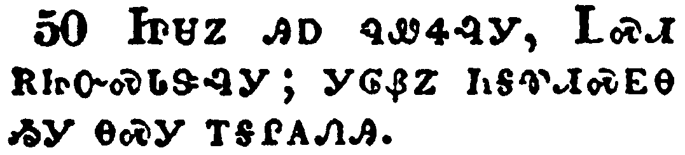</a></td>
</tr>
<tr class="even">
<td>And Jesus said unto him, Forbid him not: for he that is not against us is for us.</td>
</tr>
<tr class="odd">
<td>ᏥᏌᏃ ᎯᎠ ᏄᏪᏎᎸᎩ, ᏞᏍᏗ ᎡᏥᏅᏍᏓᏕᎸᎩ; ᎩᎶᏰᏃ ᏂᎦᏡᏗᏍᎬᎾ ᏱᎩ ᎾᏍᎩ ᎢᎦᎵᎪᏁᎯ.</td>
</tr>
<tr class="even">
<td>Tsi-sa-no hi-a nu-we-se-lv-gi, Tle-s-di e-tsi-nv-s-da-de-lv-gi; gi-lo-ye-no ni-ga-tlu-di-s-gv-na yi-gi na-s-gi i-ga-li-go-ne-hi.</td>
</tr>
</tbody>
</table>

<table>
<tbody>
<tr class="odd">
<td></td>
</tr>
<tr class="even">
<td>And it came to pass, when the time was come that he should be received up, he stedfastly set his face to go to Jerusalem,</td>
</tr>
<tr class="odd">
<td>ᎯᎠᏃ ᏄᎵᏍᏔᏁ ᎿᎭᏉ ᎠᏍᏆᎵᏍᎨ ᎦᎸᎳᏗ ᏣᎦᏓᏂᎸᎢᏍᏗᏱ, ᎤᎵᏂᎩᏗᏳ ᎤᏓᏅᏖ ᏥᎷᏏᎵᎻ ᏭᎶᎯᏍᏗᏱ.</td>
</tr>
<tr class="even">
<td>Hi-a-no nu-li-s-ta-ne hna-quo a-s-qua-li-s-ge ga-lv-la-di tsa-ga-da-ni-lv-i-s-di-yi, u-li-ni-gi-di-yu u-da-nv-te Tsi-lu-si-li-mi wu-lo-hi-s-di-yi.</td>
</tr>
</tbody>
</table>

<table>
<tbody>
<tr class="odd">
<td><a href="030952.png">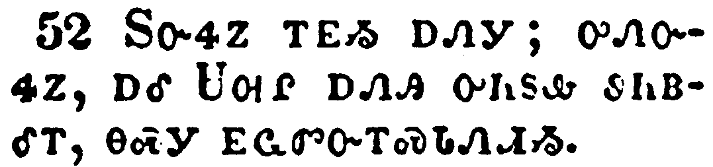</a></td>
</tr>
<tr class="even">
<td>And sent messengers before his face: and they went, and entered into a village of the Samaritans, to make ready for him.</td>
</tr>
<tr class="odd">
<td>ᏚᏅᏎᏃ ᎢᎬᏱ ᎠᏁᎩ; ᎤᏁᏅᏎᏃ, ᎠᎴ ᏌᎺᎵ ᎠᏁᎯ ᎤᏂᏚᎲ ᏭᏂᏴᎴᎢ, ᎾᏍᎩ ᎬᏩᏛᏅᎢᏍᏓᏁᏗᏱ.</td>
</tr>
<tr class="even">
<td>Du-nv-se-no i-gv-yi a-ne-gi; u-ne-nv-se-no, a-le Sa-me-li a-ne-hi u-ni-du-hv wu-ni-yv-le-i, na-s-gi gv-wa-dv-nv-i-s-da-ne-di-yi.</td>
</tr>
</tbody>
</table>

<table>
<tbody>
<tr class="odd">
<td><a href="030953.png">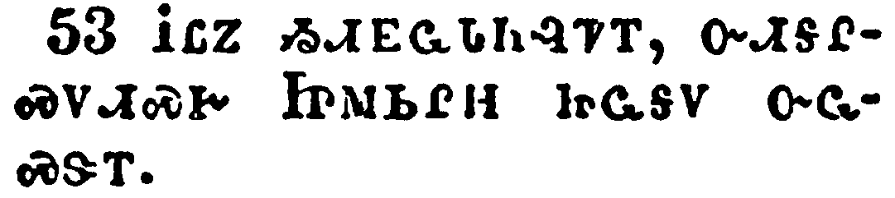</a></td>
</tr>
<tr class="even">
<td>And they did not receive him, because his face was as though he would go to Jerusalem.</td>
</tr>
<tr class="odd">
<td>ᎥᏝᏃ ᏱᏗᎬᏩᏓᏂᎸᏤᎢ, ᏅᏗᎦᎵᏍᏙᏗᏍᎨ ᏥᎷᏏᎵᎻ ᏥᏩᎦᏙ ᏅᏩᏍᏕᎢ.</td>
</tr>
<tr class="even">
<td>V-tla-no yi-di-gv-wa-da-ni-lv-tse-i, nv-di-ga-li-s-do-di-s-ge Tsi-lu-si-li-mi tsi-wa-ga-do nv-wa-s-de-i.</td>
</tr>
</tbody>
</table>

<table>
<tbody>
<tr class="odd">
<td><a href="030954.png">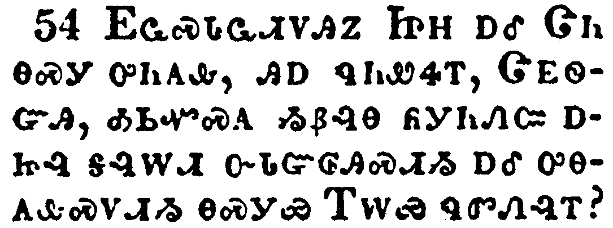</a></td>
</tr>
<tr class="even">
<td>And when his disciples James and John saw this, they said, Lord, wilt thou that we command fire to come down from heaven, and consume them, even as Elias did?</td>
</tr>
<tr class="odd">
<td>ᎬᏩᏍᏓᏩᏗᏙᎯᏃ ᏥᎻ ᎠᎴ ᏣᏂ ᎾᏍᎩ ᎤᏂᎪᎲ, ᎯᎠ ᏄᏂᏪᏎᎢ, ᏣᎬᏫᏳᎯ, ᎣᏏᏉᏍᎪ ᏱᏰᎸᎾ ᏲᎩᏂᏁᏨ ᎠᏥᎸ ᎦᎸᎳᏗ ᏅᏓᏳᎶᎯᏍᏗᏱ ᎠᎴ ᎤᎾᎪᎲᏍᏙᏗᏱ ᎾᏍᎩᏯ ᎢᎳᏯ ᏄᏛᏁᎸᎢ?</td>
</tr>
<tr class="even">
<td>Gv-wa-s-da-wa-di-do-hi-no Tsi-mi a-le Tsa-ni na-s-gi u-ni-go-hv, hi-a nu-ni-we-se-i, Tsa-gv-wi-yu-hi, o-si-quo-s-go yi-ye-lv-na yo-gi-ni-ne-tsv a-tsi-lv ga-lv-la-di nv-da-yu-lo-hi-s-di-yi a-le u-na-go-hv-s-do-di-yi na-s-gi-ya I-la-ya nu-dv-ne-lv-i?</td>
</tr>
</tbody>
</table>

<table>
<tbody>
<tr class="odd">
<td><a href="030955.png">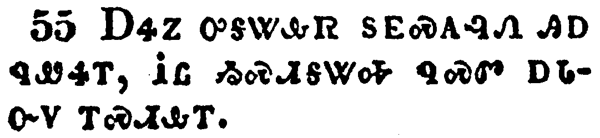</a></td>
</tr>
<tr class="even">
<td>But he turned, and rebuked them, and said, Ye know not what manner of spirit ye are of.</td>
</tr>
<tr class="odd">
<td>ᎠᏎᏃ ᎤᎦᏔᎲᏒ ᏚᎬᏍᎪᎸᏁ ᎯᎠ ᏄᏪᏎᎢ, ᎥᏝ ᏱᏍᏗᎦᏔᎭ ᏄᏍᏛ ᎠᏓᏅᏙ ᎢᏍᏗᎲᎢ.</td>
</tr>
<tr class="even">
<td>A-se-no u-ga-ta-hv-sv du-gv-s-go-lv-ne hi-a nu-we-se-i, V-tla yi-s-di-ga-ta-ha nu-s-dv a-da-nv-do i-s-di-hv-i.</td>
</tr>
</tbody>
</table>

<table>
<tbody>
<tr class="odd">
<td><a href="030956.png">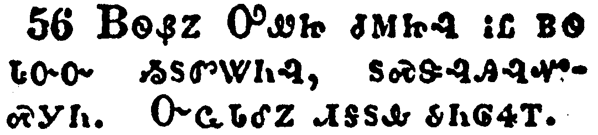</a></td>
</tr>
<tr class="even">
<td>For the Son of man is not come to destroy men's lives, but to save them. And they went to another village.</td>
</tr>
<tr class="odd">
<td>ᏴᏫᏰᏃ ᎤᏪᏥ ᏧᎷᏥᎸ ᎥᏝ ᏴᏫ ᏓᏅᏅ ᏱᏚᏛᏔᏂᎸ, ᏚᏍᏕᎸᎯᎸᏉᏍᎩᏂ. ᏅᏩᏓᎴᏃ ᏗᎦᏚᎲ ᏭᏂᎶᏎᎢ.</td>
</tr>
<tr class="even">
<td>Yv-wi-ye-no U-we-tsi tsu-lu-tsi-lv v-tla yv-wi da-nv-nv yi-du-dv-ta-ni-lv, du-s-de-lv-hi-lv-quo-s-gi-ni. Nv-wa-da-le-no di-ga-du-hv wu-ni-lo-se-i.</td>
</tr>
</tbody>
</table>

<table>
<tbody>
<tr class="odd">
<td><a href="030957.png">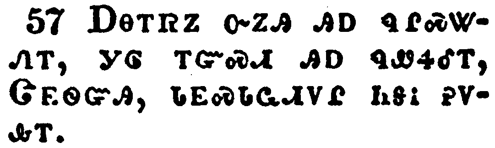</a></td>
</tr>
<tr class="even">
<td>And it came to pass, that, as they went in the way, a certain man said unto him, Lord, I will follow thee whithersoever thou goest.</td>
</tr>
<tr class="odd">
<td>ᎠᎾᎢᏒᏃ ᏅᏃᎯ ᎯᎠ ᏄᎵᏍᏔᏁᎢ, ᎩᎶ ᎢᏳᏍᏗ ᎯᎠ ᏄᏪᏎᎴᎢ, ᏣᎬᏫᏳᎯ, ᏓᎬᏍᏓᏩᏗᏙᎵ ᏂᎦᎥ ᎮᏙᎲᎢ.</td>
</tr>
<tr class="even">
<td>A-na-i-sv-no nv-no-hi hi-a nu-li-s-ta-ne-i, gi-lo i-yu-s-di hi-a nu-we-se-le-i, Tsa-gv-wi-yu-hi, da-gv-s-da-wa-di-do-li ni-ga-v he-do-hv-i.</td>
</tr>
</tbody>
</table>

<table>
<tbody>
<tr class="odd">
<td><a href="030958.png">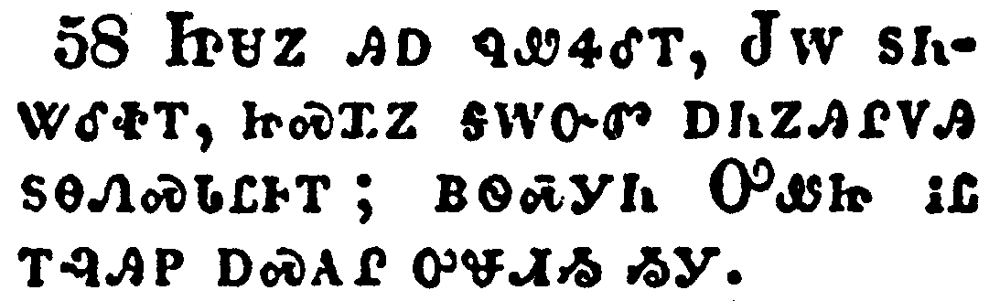</a></td>
</tr>
<tr class="even">
<td>And Jesus said unto him, Foxes have holes, and birds of the air have nests; but the Son of man hath not where to lay his head.</td>
</tr>
<tr class="odd">
<td>ᏥᏌᏃ ᎯᎠ ᏄᏪᏎᎴᎢ, ᏧᎳ ᏚᏂᏔᎴᏐᎢ, ᏥᏍᏆᏃ ᎦᎳᏅᏛ Ꭰ-ᏂᏃᎯᎵᏙᎯ ᏚᎾᏁᏍᏓᏝᎰᎢ; ᏴᏫᏍᎩᏂ ᎤᏪᏥ ᎥᏝ ᎢᎸᎯᏢ ᎠᏍᎪᎵ ᎤᏠᏗᏱ ᏱᎩ.</td>
</tr>
<tr class="even">
<td>Tsi-sa-no hi-a nu-we-se-le-i, Tsu-la du-ni-ta-le-so-i, tsi-s-qua-no ga-la-nv-dv a--ni-no-hi-li-do-hi du-na-ne-s-da-tla-ho-i; yv-wi-s-gi-ni U-we-tsi v-tla i-lv-hi-tlv a-s-go-li u-tlo-di-yi yi-gi.</td>
</tr>
</tbody>
</table>

<table>
<tbody>
<tr class="odd">
<td><a href="030959.png">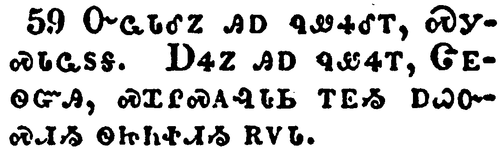</a></td>
</tr>
<tr class="even">
<td>And he said unto another, Follow me. But he said, Lord, suffer me first to go and bury my father.</td>
</tr>
<tr class="odd">
<td>ᎤᏩᏓᎴᏃ ᎯᎠ ᏄᏪᏎᎴᎢ, ᏍᎩᏍᏓᏩᏚᎦ. ᎠᏎᏃ ᎯᎠ ᏄᏪᏎᎢ, ᏣᎬᏫᏳᎯ, ᏍᏆᎵᏍᎪᎸᏓᏏ ᎢᎬᏱ ᎠᏇᏅᏍᏗᏱ ᏫᏥᏂᏐᏗᏱ ᎡᏙᏓ.</td>
</tr>
<tr class="even">
<td>U-wa-da-le-no hi-a nu-we-se-le-i, S-gi-s-da-wa-du-ga. A-se-no hi-a nu-we-se-i, Tsa-gv-wi-yu-hi, s-qua-li-s-go-lv-da-si i-gv-yi a-que-nv-s-di-yi wi-tsi-ni-so-di-yi e-do-da.</td>
</tr>
</tbody>
</table>

<table>
<tbody>
<tr class="odd">
<td><a href="030960.png">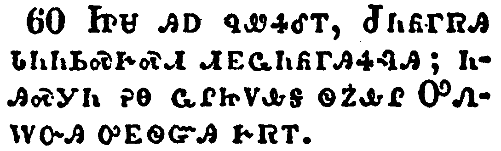</a></td>
</tr>
<tr class="even">
<td>Jesus said unto him, Let the dead bury their dead: but go thou and preach the kingdom of God.</td>
</tr>
<tr class="odd">
<td>ᏥᏌ ᎯᎠ ᏄᏪᏎᎴᎢ, ᏧᏂᏲᎱᏒᎯ ᏓᏂᏂᏏᏍᎨᏍᏗ ᏗᎬᏩᏂᏲᎱᎯᏎᎸᎯ; ᏂᎯᏍᎩᏂ ᎮᎾ ᏩᎵᏥᏙᎲᎦ ᏫᏃᎲᎵ ᎤᏁᎳᏅᎯ ᎤᎬᏫᏳᎯ ᎨᏒᎢ.</td>
</tr>
<tr class="even">
<td>Tsi-sa hi-a nu-we-se-le-i, Tsu-ni-yo-hu-sv-hi da-ni-ni-si-s-ge-s-di di-gv-wa-ni-yo-hu-hi-se-lv-hi; ni-hi-s-gi-ni he-na wa-li-tsi-do-hv-ga wi-no-hv-li U-ne-la-nv-hi u-gv-wi-yu-hi ge-sv-i.</td>
</tr>
</tbody>
</table>

<table>
<tbody>
<tr class="odd">
<td><a href="030961.png">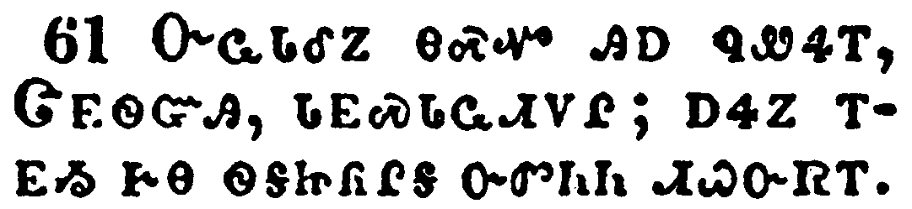</a></td>
</tr>
<tr class="even">
<td>And another also said, Lord, I will follow thee; but let me first go bid them farewell, which are at home at my house.</td>
</tr>
<tr class="odd">
<td>ᏅᏩᏓᎴᏃ ᎾᏍᏉ ᎯᎠ ᏄᏪᏎᎢ, ᏣᎬᏫᏳᎯ, ᏓᎬᏍᏓᏩᏗᏙᎵ; ᎠᏎᏃ ᎢᎬᏱ ᎨᎾ ᏫᎦᏥᏲᎵᎦ ᏅᏛᏂᏂ ᏗᏇᏅᏒᎢ.</td>
</tr>
<tr class="even">
<td>Nv-wa-da-le-no na-s-quo hi-a nu-we-se-i, Tsa-gv-wi-yu-hi, da-gv-s-da-wa-di-do-li; a-se-no i-gv-yi ge-na wi-ga-tsi-yo-li-ga nv-dv-ni-ni di-que-nv-sv-i.</td>
</tr>
</tbody>
</table>

<table>
<tbody>
<tr class="odd">
<td><a href="030962.png">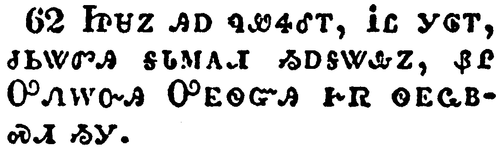</a></td>
</tr>
<tr class="even">
<td>And Jesus said unto him, No man, having put his hand to the plough, and looking back, is fit for the kingdom of God.</td>
</tr>
<tr class="odd">
<td>ᏥᏌᏃ ᎯᎠ ᏄᏪᏎᎴᎢ, ᎥᏝ ᎩᎶᎢ, ᏧᏏᏔᏛᎯ ᎦᏓᎷᎪᏗ ᏱᎠᎦᏔᎲᏃ, ᏰᎵ ᎤᏁᎳᏅᎯ ᎤᎬᏫᏳᎯ ᎨᏒ ᏫᎬᏩᏴᏍᏗ ᏱᎩ.</td>
</tr>
<tr class="even">
<td>Tsi-sa-no hi-a nu-we-se-le-i, V-tla gi-lo-i, tsu-si-ta-dv-hi ga-da-lu-go-di yi-a-ga-ta-hv-no, ye-li U-ne-la-nv-hi U-gv-wi-yu-hi ge-sv wi-gv-wa-yv-s-di yi-gi.</td>
</tr>
</tbody>
</table>

