+++
draft=false
date = 2014-12-18T21:11:07Z
title = "Luke - Chapter 11 - Cherokee New Testament"
weight = 1418955067

[taxonomies]

authors = ["Timothy Legg"]
categories = []
tags = []

[extra]
+++
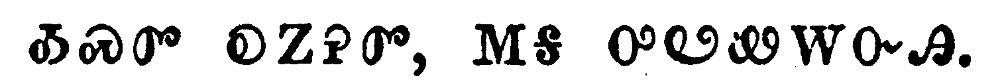

<table>
<tbody>
<tr class="odd">
<td><a href="031101.png">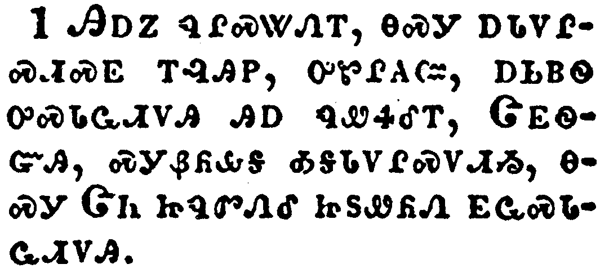</a></td>
</tr>
<tr class="even">
<td>And it came to pass, that, as he was praying in a certain place, when he ceased, one of his disciples said unto him, Lord, teach us to pray, as John also taught his disciples.</td>
</tr>
<tr class="odd">
<td>ᎯᎠᏃ ᏄᎵᏍᏔᏁᎢ, ᎾᏍᎩ ᎠᏓᏙᎵᏍᏗᏍᎬ ᎢᎸᎯᏢ, ᎤᏑᎵᎪᏨ, ᎠᏏᏴᏫ ᎤᏍᏓᏩᏗᏙᎯ ᎯᎠ ᏄᏪᏎᎴᎢ, ᏣᎬᏫᏳᎯ, ᏍᎩᏰᏲᎲᎦ ᎣᎦᏓᏙᎵᏍᏙᏗᏱ, ᎾᏍᎩ ᏣᏂ ᏥᏄᏛᏁᎴ ᏥᏚᏪᏲᏁ ᎬᏩᏍᏓᏩᏗᏙᎯ.</td>
</tr>
<tr class="even">
<td>Hi-a-no nu-li-s-ta-ne-i, na-s-gi a-da-do-li-s-di-s-gv i-lv-hi-tlv, u-su-li-go-tsv, a-si-yv-wi u-s-da-wa-di-do-hi hi-a nu-we-se-le-i, Tsa-gv-wi-yu-hi, s-gi-ye-yo-hv-ga o-ga-da-do-li-s-do-di-yi, na-s-gi Tsa-ni tsi-nu-dv-ne-le tsi-du-we-yo-ne gv-wa-s-da-wa-di-do-hi.</td>
</tr>
</tbody>
</table>

<table>
<tbody>
<tr class="odd">
<td><a href="031102.png">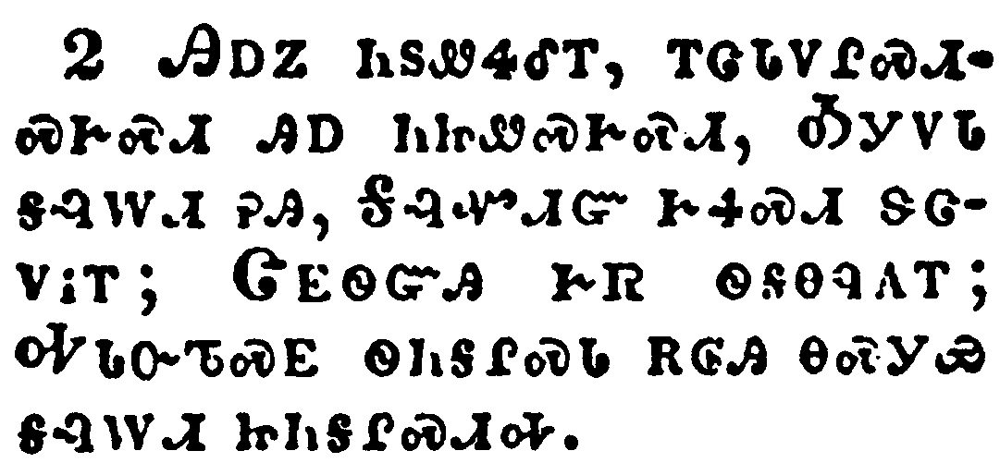</a></td>
</tr>
<tr class="even">
<td>And he said unto them, When ye pray, say, Our Father which art in heaven, Hallowed be thy name. Thy kingdom come. Thy will be done, as in heaven, so in earth.</td>
</tr>
<tr class="odd">
<td>ᎯᎠᏃ ᏂᏚᏪᏎᎴᎢ, ᎢᏣᏓᏙᎵᏍᏗᏍᎨᏍᏗ ᎯᎠ ᏂᏥᏪᏍᎨᏍᏗ, ᎣᎩᏙᏓ ᎦᎸᎳᏗ ᎮᎯ, ᎦᎸᏉᏗᏳ ᎨᏎᏍᏗ ᏕᏣᏙᎥᎢ; ᏨᎬᏫᏳᎯ ᎨᏒ ᏫᎦᎾᏄᎪᎢ; ᎭᏓᏅᏖᏍᎬ ᏫᏂᎦᎵᏍᏓ ᎡᎶᎯ ᎾᏍᎩᏯ ᎦᎸᎳᏗ ᏥᏂᎦᎵᏍᏗᎭ.</td>
</tr>
<tr class="even">
<td>Hi-a-no ni-du-we-se-le-i, i-tsa-da-do-li-s-di-s-ge-s-di hi-a ni-tsi-we-s-ge-s-di, O-gi-do-da ga-lv-la-di he-hi, Ga-lv-quo-di-yu ge-se-s-di de-tsa-do-v-i; Tsv-gv-wi-yu-hi ge-sv wi-ga-na-nu-go-i; Ha-da-nv-te-s-gv wi-ni-ga-li-s-da e-lo-hi na-s-gi-ya ga-lv-la-di tsi-ni-ga-li-s-di-ha.</td>
</tr>
</tbody>
</table>

<table>
<tbody>
<tr class="odd">
<td><a href="031103.png">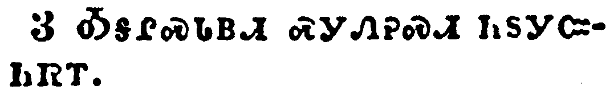</a></td>
</tr>
<tr class="even">
<td>Give us day by day our daily bread.</td>
</tr>
<tr class="odd">
<td>ᎣᎦᎵᏍᏓᏴᏗ ᏍᎩᏁᎮᏍᏗ ᏂᏚᎩᏨᏂᏒᎢ.</td>
</tr>
<tr class="even">
<td>O-ga-li-s-da-yv-di s-gi-ne-he-s-di ni-du-gi-tsv-ni-sv-i.</td>
</tr>
</tbody>
</table>

<table>
<tbody>
<tr class="odd">
<td><a href="031104.png">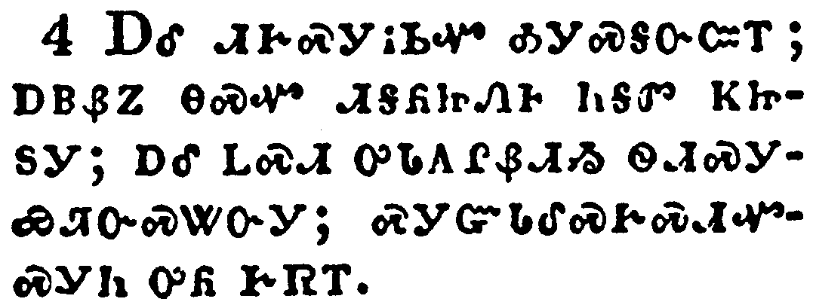</a></td>
</tr>
<tr class="even">
<td>And forgive us our sins; for we also forgive every one that is indebted to us. And lead us not into temptation; but deliver us from evil.</td>
</tr>
<tr class="odd">
<td>ᎠᎴ ᏗᎨᏍᎩᎥᏏᏉ ᎣᎩᏍᎦᏅᏨᎢ; ᎠᏴᏰᏃ ᎾᏍᏉ ᏗᎦᏲᏥᏁᎰ ᏂᎦᏛ ᏦᏥᏚᎩ; ᎠᎴ ᏞᏍᏗ ᎤᏓᎪᎵᏰᏗᏱ ᏫᏗᏍᎩᏯᏘᏅᏍᏔᏅᎩ; ᏍᎩᏳᏓᎴᏍᎨᏍᏗᏉᏍᎩᏂ ᎤᏲ ᎨᏒᎢ.</td>
</tr>
<tr class="even">
<td>A-le di-ge-s-gi-v-si-quo o-gi-s-ga-nv-tsv-i; a-yv-ye-no na-s-quo di-ga-yo-tsi-ne-ho ni-ga-dv tso-tsi-du-gi; a-le tle-s-di u-da-go-li-ye-di-yi wi-di-s-gi-ya-ti-nv-s-ta-nv-gi; s-gi-yu-da-le-s-ge-s-di-quo-s-gi-ni u-yo ge-sv-i.</td>
</tr>
</tbody>
</table>

<table>
<tbody>
<tr class="odd">
<td><a href="031105.png">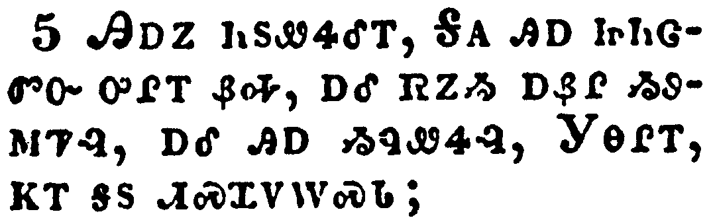</a></td>
</tr>
<tr class="even">
<td>And he said unto them, Which of you shall have a friend, and shall go unto him at midnight, and say unto him, Friend, lend me three loaves;</td>
</tr>
<tr class="odd">
<td>ᎯᎠᏃ ᏂᏚᏪᏎᎴᎢ, ᎦᎪ ᎯᎠ ᏥᏂᏣᏛᏅ ᎤᎵᎢ ᏰᎭ, ᎠᎴ ᎡᏃᏱ ᎠᏰᎵ ᏱᏭᎷᏤᎸ, ᎠᎴ ᎯᎠ ᏱᏄᏪᏎᎸ, ᎩᎾᎵᎢ, ᏦᎢ ᎦᏚ ᏗᏍᏆᏙᎳᏍᏓ;</td>
</tr>
<tr class="even">
<td>Hi-a-no ni-du-we-se-le-i, Ga-go hi-a tsi-ni-tsa-dv-nv u-li-i ye-ha, a-le e-no-yi a-ye-li yi-wu-lu-tse-lv, a-le hi-a yi-nu-we-se-lv, Gi-na-li-i, tso-i ga-du di-s-qua-do-la-s-da;</td>
</tr>
</tbody>
</table>

<table>
<tbody>
<tr class="odd">
<td><a href="031106.png">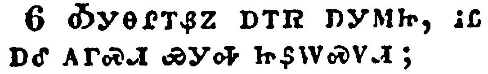</a></td>
</tr>
<tr class="even">
<td>For a friend of mine in his journey is come to me, and I have nothing to set before him?</td>
</tr>
<tr class="odd">
<td>ᎣᎩᎾᎵᎢᏰᏃ ᎠᎢᏒ ᎠᎩᎷᏥ, ᎥᏝ ᎠᎴ ᎪᎱᏍᏗ ᏯᎩᎭ ᏥᏰᎳᏍᏙᏗ;</td>
</tr>
<tr class="even">
<td>O-gi-na-li-i-ye-no a-i-sv a-gi-lu-tsi, v-tla a-le go-hu-s-di ya-gi-ha tsi-ye-la-s-do-di;</td>
</tr>
</tbody>
</table>

<table>
<tbody>
<tr class="odd">
<td><a href="031107.png">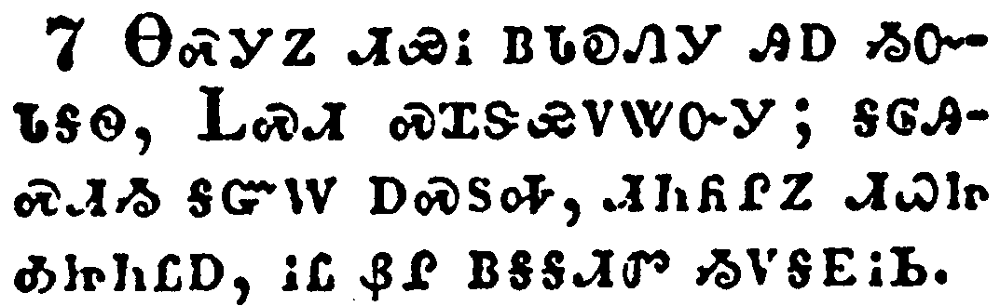</a></td>
</tr>
<tr class="even">
<td>And he from within shall answer and say, Trouble me not: the door is now shut, and my children are with me in bed; I cannot rise and give thee.</td>
</tr>
<tr class="odd">
<td>ᎾᏍᎩᏃ ᏗᏯᎥ ᏴᏓᎧᏁᎩ ᎯᎠ ᏱᏅᏓᎦᏫ, ᏞᏍᏗ ᏍᏆᏕᏯᏙᏔᏅᎩ; ᎦᎶᎯᏍᏗᏱ ᎦᏳᎳ ᎠᏍᏚᎭ, ᏗᏂᏲᎵᏃ ᏗᏇᏥ ᎣᏥᏂᏝᎠ, ᎥᏝ ᏰᎵ ᏴᎦᎦᏗᏛ ᏱᏙᎦᎬᎥᏏ.</td>
</tr>
<tr class="even">
<td>Na-s-gi-no di-ya-v yv-da-ka-ne-gi hi-a yi-nv-da-ga-wi, Tle-s-di s-qua-de-ya-do-ta-nv-gi; ga-lo-hi-s-di-yi ga-yu-la a-s-du-ha, di-ni-yo-li-no di-que-tsi o-tsi-ni-tla-a, v-tla ye-li yv-ga-ga-di-dv yi-do-ga-gv-v-si.</td>
</tr>
</tbody>
</table>

<table>
<tbody>
<tr class="odd">
<td></td>
</tr>
<tr class="even">
<td>I say unto you, Though he will not rise and give him, because he is his friend, yet because of his importunity he will rise and give him as many as he needeth.</td>
</tr>
<tr class="odd">
<td>ᎢᏨᏲᏎᎭ ᎬᏩᏗᏛᏗ ᏂᎨᏒᎾ ᎠᎴ ᏗᎬᏩᏁᏗ ᏂᎨᏒᎾ ᏱᎩ, ᎤᎾᎵᎢᏉ ᎨᏒ ᎢᏳᏍᏗ, ᎾᏑᎵᎪᎬᎾᏍᎩᏂ ᎨᏒ ᎢᏳᏍᏗ ᏯᏗᏛ ᎠᎴ ᏱᏕᎠᎲᏏ ᏂᎦᎥ ᏚᏚᎵᏍᎬᎢ.</td>
</tr>
<tr class="even">
<td>I-tsv-yo-se-ha gv-wa-di-dv-di ni-ge-sv-na a-le di-gv-wa-ne-di ni-ge-sv-na yi-gi, u-na-li-i-quo ge-sv i-yu-s-di, na-su-li-go-gv-na-s-gi-ni ge-sv i-yu-s-di ya-di-dv a-le yi-de-a-hv-si ni-ga-v du-du-li-s-gv-i.</td>
</tr>
</tbody>
</table>

<table>
<tbody>
<tr class="odd">
<td><a href="031109.png">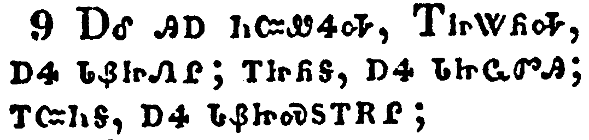</a></td>
</tr>
<tr class="even">
<td>And I say unto you, Ask, and it shall be given you; seek, and ye shall find; knock, and it shall be opened unto you.</td>
</tr>
<tr class="odd">
<td>ᎠᎴ ᎯᎠ ᏂᏨᏪᏎᎭ, ᎢᏥᏔᏲᎭ, ᎠᏎ ᏓᏰᏥᏁᎵ; ᎢᏥᏲᎦ, ᎠᏎ ᏓᏥᏩᏛᎯ; ᎢᏨᏂᎦ, ᎠᏎ ᏓᏰᏥᏍᏚᎢᎡᎵ;</td>
</tr>
<tr class="even">
<td>A-le hi-a ni-tsv-we-se-ha, I-tsi-ta-yo-ha, a-se da-ye-tsi-ne-li; i-tsi-yo-ga, a-se da-tsi-wa-dv-hi; i-tsv-ni-ga, a-se da-ye-tsi-s-du-i-e-li;</td>
</tr>
</tbody>
</table>

<table>
<tbody>
<tr class="odd">
<td><a href="031110.png">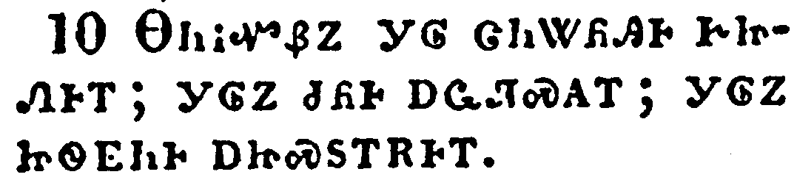</a></td>
</tr>
<tr class="even">
<td>For every one that asketh receiveth; and he that seeketh findeth; and to him that knocketh it shall be opened.</td>
</tr>
<tr class="odd">
<td>ᎾᏂᎥᏉᏰᏃ ᎩᎶ ᏣᏂᏔᏲᎯᎰ ᎨᏥᏁᎰᎢ; ᎩᎶᏃ ᏧᏲᎰ ᎠᏩᏘᏍᎪᎢ; ᎩᎶᏃ ᏥᏫᎬᏂᎰ ᎠᏥᏍᏚᎢᎡᎰᎢ.</td>
</tr>
<tr class="even">
<td>Na-ni-v-quo-ye-no gi-lo tsa-ni-ta-yo-hi-ho ge-tsi-ne-ho-i; gi-lo-no tsu-yo-ho a-wa-ti-s-go-i; gi-lo-no tsi-wi-gv-ni-ho a-tsi-s-du-i-e-ho-i.</td>
</tr>
</tbody>
</table>

<table>
<tbody>
<tr class="odd">
<td><a href="031111.png">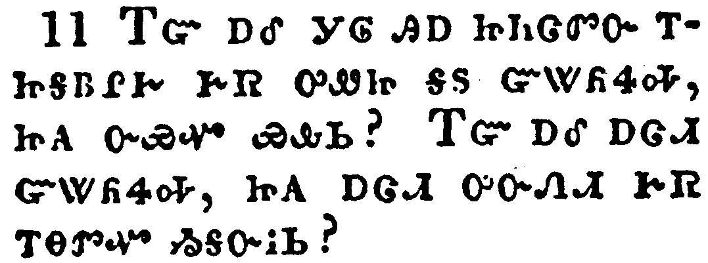</a></td>
</tr>
<tr class="even">
<td>If a son shall ask bread of any of you that is a father, will he give him a stone? or if he ask a fish, will he for a fish give him a serpent?</td>
</tr>
<tr class="odd">
<td>ᎢᏳ ᎠᎴ ᎩᎶ ᎯᎠ ᏥᏂᏣᏛᏅ ᎢᏥᎦᏴᎵᎨ ᎨᏒ ᎤᏪᏥ ᎦᏚ ᏳᏔᏲᏎᎭ, ᏥᏌ ᏅᏯᏉ ᏯᎲᏏ? ᎢᏳ ᎠᎴ ᎠᏣᏗ ᏳᏔᏲᏎᎭ, ᏥᎪ ᎠᏣᏗ ᎤᏅᏁᏗ ᎨᏒ ᎢᎾᏛᏉ ᏱᎦᏅᎥᏏ?</td>
</tr>
<tr class="even">
<td>I-yu a-le gi-lo hi-a tsi-ni-tsa-dv-nv i-tsi-ga-yv-li-ge ge-sv u-we-tsi ga-du yu-ta-yo-se-ha, tsi-sa nv-ya-quo ya-hv-si? I-yu a-le a-tsa-di yu-ta-yo-se-ha, tsi-go a-tsa-di u-nv-ne-di ge-sv i-na-dv-quo yi-ga-nv-v-si?</td>
</tr>
</tbody>
</table>

<table>
<tbody>
<tr class="odd">
<td><a href="031112.png">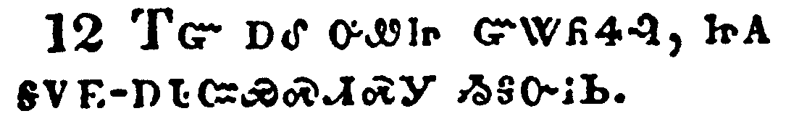</a></td>
</tr>
<tr class="even">
<td>Or if he shall ask an egg, will he offer him a scorpion?</td>
</tr>
<tr class="odd">
<td>ᎢᏳ ᎠᎴ ᎤᏪᏥ ᏳᏔᏲᏎᎸ, ᏥᎪ ᎦᏙᎬ-ᎠᏓᏨᏯᏍᏗᏍᎩ ᏱᎦᏅᎥᏏ.</td>
</tr>
<tr class="even">
<td>I-yu a-le u-we-tsi yu-ta-yo-se-lv, tsi-go ga-do-gv--a-da-tsv-ya-s-di-s-gi yi-ga-nv-v-si.</td>
</tr>
</tbody>
</table>

<table>
<tbody>
<tr class="odd">
<td><a href="031113.png">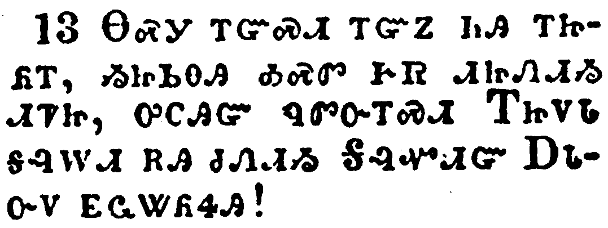</a></td>
</tr>
<tr class="even">
<td>If ye then, being evil, know how to give good gifts unto your children: how much more shall your heavenly Father give the Holy Spirit to them that ask him?</td>
</tr>
<tr class="odd">
<td>ᎾᏍᎩ ᎢᏳᏍᏗ ᎢᏳᏃ ᏂᎯ ᎢᏥᏲᎢ, ᏱᏥᏏᎾᎯ ᎣᏍᏛ ᎨᏒ ᏗᏥᏁᏗᏱ ᏗᏤᏥ, ᎤᏟᎯᏳ ᏄᏛᏅᎢᏍᏗ ᎢᏥᏙᏓ ᎦᎸᎳᏗ ᎡᎯ ᏧᏁᏗᏱ ᎦᎸᏉᏗᏳ ᎠᏓᏅᏙ ᎬᏩᏔᏲᏎᎯ!</td>
</tr>
<tr class="even">
<td>Na-s-gi i-yu-s-di i-yu-no ni-hi i-tsi-yo-i, yi-tsi-si-na-hi o-s-dv ge-sv di-tsi-ne-di-yi di-tse-tsi, u-tli-hi-yu nu-dv-nv-i-s-di I-tsi-do-da ga-lv-la-di e-hi tsu-ne-di-yi Ga-lv-quo-di-yu A-da-nv-do gv-wa-ta-yo-se-hi!</td>
</tr>
</tbody>
</table>

<table>
<tbody>
<tr class="odd">
<td><a href="031114.png">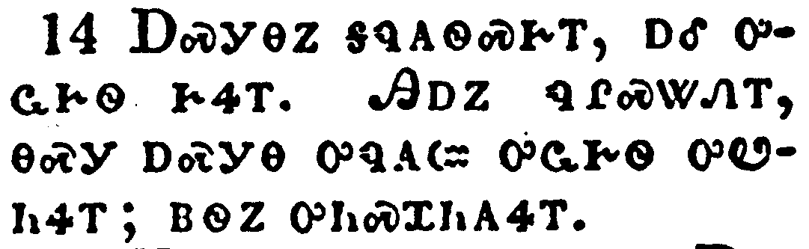</a></td>
</tr>
<tr class="even">
<td>And he was casting out a devil, and it was dumb. And it came to pass, when the devil was gone out, the dumb spake; and the people wondered.</td>
</tr>
<tr class="odd">
<td>ᎠᏍᎩᎾᏃ ᎦᏄᎪᏫᏍᎨᎢ, ᎠᎴ ᎤᏩᎨᏫ ᎨᏎᎢ. ᎯᎠ Ꮓ ᏄᎵᏍᏔᏁᎢ, ᎾᏍᎩ ᎠᏍᎩᎾ ᎤᏄᎪᏨ ᎤᏩᎨᏫ ᎤᏬᏂᏎᎢ; ᏴᏫᏃ ᎤᏂᏍᏆᏂᎪᏎᎢ.</td>
</tr>
<tr class="even">
<td>A-s-gi-na-no ga-nu-go-wi-s-ge-i, a-le u-wa-ge-wi ge-se-i. Hi-a no nu-li-s-ta-ne-i, na-s-gi a-s-gi-na u-nu-go-tsv u-wa-ge-wi u-wo-ni-se-i; yv-wi-no u-ni-s-qua-ni-go-se-i.</td>
</tr>
</tbody>
</table>

<table>
<tbody>
<tr class="odd">
<td><a href="031115.png">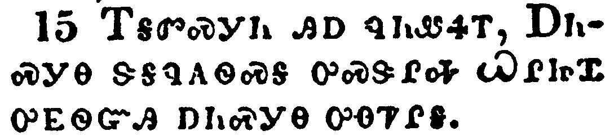</a></td>
</tr>
<tr class="even">
<td>But some of them said, He casteth out devils through Beelzebub the chief of the devils.</td>
</tr>
<tr class="odd">
<td>ᎢᎦᏛᏍᎩᏂ ᎯᎠ ᏄᏂᏪᏎᎢ, ᎠᏂᏍᎩᎾ ᏕᎦᏄᎪᏫᏍᎦ ᎤᏍᏕᎵᎭ ᏇᎵᏥᏆ ᎤᎬᏫᏳᎯ ᎠᏂᏍᎩᎾ ᎤᎾᏤᎵᎦ.</td>
</tr>
<tr class="even">
<td>I-ga-dv-s-gi-ni hi-a nu-ni-we-se-i, A-ni-s-gi-na de-ga-nu-go-wi-s-ga u-s-de-li-ha Que-li-tsi-qua u-gv-wi-yu-hi a-ni-s-gi-na u-na-tse-li-ga.</td>
</tr>
</tbody>
</table>

<table>
<tbody>
<tr class="odd">
<td><a href="031116.png">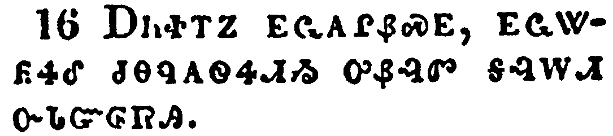</a></td>
</tr>
<tr class="even">
<td>And others, tempting him, sought of him a sign from heaven.</td>
</tr>
<tr class="odd">
<td>ᎠᏂᏐᎢᏃ ᎬᏩᎪᎵᏰᏍᎬ, ᎬᏩᏔᏲᏎᎴ ᏧᎾᏄᎪᏫᏎᏗᏱ ᎤᏰᎸᏛ ᎦᎸᎳᏗ ᏅᏓᏳᎶᏒᎯ.</td>
</tr>
<tr class="even">
<td>A-ni-so-i-no gv-wa-go-li-ye-s-gv, gv-wa-ta-yo-se-le tsu-na-nu-go-wi-se-di-yi u-ye-lv-dv ga-lv-la-di nv-da-yu-lo-sv-hi.</td>
</tr>
</tbody>
</table>

<table>
<tbody>
<tr class="odd">
<td><a href="031117.png">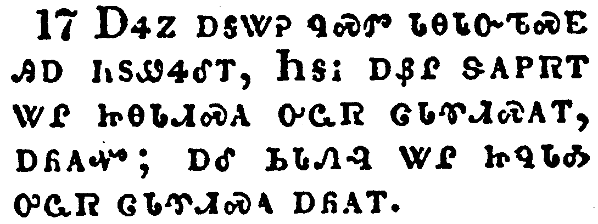</a></td>
</tr>
<tr class="even">
<td>But he, knowing their thoughts, said unto them, Every kingdom divided against itself is brought to desolation; and a house divided against a house falleth.</td>
</tr>
<tr class="odd">
<td>ᎠᏎᏃ ᎠᎦᏔᎮ ᏄᏍᏛ ᏓᎾᏓᏅᏖᏍᎬ ᎯᎠ ᏂᏚᏪᏎᎴᎢ, ᏂᎦᎥ ᎠᏰᎵ ᏕᎪᏢᏒᎢ ᏔᎵ ᏥᎾᏓᏗᏍᎪ ᎤᏩᏒ ᏣᏓᏡᏗᏍᎪᎢ, ᎠᏲᎪᏉ; ᎠᎴ ᏏᏓᏁᎸ ᏔᎵ ᏥᏄᏓᎣ ᎤᏩᏒ ᏣᏓᏡᏗᏍᎪ ᎠᏲᎪᎢ.</td>
</tr>
<tr class="even">
<td>A-se-no a-ga-ta-he nu-s-dv da-na-da-nv-te-s-gv hi-a ni-du-we-se-le-i, Ni-ga-v a-ye-li de-go-tlv-sv-i ta-li tsi-na-da-di-s-go u-wa-sv tsa-da-tlu-di-s-go-i, a-yo-go-quo; a-le si-da-ne-lv ta-li tsi-nu-da-o u-wa-sv tsa-da-tlu-di-s-go a-yo-go-i.</td>
</tr>
</tbody>
</table>

<table>
<tbody>
<tr class="odd">
<td><a href="031118.png">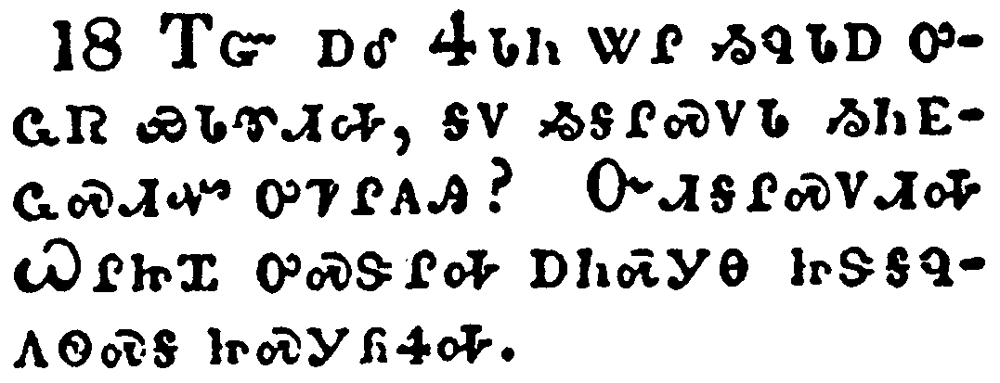</a></td>
</tr>
<tr class="even">
<td>If Satan also be divided against himself, how shall his kingdom stand? because ye say that I cast out devils through Beelzebub.</td>
</tr>
<tr class="odd">
<td>ᎢᏳ ᎠᎴ ᏎᏓᏂ ᏔᎵ ᏱᏄᏓᎠ ᎤᏩᏒ ᏯᏓᏡᏗᎭ, ᎦᏙ ᏱᎦᎵᏍᏙᏓ ᏱᏂᎬᏩᏍᏗᏉ ᎤᏤᎵᎪᎯ? ᏅᏗᎦᎵᏍᏙᏗᎭ ᏇᎵᏥᏆ ᎤᏍᏕᎵᎭ ᎠᏂᏍᎩᎾ ᏥᏕᎦᏄᎪᏫᏍᎦ ᏥᏍᎩᏲᏎᎭ.</td>
</tr>
<tr class="even">
<td>I-yu a-le Se-da-ni ta-li yi-nu-da-a u-wa-sv ya-da-tlu-di-ha, ga-do yi-ga-li-s-do-da yi-ni-gv-wa-s-di-quo u-tse-li-go-hi? Nv-di-ga-li-s-do-di-ha Que-li-tsi-qua u-s-de-li-ha a-ni-s-gi-na tsi-de-ga-nu-go-wi-s-ga tsi-s-gi-yo-se-ha.</td>
</tr>
</tbody>
</table>

<table>
<tbody>
<tr class="odd">
<td><a href="031119.png">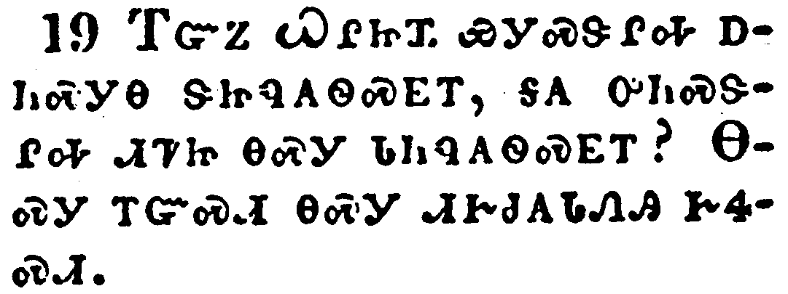</a></td>
</tr>
<tr class="even">
<td>And if I by Beelzebub cast out devils, by whom do your sons cast them out? therefore shall they be your judges.</td>
</tr>
<tr class="odd">
<td>ᎢᏳᏃ ᏇᎵᏥᏆ ᏯᎩᏍᏕᎵᎭ ᎠᏂᏍᎩᎾ ᏕᏥᏄᎪᏫᏍᎬᎢ, ᎦᎪ ᎤᏂᏍᏕᎵᎭ ᏗᏤᏥ ᎾᏍᎩ ᏓᏂᏄᎪᏫᏍᎬᎢ? ᎾᏍᎩ ᎢᏳᏍᏗ ᎾᏍᎩ ᏗᎨᏧᎪᏓᏁᎯ ᎨᏎᏍᏗ.</td>
</tr>
<tr class="even">
<td>I-yu-no Que-li-tsi-qua ya-gi-s-de-li-ha a-ni-s-gi-na de-tsi-nu-go-wi-s-gv-i, ga-go u-ni-s-de-li-ha di-tse-tsi na-s-gi da-ni-nu-go-wi-s-gv-i? Na-s-gi i-yu-s-di na-s-gi di-ge-tsu-go-da-ne-hi ge-se-s-di.</td>
</tr>
</tbody>
</table>

<table>
<tbody>
<tr class="odd">
<td><a href="031120.png">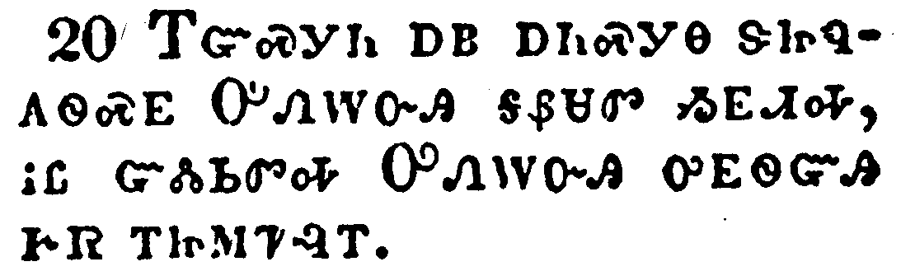</a></td>
</tr>
<tr class="even">
<td>But if I with the finger of God cast out devils, no doubt the kingdom of God is come upon you.</td>
</tr>
<tr class="odd">
<td>ᎢᏳᏍᎩᏂ ᎠᏴ ᎠᏂᏍᎩᎾ ᏕᏥᏄᎪᏫᏍᎬ ᎤᏁᎳᏅᎯ ᎦᏰᏌᏛ ᏱᎬᏗᎭ, ᎥᏝ ᏳᏜᏓᏏᏛᎭ ᎤᏁᎳᏅᎯ ᎤᎬᏫᏳᎯ ᎨᏒ ᎢᏥᎷᏤᎸᎢ.</td>
</tr>
<tr class="even">
<td>I-yu-s-gi-ni a-yv a-ni-s-gi-na de-tsi-nu-go-wi-s-gv U-ne-la-nv-hi ga-ye-sa-dv yi-gv-di-ha, v-tla yu-dla-si-dv-ha U-ne-la-nv-hi u-gv-wi-yu-hi ge-sv i-tsi-lu-tse-lv-i.</td>
</tr>
</tbody>
</table>

<table>
<tbody>
<tr class="odd">
<td></td>
</tr>
<tr class="even">
<td>When a strong man armed keepeth his palace, his goods are in peace:</td>
</tr>
<tr class="odd">
<td>ᎢᏳᏃ ᎤᎵᏂᎩᏛ ᎠᏍᎦᏯ ᎤᎵᏍᎦᏍᏙᏗ ᎬᏰᎯ ᏯᎦᏘᏯ ᎦᏁᎸᎢ ᏅᏩᏙᎯᏯᏛ ᏄᏍᏛ ᎤᎿᎭᎥᎢ.</td>
</tr>
<tr class="even">
<td>I-yu-no u-li-ni-gi-dv a-s-ga-ya u-li-s-ga-s-do-di gv-ye-hi ya-ga-ti-ya ga-ne-lv-i nv-wa-do-hi-ya-dv nu-s-dv u-hna-v-i.</td>
</tr>
</tbody>
</table>

<table>
<tbody>
<tr class="odd">
<td><a href="031122.png">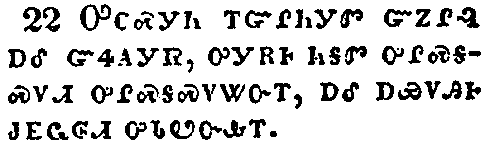</a></td>
</tr>
<tr class="even">
<td>But when a stronger than he shall come upon him, and overcome him, he taketh from him all his armour wherein he trusted, and divideth his spoils.</td>
</tr>
<tr class="odd">
<td>ᎤᏟᏍᎩᏂ ᎢᏳᎵᏂᎩᏛ ᏳᏃᎵᎸ ᎠᎴ ᏳᏎᎪᎩᏒ, ᎤᎩᎡᎰ ᏂᎦᏛ ᎤᎵᏍᎦᏍᏙᏗ ᎤᎵᏍᎦᏍᏙᏔᏅᎢ, ᎠᎴ ᎠᏯᏙᎯᎰ ᏧᎬᏩᎶᏗ ᎤᏓᏬᏅᎲᎢ.</td>
</tr>
<tr class="even">
<td>U-tli-s-gi-ni i-yu-li-ni-gi-dv yu-no-li-lv a-le yu-se-go-gi-sv, u-gi-e-ho ni-ga-dv u-li-s-ga-s-do-di u-li-s-ga-s-do-ta-nv-i, a-le a-ya-do-hi-ho tsu-gv-wa-lo-di u-da-wo-nv-hv-i.</td>
</tr>
</tbody>
</table>

<table>
<tbody>
<tr class="odd">
<td><a href="031123.png">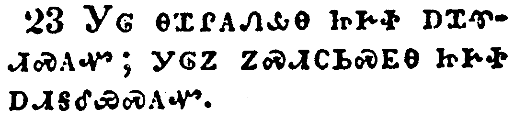</a></td>
</tr>
<tr class="even">
<td>He that is not with me is against me: and he that gathereth not with me scattereth.</td>
</tr>
<tr class="odd">
<td>ᎩᎶ ᎾᏆᎵᎪᏁᎲᎾ ᏥᎨᏐ ᎠᏆᏡᏗᏍᎪᏉ; ᎩᎶᏃ ᏃᏍᏗᏟᏏᏍᎬᎾ ᏥᎨᏐ ᎠᏗᎦᎴᏯᏍᎪᏉ.</td>
</tr>
<tr class="even">
<td>Gi-lo na-qua-li-go-ne-hv-na tsi-ge-so a-qua-tlu-di-s-go-quo; gi-lo-no no-s-di-tli-si-s-gv-na tsi-ge-so a-di-ga-le-ya-s-go-quo.</td>
</tr>
</tbody>
</table>

<table>
<tbody>
<tr class="odd">
<td><a href="031124.png">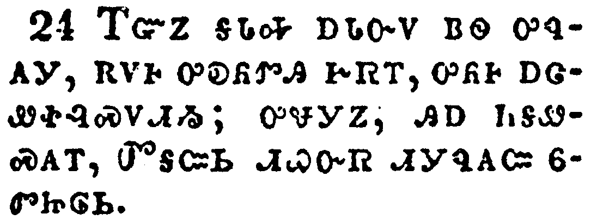</a></td>
</tr>
<tr class="even">
<td>When the unclean spirit is gone out of a man, he walketh through dry places, seeking rest; and finding none, he saith, I will return unto my house whence I came out.</td>
</tr>
<tr class="odd">
<td>ᎢᏳᏃ ᎦᏓᎭ ᎠᏓᏅᏙ ᏴᏫ ᎤᏄᎪᎩ, ᎡᏙᎰ ᎤᎧᏲᏛᎯ ᎨᏒᎢ, ᎤᏲᎰ ᎠᏣᏪᏐᎸᏍᏙᏗᏱ; ᎤᏠᎩᏃ, ᎯᎠ ᏂᎦᏪᏍᎪᎢ, ᏛᎦᏨᏏ ᏗᏇᏅᏒ ᏗᎩᏄᎪᏨ ᏮᏛᏥᎶᏏ.</td>
</tr>
<tr class="even">
<td>I-yu-no ga-da-ha a-da-nv-do yv-wi u-nu-go-gi, e-do-ho u-ka-yo-dv-hi ge-sv-i, u-yo-ho a-tsa-we-so-lv-s-do-di-yi; u-tlo-gi-no, hi-a ni-ga-we-s-go-i, Dv-ga-tsv-si di-que-nv-sv di-gi-nu-go-tsv wv-dv-tsi-lo-si.</td>
</tr>
</tbody>
</table>

<table>
<tbody>
<tr class="odd">
<td><a href="031125.png">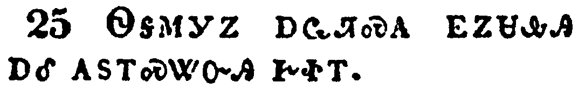</a></td>
</tr>
<tr class="even">
<td>And when he cometh, he findeth it swept and garnished.</td>
</tr>
<tr class="odd">
<td>ᏫᎦᎷᎩᏃ ᎠᏩᏘᏍᎪ ᎬᏃᏌᎲᎯ ᎠᎴ ᎪᏚᎢᏍᏔᏅᎯ ᎨᏐᎢ.</td>
</tr>
<tr class="even">
<td>Wi-ga-lu-gi-no a-wa-ti-s-go gv-no-sa-hv-hi a-le go-du-i-s-ta-nv-hi ge-so-i.</td>
</tr>
</tbody>
</table>

<table>
<tbody>
<tr class="odd">
<td><a href="031126.png">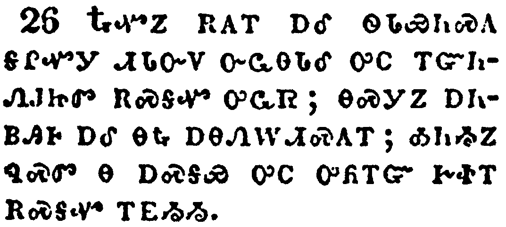</a></td>
</tr>
<tr class="even">
<td>Then goeth he, and taketh to him seven other spirits more wicked than himself; and they enter in, and dwell there: and the last state of that man is worse than the first.</td>
</tr>
<tr class="odd">
<td>ᎿᎭᏉᏃ ᎡᎪᎢ, ᎠᎴ ᏫᏓᏯᏂᏍᎪ ᎦᎵᏉᎩ ᏗᏓᏅᏙ ᏅᏩᎾᏓᎴ ᎤᏟ ᎢᏳᏂᏁᎫᏥᏛ ᎡᏍᎦᏉ ᎤᏩᏒ; ᎾᏍᎩᏃ ᎠᏂᏴᎯᎰ ᎠᎴ ᎾᎿᎭᎠᎾᏁᎳᏗᏍᎪᎢ; ᎣᏂᏱᏃ ᏄᏍᏛ Ꮎ ᎠᏍᎦᏯ ᎤᏟ ᎤᏲᎢᏳ ᎨᏐᎢ ᎡᏍᎦᏉ ᎢᎬᏱᏱ.</td>
</tr>
<tr class="even">
<td>Hna-quo-no e-go-i, a-le wi-da-ya-ni-s-go ga-li-quo-gi di-da-nv-do nv-wa-na-da-le u-tli i-yu-ni-ne-gu-tsi-dv e-s-ga-quo u-wa-sv; na-s-gi-no a-ni-yv-hi-ho a-le na-hna a-na-ne-la-di-s-go-i; o-ni-yi-no nu-s-dv na a-s-ga-ya u-tli u-yo-i-yu ge-so-i e-s-ga-quo i-gv-yi-yi.</td>
</tr>
</tbody>
</table>

<table>
<tbody>
<tr class="odd">
<td><a href="031127.png">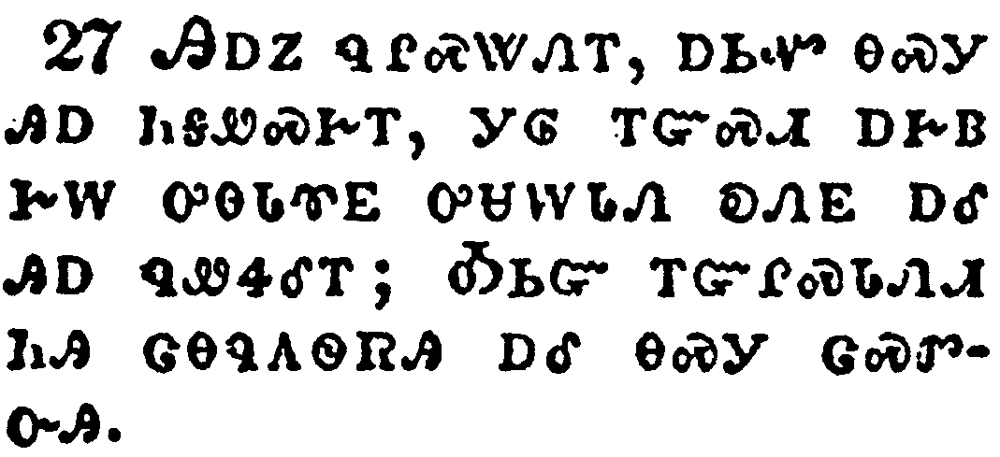</a></td>
</tr>
<tr class="even">
<td>And it came to pass, as he spake these things, a certain woman of the company lifted up her voice, and said unto him, Blessed is the womb that bare thee, and the paps which thou hast sucked.</td>
</tr>
<tr class="odd">
<td>ᎯᎠᏃ ᏄᎵᏍᏔᏁᎢ, ᎠᏏᏉ ᎾᏍᎩ ᎯᎠ ᏂᎦᏪᏍᎨᎢ, ᎩᎶ ᎢᏳᏍᏗ ᎠᎨᏴ ᎨᎳ ᎤᎾᏓᏡᎬ ᎤᏌᎳᏓᏁ ᎧᏁᎬ ᎠᎴ ᎯᎠ ᏄᏪᏎᎴᎢ; ᎣᏏᏳ ᎢᏳᎵᏍᏓᏁᏗ ᏂᎯ ᏣᎾᏄᎪᏫᏒᎯ ᎠᎴ ᎾᏍᎩ ᏣᏍᏛᏅᎯ.</td>
</tr>
<tr class="even">
<td>Hi-a-no nu-li-s-ta-ne-i, a-si-quo na-s-gi hi-a ni-ga-we-s-ge-i, gi-lo i-yu-s-di a-ge-yv ge-la u-na-da-tlu-gv u-sa-la-da-ne ka-ne-gv a-le hi-a nu-we-se-le-i; O-si-yu i-yu-li-s-da-ne-di ni-hi tsa-na-nu-go-wi-sv-hi a-le na-s-gi tsa-s-dv-nv-hi.</td>
</tr>
</tbody>
</table>

<table>
<tbody>
<tr class="odd">
<td><a href="031128.png">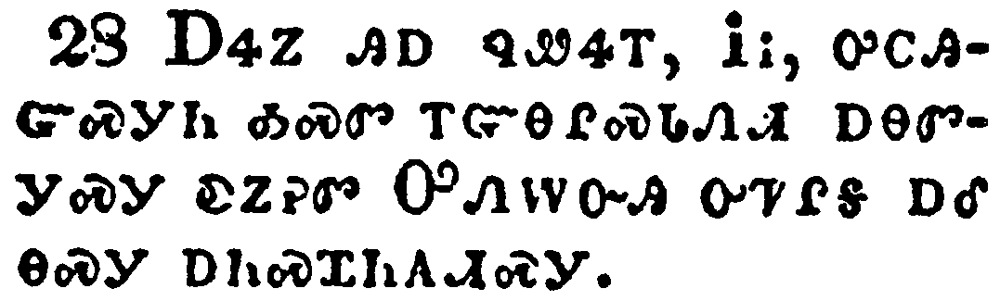</a></td>
</tr>
<tr class="even">
<td>But he said, Yea rather, blessed are they that hear the word of God, and keep it.</td>
</tr>
<tr class="odd">
<td>ᎠᏎᏃ ᎯᎠ ᏄᏪᏎᎢ, ᎥᎥ, ᎤᏟᎯᏳᏍᎩᏂ ᎣᏍᏛ ᎢᏳᎾᎵᏍᏓᏁᏗ ᎠᎾᏛᎩᏍᎩ ᎧᏃᎮᏛ ᎤᏁᎳᏅᎯ ᎤᏤᎵᎦ ᎠᎴ ᎾᏍᎩ ᎠᏂᏍᏆᏂᎪᏗᏍᎩ.</td>
</tr>
<tr class="even">
<td>A-se-no hi-a nu-we-se-i, V-v, u-tli-hi-yu-s-gi-ni o-s-dv i-yu-na-li-s-da-ne-di a-na-dv-gi-s-gi ka-no-he-dv U-ne-la-nv-hi u-tse-li-ga a-le na-s-gi a-ni-s-qua-ni-go-di-s-gi.</td>
</tr>
</tbody>
</table>

<table>
<tbody>
<tr class="odd">
<td><a href="031129.png">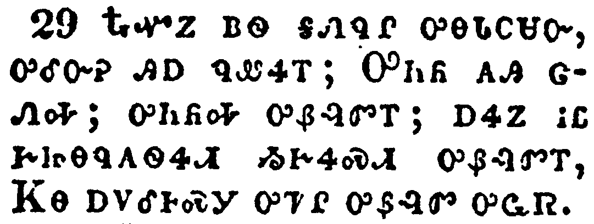</a></td>
</tr>
<tr class="even">
<td>And when the people were gathered thick together, he began to say, This is an evil generation: they seek a sign; and there shall no sign be given it, but the sign of Jonas the prophet.</td>
</tr>
<tr class="odd">
<td>ᎿᎭᏉᏃ ᏴᏫ ᎦᏁᏄᎵ ᎤᎾᏓᏟᏌᏅ, ᎤᎴᏅᎮ ᎯᎠ ᏄᏪᏎᎢ; ᎤᏂᏲ ᎪᎯ ᏣᏁᎭ; ᎤᏂᏲᎭ ᎤᏰᎸᏛᎢ; ᎠᏎᏃ ᎥᏝ ᎨᏥᎾᏄᎪᏫᏎᏗ ᏱᎨᏎᏍᏗ ᎤᏰᎸᏛᎢ, ᏦᎾ ᎠᏙᎴᎰᏍᎩ ᎤᏤᎵ ᎤᏰᎸᏛ ᎤᏩᏒ.</td>
</tr>
<tr class="even">
<td>Hna-quo-no yv-wi ga-ne-nu-li u-na-da-tli-sa-nv, u-le-nv-he hi-a nu-we-se-i; U-ni-yo go-hi tsa-ne-ha; u-ni-yo-ha u-ye-lv-dv-i; a-se-no v-tla ge-tsi-na-nu-go-wi-se-di yi-ge-se-s-di u-ye-lv-dv-i, Tso-na a-do-le-ho-s-gi u-tse-li u-ye-lv-dv u-wa-sv.</td>
</tr>
</tbody>
</table>

<table>
<tbody>
<tr class="odd">
<td><a href="031130.png">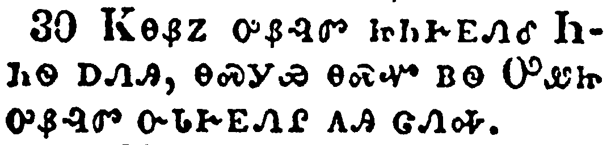</a></td>
</tr>
<tr class="even">
<td>For as Jonas was a sign unto the Ninevites, so shall also the Son of man be to this generation.</td>
</tr>
<tr class="odd">
<td>ᏦᎾᏰᏃ ᎤᏰᎸᏛ ᏥᏂᎨᎬᏁᎴ ᏂᏂᏫ ᎠᏁᎯ, ᎾᏍᎩᏯ ᎾᏍᏉ ᏴᏫ ᎤᏪᏥ ᎤᏰᎸᏛ ᏅᏓᎨᎬᏁᎵ ᎪᎯ ᏣᏁᎭ.</td>
</tr>
<tr class="even">
<td>Tso-na-ye-no u-ye-lv-dv tsi-ni-ge-gv-ne-le Ni-ni-wi a-ne-hi, na-s-gi-ya na-s-quo yv-wi U-we-tsi u-ye-lv-dv nv-da-ge-gv-ne-li go-hi tsa-ne-ha.</td>
</tr>
</tbody>
</table>

<table>
<tbody>
<tr class="odd">
<td><a href="031131.png">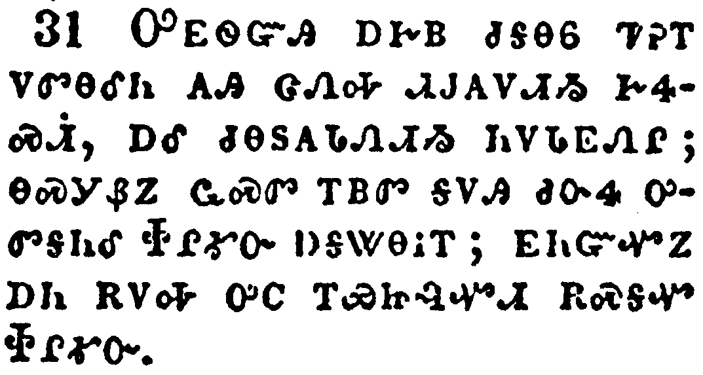</a></td>
</tr>
<tr class="even">
<td>The queen of the south shall rise up in the judgment with the men of this generation, and condemn them: for she came from the utmost parts of the earth to hear the wisdom of Solomon; and, behold, a greater than Solomon is here.</td>
</tr>
<tr class="odd">
<td>ᎤᎬᏫᏳᎯ ᎠᎨᏴ ᏧᎦᎾᏮ ᏤᎮᎢ ᏙᏛᎾᎴᏂ ᎪᎯ ᏣᏁᎭ ᏗᎫᎪᏙᏗᏱ ᎨᏎᏍᏗ, ᎠᎴ ᏧᎾᏚᎪᏓᏁᏗᏱ ᏂᏙᏓᎬᏁᎵ; ᎾᏍᎩᏰᏃ ᏩᏍᏛ ᎢᏴᏛ ᎦᏙᎯ ᏧᏅᏎ ᎤᏛᎦᏂᎴ ᏐᎵᎹᏅ ᎠᎦᏔᎾᎥᎢ; ᎬᏂᏳᏉᏃ ᎠᏂ ᎡᏙᎭ ᎤᏟ ᎢᏯᏥᎸᏉᏗ ᎡᏍᎦᏉ ᏐᎵᎹᏅ.</td>
</tr>
<tr class="even">
<td>U-gv-wi-yu-hi a-ge-yv tsu-ga-na-wv tse-he-i do-dv-na-le-ni go-hi tsa-ne-ha di-gu-go-do-di-yi ge-se-s-di, a-le tsu-na-du-go-da-ne-di-yi ni-do-da-gv-ne-li; na-s-gi-ye-no wa-s-dv i-yv-dv ga-do-hi tsu-nv-se u-dv-ga-ni-le So-li-ma-nv a-ga-ta-na-v-i; gv-ni-yu-quo-no a-ni e-do-ha u-tli i-ya-tsi-lv-quo-di e-s-ga-quo So-li-ma-nv.</td>
</tr>
</tbody>
</table>

<table>
<tbody>
<tr class="odd">
<td><a href="031132.png">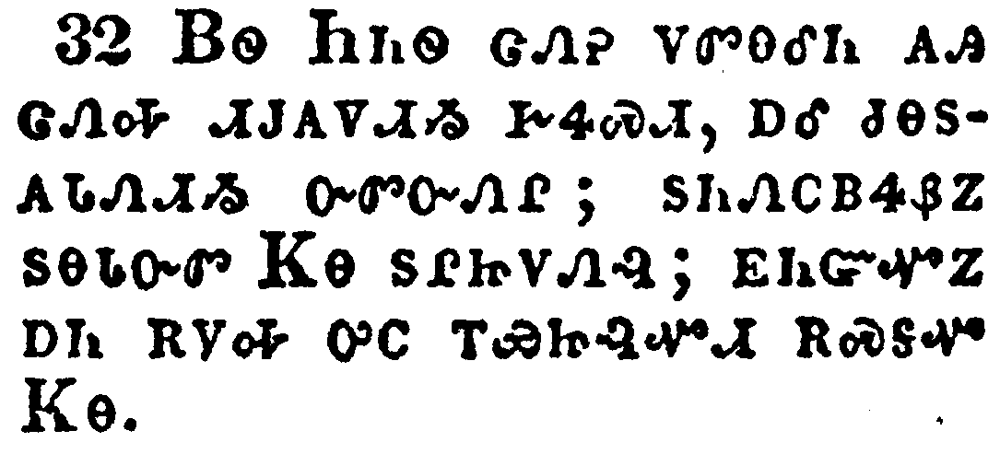</a></td>
</tr>
<tr class="even">
<td>The men of Nineve shall rise up in the judgment with this generation, and shall condemn it: for they repented at the preaching of Jonas; and, behold, a greater than Jonas is here.</td>
</tr>
<tr class="odd">
<td>ᏴᏫ ᏂᏂᏫ ᏣᏁᎮ ᏙᏛᎾᎴᏂ ᎪᎯ ᏣᏁᎭ ᏗᎫᎪᏗᏱ ᎨᏎᏍᏗ, ᎠᎴ ᏧᎾᏚᎪᏓᏁᏗᏱ ᏅᏛᏅᏁᎵ; ᏚᏂᏁᏟᏴᏎᏰᏃ ᏚᎾᏓᏅᏛ ᏦᎾ ᏚᎵᏥᏙᏁᎸ; ᎬᏂᏳᏉᏃ ᎠᏂ ᎡᏙᎭ ᎤᏟ ᎢᏯᏥᎸᏉᏗ ᎡᏍᎦᏉ ᏦᎾ.</td>
</tr>
<tr class="even">
<td>Yv-wi Ni-ni-wi tsa-ne-he do-dv-na-le-ni go-hi tsa-ne-ha di-gu-go-di-yi ge-se-s-di, a-le tsu-na-du-go-da-ne-di-yi nv-dv-nv-ne-li; du-ni-ne-tli-yv-se-ye-no du-na-da-nv-dv Tso-na du-li-tsi-do-ne-lv; gv-ni-yu-quo-no a-ni e-do-ha u-tli i-ya-tsi-lv-quo-di e-s-ga-quo Tso-na.</td>
</tr>
</tbody>
</table>

<table>
<tbody>
<tr class="odd">
<td><a href="031133.png">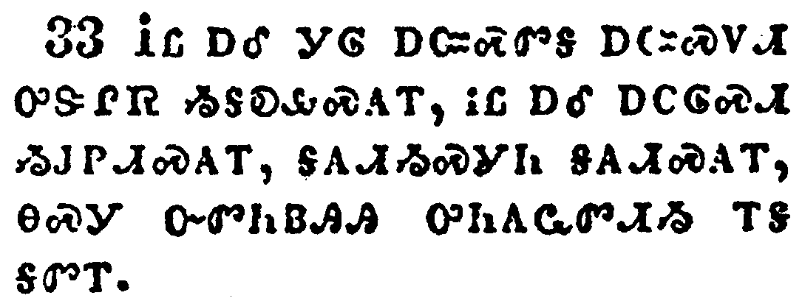</a></td>
</tr>
<tr class="even">
<td>No man, when he hath lighted a candle, putteth it in a secret place, neither under a bushel, but on a candlestick, that they which come in may see the light.</td>
</tr>
<tr class="odd">
<td>ᎥᏝ ᎠᎴ ᎩᎶ ᎠᏨᏍᏛᎦ ᎠᏨᏍᏙᏗ ᎤᏕᎵᏒ ᏱᎦᎧᎲᏍᎪᎢ, ᎥᏝ ᎠᎴ ᎠᏟᎶᏍᏗ ᏱᎫᏢᏗᏍᎪᎢ, ᎦᎪᏗᏱᏍᎩᏂ ᎦᎪᏗᏍᎪᎢ, ᎾᏍᎩ ᏅᏛᏂᏴᎯᎯ ᎤᏂᎪᏩᏛᏗᏱ ᎢᎦ ᎦᏛᎢ.</td>
</tr>
<tr class="even">
<td>V-tla a-le gi-lo a-tsv-s-dv-ga a-tsv-s-do-di u-de-li-sv yi-ga-ka-hv-s-go-i, v-tla a-le a-tli-lo-s-di yi-gu-tlv-di-s-go-i, ga-go-di-yi-s-gi-ni ga-go-di-s-go-i, na-s-gi nv-dv-ni-yv-hi-hi u-ni-go-wa-dv-di-yi i-ga ga-dv-i.</td>
</tr>
</tbody>
</table>

<table>
<tbody>
<tr class="odd">
<td><a href="031134.png">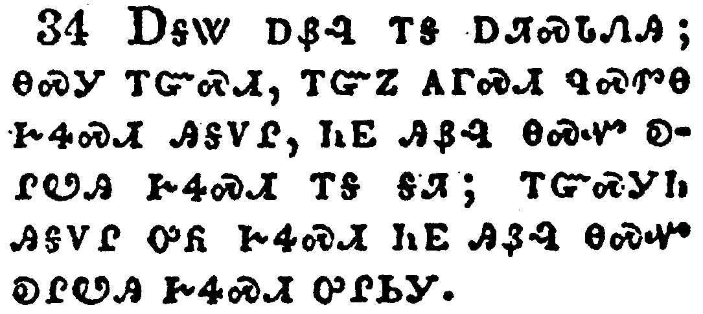</a></td>
</tr>
<tr class="even">
<td>The light of the body is the eye: therefore when thine eye is single, thy whole body also is full of light; but when thine eye is evil, thy body also is full of darkness.</td>
</tr>
<tr class="odd">
<td>ᎠᎦᏔ ᎠᏰᎸ ᎢᎦ ᎠᏘᏍᏓᏁᎯ; ᎾᏍᎩ ᎢᏳᏍᏗ, ᎢᏳᏃ ᎪᎱᏍᏗ ᏄᏍᏛᎾ ᎨᏎᏍᏗ ᎯᎦᏙᎵ, ᏂᎬ ᎯᏰᎸ ᎾᏍᏉ ᎧᎵᏬᎯ ᎨᏎᏍᏗ ᎢᎦ ᎦᏘ; ᎢᏳᏍᎩᏂ ᎯᎦᏙᎵ ᎤᏲ ᎨᏎᏍᏗ ᏂᎬ ᎯᏰᎸ ᎾᏍᏉ ᎧᎵᏬᎯ ᎨᏎᏍᏗ ᎤᎵᏏᎩ.</td>
</tr>
<tr class="even">
<td>A-ga-ta a-ye-lv i-ga a-ti-s-da-ne-hi; na-s-gi i-yu-s-di, i-yu-no go-hu-s-di nu-s-dv-na ge-se-s-di hi-ga-do-li, ni-gv hi-ye-lv na-s-quo ka-li-wo-hi ge-se-s-di i-ga ga-ti; i-yu-s-gi-ni hi-ga-do-li u-yo ge-se-s-di ni-gv hi-ye-lv na-s-quo ka-li-wo-hi ge-se-s-di u-li-si-gi.</td>
</tr>
</tbody>
</table>

<table>
<tbody>
<tr class="odd">
<td><a href="031135.png">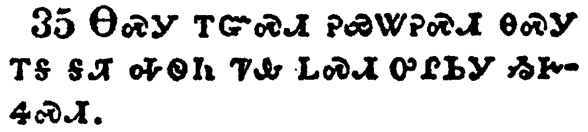</a></td>
</tr>
<tr class="even">
<td>Take heed therefore that the light which is in thee be not darkness.</td>
</tr>
<tr class="odd">
<td>ᎾᏍᎩ ᎢᏳᏍᏗ ᎮᏯᏔᎮᏍᏗ ᎾᏍᎩ ᎢᎦ ᎦᏘ ᎭᏫᏂ ᏤᎲ ᏞᏍᏗ ᎤᎵᏏᎩ ᏱᎨᏎᏍᏗ.</td>
</tr>
<tr class="even">
<td>Na-s-gi i-yu-s-di he-ya-ta-he-s-di na-s-gi i-ga ga-ti ha-wi-ni tse-hv tle-s-di u-li-si-gi yi-ge-se-s-di.</td>
</tr>
</tbody>
</table>

<table>
<tbody>
<tr class="odd">
<td><a href="031136.png">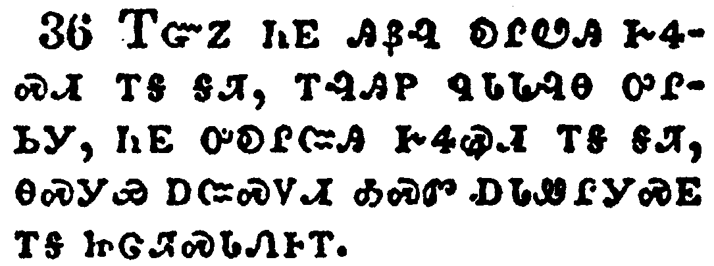</a></td>
</tr>
<tr class="even">
<td>If thy whole body therefore be full of light, having no part dark, the whole shall be full of light, as when the bright shining of a candle doth give thee light.</td>
</tr>
<tr class="odd">
<td>ᎢᏳᏃ ᏂᎬ ᎯᏰᎸ ᎧᎵᏬᎯ ᎨᏎᏍᏗ ᎢᎦ ᎦᏘ, ᎢᎸᎯᏢ ᏄᏓᏓᎸᎾ ᎤᎵᏏᎩ, ᏂᎬ ᎤᎧᎵᏨᎯ ᎨᏎᏍᏗ ᎢᎦ ᎦᏘ, ᎾᏍᎩᏯ ᎠᏨᏍᏙᏗ ᎣᏍᏛ ᎠᏓᏪᎵᎩᏍᎬ ᎢᎦ ᏥᏣᏘᏍᏓᏁᎰᎢ.</td>
</tr>
<tr class="even">
<td>I-yu-no ni-gv hi-ye-lv ka-li-wo-hi ge-se-s-di i-ga ga-ti, i-lv-hi-tlv nu-da-da-lv-na u-li-si-gi, ni-gv u-ka-li-tsv-hi ge-se-s-di i-ga ga-ti, na-s-gi-ya a-tsv-s-do-di o-s-dv a-da-we-li-gi-s-gv i-ga tsi-tsa-ti-s-da-ne-ho-i.</td>
</tr>
</tbody>
</table>

<table>
<tbody>
<tr class="odd">
<td><a href="031137.png">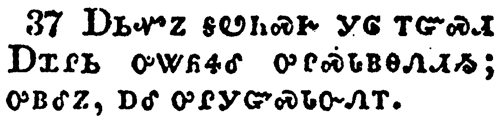</a></td>
</tr>
<tr class="even">
<td>And as he spake, a certain Pharisee besought him to dine with him: and he went in, and sat down to meat.</td>
</tr>
<tr class="odd">
<td>ᎠᏏᏉᏃ ᎦᏬᏂᏍᎨ ᎩᎶ ᎢᏳᏍᏗ ᎠᏆᎵᏏ ᎤᏔᏲᏎᎴ ᎤᎵᏍᏓᏴᎾᏁᏗᏱ; ᎤᏴᎴᏃ, ᎠᎴ ᎤᎵᎩᏳᏍᏓᏅᏁᎢ.</td>
</tr>
<tr class="even">
<td>A-si-quo-no ga-wo-ni-s-ge gi-lo i-yu-s-di A-qua-li-si u-ta-yo-se-le u-li-s-da-yv-na-ne-di-yi; u-yv-le-no, a-le u-li-gi-yu-s-da-nv-ne-i.</td>
</tr>
</tbody>
</table>

<table>
<tbody>
<tr class="odd">
<td><a href="031138.png">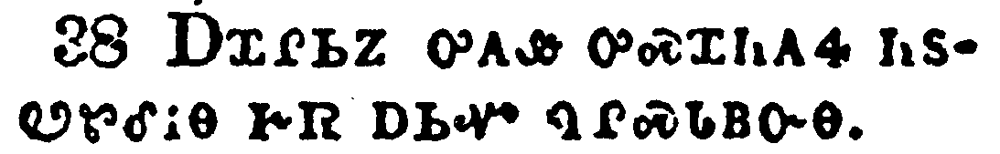</a></td>
</tr>
<tr class="even">
<td>And when the Pharisee saw it, he marvelled that he had not first washed before dinner.</td>
</tr>
<tr class="odd">
<td>ᎠᏆᎵᏏᏃ ᎤᎪᎲ ᎤᏍᏆᏂᎪᏎ ᏂᏚᏬᏑᎴᎥᎾ ᎨᏒ ᎠᏏᏉ ᏄᎵᏍᏓᏴᏅᎾ.</td>
</tr>
<tr class="even">
<td>A-qua-li-si-no u-go-hv u-s-qua-ni-go-se ni-du-wo-su-le-v-na ge-sv a-si-quo nu-li-s-da-yv-nv-na.</td>
</tr>
</tbody>
</table>

<table>
<tbody>
<tr class="odd">
<td><a href="031139.png">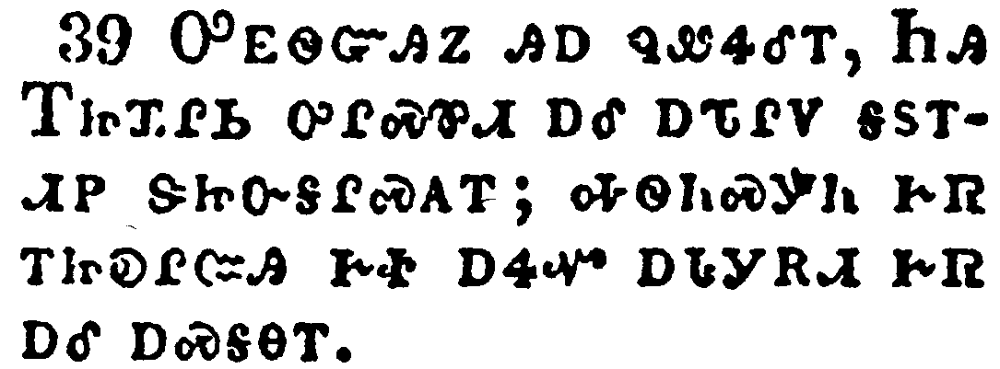</a></td>
</tr>
<tr class="even">
<td>And the Lord said unto him, Now do ye Pharisees make clean the outside of the cup and the platter; but your inward part is full of ravening and wickedness.</td>
</tr>
<tr class="odd">
<td>ᎤᎬᏫᏳᎯᏃ ᎯᎠ ᏄᏪᏎᎴᎢ, ᏂᎯ ᎢᏥᏆᎵᏏ ᎤᎵᏍᏈᏗ ᎠᎴ ᎠᏖᎵᏙ ᎦᏚᎢᏗᏢ ᏕᏥᏅᎦᎵᏍᎪᎢ; ᎭᏫᏂᏍᎩᏂ ᎨᏒ ᎢᏥᎧᎵᏨᎯ ᎨᏐ ᎠᏎᏉ ᎠᏓᎩᎡᏗ ᎨᏒ ᎠᎴ ᎠᏍᎦᎾᎢ.</td>
</tr>
<tr class="even">
<td>U-gv-wi-yu-hi-no hi-a nu-we-se-le-i, Ni-hi I-tsi-qua-li-si u-li-s-qui-di a-le a-te-li-do ga-du-i-di-tlv de-tsi-nv-ga-li-s-go-i; ha-wi-ni-s-gi-ni ge-sv i-tsi-ka-li-tsv-hi ge-so a-se-quo a-da-gi-e-di ge-sv a-le a-s-ga-na-i.</td>
</tr>
</tbody>
</table>

<table>
<tbody>
<tr class="odd">
<td><a href="031140.png">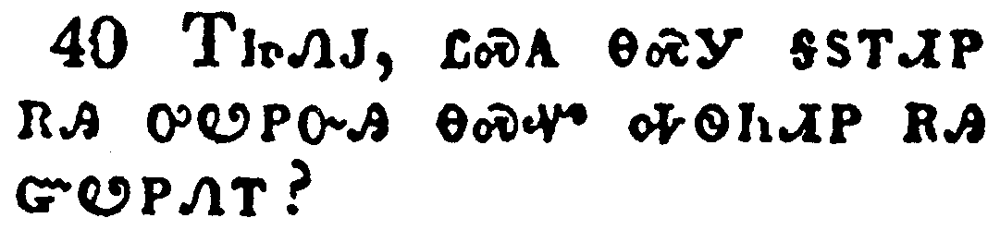</a></td>
</tr>
<tr class="even">
<td>Ye fools, did not he that made that which is without make that which is within also?</td>
</tr>
<tr class="odd">
<td>ᎢᏥᏁᎫ, ᏝᏍᎪ ᎾᏍᎩ ᎦᏚᎢᏗᏢ ᎡᎯ ᎤᏬᏢᏅᎯ ᎾᏍᏉ ᎭᏫᏂᏗᏢ ᎡᎯ ᏳᏬᏢᏁᎢ?</td>
</tr>
<tr class="even">
<td>I-tsi-ne-gu, tla-s-go na-s-gi ga-du-i-di-tlv e-hi u-wo-tlv-nv-hi na-s-quo ha-wi-ni-di-tlv e-hi yu-wo-tlv-ne-i?</td>
</tr>
</tbody>
</table>

<table>
<tbody>
<tr class="odd">
<td><a href="031141.png">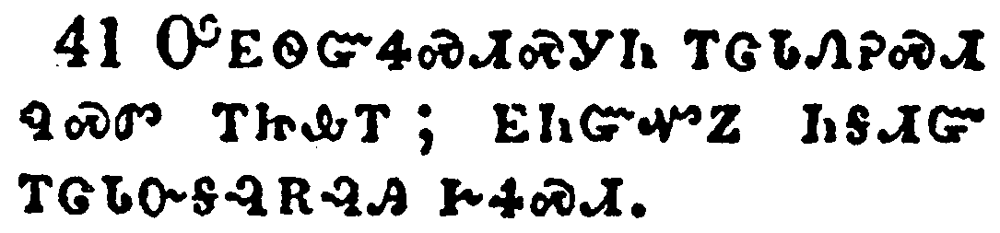</a></td>
</tr>
<tr class="even">
<td>But rather give alms of such things as ye have; and, behold, all things are clean unto you.</td>
</tr>
<tr class="odd">
<td>ᎤᎬᏫᏳᏎᏍᏗᏍᎩᏂ ᎢᏣᏓᏁᎮᏍᏗ ᏄᏍᏛ ᎢᏥᎲᎢ; ᎬᏂᏳᏉᏃ ᏂᎦᏗᏳ ᎢᏣᏓᏅᎦᎸᎡᎸᎯ ᎨᏎᏍᏗ.</td>
</tr>
<tr class="even">
<td>U-gv-wi-yu-se-s-di-s-gi-ni i-tsa-da-ne-he-s-di nu-s-dv i-tsi-hv-i; gv-ni-yu-quo-no ni-ga-di-yu i-tsa-da-nv-ga-lv-e-lv-hi ge-se-s-di.</td>
</tr>
</tbody>
</table>

<table>
<tbody>
<tr class="odd">
<td><a href="031142.png">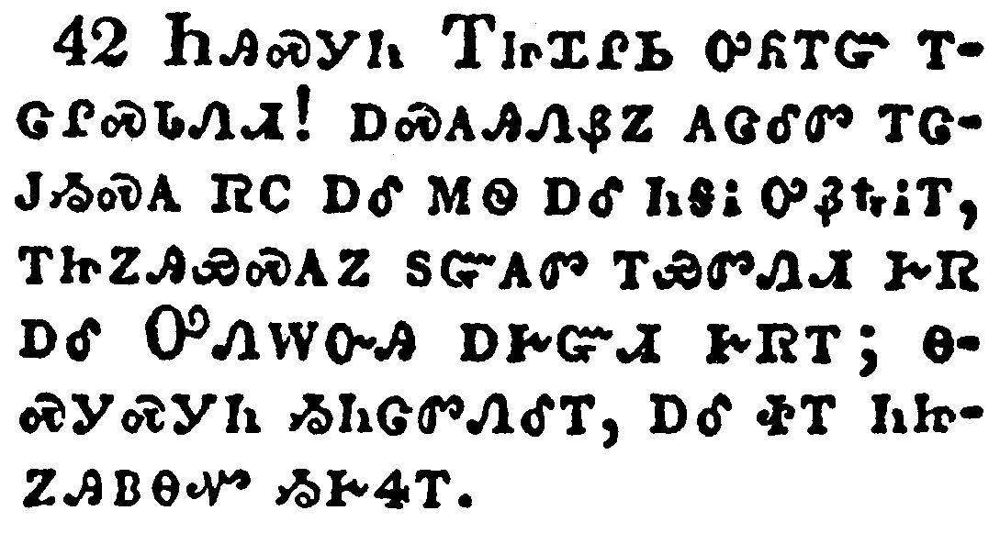</a></td>
</tr>
<tr class="even">
<td>But woe unto you, Pharisees! for ye tithe mint and rue and all manner of herbs, and pass over judgment and the love of God: these ought ye to have done, and not to leave the other undone.</td>
</tr>
<tr class="odd">
<td>ᏂᎯᏍᎩᏂ ᎢᏥᏆᎵᏏ ᎤᏲᎢᏳ ᎢᏣᎵᏍᏓᏁᏗ! ᎠᏍᎪᎯᏁᏰᏃ ᎪᏣᎴᏛ ᎢᏣᎫᏱᏍᎪ ᏒᏟ ᎠᏟ ᎷᏫ ᎠᎴ ᏂᎦᎥ ᎤᏰᎿᎭᎥᎢ, ᎢᏥᏃᎯᏯᏍᎪᏃ ᏚᏳᎪᏛ ᎢᏯᏛᏁᏗ ᎨᏒ ᎠᎴ ᎤᏁᎳᏅᎯ ᎠᎨᏳᏗ ᎨᏒᎢ; ᎾᏍᎩᏍᎩᏂ ᏱᏂᏣᏛᏁᎴᎢ, ᎠᎴ ᏐᎢ ᏂᏥᏃᎯᏴᎾᏉ ᏱᎨᏎᎢ.</td>
</tr>
<tr class="even">
<td>Ni-hi-s-gi-ni I-tsi-qua-li-si u-yo-i-yu i-tsa-li-s-da-ne-di! A-s-go-hi-ne-ye-no go-tsa-le-dv i-tsa-gu-yi-s-go sv-tli a-tli lu-wi a-le ni-ga-v U-ye-hna-v-i, i-tsi-no-hi-ya-s-go-no du-yu-go-dv i-ya-dv-ne-di ge-sv a-le U-ne-la-nv-hi a-ge-yu-di ge-sv-i; na-s-gi-s-gi-ni yi-ni-tsa-dv-ne-le-i, a-le so-i ni-tsi-no-hi-yv-na-quo yi-ge-se-i.</td>
</tr>
</tbody>
</table>

<table>
<tbody>
<tr class="odd">
<td><a href="031143.png">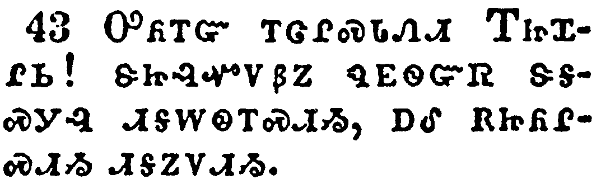</a></td>
</tr>
<tr class="even">
<td>Woe unto you, Pharisees! for ye love the uppermost seats in the synagogues, and greetings in the markets.</td>
</tr>
<tr class="odd">
<td>ᎤᏲᎢᏳ ᎢᏣᎵᏍᏓᏁᏗ ᎢᏥᏆᎵᏏ! ᏕᏥᎸᏉᏙᏰᏃ ᏄᎬᏫᏳᏒ ᏕᎦᏍᎩᎸ ᏗᎦᎳᏫᎢᏍᏗᏱ, ᎠᎴ ᎡᏥᏲᎵᏍᏗᏱ ᏗᎦᏃᏙᏗᏱ.</td>
</tr>
<tr class="even">
<td>U-yo-i-yu i-tsa-li-s-da-ne-di I-tsi-qua-li-si! de-tsi-lv-quo-do-ye-no nu-gv-wi-yu-sv de-ga-s-gi-lv di-ga-la-wi-i-s-di-yi, a-le e-tsi-yo-li-s-di-yi di-ga-no-do-di-yi.</td>
</tr>
</tbody>
</table>

<table>
<tbody>
<tr class="odd">
<td><a href="031144.png">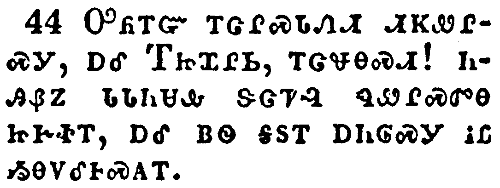</a></td>
</tr>
<tr class="even">
<td>Woe unto you, scribes and Pharisees, hypocrites! for ye are as graves which appear not, and the men that walk over them are not aware of them.</td>
</tr>
<tr class="odd">
<td>ᎣᏲᎢᏳᎢᏣᎵᏍᏓᏁᏗ ᏗᏦᏪᎵᏍᎩ, ᎠᎴ ᎢᏥᏆᎵᏏ, ᎢᏣᏠᎾᏍᏗ! ᏂᎯᏰᏃ ᏓᏓᏂᏌᎲ ᏕᏣᏤᎸ ᏄᏪᎵᏍᏛᎾ ᏥᎨᏐᎢ, ᎠᎴ ᏴᏫ ᎦᏚᎢ ᎠᏂᎶᏍᎩ ᎥᏝ ᏱᎾᏙᎴᎰᏍᎪᎢ.</td>
</tr>
<tr class="even">
<td>O-yo-i-yu-i-tsa-li-s-da-ne-di di-tso-we-li-s-gi, a-le I-tsi-qua-li-si, i-tsa-tlo-na-s-di! ni-hi-ye-no da-da-ni-sa-hv de-tsa-tse-lv nu-we-li-s-dv-na tsi-ge-so-i, a-le yv-wi ga-du-i a-ni-lo-s-gi v-tla yi-na-do-le-ho-s-go-i.</td>
</tr>
</tbody>
</table>

<table>
<tbody>
<tr class="odd">
<td><a href="031145.png">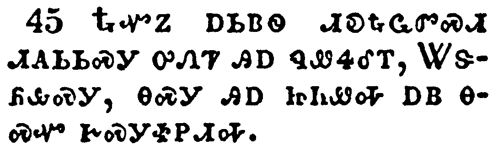</a></td>
</tr>
<tr class="even">
<td>Then answered one of the lawyers, and said unto him, Master, thus saying thou reproachest us also.</td>
</tr>
<tr class="odd">
<td>ᎿᎭᏉᏃ ᎠᏏᏴᏫ ᏗᎧᎿᎭᏩᏛᏍᏗ ᏗᎪᏏᏏᏍᎩ ᎤᏁᏤ ᎯᎠ ᏄᏪᏎᎴᎢ, ᏔᏕᏲᎲᏍᎩ, ᎾᏍᎩ ᎯᎠ ᏥᏂᏪᎭ ᎠᏴ ᎾᏍᏉ ᎨᏍᎩᏐᏢᏗᎭ.</td>
</tr>
<tr class="even">
<td>Hna-quo-no a-si-yv-wi di-ka-hna-wa-dv-s-di di-go-si-si-s-gi u-ne-tse hi-a nu-we-se-le-i, Ta-de-yo-hv-s-gi, na-s-gi hi-a tsi-ni-we-ha a-yv na-s-quo ge-s-gi-so-tlv-di-ha.</td>
</tr>
</tbody>
</table>

<table>
<tbody>
<tr class="odd">
<td><a href="031146.png">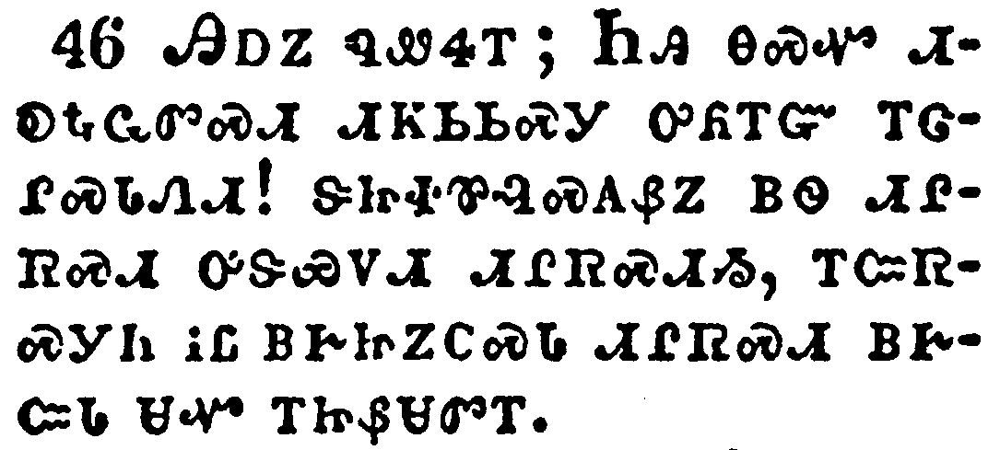</a></td>
</tr>
<tr class="even">
<td>And he said, Woe unto you also, ye lawyers! for ye lade men with burdens grievous to be borne, and ye yourselves touch not the burdens with one of your fingers.</td>
</tr>
<tr class="odd">
<td>ᎯᎠᏃ ᏄᏪᏎᎢ; ᏂᎯ ᎾᏍᏉ ᏗᎧᎿᎭᏩᏛᏍᏗ ᏗᏦᏏᏏᏍᎩ ᎤᏲᎢᏳ ᎢᏣᎵᏍᏓᏁᏗ! ᏕᏥᏐᏈᎸᏍᎪᏰᏃ ᏴᏫ ᏗᎵᏒᏍᏗ ᎤᏕᏯᏙᏗ ᏗᎵᏒᏍᏗᏱ, ᎢᏨᏒᏍᎩᏂ ᎥᏝ ᏴᎨᏥᏃᏟᏍᏓ ᏗᎵᏒᏍᏗ ᏴᎨᏨᏓ ᏌᏉ ᎢᏥᏰᏌᏛᎢ.</td>
</tr>
<tr class="even">
<td>Hi-a-no nu-we-se-i; Ni-hi na-s-quo di-ka-hna-wa-dv-s-di di-tso-si-si-s-gi u-yo-i-yu i-tsa-li-s-da-ne-di! de-tsi-so-qui-lv-s-go-ye-no yv-wi di-li-sv-s-di u-de-ya-do-di di-li-sv-s-di-yi, i-tsv-sv-s-gi-ni v-tla yv-ge-tsi-no-tli-s-da di-li-sv-s-di yv-ge-tsv-da sa-quo i-tsi-ye-sa-dv-i.</td>
</tr>
</tbody>
</table>

<table>
<tbody>
<tr class="odd">
<td></td>
</tr>
<tr class="even">
<td>Woe unto you! for ye build the sepulchres of the prophets, and your fathers killed them.</td>
</tr>
<tr class="odd">
<td>ᎤᏲᎢᏳ ᎢᏣᎵᏍᏓᏁᏗ! ᏕᏦᏢᎯᏏᏍᎪᏰᏃ ᎠᎾᏙᎴᎰᏍᎩ ᏕᎨᏥᏂᏌᎲᎢ, ᎠᎴ ᏗᏥᏙᏓ ᏕᎤᏂᎸᎩ.</td>
</tr>
<tr class="even">
<td>U-yo-i-yu i-tsa-li-s-da-ne-di! de-tso-tlv-hi-si-s-go-ye-no a-na-do-le-ho-s-gi de-ge-tsi-ni-sa-hv-i, a-le di-tsi-do-da de-u-ni-lv-gi.</td>
</tr>
</tbody>
</table>

<table>
<tbody>
<tr class="odd">
<td><a href="031148.png">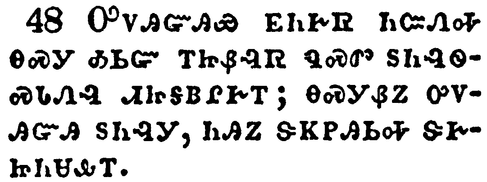</a></td>
</tr>
<tr class="even">
<td>Truly ye bear witness that ye allow the deeds of your fathers: for they indeed killed them, and ye build their sepulchres.</td>
</tr>
<tr class="odd">
<td>ᎤᏙᎯᏳᎯᏯ ᎬᏂᎨᏒ ᏂᏨᏁᎭ ᎾᏍᎩ ᎣᏏᏳ ᎢᏥᏰᎸᏒ ᏄᏍᏛ ᏚᏂᎸᏫᏍᏓᏁᎸ ᏗᏥᎦᏴᎵᎨᎢ; ᎾᏍᎩᏰᏃ ᎤᏙᎯᏳᎯ ᏚᏂᎸᎩ, ᏂᎯᏃ ᏕᏦᏢᎯᏏᎭ ᏕᎨᏥᏂᏎᎲᎢ.</td>
</tr>
<tr class="even">
<td>U-do-hi-yu-hi-ya gv-ni-ge-sv ni-tsv-ne-ha na-s-gi o-si-yu i-tsi-ye-lv-sv nu-s-dv du-ni-lv-wi-s-da-ne-lv di-tsi-ga-yv-li-ge-i; na-s-gi-ye-no u-do-hi-yu-hi du-ni-lv-gi, ni-hi-no de-tso-tlv-hi-si-ha de-ge-tsi-ni-se-hv-i.</td>
</tr>
</tbody>
</table>

<table>
<tbody>
<tr class="odd">
<td><a href="031149.png">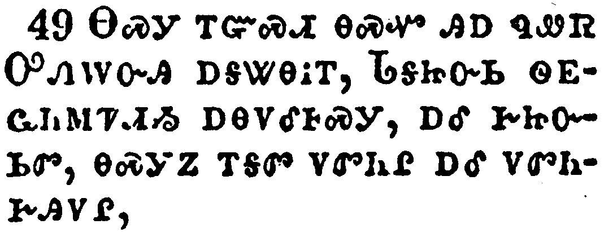</a></td>
</tr>
<tr class="even">
<td>Therefore also said the wisdom of God, I will send them prophets and apostles, and some of them they shall slay and persecute:</td>
</tr>
<tr class="odd">
<td>ᎾᏍᎩ ᎢᏳᏍᏗ ᎾᏍᏉ ᎯᎠ ᏄᏪᏒ ᎤᏁᎳᏅᎯ ᎠᎦᏔᎾᎥᎢ, ᏓᎦᏥᏅᏏ ᏫᎬᏩᏂᎷᏤᏗᏱ ᎠᎾᏙᎴᎰᏍᎩ, ᎠᎴ ᎨᏥᏅᏏᏛ, ᎾᏍᎩᏃ ᎢᎦᏛ ᏙᏛᏂᎵ ᎠᎴ ᏙᏛᏂᎨᎯᏙᎵ,</td>
</tr>
<tr class="even">
<td>Na-s-gi i-yu-s-di na-s-quo hi-a nu-we-sv U-ne-la-nv-hi a-ga-ta-na-v-i, Da-ga-tsi-nv-si wi-gv-wa-ni-lu-tse-di-yi a-na-do-le-ho-s-gi, a-le ge-tsi-nv-si-dv, na-s-gi-no i-ga-dv do-dv-ni-li a-le do-dv-ni-ge-hi-do-li,</td>
</tr>
</tbody>
</table>

<table>
<tbody>
<tr class="odd">
<td><a href="031150.png">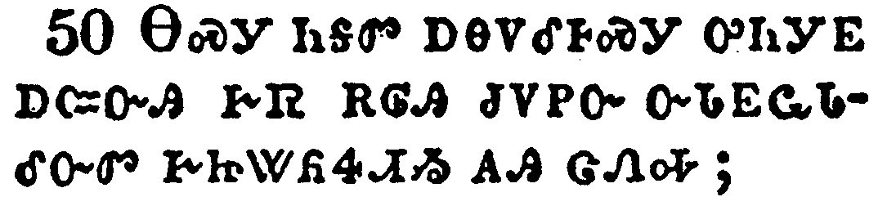</a></td>
</tr>
<tr class="even">
<td>That the blood of all the prophets, which was shed from the foundation of the world, may be required of this generation;</td>
</tr>
<tr class="odd">
<td>ᎾᏍᎩ ᏂᎦᏛ ᎠᎾᏙᎴᎰᏍᎩ ᎤᏂᎩᎬ ᎠᏨᏅᎯ ᎨᏒ ᎡᎶᎯ ᏧᏙᏢᏅ ᏅᏓᎬᏩᏓᎴᏅᏛ ᎨᏥᏔᏲᏎᏗᏱ ᎪᎯ ᏣᏁᎭ;</td>
</tr>
<tr class="even">
<td>Na-s-gi ni-ga-dv a-na-do-le-ho-s-gi u-ni-gi-gv a-tsv-nv-hi ge-sv e-lo-hi tsu-do-tlv-nv nv-da-gv-wa-da-le-nv-dv ge-tsi-ta-yo-se-di-yi go-hi tsa-ne-ha;</td>
</tr>
</tbody>
</table>

<table>
<tbody>
<tr class="odd">
<td><a href="031151.png">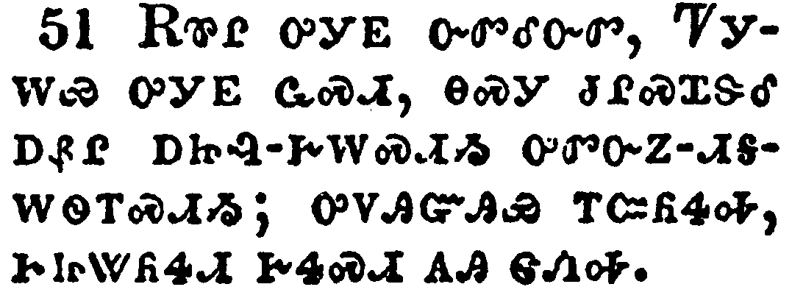</a></td>
</tr>
<tr class="even">
<td>From the blood of Abel unto the blood of Zacharias, which perished between the altar and the temple: verily I say unto you, It shall be required of this generation.</td>
</tr>
<tr class="odd">
<td>ᎡᏈᎵ ᎤᎩᎬ ᏅᏛᎴᏅᏛ, ᏤᎩᎳᏯ ᎤᎩᎬ ᏩᏍᏗ, ᎾᏍᎩ ᏧᎵᏍᏆᏕᎴ ᎠᏰᎵ ᎠᏥᎸ-ᎨᎳᏍᏗᏱ ᎤᏛᏅᏃ-ᏗᎦᎳᏫᎢᏍᏗᏱ; ᎤᏙᎯᏳᎯᏯ ᎢᏨᏲᏎᎭ, ᎨᏥᏔᏲᏎᏗ ᎨᏎᏍᏗ ᎪᎯ ᏣᏁᎭ.</td>
</tr>
<tr class="even">
<td>E-qui-li u-gi-gv nv-dv-le-nv-dv, Tse-gi-la-ya u-gi-gv wa-s-di, na-s-gi tsu-li-s-qua-de-le a-ye-li a-tsi-lv--ge-la-s-di-yi u-dv-nv-no--di-ga-la-wi-i-s-di-yi; u-do-hi-yu-hi-ya i-tsv-yo-se-ha, ge-tsi-ta-yo-se-di ge-se-s-di go-hi tsa-ne-ha.</td>
</tr>
</tbody>
</table>

<table>
<tbody>
<tr class="odd">
<td><a href="031152.png">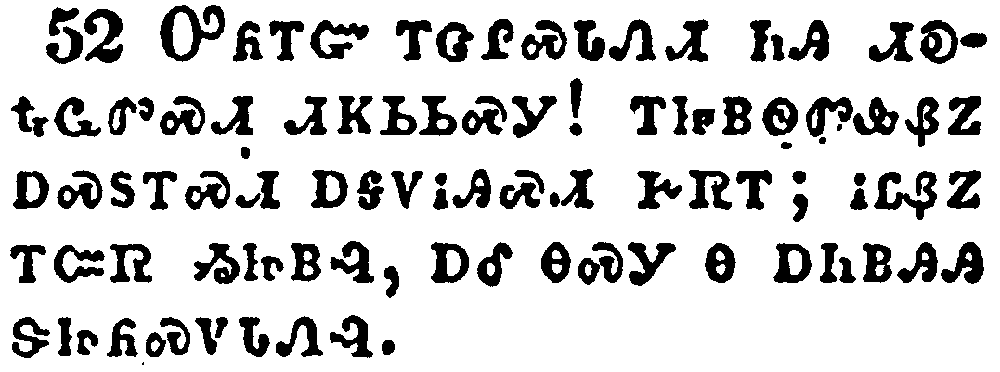</a></td>
</tr>
<tr class="even">
<td>Woe unto you, lawyers! for ye have taken away the key of knowledge: ye entered not in yourselves, and them that were entering in ye hindered.</td>
</tr>
<tr class="odd">
<td>ᎤᏲᎢᏳ ᎢᏣᎵᏍᏓᏁᏗ ᏂᎯ ᏗᎧᎿᎭᏩᏛᏍᏗ ᏗᏦᏏᏏᏍᎩ! ᎢᏥᏴᏫᏛᎲᏰᏃ ᎠᏍᏚᎢᏍᏗ ᎠᎦᏙᎥᎯᏍᏗ ᎨᏒᎢ; ᎥᏝᏰᏃ ᎢᏨᏒ ᏱᏥᏴᎸ, ᎠᎴ ᎾᏍᎩ Ꮎ ᎠᏂᏴᎯᎯ ᏕᏥᏲᏍᏙᏓᏁᎸ.</td>
</tr>
<tr class="even">
<td>U-yo-i-yu i-tsa-li-s-da-ne-di ni-hi di-ka-hna-wa-dv-s-di di-tso-si-si-s-gi! i-tsi-yv-wi-dv-hv-ye-no a-s-du-i-s-di a-ga-do-v-hi-s-di ge-sv-i; v-tla-ye-no i-tsv-sv yi-tsi-yv-lv, a-le na-s-gi na a-ni-yv-hi-hi de-tsi-yo-s-do-da-ne-lv.</td>
</tr>
</tbody>
</table>

<table>
<tbody>
<tr class="odd">
<td></td>
</tr>
<tr class="even">
<td>And as he said these things unto them, the scribes and the Pharisees began to urge him vehemently, and to provoke him to speak of many things:</td>
</tr>
<tr class="odd">
<td>ᎾᏍᎩᏃ ᎯᎠ ᏂᏕᎦᏪᏎᎮᎢ, ᏗᏃᏪᎵᏍᎩ ᎠᎴ ᎠᏂᏆᎵᏏ ᎤᎵᏂᎩᏛ ᎬᏩᏅᏫᏍᏗᏍᎨᎢ, ᎠᎴ ᎬᏩᏂᎳᏕᎮ ᎤᎪᏗᏗ ᏧᏓᎴᏅᏛ ᎤᏃᎮᏗᏱ;</td>
</tr>
<tr class="even">
<td>Na-s-gi-no hi-a ni-de-ga-we-se-he-i, di-no-we-li-s-gi a-le A-ni-qua-li-si u-li-ni-gi-dv gv-wa-nv-wi-s-di-s-ge-i, a-le gv-wa-ni-la-de-he u-go-di-di tsu-da-le-nv-dv u-no-he-di-yi;</td>
</tr>
</tbody>
</table>

<table>
<tbody>
<tr class="odd">
<td><a href="031154.png">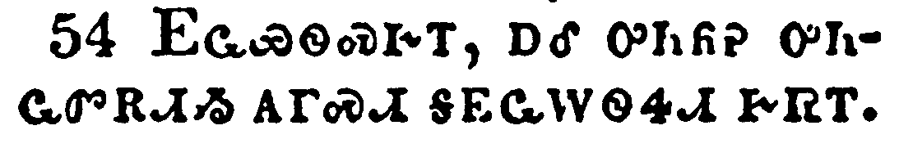</a></td>
</tr>
<tr class="even">
<td>Laying wait for him, and seeking to catch something out of his mouth, that they might accuse him.</td>
</tr>
<tr class="odd">
<td>ᎬᏩᏯᏫᏍᎨᎢ, ᎠᎴ ᎤᏂᏲᎮ ᎤᏂᏩᏛᎡᏗᏱ ᎪᎱᏍᏗ ᎦᎬᏩᎳᏫᏎᏗ ᎨᏒᎢ.</td>
</tr>
<tr class="even">
<td>Gv-wa-ya-wi-s-ge-i, a-le u-ni-yo-he u-ni-wa-dv-e-di-yi go-hu-s-di ga-gv-wa-la-wi-se-di ge-sv-i.</td>
</tr>
</tbody>
</table>

