+++
draft=false
date = 2014-12-18T21:11:07Z
title = "Luke - Chapter 13 - Cherokee New Testament"
weight = 1418955067

[taxonomies]

authors = ["Timothy Legg"]
categories = []
tags = []

[extra]
+++

<table>
<tbody>
<tr class="odd">
<td><a href="031301.png">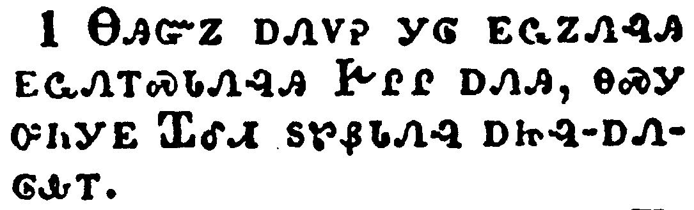</a></td>
</tr>
<tr class="even">
<td>There were present at that season some that told him of the Galilaeans, whose blood Pilate had mingled with their sacrifices.</td>
</tr>
<tr class="odd">
<td>ᎾᏍᎩᏃ ᎠᏁᏙᎮ ᎩᎶ ᎬᏩᏃᏁᎸᎯ ᎬᏩᏁᎢᏍᏓᏁᎸᎯ ᎨᎵᎵ ᎠᏁᎯ, ᎾᏍᎩ ᎤᏂᎩᎬ ᏇᎴᏗ ᏚᏑᏰᏓᏁᎸ ᎠᏥᎸ-ᎠᏁᎶᎲᎢ.</td>
</tr>
<tr class="even">
<td>Na-s-gi-no a-ne-do-he gi-lo gv-wa-no-ne-lv-hi gv-wa-ne-i-s-da-ne-lv-hi Ge-li-li a-ne-hi, na-s-gi u-ni-gi-gv Que-le-di du-su-ye-da-ne-lv a-tsi-lv--a-ne-lo-hv-i.</td>
</tr>
</tbody>
</table>

<table>
<tbody>
<tr class="odd">
<td><a href="031302.png">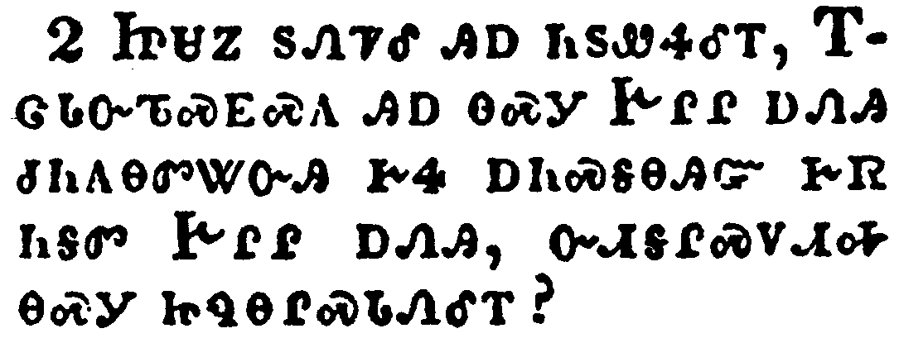</a></td>
</tr>
<tr class="even">
<td>And Jesus answering said unto them, Suppose ye that these Galilaeans were sinners above all the Galilaeans, because they suffered such things?</td>
</tr>
<tr class="odd">
<td>ᏥᏌᏃ ᏚᏁᏤᎴ ᎯᎠ ᏂᏚᏪᏎᎴᎢ, ᎢᏣᏓᏅᏖᏍᎬᏍᎪ ᎯᎠ ᎾᏍᎩ ᎨᎵᎵ ᎠᏁᎯ ᏧᏂᎪᎾᏛᏔᏅᎯ ᎨᏎ ᎠᏂᏍᎦᎾᎯᏳ ᎨᏒ ᏂᎦᏛ ᎨᎵᎵ ᎠᏁᎯ, ᏅᏗᎦᎵᏍᏙᏗᎭ ᎾᏍᎩ ᏥᏄᎾᎵᏍᏓᏁᎴᎢ?</td>
</tr>
<tr class="even">
<td>Tsi-sa-no du-ne-tse-le hi-a ni-du-we-se-le-i, I-tsa-da-nv-te-s-gv-s-go hi-a na-s-gi Ge-li-li a-ne-hi tsu-ni-go-na-dv-ta-nv-hi ge-se a-ni-s-ga-na-hi-yu ge-sv ni-ga-dv Ge-li-li a-ne-hi, nv-di-ga-li-s-do-di-ha na-s-gi tsi-nu-na-li-s-da-ne-le-i?</td>
</tr>
</tbody>
</table>

<table>
<tbody>
<tr class="odd">
<td><a href="031303.png">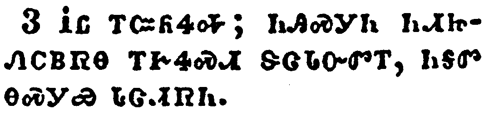</a></td>
</tr>
<tr class="even">
<td>I tell you, Nay: but, except ye repent, ye shall all likewise perish.</td>
</tr>
<tr class="odd">
<td>ᎥᏝ ᎢᏨᏲᏎᎭ; ᏂᎯᏍᎩᏂ ᏂᏗᏥᏁᏟᏴᏒᎾ ᎢᎨᏎᏍᏗ ᏕᏣᏓᏅᏛᎢ, ᏂᎦᏛ ᎾᏍᎩᏯ ᏓᏣᏗᏒᏂ.</td>
</tr>
<tr class="even">
<td>V-tla i-tsv-yo-se-ha; ni-hi-s-gi-ni ni-di-tsi-ne-tli-yv-sv-na i-ge-se-s-di de-tsa-da-nv-dv-i, ni-ga-dv na-s-gi-ya da-tsa-di-sv-ni.</td>
</tr>
</tbody>
</table>

<table>
<tbody>
<tr class="odd">
<td><a href="031304.png">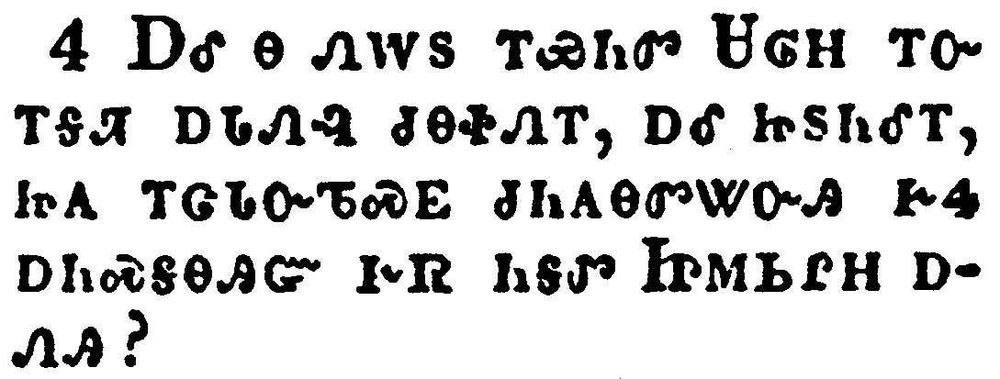</a></td>
</tr>
<tr class="even">
<td>Or those eighteen, upon whom the tower in Siloam fell, and slew them, think ye that they were sinners above all men that dwelt in Jerusalem?</td>
</tr>
<tr class="odd">
<td>ᎠᎴ Ꮎ ᏁᎳᏚ ᎢᏯᏂᏛ ᏌᎶᎻ ᎢᏅᎢᎦᏘ ᎠᏓᏁᎸ ᏧᎾᏐᏁᎢ, ᎠᎴ ᏥᏚᏂᎴᎢ, ᏥᎪ ᎢᏣᏓᏅᏖᏍᎬ ᏧᏂᎪᎾᏛᏔᏅᎯ ᎨᏎ ᎠᏂᏍᎦᎾᎯᏳ ᎨᏒ ᏂᎦᏛ ᏥᎷᏏᎵᎻ ᎠᏁᎯ?</td>
</tr>
<tr class="even">
<td>A-le na ne-la-du i-ya-ni-dv Sa-lo-mi i-nv-i-ga-ti a-da-ne-lv tsu-na-so-ne-i, a-le tsi-du-ni-le-i, tsi-go i-tsa-da-nv-te-s-gv tsu-ni-go-na-dv-ta-nv-hi ge-se a-ni-s-ga-na-hi-yu ge-sv ni-ga-dv Tsi-lu-si-li-mi a-ne-hi?</td>
</tr>
</tbody>
</table>

<table>
<tbody>
<tr class="odd">
<td><a href="031305.png">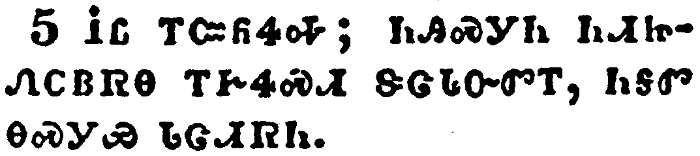</a></td>
</tr>
<tr class="even">
<td>I tell you, Nay: but, except ye repent, ye shall all likewise perish.</td>
</tr>
<tr class="odd">
<td>ᎥᏝ ᎢᏨᏲᏎᎭ; ᏂᎯᏍᎩᏂ ᏂᏗᏥᏁᏟᏴᏒᎾ ᎢᎨᏎᏍᏗ ᏕᏣᏓᏅᏛᎢ, ᏂᎦᏛ ᎾᏍᎩᏯ ᏓᏩᏗᏒᏂ.</td>
</tr>
<tr class="even">
<td>V-tla i-tsv-yo-se-ha; ni-hi-s-gi-ni ni-di-tsi-ne-tli-yv-sv-na i-ge-se-s-di de-tsa-da-nv-dv-i, ni-ga-dv na-s-gi-ya da-wa-di-sv-ni.</td>
</tr>
</tbody>
</table>

<table>
<tbody>
<tr class="odd">
<td><a href="031306.png">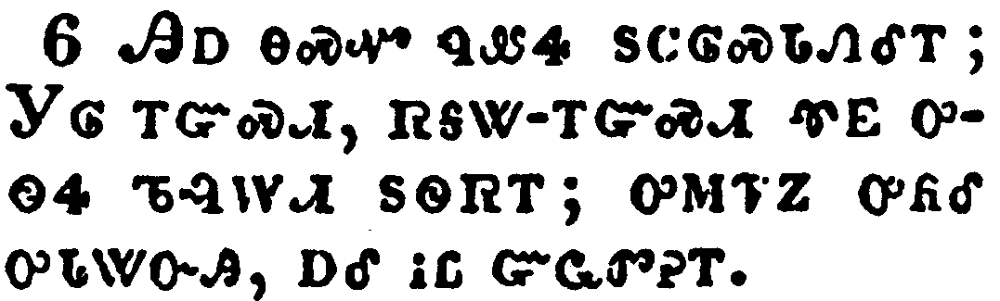</a></td>
</tr>
<tr class="even">
<td>He spake also this parable; A certain man had a fig tree planted in his vineyard; and he came and sought fruit thereon, and found none.</td>
</tr>
<tr class="odd">
<td>ᎯᎠ ᎾᏍᏉ ᏄᏪᏎ ᏚᏟᎶᏍᏓᏁᎴᎢ; ᎩᎶ ᎢᏳᏍᏗ, ᎡᎦᏔ-ᎢᏳᏍᏗ ᏡᎬ ᎤᏫᏎ ᏖᎸᎳᏗ ᏚᏫᏒᎢ; ᎤᎷᏤᏃ ᎤᏲᎴ ᎤᏓᏔᏅᎯ, ᎠᎴ ᎥᏝ ᏳᏩᏛᎮᎢ.</td>
</tr>
<tr class="even">
<td>Hi-a na-s-quo nu-we-se du-tli-lo-s-da-ne-le-i; Gi-lo i-yu-s-di, e-ga-ta--i-yu-s-di tlu-gv u-wi-se te-lv-la-di du-wi-sv-i; u-lu-tse-no u-yo-le u-da-ta-nv-hi, a-le v-tla yu-wa-dv-he-i.</td>
</tr>
</tbody>
</table>

<table>
<tbody>
<tr class="odd">
<td><a href="031307.png">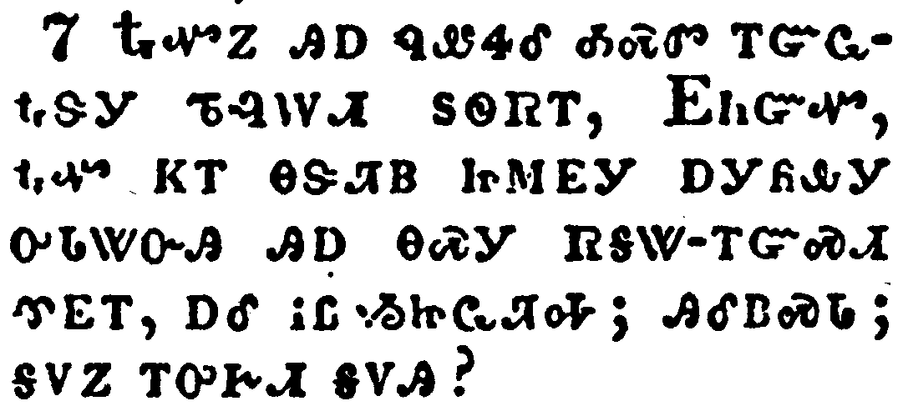</a></td>
</tr>
<tr class="even">
<td>Then said he unto the dresser of his vineyard, Behold, these three years I come seeking fruit on this fig tree, and find none: cut it down; why cumbereth it the ground?</td>
</tr>
<tr class="odd">
<td>ᎿᎭᏉᏃ ᎯᎠ ᏄᏪᏎᎴ ᎣᏍᏛ ᎢᏳᏩᎿᎭᏕᎩ ᏖᎸᎳᏗ ᏚᏫᏒᎢ, ᎬᏂᏳᏉ, ᎿᎭᏉ ᏦᎢ ᎾᏕᏘᏴ ᏥᎷᎬᎩ ᎠᎩᏲᎲᎩ ᎤᏓᏔᏅᎯ ᎯᎠ ᎾᏍᎩ ᎡᎦᏔ-ᎢᏳᏍᏗ ᏡᎬᎢ, ᎠᎴ ᎥᏝ ᏱᏥᏩᏘᎭ; ᎯᎴᏴᏍᏓ; ᎦᏙᏃ ᎢᎤᎨᏗ ᎦᏙᎯ?</td>
</tr>
<tr class="even">
<td>Hna-quo-no hi-a nu-we-se-le o-s-dv i-yu-wa-hna-de-gi te-lv-la-di du-wi-sv-i, Gv-ni-yu-quo, hna-quo tso-i na-de-ti-yv tsi-lu-gv-gi a-gi-yo-hv-gi u-da-ta-nv-hi hi-a na-s-gi e-ga-ta--i-yu-s-di tlu-gv-i, a-le v-tla yi-tsi-wa-ti-ha; hi-le-yv-s-da; ga-do-no i-u-ge-di ga-do-hi?</td>
</tr>
</tbody>
</table>

<table>
<tbody>
<tr class="odd">
<td><a href="031308.png">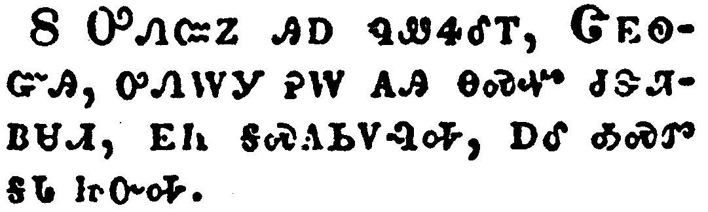</a></td>
</tr>
<tr class="even">
<td>And he answering said unto him, Lord, let it alone this year also, till I shall dig about it, and dung it:</td>
</tr>
<tr class="odd">
<td>ᎤᏁᏨᏃ ᎯᎠ ᏄᏪᏎᎴᎢ, ᏣᎬᏫᏳᎯ, ᎤᏁᎳᎩ ᎮᎳ ᎪᎯ ᎾᏍᏉ ᏧᏕᏘᏴᏌᏗ, ᎬᏂ ᎦᏍᎪᏏᏙᎸᎭ, ᎠᎴ ᎣᏍᏛ ᎦᏓ ᏥᏅᎭ.</td>
</tr>
<tr class="even">
<td>U-ne-tsv-no hi-a nu-we-se-le-i, Tsa-gv-wi-yu-hi, u-ne-la-gi he-la go-hi na-s-quo tsu-de-ti-yv-sa-di, gv-ni ga-s-go-si-do-lv-ha, a-le o-s-dv ga-da tsi-nv-ha.</td>
</tr>
</tbody>
</table>

<table>
<tbody>
<tr class="odd">
<td><a href="031309.png">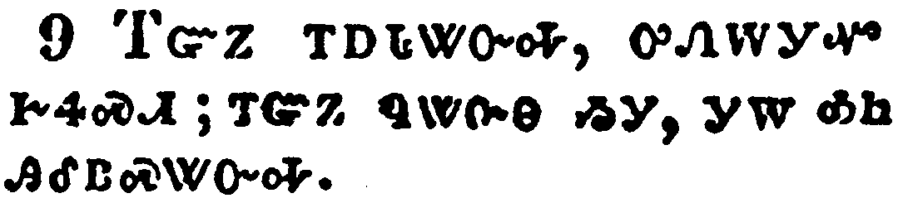</a></td>
</tr>
<tr class="even">
<td>And if it bear fruit, well: and if not, then after that thou shalt cut it down.</td>
</tr>
<tr class="odd">
<td>ᎢᏳᏃ ᎢᎠᏓᏔᏅᎭ, ᎤᏁᎳᎩᏉ ᎨᏎᏍᏗ; ᎢᏳᏃ ᏄᏔᏅᎾ ᏱᎩ, ᎩᎳ ᎣᏂ ᎯᎴᏴᏍᏔᏅᎭ.</td>
</tr>
<tr class="even">
<td>I-yu-no i-a-da-ta-nv-ha, u-ne-la-gi-quo ge-se-s-di; i-yu-no nu-ta-nv-na yi-gi, gi-la o-ni hi-le-yv-s-ta-nv-ha.</td>
</tr>
</tbody>
</table>

<table>
<tbody>
<tr class="odd">
<td><a href="031310.png">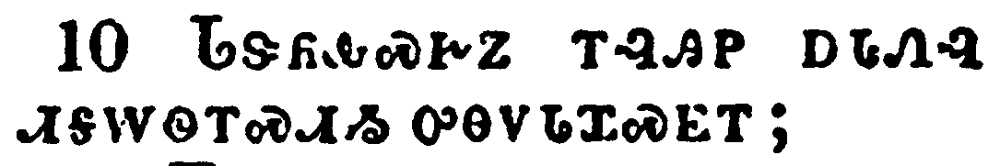</a></td>
</tr>
<tr class="even">
<td>And he was teaching in one of the synagogues on the sabbath.</td>
</tr>
<tr class="odd">
<td>ᏓᏕᏲᎲᏍᎨᏃ ᎢᎸᎯᏢ ᎠᏓᏁᎸ ᏗᎦᎳᏫᎢᏍᏗᏱ ᎤᎾᏙᏓᏆᏍᎬᎢ;</td>
</tr>
<tr class="even">
<td>Da-de-yo-hv-s-ge-no i-lv-hi-tlv a-da-ne-lv di-ga-la-wi-i-s-di-yi u-na-do-da-qua-s-gv-i;</td>
</tr>
</tbody>
</table>

<table>
<tbody>
<tr class="odd">
<td><a href="031311.png">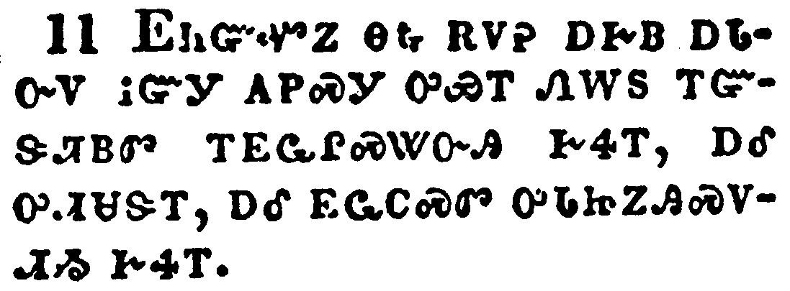</a></td>
</tr>
<tr class="even">
<td>And, behold, there was a woman which had a spirit of infirmity eighteen years, and was bowed together, and could in no wise lift up herself.</td>
</tr>
<tr class="odd">
<td>ᎬᏂᏳᏉᏃ ᎾᎿᎭᎡᏙᎮ ᎠᎨᏴ ᎠᏓᏅᏙ ᎥᏳᎩ ᎪᏢᏍᎩ ᎤᏯᎢ ᏁᎳᏚ ᎢᏳᏕᏘᏴᏛ ᎢᎬᏩᎵᏍᏔᏅᎯ ᎨᏎᎢ, ᎠᎴ ᎤᏗᏌᏕᎢ, ᎠᎴ ᎬᏩᏟᏍᏛ ᎤᎵᏥᏃᎯᏍᏙᏗᏱ ᎨᏎᎢ.</td>
</tr>
<tr class="even">
<td>Gv-ni-yu-quo-no na-hna e-do-he a-ge-yv a-da-nv-do v-yu-gi go-tlv-s-gi u-ya-i ne-la-du i-yu-de-ti-yv-dv i-gv-wa-li-s-ta-nv-hi ge-se-i, a-le u-di-sa-de-i, a-le gv-wa-tli-s-dv u-li-tsi-no-hi-s-do-di-yi ge-se-i.</td>
</tr>
</tbody>
</table>

<table>
<tbody>
<tr class="odd">
<td><a href="031312.png">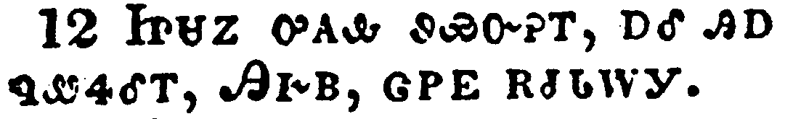</a></td>
</tr>
<tr class="even">
<td>And when Jesus saw her, he called her to him, and said unto her, Woman, thou art loosed from thine infirmity.</td>
</tr>
<tr class="odd">
<td>ᏥᏌᏃ ᎤᎪᎲ ᏭᏯᏅᎮᎢ, ᎠᎴ ᎯᎠ ᏄᏪᏎᎴᎢ, ᎯᎨᏴ, ᏣᏢᎬ ᎡᏧᏓᎳᎩ.</td>
</tr>
<tr class="even">
<td>Tsi-sa-no u-go-hv wu-ya-nv-he-i, a-le hi-a nu-we-se-le-i, Hi-ge-yv, tsa-tlv-gv e-tsu-da-la-gi.</td>
</tr>
</tbody>
</table>

<table>
<tbody>
<tr class="odd">
<td><a href="031313.png">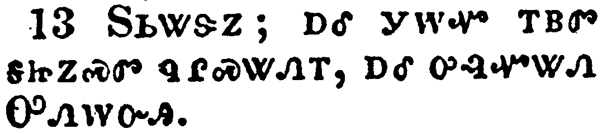</a></td>
</tr>
<tr class="even">
<td>And he laid his hands on her: and immediately she was made straight, and glorified God.</td>
</tr>
<tr class="odd">
<td>ᏚᏏᏔᏕᏃ; ᎠᎴ ᎩᎳᏉ ᎢᏴᏛ ᎦᏥᏃᏍᏛ ᏄᎵᏍᏔᏁᎢ, ᎠᎴ ᎤᎸᏉᏔᏁ ᎤᏁᎳᏅᎯ.</td>
</tr>
<tr class="even">
<td>Du-si-ta-de-no; a-le gi-la-quo i-yv-dv ga-tsi-no-s-dv nu-li-s-ta-ne-i, a-le u-lv-quo-ta-ne U-ne-la-nv-hi.</td>
</tr>
</tbody>
</table>

<table>
<tbody>
<tr class="odd">
<td><a href="031314.png">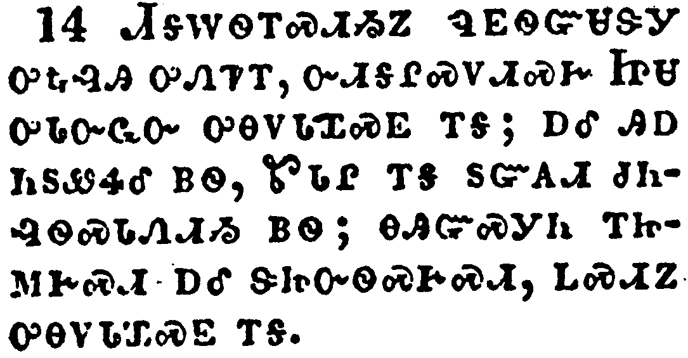</a></td>
</tr>
<tr class="even">
<td>And the ruler of the synagogue answered with indignation, because that Jesus had healed on the sabbath day, and said unto the people, There are six days in which men ought to work: in them therefore come and be healed, and not on the sabbath day.</td>
</tr>
<tr class="odd">
<td>ᏗᎦᎳᏫᎢᏍᏗᏱᏃ ᏄᎬᏫᏳᏌᏕᎩ ᎤᎿᎭᎸᎯ ᎤᏁᏤᎢ, ᏅᏗᎦᎵᏍᏙᏗᏍᎨ ᏥᏌ ᎤᏓᏅᏩᏅ ᎤᎾᏙᏓᏆᏍᎬ ᎢᎦ; ᎠᎴ ᎯᎠ ᏂᏚᏪᏎᎴ ᏴᏫ, ᏑᏓᎵ ᎢᎦ ᏚᏳᎪᏗ ᏧᏂᎸᏫᏍᏓᏁᏗᏱ ᏴᏫ; ᎾᎯᏳᏍᎩᏂ ᎢᏥᎷᎨᏍᏗ ᎠᎴ ᏕᏥᏅᏫᏍᎨᏍᏗ, ᏞᏍᏗᏃ ᎤᎾᏙᏓᏆᏍᎬ ᎢᎦ.</td>
</tr>
<tr class="even">
<td>Di-ga-la-wi-i-s-di-yi-no nu-gv-wi-yu-sa-de-gi u-hna-lv-hi u-ne-tse-i, nv-di-ga-li-s-do-di-s-ge Tsi-sa u-da-nv-wa-nv u-na-do-da-qua-s-gv i-ga; a-le hi-a ni-du-we-se-le yv-wi, Su-da-li i-ga du-yu-go-di tsu-ni-lv-wi-s-da-ne-di-yi yv-wi; na-hi-yu-s-gi-ni i-tsi-lu-ge-s-di a-le de-tsi-nv-wi-s-ge-s-di, tle-s-di-no u-na-do-da-qua-s-gv i-ga.</td>
</tr>
</tbody>
</table>

<table>
<tbody>
<tr class="odd">
<td><a href="031315.png">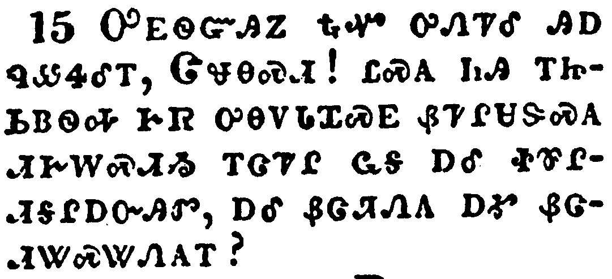</a></td>
</tr>
<tr class="even">
<td>The Lord then answered him, and said, Thou hypocrite, doth not each one of you on the sabbath loose his ox or his ass from the stall, and lead him away to watering?</td>
</tr>
<tr class="odd">
<td>ᎤᎬᏫᏳᎯᏃ ᎿᎭᏉ ᎤᏁᏤᎴ ᎯᎠ ᏄᏪᏎᎴᎢ, ᏣᏠᎾᏍᏗ! ᏝᏍᎪ ᏂᎯ ᎢᏥᏏᏴᏫᎭ ᎨᏒ ᎤᎾᏙᏓᏆᏍᎬ ᏰᏤᎵᏌᏕᏍᎪ ᏗᎨᎳᏍᏗᏱ ᎢᏣᏤᎵ ᏩᎦ ᎠᎴ ᏐᏈᎵᏗᎦᎵᎠᏅᎯᏛ, ᎠᎴ ᏰᏣᏘᏁᎪ ᎠᎹ ᏰᏣᏗᏔᏍᏔᏁᎪᎢ?</td>
</tr>
<tr class="even">
<td>U-gv-wi-yu-hi-no hna-quo u-ne-tse-le hi-a nu-we-se-le-i, Tsa-tlo-na-s-di! tla-s-go ni-hi i-tsi-si-yv-wi-ha ge-sv u-na-do-da-qua-s-gv ye-tse-li-sa-de-s-go di-ge-la-s-di-yi i-tsa-tse-li wa-ga a-le so-qui-li-di-ga-li-a-nv-hi-dv, a-le ye-tsa-ti-ne-go a-ma ye-tsa-di-ta-s-ta-ne-go-i?</td>
</tr>
</tbody>
</table>

<table>
<tbody>
<tr class="odd">
<td><a href="031316.png">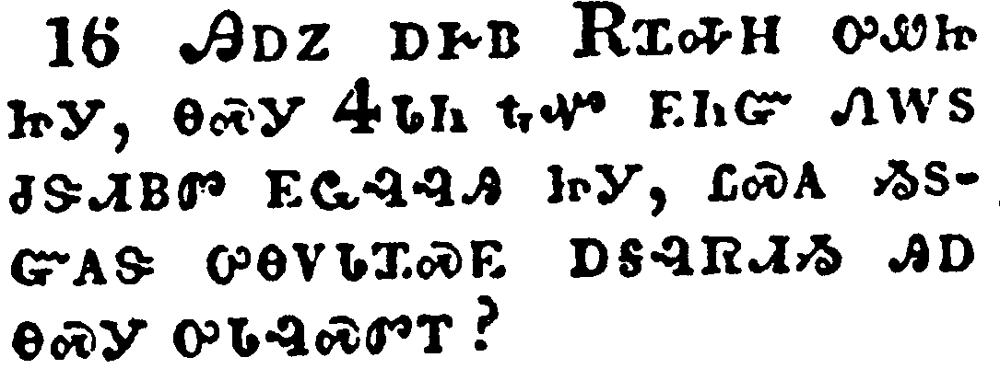</a></td>
</tr>
<tr class="even">
<td>And ought not this woman, being a daughter of Abraham, whom Satan hath bound, lo, these eighteen years, be loosed from this bond on the sabbath day?</td>
</tr>
<tr class="odd">
<td>ᎯᎠᏃ ᎠᎨᏴ ᎡᏆᎭᎻ ᎤᏪᏥ ᏥᎩ, ᎾᏍᎩ ᏎᏓᏂ ᎿᎭᏉ ᎬᏂᏳ ᏁᎳᏚ ᏧᏕᏗᏴᏛ ᎬᏩᎸᎸᎯ ᏥᎩ, ᏝᏍᎪ ᏱᏚᏳᎪᏕ ᎤᎾᏙᏓᏆᏍᎬ ᎠᎦᎸᏒᏗᏱ ᎯᎠ ᎾᏍᎩ ᎤᏓᎸᏍᏛᎢ?</td>
</tr>
<tr class="even">
<td>Hi-a-no a-ge-yv E-qua-ha-mi u-we-tsi tsi-gi, na-s-gi Se-da-ni hna-quo gv-ni-yu ne-la-du tsu-de-di-yv-dv gv-wa-lv-lv-hi tsi-gi, tla-s-go yi-du-yu-go-de u-na-do-da-qua-s-gv a-ga-lv-sv-di-yi hi-a na-s-gi u-da-lv-s-dv-i?</td>
</tr>
</tbody>
</table>

<table>
<tbody>
<tr class="odd">
<td><a href="031317.png">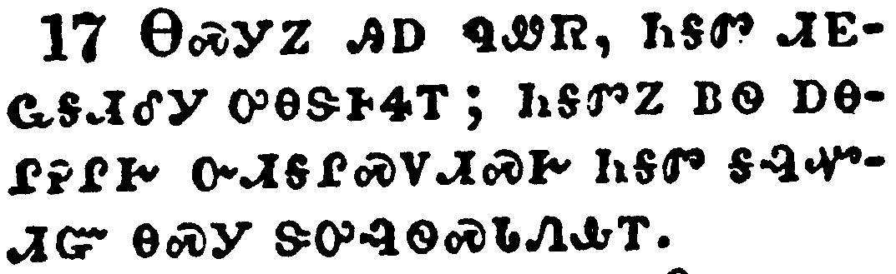</a></td>
</tr>
<tr class="even">
<td>And when he had said these things, all his adversaries were ashamed: and all the people rejoiced for all the glorious things that were done by him.</td>
</tr>
<tr class="odd">
<td>ᎾᏍᎩᏃ ᎯᎠ ᏄᏪᏒ, ᏂᎦᏛ ᏗᎬᏩᎦᏗᎴᎩ ᎤᎾᏕᎰᏎᎢ; ᏂᎦᏛᏃ ᏴᏫ ᎠᎾᎵᎮᎵᎨ ᏅᏗᎦᎵᏍᏙᏗᏍᎨ ᏂᎦᏛ ᎦᎸᏉᏗᏳ ᎾᏍᎩ ᏕᎤᎸᏫᏍᏓᏁᎲᎢ.</td>
</tr>
<tr class="even">
<td>Na-s-gi-no hi-a nu-we-sv, ni-ga-dv di-gv-wa-ga-di-le-gi u-na-de-ho-se-i; ni-ga-dv-no yv-wi a-na-li-he-li-ge nv-di-ga-li-s-do-di-s-ge ni-ga-dv ga-lv-quo-di-yu na-s-gi de-u-lv-wi-s-da-ne-hv-i.</td>
</tr>
</tbody>
</table>

<table>
<tbody>
<tr class="odd">
<td><a href="031318.png">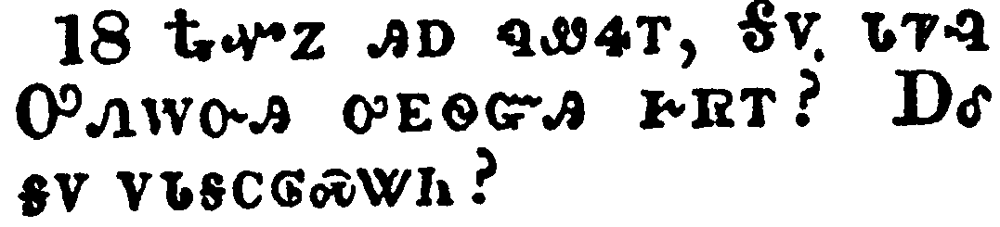</a></td>
</tr>
<tr class="even">
<td>Then said he, Unto what is the kingdom of God like? and whereunto shall I resemble it?</td>
</tr>
<tr class="odd">
<td>ᎿᎭᏉᏃ ᎯᎠ ᏄᏪᏎᎢ, ᎦᏙ ᏓᏤᎸ ᎤᏁᎳᏅᎯ ᎤᎬᏫᏳᎯ ᎨᏒᎢ? ᎠᎴ ᎦᏙ ᏙᏓᎦᏟᎶᏍᏔᏂ?</td>
</tr>
<tr class="even">
<td>Hna-quo-no hi-a nu-we-se-i, Ga-do da-tse-lv U-ne-la-nv-hi u-gv-wi-yu-hi ge-sv-i? A-le ga-do do-da-ga-tli-lo-s-ta-ni?</td>
</tr>
</tbody>
</table>

<table>
<tbody>
<tr class="odd">
<td><a href="031319.png">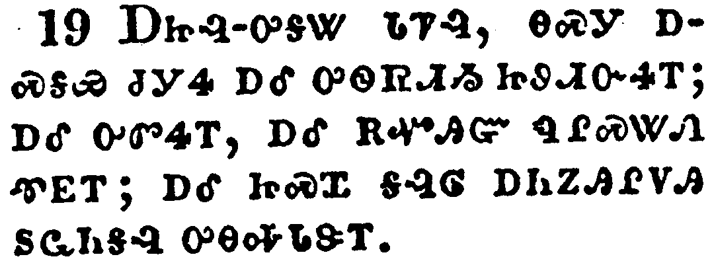</a></td>
</tr>
<tr class="even">
<td>It is like a grain of mustard seed, which a man took, and cast into his garden; and it grew, and waxed a great tree; and the fowls of the air lodged in the branches of it.</td>
</tr>
<tr class="odd">
<td>ᎠᏥᎸ-ᎤᎦᏔ ᏓᏤᎸ, ᎾᏍᎩ ᎠᏍᎦᏯ ᏧᎩᏎ ᎠᎴ ᎤᏫᏒᏗᏱ ᏥᏭᏗᏅᏎᎢ; ᎠᎴ ᎤᏛᏎᎢ, ᎠᎴ ᎡᏉᎯᏳ ᏄᎵᏍᏔᏁ ᏡᎬᎢ; ᎠᎴ ᏥᏍᏆ ᎦᎸᎶ ᎠᏂᏃᎯᎵᏙᎯ ᏚᏩᏂᎦᎸ ᎤᎾᎭᏓᏕᎢ.</td>
</tr>
<tr class="even">
<td>A-tsi-lv--u-ga-ta da-tse-lv, na-s-gi a-s-ga-ya tsu-gi-se a-le u-wi-sv-di-yi tsi-wu-di-nv-se-i; a-le u-dv-se-i, a-le e-quo-hi-yu nu-li-s-ta-ne tlu-gv-i; a-le tsi-s-qua ga-lv-lo a-ni-no-hi-li-do-hi du-wa-ni-ga-lv u-na-ha-da-de-i.</td>
</tr>
</tbody>
</table>

<table>
<tbody>
<tr class="odd">
<td><a href="031320.png">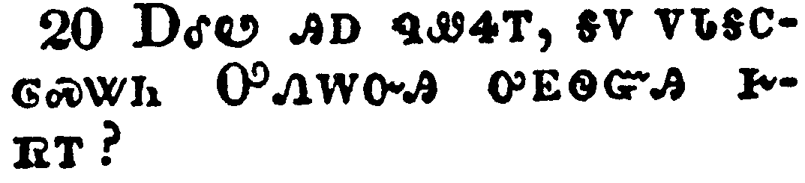</a></td>
</tr>
<tr class="even">
<td>And again he said, Whereunto shall I liken the kingdom of God?</td>
</tr>
<tr class="odd">
<td>ᎠᎴᏬ ᎯᎠ ᏄᏪᏎᎢ, ᎦᏙ ᏙᏓᎦᏟᎶᏍᏔᏂ ᎤᏁᎳᏅᎯ ᎤᎬᏫᏳᎯ ᎨᏒᎢ?</td>
</tr>
<tr class="even">
<td>A-le-wo hi-a nu-we-se-i, ga-do do-da-ga-tli-lo-s-ta-ni U-ne-la-nv-hi u-gv-wi-yu-hi ge-sv-i?</td>
</tr>
</tbody>
</table>

<table>
<tbody>
<tr class="odd">
<td><a href="031321.png">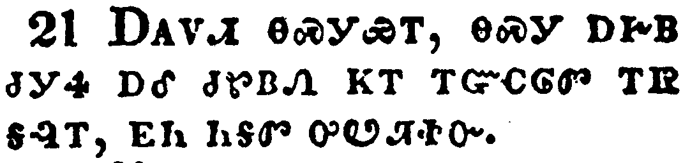</a></td>
</tr>
<tr class="even">
<td>It is like leaven, which a woman took and hid in three measures of meal, till the whole was leavened.</td>
</tr>
<tr class="odd">
<td>ᎠᎪᏙᏗ ᎾᏍᎩᏯᎢ, ᎾᏍᎩ ᎠᎨᏴ ᏧᎩᏎ ᎠᎴ ᏧᏑᏴᏁ ᏦᎢ ᎢᏳᏟᎶᏛ ᎢᏒ ᎦᎸᎢ, ᎬᏂ ᏂᎦᏛ ᎤᏬᏘᏐᏅ.</td>
</tr>
<tr class="even">
<td>A-go-do-di na-s-gi-ya-i, na-s-gi a-ge-yv tsu-gi-se a-le tsu-su-yv-ne tso-i i-yu-tli-lo-dv i-sv ga-lv-i, gv-ni ni-ga-dv u-wo-ti-so-nv.</td>
</tr>
</tbody>
</table>

<table>
<tbody>
<tr class="odd">
<td><a href="031322.png">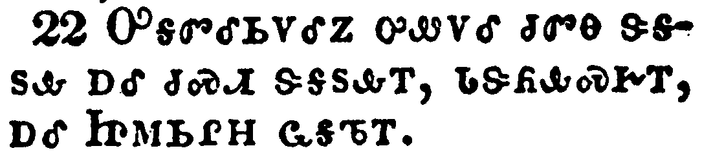</a></td>
</tr>
<tr class="even">
<td>And he went through the cities and villages, teaching, and journeying toward Jerusalem.</td>
</tr>
<tr class="odd">
<td>ᎤᎦᏛᎴᏏᏙᎴᏃ ᎤᏪᏙᎴ ᏧᏛᎾ ᏕᎦᏚᎲ ᎠᎴ ᏧᏍᏗ ᏕᎦᏚᎲᎢ, ᏓᏕᏲᎲᏍᎨᎢ, ᎠᎴ ᏥᎷᏏᎵᎻ ᏩᎦᏖᎢ.</td>
</tr>
<tr class="even">
<td>U-ga-dv-le-si-do-le-no u-we-do-le tsu-dv-na de-ga-du-hv a-le tsu-s-di de-ga-du-hv-i, da-de-yo-hv-s-ge-i, a-le Tsi-lu-si-li-mi wa-ga-te-i.</td>
</tr>
</tbody>
</table>

<table>
<tbody>
<tr class="odd">
<td><a href="031323.png">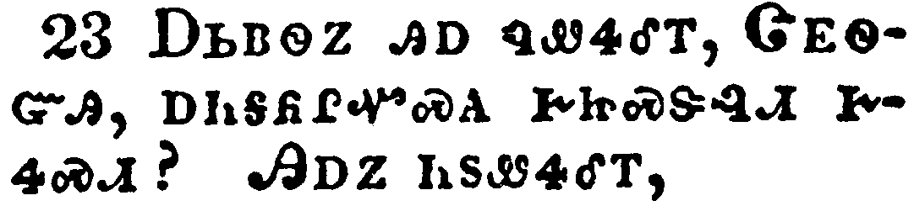</a></td>
</tr>
<tr class="even">
<td>Then said one unto him, Lord, are there few that be saved? And he said unto them,</td>
</tr>
<tr class="odd">
<td>ᎠᏏᏴᏫᏃ ᎯᎠ ᏄᏪᏎᎴᎢ, ᏣᎬᏫᏳᎯ, ᎠᏂᎦᏲᎵᏉᏍᎪ ᎨᏥᏍᏕᎸᏗ ᎨᏎᏍᏗ? ᎯᎠᏃ ᏂᏚᏪᏎᎴᎢ,</td>
</tr>
<tr class="even">
<td>A-si-yv-wi-no hi-a nu-we-se-le-i, Tsa-gv-wi-yu-hi, a-ni-ga-yo-li-quo-s-go ge-tsi-s-de-lv-di ge-se-s-di? Hi-a-no ni-du-we-se-le-i,</td>
</tr>
</tbody>
</table>

<table>
<tbody>
<tr class="odd">
<td><a href="031324.png">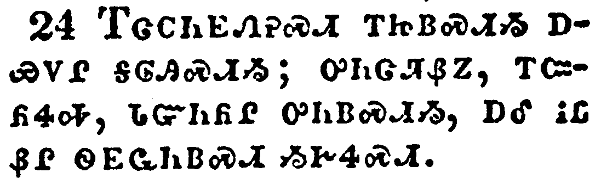</a></td>
</tr>
<tr class="even">
<td>Strive to enter in at the strait gate: for many, I say unto you, will seek to enter in, and shall not be able.</td>
</tr>
<tr class="odd">
<td>ᎢᏣᏟᏂᎬᏁᎮᏍᏗ ᎢᏥᏴᏍᏗᏱ ᎠᏯᏙᎵ ᎦᎶᎯᏍᏗᏱ; ᎤᏂᏣᏘᏰᏃ, ᎢᏨᏲᏎᎭ, ᏓᏳᏂᏲᎵ ᎤᏂᏴᏍᏗᏱ, ᎠᎴ ᎥᏝ ᏰᎵ ᏫᎬᏩᏂᏴᏍᏗ ᏱᎨᏎᏍᏗ.</td>
</tr>
<tr class="even">
<td>I-tsa-tli-ni-gv-ne-he-s-di i-tsi-yv-s-di-yi a-ya-do-li ga-lo-hi-s-di-yi; u-ni-tsa-ti-ye-no, i-tsv-yo-se-ha, da-yu-ni-yo-li u-ni-yv-s-di-yi, a-le v-tla ye-li wi-gv-wa-ni-yv-s-di yi-ge-se-s-di.</td>
</tr>
</tbody>
</table>

<table>
<tbody>
<tr class="odd">
<td><a href="031325.png">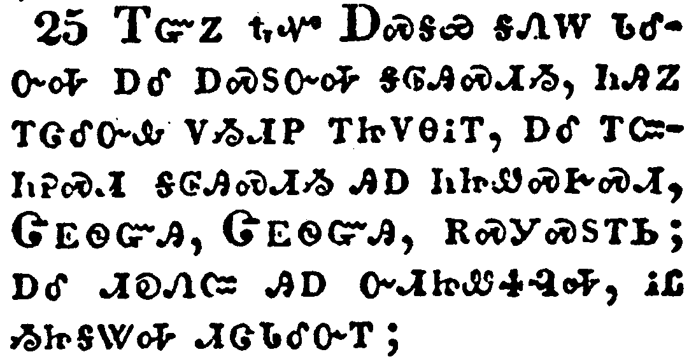</a></td>
</tr>
<tr class="even">
<td>When once the master of the house is risen up, and hath shut to the door, and ye begin to stand without, and to knock at the door, saying, Lord, Lord, open unto us; and he shall answer and say unto you, I know you not whence ye are:</td>
</tr>
<tr class="odd">
<td>ᎢᏳᏃ ᎿᎭᏉ ᎠᏍᎦᏯ ᎦᏁᎳ ᏓᎴᏅᎭ ᎠᎴ ᎠᏍᏚᏅᎭ ᎦᎶᎯᏍᏗᏱ, ᏂᎯᏃ ᎢᏣᎴᏅᎲ ᏙᏱᏗᏢ ᎢᏥᏙᎾᎥᎢ, ᎠᎴ ᎢᏨᏂᎮᏍᏗ ᎦᎶᎯᏍᏗᏱ ᎯᎠ ᏂᏤᏪᏍᎨᏍᏗ, ᏣᎬᏫᏳᎯ, ᏣᎬᏫᏳᎯ, ᎡᏍᎩᏍᏚᎢᏏ; ᎠᎴ ᏗᎧᏁᏨ ᎯᎠ ᏅᏗᏥᏪᏎᎸᎭ, ᎥᏝ ᏱᏥᎦᏔᎭ ᏗᏣᏓᎴᏅᎢ;</td>
</tr>
<tr class="even">
<td>I-yu-no hna-quo A-s-ga-ya ga-ne-la da-le-nv-ha a-le a-s-du-nv-ha ga-lo-hi-s-di-yi, ni-hi-no i-tsa-le-nv-hv do-yi-di-tlv i-tsi-do-na-v-i, a-le i-tsv-ni-he-s-di ga-lo-hi-s-di-yi hi-a ni-tse-we-s-ge-s-di, Tsa-gv-wi-yu-hi, Tsa-gv-wi-yu-hi, e-s-gi-s-du-i-si; a-le di-ka-ne-tsv hi-a nv-di-tsi-we-se-lv-ha, v-tla yi-tsi-ga-ta-ha di-tsa-da-le-nv-i;</td>
</tr>
</tbody>
</table>

<table>
<tbody>
<tr class="odd">
<td><a href="031326.png">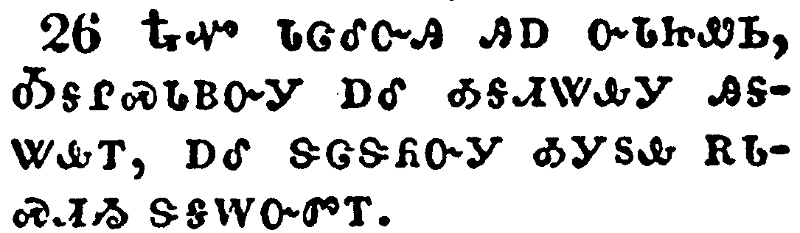</a></td>
</tr>
<tr class="even">
<td>Then shall ye begin to say, We have eaten and drunk in thy presence, and thou hast taught in our streets.</td>
</tr>
<tr class="odd">
<td>ᎿᎭᏉ ᏓᏣᎴᏅᎯ ᎯᎠ ᏅᏓᏥᏪᏏ, ᎣᎦᎵᏍᏓᏴᏅᎩ ᎠᎴ ᎣᎦᏗᏔᎲᎩ ᎯᎦᏔᎲᎢ, ᎠᎴ ᏕᏣᏕᏲᏅᎩ ᎣᎩᏚᎲ ᎡᏓᏍᏗᏱ ᏕᎦᎳᏅᏛᎢ.</td>
</tr>
<tr class="even">
<td>Hna-quo da-tsa-le-nv-hi hi-a nv-da-tsi-we-si, O-ga-li-s-da-yv-nv-gi a-le o-ga-di-ta-hv-gi hi-ga-ta-hv-i, a-le de-tsa-de-yo-nv-gi o-gi-du-hv e-da-s-di-yi de-ga-la-nv-dv-i.</td>
</tr>
</tbody>
</table>

<table>
<tbody>
<tr class="odd">
<td><a href="031327.png">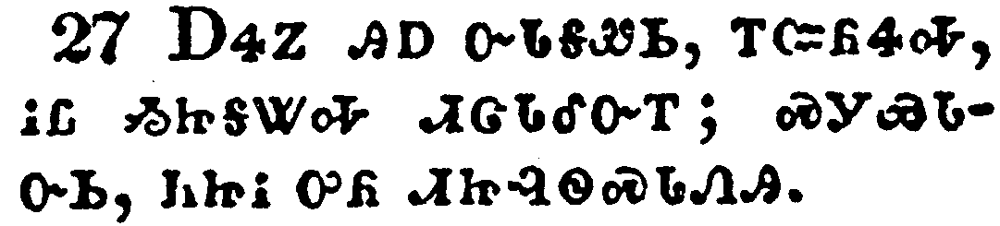</a></td>
</tr>
<tr class="even">
<td>But he shall say, I tell you, I know you not whence ye are; depart from me, all ye workers of iniquity.</td>
</tr>
<tr class="odd">
<td>ᎠᏎᏃ ᎯᎠ ᏅᏓᎦᏪᏏ, ᎢᏨᏲᏎᎭ, ᎥᏝ ᏱᏥᎦᏔᎭ ᏗᏣᏓᎴᏅᎢ; ᏍᎩᏯᏓᏅᏏ, ᏂᏥᎥ ᎤᏲ ᏗᏥᎸᏫᏍᏓᏁᎯ.</td>
</tr>
<tr class="even">
<td>A-se-no hi-a nv-da-ga-we-si, i-tsv-yo-se-ha, v-tla yi-tsi-ga-ta-ha di-tsa-da-le-nv-i; s-gi-ya-da-nv-si, ni-tsi-v u-yo di-tsi-lv-wi-s-da-ne-hi.</td>
</tr>
</tbody>
</table>

<table>
<tbody>
<tr class="odd">
<td><a href="031328.png">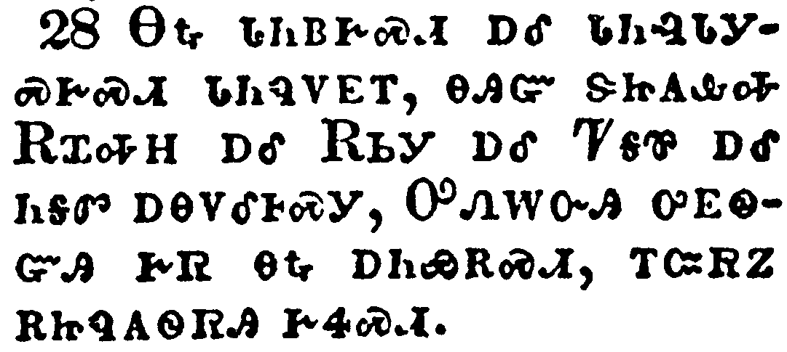</a></td>
</tr>
<tr class="even">
<td>There shall be weeping and gnashing of teeth, when ye shall see Abraham, and Isaac, and Jacob, and all the prophets, in the kingdom of God, and you yourselves thrust out.</td>
</tr>
<tr class="odd">
<td>ᎾᎿᎭᏓᏂᏴᎨᏍᏗ ᎠᎴ ᏓᏂᎸᏓᎩᏍᎨᏍᏗ ᏓᏂᏄᏙᎬᎢ, ᎾᎯᏳ ᏕᏥᎪᎲᎭ ᎡᏆᎭᎻ ᎠᎴ ᎡᏏᎩ ᎠᎴ ᏤᎦᏈ ᎠᎴ ᏂᎦᏛ ᎠᎾᏙᎴᎰᏍᎩ, ᎤᏁᎳᏅᎯ ᎤᎬᏫᏳᎯ ᎨᏒ ᎾᎿᎭᎠᏂᏯᎡᏍᏗ, ᎢᏨᏒᏃ ᎡᏥᏄᎪᏫᏒᎯ ᎨᏎᏍᏗ.</td>
</tr>
<tr class="even">
<td>Na-hna da-ni-yv-ge-s-di a-le da-ni-lv-da-gi-s-ge-s-di da-ni-nu-do-gv-i, na-hi-yu de-tsi-go-hv-ha E-qua-ha-mi a-le E-si-gi a-le Tse-ga-qui a-le ni-ga-dv a-na-do-le-ho-s-gi, U-ne-la-nv-hi u-gv-wi-yu-hi ge-sv na-hna a-ni-ya-e-s-di, i-tsv-sv-no e-tsi-nu-go-wi-sv-hi ge-se-s-di.</td>
</tr>
</tbody>
</table>

<table>
<tbody>
<tr class="odd">
<td><a href="031329.png">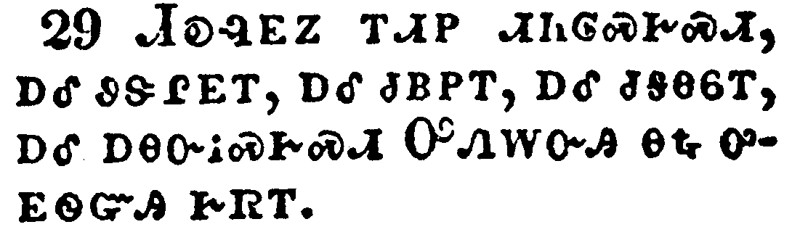</a></td>
</tr>
<tr class="even">
<td>And they shall come from the east, and from the west, and from the north, and from the south, and shall sit down in the kingdom of God.</td>
</tr>
<tr class="odd">
<td>ᏗᎧᎸᎬᏃ ᎢᏗᏢ ᏗᏂᎶᏍᎨᏍᏗ, ᎠᎴ ᏭᏕᎵᎬᎢ, ᎠᎴ ᏧᏴᏢᎢ, ᎠᎴ ᏧᎦᎾᏮᎢ, ᎠᎴ ᎠᎾᏅᎥᏍᎨᏍᏗ ᎤᏁᎳᏅᎯ ᎾᎿᎭᎤᎬᏫᏳᎯ ᎨᏒᎢ.</td>
</tr>
<tr class="even">
<td>Di-ka-lv-gv-no i-di-tlv di-ni-lo-s-ge-s-di, a-le wu-de-li-gv-i, a-le tsu-yv-tlv-i, a-le tsu-ga-na-wv-i, a-le a-na-nv-v-s-ge-s-di U-ne-la-nv-hi na-hna u-gv-wi-yu-hi ge-sv-i.</td>
</tr>
</tbody>
</table>

<table>
<tbody>
<tr class="odd">
<td><a href="031330.png">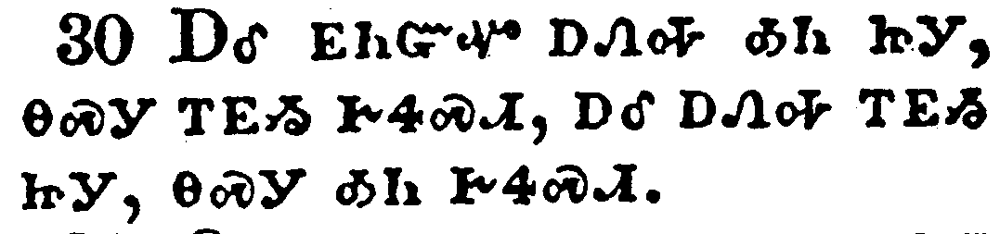</a></td>
</tr>
<tr class="even">
<td>And, behold, there are last which shall be first, and there are first which shall be last.</td>
</tr>
<tr class="odd">
<td>ᎠᎴ ᎬᏂᏳᏉ ᎠᏁᎭ ᎣᏂ ᏥᎩ, ᎾᏍᎩ ᎢᎬᏱ ᎨᏎᏍᏗ, ᎠᎴ ᎠᏁᎭ ᎢᎬᏱ ᏥᎩ, ᎾᏍᎩ ᎣᏂ ᎨᏎᏏᏗ.</td>
</tr>
<tr class="even">
<td>A-le gv-ni-yu-quo a-ne-ha o-ni tsi-gi, na-s-gi i-gv-yi ge-se-s-di, a-le a-ne-ha i-gv-yi tsi-gi, na-s-gi o-ni ge-se-si-di.</td>
</tr>
</tbody>
</table>

<table>
<tbody>
<tr class="odd">
<td><a href="031331.png">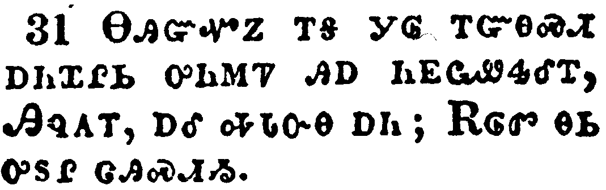</a></td>
</tr>
<tr class="even">
<td>The same day there came certain of the Pharisees, saying unto him, Get thee out, and depart hence: for Herod will kill thee.</td>
</tr>
<tr class="odd">
<td>ᎾᎯᏳᏉᏃ ᎢᎦ ᎩᎶ ᎢᏳᎾᏍᏗ ᎠᏂᏆᎵᏏ ᎤᏂᎷᏤ ᎯᎠ ᏂᎬᏩᏪᏎᎴᎢ, ᎯᏄᎪᎢ, ᎠᎴ ᎭᏓᏅᎾ ᎠᏂ; ᎡᎶᏛ ᎾᏏ ᎤᏚᎵ ᏣᎯᏍᏗᏱ.</td>
</tr>
<tr class="even">
<td>Na-hi-yu-quo-no i-ga gi-lo i-yu-na-s-di a-ni-qua-li-si u-ni-lu-tse hi-a ni-gv-wa-we-se-le-i, Hi-nu-go-i, a-le ha-da-nv-na a-ni; E-lo-dv na-si u-du-li tsa-hi-s-di-yi.</td>
</tr>
</tbody>
</table>

<table>
<tbody>
<tr class="odd">
<td><a href="031332.png">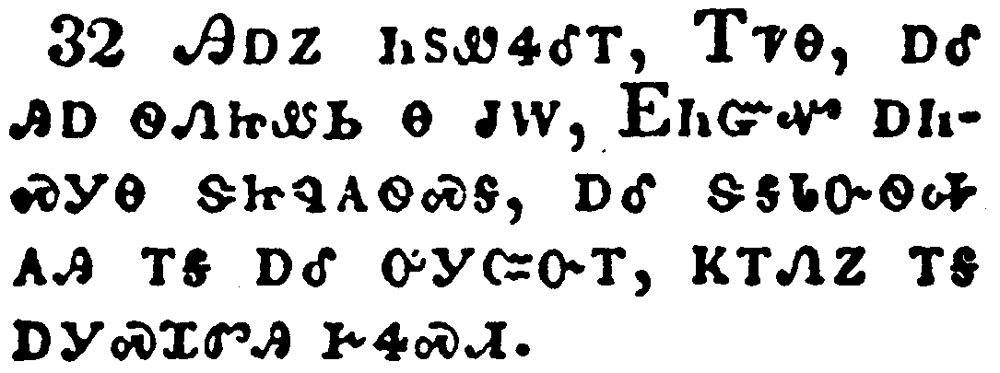</a></td>
</tr>
<tr class="even">
<td>And he said unto them, Go ye, and tell that fox, Behold, I cast out devils, and I do cures to day and to morrow, and the third day I shall be perfected.</td>
</tr>
<tr class="odd">
<td>ᎯᎠᏃ ᏂᏚᏪᏎᎴᎢ, ᎢᏤᎾ, ᎠᎴ ᎯᎠ ᏫᏁᏥᏪᏏ Ꮎ ᎫᎳ, ᎬᏂᏳᏉ ᎠᏂᏍᎩᎾ ᏕᏥᏄᎪᏫᏍᎦ, ᎠᎴ ᏕᎦᏓᏅᏫᎭ ᎪᎯ ᎢᎦ ᎠᎴ ᎤᎩᏨᏅᎢ, ᏦᎢᏁᏃ ᎢᎦ ᎠᎩᏍᏆᏛᎯ ᎨᏎᏍᏗ.</td>
</tr>
<tr class="even">
<td>Hi-a-no ni-du-we-se-le-i, I-tse-na, a-le hi-a wi-ne-tsi-we-si na gu-la, Gv-ni-yu-quo a-ni-s-gi-na de-tsi-nu-go-wi-s-ga, a-le de-ga-da-nv-wi-ha go-hi i-ga a-le u-gi-tsv-nv-i, tso-i-ne-no i-ga a-gi-s-qua-dv-hi ge-se-s-di.</td>
</tr>
</tbody>
</table>

<table>
<tbody>
<tr class="odd">
<td><a href="031333.png">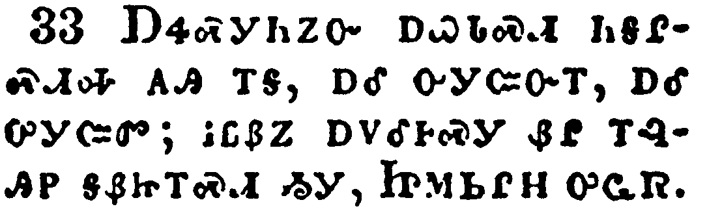</a></td>
</tr>
<tr class="even">
<td>Nevertheless I must walk to day, and to morrow, and the day following: for it cannot be that a prophet perish out of Jerusalem.</td>
</tr>
<tr class="odd">
<td>ᎠᏎᏍᎩᏂᏃᏅ ᎠᏇᏓᏍᏗ ᏂᎦᎵᏍᏗᎭ ᎪᎯ ᎢᎦ, ᎠᎴ ᎤᎩᏨᏅᎢ, ᎠᎴ ᎤᎩᏨᏛ; ᎥᏝᏰᏃ ᎠᏙᎴᎰᏍᎩ ᏰᎵ ᎢᎸᎯᏢ ᎦᏰᏥᎢᏍᏗ ᏱᎩ, ᏥᎷᏏᎵᎻ ᎤᏩᏒ.</td>
</tr>
<tr class="even">
<td>A-se-s-gi-ni-no-nv a-que-da-s-di ni-ga-li-s-di-ha go-hi i-ga, a-le u-gi-tsv-nv-i, a-le u-gi-tsv-dv; v-tla-ye-no a-do-le-ho-s-gi ye-li i-lv-hi-tlv ga-ye-tsi-i-s-di yi-gi, Tsi-lu-si-li-mi u-wa-sv.</td>
</tr>
</tbody>
</table>

<table>
<tbody>
<tr class="odd">
<td><a href="031334.png">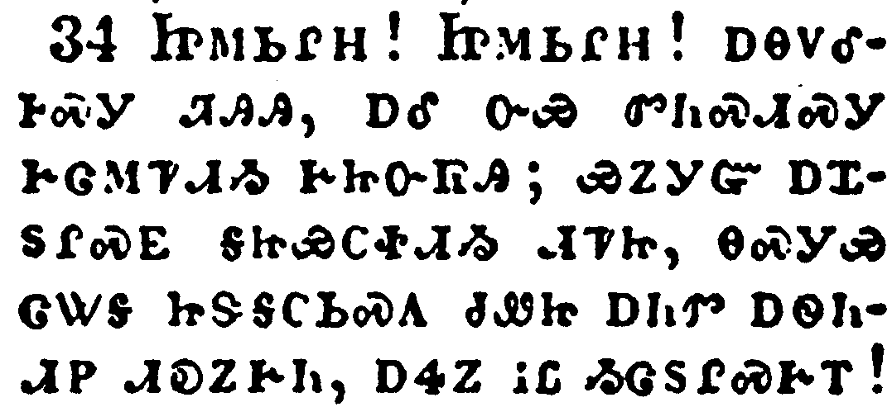</a></td>
</tr>
<tr class="even">
<td>O Jerusalem, Jerusalem, which killest the prophets, and stonest them that are sent unto thee; how often would I have gathered thy children together, as a hen doth gather her brood under her wings, and ye would not!</td>
</tr>
<tr class="odd">
<td>ᏥᎷᏏᎵᎻ! ᏥᎷᏏᎵᎻ! ᎠᎾᏙᎴᎰᏍᎩ ᏘᎯᎯ, ᎠᎴ ᏅᏯ ᏛᏂᏍᏗᏍᎩ ᎨᏣᎷᏤᏗᏱ ᎨᏥᏅᏒᎯ; ᏯᏃᎩᏳ ᎠᏆᏚᎵᏍᎬ ᎦᏥᏯᏟᏐᏗᏱ ᏗᏤᏥ, ᎾᏍᎩᏯ ᏣᏔᎦ ᏥᏕᎦᏟᏏᏍᎪ ᏧᏪᏥ ᎠᏂᏛ ᎠᏫᏂᏗᏢ ᏗᎧᏃᎨᏂ, ᎠᏎᏃ ᎥᏝ ᏱᏣᏚᎵᏍᎨᎢ!</td>
</tr>
<tr class="even">
<td>Tsi-lu-si-li-mi! Tsi-lu-si-li-mi! a-na-do-le-ho-s-gi ti-hi-hi, a-le nv-ya dv-ni-s-di-s-gi ge-tsa-lu-tse-di-yi ge-tsi-nv-sv-hi; ya-no-gi-yu a-qua-du-li-s-gv ga-tsi-ya-tli-so-di-yi di-tse-tsi, na-s-gi-ya tsa-ta-ga tsi-de-ga-tli-si-s-go tsu-we-tsi a-ni-dv a-wi-ni-di-tlv di-ka-no-ge-ni, a-se-no v-tla yi-tsa-du-li-s-ge-i!</td>
</tr>
</tbody>
</table>

<table>
<tbody>
<tr class="odd">
<td><a href="031335.png">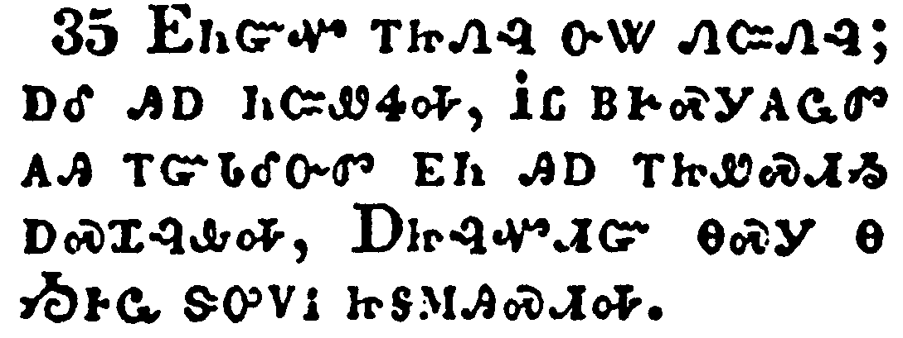</a></td>
</tr>
<tr class="even">
<td>Behold, your house is left unto you desolate: and verily I say unto you, Ye shall not see me, until the time come when ye shall say, Blessed is he that cometh in the name of the Lord.</td>
</tr>
<tr class="odd">
<td>ᎬᏂᏳᏉ ᎢᏥᏁᎸ ᏅᏔ ᏁᏨᏁᎸ; ᎠᎴ ᎯᎠ ᏂᏨᏪᏎᎭ, ᎥᏝ ᏴᎨᏍᎩᎪᏩᏛ ᎪᎯ ᎢᏳᏓᎴᏅᏛ ᎬᏂ ᎯᎠ ᎢᏥᏪᏍᏗᏱ ᎠᏍᏆᎸᎲᎭ, ᎠᏥᎸᏉᏗᏳ ᎾᏍᎩ Ꮎ ᏱᎰᏩ ᏕᏅᏙᎥ ᏥᎦᎷᎯᏍᏗᎭ.</td>
</tr>
<tr class="even">
<td>Gv-ni-yu-quo i-tsi-ne-lv nv-ta ne-tsv-ne-lv; a-le hi-a ni-tsv-we-se-ha, V-tla yv-ge-s-gi-go-wa-dv go-hi i-yu-da-le-nv-dv gv-ni hi-a i-tsi-we-s-di-yi a-s-qua-lv-hv-ha, A-tsi-lv-quo-di-yu na-s-gi na Yi-ho-wa de-nv-do-v tsi-ga-lu-hi-s-di-ha.</td>
</tr>
</tbody>
</table>

