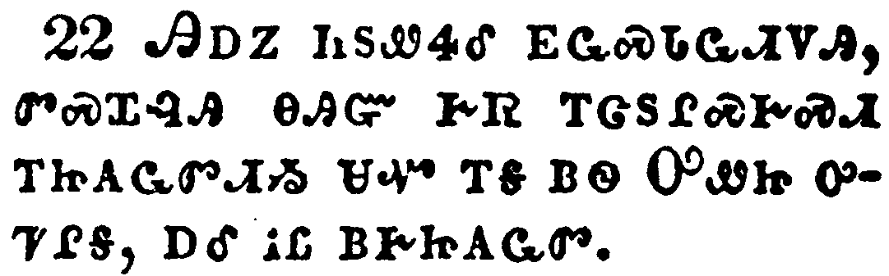
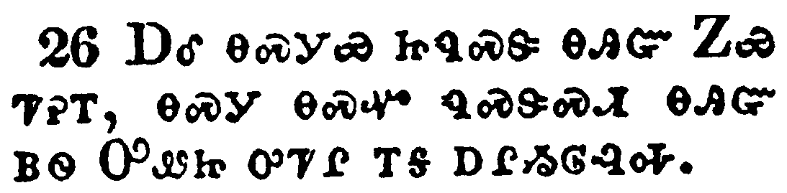
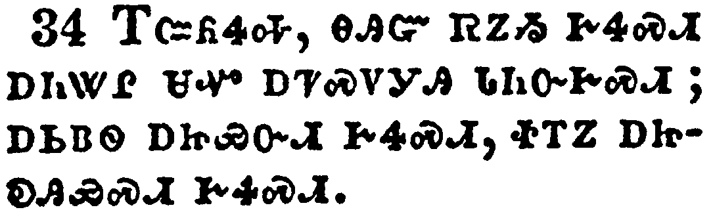
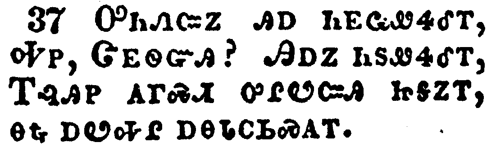

+++
draft=false
date = 2014-12-18T21:11:07Z
title = "Luke - Chapter 17 - Cherokee New Testament"
weight = 1418955067

[taxonomies]

authors = ["Timothy Legg"]
categories = []
tags = []

[extra]
+++

<table>
<tbody>
<tr class="odd">
<td></td>
</tr>
<tr class="even">
<td>Then said he unto the disciples, It is impossible but that offences will come: but woe unto him, through whom they come!</td>
</tr>
<tr class="odd">
<td>ᎿᎭᏉᏃ ᎯᎠ ᏂᏚᏪᏎᎴ ᎬᏩᏍᏓᏩᏗᏙᎯ, ᎠᏎ ᏗᏓᏙᏕᏍᏗᏍᎩ ᎤᎾᏄᎪᎢᏍᏗ; ᎠᏎᏃ ᎤᏲᎢᏳ ᎢᏳᎵᏍᏓᏁᏗ ᎾᏍᎩ Ꮎ ᎤᎾᏄᎪᏫᏒᎯ!</td>
</tr>
<tr class="even">
<td>Hna-quo-no hi-a ni-du-we-se-le gv-wa-s-da-wa-di-do-hi, a-se di-da-do-de-s-di-s-gi u-na-nu-go-i-s-di; a-se-no u-yo-i-yu i-yu-li-s-da-ne-di na-s-gi na u-na-nu-go-wi-sv-hi!</td>
</tr>
</tbody>
</table>

<table>
<tbody>
<tr class="odd">
<td></td>
</tr>
<tr class="even">
<td>It were better for him that a millstone were hanged about his neck, and he cast into the sea, than that he should offend one of these little ones.</td>
</tr>
<tr class="odd">
<td>ᎤᏟ ᎣᏏᏳ ᎢᏳᎵᏍᏓᏁᏗ ᏱᎨᏎ ᏅᏯ ᎠᏍᏙᏍᎩ ᏯᏥᏯᏝᏁᎢ, ᎠᎴ ᎠᎺᏉᎯ ᏱᏩᎦᏓᎢᏅᏎᎢ, ᎠᏃ ᎯᎠ ᎠᏏᏴᏫ ᏧᎾᏍᏗ ᎨᏒ ᏧᏬᏕᏍᏗᏱ.</td>
</tr>
<tr class="even">
<td>U-tli o-si-yu i-yu-li-s-da-ne-di yi-ge-se nv-ya a-s-do-s-gi ya-tsi-ya-tla-ne-i, a-le a-me-quo-hi yi-wa-ga-da-i-nv-se-i, a-no hi-a a-si-yv-wi tsu-na-s-di ge-sv tsu-wo-de-s-di-yi.</td>
</tr>
</tbody>
</table>

<table>
<tbody>
<tr class="odd">
<td></td>
</tr>
<tr class="even">
<td>Take heed to yourselves: If thy brother trespass against thee, rebuke him; and if he repent, forgive him.</td>
</tr>
<tr class="odd">
<td>ᎢᏨᏒ ᎢᏣᏓᏯᏫᏍᎨᏍᏗ. ᎢᏳᏃ ᏗᏍᏓᏓᏅᏟ ᎢᏣᏍᎦᏅᏤᎮᏍᏗ, ᎯᎬᏍᎪᎸᎥᏍᎨᏍᏗ; ᎢᏳᏃ ᎤᏲ ᎢᏯᏰᎸᏍᎨᏍᏗ, ᎯᏯᏙᎵᎨᏍᏗ.</td>
</tr>
<tr class="even">
<td>I-tsv-sv i-tsa-da-ya-wi-s-ge-s-di. I-yu-no di-s-da-da-nv-tli i-tsa-s-ga-nv-tse-he-s-di, hi-gv-s-go-lv-v-s-ge-s-di; i-yu-no u-yo i-ya-ye-lv-s-ge-s-di, hi-ya-do-li-ge-s-di.</td>
</tr>
</tbody>
</table>

<table>
<tbody>
<tr class="odd">
<td></td>
</tr>
<tr class="even">
<td>And if he trespass against thee seven times in a day, and seven times in a day turn again to thee, saying, I repent; thou shalt forgive him.</td>
</tr>
<tr class="odd">
<td>ᎢᏳ ᎠᎴ ᎦᎵᏉᎩ ᏂᏣᏍᎦᏅᏤᎮᏍᏗ ᏏᎦ ᎨᏒ, ᎠᎴ ᎦᎵᏉᎩ ᏂᏣᎷᏤᎮᏍᏗ ᏏᎦ ᎨᏒ, ᎯᎠ ᏂᏣᏪᏎᎮᏍᏗ, ᎤᏲ ᎠᎩᏰᎸᎭ, ᎠᏎ ᎯᏯᏙᎵᎨᏍᏗᏉ.</td>
</tr>
<tr class="even">
<td>I-yu a-le ga-li-quo-gi ni-tsa-s-ga-nv-tse-he-s-di si-ga ge-sv, a-le ga-li-quo-gi ni-tsa-lu-tse-he-s-di si-ga ge-sv, hi-a ni-tsa-we-se-he-s-di, u-yo a-gi-ye-lv-ha, a-se hi-ya-do-li-ge-s-di-quo.</td>
</tr>
</tbody>
</table>

<table>
<tbody>
<tr class="odd">
<td></td>
</tr>
<tr class="even">
<td>And the apostles said unto the Lord, Increase our faith.</td>
</tr>
<tr class="odd">
<td>ᎨᏥᏅᏏᏛᏃ ᎯᎠ ᏄᏂᏪᏎᎴ ᎤᎬᏫᏳᎯ, ᏍᎩᏁᏉᏏ ᎣᎪᎯᏳᏒᎢ.</td>
</tr>
<tr class="even">
<td>Ge-tsi-nv-si-dv-no hi-a nu-ni-we-se-le U-gv-wi-yu-hi, S-gi-ne-quo-si o-go-hi-yu-sv-i.</td>
</tr>
</tbody>
</table>

<table>
<tbody>
<tr class="odd">
<td></td>
</tr>
<tr class="even">
<td>And the Lord said, If ye had faith as a grain of mustard seed, ye might say unto this sycamine tree, Be thou plucked up by the root, and be thou planted in the sea; and it should obey you.</td>
</tr>
<tr class="odd">
<td>ᎤᎬᏫᏳᎯᏃ ᎯᎠ ᏄᏪᏎᎢ, ᎢᏳᏃ ᎠᏥᎸ-ᎤᎦᏔ ᏥᏂᎬ ᎢᎩᏛ ᎪᎯᏳᏗ ᎨᏒ ᏱᏥᎭ, ᎯᎠ ᏱᏂᏥᏪᏏ ᎯᎠ ᎫᏩ-ᏧᏁᎬ ᏥᏡᎦ, ᏫᏕᏣᎾᏍᏕᏢᏓ, ᎠᎴ ᎠᎺᏉᎯ ᏪᏣᎧᎲᎦ, ᎠᎴ ᏱᏦᎯᏳᎲᎦ.</td>
</tr>
<tr class="even">
<td>U-gv-wi-yu-hi-no hi-a nu-we-se-i, I-yu-no a-tsi-lv--u-ga-ta tsi-ni-gv i-gi-dv go-hi-yu-di ge-sv yi-tsi-ha, hi-a yi-ni-tsi-we-si hi-a gu-wa--tsu-ne-gv tsi-tlu-ga, Wi-de-tsa-na-s-de-tlv-da, a-le a-me-quo-hi we-tsa-ka-hv-ga, a-le yi-tso-hi-yu-hv-ga.</td>
</tr>
</tbody>
</table>

<table>
<tbody>
<tr class="odd">
<td></td>
</tr>
<tr class="even">
<td>But which of you, having a servant plowing or feeding cattle, will say unto him by and by, when he is come from the field, Go and sit down to meat?</td>
</tr>
<tr class="odd">
<td>ᎠᏎᏃ ᎦᎪ ᎯᎠ ᏥᏂᏣᏛᏅ, ᎡᏥᏅᏏᏓᏍᏗ ᏱᎦᏓᎷᎩᎭ, ᎠᎴ ᏱᎨᎶᎸᎥᏍᎦ, ᏠᎨᏏ ᏅᏓᏳᎶᏐᏅᎯ, ᎩᎳᏉ ᎢᏴᏛ ᎯᎠ ᏱᏁᏥᏪᏏ, ᎮᎾ ᏩᎵᏍᏓᏴᎲᎦ?</td>
</tr>
<tr class="even">
<td>A-se-no ga-go hi-a tsi-ni-tsa-dv-nv, e-tsi-nv-si-da-s-di yi-ga-da-lu-gi-ha, a-le yi-ge-lo-lv-v-s-ga, tlo-ge-si nv-da-yu-lo-so-nv-hi, gi-la-quo i-yv-dv hi-a yi-ne-tsi-we-si, He-na wa-li-s-da-yv-hv-ga?</td>
</tr>
</tbody>
</table>

<table>
<tbody>
<tr class="odd">
<td></td>
</tr>
<tr class="even">
<td>And will not rather say unto him, Make ready wherewith I may sup, and gird thyself, and serve me, till I have eaten and drunken; and afterward thou shalt eat and drink?</td>
</tr>
<tr class="odd">
<td>ᏝᏍᎪ ᎯᎠ ᏱᎬᏩᎬᏫᏳ ᏱᏅᎦᏰᏥᏪᏏ, ᎭᏛᏅᎢᏍᏓ ᎠᏆᎵᏍᏓᏴᏗᏱ, ᎠᎴ ᎭᏓᏠᎦ, ᎠᎴ ᏍᎩᏍᏕᎸᎯᏓ ᎦᎵᏍᏓᏴᎲᏍᎬ ᎠᎴ ᎦᏗᏔᏍᎬ ᎢᎬᎯᏛ; ᎣᏂᏃ ᏨᏒ ᎭᎵᏍᏓᏴᏅᎭ ᎠᎴ ᎭᏗᏔᎲᎭ?</td>
</tr>
<tr class="even">
<td>Tla-s-go hi-a yi-gv-wa-gv-wi-yu yi-nv-ga-ye-tsi-we-si, Ha-dv-nv-i-s-da a-qua-li-s-da-yv-di-yi, a-le ha-da-tlo-ga, a-le s-gi-s-de-lv-hi-da ga-li-s-da-yv-hv-s-gv a-le ga-di-ta-s-gv i-gv-hi-dv; o-ni-no tsv-sv ha-li-s-da-yv-nv-ha a-le ha-di-ta-hv-ha?</td>
</tr>
</tbody>
</table>

<table>
<tbody>
<tr class="odd">
<td></td>
</tr>
<tr class="even">
<td>Doth he thank that servant because he did the things that were commanded him? I trow not.</td>
</tr>
<tr class="odd">
<td>ᎠᎦᎵᎡᎵᏤᎰᏍᎪ ᎾᏍᎩ ᎠᏥᏅᏏᏓᏍᏗ ᎾᏥᏪᏎᎸ ᏄᏛᏁᎸᎢ? ᎥᏝ ᎠᎩᏰᎸᎭ.</td>
</tr>
<tr class="even">
<td>A-ga-li-e-li-tse-ho-s-go na-s-gi a-tsi-nv-si-da-s-di na-tsi-we-se-lv nu-dv-ne-lv-i? V-tla a-gi-ye-lv-ha.</td>
</tr>
</tbody>
</table>

<table>
<tbody>
<tr class="odd">
<td></td>
</tr>
<tr class="even">
<td>So likewise ye, when ye shall have done all those things which are commanded you, say, We are unprofitable servants: we have done that which was our duty to do.</td>
</tr>
<tr class="odd">
<td>ᎾᏍᎩᏯ ᎾᏍᏉ ᏂᎯ, ᎿᎭᏉ ᏂᎦᏛ ᏄᏥᏪᏎᎸ ᏂᏣᏛᏁᎰᏅᎭ, ᎯᎠ ᏂᏥᏪᏒᎭ, ᎪᎱᏍᏗ ᎣᎬᏙᏗ ᏂᎨᏒᎾ ᎣᎩᏅᏏᏓᏍᏗ; ᎢᏲᎦᏛᏁᏗᏉ ᎨᏒ ᏃᎦᏛᏁᎸ.</td>
</tr>
<tr class="even">
<td>Na-s-gi-ya na-s-quo ni-hi, hna-quo ni-ga-dv nu-tsi-we-se-lv ni-tsa-dv-ne-ho-nv-ha, hi-a ni-tsi-we-sv-ha, Go-hu-s-di o-gv-do-di ni-ge-sv-na o-gi-nv-si-da-s-di; i-yo-ga-dv-ne-di-quo ge-sv no-ga-dv-ne-lv.</td>
</tr>
</tbody>
</table>

<table>
<tbody>
<tr class="odd">
<td></td>
</tr>
<tr class="even">
<td>And it came to pass, as he went to Jerusalem, that he passed through the midst of Samaria and Galilee.</td>
</tr>
<tr class="odd">
<td>ᎯᎠᏃ ᏄᎵᏍᏔᏁ ᎾᏍᎩ ᏥᎷᏏᎵᎻ ᏩᎦᏖᎢ, ᏌᎺᎵᏱ ᎠᎴ ᎨᎵᎵ ᎠᏰᎵ ᎤᎶᏎᎢ.</td>
</tr>
<tr class="even">
<td>Hi-a-no nu-li-s-ta-ne na-s-gi Tsi-lu-si-li-mi wa-ga-te-i, Sa-me-li-yi a-le Ge-li-li a-ye-li u-lo-se-i.</td>
</tr>
</tbody>
</table>

<table>
<tbody>
<tr class="odd">
<td></td>
</tr>
<tr class="even">
<td>And as he entered into a certain village, there met him ten men that were lepers, which stood afar off:</td>
</tr>
<tr class="odd">
<td>ᎢᎸᎯᏢᏃ ᎦᏚᎲ ᏩᏴᎯᎲᎢ ᎠᏍᎪᎯ ᎢᏯᏂᏛ ᎠᏂᏍᎦᏯ ᎠᏓᏰᏍᎩ ᏧᏂᏢᎩ ᏕᎬᏩᏠᏎᎢ, ᎢᏅ ᏧᎾᎴᏅᏁᎢ;</td>
</tr>
<tr class="even">
<td>I-lv-hi-tlv-no ga-du-hv wa-yv-hi-hv-i a-s-go-hi i-ya-ni-dv a-ni-s-ga-ya a-da-ye-s-gi tsu-ni-tlv-gi de-gv-wa-tlo-se-i, i-nv tsu-na-le-nv-ne-i;</td>
</tr>
</tbody>
</table>

<table>
<tbody>
<tr class="odd">
<td></td>
</tr>
<tr class="even">
<td>And they lifted up their voices, and said, Jesus, Master, have mercy on us.</td>
</tr>
<tr class="odd">
<td>ᎠᎴ ᎤᏂᏌᎳᏓᏁ ᎠᏂᏁᎬ ᎯᎠ ᏄᏂᏪᏎᎢ, ᏥᏌ ᏔᏕᏲᎲᏍᎩ, ᏍᎩᏯᏙᎵᎩ.</td>
</tr>
<tr class="even">
<td>A-le u-ni-sa-la-da-ne a-ni-ne-gv hi-a nu-ni-we-se-i, Tsi-sa Ta-de-yo-hv-s-gi, s-gi-ya-do-li-gi.</td>
</tr>
</tbody>
</table>

<table>
<tbody>
<tr class="odd">
<td></td>
</tr>
<tr class="even">
<td>And when he saw them, he said unto them, Go shew yourselves unto the priests. And it came to pass, that, as they went, they were cleansed.</td>
</tr>
<tr class="odd">
<td>ᏚᎪᎲᏃ, ᎯᎠ ᏂᏚᏪᏎᎴᎢ, ᎢᏤᎾ ᎠᏥᎸ-ᎠᏁᎶᎯ ᎬᏂᎨᏒ ᏫᏂᏗᏣᏛᏂᏏ. ᎯᎠᏃ ᏄᎵᏍᏔᏁᎢ, ᎠᎾᎢᏒᏉ ᏚᎾᏓᏅᎦᎸᎮᎢ.</td>
</tr>
<tr class="even">
<td>Du-go-hv-no, hi-a ni-du-we-se-le-i, I-tse-na a-tsi-lv--a-ne-lo-hi gv-ni-ge-sv wi-ni-di-tsa-dv-ni-si. Hi-a-no nu-li-s-ta-ne-i, a-na-i-sv-quo du-na-da-nv-ga-lv-he-i.</td>
</tr>
</tbody>
</table>

<table>
<tbody>
<tr class="odd">
<td></td>
</tr>
<tr class="even">
<td>And one of them, when he saw that he was healed, turned back, and with a loud voice glorified God,</td>
</tr>
<tr class="odd">
<td>ᎠᏏᏴᏫᏃ, ᎤᏙᎴᎰᏒ ᎠᏥᏅᏩᏅᎢ, ᏗᎤᏨᏎᎢ, ᎠᎴ ᎠᏍᏓᏯ ᎤᏁᏤ ᎤᎸᏉᏔᏁ ᎤᏁᎳᏅᎯ,</td>
</tr>
<tr class="even">
<td>A-si-yv-wi-no, u-do-le-ho-sv a-tsi-nv-wa-nv-i, di-u-tsv-se-i, a-le a-s-da-ya u-ne-tse u-lv-quo-ta-ne U-ne-la-nv-hi,</td>
</tr>
</tbody>
</table>

<table>
<tbody>
<tr class="odd">
<td></td>
</tr>
<tr class="even">
<td>And fell down on his face at his feet, giving him thanks: and he was a Samaritan.</td>
</tr>
<tr class="odd">
<td>ᎠᎴ ᎤᏓᏅᏁ ᎤᎵᏯᏍᏚᏁ ᏚᎳᏍᎬ ᎾᎥᎢ, ᎠᎵᎮᎵᏤᎮᎢ. ᎠᎴ ᏌᎺᎵᏱ ᎡᎯ ᎨᏎᎢ.</td>
</tr>
<tr class="even">
<td>A-le u-da-nv-ne u-li-ya-s-du-ne du-la-s-gv na-v-i, a-li-he-li-tse-he-i. A-le Sa-me-li-yi e-hi ge-se-i.</td>
</tr>
</tbody>
</table>

<table>
<tbody>
<tr class="odd">
<td></td>
</tr>
<tr class="even">
<td>And Jesus answering said, Were there not ten cleansed? but where are the nine?</td>
</tr>
<tr class="odd">
<td>ᏥᏌᏃ ᎤᏁᏨ ᎯᎠ ᏄᏪᏎᎢ, ᏝᏍᎪ ᎠᏍᎪᎯ ᏱᎨᏥᏅᎦᎸᎡᎢ? ᎠᏎᏃ ᏐᎣᏁᎳ ᎢᏯᏂᏛ ᎭᏢ?</td>
</tr>
<tr class="even">
<td>Tsi-sa-no u-ne-tsv hi-a nu-we-se-i, Tla-s-go a-s-go-hi yi-ge-tsi-nv-ga-lv-e-i? A-se-no so-o-ne-la i-ya-ni-dv ha-tlv?</td>
</tr>
</tbody>
</table>

<table>
<tbody>
<tr class="odd">
<td></td>
</tr>
<tr class="even">
<td>There are not found that returned to give glory to God, save this stranger.</td>
</tr>
<tr class="odd">
<td>ᎥᏝ ᏱᎨᏥᏩᏛ ᏅᏓᏳᎾᏨᏛ ᎤᏁᎳᏅᎯ ᎠᏂᎸᏉᏗᏍᎩ, ᎯᎠ ᏅᏩᏓᎴ ᏴᏫ ᎤᏩᏒ.</td>
</tr>
<tr class="even">
<td>V-tla yi-ge-tsi-wa-dv nv-da-yu-na-tsv-dv U-ne-la-nv-hi a-ni-lv-quo-di-s-gi, hi-a nv-wa-da-le yv-wi u-wa-sv.</td>
</tr>
</tbody>
</table>

<table>
<tbody>
<tr class="odd">
<td></td>
</tr>
<tr class="even">
<td>And he said unto him, Arise, go thy way: thy faith hath made thee whole.</td>
</tr>
<tr class="odd">
<td>ᎯᎠᏃ ᏄᏪᏎᎴ ᎾᏍᎩ, ᏔᎴᎲᎦ, ᎠᎴ ᏥᎮᎾ; ᏦᎯᏳᏒ ᏣᏗᏫᏍᏓ.</td>
</tr>
<tr class="even">
<td>Hi-a-no nu-we-se-le na-s-gi, Ta-le-hv-ga, a-le tsi-he-na; tso-hi-yu-sv tsa-di-wi-s-da.</td>
</tr>
</tbody>
</table>

<table>
<tbody>
<tr class="odd">
<td></td>
</tr>
<tr class="even">
<td>And when he was demanded of the Pharisees, when the kingdom of God should come, he answered them and said, The kingdom of God cometh not with observation:</td>
</tr>
<tr class="odd">
<td>ᎠᏂᏆᎵᏏᏃ ᎬᏩᏛᏛᏅ ᎢᏳᏉ ᎤᎷᎯᏍᏗᏱ ᎤᏁᎳᏅᎯ ᎤᎬᏫᏳᎯ ᎨᏒ, ᏚᏁᏤᎴᎢ, ᎯᎠ ᏄᏪᏎᎢ, ᎤᏁᎳᏅᎯ ᎤᎬᏫᏳᎯ ᎨᏒ ᎥᏝ ᎬᎪᏩᏛᏗ ᏱᎨᏎᏍᏗ ᎦᎷᏨᎭ.</td>
</tr>
<tr class="even">
<td>A-ni-qua-li-si-no gv-wa-dv-dv-nv i-yu-quo u-lu-hi-s-di-yi U-ne-la-nv-hi u-gv-wi-yu-hi ge-sv, du-ne-tse-le-i, hi-a nu-we-se-i, U-ne-la-nv-hi u-gv-wi-yu-hi ge-sv v-tla gv-go-wa-dv-di yi-ge-se-s-di ga-lu-tsv-ha.</td>
</tr>
</tbody>
</table>

<table>
<tbody>
<tr class="odd">
<td></td>
</tr>
<tr class="even">
<td>Neither shall they say, Lo here! or, lo there! for, behold, the kingdom of God is within you.</td>
</tr>
<tr class="odd">
<td>ᎥᏝ ᎠᎴ ᎯᎠ ᏱᏂᎬᏂᏪᏍᎨᏍᏗ, ᎬᏂᏳᏉ ᎠᏂ! ᎠᎴ, ᎬᏂᏳᏉ ᎾᎿᎭᏂ! ᎬᏂᏳᏉᏰᏃ ᎤᏁᎳᏅᎯ ᎤᎬᏫᏳᎯ ᎨᏒ ᎢᏤᎳᏗᏙᎭ.</td>
</tr>
<tr class="even">
<td>V-tla a-le hi-a yi-ni-gv-ni-we-s-ge-s-di, Gv-ni-yu-quo a-ni! a-le, Gv-ni-yu-quo na-hna-ni! gv-ni-yu-quo-ye-no U-ne-la-nv-hi u-gv-wi-yu-hi ge-sv i-tse-la-di-do-ha.</td>
</tr>
</tbody>
</table>

<table>
<tbody>
<tr class="odd">
<td></td>
</tr>
<tr class="even">
<td>And he said unto the disciples, The days will come, when ye shall desire to see one of the days of the Son of man, and ye shall not see it.</td>
</tr>
<tr class="odd">
<td>ᎯᎠᏃ ᏂᏚᏪᏎᎴ ᎬᏩᏍᏓᏩᏗᏙᎯ, ᏛᏍᏆᎸᎯ ᎾᎯᏳ ᎨᏒ ᎢᏣᏚᎵᏍᎨᏍᏗ ᎢᏥᎪᏩᏛᏗᏱ ᏌᏉ ᎢᎦ ᏴᏫ ᎤᏪᏥ ᎤᏤᎵᎦ, ᎠᎴ ᎥᏝ ᏴᎨᏥᎪᏩᏛ.</td>
</tr>
<tr class="even">
<td>Hi-a-no ni-du-we-se-le gv-wa-s-da-wa-di-do-hi, dv-s-qua-lv-hi na-hi-yu ge-sv i-tsa-du-li-s-ge-s-di i-tsi-go-wa-dv-di-yi sa-quo i-ga yv-wi U-we-tsi u-tse-li-ga, a-le v-tla yv-ge-tsi-go-wa-dv.</td>
</tr>
</tbody>
</table>

<table>
<tbody>
<tr class="odd">
<td></td>
</tr>
<tr class="even">
<td>And they shall say to you, See here; or, see there: go not after them, nor follow them.</td>
</tr>
<tr class="odd">
<td>ᎠᎴ ᎯᎠ ᏂᎨᏥᏪᏎᎮᏍᏗ, ᎬᏂᏳᏉ ᎠᏂ; ᎠᎴ ᎬᏂᏳᏉ ᎾᎿᎭᏂ; ᏞᏍᏗ ᎢᏤᏅᏒᎩ, ᎠᎴ ᏞᏍᏗ ᏗᏥᏍᏓᏩᏛᏒᎩ.</td>
</tr>
<tr class="even">
<td>A-le hi-a ni-ge-tsi-we-se-he-s-di, Gv-ni-yu-quo a-ni; a-le Gv-ni-yu-quo na-hna-ni; tle-s-di i-tse-nv-sv-gi, a-le tle-s-di di-tsi-s-da-wa-dv-sv-gi.</td>
</tr>
</tbody>
</table>

<table>
<tbody>
<tr class="odd">
<td></td>
</tr>
<tr class="even">
<td>For as the lightning, that lighteneth out of the one part under heaven, shineth unto the other part under heaven; so shall also the Son of man be in his day.</td>
</tr>
<tr class="odd">
<td>ᎾᏍᎩᏯᏰᏃ ᎠᎾᎦᎵᏍᎩ ᏌᏉ ᎢᏗᏢ ᎦᎸᎶᎢ ᏨᏗᎦᎵᏍᎪᎢ, ᎤᏣᏘᏂᏃ ᎢᏗᏢ ᎦᎸᎶᎢ ᏥᏫᏗᎦᎸᏌᏓᏗᏍᎪᎢ; ᎾᏍᎩ ᎾᏍᏉ ᏄᏍᏕᏍᏗ ᏴᏫ ᎤᏪᏥ ᎤᏤᎵ ᎢᎦ ᎠᎵᏱᎶᎸᎭ.</td>
</tr>
<tr class="even">
<td>Na-s-gi-ya-ye-no a-na-ga-li-s-gi sa-quo i-di-tlv ga-lv-lo-i tsv-di-ga-li-s-go-i, u-tsa-ti-ni-no i-di-tlv ga-lv-lo-i tsi-wi-di-ga-lv-sa-da-di-s-go-i; na-s-gi na-s-quo nu-s-de-s-di yv-wi U-we-tsi u-tse-li i-ga a-li-yi-lo-lv-ha.</td>
</tr>
</tbody>
</table>

<table>
<tbody>
<tr class="odd">
<td></td>
</tr>
<tr class="even">
<td>But first must he suffer many things, and be rejected of this generation.</td>
</tr>
<tr class="odd">
<td>ᎠᏎᏃ ᎢᎬᏱ ᎤᏣᏘ ᏧᏓᎴᏅᏛ ᎤᎩᎵᏲᎢᏍᏗ, ᎠᎴ ᏗᎬᏩᏲᎯᏍᏗ ᎨᏎᏍᏗ ᎪᎯ ᏣᏁᎭ.</td>
</tr>
<tr class="even">
<td>A-se-no i-gv-yi u-tsa-ti tsu-da-le-nv-dv u-gi-li-yo-i-s-di, a-le di-gv-wa-yo-hi-s-di ge-se-s-di go-hi tsa-ne-ha.</td>
</tr>
</tbody>
</table>

<table>
<tbody>
<tr class="odd">
<td></td>
</tr>
<tr class="even">
<td>And as it was in the days of Noe, so shall it be also in the days of the Son of man.</td>
</tr>
<tr class="odd">
<td>ᎠᎴ ᎾᏍᎩᏯ ᏥᏄᏍᏕ ᎾᎯᏳ ᏃᏯ ᏤᎮᎢ, ᎾᏍᎩ ᎾᏍᏉ ᏄᏍᏕᏍᏗ ᎾᎯᏳ ᏴᏫ ᎤᏪᏥ ᎤᏤᎵ ᎢᎦ ᎠᎵᏱᎶᎸᎭ.</td>
</tr>
<tr class="even">
<td>A-le na-s-gi-ya tsi-nu-s-de na-hi-yu No-ya tse-he-i, na-s-gi na-s-quo nu-s-de-s-di na-hi-yu yv-wi U-we-tsi u-tse-li i-ga a-li-yi-lo-lv-ha.</td>
</tr>
</tbody>
</table>

<table>
<tbody>
<tr class="odd">
<td></td>
</tr>
<tr class="even">
<td>They did eat, they drank, they married wives, they were given in marriage, until the day that Noe entered into the ark, and the flood came, and destroyed them all.</td>
</tr>
<tr class="odd">
<td>ᏓᎾᎵᏍᏓᏴᎲᏍᎨᎢ, ᏓᎾᏗᏔᏍᎨᎢ, ᏓᎾᏕᏒᎲᏍᎨᎢ, ᏕᎨᏥᏰᎨᎢ, ᎬᏂ ᎾᎯᏳ ᎢᎦ ᏃᏯ ᎤᏣᏅ ᏥᏳᎯ, ᎠᎴ ᎤᏃᎱᎦᏂᎸ ᎠᎴ ᏂᎦᏛ ᏚᏂᎬᏦᏅ.</td>
</tr>
<tr class="even">
<td>Da-na-li-s-da-yv-hv-s-ge-i, da-na-di-ta-s-ge-i, da-na-de-sv-hv-s-ge-i, de-ge-tsi-ye-ge-i, gv-ni na-hi-yu i-ga No-ya u-tsa-nv tsi-yu-hi, a-le u-no-hu-ga-ni-lv a-le ni-ga-dv du-ni-gv-tso-nv.</td>
</tr>
</tbody>
</table>

<table>
<tbody>
<tr class="odd">
<td></td>
</tr>
<tr class="even">
<td>Likewise also as it was in the days of Lot; they did eat, they drank, they bought, they sold, they planted, they builded;</td>
</tr>
<tr class="odd">
<td>ᎾᏍᎩᏯ ᎾᏍᏉ ᏥᏄᏍᏕ ᎾᎯᏳ ᎶᏛ ᏤᎮᎢ; ᏓᎾᎵᏍᏓᏴᎲᏍᎨᎢ ᏓᎾᏗᏔᏍᎨᎢ, ᎤᏂᏩᎡᎥᏍᎨᎢ, ᎠᏂᏃᏔᏅᎥᏍᎨᎢ, ᏓᏂᏫᏒᎥᏍᎨᎢ, ᏓᎾᏁᏍᎨᏍᎨᎢ;</td>
</tr>
<tr class="even">
<td>Na-s-gi-ya na-s-quo tsi-nu-s-de na-hi-yu Lo-dv tse-he-i; da-na-li-s-da-yv-hv-s-ge-i da-na-di-ta-s-ge-i, u-ni-wa-e-v-s-ge-i, a-ni-no-ta-nv-v-s-ge-i, da-ni-wi-sv-v-s-ge-i, da-na-ne-s-ge-s-ge-i;</td>
</tr>
</tbody>
</table>

<table>
<tbody>
<tr class="odd">
<td></td>
</tr>
<tr class="even">
<td>But the same day that Lot went out of Sodom it rained fire and brimstone from heaven, and destroyed them all.</td>
</tr>
<tr class="odd">
<td>ᎠᏎᏃ ᎾᎯᏳᏉ ᎢᎦ ᎶᏛ ᏐᏓᎻ ᎤᏄᎪᏨ, ᎦᎸᎳᏗ ᏧᎦᎿᎭᏁ ᎠᏥᎸ ᎠᎴ ᏌᎪᏂᎨ ᎠᏓᏪᎳᎩᏍᎩ, ᏂᎦᏗᏳᏃ ᏚᏂᎰᏁᎢ.</td>
</tr>
<tr class="even">
<td>A-se-no na-hi-yu-quo i-ga Lo-dv So-da-mi u-nu-go-tsv, ga-lv-la-di tsu-ga-hna-ne a-tsi-lv a-le sa-go-ni-ge a-da-we-la-gi-s-gi, ni-ga-di-yu-no du-ni-ho-ne-i.</td>
</tr>
</tbody>
</table>

<table>
<tbody>
<tr class="odd">
<td></td>
</tr>
<tr class="even">
<td>Even thus shall it be in the day when the Son of man is revealed.</td>
</tr>
<tr class="odd">
<td>ᎾᏍᎩᏯ ᏄᏍᏕᏍᏗ ᎾᎯᏳ ᎢᎦ ᏴᏫ ᎤᏪᏥ ᎦᎾᏄᎪᏂᎸᎭ.</td>
</tr>
<tr class="even">
<td>Na-s-gi-ya nu-s-de-s-di na-hi-yu i-ga yv-wi U-we-tsi ga-na-nu-go-ni-lv-ha.</td>
</tr>
</tbody>
</table>

<table>
<tbody>
<tr class="odd">
<td></td>
</tr>
<tr class="even">
<td>In that day, he which shall be upon the housetop, and his stuff in the house, let him not come down to take it away: and he that is in the field, let him likewise not return back.</td>
</tr>
<tr class="odd">
<td>ᎾᎯᏳ ᎢᎦ ᎩᎶ ᎦᏌᎾᎵ ᎤᎩᎴᏍᏗ, ᎤᎿᎭᎥᏃ ᎦᎵᏦᏕ ᎠᎮᏍᏗ, ᏞᏍᏗ ᏅᏓᏳᏠᎠᏒᎩ ᎤᏫᏛᏗᏱ; ᎠᎴ ᎩᎶ ᏠᎨᏏ ᏫᎡᏙᎮᏍᏗ, ᏞᏍᏗ ᎾᏍᏉ ᏅᏓᏳᏨᏒᎩ.</td>
</tr>
<tr class="even">
<td>Na-hi-yu i-ga gi-lo ga-sa-na-li u-gi-le-s-di, u-hna-v-no ga-li-tso-de a-he-s-di, tle-s-di nv-da-yu-tlo-a-sv-gi u-wi-dv-di-yi; a-le gi-lo tlo-ge-si wi-e-do-he-s-di, tle-s-di na-s-quo nv-da-yu-tsv-sv-gi.</td>
</tr>
</tbody>
</table>

<table>
<tbody>
<tr class="odd">
<td></td>
</tr>
<tr class="even">
<td>Remember Lot's wife.</td>
</tr>
<tr class="odd">
<td>ᎡᏣᏅᏓᏓ ᎶᏛ ᎤᏓᎵᎢ.</td>
</tr>
<tr class="even">
<td>E-tsa-nv-da-da Lo-dv u-da-li-i.</td>
</tr>
</tbody>
</table>

<table>
<tbody>
<tr class="odd">
<td></td>
</tr>
<tr class="even">
<td>Whosoever shall seek to save his life shall lose it; and whosoever shall lose his life shall preserve it.</td>
</tr>
<tr class="odd">
<td>ᎩᎶ ᎤᏩᏒ ᎬᏅ ᎤᏍᏕᎸᏗᏱ ᎤᏲᎮᏍᏗ ᎤᏲᎱᏎᏗ ᎨᏎᏍᏗ; ᎩᎶᏃ ᎤᏲᎱᏎᎮᏍᏗ, ᎾᏍᎩ ᎤᏍᏕᎸᏗ ᎨᏎᏍᏗ.</td>
</tr>
<tr class="even">
<td>Gi-lo u-wa-sv gv-nv u-s-de-lv-di-yi u-yo-he-s-di u-yo-hu-se-di ge-se-s-di; gi-lo-no u-yo-hu-se-he-s-di, na-s-gi u-s-de-lv-di ge-se-s-di.</td>
</tr>
</tbody>
</table>

<table>
<tbody>
<tr class="odd">
<td></td>
</tr>
<tr class="even">
<td>I tell you, in that night there shall be two men in one bed; the one shall be taken, and the other shall be left.</td>
</tr>
<tr class="odd">
<td>ᎢᏤᏲᏎᎭ, ᎾᎯᏳ ᏒᏃᏱ ᎨᏎᏍᏗ ᎠᏂᏔᎵ ᏌᏉ ᎠᏤᏍᏙᎩᎯ ᏓᏂᏅᎨᏍᏗ; ᎠᏏᏴᏫ ᎠᏥᏯᏅᏗ ᎨᏎᏍᏗ, ᏐᎢᏃ ᎠᏥᎧᎯᏯᏍᏗ ᎨᏎᏍᏗ.</td>
</tr>
<tr class="even">
<td>I-tse-yo-se-ha, na-hi-yu sv-no-yi ge-se-s-di a-ni-ta-li sa-quo a-tse-s-do-gi-hi da-ni-nv-ge-s-di; a-si-yv-wi a-tsi-ya-nv-di ge-se-s-di, so-i-no a-tsi-ka-hi-ya-s-di ge-se-s-di.</td>
</tr>
</tbody>
</table>

<table>
<tbody>
<tr class="odd">
<td></td>
</tr>
<tr class="even">
<td>Two women shall be grinding together; the one shall be taken, and the other left.</td>
</tr>
<tr class="odd">
<td>ᎠᏂᏔᎵ ᎠᏂᎨᏴ ᎢᏧᎳᎭ ᎠᏂᏍᏙᏍᎨᏍᏗ; ᎠᏏᏴᏫ ᎠᏥᏯᏅᏗ ᎨᏎᏍᏗ, ᏐᎢᏃ ᎠᏥᎧᎯᏯᏍᏗ ᎨᏎᏍᏗ.</td>
</tr>
<tr class="even">
<td>A-ni-ta-li a-ni-ge-yv i-tsu-la-ha a-ni-s-do-s-ge-s-di; a-si-yv-wi a-tsi-ya-nv-di ge-se-s-di, so-i-no a-tsi-ka-hi-ya-s-di ge-se-s-di.</td>
</tr>
</tbody>
</table>

<table>
<tbody>
<tr class="odd">
<td></td>
</tr>
<tr class="even">
<td>Two men shall be in the field; the one shall be taken, and the other left.</td>
</tr>
<tr class="odd">
<td>ᎠᏂᏔᎵ ᏠᎨᏏ ᎠᏁᏙᎮᏍᏗ; ᎠᏏᏴᏫ ᎠᏥᏯᏅᏗ ᎨᏎᏍᏗ, ᏐᎢᏃ ᎠᏥᎧᎯᏯᏍᏗ ᎨᏎᏍᏗ.</td>
</tr>
<tr class="even">
<td>A-ni-ta-li tlo-ge-si a-ne-do-he-s-di; a-si-yv-wi a-tsi-ya-nv-di ge-se-s-di, so-i-no a-tsi-ka-hi-ya-s-di ge-se-s-di.</td>
</tr>
</tbody>
</table>

<table>
<tbody>
<tr class="odd">
<td></td>
</tr>
<tr class="even">
<td>And they answered and said unto him, Where, Lord? And he said unto them, Wheresoever the body is, thither will the eagles be gathered together.</td>
</tr>
<tr class="odd">
<td>ᎤᏂᏁᏨᏃ ᎯᎠ ᏂᎬᏩᏪᏎᎴᎢ, ᎭᏢ, ᏣᎬᏫᏳᎯ? ᎯᎠᏃ ᏂᏚᏪᏎᎴᎢ, ᎢᎸᎯᏢ ᎪᎱᏍᏗ ᎤᎵᏬᏨᎯ ᏥᎦᏃᎢ, ᎾᎿᎭᎠᏬᎭᎵ ᎠᎾᏓᏟᏏᏍᎪᎢ.</td>
</tr>
<tr class="even">
<td>U-ni-ne-tsv-no hi-a ni-gv-wa-we-se-le-i, Ha-tlv, Tsa-gv-wi-yu-hi? Hi-a-no ni-du-we-se-le-i, I-lv-hi-tlv go-hu-s-di u-li-wo-tsv-hi tsi-ga-no-i, na-hna a-wo-ha-li a-na-da-tli-si-s-go-i.</td>
</tr>
</tbody>
</table>

