+++
draft=false
date = 2014-12-18T21:11:07Z
title = "Luke - Chapter 19 - Cherokee New Testament"
weight = 1418955067

[taxonomies]

authors = ["Timothy Legg"]
categories = []
tags = []

[extra]
+++

<table>
<tbody>
<tr class="odd">
<td></td>
</tr>
<tr class="even">
<td>And Jesus entered and passed through Jericho.</td>
</tr>
<tr class="odd">
<td>ᏥᏌᏃ ᎤᏴᎴ ᎠᎴ ᎤᎶᏎ ᏤᎵᎪ.</td>
</tr>
<tr class="even">
<td>Tsi-sa-no u-yv-le a-le u-lo-se Tse-li-go.</td>
</tr>
</tbody>
</table>

<table>
<tbody>
<tr class="odd">
<td><a href="031902.png">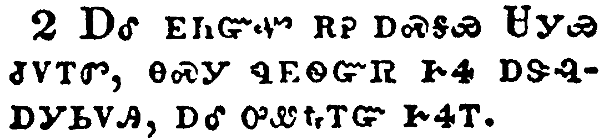</a></td>
</tr>
<tr class="even">
<td>And, behold, there was a man named Zacchaeus, which was the chief among the publicans, and he was rich.</td>
</tr>
<tr class="odd">
<td>ᎠᎴ ᎬᏂᏳᏉ ᎡᎮ ᎠᏍᎦᏯ ᏌᎩᏯ ᏧᏙᎢᏛ, ᎾᏍᎩ ᏄᎬᏫᏳᏒ ᎨᏎ ᎠᏕᎸᎠᎩᏏᏙᎯ, ᎠᎴ ᎤᏪᎿᎭᎢᏳ ᎨᏎᎢ.</td>
</tr>
<tr class="even">
<td>A-le gv-ni-yu-quo e-he a-s-ga-ya Sa-gi-ya tsu-do-i-dv, na-s-gi nu-gv-wi-yu-sv ge-se a-de-lv-a-gi-si-do-hi, a-le u-we-hna-i-yu ge-se-i.</td>
</tr>
</tbody>
</table>

<table>
<tbody>
<tr class="odd">
<td><a href="031903.png">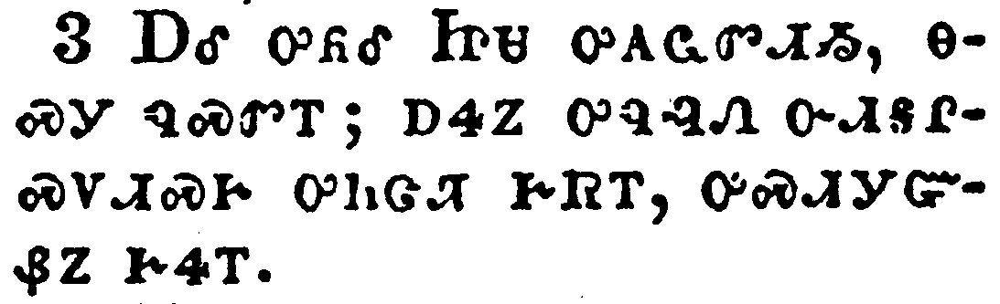</a></td>
</tr>
<tr class="even">
<td>And he sought to see Jesus who he was; and could not for the press, because he was little of stature.</td>
</tr>
<tr class="odd">
<td>ᎠᎴ ᎤᏲᎴ ᏥᏌ ᎤᎪᏩᏛᏗᏱ, ᎾᏍᎩ ᏄᏍᏛᎢ; ᎠᏎᏃ ᎤᏄᎸᏁ ᏅᏗᎦᎵᏍᏙᏗᏍᎨ ᎤᏂᏣᏘ ᎨᏒᎢ, ᎤᏍᏗᎩᏳᏰᏃ ᎨᏎᎢ.</td>
</tr>
<tr class="even">
<td>A-le u-yo-le Tsi-sa u-go-wa-dv-di-yi, na-s-gi nu-s-dv-i; a-se-no u-nu-lv-ne nv-di-ga-li-s-do-di-s-ge u-ni-tsa-ti ge-sv-i, u-s-di-gi-yu-ye-no ge-se-i.</td>
</tr>
</tbody>
</table>

<table>
<tbody>
<tr class="odd">
<td><a href="031904.png">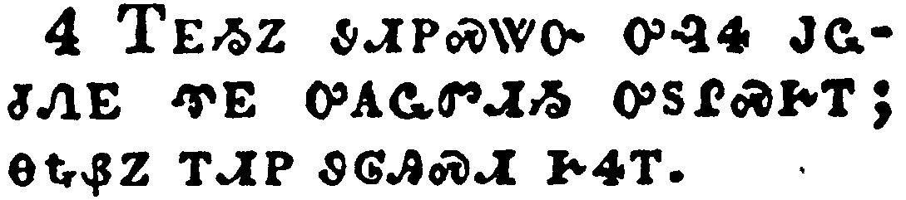</a></td>
</tr>
<tr class="even">
<td>And he ran before, and climbed up into a sycomore tree to see him: for he was to pass that way.</td>
</tr>
<tr class="odd">
<td>ᎢᎬᏱᏃ ᏭᏗᏢᏍᏔᏅ ᎤᎸᏎ ᎫᏩᏧᏁᎬ ᏡᎬ ᎤᎪᏩᏛᏗᏱ ᎤᏚᎵᏍᎨᎢ; ᎾᎿᎭᏰᏃ ᎢᏗᏢ ᏭᎶᎯᏍᏗ ᎨᏎᎢ.</td>
</tr>
<tr class="even">
<td>I-gv-yi-no wu-di-tlv-s-ta-nv u-lv-se gu-wa-tsu-ne-gv tlu-gv u-go-wa-dv-di-yi u-du-li-s-ge-i; na-hna-ye-no i-di-tlv wu-lo-hi-s-di ge-se-i.</td>
</tr>
</tbody>
</table>

<table>
<tbody>
<tr class="odd">
<td><a href="031905.png">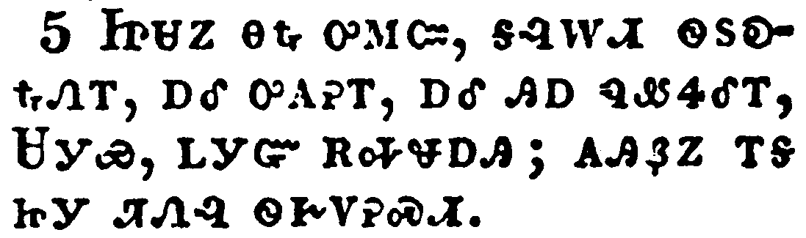</a></td>
</tr>
<tr class="even">
<td>And when Jesus came to the place, he looked up, and saw him, and said unto him, Zacchaeus, make haste, and come down; for to day I must abide at thy house.</td>
</tr>
<tr class="odd">
<td>ᏥᏌᏃ ᎾᎿᎭᎤᎷᏨ, ᎦᎸᎳᏗ ᏫᏚᎧᎿᎭᏁᎢ, ᎠᎴ ᎤᎪᎮᎢ, ᎠᎴ ᎯᎠ ᏄᏪᏎᎴᎢ, ᏌᎩᏯ, ᏞᎩᏳ ᎡᎭᏠᎠᎯ; ᎪᎯᏰᏃ ᎢᎦ ᏥᎩ ᏘᏁᎸ ᏫᎨᏙᎮᏍᏗ.</td>
</tr>
<tr class="even">
<td>Tsi-sa-no na-hna u-lu-tsv, ga-lv-la-di wi-du-ka-hna-ne-i, a-le u-go-he-i, a-le hi-a nu-we-se-le-i, Sa-gi-ya, tle-gi-yu e-ha-tlo-a-hi; go-hi-ye-no i-ga tsi-gi ti-ne-lv wi-ge-do-he-s-di.</td>
</tr>
</tbody>
</table>

<table>
<tbody>
<tr class="odd">
<td><a href="031906.png">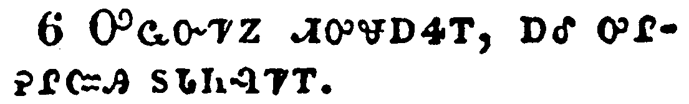</a></td>
</tr>
<tr class="even">
<td>And he made haste, and came down, and received him joyfully.</td>
</tr>
<tr class="odd">
<td>ᎤᏩᏅᏤᏃ ᏗᎤᏠᎠᏎᎢ, ᎠᎴ ᎤᎵᎮᎵᏨᎯ ᏚᏓᏂᎸᏤᎢ.</td>
</tr>
<tr class="even">
<td>U-wa-nv-tse-no di-u-tlo-a-se-i, a-le u-li-he-li-tsv-hi du-da-ni-lv-tse-i.</td>
</tr>
</tbody>
</table>

<table>
<tbody>
<tr class="odd">
<td><a href="031907.png">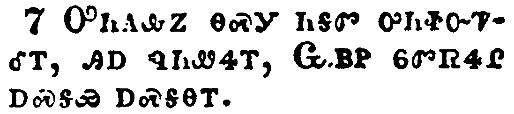</a></td>
</tr>
<tr class="even">
<td>And when they saw it, they all murmured, saying, That he was gone to be guest with a man that is a sinner.</td>
</tr>
<tr class="odd">
<td>ᎤᏂᎪᎲᏃ ᎾᏍᎩ ᏂᎦᏛ ᎤᏂᏐᏅᏤᎴᎢ, ᎯᎠ ᏄᏂᏪᏎᎢ, ᏩᏴᏢ ᏮᏛᏒᏎᎵ ᎠᏍᎦᏯ ᎠᏍᎦᎾᎢ.</td>
</tr>
<tr class="even">
<td>U-ni-go-hv-no na-s-gi ni-ga-dv u-ni-so-nv-tse-le-i, hi-a nu-ni-we-se-i, Wa-yv-tlv wv-dv-sv-se-li a-s-ga-ya a-s-ga-na-i.</td>
</tr>
</tbody>
</table>

<table>
<tbody>
<tr class="odd">
<td><a href="031908.png">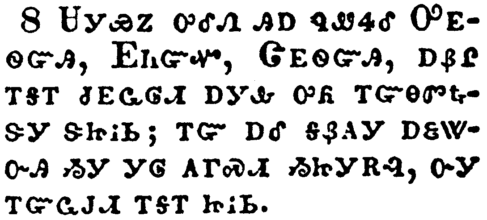</a></td>
</tr>
<tr class="even">
<td>And Zacchaeus stood, and said unto the Lord; Behold, Lord, the half of my goods I give to the poor; and if I have taken any thing from any man by false accusation, I restore him fourfold.</td>
</tr>
<tr class="odd">
<td>ᏌᎩᏯᏃ ᎤᎴᏁ ᎯᎠ ᏄᏪᏎᎴ ᎤᎬᏫᏳᎯ, ᎬᏂᏳᏉ, ᏣᎬᏫᏳᎯ, ᎠᏰᎵ ᎢᎦᎢ ᏧᎬᏩᎶᏗ ᎠᎩᎲ ᎤᏲ ᎢᏳᎾᏛᎿᎭᏕᎩ ᏕᏥᎥᏏ; ᎢᏳ ᎠᎴ ᎦᏰᎪᎩ ᎠᏋᏔᏅᎯ ᏱᎩ ᎩᎶ ᎪᎱᏍᏗ ᏱᏥᎩᎡᎸ, ᏅᎩ ᎢᏳᏩᎫᏗ ᎢᎦᎢ ᏥᎥᏏ.</td>
</tr>
<tr class="even">
<td>Sa-gi-ya-no u-le-ne hi-a nu-we-se-le U-gv-wi-yu-hi, Gv-ni-yu-quo, Tsa-gv-wi-yu-hi, a-ye-li i-ga-i tsu-gv-wa-lo-di a-gi-hv u-yo i-yu-na-dv-hna-de-gi de-tsi-v-si; i-yu a-le ga-ye-go-gi a-quv-ta-nv-hi yi-gi gi-lo go-hu-s-di yi-tsi-gi-e-lv, nv-gi i-yu-wa-gu-di i-ga-i tsi-v-si.</td>
</tr>
</tbody>
</table>

<table>
<tbody>
<tr class="odd">
<td><a href="031909.png">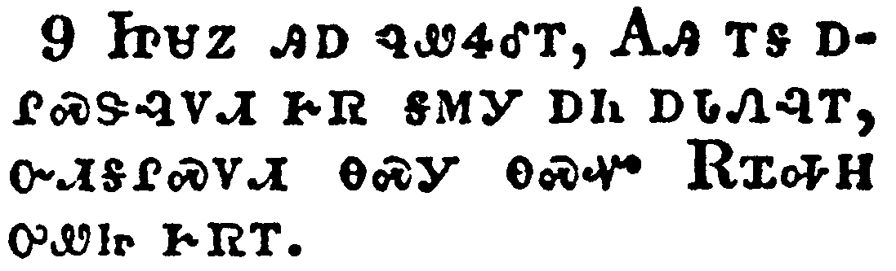</a></td>
</tr>
<tr class="even">
<td>And Jesus said unto him, This day is salvation come to this house, forsomuch as he also is a son of Abraham.</td>
</tr>
<tr class="odd">
<td>ᏥᏌᏃ ᎯᎠ ᏄᏪᏎᎴᎢ, ᎪᎯ ᎢᎦ ᎠᎵᏍᏕᎸᏙᏗ ᎨᏒ ᎦᎷᎩ ᎠᏂ ᎠᏓᏁᎸᎢ, ᏅᏗᎦᎵᏍᏙᏗ ᎾᏍᎩ ᎾᏍᏉ ᎡᏆᎭᎻ ᎤᏪᏥ ᎨᏒᎢ.</td>
</tr>
<tr class="even">
<td>Tsi-sa-no hi-a nu-we-se-le-i, Go-hi i-ga a-li-s-de-lv-do-di ge-sv ga-lu-gi a-ni a-da-ne-lv-i, nv-di-ga-li-s-do-di na-s-gi na-s-quo E-qua-ha-mi u-we-tsi ge-sv-i.</td>
</tr>
</tbody>
</table>

<table>
<tbody>
<tr class="odd">
<td><a href="031910.png">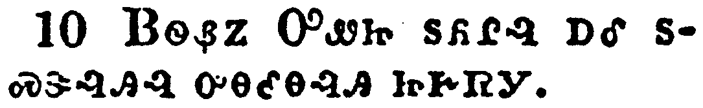</a></td>
</tr>
<tr class="even">
<td>For the Son of man is come to seek and to save that which was lost.</td>
</tr>
<tr class="odd">
<td>ᏴᏫᏰᏃ ᎤᏪᏥ ᏚᏲᎵᎸ ᎠᎴ ᏚᏍᏕᎸᎯᎸ ᎤᎾᎴᎾᎸᎯ ᏥᎨᏒᎩ.</td>
</tr>
<tr class="even">
<td>Yv-wi-ye-no U-we-tsi du-yo-li-lv a-le du-s-de-lv-hi-lv u-na-le-na-lv-hi tsi-ge-sv-gi.</td>
</tr>
</tbody>
</table>

<table>
<tbody>
<tr class="odd">
<td><a href="031911.png">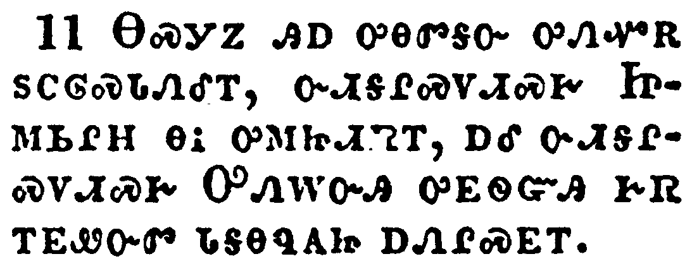</a></td>
</tr>
<tr class="even">
<td>And as they heard these things, he added and spake a parable, because he was nigh to Jerusalem, and because they thought that the kingdom of God should immediately appear.</td>
</tr>
<tr class="odd">
<td>ᎾᏍᎩᏃ ᎯᎠ ᎤᎾᏛᎦᏅ ᎤᏁᏉᎡ ᏚᏟᎶᏍᏓᏁᎴᎢ, ᏅᏗᎦᎵᏍᏙᏗᏍᎨ ᏥᎷᏏᎵᎻ ᎾᎥ ᎤᎷᏥᏗᏒᎢ, ᎠᎴ ᏅᏗᎦᎵᏍᏙᏗᏍᎨ ᎤᏁᎳᏅᎯ ᎤᎬᏫᏳᎯ ᎨᏒ ᎢᎬᏪᏅᏛ ᏓᎦᎾᏄᎪᏥ ᎠᏁᎵᏍᎬᎢ.</td>
</tr>
<tr class="even">
<td>Na-s-gi-no hi-a u-na-dv-ga-nv u-ne-quo-e du-tli-lo-s-da-ne-le-i, nv-di-ga-li-s-do-di-s-ge Tsi-lu-si-li-mi na-v u-lu-tsi-di-sv-i, a-le nv-di-ga-li-s-do-di-s-ge U-ne-la-nv-hi u-gv-wi-yu-hi ge-sv i-gv-we-nv-dv da-ga-na-nu-go-tsi a-ne-li-s-gv-i.</td>
</tr>
</tbody>
</table>

<table>
<tbody>
<tr class="odd">
<td><a href="031912.png">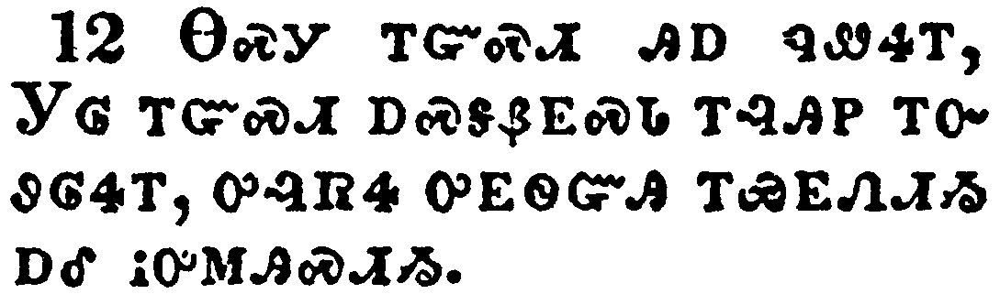</a></td>
</tr>
<tr class="even">
<td>He said therefore, A certain nobleman went into a far country to receive for himself a kingdom, and to return.</td>
</tr>
<tr class="odd">
<td>ᎾᏍᎩ ᎢᏳᏍᏗ ᎯᎠ ᏄᏪᏎᎢ, ᎩᎶ ᎢᏳᏍᏗ ᎠᏍᎦᏰᎬᏍᏓ ᎢᎸᎯᏢ ᎢᏅ ᏭᎶᏎᎢ, ᎤᎸᏒᏎ ᎤᎬᏫᏳᎯ ᎢᏯᎬᏁᏗᏱ ᎠᎴ ᎥᎤᎷᎯᏍᏗᏱ.</td>
</tr>
<tr class="even">
<td>Na-s-gi i-yu-s-di hi-a nu-we-se-i, Gi-lo i-yu-s-di a-s-ga-ye-gv-s-da i-lv-hi-tlv i-nv wu-lo-se-i, u-lv-sv-se u-gv-wi-yu-hi i-ya-gv-ne-di-yi a-le v-u-lu-hi-s-di-yi.</td>
</tr>
</tbody>
</table>

<table>
<tbody>
<tr class="odd">
<td><a href="031913.png">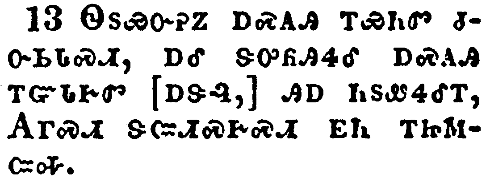</a></td>
</tr>
<tr class="even">
<td>And he called his ten servants, and delivered them ten pounds, and said unto them, Occupy till I come.</td>
</tr>
<tr class="odd">
<td>ᏫᏚᏯᏅᎮᏃ ᎠᏍᎪᎯ ᎢᏯᏂᏛ ᏧᏅᏏᏓᏍᏗ, ᎠᎴ ᏕᎤᏲᎯᏎᎴ ᎠᏍᎪᎯ ᎢᏳᏓᎨᏛ [ᎠᏕᎸ,] ᎯᎠ ᏂᏚᏪᏎᎴᎢ, ᎪᎱᏍᏗ ᏕᏨᏗᏍᎨᏍᏗ ᎬᏂ ᎢᏥᎷᏨᎭ.</td>
</tr>
<tr class="even">
<td>Wi-du-ya-nv-he-no a-s-go-hi i-ya-ni-dv tsu-nv-si-da-s-di, a-le de-u-yo-hi-se-le a-s-go-hi i-yu-da-ge-dv [a-de-lv,] hi-a ni-du-we-se-le-i, Go-hu-s-di de-tsv-di-s-ge-s-di gv-ni i-tsi-lu-tsv-ha.</td>
</tr>
</tbody>
</table>

<table>
<tbody>
<tr class="odd">
<td><a href="031914.png">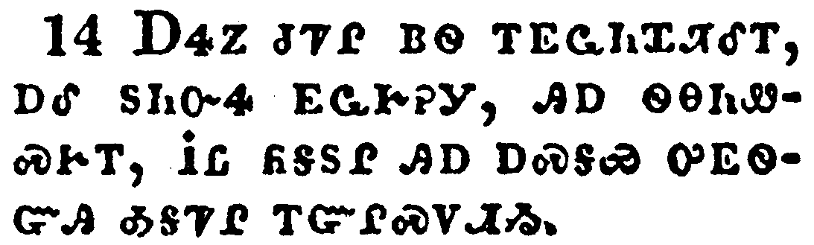</a></td>
</tr>
<tr class="even">
<td>But his citizens hated him, and sent a message after him, saying, We will not have this man to reign over us.</td>
</tr>
<tr class="odd">
<td>ᎠᏎᏃ ᏧᏤᎵ ᏴᏫ ᎢᎬᏩᏂᏆᏘᎴᎢ, ᎠᎴ ᏚᏂᏅᏎ ᎬᏩᎨᎮᎩ, ᎯᎠ ᏫᎾᏂᏪᏍᎨᎢ, ᎥᏝ ᏲᎦᏚᎵ ᎯᎠ ᎠᏍᎦᏯ ᎤᎬᏫᏳᎯ ᎣᎦᏤᎵ ᎢᏳᎵᏍᏙᏗᏱ.</td>
</tr>
<tr class="even">
<td>A-se-no tsu-tse-li yv-wi i-gv-wa-ni-qua-ti-le-i, a-le du-ni-nv-se gv-wa-ge-he-gi, hi-a wi-na-ni-we-s-ge-i, V-tla yo-ga-du-li hi-a a-s-ga-ya u-gv-wi-yu-hi o-ga-tse-li i-yu-li-s-do-di-yi.</td>
</tr>
</tbody>
</table>

<table>
<tbody>
<tr class="odd">
<td><a href="031915.png">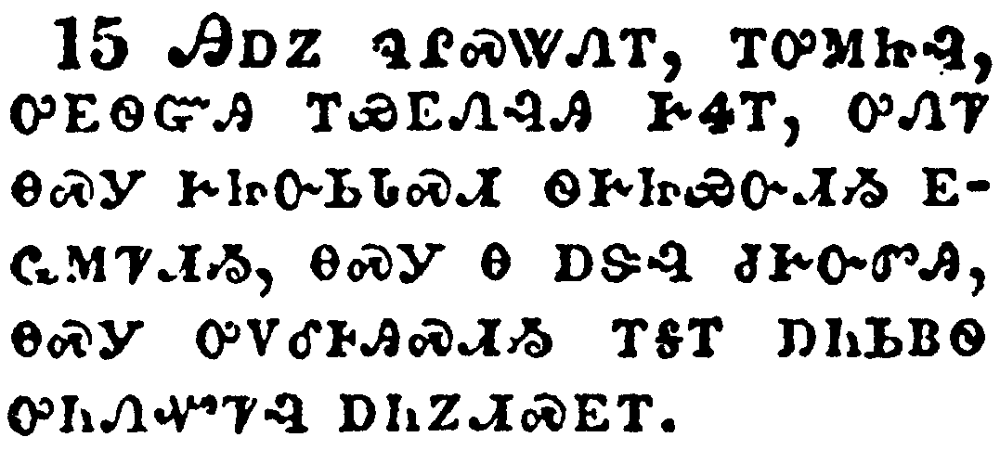</a></td>
</tr>
<tr class="even">
<td>And it came to pass, that when he was returned, having received the kingdom, then he commanded these servants to be called unto him, to whom he had given the money, that he might know how much every man had gained by trading.</td>
</tr>
<tr class="odd">
<td>ᎯᎠᏃ ᏄᎵᏍᏔᏁᎢ, ᎢᎤᎷᏥᎸ, ᎤᎬᏫᏳᎯ ᎢᏯᎬᏁᎸᎯ ᎨᏎᎢ, ᎤᏁᏤ ᎾᏍᎩ ᎨᏥᏅᏏᏓᏍᏗ ᏫᎨᏥᏯᏅᏗᏱ ᎬᏩᎷᏤᏗᏱ, ᎾᏍᎩ Ꮎ ᎠᏕᎸ ᏧᎨᏅᏛᎯ, ᎾᏍᎩ ᎤᏙᎴᎰᎯᏍᏗᏱ ᎢᎦᎢ ᎠᏂᏏᏴᏫ ᎤᏂᏁᏉᏤᎸ ᎠᏂᏃᏗᏍᎬᎢ.</td>
</tr>
<tr class="even">
<td>Hi-a-no nu-li-s-ta-ne-i, i-u-lu-tsi-lv, u-gv-wi-yu-hi i-ya-gv-ne-lv-hi ge-se-i, u-ne-tse na-s-gi ge-tsi-nv-si-da-s-di wi-ge-tsi-ya-nv-di-yi gv-wa-lu-tse-di-yi, na-s-gi na a-de-lv tsu-ge-nv-dv-hi, na-s-gi u-do-le-ho-hi-s-di-yi i-ga-i a-ni-si-yv-wi u-ni-ne-quo-tse-lv a-ni-no-di-s-gv-i.</td>
</tr>
</tbody>
</table>

<table>
<tbody>
<tr class="odd">
<td><a href="031916.png">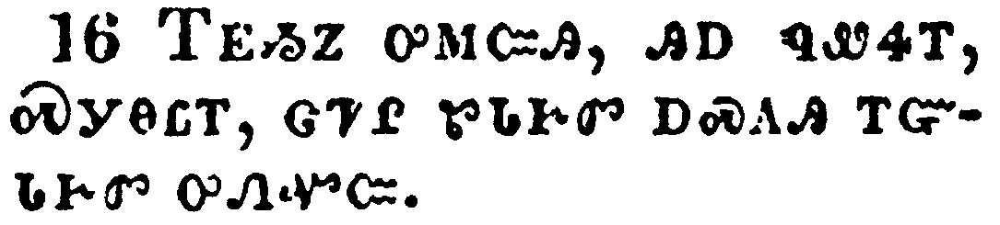</a></td>
</tr>
<tr class="even">
<td>Then came the first, saying, Lord, thy pound hath gained ten pounds.</td>
</tr>
<tr class="odd">
<td>ᎢᎬᏱᏃ ᎤᎷᏨᎯ, ᎯᎠ ᏄᏪᏎᎢ, ᏍᎩᎾᏝᎢ, ᏣᏤᎵ ᏑᏓᎨᏛ ᎠᏍᎪᎯ ᎢᏳᏓᎨᏛ ᎤᏁᏉᏨ.</td>
</tr>
<tr class="even">
<td>I-gv-yi-no u-lu-tsv-hi, hi-a nu-we-se-i, S-gi-na-tla-i, tsa-tse-li su-da-ge-dv a-s-go-hi i-yu-da-ge-dv u-ne-quo-tsv.</td>
</tr>
</tbody>
</table>

<table>
<tbody>
<tr class="odd">
<td><a href="031917.png">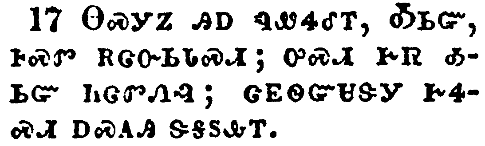</a></td>
</tr>
<tr class="even">
<td>And he said unto him, Well, thou good servant: because thou hast been faithful in a very little, have thou authority over ten cities.</td>
</tr>
<tr class="odd">
<td>ᎾᏍᎩᏃ ᎯᎠ ᏄᏪᏎᎴᎢ, ᎣᏏᏳ, ᎰᏍᏛ ᎡᏣᏅᏏᏓᏍᏗ; ᎤᏍᏗ ᎨᏒ ᎣᏏᏳ ᏂᏣᏛᏁᎸ; ᏣᎬᏫᏳᏌᏕᎩ ᎨᏎᏍᏗ ᎠᏍᎪᎯ ᏕᎦᏚᎲᎢ.</td>
</tr>
<tr class="even">
<td>Na-s-gi-no hi-a nu-we-se-le-i, O-si-yu, ho-s-dv e-tsa-nv-si-da-s-di; u-s-di ge-sv o-si-yu ni-tsa-dv-ne-lv; tsa-gv-wi-yu-sa-de-gi ge-se-s-di a-s-go-hi de-ga-du-hv-i.</td>
</tr>
</tbody>
</table>

<table>
<tbody>
<tr class="odd">
<td><a href="031918.png">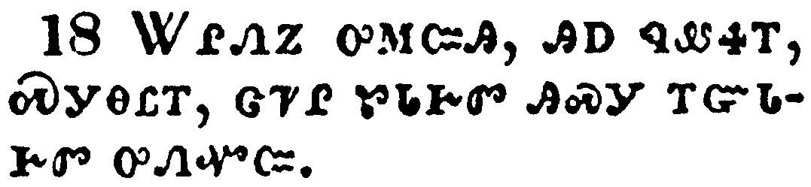</a></td>
</tr>
<tr class="even">
<td>And the second came, saying, Lord, thy pound hath gained five pounds.</td>
</tr>
<tr class="odd">
<td>ᏔᎵᏁᏃ ᎤᎷᏨᎯ, ᎯᎠ ᏄᏪᏎᎢ, ᏍᎩᎾᏝᎢ, ᏣᏤᎵ ᏑᏓᎨᏛ ᎯᏍᎩ ᎢᏳᏓᎨᏛ ᎤᏁᏉᏨ.</td>
</tr>
<tr class="even">
<td>Ta-li-ne-no u-lu-tsv-hi, hi-a nu-we-se-i, S-gi-na-tla-i, tsa-tse-li su-da-ge-dv hi-s-gi i-yu-da-ge-dv u-ne-quo-tsv.</td>
</tr>
</tbody>
</table>

<table>
<tbody>
<tr class="odd">
<td><a href="031919.png">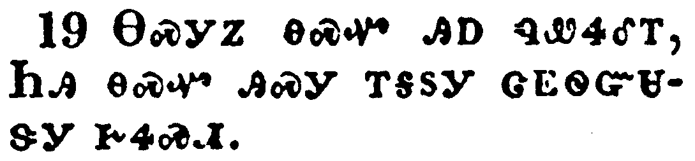</a></td>
</tr>
<tr class="even">
<td>And he said likewise to him, Be thou also over five cities.</td>
</tr>
<tr class="odd">
<td>ᎾᏍᎩᏃ ᎾᏍᏉ ᎯᎠ ᏄᏪᏎᎴᎢ, ᏂᎯ ᎾᏍᏉ ᎯᏍᎩ ᎢᎦᏚᎩ ᏣᎬᏫᏳᏌᏕᎩ ᎨᏎᏍᏗ.</td>
</tr>
<tr class="even">
<td>Na-s-gi-no na-s-quo hi-a nu-we-se-le-i, ni-hi na-s-quo hi-s-gi i-ga-du-gi tsa-gv-wi-yu-sa-de-gi ge-se-s-di.</td>
</tr>
</tbody>
</table>

<table>
<tbody>
<tr class="odd">
<td><a href="031920.png">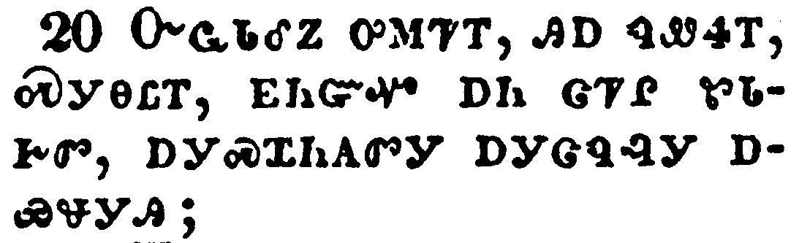</a></td>
</tr>
<tr class="even">
<td>And another came, saying, Lord, behold, here is thy pound, which I have kept laid up in a napkin:</td>
</tr>
<tr class="odd">
<td>ᏅᏩᏓᎴᏃ ᎤᎷᏤᎢ, ᎯᎠ ᏄᏪᏎᎢ, ᏍᎩᎾᏝᎢ, ᎬᏂᏳᏉ ᎠᏂ ᏣᏤᎵ ᏑᏓᎨᏛ, ᎠᎩᏍᏆᏂᎪᏛᎩ ᎠᎩᏣᏄᎸᎩ ᎠᏯᏠᎩᎯ;</td>
</tr>
<tr class="even">
<td>Nv-wa-da-le-no u-lu-tse-i, hi-a nu-we-se-i, S-gi-na-tla-i, gv-ni-yu-quo a-ni tsa-tse-li su-da-ge-dv, a-gi-s-qua-ni-go-dv-gi a-gi-tsa-nu-lv-gi a-ya-tlo-gi-hi;</td>
</tr>
</tbody>
</table>

<table>
<tbody>
<tr class="odd">
<td><a href="031921.png">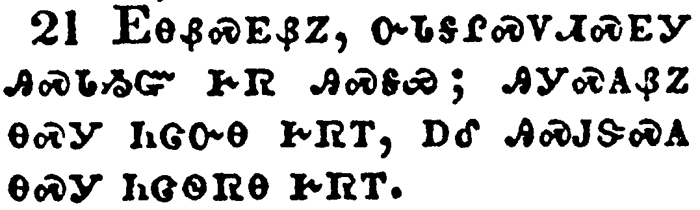</a></td>
</tr>
<tr class="even">
<td>For I feared thee, because thou art an austere man: thou takest up that thou layedst not down, and reapest that thou didst not sow.</td>
</tr>
<tr class="odd">
<td>ᎬᎾᏰᏍᎬᏰᏃ, ᏅᏓᎦᎵᏍᏙᏗᏍᎬᎩ ᎯᏍᏓᏱᏳ ᎨᏒ ᎯᏍᎦᏯ; ᎯᎩᏍᎪᏰᏃ ᎾᏍᎩ ᏂᏣᏅᎾ ᎨᏒᎢ, ᎠᎴ ᎯᏍᎫᏕᏍᎪ ᎾᏍᎩ ᏂᏣᏫᏒᎾ ᎨᏒᎢ.</td>
</tr>
<tr class="even">
<td>Gv-na-ye-s-gv-ye-no, nv-da-ga-li-s-do-di-s-gv-gi hi-s-da-yi-yu ge-sv hi-s-ga-ya; hi-gi-s-go-ye-no na-s-gi ni-tsa-nv-na ge-sv-i, a-le hi-s-gu-de-s-go na-s-gi ni-tsa-wi-sv-na ge-sv-i.</td>
</tr>
</tbody>
</table>

<table>
<tbody>
<tr class="odd">
<td><a href="031922.png">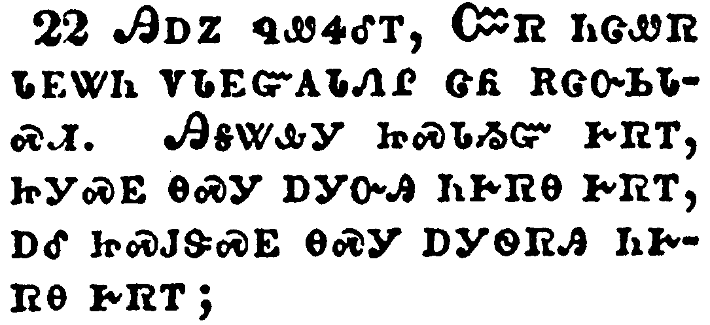</a></td>
</tr>
<tr class="even">
<td>And he saith unto him, Out of thine own mouth will I judge thee, thou wicked servant. Thou knewest that I was an austere man, taking up that I laid not down, and reaping that I did not sow:</td>
</tr>
<tr class="odd">
<td>ᎯᎠᏃ ᏄᏪᏎᎴᎢ, ᏨᏒ ᏂᏣᏪᏒ ᏓᎬᏔᏂ ᏙᏓᎬᏳᎪᏓᏁᎵ ᏣᏲ ᎡᏣᏅᏏᏓᏍᏗ. ᎯᎦᏔᎲᎩ ᏥᏍᏓᏱᏳ ᎨᏒᎢ, ᏥᎩᏍᎬ ᎾᏍᎩ ᎠᎩᏅᎯ ᏂᎨᏒᎾ ᎨᏒᎢ, ᎠᎴ ᏥᏍᎫᏕᏍᎬ ᎾᏍᎩ ᎠᎩᏫᏒᎯ ᏂᎨᏒᎾ ᎨᏒᎢ;</td>
</tr>
<tr class="even">
<td>Hi-a-no nu-we-se-le-i, Tsv-sv ni-tsa-we-sv da-gv-ta-ni do-da-gv-yu-go-da-ne-li tsa-yo e-tsa-nv-si-da-s-di. Hi-ga-ta-hv-gi tsi-s-da-yi-yu ge-sv-i, tsi-gi-s-gv na-s-gi a-gi-nv-hi ni-ge-sv-na ge-sv-i, a-le tsi-s-gu-de-s-gv na-s-gi a-gi-wi-sv-hi ni-ge-sv-na ge-sv-i;</td>
</tr>
</tbody>
</table>

<table>
<tbody>
<tr class="odd">
<td><a href="031923.png">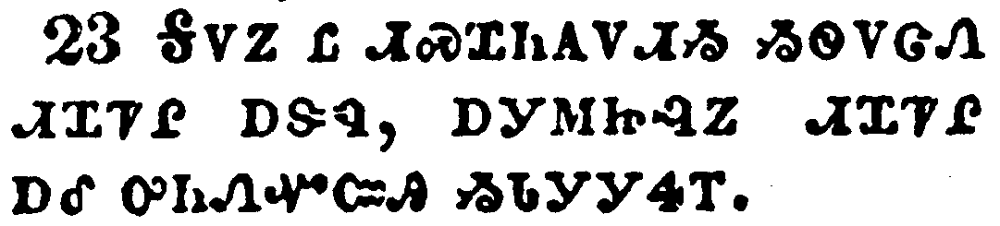</a></td>
</tr>
<tr class="even">
<td>Wherefore then gavest not thou my money into the bank, that at my coming I might have required mine own with usury?</td>
</tr>
<tr class="odd">
<td>ᎦᏙᏃ Ꮭ ᏗᏍᏆᏂᎪᏙᏗᏱ ᏱᏫᏙᏣᏁ ᏗᏆᏤᎵ ᎠᏕᏄ, ᎠᎩᎷᏥᎸᏃ ᏗᏆᏤᎵ ᎠᎴ ᎤᏂᏁᏉᏨᎯ ᏱᏓᎩᎩᏎᎢ.</td>
</tr>
<tr class="even">
<td>Ga-do-no tla di-s-qua-ni-go-do-di-yi yi-wi-do-tsa-ne di-qua-tse-li a-de-nu, a-gi-lu-tsi-lv-no di-qua-tse-li a-le u-ni-ne-quo-tsv-hi yi-da-gi-gi-se-i.</td>
</tr>
</tbody>
</table>

<table>
<tbody>
<tr class="odd">
<td><a href="031924.png">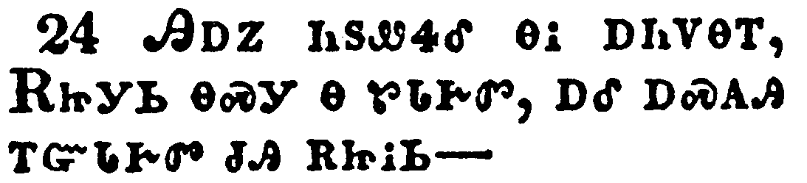</a></td>
</tr>
<tr class="even">
<td>And he said unto them that stood by, Take from him the pound, and give it to him that hath ten pounds.</td>
</tr>
<tr class="odd">
<td>ᎯᎠᏃ ᏂᏚᏪᏎᎴ ᎾᎥ ᎠᏂᏙᎾᎢ, ᎡᏥᎩᏏ ᎾᏍᎩ Ꮎ ᏑᏓᎨᏛ, ᎠᎴ ᎠᏍᎪᎯ ᎢᏳᏓᎨᏛ ᏧᎯ ᎡᏥᎥᏏ^</td>
</tr>
<tr class="even">
<td>Hi-a-no ni-du-we-se-le na-v a-ni-do-na-i, E-tsi-gi-si na-s-gi na su-da-ge-dv, a-le a-s-go-hi i-yu-da-ge-dv tsu-hi e-tsi-v-si^</td>
</tr>
</tbody>
</table>

<table>
<tbody>
<tr class="odd">
<td><a href="031925.png">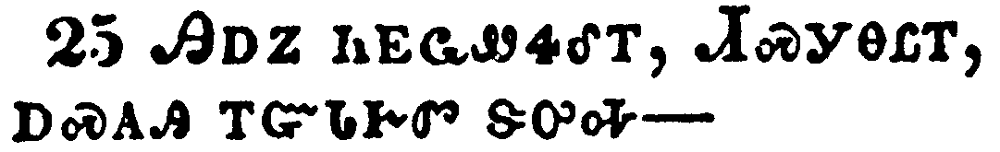</a></td>
</tr>
<tr class="even">
<td>(And they said unto him, Lord, he hath ten pounds.)</td>
</tr>
<tr class="odd">
<td>ᎯᎠᏃ ᏂᎬᏩᏪᏎᎴᎢ, ᏗᏍᎩᎾᏝᎢ, ᎠᏍᎪᎯ ᎢᏳᏓᎨᏛ ᏕᎤᎭ^</td>
</tr>
<tr class="even">
<td>Hi-a-no ni-gv-wa-we-se-le-i, Di-s-gi-na-tla-i, a-s-go-hi i-yu-da-ge-dv de-u-ha^</td>
</tr>
</tbody>
</table>

<table>
<tbody>
<tr class="odd">
<td><a href="031926.png">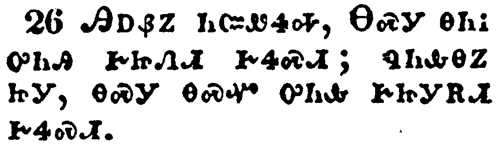</a></td>
</tr>
<tr class="even">
<td>For I say unto you, That unto every one which hath shall be given; and from him that hath not, even that he hath shall be taken away from him.</td>
</tr>
<tr class="odd">
<td>ᎯᎠᏰᏃ ᏂᏨᏪᏎᎭ, ᎾᏍᎩ ᎾᏂᎥ ᎤᏂᎯ ᎨᏥᏁᏗ ᎨᏎᏍᏗ; ᏄᏂᎲᎾᏃ ᏥᎩ, ᎾᏍᎩ ᎾᏍᏉ ᎤᏂᎲ ᎨᏥᎩᎡᏗ ᎨᏎᏍᏗ.</td>
</tr>
<tr class="even">
<td>Hi-a-ye-no ni-tsv-we-se-ha, Na-s-gi na-ni-v u-ni-hi ge-tsi-ne-di ge-se-s-di; nu-ni-hv-na-no tsi-gi, na-s-gi na-s-quo u-ni-hv ge-tsi-gi-e-di ge-se-s-di.</td>
</tr>
</tbody>
</table>

<table>
<tbody>
<tr class="odd">
<td><a href="031927.png">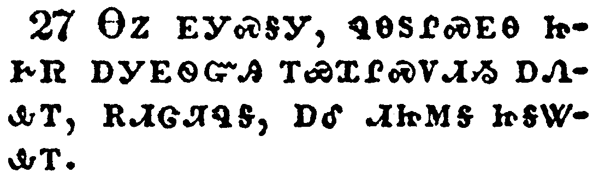</a></td>
</tr>
<tr class="even">
<td>But those mine enemies, which would not that I should reign over them, bring hither, and slay them before me.</td>
</tr>
<tr class="odd">
<td>ᎾᏃ ᎬᎩᏍᎦᎩ, ᏄᎾᏚᎵᏍᎬᎾ ᏥᎨᏒ ᎠᎩᎬᏫᏳᎯ ᎢᏯᏆᎵᏍᏙᏗᏱ ᎠᏁᎲᎢ, ᎡᏗᏣᏘᏄᎦ, ᎠᎴ ᏗᏥᎷᎦ ᏥᎦᏔᎲᎢ</td>
</tr>
<tr class="even">
<td>Na-no gv-gi-s-ga-gi, nu-na-du-li-s-gv-na tsi-ge-sv a-gi-gv-wi-yu-hi i-ya-qua-li-s-do-di-yi a-ne-hv-i, e-di-tsa-ti-nu-ga, a-le di-tsi-lu-ga tsi-ga-ta-hv-i</td>
</tr>
</tbody>
</table>

<table>
<tbody>
<tr class="odd">
<td><a href="031928.png">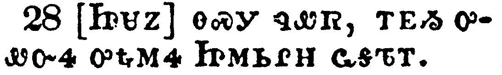</a></td>
</tr>
<tr class="even">
<td>And when he had thus spoken, he went before, ascending up to Jerusalem.</td>
</tr>
<tr class="odd">
<td>[ᏥᏌᏃ] ᎾᏍᎩ ᏄᏪᏒ, ᎢᎬᏱ ᎤᏪᏅᎭ ᎤᎿᎭᎷᏎ ᏥᎷᏏᎵᎻ ᏩᎦᏖᎢ.</td>
</tr>
<tr class="even">
<td>[Tsi-sa-no] na-s-gi nu-we-sv, i-gv-yi u-we-nv-ha u-hna-lu-se Tsi-lu-si-li-mi wa-ga-te-i.</td>
</tr>
</tbody>
</table>

<table>
<tbody>
<tr class="odd">
<td><a href="031929.png">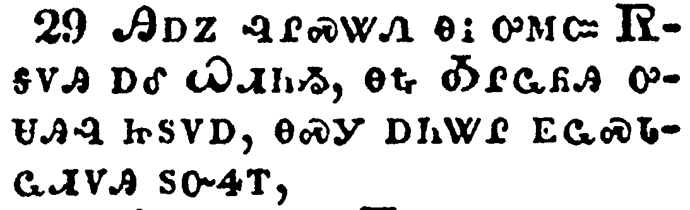</a></td>
</tr>
<tr class="even">
<td>And it came to pass, when he was come nigh to Bethphage and Bethany, at the mount called the mount of Olives, he sent two of his disciples,</td>
</tr>
<tr class="odd">
<td>ᎯᎠᏃ ᎸᎵᏍᏔᏁ ᎾᎥ ᎤᎷᏨ ᏒᎦᏙᎯ ᎠᎴ ᏇᏗᏂᏱ, ᎾᎿᎭᎣᎵᏩᏲᎯ ᎤᏌᎯᎸ ᏥᏚᏙᎠ, ᎾᏍᎩ ᎠᏂᏔᎵ ᎬᏩᏍᏓᏩᏗᏙᎯ ᏚᏅᏎᎢ,</td>
</tr>
<tr class="even">
<td>Hi-a-no lv-li-s-ta-ne na-v u-lu-tsv Sv-ga-do-hi a-le Que-di-ni-yi, na-hna O-li-wa-yo-hi u-sa-hi-lv tsi-du-do-a, na-s-gi a-ni-ta-li gv-wa-s-da-wa-di-do-hi du-nv-se-i,</td>
</tr>
</tbody>
</table>

<table>
<tbody>
<tr class="odd">
<td><a href="031930.png">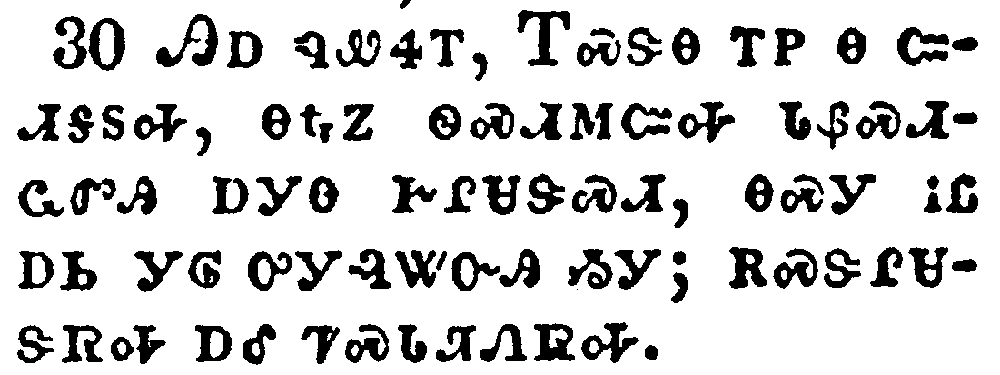</a></td>
</tr>
<tr class="even">
<td>Saying, Go ye into the village over against you; in the which at your entering ye shall find a colt tied, whereon yet never man sat: loose him, and bring him hither.</td>
</tr>
<tr class="odd">
<td>ᎯᎠ ᏄᏪᏎᎢ, ᎢᏍᏕᎾ ᎢᏢ Ꮎ ᏨᏗᎦᏚᎭ, ᎾᎿᎭᏃ ᏫᏍᏗᎷᏨᎭ ᏓᏰᏍᏗᏩᏛᎯ ᎠᎩᎾ ᎨᎵᏌᏕᏍᏗ, ᎾᏍᎩ ᎥᏝ ᎠᏏ ᎩᎶ ᎤᎩᎸᏔᏅᎯ ᏱᎩ; ᎡᏍᏕᎵᏌᏕᏒᎭ ᎠᎴ ᏤᏍᏓᏘᏁᏒᎭ.</td>
</tr>
<tr class="even">
<td>Hi-a nu-we-se-i, I-s-de-na i-tlv na tsv-di-ga-du-ha, na-hna-no wi-s-di-lu-tsv-ha da-ye-s-di-wa-dv-hi a-gi-na ge-li-sa-de-s-di, na-s-gi v-tla a-si gi-lo u-gi-lv-ta-nv-hi yi-gi; e-s-de-li-sa-de-sv-ha a-le tse-s-da-ti-ne-sv-ha.</td>
</tr>
</tbody>
</table>

<table>
<tbody>
<tr class="odd">
<td><a href="031931.png">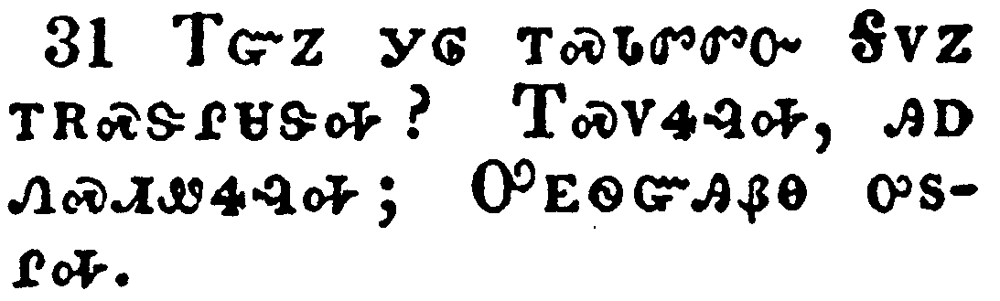</a></td>
</tr>
<tr class="even">
<td>And if any man ask you, Why do ye loose him? thus shall ye say unto him, Because the Lord hath need of him.</td>
</tr>
<tr class="odd">
<td>ᎢᏳᏃ ᎩᎶ ᎢᏍᏓᏛᏛᏅ ᎦᏙᏃ ᎢᎡᏍᏕᎵᏌᏕᎭ? ᎢᏍᏙᏎᎸᎭ, ᎯᎠ ᏁᏍᏗᏪᏎᎸᎭ; ᎤᎬᏫᏳᎯᏰᎾ ᎤᏚᎵᎭ.</td>
</tr>
<tr class="even">
<td>I-yu-no gi-lo i-s-da-dv-dv-nv Ga-do-no i-e-s-de-li-sa-de-ha? I-s-do-se-lv-ha, hi-a ne-s-di-we-se-lv-ha; U-gv-wi-yu-hi-ye-na u-du-li-ha.</td>
</tr>
</tbody>
</table>

<table>
<tbody>
<tr class="odd">
<td><a href="031932.png">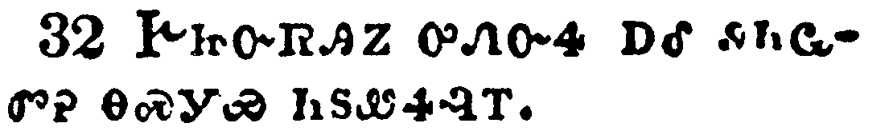</a></td>
</tr>
<tr class="even">
<td>And they that were sent went their way, and found even as he had said unto them.</td>
</tr>
<tr class="odd">
<td>ᎨᏥᏅᏒᎯᏃ ᎤᏁᏅᏎ ᎠᎴ ᏭᏂᏩᏛᎮ ᎾᏍᎩᏯ ᏂᏚᏪᏎᎸᎢ.</td>
</tr>
<tr class="even">
<td>Ge-tsi-nv-sv-hi-no u-ne-nv-se a-le wu-ni-wa-dv-he na-s-gi-ya ni-du-we-se-lv-i.</td>
</tr>
</tbody>
</table>

<table>
<tbody>
<tr class="odd">
<td><a href="031933.png">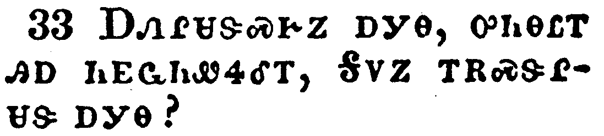</a></td>
</tr>
<tr class="even">
<td>And as they were loosing the colt, the owners thereof said unto them, Why loose ye the colt?</td>
</tr>
<tr class="odd">
<td>ᎠᏁᎵᏌᏕᏍᎨᏃ ᎠᎩᎾ, ᎤᏂᎾᏝᎢ ᎯᎠ ᏂᎬᏩᏂᏪᏎᎴᎢ, ᎦᏙᏃ ᎢᎡᏍᏕᎵᏌᏕ ᎠᎩᎾ?</td>
</tr>
<tr class="even">
<td>A-ne-li-sa-de-s-ge-no a-gi-na, u-ni-na-tla-i hi-a ni-gv-wa-ni-we-se-le-i, Ga-do-no i-e-s-de-li-sa-de a-gi-na?</td>
</tr>
</tbody>
</table>

<table>
<tbody>
<tr class="odd">
<td><a href="031934.png">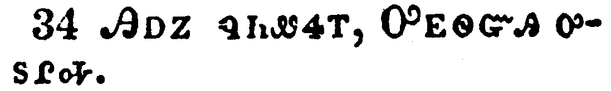</a></td>
</tr>
<tr class="even">
<td>And they said, The Lord hath need of him.</td>
</tr>
<tr class="odd">
<td>ᎯᎠᏃ ᏄᏂᏪᏎᎢ, ᎤᎬᏫᏳᎯ ᎤᏚᎵᎭ.</td>
</tr>
<tr class="even">
<td>Hi-a-no nu-ni-we-se-i, U-gv-wi-yu-hi u-du-li-ha.</td>
</tr>
</tbody>
</table>

<table>
<tbody>
<tr class="odd">
<td><a href="031935.png">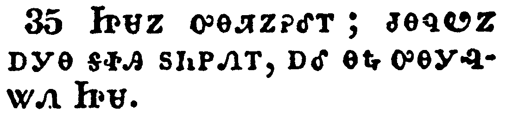</a></td>
</tr>
<tr class="even">
<td>And they brought him to Jesus: and they cast their garments upon the colt, and they set Jesus thereon.</td>
</tr>
<tr class="odd">
<td>ᏥᏌᏃ ᎤᎾᏘᏃᎮᎴᎢ; ᏧᎾᏄᏬᏃ ᎠᎩᎾ ᎦᏐᎯ ᏚᏂᏢᏁᎢ, ᎠᎴ ᎾᎿᎭᎤᎾᎩᎸᏔᏁ ᏥᏌ.</td>
</tr>
<tr class="even">
<td>Tsi-sa-no u-na-ti-no-he-le-i; tsu-na-nu-wo-no a-gi-na ga-so-hi du-ni-tlv-ne-i, a-le na-hna u-na-gi-lv-ta-ne Tsi-sa.</td>
</tr>
</tbody>
</table>

<table>
<tbody>
<tr class="odd">
<td></td>
</tr>
<tr class="even">
<td>And as he went, they spread their clothes in the way.</td>
</tr>
<tr class="odd">
<td>ᎠᎢᏒᏃ ᏧᎾᏄᏬ ᏚᏂᏰᏍᏛᏁ ᏅᏃᎯ.</td>
</tr>
<tr class="even">
<td>A-i-sv-no tsu-na-nu-wo du-ni-ye-s-dv-ne nv-no-hi.</td>
</tr>
</tbody>
</table>

<table>
<tbody>
<tr class="odd">
<td><a href="031937.png">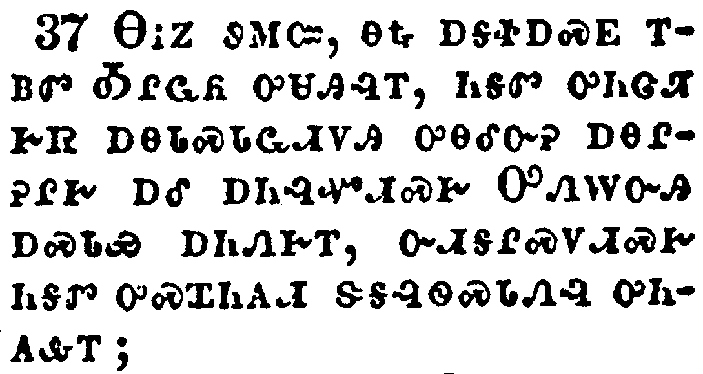</a></td>
</tr>
<tr class="even">
<td>And when he was come nigh, even now at the descent of the mount of Olives, the whole multitude of the disciples began to rejoice and praise God with a loud voice for all the mighty works that they had seen;</td>
</tr>
<tr class="odd">
<td>ᎾᎥᏃ ᏭᎷᏨ, ᎾᎿᎭᎠᎦᏐᎠᏍᎬ ᎢᏴᏛ ᎣᎵᏩᏲ ᎤᏌᎯᎸᎢ, ᏂᎦᏛ ᎤᏂᏣᏘ ᎨᏒ ᎠᎾᏓᏍᏓᏩᏗᏙᎯ ᎤᎾᎴᏅᎮ ᎠᎾᎵᎮᎵᎨ ᎠᎴ ᎠᏂᎸᏉᏗᏍᎨ ᎤᏁᎳᏅᎯ ᎠᏍᏓᏯ ᎠᏂᏁᎨᎢ, ᏅᏗᎦᎵᏍᏙᏗᏍᎨ ᏂᎦᏛ ᎤᏍᏆᏂᎪᏗ ᏕᎦᎸᏫᏍᏓᏁᎸ ᎤᏂᎪᎲᎢ;</td>
</tr>
<tr class="even">
<td>Na-v-no wu-lu-tsv, na-hna a-ga-so-a-s-gv i-yv-dv O-li-wa-yo u-sa-hi-lv-i, ni-ga-dv u-ni-tsa-ti ge-sv a-na-da-s-da-wa-di-do-hi u-na-le-nv-he a-na-li-he-li-ge a-le a-ni-lv-quo-di-s-ge U-ne-la-nv-hi a-s-da-ya a-ni-ne-ge-i, nv-di-ga-li-s-do-di-s-ge ni-ga-dv u-s-qua-ni-go-di de-ga-lv-wi-s-da-ne-lv u-ni-go-hv-i;</td>
</tr>
</tbody>
</table>

<table>
<tbody>
<tr class="odd">
<td><a href="031938.png">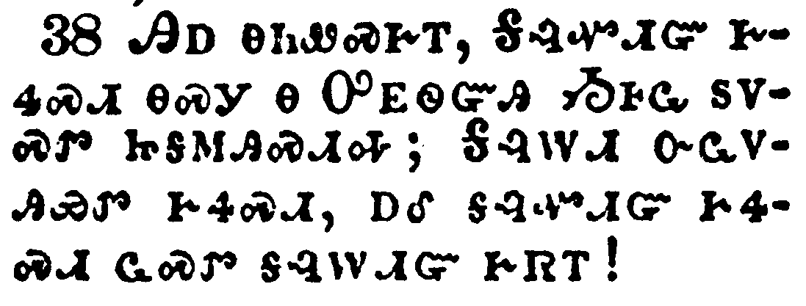</a></td>
</tr>
<tr class="even">
<td>Saying, Blessed be the King that cometh in the name of the Lord: peace in heaven, and glory in the highest.</td>
</tr>
<tr class="odd">
<td>ᎯᎠ ᎾᏂᏪᏍᎨᎢ. ᎦᎸᏉᏗᏳ ᎨᏎᏍᏗ ᎾᏍᎩ Ꮎ ᎤᎬᏫᏳᎯ ᏱᎰᏩ ᏚᏙᏍᏛ ᏥᎦᎷᎯᏍᏗᎭ; ᎦᎸᎳᏗ ᏅᏩᏙᎯᏯᏛ ᎨᏎᏍᏗ, ᎠᎴ ᎦᎸᏉᏗᏳ ᎨᏎᏍᏗ ᏩᏍᏛ ᎦᎸᎳᏗᏳ ᎨᏒᎢ!</td>
</tr>
<tr class="even">
<td>Hi-a na-ni-we-s-ge-i. Ga-lv-quo-di-yu ge-se-s-di na-s-gi na U-gv-wi-yu-hi Yi-ho-wa du-do-s-dv tsi-ga-lu-hi-s-di-ha; Ga-lv-la-di nv-wa-do-hi-ya-dv ge-se-s-di, a-le ga-lv-quo-di-yu ge-se-s-di wa-s-dv ga-lv-la-di-yu ge-sv-i!</td>
</tr>
</tbody>
</table>

<table>
<tbody>
<tr class="odd">
<td><a href="031939.png">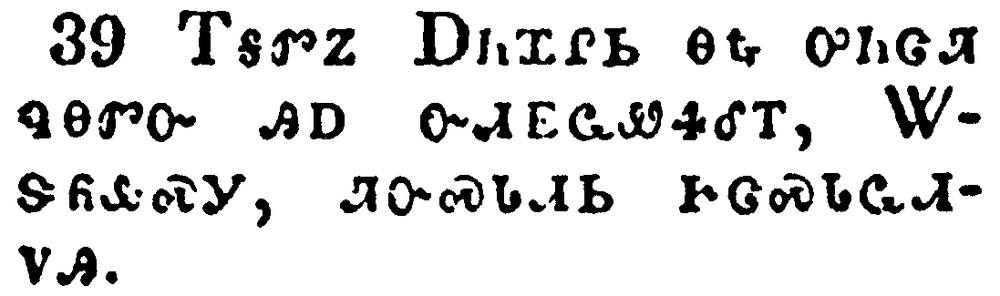</a></td>
</tr>
<tr class="even">
<td>And some of the Pharisees from among the multitude said unto him, Master, rebuke thy disciples.</td>
</tr>
<tr class="odd">
<td>ᎢᎦᏛᏃ ᎠᏂᏆᎵᏏ ᎾᎿᎭᎤᏂᏣᏘ ᏄᎾᏛᏅ ᎯᎠ ᏅᏗᎬᏩᏪᏎᎴᎢ, ᏔᏕᏲᎲᏍᎩ, ᏘᏅᏍᏓᏗᏏ ᎨᏣᏍᏓᏩᏗᏙᎯ.</td>
</tr>
<tr class="even">
<td>I-ga-dv-no A-ni-qua-li-si na-hna u-ni-tsa-ti nu-na-dv-nv hi-a nv-di-gv-wa-we-se-le-i, Ta-de-yo-hv-s-gi, ti-nv-s-da-di-si ge-tsa-s-da-wa-di-do-hi.</td>
</tr>
</tbody>
</table>

<table>
<tbody>
<tr class="odd">
<td><a href="031940.png">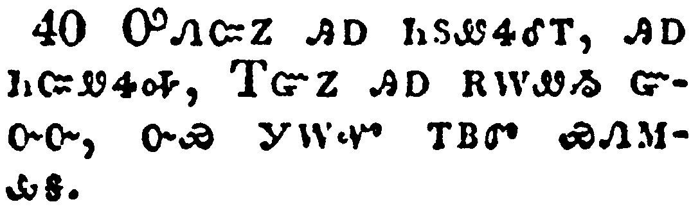</a></td>
</tr>
<tr class="even">
<td>And he answered and said unto them, I tell you that, if these should hold their peace, the stones would immediately cry out.</td>
</tr>
<tr class="odd">
<td>ᎤᏁᏨᏃ ᎯᎠ ᏂᏚᏪᏎᎴᎢ, ᎯᎠ ᏂᏨᏪᏎᎭ, ᎢᏳᏃ ᎯᎠ ᎡᎳᏪᏱ ᏳᏅᏅ, ᏅᏯ ᎩᎳᏉ ᎢᏴᏛ ᏯᏁᎷᎲᎦ.</td>
</tr>
<tr class="even">
<td>U-ne-tsv-no hi-a ni-du-we-se-le-i, hi-a ni-tsv-we-se-ha, I-yu-no hi-a e-la-we-yi yu-nv-nv, nv-ya gi-la-quo i-yv-dv ya-ne-lu-hv-ga.</td>
</tr>
</tbody>
</table>

<table>
<tbody>
<tr class="odd">
<td><a href="031941.png">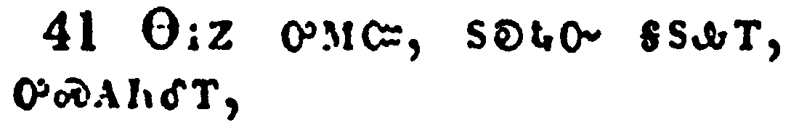</a></td>
</tr>
<tr class="even">
<td>And when he was come near, he beheld the city, and wept over it,</td>
</tr>
<tr class="odd">
<td>ᎾᎥᏃ ᎤᎷᏨ, ᏚᎧᎿᎭᏅ ᎦᏚᎲᎢ, ᎤᏍᎪᏂᎴᎢ,</td>
</tr>
<tr class="even">
<td>Na-v-no u-lu-tsv, du-ka-hna-nv ga-du-hv-i, u-s-go-ni-le-i,</td>
</tr>
</tbody>
</table>

<table>
<tbody>
<tr class="odd">
<td><a href="031942.png">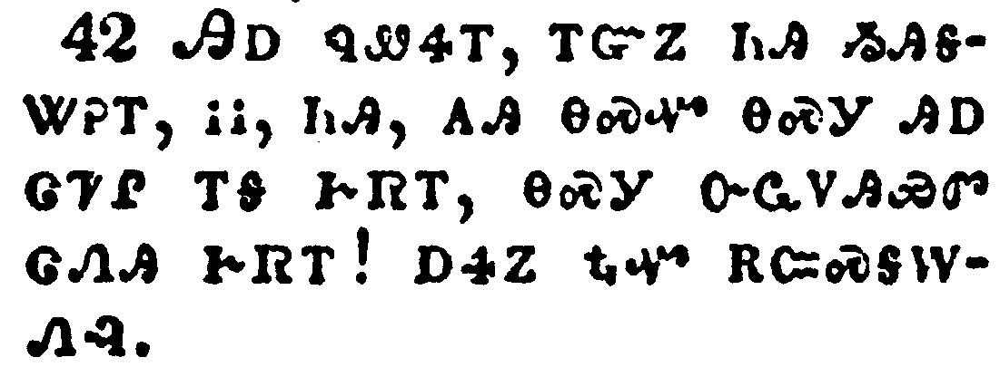</a></td>
</tr>
<tr class="even">
<td>Saying, If thou hadst known, even thou, at least in this thy day, the things which belong unto thy peace! but now they are hid from thine eyes.</td>
</tr>
<tr class="odd">
<td>ᎯᎠ ᏄᏪᏎᎢ, ᎢᏳᏃ ᏂᎯ ᏱᎯᎦᏔᎮᎢ, ᎥᎥ, ᏂᎯ, ᎪᎯ ᎾᏍᏉ ᎾᏍᎩ ᎯᎠ ᏣᏤᎵ ᎢᎦ ᎨᏒᎢ, ᎾᏍᎩ ᏅᏩᏙᎯᏯᏛ ᏣᏁᎯ ᎨᏒᎢ! ᎠᏎᏃ ᎿᎭᏉ ᎡᏨᏍᎦᎳᏁᎸ.</td>
</tr>
<tr class="even">
<td>Hi-a nu-we-se-i, i-yu-no ni-hi yi-hi-ga-ta-he-i, v-v, ni-hi, go-hi na-s-quo na-s-gi hi-a tsa-tse-li i-ga ge-sv-i, na-s-gi nv-wa-do-hi-ya-dv tsa-ne-hi ge-sv-i! a-se-no hna-quo e-tsv-s-ga-la-ne-lv.</td>
</tr>
</tbody>
</table>

<table>
<tbody>
<tr class="odd">
<td><a href="031943.png">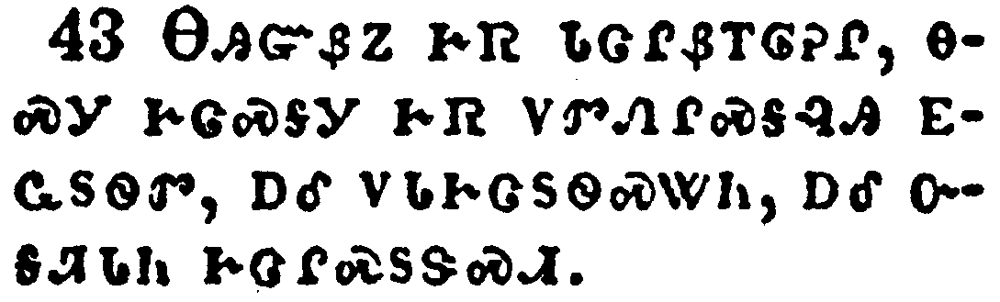</a></td>
</tr>
<tr class="even">
<td>For the days shall come upon thee, that thine enemies shall cast a trench about thee, and compass thee round, and keep thee in on every side,</td>
</tr>
<tr class="odd">
<td>ᎾᎯᏳᏰᏃ ᎨᏒ ᏓᏣᎵᏰᎢᎶᎮᎵ, ᎾᏍᎩ ᎨᏣᏍᎦᎩ ᎨᏒ ᏙᏛᏁᎵᏍᎦᎸᎯ ᎬᏩᏚᏫᏛ, ᎠᎴ ᏙᏓᎨᏣᏚᏫᏍᏔᏂ, ᎠᎴ ᏅᎦᏘᏓᏂ ᎨᏣᎵᏍᏚᏕᏍᏗ.</td>
</tr>
<tr class="even">
<td>Na-hi-yu-ye-no ge-sv da-tsa-li-ye-i-lo-he-li, na-s-gi ge-tsa-s-ga-gi ge-sv do-dv-ne-li-s-ga-lv-hi gv-wa-du-wi-dv, a-le do-da-ge-tsa-du-wi-s-ta-ni, a-le nv-ga-ti-da-ni ge-tsa-li-s-du-de-s-di.</td>
</tr>
</tbody>
</table>

<table>
<tbody>
<tr class="odd">
<td><a href="031944.png">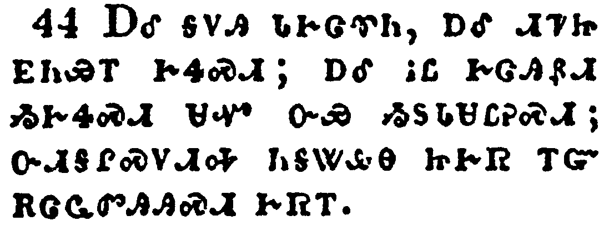</a></td>
</tr>
<tr class="even">
<td>And shall lay thee even with the ground, and thy children within thee; and they shall not leave in thee one stone upon another; because thou knewest not the time of thy visitation.</td>
</tr>
<tr class="odd">
<td>ᎠᎴ ᎦᏙᎯ ᏓᎨᏣᏡᏂ, ᎠᎴ ᏗᏤᏥ ᎬᏂᏯᎢ ᎨᏎᏍᏗ; ᎠᎴ ᎥᏝ ᎨᏣᎯᏰᏗ ᏱᎨᏎᏍᏗ ᏌᏉ ᏅᏯ ᏱᏚᏓᏌᏝᎮᏍᏗ; ᏅᏗᎦᎵᏍᏙᏗᎭ ᏂᎦᏔᎲᎾ ᏥᎨᏒ ᎢᏳ ᎡᏣᏩᏛᎯᎯᏍᏗ ᎨᏒᎢ.</td>
</tr>
<tr class="even">
<td>A-le ga-do-hi da-ge-tsa-tlu-ni, a-le di-tse-tsi gv-ni-ya-i ge-se-s-di; a-le v-tla ge-tsa-hi-ye-di yi-ge-se-s-di sa-quo nv-ya yi-du-da-sa-tla-he-s-di; nv-di-ga-li-s-do-di-ha ni-ga-ta-hv-na tsi-ge-sv i-yu e-tsa-wa-dv-hi-hi-s-di ge-sv-i.</td>
</tr>
</tbody>
</table>

<table>
<tbody>
<tr class="odd">
<td><a href="031945.png">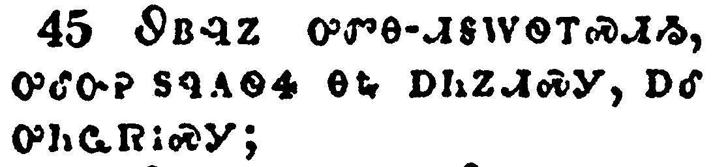</a></td>
</tr>
<tr class="even">
<td>And he went into the temple, and began to cast out them that sold therein, and them that bought;</td>
</tr>
<tr class="odd">
<td>ᏭᏴᎸᏃ ᎤᏛᎾ-ᏗᎦᎳᏫᎢᏍᏗᏱ, ᎤᎴᏅᎮ ᏚᏄᎪᏫᏎ ᎾᎿᎭᎠᏂᏃᏗᏍᎩ, ᎠᎴ ᎤᏂᏩᏒᎥᏍᎩ;</td>
</tr>
<tr class="even">
<td>Wu-yv-lv-no u-dv-na--di-ga-la-wi-i-s-di-yi, u-le-nv-he du-nu-go-wi-se na-hna a-ni-no-di-s-gi, a-le u-ni-wa-sv-v-s-gi;</td>
</tr>
</tbody>
</table>

<table>
<tbody>
<tr class="odd">
<td><a href="031946.png">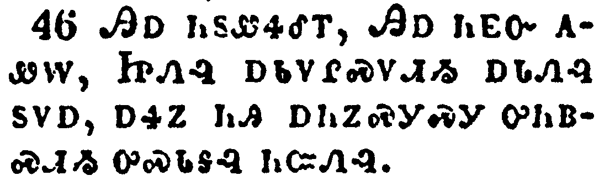</a></td>
</tr>
<tr class="even">
<td>Saying unto them, It is written, My house is the house of prayer: but ye have made it a den of thieves.</td>
</tr>
<tr class="odd">
<td>ᎯᎠ ᏂᏚᏪᏎᎴᎢ, ᎯᎠ ᏂᎬᏅ ᎪᏪᎳ, ᏥᏁᎸ ᎠᏓᏙᎵᏍᏙᏗᏱ ᎠᏓᏁᎸ ᏚᏙᎠ, ᎠᏎᏃ ᏂᎯ ᎠᏂᏃᏍᎩᏍᎩ ᎤᏂᏴᏍᏗᏱ ᎤᏍᏓᎦᎸ ᏂᏨᏁᎸ.</td>
</tr>
<tr class="even">
<td>Hi-a ni-du-we-se-le-i, Hi-a ni-gv-nv go-we-la, Tsi-ne-lv a-da-do-li-s-do-di-yi a-da-ne-lv du-do-a, a-se-no ni-hi a-ni-no-s-gi-s-gi u-ni-yv-s-di-yi u-s-da-ga-lv ni-tsv-ne-lv.</td>
</tr>
</tbody>
</table>

<table>
<tbody>
<tr class="odd">
<td><a href="031947.png">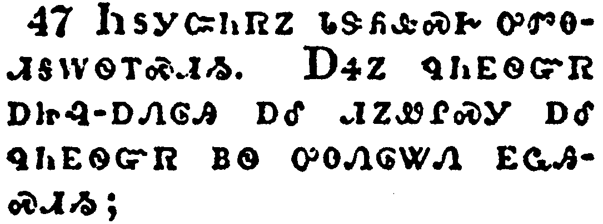</a></td>
</tr>
<tr class="even">
<td>And he taught daily in the temple. But the chief priests and the scribes and the chief of the people sought to destroy him,</td>
</tr>
<tr class="odd">
<td>ᏂᏚᎩᏨᏂᏒᏃ ᏓᏕᏲᎲᏍᎨ ᎤᏛᎾᏗᎦᎳᏫᎢᏍᏗᏱ. ᎠᏎᏃ ᏄᏂᎬᏫᏳᏒ ᎠᏥᎸ-ᎠᏁᎶᎯ ᎠᎴ ᏗᏃᏪᎵᏍᎩ ᎠᎴ ᏄᏂᎬᏫᏳᏒ ᎠᏫ ᎤᎾᏁᎶᏔᏁ ᎬᏩᎯᏍᏗᏱ.</td>
</tr>
<tr class="even">
<td>Ni-du-gi-tsv-ni-sv-no da-de-yo-hv-s-ge u-dv-na-di-ga-la-wi-i-s-di-yi. A-se-no nu-ni-gv-wi-yu-sv a-tsi-lv--a-ne-lo-hi a-le di-no-we-li-s-gi a-le nu-ni-gv-wi-yu-sv a-wi u-na-ne-lo-ta-ne gv-wa-hi-s-di-yi.</td>
</tr>
</tbody>
</table>

<table>
<tbody>
<tr class="odd">
<td><a href="031948.png">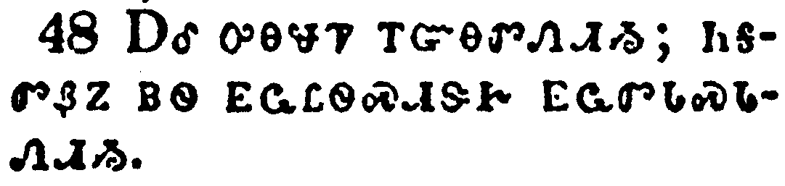</a></td>
</tr>
<tr class="even">
<td>And could not find what they might do: for all the people were very attentive to hear him.</td>
</tr>
<tr class="odd">
<td>ᎠᎴ ᎤᎾᏠᏤ ᎢᏳᎾᏛᏁᏗᏱ; ᏂᎦᏛᏰᏃ ᏴᏫ ᎬᏩᏝᏫᏍᏗᏕᎨ ᎬᏩᏛᏓᏍᏓᏁᏗᏱ.</td>
</tr>
<tr class="even">
<td>A-le u-na-tlo-tse i-yu-na-dv-ne-di-yi; ni-ga-dv-ye-no yv-wi gv-wa-tla-wi-s-di-de-ge gv-wa-dv-da-s-da-ne-di-yi.</td>
</tr>
</tbody>
</table>

