+++
draft=false
date = 2014-12-18T21:11:07Z
title = "Luke - Chapter 23 - Cherokee New Testament"
weight = 1418955067

[taxonomies]

authors = ["Timothy Legg"]
categories = []
tags = []

[extra]
+++

<table>
<tbody>
<tr class="odd">
<td><a href="032301.png">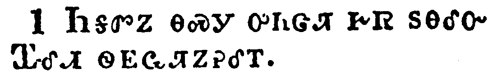</a></td>
</tr>
<tr class="even">
<td>And the whole multitude of them arose, and led him unto Pilate.</td>
</tr>
<tr class="odd">
<td>ᏂᎦᏛᏃ ᎾᏍᎩ ᎤᏂᏣᏘ ᎨᏒ ᏚᎾᎴᏅ ᏆᎴᏗ ᏫᎬᏩᏘᏃᎮᎴᎢ.</td>
</tr>
<tr class="even">
<td>Ni-ga-dv-no na-s-gi u-ni-tsa-ti ge-sv du-na-le-nv Qua-le-di wi-gv-wa-ti-no-he-le-i.</td>
</tr>
</tbody>
</table>

<table>
<tbody>
<tr class="odd">
<td><a href="032302.png">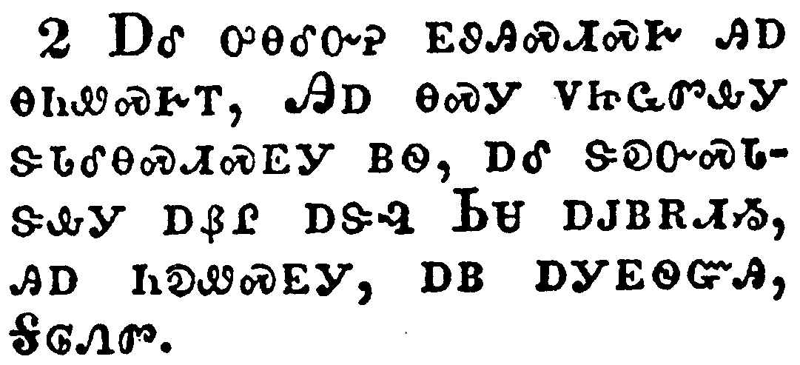</a></td>
</tr>
<tr class="even">
<td>And they began to accuse him, saying, We found this fellow perverting the nation, and forbidding to give tribute to Caesar, saying that he himself is Christ a King.</td>
</tr>
<tr class="odd">
<td>ᎠᎴ ᎤᎾᎴᏅᎮ ᎬᏭᎯᏍᏗᏍᎨ ᎯᎠ ᎾᏂᏪᏍᎨᎢ, ᎯᎠ ᎾᏍᎩ ᏙᏥᏩᏛᎲᎩ ᏕᏓᎴᎾᏍᏗᏍᎬᎩ ᏴᏫ, ᎠᎴ ᏕᎧᏅᏍᏓᏕᎲᎩ ᎠᏰᎵ ᎠᏕᎸ ᏏᏌ ᎠᎫᏴᎡᏗᏱ, ᎯᎠ ᏂᎧᏪᏍᎬᎩ, ᎠᏴ ᎠᎩᎬᏫᏳᎯ, ᎦᎶᏁᏛ.</td>
</tr>
<tr class="even">
<td>A-le u-na-le-nv-he gv-wu-hi-s-di-s-ge hi-a na-ni-we-s-ge-i, Hi-a na-s-gi do-tsi-wa-dv-hv-gi de-da-le-na-s-di-s-gv-gi yv-wi, a-le de-ka-nv-s-da-de-hv-gi a-ye-li a-de-lv Si-sa a-gu-yv-e-di-yi, hi-a ni-ka-we-s-gv-gi, a-yv a-gi-gv-wi-yu-hi, Ga-lo-ne-dv.</td>
</tr>
</tbody>
</table>

<table>
<tbody>
<tr class="odd">
<td><a href="032303.png">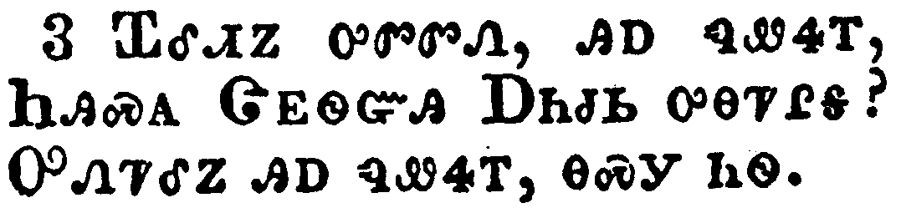</a></td>
</tr>
<tr class="even">
<td>And Pilate asked him, saying, Art thou the King of the Jews? And he answered him and said, Thou sayest it.</td>
</tr>
<tr class="odd">
<td>ᏆᎴᏗᏃ ᎤᏛᏛᏁ, ᎯᎠ ᏄᏪᏎᎢ, ᏂᎯᏍᎪ ᏣᎬᏫᏳᎯ ᎠᏂᏧᏏ ᎤᎾᏤᎵᎦ? ᎤᏁᏤᎴᏃ ᎯᎠ ᏄᏪᏎᎢ, ᎾᏍᎩ ᏂᏫ.</td>
</tr>
<tr class="even">
<td>Qua-le-di-no u-dv-dv-ne, hi-a nu-we-se-i, Ni-hi-s-go Tsa-gv-wi-yu-hi A-ni-tsu-si u-na-tse-li-ga? U-ne-tse-le-no hi-a nu-we-se-i, na-s-gi ni-wi.</td>
</tr>
</tbody>
</table>

<table>
<tbody>
<tr class="odd">
<td><a href="032304.png">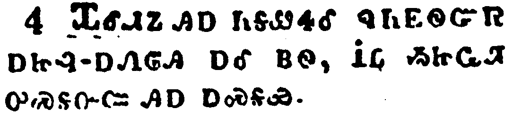</a></td>
</tr>
<tr class="even">
<td>Then said Pilate to the chief priests and to the people, I find no fault in this man.</td>
</tr>
<tr class="odd">
<td>ᏆᎴᏗᏃ ᎯᎠ ᏂᎦᏪᏎᎴ ᏄᏂᎬᏫᏳᏒ ᎠᏥᎸ-ᎠᏁᎶᎯ ᎠᎴ ᏴᏫ, ᎥᏝ ᏱᏥᏩᏘ ᎤᏍᎦᏅᏨ ᎯᎠ ᎠᏍᎦᏯ.</td>
</tr>
<tr class="even">
<td>Qua-le-di-no hi-a ni-ga-we-se-le nu-ni-gv-wi-yu-sv a-tsi-lv--a-ne-lo-hi a-le yv-wi, V-tla yi-tsi-wa-ti u-s-ga-nv-tsv hi-a a-s-ga-ya.</td>
</tr>
</tbody>
</table>

<table>
<tbody>
<tr class="odd">
<td><a href="032305.png">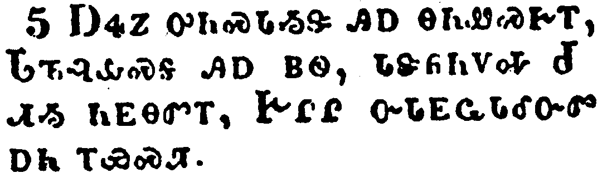</a></td>
</tr>
<tr class="even">
<td>And they were the more fierce, saying, He stirreth up the people, teaching throughout all Jewry, beginning from Galilee to this place.</td>
</tr>
<tr class="odd">
<td>ᎠᏎᏃ ᎤᏂᏍᏓᏱᏕ ᎯᎠ ᎾᏂᏪᏍᎨᎢ, ᏓᏖᎸᎲᏍᎦ ᎯᎠ ᏴᏫ, ᏓᏕᏲᏂᏙᎭ ᏧᏗᏱ ᏂᎬᎾᏛᎢ, ᎨᎵᎵ ᏅᏓᎬᏩᏓᎴᏅᏛ ᎠᏂ ᎢᏯᏍᏘ.</td>
</tr>
<tr class="even">
<td>A-se-no u-ni-s-da-yi-de hi-a na-ni-we-s-ge-i, Da-te-lv-hv-s-ga hi-a yv-wi, da-de-yo-ni-do-ha Tsu-di-yi ni-gv-na-dv-i, Ge-li-li nv-da-gv-wa-da-le-nv-dv a-ni i-ya-s-ti.</td>
</tr>
</tbody>
</table>

<table>
<tbody>
<tr class="odd">
<td><a href="032306.png">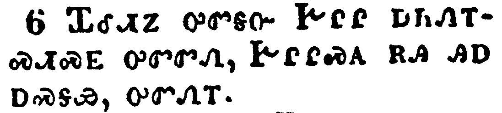</a></td>
</tr>
<tr class="even">
<td>When Pilate heard of Galilee, he asked whether the man were a Galilaean.</td>
</tr>
<tr class="odd">
<td>ᏆᎴᏗᏃ ᎤᏛᎦᏅ ᎨᎵᎵ ᎠᏂᏁᎢᏍᏗᏍᎬ ᎤᏛᏛᏁ, ᎨᎵᎵᏍᎪ ᎡᎯ ᎯᎠ ᎠᏍᎦᏯ, ᎤᏛᏁᎢ.</td>
</tr>
<tr class="even">
<td>Qua-le-di-no u-dv-ga-nv Ge-li-li a-ni-ne-i-s-di-s-gv u-dv-dv-ne, Ge-li-li-s-go e-hi hi-a a-s-ga-ya, u-dv-ne-i.</td>
</tr>
</tbody>
</table>

<table>
<tbody>
<tr class="odd">
<td><a href="032307.png">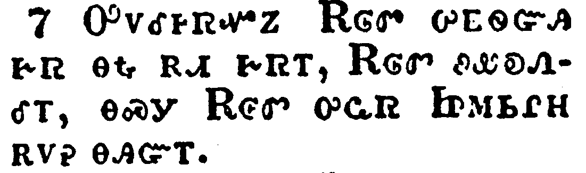</a></td>
</tr>
<tr class="even">
<td>And as soon as he knew that he belonged unto Herod's jurisdiction, he sent him to Herod, who himself also was at Jerusalem at that time.</td>
</tr>
<tr class="odd">
<td>ᎤᏙᎴᎰᏒᏉᏃ ᎡᎶᏛ ᎤᎬᏫᏳᎯ ᎨᏒ ᎾᎿᎭᎡᏗ ᎨᏒᎢ, ᎡᎶᏛ ᏭᏪᎧᏁᎴᎢ, ᎾᏍᎩ ᎡᎶᏛ ᎤᏩᏒ ᏥᎷᏏᎵᎻ ᎡᏙᎮ ᎾᎯᏳᎢ.</td>
</tr>
<tr class="even">
<td>U-do-le-ho-sv-quo-no E-lo-dv u-gv-wi-yu-hi ge-sv na-hna e-di ge-sv-i, E-lo-dv wu-we-ka-ne-le-i, na-s-gi E-lo-dv u-wa-sv Tsi-lu-si-li-mi e-do-he na-hi-yu-i.</td>
</tr>
</tbody>
</table>

<table>
<tbody>
<tr class="odd">
<td><a href="032308.png">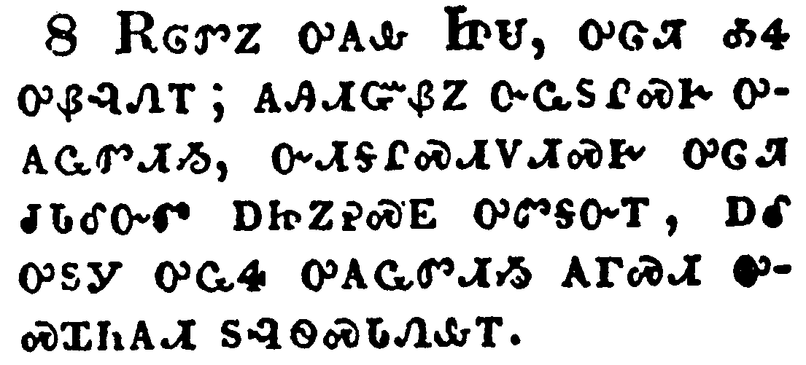</a></td>
</tr>
<tr class="even">
<td>And when Herod saw Jesus, he was exceeding glad: for he was desirous to see him of a long season, because he had heard many things of him; and he hoped to have seen some miracle done by him.</td>
</tr>
<tr class="odd">
<td>ᎡᎶᏛᏃ ᎤᎪᎲ ᏥᏌ, ᎤᏣᏘ ᎣᏎ ᎤᏰᎸᏁᎢ; ᎪᎯᏗᏳᏰᏃ ᏅᏩᏚᎵᏍᎨ ᎤᎪᏩᏛᏗᏱ, ᏅᏗᎦᎵᏍᏗᏙᏗᏍᎨ ᎤᏣᏘ ᏧᏓᎴᏅᏛ ᎠᏥᏃᎮᏍᎬ ᎤᏛᎦᏅᎢ, ᎠᎴ ᎤᏚᎩ ᎤᏩᏎ ᎤᎪᏩᏛᏗᏱ ᎪᎱᏍᏗ ᎤᏍᏆᏂᎪᏗ ᏚᎸᏫᏍᏓᏁᎲᎢ.</td>
</tr>
<tr class="even">
<td>E-lo-dv-no u-go-hv Tsi-sa, u-tsa-ti o-se u-ye-lv-ne-i; go-hi-di-yu-ye-no nv-wa-du-li-s-ge u-go-wa-dv-di-yi, nv-di-ga-li-s-di-do-di-s-ge u-tsa-ti tsu-da-le-nv-dv a-tsi-no-he-s-gv u-dv-ga-nv-i, a-le u-du-gi u-wa-se u-go-wa-dv-di-yi go-hu-s-di u-s-qua-ni-go-di du-lv-wi-s-da-ne-hv-i.</td>
</tr>
</tbody>
</table>

<table>
<tbody>
<tr class="odd">
<td><a href="032309.png">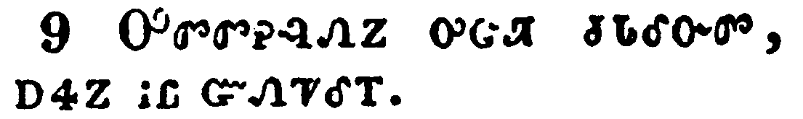</a></td>
</tr>
<tr class="even">
<td>Then he questioned with him in many words; but he answered him nothing.</td>
</tr>
<tr class="odd">
<td>ᎤᏛᏛᎮᎸᏁᏃ ᎤᏣᏘ ᏧᏓᎴᏅᏛ, ᎠᏎᏃ ᎥᏝ ᏳᏁᏤᎴᎢ.</td>
</tr>
<tr class="even">
<td>U-dv-dv-he-lv-ne-no u-tsa-ti tsu-da-le-nv-dv, a-se-no v-tla yu-ne-tse-le-i.</td>
</tr>
</tbody>
</table>

<table>
<tbody>
<tr class="odd">
<td><a href="032310.png">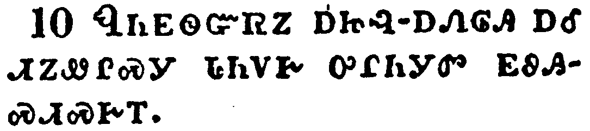</a></td>
</tr>
<tr class="even">
<td>And the chief priests and scribes stood and vehemently accused him.</td>
</tr>
<tr class="odd">
<td>ᏄᏂᎬᏫᏳᏒᏃ ᎠᏥᎸ-ᎠᏁᎶᎯ ᎠᎴ ᏗᏃᏪᎵᏍᎩ ᏓᏂᏙᎨ ᎤᎵᏂᎩᏛ ᎬᏭᎯᏍᏗᏍᎨᎢ.</td>
</tr>
<tr class="even">
<td>Nu-ni-gv-wi-yu-sv-no a-tsi-lv--a-ne-lo-hi a-le di-no-we-li-s-gi da-ni-do-ge u-li-ni-gi-dv gv-wu-hi-s-di-s-ge-i.</td>
</tr>
</tbody>
</table>

<table>
<tbody>
<tr class="odd">
<td><a href="032311.png">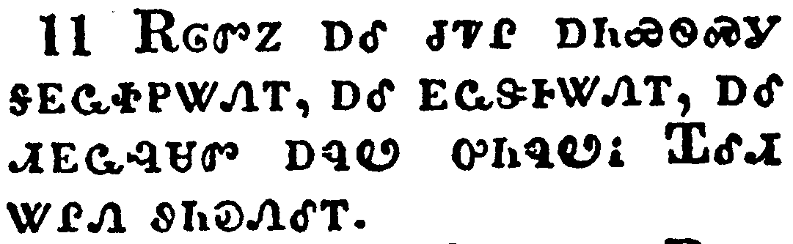</a></td>
</tr>
<tr class="even">
<td>And Herod with his men of war set him at nought, and mocked him, and arrayed him in a gorgeous robe, and sent him again to Pilate.</td>
</tr>
<tr class="odd">
<td>ᎡᎶᏛᏃ ᎠᎴ ᏧᏤᎵ ᎠᏂᏯᏫᏍᎩ ᎦᎬᏩᏐᏢᏔᏁᎢ, ᎠᎴ ᎬᏩᏕᎰᏔᏁᎢ, ᎠᎴ ᏗᎬᏩᎸᏌᏛ ᎠᏄᏬ ᎤᏂᏄᏬᎥ ᏆᎴᏗ ᏔᎵᏁ ᏭᏂᎧᏁᎴᎢ.</td>
</tr>
<tr class="even">
<td>E-lo-dv-no a-le tsu-tse-li a-ni-ya-wi-s-gi ga-gv-wa-so-tlv-ta-ne-i, a-le gv-wa-de-ho-ta-ne-i, a-le di-gv-wa-lv-sa-dv a-nu-wo u-ni-nu-wo-v Qua-le-di ta-li-ne wu-ni-ka-ne-le-i.</td>
</tr>
</tbody>
</table>

<table>
<tbody>
<tr class="odd">
<td></td>
</tr>
<tr class="even">
<td>And the same day Pilate and Herod were made friends together: for before they were at enmity between themselves.</td>
</tr>
<tr class="odd">
<td>ᎾᎯᏳᏃ ᎢᎦ ᏆᎴᏗ ᎠᎴ ᎡᎶᏛ ᎤᎾᎵᎢᏕᎢ; ᏗᎾᏓᏍᎦᎩᏳᏰᏃ ᎢᏳᎵᏍᏔᏅᎯ ᎨᏎ ᎾᎯᏳ ᎢᏯᏍᏘ.</td>
</tr>
<tr class="even">
<td>Na-hi-yu-no i-ga Qua-le-di a-le E-lo-dv u-na-li-i-de-i; di-na-da-s-ga-gi-yu-ye-no i-yu-li-s-ta-nv-hi ge-se na-hi-yu i-ya-s-ti.</td>
</tr>
</tbody>
</table>

<table>
<tbody>
<tr class="odd">
<td><a href="032313.png">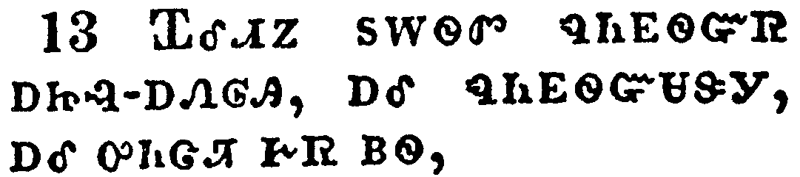</a></td>
</tr>
<tr class="even">
<td>And Pilate, when he had called together the chief priests and the rulers and the people,</td>
</tr>
<tr class="odd">
<td>ᏆᎴᏗᏃ ᏚᎳᏫᏛ ᏄᏂᎬᏫᏳᏒ ᎠᏥᎸ-ᎠᏁᎶᎯ, ᎠᎴ ᏄᏂᎬᏫᏳᏌᏕᎩ, ᎠᎴ ᎤᏂᏣᏘ ᎨᏒ ᏴᏫ,</td>
</tr>
<tr class="even">
<td>Qua-le-di-no du-la-wi-dv nu-ni-gv-wi-yu-sv a-tsi-lv--a-ne-lo-hi, a-le nu-ni-gv-wi-yu-sa-de-gi, a-le u-ni-tsa-ti ge-sv yv-wi,</td>
</tr>
</tbody>
</table>

<table>
<tbody>
<tr class="odd">
<td><a href="032314.png">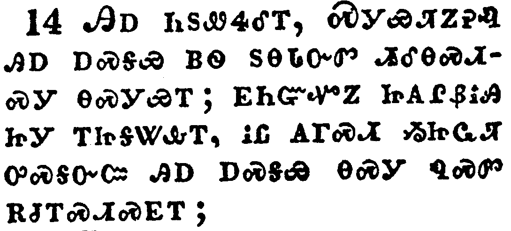</a></td>
</tr>
<tr class="even">
<td>Said unto them, Ye have brought this man unto me, as one that perverteth the people: and, behold, I, having examined him before you, have found no fault in this man touching those things whereof ye accuse him:</td>
</tr>
<tr class="odd">
<td>ᎯᎠ ᏂᏚᏪᏎᎴᎢ, ᏍᎩᏯᏘᏃᎮᎸ ᎯᎠ ᎠᏍᎦᏯ ᏴᏫ ᏚᎾᏓᏅᏛ ᏗᎴᎾᏍᏗᏍᎩ ᎾᏍᎩᏯᎢ; ᎬᏂᏳᏉᏃ ᏥᎪᎵᏰᎥᎯ ᏥᎩ ᎢᏥᎦᏔᎲᎢ, ᎥᏝ ᎪᎱᏍᏗ ᏱᏥᏩᏘ ᎤᏍᎦᏅᏨ ᎯᎠ ᎠᏍᎦᏯ ᎾᏍᎩ ᏄᏍᏛ ᎡᏧᎢᏍᏗᏍᎬᎢ;</td>
</tr>
<tr class="even">
<td>Hi-a ni-du-we-se-le-i, S-gi-ya-ti-no-he-lv hi-a a-s-ga-ya yv-wi du-na-da-nv-dv di-le-na-s-di-s-gi na-s-gi-ya-i; gv-ni-yu-quo-no tsi-go-li-ye-v-hi tsi-gi i-tsi-ga-ta-hv-i, v-tla go-hu-s-di yi-tsi-wa-ti u-s-ga-nv-tsv hi-a a-s-ga-ya na-s-gi nu-s-dv e-tsu-i-s-di-s-gv-i;</td>
</tr>
</tbody>
</table>

<table>
<tbody>
<tr class="odd">
<td><a href="032315.png">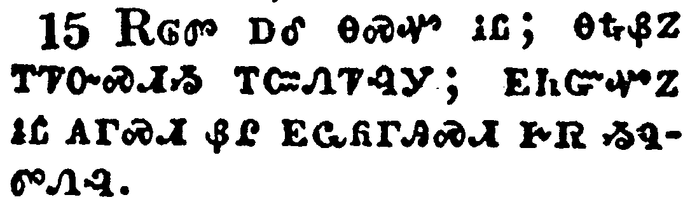</a></td>
</tr>
<tr class="even">
<td>No, nor yet Herod: for I sent you to him; and, lo, nothing worthy of death is done unto him.</td>
</tr>
<tr class="odd">
<td>ᎡᎶᏛ ᎠᎴ ᎾᏍᏉ ᎥᏝ; ᎾᎿᎭᏰᏃ ᎢᏤᏅᏍᏗᏱ ᎢᏨᏁᏤᎸᎩ; ᎬᏂᏳᏉᏃ ᎥᏝ ᎪᎱᏍᏗ ᏰᎵ ᎬᏩᏲᎱᎯᏍᏗ ᎨᏒ ᏱᏄᏛᏁᎸ.</td>
</tr>
<tr class="even">
<td>E-lo-dv a-le na-s-quo v-tla; na-hna-ye-no i-tse-nv-s-di-yi i-tsv-ne-tse-lv-gi; gv-ni-yu-quo-no v-tla go-hu-s-di ye-li gv-wa-yo-hu-hi-s-di ge-sv yi-nu-dv-ne-lv.</td>
</tr>
</tbody>
</table>

<table>
<tbody>
<tr class="odd">
<td><a href="032316.png">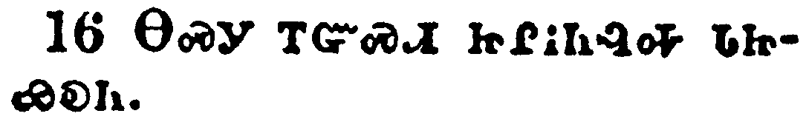</a></td>
</tr>
<tr class="even">
<td>I will therefore chastise him, and release him.</td>
</tr>
<tr class="odd">
<td>ᎾᏍᎩ ᎢᏳᏍᏗ ᏥᎵᎥᏂᎸᎭ ᏓᏥᏯᎧᏂ.</td>
</tr>
<tr class="even">
<td>Na-s-gi i-yu-s-di tsi-li-v-ni-lv-ha da-tsi-ya-ka-ni.</td>
</tr>
</tbody>
</table>

<table>
<tbody>
<tr class="odd">
<td><a href="032317.png">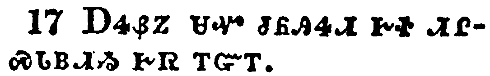</a></td>
</tr>
<tr class="even">
<td>(For of necessity he must release one unto them at the feast.)</td>
</tr>
<tr class="odd">
<td>ᎠᏎᏰᏃ ᏌᏉ ᏧᏲᎯᏎᏗ ᎨᏐ ᏗᎵᏍᏓᏴᏗᏱ ᎨᏒ ᎢᏳᎢ.</td>
</tr>
<tr class="even">
<td>A-se-ye-no sa-quo tsu-yo-hi-se-di ge-so di-li-s-da-yv-di-yi ge-sv i-yu-i.</td>
</tr>
</tbody>
</table>

<table>
<tbody>
<tr class="odd">
<td><a href="032318.png">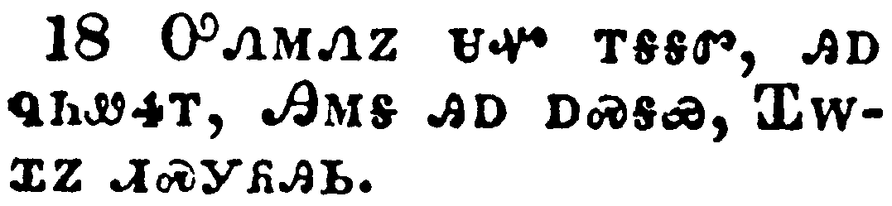</a></td>
</tr>
<tr class="even">
<td>And they cried out all at once, saying, Away with this man, and release unto us Barabbas:</td>
</tr>
<tr class="odd">
<td>ᎤᏁᎷᏁᏃ ᏌᏉ ᎢᎦᎦᏛ, ᎯᎠ ᏄᏂᏪᏎᎢ, ᎯᎷᎦ ᎯᎠ ᎠᏍᎦᏯ, ᏆᎳᏆᏃ ᏗᏍᎩᏲᎯᏏ.</td>
</tr>
<tr class="even">
<td>U-ne-lu-ne-no sa-quo i-ga-ga-dv, hi-a nu-ni-we-se-i, Hi-lu-ga hi-a a-s-ga-ya, Qua-la-qua-no di-s-gi-yo-hi-si.</td>
</tr>
</tbody>
</table>

<table>
<tbody>
<tr class="odd">
<td><a href="032319.png">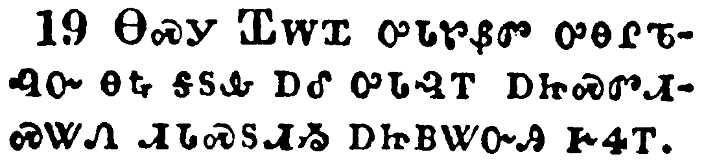</a></td>
</tr>
<tr class="even">
<td>(Who for a certain sedition made in the city, and for murder, was cast into prison.)</td>
</tr>
<tr class="odd">
<td>ᎾᏍᎩ ᏆᎳᏆ ᎤᏓᏑᏰᏛ ᎤᎾᎵᏖᎸᏅ ᎾᎿᎭᎦᏚᎲ ᎠᎴ ᎤᏓᎸᎢ ᎠᏥᏍᏛᏗᏍᏔᏁ ᏗᏓᏍᏚᏗᏱ ᎠᏥᏴᏔᏅᎯ ᎨᏎᎢ.</td>
</tr>
<tr class="even">
<td>Na-s-gi Qua-la-qua u-da-su-ye-dv u-na-li-te-lv-nv na-hna ga-du-hv a-le u-da-lv-i a-tsi-s-dv-di-s-ta-ne di-da-s-du-di-yi a-tsi-yv-ta-nv-hi ge-se-i.</td>
</tr>
</tbody>
</table>

<table>
<tbody>
<tr class="odd">
<td><a href="032320.png">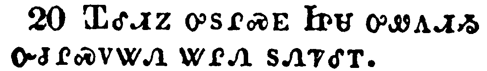</a></td>
</tr>
<tr class="even">
<td>Pilate therefore, willing to release Jesus, spake again to them.</td>
</tr>
<tr class="odd">
<td>ᏆᎴᏗᏃ ᎤᏚᎵᏍᎬ ᏥᏌ ᎤᏪᎪᏗᏱ ᏅᏧᎵᏍᏙᏔᏁ ᏔᎵᏁ ᏚᏁᏤᎴᎢ.</td>
</tr>
<tr class="even">
<td>Qua-le-di-no u-du-li-s-gv Tsi-sa u-we-go-di-yi nv-tsu-li-s-do-ta-ne ta-li-ne du-ne-tse-le-i.</td>
</tr>
</tbody>
</table>

<table>
<tbody>
<tr class="odd">
<td><a href="032321.png">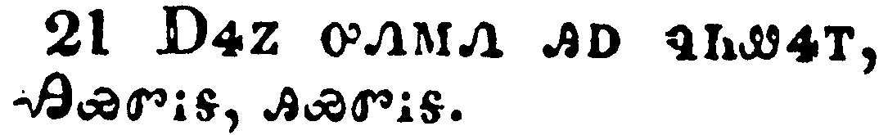</a></td>
</tr>
<tr class="even">
<td>But they cried, saying, Crucify him, crucify him.</td>
</tr>
<tr class="odd">
<td>ᎠᏎᏃ ᎤᏁᎷᏁ ᎯᎠ ᏄᏂᏪᏎᎢ, ᎯᏍᏛᎥᎦ, ᎯᏯᏛᎥᎦ.</td>
</tr>
<tr class="even">
<td>A-se-no u-ne-lu-ne hi-a nu-ni-we-se-i, Hi-s-dv-v-ga, hi-ya-dv-v-ga.</td>
</tr>
</tbody>
</table>

<table>
<tbody>
<tr class="odd">
<td><a href="032322.png">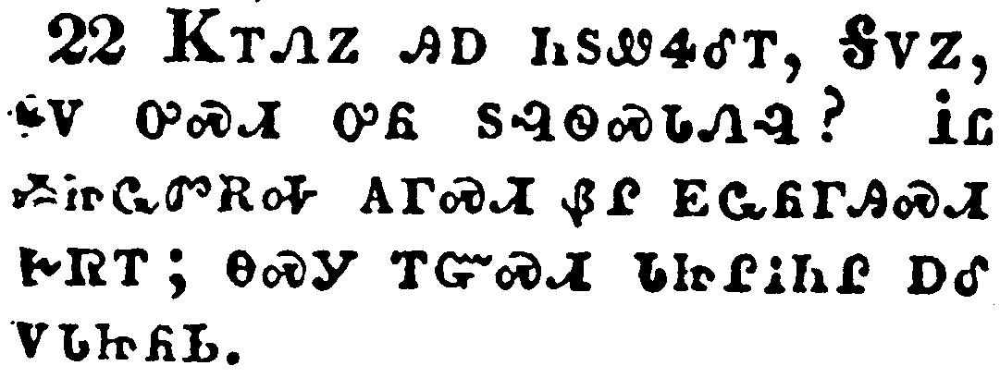</a></td>
</tr>
<tr class="even">
<td>And he said unto them the third time, Why, what evil hath he done? I have found no cause of death in him: I will therefore chastise him, and let him go.</td>
</tr>
<tr class="odd">
<td>ᏦᎢᏁᏃ ᎯᎠ ᏂᏚᏪᏎᎴᎢ, ᎦᏙᏃ, ᎦᏙ ᎤᏍᏗ ᎤᏲ ᏚᎸᏫᏍᏓᏁᎸ? ᎥᏝ ᏱᏥᏩᏛᎡᎭ ᎪᎱᏍᏗ ᏰᎵ ᎬᏩᏲᎱᎯᏍᏗ ᎨᏒᎢ; ᎾᏍᎩ ᎢᏳᏍᏗ ᏓᏥᎵᎥᏂᎵ ᎠᎴ ᏙᏓᏥᏲᏏ.</td>
</tr>
<tr class="even">
<td>Tso-i-ne-no hi-a ni-du-we-se-le-i, Ga-do-no, ga-do u-s-di u-yo du-lv-wi-s-da-ne-lv? V-tla yi-tsi-wa-dv-e-ha go-hu-s-di ye-li gv-wa-yo-hu-hi-s-di ge-sv-i; na-s-gi i-yu-s-di da-tsi-li-v-ni-li a-le do-da-tsi-yo-si.</td>
</tr>
</tbody>
</table>

<table>
<tbody>
<tr class="odd">
<td><a href="032323.png">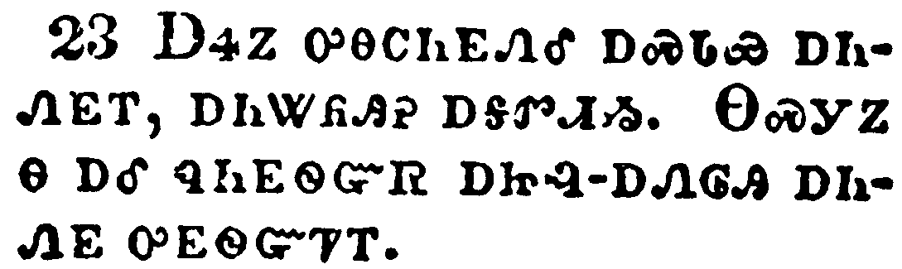</a></td>
</tr>
<tr class="even">
<td>And they were instant with loud voices, requiring that he might be crucified. And the voices of them and of the chief priests prevailed.</td>
</tr>
<tr class="odd">
<td>ᎠᏎᏃ ᎤᎾᏟᏂᎬᏁᎴ ᎠᏍᏓᏯ ᎠᏂᏁᎬᎢ, ᎠᏂᏔᏲᎯᎮ ᎠᎦᏛᏗᏱ. ᎾᏍᎩᏃ Ꮎ ᎠᎴ ᏄᏂᎬᏫᏳᏒ ᎠᏥᎸ-ᎠᏁᎶᎯ ᎠᏂᏁᎬ ᎤᎬᏫᏳᏤᎢ.</td>
</tr>
<tr class="even">
<td>A-se-no u-na-tli-ni-gv-ne-le a-s-da-ya a-ni-ne-gv-i, a-ni-ta-yo-hi-he a-ga-dv-di-yi. Na-s-gi-no na a-le nu-ni-gv-wi-yu-sv a-tsi-lv--a-ne-lo-hi a-ni-ne-gv u-gv-wi-yu-tse-i.</td>
</tr>
</tbody>
</table>

<table>
<tbody>
<tr class="odd">
<td><a href="032324.png">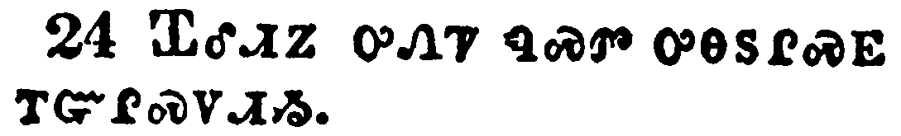</a></td>
</tr>
<tr class="even">
<td>And Pilate gave sentence that it should be as they required.</td>
</tr>
<tr class="odd">
<td>ᏆᎴᏗᏃ ᎤᏁᏤ ᏄᏍᏛ ᎤᎾᏚᎵᏍᎬ ᎢᏳᎵᏍᏙᏗᏱ.</td>
</tr>
<tr class="even">
<td>Qua-le-di-no u-ne-tse nu-s-dv u-na-du-li-s-gv i-yu-li-s-do-di-yi.</td>
</tr>
</tbody>
</table>

<table>
<tbody>
<tr class="odd">
<td><a href="032325.png">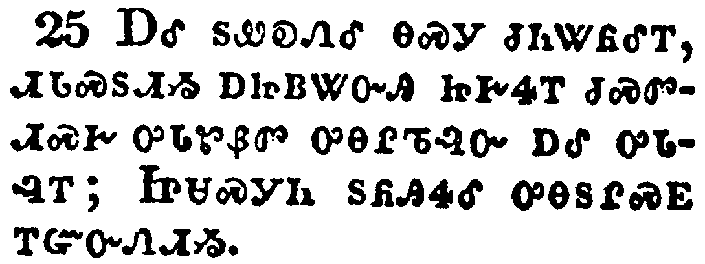</a></td>
</tr>
<tr class="even">
<td>And he released unto them him that for sedition and murder was cast into prison, whom they had desired; but he delivered Jesus to their will.</td>
</tr>
<tr class="odd">
<td>ᎠᎴ ᏚᏪᎧᏁᎴ ᎾᏍᎩ ᏧᏂᏔᏲᎴᎢ, ᏗᏓᏍᏚᏗᏱ ᎠᏥᏴᏔᏅᎯ ᏥᎨᏎᎢ ᏧᏍᏛᏗᏍᎨ ᎤᏓᏑᏰᏛ ᎤᎾᎵᏖᎸᏅ ᎠᎴ ᎤᏓᎸᎢ; ᏥᏌᏍᎩᏂ ᏚᏲᎯᏎᎴ ᎤᎾᏚᎵᏍᎬ ᎢᏳᏅᏁᏗᏱ.</td>
</tr>
<tr class="even">
<td>A-le du-we-ka-ne-le na-s-gi tsu-ni-ta-yo-le-i, di-da-s-du-di-yi a-tsi-yv-ta-nv-hi tsi-ge-se-i tsu-s-dv-di-s-ge u-da-su-ye-dv u-na-li-te-lv-nv a-le u-da-lv-i; Tsi-sa-s-gi-ni du-yo-hi-se-le u-na-du-li-s-gv i-yu-nv-ne-di-yi.</td>
</tr>
</tbody>
</table>

<table>
<tbody>
<tr class="odd">
<td><a href="032326.png">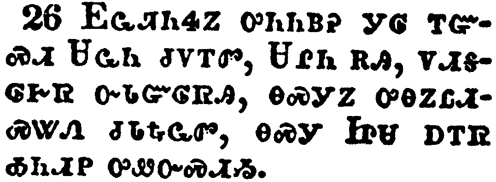</a></td>
</tr>
<tr class="even">
<td>And as they led him away, they laid hold upon one Simon, a Cyrenian, coming out of the country, and on him they laid the cross, that he might bear it after Jesus.</td>
</tr>
<tr class="odd">
<td>ᎬᏩᏘᏂᏎᏃ ᎤᏂᏂᏴᎮ ᎩᎶ ᎢᏳᏍᏗ ᏌᏩᏂ ᏧᏙᎢᏛ, ᏌᎵᏂ ᎡᎯ, ᏙᏗᎦᎶᎨᏒ ᏅᏓᏳᎶᏒᎯ, ᎾᏍᎩᏃ ᎤᎾᏃᏝᏗᏍᏔᏁ ᏧᏓᎿᎭᏩᏛ, ᎾᏍᎩ ᏥᏌ ᎠᎢᏒ ᎣᏂᏗᏢ ᎤᏪᏅᏍᏗᏱ.</td>
</tr>
<tr class="even">
<td>Gv-wa-ti-ni-se-no u-ni-ni-yv-he gi-lo i-yu-s-di Sa-wa-ni tsu-do-i-dv, Sa-li-ni e-hi, do-di-ga-lo-ge-sv nv-da-yu-lo-sv-hi, na-s-gi-no u-na-no-tla-di-s-ta-ne tsu-da-hna-wa-dv, na-s-gi Tsi-sa a-i-sv o-ni-di-tlv u-we-nv-s-di-yi.</td>
</tr>
</tbody>
</table>

<table>
<tbody>
<tr class="odd">
<td><a href="032327.png">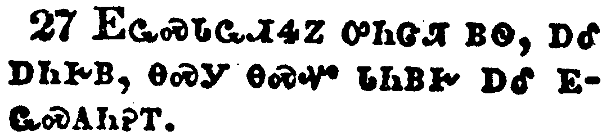</a></td>
</tr>
<tr class="even">
<td>And there followed him a great company of people, and of women, which also bewailed and lamented him.</td>
</tr>
<tr class="odd">
<td>ᎬᏩᏍᏓᏩᏗᏎᏃ ᎤᏂᏣᏘ ᏴᏫ, ᎠᎴ ᎠᏂᎨᏴ, ᎾᏍᎩ ᎾᏍᏉ ᏓᏂᏴᎨ ᎠᎴ ᎬᏩᏍᎪᏂᎮᎢ.</td>
</tr>
<tr class="even">
<td>Gv-wa-s-da-wa-di-se-no u-ni-tsa-ti yv-wi, a-le a-ni-ge-yv, na-s-gi na-s-quo da-ni-yv-ge a-le gv-wa-s-go-ni-he-i.</td>
</tr>
</tbody>
</table>

<table>
<tbody>
<tr class="odd">
<td></td>
</tr>
<tr class="even">
<td>But Jesus turning unto them said, Daughters of Jerusalem, weep not for me, but weep for yourselves, and for your children.</td>
</tr>
<tr class="odd">
<td>ᏥᏌᏃ ᏚᎦᏔᎲᎡᎸ ᎯᎠ ᏄᏪᏎᎢ, ᎢᏥᎨᏴ ᏥᎷᏏᎵᎻ ᏧᏪᏥ, ᏞᏍᏗ ᎠᏴ ᏍᎩᏍᎪᏂᎸᎩ, ᎢᏨᏒᏍᎩᏂ ᏗᏣᏓᏍᎪᏂᎦ, ᎠᎴ ᏗᏤᏥ ᏗᏥᏍᎪᏂᎦ.</td>
</tr>
<tr class="even">
<td>Tsi-sa-no du-ga-ta-hv-e-lv hi-a nu-we-se-i, I-tsi-ge-yv Tsi-lu-si-li-mi tsu-we-tsi, tle-s-di a-yv s-gi-s-go-ni-lv-gi, i-tsv-sv-s-gi-ni di-tsa-da-s-go-ni-ga, a-le di-tse-tsi di-tsi-s-go-ni-ga.</td>
</tr>
</tbody>
</table>

<table>
<tbody>
<tr class="odd">
<td><a href="032329.png">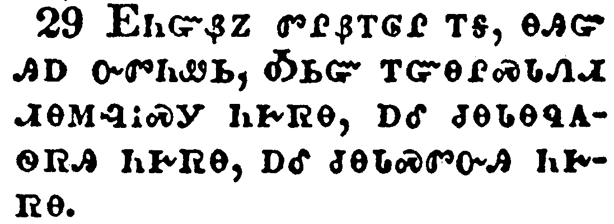</a></td>
</tr>
<tr class="even">
<td>For, behold, the days are coming, in the which they shall say, Blessed are the barren, and the wombs that never bare, and the paps which never gave suck.</td>
</tr>
<tr class="odd">
<td>ᎬᏂᏳᏰᏃ ᏛᎵᏰᎢᎶᎵ ᎢᎦ, ᎾᎯᏳ ᎯᎠ ᏅᏛᏂᏪᏏ, ᎣᏏᏳ ᎢᏳᎾᎵᏍᏓᏁᏗ ᏗᎾᎷᎸᎥᏍᎩ ᏂᎨᏒᎾ, ᎠᎴ ᏧᎾᏓᎾᏄᎪᏫᏒᎯ ᏂᎨᏒᎾ, ᎠᎴ ᏧᎾᏓᏍᏛᏅᎯ ᏂᎨᏒᎾ.</td>
</tr>
<tr class="even">
<td>Gv-ni-yu-ye-no dv-li-ye-i-lo-li i-ga, na-hi-yu hi-a nv-dv-ni-we-si, O-si-yu i-yu-na-li-s-da-ne-di di-na-lu-lv-v-s-gi ni-ge-sv-na, a-le tsu-na-da-na-nu-go-wi-sv-hi ni-ge-sv-na, a-le tsu-na-da-s-dv-nv-hi ni-ge-sv-na.</td>
</tr>
</tbody>
</table>

<table>
<tbody>
<tr class="odd">
<td><a href="032330.png">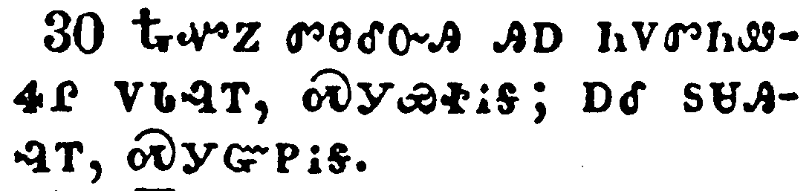</a></td>
</tr>
<tr class="even">
<td>Then shall they begin to say to the mountains, Fall on us; and to the hills, Cover us.</td>
</tr>
<tr class="odd">
<td>ᎿᎭᏉᏃ ᏛᎾᎴᏅᎯ ᎯᎠ ᏂᏙᏛᏂᏪᏎᎵ ᏙᏓᎸᎢ, ᏍᎩᏯᏐᎥᎦ; ᎠᎴ ᏚᏌᎯᎸᎢ, ᏍᎩᏳᏢᎥᎦ.</td>
</tr>
<tr class="even">
<td>Hna-quo-no dv-na-le-nv-hi hi-a ni-do-dv-ni-we-se-li do-da-lv-i, S-gi-ya-so-v-ga; a-le du-sa-hi-lv-i, S-gi-yu-tlv-v-ga.</td>
</tr>
</tbody>
</table>

<table>
<tbody>
<tr class="odd">
<td></td>
</tr>
<tr class="even">
<td>For if they do these things in a green tree, what shall be done in the dry?</td>
</tr>
<tr class="odd">
<td>ᎢᏳᏰᏃ ᎢᏤ ᏡᎬ ᎾᏍᎩ ᏱᏅᏛᏅᏁᎵ, ᎦᏙ ᎬᏁᏗ ᎨᏎᏍᏗ ᎤᎧᏲᏛ ᏡᎬᎢ?</td>
</tr>
<tr class="even">
<td>I-yu-ye-no i-tse tlu-gv na-s-gi yi-nv-dv-nv-ne-li, ga-do gv-ne-di ge-se-s-di u-ka-yo-dv tlu-gv-i?</td>
</tr>
</tbody>
</table>

<table>
<tbody>
<tr class="odd">
<td><a href="032332.png">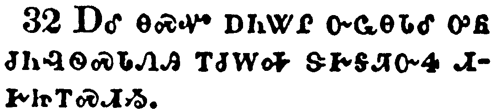</a></td>
</tr>
<tr class="even">
<td>And there were also two other, malefactors, led with him to be put to death.</td>
</tr>
<tr class="odd">
<td>ᎠᎴ ᎾᏍᏉ ᎠᏂᏔᎵ ᏅᏩᎾᏓᎴ ᎤᏲ ᏧᏂᎸᏫᏍᏓᏁᎯ ᎢᏧᎳᎭ ᏕᎨᎦᏘᏅᏎ ᏗᎨᏥᎢᏍᏗᏱ.</td>
</tr>
<tr class="even">
<td>A-le na-s-quo a-ni-ta-li nv-wa-na-da-le u-yo tsu-ni-lv-wi-s-da-ne-hi i-tsu-la-ha de-ge-ga-ti-nv-se di-ge-tsi-i-s-di-yi.</td>
</tr>
</tbody>
</table>

<table>
<tbody>
<tr class="odd">
<td><a href="032333.png">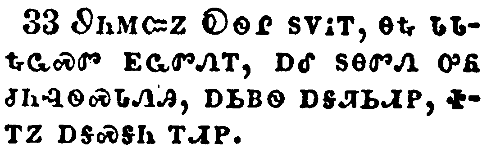</a></td>
</tr>
<tr class="even">
<td>And when they were come to the place, which is called Calvary, there they crucified him, and the malefactors, one on the right hand, and the other on the left.</td>
</tr>
<tr class="odd">
<td>ᏭᏂᎷᏨᏃ ᎧᏫᎵ ᏚᏙᎥᎢ, ᎾᎿᎭᏓᏓᎿᎭᏩᏍᏛ ᎬᏩᏛᏁᎢ, ᎠᎴ ᏚᎾᏛᏁ ᎤᏲᏧᏂᎸᏫᏍᏓᏁᎯ, ᎠᏏᏴᏫ ᎠᎦᏘᏏᏗᏢ, ᏐᎢᏃ ᎠᎦᏍᎦᏂ ᎢᏗᏢ.</td>
</tr>
<tr class="even">
<td>Wu-ni-lu-tsv-no Ka-wi-li du-do-v-i, na-hna da-da-hna-wa-s-dv gv-wa-dv-ne-i, a-le du-na-dv-ne u-yo-tsu-ni-lv-wi-s-da-ne-hi, a-si-yv-wi a-ga-ti-si-di-tlv, so-i-no a-ga-s-ga-ni i-di-tlv.</td>
</tr>
</tbody>
</table>

<table>
<tbody>
<tr class="odd">
<td><a href="032334.png">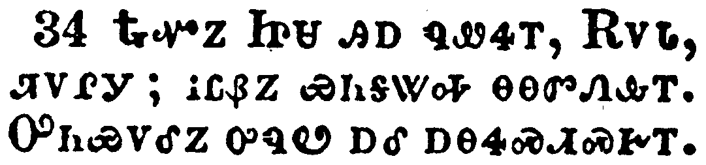</a></td>
</tr>
<tr class="even">
<td>Then said Jesus, Father, forgive them; for they know not what they do. And they parted his raiment, and cast lots.</td>
</tr>
<tr class="odd">
<td>ᎿᎭᏉᏃ ᏥᏌ ᎯᎠ ᏄᏪᏎᎢ, ᎡᏙᏓ, ᏘᏙᎵᎩ; ᎥᏝᏰᏃ ᏯᏂᎦᏔᎭ ᎾᎾᏛᏁᎲᎢ. ᎤᏂᏯᏙᎴᏃ ᎤᏄᏬ ᎠᎴ ᎠᎾᏎᏍᏗᏍᎨᎢ.</td>
</tr>
<tr class="even">
<td>Hna-quo-no Tsi-sa hi-a nu-we-se-i, E-do-da, ti-do-li-gi; v-tla-ye-no ya-ni-ga-ta-ha na-na-dv-ne-hv-i. U-ni-ya-do-le-no u-nu-wo a-le a-na-se-s-di-s-ge-i.</td>
</tr>
</tbody>
</table>

<table>
<tbody>
<tr class="odd">
<td><a href="032335.png">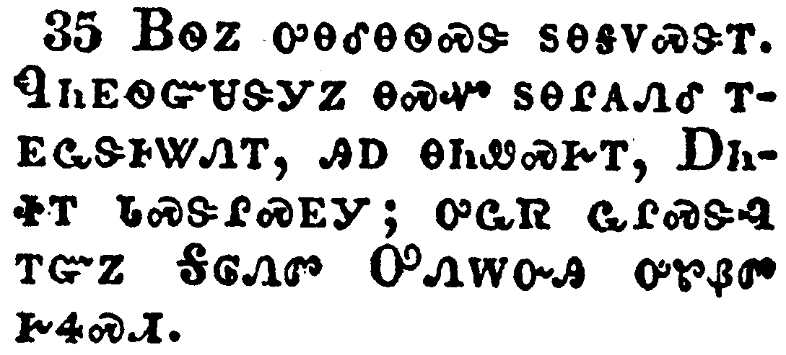</a></td>
</tr>
<tr class="even">
<td>And the people stood beholding. And the rulers also with them derided him, saying, He saved others; let him save himself, if he be Christ, the chosen of God.</td>
</tr>
<tr class="odd">
<td>ᏴᏫᏃ ᎤᎾᎴᎾᏫᏍᏕ ᏚᎾᎦᏙᏍᏕᎢ. ᏄᏂᎬᏫᏳᏌᏕᎩᏃ ᎾᏍᏉ ᏚᎾᎵᎪᏁᎴ ᎢᎬᏩᏕᎰᏔᏁᎢ, ᎯᎠ ᎾᏂᏪᏍᎨᎢ, ᎠᏂᏐᎢ ᏓᏍᏕᎵᏍᎬᎩ; ᎤᏩᏒ ᏩᎵᏍᏕᎸ ᎢᏳᏃ ᎦᎶᏁᏛ ᎤᏁᎳᏅᎯ ᎤᏑᏰᏛ ᎨᏎᏍᏗ.</td>
</tr>
<tr class="even">
<td>Yv-wi-no u-na-le-na-wi-s-de du-na-ga-do-s-de-i. Nu-ni-gv-wi-yu-sa-de-gi-no na-s-quo du-na-li-go-ne-le i-gv-wa-de-ho-ta-ne-i, hi-a na-ni-we-s-ge-i, A-ni-so-i da-s-de-li-s-gv-gi; u-wa-sv wa-li-s-de-lv i-yu-no Ga-lo-ne-dv U-ne-la-nv-hi u-su-ye-dv ge-se-s-di.</td>
</tr>
</tbody>
</table>

<table>
<tbody>
<tr class="odd">
<td><a href="032336.png">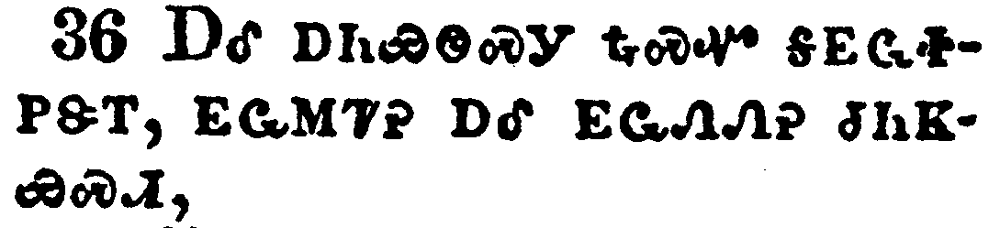</a></td>
</tr>
<tr class="even">
<td>And the soldiers also mocked him, coming to him, and offering him vinegar,</td>
</tr>
<tr class="odd">
<td>ᎠᎴ ᎠᏂᏯᏫᏍᎩ ᎿᎭᏍᏉ ᎦᎬᏩᏐᏢᏕᎢ, ᎬᏩᎷᏤᎮ ᎠᎴ ᎬᏩᏁᏁᎮ ᏧᏂᏦᏯᏍᏗ,</td>
</tr>
<tr class="even">
<td>A-le a-ni-ya-wi-s-gi hna-s-quo ga-gv-wa-so-tlv-de-i, gv-wa-lu-tse-he a-le gv-wa-ne-ne-he tsu-ni-tso-ya-s-di,</td>
</tr>
</tbody>
</table>

<table>
<tbody>
<tr class="odd">
<td><a href="032337.png">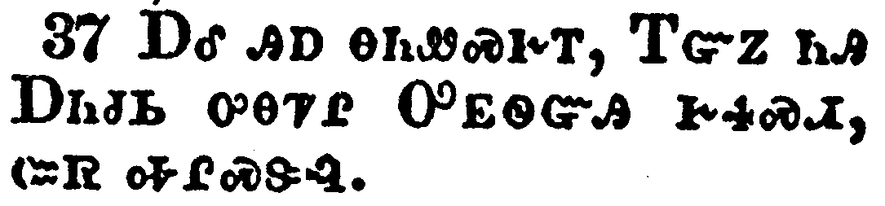</a></td>
</tr>
<tr class="even">
<td>And saying, If thou be the king of the Jews, save thyself.</td>
</tr>
<tr class="odd">
<td>ᎠᎴ ᎯᎠ ᎾᏂᏪᏍᎨᎢ, ᎢᏳᏃ ᏂᎯ ᎠᏂᏧᏏ ᎤᎾᏤᎵ ᎤᎬᏫᏳᎯ ᎨᏎᏍᏗ, ᏨᏒ ᎭᎵᏍᏕᎸ.</td>
</tr>
<tr class="even">
<td>A-le hi-a na-ni-we-s-ge-i, I-yu-no ni-hi A-ni-tsu-si u-na-tse-li U-gv-wi-yu-hi ge-se-s-di, tsv-sv ha-li-s-de-lv.</td>
</tr>
</tbody>
</table>

<table>
<tbody>
<tr class="odd">
<td><a href="032338.png">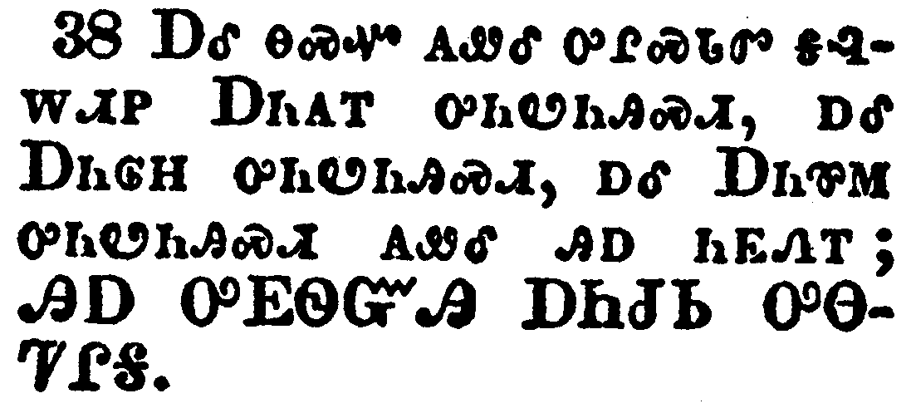</a></td>
</tr>
<tr class="even">
<td>And a superscription also was written over him in letters of Greek, and Latin, and Hebrew, THIS IS THE KING OF THE JEWS.</td>
</tr>
<tr class="odd">
<td>ᎠᎴ ᎾᏍᏉ ᎪᏪᎴ ᎤᎵᏍᏓᏛ ᎦᎸᎳᏗᏢ ᎠᏂᎪᎢ ᎤᏂᏬᏂᎯᏍᏗ, ᎠᎴ ᎠᏂᎶᎻ ᎤᏂᏬᏂᎯᏍᏗ, ᎠᎴ ᎠᏂᏈᎷ ᎤᏂᏬᏂᎯᏍᏗ ᎪᏪᎴ ᎯᎠ ᏂᎬᏁᎢ; ᎯᎠ ᎤᎬᏫᏳᎯ ᎠᏂᏧᏏ ᎤᎾᏤᎵᎦ.</td>
</tr>
<tr class="even">
<td>A-le na-s-quo go-we-le u-li-s-da-dv ga-lv-la-di-tlv A-ni-go-i u-ni-wo-ni-hi-s-di, a-le A-ni-lo-mi u-ni-wo-ni-hi-s-di, a-le A-ni-qui-lu u-ni-wo-ni-hi-s-di go-we-le hi-a ni-gv-ne-i; Hi-A U-Gv-Wi-Yu-Hi A-Ni-Tsu-Si U-Na-Tse-Li-Ga.</td>
</tr>
</tbody>
</table>

<table>
<tbody>
<tr class="odd">
<td><a href="032339.png">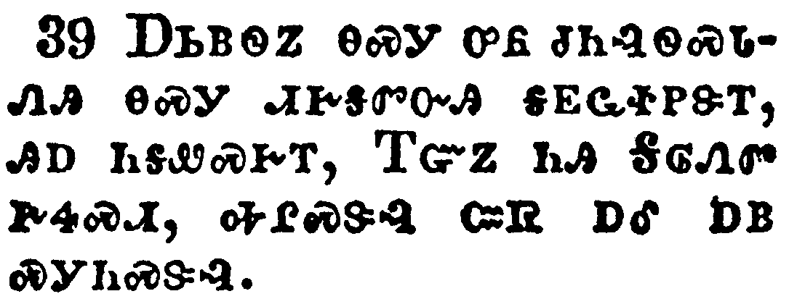</a></td>
</tr>
<tr class="even">
<td>And one of the malefactors which were hanged railed on him, saying, If thou be Christ, save thyself and us.</td>
</tr>
<tr class="odd">
<td>ᎠᏏᏴᏫᏃ ᎾᏍᎩ ᎤᏲ ᏧᏂᎸᏫᏍᏓᏁᎯ ᎾᏍᎩ ᏗᎨᎦᏛᏅᎯ ᎦᎬᏩᏐᏢᏕᎢ, ᎯᎠ ᏂᎦᏪᏍᎨᎢ, ᎢᏳᏃ ᏂᎯ ᎦᎶᏁᏛ ᎨᏎᏍᏗ, ᎭᎵᏍᏕᎸ ᏨᏒ ᎠᎴ ᎠᏴ ᏍᎩᏂᏍᏕᎸ.</td>
</tr>
<tr class="even">
<td>A-si-yv-wi-no na-s-gi u-yo tsu-ni-lv-wi-s-da-ne-hi na-s-gi di-ge-ga-dv-nv-hi ga-gv-wa-so-tlv-de-i, hi-a ni-ga-we-s-ge-i, I-yu-no ni-hi Ga-lo-ne-dv ge-se-s-di, ha-li-s-de-lv tsv-sv a-le a-yv s-gi-ni-s-de-lv.</td>
</tr>
</tbody>
</table>

<table>
<tbody>
<tr class="odd">
<td><a href="032340.png">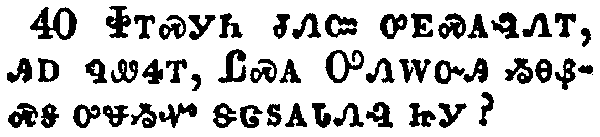</a></td>
</tr>
<tr class="even">
<td>But the other answering rebuked him, saying, Dost not thou fear God, seeing thou art in the same condemnation?</td>
</tr>
<tr class="odd">
<td>ᏐᎢᏍᎩᏂ ᏧᏁᏨ ᎤᎬᏍᎪᎸᏁᎢ, ᎯᎠ ᏄᏪᏎᎢ, ᏝᏍᎪ ᎤᏁᎳᏅᎯ ᏱᎾᏰᏍᎦ ᎤᏠᏱᏉ ᏕᏣᏚᎪᏓᏁᎸ ᏥᎩ?</td>
</tr>
<tr class="even">
<td>So-i-s-gi-ni tsu-ne-tsv u-gv-s-go-lv-ne-i, hi-a nu-we-se-i, Tla-s-go U-ne-la-nv-hi yi-na-ye-s-ga u-tlo-yi-quo de-tsa-du-go-da-ne-lv tsi-gi?</td>
</tr>
</tbody>
</table>

<table>
<tbody>
<tr class="odd">
<td><a href="032341.png">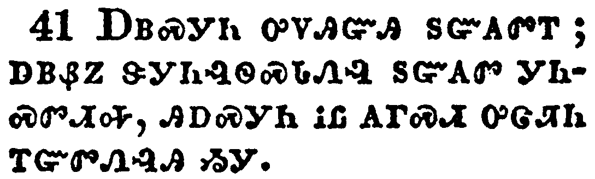</a></td>
</tr>
<tr class="even">
<td>And we indeed justly; for we receive the due reward of our deeds: but this man hath done nothing amiss.</td>
</tr>
<tr class="odd">
<td>ᎠᏴᏍᎩᏂ ᎤᏙᎯᏳᎯ ᏚᏳᎪᏛᎢ; ᎠᏴᏰᏃ ᏕᎩᏂᎸᏫᏍᏓᏁᎸ ᏚᏳᎪᏛ ᎩᏂᏍᏛᏗᎭ, ᎯᎠᏍᎩᏂ ᎥᏝ ᎪᎱᏍᏗ ᎤᏣᏘᏂ ᎢᏳᏛᏁᎸᎯ ᏱᎩ.</td>
</tr>
<tr class="even">
<td>A-yv-s-gi-ni u-do-hi-yu-hi du-yu-go-dv-i; a-yv-ye-no de-gi-ni-lv-wi-s-da-ne-lv du-yu-go-dv gi-ni-s-dv-di-ha, hi-a-s-gi-ni v-tla go-hu-s-di u-tsa-ti-ni i-yu-dv-ne-lv-hi yi-gi.</td>
</tr>
</tbody>
</table>

<table>
<tbody>
<tr class="odd">
<td><a href="032342.png">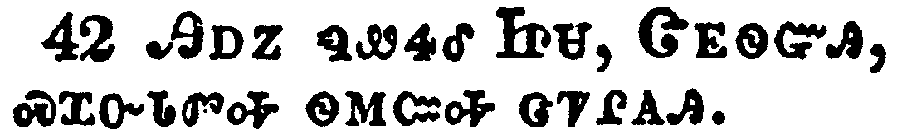</a></td>
</tr>
<tr class="even">
<td>And he said unto Jesus, Lord, remember me when thou comest into thy kingdom.</td>
</tr>
<tr class="odd">
<td>ᎯᎠᏃ ᏄᏪᏎᎴ ᏥᏌ, ᏣᎬᏫᏳᎯ, ᏍᏆᏅᏓᏛᎭ ᏫᎷᏨᎭ ᏣᏤᎵᎪᎯ.</td>
</tr>
<tr class="even">
<td>Hi-a-no nu-we-se-le Tsi-sa, Tsa-gv-wi-yu-hi, s-qua-nv-da-dv-ha wi-lu-tsv-ha tsa-tse-li-go-hi.</td>
</tr>
</tbody>
</table>

<table>
<tbody>
<tr class="odd">
<td><a href="032343.png">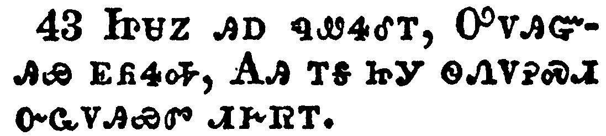</a></td>
</tr>
<tr class="even">
<td>And Jesus said unto him, Verily I say unto thee, To day shalt thou be with me in paradise.</td>
</tr>
<tr class="odd">
<td>ᏥᏌᏃ ᎯᎠ ᏄᏪᏎᎴᎢ, ᎤᏙᎯᏳᎯᏯ ᎬᏲᏎᎭ, ᎪᎯ ᎢᎦ ᏥᎩ ᏫᏁᏙᎮᏍᏗ ᏅᏩᏙᎯᏯᏛ ᏗᎨᏒᎢ.</td>
</tr>
<tr class="even">
<td>Tsi-sa-no hi-a nu-we-se-le-i, U-do-hi-yu-hi-ya gv-yo-se-ha, Go-hi i-ga tsi-gi wi-ne-do-he-s-di nv-wa-do-hi-ya-dv di-ge-sv-i.</td>
</tr>
</tbody>
</table>

<table>
<tbody>
<tr class="odd">
<td><a href="032344.png">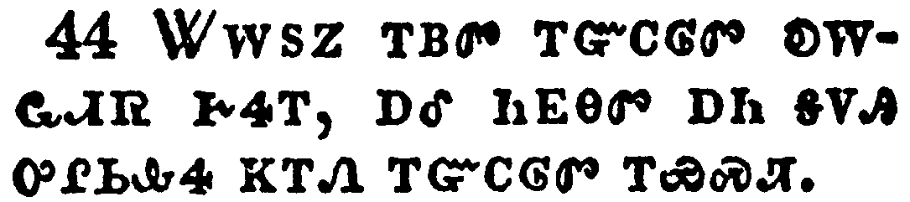</a></td>
</tr>
<tr class="even">
<td>And it was about the sixth hour, and there was a darkness over all the earth until the ninth hour.</td>
</tr>
<tr class="odd">
<td>ᏔᎳᏚᏃ ᎢᏴᏛ ᎢᏳᏟᎶᏛ ᎧᎳᏩᏗᏒ ᎨᏎᎢ, ᎠᎴ ᏂᎬᎾᏛ ᎠᏂ ᎦᏙᎯ ᎤᎵᏏᎲᏎ ᏦᎢᏁ ᎢᏳᏟᎶᏛ ᎢᏯᏍᏘ.</td>
</tr>
<tr class="even">
<td>Ta-la-du-no i-yv-dv i-yu-tli-lo-dv ka-la-wa-di-sv ge-se-i, a-le ni-gv-na-dv a-ni ga-do-hi u-li-si-hv-se tso-i-ne i-yu-tli-lo-dv i-ya-s-ti.</td>
</tr>
</tbody>
</table>

<table>
<tbody>
<tr class="odd">
<td><a href="032345.png">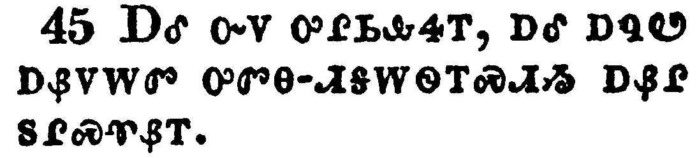</a></td>
</tr>
<tr class="even">
<td>And the sun was darkened, and the veil of the temple was rent in the midst.</td>
</tr>
<tr class="odd">
<td>ᎠᎴ ᏅᏙ ᎤᎵᏏᎲᏎᎢ, ᎠᎴ ᎠᏄᏬ ᎠᏰᏙᎳᏛ ᎤᏛᎾ-ᏗᎦᎳᏫᎢᏍᏗᏱ ᎠᏰᎵ ᏚᎵᏍᏡᏰᎢ.</td>
</tr>
<tr class="even">
<td>A-le nv-do u-li-si-hv-se-i, a-le a-nu-wo a-ye-do-la-dv u-dv-na--di-ga-la-wi-i-s-di-yi a-ye-li du-li-s-tlu-ye-i.</td>
</tr>
</tbody>
</table>

<table>
<tbody>
<tr class="odd">
<td><a href="032346.png">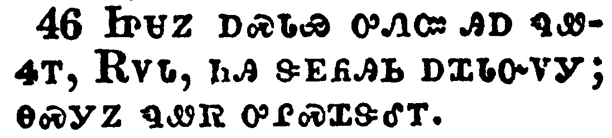</a></td>
</tr>
<tr class="even">
<td>And when Jesus had cried with a loud voice, he said, Father, into thy hands I commend my spirit: and having said thus, he gave up the ghost.</td>
</tr>
<tr class="odd">
<td>ᏥᏌᏃ ᎠᏍᏓᏯ ᎤᏁᏨ ᎯᎠ ᏄᏪᏎᎢ, ᎡᏙᏓ, ᏂᎯ ᏕᎬᏲᎯᏏ ᎠᏆᏓᏅᏙᎩ; ᎾᏍᎩᏃ ᏄᏪᏒ ᎤᎵᏍᏆᏕᎴᎢ.</td>
</tr>
<tr class="even">
<td>Tsi-sa-no a-s-da-ya u-ne-tsv hi-a nu-we-se-i, E-do-da, ni-hi de-gv-yo-hi-si a-qua-da-nv-do-gi; na-s-gi-no nu-we-sv u-li-s-qua-de-le-i.</td>
</tr>
</tbody>
</table>

<table>
<tbody>
<tr class="odd">
<td><a href="032347.png">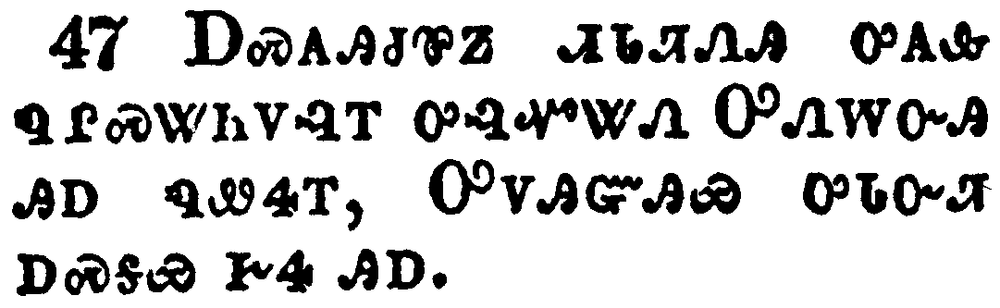</a></td>
</tr>
<tr class="even">
<td>Now when the centurion saw what was done, he glorified God, saying, Certainly this was a righteous man.</td>
</tr>
<tr class="odd">
<td>ᎠᏍᎪᎯᏧᏈᏃ ᏗᏓᏖᏁᎯ ᎤᎪᎲ ᏄᎵᏍᏔᏂᏙᎸᎢ ᎤᎸᏉᏔᏁ ᎤᏁᎳᏅᎯ ᎯᎠ ᏄᏪᏎᎢ, ᎤᏙᎯᏳᎯᏯ ᎤᏓᏅᏗ ᎠᏍᎦᏯ ᎨᏎ ᎯᎠ.</td>
</tr>
<tr class="even">
<td>A-s-go-hi-tsu-qui-no di-da-te-ne-hi u-go-hv nu-li-s-ta-ni-do-lv-i u-lv-quo-ta-ne U-ne-la-nv-hi hi-a nu-we-se-i, U-do-hi-yu-hi-ya u-da-nv-di a-s-ga-ya ge-se hi-a.</td>
</tr>
</tbody>
</table>

<table>
<tbody>
<tr class="odd">
<td><a href="032348.png">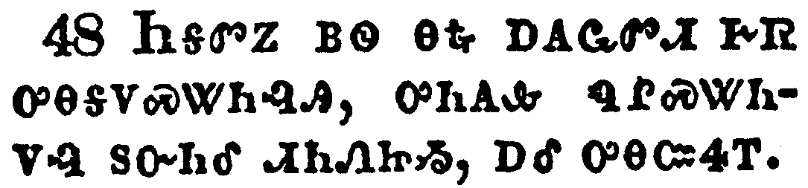</a></td>
</tr>
<tr class="even">
<td>And all the people that came together to that sight, beholding the things which were done, smote their breasts, and returned.</td>
</tr>
<tr class="odd">
<td>ᏂᎦᏛᏃ ᏴᏫ ᎾᎿᎭᎠᎪᏩᏛᏗ ᎨᏒ ᎤᎾᎦᏙᏍᏔᏂᎸᎯ, ᎤᏂᎪᎲ ᏄᎵᏍᏔᏂᏙᎸ ᏚᏅᏂᎴ ᏗᏂᏁᏥᏱ, ᎠᎴ ᎤᎾᏨᏎᎢ.</td>
</tr>
<tr class="even">
<td>Ni-ga-dv-no yv-wi na-hna a-go-wa-dv-di ge-sv u-na-ga-do-s-ta-ni-lv-hi, u-ni-go-hv nu-li-s-ta-ni-do-lv du-nv-ni-le di-ni-ne-tsi-yi, a-le u-na-tsv-se-i.</td>
</tr>
</tbody>
</table>

<table>
<tbody>
<tr class="odd">
<td><a href="032349.png">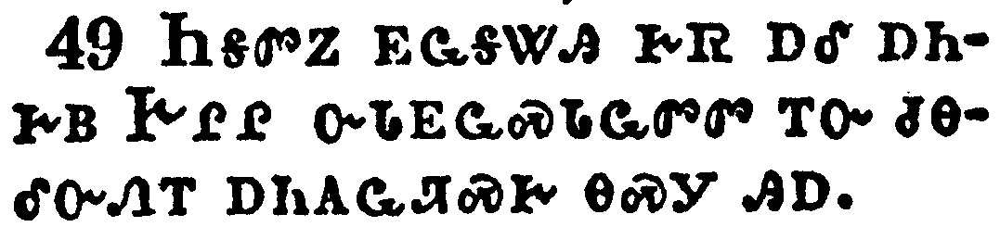</a></td>
</tr>
<tr class="even">
<td>And all his acquaintance, and the women that followed him from Galilee, stood afar off, beholding these things.</td>
</tr>
<tr class="odd">
<td>ᏂᎦᏛᏃ ᎬᏩᎦᏔᎯ ᎨᏒ ᎠᎴ ᎠᏂᎨᏴ ᎨᎵᎵ ᏅᏓᎬᏩᏍᏓᏩᏛᏛ ᎢᏅ ᏧᎾᎴᏅᏁᎢ ᎠᏂᎪᏩᏘᏍᎨ ᎾᏍᎩ ᎯᎠ.</td>
</tr>
<tr class="even">
<td>Ni-ga-dv-no gv-wa-ga-ta-hi ge-sv a-le a-ni-ge-yv Ge-li-li nv-da-gv-wa-s-da-wa-dv-dv i-nv tsu-na-le-nv-ne-i a-ni-go-wa-ti-s-ge na-s-gi hi-a.</td>
</tr>
</tbody>
</table>

<table>
<tbody>
<tr class="odd">
<td><a href="032350.png">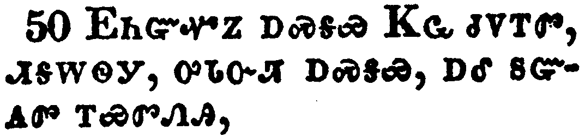</a></td>
</tr>
<tr class="even">
<td>And, behold, there was a man named Joseph, a counseller; and he was a good man, and a just:</td>
</tr>
<tr class="odd">
<td>ᎬᏂᏳᏉᏃ ᎠᏍᎦᏯ ᏦᏩ ᏧᏙᎢᏛ, ᏗᎦᎳᏫᎩ, ᎤᏓᏅᏘ ᎠᏍᎦᏯ, ᎠᎴ ᏚᏳᎪᏛ ᎢᏯᏛᏁᎯ,</td>
</tr>
<tr class="even">
<td>Gv-ni-yu-quo-no a-s-ga-ya Tso-wa tsu-do-i-dv, di-ga-la-wi-gi, u-da-nv-ti a-s-ga-ya, a-le du-yu-go-dv i-ya-dv-ne-hi,</td>
</tr>
</tbody>
</table>

<table>
<tbody>
<tr class="odd">
<td></td>
</tr>
<tr class="even">
<td>(The same had not consented to the counsel and deed of them;) he was of Arimathaea, a city of the Jews: who also himself waited for the kingdom of God.</td>
</tr>
<tr class="odd">
<td>(ᎾᏍᎩ ᎥᏝ ᎣᏏᏳ ᏳᏰᎸᏁ ᎾᏍᎩ ᏄᏍᏛ ᏚᏄᎪᏔᏅ ᎠᎴ ᏄᎾᏛᏁᎸᎢ,) ᎠᎵᎹᏗᏱ ᎡᎯ ᎨᏎᎢ, ᎾᏍᎩ ᎠᏂᏧᏏ ᎤᏂᏚᎲᎢ, ᎾᏍᎩ ᎾᏍᏉ ᎠᎦᏘᏰ ᎤᏁᎳᏅᎯ ᎤᎬᏫᏳᎯ ᎨᏒᎢ,^</td>
</tr>
<tr class="even">
<td>(Na-s-gi v-tla o-si-yu yu-ye-lv-ne na-s-gi nu-s-dv du-nu-go-ta-nv a-le nu-na-dv-ne-lv-i,) A-li-ma-di-yi e-hi ge-se-i, na-s-gi A-ni-tsu-si u-ni-du-hv-i, na-s-gi na-s-quo a-ga-ti-ye U-ne-la-nv-hi u-gv-wi-yu-hi ge-sv-i,^</td>
</tr>
</tbody>
</table>

<table>
<tbody>
<tr class="odd">
<td><a href="032352.png">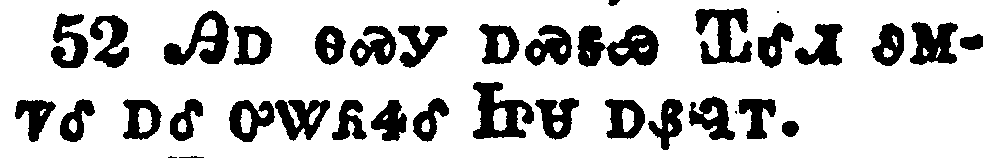</a></td>
</tr>
<tr class="even">
<td>This man went unto Pilate, and begged the body of Jesus.</td>
</tr>
<tr class="odd">
<td>ᎯᎠ ᎾᏍᎩ ᎠᏍᎦᏯ ᏆᎴᏗ ᏭᎷᏤᎴ ᎠᎴ ᎤᏔᏲᏎᎴ ᏥᏌ ᎠᏰᎸᎢ.</td>
</tr>
<tr class="even">
<td>Hi-a na-s-gi a-s-ga-ya Qua-le-di wu-lu-tse-le a-le u-ta-yo-se-le Tsi-sa a-ye-lv-i.</td>
</tr>
</tbody>
</table>

<table>
<tbody>
<tr class="odd">
<td><a href="032353.png">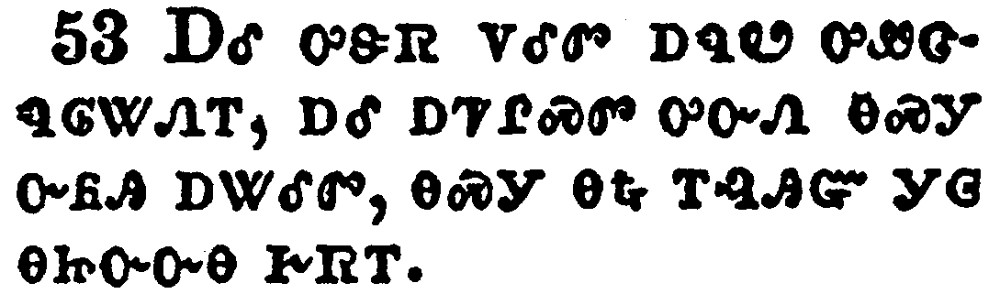</a></td>
</tr>
<tr class="even">
<td>And he took it down, and wrapped it in linen, and laid it in a sepulchre that was hewn in stone, wherein never man before was laid.</td>
</tr>
<tr class="odd">
<td>ᎠᎴ ᎤᏕᏒ ᏙᎴᏛ ᎠᏄᏬ ᎤᏪᏣᏄᎶᏔᏁᎢ, ᎠᎴ ᎠᏤᎵᏍᏛ ᎤᏅᏁ ᎾᏍᎩ ᏅᏲᎯ ᎠᏔᎴᏛ, ᎾᏍᎩ ᎾᎿᎭᎢᎸᎯᏳ ᎩᎶ ᎾᏥᏅᏅᎾ ᎨᏒᎢ.</td>
</tr>
<tr class="even">
<td>A-le u-de-sv do-le-dv a-nu-wo u-we-tsa-nu-lo-ta-ne-i, a-le a-tse-li-s-dv u-nv-ne na-s-gi nv-yo-hi a-ta-le-dv, na-s-gi na-hna i-lv-hi-yu gi-lo na-tsi-nv-nv-na ge-sv-i.</td>
</tr>
</tbody>
</table>

<table>
<tbody>
<tr class="odd">
<td><a href="032354.png">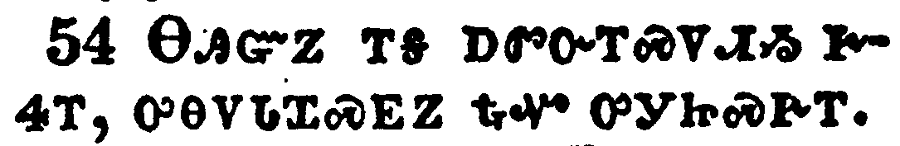</a></td>
</tr>
<tr class="even">
<td>And that day was the preparation, and the sabbath drew on.</td>
</tr>
<tr class="odd">
<td>ᎾᎯᏳᏃ ᎢᎦ ᎠᏛᏅᎢᏍᏙᏗᏱ ᎨᏎᎢ, ᎤᎾᏙᏓᏆᏍᎬᏃ ᎿᎭᏉ ᎤᎩᏥᏍᎨᎢ.</td>
</tr>
<tr class="even">
<td>Na-hi-yu-no i-ga a-dv-nv-i-s-do-di-yi ge-se-i, u-na-do-da-qua-s-gv-no hna-quo u-gi-tsi-s-ge-i.</td>
</tr>
</tbody>
</table>

<table>
<tbody>
<tr class="odd">
<td><a href="032355.png">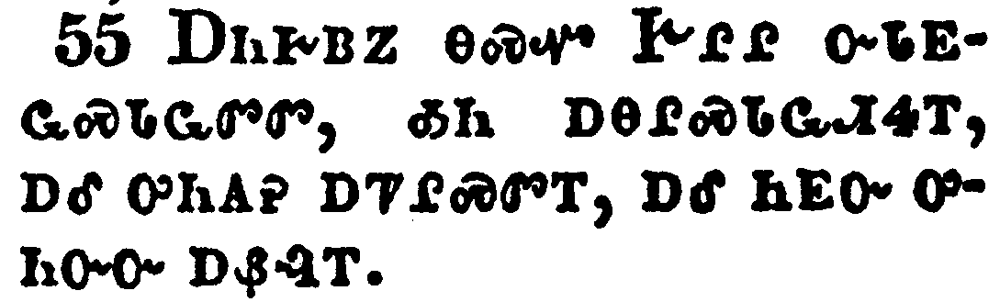</a></td>
</tr>
<tr class="even">
<td>And the women also, which came with him from Galilee, followed after, and beheld the sepulchre, and how his body was laid.</td>
</tr>
<tr class="odd">
<td>ᎠᏂᎨᏴᏃ ᎾᏍᏉ ᎨᎵᎵ ᏅᏓᎬᏩᏍᏓᏩᏛᏛ, ᎣᏂ ᎠᎾᎵᏍᏓᏩᏗᏎᎢ, ᎠᎴ ᎤᏂᎪᎮ ᎠᏤᎵᏍᏛᎢ, ᎠᎴ ᏂᎬᏅ ᎤᏂᏅᏅ ᎠᏰᎸᎢ.</td>
</tr>
<tr class="even">
<td>A-ni-ge-yv-no na-s-quo Ge-li-li nv-da-gv-wa-s-da-wa-dv-dv, o-ni a-na-li-s-da-wa-di-se-i, a-le u-ni-go-he a-tse-li-s-dv-i, a-le ni-gv-nv u-ni-nv-nv a-ye-lv-i.</td>
</tr>
</tbody>
</table>

<table>
<tbody>
<tr class="odd">
<td><a href="032356.png">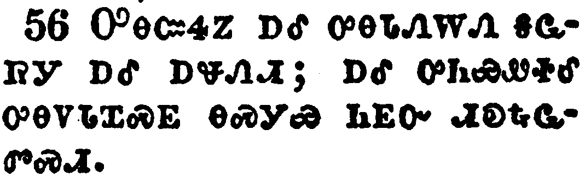</a></td>
</tr>
<tr class="even">
<td>And they returned, and prepared spices and ointments; and rested the sabbath day according to the commandment.</td>
</tr>
<tr class="odd">
<td>ᎤᎾᏨᏎᏃ ᎠᎴ ᎤᎾᏓᏁᎳᏁ ᎦᏩᏒᎩ ᎠᎴ ᎠᏠᏁᏗ; ᎠᎴ ᎤᏂᏯᏪᏐᎴ ᎤᎾᏙᏓᏆᏍᎬ ᎾᏍᎩᏯ ᏂᎬᏅ ᏗᎧᎿᎭᏩᏛᏍᏗ.</td>
</tr>
<tr class="even">
<td>U-na-tsv-se-no a-le u-na-da-ne-la-ne ga-wa-sv-gi a-le a-tlo-ne-di; a-le u-ni-ya-we-so-le u-na-do-da-qua-s-gv na-s-gi-ya ni-gv-nv di-ka-hna-wa-dv-s-di.</td>
</tr>
</tbody>
</table>

