+++
draft=false
date = 2014-12-18T21:11:07Z
title = "Mark - Chapter 4 - Cherokee New Testament"
weight = 1418955067

[taxonomies]

authors = ["Timothy Legg"]
categories = []
tags = []

[extra]
+++

<table>
<tbody>
<tr class="odd">
<td></td>
</tr>
<tr class="even">
<td>And he began again to teach by the sea side: and there was gathered unto him a great multitude, so that he entered into a ship, and sat in the sea; and the whole multitude was by the sea on the land.</td>
</tr>
<tr class="odd">
<td>ᏔᎵᏁᏃ ᎤᎴᏅᎮ ᏚᏕᏲᏁ ᎥᏓᎷᎶᏗ; ᎤᏂᏣᏘᏃ ᎬᏩᏓᏡᏫᏍᏔᏁᎢ, ᎾᏍᎩ ᎢᏳᏍᏗ ᏥᏳᎯ ᎤᏣᏁᎢ, ᎠᎴ ᎥᏓᎵ ᎠᏔᎸ ᎤᏪᏁᎢ; ᏂᎦᏛᏃ ᎤᏂᏣᏘ ᎨᏒ ᎥᏓᎷᎶᏗ ᏙᏱ ᎨᏒ ᎠᏂᏙᎾᎡᎢ.</td>
</tr>
<tr class="even">
<td>Ta-li-ne-no u-le-nv-he du-de-yo-ne v-da-lu-lo-di; u-ni-tsa-ti-no gv-wa-da-tlu-wi-s-ta-ne-i, na-s-gi i-yu-s-di tsi-yu-hi u-tsa-ne-i, a-le v-da-li a-ta-lv u-we-ne-i; ni-ga-dv-no u-ni-tsa-ti ge-sv v-da-lu-lo-di do-yi ge-sv a-ni-do-na-e-i.</td>
</tr>
</tbody>
</table>

<table>
<tbody>
<tr class="odd">
<td><a href="020402.png">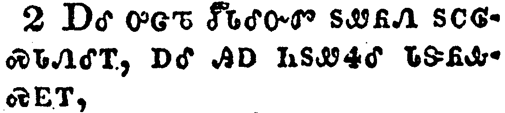</a></td>
</tr>
<tr class="even">
<td>And he taught them many things by parables, and said unto them in his doctrine,</td>
</tr>
<tr class="odd">
<td>ᎠᎴ ᎤᏣᏖ ᏧᏓᎴᏅᏛ ᏚᏪᏲᏁ ᏚᏟᎶᏍᏓᏁᎴᎢ, ᎠᎴ ᎯᎠ ᏂᏚᏪᏎᎴ ᏓᏕᏲᎲᏍᎬᎢ,</td>
</tr>
<tr class="even">
<td>A-le u-tsa-te tsu-da-le-nv-dv du-we-yo-ne du-tli-lo-s-da-ne-le-i, a-le hi-a ni-du-we-se-le da-de-yo-hv-s-gv-i,</td>
</tr>
</tbody>
</table>

<table>
<tbody>
<tr class="odd">
<td><a href="020403.png">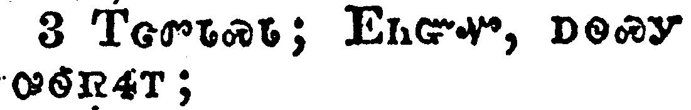</a></td>
</tr>
<tr class="even">
<td>Hearken; Behold, there went out a sower to sow:</td>
</tr>
<tr class="odd">
<td>ᎢᏣᏛᏓᏍᏓ; ᎬᏂᏳᏉ, ᎠᏫᏍᎩ ᎤᏫᏒᏎᎢ;</td>
</tr>
<tr class="even">
<td>I-tsa-dv-da-s-da; Gv-ni-yu-quo, a-wi-s-gi u-wi-sv-se-i;</td>
</tr>
</tbody>
</table>

<table>
<tbody>
<tr class="odd">
<td><a href="020404.png">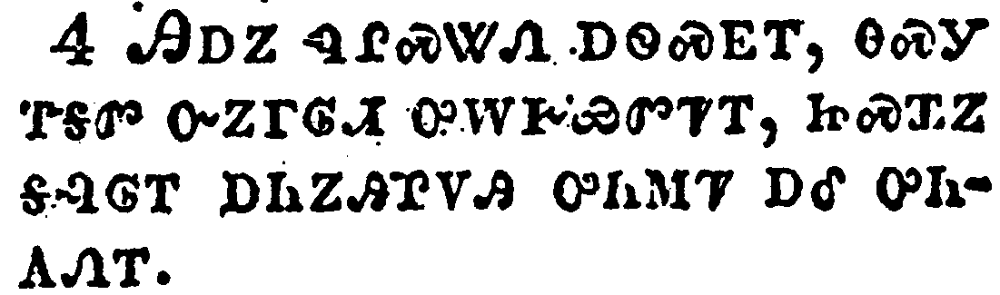</a></td>
</tr>
<tr class="even">
<td>And it came to pass, as he sowed, some fell by the way side, and the fowls of the air came and devoured it up.</td>
</tr>
<tr class="odd">
<td>ᎯᎠᏃ ᏄᎵᏍᏔᏁ ᎠᏫᏍᎬᎢ, ᎾᏍᎩ ᎢᎦᏛ ᏅᏃᎱᎶᏗ ᎤᎳᎨᏯᏛᏤᎢ, ᏥᏍᏆᏃ ᎦᎸᎶᎢ ᎠᏂᏃᎯᎢᏙᎯ ᎤᏂᎷᏤ ᎠᎴ ᎤᏂᎪᏁᎢ.</td>
</tr>
<tr class="even">
<td>Hi-a-no nu-li-s-ta-ne a-wi-s-gv-i, na-s-gi i-ga-dv nv-no-hu-lo-di u-la-ge-ya-dv-tse-i, tsi-s-qua-no ga-lv-lo-i a-ni-no-hi-i-do-hi u-ni-lu-tse a-le u-ni-go-ne-i.</td>
</tr>
</tbody>
</table>

<table>
<tbody>
<tr class="odd">
<td><a href="020405.png">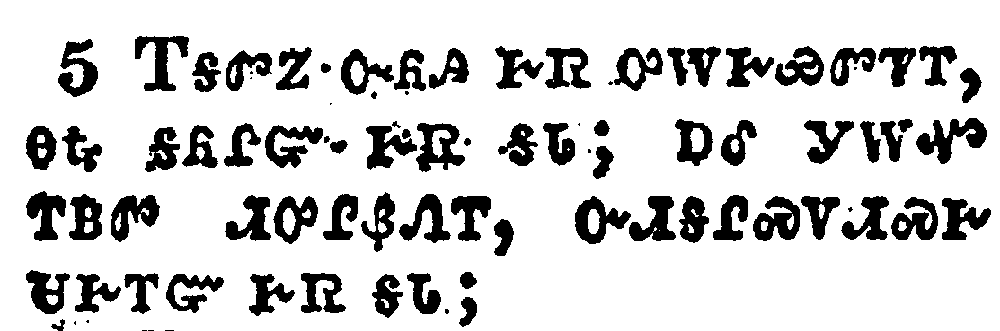</a></td>
</tr>
<tr class="even">
<td>And some fell on stony ground, where it had not much earth; and immediately it sprang up, because it had no depth of earth:</td>
</tr>
<tr class="odd">
<td>ᎢᎦᏛᏃ ᏅᏲᎯ ᎨᏒ ᎤᎳᎨᏯᏛᏤᎢ, ᎾᎿᎭᎦᏲᎵᏳ ᎨᏒ ᎦᏓ; ᎠᎴ ᎩᎳᏉ ᎢᏴᏛ ᏗᎤᎵᏰᏁᎢ, ᏅᏗᎦᎵᏍᏙᏗᏍᎨ ᏌᎨᎢᏳ ᎨᏒ ᎦᏓ;</td>
</tr>
<tr class="even">
<td>I-ga-dv-no nv-yo-hi ge-sv u-la-ge-ya-dv-tse-i, na-hna ga-yo-li-yu ge-sv ga-da; a-le gi-la-quo i-yv-dv di-u-li-ye-ne-i, nv-di-ga-li-s-do-di-s-ge sa-ge-i-yu ge-sv ga-da;</td>
</tr>
</tbody>
</table>

<table>
<tbody>
<tr class="odd">
<td><a href="020406.png">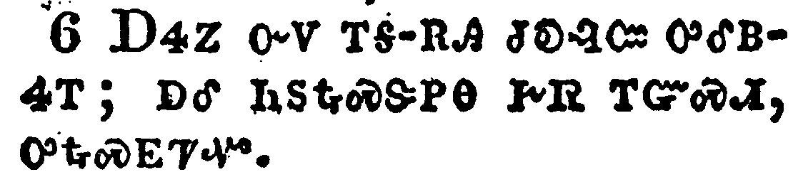</a></td>
</tr>
<tr class="even">
<td>But when the sun was up, it was scorched; and because it had no root, it withered away.</td>
</tr>
<tr class="odd">
<td>ᎠᏎᏃ ᏅᏙ ᎢᎦ-ᎡᎯ ᏧᎧᎸᏨ ᎤᎴᏴᏎᎢ; ᎠᎴ ᏂᏚᎿᎭᏍᏕᏢᎾ ᎨᏒ ᎢᏳᏍᏗ, ᎤᎿᎭᏍᎬᏤᏉ.</td>
</tr>
<tr class="even">
<td>A-se-no nv-do i-ga--e-hi tsu-ka-lv-tsv u-le-yv-se-i; a-le ni-du-hna-s-de-tlv-na ge-sv i-yu-s-di, u-hna-s-gv-tse-quo.</td>
</tr>
</tbody>
</table>

<table>
<tbody>
<tr class="odd">
<td><a href="020407.png">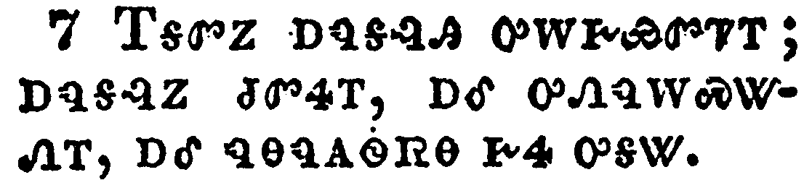</a></td>
</tr>
<tr class="even">
<td>And some fell among thorns, and the thorns grew up, and choked it, and it yielded no fruit.</td>
</tr>
<tr class="odd">
<td>ᎢᎦᏛᏃ ᎠᏄᎦᎸᎯ ᎤᎳᎨᏯᏛᏤᎢ; ᎠᏄᎦᎸᏃ ᏧᏛᏎᎢ, ᎠᎴ ᎤᏁᏄᎳᏍᏔᏁᎢ, ᎠᎴ ᏄᎾᏄᎪᏫᏒᎾ ᎨᏎ ᎤᎦᏔ.</td>
</tr>
<tr class="even">
<td>I-ga-dv-no a-nu-ga-lv-hi u-la-ge-ya-dv-tse-i; a-nu-ga-lv-no tsu-dv-se-i, a-le u-ne-nu-la-s-ta-ne-i, a-le nu-na-nu-go-wi-sv-na ge-se u-ga-ta.</td>
</tr>
</tbody>
</table>

<table>
<tbody>
<tr class="odd">
<td><a href="020408.png">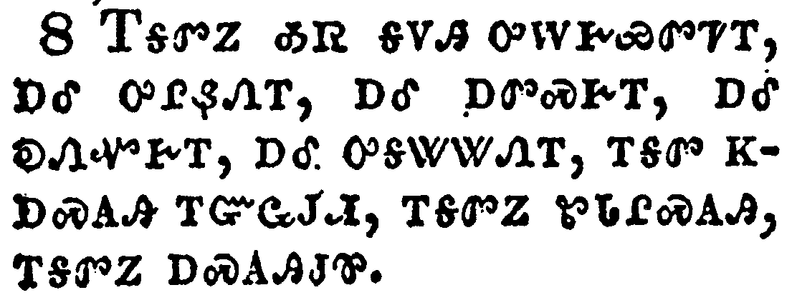</a></td>
</tr>
<tr class="even">
<td>And other fell on good ground, and did yield fruit that sprang up and increased; and brought forth, some thirty, and some sixty, and some an hundred.</td>
</tr>
<tr class="odd">
<td>ᎢᎦᏛᏃ ᎣᏒ ᎦᏙᎯ ᎤᎳᎨᏯᏛᏤᎢ, ᎠᎴ ᎤᎵᏰᏁᎢ, ᎠᎴ ᎠᏛᏍᎨᎢ, ᎠᎴ ᎧᏁᏉᎨᎢ, ᎠᎴ ᎤᎦᏔᏔᏁᎢ, ᎢᎦᏛ ᏦᎠᏍᎪᎯ ᎢᏳᏩᎫᏗ, ᎢᎦᏛᏃ ᏑᏓᎵᏍᎪᎯ, ᎢᎦᏛᏃ ᎠᏍᎪᎯᏧᏈ.</td>
</tr>
<tr class="even">
<td>I-ga-dv-no o-sv ga-do-hi u-la-ge-ya-dv-tse-i, a-le u-li-ye-ne-i, a-le a-dv-s-ge-i, a-le ka-ne-quo-ge-i, a-le u-ga-ta-ta-ne-i, i-ga-dv tso-a-s-go-hi i-yu-wa-gu-di, i-ga-dv-no su-da-li-s-go-hi, i-ga-dv-no a-s-go-hi-tsu-qui.</td>
</tr>
</tbody>
</table>

<table>
<tbody>
<tr class="odd">
<td><a href="020409.png">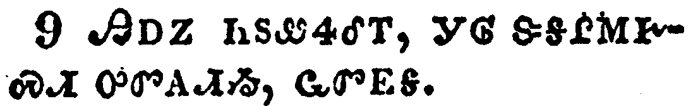</a></td>
</tr>
<tr class="even">
<td>And he said unto them, He that hath ears to hear, let him hear.</td>
</tr>
<tr class="odd">
<td>ᎯᎠᏃ ᏂᏚᏪᏎᎴᎢ, ᎩᎶ ᏕᎦᎵᎷᎨᏍᏗ ᎤᏛᎪᏗᏱ, ᏩᏛᎬᎦ.</td>
</tr>
<tr class="even">
<td>Hi-a-no ni-du-we-se-le-i, gi-lo de-ga-li-lu-ge-s-di u-dv-go-di-yi, wa-dv-gv-ga.</td>
</tr>
</tbody>
</table>

<table>
<tbody>
<tr class="odd">
<td><a href="020410.png">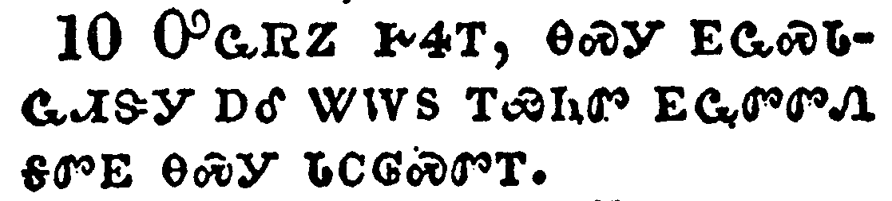</a></td>
</tr>
<tr class="even">
<td>And when he was alone, they that were about him with the twelve asked of him the parable.</td>
</tr>
<tr class="odd">
<td>ᎤᏩᏒᏃ ᎨᏎᎢ, ᎾᏍᎩ ᎬᏩᏍᏓᏩᏗᏕᎩ ᎠᎴ ᏔᎳᏚ ᎢᏯᏂᏛ ᎬᏩᏛᏛᏁ ᎦᏛᎬ ᎾᏍᎩ ᏓᏟᎶᏍᏛᎢ.</td>
</tr>
<tr class="even">
<td>U-wa-sv-no ge-se-i, na-s-gi gv-wa-s-da-wa-di-de-gi a-le ta-la-du i-ya-ni-dv gv-wa-dv-dv-ne ga-dv-gv na-s-gi da-tli-lo-s-dv-i.</td>
</tr>
</tbody>
</table>

<table>
<tbody>
<tr class="odd">
<td><a href="020411.png">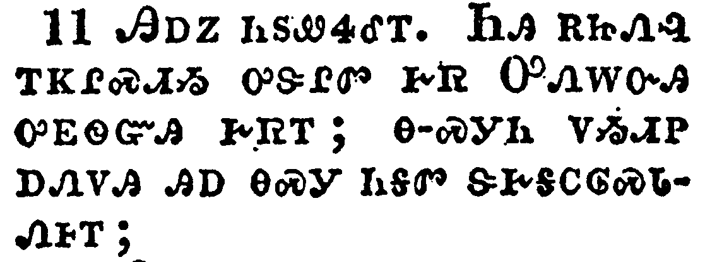</a></td>
</tr>
<tr class="even">
<td>And he said unto them, Unto you it is given to know the mystery of the kingdom of God: but unto them that are without, all these things are done in parables:</td>
</tr>
<tr class="odd">
<td>ᎯᎠᏃ ᏂᏚᏪᏎᎴᎢ. ᏂᎯ ᎡᏥᏁᎸ ᎢᏦᎵᏍᏗᏱ ᎤᏕᎵᏛ ᎨᏒ ᎤᏁᎳᏅᎯ ᎤᎬᏫᏳᎯ ᎨᏒᎢ; Ꮎ-ᏍᎩᏂ ᏙᏱᏗᏢ ᎠᏁᏙᎯ ᎯᎠ ᎾᏍᎩ ᏂᎦᏛ ᏕᎨᎦᏟᎶᏍᏓᏁᎰᎢ;</td>
</tr>
<tr class="even">
<td>Hi-a-no ni-du-we-se-le-i. Ni-hi e-tsi-ne-lv i-tso-li-s-di-yi u-de-li-dv ge-sv U-ne-la-nv-hi u-gv-wi-yu-hi ge-sv-i; na--s-gi-ni do-yi-di-tlv a-ne-do-hi hi-a na-s-gi ni-ga-dv de-ge-ga-tli-lo-s-da-ne-ho-i;</td>
</tr>
</tbody>
</table>

<table>
<tbody>
<tr class="odd">
<td><a href="020412.png">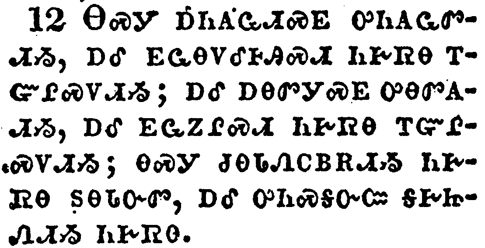</a></td>
</tr>
<tr class="even">
<td>That seeing they may see, and not perceive; and hearing they may hear, and not understand; lest at any time they should be converted, and their sins should be forgiven them.</td>
</tr>
<tr class="odd">
<td>ᎾᏍᎩ ᎠᏂᎪᏩᏗᏍᎬ ᎤᏂᎪᏩᏛᏗᏱ, ᎠᎴ ᎬᏩᎾᏙᎴᎰᎯᏍᏗ ᏂᎨᏒᎾ ᎢᏳᎵᏍᏙᏗᏱ; ᎠᎴ ᎠᎾᏛᎩᏍᎬ ᎤᎾᏛᎪᏗᏱ, ᎠᎴ ᎬᏩᏃᎵᏍᏗ ᏂᎨᏒᎾ ᎢᏳᎵᏍᏙᏗᏱ; ᎾᏍᎩ ᏧᎾᏓᏁᏟᏴᎡᏗᏱ ᏂᎨᏒᎾ ᏚᎾᏓᏅᏛ, ᎠᎴ ᎤᏂᏍᎦᏅᏨ ᎦᎨᏥᏁᏗᏱ ᏂᎨᏒᎾ.</td>
</tr>
<tr class="even">
<td>Na-s-gi a-ni-go-wa-di-s-gv u-ni-go-wa-dv-di-yi, a-le gv-wa-na-do-le-ho-hi-s-di ni-ge-sv-na i-yu-li-s-do-di-yi; a-le a-na-dv-gi-s-gv u-na-dv-go-di-yi, a-le gv-wa-no-li-s-di ni-ge-sv-na i-yu-li-s-do-di-yi; na-s-gi tsu-na-da-ne-tli-yv-e-di-yi ni-ge-sv-na du-na-da-nv-dv, a-le u-ni-s-ga-nv-tsv ga-ge-tsi-ne-di-yi ni-ge-sv-na.</td>
</tr>
</tbody>
</table>

<table>
<tbody>
<tr class="odd">
<td><a href="020413.png">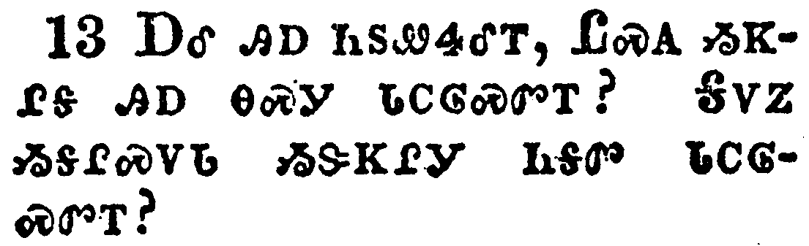</a></td>
</tr>
<tr class="even">
<td>And he said unto them, Know ye not this parable? and how then will ye know all parables?</td>
</tr>
<tr class="odd">
<td>ᎠᎴ ᎯᎠ ᏂᏚᏪᏎᎴᎢ, ᏝᏍᎪ ᏱᏦᎵᎦ ᎯᎠ ᎾᏍᎩ ᏓᏟᎶᏍᏛᎢ? ᎦᏙᏃ ᏱᎦᎵᏍᏙᏓ ᏱᏕᏦᎵᎩ ᏂᎦᏛ ᏓᏟᎶᏍᏛᎢ?</td>
</tr>
<tr class="even">
<td>A-le hi-a ni-du-we-se-le-i, Tla-s-go yi-tso-li-ga hi-a na-s-gi da-tli-lo-s-dv-i? Ga-do-no yi-ga-li-s-do-da yi-de-tso-li-gi ni-ga-dv da-tli-lo-s-dv-i?</td>
</tr>
</tbody>
</table>

<table>
<tbody>
<tr class="odd">
<td><a href="020414.png">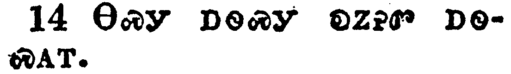</a></td>
</tr>
<tr class="even">
<td>The sower soweth the word.</td>
</tr>
<tr class="odd">
<td>ᎾᏍᎩ ᎠᏫᏍᎩ ᎧᏃᎮᏛ ᎠᏫᏍᎪᎢ.</td>
</tr>
<tr class="even">
<td>Na-s-gi a-wi-s-gi ka-no-he-dv a-wi-s-go-i.</td>
</tr>
</tbody>
</table>

<table>
<tbody>
<tr class="odd">
<td><a href="020415.png">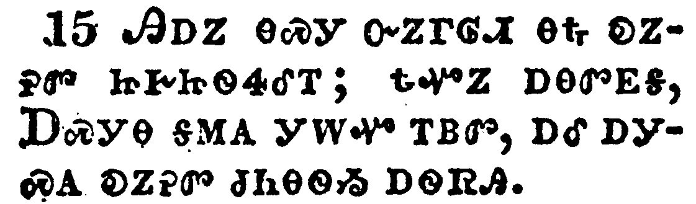</a></td>
</tr>
<tr class="even">
<td>And these are they by the way side, where the word is sown; but when they have heard, Satan cometh immediately, and taketh away the word that was sown in their hearts.</td>
</tr>
<tr class="odd">
<td>ᎯᎠᏃ ᎾᏍᎩ ᏅᏃᎱᎶᏗ ᎾᎿᎭᎧᏃᎮᏛ ᏥᎨᏥᏫᏎᎴᎢ; ᎿᎭᏉᏃ ᎠᎾᏛᎬᎦ, ᎠᏍᎩᎾ ᎦᎷᎪ ᎩᎳᏉ ᎢᏴᏛ, ᎠᎴ ᎠᎩᏍᎪ ᎧᏃᎮᏛ ᏧᏂᎾᏫᏱ ᎠᏫᏒᎯ.</td>
</tr>
<tr class="even">
<td>Hi-a-no na-s-gi nv-no-hu-lo-di na-hna ka-no-he-dv tsi-ge-tsi-wi-se-le-i; hna-quo-no a-na-dv-gv-ga, A-s-gi-na ga-lu-go gi-la-quo i-yv-dv, a-le a-gi-s-go ka-no-he-dv tsu-ni-na-wi-yi a-wi-sv-hi.</td>
</tr>
</tbody>
</table>

<table>
<tbody>
<tr class="odd">
<td><a href="020416.png">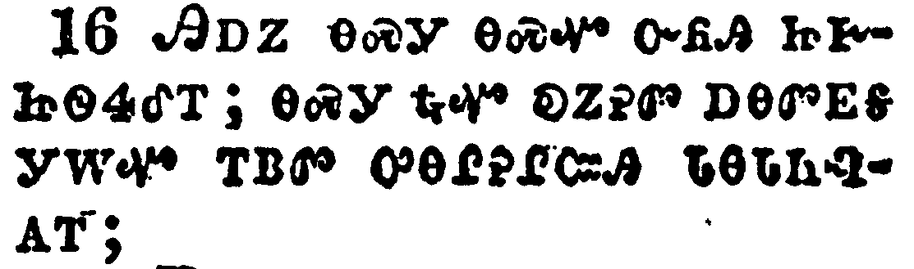</a></td>
</tr>
<tr class="even">
<td>And these are they likewise which are sown on stony ground; who, when they have heard the word, immediately receive it with gladness;</td>
</tr>
<tr class="odd">
<td>ᎯᎠᏃ ᎾᏍᎩ ᎾᏍᏉ ᏅᏲᎯ ᏥᎨᏥᏫᏎᎴᎢ; ᎾᏍᎩ ᎿᎭᏉ ᎧᏃᎮᏛ ᎠᎾᏛᎬᎦ ᎩᎳᏉ ᎢᏴᏛ ᎤᎾᎵᎮᎵᏨᎯ ᏓᎾᏓᏂᎸᎪᎢ;</td>
</tr>
<tr class="even">
<td>Hi-a-no na-s-gi na-s-quo nv-yo-hi tsi-ge-tsi-wi-se-le-i; na-s-gi hna-quo ka-no-he-dv a-na-dv-gv-ga gi-la-quo i-yv-dv u-na-li-he-li-tsv-hi da-na-da-ni-lv-go-i;</td>
</tr>
</tbody>
</table>

<table>
<tbody>
<tr class="odd">
<td><a href="020417.png">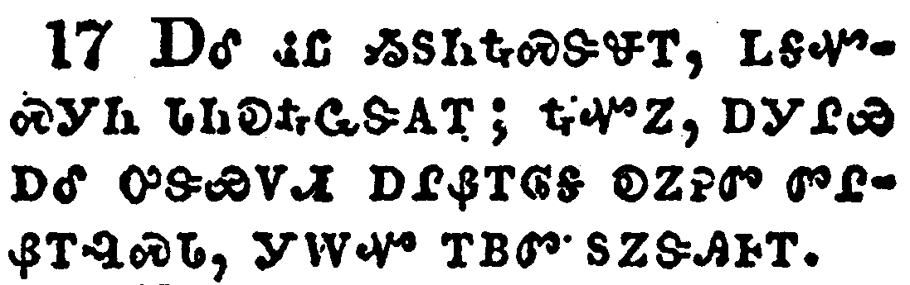</a></td>
</tr>
<tr class="even">
<td>And have no root in themselves, and so endure but for a time: afterward, when affliction or persecution ariseth for the word's sake, immediately they are offended.</td>
</tr>
<tr class="odd">
<td>ᎠᎴ ᎥᏝ ᏱᏚᏂᎿᎭᏍᏕᏠᎢ, ᏞᎦᏉᏍᎩᏂ ᏓᏂᎧᎿᎭᏩᏕᎪᎢ; ᎿᎭᏉᏃ, ᎠᎩᎵᏯ ᎠᎴ ᎤᏕᏯᏙᏗ ᎠᎵᏰᎢᎶᎦ ᎧᏃᎮᏛ ᏛᎵᏰᎢᎸᏍᏓ, ᎩᎳᏉ ᎢᏴᏛ ᏚᏃᏕᎯᎰᎢ.</td>
</tr>
<tr class="even">
<td>A-le v-tla yi-du-ni-hna-s-de-tlo-i, tle-ga-quo-s-gi-ni da-ni-ka-hna-wa-de-go-i; hna-quo-no, a-gi-li-ya a-le u-de-ya-do-di a-li-ye-i-lo-ga ka-no-he-dv dv-li-ye-i-lv-s-da, gi-la-quo i-yv-dv du-no-de-hi-ho-i.</td>
</tr>
</tbody>
</table>

<table>
<tbody>
<tr class="odd">
<td><a href="020418.png">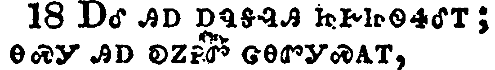</a></td>
</tr>
<tr class="even">
<td>And these are they which are sown among thorns; such as hear the word,</td>
</tr>
<tr class="odd">
<td>ᎠᎴ ᎯᎠ ᎠᏄᎦᎸᎯ ᏥᎨᏥᏫᏎᎴᎢ; ᎾᏍᎩ ᎯᎠ ᎧᏃᎮᏛ ᏣᎾᏛᎩᏍᎪᎢ,</td>
</tr>
<tr class="even">
<td>A-le hi-a a-nu-ga-lv-hi tsi-ge-tsi-wi-se-le-i; na-s-gi hi-a ka-no-he-dv tsa-na-dv-gi-s-go-i,</td>
</tr>
</tbody>
</table>

<table>
<tbody>
<tr class="odd">
<td><a href="020419.png">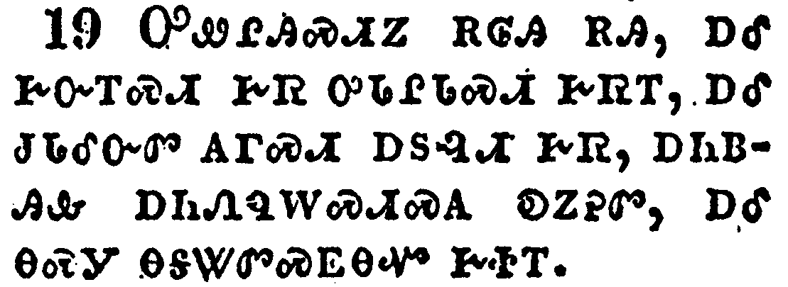</a></td>
</tr>
<tr class="even">
<td>And the cares of this world, and the deceitfulness of riches, and the lusts of other things entering in, choke the word, and it becometh unfruitful.</td>
</tr>
<tr class="odd">
<td>ᎤᏪᎵᎯᏍᏗᏃ ᎡᎶᎯ ᎡᎯ, ᎠᎴ ᎨᏅᎢᏍᏗ ᎨᏒ ᎤᏓᎵᏓᏍᏗ ᎨᏒᎢ, ᎠᎴ ᏧᏓᎴᏅᏛ ᎪᎱᏍᏗ ᎠᏚᎸᏗ ᎨᏒ, ᎠᏂᏴᎯᎲ ᎠᏂᏁᏄᎳᏍᏗᏍᎪ ᎧᏃᎮᏛ, ᎠᎴ ᎾᏍᎩ ᎾᎦᏔᏛᏍᎬᎾᏉ ᎨᏐᎢ.</td>
</tr>
<tr class="even">
<td>U-we-li-hi-s-di-no e-lo-hi e-hi, a-le ge-nv-i-s-di ge-sv u-da-li-da-s-di ge-sv-i, a-le tsu-da-le-nv-dv go-hu-s-di a-du-lv-di ge-sv, a-ni-yv-hi-hv a-ni-ne-nu-la-s-di-s-go ka-no-he-dv, a-le na-s-gi na-ga-ta-dv-s-gv-na-quo ge-so-i.</td>
</tr>
</tbody>
</table>

<table>
<tbody>
<tr class="odd">
<td><a href="020420.png">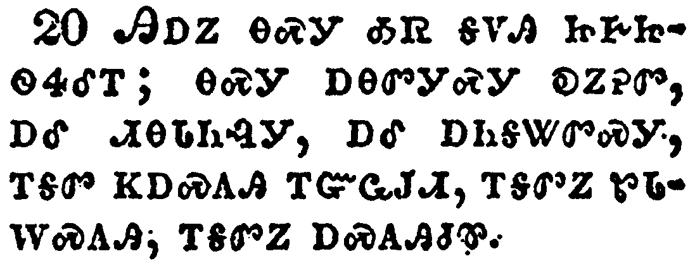</a></td>
</tr>
<tr class="even">
<td>And these are they which are sown on good ground; such as hear the word, and receive it, and bring forth fruit, some thirtyfold, some sixty, and some an hundred.</td>
</tr>
<tr class="odd">
<td>ᎯᎠᏃ ᎾᏍᎩ ᎣᏒ ᎦᏙᎯ ᏥᎨᏥᏫᏎᎴᎢ; ᎾᏍᎩ ᎠᎾᏛᎩᏍᎩ ᎧᏃᎮᏛ, ᎠᎴ ᏗᎾᏓᏂᎸᎩ, ᎠᎴ ᎠᏂᎦᏔᏛᏍᎩ, ᎢᎦᏛ ᏦᎠᏍᎪᎯ ᎢᏳᏩᎫᏗ, ᎢᎦᏛᏃ ᏑᏓᎳᏍᎪᎯ, ᎢᎦᏛᏃ ᎠᏍᎪᎯᏧᏈ.</td>
</tr>
<tr class="even">
<td>Hi-a-no na-s-gi o-sv ga-do-hi tsi-ge-tsi-wi-se-le-i; na-s-gi a-na-dv-gi-s-gi ka-no-he-dv, a-le di-na-da-ni-lv-gi, a-le a-ni-ga-ta-dv-s-gi, i-ga-dv tso-a-s-go-hi i-yu-wa-gu-di, i-ga-dv-no su-da-la-s-go-hi, i-ga-dv-no a-s-go-hi-tsu-qui.</td>
</tr>
</tbody>
</table>

<table>
<tbody>
<tr class="odd">
<td><a href="020421.png">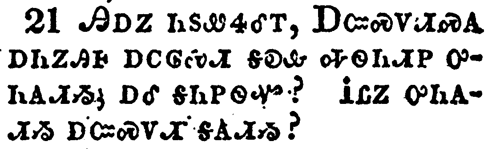</a></td>
</tr>
<tr class="even">
<td>And he said unto them, Is a candle brought to be put under a bushel, or under a bed? and not to be set on a candlestick?</td>
</tr>
<tr class="odd">
<td>ᎯᎠᏃ ᏂᏚᏪᏎᎴᎢ, ᎠᏨᏍᏙᏗᏍᎪ ᎠᏂᏃᎯᎰ ᎠᏟᎶᏍᏗ ᎦᎧᎲ ᎭᏫᏂᏗᏢ ᎤᏂᎪᏗᏱ, ᎠᎴ ᎦᏂᏢᏫᏉ? ᎥᏝᏃ ᎤᏂᎪᏗᏱ ᎠᏨᏍᏙᏗ ᎦᎪᏗᏱ?</td>
</tr>
<tr class="even">
<td>Hi-a-no ni-du-we-se-le-i, A-tsv-s-do-di-s-go a-ni-no-hi-ho a-tli-lo-s-di ga-ka-hv ha-wi-ni-di-tlv u-ni-go-di-yi, a-le ga-ni-tlv-wi-quo? V-tla-no u-ni-go-di-yi a-tsv-s-do-di ga-go-di-yi?</td>
</tr>
</tbody>
</table>

<table>
<tbody>
<tr class="odd">
<td><a href="020422.png">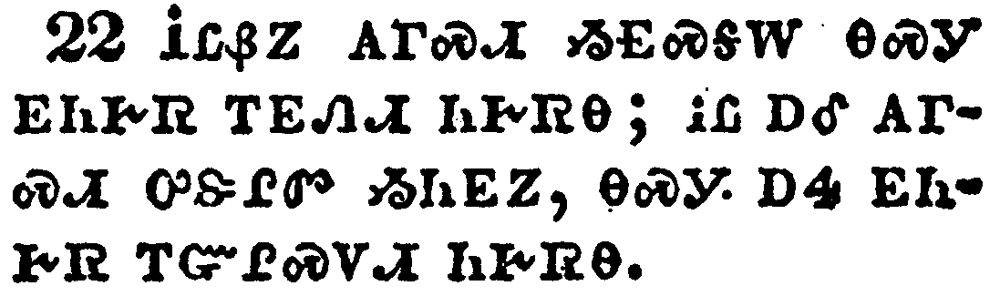</a></td>
</tr>
<tr class="even">
<td>For there is nothing hid, which shall not be manifested; neither was any thing kept secret, but that it should come abroad.</td>
</tr>
<tr class="odd">
<td>ᎥᏝᏰᏃ ᎪᎱᏍᏗ ᏱᎬᏍᎦᎳ ᎾᏍᎩ ᎬᏂᎨᏒ ᎢᎬᏁᏗ ᏂᎨᏒᎾ; ᎥᏝ ᎠᎴ ᎪᎱᏍᏗ ᎤᏕᎵᏛ ᏱᏂᎬᏃ, ᎾᏍᎩ ᎠᏎ ᎬᏂᎨᏒ ᎢᏳᎵᏍᏙᏗ ᏂᎨᏒᎾ.</td>
</tr>
<tr class="even">
<td>V-tla-ye-no go-hu-s-di yi-gv-s-ga-la na-s-gi gv-ni-ge-sv i-gv-ne-di ni-ge-sv-na; v-tla a-le go-hu-s-di u-de-li-dv yi-ni-gv-no, na-s-gi a-se gv-ni-ge-sv i-yu-li-s-do-di ni-ge-sv-na.</td>
</tr>
</tbody>
</table>

<table>
<tbody>
<tr class="odd">
<td><a href="020423.png">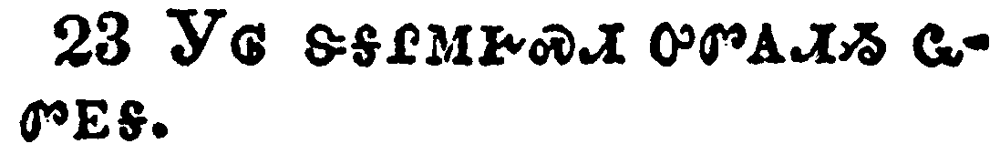</a></td>
</tr>
<tr class="even">
<td>If any man have ears to hear, let him hear.</td>
</tr>
<tr class="odd">
<td>ᎩᎶ ᏕᎦᎵᎷᎨᏍᏗ ᎤᏛᎪᏗᏱ ᏩᏛᎬᎦ.</td>
</tr>
<tr class="even">
<td>Gi-lo de-ga-li-lu-ge-s-di u-dv-go-di-yi wa-dv-gv-ga.</td>
</tr>
</tbody>
</table>

<table>
<tbody>
<tr class="odd">
<td><a href="020424.png">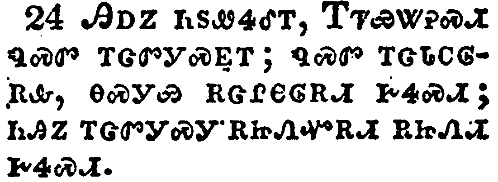</a></td>
</tr>
<tr class="even">
<td>And he said unto them, Take heed what ye hear: with what measure ye mete, it shall be measured to you: and unto you that hear shall more be given.</td>
</tr>
<tr class="odd">
<td>ᎯᎠᏃ ᏂᏚᏪᏎᎴᎢ, ᎢᏤᏯᏔᎮᏍᏗ ᏄᏍᏛ ᎢᏣᏛᎩᏍᎬᎢ; ᏄᏍᏛ ᎢᏣᏓᏟᎶᏒᎲ, ᎾᏍᎩᏯ ᎡᏣᎵᎾᎶᎡᏗ ᎨᏎᏍᏗ; ᏂᎯᏃ ᎢᏣᏛᎩᏍᎩ ᎡᏥᏁᏉᎡᏗ ᎡᏥᏁᏗ ᎨᏎᏍᏗ.</td>
</tr>
<tr class="even">
<td>Hi-a-no ni-du-we-se-le-i, I-tse-ya-ta-he-s-di nu-s-dv i-tsa-dv-gi-s-gv-i; nu-s-dv i-tsa-da-tli-lo-sv-hv, na-s-gi-ya e-tsa-li-na-lo-e-di ge-se-s-di; ni-hi-no i-tsa-dv-gi-s-gi e-tsi-ne-quo-e-di e-tsi-ne-di ge-se-s-di.</td>
</tr>
</tbody>
</table>

<table>
<tbody>
<tr class="odd">
<td></td>
</tr>
<tr class="even">
<td>For he that hath, to him shall be given: and he that hath not, from him shall be taken even that which he hath.</td>
</tr>
<tr class="odd">
<td>ᎩᎶᏰᏃ ᎤᎮᏍᏗ, ᎾᏍᎩ ᎠᏥᏁᏗ ᎨᏎᏍᏗ; ᎩᎶᏃ ᏄᎲᎾ ᎨᏎᏍᏗ, ᎾᏍᎩ ᎠᏥᎩᏒᏗ ᎨᏎᏍᏗ ᎾᏍᏉ ᎤᎲᎢ.</td>
</tr>
<tr class="even">
<td>Gi-lo-ye-no u-he-s-di, na-s-gi a-tsi-ne-di ge-se-s-di; gi-lo-no nu-hv-na ge-se-s-di, na-s-gi a-tsi-gi-sv-di ge-se-s-di na-s-quo u-hv-i.</td>
</tr>
</tbody>
</table>

<table>
<tbody>
<tr class="odd">
<td><a href="020426.png">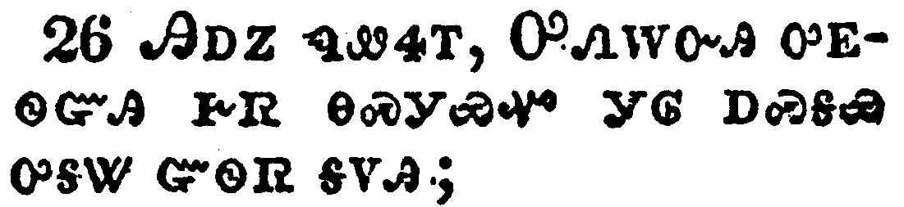</a></td>
</tr>
<tr class="even">
<td>And he said, So is the kingdom of God, as if a man should cast seed into the ground;</td>
</tr>
<tr class="odd">
<td>ᎯᎠᏃ ᏄᏪᏎᎢ, ᎤᏁᎳᏅᎯ ᎤᎬᏫᏳᎯ ᎨᏒ ᎾᏍᎩᏯᏉ ᎩᎶ ᎠᏍᎦᏯ ᎤᎦᏔ ᏳᏫᏒ ᎦᏙᎯ;</td>
</tr>
<tr class="even">
<td>Hi-a-no nu-we-se-i, U-ne-la-nv-hi u-gv-wi-yu-hi ge-sv na-s-gi-ya-quo gi-lo a-s-ga-ya u-ga-ta yu-wi-sv ga-do-hi;</td>
</tr>
</tbody>
</table>

<table>
<tbody>
<tr class="odd">
<td><a href="020427.png">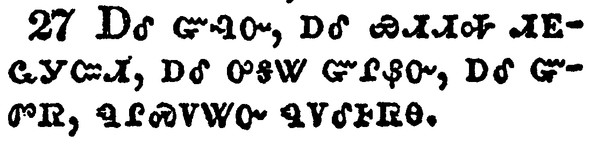</a></td>
</tr>
<tr class="even">
<td>And should sleep, and rise night and day, and the seed should spring and grow up, he knoweth not how.</td>
</tr>
<tr class="odd">
<td>ᎠᎴ ᏳᎸᏅ, ᎠᎴ ᏯᏗᏗᎭ ᏗᎬᏩᎩᏨᏗ, ᎠᎴ ᎤᎦᏔ ᏳᎵᏰᏅ, ᎠᎴ ᏳᏛᏒ, ᏄᎵᏍᏙᏔᏅ ᏄᏙᎴᎰᏒᎾ.</td>
</tr>
<tr class="even">
<td>A-le yu-lv-nv, a-le ya-di-di-ha di-gv-wa-gi-tsv-di, a-le u-ga-ta yu-li-ye-nv, a-le yu-dv-sv, nu-li-s-do-ta-nv nu-do-le-ho-sv-na.</td>
</tr>
</tbody>
</table>

<table>
<tbody>
<tr class="odd">
<td><a href="020428.png">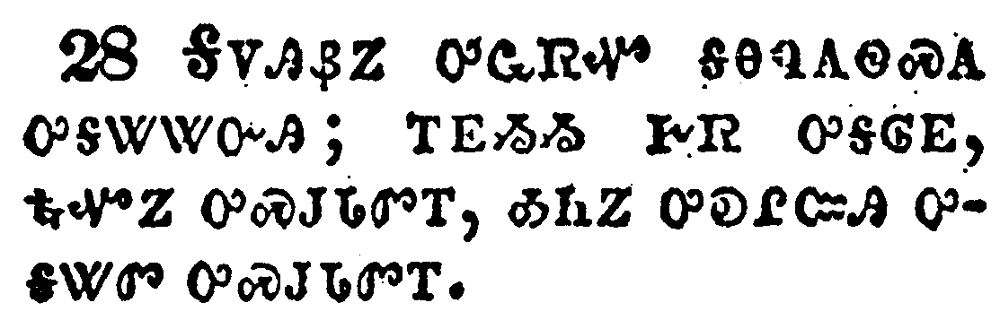</a></td>
</tr>
<tr class="even">
<td>For the earth bringeth forth fruit of herself; first the blade, then the ear, after that the full corn in the ear.</td>
</tr>
<tr class="odd">
<td>ᎦᏙᎯᏰᏃ ᎤᏩᏒᏉ ᎦᎾᏄᎪᏫᏍᎪ ᎤᎦᏔᏔᏅᎯ; ᎢᎬᏱᏱ ᎨᏒ ᎤᎦᎶᎬ, ᎿᎭᏉᏃ ᎤᏍᎫᏓᏛᎢ, ᎣᏂᏃ ᎤᎧᎵᏨᎯ ᎤᎦᏔᏛ ᎤᏍᎫᏓᏛᎢ.</td>
</tr>
<tr class="even">
<td>Ga-do-hi-ye-no u-wa-sv-quo ga-na-nu-go-wi-s-go u-ga-ta-ta-nv-hi; i-gv-yi-yi ge-sv u-ga-lo-gv, hna-quo-no u-s-gu-da-dv-i, o-ni-no u-ka-li-tsv-hi u-ga-ta-dv u-s-gu-da-dv-i.</td>
</tr>
</tbody>
</table>

<table>
<tbody>
<tr class="odd">
<td><a href="020429.png">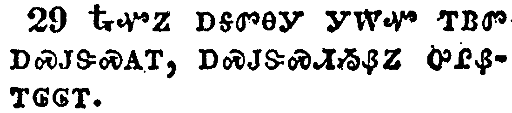</a></td>
</tr>
<tr class="even">
<td>But when the fruit is brought forth, immediately he putteth in the sickle, because the harvest is come.</td>
</tr>
<tr class="odd">
<td>ᎿᎭᏉᏃ ᎠᎦᏛᎾᎩ ᎩᎳᏉ ᎢᏴᏛ ᎠᏍᎫᏕᏍᎪᎢ, ᎠᏍᎫᏕᏍᏗᏱᏰᏃ ᎤᎵᏰᎢᎶᎶᎢ.</td>
</tr>
<tr class="even">
<td>Hna-quo-no a-ga-dv-na-gi gi-la-quo i-yv-dv a-s-gu-de-s-go-i, a-s-gu-de-s-di-yi-ye-no u-li-ye-i-lo-lo-i.</td>
</tr>
</tbody>
</table>

<table>
<tbody>
<tr class="odd">
<td></td>
</tr>
<tr class="even">
<td>And he said, Whereunto shall we liken the kingdom of God? or with what comparison shall we compare it?</td>
</tr>
<tr class="odd">
<td>ᎯᎠᏃ ᏄᏪᏎᎢ, ᎦᏙ ᏙᏓᏓᏤᎳᏍᏔᏂ ᎤᏁᎳᏅᎯ ᎤᎬᏫᏳᎯ ᎨᏒᎢ? ᎦᏙᎨ ᏓᏟᎶᏍᏛ ᏙᏓᏓᏟᎶᏍᏔᏂ?</td>
</tr>
<tr class="even">
<td>Hi-a-no nu-we-se-i, Ga-do do-da-da-tse-la-s-ta-ni U-ne-la-nv-hi u-gv-wi-yu-hi ge-sv-i? Ga-do-ge da-tli-lo-s-dv do-da-da-tli-lo-s-ta-ni?</td>
</tr>
</tbody>
</table>

<table>
<tbody>
<tr class="odd">
<td><a href="020431.png">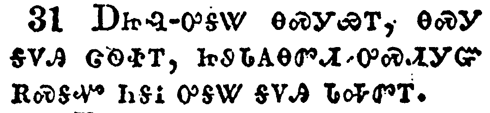</a></td>
</tr>
<tr class="even">
<td>It is like a grain of mustard seed, which, when it is sown in the earth, is less than all the seeds that be in the earth:</td>
</tr>
<tr class="odd">
<td>ᎠᏥᎸ-ᎤᎦᏔ ᎾᏍᎩᏯᎢ, ᎾᏍᎩ ᎦᏙᎯ ᏣᏫᏐᎢ, ᏥᏭᏓᎪᎾᏛᏗ ᎤᏍᏗᎩᏳ ᎡᏍᎦᏉ ᏂᎦᎥ ᎤᎦᏔ ᎦᏙᎯ ᏓᎭᏛᎢ.</td>
</tr>
<tr class="even">
<td>A-tsi-lv--u-ga-ta na-s-gi-ya-i, na-s-gi ga-do-hi tsa-wi-so-i, tsi-wu-da-go-na-dv-di u-s-di-gi-yu e-s-ga-quo ni-ga-v u-ga-ta ga-do-hi da-ha-dv-i.</td>
</tr>
</tbody>
</table>

<table>
<tbody>
<tr class="odd">
<td><a href="020432.png">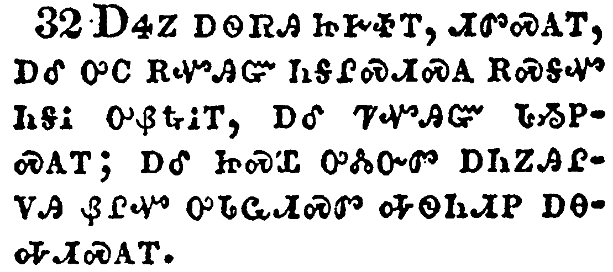</a></td>
</tr>
<tr class="even">
<td>But when it is sown, it groweth up, and becometh greater than all herbs, and shooteth out great branches; so that the fowls of the air may lodge under the shadow of it.</td>
</tr>
<tr class="odd">
<td>ᎠᏎᏃ ᎠᏫᏒᎯ ᏥᎨᏐᎢ, ᏗᏛᏍᎪᎢ, ᎠᎴ ᎤᏟ ᎡᏉᎯᏳ ᏂᎦᎵᏍᏗᏍᎪ ᎡᏍᎦᏉ ᏂᎦᎥ ᎤᏰᎿᎭᎥᎢ, ᎠᎴ ᏤᏉᎯᏳ ᏓᏱᏢᏍᎪᎢ; ᎠᎴ ᏥᏍᏆ ᎤᏜᏓᏅᏛ ᎠᏂᏃᎯᎵᏙᎯ ᏰᎵᏉ ᎤᏓᏩᏗᏍᏛ ᎭᏫᏂᏗᏢ ᎠᎾᎭᏗᏍᎪᎢ.</td>
</tr>
<tr class="even">
<td>A-se-no a-wi-sv-hi tsi-ge-so-i, di-dv-s-go-i, a-le u-tli e-quo-hi-yu ni-ga-li-s-di-s-go e-s-ga-quo ni-ga-v u-ye-hna-v-i, a-le tse-quo-hi-yu da-yi-tlv-s-go-i; a-le tsi-s-qua u-dla-nv-dv a-ni-no-hi-li-do-hi ye-li-quo u-da-wa-di-s-dv ha-wi-ni-di-tlv a-na-ha-di-s-go-i.</td>
</tr>
</tbody>
</table>

<table>
<tbody>
<tr class="odd">
<td><a href="020433.png">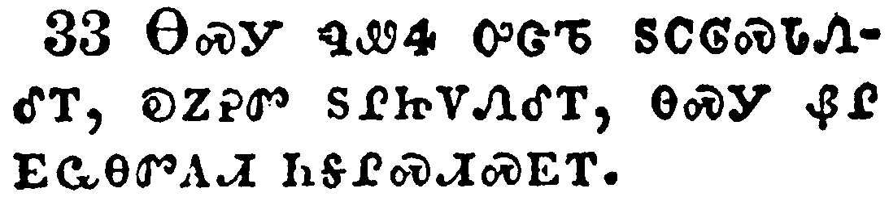</a></td>
</tr>
<tr class="even">
<td>And with many such parables spake he the word unto them, as they were able to hear it.</td>
</tr>
<tr class="odd">
<td>ᎾᏍᎩ ᏄᏪᏎ ᎤᏣᏖ ᏚᏟᎶᏍᏓᏁᎴᎢ, ᎧᏃᎮᏛ ᏚᎵᏥᏙᏁᎴᎢ, ᎾᏍᎩ ᏰᎵ ᎬᏩᎾᏛᎪᏗ ᏂᎦᎵᏍᏗᏍᎬᎢ.</td>
</tr>
<tr class="even">
<td>Na-s-gi nu-we-se u-tsa-te du-tli-lo-s-da-ne-le-i, ka-no-he-dv du-li-tsi-do-ne-le-i, na-s-gi ye-li gv-wa-na-dv-go-di ni-ga-li-s-di-s-gv-i.</td>
</tr>
</tbody>
</table>

<table>
<tbody>
<tr class="odd">
<td><a href="020434.png">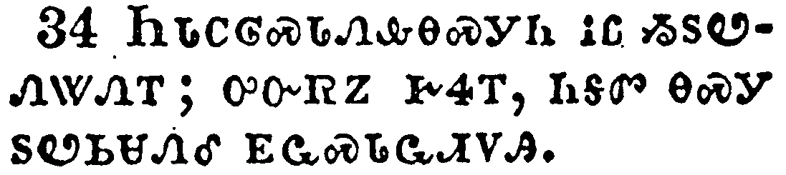</a></td>
</tr>
<tr class="even">
<td>But without a parable spake he not unto them: and when they were alone, he expounded all things to his disciples.</td>
</tr>
<tr class="odd">
<td>ᏂᏓᏟᎶᏍᏓᏁᎲᎾᏍᎩᏂ ᎥᏝ ᏱᏚᏬᏁᏔᏁᎢ; ᎤᏅᏒᏃ ᎨᏎᎢ, ᏂᎦᏛ ᎾᏍᎩ ᏚᏬᏏᏌᏁᎴ ᎬᏩᏍᏓᏩᏗᏙᎯ.</td>
</tr>
<tr class="even">
<td>Ni-da-tli-lo-s-da-ne-hv-na-s-gi-ni v-tla yi-du-wo-ne-ta-ne-i; u-nv-sv-no ge-se-i, ni-ga-dv na-s-gi du-wo-si-sa-ne-le gv-wa-s-da-wa-di-do-hi.</td>
</tr>
</tbody>
</table>

<table>
<tbody>
<tr class="odd">
<td><a href="020435.png">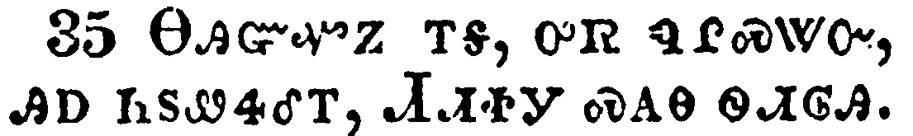</a></td>
</tr>
<tr class="even">
<td>And the same day, when the even was come, he saith unto them, Let us pass over unto the other side.</td>
</tr>
<tr class="odd">
<td>ᎾᎯᏳᏉᏃ ᎢᎦ, ᎤᏒ ᏄᎵᏍᏔᏅ, ᎯᎠ ᏂᏚᏪᏎᎴᎢ, ᏗᏗᏐᎩ ᏍᎪᎾ ᏫᏗᎶᎯ.</td>
</tr>
<tr class="even">
<td>Na-hi-yu-quo-no i-ga, u-sv nu-li-s-ta-nv, hi-a ni-du-we-se-le-i, Di-di-so-gi s-go-na wi-di-lo-hi.</td>
</tr>
</tbody>
</table>

<table>
<tbody>
<tr class="odd">
<td><a href="020436.png">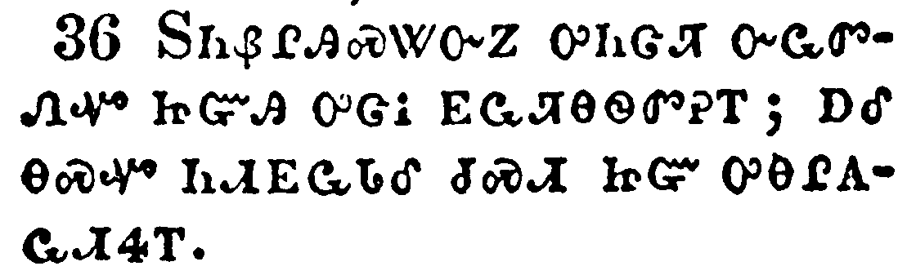</a></td>
</tr>
<tr class="even">
<td>And when they had sent away the multitude, they took him even as he was in the ship. And there were also with him other little ships.</td>
</tr>
<tr class="odd">
<td>ᏚᏂᏰᎵᎯᏍᏔᏅᏃ ᎤᏂᏣᏘ ᏅᏩᏛᏁᏉ ᏥᏳᎯ ᎤᏣᎥ ᎬᏩᏘᎾᏫᏛᎮᎢ; ᎠᎴ ᎾᏍᏉ ᏂᏗᎬᏩᏓᎴ ᏧᏍᏗ ᏥᏳ ᎤᎾᎵᎪᏩᏗᏎᎢ.</td>
</tr>
<tr class="even">
<td>Du-ni-ye-li-hi-s-ta-nv-no u-ni-tsa-ti nv-wa-dv-ne-quo tsi-yu-hi u-tsa-v gv-wa-ti-na-wi-dv-he-i; a-le na-s-quo ni-di-gv-wa-da-le tsu-s-di tsi-yu u-na-li-go-wa-di-se-i.</td>
</tr>
</tbody>
</table>

<table>
<tbody>
<tr class="odd">
<td><a href="020437.png">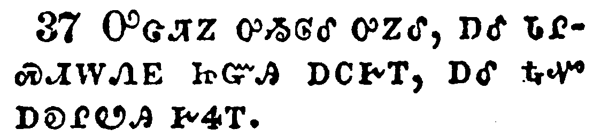</a></td>
</tr>
<tr class="even">
<td>And there arose a great storm of wind, and the waves beat into the ship, so that it was now full.</td>
</tr>
<tr class="odd">
<td>ᎤᏣᏘᏃ ᎤᏱᎶᎴ ᎤᏃᎴ, ᎠᎴ ᏓᎵᏍᏗᎳᏁᎬ ᏥᏳᎯ ᎠᏟᎨᎢ, ᎠᎴ ᎿᎭᏉ ᎠᎧᎵᏬᎯ ᎨᏎᎢ.</td>
</tr>
<tr class="even">
<td>U-tsa-ti-no u-yi-lo-le u-no-le, a-le da-li-s-di-la-ne-gv tsi-yu-hi a-tli-ge-i, a-le hna-quo a-ka-li-wo-hi ge-se-i.</td>
</tr>
</tbody>
</table>

<table>
<tbody>
<tr class="odd">
<td><a href="020438.png">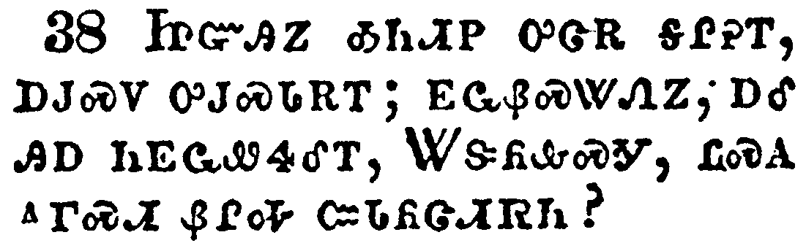</a></td>
</tr>
<tr class="even">
<td>And he was in the hinder part of the ship, asleep on a pillow: and they awake him, and say unto him, Master, carest thou not that we perish?</td>
</tr>
<tr class="odd">
<td>ᏥᏳᎯᏃ ᎣᏂᏗᏢ ᎤᏣᎡ ᎦᎵᎮᎢ, ᎠᎫᏍᏙ ᎤᎫᏍᏓᎡᎢ; ᎬᏩᏰᏍᏔᏁᏃ, ᎠᎴ ᎯᎠ ᏂᎬᏩᏪᏎᎴᎢ, ᏔᏕᏲᎲᏍᎩ, ᏝᏍᎪ ᎪᎱᏍᏗ ᏰᎵᎭ ᏨᏓᏲᏣᏗᏒᏂ?</td>
</tr>
<tr class="even">
<td>Tsi-yu-hi-no o-ni-di-tlv u-tsa-e ga-li-he-i, a-gu-s-do u-gu-s-da-e-i; gv-wa-ye-s-ta-ne-no, a-le hi-a ni-gv-wa-we-se-le-i, Ta-de-yo-hv-s-gi, tla-s-go go-hu-s-di ye-li-ha tsv-da-yo-tsa-di-sv-ni?</td>
</tr>
</tbody>
</table>

<table>
<tbody>
<tr class="odd">
<td><a href="020439.png">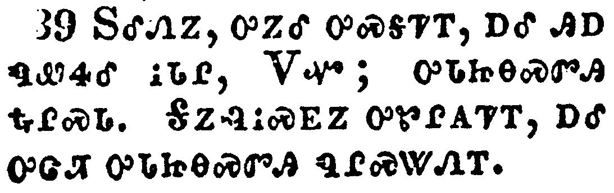</a></td>
</tr>
<tr class="even">
<td>And he arose, and rebuked the wind, and said unto the sea, Peace, be still. And the wind ceased, and there was a great calm.</td>
</tr>
<tr class="odd">
<td>ᏚᎴᏁᏃ, ᎤᏃᎴ ᎤᏍᎦᏤᎢ, ᎠᎴ ᎯᎠ ᏄᏪᏎᎴ ᎥᏓᎵ, ᏙᏉ; ᎤᏓᏥᎾᏍᏛᎯ ᎿᎭᎵᏍᏓ. ᎦᏃᎸᎥᏍᎬᏃ ᎤᏑᎵᎪᏤᎢ, ᎠᎴ ᎤᏣᏘ ᎤᏓᏥᎾᏍᏛᎯ ᏄᎵᏍᏔᏁᎢ.</td>
</tr>
<tr class="even">
<td>Du-le-ne-no, u-no-le u-s-ga-tse-i, a-le hi-a nu-we-se-le v-da-li, Do-quo; u-da-tsi-na-s-dv-hi hna-li-s-da. Ga-no-lv-v-s-gv-no u-su-li-go-tse-i, a-le u-tsa-ti u-da-tsi-na-s-dv-hi nu-li-s-ta-ne-i.</td>
</tr>
</tbody>
</table>

<table>
<tbody>
<tr class="odd">
<td><a href="020440.png">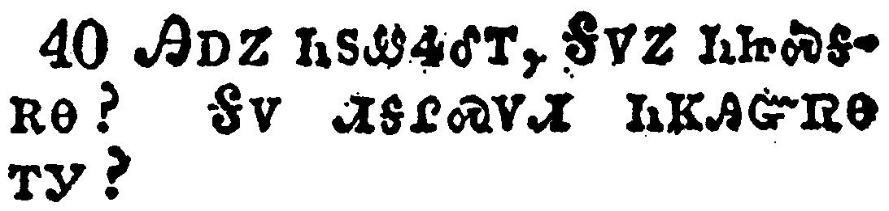</a></td>
</tr>
<tr class="even">
<td>And he said unto them, Why are ye so fearful? how is it that ye have no faith?</td>
</tr>
<tr class="odd">
<td>ᎯᎠᏃ ᏂᏚᏪᏎᎴᎢ, ᎦᏙᏃ ᏂᏥᏍᎦᏒᎾ? ᎦᏙ ᏗᎦᎵᏍᏙᏗ ᏂᏦᎯᏳᏒᎾ ᎢᎩ?</td>
</tr>
<tr class="even">
<td>Hi-a-no ni-du-we-se-le-i, Ga-do-no ni-tsi-s-ga-sv-na? Ga-do di-ga-li-s-do-di ni-tso-hi-yu-sv-na i-gi?</td>
</tr>
</tbody>
</table>

<table>
<tbody>
<tr class="odd">
<td><a href="020441.png">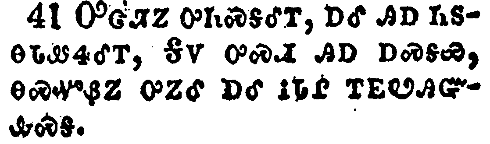</a></td>
</tr>
<tr class="even">
<td>And they feared exceedingly, and said one to another, What manner of man is this, that even the wind and the sea obey him?</td>
</tr>
<tr class="odd">
<td>ᎤᏣᏘᏃ ᎤᏂᏍᎦᎴᎢ, ᎠᎴ ᎯᎠ ᏂᏚᎾᏓᏪᏎᎴᎢ, ᎦᏙ ᎤᏍᏗ ᎯᎠ ᎠᏍᎦᏯ, ᎾᏍᏉᏰᏃ ᎤᏃᎴ ᎠᎴ ᎥᏓᎵ ᎢᎬᏬᎯᏳᎲᏍᎦ.</td>
</tr>
<tr class="even">
<td>U-tsa-ti-no u-ni-s-ga-le-i, a-le hi-a ni-du-na-da-we-se-le-i, Ga-do u-s-di hi-a a-s-ga-ya, na-s-quo-ye-no u-no-le a-le v-da-li i-gv-wo-hi-yu-hv-s-ga.</td>
</tr>
</tbody>
</table>

