+++
draft=false
date = 2014-12-18T21:11:07Z
title = "Mark - Chapter 8 - Cherokee New Testament"
weight = 1418955067

[taxonomies]

authors = ["Timothy Legg"]
categories = []
tags = []

[extra]
+++

<table>
<tbody>
<tr class="odd">
<td></td>
</tr>
<tr class="even">
<td>In those days the multitude being very great, and having nothing to eat, Jesus called his disciples unto him, and saith unto them,</td>
</tr>
<tr class="odd">
<td>ᎾᎯᏳᏃ ᎤᏂᏣᏘ ᎨᏒ ᏴᏫ ᏧᏈᏯ ᎨᏒ ᎢᏳᏍᏗ, ᎠᎴ ᏄᏂᎲᎾ ᎨᏒ ᎤᎾᎵᏍᏓᏴᏗ, ᏥᏌ ᏫᏚᏯᏅᎲ ᎬᏩᏍᏓᏩᏗᏙᎯ, ᎯᎠ ᏂᏚᏪᏎᎴᎢ;</td>
</tr>
<tr class="even">
<td>Na-hi-yu-no u-ni-tsa-ti ge-sv yv-wi tsu-qui-ya ge-sv i-yu-s-di, a-le nu-ni-hv-na ge-sv u-na-li-s-da-yv-di, Tsi-sa wi-du-ya-nv-hv gv-wa-s-da-wa-di-do-hi, hi-a ni-du-we-se-le-i;</td>
</tr>
</tbody>
</table>

<table>
<tbody>
<tr class="odd">
<td></td>
</tr>
<tr class="even">
<td>I have compassion on the multitude, because they have now been with me three days, and have nothing to eat:</td>
</tr>
<tr class="odd">
<td>ᎦᏥᏯᏙᎵᎦ ᎤᏂᏣᏘ ᎨᏒᎢ, ᏅᏗᎦᎵᏍᏙᏗ ᎿᎭᏉ ᏦᎢ ᎢᎦ ᎢᏧᎳᎭ ᎣᎨᏙᎸᎢ ᎠᎴ ᏄᏂᎲᎾ ᎨᏒ ᎤᎾᎵᏍᏓᏴᏗ;</td>
</tr>
<tr class="even">
<td>Ga-tsi-ya-do-li-ga u-ni-tsa-ti ge-sv-i, nv-di-ga-li-s-do-di hna-quo tso-i i-ga i-tsu-la-ha o-ge-do-lv-i a-le nu-ni-hv-na ge-sv u-na-li-s-da-yv-di;</td>
</tr>
</tbody>
</table>

<table>
<tbody>
<tr class="odd">
<td></td>
</tr>
<tr class="even">
<td>And if I send them away fasting to their own houses, they will faint by the way: for divers of them came from far.</td>
</tr>
<tr class="odd">
<td>ᎢᏳᏃ ᏱᎦᏥᏯᏂᎩᏍᏗᎭ ᏙᏧᏁᏅᏒ ᏯᏁᎦ ᏄᎾᎵᏍᏓᏴᏅᎾ, ᏩᎾᎢᏒᏉ ᏱᏓᏂᏩᎾᎦᎶᎩ; ᎢᎦᏛᏰᏃ ᎢᏅᎯᏳ ᏙᏧᏁᏅ.</td>
</tr>
<tr class="even">
<td>I-yu-no yi-ga-tsi-ya-ni-gi-s-di-ha do-tsu-ne-nv-sv ya-ne-ga nu-na-li-s-da-yv-nv-na, wa-na-i-sv-quo yi-da-ni-wa-na-ga-lo-gi; i-ga-dv-ye-no i-nv-hi-yu do-tsu-ne-nv.</td>
</tr>
</tbody>
</table>

<table>
<tbody>
<tr class="odd">
<td></td>
</tr>
<tr class="even">
<td>And his disciples answered him, From whence can a man satisfy these men with bread here in the wilderness?</td>
</tr>
<tr class="odd">
<td>ᎬᏩᏍᏓᏩᏗᏙᎯᏃ ᎯᎠ ᏂᎬᏩᏪᏎᎴᎢ, ᎭᏢ ᏱᏓᎩ ᎩᎶ ᎾᏍᎩ ᎢᎦᎢ ᎦᏚ ᎠᏂ ᎢᎾᎨᎢ, ᎯᎠ ᎾᏍᎩ ᏰᎵ ᎬᏩᏂᏛᏓᏁᏗ.</td>
</tr>
<tr class="even">
<td>Gv-wa-s-da-wa-di-do-hi-no hi-a ni-gv-wa-we-se-le-i, Ha-tlv yi-da-gi gi-lo na-s-gi i-ga-i ga-du a-ni i-na-ge-i, hi-a na-s-gi ye-li gv-wa-ni-dv-da-ne-di.</td>
</tr>
</tbody>
</table>

<table>
<tbody>
<tr class="odd">
<td></td>
</tr>
<tr class="even">
<td>And he asked them, How many loaves have ye? And they said, Seven.</td>
</tr>
<tr class="odd">
<td>ᏚᏛᏛᏁᏃ ᎯᎠ ᏄᏪᏎᎢ; ᎢᎳᎪ ᎦᏚ ᏕᏥᏰᎭ? ᎯᎠᏃ ᏄᏂᏪᏎᎢ, ᎦᎵᏉᎩ.</td>
</tr>
<tr class="even">
<td>Du-dv-dv-ne-no hi-a nu-we-se-i; I-la-go ga-du de-tsi-ye-ha? Hi-a-no nu-ni-we-se-i, Ga-li-quo-gi.</td>
</tr>
</tbody>
</table>

<table>
<tbody>
<tr class="odd">
<td><a href="020806.png">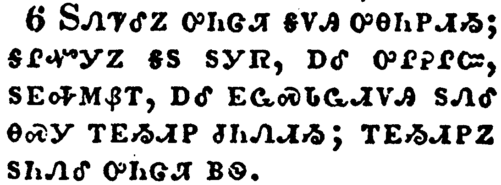</a></td>
</tr>
<tr class="even">
<td>And he commanded the people to sit down on the ground: and he took the seven loaves, and gave thanks, and brake, and gave to his disciples to set before them; and they did set them before the people.</td>
</tr>
<tr class="odd">
<td>ᏚᏁᏤᎴᏃ ᎤᏂᏣᏘ ᎦᏙᎯ ᎤᎾᏂᏢᏗᏱ; ᎦᎵᏉᎩᏃ ᎦᏚ ᏚᎩᏒ, ᎠᎴ ᎤᎵᎮᎵᏨ, ᏚᎬᎭᎷᏰᎢ, ᎠᎴ ᎬᏩᏍᏓᏩᏗᏙᎯ ᏚᏁᎴ ᎾᏍᎩ ᎢᎬᏱᏗᏢ ᏧᏂᏁᏗᏱ; ᎢᎬᏱᏗᏢᏃ ᏚᏂᏁᎴ ᎤᏂᏣᏘ ᏴᏫ.</td>
</tr>
<tr class="even">
<td>Du-ne-tse-le-no u-ni-tsa-ti ga-do-hi u-na-ni-tlv-di-yi; ga-li-quo-gi-no ga-du du-gi-sv, a-le u-li-he-li-tsv, du-gv-ha-lu-ye-i, a-le gv-wa-s-da-wa-di-do-hi du-ne-le na-s-gi i-gv-yi-di-tlv tsu-ni-ne-di-yi; i-gv-yi-di-tlv-no du-ni-ne-le u-ni-tsa-ti yv-wi.</td>
</tr>
</tbody>
</table>

<table>
<tbody>
<tr class="odd">
<td><a href="020807.png">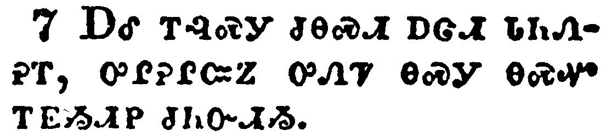</a></td>
</tr>
<tr class="even">
<td>And they had a few small fishes: and he blessed, and commanded to set them also before them.</td>
</tr>
<tr class="odd">
<td>ᎠᎴ ᎢᎸᏍᎩ ᏧᎾᏍᏗ ᎠᏣᏗ ᏓᏂᏁᎮᎢ, ᎤᎵᎮᎵᏨᏃ ᎤᏁᏤ ᎾᏍᎩ ᎾᏍᏉ ᎢᎬᏱᏗᏢ ᏧᏂᏅᏗᏱ.</td>
</tr>
<tr class="even">
<td>A-le i-lv-s-gi tsu-na-s-di a-tsa-di da-ni-ne-he-i, u-li-he-li-tsv-no u-ne-tse na-s-gi na-s-quo i-gv-yi-di-tlv tsu-ni-nv-di-yi.</td>
</tr>
</tbody>
</table>

<table>
<tbody>
<tr class="odd">
<td></td>
</tr>
<tr class="even">
<td>So they did eat, and were filled: and they took up of the broken meat that was left seven baskets.</td>
</tr>
<tr class="odd">
<td>ᎤᎾᎵᏍᏓᏴᏁᏃ, ᎠᎴ ᏚᏃᎸᏎᎢ; ᎤᏄᏖᏎᏃ ᎤᎵᎬᎭᎷᏴᎯ ᎤᏘᏴᎯ ᎦᎵᏉᎩ ᎢᏯᎧᎵᎢ ᏔᎷᏣ.</td>
</tr>
<tr class="even">
<td>U-na-li-s-da-yv-ne-no, a-le du-no-lv-se-i; u-nu-te-se-no u-li-gv-ha-lu-yv-hi u-ti-yv-hi ga-li-quo-gi i-ya-ka-li-i ta-lu-tsa.</td>
</tr>
</tbody>
</table>

<table>
<tbody>
<tr class="odd">
<td></td>
</tr>
<tr class="even">
<td>And they that had eaten were about four thousand: and he sent them away.</td>
</tr>
<tr class="odd">
<td>ᎤᎾᎵᏍᏓᏴᏅᎯᏃ ᏅᎩ ᎢᏯᎦᏴᎵ ᎢᏴᏛ ᎾᏂᎡᎢ; ᏚᏰᎵᎯᏍᏔᏁᏃ.</td>
</tr>
<tr class="even">
<td>U-na-li-s-da-yv-nv-hi-no nv-gi i-ya-ga-yv-li i-yv-dv na-ni-e-i; du-ye-li-hi-s-ta-ne-no.</td>
</tr>
</tbody>
</table>

<table>
<tbody>
<tr class="odd">
<td><a href="020810.png">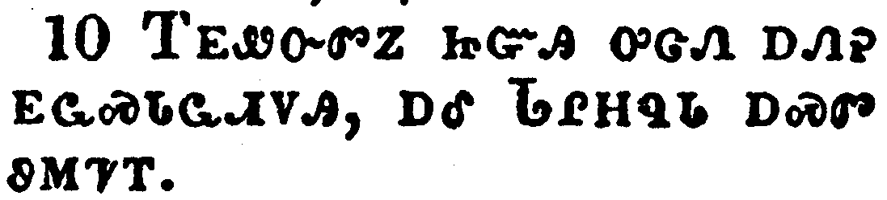</a></td>
</tr>
<tr class="even">
<td>And straightway he entered into a ship with his disciples, and came into the parts of Dalmanutha.</td>
</tr>
<tr class="odd">
<td>ᎢᎬᏪᏅᏛᏃ ᏥᏳᎯ ᎤᏣᏁ ᎠᏁᎮ ᎬᏩᏍᏓᏩᏗᏙᎯ, ᎠᎴ ᏓᎵᎻᏄᏓ ᎠᏍᏛ ᏭᎷᏤᎢ.</td>
</tr>
<tr class="even">
<td>I-gv-we-nv-dv-no tsi-yu-hi u-tsa-ne a-ne-he gv-wa-s-da-wa-di-do-hi, a-le Da-li-mi-nu-da a-s-dv wu-lu-tse-i.</td>
</tr>
</tbody>
</table>

<table>
<tbody>
<tr class="odd">
<td><a href="020811.png">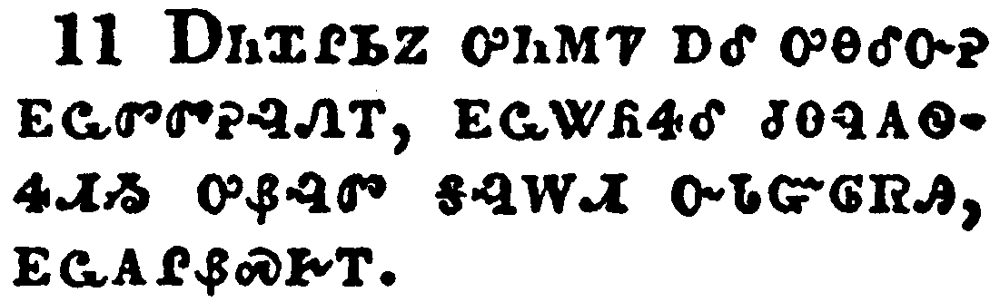</a></td>
</tr>
<tr class="even">
<td>And the Pharisees came forth, and began to question with him, seeking of him a sign from heaven, tempting him.</td>
</tr>
<tr class="odd">
<td>ᎠᏂᏆᎵᏏᏃ ᎤᏂᎷᏤ ᎠᎴ ᎤᎾᎴᏅᎮ ᎬᏩᏛᏛᎮᎸᏁᎢ, ᎬᏩᏔᏲᏎᎴ ᏧᎾᏄᎪᏫᏎᏗᏱ ᎤᏰᎸᏛ ᎦᎸᎳᏗ ᏅᏓᏳᎶᏒᎯ, ᎬᏩᎪᎵᏰᏍᎨᎢ.</td>
</tr>
<tr class="even">
<td>A-ni-qua-li-si-no u-ni-lu-tse a-le u-na-le-nv-he gv-wa-dv-dv-he-lv-ne-i, gv-wa-ta-yo-se-le tsu-na-nu-go-wi-se-di-yi u-ye-lv-dv ga-lv-la-di nv-da-yu-lo-sv-hi, gv-wa-go-li-ye-s-ge-i.</td>
</tr>
</tbody>
</table>

<table>
<tbody>
<tr class="odd">
<td></td>
</tr>
<tr class="even">
<td>And he sighed deeply in his spirit, and saith, Why doth this generation seek after a sign? verily I say unto you, There shall no sign be given unto this generation.</td>
</tr>
<tr class="odd">
<td>ᎤᏓᏅᏙᎩᎯᏃ ᎭᏫᏂ ᎤᎵᏰᏔᏁᎢ, ᎠᎴ ᎯᎠ ᏄᏪᏎᎢ, ᎦᏙᏃ ᎪᎯ ᎯᎠ ᏣᏁᎭ ᎤᏰᎸᏛ ᎤᏂᏲᎭ? ᎤᏙᎯᏳᎯᏯ ᎯᎠ ᏂᏨᏪᏎᎭ, ᎥᏝ ᎬᏂᎨᏒ ᎢᎨᎬᏁᏗ ᏱᎨᏎᏍᏗ ᎤᏰᎸᏛ ᎯᎠ ᎪᎯ ᏣᏁᎭ.</td>
</tr>
<tr class="even">
<td>U-da-nv-do-gi-hi-no ha-wi-ni u-li-ye-ta-ne-i, a-le hi-a nu-we-se-i, Ga-do-no go-hi hi-a tsa-ne-ha u-ye-lv-dv u-ni-yo-ha? u-do-hi-yu-hi-ya hi-a ni-tsv-we-se-ha, v-tla gv-ni-ge-sv i-ge-gv-ne-di yi-ge-se-s-di u-ye-lv-dv hi-a go-hi tsa-ne-ha.</td>
</tr>
</tbody>
</table>

<table>
<tbody>
<tr class="odd">
<td><a href="020813.png">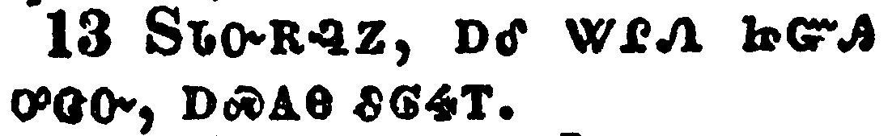</a></td>
</tr>
<tr class="even">
<td>And he left them, and entering into the ship again departed to the other side.</td>
</tr>
<tr class="odd">
<td>ᏚᏓᏅᎡᎸᏃ, ᎠᎴ ᏔᎵᏁ ᏥᏳᎯ ᎤᏣᏅ, ᎠᏍᎪᎾ ᏭᎶᏎᎢ.</td>
</tr>
<tr class="even">
<td>Du-da-nv-e-lv-no, a-le ta-li-ne tsi-yu-hi u-tsa-nv, a-s-go-na wu-lo-se-i.</td>
</tr>
</tbody>
</table>

<table>
<tbody>
<tr class="odd">
<td></td>
</tr>
<tr class="even">
<td>Now the disciples had forgotten to take bread, neither had they in the ship with them more than one loaf.</td>
</tr>
<tr class="odd">
<td>[ᎬᏩᏍᏓᏩᏗᏙᎯᏃ] ᎤᏅᎨᏫᏒᎯ ᎨᏎ ᎦᏚ ᏧᎾᏕᏅᏗᏱ, ᎥᏝ ᎠᎴ ᏳᎶᏒᏍᏕ ᏌᏉ ᎦᏚ ᎤᏂᎸ ᏥᏳᎯ.</td>
</tr>
<tr class="even">
<td>[Gv-wa-s-da-wa-di-do-hi-no] u-nv-ge-wi-sv-hi ge-se ga-du tsu-na-de-nv-di-yi, v-tla a-le yu-lo-sv-s-de sa-quo ga-du u-ni-lv tsi-yu-hi.</td>
</tr>
</tbody>
</table>

<table>
<tbody>
<tr class="odd">
<td></td>
</tr>
<tr class="even">
<td>And he charged them, saying, Take heed, beware of the leaven of the Pharisees, and of the leaven of Herod.</td>
</tr>
<tr class="odd">
<td>ᏚᏁᏤᎴᏃ ᎯᎠ ᏄᏪᏎᎢ, ᎢᏥᏯᏫᏍᎨᏍᏗ, ᎠᏂᏆᎵᏏ ᎤᎾᏤᎵ ᎠᎪᏙᏗ ᎢᏤᏯᏙᏤᎮᏍᏗ, ᎠᎴ ᎡᎶᏗ ᎤᏤᎵ ᎠᎪᏙᏗ.</td>
</tr>
<tr class="even">
<td>Du-ne-tse-le-no hi-a nu-we-se-i, I-tsi-ya-wi-s-ge-s-di, A-ni-qua-li-si u-na-tse-li a-go-do-di i-tse-ya-do-tse-he-s-di, a-le e-lo-di u-tse-li a-go-do-di.</td>
</tr>
</tbody>
</table>

<table>
<tbody>
<tr class="odd">
<td></td>
</tr>
<tr class="even">
<td>And they reasoned among themselves, saying, It is because we have no bread.</td>
</tr>
<tr class="odd">
<td>ᎤᏅᏒᏃ ᎨᏒ ᎤᎾᎵᏃᎮᎴ, ᎯᎠ ᏄᏂᏪᏎᎢ, ᏅᏗᎦᎵᏍᏙᏗᎭ ᎦᏚ ᏂᏗᏗᏰᎲᎾ ᎨᏒᎢ.</td>
</tr>
<tr class="even">
<td>U-nv-sv-no ge-sv u-na-li-no-he-le, hi-a nu-ni-we-se-i, Nv-di-ga-li-s-do-di-ha ga-du ni-di-di-ye-hv-na ge-sv-i.</td>
</tr>
</tbody>
</table>

<table>
<tbody>
<tr class="odd">
<td></td>
</tr>
<tr class="even">
<td>And when Jesus knew it, he saith unto them, Why reason ye, because ye have no bread? perceive ye not yet, neither understand? have ye your heart yet hardened?</td>
</tr>
<tr class="odd">
<td>ᏥᏌᏃ ᎤᏙᎴᎰᏒ ᎯᎠ ᏂᏚᏪᏎᎴᎢ, ᎦᏙᏃ ᎢᏣᎵᏃᎮᎭ ᎦᏚ ᏂᏗᏥᏰᎲᎾ ᎨᏒ ᎢᏳᏍᏗ? ᎠᏏᏉᏍᎪ ᏂᏣᏙᎴᎰᏍᎬᎾ ᎢᎩ, ᎠᎴ ᏂᏦᎵᎬᎾ ᎢᎩ? ᎠᏏᏉᏍᎪ ᎠᏍᏓᏯ ᏂᏕᏨᏅ ᏗᏥᎾᏫ?</td>
</tr>
<tr class="even">
<td>Tsi-sa-no u-do-le-ho-sv hi-a ni-du-we-se-le-i, Ga-do-no i-tsa-li-no-he-ha ga-du ni-di-tsi-ye-hv-na ge-sv i-yu-s-di? A-si-quo-s-go ni-tsa-do-le-ho-s-gv-na i-gi, a-le ni-tso-li-gv-na i-gi? A-si-quo-s-go a-s-da-ya ni-de-tsv-nv di-tsi-na-wi?</td>
</tr>
</tbody>
</table>

<table>
<tbody>
<tr class="odd">
<td><a href="020818.png">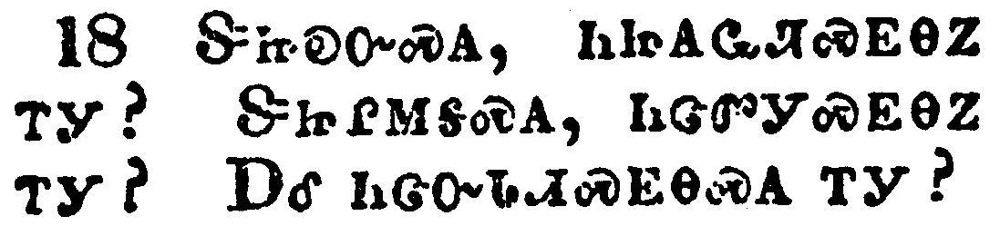</a></td>
</tr>
<tr class="even">
<td>Having eyes, see ye not? and having ears, hear ye not? and do ye not remember?</td>
</tr>
<tr class="odd">
<td>ᏕᏥᎧᏅᏍᎪ, ᏂᏥᎪᏩᏘᏍᎬᎾᏃ ᎢᎩ? ᏕᏥᎵᎷᎦᏍᎪ, ᏂᏣᏛᎩᏍᎬᎾᏃ ᎢᎩ? ᎠᎴ ᏂᏣᏅᏓᏗᏍᎬᎾᏍᎪ ᎢᎩ?</td>
</tr>
<tr class="even">
<td>De-tsi-ka-nv-s-go, ni-tsi-go-wa-ti-s-gv-na-no i-gi? De-tsi-li-lu-ga-s-go, ni-tsa-dv-gi-s-gv-na-no i-gi? A-le ni-tsa-nv-da-di-s-gv-na-s-go i-gi?</td>
</tr>
</tbody>
</table>

<table>
<tbody>
<tr class="odd">
<td><a href="020819.png">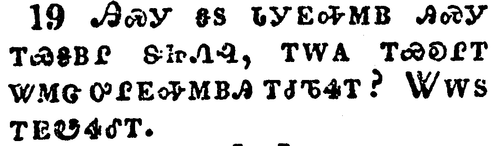</a></td>
</tr>
<tr class="even">
<td>When I brake the five loaves among five thousand, how many baskets full of fragments took ye up? They say unto him, Twelve.</td>
</tr>
<tr class="odd">
<td>ᎯᏍᎩ ᎦᏚ ᏓᎩᎬᎭᎷᏴ ᎯᏍᎩ ᎢᏯᎦᏴᎵ ᏕᏥᏁᎸ, ᎢᎳᎪ ᎢᏯᎧᎵᎢ ᏔᎷᏣ ᎤᎵᎬᎭᎷᏴᎯ ᎢᏧᏖᏎᎢ? ᏔᎳᏚ ᎢᎬᏬᏎᎴᎢ.</td>
</tr>
<tr class="even">
<td>Hi-s-gi ga-du da-gi-gv-ha-lu-yv hi-s-gi i-ya-ga-yv-li de-tsi-ne-lv, i-la-go i-ya-ka-li-i ta-lu-tsa u-li-gv-ha-lu-yv-hi i-tsu-te-se-i? Ta-la-du i-gv-wo-se-le-i.</td>
</tr>
</tbody>
</table>

<table>
<tbody>
<tr class="odd">
<td></td>
</tr>
<tr class="even">
<td>And when the seven among four thousand, how many baskets full of fragments took ye up? And they said, Seven.</td>
</tr>
<tr class="odd">
<td>ᎦᎵᏉᎩᏃ [ᎦᏚ] ᏅᎩ ᎢᏯᎦᏴᎵ ᏕᏥᏁᎸ, ᎢᎳᎪ ᎢᏯᎧᎵᎢ ᏔᎷᏣ ᎤᎵᎬᎭᎷᏴᎯ ᎢᏧᏖᏎᎢ? ᎦᎵᏉᎩ ᎤᎾᏛᏁᎢ.</td>
</tr>
<tr class="even">
<td>Ga-li-quo-gi-no [ga-du] nv-gi i-ya-ga-yv-li de-tsi-ne-lv, i-la-go i-ya-ka-li-i ta-lu-tsa u-li-gv-ha-lu-yv-hi i-tsu-te-se-i? Ga-li-quo-gi u-na-dv-ne-i.</td>
</tr>
</tbody>
</table>

<table>
<tbody>
<tr class="odd">
<td></td>
</tr>
<tr class="even">
<td>And he said unto them, How is it that ye do not understand?</td>
</tr>
<tr class="odd">
<td>ᎯᎠᏃ ᏂᏚᏪᏎᎴᎢ, ᎦᏙ ᎦᎵᏍᏙᏗᎭ ᏂᏦᎵᎬᎾ ᏥᎩ?</td>
</tr>
<tr class="even">
<td>Hi-a-no ni-du-we-se-le-i, Ga-do ga-li-s-do-di-ha ni-tso-li-gv-na tsi-gi?</td>
</tr>
</tbody>
</table>

<table>
<tbody>
<tr class="odd">
<td><a href="020822.png">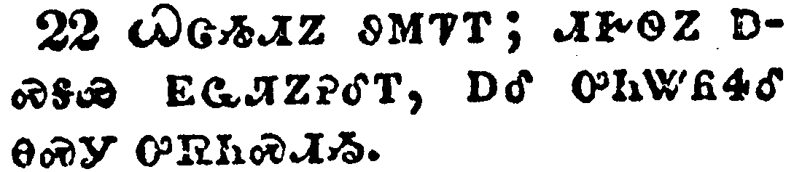</a></td>
</tr>
<tr class="even">
<td>And he cometh to Bethsaida; and they bring a blind man unto him, and besought him to touch him.</td>
</tr>
<tr class="odd">
<td>ᏇᏣᏱᏗᏃ ᏭᎷᏤᎢ; ᏗᎨᏫᏃ ᎠᏍᎦᏯ ᎬᏩᏘᏃᎮᎴᎢ, ᎠᎴ ᎤᏂᏔᏲᏎᎴ ᎾᏍᎩ ᎤᏒᏂᏍᏗᏱ.</td>
</tr>
<tr class="even">
<td>Que-tsa-yi-di-no wu-lu-tse-i; di-ge-wi-no a-s-ga-ya gv-wa-ti-no-he-le-i, a-le u-ni-ta-yo-se-le na-s-gi u-sv-ni-s-di-yi.</td>
</tr>
</tbody>
</table>

<table>
<tbody>
<tr class="odd">
<td></td>
</tr>
<tr class="even">
<td>And he took the blind man by the hand, and led him out of the town; and when he had spit on his eyes, and put his hands upon him, he asked him if he saw ought.</td>
</tr>
<tr class="odd">
<td>ᏗᎨᏫᏃ ᎤᏬᏯᏁᏒ, ᎦᏚᎲ ᎤᏄᎪᏫᏎᎢ; ᏗᎦᏙᎵᏃ ᏚᎵᏥᏍᏋ, ᎠᎴ ᏚᏏᏔᏛ, ᎪᎱᏍᏗᏍᎪ ᎯᎪᏩᏛᏗᎭ? ᎤᏬᏎᎴᎢ.</td>
</tr>
<tr class="even">
<td>Di-ge-wi-no u-wo-ya-ne-sv, ga-du-hv u-nu-go-wi-se-i; di-ga-do-li-no du-li-tsi-s-quv, a-le du-si-ta-dv, go-hu-s-di-s-go hi-go-wa-dv-di-ha? U-wo-se-le-i.</td>
</tr>
</tbody>
</table>

<table>
<tbody>
<tr class="odd">
<td><a href="020824.png">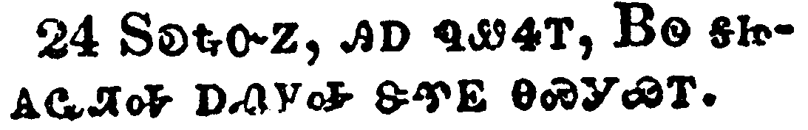</a></td>
</tr>
<tr class="even">
<td>And he looked up, and said, I see men as trees, walking.</td>
</tr>
<tr class="odd">
<td>ᏚᎧᎿᎭᏅᏃ, ᎯᎠ ᏄᏪᏎᎢ, ᏴᏫ ᎦᏥᎪᏩᏘᎭ ᎠᏁᎩᎭ ᏕᏡᎬ ᎾᏍᎩᏯᎢ.</td>
</tr>
<tr class="even">
<td>Du-ka-hna-nv-no, hi-a nu-we-se-i, Yv-wi ga-tsi-go-wa-ti-ha a-ne-gi-ha de-tlu-gv na-s-gi-ya-i.</td>
</tr>
</tbody>
</table>

<table>
<tbody>
<tr class="odd">
<td></td>
</tr>
<tr class="even">
<td>After that he put his hands again upon his eyes, and made him look up: and he was restored, and saw every man clearly.</td>
</tr>
<tr class="odd">
<td>ᎿᎭᏉᏃ ᏔᎵᏁ ᏗᎦᏙᎵ ᏚᏏᏔᏕᎢ, ᎠᎴ ᏧᎧᏃᏗᏱ ᏄᏩᏁᎴᎢ; ᎠᎴ ᎤᏗᏩᏎᎢ, ᎠᎴ ᎾᏂᎥ ᎣᏏᏳ ᏓᎪᏩᏗᏍᎨᎢ.</td>
</tr>
<tr class="even">
<td>Hna-quo-no ta-li-ne di-ga-do-li du-si-ta-de-i, a-le tsu-ka-no-di-yi nu-wa-ne-le-i; a-le u-di-wa-se-i, a-le na-ni-v o-si-yu da-go-wa-di-s-ge-i.</td>
</tr>
</tbody>
</table>

<table>
<tbody>
<tr class="odd">
<td><a href="020826.png">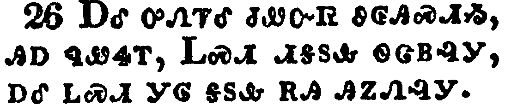</a></td>
</tr>
<tr class="even">
<td>And he sent him away to his house, saying, Neither go into the town, nor tell it to any in the town.</td>
</tr>
<tr class="odd">
<td>ᎠᎴ ᎤᏁᏤᎴ ᏧᏪᏅᏒ ᏭᎶᎯᏍᏗᏱ, ᎯᎠ ᏄᏪᏎᎢ, ᏞᏍᏗ ᏗᎦᏚᎲ ᏫᏣᏴᎸᎩ, ᎠᎴ ᏞᏍᏗ ᎩᎶ ᎦᏚᎲ ᎡᎯ ᎯᏃᏁᎸᎩ.</td>
</tr>
<tr class="even">
<td>A-le u-ne-tse-le tsu-we-nv-sv wu-lo-hi-s-di-yi, hi-a nu-we-se-i, Tle-s-di di-ga-du-hv wi-tsa-yv-lv-gi, a-le tle-s-di gi-lo ga-du-hv e-hi hi-no-ne-lv-gi.</td>
</tr>
</tbody>
</table>

<table>
<tbody>
<tr class="odd">
<td></td>
</tr>
<tr class="even">
<td>And Jesus went out, and his disciples, into the towns of Caesarea Philippi: and by the way he asked his disciples, saying unto them, Whom do men say that I am?</td>
</tr>
<tr class="odd">
<td>ᏥᏌᏃ ᎤᏄᎪᏤ ᎠᎴ ᎾᏍᎩ ᎬᏩᏍᏓᏩᏗᏙᎯ, ᏏᏌᎵᏱ ᏈᎵᎩ ᏕᎦᏚᎲ ᏭᏂᎶᏎᎢ; ᏩᎾᎢᏒᏃ ᏚᏛᏛᏁ ᎬᏩᏍᏓᏩᏗᏙᎯ, ᎯᎠ ᏂᏚᏪᏎᎴᎢ, ᎦᎪ ᎬᏉᏎᎰ ᏴᏫ?</td>
</tr>
<tr class="even">
<td>Tsi-sa-no u-nu-go-tse a-le na-s-gi gv-wa-s-da-wa-di-do-hi, Si-sa-li-yi Qui-li-gi de-ga-du-hv wu-ni-lo-se-i; wa-na-i-sv-no du-dv-dv-ne gv-wa-s-da-wa-di-do-hi, hi-a ni-du-we-se-le-i, Ga-go gv-quo-se-ho yv-wi?</td>
</tr>
</tbody>
</table>

<table>
<tbody>
<tr class="odd">
<td></td>
</tr>
<tr class="even">
<td>And they answered, John the Baptist: but some say, Elias; and others, One of the prophets.</td>
</tr>
<tr class="odd">
<td>ᎯᎠᏃ ᏄᏂᏪᏎᎢ, ᏣᏂ ᏗᏓᏬᏍᎩ; ᎢᎦᏛᏍᎩᏂ ᎢᎳᏯ [ᎠᎾᏗᎭ;] ᎢᎦᏛᏃ, ᎩᎶ ᎢᏳᏍᏗ ᎠᎾᏙᎴᎰᏍᎩ.</td>
</tr>
<tr class="even">
<td>Hi-a-no nu-ni-we-se-i, Tsa-ni Di-da-wo-s-gi; i-ga-dv-s-gi-ni I-la-ya [a-na-di-ha;] i-ga-dv-no, Gi-lo i-yu-s-di a-na-do-le-ho-s-gi.</td>
</tr>
</tbody>
</table>

<table>
<tbody>
<tr class="odd">
<td></td>
</tr>
<tr class="even">
<td>And he saith unto them, But whom say ye that I am? And Peter answereth and saith unto him, Thou art the Christ.</td>
</tr>
<tr class="odd">
<td>ᎯᎠᏃ ᏂᏚᏪᏎᎴᎢ, ᏂᎯᎾᏃ ᎦᎪ ᏍᎩᏲᏎᎭ? ᏈᏓᏃ ᎤᏁᏨ ᎯᎠ ᏄᏪᏎᎴᎢ, ᎦᎶᏁᏛ ᏂᎯ.</td>
</tr>
<tr class="even">
<td>Hi-a-no ni-du-we-se-le-i, Ni-hi-na-no ga-go s-gi-yo-se-ha? Qui-da-no u-ne-tsv hi-a nu-we-se-le-i, Ga-lo-ne-dv ni-hi.</td>
</tr>
</tbody>
</table>

<table>
<tbody>
<tr class="odd">
<td></td>
</tr>
<tr class="even">
<td>And he charged them that they should tell no man of him.</td>
</tr>
<tr class="odd">
<td>ᏚᏁᏤᎴᏃ ᎾᏍᎩ ᎩᎶ ᎤᏂᏃᏁᏗᏱ ᏂᎨᏒᎾ.</td>
</tr>
<tr class="even">
<td>Du-ne-tse-le-no na-s-gi gi-lo u-ni-no-ne-di-yi ni-ge-sv-na.</td>
</tr>
</tbody>
</table>

<table>
<tbody>
<tr class="odd">
<td><a href="020831.png">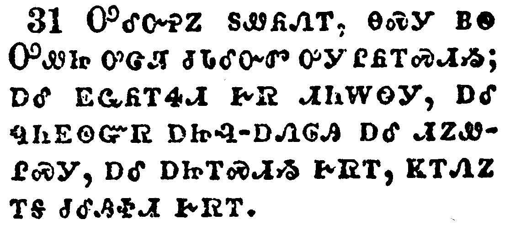</a></td>
</tr>
<tr class="even">
<td>And he began to teach them, that the Son of man must suffer many things, and be rejected of the elders, and of the chief priests, and scribes, and be killed, and after three days rise again.</td>
</tr>
<tr class="odd">
<td>ᎤᎴᏅᎮᏃ ᏚᏪᏲᏁᎢ, ᎾᏍᎩ ᏴᏫ ᎤᏪᏥ ᎤᏣᏘ ᏧᏓᎴᏅᏛ ᎤᎩ ᎵᏲᎢᏍᏗᏱ; ᎠᎴ ᎬᏩᏲᎢᏎᏗ ᎨᏒ ᏗᏂᎳᏫᎩ, ᎠᎴ ᏄᏂᎬᏫᏳᏒ ᎠᏥᎸ-ᎠᏁᎶᎯ ᎠᎴ ᏗᏃᏪᎵᏍᎩ, ᎠᎴ ᎠᏥᎢᏍᏗᏱ ᎨᏒᎢ, ᏦᎢᏁᏃ ᎢᎦ ᏧᎴᎯᏐᏗ ᎨᏒᎢ.</td>
</tr>
<tr class="even">
<td>U-le-nv-he-no du-we-yo-ne-i, na-s-gi yv-wi U-we-tsi u-tsa-ti tsu-da-le-nv-dv u-gi li-yo-i-s-di-yi; a-le gv-wa-yo-i-se-di ge-sv di-ni-la-wi-gi, a-le nu-ni-gv-wi-yu-sv a-tsi-lv--a-ne-lo-hi a-le di-no-we-li-s-gi, a-le a-tsi-i-s-di-yi ge-sv-i, tso-i-ne-no i-ga tsu-le-hi-so-di ge-sv-i.</td>
</tr>
</tbody>
</table>

<table>
<tbody>
<tr class="odd">
<td><a href="020832.png">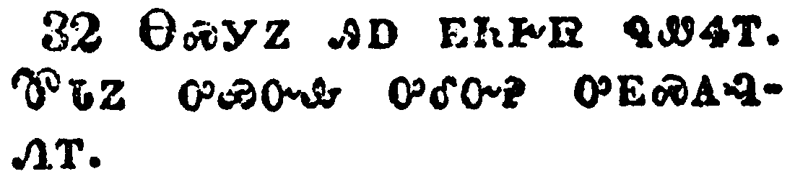</a></td>
</tr>
<tr class="even">
<td>And he spake that saying openly. And Peter took him, and began to rebuke him.</td>
</tr>
<tr class="odd">
<td>ᎾᏍᎩᏃ ᎯᎠ ᎬᏂᎨᏒ ᏄᏪᏎᎢ. ᏈᏓᏃ ᎤᏯᏅᎲ ᎤᎴᏅᎮ ᎤᎬᏍᎪᎸᏁᎢ.</td>
</tr>
<tr class="even">
<td>Na-s-gi-no hi-a gv-ni-ge-sv nu-we-se-i. Qui-da-no u-ya-nv-hv u-le-nv-he u-gv-s-go-lv-ne-i.</td>
</tr>
</tbody>
</table>

<table>
<tbody>
<tr class="odd">
<td></td>
</tr>
<tr class="even">
<td>But when he had turned about and looked on his disciples, he rebuked Peter, saying, Get thee behind me, Satan: for thou savourest not the things that be of God, but the things that be of men.</td>
</tr>
<tr class="odd">
<td>ᎠᏎᏃ ᎤᎦᏔᎲᏒ, ᎠᎴ ᎬᏩᏍᏓᏩᏗᏙᎯ ᏚᎧᎿᎭᏅ, ᏈᏓ ᎤᎬᏍᎪᎸᏁᎢ, ᎯᎠ ᏄᏪᏎᎢ, ᎠᏆᏐᎭᏛ ᎭᎴᎲᎦ ᏎᏓᏂ; ᎥᏝᏰᏃ ᎤᏁᎳᏅᎯ ᎤᏤᎵ ᎨᏒ ᎣᏏᏳ ᏱᏣᏰᎸᎭ, ᏴᏫᏍᎩᏂ ᎤᎾᏤᎵ ᎨᏒᎢ.</td>
</tr>
<tr class="even">
<td>A-se-no u-ga-ta-hv-sv, a-le gv-wa-s-da-wa-di-do-hi du-ka-hna-nv, Qui-da u-gv-s-go-lv-ne-i, hi-a nu-we-se-i, A-qua-so-ha-dv ha-le-hv-ga Se-da-ni; v-tla-ye-no U-ne-la-nv-hi u-tse-li ge-sv o-si-yu yi-tsa-ye-lv-ha, yv-wi-s-gi-ni u-na-tse-li ge-sv-i.</td>
</tr>
</tbody>
</table>

<table>
<tbody>
<tr class="odd">
<td></td>
</tr>
<tr class="even">
<td>And when he had called the people unto him with his disciples also, he said unto them, Whosoever will come after me, let him deny himself, and take up his cross, and follow me.</td>
</tr>
<tr class="odd">
<td>ᏫᏚᏯᏅᎲᏃ ᏴᏫ, ᎠᎴ ᎾᏍᏉ ᎬᏩᏍᏓᏩᏗᏙᎯ, ᎯᎠ ᏂᏚᏪᏎᎴᎢ, ᎩᎶ ᎤᏚᎵᏍᎨᏍᏗ ᎠᎩᏍᏓᏩᏛᏍᏗᏱ, ᎤᏩᏒ ᎠᏓᏓᏱᎮᏍᏗ, ᎠᎴ ᎤᏩᏒ ᎤᏤᎵ ᏧᏓᎾᏩᏛ ᎠᏱᏍᎨᏍᏗ, ᎠᎴ ᎠᎩᏍᏓᏩᏕᎨᏍᏗ.</td>
</tr>
<tr class="even">
<td>Wi-du-ya-nv-hv-no yv-wi, a-le na-s-quo gv-wa-s-da-wa-di-do-hi, hi-a ni-du-we-se-le-i, Gi-lo u-du-li-s-ge-s-di a-gi-s-da-wa-dv-s-di-yi, u-wa-sv a-da-da-yi-he-s-di, a-le u-wa-sv u-tse-li tsu-da-na-wa-dv a-yi-s-ge-s-di, a-le a-gi-s-da-wa-de-ge-s-di.</td>
</tr>
</tbody>
</table>

<table>
<tbody>
<tr class="odd">
<td></td>
</tr>
<tr class="even">
<td>For whosoever will save his life shall lose it; but whosoever shall lose his life for my sake and the gospel's, the same shall save it.</td>
</tr>
<tr class="odd">
<td>ᎩᎶᏰᏃ ᎤᏚᎵᏍᎨᏍᏗ ᎬᏅ ᎤᏍᏕᎸᏗᏱ, ᎾᏍᎩ ᎤᏲᎱᏎᎮᏍᏗ; ᎩᎶᏍᎩᏂ ᎬᏅ ᎤᏲᎱᏎᎮᏍᏗ ᎠᏴ ᎠᎴ ᎣᏍᏛ ᎧᏃᎮᏛ ᏅᏗᎦᎵᏍᏙᏗᏍᎨᏍᏗ, ᎾᏍᎩ ᎠᏥᏍᏕᎸᏗ ᎨᏎᏍᏗ.</td>
</tr>
<tr class="even">
<td>Gi-lo-ye-no u-du-li-s-ge-s-di gv-nv u-s-de-lv-di-yi, na-s-gi u-yo-hu-se-he-s-di; gi-lo-s-gi-ni gv-nv u-yo-hu-se-he-s-di a-yv a-le o-s-dv ka-no-he-dv nv-di-ga-li-s-do-di-s-ge-s-di, na-s-gi a-tsi-s-de-lv-di ge-se-s-di.</td>
</tr>
</tbody>
</table>

<table>
<tbody>
<tr class="odd">
<td><a href="020836.png">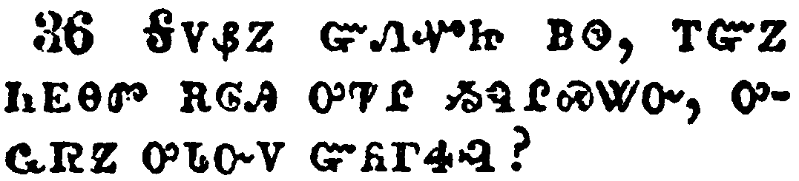</a></td>
</tr>
<tr class="even">
<td>For what shall it profit a man, if he shall gain the whole world, and lose his own soul?</td>
</tr>
<tr class="odd">
<td>ᎦᏙᏰᏃ ᏳᏁᏉᏥ ᏴᏫ, ᎢᏳᏃ ᏂᎬᎾᏛ ᎡᎶᎯ ᎤᏤᎵ ᏱᏄᎵᏍᏔᏅ, ᎤᏩᏒᏃ ᎤᏓᏅᏙ ᏳᏲᎱᏎᎸ?</td>
</tr>
<tr class="even">
<td>Ga-do-ye-no yu-ne-quo-tsi yv-wi, i-yu-no ni-gv-na-dv e-lo-hi u-tse-li yi-nu-li-s-ta-nv, u-wa-sv-no u-da-nv-do yu-yo-hu-se-lv?</td>
</tr>
</tbody>
</table>

<table>
<tbody>
<tr class="odd">
<td></td>
</tr>
<tr class="even">
<td>Or what shall a man give in exchange for his soul?</td>
</tr>
<tr class="odd">
<td>ᎠᎴ ᎦᏙ ᏯᎲᎦ ᏴᏫ ᏱᎦᏁᏟᏴᏍᏓ ᎤᏓᏅᏙ?</td>
</tr>
<tr class="even">
<td>A-le ga-do ya-hv-ga yv-wi yi-ga-ne-tli-yv-s-da u-da-nv-do?</td>
</tr>
</tbody>
</table>

<table>
<tbody>
<tr class="odd">
<td><a href="020838.png">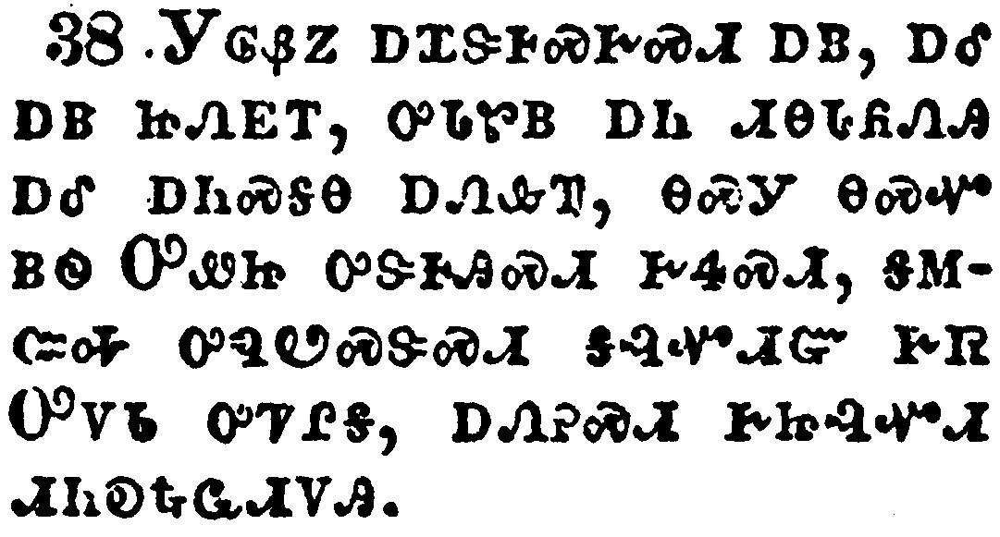</a></td>
</tr>
<tr class="even">
<td>Whosoever therefore shall be ashamed of me and of my words in this adulterous and sinful generation; of him also shall the Son of man be ashamed, when he cometh in the glory of his Father with the holy angels.</td>
</tr>
<tr class="odd">
<td>ᎩᎶᏰᏃ ᎠᏆᏕᎰᏍᎨᏍᏗ ᎠᏴ, ᎠᎴ ᎠᏴ ᏥᏁᎬᎢ, ᎤᏓᏑᏴ ᎠᏂ ᏗᎾᏓᏲᏁᎯ ᎠᎴ ᎠᏂᏍᎦᎾ ᎠᏁᎲᎢ, ᎾᏍᎩ ᎾᏍᏉ ᏴᏫ ᎤᏪᏥ ᎤᏕᎰᎯᏍᏗ ᎨᏎᏍᏗ, ᎦᎷᏨᎭ ᎤᏄᏬᏍᏕᏍᏗ ᎦᎸᏉᏗᏳ ᎨᏒ ᎤᏙᏓ ᎤᏤᎵᎦ, ᎠᏁᎮᏍᏗ ᎨᏥᎸᏉᏗ ᏗᏂᎧᎿᎭᏩᏗᏙᎯ.</td>
</tr>
<tr class="even">
<td>Gi-lo-ye-no a-qua-de-ho-s-ge-s-di a-yv, a-le a-yv tsi-ne-gv-i, u-da-su-yv a-ni di-na-da-yo-ne-hi a-le a-ni-s-ga-na a-ne-hv-i, na-s-gi na-s-quo yv-wi U-we-tsi u-de-ho-hi-s-di ge-se-s-di, ga-lu-tsv-ha u-nu-wo-s-de-s-di ga-lv-quo-di-yu ge-sv U-do-da u-tse-li-ga, a-ne-he-s-di ge-tsi-lv-quo-di di-ni-ka-hna-wa-di-do-hi.</td>
</tr>
</tbody>
</table>

