+++
draft=false
date = 2014-12-18T21:11:07Z
title = "Mark - Chapter 14 - Cherokee New Testament"
weight = 1418955067

[taxonomies]

authors = ["Timothy Legg"]
categories = []
tags = []

[extra]
+++

<table>
<tbody>
<tr class="odd">
<td><a href="021401.png">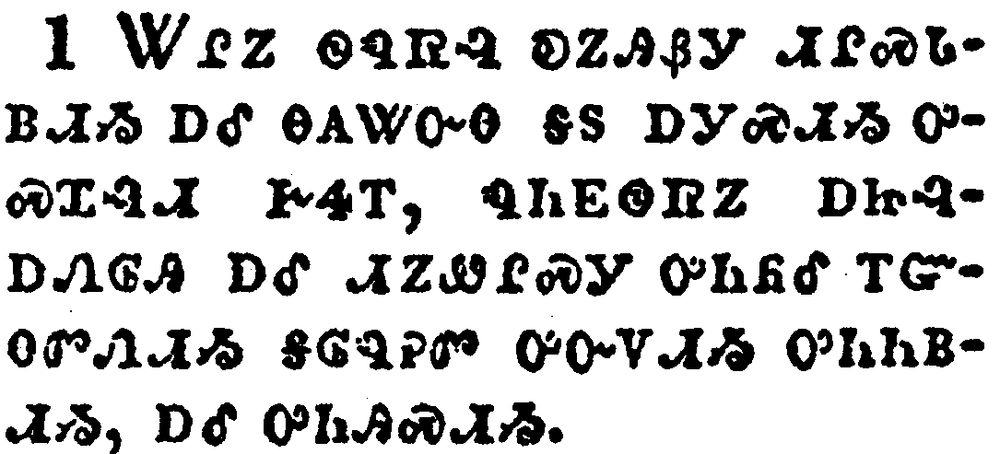</a></td>
</tr>
<tr class="even">
<td>After two days was the feast of the passover, and of unleavened bread: and the chief priests and the scribes sought how they might take him by craft, and put him to death.</td>
</tr>
<tr class="odd">
<td>ᏔᎵᏃ ᏫᏄᏒᎸ ᎧᏃᎯᏴᎩ ᏗᎵᏍᏓᏴᏗᏱ ᎠᎴ ᎾᎪᏔᏅᎾ ᎦᏚ ᎠᎩᏍᏗᏱ ᎤᏍᏆᎸᏗ ᎨᏎᎢ, ᏄᏂᎬᏫᏒᏃ ᎠᏥᎸᎠᏁᎶᎯ ᎠᎴ ᏗᏃᏪᎵᏍᎩ ᎤᏂᏲᎴ ᎢᏳᎾᏛᏁᏗᏱ ᎦᎶᏄᎮᏛ ᎤᏅᏙᏗᏱ ᎤᏂᏂᏴᏗᏱ, ᎠᎴ ᎤᏂᎯᏍᏗᏱ.</td>
</tr>
<tr class="even">
<td>Ta-li-no wi-nu-sv-lv ka-no-hi-yv-gi di-li-s-da-yv-di-yi a-le na-go-ta-nv-na ga-du a-gi-s-di-yi u-s-qua-lv-di ge-se-i, nu-ni-gv-wi-sv-no a-tsi-lv-a-ne-lo-hi a-le di-no-we-li-s-gi u-ni-yo-le i-yu-na-dv-ne-di-yi ga-lo-nu-he-dv u-nv-do-di-yi u-ni-ni-yv-di-yi, a-le u-ni-hi-s-di-yi.</td>
</tr>
</tbody>
</table>

<table>
<tbody>
<tr class="odd">
<td><a href="021402.png">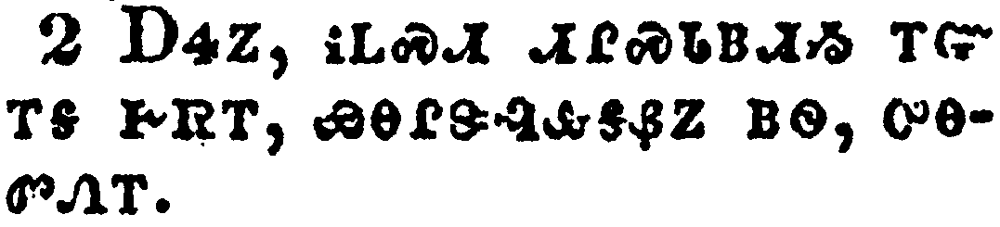</a></td>
</tr>
<tr class="even">
<td>But they said, Not on the feast day, lest there be an uproar of the people.</td>
</tr>
<tr class="odd">
<td>ᎠᏎᏃ ᎥᏞᏍᏗ ᏗᎵᏍᏓᏴᏗᏱ ᎢᏳ ᎢᎦ ᎨᏒᎢ, ᏯᎾᎵᏕᎸᎲᎦᏰᏃ ᏴᏫ, ᎤᎾᏛᏁᎢ.</td>
</tr>
<tr class="even">
<td>A-se-no v-tle-s-di di-li-s-da-yv-di-yi i-yu i-ga ge-sv-i, ya-na-li-de-lv-hv-ga-ye-no yv-wi, u-na-dv-ne-i.</td>
</tr>
</tbody>
</table>

<table>
<tbody>
<tr class="odd">
<td><a href="021403.png">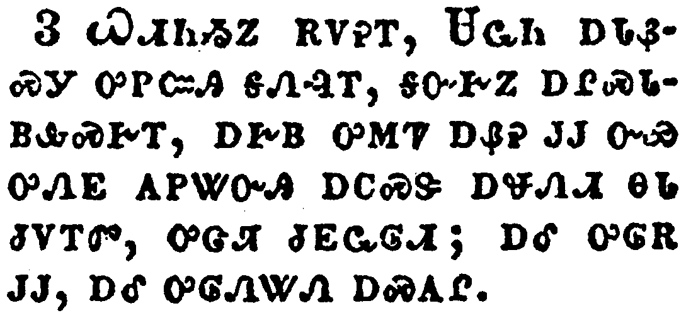</a></td>
</tr>
<tr class="even">
<td>And being in Bethany in the house of Simon the leper, as he sat at meat, there came a woman having an alabaster box of ointment of spikenard very precious; and she brake the box, and poured it on his head.</td>
</tr>
<tr class="odd">
<td>ᏇᏗᏂᏱᏃ ᎡᏙᎮᎢ, ᎠᎠᏩᏂ ᎠᏓᏰᏍᎩ ᎤᏢᏨᎯ ᎦᏁᎸᎢ, ᎦᏅᎨᏃ ᎠᎵᏍᏓᏴᎲᏍᎨᎢ, ᎠᎨᏴ ᎤᎷᏤ ᎠᏰᎮ ᎫᎫ ᏅᏯ ᎤᏁᎬ ᎪᏢᏔᏅᎯ ᎠᏟᏍᏕ ᎠᏠᏁᏗ ᎾᏓ ᏧᏙᎢᏛ, ᎤᏣᏘ ᏧᎬᏩᎶᏗ; ᎠᎴ ᎤᎶᏒ ᎫᎫ, ᎠᎴ ᎤᎶᏁᏔᏁ ᎠᏍᎪᎵ.</td>
</tr>
<tr class="even">
<td>Que-di-ni-yi-no e-do-he-i, Aa-wa-ni a-da-ye-s-gi u-tlv-tsv-hi ga-ne-lv-i, ga-nv-ge-no a-li-s-da-yv-hv-s-ge-i, a-ge-yv u-lu-tse a-ye-he gu-gu nv-ya u-ne-gv go-tlv-ta-nv-hi a-tli-s-de a-tlo-ne-di na-da tsu-do-i-dv, u-tsa-ti tsu-gv-wa-lo-di; a-le u-lo-sv gu-gu, a-le u-lo-ne-ta-ne a-s-go-li.</td>
</tr>
</tbody>
</table>

<table>
<tbody>
<tr class="odd">
<td><a href="021404.png">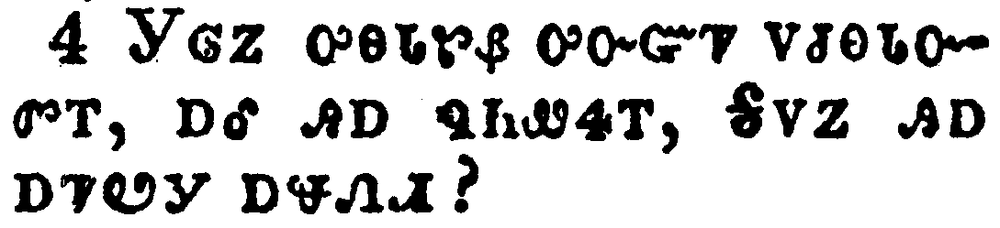</a></td>
</tr>
<tr class="even">
<td>And there were some that had indignation within themselves, and said, Why was this waste of the ointment made?</td>
</tr>
<tr class="odd">
<td>ᎩᎶᏃ ᎤᎾᏓᏑᏰ ᎤᏅᏳᏤ ᏙᏧᎾᏓᏅᏛᎢ, ᎠᎴ ᎯᎠ ᏄᏂᏪᏎᎢ, ᎦᏙᏃ ᎯᎠ ᎠᏤᏬᎩ ᎠᏠᏁᏗ?</td>
</tr>
<tr class="even">
<td>Gi-lo-no u-na-da-su-ye u-nv-yu-tse do-tsu-na-da-nv-dv-i, a-le hi-a nu-ni-we-se-i, Ga-do-no hi-a a-tse-wo-gi a-tlo-ne-di?</td>
</tr>
</tbody>
</table>

<table>
<tbody>
<tr class="odd">
<td><a href="021405.png">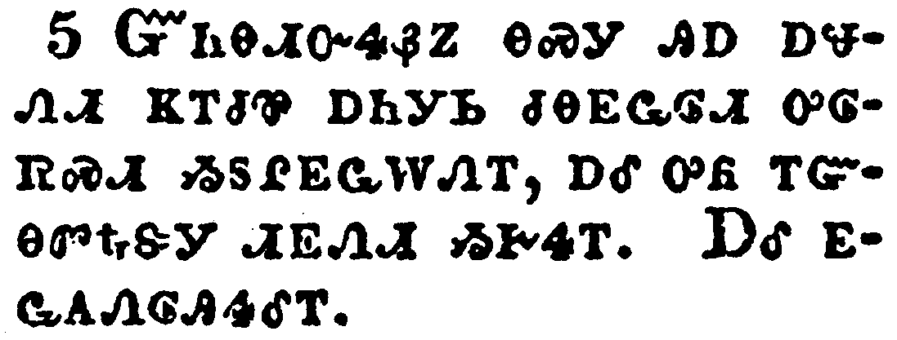</a></td>
</tr>
<tr class="even">
<td>For it might have been sold for more than three hundred pence, and have been given to the poor. And they murmured against her.</td>
</tr>
<tr class="odd">
<td>ᏳᏂᎾᏗᏅᏎᏰᏃ ᎾᏍᎩ ᎯᎠ ᎠᏠᏁᏗ ᏦᎢᏧᏈ ᎠᏂᎩᏏ ᏧᎾᎬᏩᎶᏗ ᎤᎶᏒᏍᏗ ᏱᏚᎵᎬᏩᎳᏁᎢ, ᎠᎴ ᎤᏲ ᎢᏳᎾᏛᎿᎭᏕᎩ ᏗᎬᏁᏗ ᏱᎨᏎᎢ. ᎠᎴ ᎬᏩᎪᏁᎶᎯᏎᎴᎢ.</td>
</tr>
<tr class="even">
<td>Yu-ni-na-di-nv-se-ye-no na-s-gi hi-a a-tlo-ne-di tso-i-tsu-qui a-ni-gi-si tsu-na-gv-wa-lo-di u-lo-sv-s-di yi-du-li-gv-wa-la-ne-i, a-le u-yo i-yu-na-dv-hna-de-gi di-gv-ne-di yi-ge-se-i. A-le gv-wa-go-ne-lo-hi-se-le-i.</td>
</tr>
</tbody>
</table>

<table>
<tbody>
<tr class="odd">
<td><a href="021406.png">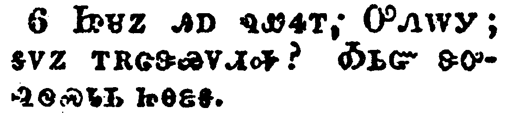</a></td>
</tr>
<tr class="even">
<td>And Jesus said, Let her alone; why trouble ye her? she hath wrought a good work on me.</td>
</tr>
<tr class="odd">
<td>ᏥᏌᏃ ᎯᎠ ᏄᏪᏎᎢ, ᎤᏁᎳᎩ; ᎦᏙᏃ ᎢᎡᏣᏕᏯᏙᏗᎭ? ᎣᏏᏳ ᏕᎤᎸᏫᏍᏓᏏ ᏥᎾᏋᎦ.</td>
</tr>
<tr class="even">
<td>Tsi-sa-no hi-a nu-we-se-i, U-ne-la-gi; ga-do-no i-e-tsa-de-ya-do-di-ha? O-si-yu de-u-lv-wi-s-da-si tsi-na-quv-ga.</td>
</tr>
</tbody>
</table>

<table>
<tbody>
<tr class="odd">
<td><a href="021407.png">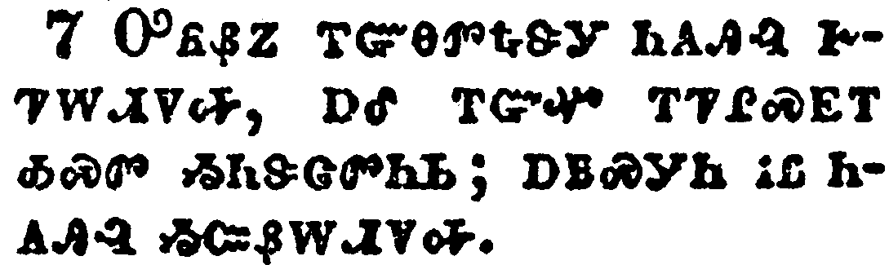</a></td>
</tr>
<tr class="even">
<td>For ye have the poor with you always, and whensoever ye will ye may do them good: but me ye have not always.</td>
</tr>
<tr class="odd">
<td>ᎤᏲᏰᏃ ᎢᏳᎾᏛᎿᎭᏕᎩ ᏂᎪᎯᎸ ᎨᏤᎳᏗᏙᎭ, ᎠᎴ ᎢᏳᏉ ᎢᏤᎵᏍᎬᎢ ᎣᏍᏛ ᏱᏂᏕᏣᏛᏂᏏ; ᎠᏴᏍᎩᏂ ᎥᏝ ᏂᎪᎯᎸ ᏱᏨᏰᎳᏗᏙᎭ.</td>
</tr>
<tr class="even">
<td>U-yo-ye-no i-yu-na-dv-hna-de-gi ni-go-hi-lv ge-tse-la-di-do-ha, a-le i-yu-quo i-tse-li-s-gv-i o-s-dv yi-ni-de-tsa-dv-ni-si; a-yv-s-gi-ni v-tla ni-go-hi-lv yi-tsv-ye-la-di-do-ha.</td>
</tr>
</tbody>
</table>

<table>
<tbody>
<tr class="odd">
<td><a href="021408.png">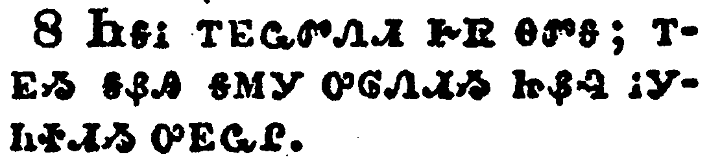</a></td>
</tr>
<tr class="even">
<td>She hath done what she could: she is come aforehand to anoint my body to the burying.</td>
</tr>
<tr class="odd">
<td>ᏂᎦᎥ ᎢᎬᏩᏛᏁᏗ ᎨᏒ ᎾᏛᎦ; ᎢᎬᏱ ᎦᏰᎯ ᎦᎷᎩ ᎤᎶᏁᏗᏱ ᏥᏰᎴ ᎥᎩᏂᏐᏗᏱ ᎤᎬᏩᎵ.</td>
</tr>
<tr class="even">
<td>Ni-ga-v i-gv-wa-dv-ne-di ge-sv na-dv-ga; i-gv-yi ga-ye-hi ga-lu-gi u-lo-ne-di-yi tsi-ye-le v-gi-ni-so-di-yi u-gv-wa-li.</td>
</tr>
</tbody>
</table>

<table>
<tbody>
<tr class="odd">
<td></td>
</tr>
<tr class="even">
<td>Verily I say unto you, Wheresoever this gospel shall be preached throughout the whole world, this also that she hath done shall be spoken of for a memorial of her.</td>
</tr>
<tr class="odd">
<td>ᎤᏙᎯᏳᎯᏯ ᎯᎠ ᏂᏨᏪᏎᎭ, ᎢᎸᎯᏢ ᎯᎠ ᎾᏍᎩ ᎣᏍᏛ ᎧᏃᎮᏛ ᎠᎵᏥᏙᏗ ᏂᎦᎵᏍᏗᏍᎨᏍᏗ ᎡᎶᎯ ᏂᎬᎾᏛᎢ, ᎯᎠ ᎾᏍᎩ ᏥᎾᏛᎦ ᎾᏍᏉ ᎤᏂᏃᎮᏗ ᎨᏎᏍᏗ ᎾᏍᎩ ᎠᎦᏅᏓᏗᏍᏙᏗ.</td>
</tr>
<tr class="even">
<td>U-do-hi-yu-hi-ya hi-a ni-tsv-we-se-ha, I-lv-hi-tlv hi-a na-s-gi o-s-dv ka-no-he-dv a-li-tsi-do-di ni-ga-li-s-di-s-ge-s-di e-lo-hi ni-gv-na-dv-i, hi-a na-s-gi tsi-na-dv-ga na-s-quo u-ni-no-he-di ge-se-s-di na-s-gi a-ga-nv-da-di-s-do-di.</td>
</tr>
</tbody>
</table>

<table>
<tbody>
<tr class="odd">
<td><a href="021410.png">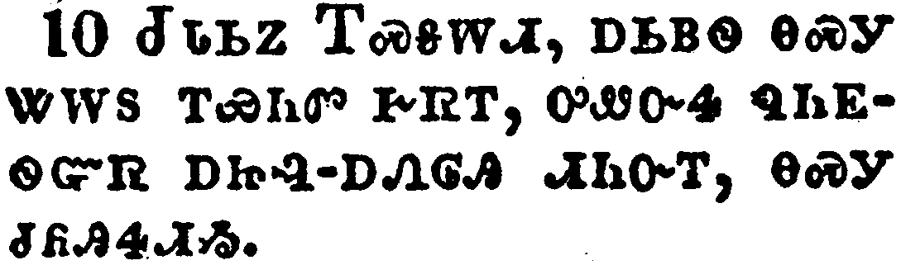</a></td>
</tr>
<tr class="even">
<td>And Judas Iscariot, one of the twelve, went unto the chief priests, to betray him unto them.</td>
</tr>
<tr class="odd">
<td>ᏧᏓᏏᏃ ᎢᏯᎦᎳᏗ, ᎠᏏᏴᏫ ᎾᏍᎩ ᏔᎳᏚ ᎢᏯᏂᏛ ᎨᏒᎢ, ᎤᏪᏅᏎ ᏄᏂᎬᏫᏳᏒ ᎠᏥᎸ-ᎠᏁᎶᎯ ᏗᏂᏅᎢ, ᎾᏍᎩ ᏧᏲᎯᏎᏗᏱ.</td>
</tr>
<tr class="even">
<td>Tsu-da-si-no I-ya-ga-la-di, a-si-yv-wi na-s-gi ta-la-du i-ya-ni-dv ge-sv-i, u-we-nv-se nu-ni-gv-wi-yu-sv a-tsi-lv--a-ne-lo-hi di-ni-nv-i, na-s-gi tsu-yo-hi-se-di-yi.</td>
</tr>
</tbody>
</table>

<table>
<tbody>
<tr class="odd">
<td><a href="021411.png">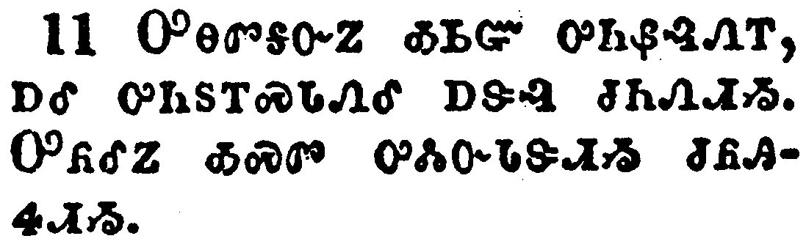</a></td>
</tr>
<tr class="even">
<td>And when they heard it, they were glad, and promised to give him money. And he sought how he might conveniently betray him.</td>
</tr>
<tr class="odd">
<td>ᎤᎾᏛᎦᏅᏃ ᎣᏏᏳ ᎤᏂᏰᎸᏁᎢ, ᎠᎴ ᎤᏂᏚᎢᏍᏓᏁᎴ ᎠᏕᎸ ᏧᏂᏁᏗᏱ. ᎤᏲᎴᏃ ᎣᏍᏛ ᎤᏜᏓᏅᏓᏕᏗᏱ ᏧᏲᎯᏎᏗᏱ.</td>
</tr>
<tr class="even">
<td>U-na-dv-ga-nv-no o-si-yu u-ni-ye-lv-ne-i, a-le u-ni-du-i-s-da-ne-le a-de-lv tsu-ni-ne-di-yi. U-yo-le-no o-s-dv u-dla-nv-da-de-di-yi tsu-yo-hi-se-di-yi.</td>
</tr>
</tbody>
</table>

<table>
<tbody>
<tr class="odd">
<td><a href="021412.png">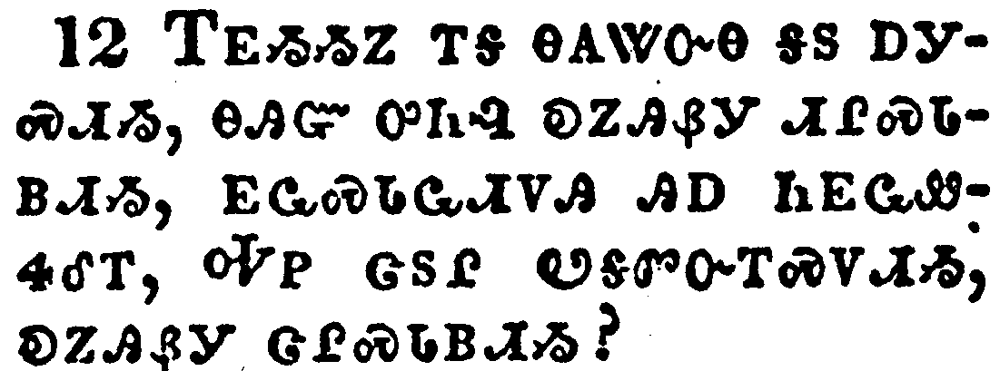</a></td>
</tr>
<tr class="even">
<td>And the first day of unleavened bread, when they killed the passover, his disciples said unto him, Where wilt thou that we go and prepare that thou mayest eat the passover?</td>
</tr>
<tr class="odd">
<td>ᎢᎬᏱᏱᏃ ᎢᎦ ᎾᎪᏔᏅᎾ ᎦᏚ ᎠᎩᏍᏗᏱ, ᎾᎯᏳ ᎤᏂᎸ ᎧᏃᎯᏰᎩ ᏗᎵᏍᏓᏴᏗᏱ, ᎬᏩᏍᏓᏩᏗᏙᎯ ᎯᎠ ᏂᎬᏩᏪᏎᎴᎢ, ᎭᏢ ᏣᏚᎵ ᏬᎦᏛᏅᎢᏍᏙᏗᏱ, ᎧᏃᎯᏰᎩ ᏣᎵᏍᏓᏴᏗᏱ?</td>
</tr>
<tr class="even">
<td>I-gv-yi-yi-no i-ga na-go-ta-nv-na ga-du a-gi-s-di-yi, na-hi-yu u-ni-lv ka-no-hi-ye-gi di-li-s-da-yv-di-yi, gv-wa-s-da-wa-di-do-hi hi-a ni-gv-wa-we-se-le-i, Ha-tlv tsa-du-li wo-ga-dv-nv-i-s-do-di-yi, ka-no-hi-ye-gi tsa-li-s-da-yv-di-yi?</td>
</tr>
</tbody>
</table>

<table>
<tbody>
<tr class="odd">
<td><a href="021413.png">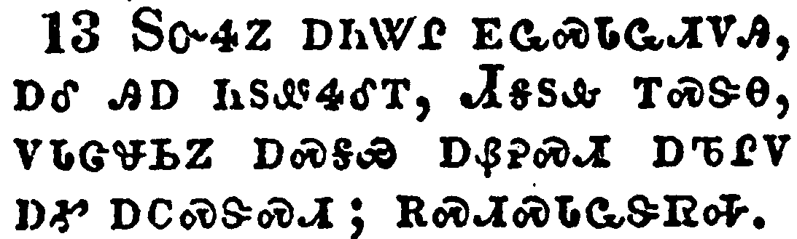</a></td>
</tr>
<tr class="even">
<td>And he sendeth forth two of his disciples, and saith unto them, Go ye into the city, and there shall meet you a man bearing a pitcher of water: follow him.</td>
</tr>
<tr class="odd">
<td>ᏚᏅᏎᏃ ᎠᏂᏔᎵ ᎬᏩᏍᏓᏩᏗᏙᎯ, ᎠᎴ ᎯᎠ ᏂᏚᏪᏎᎴᎢ, ᏗᎦᏚᎲ ᎢᏍᏕᎾ, ᏙᏓᏣᏠᏏᏃ ᎠᏍᎦᏯ ᎠᏰᎮᏍᏗ ᎠᏖᎵᏙ ᎠᎹ ᎠᏟᏍᏕᏍᏗ; ᎡᏍᏗᏍᏓᏩᏕᏒᎭ.</td>
</tr>
<tr class="even">
<td>Du-nv-se-no a-ni-ta-li gv-wa-s-da-wa-di-do-hi, a-le hi-a ni-du-we-se-le-i, Di-ga-du-hv i-s-de-na, do-da-tsa-tlo-si-no a-s-ga-ya a-ye-he-s-di a-te-li-do a-ma a-tli-s-de-s-di; e-s-di-s-da-wa-de-sv-ha.</td>
</tr>
</tbody>
</table>

<table>
<tbody>
<tr class="odd">
<td><a href="021414.png">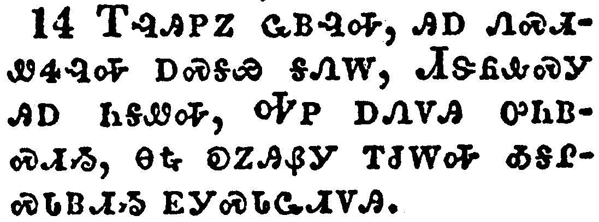</a></td>
</tr>
<tr class="even">
<td>And wheresoever he shall go in, say ye to the goodman of the house, The Master saith, Where is the guestchamber, where I shall eat the passover with my disciples?</td>
</tr>
<tr class="odd">
<td>ᎢᎸᎯᏢᏃ ᏩᏴᎸᎭ, ᎯᎠ ᏁᏍᏗᏪᏎᎸᎭ ᎠᏍᎦᏯ ᎦᏁᎳ, ᏗᏕᏲᎲᏍᎩ ᎯᎠ ᏂᎦᏪᎭ, ᎭᏢ ᎠᏁᏙᎯ ᎤᏂᏴᏍᏗᏱ, ᎾᎿᎭᎧᏃᎯᏰᎩ ᎢᏧᎳᎭ ᎣᎦᎵᏍᏓᏴᏗᏱ ᎬᎩᏍᏓᏩᏗᏙᎯ.</td>
</tr>
<tr class="even">
<td>I-lv-hi-tlv-no wa-yv-lv-ha, hi-a ne-s-di-we-se-lv-ha a-s-ga-ya ga-ne-la, Di-de-yo-hv-s-gi hi-a ni-ga-we-ha, Ha-tlv a-ne-do-hi u-ni-yv-s-di-yi, na-hna ka-no-hi-ye-gi i-tsu-la-ha o-ga-li-s-da-yv-di-yi gv-gi-s-da-wa-di-do-hi.</td>
</tr>
</tbody>
</table>

<table>
<tbody>
<tr class="odd">
<td><a href="021415.png">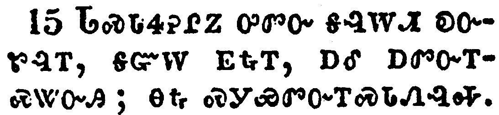</a></td>
</tr>
<tr class="even">
<td>And he will shew you a large upper room furnished and prepared: there make ready for us.</td>
</tr>
<tr class="odd">
<td>ᏓᏍᏓᏎᎮᎵᏃ ᎤᏛᏅ ᎦᎸᎳᏗ ᎧᏅᏑᎸᎢ, ᎦᏳᎳ ᎬᎿᎭᎢ, ᎠᎴ ᎠᏛᏅᎢᏍᏔᏅᎯ; ᎾᎿᎭᏍᎩᏯᏛᏅᎢᏍᏓᏁᎸᎭ.</td>
</tr>
<tr class="even">
<td>Da-s-da-se-he-li-no u-dv-nv ga-lv-la-di ka-nv-su-lv-i, ga-yu-la gv-hna-i, a-le a-dv-nv-i-s-ta-nv-hi; na-hna s-gi-ya-dv-nv-i-s-da-ne-lv-ha.</td>
</tr>
</tbody>
</table>

<table>
<tbody>
<tr class="odd">
<td><a href="021416.png">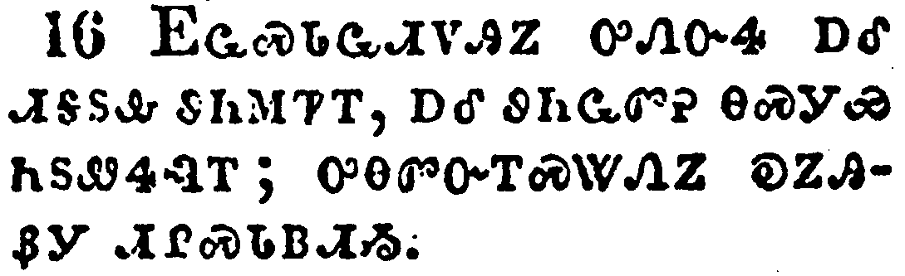</a></td>
</tr>
<tr class="even">
<td>And his disciples went forth, and came into the city, and found as he had said unto them: and they made ready the passover.</td>
</tr>
<tr class="odd">
<td>ᎬᏩᏍᏓᏩᏗᏙᎯᏃ ᎤᏁᏅᏎ ᎠᎴ ᏗᎦᏚᎲ ᏭᏂᎷᏤᎢ, ᎠᎴ ᏭᏂᏩᏛᎮ ᎾᏍᎩᏯ ᏂᏚᏪᏎᎸᎢ; ᎤᎾᏛᏅᎢᏍᏔᏁᏃ ᎧᏃᎯᏰᎩ ᏗᎵᏍᏓᏴᏗᏱ.</td>
</tr>
<tr class="even">
<td>Gv-wa-s-da-wa-di-do-hi-no u-ne-nv-se a-le di-ga-du-hv wu-ni-lu-tse-i, a-le wu-ni-wa-dv-he na-s-gi-ya ni-du-we-se-lv-i; u-na-dv-nv-i-s-ta-ne-no ka-no-hi-ye-gi di-li-s-da-yv-di-yi.</td>
</tr>
</tbody>
</table>

<table>
<tbody>
<tr class="odd">
<td><a href="021417.png">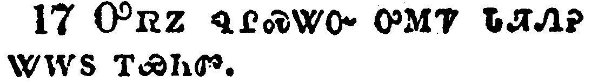</a></td>
</tr>
<tr class="even">
<td>And in the evening he cometh with the twelve.</td>
</tr>
<tr class="odd">
<td>ᎤᏒᏃ ᏄᎵᏍᏔᏅ ᎤᎷᏤ ᏓᏖᏁᎮ ᏔᎳᏚ ᎢᏯᏂᏛ.</td>
</tr>
<tr class="even">
<td>U-sv-no nu-li-s-ta-nv u-lu-tse da-te-ne-he ta-la-du i-ya-ni-dv.</td>
</tr>
</tbody>
</table>

<table>
<tbody>
<tr class="odd">
<td><a href="021418.png">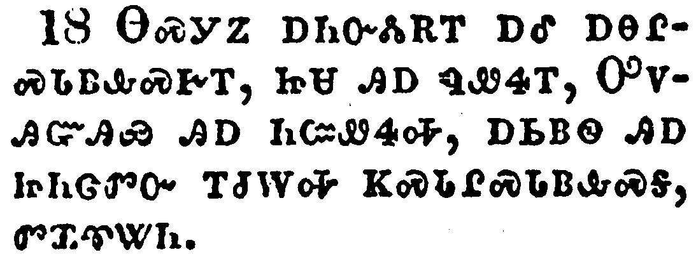</a></td>
</tr>
<tr class="even">
<td>And as they sat and did eat, Jesus said, Verily I say unto you, One of you which eateth with me shall betray me.</td>
</tr>
<tr class="odd">
<td>ᎾᏍᎩᏃ ᎠᏂᏅᏜᏓᎡᎢ ᎠᎴ ᎠᎾᎵᏍᏓᏴᎲᏍᎨᎢ, ᏥᏌ ᎯᎠ ᏄᏪᏎᎢ, ᎤᏙᎯᏳᎯᏯ ᎯᎠ ᏂᏨᏪᏎᎭ, ᎠᏏᏴᏫ ᎯᎠ ᏥᏂᏣᏛᏅ ᎢᏧᎳᎭ ᏦᏍᏓᎵᏍᏓᏴᎲᏍᎦ, ᏛᏆᏡᏔᏂ.</td>
</tr>
<tr class="even">
<td>Na-s-gi-no a-ni-nv-dla-e-i a-le a-na-li-s-da-yv-hv-s-ge-i, tsi-sa hi-a nu-we-se-i, U-do-hi-yu-hi-ya hi-a ni-tsv-we-se-ha, a-si-yv-wi hi-a tsi-ni-tsa-dv-nv i-tsu-la-ha tso-s-da-li-s-da-yv-hv-s-ga, dv-qua-tlu-ta-ni.</td>
</tr>
</tbody>
</table>

<table>
<tbody>
<tr class="odd">
<td><a href="021419.png">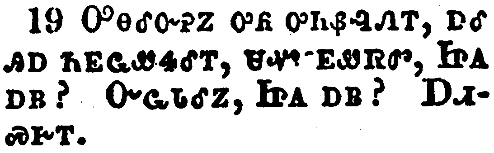</a></td>
</tr>
<tr class="even">
<td>And they began to be sorrowful, and to say unto him one by one, Is it I? and another said, Is it I?</td>
</tr>
<tr class="odd">
<td>ᎤᎾᎴᏅᎮᏃ ᎤᏲ ᎤᏂᏰᎸᏁᎢ, ᎠᎴ ᎯᎠ ᏂᎬᏩᏪᏎᎴᎢ, ᏌᏉ ᎬᏪᏒᏛ, ᏥᎪ ᎠᏴ? ᏅᏩᏓᎴᏃ, ᏥᎪ ᎠᏴ? ᎠᏗᏍᎨᎢ.</td>
</tr>
<tr class="even">
<td>U-na-le-nv-he-no u-yo u-ni-ye-lv-ne-i, a-le hi-a ni-gv-wa-we-se-le-i, sa-quo gv-we-sv-dv, Tsi-go a-yv? Nv-wa-da-le-no, Tsi-go a-yv? A-di-s-ge-i.</td>
</tr>
</tbody>
</table>

<table>
<tbody>
<tr class="odd">
<td><a href="021420.png">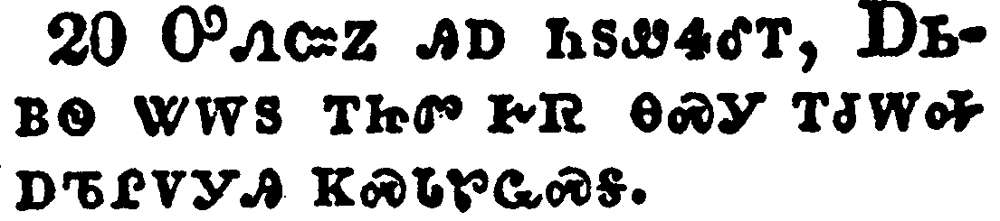</a></td>
</tr>
<tr class="even">
<td>And he answered and said unto them, It is one of the twelve, that dippeth with me in the dish.</td>
</tr>
<tr class="odd">
<td>ᎤᏁᏨᏃ ᎯᎠ ᏂᏚᏪᏎᎴᎢ, ᎠᏏᏴᏫ ᏔᎳᏚ ᎢᏥᏛ ᎨᏒ ᎾᏍᎩ ᎢᏧᎳᎭ ᎠᏖᎵᏙᎩᎯ ᏦᏍᏓᏑᏩᏍᎦ.</td>
</tr>
<tr class="even">
<td>U-ne-tsv-no hi-a ni-du-we-se-le-i, A-si-yv-wi ta-la-du i-tsi-dv ge-sv na-s-gi i-tsu-la-ha a-te-li-do-gi-hi tso-s-da-su-wa-s-ga.</td>
</tr>
</tbody>
</table>

<table>
<tbody>
<tr class="odd">
<td></td>
</tr>
<tr class="even">
<td>The Son of man indeed goeth, as it is written of him: but woe to that man by whom the Son of man is betrayed! good were it for that man if he had never been born.</td>
</tr>
<tr class="odd">
<td>ᏴᏫ ᎤᏪᏥ ᎤᏙᎯᏳᎯ ᎤᏪᏅᏍᏗ ᎾᏍᎩᏯ ᏂᎬᏅ ᎪᏪᎸ ᎠᏥᏃᎮᏍᎬᎢ; ᎠᏎᏃ ᎤᏲᎢᏳ ᎢᏳᎵᏍᏓᏁᏗ ᎾᏍᎩ ᎠᏍᎦᏯ ᏴᏫ ᎤᏪᏥ ᎠᏡᏗᏍᎩ! ᎣᏏᏳ ᏱᎨᏎ ᎢᏳᏃ ᎾᏍᎩ ᎠᏍᎦᏯ ᏄᏕᏅᎾᏉ ᏱᎨᏎᎢ.</td>
</tr>
<tr class="even">
<td>Yv-wi U-we-tsi u-do-hi-yu-hi u-we-nv-s-di na-s-gi-ya ni-gv-nv go-we-lv a-tsi-no-he-s-gv-i; a-se-no u-yo-i-yu i-yu-li-s-da-ne-di na-s-gi a-s-ga-ya yv-wi U-we-tsi a-tlu-di-s-gi! o-si-yu yi-ge-se i-yu-no na-s-gi a-s-ga-ya nu-de-nv-na-quo yi-ge-se-i.</td>
</tr>
</tbody>
</table>

<table>
<tbody>
<tr class="odd">
<td></td>
</tr>
<tr class="even">
<td>And as they did eat, Jesus took bread, and blessed, and brake it, and gave to them, and said, Take, eat: this is my body.</td>
</tr>
<tr class="odd">
<td>ᎠᎾᎵᏍᏓᏴᎲᏍᎬᏃ ᏥᏌ ᎦᏚ ᎤᎩᏒ, ᎠᎴ ᎤᎵᎮᎵᏨ, ᎤᎬᎭᎷᏰᎢ, ᎠᎴ ᏚᏁᎴᎢ, ᎠᎴ ᎯᎠ ᏄᏪᏎᎢ, ᎢᏥᎩ, ᎢᏥᎦ; ᎯᎠ ᎾᏍᎩ ᎠᏴ ᏥᏰᎸᎢ.</td>
</tr>
<tr class="even">
<td>A-na-li-s-da-yv-hv-s-gv-no Tsi-sa ga-du u-gi-sv, a-le u-li-he-li-tsv, u-gv-ha-lu-ye-i, a-le du-ne-le-i, a-le hi-a nu-we-se-i, I-tsi-gi, i-tsi-ga; hi-a na-s-gi a-yv tsi-ye-lv-i.</td>
</tr>
</tbody>
</table>

<table>
<tbody>
<tr class="odd">
<td><a href="021423.png">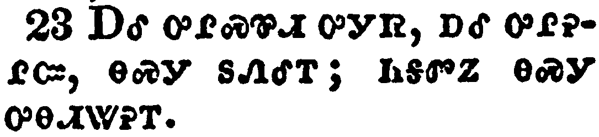</a></td>
</tr>
<tr class="even">
<td>And he took the cup, and when he had given thanks, he gave it to them: and they all drank of it.</td>
</tr>
<tr class="odd">
<td>ᎠᎴ ᎤᎵᏍᏈᏗ ᎤᎩᏒ, ᎠᎴ ᎤᎵᎮᎵᏨ, ᎾᏍᎩ ᏚᏁᎴᎢ; ᏂᎦᏛᏃ ᎾᏍᎩ ᎤᎾᏗᏔᎮᎢ.</td>
</tr>
<tr class="even">
<td>A-le u-li-s-qui-di u-gi-sv, a-le u-li-he-li-tsv, na-s-gi du-ne-le-i; ni-ga-dv-no na-s-gi u-na-di-ta-he-i.</td>
</tr>
</tbody>
</table>

<table>
<tbody>
<tr class="odd">
<td><a href="021424.png">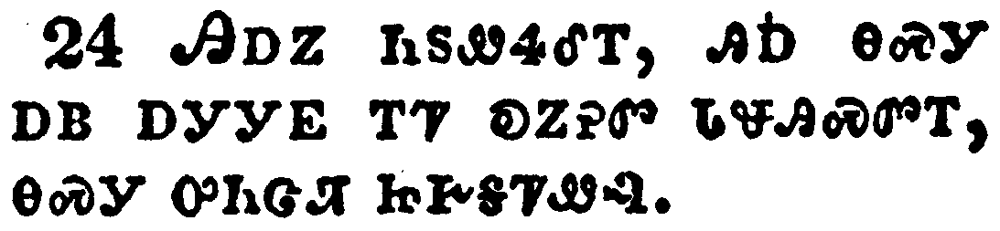</a></td>
</tr>
<tr class="even">
<td>And he said unto them, This is my blood of the new testament, which is shed for many.</td>
</tr>
<tr class="odd">
<td>ᎯᎠᏃ ᏂᏚᏪᏎᎴᎢ, ᎯᎠ ᎾᏍᎩ ᎠᏴ ᎠᎩᎩᎬ ᎢᏨ ᎧᏃᎮᏛ ᏓᏠᎯᏍᏛᎢ, ᎾᏍᎩ ᎤᏂᏣᏘ ᏥᎨᎦᏤᏪᎸ.</td>
</tr>
<tr class="even">
<td>Hi-a-no ni-du-we-se-le-i, hi-a na-s-gi a-yv a-gi-gi-gv i-tsv ka-no-he-dv da-tlo-hi-s-dv-i, na-s-gi u-ni-tsa-ti tsi-ge-ga-tse-we-lv.</td>
</tr>
</tbody>
</table>

<table>
<tbody>
<tr class="odd">
<td><a href="021425.png">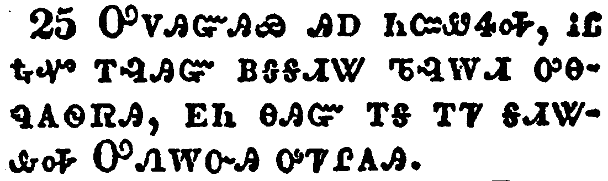</a></td>
</tr>
<tr class="even">
<td>Verily I say unto you, I will drink no more of the fruit of the vine, until that day that I drink it new in the kingdom of God.</td>
</tr>
<tr class="odd">
<td>ᎤᏙᎯᏳᎯᏯ ᎯᎠ ᏂᏨᏪᏎᎭ, ᎥᏝ ᎿᎭᏉ ᎢᎸᎯᏳ ᏴᎦᎦᏗᏔ ᏖᎸᎳᏗ ᎤᎾᏄᎪᏫᏒᎯ, ᎬᏂ ᎾᎯᏳ ᎢᎦ ᎢᏤ ᎦᏗᏔᎲᎭ ᎤᏁᎳᏅᎯ ᎤᏤᎵᎪᎯ.</td>
</tr>
<tr class="even">
<td>U-do-hi-yu-hi-ya hi-a ni-tsv-we-se-ha, v-tla hna-quo i-lv-hi-yu yv-ga-ga-di-ta te-lv-la-di u-na-nu-go-wi-sv-hi, gv-ni na-hi-yu i-ga i-tse ga-di-ta-hv-ha U-ne-la-nv-hi u-tse-li-go-hi.</td>
</tr>
</tbody>
</table>

<table>
<tbody>
<tr class="odd">
<td><a href="021426.png">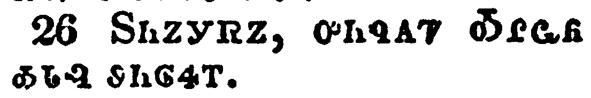</a></td>
</tr>
<tr class="even">
<td>And when they had sung an hymn, they went out into the mount of Olives.</td>
</tr>
<tr class="odd">
<td>ᏚᏂᏃᎩᏒᏃ, ᎤᏂᏄᎪᏤ ᎣᎵᏩᏲ ᎣᏓᎸ ᏭᏂᎶᏎᎢ.</td>
</tr>
<tr class="even">
<td>Du-ni-no-gi-sv-no, u-ni-nu-go-tse O-li-wa-yo o-da-lv wu-ni-lo-se-i.</td>
</tr>
</tbody>
</table>

<table>
<tbody>
<tr class="odd">
<td><a href="021427.png">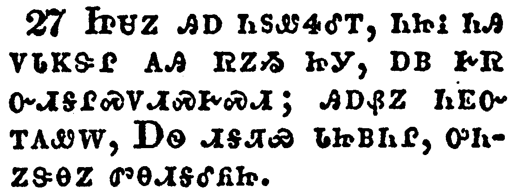</a></td>
</tr>
<tr class="even">
<td>And Jesus saith unto them, All ye shall be offended because of me this night: for it is written, I will smite the shepherd, and the sheep shall be scattered.</td>
</tr>
<tr class="odd">
<td>ᏥᏌᏃ ᎯᎠ ᏂᏚᏪᏎᎴᎢ, ᏂᏥᎥ ᏂᎯ ᏙᏓᏦᏕᎵ ᎪᎯ ᏒᏃᏱ ᏥᎩ, ᎠᏴ ᎨᏒ ᏅᏗᎦᎵᏍᏙᏗᏍᎨᏍᏗ; ᎯᎠᏰᏃ ᏂᎬᏅᎢᎪᏪᎳ, ᎠᏫ ᏗᎦᏘᏯ ᏓᏥᏴᏂᎵ, ᎤᏂᏃᏕᎾᏃ ᏛᎾᏗᎦᎴᏲᏥ.</td>
</tr>
<tr class="even">
<td>Tsi-sa-no hi-a ni-du-we-se-le-i, ni-tsi-v ni-hi do-da-tso-de-li go-hi sv-no-yi tsi-gi, a-yv ge-sv nv-di-ga-li-s-do-di-s-ge-s-di; hi-a-ye-no ni-gv-nv-i-go-we-la, A-wi di-ga-ti-ya da-tsi-yv-ni-li, u-ni-no-de-na-no dv-na-di-ga-le-yo-tsi.</td>
</tr>
</tbody>
</table>

<table>
<tbody>
<tr class="odd">
<td><a href="021428.png">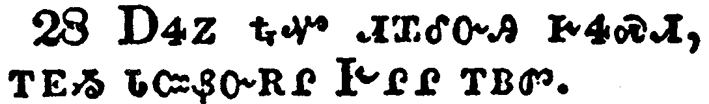</a></td>
</tr>
<tr class="even">
<td>But after that I am risen, I will go before you into Galilee.</td>
</tr>
<tr class="odd">
<td>ᎠᏎᏃ ᎿᎭᏉ ᏗᏆᎴᏅᎯ ᎨᏎᏍᏗ, ᎢᎬᏱ ᏓᏨᏰᏅᎡᎵ ᎨᎵᎵ ᎢᏴᏛ.</td>
</tr>
<tr class="even">
<td>A-se-no hna-quo di-qua-le-nv-hi ge-se-s-di, i-gv-yi da-tsv-ye-nv-e-li Ge-li-li i-yv-dv.</td>
</tr>
</tbody>
</table>

<table>
<tbody>
<tr class="odd">
<td><a href="021429.png">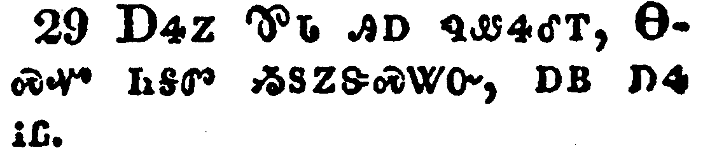</a></td>
</tr>
<tr class="even">
<td>But Peter said unto him, Although all shall be offended, yet will not I.</td>
</tr>
<tr class="odd">
<td>ᎠᏎᏃ ᏈᏓ ᎯᎠ ᏄᏪᏎᎴᎢ, ᎾᏍᏉ ᏂᎦᏛ ᏱᏚᏃᏕᏍᏔᏅ, ᎠᏴ ᎠᏎ ᎥᏝ.</td>
</tr>
<tr class="even">
<td>A-se-no Qui-da hi-a nu-we-se-le-i, Na-s-quo ni-ga-dv yi-du-no-de-s-ta-nv, a-yv a-se v-tla.</td>
</tr>
</tbody>
</table>

<table>
<tbody>
<tr class="odd">
<td><a href="021430.png">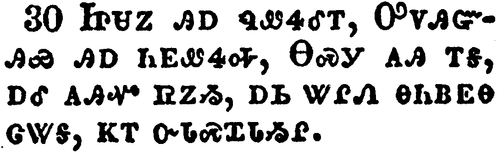</a></td>
</tr>
<tr class="even">
<td>And Jesus saith unto him, Verily I say unto thee, That this day, even in this night, before the cock crow twice, thou shalt deny me thrice.</td>
</tr>
<tr class="odd">
<td>ᏥᏌᏃ ᎯᎠ ᏄᏪᏎᎴᎢ, ᎤᏙᎯᏳᎯᏯ ᎯᎠ ᏂᎬᏪᏎᎭ, ᎾᏍᎩ ᎪᎯ ᎢᎦ, ᎠᎴ ᎪᎯᏉ ᏒᏃᏱ, ᎠᏏ ᏔᎵᏁ ᎾᏂᏴᎬᎾ ᏣᏔᎦ, ᏦᎢ ᏅᏓᏍᏆᏓᏱᎵ.</td>
</tr>
<tr class="even">
<td>Tsi-sa-no hi-a nu-we-se-le-i, U-do-hi-yu-hi-ya hi-a ni-gv-we-se-ha, Na-s-gi go-hi i-ga, a-le go-hi-quo sv-no-yi, a-si ta-li-ne na-ni-yv-gv-na tsa-ta-ga, tso-i nv-da-s-qua-da-yi-li.</td>
</tr>
</tbody>
</table>

<table>
<tbody>
<tr class="odd">
<td><a href="021431.png">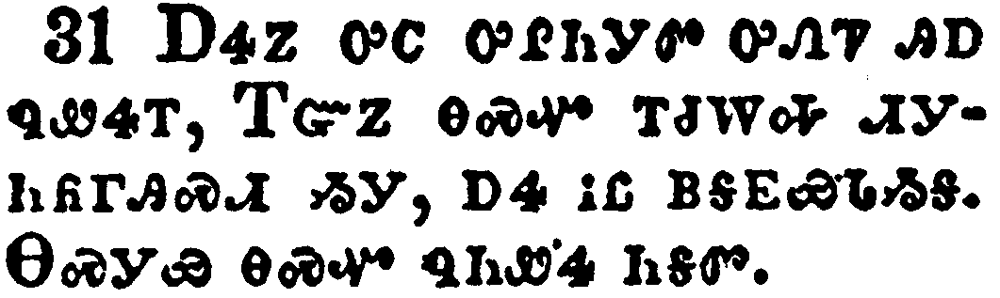</a></td>
</tr>
<tr class="even">
<td>But he spake the more vehemently, If I should die with thee, I will not deny thee in any wise. Likewise also said they all.</td>
</tr>
<tr class="odd">
<td>ᎠᏎᏃ ᎤᏟ ᎤᎵᏂᎩᏛ ᎤᏁᏤ ᎯᎠ ᏄᏪᏎᎢ, ᎢᏳᏃ ᎾᏍᏉ ᎢᏧᎳᎭ ᏗᎩᏂᏲᎱᎯᏍᏗ ᏱᎩ, ᎠᏎ ᎥᏝ ᏴᎦᎬᏯᏓᏱᎦ. ᎾᏍᎩᏯ ᎾᏍᏉ ᏄᏂᏪᏎ ᏂᎦᏛ.</td>
</tr>
<tr class="even">
<td>A-se-no u-tli u-li-ni-gi-dv u-ne-tse hi-a nu-we-se-i, I-yu-no na-s-quo i-tsu-la-ha di-gi-ni-yo-hu-hi-s-di yi-gi, a-se v-tla yv-ga-gv-ya-da-yi-ga. Na-s-gi-ya na-s-quo nu-ni-we-se ni-ga-dv.</td>
</tr>
</tbody>
</table>

<table>
<tbody>
<tr class="odd">
<td><a href="021432.png">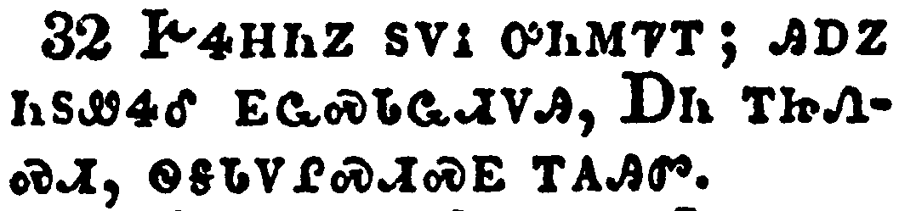</a></td>
</tr>
<tr class="even">
<td>And they came to a place which was named Gethsemane: and he saith to his disciples, Sit ye here, while I shall pray.</td>
</tr>
<tr class="odd">
<td>ᎨᏎᎻᏂᏃ ᏚᏙᎥ ᎤᏂᎷᏤᎢ; ᎯᎠᏃ ᏂᏚᏪᏎᎴ ᎬᏩᏍᏓᏩᏗᏙᎯ, ᎠᏂ ᎢᏥᏁᏍᏗ, ᏫᎦᏓᏙᎵᏍᏗᏍᎬ ᎢᎪᎯᏛ.</td>
</tr>
<tr class="even">
<td>Ge-se-mi-ni-no du-do-v u-ni-lu-tse-i; hi-a-no ni-du-we-se-le gv-wa-s-da-wa-di-do-hi, A-ni i-tsi-ne-s-di, wi-ga-da-do-li-s-di-s-gv i-go-hi-dv.</td>
</tr>
</tbody>
</table>

<table>
<tbody>
<tr class="odd">
<td><a href="021433.png">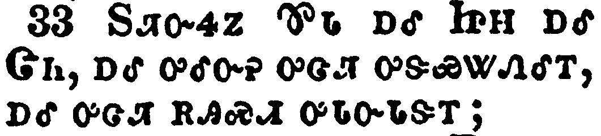</a></td>
</tr>
<tr class="even">
<td>And he taketh with him Peter and James and John, and began to be sore amazed, and to be very heavy;</td>
</tr>
<tr class="odd">
<td>ᏚᏖᏅᏎᏃ ᏈᏓ ᎠᎴ ᏥᎻ ᎠᎴ ᏣᏂ, ᎠᎴ ᎤᎴᏅᎮ ᎤᏣᏘ ᎤᏕᏯᏔᏁᎴᎢ, ᎠᎴ ᎤᏣᏘ ᎡᎯᏍᏗ ᎤᏓᏅᏓᏕᎢ;</td>
</tr>
<tr class="even">
<td>Du-te-nv-se-no Qui-da a-le Tsi-mi a-le Tsa-ni, a-le u-le-nv-he u-tsa-ti u-de-ya-ta-ne-le-i, a-le u-tsa-ti e-hi-s-di u-da-nv-da-de-i;</td>
</tr>
</tbody>
</table>

<table>
<tbody>
<tr class="odd">
<td><a href="021434.png">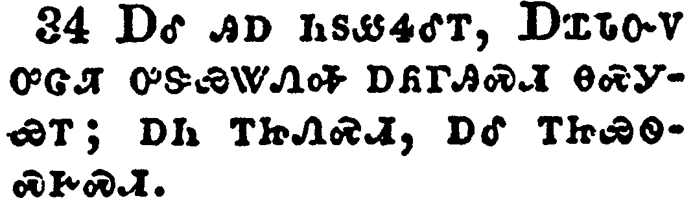</a></td>
</tr>
<tr class="even">
<td>And saith unto them, My soul is exceeding sorrowful unto death: tarry ye here, and watch.</td>
</tr>
<tr class="odd">
<td>ᎠᎴ ᎯᎠ ᏂᏚᏪᏎᎴᎢ, ᎠᏆᏓᏅᏙ ᎤᏣᏘ ᎤᏕᏯᏔᏁᎭ ᎠᏲᎱᎯᏍᏗ ᎾᏍᎩᏯᎢ; ᎠᏂ ᎢᏥᏁᏍᏗ, ᎠᎴ ᎢᏥᏯᏫᏍᎨᏍᏗ.</td>
</tr>
<tr class="even">
<td>A-le hi-a ni-du-we-se-le-i, A-qua-da-nv-do u-tsa-ti u-de-ya-ta-ne-ha a-yo-hu-hi-s-di na-s-gi-ya-i; a-ni i-tsi-ne-s-di, a-le i-tsi-ya-wi-s-ge-s-di.</td>
</tr>
</tbody>
</table>

<table>
<tbody>
<tr class="odd">
<td><a href="021435.png">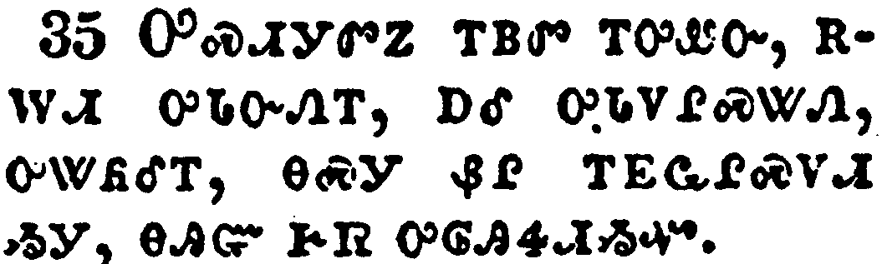</a></td>
</tr>
<tr class="even">
<td>And he went forward a little, and fell on the ground, and prayed that, if it were possible, the hour might pass from him.</td>
</tr>
<tr class="odd">
<td>ᎤᏍᏗᎩᏛᏃ ᎢᏴᏛ ᎢᎤᏪᏅ, ᎡᎳᏗ ᎤᏓᏅᏁᎢ, ᎠᎴ ᎤᏓᏙᎵᏍᏔᏁ, ᎤᏔᏲᎴᎢ, ᎾᏍᎩ ᏰᎵ ᎢᎬᏩᎵᏍᏙᏗ ᏱᎩ, ᎾᎯᏳ ᎨᏒ ᎤᎶᎯᏎᏗᏱᏉ.</td>
</tr>
<tr class="even">
<td>U-s-di-gi-dv-no i-yv-dv i-u-we-nv, e-la-di u-da-nv-ne-i, a-le u-da-do-li-s-ta-ne, u-ta-yo-le-i, na-s-gi ye-li i-gv-wa-li-s-do-di yi-gi, na-hi-yu ge-sv u-lo-hi-se-di-yi-quo.</td>
</tr>
</tbody>
</table>

<table>
<tbody>
<tr class="odd">
<td><a href="021436.png">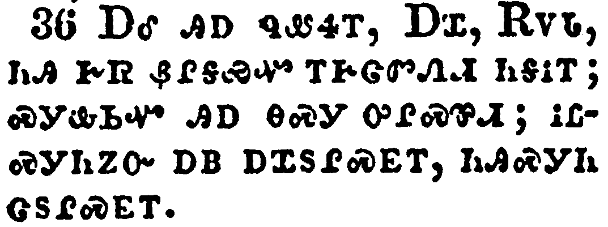</a></td>
</tr>
<tr class="even">
<td>And he said, Abba, Father, all things are possible unto thee; take away this cup from me: nevertheless not what I will, but what thou wilt.</td>
</tr>
<tr class="odd">
<td>ᎠᎴ ᎯᎠ ᏄᏪᏎᎢ, ᎠᏆ, ᎡᏙᏓ, ᏂᎯ, ᎨᏒ ᏰᎵᎦᏯᏉ ᎢᎨᏣᏛᏁᏗ ᏂᎦᎥᎢ; ᏍᎩᎲᏏᏉ ᎯᎠ ᎾᏍᎩ ᎤᎵᏍᏈᏗ; ᎥᏝᏍᎩᏂᏃᏅ ᎠᏴ ᎠᏆᏚᎵᏍᎬᎢ, ᏂᎯᏍᎩᏂ ᏣᏚᎵᏍᎬᎢ.</td>
</tr>
<tr class="even">
<td>A-le hi-a nu-we-se-i, A-qua, E-do-da, ni-hi, ge-sv ye-li-ga-ya-quo i-ge-tsa-dv-ne-di ni-ga-v-i; s-gi-hv-si-quo hi-a na-s-gi u-li-s-qui-di; v-tla-s-gi-ni-no-nv a-yv a-qua-du-li-s-gv-i, ni-hi-s-gi-ni tsa-du-li-s-gv-i.</td>
</tr>
</tbody>
</table>

<table>
<tbody>
<tr class="odd">
<td><a href="021437.png">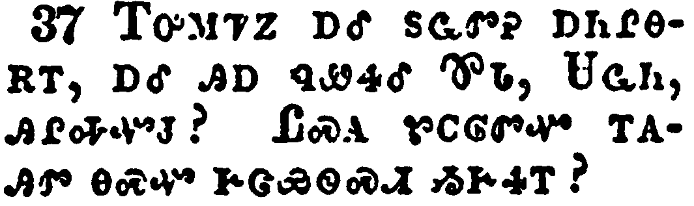</a></td>
</tr>
<tr class="even">
<td>And he cometh, and findeth them sleeping, and saith unto Peter, Simon, sleepest thou? couldest not thou watch one hour?</td>
</tr>
<tr class="odd">
<td>ᎢᎤᎷᏤᏃ ᎠᎴ ᏚᏩᏛᎮ ᎠᏂᎵᎾᎡᎢ, ᎠᎴ ᎯᎠ ᏄᏪᏎᎴ ᏈᏓ, ᏌᏩᏂ, ᎯᎵᎭᏉᏧ? ᏝᏍᎪ ᏑᏟᎶᏛᏉ ᎢᎪᎯᏛ ᎾᏍᏉ ᎨᏣᏯᏫᏍᏗ ᏱᎨᏎᎢ?</td>
</tr>
<tr class="even">
<td>I-u-lu-tse-no a-le du-wa-dv-he a-ni-li-na-e-i, a-le hi-a nu-we-se-le Qui-da, Sa-wa-ni, hi-li-ha-quo-tsu? Tla-s-go su-tli-lo-dv-quo i-go-hi-dv na-s-quo ge-tsa-ya-wi-s-di yi-ge-se-i?</td>
</tr>
</tbody>
</table>

<table>
<tbody>
<tr class="odd">
<td><a href="021438.png">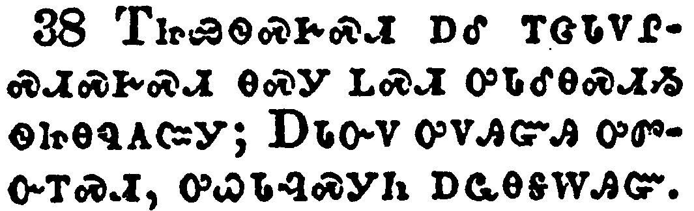</a></td>
</tr>
<tr class="even">
<td>Watch ye and pray, lest ye enter into temptation. The spirit truly is ready, but the flesh is weak.</td>
</tr>
<tr class="odd">
<td>ᎢᏥᏯᏫᏍᎨᏍᏗ ᎠᎴ ᎢᏣᏓᏙᎵᏍᏗᏍᎨᏍᏗ ᎾᏍᎩ ᏞᏍᏗ ᎤᏓᎴᎾᏍᏗᏱ ᏫᏥᎾᏄᎪᏨᎩ; ᎠᏓᏅᏙ ᎤᏙᎯᏳᎯ ᎤᏛᏅᎢᏍᏗ, ᎤᏇᏓᎸᏍᎩᏂ ᎠᏩᎾᎦᎳᎯᏳ.</td>
</tr>
<tr class="even">
<td>I-tsi-ya-wi-s-ge-s-di a-le i-tsa-da-do-li-s-di-s-ge-s-di na-s-gi tle-s-di u-da-le-na-s-di-yi wi-tsi-na-nu-go-tsv-gi; A-da-nv-do u-do-hi-yu-hi u-dv-nv-i-s-di, u-que-da-lv-s-gi-ni a-wa-na-ga-la-hi-yu.</td>
</tr>
</tbody>
</table>

<table>
<tbody>
<tr class="odd">
<td><a href="021439.png">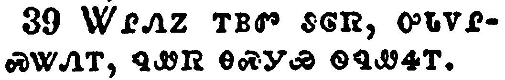</a></td>
</tr>
<tr class="even">
<td>And again he went away, and prayed, and spake the same words.</td>
</tr>
<tr class="odd">
<td>ᏔᎵᏁᏃ ᎢᏴᏛ ᏭᎶᏒ, ᎤᏓᏙᎵᏍᏔᏁᎢ, ᏄᏪᏒ ᎾᏍᎩᏯ ᏫᏄᏪᏎᎢ.</td>
</tr>
<tr class="even">
<td>Ta-li-ne-no i-yv-dv wu-lo-sv, u-da-do-li-s-ta-ne-i, nu-we-sv na-s-gi-ya wi-nu-we-se-i.</td>
</tr>
</tbody>
</table>

<table>
<tbody>
<tr class="odd">
<td><a href="021440.png">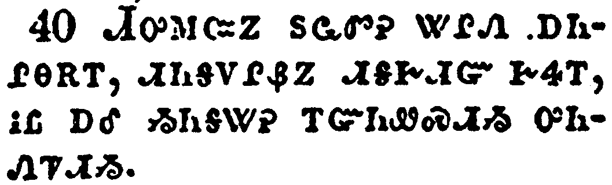</a></td>
</tr>
<tr class="even">
<td>And when he returned, he found them asleep again, (for their eyes were heavy,) neither wist they what to answer him.</td>
</tr>
<tr class="odd">
<td>ᏗᎤᎷᏨᏃ ᏚᏩᏛᎮ ᏔᎵᏁ ᎠᏂᎵᎾᎡᎢ, ᏗᏂᎦᏙᎵᏰᏃ ᏗᎦᎨᏗᏳ ᎨᏎᎢ, ᎥᏝ ᎠᎴ ᏱᏂᎦᏔᎮ ᎢᏳᏂᏪᏍᏗᏱ ᎤᏂᏁᏤᏗᏱ.</td>
</tr>
<tr class="even">
<td>Di-u-lu-tsv-no du-wa-dv-he ta-li-ne a-ni-li-na-e-i, di-ni-ga-do-li-ye-no di-ga-ge-di-yu ge-se-i, v-tla a-le yi-ni-ga-ta-he i-yu-ni-we-s-di-yi u-ni-ne-tse-di-yi.</td>
</tr>
</tbody>
</table>

<table>
<tbody>
<tr class="odd">
<td><a href="021441.png">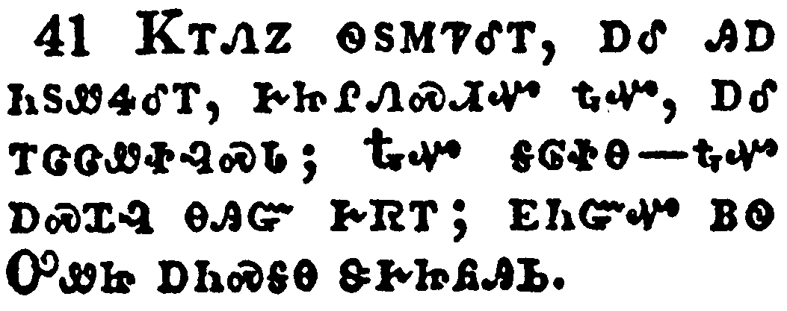</a></td>
</tr>
<tr class="even">
<td>And he cometh the third time, and saith unto them, Sleep on now, and take your rest: it is enough, the hour is come; behold, the Son of man is betrayed into the hands of sinners.</td>
</tr>
<tr class="odd">
<td>ᏦᎢᏁᏃ ᏫᏚᎷᏤᎴᎢ, ᎠᎴ ᎯᎠ ᏂᏚᏪᏎᎴᎢ, ᎨᏥᎵᏁᏍᏗᏉ ᎿᎭᏉ, ᎠᎴ ᎢᏣᏣᏪᏐᎸᏍᏓ; ᎿᎭᏉ ᎦᎶᏐᎾ-ᎿᎭᏉ ᎠᏍᏆᎸ ᎾᎯᏳ ᎨᏒᎢ; ᎬᏂᏳᏉ ᏴᏫ ᎤᏪᏥ ᎠᏂᏍᎦᎾ ᏕᎨᏥᏲᎯᏏ.</td>
</tr>
<tr class="even">
<td>Tso-i-ne-no wi-du-lu-tse-le-i, a-le hi-a ni-du-we-se-le-i, ge-tsi-li-ne-s-di-quo hna-quo, a-le i-tsa-tsa-we-so-lv-s-da; Hna-quo ga-lo-so-na---hna-quo a-s-qua-lv na-hi-yu ge-sv-i; gv-ni-yu-quo yv-wi U-we-tsi a-ni-s-ga-na de-ge-tsi-yo-hi-si.</td>
</tr>
</tbody>
</table>

<table>
<tbody>
<tr class="odd">
<td><a href="021442.png">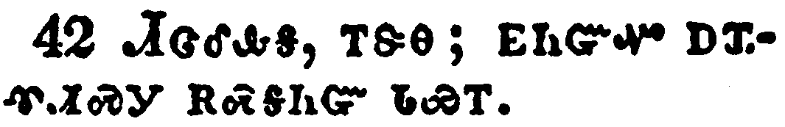</a></td>
</tr>
<tr class="even">
<td>Rise up, let us go; lo, he that betrayeth me is at hand.</td>
</tr>
<tr class="odd">
<td>ᏗᏣᎴᎲᎦ, ᎢᏕᎾ; ᎬᏂᏳᏉ ᎠᏆᏡᏗᏍᎩ ᎡᏍᎦᏂᏳ ᏓᏯᎢ.</td>
</tr>
<tr class="even">
<td>Di-tsa-le-hv-ga, i-de-na; gv-ni-yu-quo a-qua-tlu-di-s-gi e-s-ga-ni-yu da-ya-i.</td>
</tr>
</tbody>
</table>

<table>
<tbody>
<tr class="odd">
<td><a href="021443.png">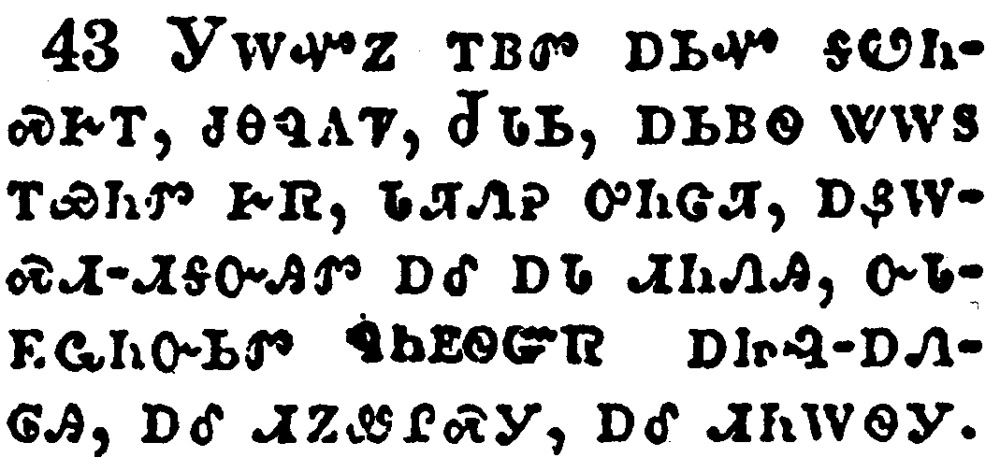</a></td>
</tr>
<tr class="even">
<td>And immediately, while he yet spake, cometh Judas, one of the twelve, and with him a great multitude with swords and staves, from the chief priests and the scribes and the elders.</td>
</tr>
<tr class="odd">
<td>ᎩᎳᏉᏃ ᎢᏴᏛ ᎠᏏᏉ ᎦᏪᏂᏍᎨᎢ, ᏧᎾᎸᎪᏤ, ᏧᏓᏏ, ᎠᏏᏴᏫ ᏔᎳᏚ ᎢᏯᏂᏛ ᎨᏒ, ᏓᏘᏁᎮ ᎤᏂᏣᏘ, ᎠᏰᎳᏍᏗ-ᏗᎦᏅᎯᏛ ᎠᎴ ᎠᏓ ᏗᏂᏁᎯ, ᏅᏓᎬᏩᏂᏅᏏᏛ ᏄᏂᎬᏫᏳᏒ ᎠᏥᎸ-ᎠᏁᎶᎯ, ᎠᎴ ᏗᏃᏪᎵᏍᎩ, ᎠᎴ ᏗᏂᎳᏫᎩ.</td>
</tr>
<tr class="even">
<td>Gi-la-quo-no i-yv-dv a-si-quo ga-we-ni-s-ge-i, tsu-na-lv-go-tse, Tsu-da-si, a-si-yv-wi ta-la-du i-ya-ni-dv ge-sv, da-ti-ne-he u-ni-tsa-ti, a-ye-la-s-di--di-ga-nv-hi-dv a-le a-da di-ni-ne-hi, nv-da-gv-wa-ni-nv-si-dv nu-ni-gv-wi-yu-sv a-tsi-lv--a-ne-lo-hi, a-le di-no-we-li-s-gi, a-le di-ni-la-wi-gi.</td>
</tr>
</tbody>
</table>

<table>
<tbody>
<tr class="odd">
<td><a href="021444.png">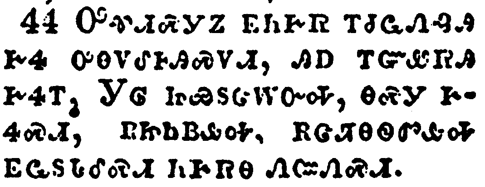</a></td>
</tr>
<tr class="even">
<td>And he that betrayed him had given them a token, saying, Whomsoever I shall kiss, that same is he; take him, and lead him away safely.</td>
</tr>
<tr class="odd">
<td>ᎤᏡᏗᏍᎩᏃ ᎬᏂᎨᏒ ᎢᏧᏩᏁᎸᎯ ᎨᏎ ᎤᎾᏙᎴᎰᎯᏍᏙᏗ, ᎯᎠ ᎢᏳᏪᏒᎯ ᎨᏎᎢ, ᎩᎶ ᏥᏯᏚᏣᎳᏅᎭ, ᎾᏍᎩ ᎨᏎᏍᏗ, ᏒᏥᏂᏴᎲᎭ, ᎡᏣᏘᎾᏫᏛᎲᎭ ᎬᏩᏚᏓᎴᏍᏗ ᏂᎨᏒᎾ ᏁᏨᏁᏍᏗ.</td>
</tr>
<tr class="even">
<td>U-tlu-di-s-gi-no gv-ni-ge-sv i-tsu-wa-ne-lv-hi ge-se u-na-do-le-ho-hi-s-do-di, hi-a i-yu-we-sv-hi ge-se-i, Gi-lo tsi-ya-du-tsa-la-nv-ha, na-s-gi ge-se-s-di, sv-tsi-ni-yv-hv-ha, e-tsa-ti-na-wi-dv-hv-ha gv-wa-du-da-le-s-di ni-ge-sv-na ne-tsv-ne-s-di.</td>
</tr>
</tbody>
</table>

<table>
<tbody>
<tr class="odd">
<td><a href="021445.png">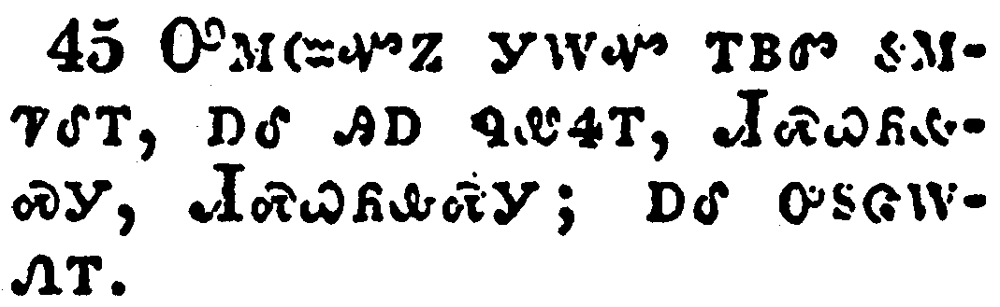</a></td>
</tr>
<tr class="even">
<td>And as soon as he was come, he goeth straightway to him, and saith, Master, master; and kissed him.</td>
</tr>
<tr class="odd">
<td>ᎤᎷᏨᏉᏃ ᎩᎳᏉ ᎢᏴᏛ ᏭᎷᏤᎴᎢ, ᎠᎴ ᎯᎠ ᏄᏪᏎᎢ, ᏗᏍᏇᏲᎲᏍᎩ, ᏗᏍᏇᏲᎲᏍᎩ; ᎠᎴ ᎤᏚᏣᎳᏁᎢ.</td>
</tr>
<tr class="even">
<td>U-lu-tsv-quo-no gi-la-quo i-yv-dv wu-lu-tse-le-i, a-le hi-a nu-we-se-i, Di-s-que-yo-hv-s-gi, Di-s-que-yo-hv-s-gi; a-le u-du-tsa-la-ne-i.</td>
</tr>
</tbody>
</table>

<table>
<tbody>
<tr class="odd">
<td></td>
</tr>
<tr class="even">
<td>And they laid their hands on him, and took him.</td>
</tr>
<tr class="odd">
<td>ᏕᎬᏩᏏᏔᏕᏃ, ᎠᎴ ᎬᏩᏂᏴᎮᎢ.</td>
</tr>
<tr class="even">
<td>De-gv-wa-si-ta-de-no, a-le gv-wa-ni-yv-he-i.</td>
</tr>
</tbody>
</table>

<table>
<tbody>
<tr class="odd">
<td><a href="021447.png">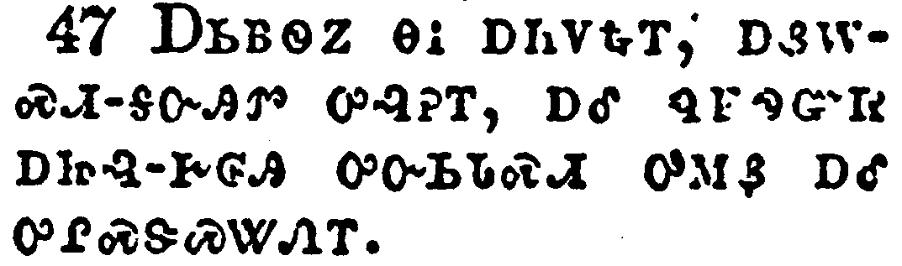</a></td>
</tr>
<tr class="even">
<td>And one of them that stood by drew a sword, and smote a servant of the high priest, and cut off his ear.</td>
</tr>
<tr class="odd">
<td>ᎠᏏᏴᏫᏃ ᎾᎥ ᎠᏂᏙᎿᎭᎢ, ᎠᏰᎳᏍᏗ-ᎦᏅᎯᏛ ᎤᎸᎮᎢ, ᎠᎴ ᏄᎬᏫᏳᏒ ᎠᏥᎸ-ᎨᎶᎯ ᎤᏅᏏᏓᏍᏗ ᎤᎷᏰ ᎠᎴ ᎤᎵᏍᏕᏍᏔᏁᎢ.</td>
</tr>
<tr class="even">
<td>A-si-yv-wi-no na-v a-ni-do-hna-i, a-ye-la-s-di--ga-nv-hi-dv u-lv-he-i, a-le nu-gv-wi-yu-sv a-tsi-lv--ge-lo-hi u-nv-si-da-s-di u-lu-ye a-le u-li-s-de-s-ta-ne-i.</td>
</tr>
</tbody>
</table>

<table>
<tbody>
<tr class="odd">
<td><a href="021448.png">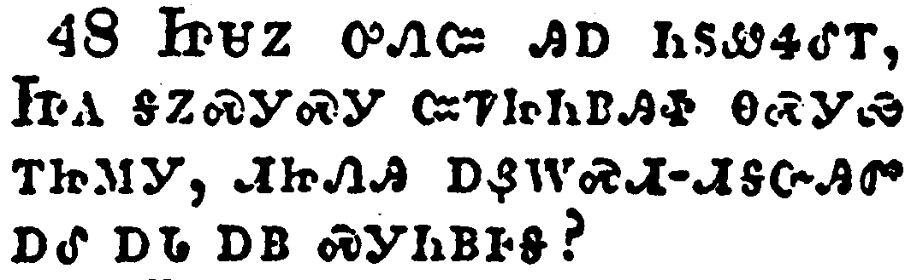</a></td>
</tr>
<tr class="even">
<td>And Jesus answered and said unto them, Are ye come out, as against a thief, with swords and with staves to take me?</td>
</tr>
<tr class="odd">
<td>ᏥᏌᏃ ᎤᏁᏨ ᎯᎠ ᏂᏚᏪᏎᎴᎢ, ᏥᎪ ᎦᏃᏍᎩᏍᎩ ᏨᏤᏥᏂᏴᎯᏐ ᎾᏍᎩᏯ ᎢᏥᎷᎩ, ᏗᏥᏁᎯ ᎠᏰᎳᏍᏗ-ᏗᎦᏅᎯᏛ ᎠᎴ ᎠᏓ ᎠᏴ ᏍᎩᏂᏴᎰᎦ?</td>
</tr>
<tr class="even">
<td>Tsi-sa-no u-ne-tsv hi-a ni-du-we-se-le-i, Tsi-go ga-no-s-gi-s-gi tsv-tse-tsi-ni-yv-hi-so na-s-gi-ya i-tsi-lu-gi, di-tsi-ne-hi a-ye-la-s-di--di-ga-nv-hi-dv a-le a-da a-yv s-gi-ni-yv-ho-ga?</td>
</tr>
</tbody>
</table>

<table>
<tbody>
<tr class="odd">
<td><a href="021449.png">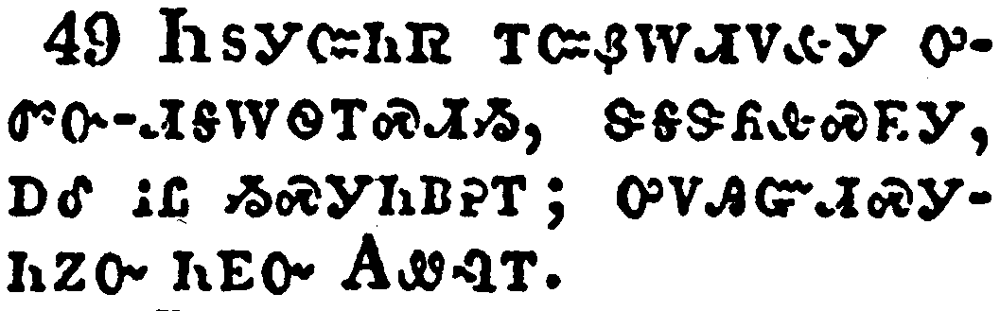</a></td>
</tr>
<tr class="even">
<td>I was daily with you in the temple teaching, and ye took me not: but the scriptures must be fulfilled.</td>
</tr>
<tr class="odd">
<td>ᏂᏚᎩᏨᏂᏒ ᎢᏨᏰᎳᏗᏙᎲᎩ ᎤᏛᏅ-ᏗᎦᎳᏫᎢᏍᏗᏱ, ᏕᎦᏕᏲᎲᏍᎬᎩ, ᎠᎴ ᎥᏝ ᏱᏍᎩᏂᏴᎮᎢ; ᎤᏙᎯᏳᏗᏍᎩᏂᏃᏅ ᏂᎬᏅ ᎪᏪᎸᎢ.</td>
</tr>
<tr class="even">
<td>Ni-du-gi-tsv-ni-sv i-tsv-ye-la-di-do-hv-gi u-dv-nv--di-ga-la-wi-i-s-di-yi, de-ga-de-yo-hv-s-gv-gi, a-le v-tla yi-s-gi-ni-yv-he-i; u-do-hi-yu-di-s-gi-ni-no-nv ni-gv-nv Go-we-lv-i.</td>
</tr>
</tbody>
</table>

<table>
<tbody>
<tr class="odd">
<td><a href="021450.png">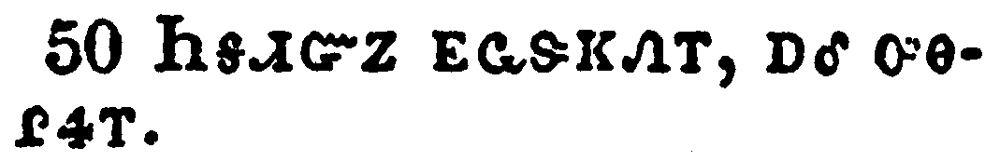</a></td>
</tr>
<tr class="even">
<td>And they all forsook him, and fled.</td>
</tr>
<tr class="odd">
<td>ᏂᎦᏗᏳᏃ ᎬᏩᏕᏦᏁᎢ, ᎠᎴ ᎤᎾᎵᏎᎢ.</td>
</tr>
<tr class="even">
<td>Ni-ga-di-yu-no gv-wa-de-tso-ne-i, a-le u-na-li-se-i.</td>
</tr>
</tbody>
</table>

<table>
<tbody>
<tr class="odd">
<td><a href="021451.png">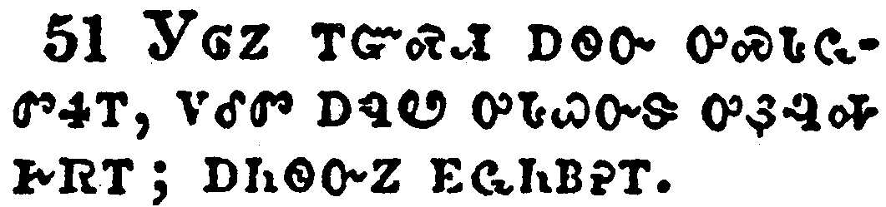</a></td>
</tr>
<tr class="even">
<td>And there followed him a certain young man, having a linen cloth cast about his naked body; and the young men laid hold on him:</td>
</tr>
<tr class="odd">
<td>ᎩᎶᏃ ᎢᏳᏍᏗ ᎠᏫᏅ ᎤᏍᏓᏩᏛᏎᎢ, ᏙᎴᏛ ᎠᏄᏬ ᎤᏓᏇᏅᏕ ᎤᏰᎸᎭ ᎨᏒᎢ; ᎠᏂᏫᏅᏃ ᎬᏩᏂᏴᎮᎢ.</td>
</tr>
<tr class="even">
<td>Gi-lo-no i-yu-s-di a-wi-nv u-s-da-wa-dv-se-i, do-le-dv a-nu-wo u-da-que-nv-de u-ye-lv-ha ge-sv-i; a-ni-wi-nv-no gv-wa-ni-yv-he-i.</td>
</tr>
</tbody>
</table>

<table>
<tbody>
<tr class="odd">
<td><a href="021452.png">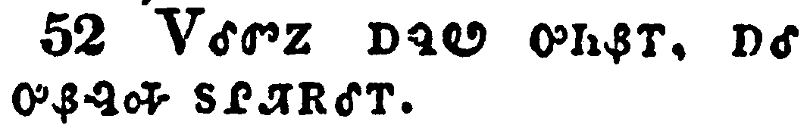</a></td>
</tr>
<tr class="even">
<td>And he left the linen cloth, and fled from them naked.</td>
</tr>
<tr class="odd">
<td>ᏙᎴᏛᏃ ᎠᏄᏬ ᎤᏂᏰᎢ, ᎠᎴ ᎤᏰᎸᎭ ᏚᎵᏘᎡᎴᎢ.</td>
</tr>
<tr class="even">
<td>Do-le-dv-no a-nu-wo u-ni-ye-i, a-le u-ye-lv-ha du-li-ti-e-le-i.</td>
</tr>
</tbody>
</table>

<table>
<tbody>
<tr class="odd">
<td><a href="021453.png">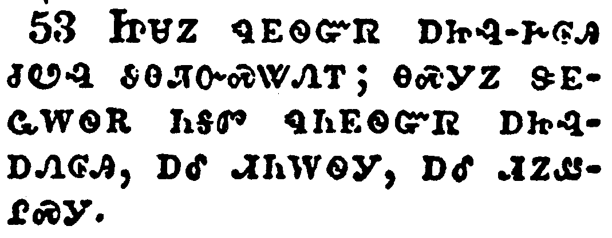</a></td>
</tr>
<tr class="even">
<td>And they led Jesus away to the high priest: and with him were assembled all the chief priests and the elders and the scribes.</td>
</tr>
<tr class="odd">
<td>ᏥᏌᏃ ᏄᎬᏫᏳᏒ ᎠᏥᎸ-ᎨᎶᎯ ᏧᏬᎸ ᏭᎾᏘᏅᏍᏔᏁᎢ; ᎾᏍᎩᏃ ᏕᎬᏩᎳᏫᎡ ᏂᎦᏛ ᏄᏂᎬᏫᏳᏒ ᎠᏥᎸᎠᏁᎶᎯ, ᎠᎴ ᏗᏂᎳᏫᎩ, ᎠᎴ ᏗᏃᏪᎵᏍᎩ.</td>
</tr>
<tr class="even">
<td>Tsi-sa-no nu-gv-wi-yu-sv a-tsi-lv--ge-lo-hi tsu-wo-lv wu-na-ti-nv-s-ta-ne-i; na-s-gi-no de-gv-wa-la-wi-e ni-ga-dv nu-ni-gv-wi-yu-sv a-tsi-lv-a-ne-lo-hi, a-le di-ni-la-wi-gi, a-le di-no-we-li-s-gi.</td>
</tr>
</tbody>
</table>

<table>
<tbody>
<tr class="odd">
<td></td>
</tr>
<tr class="even">
<td>And Peter followed him afar off, even into the palace of the high priest: and he sat with the servants, and warmed himself at the fire.</td>
</tr>
<tr class="odd">
<td>ᏈᏓᏃ Ꭸ ᎢᏴᏛ ᎤᏍᏓᏩᏗᏎᎢ, ᎾᏍᎩ ᏄᎬᏫᏳᏒ ᎠᏥᎸ-ᎨᎶᎯ ᏗᎦᏁᎸ ᏭᏴᎴᎢ, ᎤᏬᎴᏃ ᎨᏥᏅᏏᏓᏍᏗ ᎠᏂᏅᎢ, ᎠᎴ ᎪᏛ ᎤᎦᎾᏬᏍᎨᎢ.</td>
</tr>
<tr class="even">
<td>Qui-da-no ge i-yv-dv u-s-da-wa-di-se-i, na-s-gi nu-gv-wi-yu-sv a-tsi-lv--ge-lo-hi di-ga-ne-lv wu-yv-le-i, u-wo-le-no ge-tsi-nv-si-da-s-di a-ni-nv-i, a-le go-dv u-ga-na-wo-s-ge-i.</td>
</tr>
</tbody>
</table>

<table>
<tbody>
<tr class="odd">
<td><a href="021455.png">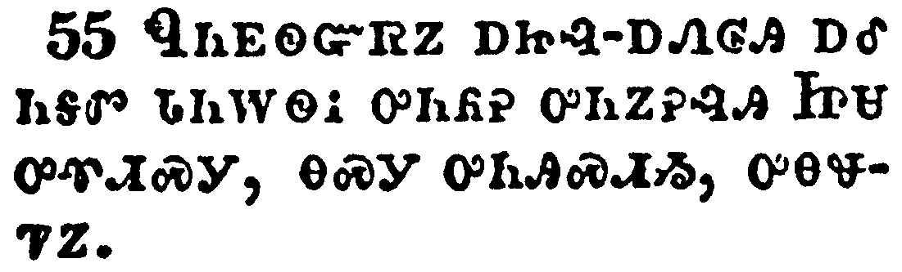</a></td>
</tr>
<tr class="even">
<td>And the chief priests and all the council sought for witness against Jesus to put him to death; and found none.</td>
</tr>
<tr class="odd">
<td>ᏄᏂᎬᏫᏳᏒᏃ ᎠᏥᎸ-ᎠᏁᎶᎯ ᎠᎴ ᏂᎦᏛ ᏓᏂᎳᏫᎥ ᎤᏂᏲᎮ ᎤᏂᏃᎮᎸᎯ ᏥᏌ ᎤᏡᏗᏍᎩ, ᎾᏍᎩ ᎤᏂᎯᏍᏗᏱ, ᎤᎾᏠᏤᏃ.</td>
</tr>
<tr class="even">
<td>Nu-ni-gv-wi-yu-sv-no a-tsi-lv--a-ne-lo-hi a-le ni-ga-dv da-ni-la-wi-v u-ni-yo-he u-ni-no-he-lv-hi Tsi-sa u-tlu-di-s-gi, na-s-gi u-ni-hi-s-di-yi, u-na-tlo-tse-no.</td>
</tr>
</tbody>
</table>

<table>
<tbody>
<tr class="odd">
<td></td>
</tr>
<tr class="even">
<td>For many bare false witness against him, but their witness agreed not together.</td>
</tr>
<tr class="odd">
<td>ᎤᏂᏣᏖᏰᏃ ᎦᏰᎪᎩ ᎠᏂᏃᎮᏍᎩ ᎬᏩᏡᏗᏍᎨᎢ, ᎠᏎᏃ ᎠᏂᏃᎮᏍᎬ ᎥᏝ ᎤᏠᏱ ᏱᎨᏎᎢ.</td>
</tr>
<tr class="even">
<td>U-ni-tsa-te-ye-no ga-ye-go-gi a-ni-no-he-s-gi gv-wa-tlu-di-s-ge-i, a-se-no a-ni-no-he-s-gv v-tla u-tlo-yi yi-ge-se-i.</td>
</tr>
</tbody>
</table>

<table>
<tbody>
<tr class="odd">
<td><a href="021457.png">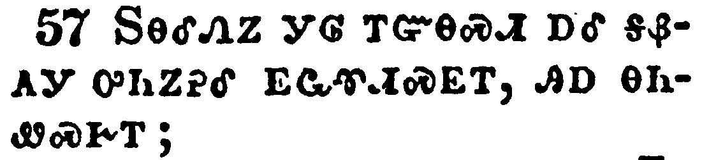</a></td>
</tr>
<tr class="even">
<td>And there arose certain, and bare false witness against him, saying,</td>
</tr>
<tr class="odd">
<td>ᏚᎾᎴᏁᏃ ᎩᎶ ᎢᏳᎾᏍᏗ ᎠᎴ ᎦᏰᎪᎩ ᎤᏂᏃᎮᎴ ᎬᏩᏡᏗᏍᎬᎢ, ᎯᎠ ᎾᏂᏪᏍᎨᎢ;</td>
</tr>
<tr class="even">
<td>Du-na-le-ne-no gi-lo i-yu-na-s-di a-le ga-ye-go-gi u-ni-no-he-le gv-wa-tlu-di-s-gv-i, hi-a na-ni-we-s-ge-i;</td>
</tr>
</tbody>
</table>

<table>
<tbody>
<tr class="odd">
<td><a href="021458.png">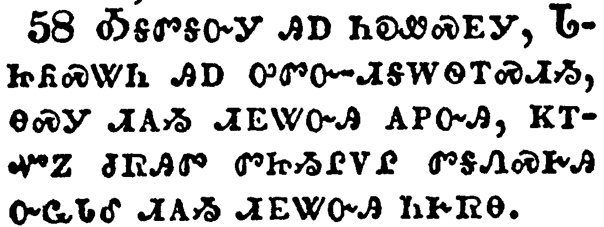</a></td>
</tr>
<tr class="even">
<td>We heard him say, I will destroy this temple that is made with hands, and within three days I will build another made without hands.</td>
</tr>
<tr class="odd">
<td>ᎣᎦᏛᎦᏅᎩ ᎯᎠ ᏂᎧᏪᏍᎬᎩ, ᏓᏥᏲᏍᏔᏂ ᎯᎠ ᎤᏛᏅ-ᏗᎦᎳᏫᎢᏍᏗᏱ, ᎾᏍᎩ ᏗᎪᏱ ᏗᎬᏔᏅᎯ ᎪᏢᏅᎯ, ᏦᎢᏉᏃ ᏧᏒᎯᏛ ᏛᏥᏱᎵᏙᎵ ᏛᎦᏁᏍᎨᎯ ᏅᏩᏓᎴ ᏗᎪᏱ ᏗᎬᏔᏅᎯ ᏂᎨᏒᎾ.</td>
</tr>
<tr class="even">
<td>O-ga-dv-ga-nv-gi hi-a ni-ka-we-s-gv-gi, Da-tsi-yo-s-ta-ni hi-a u-dv-nv--di-ga-la-wi-i-s-di-yi, na-s-gi di-go-yi di-gv-ta-nv-hi go-tlv-nv-hi, tso-i-quo-no tsu-sv-hi-dv dv-tsi-yi-li-do-li dv-ga-ne-s-ge-hi nv-wa-da-le di-go-yi di-gv-ta-nv-hi ni-ge-sv-na.</td>
</tr>
</tbody>
</table>

<table>
<tbody>
<tr class="odd">
<td><a href="021459.png">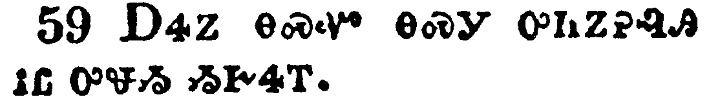</a></td>
</tr>
<tr class="even">
<td>But neither so did their witness agree together.</td>
</tr>
<tr class="odd">
<td>ᎠᏎᏃ ᎾᏍᏉ ᎾᏍᎩ ᎤᏂᏃᎮᎸᎯ ᎥᏝ ᎤᏠᏱ ᏱᎨᏎᎢ.</td>
</tr>
<tr class="even">
<td>A-se-no na-s-quo na-s-gi u-ni-no-he-lv-hi v-tla u-tlo-yi yi-ge-se-i.</td>
</tr>
</tbody>
</table>

<table>
<tbody>
<tr class="odd">
<td><a href="021460.png">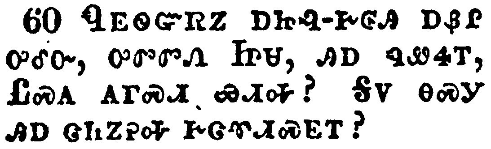</a></td>
</tr>
<tr class="even">
<td>And the high priest stood up in the midst, and asked Jesus, saying, Answerest thou nothing? what is it which these witness against thee?</td>
</tr>
<tr class="odd">
<td>ᏄᎬᏫᏳᏒᏃ ᎠᏥᎸ-ᎨᎶᎯ ᎠᏰᎵ ᎤᎴᏅ, ᎤᏛᏛᏁ ᏥᏌ, ᎯᎠ ᏁᏪᏎᎢ, ᏝᏍᎪ ᎪᎱᏍᏗ ᏯᏗᎭ? ᎦᏙ ᎾᏍᎩ ᎯᎠ ᏣᏂᏃᎮᎭ ᎨᏣᏡᏗᏍᎬᎢ?</td>
</tr>
<tr class="even">
<td>Nu-gv-wi-yu-sv-no a-tsi-lv--ge-lo-hi a-ye-li u-le-nv, u-dv-dv-ne Tsi-sa, hi-a ne-we-se-i, Tla-s-go go-hu-s-di ya-di-ha? Ga-do na-s-gi hi-a tsa-ni-no-he-ha ge-tsa-tlu-di-s-gv-i?</td>
</tr>
</tbody>
</table>

<table>
<tbody>
<tr class="odd">
<td><a href="021461.png">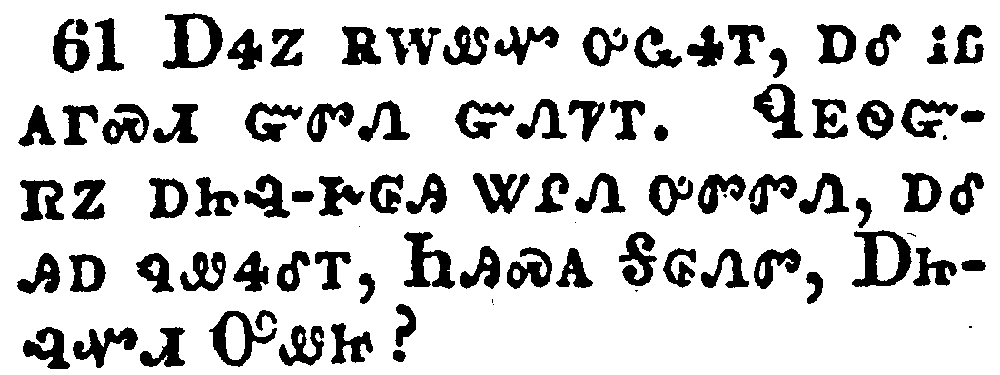</a></td>
</tr>
<tr class="even">
<td>But he held his peace, and answered nothing. Again the high priest asked him, and said unto him, Art thou the Christ, the Son of the Blessed?</td>
</tr>
<tr class="odd">
<td>ᎠᏎᏃ ᎡᎳᏪᏉ ᎤᏩᏎᎢ, ᎠᎴ ᎥᏝ ᎪᎱᏍᏗ ᏳᏛᏁ ᏨᏁᏤᎢ. ᏄᎬᏫᏳᏒᏃ ᎠᏥᎸ-ᎨᎶᎯ ᏔᎵᏁ ᎤᏛᏛᏁ, ᎠᎴ ᎯᎠ ᏄᏪᏎᎴᎢ, ᏂᎯᏍᎪ ᎦᎶᏁᏛ, ᎠᏥᎸᏉᏗ ᎤᏪᏥ?</td>
</tr>
<tr class="even">
<td>A-se-no e-la-we-quo u-wa-se-i, a-le v-tla go-hu-s-di yu-dv-ne tsv-ne-tse-i. Nu-gv-wi-yu-sv-no a-tsi-lv--ge-lo-hi ta-li-ne u-dv-dv-ne, a-le hi-a nu-we-se-le-i, Ni-hi-s-go Ga-lo-ne-dv, A-tsi-lv-quo-di U-we-tsi?</td>
</tr>
</tbody>
</table>

<table>
<tbody>
<tr class="odd">
<td><a href="021462.png">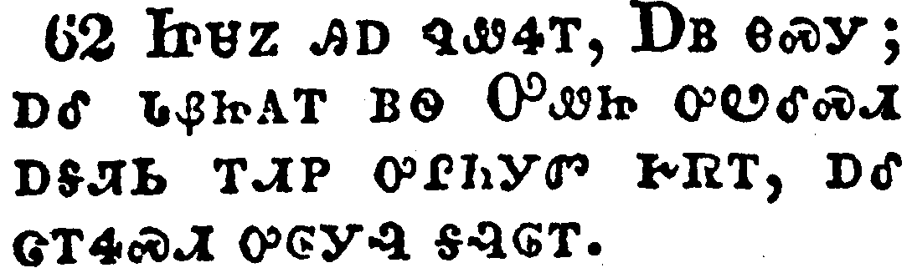</a></td>
</tr>
<tr class="even">
<td>And Jesus said, I am: and ye shall see the Son of man sitting on the right hand of power, and coming in the clouds of heaven.</td>
</tr>
<tr class="odd">
<td>ᏥᏌᏃ ᎯᎠ ᏄᏪᏎᎢ, ᎠᏴ ᎾᏍᎩ; ᎠᎴ ᏓᏰᏥᎪᎢ ᏴᏫ ᎤᏪᏥ ᎤᏬᎴᏍᏗ ᎠᎦᏘᏏ ᎢᏗᏢ ᎤᎵᏂᎩᏛ ᎨᏒᎢ, ᎠᎴ ᏣᎢᏎᏍᏗ ᎤᎶᎩᎸ ᎦᎸᎶᎢ.</td>
</tr>
<tr class="even">
<td>Tsi-sa-no hi-a nu-we-se-i, A-yv na-s-gi; a-le da-ye-tsi-go-i yv-wi U-we-tsi u-wo-le-s-di a-ga-ti-si i-di-tlv u-li-ni-gi-dv ge-sv-i, a-le tsa-i-se-s-di u-lo-gi-lv ga-lv-lo-i.</td>
</tr>
</tbody>
</table>

<table>
<tbody>
<tr class="odd">
<td><a href="021463.png">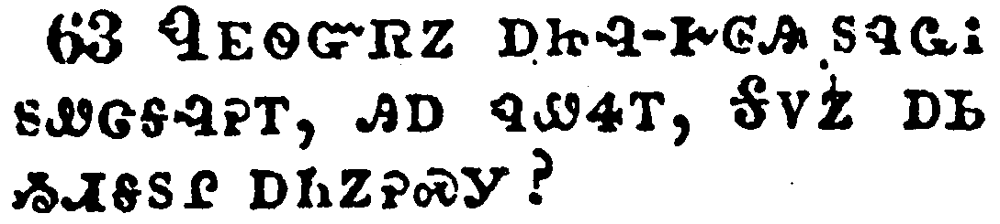</a></td>
</tr>
<tr class="even">
<td>Then the high priest rent his clothes, and saith, What need we any further witnesses?</td>
</tr>
<tr class="odd">
<td>ᏄᎬᏫᏳᏒᏃ ᎠᏥᎸ-ᎨᎶᎯ ᏚᏄᏩᎥ ᏚᏪᏣᎦᎸᎮᎢ, ᎯᎠ ᏄᏪᏎᎢ, ᎦᏙᏃ ᎠᏏ ᏱᏗᎦᏚᎵ ᎠᏂᏃᎮᏍᎩ?</td>
</tr>
<tr class="even">
<td>Nu-gv-wi-yu-sv-no a-tsi-lv--ge-lo-hi du-nu-wa-v du-we-tsa-ga-lv-he-i, hi-a nu-we-se-i, Ga-do-no a-si yi-di-ga-du-li a-ni-no-he-s-gi?</td>
</tr>
</tbody>
</table>

<table>
<tbody>
<tr class="odd">
<td><a href="021464.png">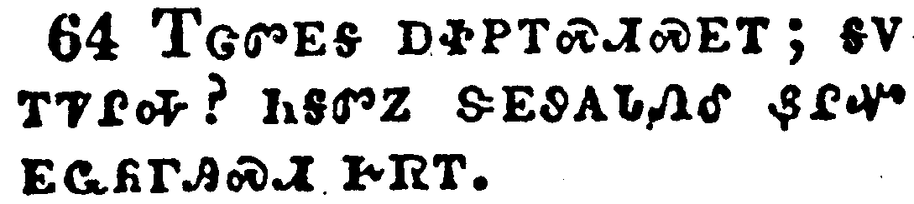</a></td>
</tr>
<tr class="even">
<td>Ye have heard the blasphemy: what think ye? And they all condemned him to be guilty of death.</td>
</tr>
<tr class="odd">
<td>ᎢᏣᏛᎬᎦ ᎠᏐᏢᎢᏍᏗᏍᎬᎢ; ᎦᏙ ᎢᏤᎵᎭ? ᏂᎦᏛᏃ ᏕᎬᏭᎪᏓᏁᎴ ᏰᎵᏉ ᎬᏩᏲᎱᎯᏍᏗ ᎨᏒᎢ.</td>
</tr>
<tr class="even">
<td>I-tsa-dv-gv-ga a-so-tlv-i-s-di-s-gv-i; ga-do i-tse-li-ha? ni-ga-dv-no de-gv-wu-go-da-ne-le ye-li-quo gv-wa-yo-hu-hi-s-di ge-sv-i.</td>
</tr>
</tbody>
</table>

<table>
<tbody>
<tr class="odd">
<td><a href="021465.png">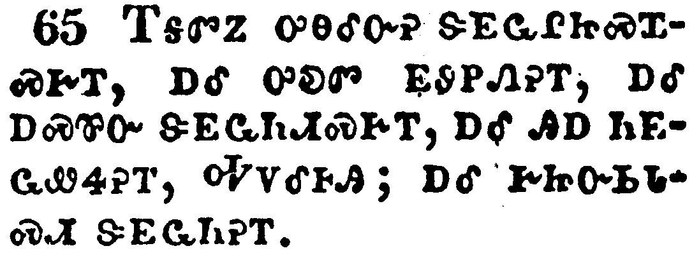</a></td>
</tr>
<tr class="even">
<td>And some began to spit on him, and to cover his face, and to buffet him, and to say unto him, Prophesy: and the servants did strike him with the palms of their hands.</td>
</tr>
<tr class="odd">
<td>ᎢᎦᏛᏃ ᎤᎾᎴᏅᎮ ᏕᎬᏩᎵᏥᏍᏆᏍᎨᎢ, ᎠᎴ ᎤᎧᏛ ᎬᏭᏢᏁᎮᎢ, ᎠᎴ ᎠᏍᏈᏅ ᏕᎬᏩᏂᏗᏍᎨᎢ, ᎠᎴ ᎯᎠ ᏂᎬᏩᏪᏎᎮᎢ, ᎭᏙᎴᎰᎯ; ᎠᎴ ᎨᏥᏅᏏᏓᏍᏗ ᏕᎬᏩᏂᎮᎢ.</td>
</tr>
<tr class="even">
<td>I-ga-dv-no u-na-le-nv-he de-gv-wa-li-tsi-s-qua-s-ge-i, a-le u-ka-dv gv-wu-tlv-ne-he-i, a-le a-s-qui-nv de-gv-wa-ni-di-s-ge-i, a-le hi-a ni-gv-wa-we-se-he-i, Ha-do-le-ho-hi; a-le ge-tsi-nv-si-da-s-di de-gv-wa-ni-he-i.</td>
</tr>
</tbody>
</table>

<table>
<tbody>
<tr class="odd">
<td><a href="021466.png">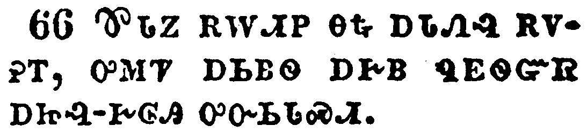</a></td>
</tr>
<tr class="even">
<td>And as Peter was beneath in the palace, there cometh one of the maids of the high priest:</td>
</tr>
<tr class="odd">
<td>ᏈᏓᏃ ᎡᎳᏗᏢ ᎾᎿᎭᎠᏓᏁᎸ ᎡᏙᎮᎢ, ᎤᎷᏤ ᎠᏏᏴᏫ ᎠᎨᏴ ᏄᎬᏫᏳᏒ ᎠᏥᎸ-ᎨᎶᎯ ᎤᏅᏏᏓᏍᏗ.</td>
</tr>
<tr class="even">
<td>Qui-da-no e-la-di-tlv na-hna a-da-ne-lv e-do-he-i, u-lu-tse a-si-yv-wi a-ge-yv nu-gv-wi-yu-sv a-tsi-lv--ge-lo-hi u-nv-si-da-s-di.</td>
</tr>
</tbody>
</table>

<table>
<tbody>
<tr class="odd">
<td><a href="021467.png">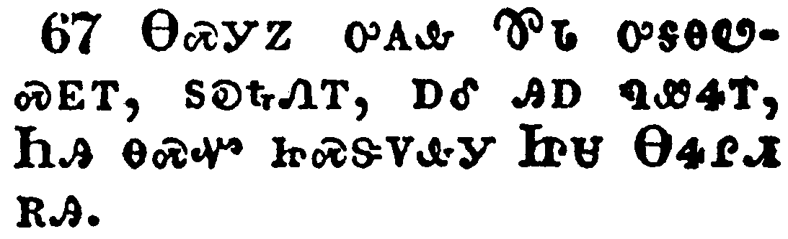</a></td>
</tr>
<tr class="even">
<td>And when she saw Peter warming himself, she looked upon him, and said, And thou also wast with Jesus of Nazareth.</td>
</tr>
<tr class="odd">
<td>ᎾᏍᎩᏃ ᎤᎪᎲ ᏈᏓ ᎤᎦᎾᏬᏍᎬᎢ, ᏚᎧᎿᎭᏁᎢ, ᎠᎴ ᎯᎠ ᏄᏪᏎᎢ, ᏂᎯ ᎾᏍᏉ ᏥᏍᏕᏙᎲᎩ ᏥᏌ ᎾᏎᎵᏗ ᎡᎯ.</td>
</tr>
<tr class="even">
<td>Na-s-gi-no u-go-hv Qui-da u-ga-na-wo-s-gv-i, du-ka-hna-ne-i, a-le hi-a nu-we-se-i, Ni-hi na-s-quo tsi-s-de-do-hv-gi Tsi-sa Na-se-li-di e-hi.</td>
</tr>
</tbody>
</table>

<table>
<tbody>
<tr class="odd">
<td><a href="021468.png">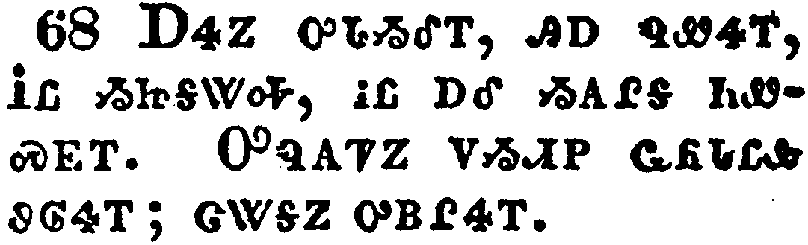</a></td>
</tr>
<tr class="even">
<td>But he denied, saying, I know not, neither understand I what thou sayest. And he went out into the porch; and the cock crew.</td>
</tr>
<tr class="odd">
<td>ᎠᏎᏃ ᎤᏓᏱᎴᎢ, ᎯᎠ ᏄᏪᏎᎢ, ᎥᏝ ᏱᏥᎦᏔᎭ, ᎥᏝ ᎠᎴ ᏱᎪᎵᎦ ᏂᏪᏍᎬᎢ. ᎤᏄᎪᏤᏃ ᏙᏱᏗᏢ ᏩᏲᏓᏝᎲ ᏭᎶᏎᎢ; ᏣᏔᎦᏃ ᎤᏴᎵᏎᎢ.</td>
</tr>
<tr class="even">
<td>A-se-no u-da-yi-le-i, hi-a nu-we-se-i, V-tla yi-tsi-ga-ta-ha, v-tla a-le yi-go-li-ga ni-we-s-gv-i. U-nu-go-tse-no do-yi-di-tlv wa-yo-da-tla-hv wu-lo-se-i; tsa-ta-ga-no u-yv-li-se-i.</td>
</tr>
</tbody>
</table>

<table>
<tbody>
<tr class="odd">
<td><a href="021469.png">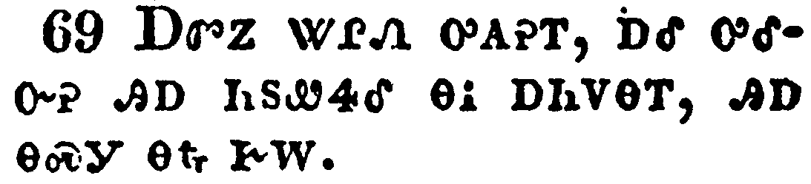</a></td>
</tr>
<tr class="even">
<td>And a maid saw him again, and began to say to them that stood by, This is one of them.</td>
</tr>
<tr class="odd">
<td>ᎠᏛᏃ ᏔᎵᏁ ᎤᎪᎮᎢ, ᎠᎴ ᎤᎴᏅᎮ ᎯᎠ ᏂᏚᏪᏎᎴ ᎾᎥ ᎠᏂᏙᎾᎢ, ᎯᎠ ᎾᏍᎩ ᎾᎿᎭᎨᎳ.</td>
</tr>
<tr class="even">
<td>A-dv-no ta-li-ne u-go-he-i, a-le u-le-nv-he hi-a ni-du-we-se-le na-v a-ni-do-na-i, hi-a na-s-gi na-hna ge-la.</td>
</tr>
</tbody>
</table>

<table>
<tbody>
<tr class="odd">
<td><a href="021470.png">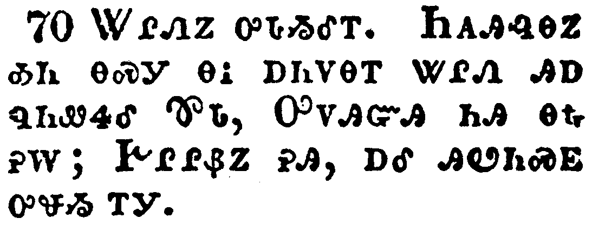</a></td>
</tr>
<tr class="even">
<td>And he denied it again. And a little after, they that stood by said again to Peter, Surely thou art one of them: for thou art a Galilaean, and thy speech agreeth thereto.</td>
</tr>
<tr class="odd">
<td>ᏔᎵᏁᏃ ᎤᏓᏱᎴᎢ. ᏂᎪᎯᎸᎾᏃ ᎣᏂ ᎾᏍᎩ ᎾᎥ ᎠᏂᏙᎾᎢ ᏔᎵᏁ ᎯᎠ ᏄᏂᏪᏎᎴ ᏈᏓ, ᎤᏙᎯᏳᎯ ᏂᎯ ᎾᎿᎭᎮᎳ; ᎨᎵᎵᏰᏃ ᎮᎯ, ᎠᎴ ᎪᏬᏂᏍᎬ ᎤᏠᏱ ᎢᎩ.</td>
</tr>
<tr class="even">
<td>Ta-li-ne-no u-da-yi-le-i. Ni-go-hi-lv-na-no o-ni na-s-gi na-v a-ni-do-na-i ta-li-ne hi-a nu-ni-we-se-le Qui-da, U-do-hi-yu-hi ni-hi na-hna he-la; Ge-li-li-ye-no he-hi, a-le go-wo-ni-s-gv u-tlo-yi i-gi.</td>
</tr>
</tbody>
</table>

<table>
<tbody>
<tr class="odd">
<td><a href="021471.png">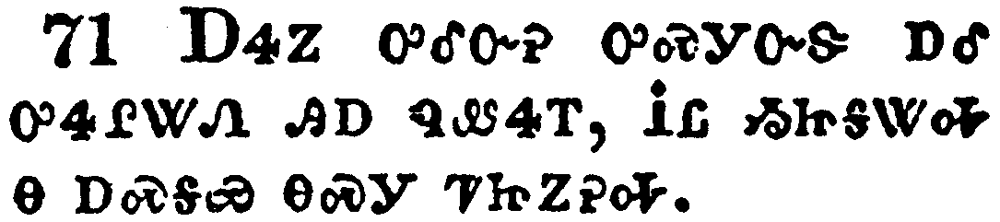</a></td>
</tr>
<tr class="even">
<td>But he began to curse and to swear, saying, I know not this man of whom ye speak.</td>
</tr>
<tr class="odd">
<td>ᎠᏎᏃ ᎤᎴᏅᎮ ᎤᏍᎩᏅᏕ ᎠᎴ ᎤᏎᎵᏔᏁ ᎯᎠ ᏁᏪᏎᎢ, ᎥᏝ ᏱᏥᎦᏔᎭ Ꮎ ᎠᏍᎦᏯ ᎾᏍᎩ ᏤᏥᏃᎮᎭ.</td>
</tr>
<tr class="even">
<td>A-se-no u-le-nv-he u-s-gi-nv-de a-le u-se-li-ta-ne hi-a ne-we-se-i, V-tla yi-tsi-ga-ta-ha na a-s-ga-ya na-s-gi tse-tsi-no-he-ha.</td>
</tr>
</tbody>
</table>

<table>
<tbody>
<tr class="odd">
<td><a href="021472.png">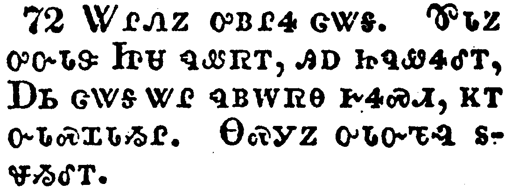</a></td>
</tr>
<tr class="even">
<td>And the second time the cock crew. And Peter called to mind the word that Jesus said unto him, Before the cock crow twice, thou shalt deny me thrice. And when he thought thereon, he wept.</td>
</tr>
<tr class="odd">
<td>ᏔᎵᏁᏃ ᎤᏴᎵᏎ ᏣᏔᎦ. ᏈᏓᏃ ᎤᏅᏓᏕ ᏥᏌ ᏄᏪᏒᎢ, ᎯᎠ ᏥᏄᏪᏎᎴᎢ, ᎠᏏ ᏣᏔᎦ ᏔᎵ ᏄᏴᎳᏒᎾ ᎨᏎᏍᏗ, ᏦᎢ ᏅᏓᏍᏆᏓᏱᎵ. ᎾᏍᎩᏃ ᎤᏓᏅᏖᎸ ᏚᏠᏱᎴᎢ.</td>
</tr>
<tr class="even">
<td>Ta-li-ne-no u-yv-li-se tsa-ta-ga. Qui-da-no u-nv-da-de Tsi-sa nu-we-sv-i, hi-a tsi-nu-we-se-le-i, A-si tsa-ta-ga ta-li nu-yv-la-sv-na ge-se-s-di, tso-i nv-da-s-qua-da-yi-li. Na-s-gi-no u-da-nv-te-lv du-tlo-yi-le-i.</td>
</tr>
</tbody>
</table>

