+++
draft=false
date = 2014-12-18T21:11:07Z
title = "Mark - Chapter 16 - Cherokee New Testament"
weight = 1418955067

[taxonomies]

authors = ["Timothy Legg"]
categories = []
tags = []

[extra]
+++

<table>
<tbody>
<tr class="odd">
<td><a href="021601.png">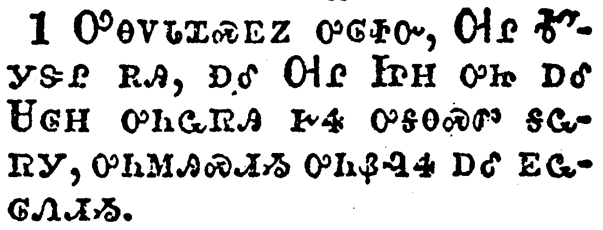</a></td>
</tr>
<tr class="even">
<td>And when the sabbath was past, Mary Magdalene, and Mary the mother of James, and Salome, had bought sweet spices, that they might come and anoint him.</td>
</tr>
<tr class="odd">
<td>ᎤᎾᏙᏓᏆᏍᎬᏃ ᎤᎶᏐᏅ, ᎺᎵ ᎹᎩᏕᎵ ᎡᎯ, ᎠᎴ ᎺᎵ ᏥᎻ ᎤᏥ ᎠᎴ ᏌᎶᎻ ᎤᏂᏩᏒᎯ ᎨᏎ ᎤᎦᎾᏍᏛ ᎦᏩᏒᎩ, ᎤᏂᎷᎯᏍᏗᏱ ᎤᏂᏰᎸᏎ ᎠᎴ ᎬᏩᎶᏁᏗᏱ.</td>
</tr>
<tr class="even">
<td>U-na-do-da-qua-s-gv-no u-lo-so-nv, Me-li Ma-gi-de-li e-hi, a-le Me-li Tsi-mi u-tsi a-le Sa-lo-mi u-ni-wa-sv-hi ge-se u-ga-na-s-dv ga-wa-sv-gi, u-ni-lu-hi-s-di-yi u-ni-ye-lv-se a-le gv-wa-lo-ne-di-yi.</td>
</tr>
</tbody>
</table>

<table>
<tbody>
<tr class="odd">
<td><a href="021602.png">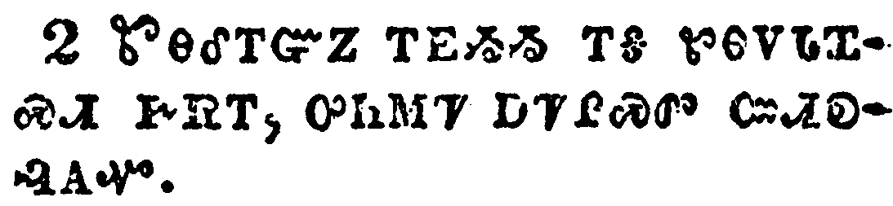</a></td>
</tr>
<tr class="even">
<td>And very early in the morning the first day of the week, they came unto the sepulchre at the rising of the sun.</td>
</tr>
<tr class="odd">
<td>ᏑᎾᎴᎢᏳᏃ ᎢᎬᏱᏱ ᎢᎦ ᏑᎾᏙᏓᏆᏍᏗ ᎨᏒᎢ, ᎤᏂᎷᏤ ᎠᏤᎵᏍᏛ ᏨᏗᎧᎸᎪᏉ.</td>
</tr>
<tr class="even">
<td>Su-na-le-i-yu-no i-gv-yi-yi i-ga su-na-do-da-qua-s-di ge-sv-i, u-ni-lu-tse a-tse-li-s-dv tsv-di-ka-lv-go-quo.</td>
</tr>
</tbody>
</table>

<table>
<tbody>
<tr class="odd">
<td><a href="021603.png">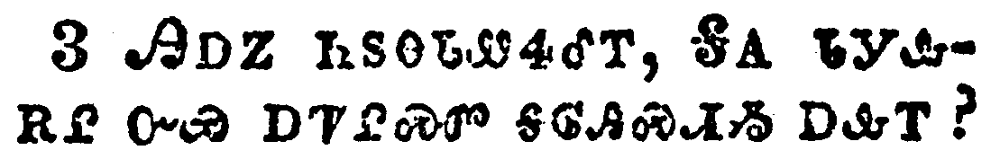</a></td>
</tr>
<tr class="even">
<td>And they said among themselves, Who shall roll us away the stone from the door of the sepulchre?</td>
</tr>
<tr class="odd">
<td>ᎯᎠᏃ ᏂᏚᎾᏓᏪᏎᎴᎢ, ᎦᎪ ᏓᎩᎲᎡᎵ ᏅᏯ ᎠᏤᎵᏍᏛ ᎦᎶᎯᏍᏗᏱ ᎠᎲᎢ?</td>
</tr>
<tr class="even">
<td>Hi-a-no ni-du-na-da-we-se-le-i, Ga-go da-gi-hv-e-li nv-ya a-tse-li-s-dv ga-lo-hi-s-di-yi a-hv-i?</td>
</tr>
</tbody>
</table>

<table>
<tbody>
<tr class="odd">
<td><a href="021604.png">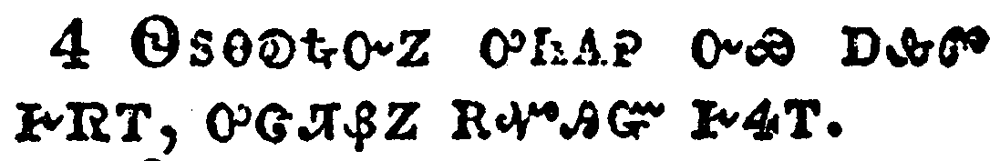</a></td>
</tr>
<tr class="even">
<td>And when they looked, they saw that the stone was rolled away: for it was very great.</td>
</tr>
<tr class="odd">
<td>ᏫᏚᎾᎧᎿᎭᏅᏃ ᎤᏂᎪᎮ ᏅᏯ ᎠᎲᏛ ᎨᏒᎢ, ᎤᏣᏘᏰᏃ ᎡᏉᎯᏳ ᎨᏎᎢ.</td>
</tr>
<tr class="even">
<td>Wi-du-na-ka-hna-nv-no u-ni-go-he nv-ya a-hv-dv ge-sv-i, u-tsa-ti-ye-no e-quo-hi-yu ge-se-i.</td>
</tr>
</tbody>
</table>

<table>
<tbody>
<tr class="odd">
<td><a href="021605.png">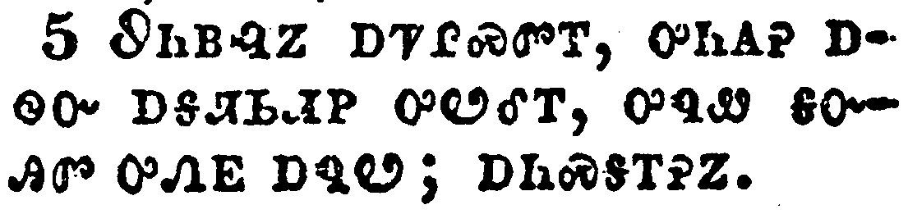</a></td>
</tr>
<tr class="even">
<td>And entering into the sepulchre, they saw a young man sitting on the right side, clothed in a long white garment; and they were affrighted.</td>
</tr>
<tr class="odd">
<td>ᏭᏂᏴᎸᏃ ᎠᏤᎵᏍᏛᎢ, ᎤᏂᎪᎮ ᎠᏫᏴ ᎠᎦᏘᏏᏗᏢ ᎤᏬᎴᎢ, ᎤᏄᏪ ᎦᏅᎯᏛ ᎤᏁᎬ ᎠᏄᏬ; ᎠᏂᏍᎦᎢᎮᏃ.</td>
</tr>
<tr class="even">
<td>Wu-ni-yv-lv-no a-tse-li-s-dv-i, u-ni-go-he a-wi-yv a-ga-ti-si-di-tlv u-wo-le-i, u-nu-we ga-nv-hi-dv u-ne-gv a-nu-wo; a-ni-s-ga-i-he-no.</td>
</tr>
</tbody>
</table>

<table>
<tbody>
<tr class="odd">
<td><a href="021606.png">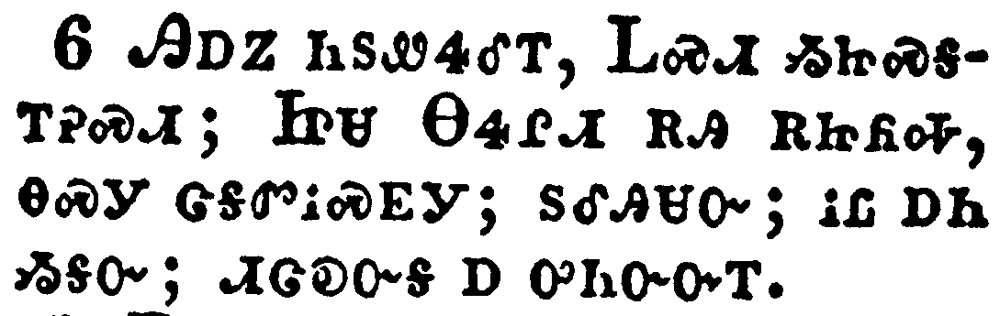</a></td>
</tr>
<tr class="even">
<td>And he saith unto them, Be not affrighted: Ye seek Jesus of Nazareth, which was crucified: he is risen; he is not here: behold the place where they laid him.</td>
</tr>
<tr class="odd">
<td>ᎯᎠᏃ ᏂᏚᏪᏎᎴᎢ, ᏞᏍᏗ ᏱᏥᏍᎦᎢᎮᏍᏗ; ᏥᏌ ᎾᏎᎵᏗ ᎡᎯ ᎡᏥᏲᎭ, ᎾᏍᎩ ᏣᎦᏛᎥᏍᎬᎩ; ᏚᎴᎯᏌᏅ; ᎥᏝ ᎠᏂ ᏱᎦᏅ; ᏗᏣᎧᏅᎦ Ꭰ ᎤᏂᏅᏅᎢ.</td>
</tr>
<tr class="even">
<td>Hi-a-no ni-du-we-se-le-i, Tle-s-di yi-tsi-s-ga-i-he-s-di; Tsi-sa Na-se-li-di e-hi e-tsi-yo-ha, na-s-gi tsa-ga-dv-v-s-gv-gi; du-le-hi-sa-nv; v-tla a-ni yi-ga-nv; di-tsa-ka-nv-ga a u-ni-nv-nv-i.</td>
</tr>
</tbody>
</table>

<table>
<tbody>
<tr class="odd">
<td><a href="021607.png">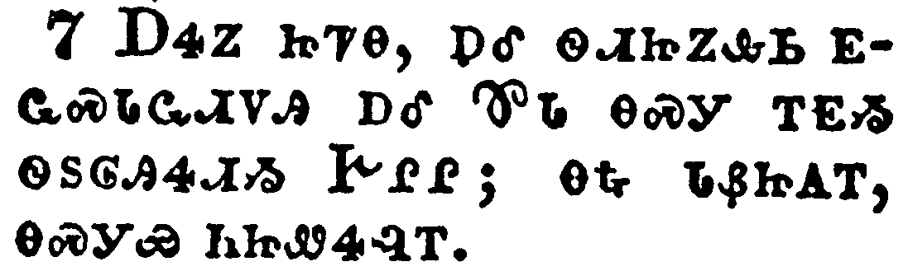</a></td>
</tr>
<tr class="even">
<td>But go your way, tell his disciples and Peter that he goeth before you into Galilee: there shall ye see him, as he said unto you.</td>
</tr>
<tr class="odd">
<td>ᎠᏎᏃ ᏥᏤᎾ, ᎠᎴ ᏫᏗᏥᏃᎲᏏ ᎬᏩᏍᏓᏩᏗᏙᎯ ᎠᎴ ᏈᏓ ᎾᏍᎩ ᎢᎬᏱ ᏫᏚᎶᎯᏎᏗᏱ ᎨᎵᎵ; ᎾᎿᎭᏓᏰᏥᎪᎢ, ᎾᏍᎩᏯ ᏂᏥᏪᏎᎸᎢ.</td>
</tr>
<tr class="even">
<td>A-se-no tsi-tse-na, a-le wi-di-tsi-no-hv-si gv-wa-s-da-wa-di-do-hi a-le Qui-da na-s-gi i-gv-yi wi-du-lo-hi-se-di-yi Ge-li-li; na-hna da-ye-tsi-go-i, na-s-gi-ya ni-tsi-we-se-lv-i.</td>
</tr>
</tbody>
</table>

<table>
<tbody>
<tr class="odd">
<td><a href="021608.png">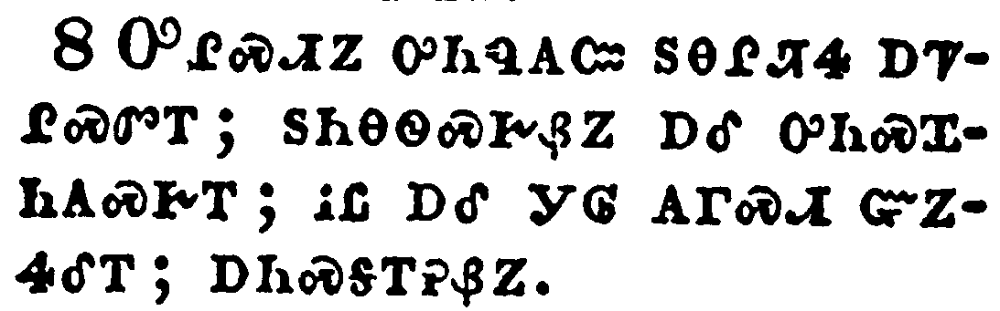</a></td>
</tr>
<tr class="even">
<td>And they went out quickly, and fled from the sepulchre; for they trembled and were amazed: neither said they any thing to any man; for they were afraid.</td>
</tr>
<tr class="odd">
<td>ᎤᎵᏍᏗᏃ ᎤᏂᏄᎪᏨ ᏚᎾᎵᏖᏎ ᎠᏤᎵᏍᏛᎢ; ᏚᏂᎾᏫᏍᎨᏰᏃ ᎠᎴ ᎤᏂᏍᏆᏂᎪᏍᎨᎢ; ᎥᏝ ᎠᎴ ᎩᎶ ᎪᎱᏍᏗ ᏳᏃᏎᎴᎢ; ᎠᏂᏍᎦᎢᎮᏰᏃ.</td>
</tr>
<tr class="even">
<td>U-li-s-di-no u-ni-nu-go-tsv du-na-li-te-se a-tse-li-s-dv-i; du-ni-na-wi-s-ge-ye-no a-le u-ni-s-qua-ni-go-s-ge-i; v-tla a-le gi-lo go-hu-s-di yu-no-se-le-i; a-ni-s-ga-i-he-ye-no.</td>
</tr>
</tbody>
</table>

<table>
<tbody>
<tr class="odd">
<td><a href="021609.png">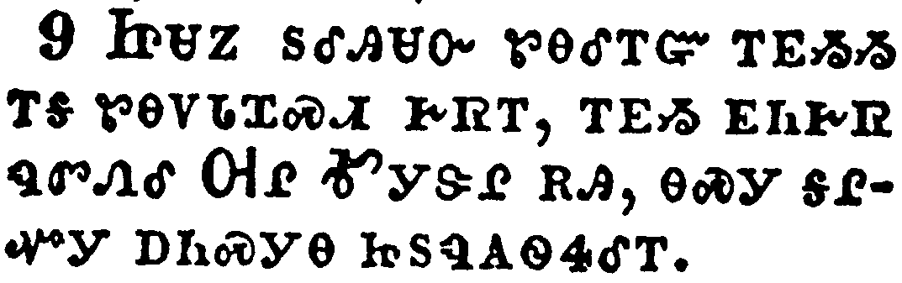</a></td>
</tr>
<tr class="even">
<td>Now when Jesus was risen early the first day of the week, he appeared first to Mary Magdalene, out of whom he had cast seven devils.</td>
</tr>
<tr class="odd">
<td>ᏥᏌᏃ ᏚᎴᎯᏌᏅ ᏑᎾᎴᎢᏳ ᎢᎬᏱᏱ ᎢᎦ ᏑᎾᏙᏓᏆᏍᏗ ᎨᏒᎢ, ᎢᎬᏱ ᎬᏂᎨᏒ ᏄᏛᏁᎴ ᎺᎵ ᎹᎩᏕᎵ ᎡᎯ, ᎾᏍᎩ ᎦᎵᏉᎩ ᎠᏂᏍᎩᎾ ᏥᏚᏄᎪᏫᏎᎴᎢ.</td>
</tr>
<tr class="even">
<td>Tsi-sa-no du-le-hi-sa-nv su-na-le-i-yu i-gv-yi-yi i-ga su-na-do-da-qua-s-di ge-sv-i, i-gv-yi gv-ni-ge-sv nu-dv-ne-le Me-li Ma-gi-de-li e-hi, na-s-gi ga-li-quo-gi a-ni-s-gi-na tsi-du-nu-go-wi-se-le-i.</td>
</tr>
</tbody>
</table>

<table>
<tbody>
<tr class="odd">
<td><a href="021610.png">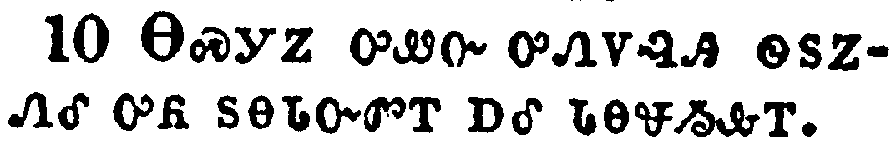</a></td>
</tr>
<tr class="even">
<td>And she went and told them that had been with him, as they mourned and wept.</td>
</tr>
<tr class="odd">
<td>ᎾᏍᎩᏃ ᎤᏪᏅ ᎤᏁᏙᎸᎯ ᏫᏚᏃᏁᎴ ᎤᏲ ᏚᎾᏓᏅᏛᎢ ᎠᎴ ᏓᎾᏠᏱᎲᎢ.</td>
</tr>
<tr class="even">
<td>Na-s-gi-no u-we-nv u-ne-do-lv-hi wi-du-no-ne-le u-yo du-na-da-nv-dv-i a-le da-na-tlo-yi-hv-i.</td>
</tr>
</tbody>
</table>

<table>
<tbody>
<tr class="odd">
<td><a href="021611.png">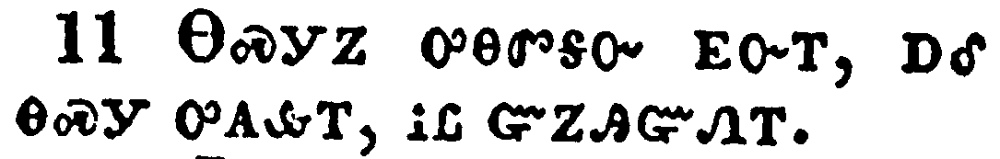</a></td>
</tr>
<tr class="even">
<td>And they, when they had heard that he was alive, and had been seen of her, believed not.</td>
</tr>
<tr class="odd">
<td>ᎾᏍᎩᏃ ᎤᎾᏛᎦᏅ ᎬᏅᎢ, ᎠᎴ ᎾᏍᎩ ᎤᎪᎲᎢ, ᎥᏝ ᏳᏃᎯᏳᏁᎢ.</td>
</tr>
<tr class="even">
<td>Na-s-gi-no u-na-dv-ga-nv gv-nv-i, a-le na-s-gi u-go-hv-i, v-tla yu-no-hi-yu-ne-i.</td>
</tr>
</tbody>
</table>

<table>
<tbody>
<tr class="odd">
<td><a href="021612.png">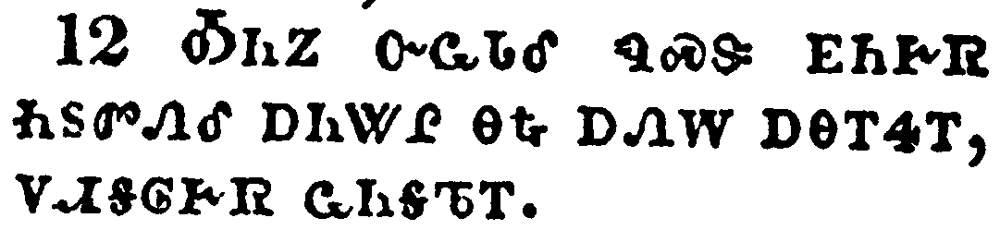</a></td>
</tr>
<tr class="even">
<td>After that he appeared in another form unto two of them, as they walked, and went into the country.</td>
</tr>
<tr class="odd">
<td>ᎣᏂᏃ ᏅᏩᏓᎴ ᏄᏍᏕ ᎬᏂᎨᏒ ᏂᏚᏛᏁᎴ ᎠᏂᏔᎵ ᎾᎿᎭᎠᏁᎳ ᎠᎾᎢᏎᎢ, ᏙᏗᎦᎶᎨᏒ ᏩᏂᎦᏖᎢ.</td>
</tr>
<tr class="even">
<td>O-ni-no nv-wa-da-le nu-s-de gv-ni-ge-sv ni-du-dv-ne-le a-ni-ta-li na-hna a-ne-la a-na-i-se-i, do-di-ga-lo-ge-sv wa-ni-ga-te-i.</td>
</tr>
</tbody>
</table>

<table>
<tbody>
<tr class="odd">
<td><a href="021613.png">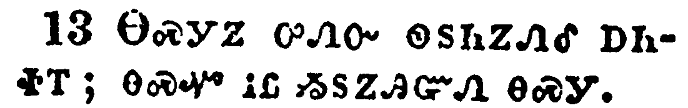</a></td>
</tr>
<tr class="even">
<td>And they went and told it unto the residue: neither believed they them.</td>
</tr>
<tr class="odd">
<td>ᎾᏍᎩᏃ ᎤᏁᏅ ᏫᏚᏂᏃᏁᎴ ᎠᏂᏐᎢ; ᎾᏍᏉ ᎥᏝ ᏱᏚᏃᎯᏳᏁ ᎾᏍᎩ.</td>
</tr>
<tr class="even">
<td>Na-s-gi-no u-ne-nv wi-du-ni-no-ne-le a-ni-so-i; na-s-quo v-tla yi-du-no-hi-yu-ne na-s-gi.</td>
</tr>
</tbody>
</table>

<table>
<tbody>
<tr class="odd">
<td><a href="021614.png">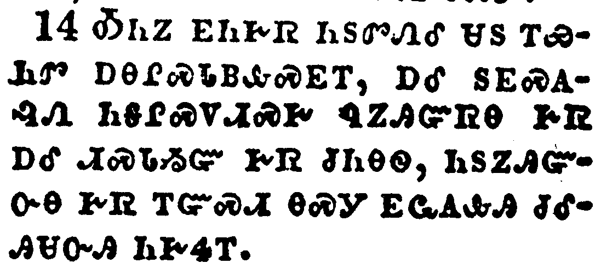</a></td>
</tr>
<tr class="even">
<td>Afterward he appeared unto the eleven as they sat at meat, and upbraided them with their unbelief and hardness of heart, because they believed not them which had seen him after he was risen.</td>
</tr>
<tr class="odd">
<td>ᎣᏂᏃ ᎬᏂᎨᏒ ᏂᏚᏛᏁᎴ ᏌᏚ ᎢᏯᏂᏛ ᎠᎾᎵᏍᏓᏴᎲᏍᎬᎢ, ᎠᎴ ᏚᎬᏍᎪᎸᏁ ᏂᎦᎵᏍᏙᏗᏍᎨ ᏄᏃᎯᏳᏒᎾ ᎨᏒ ᎠᎴ ᏗᏍᏓᏱᏳ ᎨᏒ ᏧᏂᎾᏫ, ᏂᏚᏃᎯᏳᏅᎾ ᎨᏒ ᎢᏳᏍᏗ ᎾᏍᎩ ᎬᏩᎪᎲᎯ ᏧᎴᎯᏌᏅᎯ ᏂᎨᏎᎢ.</td>
</tr>
<tr class="even">
<td>O-ni-no gv-ni-ge-sv ni-du-dv-ne-le sa-du i-ya-ni-dv a-na-li-s-da-yv-hv-s-gv-i, a-le du-gv-s-go-lv-ne ni-ga-li-s-do-di-s-ge nu-no-hi-yu-sv-na ge-sv a-le di-s-da-yi-yu ge-sv tsu-ni-na-wi, ni-du-no-hi-yu-nv-na ge-sv i-yu-s-di na-s-gi gv-wa-go-hv-hi tsu-le-hi-sa-nv-hi ni-ge-se-i.</td>
</tr>
</tbody>
</table>

<table>
<tbody>
<tr class="odd">
<td><a href="021615.png">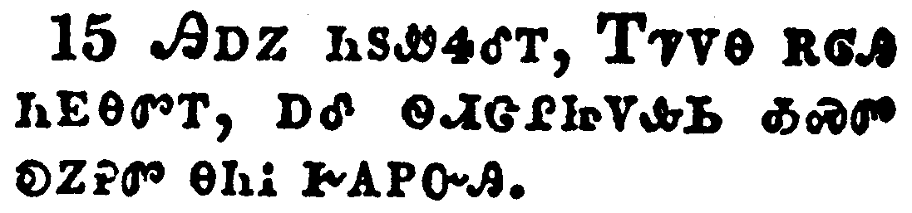</a></td>
</tr>
<tr class="even">
<td>And he said unto them, Go ye into all the world, and preach the gospel to every creature.</td>
</tr>
<tr class="odd">
<td>ᎯᎠᏃ ᏂᏚᏪᏎᎴᎢ, ᎢᏤᏙᎾ ᎡᎶᎯ ᏂᎬᎾᏛᎢ, ᎠᎴ ᏫᏗᏣᎵᏥᏙᎲᏏ ᎣᏍᏛ ᎧᏃᎮᏛ ᎾᏂᎥ ᎨᎪᏢᏅᎯ.</td>
</tr>
<tr class="even">
<td>Hi-a-no ni-du-we-se-le-i, I-tse-do-na e-lo-hi ni-gv-na-dv-i, a-le wi-di-tsa-li-tsi-do-hv-si o-s-dv ka-no-he-dv na-ni-v ge-go-tlv-nv-hi.</td>
</tr>
</tbody>
</table>

<table>
<tbody>
<tr class="odd">
<td><a href="021616.png">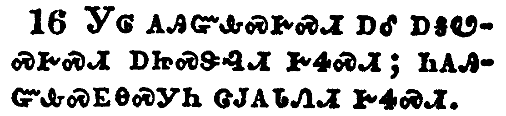</a></td>
</tr>
<tr class="even">
<td>He that believeth and is baptized shall be saved; but he that believeth not shall be damned.</td>
</tr>
<tr class="odd">
<td>ᎩᎶ ᎪᎯᏳᎲᏍᎨᏍᏗ ᎠᎴ ᎠᎦᏬᏍᎨᏍᏗ ᎠᏥᏍᏕᎸᏗ ᎨᏎᏍᏗ; ᏂᎪᎯᏳᎲᏍᎬᎾᏍᎩᏂ ᏣᎫᎪᏓᏁᏗ ᎨᏎᏍᏗ.</td>
</tr>
<tr class="even">
<td>Gi-lo go-hi-yu-hv-s-ge-s-di a-le a-ga-wo-s-ge-s-di a-tsi-s-de-lv-di ge-se-s-di; ni-go-hi-yu-hv-s-gv-na-s-gi-ni tsa-gu-go-da-ne-di ge-se-s-di.</td>
</tr>
</tbody>
</table>

<table>
<tbody>
<tr class="odd">
<td><a href="021617.png">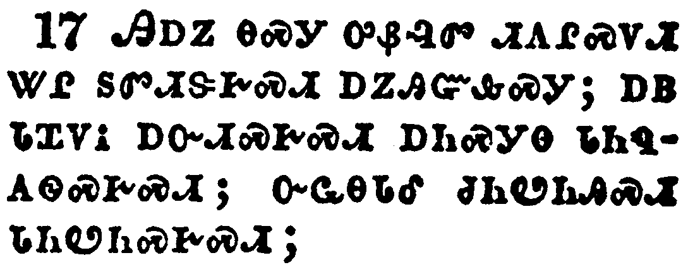</a></td>
</tr>
<tr class="even">
<td>And these signs shall follow them that believe; In my name shall they cast out devils; they shall speak with new tongues;</td>
</tr>
<tr class="odd">
<td>ᎯᎠᏃ ᎾᏍᎩ ᎤᏰᎸᏛ ᏗᎪᎵᏍᏙᏗ ᏔᎵ ᏚᏛᏗᏕᎨᏍᏗ ᎠᏃᎯᏳᎲᏍᎩ; ᎠᏴ ᏓᏆᏙᎥ ᎠᏅᏗᏍᎨᏍᏗ ᎠᏂᏍᎩᎾ ᏓᏂᏄᎪᏫᏍᎨᏍᏗ; ᏅᏩᎾᏓᎴ ᏧᏂᏬᏂᎯᏍᏗ ᏓᏂᏬᏂᏍᎨᏍᏗ;</td>
</tr>
<tr class="even">
<td>Hi-a-no na-s-gi u-ye-lv-dv di-go-li-s-do-di ta-li du-dv-di-de-ge-s-di a-no-hi-yu-hv-s-gi; a-yv da-qua-do-v a-nv-di-s-ge-s-di a-ni-s-gi-na da-ni-nu-go-wi-s-ge-s-di; nv-wa-na-da-le tsu-ni-wo-ni-hi-s-di da-ni-wo-ni-s-ge-s-di;</td>
</tr>
</tbody>
</table>

<table>
<tbody>
<tr class="odd">
<td><a href="021618.png">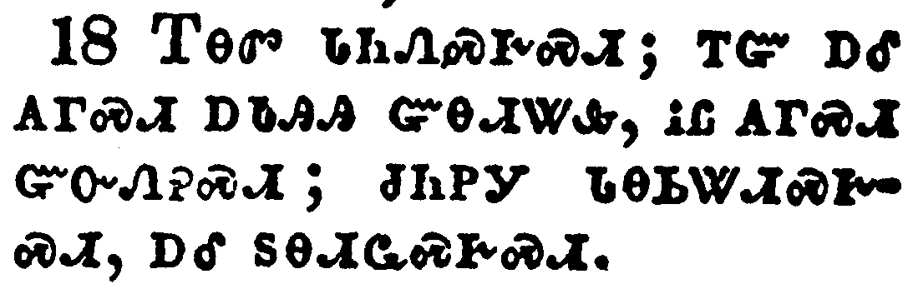</a></td>
</tr>
<tr class="even">
<td>They shall take up serpents; and if they drink any deadly thing, it shall not hurt them; they shall lay hands on the sick, and they shall recover.</td>
</tr>
<tr class="odd">
<td>ᎢᎾᏛ ᏓᏂᏁᏍᎨᏍᏗ; ᎢᏳ ᎠᎴ ᎪᎱᏍᏗ ᎠᏓᎯᎯ ᏳᎾᏗᏔᎲ, ᎥᏝ ᎪᎱᏍᏗ ᏳᏅᏁᎮᏍᏗ; ᏧᏂᏢᎩ ᏓᎾᏏᏔᏗᏍᎨᏍᏗ, ᎠᎴ ᏚᎾᏗᏩᏍᎨᏍᏗ.</td>
</tr>
<tr class="even">
<td>I-na-dv da-ni-ne-s-ge-s-di; i-yu a-le go-hu-s-di a-da-hi-hi yu-na-di-ta-hv, v-tla go-hu-s-di yu-nv-ne-he-s-di; tsu-ni-tlv-gi da-na-si-ta-di-s-ge-s-di, a-le du-na-di-wa-s-ge-s-di.</td>
</tr>
</tbody>
</table>

<table>
<tbody>
<tr class="odd">
<td><a href="021619.png">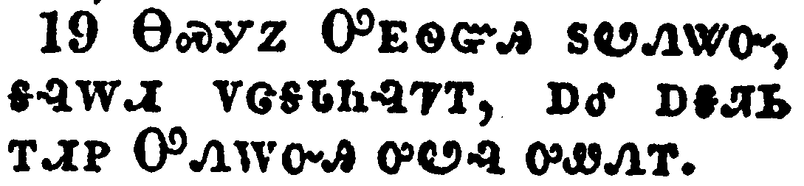</a></td>
</tr>
<tr class="even">
<td>So then after the Lord had spoken unto them, he was received up into heaven, and sat on the right hand of God.</td>
</tr>
<tr class="odd">
<td>ᎾᏍᎩᏃ ᎤᎬᏫᏳᎯ ᏚᏬᏁᏔᏅ, ᎦᎸᎳᏗ ᏙᏣᏕᏓᏂᎸᏤᎢ, ᎠᎴ ᎠᎦᏘᏏ ᎢᏗᏢ ᎤᏁᎳᏅᎯ ᎤᏬᎸ ᎤᏪᏁᎢ.</td>
</tr>
<tr class="even">
<td>Na-s-gi-no U-gv-wi-yu-hi du-wo-ne-ta-nv, ga-lv-la-di do-tsa-de-da-ni-lv-tse-i, a-le a-ga-ti-si i-di-tlv U-ne-la-nv-hi u-wo-lv u-we-ne-i.</td>
</tr>
</tbody>
</table>

<table>
<tbody>
<tr class="odd">
<td></td>
</tr>
<tr class="even">
<td>And they went forth, and preached everywhere, the Lord working with them, and confirming the word with signs following. Amen.</td>
</tr>
<tr class="odd">
<td>ᎤᏁᏅᏎᏃ ᎠᎴ ᏂᎬᎾᏛ ᎤᎾᎵᏥᏙᏂᏙᎴᎢ, ᎤᎬᏫᏳᎯ ᏔᎵ ᎤᏛᏗᏕᎨ ᏚᏂᎸᏫᏍᏓᏁᎲᎢ, ᎠᎴ ᎠᏂᏁᎬ ᎠᏍᏓᏱᏗᏍᏗᏍᎨ ᎤᏰᎸᏛ ᎤᎵᏠᏯᏍᏗᏕᎬᎢ. ᎡᎺᏅ.</td>
</tr>
<tr class="even">
<td>U-ne-nv-se-no a-le ni-gv-na-dv u-na-li-tsi-do-ni-do-le-i, U-gv-wi-yu-hi ta-li u-dv-di-de-ge du-ni-lv-wi-s-da-ne-hv-i, a-le a-ni-ne-gv a-s-da-yi-di-s-di-s-ge u-ye-lv-dv u-li-tlo-ya-s-di-de-gv-i. E-me-nv.</td>
</tr>
</tbody>
</table>

